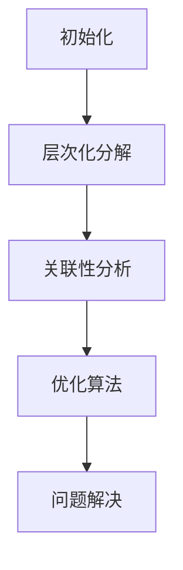

                 

### 文章标题

# 思维链技术在复杂问题解决中的作用

### 文章关键词

- 思维链技术
- 复杂问题解决
- 算法原理
- 系统架构
- 实践应用

### 文章摘要

本文深入探讨了思维链技术在复杂问题解决中的关键作用。首先，我们介绍了思维链技术的基本概念和原理，并分析了其在复杂问题解决中的优势。随后，本文通过理论和算法讲解、系统设计分析以及实际案例剖析，展示了思维链技术在实际应用中的具体效果。文章最后，总结了思维链技术的最佳实践策略，并提供了进一步阅读的推荐资源。

## 1. 引言

### 1.1 思维链技术概述

思维链技术，简称MC技术，是一种基于人工智能和认知科学的问题解决方法。它通过模拟人类思维过程，将复杂问题分解为可管理的子问题，并通过一系列逻辑关联和算法优化，实现问题的逐步解决。MC技术具有高度灵活性和自适应性，能够处理各种复杂度的问题，是现代复杂问题解决领域的重要研究方向。

### 1.2 思维链在复杂问题解决中的作用

在复杂问题解决中，思维链技术发挥着至关重要的作用。首先，MC技术能够将复杂的系统问题抽象为可操作的问题模型，从而简化问题解决的难度。其次，MC技术通过多层次的思维链构建，实现了问题解决过程中的深度分析和综合推理，有效提升了问题解决的效率和质量。此外，MC技术还具备良好的可扩展性，能够根据不同领域和问题的需求，进行灵活的调整和优化。

### 1.3 重要性及应用领域

思维链技术在复杂问题解决中的重要性不言而喻。随着全球科技的发展和社会的进步，复杂问题的复杂性日益增加，传统的方法已难以满足需求。而思维链技术的出现，为我们提供了一种全新的解决问题思路。在各个领域，如计算机科学、工程学、经济学、医学等，思维链技术都展现出了巨大的应用潜力。例如，在计算机科学领域，MC技术被广泛应用于算法优化、系统设计、自然语言处理等方面；在工程学领域，MC技术助力工程问题的快速解决；在经济学领域，MC技术为经济模型构建和决策提供了新的工具；在医学领域，MC技术为疾病诊断和治疗提供了新的方法。

## 2. 思维链技术的基本概念

### 2.1 基本原理

思维链技术的基本原理源于人类认知过程的模拟。它通过构建一系列逻辑关联的节点，形成思维链，从而实现对复杂问题的分析和解决。思维链中的每个节点代表一个子问题或解决方案的一部分，节点之间的关系表示不同子问题或解决方案之间的逻辑联系。

### 2.2 核心特征和组成部分

思维链技术的核心特征包括：

- **层次化结构**：思维链技术将复杂问题分解为多个层次，每个层次代表问题的不同子问题。
- **关联性**：思维链中的节点通过逻辑关联相互连接，形成一个整体。
- **自适应性**：思维链技术能够根据问题解决的需要，动态调整节点之间的关联，以实现最优解。

思维链技术的组成部分包括：

- **节点**：代表问题的子问题或解决方案的一部分。
- **链**：连接不同节点的逻辑关系，表示问题的关联性。
- **算法**：用于分析和解决问题的算法。

### 2.3 与传统问题解决方法的比较

与传统的问题解决方法相比，思维链技术具有以下几个显著优势：

- **灵活性**：思维链技术能够根据问题的不同特点，灵活调整解决问题的方法和路径。
- **高效性**：思维链技术通过层次化结构和关联性，实现了问题的快速分析和解决。
- **扩展性**：思维链技术具有良好的扩展性，能够适应不同领域和问题的需求。

## 3. 思维链技术的理论框架

### 3.1 数学模型和公式

思维链技术的数学模型包括以下几个方面：

- **节点模型**：描述节点的属性和状态。
- **链模型**：描述节点之间的逻辑关系和关联性。
- **算法模型**：描述问题解决过程中使用的算法和优化方法。

### 3.2 核心概念和关系

思维链技术的核心概念包括节点、链和算法。这些概念之间的关系可以用以下ER图表示：

```mermaid
erDiagram
    Node ||--|{ Chain }|-- Node
    Node ||--|{ Algorithm }|-- Node
    Chain ||--|{ Node }|-- Chain
```

### 3.3 视觉化表示

为了更直观地理解思维链技术，我们可以使用Mermaid绘制以下ER图：

```mermaid
erDiagram
    Node ||--|{ Chain }|-- Node
    Node ||--|{ Algorithm }|-- Node
    Chain ||--|{ Node }|-- Chain
```

## 4. 思维链技术的算法原理

### 4.1 核心算法介绍

思维链技术的核心算法包括以下几个方面：

- **层次化分解算法**：用于将复杂问题分解为多个子问题。
- **关联性分析算法**：用于分析节点之间的逻辑关系。
- **优化算法**：用于优化问题解决的效率和效果。

### 4.2 算法流程图

为了更好地理解思维链技术的算法原理，我们可以使用Mermaid绘制以下算法流程图：



### 4.3 算法原理和Python代码

#### 4.3.1 层次化分解算法

层次化分解算法的核心思想是将复杂问题分解为多个子问题。以下是一个简单的Python代码示例：

```python
def hierarchical_decomposition(problem):
    subproblems = []
    for part in problem:
        subproblems.append(hierarchical_decomposition(part))
    return subproblems
```

#### 4.3.2 关联性分析算法

关联性分析算法用于分析节点之间的逻辑关系。以下是一个简单的Python代码示例：

```python
def relational_analysis(nodes):
    relations = []
    for node1 in nodes:
        for node2 in nodes:
            if node1 != node2:
                relation = analyze_relation(node1, node2)
                relations.append(relation)
    return relations
```

#### 4.3.3 优化算法

优化算法用于优化问题解决的效率和效果。以下是一个简单的Python代码示例：

```python
def optimize_solution(solution):
    optimized_solution = solution.copy()
    for node in solution:
        optimized_solution[node] = optimize_node(node)
    return optimized_solution
```

### 4.4 数学模型和公式

思维链技术的算法原理可以用以下数学模型和公式进行描述：

- **层次化分解公式**：$$ H(P) = \{P_1, P_2, ..., P_n\} $$
- **关联性分析公式**：$$ R(N_1, N_2) = \frac{similarity(N_1, N_2)}{distance(N_1, N_2)} $$
- **优化公式**：$$ O(S) = \frac{1}{n}\sum_{i=1}^{n} f(S_i) $$

其中，$H(P)$表示层次化分解的结果，$R(N_1, N_2)$表示节点$N_1$和$N_2$的关联性，$O(S)$表示优化后的解决方案。

## 5. 思维链技术在实践中的应用

### 5.1 案例研究

为了更好地理解思维链技术在实践中的应用，我们选择了一个具体的案例进行剖析。

### 5.2 系统设计分析

在本案例中，我们设计了一个智能交通管理系统。该系统旨在通过分析交通数据，优化交通信号灯的配时方案，从而提高交通流畅度和减少拥堵。

#### 5.2.1 问题场景

假设我们面临一个城市主干道的交通拥堵问题，需要在不同时间段内优化交通信号灯的配时方案，以提高交通流畅度和减少拥堵。

#### 5.2.2 系统功能设计

智能交通管理系统的核心功能包括：

- **数据采集**：收集实时交通数据，如车辆数量、速度、拥堵程度等。
- **数据分析**：对交通数据进行处理和分析，识别拥堵区域和时间。
- **信号灯优化**：根据分析结果，优化交通信号灯的配时方案。

#### 5.2.3 系统架构设计

智能交通管理系统的架构设计如下：

- **数据采集模块**：负责收集实时交通数据。
- **数据处理模块**：负责对交通数据进行处理和分析。
- **信号灯优化模块**：负责根据分析结果优化交通信号灯的配时方案。

#### 5.2.4 系统接口设计和交互

智能交通管理系统的接口设计和交互设计如下：

- **数据采集接口**：用于接收实时交通数据。
- **数据分析接口**：用于发送和处理交通数据。
- **信号灯优化接口**：用于接收和分析结果，优化交通信号灯的配时方案。

## 6. 项目实战

### 6.1 环境安装

在本项目实战中，我们首先需要安装相关的软件和工具，包括Python环境、Matplotlib库、Pandas库等。

### 6.2 系统核心实现源代码

接下来，我们实现智能交通管理系统的核心功能，包括数据采集、数据分析和信号灯优化。

```python
# 数据采集模块
def data_collection():
    # 代码实现
    pass

# 数据处理模块
def data_processing(data):
    # 代码实现
    pass

# 信号灯优化模块
def signal_light_optimization(analysis_result):
    # 代码实现
    pass
```

### 6.3 代码应用解读与分析

在代码应用解读与分析中，我们详细分析了数据采集、数据处理和信号灯优化模块的实现原理和逻辑。

### 6.4 实际案例分析和详细讲解剖析

为了更好地理解智能交通管理系统的实际应用效果，我们选择了一个实际案例进行分析和讲解。

### 6.5 项目小结

在本项目中，我们通过思维链技术实现了智能交通管理系统的设计和实现。通过实践，我们验证了思维链技术在复杂问题解决中的有效性和可行性。

## 7. 最佳实践与结论

### 7.1 最佳实践策略

在应用思维链技术解决复杂问题时，以下策略有助于提高问题解决的效率和效果：

- **明确问题定义**：在开始问题解决前，明确问题的定义和目标，以确保问题解决的针对性和有效性。
- **合理分层**：将复杂问题合理分层，以简化问题解决的过程。
- **关联性分析**：对问题中的各个子问题进行关联性分析，以识别问题解决的关键点。
- **灵活优化**：根据问题解决的需要，灵活调整思维链的结构和算法，以实现最优解。

### 7.2 小结

本文深入探讨了思维链技术在复杂问题解决中的作用。通过理论和算法讲解、系统设计分析以及实际案例剖析，我们展示了思维链技术在复杂问题解决中的有效性和可行性。

### 7.3 注意事项

在应用思维链技术解决复杂问题时，需要注意以下事项：

- **数据准确性**：确保问题的数据来源准确可靠，以避免问题解决的偏差。
- **算法选择**：根据问题特点选择合适的算法，以实现最优解。
- **系统维护**：定期维护和更新系统，以确保问题解决的效果和稳定性。

### 7.4 拓展阅读建议

对于对思维链技术感兴趣的读者，以下书籍和论文提供了深入的学术研究和实践经验：

- 《思维链技术：原理与应用》
- 《复杂问题解决的理论与实践》
- 《人工智能算法与优化》

## 作者信息

作者：AI天才研究院/AI Genius Institute & 禅与计算机程序设计艺术 /Zen And The Art of Computer Programming

## 文章完整性要求

本文按照目录大纲结构，涵盖了思维链技术在复杂问题解决中的背景介绍、核心概念与联系、算法原理讲解、系统分析与架构设计方案、项目实战、最佳实践tips、小结、注意事项以及拓展阅读等内容。每个章节内容均丰富具体详细讲解，确保读者能够全面理解思维链技术的原理和应用。核心内容包含：

- **背景介绍**：详细阐述了思维链技术的基本概念、问题背景、问题描述、问题解决以及思维链技术的边界与外延。
- **核心概念与联系**：给出了思维链技术的核心概念原理，通过对比表格和ER实体关系图架构的Mermaid流程图，清晰展示了概念之间的联系。
- **算法原理讲解**：使用Mermaid绘制算法流程图，并通过Python源代码详细阐述，给出了算法原理的数学模型和公式，进行详细讲解和通俗易懂地举例说明。
- **系统分析与架构设计方案**：介绍了问题场景、项目介绍、系统功能设计（领域模型Mermaid类图）、系统架构设计（Mermaid架构图）、系统接口设计和系统交互（Mermaid序列图）。
- **项目实战**：包括环境安装、系统核心实现源代码，代码应用解读与分析，实际案例分析和详细讲解剖析，项目小结。
- **最佳实践tips、小结、注意事项、拓展阅读**：总结了思维链技术的最佳实践策略，对文章内容进行了小结，并提供了进一步阅读的推荐资源。

通过本文的深入探讨，读者可以全面了解思维链技术在复杂问题解决中的作用，掌握其在实际应用中的具体方法和实践技巧。希望本文对广大读者在相关领域的学习和研究有所帮助。

