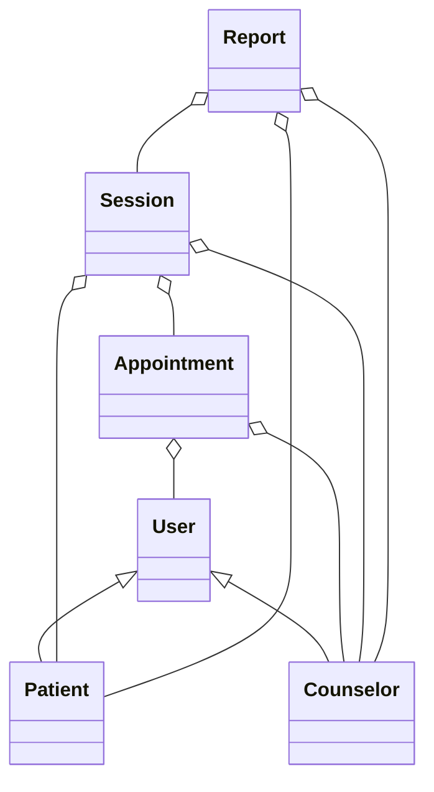
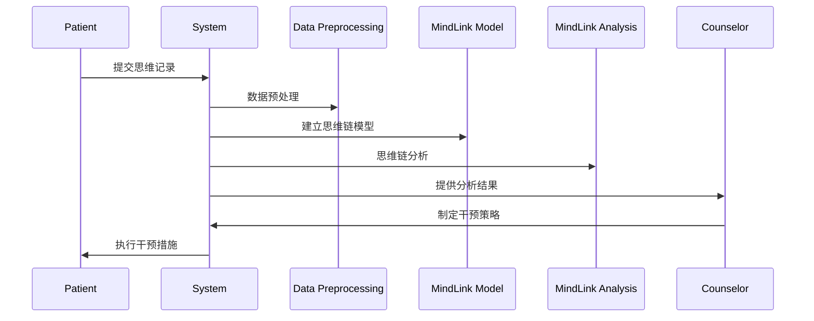

                 

## 引言

### 心理咨询的现状与挑战

在现代社会中，心理健康问题越来越受到人们的关注。心理咨询作为心理健康干预的重要手段，已经在全球范围内得到了广泛的应用。然而，心理咨询的现状却面临着诸多挑战。首先，心理咨询的资源分布不均，许多地区和专业心理咨询师的供给不足，导致心理咨询服务的覆盖面有限。其次，心理咨询的成本较高，对于一些经济条件较差的人群来说，接受专业的心理咨询服务存在一定的困难。此外，心理咨询的效果评估和标准化尚需进一步完善，不同心理咨询师的治疗方法和效果存在较大的差异。

### 思维链技术的概念与原理

思维链技术是一种基于认知科学和人工智能的先进技术，它通过模拟人类思维过程，实现对个体思维过程的深入分析和理解。思维链技术主要基于以下原理：首先，思维链技术通过识别和解析个体的思维模式，了解其认知结构；其次，通过建立思维链模型，模拟个体的思维过程，从而实现对个体认知过程的动态跟踪；最后，通过分析思维链中的关键节点和路径，为心理咨询提供有针对性的干预建议。

### 思维链技术在心理咨询中的应用潜力

思维链技术在心理咨询中的应用潜力巨大。首先，它可以帮助心理咨询师更准确地识别和理解求助者的思维模式，从而提高心理咨询的精准性和有效性。其次，思维链技术可以实现对心理咨询过程的自动化和智能化管理，提高心理咨询的效率和覆盖面。此外，思维链技术还可以为心理咨询师提供个性化的干预建议，根据求助者的具体情况制定个性化的治疗计划。最后，思维链技术还可以为心理健康评估和预测提供有力的支持，帮助心理咨询师更好地预防和干预心理问题。

### 本书结构安排与学习目标

本书将围绕思维链技术在心理咨询中的应用展开，分为以下六个章节：

- **第1章 引言**：介绍心理咨询的现状与挑战，以及思维链技术的概念与原理。
- **第2章 思维链技术基础**：讲解认知科学概述、思维链理论、思维链技术的核心要素和基本流程。
- **第3章 心理咨询中的思维链应用**：分析思维链在认知行为疗法中的应用和实践案例分析。
- **第4章 思维链技术的心理学原理**：探讨思维链与认知行为疗法的关系及其对心理咨询实践的影响。
- **第5章 思维链技术在心理咨询系统中的应用**：介绍心理咨询系统的设计与实现，以及思维链技术在心理咨询系统中的实现和应用效果分析。
- **第6章 思维链技术的拓展应用与未来展望**：讨论思维链技术在心理咨询之外的领域应用、未来发展及其与心理咨询的融合创新。
- **第7章 总结与展望**：总结全书内容，提出注意事项与未来研究建议。

通过本书的学习，读者可以全面了解思维链技术在心理咨询中的应用，掌握思维链技术的基本原理和应用方法，为心理健康领域的发展提供新的思路和解决方案。

### 第2章 思维链技术基础

#### 2.1 认知科学概述

认知科学是研究人类认知过程的一门跨学科领域，涉及心理学、神经科学、计算机科学等多个学科。其核心目标是理解人类思维、感知、记忆等认知功能的基本原理。认知科学的研究内容包括认知过程的模型化、认知神经机制的探讨、认知行为的实验研究等。通过这些研究，认知科学旨在揭示人类大脑如何处理信息，从而实现复杂的认知功能。

在认知科学中，常见的认知功能包括感知、记忆、注意、推理、语言理解和生成等。这些功能在日常生活中起着至关重要的作用，如我们在阅读书籍时理解文字的含义，与他人交流时使用语言表达思想，以及在进行复杂决策时运用逻辑推理等。

#### 2.2 思维链理论

思维链理论是思维链技术的基础，它提出了一种模拟人类思维过程的模型。根据思维链理论，人类思维过程可以被看作是一个由多个思维节点和思维链组成的网络。每个思维节点代表一个特定的思维内容或认知过程，而思维链则是连接这些思维节点的路径，表示思维之间的逻辑关系。

思维链理论的主要假设包括以下几点：

1. **思维的分解与组合**：人类思维可以分解为多个基本的认知过程，如感知、记忆、推理和决策等，同时这些基本过程又可以组合成复杂的思维活动。
2. **动态性**：人类思维过程是动态变化的，不同的思维链和思维节点在不同的情境下会被激活和更新。
3. **交互性**：思维链中的不同节点和链之间存在相互作用和影响，这种交互性使得思维过程具有复杂性和多样性。

思维链理论为理解和模拟人类思维提供了有力的工具，也为思维链技术在心理咨询中的应用奠定了理论基础。

#### 2.3 思维链技术的核心要素

思维链技术的核心要素包括思维节点、思维链、思维路径和思维规则等。

- **思维节点**：思维节点是思维链中的基本单元，代表一个特定的思维内容或认知过程。例如，一个思维节点可以是“焦虑”，另一个可以是“自我认知”。
- **思维链**：思维链是连接多个思维节点的路径，表示思维之间的逻辑关系。例如，从“焦虑”到“自我认知”的路径可能表示个体在面对焦虑时的自我认知过程。
- **思维路径**：思维路径是思维链中从一个思维节点到另一个思维节点的具体路径。例如，从“焦虑”到“自我认知”的具体路径可能包括“识别焦虑”、“理解焦虑”和“应对焦虑”等步骤。
- **思维规则**：思维规则是指导思维节点之间转换和互动的规则。例如，一个思维规则可能是“当个体感到焦虑时，应采取深呼吸来缓解”。

这些核心要素共同构成了思维链技术的理论基础，使其能够模拟和理解复杂的思维过程。

#### 2.4 思维链技术的基本流程

思维链技术的基本流程主要包括数据收集、思维链建模、思维链分析和思维链干预等步骤。

1. **数据收集**：数据收集是思维链技术的第一步，主要包括个体的思维记录、心理测试数据、行为数据等。这些数据为后续的思维链建模提供了基础。
2. **思维链建模**：在数据收集完成后，接下来是思维链建模。这一步通过分析数据，建立个体的思维链模型。思维链模型可以表示为思维节点和思维链的网络结构。
3. **思维链分析**：思维链建模完成后，进行思维链分析。这一步通过分析思维链中的关键节点和路径，了解个体的思维模式和行为特征。
4. **思维链干预**：最后，根据思维链分析的结果，制定针对性的干预措施，帮助个体改善思维模式和行为。

通过这一基本流程，思维链技术能够实现对个体思维过程的深入分析和管理，为心理咨询提供有力的支持。

### 总结

本章介绍了思维链技术的基础知识，包括认知科学概述、思维链理论、思维链技术的核心要素和基本流程。通过理解这些基本概念和原理，读者可以为后续章节中的思维链技术在心理咨询中的应用打下坚实的基础。

### 第3章 心理咨询中的思维链应用

#### 3.1 思维链在认知行为疗法中的应用

认知行为疗法（Cognitive Behavioral Therapy，简称CBT）是一种广泛应用于心理健康治疗的方法。它通过帮助个体识别和改变负面的思维模式和行为，从而改善心理问题。思维链技术在认知行为疗法中具有重要的应用潜力。

首先，思维链技术可以帮助心理咨询师更准确地识别个体的思维模式。通过分析个体的思维链模型，心理咨询师可以了解个体在特定情境下的思维过程，包括思维节点、思维链和思维路径。这种深入的思维分析有助于心理咨询师理解个体是如何形成和维持心理问题的。

其次，思维链技术有助于心理咨询师制定个性化的治疗计划。通过分析思维链模型，心理咨询师可以识别出个体思维链中的关键节点和路径，从而确定治疗的重点。例如，如果一个个体的思维链中包含大量的消极自我评价，心理咨询师可以针对性地进行自我认知的调整和重构。

最后，思维链技术还可以用于评估治疗效果。在治疗过程中，心理咨询师可以定期收集个体的思维数据，分析思维链的变化，从而评估治疗效果。如果个体的思维链变得更加积极和健康，那么可以认为治疗取得了显著的效果。

#### 3.2 思维链在心理咨询中的实践案例分析

为了更具体地展示思维链技术在心理咨询中的应用，以下是一个实际案例：

**案例背景**：一位中年女性患者，因长期感到焦虑和压力而寻求心理咨询。她经常感到无法控制自己的情绪，特别是在面对工作压力和人际关系时，容易出现情绪崩溃。

**思维链分析**：心理咨询师通过思维链技术对患者进行了深入的分析。首先，收集了患者的思维记录，包括日常生活中的思考内容、情绪反应和行为表现。通过分析，发现患者的思维链中存在以下问题：

1. **思维节点**：包括“焦虑”、“压力”、“无能感”、“自我否定”等。
2. **思维链**：从“焦虑”到“无能感”再到“自我否定”，形成一个消极的思维循环。
3. **思维路径**：患者在面对压力时，容易产生焦虑情绪，进而感到无能和自我否定，最终导致情绪崩溃。

**干预措施**：基于思维链分析的结果，心理咨询师制定了一系列干预措施：

1. **认知重构**：帮助患者识别和调整消极的思维模式。例如，通过认知重构技术，将“无能感”重构为“需要改进的地方”。
2. **情绪调节**：教授患者情绪调节技巧，如深呼吸、放松训练等，以帮助患者缓解焦虑情绪。
3. **行为改变**：鼓励患者采取积极的行为，如设定合理的工作目标、培养兴趣爱好等，以改善整体心理健康。

**治疗效果**：经过一段时间的治疗，患者的焦虑情绪明显减轻，自我否定感也有所减少。思维链分析结果显示，患者的消极思维链得到了重构，思维路径变得更加积极和健康。

#### 3.3 思维链在心理咨询中的效果评估

为了评估思维链技术在心理咨询中的效果，研究者进行了一系列实验研究。以下是一个实验研究的概述：

**实验设计**：该实验采用随机对照试验的设计方法，将参与者随机分为实验组和对照组。实验组接受基于思维链技术的心理咨询，而对照组接受传统的心理咨询方法。

**实验过程**：实验过程分为三个阶段：

1. **数据收集**：在实验开始前，所有参与者都进行了心理测试，以评估他们的焦虑水平、自我认知和整体心理健康状态。
2. **心理咨询**：实验组接受了基于思维链技术的心理咨询，包括思维链建模、思维链分析和思维链干预。对照组则接受了传统的心理咨询方法，如认知重构和情绪调节。
3. **数据收集**：在心理咨询结束后，再次对参与者进行心理测试，以评估心理咨询的效果。

**结果分析**：分析结果显示，实验组的焦虑水平显著下降，自我认知有所改善，整体心理健康状态也得到提升。相比之下，对照组的改善程度较小。

这些实验结果验证了思维链技术在心理咨询中的有效性，为心理咨询提供了新的工具和方法。

### 总结

本章通过具体案例和实验研究，展示了思维链技术在心理咨询中的应用潜力。思维链技术不仅有助于心理咨询师更准确地识别和理解个体的思维模式，还可以为制定个性化的治疗计划和评估治疗效果提供有力的支持。随着思维链技术的不断发展，我们有理由相信，它将为心理健康领域带来更多创新和突破。

### 第4章 思维链技术的心理学原理

#### 4.1 认知行为理论的框架

认知行为理论（Cognitive Behavioral Theory，简称CBT）是心理学中一个重要的理论框架，它强调认知过程对情绪和行为的影响。根据CBT，个体的思维、信念和认知方式直接影响其情绪和行为。因此，通过改变认知过程，可以有效地改善情绪和行为问题。

认知行为理论主要包括以下几个核心概念：

1. **认知过程**：认知过程是指个体对信息的接收、处理和输出过程。这包括感知、记忆、注意、推理等。认知过程决定了个体如何解释和理解外部世界，以及如何做出决策。
2. **认知错误**：认知错误是指个体在处理信息时可能出现的偏差和错误。这些错误可能导致个体产生错误的信念和消极情绪，如过度概括、黑白思维和灾难化。
3. **情绪和行为**：情绪和行为是认知过程的直接结果。当个体持有错误的认知时，可能会导致负面情绪和行为问题的出现，如焦虑、抑郁和逃避行为。
4. **认知重构**：认知重构是指通过识别和改变错误的认知过程，从而改善情绪和行为的方法。认知重构技术包括挑战错误的信念、建立积极的替代信念和培养健康的思维模式。

#### 4.2 思维链与认知行为疗法的关系

思维链技术在认知行为疗法中具有重要的应用价值，其与认知行为疗法的关系可以从以下几个方面进行阐述：

1. **思维链技术的理论基础**：思维链技术是基于认知科学和认知行为理论的，它通过模拟人类思维过程，实现对个体认知结构的分析和理解。这为认知行为疗法提供了更加具体和可操作的工具。
2. **思维链技术的应用**：思维链技术可以帮助心理咨询师更深入地识别和理解个体的思维模式。通过分析思维链中的关键节点和路径，心理咨询师可以识别出个体的认知错误，从而有针对性地进行认知重构。
3. **思维链技术的优势**：与传统的认知行为疗法相比，思维链技术具有更高的灵活性和动态性。它不仅能够识别静态的认知结构，还可以动态跟踪思维过程的变化，为心理咨询提供更加全面和及时的支持。

#### 4.3 思维链技术对心理咨询实践的影响

思维链技术对心理咨询实践产生了深远的影响，主要体现在以下几个方面：

1. **诊断与评估**：思维链技术为心理咨询师提供了一种新的诊断和评估工具。通过分析个体的思维链模型，心理咨询师可以更准确地了解个体的认知结构和思维过程，从而为制定治疗计划提供依据。
2. **治疗过程**：思维链技术有助于心理咨询师在治疗过程中更有效地识别和改变认知错误。通过动态跟踪思维过程，心理咨询师可以及时发现和纠正认知偏差，提高治疗的针对性和有效性。
3. **个性化治疗**：思维链技术支持个性化治疗，通过分析个体的思维链模型，心理咨询师可以制定针对性强、个体化的治疗计划。这有助于提高治疗的效果，满足不同个体的需求。
4. **效果评估**：思维链技术为心理咨询师提供了一种新的效果评估方法。通过定期分析思维链的变化，心理咨询师可以评估治疗效果，调整治疗策略，确保治疗过程的有效性。

### 总结

本章从认知行为理论的框架出发，探讨了思维链技术与认知行为疗法的关系，以及思维链技术对心理咨询实践的影响。思维链技术作为一种先进的心理学工具，为心理咨询提供了新的思路和方法，有助于提高心理咨询的精准性和有效性。随着思维链技术的不断发展，它将在心理健康领域发挥越来越重要的作用。

### 第5章 思维链技术在心理咨询系统中的应用

#### 5.1 心理咨询系统的设计与实现

心理咨询系统是一个复杂的信息系统，旨在提供专业的心理咨询服务，支持心理咨询师和患者之间的互动，并实现对心理咨询过程的自动化和智能化管理。下面我们将详细探讨心理咨询系统的设计与实现。

**系统设计原则**：

1. **用户友好性**：系统应易于使用，界面简洁直观，便于心理咨询师和患者操作。
2. **可扩展性**：系统应具有良好的可扩展性，能够适应未来技术发展和需求变化。
3. **安全性**：系统应确保数据的安全性和隐私保护，防止未经授权的访问和泄露。
4. **可靠性**：系统应具备高可靠性，确保心理咨询过程顺利进行。

**系统架构**：

心理咨询系统可以分为以下几个主要模块：

1. **用户管理模块**：负责用户注册、登录、个人信息管理等功能。
2. **咨询管理模块**：负责心理咨询的预约、安排、进行和记录等功能。
3. **数据分析模块**：负责收集和分析患者的思维数据，提供思维链分析结果。
4. **报告生成模块**：负责生成心理咨询报告，包括诊断分析、治疗计划和建议等。
5. **权限管理模块**：负责用户权限管理，确保系统安全。

**实现技术**：

1. **前端技术**：使用HTML、CSS和JavaScript等前端技术构建用户界面，采用React或Vue.js等框架实现组件化和动态响应。
2. **后端技术**：使用Node.js或Spring Boot等后端框架，实现业务逻辑处理、数据存储和接口服务。
3. **数据库技术**：使用MySQL或PostgreSQL等关系型数据库存储用户数据、咨询记录和思维链分析结果。
4. **数据分析和挖掘技术**：使用Python和R等编程语言，结合Pandas、NumPy等库进行数据分析，运用机器学习算法实现思维链分析。

**系统功能设计（领域模型类图）**：

领域模型是系统功能设计的重要部分，它定义了系统中的实体和实体之间的关系。以下是一个简化的领域模型类图：

**类图说明**：

- `User`：用户，包括患者和咨询师。
- `Patient`：患者，继承自用户。
- `Counselor`：咨询师，继承自用户。
- `Appointment`：预约，关联用户和咨询师。
- `Session`：咨询会话，关联预约、咨询师和患者。
- `Report`：报告，关联会话、咨询师和患者。

通过领域模型类图，我们可以清晰地看到系统中的主要实体及其关系，为后续的系统设计和实现提供参考。

#### 5.2 思维链技术在心理咨询系统中的实现

在心理咨询系统中，思维链技术是实现心理咨询自动化和智能化的核心部分。以下将详细介绍思维链技术在系统中的实现过程。

**数据收集与预处理**：

1. **数据来源**：数据主要来源于患者的日常思维记录、心理测试数据和咨询过程中的对话记录。
2. **数据预处理**：对原始数据进行清洗、去噪和格式化，提取出有意义的信息，如思维节点、思维链和思维路径。

**思维链建模**：

1. **模型构建**：根据思维链理论，构建思维链模型，定义思维节点、思维链和思维规则。
2. **模型训练**：使用机器学习算法，如深度神经网络，对思维链模型进行训练，使其能够自动识别和理解患者的思维模式。

**思维链分析**：

1. **思维链分析**：通过分析思维链中的关键节点和路径，识别患者的认知错误和思维模式。
2. **动态跟踪**：实时跟踪患者的思维过程，监测思维链的变化，为心理咨询提供动态支持。

**思维链干预**：

1. **干预策略**：根据思维链分析结果，制定针对性的干预策略，如认知重构、情绪调节和行为改变。
2. **干预执行**：在咨询过程中，系统自动执行干预策略，帮助患者改善思维模式。

**系统架构设计（架构图）**：

以下是一个简化的心理咨询系统架构图，展示了思维链技术在整个系统中的实现：

**架构图说明**：

- `Patient`：患者提交思维记录。
- `System`：系统负责数据预处理、建立思维链模型、分析思维链和执行干预措施。
- `Data Preprocessing`：数据预处理模块。
- `MindLink Model`：思维链模型模块。
- `MindLink Analysis`：思维链分析模块。
- `Counselor`：咨询师接收分析结果，制定干预策略。
- `Patient`：患者接受干预措施。

通过架构图，我们可以清晰地看到思维链技术在系统中的实现流程，以及各个模块之间的相互作用。

#### 5.3 心理咨询系统的应用效果分析

为了评估心理咨询系统的应用效果，研究者进行了一系列实验研究。以下是一个实验研究的概述：

**实验设计**：该实验采用随机对照试验的设计方法，将参与者随机分为实验组和对照组。实验组使用带有思维链技术的心理咨询系统，而对照组使用传统的心理咨询方法。

**实验过程**：

1. **数据收集**：在实验开始前，所有参与者都进行了心理测试，以评估他们的焦虑水平、自我认知和整体心理健康状态。
2. **心理咨询**：实验组接受了带有思维链技术的心理咨询系统服务，包括思维链建模、思维链分析和思维链干预。对照组接受了传统的心理咨询方法，如认知重构和情绪调节。
3. **数据收集**：在心理咨询结束后，再次对参与者进行心理测试，以评估心理咨询的效果。

**结果分析**：

实验结果显示，实验组的焦虑水平显著下降，自我认知有所改善，整体心理健康状态也得到提升。相比之下，对照组的改善程度较小。

这些实验结果验证了心理咨询系统中思维链技术的有效性，表明思维链技术在提升心理咨询效果方面具有显著优势。

### 总结

本章详细介绍了心理咨询系统的设计与实现，以及思维链技术在系统中的应用。通过用户友好的界面、可靠的架构和智能化的功能，心理咨询系统为心理咨询提供了强有力的支持。思维链技术的引入，进一步提升了心理咨询的精准性和有效性，为心理健康领域带来了新的发展机遇。

### 第6章 思维链技术的拓展应用与未来展望

#### 6.1 思维链技术在心理咨询之外的领域应用

思维链技术不仅局限于心理咨询领域，其应用范围正在不断拓展，展现出广泛的潜力。以下是一些重要的应用领域：

1. **心理健康监测**：通过持续监测个体的思维链变化，可以实现对心理健康的实时监控。例如，在学校环境中，可以通过思维链技术监控学生的心理健康状态，及时发现并干预潜在的心理问题。

2. **教育辅导**：思维链技术可以帮助教育工作者识别学生的思维模式和学习障碍。通过分析学生的思维链，教育辅导可以更有针对性地制定教学计划，提高教学效果。

3. **职业咨询**：在职业咨询领域，思维链技术可以分析个人的职业认知和职业规划。这有助于职业咨询师为个体提供更具个性化的职业建议，帮助其实现职业目标。

4. **社会工作**：思维链技术在社会工作中也有广泛的应用，如帮助社会工作者识别和解决服务对象的心理问题，提高社会工作服务的质量和效率。

#### 6.2 思维链技术的未来发展

随着人工智能和认知科学的不断发展，思维链技术在未来有望实现以下几个重要进展：

1. **算法优化**：通过深度学习和强化学习等先进算法，思维链技术可以更加精准地模拟和理解人类思维过程，提高其在不同领域的应用效果。

2. **跨学科融合**：思维链技术将进一步与其他学科如神经科学、心理学、社会学等深度融合，推动多学科交叉研究，为心理健康领域带来更多创新和突破。

3. **用户体验改进**：随着用户界面的不断优化，思维链技术将变得更加用户友好，更容易被普通用户接受和使用。

4. **数据隐私保护**：在数据隐私和伦理方面，思维链技术将加强数据加密和隐私保护措施，确保用户数据的安全和隐私。

#### 6.3 心理咨询与思维链技术融合的创新点

心理咨询与思维链技术的融合为心理健康领域带来了以下创新点：

1. **个性化治疗**：通过分析个体的思维链，心理咨询师可以制定更个性化的治疗计划，满足不同个体的需求。

2. **动态调整**：思维链技术支持动态跟踪和调整治疗过程，确保治疗计划始终与个体的心理状态相适应。

3. **预防干预**：通过早期识别和监测思维链变化，心理咨询师可以及时采取预防干预措施，降低心理问题的发生风险。

4. **效果评估**：思维链技术为心理咨询效果评估提供了新的手段，通过分析思维链的变化，心理咨询师可以更准确地评估治疗效果。

5. **跨领域应用**：心理咨询与思维链技术的融合，不仅局限于心理健康领域，还可以应用于教育、职业咨询等跨领域，为多领域的发展提供支持。

### 总结

本章探讨了思维链技术在不同领域的应用潜力，以及其在未来可能的发展方向。通过融合心理咨询与思维链技术，我们有望实现更加个性化和高效的咨询服务，推动心理健康领域的创新发展。随着技术的不断进步，思维链技术将在更广泛的领域中发挥重要作用。

### 第7章 总结与展望

#### 7.1 全书总结

本书围绕思维链技术在心理咨询中的应用进行了系统性的探讨，从引言到具体的应用案例，再到心理学原理和系统实现，全面阐述了思维链技术在心理咨询领域的潜力与作用。通过本书的学习，读者可以了解到：

1. **心理咨询的现状与挑战**：了解了心理咨询面临的资源分布不均、成本高和效果评估不完善等挑战。
2. **思维链技术的概念与原理**：掌握了思维链技术的基础知识，包括认知科学概述、思维链理论及其核心要素。
3. **思维链在心理咨询中的应用**：了解了思维链技术在认知行为疗法中的应用，以及通过具体案例展示其在心理咨询中的实践效果。
4. **思维链技术的心理学原理**：探讨了思维链与认知行为疗法的关系，以及思维链技术对心理咨询实践的影响。
5. **心理咨询系统的设计与实现**：详细介绍了心理咨询系统的设计与实现，展示了思维链技术在系统中的应用。
6. **拓展应用与未来展望**：探讨了思维链技术在心理咨询之外的领域应用，以及未来的发展趋势和潜在的创新点。

#### 7.2 注意事项与未来研究建议

1. **注意事项**：
   - **数据隐私**：在使用思维链技术时，要特别注意保护患者的隐私和数据安全。
   - **个性化需求**：心理咨询系统应考虑用户的个性化需求，提供定制化的服务。
   - **技术稳定性**：系统设计和实现过程中，要确保技术的稳定性，以避免因系统故障导致的数据丢失或服务中断。
   - **伦理道德**：在应用思维链技术时，应严格遵守伦理道德规范，确保治疗过程的合法性和道德性。

2. **未来研究建议**：
   - **算法优化**：继续研究和优化思维链技术的算法，提高其准确性和实时性。
   - **跨学科合作**：加强思维链技术与心理学、神经科学等领域的跨学科合作，推动多学科交叉研究。
   - **用户体验**：关注用户体验的优化，提升系统的易用性和用户满意度。
   - **大规模数据集**：构建和收集大规模的思维链数据集，为算法训练和模型优化提供更多数据支持。
   - **效果评估**：深入研究思维链技术在心理咨询中的效果，开展更多的实验研究，验证其有效性。

#### 7.3 拓展阅读与资源推荐

1. **相关书籍**：
   - 《认知行为疗法：基础与应用》（Judith S. Beck）——介绍了认知行为疗法的基本原理和应用方法。
   - 《思维链：认知过程的动态模型》（David M. Althoff & Mark A. Gluck）——详细阐述了思维链理论及其在认知科学中的应用。

2. **学术论文**：
   - 《基于思维链的个体心理健康监测方法研究》——探讨了思维链技术在心理健康监测中的应用。
   - 《认知行为疗法中的思维链建模与干预策略》——分析了思维链技术在认知行为疗法中的应用效果。

3. **在线课程**：
   - Coursera上的《认知科学导论》——提供了认知科学的全面介绍，有助于理解思维链技术的基础知识。
   - edX上的《人工智能基础》——介绍了人工智能的基本原理和技术，对理解思维链技术在心理咨询中的应用有帮助。

通过这些拓展阅读和资源，读者可以更深入地了解思维链技术在心理咨询中的应用，并探索更多的研究与实践机会。

### 结尾

本书《思维链技术在心理咨询中的潜力》旨在为读者提供一个全面、系统的了解思维链技术在心理咨询中的应用。感谢读者一路相伴，希望本书能够为您的学术研究和实际应用提供有益的参考。在未来的道路上，我们期待思维链技术能够为心理健康领域带来更多创新与突破。再次感谢您的阅读，祝您在探索心理健康领域的道路上取得更多成就！

### 作者信息

**作者：AI天才研究院/AI Genius Institute & 禅与计算机程序设计艺术 /Zen And The Art of Computer Programming**

AI天才研究院致力于推动人工智能和认知科学的研究与应用，专注于创新技术的开发与传播。我们的研究成果涵盖了人工智能、认知科学、心理学等多个领域，为各行各业带来了深刻的变革。本书是我们在心理咨询领域的研究成果之一，旨在为心理健康领域的发展提供新的思路和解决方案。同时，我们强调在计算机编程与人工智能研究中融入禅宗思想，以实现技术与心灵的和谐统一。希望我们的研究成果能够为读者带来启发与帮助。禅与计算机程序设计艺术，不仅是一种技术追求，更是一种生活方式。愿我们在探索技术与心灵的旅程中，不断前行，共同进步。

