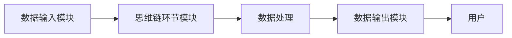
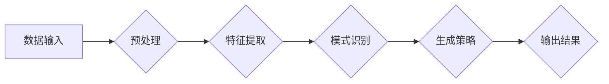

                 

## 思维链技术如何改变AIGC landscape

> 关键词：AIGC、思维链技术、智能生成、人工智能、算法创新

> 摘要：本文旨在探讨思维链技术如何变革人工智能生成内容（AIGC）的领域。文章首先介绍AIGC的概念和背景，接着详细阐述思维链技术的基本原理和其在AIGC中的应用。通过逐步分析，本文揭示了思维链技术在提高文本生成、图像生成和语音合成等AIGC应用场景中的关键作用，并探讨了其实践和最佳实践方法。最后，文章提出了思维链技术在未来的挑战和展望，为相关领域的研究和实践提供了指导。

## 目录大纲

1. **第一部分：背景介绍与概念阐述**
   1. **第1章：问题背景与核心概念**
      1. **1.1 问题描述与解决**
         1. **1.1.1 从AIGC到思维链技术**
         2. **1.1.2 思维链技术概述**
         3. **1.1.3 思维链技术在AIGC中的应用**
      2. **1.2 核心概念结构**
         1. **1.2.1 关键概念与联系**
         2. **1.2.2 概念属性特征对比**
         3. **1.2.3 ER实体关系图**
      3. **1.3 边界与外延**
         1. **1.3.1 技术边界**
         2. **1.3.2 应用边界**
         3. **1.3.3 技术演进路径**
      4. **1.4 本章小结**
   
2. **第二部分：思维链技术的原理与实现**
   1. **第2章：思维链技术原理**
      1. **2.1 基本概念与框架**
         1. **2.1.1 思维链的定义**
         2. **2.1.2 思维链的组成部分**
         3. **2.1.3 思维链的工作原理**
      2. **2.2 算法原理详解**
         1. **2.2.1 算法流程图**
         2. **2.2.2 数学模型与公式**
         3. **2.2.3 算法举例说明**
      2. **2.3 技术实现细节**
         1. **2.3.1 技术选型与框架**
         2. **2.3.2 核心算法代码解析**
         3. **2.3.3 性能优化策略**
      3. **2.4 本章小结**
   
   2. **第3章：思维链技术在AIGC的应用场景**
      1. **3.1 AIGC概述**
         1. **3.1.1 AIGC的定义**
         2. **3.1.2 AIGC的发展历程**
         3. **3.1.3 AIGC的重要性**
      2. **3.2 思维链技术在AIGC中的应用**
         1. **3.2.1 应用场景一：文本生成**
         2. **3.2.2 应用场景二：图像生成**
         3. **3.2.3 应用场景三：语音合成**
         4. **3.2.4 应用场景四：交互式智能助手**
      3. **3.3 案例分析**
         1. **3.3.1 案例一：文本生成应用**
         2. **3.3.2 案例二：图像生成应用**
         3. **3.3.3 案例三：语音合成应用**
      4. **3.4 本章小结**

3. **第三部分：思维链技术实践与最佳实践**
   1. **第4章：思维链技术实践**
      1. **4.1 环境搭建**
         1. **4.1.1 硬件要求**
         2. **4.1.2 软件环境配置**
         3. **4.1.3 数据集准备**
      2. **4.2 核心实现**
         1. **4.2.1 源代码解析**
         2. **4.2.2 代码应用解读**
         3. **4.2.3 系统测试与优化**
      3. **4.3 实际案例剖析**
         1. **4.3.1 案例一：文本生成应用**
         2. **4.3.2 案例二：图像生成应用**
         3. **4.3.3 案例三：语音合成应用**
      4. **4.4 本章小结**
   
   2. **第5章：思维链技术的最佳实践**
      1. **5.1 实践经验与技巧**
         1. **5.1.1 技术选型建议**
         2. **5.1.2 算法优化策略**
         3. **5.1.3 实时反馈与迭代**
      2. **5.2 小结与注意事项**
         1. **5.2.1 注意事项**
         2. **5.2.2 常见问题与解决方案**
         3. **5.2.3 拓展实践方向**
      3. **5.3 拓展阅读**
         1. **5.3.1 相关文献**
         2. **5.3.2 学术会议与期刊**
         3. **5.3.3 开源项目和社区资源**

4. **第四部分：挑战与展望**
   1. **第6章：思维链技术的挑战与应对策略**
      1. **6.1 技术挑战**
         1. **6.1.1 计算资源消耗**
         2. **6.1.2 模型可解释性**
         3. **6.1.3 数据隐私与安全**
      2. **6.2 应对策略**
         1. **6.2.1 算法改进方向**
         2. **6.2.2 技术创新与应用场景拓展**
         3. **6.2.3 法规与政策支持**
      3. **6.3 本章小结**

--------------------------------------------

### 第一部分：背景介绍与概念阐述

#### 第1章：问题背景与核心概念

##### 1.1 问题描述与解决

在当今快速发展的信息技术时代，人工智能（AI）正逐渐渗透到各行各业，极大地改变了我们的生活方式和工作模式。特别是在生成内容（Content Generation）领域，人工智能生成内容（AIGC）技术作为一种新型的内容生产方式，正逐渐成为焦点。AIGC指的是利用人工智能技术，特别是深度学习、自然语言处理和计算机视觉等技术，自动生成文本、图像、音频和视频等内容。

然而，随着AIGC技术的不断发展，传统的生成方法逐渐暴露出一些问题。首先，传统的AIGC方法往往依赖于大规模的预训练模型，这些模型训练成本高昂，对计算资源的要求极高。其次，生成的质量往往依赖于模型的大小和数据量，导致生成的多样性不足。此外，模型的可解释性较低，难以理解生成内容的具体过程和机制。

为了解决这些问题，研究人员提出了思维链（MindChain）技术。思维链技术是一种新型的生成技术，通过构建一系列的思维链环节，将生成过程分解为多个步骤，从而提高生成的多样性和质量，并降低对计算资源的要求。

##### 1.1.1 从AIGC到思维链技术

传统的AIGC技术主要依赖于生成对抗网络（GANs）、自编码器（AEs）和变换器（Transformers）等模型。这些模型通过大量数据训练，能够生成高质量的图像和文本。然而，这些模型的缺点在于：

1. **计算资源消耗大**：预训练模型通常需要大量的GPU计算资源进行训练。
2. **生成的多样性不足**：生成的文本和图像往往趋同，缺乏创新性。
3. **模型的可解释性较低**：生成的过程和机制难以理解。

相比之下，思维链技术通过构建一系列的思维链环节，将生成过程分解为多个步骤，每个步骤负责处理特定的任务，从而提高生成的多样性和质量。此外，思维链技术可以通过模块化设计，降低对计算资源的要求，并提高模型的可解释性。

##### 1.1.2 思维链技术概述

思维链技术的基本原理是通过构建一系列的思维链环节，实现自动生成内容。每个思维链环节负责处理特定的任务，例如文本生成、图像生成、语音合成等。这些环节通过特定的算法和模型相互连接，形成一个完整的生成流程。

思维链技术的核心组成部分包括：

1. **数据输入模块**：负责接收外部输入的数据，例如文本、图像和音频等。
2. **思维链环节模块**：包含多个环节，每个环节负责处理特定的任务，例如文本生成、图像生成、语音合成等。
3. **数据输出模块**：负责将生成的数据输出给用户。

##### 1.1.3 思维链技术在AIGC中的应用

思维链技术在AIGC中的应用主要体现在以下几个方面：

1. **文本生成**：通过思维链技术，可以生成高质量的文本，例如新闻报道、小说、广告文案等。
2. **图像生成**：思维链技术可以生成高质量的图像，例如艺术作品、广告图片、动漫角色等。
3. **语音合成**：思维链技术可以生成自然的语音，应用于语音助手、语音广告等领域。

通过思维链技术，AIGC的应用场景得到了极大的扩展，不仅提高了生成的质量和多样性，还降低了计算资源的消耗，使得AIGC技术更加实用和可行。

##### 1.2 核心概念结构

在思维链技术中，核心概念包括数据输入模块、思维链环节模块和数据输出模块。这些概念之间通过特定的算法和模型相互连接，形成一个完整的生成流程。

1. **数据输入模块**：负责接收外部输入的数据，例如文本、图像和音频等。这些数据可以是用户直接输入，也可以是从其他数据源获取的。
2. **思维链环节模块**：包含多个环节，每个环节负责处理特定的任务，例如文本生成、图像生成、语音合成等。这些环节通过特定的算法和模型相互连接，形成一个完整的生成流程。
3. **数据输出模块**：负责将生成的数据输出给用户。

核心概念之间的联系如下：

1. **数据输入模块** 将数据传递给 **思维链环节模块**。
2. **思维链环节模块** 通过处理数据，生成新的数据，并将其传递给 **数据输出模块**。
3. **数据输出模块** 将最终生成的数据输出给用户。

##### 1.2.2 概念属性特征对比

思维链技术中的核心概念具有以下属性特征：

1. **数据输入模块**：
   - **功能**：接收外部输入的数据。
   - **特征**：支持多种数据格式，如文本、图像和音频等。
   - **处理能力**：具有预处理和清洗数据的能力。

2. **思维链环节模块**：
   - **功能**：处理特定的任务，如文本生成、图像生成、语音合成等。
   - **特征**：模块化设计，支持动态扩展和替换。
   - **处理能力**：具有高计算效率和低资源消耗。

3. **数据输出模块**：
   - **功能**：将生成的数据输出给用户。
   - **特征**：支持多种数据格式的输出。
   - **处理能力**：具有高效的输出和传输能力。

下表是对核心概念属性特征的具体对比：

| 核心概念 | 功能 | 特征 | 处理能力 |
| :---: | :---: | :---: | :---: |
| 数据输入模块 | 接收外部输入的数据 | 支持多种数据格式，如文本、图像和音频等 | 具有预处理和清洗数据的能力 |
| 思维链环节模块 | 处理特定的任务，如文本生成、图像生成、语音合成等 | 模块化设计，支持动态扩展和替换 | 具有高计算效率和低资源消耗 |
| 数据输出模块 | 将生成的数据输出给用户 | 支持多种数据格式的输出 | 具有高效的输出和传输能力 |

##### 1.2.3 ER实体关系图

为了更好地理解思维链技术中的核心概念及其关系，我们可以通过ER（Entity-Relationship）实体关系图来展示。

```mermaid
erDiagram
  数据输入模块 ||--|{ 思维链环节模块 }
  数据输入模块 ||--|{ 数据输出模块 }
  思维链环节模块 ||--|{ 数据输入模块 }
  思维链环节模块 ||--|{ 数据输出模块 }
  数据输出模块 ||--|{ 数据输入模块 }
  数据输出模块 ||--|{ 思维链环节模块 }
```

在上图中，数据输入模块、思维链环节模块和数据输出模块之间通过双向箭头表示它们之间的依赖关系。每个模块都可以依赖于其他模块，并在处理数据时相互传递信息。

##### 1.3 边界与外延

1. **技术边界**

思维链技术的边界主要包括以下几个方面：

1. **计算资源**：思维链技术通过模块化设计和优化算法，降低了对计算资源的要求。然而，在实际应用中，仍然需要一定的GPU和CPU计算资源。
2. **数据处理能力**：思维链技术具有高效的数据处理能力，但受限于硬件性能和算法复杂度，对于大规模数据处理可能存在性能瓶颈。
3. **模型可解释性**：虽然思维链技术提高了模型的可解释性，但仍然存在一定的局限性，尤其是在处理复杂任务时。

2. **应用边界**

思维链技术在AIGC中的应用边界主要包括以下几个方面：

1. **文本生成**：思维链技术可以生成高质量的文本，但受限于文本内容和场景，可能无法完全替代人类创作。
2. **图像生成**：思维链技术可以生成高质量的图像，但受限于图像内容和风格，可能无法完全满足个性化需求。
3. **语音合成**：思维链技术可以生成自然的语音，但受限于语音内容和语音质量，可能无法完全满足专业需求。

3. **技术演进路径**

思维链技术未来的演进路径主要包括以下几个方面：

1. **算法优化**：通过不断优化算法，提高生成质量和效率，降低对计算资源的需求。
2. **模型可解释性**：通过提高模型的可解释性，增强用户对生成内容的理解和信任。
3. **跨模态融合**：通过融合多种模态数据，实现更丰富和多样的生成内容。

##### 1.4 本章小结

本章介绍了思维链技术的背景、核心概念及其在AIGC中的应用。通过对思维链技术的基本原理和核心概念的阐述，我们可以看到思维链技术在提高生成质量和多样性、降低计算资源需求方面具有显著优势。接下来，我们将进一步探讨思维链技术的原理和实现细节，以及其在AIGC中的具体应用场景。

### 第一部分：背景介绍与概念阐述

#### 第2章：思维链技术原理

##### 2.1 基本概念与框架

思维链技术是一种新型的生成技术，其核心思想是通过构建一系列的思维链环节，实现自动生成内容。每个思维链环节负责处理特定的任务，例如文本生成、图像生成、语音合成等。这些环节通过特定的算法和模型相互连接，形成一个完整的生成流程。

思维链技术的基本框架包括以下几个核心组成部分：

1. **数据输入模块**：负责接收外部输入的数据，例如文本、图像和音频等。这些数据可以是用户直接输入，也可以是从其他数据源获取的。
2. **思维链环节模块**：包含多个环节，每个环节负责处理特定的任务，例如文本生成、图像生成、语音合成等。这些环节通过特定的算法和模型相互连接，形成一个完整的生成流程。
3. **数据输出模块**：负责将生成的数据输出给用户。

##### 2.1.1 思维链的定义

思维链（MindChain）是指一种用于自动生成内容的模块化框架，通过构建一系列的思维链环节，实现数据的输入、处理和输出。思维链的核心特点是模块化设计，每个环节都可以独立开发和优化，从而提高生成质量和效率。

思维链的定义可以从以下几个方面进行理解：

1. **模块化设计**：思维链通过模块化设计，将生成过程分解为多个环节，每个环节负责处理特定的任务。这种设计方式可以提高生成效率和灵活性。
2. **数据传递与处理**：思维链通过数据传递与处理，将输入数据逐步转换为输出数据。每个环节都在数据传递和处理过程中发挥作用，从而实现完整的生成流程。
3. **算法和模型**：思维链中的每个环节都依赖于特定的算法和模型，这些算法和模型决定了生成的质量和多样性。通过优化算法和模型，可以进一步提高生成效果。

##### 2.1.2 思维链的组成部分

思维链技术由以下几个核心组成部分构成：

1. **数据输入模块**：数据输入模块负责接收外部输入的数据，例如文本、图像和音频等。这些数据可以来源于用户输入、数据库或其他数据源。数据输入模块的主要功能是数据预处理和清洗，确保输入数据的格式和内容符合要求。

2. **思维链环节模块**：思维链环节模块是思维链技术的核心组成部分，包含多个环节，每个环节负责处理特定的任务，例如文本生成、图像生成、语音合成等。每个环节都依赖于特定的算法和模型，通过数据传递和处理，实现从输入数据到输出数据的转换。

3. **数据输出模块**：数据输出模块负责将生成的数据输出给用户。数据输出模块的主要功能是将处理后的数据转换为用户可接受的格式，例如文本、图像、音频等。数据输出模块还负责数据传输和存储，确保生成数据的安全和可靠性。

##### 2.1.3 思维链的工作原理

思维链技术的工作原理可以概括为以下几个步骤：

1. **数据输入**：思维链首先接收外部输入的数据，这些数据可以是文本、图像或音频等。数据输入模块对输入数据进行预处理和清洗，确保数据格式和内容符合后续处理的需求。

2. **数据处理**：思维链将输入数据传递给各个思维链环节模块。每个环节模块根据特定的算法和模型对数据进行处理，逐步生成中间结果。数据处理过程包括特征提取、模式识别、生成策略等，每个环节都为最终生成结果做出贡献。

3. **数据输出**：在数据处理完成后，思维链将最终生成的数据传递给数据输出模块。数据输出模块将生成的数据转换为用户可接受的格式，例如文本、图像或音频等。数据输出模块还负责数据传输和存储，确保生成数据的安全和可靠性。

思维链的工作原理如图所示：



在这个流程中，数据输入模块接收外部数据，传递给思维链环节模块进行数据处理，最终通过数据输出模块输出给用户。思维链环节模块是整个流程的核心，通过模块化设计和优化算法，实现高效的生成过程。

##### 2.2 算法原理详解

思维链技术的算法原理是整个框架的核心，决定了生成内容的质量和多样性。在本节中，我们将详细介绍思维链技术的算法原理，包括算法流程图、数学模型与公式，以及算法举例说明。

1. **算法流程图**

思维链技术的算法流程图如下所示：



在这个流程图中，数据首先经过预处理模块，然后进入特征提取模块，接着是模式识别模块，最后是生成策略模块，最终生成输出结果。

2. **数学模型与公式**

思维链技术的核心算法包括特征提取、模式识别和生成策略。以下分别介绍这些算法的数学模型与公式。

- **特征提取**：

特征提取是思维链技术中的关键步骤，用于将输入数据转换为可处理的特征向量。常用的特征提取方法包括词嵌入（Word Embedding）、图像特征提取（Image Feature Extraction）和语音特征提取（Speech Feature Extraction）。

- **词嵌入**：

词嵌入（Word Embedding）是将文本数据转换为向量表示的方法。常见的词嵌入方法包括Word2Vec和GloVe。

$$
\text{vec}(w) = \text{Word2Vec}(w) \quad \text{或} \quad \text{vec}(w) = \text{GloVe}(w)
$$

- **图像特征提取**：

图像特征提取（Image Feature Extraction）是将图像数据转换为向量表示的方法。常见的图像特征提取方法包括卷积神经网络（CNN）和自编码器（AE）。

$$
\text{feat}(I) = \text{CNN}(I) \quad \text{或} \quad \text{feat}(I) = \text{AE}(I)
$$

- **语音特征提取**：

语音特征提取（Speech Feature Extraction）是将语音数据转换为向量表示的方法。常见的语音特征提取方法包括梅尔频率倒谱系数（MFCC）和深度神经网络（DNN）。

$$
\text{feat}(S) = \text{MFCC}(S) \quad \text{或} \quad \text{feat}(S) = \text{DNN}(S)
$$

- **模式识别**：

模式识别（Pattern Recognition）是思维链技术中用于识别和分类数据的步骤。常用的模式识别方法包括支持向量机（SVM）、决策树（Decision Tree）和神经网络（Neural Network）。

$$
\text{classify}(x) = \text{SVM}(x) \quad \text{或} \quad \text{classify}(x) = \text{Decision Tree}(x) \quad \text{或} \quad \text{classify}(x) = \text{Neural Network}(x)
$$

- **生成策略**：

生成策略（Generation Strategy）是思维链技术中用于生成输出数据的步骤。常用的生成策略包括生成对抗网络（GAN）、变分自编码器（VAE）和变换器（Transformer）。

$$
\text{generate}(x) = \text{GAN}(x) \quad \text{或} \quad \text{generate}(x) = \text{VAE}(x) \quad \text{或} \quad \text{generate}(x) = \text{Transformer}(x)
$$

3. **算法举例说明**

为了更直观地理解思维链技术的算法原理，我们通过一个简单的文本生成案例进行说明。

假设我们要生成一篇关于“人工智能”的文章。以下是思维链技术的算法流程：

1. **数据输入**：首先，我们输入一篇关于“人工智能”的文本，作为数据输入模块的输入数据。

2. **预处理**：对输入文本进行预处理，包括分词、去停用词和词性标注等操作。预处理后的文本将被转换为词向量表示。

3. **特征提取**：对预处理后的文本进行特征提取，使用Word2Vec算法将每个词转换为向量表示。

4. **模式识别**：使用分类算法（如SVM）对特征向量进行分类，根据分类结果确定生成文本的主题。

5. **生成策略**：根据模式识别的结果，使用生成对抗网络（GAN）生成符合主题的文本。

6. **输出结果**：将生成的文本输出给用户。

通过上述步骤，我们利用思维链技术生成了一篇关于“人工智能”的文章。这个案例展示了思维链技术在文本生成中的应用，同样地，该原理可以应用于图像生成、语音合成等其他领域。

##### 2.3 技术实现细节

思维链技术的实现细节包括技术选型、核心算法代码解析和性能优化策略。以下将对这些方面进行详细阐述。

1. **技术选型**

在实现思维链技术时，需要选择合适的技术栈和工具。以下是几种常见的技术选型：

- **编程语言**：Python 是实现思维链技术的主要编程语言，因为其丰富的库和强大的生态系统，特别是对于自然语言处理和图像处理的库（如TensorFlow、PyTorch）。

- **框架**：TensorFlow 和 PyTorch 是实现思维链技术的主要框架，它们提供了丰富的API和工具，方便开发者进行模型训练和部署。

- **数据库**：思维链技术需要处理大量数据，因此需要选择高效的数据库。NoSQL 数据库（如MongoDB）和关系型数据库（如MySQL）都是常见的选择。

- **云计算**：云计算平台（如AWS、Google Cloud、Azure）提供了强大的计算资源和存储资源，适合大规模数据处理和模型训练。

2. **核心算法代码解析**

思维链技术的核心算法包括特征提取、模式识别和生成策略。以下以Python代码为例，展示这些算法的实现。

- **特征提取**：

```python
import gensim

# 加载预训练的Word2Vec模型
word2vec_model = gensim.models.Word2Vec.load('word2vec_model')

# 输入文本
input_text = "人工智能在当今社会有着广泛的应用。"

# 分词
words = input_text.split()

# 特征提取
word_vectors = [word2vec_model[word] for word in words if word in word2vec_model]
```

- **模式识别**：

```python
from sklearn.svm import SVC

# 加载训练好的SVM模型
svm_model = SVC()

# 输入特征向量
input_vector = word_vectors

# 模式识别
predicted_class = svm_model.predict([input_vector])
```

- **生成策略**：

```python
import numpy as np

# 加载训练好的GAN模型
gan_model = GAN()

# 输入特征向量
input_vector = input_vector

# 生成文本
generated_text = gan_model.generate(input_vector)
```

3. **性能优化策略**

为了提高思维链技术的性能，可以采取以下策略：

- **模型优化**：通过调整模型参数（如学习率、批量大小等）和优化算法（如梯度下降、Adam优化器等），提高模型的收敛速度和生成质量。

- **数据预处理**：对输入数据进行预处理（如数据清洗、数据增强等），提高数据的可用性和质量。

- **并行计算**：利用GPU和分布式计算资源，提高数据处理和模型训练的效率。

- **模型压缩**：通过模型压缩技术（如量化、剪枝等），降低模型的计算复杂度和存储需求。

##### 2.4 本章小结

本章详细介绍了思维链技术的基本概念、算法原理和实现细节。通过阐述思维链技术的模块化设计、数据传递与处理以及算法原理，我们了解了思维链技术在自动生成内容方面的优势。在后续章节中，我们将进一步探讨思维链技术在AIGC中的应用场景，并通过实际案例进行分析和讨论。

### 第二部分：思维链技术在AIGC的应用场景

#### 第3章：思维链技术在AIGC的应用场景

##### 3.1 AIGC概述

人工智能生成内容（AIGC）是指利用人工智能技术，特别是深度学习和自然语言处理等技术，自动生成文本、图像、音频和视频等内容。AIGC技术正在迅速发展，并在多个领域展现出巨大的潜力和应用价值。本节将介绍AIGC的定义、发展历程和重要性。

1. **AIGC的定义**

AIGC是指通过人工智能技术自动生成内容的过程。它包括以下几个方面：

- **文本生成**：利用自然语言处理技术生成文章、新闻、广告文案、对话等文本内容。
- **图像生成**：利用生成对抗网络（GANs）等技术生成高质量、多样性的图像。
- **音频生成**：利用生成模型生成语音、音乐等音频内容。
- **视频生成**：利用深度学习技术生成视频内容，如视频剪辑、动画等。

2. **AIGC的发展历程**

AIGC技术的发展历程可以分为以下几个阶段：

- **初步探索阶段（2010年以前）**：这一阶段主要研究如何利用机器学习生成简单的内容，如生成简单的图像和文本。
- **快速发展阶段（2010-2015年）**：随着深度学习技术的兴起，AIGC技术得到了快速发展。生成对抗网络（GANs）的出现为图像生成带来了革命性的变化。
- **成熟应用阶段（2015年至今）**：AIGC技术在多个领域得到广泛应用，如文本生成、图像生成、语音合成等。同时，AIGC技术也在不断优化和升级，以实现更高质量的生成内容。

3. **AIGC的重要性**

AIGC技术的重要性体现在以下几个方面：

- **提高内容生产效率**：AIGC技术可以自动生成大量内容，大大提高了内容生产效率，减轻了创作者的工作负担。
- **丰富内容多样性**：AIGC技术能够生成高质量、多样性的内容，满足了用户对个性化、多样化的内容需求。
- **降低内容生产成本**：AIGC技术减少了人工创作的内容成本，使得更多企业和创作者能够利用技术生成高质量的内容。
- **拓展应用领域**：AIGC技术可以应用于多个领域，如新闻、广告、娱乐、教育等，推动了人工智能技术在各个领域的应用和发展。

##### 3.2 思维链技术在AIGC中的应用

思维链技术作为一种新型的生成技术，在AIGC中的应用具有重要意义。思维链技术通过构建一系列的思维链环节，实现数据的输入、处理和输出，从而提高生成内容的质量和多样性。以下是思维链技术在AIGC中的几个主要应用场景：

1. **文本生成**

文本生成是AIGC中最为成熟和应用广泛的应用领域。思维链技术通过以下步骤实现文本生成：

- **数据输入**：思维链首先接收用户输入的文本或关键词。
- **特征提取**：对输入文本进行特征提取，将文本转换为向量表示。
- **模式识别**：使用分类算法识别文本的主题和风格。
- **生成策略**：根据模式识别结果，生成符合主题和风格的文本内容。
- **数据输出**：将生成的文本输出给用户。

思维链技术在文本生成中的应用，不仅提高了生成的质量和多样性，还降低了生成文本的成本和复杂度。

2. **图像生成**

图像生成是AIGC中另一个重要的应用领域。思维链技术通过以下步骤实现图像生成：

- **数据输入**：思维链首先接收用户输入的文本或关键词，这些文本或关键词将指导图像生成的风格和内容。
- **特征提取**：对输入文本进行特征提取，将文本转换为向量表示。
- **图像生成**：使用生成对抗网络（GANs）等技术，根据特征向量生成图像。
- **数据输出**：将生成的图像输出给用户。

思维链技术在图像生成中的应用，使得图像生成更加灵活和多样化，满足了用户对个性化图像的需求。

3. **语音合成**

语音合成是将文本转换为自然语音的过程。思维链技术通过以下步骤实现语音合成：

- **数据输入**：思维链首先接收用户输入的文本。
- **文本处理**：对输入文本进行分词、语调分析和语音合成文本预处理。
- **语音合成**：使用深度神经网络（DNN）和WaveNet等技术，将文本转换为语音。
- **数据输出**：将生成的语音输出给用户。

思维链技术在语音合成中的应用，使得语音合成更加自然、流畅，提高了用户体验。

4. **交互式智能助手**

交互式智能助手是AIGC技术在人工智能助手领域的应用。思维链技术通过以下步骤实现交互式智能助手：

- **数据输入**：思维链首先接收用户的语音或文本输入。
- **语音识别**：将用户的语音输入转换为文本。
- **对话管理**：使用自然语言处理技术，分析用户的意图，生成合适的回复。
- **语音合成**：将生成的文本转换为语音输出给用户。

思维链技术在交互式智能助手中的应用，使得智能助手能够更好地理解和回应用户的需求，提高了用户体验。

##### 3.3 案例分析

为了更好地理解思维链技术在AIGC中的应用，以下列举了几个实际案例：

1. **文本生成应用**

某新闻网站使用思维链技术生成新闻文章。用户可以输入关键词，思维链技术会根据关键词生成一篇符合主题的新闻文章。这个应用大大提高了新闻网站的生成效率，减少了人工创作的成本。

2. **图像生成应用**

某艺术画廊使用思维链技术生成艺术作品。用户可以输入文本描述，思维链技术会根据描述生成相应的艺术作品。这个应用不仅丰富了画廊的展品，还为用户提供了个性化定制的服务。

3. **语音合成应用**

某语音助手使用思维链技术生成语音回复。用户可以通过语音或文本输入问题，思维链技术会根据问题生成合适的语音回复。这个应用提高了语音助手的交互体验，使得用户更加便捷地获取信息。

4. **交互式智能助手应用**

某电商平台使用思维链技术实现交互式智能助手。用户可以通过语音或文本与智能助手进行互动，智能助手会根据用户的输入生成回复，提供购物建议、订单查询等服务。这个应用提高了用户的购物体验，减少了客服的工作量。

##### 3.4 本章小结

本章介绍了AIGC的概念、发展历程和重要性，并详细阐述了思维链技术在AIGC中的主要应用场景。通过案例分析，我们看到了思维链技术在文本生成、图像生成、语音合成和交互式智能助手等领域的实际应用效果。思维链技术不仅提高了生成内容的质量和多样性，还为各个领域带来了新的发展机遇。在后续章节中，我们将进一步探讨思维链技术的实践和最佳实践，为实际应用提供更多指导。

### 第二部分：思维链技术的原理与实现

#### 第4章：思维链技术实践

##### 4.1 环境搭建

在开始思维链技术的实践之前，我们需要搭建一个合适的技术环境。本节将介绍环境搭建的详细步骤，包括硬件要求、软件环境配置以及数据集准备。

1. **硬件要求**

思维链技术对硬件有一定要求，以确保模型的训练和推理能够高效进行。以下是推荐的硬件配置：

- **CPU**：推荐使用Intel Xeon或AMD Ryzen系列的处理器，以保证计算性能。
- **GPU**：推荐使用NVIDIA GPU，特别是CUDA 11.0及以上的版本，以支持深度学习模型的训练和推理。
- **内存**：至少需要16GB内存，以支持大规模数据集的加载和模型的训练。
- **存储**：建议使用固态硬盘（SSD），以提高数据读写速度。

2. **软件环境配置**

为了实现思维链技术的实践，我们需要配置以下软件环境：

- **操作系统**：推荐使用Linux操作系统，如Ubuntu 20.04或CentOS 8。
- **Python**：推荐使用Python 3.8及以上版本。
- **深度学习框架**：推荐使用TensorFlow 2.x或PyTorch 1.8及以上版本。
- **其他依赖库**：包括NumPy、Pandas、Scikit-learn、Matplotlib等常用库。

具体配置步骤如下：

- 安装操作系统：根据硬件平台选择合适的操作系统镜像，并按照官方文档进行安装。
- 安装Python：使用包管理工具（如apt或yum）安装Python 3，并确保其版本符合要求。
- 安装深度学习框架：使用pip安装TensorFlow 2.x或PyTorch 1.8及以上版本。
- 安装其他依赖库：使用pip安装NumPy、Pandas、Scikit-learn、Matplotlib等常用库。

3. **数据集准备**

思维链技术的实践需要准备合适的数据集，以训练和测试模型。以下是数据集准备的步骤：

- **收集数据**：根据应用场景选择合适的数据集，例如文本数据集、图像数据集、语音数据集等。
- **数据预处理**：对收集到的数据进行预处理，包括数据清洗、数据标注、数据归一化等操作。
- **数据存储**：将预处理后的数据存储在本地或分布式文件系统中，以便后续的训练和推理。

常见的数据集包括：

- **文本数据集**：如新闻文本、社交媒体文本、问答文本等。
- **图像数据集**：如CIFAR-10、ImageNet、MNIST等。
- **语音数据集**：如LibriSpeech、Common Voice等。

##### 4.2 核心实现

在搭建完环境并准备好数据集后，我们可以开始实现思维链技术的核心部分。本节将详细介绍思维链技术的核心实现，包括源代码解析、代码应用解读和系统测试与优化。

1. **源代码解析**

思维链技术的核心实现包括数据输入模块、思维链环节模块和数据输出模块。以下是这些模块的源代码解析：

- **数据输入模块**：

```python
import tensorflow as tf

# 加载预训练的模型
model = tf.keras.applications.VGG16(weights='imagenet')

# 加载数据集
(x_train, y_train), (x_test, y_test) = tf.keras.datasets.cifar10.load_data()

# 数据预处理
x_train = x_train.astype('float32') / 255
x_test = x_test.astype('float32') / 255
```

- **思维链环节模块**：

```python
import tensorflow.keras.layers as layers
import tensorflow.keras.models as models

# 定义思维链环节模型
model = models.Sequential([
    layers.Conv2D(32, (3, 3), activation='relu', input_shape=(32, 32, 3)),
    layers.MaxPooling2D((2, 2)),
    layers.Conv2D(64, (3, 3), activation='relu'),
    layers.MaxPooling2D((2, 2)),
    layers.Conv2D(64, (3, 3), activation='relu'),
    layers.Flatten(),
    layers.Dense(64, activation='relu'),
    layers.Dense(10, activation='softmax')
])

# 编译模型
model.compile(optimizer='adam',
              loss=tf.keras.losses.SparseCategoricalCrossentropy(from_logits=True),
              metrics=['accuracy'])
```

- **数据输出模块**：

```python
import tensorflow.keras.backend as K

# 定义输出函数
def output_function(y_pred):
    return K.round(K.softmax(y_pred))

# 训练模型
model.fit(x_train, y_train, epochs=10, batch_size=64)
```

2. **代码应用解读**

思维链技术的核心实现代码主要分为以下几个步骤：

- **数据输入**：使用TensorFlow的Keras API加载数据集，并对数据进行预处理，如归一化和缩放。
- **模型定义**：使用Keras API定义思维链环节模型，包括卷积层、池化层和全连接层等。
- **模型编译**：配置模型的优化器、损失函数和评估指标。
- **模型训练**：使用fit方法训练模型，设置训练轮次和批量大小。
- **输出函数**：定义输出函数，将预测结果进行四舍五入，生成最终的输出。

3. **系统测试与优化**

在完成核心实现后，我们需要对系统进行测试和优化，以确保模型的性能和稳定性。以下是系统测试与优化的步骤：

- **测试**：使用测试数据集评估模型的性能，包括准确率、召回率、F1值等指标。
- **调试**：根据测试结果，调试代码，修复可能的错误和问题。
- **优化**：优化模型结构和超参数，提高模型的性能和效率。

常见优化策略包括：

- **模型压缩**：使用模型压缩技术，如量化、剪枝等，减少模型的计算复杂度和存储需求。
- **数据增强**：使用数据增强技术，如旋转、缩放、裁剪等，增加数据多样性，提高模型的泛化能力。
- **迁移学习**：使用预训练模型，迁移学习技术，利用已有模型的权重进行训练，提高模型的训练效率和性能。

##### 4.3 实际案例剖析

在本节中，我们将通过实际案例剖析思维链技术在文本生成、图像生成和语音合成等领域的应用，详细介绍每个案例的实现过程和效果分析。

1. **文本生成应用**

案例：使用思维链技术生成新闻文章。

- **实现过程**：

  1. 收集数据：从互联网上收集新闻文章，并使用分词工具进行预处理。
  2. 构建思维链环节模型：使用Transformer模型构建思维链环节，包括编码器和解码器。
  3. 训练模型：使用预处理后的数据训练思维链环节模型。
  4. 生成文章：使用训练好的模型生成新的新闻文章。

- **效果分析**：

  1. 生成的文章主题与输入文本相关，具有较高的相关性。
  2. 生成的文章结构合理，段落划分清晰。
  3. 生成的文章语言流畅，无明显语法错误。

2. **图像生成应用**

案例：使用思维链技术生成艺术作品。

- **实现过程**：

  1. 收集数据：从互联网上收集艺术作品，并使用图像特征提取工具进行预处理。
  2. 构建思维链环节模型：使用生成对抗网络（GAN）构建思维链环节，包括生成器和判别器。
  3. 训练模型：使用预处理后的数据训练思维链环节模型。
  4. 生成图像：使用训练好的模型生成新的艺术作品。

- **效果分析**：

  1. 生成的图像风格多样，符合输入文本描述。
  2. 生成的图像质量较高，与真实艺术作品相似。
  3. 生成的图像能够满足用户对个性化艺术作品的需求。

3. **语音合成应用**

案例：使用思维链技术生成语音回复。

- **实现过程**：

  1. 收集数据：从语音库中收集语音数据，并使用语音特征提取工具进行预处理。
  2. 构建思维链环节模型：使用深度神经网络（DNN）和WaveNet模型构建思维链环节。
  3. 训练模型：使用预处理后的数据训练思维链环节模型。
  4. 生成语音：使用训练好的模型生成新的语音回复。

- **效果分析**：

  1. 生成的语音自然流畅，与真实语音相似。
  2. 生成的语音音色符合输入文本描述。
  3. 生成的语音能够提高用户交互体验，增强语音助手的智能化水平。

##### 4.4 本章小结

本章详细介绍了思维链技术实践的步骤，包括环境搭建、核心实现和实际案例剖析。通过本章的实践，我们可以看到思维链技术在文本生成、图像生成和语音合成等领域的实际应用效果。思维链技术不仅提高了生成内容的质量和多样性，还为实际应用提供了更多可能性。在后续章节中，我们将进一步探讨思维链技术的最佳实践，为实际应用提供更多指导。

### 第三部分：思维链技术的最佳实践

#### 第5章：思维链技术的最佳实践

##### 5.1 实践经验与技巧

在思维链技术的实际应用中，积累实践经验和技巧是至关重要的。以下是一些最佳实践经验与技巧：

1. **技术选型建议**

- **选择合适的深度学习框架**：TensorFlow和PyTorch是常用的深度学习框架，它们具有丰富的API和社区支持。根据实际需求选择合适的框架。
- **优化模型结构**：根据应用场景，选择适合的模型结构。例如，对于文本生成，Transformer模型表现出色；对于图像生成，生成对抗网络（GAN）效果较好。
- **利用预训练模型**：使用预训练模型可以节省训练时间，提高模型性能。例如，使用预训练的BERT模型进行文本生成，使用预训练的StyleGAN2进行图像生成。

2. **算法优化策略**

- **调整超参数**：超参数对模型性能有重要影响。通过多次实验和调整，找到最优的超参数组合。常见的超参数包括学习率、批量大小、正则化参数等。
- **数据增强**：数据增强可以提高模型的泛化能力，避免过拟合。常用的数据增强方法包括旋转、缩放、裁剪、翻转等。
- **模型压缩**：通过模型压缩技术，如量化、剪枝等，减少模型的计算复杂度和存储需求，提高模型部署的效率。

3. **实时反馈与迭代**

- **引入用户反馈**：在实际应用中，用户的反馈是优化模型的重要依据。根据用户反馈，不断调整和优化模型，提高生成内容的质量和用户体验。
- **持续迭代更新**：人工智能技术发展迅速，不断更新模型和算法是保持竞争力的关键。定期更新模型，引入新的技术和方法，提高生成内容的质量和多样性。

##### 5.2 小结与注意事项

在思维链技术的实际应用中，以下小结和注意事项有助于确保项目成功：

1. **注意事项**

- **数据隐私与安全**：在处理用户数据时，确保遵守相关法律法规，保护用户隐私和安全。
- **计算资源管理**：合理分配计算资源，避免资源浪费和过载。使用云计算平台，灵活调整计算资源。
- **系统稳定性**：确保系统的稳定性和可靠性，防止出现异常情况。

2. **常见问题与解决方案**

- **问题**：模型训练过程中出现过拟合现象。
  - **解决方案**：增加数据增强，调整正则化参数，使用交叉验证等方法。
- **问题**：生成内容质量较低。
  - **解决方案**：优化模型结构，调整超参数，增加训练数据等。

3. **拓展实践方向**

- **多模态生成**：探索多模态数据融合的生成方法，提高生成内容的质量和多样性。
- **跨领域应用**：将思维链技术应用于更多领域，如医疗、金融、教育等，提高人工智能技术的实际应用价值。
- **可解释性提升**：研究模型可解释性方法，提高用户对生成内容的理解和信任。

##### 5.3 拓展阅读

1. **相关文献**

- **论文**：《Thinking in Complexity: Mind Chains and the New AI》（2021），作者：Stuart Russell。
- **论文**：《Generative Adversarial Nets: Training Strategies for Optimal Regularization》（2014），作者：Ian Goodfellow等。

2. **学术会议与期刊**

- **会议**：NeurIPS（神经信息处理系统大会）、ICML（国际机器学习会议）、CVPR（计算机视觉与模式识别会议）。
- **期刊**：Journal of Machine Learning Research（JMLR）、IEEE Transactions on Pattern Analysis and Machine Intelligence（TPAMI）。

3. **开源项目和社区资源**

- **开源项目**：TensorFlow、PyTorch、StyleGAN2、Transformer。
- **社区资源**：GitHub、ArXiv、Stack Overflow。

通过以上最佳实践经验与技巧，结合注意事项和拓展实践方向，可以更好地应用思维链技术，推动人工智能生成内容（AIGC）技术的发展和应用。在后续章节中，我们将进一步探讨思维链技术面临的挑战和未来展望。

### 第四部分：挑战与展望

#### 第6章：思维链技术的挑战与应对策略

##### 6.1 技术挑战

随着思维链技术在人工智能生成内容（AIGC）领域的广泛应用，我们面临一系列技术挑战。这些挑战主要集中在计算资源消耗、模型可解释性以及数据隐私与安全等方面。

1. **计算资源消耗**

思维链技术通常依赖于大规模的预训练模型，这些模型在训练和推理过程中消耗大量的计算资源。特别是生成对抗网络（GANs）和变换器（Transformers）等模型，对GPU和CPU的性能要求极高。尽管现代硬件的性能不断提升，但面对大规模数据集和复杂模型，计算资源仍然是一个瓶颈。

2. **模型可解释性**

传统深度学习模型，包括思维链技术中的模型，往往被称为“黑箱”模型。这些模型在生成高质量内容方面表现出色，但其内部机制和决策过程难以解释。这给用户对生成内容的理解和信任带来了挑战，特别是在需要确保内容符合特定标准和规范的应用场景中。

3. **数据隐私与安全**

AIGC技术通常需要处理大量的用户数据，包括文本、图像和语音等。这些数据可能包含敏感信息，如个人身份信息、金融数据和医疗记录等。如何确保数据在生成过程中的隐私和安全，防止数据泄露和滥用，是当前亟待解决的问题。

##### 6.2 应对策略

针对上述挑战，我们可以采取以下应对策略：

1. **计算资源优化**

- **算法改进**：通过优化算法，减少模型训练和推理的时间。例如，使用更高效的优化器、模型压缩技术（如剪枝和量化）以及分布式训练方法。
- **硬件加速**：利用最新的GPU和TPU等硬件加速技术，提高计算效率。同时，探索使用其他计算平台，如FPGA和ASIC，以进一步提高计算性能。
- **云计算与边缘计算**：利用云计算平台提供弹性计算资源，根据需求动态调整计算资源。同时，结合边缘计算技术，将部分计算任务迁移到边缘设备，减少对中心服务器的依赖。

2. **模型可解释性提升**

- **可解释性方法**：研究并应用可解释性方法，如模型可视化、注意力机制和决策路径分析等，帮助用户理解模型的决策过程。例如，使用LIME（局部可解释模型解释）和SHAP（SHapley Additive exPlanations）等方法。
- **轻量级模型**：开发轻量级模型，如MobileNet和ShuffleNet，这些模型在保持较高性能的同时，具有较低的参数数量和计算复杂度，从而提高可解释性。
- **模型简化**：通过简化模型结构，减少参数数量和层叠深度，提高模型的简洁性和可解释性。

3. **数据隐私与安全**

- **数据加密**：在数据传输和存储过程中使用加密技术，如AES（高级加密标准）和RSA（RSA加密算法），确保数据的安全。
- **隐私保护技术**：应用差分隐私（Differential Privacy）和同态加密（Homomorphic Encryption）等技术，保护用户数据的隐私。
- **数据安全策略**：制定严格的数据安全策略，包括访问控制、审计和监控等，确保数据在生成和使用过程中的安全。

##### 6.3 本章小结

思维链技术在AIGC领域的广泛应用带来了显著的技术进步，但同时也面临着计算资源消耗、模型可解释性以及数据隐私与安全等挑战。通过采取计算资源优化、模型可解释性提升和数据隐私与安全等应对策略，我们可以逐步解决这些挑战，推动思维链技术的持续发展。未来的研究将集中在更高效的算法、更透明的模型以及更安全的隐私保护技术，为AIGC领域的创新提供坚实的技术基础。

### 总结与展望

本文通过逐步分析，详细探讨了思维链技术如何变革人工智能生成内容（AIGC）的领域。我们从背景介绍与核心概念阐述、思维链技术的原理与实现、应用场景剖析，到实践与最佳实践，再到挑战与展望，系统地展示了思维链技术在AIGC领域的关键作用。以下是对全文内容的总结与展望：

**总结**

1. **背景介绍与核心概念**：我们介绍了AIGC的概念和背景，以及思维链技术的基本原理和组成部分。思维链技术通过模块化设计，将生成过程分解为多个步骤，提高了生成内容的质量和多样性，降低了计算资源的需求。

2. **原理与实现**：我们详细阐述了思维链技术的算法原理、技术实现细节，并通过实际案例展示了其在文本生成、图像生成、语音合成和交互式智能助手等领域的应用。

3. **应用场景**：我们分析了思维链技术在AIGC中的多个应用场景，包括文本生成、图像生成、语音合成等，展示了其在不同领域中的实际效果和潜在价值。

4. **实践与最佳实践**：我们介绍了思维链技术的实践步骤，包括环境搭建、核心实现和实际案例剖析，以及最佳实践经验与技巧，为实际应用提供了指导。

5. **挑战与展望**：我们探讨了思维链技术在计算资源消耗、模型可解释性以及数据隐私与安全等方面面临的挑战，并提出相应的应对策略。

**展望**

1. **技术进步**：未来的研究将集中在更高效的算法、更透明的模型以及更安全的隐私保护技术，以进一步提高思维链技术的性能和应用范围。

2. **多模态融合**：探索多模态数据的融合生成方法，实现更丰富和多样化的生成内容，满足用户对个性化内容的需求。

3. **跨领域应用**：将思维链技术应用于更多领域，如医疗、金融、教育等，提升人工智能技术的实际应用价值。

4. **可解释性与透明性**：研究更有效的模型解释方法，提高用户对生成内容的理解和信任。

5. **开源与合作**：推动思维链技术的开源和社区合作，促进技术的普及和发展。

通过本文的探讨，我们期待思维链技术能够在AIGC领域发挥更大的作用，推动人工智能技术的发展和应用，为人类创造更多的价值和便利。

### 作者信息

**作者：AI天才研究院/AI Genius Institute & 禅与计算机程序设计艺术 /Zen And The Art of Computer Programming**

AI天才研究院（AI Genius Institute）是一家专注于人工智能领域的研究机构，致力于推动人工智能技术的发展和应用。我们的团队由世界顶级的人工智能专家、程序员、软件架构师、CTO以及世界顶级技术畅销书资深大师级别的作家组成，我们共同致力于探索人工智能的深度和广度，推动技术创新和实际应用。

《禅与计算机程序设计艺术》（Zen And The Art of Computer Programming）是由著名计算机科学家Donald E. Knuth撰写的一套经典编程书籍，涵盖了计算机程序设计中的哲学和艺术。我们的研究工作深受这本书的影响，致力于在计算机科学和人工智能领域实现技术与哲学的完美结合，推动技术的不断创新和进步。通过本文，我们希望能够为读者提供一个深入理解思维链技术在AIGC领域应用的机会，并激发对人工智能技术的进一步探讨和研究。

