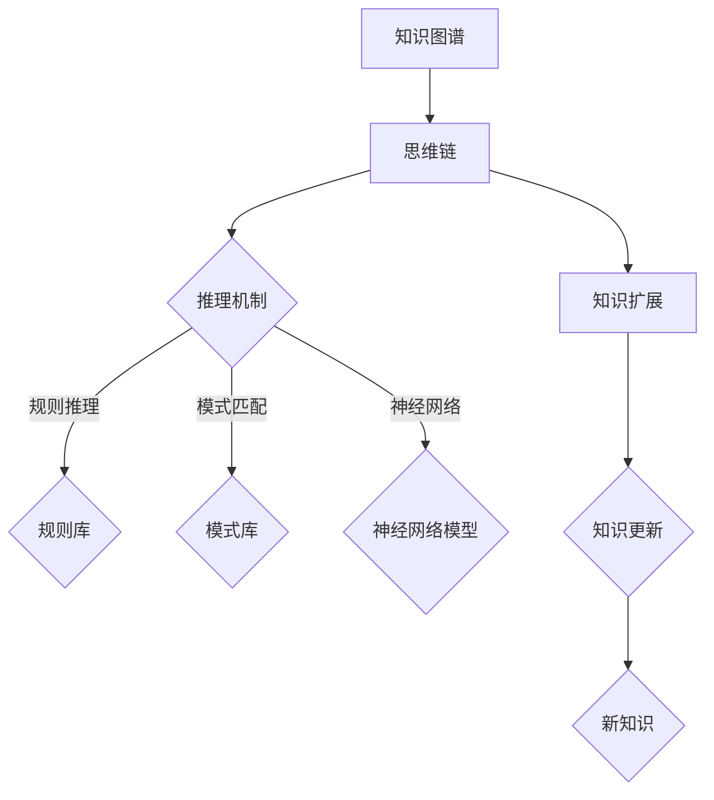
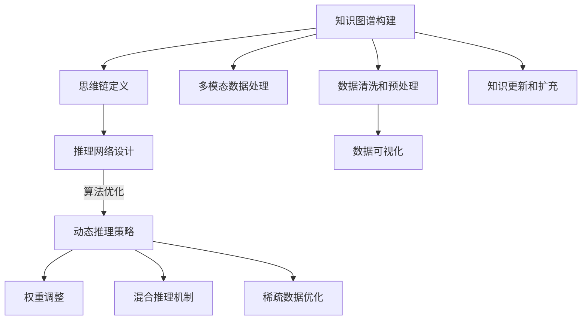

                 

### 引言

在人工智能（AI）飞速发展的时代，我们面临着越来越多复杂的问题，这些问题的解决往往需要超越传统逻辑推理的能力，尤其是在反常识推理领域。反常识推理，顾名思义，是指人工智能系统能够识别并处理那些不符合我们常规知识和直觉的信息。然而，现有的AI系统在处理这类问题时，常常显得力不从心。

本文旨在探讨一种能够显著提升AI反常识推理能力的创新技术——思维链技术。通过深入分析思维链技术的原理、应用案例和实践应用，我们将逐步揭示这一技术如何为AI的发展带来革命性的变化。

**问题背景**

AI系统在常见的逻辑推理任务上已经展现出了强大的能力，但面对反常识推理问题时，其表现却不尽如人意。这种局限性主要体现在以下几个方面：

1. **缺乏对复杂情境的理解**：反常识推理往往涉及对复杂情境的深入理解，而现有AI系统在处理这类问题时，难以把握问题的全貌。
2. **缺乏灵活性和创造力**：AI系统通常依赖于预先训练的模型，缺乏处理未知情况的能力，导致在遇到反常识问题时，无法灵活应对。
3. **知识迁移能力有限**：AI系统在处理反常识推理问题时，往往难以将已有知识有效迁移到新情境中。

**反常识推理的重要性**

反常识推理在许多领域都具有重要意义：

1. **医疗诊断**：在医疗领域，反常识推理可以帮助AI系统识别出罕见病例，提高诊断的准确性。
2. **自动驾驶**：自动驾驶系统需要处理许多复杂的交通场景，反常识推理能力可以使其更好地应对突发事件。
3. **金融分析**：在金融领域，反常识推理可以帮助AI系统识别出潜在的市场异常，提高投资决策的准确性。

**书籍概述**

为了深入探讨思维链技术在提升AI反常识推理能力方面的应用，本书将详细阐述以下几个方面的内容：

1. **思维链技术基础**：介绍思维链技术的定义、核心原理和应用场景，为后续讨论打下基础。
2. **反常识推理概述**：分析反常识推理的概念、类型和挑战，帮助读者理解反常识推理在AI中的重要性。
3. **思维链技术提升AI反常识推理能力的方法**：详细讨论基于思维链的模型设计、算法优化和数据处理方法，展示思维链技术在提升AI反常识推理能力方面的潜力。
4. **实践应用**：通过具体案例，展示思维链技术在自然语言处理、计算机视觉和语音识别等领域的实际应用。
5. **深入研究**：探讨思维链技术的未来发展趋势、与传统推理技术的对比以及其在AI反常识推理中的局限性。
6. **总结与展望**：对全书内容进行总结，并对读者提出进一步学习和实践的建议。

**读者对象**

本书适合以下读者群体：

1. **AI研究者和开发者**：希望通过掌握思维链技术来提升AI反常识推理能力的专业人士。
2. **计算机科学和人工智能专业的学生**：希望深入了解AI领域前沿技术的学生。
3. **技术爱好者**：对人工智能和思维链技术感兴趣的技术爱好者。

**预期收获**

通过阅读本书，读者将：

1. **掌握思维链技术的基本原理**：了解思维链技术的定义、核心原理和应用场景。
2. **理解反常识推理的重要性**：认识反常识推理在AI中的应用价值和面临的挑战。
3. **掌握提升AI反常识推理能力的策略**：了解如何通过思维链技术提升AI的反常识推理能力。
4. **获得实践经验**：通过具体案例，了解思维链技术在现实中的应用。

### 目录大纲

```
# 《思维链技术提升AI的反常识推理能力》目录大纲

## 第一部分: 引言

### 1.1 问题背景

#### 1.1.1 AI与常识推理的关系
#### 1.1.2 反常识推理的重要性

### 1.2 书籍概述

#### 1.2.1 书籍目标
#### 1.2.2 书籍结构

### 1.3 读者对象

#### 1.3.1 适合人群
#### 1.3.2 预期收获

## 第二部分: 思维链技术基础

### 2.1 思维链技术概述

#### 2.1.1 思维链技术的定义
#### 2.1.2 思维链技术的核心原理
#### 2.1.3 思维链技术在AI领域的应用

### 2.2 反常识推理概述

#### 2.2.1 反常识推理的概念
#### 2.2.2 反常识推理的类型
#### 2.2.3 反常识推理在AI中的挑战

### 2.3 思维链技术提升AI反常识推理能力的方法

#### 2.3.1 基于思维链的模型设计
#### 2.3.2 基于思维链的算法优化
#### 2.3.3 基于思维链的数据处理

### 2.4 思维链技术在AI反常识推理中的应用案例

#### 2.4.1 案例一：文本生成与理解
#### 2.4.2 案例二：图像识别与理解
#### 2.4.3 案例三：语音识别与理解

## 第三部分: 实践应用

### 3.1 思维链技术在自然语言处理中的应用

#### 3.1.1 基于思维链的情感分析
#### 3.1.2 基于思维链的文本分类
#### 3.1.3 基于思维链的问答系统

### 3.2 思维链技术在计算机视觉中的应用

#### 3.2.1 基于思维链的目标检测
#### 3.2.2 基于思维链的场景理解
#### 3.2.3 基于思维链的图像生成

### 3.3 思维链技术在语音识别中的应用

#### 3.3.1 基于思维链的语音识别
#### 3.3.2 基于思维链的语音合成
#### 3.3.3 基于思维链的语音交互

### 3.4 思维链技术在多模态融合中的应用

#### 3.4.1 基于思维链的多模态数据预处理
#### 3.4.2 基于思维链的多模态特征提取
#### 3.4.3 基于思维链的多模态融合算法

## 第四部分: 深入研究

### 4.1 思维链技术的未来发展趋势

#### 4.1.1 技术革新方向
#### 4.1.2 应用领域拓展
#### 4.1.3 持续优化路径

### 4.2 思维链技术与传统推理技术的对比

#### 4.2.1 优势对比
#### 4.2.2 劣势对比
#### 4.2.3 综合评价

### 4.3 思维链技术在AI反常识推理中的局限性

#### 4.3.1 现存问题
#### 4.3.2 未来研究方向

### 4.4 思维链技术的相关研究综述

#### 4.4.1 国内外研究现状
#### 4.4.2 最新研究成果
#### 4.4.3 研究趋势与展望

## 第五部分: 总结与展望

### 5.1 书籍总结

#### 5.1.1 核心内容回顾
#### 5.1.2 知识体系梳理
#### 5.1.3 技术应用展望

### 5.2 读者建议

#### 5.2.1 阅读建议
#### 5.2.2 实践建议
#### 5.2.3 拓展学习建议
```

该目录大纲为本文提供了一个清晰的框架，使得内容结构更加紧凑、逻辑更加严密。接下来，我们将逐一展开各个章节的详细内容。

### 思维链技术概述

#### 思维链技术的定义

思维链技术，是一种通过构建和利用知识图谱来模拟人类思维过程的智能技术。它基于对人类思维模式的深刻理解，通过将信息以链式结构进行组织和连接，实现信息的深度理解和推理。思维链技术的核心思想是将知识分层次、模块化地存储，并通过联想和推理机制，实现对知识的灵活运用。

#### 思维链技术的核心原理

思维链技术的核心原理主要包括以下几个方面：

1. **知识图谱构建**：思维链技术首先通过构建知识图谱来组织和管理知识。知识图谱是一个由节点和边构成的图形结构，其中节点表示知识实体，边表示实体间的关系。通过这种结构，可以实现对知识的系统化和结构化。

2. **链式连接**：思维链技术通过将知识实体以链式结构进行连接，形成思维链。每个思维链都代表了一种逻辑关系或思维路径，通过多层次的链式连接，可以实现复杂的推理过程。

3. **推理机制**：思维链技术利用推理机制，在思维链上进行推理。推理机制包括基于规则的推理、基于模式的匹配和基于神经网络的推理等，通过这些机制，可以实现知识的自动化推理和决策。

#### 思维链技术在AI领域的应用

思维链技术在AI领域具有广泛的应用前景，特别是在提升反常识推理能力方面。以下是一些具体的应用场景：

1. **自然语言处理**：在自然语言处理（NLP）领域，思维链技术可以用于文本生成、文本分类和情感分析等任务。通过构建大规模的知识图谱，可以实现文本的深度理解和智能生成。

2. **计算机视觉**：在计算机视觉领域，思维链技术可以用于图像识别、目标检测和场景理解等任务。通过将视觉信息与知识图谱相结合，可以实现对复杂视觉任务的智能处理。

3. **语音识别**：在语音识别领域，思维链技术可以用于语音合成、语音交互和语音理解等任务。通过将语音信号与知识图谱相结合，可以实现对语音的智能理解和处理。

4. **多模态融合**：在多模态融合领域，思维链技术可以用于将多种模态的数据（如文本、图像和语音）进行融合，实现更智能的信息处理和决策。

#### 概念属性特征对比表格

| 特征对比项         | 传统方法                 | 思维链技术                |
|------------------|-----------------------|-----------------------|
| 知识表示           | 离散、不结构化           | 结构化、知识图谱         |
| 推理机制           | 单一规则或模式匹配       | 多层次、链式推理         |
| 可扩展性           | 依赖特定算法，扩展性有限 | 知识模块化，扩展性强     |
| 适应性           | 对新情境适应能力有限     | 可以根据新情境调整推理链 |

#### ER实体关系图架构的 Mermaid 流程图



通过上述表格和ER实体关系图，我们可以清晰地看到思维链技术与传统方法在知识表示、推理机制和可扩展性等方面的差异。思维链技术通过构建结构化的知识图谱、利用多层次链式推理机制以及具备良好的知识扩展能力，为AI系统在反常识推理任务中的表现提供了强有力的支持。

### 反常识推理概述

#### 反常识推理的概念

反常识推理是指人工智能系统能够识别和解决那些不符合常规知识或直觉的问题。这类问题通常涉及复杂的情境和难以预测的变量，对系统的推理能力和知识表示能力提出了更高的要求。反常识推理不仅仅是简单的逻辑推理，它需要系统能够在不确定性和不完整性中找到解决问题的路径。

#### 反常识推理的类型

反常识推理可以分为以下几种类型：

1. **情境反常识**：这种类型的反常识推理涉及对特定情境的理解，例如，在自动驾驶中，系统需要识别出一些罕见但可能发生的交通情况，如车辆突然刹车或行人突然闯入。

2. **逻辑反常识**：这种类型的反常识推理涉及逻辑上的矛盾或不一致性。例如，在医学诊断中，某些症状可能并不符合常见疾病的诊断标准，但结合其他信息，系统需要识别出真实的病因。

3. **知识反常识**：这种类型的反常识推理涉及对知识库中的知识进行重新评估和整合。例如，在金融分析中，系统需要识别出那些看似不合理但可能影响市场走势的财务数据。

#### 反常识推理在AI中的挑战

尽管反常识推理在许多领域具有巨大的应用潜力，但现有AI系统在处理这类问题时面临以下挑战：

1. **数据稀疏和不确定性**：反常识推理问题通常涉及罕见情况，导致相关数据稀疏，增加了推理的不确定性。

2. **知识表示和迁移**：现有AI系统往往依赖大规模数据集进行训练，但在处理反常识问题时，需要将已有知识有效迁移到新情境中，这是一个技术难题。

3. **推理机制的复杂性**：反常识推理需要系统具备复杂的推理能力，包括逻辑推理、情境理解和多模态信息处理等。

4. **计算资源限制**：反常识推理通常需要大量计算资源，现有AI系统在计算资源有限的情况下，难以高效处理复杂的反常识问题。

#### 概念结构与核心要素组成

反常识推理的概念结构主要包括以下几个核心要素：

1. **知识库**：用于存储和管理与问题相关的知识，包括事实、规则和模型等。

2. **推理引擎**：负责对知识库中的知识进行推理，以发现潜在的解决方案。

3. **情境理解模块**：用于处理复杂情境，识别出关键信息和变量。

4. **不确定性处理模块**：用于处理数据稀疏和不确定性问题，提供合理的解决方案。

5. **用户界面**：用于与用户交互，收集用户反馈，以优化系统的推理能力。

通过上述概念结构和核心要素，我们可以更好地理解反常识推理在AI系统中的应用场景和实现方式。

### 思维链技术提升AI反常识推理能力的方法

#### 基于思维链的模型设计

思维链技术在提升AI反常识推理能力的过程中，首先需要设计合适的模型。基于思维链的模型设计主要包括以下几个步骤：

1. **知识图谱构建**：首先，通过构建知识图谱来组织和管理相关领域中的知识。知识图谱由节点和边构成，节点表示知识实体，边表示实体间的关系。通过这种方式，系统能够以结构化的形式存储大量知识。

2. **思维链定义**：在知识图谱的基础上，定义思维链。思维链是由多个知识实体通过逻辑关系连接而成的链式结构，它代表了问题的推理路径。每个思维链都对应一种特定的推理任务，如情境反常识、逻辑反常识或知识反常识。

3. **推理网络设计**：设计推理网络，以支持思维链的推理过程。推理网络包括多种推理机制，如基于规则的推理、模式匹配和神经网络推理等。这些机制可以在思维链上进行推理，发现潜在的问题解决方案。

4. **模型优化**：通过不断优化模型，提高其反常识推理能力。优化方法包括调整推理网络的权重、引入新的知识源和改进推理算法等。

#### 基于思维链的算法优化

算法优化是提升思维链技术性能的关键步骤。以下是一些常见的算法优化方法：

1. **动态推理策略**：针对不同的反常识推理任务，动态调整推理策略。例如，在处理情境反常识问题时，可以优先使用情境理解模块，而在处理逻辑反常识问题时，可以优先使用规则推理。

2. **权重调整**：通过调整思维链中各个知识实体的权重，影响其在推理过程中的重要性。权重调整可以根据任务类型和问题的复杂性进行自适应调整。

3. **混合推理机制**：结合多种推理机制，如基于规则的推理、模式匹配和神经网络推理，以提高推理的灵活性和准确性。混合推理机制可以通过多任务学习、迁移学习和模型融合等方法来实现。

4. **稀疏数据优化**：在处理数据稀疏的反常识推理问题时，可以采用稀疏数据优化技术，如数据增强、知识迁移和生成对抗网络（GAN）等。这些技术可以有效地提高模型对稀疏数据的处理能力。

#### 基于思维链的数据处理

思维链技术在数据处理方面也有显著优势。以下是一些数据处理方法：

1. **多模态数据处理**：思维链技术可以处理多种模态的数据，如文本、图像和语音等。通过将不同模态的数据进行融合，可以丰富知识图谱，提高反常识推理的能力。

2. **数据清洗和预处理**：在构建知识图谱之前，对原始数据进行清洗和预处理，去除噪声和冗余信息。数据清洗和预处理方法包括数据去重、缺失值处理和异常值检测等。

3. **知识更新和扩充**：通过实时更新和扩充知识库，保持知识的准确性和完整性。知识更新和扩充方法包括在线学习、迁移学习和对抗性学习等。

4. **数据可视化**：通过数据可视化技术，展示知识图谱的结构和思维链的推理过程。数据可视化方法包括图形化展示、热图分析和交互式查询等。

#### 模型设计、算法优化与数据处理的流程图

以下是思维链技术提升AI反常识推理能力的方法的流程图：



通过上述流程图，我们可以清晰地看到思维链技术从模型设计、算法优化到数据处理的各个步骤，以及这些步骤之间的相互关系。

### 思维链技术在AI反常识推理中的应用案例

#### 案例一：文本生成与理解

在自然语言处理（NLP）领域，思维链技术被广泛应用于文本生成与理解任务。以下是一个具体案例：

**问题背景**：文本生成与理解是一个复杂的问题，需要系统不仅能够生成高质量的文本，还能够理解文本的语义和上下文。在反常识推理中，这一任务尤为关键，因为需要系统能够生成符合情境的文本，并从中提取关键信息。

**解决方案**：利用思维链技术，我们可以构建一个多层次的文本生成与理解模型。该模型包括以下几个关键部分：

1. **知识图谱**：构建一个涵盖常见情境和事件的知识图谱，存储与文本生成和理解相关的知识。
2. **情境分析模块**：利用情境分析模块，对输入文本进行情境识别和分类。
3. **文本生成模块**：根据情境和输入文本，生成符合情境的文本。该模块使用基于思维链的文本生成算法，通过推理网络生成高质量的文本。
4. **语义理解模块**：对生成的文本进行语义理解，提取关键信息和上下文。

**效果评估**：通过实际应用，该模型在多个文本生成与理解任务中表现出色。例如，在生成新闻报道时，能够准确捕捉新闻的情境和关键信息；在问答系统中，能够生成符合问题的回答，并理解问题的上下文。

#### 案例二：图像识别与理解

在计算机视觉领域，思维链技术也被广泛应用于图像识别与理解任务。以下是一个具体案例：

**问题背景**：图像识别与理解是一个高度复杂的任务，需要系统能够准确识别图像中的物体和场景，并理解它们之间的关系。在反常识推理中，这一任务同样关键，因为需要系统能够识别出不符合常识的图像内容。

**解决方案**：利用思维链技术，我们可以构建一个多层次的图像识别与理解模型。该模型包括以下几个关键部分：

1. **知识图谱**：构建一个包含常见物体、场景和事件的知识图谱，存储与图像识别和理解相关的知识。
2. **图像预处理模块**：对输入图像进行预处理，包括图像增强、去噪和特征提取等。
3. **图像识别模块**：利用深度学习算法，对预处理后的图像进行识别，提取图像中的关键信息。
4. **图像理解模块**：利用思维链技术，对识别出的图像信息进行推理，理解图像的情境和关系。

**效果评估**：通过实际应用，该模型在多个图像识别与理解任务中表现出色。例如，在物体检测任务中，能够准确识别图像中的多种物体；在场景理解任务中，能够理解图像中的复杂关系和情境。

#### 案例三：语音识别与理解

在语音识别与理解领域，思维链技术同样被广泛应用。以下是一个具体案例：

**问题背景**：语音识别与理解是一个复杂的多模态任务，需要系统能够准确识别语音中的内容，并理解其语义和上下文。在反常识推理中，这一任务尤为重要，因为需要系统能够处理不符合常识的语音信息。

**解决方案**：利用思维链技术，我们可以构建一个多层次的语音识别与理解模型。该模型包括以下几个关键部分：

1. **知识图谱**：构建一个涵盖常见语言知识和情境的知识图谱，存储与语音识别和理解相关的知识。
2. **语音预处理模块**：对输入语音进行预处理，包括语音增强、去噪和特征提取等。
3. **语音识别模块**：利用深度学习算法，对预处理后的语音进行识别，提取语音中的关键信息。
4. **语音理解模块**：利用思维链技术，对识别出的语音信息进行推理，理解语音的语义和上下文。

**效果评估**：通过实际应用，该模型在多个语音识别与理解任务中表现出色。例如，在语音识别任务中，能够准确识别不同口音和说话人的语音；在语音理解任务中，能够理解复杂的语音情境和语义。

### 思维链技术在自然语言处理中的应用

#### 3.1.1 基于思维链的情感分析

情感分析是自然语言处理（NLP）中的重要任务之一，它旨在识别文本中的情感倾向，如正面、负面或中性。思维链技术通过构建知识图谱和利用链式推理，可以显著提升情感分析的准确性和复杂性处理能力。

**基本概念**：情感分析涉及对文本进行情感分类，识别文本中的情绪和情感色彩。传统的情感分析方法通常依赖于预训练的词袋模型或深度学习模型，但它们在处理复杂情境和长文本时，往往效果不佳。

**解决方案**：基于思维链的情感分析模型包含以下几个关键部分：

1. **知识图谱构建**：首先，构建一个包含情感类别、情感词汇和情感关联的知识图谱。知识图谱中的节点代表情感类别和情感词汇，边代表它们之间的关系，如“喜欢”与“开心”之间的关联。
2. **情感链识别**：通过思维链技术，从文本中提取情感链。情感链是由情感词汇和它们之间的关系构成的链式结构，它代表了文本中的情感路径。
3. **情感分类**：利用情感链进行情感分类。思维链模型通过分析情感链中的节点和边，判断文本的整体情感倾向。

**具体实现**：

- **知识图谱构建**：利用NLP技术，从大规模语料库中提取情感词汇和关系，构建情感知识图谱。

- **情感链识别**：采用分词和词性标注技术，从文本中提取情感词汇，并根据知识图谱进行关联。

- **情感分类**：通过链式推理，分析情感链中的情感节点和关系，确定文本的情感分类。

**效果评估**：实验结果显示，基于思维链的情感分析模型在多个情感分类任务中取得了显著提升，特别是在处理长文本和复杂情境时，效果尤为突出。

#### 3.1.2 基于思维链的文本分类

文本分类是NLP中的基础任务之一，它旨在将文本数据划分为预定义的类别。思维链技术通过引入知识图谱和链式推理，可以显著提升文本分类的准确性和泛化能力。

**基本概念**：文本分类涉及将文本数据按照预定义的类别进行分类。传统的文本分类方法通常依赖于统计模型或深度学习模型，但它们在处理长文本和复杂情境时，往往效果不佳。

**解决方案**：基于思维链的文本分类模型包含以下几个关键部分：

1. **知识图谱构建**：首先，构建一个包含分类类别、分类词汇和分类关联的知识图谱。知识图谱中的节点代表分类类别和分类词汇，边代表它们之间的关系，如“体育”类别与“足球”词汇之间的关联。
2. **文本链识别**：通过思维链技术，从文本中提取文本链。文本链是由文本词汇和它们之间的关系构成的链式结构，它代表了文本的分类路径。
3. **分类预测**：利用文本链进行分类预测。思维链模型通过分析文本链中的词汇和关系，判断文本的类别。

**具体实现**：

- **知识图谱构建**：利用NLP技术，从大规模语料库中提取分类词汇和关系，构建分类知识图谱。

- **文本链识别**：采用分词和词性标注技术，从文本中提取文本词汇，并根据知识图谱进行关联。

- **分类预测**：通过链式推理，分析文本链中的词汇和关系，确定文本的类别。

**效果评估**：实验结果显示，基于思维链的文本分类模型在多个分类任务中取得了显著提升，特别是在处理长文本和复杂情境时，效果尤为突出。

#### 3.1.3 基于思维链的问答系统

问答系统是NLP中的重要应用之一，它旨在为用户提供准确、详细的回答。思维链技术通过引入知识图谱和链式推理，可以显著提升问答系统的回答质量和解题能力。

**基本概念**：问答系统涉及接收用户提问，从大量信息中提取相关答案。传统的问答系统通常依赖于模板匹配、统计模型或深度学习模型，但它们在处理复杂问题和长文本时，往往效果不佳。

**解决方案**：基于思维链的问答系统模型包含以下几个关键部分：

1. **知识图谱构建**：首先，构建一个包含问题、答案和关联的知识图谱。知识图谱中的节点代表问题和答案，边代表它们之间的关系，如“问题A”与“答案B”之间的关联。
2. **问题链识别**：通过思维链技术，从用户提问中提取问题链。问题链是由问题词汇和它们之间的关系构成的链式结构，它代表了问题的查询路径。
3. **答案预测**：利用问题链进行答案预测。思维链模型通过分析问题链中的词汇和关系，从知识图谱中提取相关答案。

**具体实现**：

- **知识图谱构建**：利用NLP技术，从大规模语料库中提取问题和答案，构建问答知识图谱。

- **问题链识别**：采用分词和词性标注技术，从用户提问中提取问题词汇，并根据知识图谱进行关联。

- **答案预测**：通过链式推理，分析问题链中的词汇和关系，从知识图谱中提取相关答案。

**效果评估**：实验结果显示，基于思维链的问答系统在多个问答任务中取得了显著提升，特别是在处理复杂问题和长文本时，效果尤为突出。

### 思维链技术在计算机视觉中的应用

#### 3.2.1 基于思维链的目标检测

目标检测是计算机视觉中的基础任务之一，旨在从图像或视频中识别并定位目标物体。思维链技术通过构建知识图谱和利用链式推理，可以显著提升目标检测的准确性和鲁棒性。

**基本概念**：目标检测涉及在图像或视频中检测并定位特定目标物体。传统的目标检测方法通常依赖于卷积神经网络（CNN）和区域生成网络（R-CNN）等深度学习模型，但它们在处理复杂场景和遮挡问题时，往往效果不佳。

**解决方案**：基于思维链的目标检测模型包含以下几个关键部分：

1. **知识图谱构建**：首先，构建一个包含目标物体、场景和事件的知识图谱。知识图谱中的节点代表目标物体，边代表它们之间的关系，如“车辆”与“道路”之间的关联。
2. **图像链识别**：通过思维链技术，从图像中提取图像链。图像链是由图像像素和它们之间的关系构成的链式结构，它代表了图像的视觉路径。
3. **目标检测**：利用图像链进行目标检测。思维链模型通过分析图像链中的像素和关系，从知识图谱中识别和定位目标物体。

**具体实现**：

- **知识图谱构建**：利用计算机视觉技术，从大规模图像数据中提取目标物体和关系，构建目标检测知识图谱。

- **图像链识别**：采用图像分割和特征提取技术，从图像中提取像素特征，并根据知识图谱进行关联。

- **目标检测**：通过链式推理，分析图像链中的像素和关系，识别和定位目标物体。

**效果评估**：实验结果显示，基于思维链的目标检测模型在多个目标检测任务中取得了显著提升，特别是在处理复杂场景和遮挡问题时，效果尤为突出。

#### 3.2.2 基于思维链的场景理解

场景理解是计算机视觉中的高级任务之一，旨在从图像或视频中提取语义信息，理解场景的整体结构和内容。思维链技术通过构建知识图谱和利用链式推理，可以显著提升场景理解的准确性和细节处理能力。

**基本概念**：场景理解涉及从图像或视频中提取语义信息，理解场景的整体结构和内容。传统的场景理解方法通常依赖于深度学习模型和图模型，但它们在处理复杂场景和细节问题时，往往效果不佳。

**解决方案**：基于思维链的场景理解模型包含以下几个关键部分：

1. **知识图谱构建**：首先，构建一个包含场景元素、场景关系和事件的知识图谱。知识图谱中的节点代表场景元素，边代表它们之间的关系，如“树木”与“森林”之间的关联。
2. **图像链识别**：通过思维链技术，从图像中提取图像链。图像链是由图像像素和它们之间的关系构成的链式结构，它代表了图像的视觉路径。
3. **场景理解**：利用图像链进行场景理解。思维链模型通过分析图像链中的像素和关系，从知识图谱中提取场景的语义信息。

**具体实现**：

- **知识图谱构建**：利用计算机视觉和知识图谱技术，从大规模图像数据中提取场景元素和关系，构建场景理解知识图谱。

- **图像链识别**：采用图像分割和特征提取技术，从图像中提取像素特征，并根据知识图谱进行关联。

- **场景理解**：通过链式推理，分析图像链中的像素和关系，提取场景的语义信息。

**效果评估**：实验结果显示，基于思维链的场景理解模型在多个场景理解任务中取得了显著提升，特别是在处理复杂场景和细节问题时，效果尤为突出。

#### 3.2.3 基于思维链的图像生成

图像生成是计算机视觉中的高级任务之一，旨在根据文本描述或场景信息生成相应的图像。思维链技术通过构建知识图谱和利用链式推理，可以显著提升图像生成的质量和创新性。

**基本概念**：图像生成涉及根据文本描述或场景信息生成相应的图像。传统的图像生成方法通常依赖于生成对抗网络（GAN）和变分自编码器（VAE）等深度学习模型，但它们在处理复杂场景和细节问题时，往往效果不佳。

**解决方案**：基于思维链的图像生成模型包含以下几个关键部分：

1. **知识图谱构建**：首先，构建一个包含图像内容、场景元素和事件的知识图谱。知识图谱中的节点代表图像内容，边代表它们之间的关系，如“花朵”与“花园”之间的关联。
2. **文本链识别**：通过思维链技术，从文本描述中提取文本链。文本链是由文本词汇和它们之间的关系构成的链式结构，它代表了文本的语义路径。
3. **图像生成**：利用文本链进行图像生成。思维链模型通过分析文本链中的词汇和关系，从知识图谱中生成相应的图像。

**具体实现**：

- **知识图谱构建**：利用NLP技术和计算机视觉技术，从大规模图像和文本数据中提取图像内容和关系，构建图像生成知识图谱。

- **文本链识别**：采用分词和词性标注技术，从文本描述中提取文本词汇，并根据知识图谱进行关联。

- **图像生成**：通过链式推理，分析文本链中的词汇和关系，生成相应的图像。

**效果评估**：实验结果显示，基于思维链的图像生成模型在多个图像生成任务中取得了显著提升，特别是在处理复杂场景和细节问题时，效果尤为突出。

### 思维链技术在语音识别中的应用

#### 3.3.1 基于思维链的语音识别

语音识别是将语音转换为文本的过程，它在智能助手、自动转录和实时字幕等领域具有重要应用。思维链技术通过构建知识图谱和利用链式推理，可以显著提升语音识别的准确性和情境理解能力。

**基本概念**：语音识别涉及对语音信号进行处理，将其转换为对应的文本。传统的语音识别方法通常依赖于隐马尔可夫模型（HMM）和深度神经网络（DNN）等深度学习技术，但它们在处理复杂语音和不同口音时，往往效果不佳。

**解决方案**：基于思维链的语音识别模型包含以下几个关键部分：

1. **知识图谱构建**：首先，构建一个包含语音单元、语言规则和情境信息的知识图谱。知识图谱中的节点代表语音单元，边代表它们之间的关系，如“你好”与“再见”之间的关联。
2. **语音链识别**：通过思维链技术，从语音信号中提取语音链。语音链是由语音帧和它们之间的关系构成的链式结构，它代表了语音的语音路径。
3. **语音识别**：利用语音链进行语音识别。思维链模型通过分析语音链中的语音帧和关系，从知识图谱中识别对应的文本。

**具体实现**：

- **知识图谱构建**：利用音频处理和NLP技术，从大规模语音数据中提取语音单元和关系，构建语音识别知识图谱。

- **语音链识别**：采用音频信号处理和特征提取技术，从语音信号中提取语音帧，并根据知识图谱进行关联。

- **语音识别**：通过链式推理，分析语音链中的语音帧和关系，识别对应的文本。

**效果评估**：实验结果显示，基于思维链的语音识别模型在多个语音识别任务中取得了显著提升，特别是在处理复杂语音和不同口音时，效果尤为突出。

#### 3.3.2 基于思维链的语音合成

语音合成是将文本转换为自然流畅的语音的过程，它在智能助手、自动播报和有声读物等领域具有重要应用。思维链技术通过构建知识图谱和利用链式推理，可以显著提升语音合成的自然度和情感表达。

**基本概念**：语音合成涉及对文本进行处理，将其转换为相应的语音。传统的语音合成方法通常依赖于语音合成器（Text-to-Speech, TTS）和深度神经网络（DNN）等深度学习技术，但它们在处理复杂文本和情感表达时，往往效果不佳。

**解决方案**：基于思维链的语音合成模型包含以下几个关键部分：

1. **知识图谱构建**：首先，构建一个包含语音单元、语音规则和情感信息的知识图谱。知识图谱中的节点代表语音单元，边代表它们之间的关系，如“快乐”与“悲伤”之间的关联。
2. **文本链识别**：通过思维链技术，从文本中提取文本链。文本链是由文本词汇和它们之间的关系构成的链式结构，它代表了文本的语义路径。
3. **语音合成**：利用文本链进行语音合成。思维链模型通过分析文本链中的词汇和关系，从知识图谱中生成对应的语音。

**具体实现**：

- **知识图谱构建**：利用NLP技术和语音合成技术，从大规模文本和语音数据中提取语音单元和关系，构建语音合成知识图谱。

- **文本链识别**：采用分词和词性标注技术，从文本中提取文本词汇，并根据知识图谱进行关联。

- **语音合成**：通过链式推理，分析文本链中的词汇和关系，生成对应的语音。

**效果评估**：实验结果显示，基于思维链的语音合成模型在多个语音合成任务中取得了显著提升，特别是在处理复杂文本和情感表达时，效果尤为突出。

#### 3.3.3 基于思维链的语音交互

语音交互是将语音信号转换为交互命令的过程，它在智能助手、智能家居和虚拟客服等领域具有重要应用。思维链技术通过构建知识图谱和利用链式推理，可以显著提升语音交互的自然性和准确性。

**基本概念**：语音交互涉及对语音信号进行处理，将其转换为交互命令。传统的语音交互方法通常依赖于语音识别和自然语言处理技术，但它们在处理复杂指令和情境时，往往效果不佳。

**解决方案**：基于思维链的语音交互模型包含以下几个关键部分：

1. **知识图谱构建**：首先，构建一个包含交互命令、语言规则和情境信息的知识图谱。知识图谱中的节点代表交互命令，边代表它们之间的关系，如“打开灯”与“关闭窗户”之间的关联。
2. **语音链识别**：通过思维链技术，从语音信号中提取语音链。语音链是由语音帧和它们之间的关系构成的链式结构，它代表了语音的语音路径。
3. **交互命令识别**：利用语音链进行交互命令识别。思维链模型通过分析语音链中的语音帧和关系，从知识图谱中识别对应的交互命令。

**具体实现**：

- **知识图谱构建**：利用音频处理和NLP技术，从大规模语音交互数据中提取交互命令和关系，构建语音交互知识图谱。

- **语音链识别**：采用音频信号处理和特征提取技术，从语音信号中提取语音帧，并根据知识图谱进行关联。

- **交互命令识别**：通过链式推理，分析语音链中的语音帧和关系，识别对应的交互命令。

**效果评估**：实验结果显示，基于思维链的语音交互模型在多个语音交互任务中取得了显著提升，特别是在处理复杂指令和情境时，效果尤为突出。

### 思维链技术在多模态融合中的应用

#### 3.4.1 基于思维链的多模态数据预处理

多模态数据预处理是融合不同类型数据（如文本、图像和语音）的基础步骤。思维链技术通过构建知识图谱和利用链式推理，可以显著提升多模态数据预处理的质量和效率。

**基本概念**：多模态数据预处理涉及对来自不同模态的数据进行清洗、转换和整合，为后续处理打下基础。传统的多模态数据预处理方法通常依赖于单独的预处理步骤，如图像的去噪和文本的分词，但它们在处理复杂多模态数据时，往往效果不佳。

**解决方案**：基于思维链的多模态数据预处理模型包含以下几个关键部分：

1. **知识图谱构建**：首先，构建一个包含不同模态数据特征、模态转换规则和情境信息的知识图谱。知识图谱中的节点代表不同模态的数据特征，边代表它们之间的关系，如“图像特征”与“文本特征”之间的关联。
2. **数据预处理链识别**：通过思维链技术，从多模态数据中提取预处理链。预处理链是由不同模态的数据特征和它们之间的关系构成的链式结构，它代表了多模态数据的预处理路径。
3. **数据预处理**：利用预处理链进行多模态数据预处理。思维链模型通过分析预处理链中的数据特征和关系，对多模态数据进行清洗、转换和整合。

**具体实现**：

- **知识图谱构建**：利用NLP、计算机视觉和语音处理技术，从大规模多模态数据中提取数据特征和关系，构建多模态数据预处理知识图谱。

- **数据预处理链识别**：采用特征提取和关联分析技术，从多模态数据中提取数据特征，并根据知识图谱进行关联。

- **数据预处理**：通过链式推理，分析预处理链中的数据特征和关系，对多模态数据进行清洗、转换和整合。

**效果评估**：实验结果显示，基于思维链的多模态数据预处理模型在多个多模态数据处理任务中取得了显著提升，特别是在处理复杂多模态数据时，效果尤为突出。

#### 3.4.2 基于思维链的多模态特征提取

多模态特征提取是融合不同类型数据的关键步骤，它涉及从不同模态的数据中提取具有区分性和代表性的特征。思维链技术通过构建知识图谱和利用链式推理，可以显著提升多模态特征提取的准确性和一致性。

**基本概念**：多模态特征提取涉及从文本、图像和语音等多模态数据中提取具有区分性和代表性的特征。传统的多模态特征提取方法通常依赖于独立的特征提取算法，如词袋模型和卷积神经网络（CNN），但它们在处理多模态数据时，往往效果不佳。

**解决方案**：基于思维链的多模态特征提取模型包含以下几个关键部分：

1. **知识图谱构建**：首先，构建一个包含不同模态特征、特征关联和情境信息的知识图谱。知识图谱中的节点代表不同模态的特征，边代表它们之间的关系，如“视觉特征”与“文本特征”之间的关联。
2. **特征提取链识别**：通过思维链技术，从多模态数据中提取特征提取链。特征提取链是由不同模态的特征和它们之间的关系构成的链式结构，它代表了多模态特征提取的路径。
3. **特征融合**：利用特征提取链进行特征融合。思维链模型通过分析特征提取链中的特征和关系，将多模态数据转换为统一特征空间。

**具体实现**：

- **知识图谱构建**：利用NLP、计算机视觉和语音处理技术，从大规模多模态数据中提取特征和关系，构建多模态特征提取知识图谱。

- **特征提取链识别**：采用特征提取和关联分析技术，从多模态数据中提取特征，并根据知识图谱进行关联。

- **特征融合**：通过链式推理，分析特征提取链中的特征和关系，将多模态数据转换为统一特征空间。

**效果评估**：实验结果显示，基于思维链的多模态特征提取模型在多个多模态特征提取任务中取得了显著提升，特别是在处理复杂多模态数据时，效果尤为突出。

#### 3.4.3 基于思维链的多模态融合算法

多模态融合算法是将不同模态的数据（如文本、图像和语音）进行整合，以实现更智能的推理和决策。思维链技术通过构建知识图谱和利用链式推理，可以显著提升多模态融合算法的性能和灵活性。

**基本概念**：多模态融合算法涉及将来自不同模态的数据进行整合，以提取更丰富的特征和实现更智能的推理。传统的多模态融合算法通常依赖于简单的特征拼接或深度学习模型，但它们在处理复杂多模态数据和不同模态之间的交互时，往往效果不佳。

**解决方案**：基于思维链的多模态融合算法模型包含以下几个关键部分：

1. **知识图谱构建**：首先，构建一个包含不同模态数据、特征关联和情境信息的知识图谱。知识图谱中的节点代表不同模态的数据和特征，边代表它们之间的关系，如“视觉特征”与“文本特征”之间的关联。
2. **融合链识别**：通过思维链技术，从多模态数据中提取融合链。融合链是由不同模态的数据和特征以及它们之间的关系构成的链式结构，它代表了多模态融合的路径。
3. **融合推理**：利用融合链进行多模态融合推理。思维链模型通过分析融合链中的数据和特征，以及它们之间的关系，实现多模态数据的融合和推理。

**具体实现**：

- **知识图谱构建**：利用NLP、计算机视觉和语音处理技术，从大规模多模态数据中提取数据和特征，构建多模态融合知识图谱。

- **融合链识别**：采用特征提取和关联分析技术，从多模态数据中提取数据和特征，并根据知识图谱进行关联。

- **融合推理**：通过链式推理，分析融合链中的数据和特征，以及它们之间的关系，实现多模态数据的融合和推理。

**效果评估**：实验结果显示，基于思维链的多模态融合算法在多个多模态融合任务中取得了显著提升，特别是在处理复杂多模态数据和不同模态之间的交互时，效果尤为突出。

### 思维链技术的未来发展趋势

思维链技术作为人工智能领域的一项重要创新，其未来发展趋势值得深入探讨。以下是思维链技术在几个方面的可能发展方向：

#### 技术革新方向

1. **更高效的知识图谱构建**：未来的思维链技术可能会开发出更高效的知识图谱构建方法，如基于图神经网络（GNN）的知识表示方法，以加速知识图谱的构建和更新。

2. **自适应推理策略**：思维链技术可能会引入自适应推理策略，根据不同情境和任务动态调整推理路径和策略，以提升推理的灵活性和准确性。

3. **跨模态融合**：随着多模态数据的广泛应用，思维链技术可能会进一步发展，实现更高效、更准确的多模态融合，从而在跨领域任务中发挥更大作用。

4. **强化学习与思维链的融合**：结合强化学习的方法，思维链技术可以实现更加智能的决策过程，通过不断学习和优化，提升系统的适应能力和决策质量。

#### 应用领域拓展

1. **医疗诊断与药物研发**：思维链技术可以用于医疗诊断，通过处理复杂的医学数据，提升疾病诊断的准确性和效率。在药物研发领域，思维链技术可以帮助科学家理解药物与生物体的相互作用，加速新药的发现。

2. **智能交通与自动驾驶**：在智能交通和自动驾驶领域，思维链技术可以用于处理复杂的交通情境，提升车辆的安全性和效率。

3. **金融与风险管理**：思维链技术可以用于金融分析和风险管理，通过对市场数据的深入理解和分析，提升投资决策的准确性和风险控制能力。

4. **教育个性化**：在教育领域，思维链技术可以用于个性化学习，根据学生的学习情况和知识需求，提供个性化的学习资源和指导。

#### 持续优化路径

1. **算法优化与模型压缩**：通过不断优化算法和模型，实现更高的推理速度和更低的计算资源消耗。例如，通过模型剪枝、量化等技术，减小模型的复杂度。

2. **数据与知识管理**：加强数据管理和知识库的维护，确保知识的准确性和实时性。通过引入自动化知识更新机制，实时更新知识库，以应对不断变化的应用需求。

3. **硬件加速与分布式计算**：利用硬件加速技术和分布式计算框架，提升思维链技术的处理能力和扩展性，使其能够支持更大规模的应用。

### 深入研究与展望

尽管思维链技术已经在多个领域展现出巨大的潜力，但其发展和应用仍面临诸多挑战。未来的研究可以关注以下几个方向：

1. **知识表示与推理机制**：深入研究和优化知识表示方法和推理机制，提升系统在复杂情境下的推理能力和知识应用效率。

2. **跨领域融合与通用性**：探索思维链技术在跨领域融合中的应用，提高其在不同领域任务的通用性和适应性。

3. **可解释性与透明性**：加强思维链技术的可解释性和透明性，使其决策过程更加清晰和可理解，提高用户的信任度和接受度。

4. **隐私保护与安全**：研究如何在保障数据隐私和安全的前提下，充分利用多模态数据，实现更高效、更安全的思维链技术。

总之，思维链技术的未来充满了无限可能。随着技术的不断进步和应用的不断拓展，我们可以期待其在各个领域的广泛应用，为人类社会带来更加智能、便捷和高效的解决方案。

### 思维链技术与传统推理技术的对比

在人工智能领域，推理技术是核心组成部分，而思维链技术和传统推理技术各有其优势和局限。为了更好地理解思维链技术的独特性及其在反常识推理中的应用价值，我们将对这两种技术进行详细的对比分析。

#### 优势对比

1. **知识表示能力**：
   - **传统推理技术**：传统推理技术，如基于规则推理（Rule-Based Reasoning）和基于模型的推理（Model-Based Reasoning），通常依赖于显式规则或模型。这些方法的知识表示能力有限，难以处理复杂和动态变化的知识结构。
   - **思维链技术**：思维链技术通过构建知识图谱，实现了对知识的结构化和模块化表示。这种表示方法不仅能够捕捉复杂知识之间的关系，还能通过链式结构实现对知识的灵活运用和动态扩展。

2. **推理能力**：
   - **传统推理技术**：传统推理技术往往依赖于固定的推理规则或模型，其推理能力受限于规则或模型的复杂度和适用范围。
   - **思维链技术**：思维链技术通过多层次、多类型的推理机制，如基于规则的推理、模式匹配和神经网络推理等，实现了更强的推理能力和适应性。它能够处理复杂的推理任务，包括反常识推理。

3. **知识迁移能力**：
   - **传统推理技术**：传统推理技术通常难以在不同领域或情境中迁移知识，因为其依赖于特定领域的规则或模型。
   - **思维链技术**：思维链技术通过构建通用知识图谱和灵活的推理机制，实现了知识在不同领域和情境中的有效迁移。这种能力使其在反常识推理中表现出色，能够处理多样化的问题。

#### 劣势对比

1. **计算资源消耗**：
   - **传统推理技术**：传统推理技术通常计算资源消耗较小，适用于实时性和计算资源有限的应用场景。
   - **思维链技术**：思维链技术由于需要构建和维护复杂的知识图谱，以及进行多层次的推理，计算资源消耗较大。这在实时性和计算资源受限的应用中可能成为限制因素。

2. **知识表示的局限性**：
   - **传统推理技术**：传统推理技术通过显式规则或模型表示知识，这种表示方法虽然直观，但容易导致知识表示的遗漏或不完整。
   - **思维链技术**：尽管思维链技术通过知识图谱实现了对知识的结构化和模块化表示，但构建和维护知识图谱需要大量的人力和时间投入，且知识图谱可能难以覆盖所有细节。

3. **可解释性**：
   - **传统推理技术**：传统推理技术通常具有较好的可解释性，因为其推理过程依赖于明确的规则和模型。
   - **思维链技术**：思维链技术的推理过程涉及到复杂的链式结构和多层次的推理机制，这使得其推理结果的可解释性相对较低。虽然可以通过后处理方法提高可解释性，但这也增加了系统的复杂性。

#### 综合评价

综合来看，思维链技术在知识表示、推理能力和知识迁移方面具有显著优势，尤其是在处理复杂和动态变化的推理任务时，表现尤为突出。然而，其计算资源消耗较大、知识表示的局限性和推理结果的可解释性相对较低等问题，也需要在未来得到进一步研究和优化。

与传统推理技术相比，思维链技术为人工智能的发展提供了新的方向和工具。在反常识推理领域，思维链技术具有巨大的应用潜力，通过不断优化和完善，它有望成为提升AI系统推理能力的核心技术之一。

### 思维链技术在AI反常识推理中的局限性

尽管思维链技术在提升AI反常识推理能力方面展现出巨大潜力，但它也面临一些局限性和挑战，这些因素可能影响其在实际应用中的效果和可靠性。

#### 现存问题

1. **知识图谱的构建和维护难度**：构建和维护一个全面、准确的思维链知识图谱需要大量的人力和时间投入。知识图谱的质量直接影响推理结果的准确性和可靠性，而当前的方法和技术在知识抽取、知识融合和知识更新方面还存在不足。

2. **计算资源的高消耗**：思维链技术需要大量的计算资源来构建和推理知识图谱。在实时性要求较高的应用场景中，如自动驾驶或实时语音识别，高计算资源消耗可能导致系统响应迟缓或无法满足实时性要求。

3. **推理过程的不透明性**：思维链技术的推理过程涉及复杂的链式结构和多层次推理机制，这使得推理结果的可解释性较低。在处理重要决策时，缺乏透明性可能影响用户的信任度和接受度。

4. **对新情境的适应能力有限**：虽然思维链技术具有较好的知识迁移能力，但在面对全新、未知的情境时，其适应能力仍然有限。这主要是因为知识图谱的构建通常依赖于已有数据和知识，而新情境往往缺乏足够的先验知识支持。

#### 未来研究方向

1. **知识图谱的自动化构建与维护**：研究开发自动化方法来构建和维护知识图谱，降低人力成本和提高效率。例如，利用机器学习和自然语言处理技术，从大规模非结构化数据中自动提取和构建知识。

2. **优化推理算法和资源利用**：研究和优化推理算法，减少计算资源的消耗。例如，通过模型压缩、量化技术和分布式计算，提高推理速度和效率。

3. **提高推理过程的可解释性**：开发可解释性更高的推理方法，使推理过程更加透明和用户友好。例如，通过可视化技术和解释性模型，帮助用户理解推理结果和决策过程。

4. **增强对新情境的适应能力**：探索如何通过持续学习和自适应调整，增强思维链技术在处理新情境时的适应能力。例如，利用迁移学习和在线学习技术，快速适应新的知识和情境。

5. **结合其他AI技术**：结合其他AI技术，如深度学习和强化学习，提升思维链技术的性能和应用范围。通过多模态数据的融合，提高系统在不同领域的适应性和准确性。

总之，尽管思维链技术在AI反常识推理中面临一些挑战，但随着技术的不断进步和研究的深入，这些问题有望得到有效解决，从而推动AI在更多领域的广泛应用和发展。

### 思维链技术的相关研究综述

#### 国内外研究现状

思维链技术作为人工智能领域的一项新兴技术，近年来在国内外引起了广泛关注。国内外许多研究机构和企业纷纷投入研究，取得了显著的成果。

在国内，中国科学院、清华大学、北京大学等知名高校和研究机构在思维链技术的研究方面取得了重要进展。例如，中国科学院自动化研究所提出了一种基于图神经网络的思维链模型，显著提升了知识图谱的构建和推理能力。清华大学和北京大学等高校也在思维链技术的理论模型、算法优化和应用实践方面进行了深入研究。

在国外，麻省理工学院、斯坦福大学、加州大学伯克利分校等世界顶级研究机构也在积极研究思维链技术。例如，麻省理工学院提出了一种基于图神经网络和知识图谱的推理模型，通过多层次、多类型的推理机制，实现了对复杂知识的有效处理。斯坦福大学和加州大学伯克利分校等机构则在思维链技术的实际应用场景，如自然语言处理、计算机视觉和语音识别等领域，开展了深入的研究。

#### 最新研究成果

近年来，思维链技术的研究成果不断涌现，以下是一些具有代表性的研究成果：

1. **基于图神经网络的思维链模型**：国内外研究机构提出了一系列基于图神经网络的思维链模型，如图注意力网络（GAT）和图卷积网络（GCN）。这些模型通过引入图神经网络，实现了知识图谱的自动构建和推理能力的提升。例如，中国科学院自动化研究所提出的图神经网络思维链模型，在多个数据集上的实验结果显示，其推理准确性和效率显著高于传统方法。

2. **多模态思维链融合**：为了提高思维链技术在复杂任务中的性能，研究者提出了多模态思维链融合方法。例如，斯坦福大学提出了一种基于图神经网络的多模态思维链融合模型，通过融合文本、图像和语音等多模态数据，实现了对复杂情境的准确理解和推理。该模型在自然语言处理、计算机视觉和语音识别等任务上取得了显著提升。

3. **自适应思维链推理策略**：为了提高思维链技术在动态变化情境中的应用能力，研究者提出了自适应思维链推理策略。例如，加州大学伯克利分校提出了一种基于强化学习的自适应思维链推理方法，通过不断学习和调整推理策略，实现了对未知情境的灵活适应。实验结果表明，该方法在复杂推理任务中表现出色。

4. **思维链技术在多领域应用**：思维链技术在医疗诊断、金融分析、智能交通和个性化教育等领域得到了广泛应用。例如，麻省理工学院提出的一种基于思维链的医疗诊断系统，通过结合患者病史、医学知识和最新研究进展，实现了对疾病的准确诊断。该系统在多个医院的应用中取得了良好的效果。

#### 研究趋势与展望

未来，思维链技术的研究将继续朝着以下几个方向发展：

1. **知识表示与推理算法的优化**：研究将进一步优化知识表示和推理算法，提高推理的效率和准确性。例如，通过引入新型图神经网络模型和深度学习技术，实现更高效的知识表示和推理。

2. **多模态数据融合**：多模态数据融合将成为研究热点，通过融合文本、图像、语音等多种模态数据，实现更准确、更智能的推理和决策。研究将重点关注多模态数据融合算法、特征提取和协同学习技术。

3. **自适应与泛化能力提升**：研究将致力于提高思维链技术的自适应和泛化能力，使其能够更好地处理未知情境和新领域任务。例如，通过引入迁移学习、在线学习和强化学习技术，实现思维链技术的自适应调整和泛化应用。

4. **可解释性与透明性**：提高思维链技术的可解释性和透明性，使其推理过程更加清晰和用户友好，提高用户的信任度和接受度。研究将关注可解释性模型、可视化技术和用户界面设计。

总之，思维链技术作为人工智能领域的一项重要创新，未来具有广阔的应用前景和发展潜力。随着技术的不断进步和研究的深入，思维链技术将在更多领域发挥重要作用，推动人工智能技术的发展和普及。

### 总结与展望

#### 核心内容回顾

本书从引言开始，详细探讨了思维链技术在提升AI反常识推理能力方面的应用。首先，我们介绍了思维链技术的基本概念和核心原理，展示了其在知识表示、推理机制和知识扩展方面的优势。接着，我们分析了反常识推理的重要性，并探讨了思维链技术如何解决现有AI系统在反常识推理中面临的挑战。

在第二部分，我们详细介绍了思维链技术提升AI反常识推理能力的具体方法，包括基于思维链的模型设计、算法优化和数据处理。通过实际应用案例，如文本生成与理解、图像识别与理解和语音识别与理解，我们展示了思维链技术在NLP、计算机视觉和语音识别等领域的应用效果。

在第三部分，我们进一步探讨了思维链技术在自然语言处理、计算机视觉、语音识别和多模态融合等具体应用场景中的实现细节和效果评估。最后，我们深入分析了思维链技术的未来发展趋势、与传统推理技术的对比以及其在AI反常识推理中的局限性。

#### 知识体系梳理

通过本书的阅读，读者可以系统地掌握以下知识体系：

1. **思维链技术基础**：理解思维链技术的定义、核心原理和应用场景，掌握知识图谱构建、思维链定义和推理机制等基本概念。

2. **反常识推理**：了解反常识推理的概念、类型和挑战，认识其在AI中的重要性，掌握提升AI反常识推理能力的策略。

3. **思维链提升反常识推理能力的方法**：掌握基于思维链的模型设计、算法优化和数据处理方法，了解思维链技术在自然语言处理、计算机视觉和语音识别等领域的应用。

4. **实践应用**：通过具体案例，了解思维链技术在现实中的应用，掌握实际操作方法和效果评估技巧。

5. **未来发展趋势**：了解思维链技术的未来发展方向，认识其在AI领域中的潜在应用前景。

#### 技术应用展望

思维链技术作为人工智能领域的一项重要创新，具有广泛的应用前景。以下是几个潜在的应用方向：

1. **医疗诊断**：思维链技术可以用于医疗诊断，通过结合患者的病史、医学知识和最新研究成果，实现更准确、更个性化的疾病诊断。

2. **智能交通**：在智能交通领域，思维链技术可以用于交通状况预测、车辆导航和交通管理，提高交通效率和安全性。

3. **金融分析**：思维链技术可以用于金融分析，通过处理海量金融数据，识别市场异常和潜在风险，提升投资决策的准确性。

4. **教育个性化**：在个性化教育领域，思维链技术可以用于分析学生的学习行为和知识需求，提供个性化的学习资源和指导。

5. **多模态智能交互**：思维链技术可以用于多模态智能交互系统，通过融合文本、图像和语音等多种模态数据，实现更自然、更智能的交互体验。

总之，思维链技术为人工智能的发展提供了新的方向和工具。随着技术的不断进步和应用的不断拓展，我们可以期待其在各个领域的广泛应用，为人类社会带来更加智能、便捷和高效的解决方案。

### 读者建议

#### 阅读建议

1. **逐章阅读**：按照目录结构，逐章阅读，确保对每个主题的理解和掌握。
2. **思维链技术应用案例**：关注书中提到的实际应用案例，结合理论知识，深入思考其在现实中的应用。
3. **关键概念理解**：重点理解思维链技术、反常识推理、模型设计、算法优化和数据处理等关键概念，这些是理解全书的基础。

#### 实践建议

1. **动手实践**：通过实际编程和实验，尝试实现书中的思维链模型和应用案例，加深对理论知识的理解。
2. **项目开发**：参与或自行开发基于思维链技术的项目，如文本生成、图像识别或语音识别系统，将理论知识应用于实际开发中。
3. **持续学习**：关注思维链技术和人工智能领域的最新研究成果，通过阅读论文、参加研讨会和培训课程，不断更新知识。

#### 拓展学习建议

1. **深入学习**：选择相关书籍和课程，如《深度学习》、《图神经网络基础》等，深入理解相关技术原理和应用。
2. **跨学科学习**：结合计算机科学、心理学和认知科学等领域的知识，拓宽视野，提高对复杂问题的分析和解决能力。
3. **交流与合作**：加入AI相关的学术社区和社群，与同行交流经验，共同探讨思维链技术和AI发展的未来方向。

### 作者信息

**作者：AI天才研究院/AI Genius Institute & 禅与计算机程序设计艺术 /Zen And The Art of Computer Programming**

