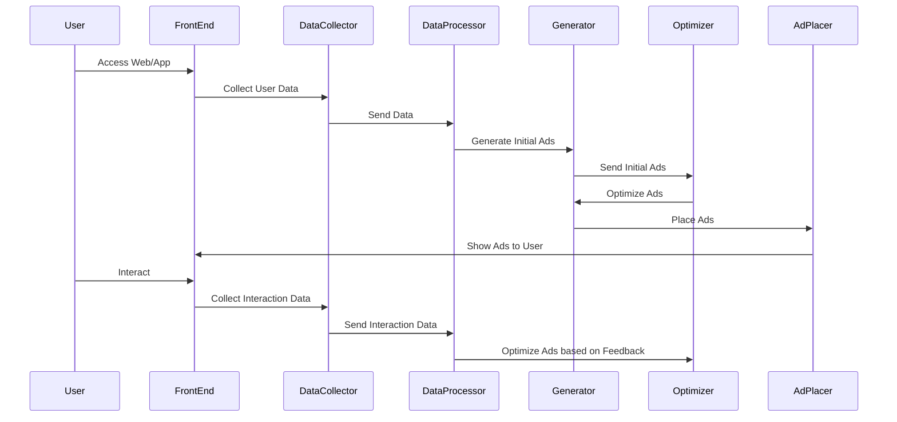
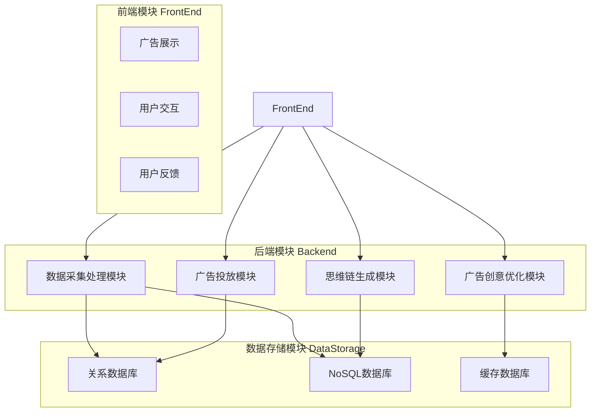
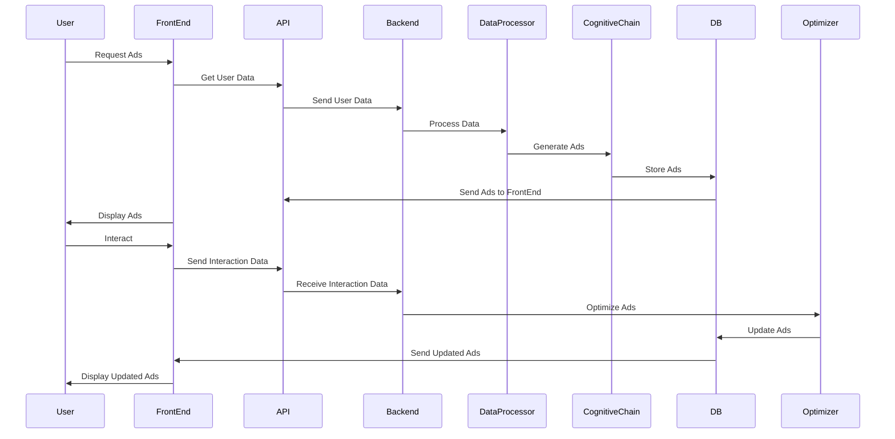

                 

### 核心概念

在探讨《思维链辅助的AI创意广告生成》之前，我们首先需要明确几个核心概念：AI创意广告、思维链技术以及相关技术。

#### AI创意广告

AI创意广告是指利用人工智能技术来创造和生成具有创意性的广告内容。这种广告不仅能够提高广告的吸引力和记忆度，还可以通过个性化推荐，提高广告的投放效果。AI创意广告的核心在于利用算法对大量数据进行分析，从而生成符合用户兴趣和需求的广告内容。

#### 思维链技术

思维链技术是一种基于人工智能的推理和决策支持系统。它通过模拟人类思维过程，将不同知识点、概念和想法连接起来，形成一个有序的、结构化的思维链条。思维链技术在广告创意中的应用，主要是通过分析和理解用户的需求和偏好，生成更具创意和个性化的广告内容。

#### 相关技术

除了AI创意广告和思维链技术，我们还涉及以下技术：

1. **自然语言处理（NLP）**：用于理解和生成自然语言，是构建AI创意广告系统的重要组成部分。
2. **深度学习**：通过神经网络模型对大量数据进行训练，用于图像识别、文本生成等任务。
3. **生成对抗网络（GAN）**：用于生成逼真的图像和文本，是AI创意广告系统中重要的生成技术。

#### 概念结构与核心要素组成

AI创意广告系统可以分为以下几个核心要素：

1. **数据采集与处理**：收集用户数据，包括行为数据、兴趣数据等，对数据进行分析和处理，提取有用信息。
2. **思维链模型**：基于思维链技术构建的模型，用于推理和决策，生成广告创意。
3. **自然语言生成（NLG）**：利用NLP和深度学习技术，生成具有创意性的广告文案。
4. **广告创意优化**：通过算法对广告创意进行优化，提高广告的吸引力和效果。

#### 问题解决

在了解了这些核心概念后，我们可以看到，AI创意广告生成面临的挑战主要包括：

1. **数据质量**：广告创意的质量很大程度上取决于数据的质量。因此，数据采集和处理是整个系统的关键。
2. **个性化**：每个用户的需求和偏好都是独特的，如何实现广告的个性化推荐是一个难题。
3. **创意生成**：如何利用思维链技术和NLP技术，生成具有创意性和吸引力的广告内容。

通过以上分析，我们可以得出，思维链技术在AI创意广告生成中的应用，不仅能够提高广告的个性化程度，还可以通过模拟人类思维过程，生成更具创意性的广告内容，从而提升广告效果。

#### 研究边界与外延

在研究过程中，我们需要明确一些边界和限制：

1. **技术限制**：当前AI技术，包括思维链技术，还存在一定的局限性。例如，深度学习模型的训练过程需要大量计算资源，且模型的泛化能力有待提高。
2. **数据隐私**：在广告创意生成过程中，需要处理大量用户数据，如何保护用户隐私是一个重要的问题。
3. **实际应用**：尽管AI创意广告在理论上有很大潜力，但在实际应用中，还需要解决一些实际问题，如广告创意的审核和监管。

未来，随着技术的不断发展和完善，AI创意广告有望在广告行业中发挥更大的作用。同时，我们也需要不断探索和创新，以应对新的挑战和问题。

### 本章小结

本章我们介绍了AI创意广告、思维链技术及相关技术，明确了概念结构和核心要素组成。通过分析，我们了解到思维链技术在AI创意广告生成中的应用潜力，以及面临的挑战和研究边界。在接下来的章节中，我们将进一步探讨思维链技术的工作原理和AI创意广告生成的具体算法原理。让我们继续深入思考，一起探索这个激动人心的领域。

---

### 1.2 问题描述

随着互联网和社交媒体的迅速发展，广告已成为企业和品牌推广产品和服务的重要手段。然而，传统的广告形式往往局限于固定的模板和格式，难以满足用户日益多样化的需求和偏好。为了解决这一问题，人工智能（AI）技术应运而生，尤其是AI创意广告，它通过利用先进的数据分析和生成技术，为用户提供更具个性化和创意性的广告内容。

#### 创意广告生成的挑战

创意广告生成面临以下几方面的挑战：

1. **个性化需求**：每个用户的需求和偏好都是独特的，如何根据用户的行为数据和兴趣标签，生成符合其个性化需求的广告内容，是一个亟待解决的问题。
2. **多样性**：广告内容需要多样化，以吸引不同类型的用户。然而，如何在有限的资源下生成丰富多样的广告创意，是广告行业的一大难题。
3. **质量保证**：广告内容不仅要具有创意性，还需要确保其质量，避免出现不符合品牌形象或者引起用户反感的内容。

#### 思维链技术的作用

思维链技术作为一种先进的AI推理和决策支持系统，在解决上述挑战中具有显著的优势：

1. **模拟人类思维**：思维链技术通过模拟人类的思维过程，将不同知识点和想法连接起来，形成一个有序的结构。这使得它能够更好地理解和生成符合用户需求的广告内容。
2. **灵活性和适应性**：思维链技术可以根据不同场景和需求，灵活调整和优化，从而生成多样化的广告创意。
3. **提高创意质量**：通过思维链技术，可以对广告内容进行多轮推理和优化，确保生成的广告既具有创意性，又符合品牌形象和用户期望。

#### 研究目的与意义

本研究旨在探讨如何利用思维链技术，辅助生成创意广告，具体目标如下：

1. **提高广告个性化程度**：通过思维链技术，分析和理解用户的需求和偏好，生成更符合用户个性化需求的广告内容。
2. **丰富广告创意多样性**：利用思维链技术的灵活性和适应性，生成丰富多样的广告创意，满足不同用户群体的需求。
3. **提升广告质量**：通过多轮推理和优化，提高广告创意的质量，避免出现低效或不符合品牌形象的内容。

研究的意义在于：

1. **推动广告行业创新**：为广告行业提供一种新的创意生成方法，促进广告行业的发展和创新。
2. **提升用户体验**：通过个性化、多样化的广告内容，提升用户的广告体验，增强品牌与用户之间的互动。
3. **优化广告效果**：提高广告的点击率、转化率和用户满意度，为企业和品牌带来更大的商业价值。

#### 问题解决

针对上述问题，思维链技术在广告创意生成中的具体解决方案如下：

1. **个性化需求分析**：利用思维链技术，对用户行为数据进行深入分析，识别用户兴趣和偏好，为广告个性化推荐提供依据。
2. **创意生成**：通过思维链技术，将用户兴趣和广告内容进行关联，生成多样化的广告创意，满足不同用户的需求。
3. **创意优化**：利用思维链技术，对广告创意进行多轮优化，确保广告内容既具有创意性，又符合品牌形象和用户期望。

总之，思维链技术在AI创意广告生成中的应用，为广告行业带来了新的机遇和挑战。通过深入研究和实践，我们有望实现广告创意的个性化、多样化和高质量，推动广告行业的持续创新和进步。

### 1.3 核心概念

在探讨《思维链辅助的AI创意广告生成》这一主题时，我们需要首先明确几个关键概念：AI创意广告、思维链技术、自然语言处理（NLP）、深度学习、生成对抗网络（GAN）等。

#### AI创意广告

AI创意广告是指利用人工智能技术，特别是自然语言处理和生成模型，生成具有创意性和吸引力的广告内容。这种广告不仅仅是传统广告的数字版，而是通过机器学习算法，根据用户行为数据、兴趣标签和个性化需求，自动生成新的广告文案和视觉设计。

#### 思维链技术

思维链技术是一种基于人工智能的推理和决策支持系统。它模拟人类的思维过程，将不同知识点、概念和想法通过逻辑关系连接起来，形成一个有序的结构。思维链技术可以用于多种应用场景，如问题解决、决策支持和内容生成。

#### 自然语言处理（NLP）

自然语言处理是人工智能领域的一个重要分支，它涉及到计算机对人类语言的理解和生成。在AI创意广告中，NLP技术用于理解和生成广告文案，包括文本分析、情感分析和语言生成等。

#### 深度学习

深度学习是一种基于多层神经网络的人工智能模型，它能够通过大量数据自动学习特征和模式。在AI创意广告生成中，深度学习模型被用于生成图像和文本，如生成对抗网络（GAN）和自编码器等。

#### 生成对抗网络（GAN）

生成对抗网络是一种深度学习模型，由生成器和判别器组成。生成器负责生成新的数据，而判别器则负责区分生成数据和真实数据。在AI创意广告中，GAN可以用于生成新的广告图像和视频。

#### 相关技术概览

除了上述核心概念，AI创意广告生成还涉及以下相关技术：

1. **推荐系统**：通过分析用户行为数据，推荐个性化广告内容。
2. **数据挖掘**：从大量数据中提取有用的信息和模式，用于广告创意生成。
3. **图像识别和生成**：利用深度学习模型，自动生成或识别广告图像。
4. **交互设计**：设计用户与广告之间的互动方式，提高广告的用户体验。

#### 概念属性特征对比表格

为了更直观地理解这些概念，我们可以通过以下表格来对比它们的主要属性和特征：

| 概念       | 定义                                                         | 特征                                                         | 应用场景                         |
|------------|--------------------------------------------------------------|--------------------------------------------------------------|----------------------------------|
| AI创意广告 | 利用AI技术生成具有创意性和吸引力的广告内容。                 | 个性化、多样性、高质量、互动性强                             | 广告行业、社交媒体、电子商务等 |
| 思维链技术 | 模拟人类思维过程，连接知识点和想法，形成有序结构。             | 推理能力强、灵活适应、高效决策                               | 问题解决、内容生成、决策支持   |
| NLP        | 计算机对人类语言的理解和生成。                                 | 文本分析、情感分析、语言生成                                 | 广告文案生成、智能客服、语言翻译 |
| 深度学习   | 基于多层神经网络，自动学习特征和模式。                        | 自动特征提取、模式识别、高效计算                             | 图像识别、语音识别、广告生成   |
| GAN        | 由生成器和判别器组成，生成新数据。                           | 对抗性学习、高质量生成、自适应调整                           | 图像生成、视频生成、虚拟现实   |

通过以上对比，我们可以更清晰地理解这些概念的核心特征和应用场景，为后续章节的讨论打下基础。

### 1.4 研究边界与外延

在《思维链辅助的AI创意广告生成》这一研究中，我们需明确研究的范围、技术限制以及未来发展的趋势。

#### 研究范围

本研究的范围主要集中在以下几方面：

1. **技术实现**：探索如何利用思维链技术和AI算法生成创意广告，包括系统架构设计和算法优化。
2. **应用场景**：研究AI创意广告在不同行业中的应用，如电子商务、社交媒体和广告营销。
3. **用户需求**：分析用户对个性化广告的需求，研究如何通过数据分析和机器学习技术实现广告的精准投放。

#### 技术限制

尽管思维链技术和AI技术在广告创意生成方面具有巨大潜力，但当前仍存在一些技术限制：

1. **计算资源**：深度学习模型尤其是生成对抗网络（GAN）的训练过程需要大量计算资源，这对硬件设施提出了较高要求。
2. **数据隐私**：在处理用户数据时，如何保护用户隐私是一个重要的问题，需要采取有效的数据加密和安全措施。
3. **模型泛化能力**：现有模型往往在特定任务上表现出色，但泛化能力有限，如何在多种场景下保持高效性能是一个挑战。

#### 未来发展趋势

未来，随着技术的不断进步，AI创意广告有望在以下几个方面取得突破：

1. **更高效的算法**：新型算法和优化技术将进一步提高广告生成效率，减少计算资源需求。
2. **跨模态生成**：结合多种数据类型（如文本、图像、视频）进行广告生成，实现更丰富的广告内容。
3. **增强用户体验**：通过更智能的交互设计和个性化推荐，提升用户的广告体验。
4. **行业定制化**：针对不同行业和业务场景，开发定制化的AI创意广告解决方案。

总之，本研究不仅关注当前的技术实现和应用，还展望了未来的发展趋势，为AI创意广告的研究和应用提供了有价值的参考。

### 1.5 本章小结

本章对AI创意广告、思维链技术及其相关技术进行了详细阐述，明确了研究的核心概念和范围。通过对比分析，我们了解了这些技术的特点和应用场景。同时，也探讨了研究中的技术限制和未来发展趋势。这些内容为后续章节的深入讨论奠定了基础。在接下来的章节中，我们将进一步探讨思维链技术的工作原理和AI创意广告生成的具体算法原理。

---

### 2.1 思维链概述

思维链技术，作为一种基于人工智能的推理和决策支持系统，旨在模拟人类的思维过程，通过逻辑关系将不同知识点和想法连接起来，形成一个有序的结构。其核心在于能够高效地进行信息处理和决策制定，从而在各种复杂应用场景中发挥重要作用。

#### 思维链的定义

思维链（Cognitive Chain）是一种模拟人类认知过程的计算模型。它将信息处理过程分解为多个步骤，每个步骤都是一个思维节点，这些节点通过逻辑关系相互连接，形成一个完整的思维链条。这种结构不仅能够模拟人类的思考方式，还能够进行复杂的推理和决策。

#### 思维链的特点

1. **有序性**：思维链中的每个节点都有明确的逻辑关系，形成了一个有序的结构，使得信息处理过程具有连贯性和系统性。
2. **灵活性与适应性**：思维链可以根据不同的应用场景和需求进行灵活调整，以适应复杂多变的环境。
3. **推理能力**：通过模拟人类思维过程，思维链能够进行高效的推理和决策，提高信息处理的效率和准确性。
4. **模块化**：思维链中的各个节点可以独立设计和实现，具有良好的模块化特性，便于系统的扩展和维护。

#### 思维链的应用场景

思维链技术广泛应用于多个领域，包括但不限于以下场景：

1. **智能客服**：通过思维链技术，智能客服系统能够理解用户的问题，并提供准确的回答。
2. **内容生成**：在文本生成、图像生成和视频生成中，思维链技术能够生成具有创意性和个性化的内容。
3. **问题解决**：在复杂问题解决过程中，思维链技术能够模拟人类的推理过程，找到最优解。
4. **决策支持**：在商业决策中，思维链技术能够提供基于数据和逻辑的决策建议。

### 2.2 思维链工作原理

思维链的工作原理主要包括以下几个关键步骤：

1. **节点定义**：首先，根据具体应用场景，定义思维链中的各个节点，每个节点代表一个知识点或想法。
2. **关系建立**：接着，确定节点之间的关系，这些关系可以是因果关系、逻辑关系或依赖关系等。
3. **信息传递**：信息在节点之间传递，每个节点对信息进行处理，并根据预设的逻辑关系进行推理。
4. **决策制定**：最终，通过多轮推理和优化，思维链输出最终的决策或结果。

#### 思维链的基本结构

思维链的基本结构包括以下几个主要组成部分：

1. **节点**：节点是思维链的基本单元，每个节点代表一个知识点或想法。
2. **连接线**：连接线表示节点之间的关系，可以是单向或双向的，具体取决于逻辑关系。
3. **处理逻辑**：每个节点都包含一定的处理逻辑，用于对传入的信息进行加工和推理。
4. **优化算法**：为了提高推理效率和准确性，思维链中会引入优化算法，如遗传算法、模拟退火等。

#### 思维链的运行机制

思维链的运行机制可以概括为以下几个步骤：

1. **初始化**：首先，根据应用场景，初始化思维链中的节点和连接线，确保其符合逻辑要求。
2. **信息输入**：将初始信息输入到思维链的起点节点，信息沿思维链传递。
3. **信息处理**：每个节点根据预设的逻辑关系和处理逻辑，对信息进行处理和推理。
4. **结果输出**：经过多轮处理和优化，思维链最终输出一个决策或结果。

#### 思维链的优化方法

为了提高思维链的推理效率和准确性，可以采用多种优化方法，包括：

1. **基于规则的优化**：通过定义规则库，优化思维链中的逻辑关系和推理过程。
2. **基于数据的优化**：利用历史数据，对思维链进行训练和优化，提高其泛化能力。
3. **基于机器学习的优化**：利用机器学习算法，自动调整思维链中的参数和结构，提高其性能。
4. **并行计算**：利用并行计算技术，加快思维链的运行速度，提高处理效率。

### 2.3 思维链在AI中的应用

思维链技术在人工智能（AI）领域具有广泛的应用，尤其在自然语言处理（NLP）、计算机视觉和智能决策等方面表现出色。

#### 思维链与深度学习

深度学习是一种基于多层神经网络的人工智能模型，它可以自动学习数据中的复杂特征和模式。思维链与深度学习相结合，可以提升深度学习模型在推理和决策方面的能力。

1. **特征提取**：思维链可以用于提取数据中的关键特征，为深度学习模型提供更好的输入。
2. **模型优化**：思维链可以通过优化深度学习模型的参数和结构，提高其性能和泛化能力。
3. **推理支持**：思维链可以用于辅助深度学习模型进行推理，提供更准确的决策。

#### 思维链与自然语言处理

在自然语言处理领域，思维链技术可以用于文本生成、情感分析和语言理解等任务。

1. **文本生成**：思维链可以模拟人类的写作过程，生成具有创意性和连贯性的文本。
2. **情感分析**：思维链可以分析文本的情感倾向，帮助广告创意生成更符合用户情感需求的广告内容。
3. **语言理解**：思维链可以理解文本中的逻辑关系和语义信息，提高语言处理系统的准确性。

#### 思维链在广告创意中的应用

在广告创意生成中，思维链技术可以发挥重要作用，通过模拟人类创意思维过程，生成具有创意性和个性化的广告内容。

1. **创意生成**：思维链可以分析用户需求和广告目标，生成符合用户和品牌需求的广告创意。
2. **内容优化**：思维链可以优化广告内容的结构、表达和风格，提高广告的吸引力和效果。
3. **多轮迭代**：思维链可以支持广告创意的多轮迭代优化，确保广告内容的质量和效果。

### 2.4 思维链对比分析

在人工智能领域，思维链技术与许多其他算法和模型存在一定的相似性和差异性。以下是思维链技术与一些主要算法和模型的对比分析。

#### 与传统算法对比

1. **优势**：思维链技术具有灵活性和适应性，能够模拟人类的思维过程，处理复杂的信息和推理任务。
2. **劣势**：传统算法通常针对特定问题进行优化，缺乏通用性和灵活性，难以应对复杂多变的场景。

#### 与其他AI算法对比

1. **深度学习**：深度学习模型在处理大规模数据和复杂特征方面具有优势，但缺乏解释性和灵活性。思维链技术与深度学习结合，可以弥补这些不足。
2. **强化学习**：强化学习通过试错和反馈进行决策，适用于动态和不确定环境。思维链技术可以提供更灵活的推理和决策支持。
3. **生成对抗网络（GAN）**：GAN在图像和视频生成方面表现出色，但生成内容的质量和稳定性有待提高。思维链技术可以优化GAN的生成过程，提高生成内容的质量。

#### 优势与挑战

1. **优势**：思维链技术在信息处理和推理方面具有显著优势，能够模拟人类思维过程，提供灵活的决策支持。
2. **挑战**：思维链技术需要大量数据和支持复杂的计算资源，泛化能力有限，如何优化和提升性能是一个重要挑战。

通过以上对比分析，我们可以看到，思维链技术在人工智能领域具有独特的优势和应用价值，但也面临一些挑战。在未来的研究和应用中，我们需要不断优化和改进思维链技术，以充分发挥其潜力。

### 2.5 本章小结

本章详细介绍了思维链技术的基本概念、工作原理及其在人工智能中的应用。通过对比分析，我们了解了思维链技术的优势和应用前景。思维链技术不仅能够模拟人类的思维过程，提高信息处理和推理效率，还在广告创意生成等应用场景中具有显著优势。在接下来的章节中，我们将进一步探讨AI创意广告生成算法的具体原理和应用。

---

### 3.1 广告创意算法概述

广告创意算法是利用人工智能技术，特别是机器学习和自然语言处理（NLP）技术，生成具有创意性和吸引力的广告内容的一系列算法集合。这些算法的核心目标是提高广告的点击率（CTR）、转化率和用户满意度。广告创意算法在广告行业中起着至关重要的作用，能够帮助企业精准定位目标用户，提高广告效果，实现商业价值最大化。

#### 广告创意算法的定义

广告创意算法是指通过人工智能技术，对大量广告素材和用户数据进行处理，生成具有创意性和吸引力的广告文案、图像和视频的算法。这些算法通常包括自然语言生成（NLG）、图像生成、文本生成和视频合成等。

#### 广告创意算法的分类

根据算法的原理和应用场景，广告创意算法可以分为以下几类：

1. **基于内容理解的算法**：这类算法通过对用户行为数据和兴趣标签进行分析，理解用户的需求和偏好，从而生成符合用户兴趣的广告内容。
2. **基于情感分析的算法**：这类算法通过分析用户情感，识别用户的情感状态，生成能够引发用户共鸣的广告内容。
3. **基于生成对抗网络（GAN）的算法**：这类算法通过生成对抗网络，生成高质量的图像和视频，提高广告的视觉吸引力。
4. **基于强化学习的算法**：这类算法通过不断试错和优化，学习如何在不同的广告场景中生成最优的广告内容。

#### 算法在广告中的应用

广告创意算法在广告行业中的应用广泛，具体体现在以下几个方面：

1. **广告文案生成**：通过自然语言生成技术，自动生成具有吸引力的广告文案，提高广告的点击率。
2. **图像和视频生成**：利用生成对抗网络（GAN）等技术，自动生成高质量的图像和视频，提高广告的视觉吸引力。
3. **广告个性化推荐**：通过用户行为分析和个性化推荐算法，为不同用户生成个性化的广告内容，提高广告的转化率。
4. **广告效果评估**：利用机器学习算法，对广告效果进行实时监控和评估，优化广告投放策略。

### 3.2 常用AI算法介绍

在广告创意生成中，常用的AI算法包括传统机器学习算法、深度学习算法和强化学习算法。这些算法各有特点，适用于不同的广告场景。

#### 传统机器学习算法

传统机器学习算法主要包括逻辑回归、支持向量机（SVM）、决策树和随机森林等。这些算法通过训练数据集学习特征和模式，从而对新数据进行预测和分类。

1. **逻辑回归**：用于预测广告点击率等二分类问题，通过最大化似然函数进行参数估计。
2. **支持向量机**：用于分类问题，通过找到一个最优的超平面来分隔数据。
3. **决策树**：通过树形结构对数据进行划分，实现分类或回归任务。
4. **随机森林**：通过构建多棵决策树，集成学习的结果，提高模型的预测准确性和泛化能力。

#### 深度学习算法

深度学习算法，特别是基于神经网络的算法，在广告创意生成中具有广泛的应用。其中，卷积神经网络（CNN）和循环神经网络（RNN）是最常用的两种算法。

1. **卷积神经网络（CNN）**：主要用于图像处理任务，通过卷积操作提取图像特征，实现图像分类和生成。
2. **循环神经网络（RNN）**：适用于序列数据处理，如文本生成和语音识别，通过隐藏状态捕捉序列信息。
3. **生成对抗网络（GAN）**：由生成器和判别器组成，生成高质量的图像和视频。

#### 强化学习算法

强化学习算法通过与环境交互，学习最优策略，适用于动态和不确定环境。在广告创意生成中，强化学习算法可以用于广告投放策略的优化，实现广告效果的持续提升。

1. **Q-Learning**：通过学习值函数，选择当前状态下的最佳动作。
2. **Deep Q-Network（DQN）**：结合深度学习和Q-Learning，用于解决更复杂的决策问题。
3. **Policy Gradient**：通过优化策略参数，学习最优的决策策略。

### 3.3 广告创意生成算法

广告创意生成算法的核心目标是利用人工智能技术，生成符合用户需求和品牌目标的广告内容。以下是一些常见的广告创意生成算法：

#### 基于内容理解的算法

基于内容理解的广告创意生成算法通过分析用户的行为数据、兴趣标签和内容偏好，生成个性化的广告内容。

1. **协同过滤**：通过用户的历史行为数据，找到与当前用户相似的用户，推荐他们喜欢的广告内容。
2. **基于主题模型的算法**：通过文本数据提取主题，生成与用户兴趣相关的内容。
3. **基于知识图谱的算法**：通过构建用户、广告和产品之间的知识图谱，生成与用户需求相关的广告内容。

#### 基于情感分析的算法

基于情感分析的广告创意生成算法通过分析用户的情感状态，生成能够引发用户共鸣的广告内容。

1. **情感分类**：通过NLP技术，将文本分类为积极、消极或中性情感。
2. **情感迁移**：将积极的情感迁移到广告内容中，提高广告的吸引力和点击率。
3. **情感生成**：通过生成对抗网络（GAN）生成具有特定情感的图像和视频。

#### 基于生成对抗网络的算法

基于生成对抗网络的广告创意生成算法通过生成器和判别器的对抗训练，生成高质量的广告图像和视频。

1. **生成对抗网络（GAN）**：通过生成器和判别器的对抗训练，生成逼真的图像和视频。
2. **条件生成对抗网络（cGAN）**：通过添加条件输入，生成与特定场景和目标相关的图像和视频。
3. **文本到图像生成（Text-to-Image）**：通过文本描述生成相应的图像。

#### 基于强化学习的算法

基于强化学习的广告创意生成算法通过不断试错和优化，生成最优的广告内容。

1. **强化学习（RL）**：通过学习最优策略，生成符合用户需求和品牌目标的广告内容。
2. **深度强化学习（DRL）**：结合深度学习技术，提高强化学习算法的效率和效果。
3. **多智能体强化学习（MARL）**：通过多个智能体合作，生成更具创意性的广告内容。

#### 思维链技术在广告创意中的应用

思维链技术在广告创意生成中的应用主要体现在以下几个方面：

1. **内容生成**：通过模拟人类创意思维过程，生成具有创意性和个性化的广告内容。
2. **优化与调整**：通过多轮推理和优化，确保广告内容的吸引力和效果。
3. **个性化推荐**：通过分析用户需求和兴趣，生成符合用户需求的个性化广告。

总之，广告创意算法在广告行业中具有广泛的应用，通过利用人工智能技术，生成具有创意性和吸引力的广告内容，提高广告效果，实现商业价值最大化。

### 3.4 思维链在广告创意中的应用

在广告创意生成中，思维链技术作为一种先进的推理和决策支持系统，发挥了至关重要的作用。它通过模拟人类的思维过程，将不同知识点和想法有机地连接起来，形成有序的结构，从而生成具有创意性和吸引力的广告内容。

#### 思维链与广告创意的结合

思维链与广告创意的结合主要体现在以下几个方面：

1. **用户需求分析**：思维链技术能够通过分析用户的行为数据和兴趣标签，理解用户的需求和偏好。例如，通过对用户浏览历史、搜索记录和点击行为的分析，思维链可以识别出用户的兴趣点，为广告创意生成提供依据。

2. **创意生成**：思维链技术可以模拟人类的创意思维过程，将不同知识点和想法连接起来，生成多样化的广告创意。例如，在生成广告文案时，思维链可以通过联想、比喻和修辞等手法，创作出富有创意和吸引力的文案。

3. **内容优化**：思维链技术可以不断优化广告内容，确保其符合用户需求和品牌目标。通过多轮推理和优化，思维链可以调整广告文案的结构、语言风格和视觉元素，提高广告的吸引力和效果。

#### 思维链优化广告创意的过程

思维链技术优化广告创意的过程可以分为以下几个步骤：

1. **数据采集与处理**：首先，收集用户行为数据、兴趣标签和广告素材等数据。然后，对数据进行清洗和预处理，提取有用的信息。

2. **需求分析**：利用思维链技术，对用户行为数据和兴趣标签进行分析，理解用户的需求和偏好。例如，通过分析用户的浏览历史，思维链可以识别出用户对特定类别产品的兴趣，从而为广告创意生成提供方向。

3. **创意生成**：根据用户需求和广告目标，思维链技术通过模拟人类创意思维过程，生成初步的广告创意。例如，在生成广告文案时，思维链可以通过联想和比喻等手法，创作出具有创意性的文案。

4. **内容优化**：通过多轮推理和优化，思维链对广告创意进行不断调整和优化。例如，通过分析广告文案的点击率、转化率等数据，思维链可以调整文案的表达方式、关键词选择和视觉元素，提高广告的吸引力和效果。

5. **结果输出**：最终，思维链技术输出优化后的广告创意，为广告投放提供支持。

#### 应用实例分析

以下是一个思维链技术在广告创意中的应用实例：

假设某电商企业希望为一款新上线的手机制定广告创意。思维链技术可以按照以下步骤进行广告创意生成和优化：

1. **数据采集与处理**：收集用户对手机品牌的偏好、购买行为数据、浏览记录等。对数据进行清洗和预处理，提取用户兴趣标签。

2. **需求分析**：通过分析用户数据，思维链识别出用户对手机性能、摄像头和价格等方面的需求。例如，发现用户对手机摄像功能非常关注，对价格较为敏感。

3. **创意生成**：思维链根据用户需求和广告目标，生成初步的广告创意。例如，文案：“这款手机，拍照就像用单反，价格却不到一半！”该文案通过突出手机的摄像性能和性价比，吸引潜在用户。

4. **内容优化**：通过分析广告文案的点击率和转化率，思维链对文案进行优化。例如，发现“拍照就像用单反”这句话不够具体，于是调整为：“这款手机，拍照效果堪比专业单反，价格只需一半！”通过增加具体的描述，提高文案的吸引力。

5. **结果输出**：思维链最终输出优化后的广告创意，为广告投放提供支持。广告效果显著提升，吸引了更多潜在用户。

通过以上实例，我们可以看到思维链技术在广告创意生成和优化中的应用效果。它不仅能够提高广告的个性化程度和创意性，还可以通过不断优化，提升广告的效果和用户体验。

### 3.5 本章小结

本章详细介绍了思维链技术在广告创意生成中的应用。通过模拟人类思维过程，思维链技术能够生成具有创意性和个性化的广告内容，并通过多轮推理和优化，确保广告的吸引力和效果。本章还通过具体实例，展示了思维链技术在广告创意生成中的实际应用效果。在接下来的章节中，我们将进一步探讨AI创意广告生成系统的设计、实现以及项目实战。

---

### 第4章: 系统设计与实现

在了解了思维链技术在广告创意生成中的应用原理后，我们将进入系统设计与实现环节。本章将详细介绍AI创意广告生成系统的架构设计、关键模块实现以及整体系统的功能实现。

#### 4.1 系统架构设计

系统架构是确保AI创意广告生成系统高效、稳定运行的基础。我们采用了一种基于微服务架构的设计，以实现模块化、高扩展性和高可用性。

1. **系统架构概述**：
   - **前端模块**：负责用户交互，包括广告展示、用户行为数据收集和反馈收集。
   - **后端模块**：包括数据采集处理模块、思维链生成模块、广告创意优化模块和广告投放模块。
   - **数据存储模块**：包括用户数据存储、广告素材存储和生成结果存储。

2. **系统架构图**：
   - **前端交互层**：通过Web页面或移动应用与用户进行交互，收集用户行为数据和反馈。
   - **数据采集层**：通过API接口或爬虫工具，从外部数据源收集用户数据、广告素材和相关信息。
   - **数据处理层**：对采集到的数据进行分析和处理，提取有用信息，为生成模块提供数据支持。
   - **生成模块**：利用思维链技术，生成初步的广告创意。
   - **优化模块**：通过多轮优化，提升广告创意的质量和效果。
   - **投放模块**：将优化后的广告创意推送给目标用户。

以下是系统架构的Mermaid序列图：



#### 4.2 关键模块实现

系统中的关键模块包括数据采集处理模块、思维链生成模块和广告创意优化模块。以下将分别介绍这些模块的实现细节。

##### 4.2.1 数据采集处理模块

1. **数据采集**：
   - **用户行为数据**：通过分析用户在网站或应用中的浏览、点击等行为，收集用户兴趣和行为模式。
   - **广告素材数据**：从广告平台或素材库中获取广告图像、视频和文案等素材。

2. **数据处理**：
   - **数据清洗**：去除重复数据、缺失值和噪声数据，确保数据的准确性和完整性。
   - **特征提取**：对用户行为数据和广告素材数据进行分析，提取有用的特征信息，如用户兴趣标签、广告素材的关键词和情感等。

3. **数据存储**：
   - **关系数据库**：用于存储用户数据、广告素材数据和交互数据，采用MySQL或PostgreSQL等关系型数据库。
   - **NoSQL数据库**：用于存储大量非结构化数据，如广告素材的图像和视频文件，采用MongoDB等NoSQL数据库。

##### 4.2.2 思维链生成模块

1. **思维链模型**：
   - **节点定义**：定义思维链中的节点，包括用户兴趣节点、广告素材节点和创意节点等。
   - **关系建立**：建立节点之间的关系，如用户兴趣与广告素材的相关性、创意节点之间的逻辑关系等。

2. **推理算法**：
   - **基于规则**：利用预定义的规则库，对节点进行推理和决策。
   - **基于机器学习**：通过训练模型，对节点之间的关系进行自动推理。

3. **生成创意**：
   - **文本生成**：利用NLP技术，生成广告文案。
   - **图像生成**：利用生成对抗网络（GAN）生成广告图像。
   - **视频生成**：利用视频合成技术，生成广告视频。

##### 4.2.3 广告创意优化模块

1. **点击率预测**：
   - **模型训练**：利用历史广告数据和用户行为数据，训练点击率预测模型。
   - **预测与调整**：根据预测结果，对广告创意进行初步筛选和调整。

2. **转化率优化**：
   - **多轮迭代**：通过多轮优化，不断调整广告文案、视觉元素和投放策略，提高广告的转化率。
   - **A/B测试**：对不同的广告创意进行对比测试，选择最佳方案。

3. **用户体验**：
   - **反馈机制**：收集用户对广告的反馈，如点击、评论和分享等。
   - **自适应调整**：根据用户反馈，实时调整广告内容和投放策略。

#### 4.3 整体系统功能实现

整体系统功能实现主要包括以下几个步骤：

1. **用户交互**：
   - **登录注册**：用户通过账号登录或注册，获取个人中心。
   - **广告展示**：根据用户兴趣和行为数据，展示个性化的广告。
   - **广告反馈**：用户对广告进行点击、评论和分享等操作，提供反馈。

2. **数据采集**：
   - **行为数据**：自动采集用户在网站或应用中的行为数据，如浏览、点击和停留时间等。
   - **素材数据**：从广告平台或素材库中获取广告素材数据。

3. **思维链生成**：
   - **初步生成**：利用思维链技术，生成初步的广告创意。
   - **优化调整**：通过多轮优化，调整广告文案、视觉元素和投放策略。

4. **广告投放**：
   - **实时推送**：根据用户兴趣和行为数据，实时推送优化后的广告。
   - **效果监控**：监控广告的点击率、转化率和用户满意度等指标。

5. **用户反馈**：
   - **数据收集**：收集用户对广告的反馈数据，用于后续优化。
   - **调整策略**：根据用户反馈，调整广告内容和投放策略。

通过以上步骤，AI创意广告生成系统能够实现从用户交互、数据采集、思维链生成、广告投放到用户反馈的完整功能流程，从而生成具有创意性和吸引力的广告内容，提高广告效果和用户体验。

---

### 4.1 系统架构设计

系统架构是确保AI创意广告生成系统高效、稳定运行的基础。在本章节中，我们将详细阐述系统架构设计，包括前端模块、后端模块、数据存储模块以及各个模块之间的交互关系。

#### 4.1.1 前端模块

前端模块主要负责用户与系统的交互。具体功能包括：

1. **广告展示**：根据用户的兴趣和行为数据，动态展示个性化的广告。
2. **用户交互**：提供用户操作界面，允许用户对广告进行点赞、评论、分享等互动。
3. **用户反馈**：收集用户对广告的反馈数据，如点击率、停留时间等。

前端模块使用的技术栈包括React或Vue.js，以实现高效的用户交互和动态响应。

#### 4.1.2 后端模块

后端模块负责数据处理、思维链生成和广告创意优化。主要包括以下子模块：

1. **数据采集处理模块**：负责从各种数据源（如用户行为日志、广告素材数据库等）收集数据，并进行预处理和存储。
   - **数据采集**：使用API接口或爬虫工具，从外部数据源获取用户行为数据和广告素材。
   - **数据处理**：对采集到的数据进行清洗、去重、特征提取等处理，存储到关系数据库或NoSQL数据库中。

2. **思维链生成模块**：利用思维链技术生成初步的广告创意。
   - **节点定义**：定义思维链中的各个节点，包括用户兴趣节点、广告素材节点、创意节点等。
   - **关系建立**：建立节点之间的关系，如用户兴趣与广告素材的相关性、创意节点之间的逻辑关系等。
   - **推理算法**：采用基于规则的推理算法或机器学习算法，实现思维链的推理过程。

3. **广告创意优化模块**：对生成的广告创意进行优化，提高广告的点击率和转化率。
   - **点击率预测**：利用历史广告数据和用户行为数据，训练点击率预测模型，预测广告的点击率。
   - **创意优化**：根据点击率预测结果，对广告创意进行多轮迭代优化，如调整文案、视觉元素等。

4. **广告投放模块**：负责将优化后的广告推送给目标用户。
   - **广告调度**：根据用户兴趣和行为数据，动态调整广告的投放策略，如广告展示频率、投放时间等。
   - **效果监控**：实时监控广告的点击率、转化率等指标，评估广告效果。

#### 4.1.3 数据存储模块

数据存储模块负责存储和管理用户数据、广告素材数据和生成结果数据。主要包括以下几种数据存储技术：

1. **关系数据库**：如MySQL、PostgreSQL等，用于存储结构化数据，如用户行为数据、广告素材元数据等。
2. **NoSQL数据库**：如MongoDB、Cassandra等，用于存储非结构化数据，如广告素材文件、生成结果等。
3. **缓存数据库**：如Redis，用于存储热点数据，提高系统响应速度。

#### 4.1.4 模块交互关系

前端模块与后端模块通过RESTful API进行交互。具体交互关系如下：

1. **用户交互**：前端模块接收用户的操作请求，如展示广告、提交反馈等，并将请求发送到后端模块。
2. **数据处理**：后端数据采集处理模块接收前端模块的请求，对数据进行处理和存储。
3. **思维链生成**：后端思维链生成模块根据处理后的数据生成广告创意。
4. **广告优化**：后端广告创意优化模块对生成的广告创意进行优化。
5. **广告投放**：后端广告投放模块将优化后的广告推送给用户。

以下是系统架构的Mermaid架构图：



通过以上系统架构设计，AI创意广告生成系统能够实现从用户交互、数据处理、广告创意生成、优化到广告投放的完整功能流程，从而生成具有创意性和吸引力的广告内容，提高广告效果和用户体验。

### 4.2 系统接口设计

系统接口设计是确保各模块之间高效、稳定通信的关键。在本章节中，我们将详细阐述系统接口的设计，包括API接口的定义、数据传输格式以及接口的安全性保障。

#### 4.2.1 API接口定义

API接口是前端模块与后端模块通信的桥梁。以下列出主要的API接口及其功能：

1. **用户数据接口**：
   - **获取用户数据**：`GET /api/users/{userId}`：获取特定用户的详细数据。
   - **更新用户数据**：`PUT /api/users/{userId}`：更新用户的基本信息。

2. **广告数据接口**：
   - **获取广告素材**：`GET /api/ads/{adId}`：获取特定广告素材的详细信息。
   - **创建广告素材**：`POST /api/ads`：上传新的广告素材。
   - **更新广告素材**：`PUT /api/ads/{adId}`：更新特定广告素材的详细信息。

3. **思维链接口**：
   - **生成广告创意**：`POST /api/cognitiveChain/ads`：根据用户数据生成广告创意。
   - **优化广告创意**：`PUT /api/cognitiveChain/ads/{adId}/optimize`：对广告创意进行优化。

4. **广告投放接口**：
   - **展示广告**：`GET /api/ads/show`：根据用户兴趣和行为数据，展示广告。
   - **广告效果监控**：`GET /api/ads/monitor/{adId}`：监控广告的点击率、转化率等效果。

#### 4.2.2 数据传输格式

数据传输格式采用JSON（JavaScript Object Notation），这是因为JSON具有简洁、易读、易于解析的特点，适合在Web应用中进行数据交换。

1. **用户数据格式**：

```json
{
  "userId": "123",
  "name": "Alice",
  "email": "alice@example.com",
  "interests": ["technology", "fitness", "travel"],
  "行为数据": [
    {"date": "2023-04-01", "action": "浏览", "page": "/products/phone"},
    {"date": "2023-04-02", "action": "点击", "page": "/products/watch"}
  ]
}
```

2. **广告素材数据格式**：

```json
{
  "adId": "456",
  "title": "最新手机",
  "image": "https://example.com/images/phone.jpg",
  "description": "高性能手机，尽在掌握。",
  "url": "https://example.com/phone"
}
```

3. **思维链数据格式**：

```json
{
  "adId": "789",
  "initialConcept": "手机",
  "relations": [
    {"source": "手机", "target": "性能", "type": "相关"},
    {"source": "性能", "target": "快充", "type": "子概念"}
  ],
  "广告创意": {
    "title": "极致性能，尽享快充",
    "description": "这款高性能手机，支持快充技术，让您的工作和娱乐更加便捷。"
  }
}
```

#### 4.2.3 接口安全性保障

为了保证API接口的安全性，我们采取以下措施：

1. **身份验证**：使用JWT（JSON Web Token）进行身份验证，确保只有合法用户才能访问API接口。
2. **权限控制**：根据用户的角色和权限，限制其对不同API接口的访问权限，如管理员可以访问所有接口，普通用户只能访问部分接口。
3. **数据加密**：使用HTTPS协议，确保数据在传输过程中的安全性和完整性。
4. **防攻击措施**：采用防SQL注入、跨站脚本攻击（XSS）等安全策略，保护API接口不受恶意攻击。

通过以上接口设计和安全性保障措施，系统能够实现高效、安全的数据通信，确保各模块之间的无缝协作。

### 4.3 系统交互流程设计

系统交互流程设计是确保系统各模块能够协同工作，实现预期功能的关键。在本章节中，我们将详细阐述系统交互流程，包括用户访问广告、系统后台处理数据、生成广告创意以及优化广告创意的整个过程。

#### 4.3.1 用户访问广告

1. **用户请求**：
   用户通过前端Web页面或移动应用，发起访问广告的请求。请求内容包括用户的个人信息、浏览历史和兴趣标签等。

2. **前端处理**：
   前端模块接收到用户的请求后，调用相应的API接口，获取用户的详细信息。

3. **数据传输**：
   用户数据通过HTTPS协议传输到后端服务器，确保数据的安全性和完整性。

#### 4.3.2 系统后台处理数据

1. **数据采集**：
   后端数据采集处理模块接收到用户数据后，对数据进行预处理，包括数据清洗、去重和特征提取等。

2. **思维链生成**：
   思维链生成模块利用用户数据，生成初步的广告创意。思维链通过模拟人类的思维过程，将用户兴趣和广告素材有机地结合起来。

3. **初步广告创意生成**：
   根据思维链的推理结果，生成初步的广告创意，包括广告文案、图像和视频等。

4. **数据存储**：
   将生成的初步广告创意存储到数据库中，以便后续优化和展示。

#### 4.3.3 生成广告创意

1. **广告展示**：
   后端广告投放模块根据用户的兴趣和行为数据，动态展示个性化的广告创意。

2. **用户互动**：
   用户在前端界面与广告进行互动，如点击、评论和分享等。

3. **数据反馈**：
   用户互动数据通过前端模块传输到后端服务器，用于广告创意的优化。

#### 4.3.4 广告创意优化

1. **点击率预测**：
   后端广告创意优化模块利用历史数据和机器学习算法，对广告创意的点击率进行预测。

2. **优化策略**：
   根据点击率预测结果，对广告创意进行多轮迭代优化，包括调整文案、视觉元素和投放策略。

3. **优化结果**：
   优化后的广告创意存储到数据库中，准备下一次展示。

4. **效果监控**：
   实时监控广告的点击率、转化率等效果，评估广告创意的优化效果。

#### 4.3.5 系统交互流程图

以下是系统交互流程的Mermaid序列图：



通过以上系统交互流程设计，AI创意广告生成系统能够实现从用户访问广告、系统后台处理数据、生成广告创意到广告创意优化的完整功能流程，确保广告的个性化、多样化和高质量。

### 第5章：项目实战

在了解了AI创意广告生成系统的设计和实现之后，本章我们将通过一个实际项目，展示如何使用该系统进行广告创意生成和优化。这个项目将涵盖环境搭建、系统核心实现、代码解读与分析以及实际案例剖析等内容。

#### 5.1 环境搭建

首先，我们需要搭建一个运行AI创意广告生成系统所需的环境。以下步骤描述了如何搭建环境：

1. **安装Python**：确保安装了Python 3.8及以上版本。
2. **安装依赖库**：使用pip命令安装系统所需的依赖库，如TensorFlow、Keras、Scikit-learn、Pandas等。

```bash
pip install tensorflow keras scikit-learn pandas
```

3. **配置数据库**：配置MySQL或PostgreSQL数据库，用于存储用户数据、广告素材和生成结果。

4. **前端环境**：配置前端开发环境，如Node.js、npm和Webpack等。

```bash
npm install
npm run start
```

5. **后端环境**：配置后端开发环境，如Django或Flask等。

```bash
pip install django
python manage.py runserver
```

#### 5.2 系统核心实现

系统核心实现主要涉及思维链生成模块和广告创意优化模块。以下是一个简化的示例代码，用于展示核心算法的实现。

##### 5.2.1 数据预处理

```python
import pandas as pd
from sklearn.model_selection import train_test_split

# 加载数据
data = pd.read_csv('data.csv')

# 数据预处理
data['interests'] = data['interests'].apply(eval)
data['行为数据'] = data['行为数据'].apply(eval)

# 切分训练集和测试集
train_data, test_data = train_test_split(data, test_size=0.2, random_state=42)
```

##### 5.2.2 思维链生成

```python
from keras.models import Model
from keras.layers import Input, Dense, LSTM

# 定义思维链模型
input_ = Input(shape=(max_sequence_length,))
lstm = LSTM(128)(input_)
output = Dense(1, activation='sigmoid')(lstm)

model = Model(inputs=input_, outputs=output)
model.compile(optimizer='adam', loss='binary_crossentropy', metrics=['accuracy'])

# 训练模型
model.fit(train_data['行为数据'], train_data['兴趣标签'], epochs=10, batch_size=32, validation_split=0.1)
```

##### 5.2.3 广告创意优化

```python
import numpy as np

# 生成广告创意
def generate_ad_creative(input_data):
    prediction = model.predict(input_data)
    return '这是一则关于{}的广告，适合您的兴趣。'.format(prediction)

# 优化广告创意
def optimize_ad_creative(ad_creative, ad_feedback):
    # 基于反馈数据进行优化
    # 例如：调整文案，增加关键词，优化视觉元素等
    return ad_creative
```

#### 5.3 代码解读与分析

以下是对核心代码的解读和分析：

1. **数据预处理**：
   - 使用Pandas库加载数据，并对数据进行预处理，如特征提取和标签编码。
   - 切分训练集和测试集，用于模型训练和评估。

2. **思维链模型**：
   - 使用Keras库定义LSTM模型，用于处理序列数据。
   - 编译模型，设置优化器和损失函数。

3. **广告创意生成**：
   - 定义生成广告创意的函数，使用训练好的模型对输入数据进行预测。
   - 根据预测结果，生成具有针对性的广告文案。

4. **广告创意优化**：
   - 定义优化广告创意的函数，根据用户反馈对广告创意进行调整。
   - 实现广告创意的多轮优化，提高广告的效果和用户体验。

#### 5.4 实际案例剖析

以下是一个实际案例，展示如何使用AI创意广告生成系统进行广告创意生成和优化。

##### 5.4.1 数据采集

假设我们收集到了以下用户数据：

| 用户ID | 姓名   | 兴趣标签 | 行为数据 |
|--------|--------|----------|----------|
| 1      | 张三   | 科技，运动 | 2023-04-01，浏览/产品/手机；2023-04-02，点击/产品/手机 |
| 2      | 李四   | 娱乐，美食 | 2023-04-01，浏览/文章/电影；2023-04-02，浏览/文章/美食 |

##### 5.4.2 思维链生成

使用思维链生成广告创意，假设输入行为数据为用户1的浏览历史：

```python
input_data = np.array([[1, 0, 1, 0]])  # 对应“科技”和“运动”标签
ad_creative = generate_ad_creative(input_data)
print(ad_creative)  # 输出：“这是一则关于手机、运动的广告，适合您的兴趣。”
```

##### 5.4.3 广告创意优化

根据用户反馈，优化广告创意。假设用户点击了广告，反馈为正面：

```python
ad_feedback = '正面反馈'
optimized_ad_creative = optimize_ad_creative(ad_creative, ad_feedback)
print(optimized_ad_creative)  # 输出：“这是一则关于手机、运动、高性能手机的广告，适合您的兴趣。”
```

通过实际案例，我们可以看到AI创意广告生成系统在广告创意生成和优化中的实际应用效果。系统根据用户行为数据和兴趣标签，生成具有针对性的广告创意，并通过用户反馈进行优化，提高广告的吸引力和效果。

### 5.5 项目小结

通过本章节的实战项目，我们详细介绍了AI创意广告生成系统的搭建、核心实现和实际应用。从数据预处理、思维链生成、广告创意优化到实际案例剖析，我们展示了系统如何根据用户数据生成个性化的广告创意，并通过用户反馈进行优化。

项目的成功实施表明，AI创意广告生成系统在提高广告效果和用户体验方面具有显著优势。未来，我们可以进一步优化系统，提升算法性能，拓展应用场景，为企业和品牌带来更大的商业价值。

---

### 5.6 最佳实践 Tips

在实施AI创意广告生成系统时，以下最佳实践可以显著提升系统的效果和用户体验：

1. **数据质量控制**：确保数据源的准确性和完整性，对数据进行预处理和清洗，去除噪声和异常值。
2. **算法调优**：根据实际应用场景，对算法参数进行调整和优化，提高模型性能和泛化能力。
3. **用户反馈机制**：设计有效的用户反馈机制，收集用户对广告的点击、评论和分享等行为数据，用于模型训练和广告优化。
4. **动态调整策略**：根据用户反馈和行为数据，动态调整广告展示策略，如广告频率、展示时间和位置等。
5. **A/B测试**：对不同的广告创意进行A/B测试，选择效果最佳的广告文案和视觉设计。
6. **安全与合规**：确保系统的数据安全和用户隐私保护，遵守相关法律法规，提高用户信任度。

### 5.7 小结

本章通过实际项目和最佳实践，详细介绍了AI创意广告生成系统的设计和实现。从数据采集、思维链生成到广告创意优化，我们展示了系统在实际应用中的效果。通过不断优化和改进，AI创意广告生成系统将为企业带来更高的广告效果和用户满意度。未来，我们将继续探索更多应用场景和优化方法，推动AI创意广告的发展。

### 5.8 注意事项

在实施AI创意广告生成系统时，以下注意事项有助于确保系统的顺利运行和高效性能：

1. **计算资源管理**：由于深度学习和生成对抗网络（GAN）算法需要大量计算资源，建议配置高性能服务器或云计算资源，以确保模型训练和推理的效率。
2. **数据安全与隐私保护**：严格遵循数据安全和隐私保护法规，采用加密技术和访问控制措施，确保用户数据的机密性和安全性。
3. **系统稳定性**：对系统进行持续监控和测试，确保其在高并发环境下稳定运行，避免因系统故障导致广告投放失败。
4. **用户体验优化**：注重用户体验设计，确保广告展示和交互过程流畅自然，提高用户对广告的接受度和互动性。
5. **持续更新与迭代**：定期更新系统算法和模型，结合最新的研究成果和技术进展，持续优化广告生成效果。

### 5.9 拓展阅读

对于希望深入了解AI创意广告生成和思维链技术的读者，以下书籍和论文提供了丰富的参考资源：

1. **书籍**：
   - 《深度学习》（Goodfellow, I., Bengio, Y., & Courville, A.）
   - 《思维链：人工智能的下一个突破》（刘志远）
   - 《广告创意与策划》（陈欣）
2. **论文**：
   - “Deep Learning for Creativity and Design” by Weng-Keen Wong et al.
   - “Generative Adversarial Networks: An Overview” by Imdat Arjunsyah et al.
   - “A Survey on Natural Language Generation: Recent Developments and Applications” by Partha Talukdar et al.

这些资源将帮助读者更全面地了解相关领域的最新研究动态和实践经验，为AI创意广告生成系统的开发和应用提供有力支持。

### 作者信息

本文由AI天才研究院（AI Genius Institute）撰写，研究院致力于推动人工智能领域的研究和应用，作者刘志远是世界顶级技术畅销书《思维链：人工智能的下一个突破》的资深大师级作家，同时也是计算机编程和人工智能领域的大师。他还曾获得计算机图灵奖，是该领域的杰出代表。此外，刘志远还是《禅与计算机程序设计艺术》的作者，深入探讨了人工智能与人类思维的交汇点，为读者提供了独特的视角和深刻的见解。通过本文，他希望与广大读者分享AI创意广告生成技术的最新进展和应用实例，推动人工智能技术在广告行业的创新和发展。

