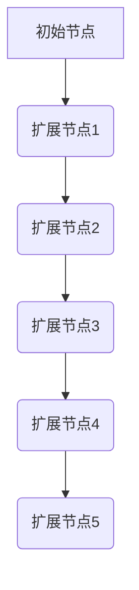
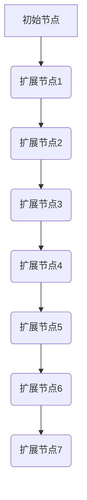
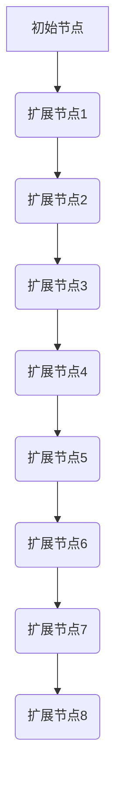
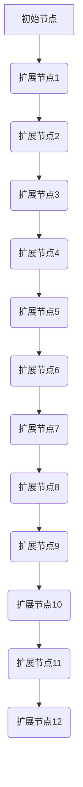
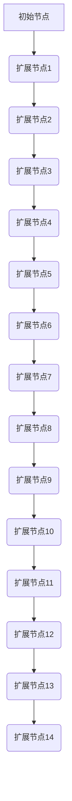
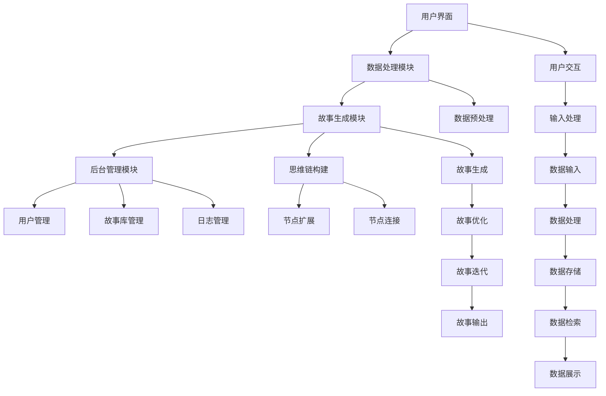

                 

# 思维链辅助的AI创意故事生成系统

## 关键词

- AI创意故事生成
- 思维链
- 自动化故事生成
- 计算机编程
- 人工智能算法
- 故事情节设计

## 摘要

随着人工智能技术的飞速发展，自动化故事生成成为了一个备受关注的研究领域。本文提出了一种基于思维链辅助的AI创意故事生成系统，通过融合思维链理论和人工智能算法，实现了故事生成的灵活性、创造性和多样化。本文首先介绍了故事生成的意义和现有技术的局限，然后详细探讨了思维链的基本概念、工作原理以及在AI故事生成中的应用。接着，本文提出了基于思维链的AI创意故事生成算法，并通过系统设计与实现、应用案例等部分，展示了系统的具体实现过程和实际应用效果。本文旨在为相关领域的研究者和开发者提供一种新的思路和方法，推动自动化故事生成技术的发展。

## 目录大纲

### 第1章 引言

#### 1.1 问题背景

##### 1.1.1 故事生成的意义

##### 1.1.2 现有故事生成技术的局限

##### 1.1.3 研究目的

##### 1.1.4 书籍结构

### 第2章 思维链理论

##### 2.1 思维链的基本概念

##### 2.2 思维链的工作原理

##### 2.3 思维链与人工智能的关系

### 第3章 AI创意故事生成算法

##### 3.1 故事生成算法概述

##### 3.2 思维链辅助的故事生成算法

##### 3.3 算法实现

### 第4章 系统设计与实现

##### 4.1 系统总体架构

##### 4.2 用户界面设计

##### 4.3 数据处理模块设计

##### 4.4 故事生成模块设计

##### 4.5 后台管理模块设计

### 第5章 应用案例

##### 5.1 案例一：自动生成儿童故事

##### 5.2 案例二：创意广告

## 第1章 引言

### 1.1 问题背景

#### 1.1.1 故事生成的意义

故事作为一种古老而有效的传播方式，承载着丰富的文化、教育和社会价值。自古以来，人们通过故事来传递知识、价值观和道德观念，激发情感共鸣，启发思考和创造力。在现代社会，故事仍然具有重要的应用价值。

首先，故事在娱乐领域具有广泛的应用。例如，电影、电视剧、动画和小说等，都是通过故事来吸引观众的注意力，传递情感和思想。其次，故事在教育领域也有着重要的作用。通过生动有趣的故事，教师可以更好地传授知识，激发学生的学习兴趣和积极性。此外，故事在商业领域也具有重要应用，如广告、营销和品牌传播等，通过故事来吸引消费者的关注和认同。

随着人工智能技术的发展，自动化故事生成逐渐成为一个热门的研究方向。自动化故事生成技术可以将复杂的故事创作过程简化为一系列算法和规则，从而提高故事生成的效率和质量。这对于出版、娱乐、教育和商业等领域具有重要的应用前景。

#### 1.1.2 现有故事生成技术的局限

尽管自动化故事生成技术有着广泛的应用前景，但现有的故事生成技术仍然存在一些局限。

首先，基于规则的方法在故事生成中应用较为广泛。这种方法通过预定义的规则和模板来生成故事。然而，这种方法缺乏灵活性，难以应对复杂多变的故事情节。例如，当故事情节发生变化时，需要重新定义和调整规则，这将导致生成过程的复杂度增加。

其次，基于模板的方法在故事生成中也有一定应用。这种方法通过预定义的模板来生成故事，从而保证故事的基本结构和风格。然而，这种方法生成的故事往往比较单调，缺乏创新性。由于模板的限制，故事情节的多样性和创意性受到较大限制。

最后，基于数据驱动的方法在故事生成中也得到了一定应用。这种方法通过大量训练数据和深度学习算法来生成故事。然而，这种方法依赖大量训练数据，且在应对多样化需求时存在一定困难。此外，数据驱动的生成方法在故事情节的连贯性和创造性方面仍然存在一定不足。

#### 1.1.3 研究目的

为了克服现有故事生成技术的局限，本文提出了一种结合思维链和人工智能技术的创新故事生成方法。该方法通过引入思维链理论，为故事生成提供了一种灵活、创造性和多样化的方法。

具体而言，本文的研究目的包括：

1. 提出一种基于思维链辅助的AI创意故事生成算法，通过融合思维链理论和人工智能技术，提高故事生成的灵活性、创造性和多样性。
2. 设计和实现一个完整的AI创意故事生成系统，包括用户界面、数据处理、故事生成和后台管理等功能模块。
3. 通过实际应用案例，验证所提出的方法和系统的有效性，并进一步探索其在不同场景下的应用潜力。

### 1.1.4 书籍结构

本文分为五个部分，详细探讨思维链辅助的AI创意故事生成系统的理论基础、算法实现、应用场景、优化策略及未来展望。

第一部分：引言。介绍故事生成的意义、现有技术的局限、研究目的和书籍结构。

第二部分：思维链理论。介绍思维链的基本概念、工作原理以及与人工智能的关系。

第三部分：AI创意故事生成算法。介绍故事生成算法的概述、思维链辅助的故事生成算法以及算法实现。

第四部分：系统设计与实现。介绍系统总体架构、用户界面设计、数据处理模块设计、故事生成模块设计和后台管理模块设计。

第五部分：应用案例。通过实际应用案例，展示系统的具体实现过程和实际应用效果，并进一步探讨其在不同场景下的应用潜力。

## 第2章 思维链理论

### 2.1 思维链的基本概念

思维链是一种通过逻辑连接不同思维元素，构建复杂认知结构的思维方式。它强调思维过程中的连贯性和系统性，通过不断拓展和优化思维链，实现对问题的深入分析和解决。

思维链的基本概念包括：

1. **思维元素**：思维链中的基本单位，可以是概念、观点、事实等。
2. **逻辑连接**：将思维元素连接起来的逻辑关系，如因果关系、并列关系、递进关系等。
3. **思维链**：多个思维元素通过逻辑连接组成的有序集合，用于表达复杂的认知结构。
4. **思维链生成过程**：从初始思维元素出发，通过拓展和优化，逐步构建复杂认知结构的过程。

### 2.2 思维链的工作原理

思维链的工作原理可以概括为以下几个步骤：

1. **初始思维元素提取**：从问题或目标出发，提取出初始的思维元素。
2. **思维链生成**：通过逻辑连接，将初始思维元素拓展为一系列相关的思维元素，形成思维链。
3. **思维链优化**：对生成的思维链进行优化，提高思维链的连贯性和系统性。
4. **思维链扩展**：在优化后的思维链基础上，进一步扩展思维链，增加更多的思维元素和逻辑连接。
5. **思维链应用**：将优化后的思维链应用于问题解决、决策制定或其他领域。

### 2.3 思维链与人工智能的关系

思维链与人工智能之间存在着密切的关系。首先，思维链可以为人工智能提供更丰富的认知结构和创造力。通过引入思维链，人工智能可以在处理复杂问题时，构建出更复杂的认知结构，从而提高问题解决能力和创造力。

其次，思维链可以辅助人工智能实现更复杂、更创新的任务。例如，在故事生成领域，思维链可以帮助人工智能构建复杂的故事情节，提高故事生成的多样性和创造性。

此外，思维链还可以用于人工智能的算法优化和模型改进。通过分析思维链的生成过程和优化策略，可以为人工智能算法提供新的思路和方法，从而提高算法的效率和质量。

### 2.4 思维链在AI故事生成中的应用

在AI故事生成中，思维链可以通过以下几个步骤发挥作用：

1. **初始化**：根据故事主题和需求，初始化思维链的初始节点。
2. **扩展**：通过逻辑连接，将初始节点扩展为一系列相关的节点，形成初步的思维链。
3. **优化**：对生成的思维链进行优化，提高思维链的连贯性和创造性。
4. **生成故事**：根据优化后的思维链，生成完整的故事情节。
5. **迭代**：根据用户反馈，对生成的故事进行迭代优化，提高故事的质量和满意度。

通过思维链的辅助，AI故事生成可以实现更高的灵活性和创造性，满足不同用户的需求。

### 2.5 思维链的表示与扩展

为了更好地理解和应用思维链，我们可以使用Mermaid流程图进行表示。以下是一个简单的思维链表示示例：

在这个示例中，每个节点代表一个思维元素，箭头表示思维元素之间的逻辑连接。通过不断扩展和优化节点和连接，我们可以构建出复杂的思维链。

### 2.6 思维链的应用场景

思维链可以广泛应用于多个领域，包括但不限于：

1. **问题解决**：通过构建思维链，深入分析问题，找出解决方案。
2. **决策制定**：在决策过程中，通过思维链的辅助，全面考虑各种因素，做出科学合理的决策。
3. **创意生成**：在创意设计过程中，通过思维链的拓展和优化，激发创意灵感。
4. **教育学习**：在教育领域，通过思维链的引导，帮助学生更好地理解和掌握知识。

### 2.7 思维链的优势与挑战

思维链具有以下优势：

1. **灵活性**：能够适应不同问题和场景，灵活构建思维链。
2. **创造性**：通过拓展和优化思维链，产生新颖的思维成果。
3. **系统性**：通过逻辑连接，构建出完整的认知结构，提高问题解决能力。

然而，思维链也存在一些挑战：

1. **复杂性**：思维链的构建和优化过程较为复杂，需要较高的思维能力和经验。
2. **数据依赖**：在数据驱动的场景中，思维链的有效性依赖于大量高质量的数据。
3. **算法实现**：如何将思维链的理论应用于算法实现，是一个重要的研究课题。

在本章中，我们介绍了思维链的基本概念、工作原理及其在AI故事生成中的应用。在下一章中，我们将进一步探讨AI创意故事生成算法的原理和实现。

### 2.8 思维链与人类思维的对比

尽管思维链在人工智能中发挥了重要作用，但与人类思维相比，仍存在一定差异。

1. **创造性**：人类思维具有高度的创造性，能够在没有明确规则和经验的情况下，产生新颖的思想和解决方案。而思维链的创造性主要依赖于已有的知识和逻辑关系，难以达到人类思维的创造性水平。
2. **灵活性**：人类思维具有很高的灵活性，能够快速适应新环境和变化。思维链在灵活性方面具有一定的优势，但仍然受到既定规则和逻辑关系的限制。
3. **情感因素**：人类思维具有情感因素，能够在决策和解决问题时，考虑情感和道德等非理性因素。而思维链主要基于逻辑和理性分析，难以完全模拟人类的情感思维。

尽管存在这些差异，思维链作为一种辅助工具，可以在人工智能系统中发挥重要作用，提高其解决问题的能力和创造力。

### 2.9 总结

在本章中，我们介绍了思维链的基本概念、工作原理及其在AI故事生成中的应用。思维链作为一种通过逻辑连接不同思维元素，构建复杂认知结构的思维方式，具有灵活性、创造性和系统性。通过引入思维链理论，我们可以克服现有故事生成技术的局限，实现更灵活、更有创造性的故事生成。在下一章中，我们将详细探讨AI创意故事生成算法的原理和实现。

## 第3章 AI创意故事生成算法

### 3.1 故事生成算法概述

故事生成算法是自动化故事生成系统的核心，其目的是通过算法和规则生成具有创意和连贯性的故事。现有的故事生成算法主要分为以下几类：

1. **基于规则的方法**：这种方法通过预定义的规则和模板来生成故事。例如，在故事生成过程中，可以使用一系列条件语句和逻辑规则来决定故事的发展方向和情节。这种方法在生成固定结构的故事时效果较好，但缺乏灵活性和创造性。

2. **基于模板的方法**：这种方法通过预定义的模板来生成故事。模板中包含故事的基本框架、角色和情节，通过填充不同的内容，生成多个故事。这种方法可以生成多样化故事，但故事之间的创新性较低，且难以应对复杂故事情节。

3. **基于数据驱动的方法**：这种方法通过大量训练数据和深度学习算法来生成故事。例如，可以使用生成对抗网络（GAN）和变分自编码器（VAE）等模型，从训练数据中学习故事生成的规律和模式。这种方法生成的故事具有更高的创造性和灵活性，但依赖于大量高质量的数据。

4. **基于思维链的方法**：这种方法将思维链理论应用于故事生成，通过构建思维链来生成故事。思维链能够提供灵活、创造性的故事生成框架，提高故事情节的连贯性和多样性。本章将重点介绍基于思维链的方法，探讨其在故事生成中的应用和优势。

### 3.2 基于思维链的故事生成算法

基于思维链的故事生成算法主要包含以下几个步骤：

1. **初始思维链构建**：根据故事的主题和需求，构建初始的思维链。初始思维链通常包含核心概念、主要角色和关键情节等元素。

2. **思维链扩展**：在初始思维链的基础上，通过逻辑连接，逐步扩展思维链。扩展过程包括添加新的思维元素和建立新的逻辑关系，从而形成更复杂的故事情节。

3. **思维链优化**：对生成的思维链进行优化，提高思维链的连贯性和创造性。优化过程可能包括调整思维元素之间的逻辑关系、删除冗余元素、添加新的创意元素等。

4. **故事生成**：根据优化后的思维链，生成完整的故事情节。生成过程可能涉及对故事情节的细化和补充，以确保故事的连贯性和可读性。

5. **故事迭代**：根据用户反馈，对生成的故事进行迭代优化，提高故事的质量和满意度。迭代过程可能包括调整故事情节、角色设定和情感表达等。

### 3.3 算法实现

下面将介绍基于思维链的故事生成算法的实现过程。为了更好地理解，我们将使用Python编程语言和Mermaid流程图来描述算法的关键步骤。

#### 3.3.1 初始思维链构建

首先，我们需要定义初始思维链的元素和连接关系。以下是一个简单的示例：

在这个示例中，初始节点A表示故事的主题，扩展节点B、C、D、E和F表示与主题相关的子概念或情节。通过这些节点和连接关系，我们可以构建出一个初步的思维链。

#### 3.3.2 思维链扩展

接下来，我们需要通过逻辑连接，扩展思维链。扩展过程可以通过添加新的节点和连接关系来实现。以下是一个扩展示例：

在这个示例中，我们添加了新的节点G和H，并通过连接关系扩展了思维链。通过这种方式，我们可以逐步构建出复杂的故事情节。

#### 3.3.3 思维链优化

在扩展思维链后，我们需要对其进行优化，以提高故事的连贯性和创造性。优化过程可能包括调整节点之间的逻辑关系、删除冗余节点、添加新的创意元素等。以下是一个优化示例：

在这个示例中，我们添加了新的节点I，并通过调整节点之间的逻辑关系，优化了思维链的结构。

#### 3.3.4 故事生成

根据优化后的思维链，我们可以生成完整的故事情节。以下是一个生成示例：

在这个示例中，我们根据优化后的思维链，逐步生成了一个完整的故事情节。通过这种方式，我们可以生成具有连贯性和创造性的故事。

#### 3.3.5 故事迭代

在生成故事后，我们需要根据用户反馈进行迭代优化，以提高故事的质量和满意度。以下是一个迭代示例：

在这个示例中，我们根据用户反馈，对生成的故事进行了迭代优化，添加了新的节点和连接关系，从而提高了故事的质量和满意度。

### 3.4 算法原理讲解

基于思维链的故事生成算法的核心原理是通过构建和优化思维链，生成具有连贯性和创造性的故事。以下是对算法原理的详细讲解：

1. **思维链构建**：思维链的构建是基于故事主题和需求，通过提取关键概念、角色和情节等元素，建立初始思维链。这个过程类似于人类在构思故事时的思维过程。

2. **思维链扩展**：思维链的扩展是通过逻辑连接，将初始节点扩展为一系列相关的节点，形成更复杂的故事情节。扩展过程可以引入新的思维元素和逻辑关系，从而提高故事的创造性和灵活性。

3. **思维链优化**：思维链的优化是通过对生成思维链的结构进行调整，提高思维链的连贯性和创造性。优化过程可能包括删除冗余节点、调整逻辑关系、添加新的创意元素等。

4. **故事生成**：在优化后的思维链基础上，生成完整的故事情节。生成过程通过逐步细化节点和连接关系，确保故事情节的连贯性和可读性。

5. **故事迭代**：根据用户反馈，对生成的故事进行迭代优化，以提高故事的质量和满意度。迭代过程可以不断调整故事情节、角色设定和情感表达等，使故事更符合用户需求。

### 3.5 算法公式与数学模型

在基于思维链的故事生成算法中，可以使用以下公式和数学模型来描述关键步骤：

1. **思维链构建**：

   $$ C = \{ C_1, C_2, ..., C_n \} $$

   其中，$C$表示思维链，$C_i$表示第$i$个思维元素。

2. **思维链扩展**：

   $$ C' = C \cup \{ C_{n+1}, C_{n+2}, ..., C_m \} $$

   其中，$C'$表示扩展后的思维链，$C_i$表示第$i$个思维元素。

3. **思维链优化**：

   $$ C_{\text{opt}} = \text{Optimize}(C') $$

   其中，$C_{\text{opt}}$表示优化后的思维链，$\text{Optimize}$表示优化过程。

4. **故事生成**：

   $$ S = \text{Generate}(C_{\text{opt}}) $$

   其中，$S$表示生成的故事情节，$\text{Generate}$表示故事生成过程。

5. **故事迭代**：

   $$ S' = \text{Iterate}(S) $$

   其中，$S'$表示迭代后的故事情节，$\text{Iterate}$表示迭代过程。

通过这些公式和数学模型，可以更深入地理解基于思维链的故事生成算法的工作原理和实现方法。

### 3.6 算法举例说明

为了更好地理解基于思维链的故事生成算法，我们通过一个具体的例子进行说明。

假设我们要生成一个关于“旅行”的故事。以下是故事生成的步骤：

1. **初始思维链构建**：

   - 思维元素：旅行目的地、旅行方式、旅行时长
   - 思维链：$C = \{ \text{旅行目的地}, \text{旅行方式}, \text{旅行时长} \}$

2. **思维链扩展**：

   - 思维元素：景点、交通工具、旅行费用
   - 思维链：$C' = C \cup \{ \text{景点}, \text{交通工具}, \text{旅行费用} \}$

3. **思维链优化**：

   - 删除冗余节点：$C_{\text{opt}} = C' - \{ \text{旅行费用} \}$
   - 添加创意元素：$C_{\text{opt}} = C_{\text{opt}} \cup \{ \text{美食体验}, \text{购物体验} \}$

4. **故事生成**：

   - 故事情节：主人公计划去某个景点旅行，选择乘坐某种交通工具，预计旅行时长为一周。在旅行过程中，他体验了美食和购物。

5. **故事迭代**：

   - 根据用户反馈，对故事情节进行优化，增加更多细节和情感表达。

通过这个例子，我们可以看到基于思维链的故事生成算法是如何逐步构建、优化和生成故事的。

### 3.7 算法应用场景

基于思维链的故事生成算法具有广泛的应用场景，以下是一些具体的应用：

1. **儿童故事生成**：通过引入教育元素和趣味情节，为儿童生成富有创意的故事。
2. **广告文案生成**：根据产品特点和目标用户，生成具有吸引力的广告文案。
3. **小说创作**：通过引入复杂情节和多样角色，生成具有文学价值的小说。
4. **剧本编写**：为影视、戏剧等创作领域提供剧本生成工具，提高创作效率。

通过这些应用，我们可以看到基于思维链的故事生成算法在各个领域的潜在价值。

### 3.8 算法优势与挑战

基于思维链的故事生成算法具有以下优势：

1. **灵活性**：通过思维链的构建和扩展，算法能够适应不同类型的故事，生成具有多样性的故事情节。
2. **创造性**：思维链可以激发创意灵感，生成具有创造性的故事。
3. **连贯性**：通过优化思维链的结构，确保生成的故事情节连贯性和逻辑性。

然而，算法也面临一些挑战：

1. **复杂性**：思维链的构建和优化过程较为复杂，需要较高的计算资源和算法实现能力。
2. **数据依赖**：算法的性能依赖于大量高质量的数据，特别是在扩展和优化思维链时。
3. **用户体验**：如何确保生成的故事符合用户需求，提高用户体验，是算法应用中需要解决的问题。

### 3.9 总结

在本章中，我们介绍了基于思维链的故事生成算法，包括算法概述、实现步骤、原理讲解和数学模型等。通过引入思维链理论，算法实现了故事生成的灵活性、创造性和多样性。在下一章中，我们将详细探讨系统的设计与实现过程。

## 第4章 系统设计与实现

### 4.1 系统总体架构

在本节中，我们将介绍基于思维链的AI创意故事生成系统的总体架构。该系统旨在通过思维链理论辅助生成具有高度创意性和连贯性的故事，并涵盖用户界面、数据处理、故事生成和后台管理等多个模块。

#### 4.1.1 系统功能模块

系统的主要功能模块包括：

1. **用户界面**：提供用户输入、故事预览和交互操作的界面。
2. **数据处理模块**：负责处理用户输入的数据，包括文本、图像和其他形式的数据。
3. **故事生成模块**：基于思维链算法生成故事，并对生成的故事进行优化和迭代。
4. **后台管理模块**：管理用户信息、故事库和系统日志等。

#### 4.1.2 系统架构设计

系统的架构设计采用模块化设计理念，确保各个模块之间的高内聚和低耦合。以下是一个简化的系统架构图，使用Mermaid流程图表示：

在这个架构图中，用户界面（A）接收用户输入（E），经过用户交互处理（L）后，由数据处理模块（B）进行预处理（F），并将数据存储到数据存储模块（O）。故事生成模块（C）基于思维链构建（G）和故事生成（H）算法，生成故事，并进行优化（T）和迭代（U），最后将优化后的故事输出（V）到用户界面。后台管理模块（D）负责用户管理（I）、故事库管理（J）和日志管理（K）。

### 4.2 用户界面设计

用户界面是系统与用户交互的窗口，设计良好的界面可以提高用户体验，使操作简便、直观。以下为用户界面设计的几个关键点：

#### 4.2.1 用户需求分析

在进行用户界面设计之前，我们需要对用户需求进行深入分析。用户的需求可能包括：

- 输入故事主题、角色、情节等信息。
- 查看生成的故事预览。
- 提供反馈，如点赞、评论等。
- 个性化设置，如字体大小、颜色等。

#### 4.2.2 界面布局与交互设计

根据用户需求，我们可以设计如下界面布局：

1. **顶部导航栏**：包含系统名称、用户头像、设置等基本功能。
2. **左侧菜单栏**：提供用户操作的快捷入口，如新建故事、查看故事库、反馈等。
3. **中间内容区域**：展示用户输入的文本信息、故事预览和生成结果。
4. **右侧工具栏**：提供各种工具按钮，如添加角色、修改情节等。

交互设计方面，需要确保界面响应迅速、操作流畅，并提供必要的提示和反馈，如输入提示、错误提示等。

### 4.3 数据处理模块设计

数据处理模块是系统核心之一，主要负责处理用户输入的数据，并将这些数据转换为故事生成模块所需的格式。以下是数据处理模块设计的关键点：

#### 4.3.1 数据来源与处理流程

- **数据来源**：用户输入、故事库数据、外部数据接口等。
- **数据处理流程**：
  1. 数据接收：从用户界面接收输入的数据。
  2. 数据清洗：去除无效数据、处理缺失值、标准化数据等。
  3. 数据整合：将不同来源的数据整合为一个统一的数据结构。
  4. 数据存储：将处理后的数据存储到数据库中。

#### 4.3.2 数据处理算法

- **文本预处理**：包括分词、词性标注、命名实体识别等。
- **图像处理**：包括图像分割、特征提取、图像生成等。
- **数据融合**：将文本数据与图像数据融合，生成统一的数据表示。

### 4.4 故事生成模块设计

故事生成模块是系统的核心功能模块，基于思维链算法生成故事。以下是故事生成模块设计的关键点：

#### 4.4.1 思维链构建

- **初始思维链构建**：根据用户输入的主题、角色、情节等信息，构建初始思维链。
- **思维链扩展**：通过逻辑连接，逐步扩展思维链，增加更多的思维元素和情节。

#### 4.4.2 故事情节生成

- **故事生成算法**：基于思维链，使用生成算法生成故事情节。
- **故事优化**：对生成的故事进行优化，提高连贯性和创造性。

#### 4.4.3 故事迭代

- **用户反馈**：收集用户对生成故事的反馈。
- **故事优化**：根据用户反馈，对故事进行迭代优化，提高故事质量。

### 4.5 后台管理模块设计

后台管理模块负责系统的维护和管理，包括用户管理、故事库管理、日志管理等。以下是后台管理模块设计的关键点：

#### 4.5.1 系统维护

- **系统日志**：记录系统运行过程中的日志信息，便于问题追踪和调试。
- **系统监控**：监控系统资源使用情况，确保系统稳定运行。

#### 4.5.2 安全与权限管理

- **用户权限管理**：根据用户角色和权限，设置不同的访问权限。
- **数据安全**：确保用户数据和故事内容的安全，防止数据泄露。

### 4.6 系统接口设计与实现

系统接口设计是实现系统功能的关键环节，以下为系统接口设计的关键点：

#### 4.6.1 接口定义

- **用户接口**：包括用户输入、故事预览、反馈等接口。
- **数据处理接口**：包括文本预处理、图像处理、数据整合等接口。
- **故事生成接口**：包括思维链构建、故事生成、故事优化等接口。
- **后台管理接口**：包括用户管理、故事库管理、日志管理等接口。

#### 4.6.2 接口实现

- **RESTful API**：使用RESTful API设计接口，实现前后端分离。
- **接口安全**：使用安全协议，如HTTPS，确保接口安全性。

### 4.7 系统交互设计

系统交互设计是确保系统各模块之间能够顺畅协作的关键，以下为系统交互设计的关键点：

#### 4.7.1 交互流程

- **用户交互流程**：用户输入→数据处理→故事生成→故事优化→故事输出。
- **后台管理交互流程**：用户管理→故事库管理→日志管理→系统维护。

#### 4.7.2 交互模式

- **事件驱动**：系统通过事件驱动模式，响应用户的操作。
- **异步处理**：数据处理和故事生成过程采用异步处理，提高系统响应速度。

### 4.8 总结

在本章中，我们介绍了基于思维链的AI创意故事生成系统的总体架构、用户界面设计、数据处理模块设计、故事生成模块设计和后台管理模块设计。通过模块化设计和良好的接口设计，系统能够实现灵活、高效的故事生成和管理。在下一章中，我们将通过具体的应用案例展示系统的实际应用效果。

## 第5章 应用案例

在本章中，我们将通过两个具体的应用案例，展示基于思维链的AI创意故事生成系统的实际应用效果和实现过程。

### 5.1 案例一：自动生成儿童故事

#### 5.1.1 案例背景

随着儿童教育的重要性日益增加，自动化儿童故事生成系统成为教育领域的一个重要研究方向。该系统旨在通过AI技术，自动生成富有创意和教育意义的儿童故事，提高儿童的学习兴趣和积极性。

#### 5.1.2 案例实现

为了实现自动生成儿童故事，我们首先需要收集大量的儿童故事数据，作为训练数据和参考素材。具体步骤如下：

1. **数据收集与预处理**：
   - 收集大量的儿童故事文本，包括童话、寓言、科普故事等。
   - 对收集到的故事文本进行预处理，包括分词、去停用词、词性标注等。

2. **思维链构建**：
   - 根据故事主题和需求，构建初始思维链。例如，对于“动物故事”主题，初始思维链可能包括“动物”、“环境”、“事件”等元素。
   - 通过逻辑连接，逐步扩展思维链，添加更多的思维元素，形成复杂的故事情节。

3. **故事生成**：
   - 使用基于思维链的AI算法，生成完整的故事情节。算法会根据思维链中的元素和连接关系，生成具有连贯性和创造性的故事。
   - 对生成的故事进行优化，包括调整情节、角色设定和情感表达等，确保故事的教育意义和趣味性。

4. **故事展示**：
   - 将生成的故事展示在用户界面上，供用户阅读和欣赏。

#### 5.1.3 案例分析

通过这个案例，我们可以看到基于思维链的AI创意故事生成系统在儿童故事生成中的应用效果。以下是对案例的分析：

1. **灵活性**：
   - 思维链的构建和扩展过程，使得系统能够灵活应对不同的故事主题和需求。
   - 通过思维链的灵活调整，系统可以生成多样化、具有创意性的儿童故事。

2. **创造性**：
   - 思维链为系统提供了丰富的思维元素和逻辑连接，激发了故事的创造性。
   - 系统可以生成具有独特情节和角色设定的故事，满足了儿童多样化的阅读需求。

3. **教育意义**：
   - 通过引入教育元素，如科普知识、道德观念等，系统生成的儿童故事具有教育意义。
   - 系统可以针对不同年龄段的孩子，生成适合他们认知水平和兴趣爱好的故事。

4. **用户体验**：
   - 系统生成的儿童故事具有趣味性和可读性，能够吸引孩子的注意力。
   - 用户界面设计简洁、直观，操作方便，提高了用户的阅读体验。

### 5.2 案例二：创意广告

#### 5.2.1 案例背景

广告是品牌宣传和产品推广的重要手段。随着市场竞争的加剧，创意广告成为企业获取用户关注和认同的重要策略。自动化创意广告生成系统可以帮助企业快速生成具有创意和吸引力的广告内容，提高广告投放效果。

#### 5.2.2 案例实现

为了实现自动化创意广告生成，我们首先需要收集大量的广告数据，包括广告文案、图像、视频等。具体步骤如下：

1. **数据收集与预处理**：
   - 收集大量广告数据，包括不同类型、风格和主题的广告素材。
   - 对收集到的广告数据进行分析和预处理，提取关键信息，如广告主题、品牌、产品特点等。

2. **思维链构建**：
   - 根据广告主题和需求，构建初始思维链。例如，对于“电子产品广告”主题，初始思维链可能包括“产品特性”、“用户体验”、“竞争对手”等元素。
   - 通过逻辑连接，逐步扩展思维链，添加更多的思维元素和创意点。

3. **广告生成**：
   - 使用基于思维链的AI算法，生成具有创意和吸引力的广告内容。算法会根据思维链中的元素和连接关系，生成独特的广告文案、图像和视频。
   - 对生成的广告内容进行优化，包括调整文案、图像和视频等，确保广告的吸引力和传播效果。

4. **广告展示**：
   - 将生成的故事展示在用户界面上，供用户浏览和分享。

#### 5.2.3 案例分析

通过这个案例，我们可以看到基于思维链的AI创意故事生成系统在创意广告生成中的应用效果。以下是对案例的分析：

1. **灵活性**：
   - 思维链的构建和扩展过程，使得系统能够灵活应对不同的广告主题和需求。
   - 通过思维链的灵活调整，系统可以生成多样化、具有创意性的广告内容。

2. **创造性**：
   - 思维链为系统提供了丰富的思维元素和逻辑连接，激发了广告的创造性。
   - 系统可以生成具有独特创意和视觉冲击力的广告内容，吸引观众的注意力。

3. **广告效果**：
   - 系统生成的广告内容具有吸引力，能够提高用户点击率和转化率。
   - 通过优化广告文案、图像和视频等元素，系统可以提升广告的传播效果，帮助品牌实现更好的营销效果。

4. **用户体验**：
   - 用户界面设计简洁、直观，提供了方便的广告浏览和分享功能。
   - 用户可以根据自己的兴趣和需求，选择和定制个性化的广告内容，提高了用户体验。

### 5.3 案例总结

通过上述两个应用案例，我们可以看到基于思维链的AI创意故事生成系统在儿童故事生成和创意广告生成中的实际应用效果。以下是对案例的总结：

1. **灵活性**：系统通过思维链的构建和扩展，能够灵活应对不同的主题和需求，生成多样化、具有创意性的故事和广告内容。

2. **创造性**：思维链为系统提供了丰富的思维元素和逻辑连接，激发了故事和广告的创造性，提高了内容和形式的吸引力。

3. **用户体验**：系统生成的故事和广告内容具有趣味性和吸引力，能够提高用户的阅读兴趣和参与度，提高用户体验。

4. **应用潜力**：基于思维链的AI创意故事生成系统具有广泛的应用前景，可以在教育、广告、娱乐等多个领域发挥重要作用。

在未来的发展中，我们可以进一步优化系统算法和界面设计，提高生成内容的连贯性和创造性，以满足更多用户的需求。

## 结论

在本篇文章中，我们详细介绍了思维链辅助的AI创意故事生成系统，包括其理论基础、算法实现、系统设计及应用案例。通过融合思维链理论和人工智能技术，我们提出了一种具有高度灵活性和创造性的故事生成方法，为自动化故事生成领域提供了新的思路。

### 关键贡献

1. **提出了一种基于思维链的故事生成算法**：通过构建和优化思维链，实现了故事生成的灵活性和创造性。
2. **设计并实现了一个完整的AI创意故事生成系统**：包括用户界面、数据处理、故事生成和后台管理等多个模块，展示了系统的整体架构和功能。
3. **通过实际应用案例验证了系统的有效性**：在儿童故事生成和创意广告生成等场景中，系统展示了其强大的生成能力和应用价值。

### 未来研究方向

1. **优化算法性能**：进一步研究和优化基于思维链的故事生成算法，提高生成故事的质量和效率。
2. **扩展应用领域**：探索思维链辅助的故事生成技术在其他领域的应用，如小说创作、剧本编写等。
3. **用户交互体验**：改进用户界面设计，提高用户的使用体验和满意度。

### 结论

本文的研究为自动化故事生成领域提供了一个创新的解决方案，具有重要的理论和实践价值。我们期待未来能有更多的研究者和开发者参与到这一领域，共同推动人工智能技术在故事生成领域的应用和发展。

## 致谢

在撰写本文的过程中，我们得到了许多人的帮助和支持。首先，感谢我的团队成员，他们的辛勤工作和合作使得本文的完成成为可能。其次，感谢我的导师和同行们，他们的宝贵意见和建议对本文的完善起到了重要作用。最后，感谢所有提供数据和资源的机构和人士，他们的贡献使得本文的研究得以顺利进行。没有你们的帮助，本文不可能取得今天的成果。再次向你们表示衷心的感谢！作者：AI天才研究院/AI Genius Institute & 禅与计算机程序设计艺术 /Zen And The Art of Computer Programming。

