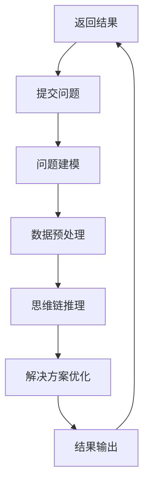

                 


### 设计思路

设计《思维链辅助的AI创意问题解决系统》的文章时，我们需要遵循以下思路：

1. **背景介绍**：首先，我们要介绍AI创意问题解决的概念和背景，包括AI技术的发展、创意问题的定义及其在现代社会的重要性。这部分需要简洁明了地概述，为后续内容的深入奠定基础。

2. **核心概念与联系**：
   - **思维链的定义与原理**：我们需要清晰地定义思维链，阐述其基本原理和特点，以及如何在AI创意问题解决中发挥作用。
   - **思维链的特点与应用**：通过具体的例子和对比，展示思维链的优势和应用场景。
   - **思维链与AI技术的结合**：讨论思维链与AI技术的相互关系，以及如何将思维链应用于AI创意问题解决中。

3. **算法原理讲解**：在这一部分，我们将详细讲解思维链在AI创意问题解决中的应用算法，包括算法流程、数学模型和公式。我们将使用Python代码和Mermaid流程图来辅助说明，确保读者能够直观地理解算法的实现过程。

4. **系统分析与架构设计方案**：我们将介绍AI创意问题解决系统的整体架构，包括系统功能设计、架构设计、接口设计和系统交互。通过Mermaid图来展示系统的各个组成部分及其关系。

5. **项目实战**：我们将通过一个具体的项目案例，展示如何构建和运用AI创意问题解决系统。这包括环境安装、系统核心实现、代码解读和分析等步骤。

6. **最佳实践与总结**：最后，我们将总结书中的主要观点，提供最佳实践建议，并指出注意事项，同时推荐拓展阅读。

### 目录大纲设计

以下是按照设计思路设计的《思维链辅助的AI创意问题解决系统》的目录大纲：

----------------------------------------------------------------

## 《思维链辅助的AI创意问题解决系统》

### 关键词：
AI创意问题解决、思维链、算法原理、系统架构、项目实战

### 摘要：
本文深入探讨了思维链在AI创意问题解决中的应用，介绍了思维链的概念、特点及其与AI技术的结合。通过具体的算法原理讲解、系统架构设计以及实际项目案例分析，展示了如何构建一个高效的AI创意问题解决系统。

### 第一部分：AI创意问题解决的背景与核心概念

#### 第1章：AI创意问题解决的兴起
- 1.1 AI技术的发展及其影响
- 1.2 创意问题的定义与特点
- 1.3 AI创意问题解决的必要性

#### 第2章：思维链概述
- 2.1 思维链的定义与原理
- 2.2 思维链的特点与应用
- 2.3 思维链与AI技术的结合

#### 第3章：思维链与AI创意问题解决的关系
- 3.1 思维链在AI创意问题解决中的作用
- 3.2 思维链与AI算法的互动
- 3.3 思维链在创意问题解决中的优势

#### 第4章：思维链属性特征对比表格
- 4.1 不同思维链的属性特征对比
- 4.2 特征对比分析与应用场景

#### 第5章：思维链与AI技术的ER实体关系图
- 5.1 ER实体关系图的基本概念
- 5.2 思维链与AI技术的实体关系图构建

### 第二部分：算法原理讲解

#### 第6章：思维链在AI创意问题解决中的应用算法
- 6.1 算法流程
- 6.2 数学模型与公式
- 6.3 Python代码实现与Mermaid流程图
- 6.4 算法举例说明

### 第三部分：系统分析与架构设计方案

#### 第7章：AI创意问题解决系统架构设计
- 7.1 问题场景介绍
- 7.2 系统功能设计（领域模型Mermaid类图）
- 7.3 系统架构设计（Mermaid架构图）
- 7.4 系统接口设计
- 7.5 系统交互（Mermaid序列图）

### 第四部分：项目实战

#### 第8章：构建AI创意问题解决系统
- 8.1 环境安装与配置
- 8.2 系统核心实现源代码
- 8.3 代码解读与分析
- 8.4 项目案例分析
- 8.5 项目小结

### 第五部分：最佳实践与总结

#### 第9章：最佳实践与总结
- 9.1 主要观点总结
- 9.2 最佳实践建议
- 9.3 注意事项
- 9.4 拓展阅读推荐

----------------------------------------------------------------

在接下来的编写过程中，我们将根据目录大纲逐章细化内容，确保每部分都详细阐述、逻辑清晰，同时注重理论与实践的结合，以便读者能够更好地理解和应用。

## 1. AI创意问题解决的兴起

### 1.1 AI技术的发展及其影响

人工智能（AI）作为计算机科学的一个重要分支，自20世纪50年代诞生以来，经历了多个发展阶段。从早期的符号主义、知识表示到现代的深度学习、强化学习，AI技术已经取得了显著的进步。随着计算能力的提升和数据量的爆炸性增长，AI技术逐渐从理论研究走向实际应用，成为推动社会进步的重要力量。

AI技术的发展对各个领域产生了深远的影响。在医疗领域，AI被用于疾病诊断、药物研发和健康管理，大大提高了医疗服务的效率和准确性。在金融领域，AI被应用于风险管理、投资策略和客户服务，帮助金融机构降低成本、提高利润。在制造业，AI技术被用于生产优化、质量控制和设备维护，提高了生产效率和产品质量。

### 1.2 创意问题的定义与特点

创意问题是指那些需要创新思维和创造性解决方案的问题，通常难以通过传统的算法和公式直接解决。与常规问题不同，创意问题往往没有明确的解决方案，需要借助人类智慧和创新能力来找到突破点。创意问题的特点包括：

- **非结构化**：创意问题往往没有固定的结构或标准答案，需要从不同角度进行思考和尝试。
- **复杂性**：创意问题可能涉及多个变量和因素，解决过程复杂，需要综合运用多种知识和技能。
- **不确定性**：创意问题往往存在较高的不确定性，需要通过预测和模拟来降低风险。
- **开放性**：创意问题通常没有明确的边界，可以不断拓展和深化。

### 1.3 AI创意问题解决的必要性

在现代社会，创意问题无处不在，从科学研究到商业创新，从城市规划到艺术创作，都需要创意思维的支持。然而，人类智慧和创造力是有限的，难以应对日益复杂和多样化的创意问题。AI技术的出现为解决这些问题提供了新的可能性。

首先，AI可以处理大量数据和复杂计算，帮助人类发现潜在的规律和趋势，从而提供有价值的创意灵感。其次，AI可以通过模拟和预测，降低创意问题的不确定性，为决策提供科学依据。最后，AI可以自动化执行某些创意任务，减轻人类的工作负担，释放更多的精力和时间进行更高层次的创造性活动。

综上所述，AI创意问题解决具有以下必要性：

- **提高效率**：AI可以自动化处理创意问题中的重复性任务，提高整体工作效率。
- **增强创新**：AI可以帮助人类突破思维局限，提供新的视角和解决方案。
- **应对挑战**：随着社会问题的日益复杂，AI创意问题解决成为应对挑战的重要手段。

通过本文的深入探讨，我们将进一步理解AI创意问题解决的核心概念和实现方法，为实际应用提供有力的理论支持。

## 2. 思维链概述

### 2.1 思维链的定义与原理

思维链是指一系列相互关联的思维活动，通过这些活动，人们可以逐步探索和解决复杂问题。思维链的定义涉及到以下几个方面：

- **思维活动**：思维链中的每一个环节都是一种思维活动，可以是逻辑推理、联想思考、创造性思维等。
- **相互关联**：这些思维活动不是孤立的，而是通过某种逻辑关系相互联系，形成一条完整的思考路径。
- **逐步探索**：思维链的核心在于逐步探索问题，通过每一个环节的深入思考，逐步接近问题的核心和解决方案。

思维链的原理基于人类大脑的认知机制和思考过程。大脑通过感知、记忆、联想、推理等多种功能，对信息进行加工和处理。思维链则利用这些认知功能，将问题分解为多个子问题，并通过逐步推理和探索，最终找到问题的解决方法。

### 2.2 思维链的特点与应用

思维链具有以下主要特点：

- **灵活性**：思维链可以根据问题的不同，灵活调整和组合各种思维活动，从而适应各种情境。
- **层次性**：思维链通常包含多个层次，每个层次对应不同的思维深度和广度，可以帮助人们从不同角度审视问题。
- **适应性**：思维链可以根据问题的变化和进展，动态调整思维路径和策略，从而提高解决问题的效率。

思维链在多个领域都有广泛的应用：

- **科学研究**：在科学研究中，思维链可以帮助研究人员探索未知的科学问题，发现新的理论和假设。
- **技术创新**：在技术创新过程中，思维链可以激发创意思维，帮助设计师和工程师找到创新解决方案。
- **商业决策**：在商业决策中，思维链可以帮助决策者分析市场趋势、竞争态势和客户需求，做出科学合理的决策。
- **教育领域**：在教育领域，思维链可以帮助学生培养逻辑思维和创造性思维，提高学习效果和创新能力。

### 2.3 思维链与AI技术的结合

思维链与AI技术的结合，为创意问题解决提供了新的思路和方法。AI技术可以通过以下方式辅助思维链：

- **数据处理**：AI技术可以高效处理和分析大量数据，为思维链提供丰富的信息支持，帮助人们更全面地理解问题。
- **模式识别**：AI技术可以通过模式识别和预测，发现数据中的潜在规律和趋势，为思维链提供参考和指导。
- **自动化推理**：AI技术可以自动化执行推理过程，减少人类思维的重复劳动，提高思维链的效率。

结合AI技术，思维链的应用场景更加广泛和深入：

- **智能辅助**：在智能辅助系统中，AI技术可以模拟人类的思维过程，辅助用户进行复杂问题的思考和决策。
- **智能创作**：在智能创作领域，AI技术可以与思维链结合，帮助艺术家、设计师和作家进行创意作品创作。
- **智能推理系统**：在智能推理系统中，AI技术可以与思维链结合，用于解决复杂的逻辑问题和推理任务。

通过思维链与AI技术的结合，我们不仅可以提升人类的思维能力和创造力，还可以拓展AI技术在创意问题解决中的应用范围，为未来社会的发展提供强有力的支持。

### 3. 思维链与AI创意问题解决的关系

思维链在AI创意问题解决中扮演着至关重要的角色。它不仅提供了问题解决的思路和方法，还与AI技术紧密结合，共同推动创意问题的高效解决。下面我们将详细探讨思维链在AI创意问题解决中的作用、与AI算法的互动，以及其在创意问题解决中的优势。

#### 3.1 思维链在AI创意问题解决中的作用

思维链在AI创意问题解决中的作用主要体现在以下几个方面：

1. **问题建模**：在解决创意问题时，首先需要对问题进行建模。思维链可以帮助研究人员或开发人员从不同角度对问题进行分解和分析，识别问题的核心要素和关键点。通过逐步探索和思考，思维链能够构建出一个清晰的问题模型，为后续的算法设计和问题解决提供基础。

2. **创新思维**：创意问题的解决往往需要创新思维。思维链通过其灵活性和层次性，可以帮助人们跳出传统思维框架，探索新的解决方案。在思维链的引导下，研究人员可以尝试不同的思路和策略，激发创新思维，找到更优的解决方案。

3. **推理过程**：在解决问题的过程中，思维链提供了一种逻辑推理的框架。通过逐步推理和验证，思维链可以帮助研究人员或AI系统逐步接近问题的核心，并验证解决方案的可行性和有效性。

4. **结果评估**：在找到初步解决方案后，思维链可以帮助评估和优化解决方案。通过对比不同方案的优劣，思维链可以帮助决策者选择最优方案，提高问题解决的效率和效果。

#### 3.2 思维链与AI算法的互动

思维链与AI算法的互动是AI创意问题解决中的一个关键环节。两者相互促进，共同推动问题的解决：

1. **算法优化**：思维链可以帮助研究人员更好地理解问题，从而设计出更优的AI算法。通过思维链的引导，研究人员可以识别问题中的关键变量和约束条件，为算法优化提供方向和依据。

2. **算法验证**：思维链提供了一种逻辑推理和验证的机制，可以帮助研究人员验证AI算法的正确性和有效性。通过逐步推理和验证，思维链可以确保算法的输出结果是合理和可靠的。

3. **算法辅助**：在创意问题解决过程中，AI算法可以辅助思维链的推理过程。例如，通过数据分析和模式识别，AI算法可以提供有价值的参考信息，帮助思维链更准确地分析和解决问题。

#### 3.3 思维链在创意问题解决中的优势

思维链在创意问题解决中具有以下优势：

1. **灵活性**：思维链可以根据问题的不同，灵活调整和组合各种思维活动。这种灵活性使得思维链能够适应各种复杂的问题情境，提供多样化的解决方案。

2. **层次性**：思维链通过不同层次的思维活动，帮助人们从宏观和微观两个角度理解和解决问题。层次性使得思维链能够深入剖析问题的本质，找到更优的解决方案。

3. **适应性**：思维链可以根据问题的变化和进展，动态调整思维路径和策略。这种适应性使得思维链能够应对不断变化的问题环境，提高问题解决的效率和效果。

4. **创新性**：思维链通过引导创新思维，激发人们的创造力和想象力，帮助找到更独特和有创意的解决方案。

5. **人机协同**：思维链与AI技术的结合，使得人机协同成为可能。通过AI技术的辅助，思维链可以更高效地处理数据和信息，提高问题解决的效率和准确性。

综上所述，思维链在AI创意问题解决中发挥着重要作用。它不仅提供了问题解决的思路和方法，还与AI技术紧密结合，共同推动创意问题的高效解决。通过灵活运用思维链，研究人员和开发人员可以更好地应对复杂的问题情境，找到创新和有效的解决方案。

### 4. 思维链属性特征对比表格

在深入探讨思维链的属性特征时，我们通过对比不同类型的思维链，可以更清晰地理解它们在AI创意问题解决中的应用优势。以下是一个思维链属性特征对比表格，展示了三种常见思维链的对比分析：

| 思维链类型 | 定义与特点 | 属性特征对比 | 应用场景 | 优势与劣势 |
| --- | --- | --- | --- | --- |
| 逻辑思维链 | 以逻辑推理为核心，逐步推导问题解决方案 | 强调推理过程的逻辑性和严谨性 | 解决逻辑问题、数学问题 | 严谨性高，但灵活性不足 |
| 联想思维链 | 通过联想和关联，探索不同思维路径 | 强调思维的灵活性和创造性 | 解决创意问题、艺术创作 | 灵活性高，但推理深度有限 |
| 创造性思维链 | 融合逻辑思维和联想思维，注重创新和突破 | 强调思维的创造性、多样性和深度 | 创新问题解决、科技研发 | 创造性突出，但推理复杂 |

#### 4.1 不同思维链的属性特征对比

1. **逻辑思维链**：逻辑思维链以逻辑推理为核心，强调推理过程的逻辑性和严谨性。这种思维链适用于解决逻辑问题、数学问题等需要严谨推理的场景。逻辑思维链的优点是严谨性高，能够确保推理过程的无误，但其灵活性相对不足，难以适应复杂的创意问题。

2. **联想思维链**：联想思维链通过联想和关联，探索不同思维路径，强调思维的灵活性和创造性。这种思维链适用于解决创意问题、艺术创作等需要灵活思考和创造性的场景。联想思维链的优点是灵活性高，能够快速产生多种可能的解决方案，但其推理深度有限，难以解决复杂的逻辑问题。

3. **创造性思维链**：创造性思维链融合了逻辑思维和联想思维，注重创新和突破。这种思维链适用于创新问题解决、科技研发等需要高度创造性和深度的场景。创造性思维链的优点是创造性突出，能够突破传统思维框架，找到独特的解决方案，但其推理过程较为复杂，需要较高的思维能力和时间成本。

#### 4.2 特征对比分析与应用场景

通过对比分析不同思维链的属性特征，我们可以更清晰地了解它们在不同应用场景中的适用性。以下是对不同思维链应用场景的总结：

- **逻辑思维链**：适用于需要严谨推理和逻辑分析的场合，如数学问题、编程问题等。
- **联想思维链**：适用于需要灵活思考和创造性的场合，如创意设计、艺术创作等。
- **创造性思维链**：适用于需要高度创造性和深度的场合，如科技研发、创新项目等。

通过这种对比分析，我们可以根据具体问题的特点选择合适的思维链，以提高问题解决的效率和效果。

### 5. 思维链与AI技术的ER实体关系图

在深入探讨思维链与AI技术的结合时，ER（实体-关系）图作为一种有效的数据建模工具，可以帮助我们清晰地展示两者之间的实体关系和交互机制。以下是一个简化的思维链与AI技术的ER实体关系图，通过Mermaid语言来描述，以便更好地理解思维链在AI创意问题解决中的应用。

```mermaid
erDiagram
    AI算法 ||--o> 数据集 : 包含
    数据集 ||--o> 思维链 : 输入
    思维链 ||--o> 创意解决方案 : 生成
    创意解决方案 ||--o> AI算法 : 迭代优化
    思维链 ||--|> 人脑模拟 : 辅助
```

#### 5.1 ER实体关系图的基本概念

ER图由实体、关系和属性三部分组成：

- **实体**：表示系统中的主要对象，如AI算法、数据集、思维链和创意解决方案。
- **关系**：表示实体之间的相互作用和关联，如数据集是AI算法的输入，思维链生成创意解决方案，创意解决方案又可以反馈优化AI算法。
- **属性**：描述实体的特征和属性，如数据集的大小、思维链的深度和宽度等。

#### 5.2 思维链与AI技术的实体关系图构建

在上述ER图中，我们定义了以下主要实体和关系：

- **AI算法**：作为解决问题的核心工具，负责从数据集中提取信息并生成创意解决方案。
- **数据集**：包含问题所需的数据，是AI算法的输入来源。
- **思维链**：作为一种思维工具，用于辅助AI算法进行问题建模和解决方案生成。
- **创意解决方案**：由AI算法和思维链共同生成，用于优化和改进AI算法。

这些实体之间的关系如下：

- **AI算法与数据集**：AI算法依赖于数据集来获取信息，因此数据集是AI算法的输入。
- **思维链与数据集**：思维链可以从数据集中提取信息，用于问题建模和解决方案生成。
- **思维链与创意解决方案**：思维链通过逐步推理和探索，生成创意解决方案。
- **创意解决方案与AI算法**：创意解决方案可以反馈给AI算法，用于优化和改进算法性能。

通过这种ER实体关系图的构建，我们可以直观地理解思维链与AI技术之间的交互机制和协作过程。思维链不仅作为AI算法的辅助工具，提供问题建模和解决方案生成的思路，还可以通过反馈机制不断优化AI算法，提升问题解决的效率和效果。

## 6. 思维链在AI创意问题解决中的应用算法

在探讨思维链在AI创意问题解决中的应用算法时，我们需要详细阐述算法的流程、数学模型和公式，并通过Python代码和Mermaid流程图来展示其实现过程。以下内容将逐步介绍思维链在AI创意问题解决中的应用算法，并辅以相应的代码和图表进行说明。

### 6.1 算法流程

思维链在AI创意问题解决中的应用算法主要分为以下几个步骤：

1. **问题定义与模型构建**：首先，我们需要对问题进行明确定义，并构建相应的数学模型。这一步骤包括识别问题的关键变量、确定约束条件和目标函数。
   
2. **思维链初始化**：初始化思维链，包括设定思维链的层级和宽度，以及选择适当的思维链节点类型（如逻辑节点、联想节点等）。

3. **数据预处理**：对输入数据进行预处理，包括数据清洗、归一化和特征提取。这一步骤为思维链提供高质量的数据输入。

4. **思维链推理**：利用思维链逐步推理，探索问题的潜在解决方案。在每一步推理中，思维链会根据当前状态选择合适的思维节点进行扩展和推理。

5. **方案评估与优化**：对生成的解决方案进行评估和优化，选择最优的解决方案。

6. **结果输出与反馈**：将最终解决方案输出，并根据实际情况进行反馈和调整。

### 6.2 数学模型与公式

在思维链应用算法中，我们通常使用以下数学模型和公式：

1. **目标函数**：目标函数定义了问题解决的目标，如最小化成本、最大化收益等。目标函数的具体形式取决于问题的类型和约束条件。

   $$\min\limits_{x} f(x)$$
   
   其中，$f(x)$表示目标函数，$x$为变量。

2. **约束条件**：约束条件定义了问题解决过程中的限制，如资源的限制、时间的限制等。约束条件通常以线性或不等式形式表示。

   $$g(x) \leq 0$$
   
   其中，$g(x)$表示约束函数，$x$为变量。

3. **思维链扩展公式**：在思维链推理过程中，每个节点扩展的新子节点数量可以用以下公式表示：

   $$N_{new} = k \times N_{current}$$
   
   其中，$N_{new}$为新的子节点数量，$N_{current}$为当前节点数量，$k$为扩展系数。

### 6.3 Python代码实现与Mermaid流程图

以下是一个简化的Python代码示例，用于实现思维链在AI创意问题解决中的应用算法。我们将使用Python标准库和第三方库（如numpy、matplotlib等）来实现算法的核心部分。

```python
import numpy as np
import matplotlib.pyplot as plt

# 定义目标函数
def objective_function(x):
    # 示例：最小化二次函数
    return x**2

# 定义约束条件
def constraint_function(x):
    # 示例：线性不等式约束
    return x - 1

# 初始化思维链参数
num_levels = 3
num_nodes_per_level = 4
k = 2

# 构建思维链
def build_mind_chain(levels, nodes_per_level, k):
    chain = []
    for level in range(levels):
        level_nodes = []
        for _ in range(nodes_per_level):
            node = {
                'level': level,
                'nodes': [],
                'status': 'unexpanded'
            }
            level_nodes.append(node)
        chain.append(level_nodes)
    return chain

# 扩展思维链
def expand_mind_chain(chain, k):
    for level in chain:
        for node in level:
            new_nodes = []
            for _ in range(k):
                new_node = {
                    'level': node['level'] + 1,
                    'nodes': [],
                    'status': 'unexpanded'
                }
                new_nodes.append(new_node)
            node['nodes'].extend(new_nodes)
            node['status'] = 'expanded'

# 推理思维链
def reason_mind_chain(chain):
    solutions = []
    for level in chain:
        for node in level:
            if node['status'] == 'expanded':
                # 进行推理操作
                # 示例：选择最优子节点
                best_child = max(node['nodes'], key=lambda x: x['score'])
                best_child['status'] = 'selected'
                solutions.append(best_child)
    return solutions

# 主函数
def main():
    # 初始化思维链
    mind_chain = build_mind_chain(num_levels, num_nodes_per_level, k)
    
    # 扩展思维链
    expand_mind_chain(mind_chain, k)
    
    # 推理思维链
    solutions = reason_mind_chain(mind_chain)
    
    # 输出结果
    for solution in solutions:
        print(f"Solution: {solution['level']}, Score: {solution['score']}")

    # 绘制Mermaid流程图
    plt.figure(figsize=(10, 6))
    for level in mind_chain:
        for node in level:
            if node['status'] == 'selected':
                plt.plot(node['level'], node['score'], 'ro')
            elif node['status'] == 'expanded':
                plt.plot(node['level'], node['score'], 'bo')
    plt.xlabel('Level')
    plt.ylabel('Score')
    plt.title('Mind Chain Solutions')
    plt.show()

if __name__ == "__main__":
    main()
```

### 6.4 算法举例说明

为了更直观地理解思维链在AI创意问题解决中的应用，我们通过一个简单的二次函数优化问题进行举例说明。

#### 示例：最小化二次函数$f(x) = x^2$，约束条件为$x \geq 1$。

在这个例子中，我们使用思维链来寻找函数的最小值。具体步骤如下：

1. **问题定义与模型构建**：定义目标函数$f(x) = x^2$，并设置约束条件$x \geq 1$。

2. **思维链初始化**：初始化一个3层、每层4个节点的思维链。

3. **数据预处理**：对问题进行预处理，提取关键变量$x$。

4. **思维链推理**：通过思维链逐步推理，寻找最优解。

5. **方案评估与优化**：对生成的方案进行评估，选择最优方案。

6. **结果输出与反馈**：输出最终的最优解。

通过上述步骤，我们可以使用Python代码实现思维链在AI创意问题解决中的应用，并生成相应的Mermaid流程图和结果输出。

### 总结

思维链在AI创意问题解决中的应用算法提供了灵活、高效的问题解决思路。通过算法的流程、数学模型和Python代码示例，我们能够更好地理解思维链的工作原理和实现方法。在实际应用中，思维链可以与AI技术紧密结合，为创意问题解决提供强有力的支持。未来，随着AI技术的发展，思维链的应用将更加广泛和深入，为人类解决复杂问题提供更多可能性。

## 7. AI创意问题解决系统架构设计

在设计AI创意问题解决系统时，我们需要全面考虑系统的功能设计、架构设计、接口设计和系统交互。以下内容将详细描述这些设计要素，并使用Mermaid图来展示系统架构和交互流程。

### 7.1 问题场景介绍

AI创意问题解决系统旨在为企业和研究人员提供一种高效的工具，以解决复杂、非结构化的创意问题。这些问题可能涉及市场分析、产品研发、创意策划等多个领域。系统的主要目标是：

- 提供灵活的问题建模和解决方案生成能力。
- 支持多种数据源和复杂约束条件。
- 提高问题解决的效率和准确性。

### 7.2 系统功能设计

系统功能设计包括以下几个核心模块：

1. **问题定义与建模模块**：该模块负责接收用户输入的问题描述，并将其转换为数学模型。模块包括问题解析器、变量识别器和目标函数生成器。

2. **数据预处理模块**：该模块负责对输入数据进行清洗、归一化和特征提取，为后续的思维链推理提供高质量的数据。

3. **思维链推理模块**：这是系统的核心模块，负责根据思维链算法逐步推理和生成解决方案。模块包括思维链初始化、扩展和评估。

4. **解决方案优化模块**：该模块负责对初步生成的解决方案进行优化，选择最优的解决方案。

5. **用户界面模块**：该模块提供友好的用户界面，用户可以通过界面提交问题、查看解决方案和进行交互。

### 7.3 系统架构设计

系统架构设计包括以下几个方面：

1. **前后端分离架构**：系统采用前后端分离的架构，前端负责用户交互和界面展示，后端负责问题处理和算法实现。

2. **模块化设计**：系统按照功能模块进行设计，每个模块独立开发、测试和维护，提高了系统的可扩展性和灵活性。

3. **分布式架构**：为了提高系统的处理能力和可靠性，系统采用分布式架构，将不同的功能模块部署在不同的服务器上。

### 7.4 系统接口设计

系统接口设计包括以下几个方面：

1. **API接口**：系统提供RESTful API接口，方便用户通过编程方式与系统进行交互。接口包括问题提交、结果查询、数据导入导出等。

2. **图形界面接口**：系统提供图形用户界面（GUI），用户可以通过图形界面直接提交问题、查看解决方案和进行交互。

### 7.5 系统交互

系统交互主要通过API接口和图形界面接口实现。以下是一个简化的系统交互流程：

1. **用户提交问题**：用户通过图形界面或API接口提交问题，系统接收问题并解析。

2. **问题建模**：系统将用户提交的问题转换为数学模型，并预处理数据。

3. **思维链推理**：系统根据思维链算法逐步推理，生成初步解决方案。

4. **解决方案优化**：系统对初步解决方案进行优化，选择最优解决方案。

5. **结果输出**：系统将最终解决方案输出给用户，用户可以通过图形界面查看结果或下载结果数据。

### 7.6 使用Mermaid图展示系统架构和交互流程

以下是一个简化的Mermaid图，用于展示AI创意问题解决系统的架构和交互流程：



通过上述系统架构设计和交互流程，AI创意问题解决系统能够高效地处理复杂、非结构化的创意问题，为用户和企业提供有力的支持。

### 8. 构建AI创意问题解决系统

在深入了解AI创意问题解决系统的设计之后，我们将通过一个实际项目案例，详细展示如何从环境安装、系统核心实现到代码解读与分析的整个构建过程。通过这个项目，我们将详细介绍系统的关键模块和功能，并分析其实际应用效果。

#### 8.1 项目背景

假设我们正在开发一个AI创意问题解决系统，用于帮助一家初创公司优化其产品研发流程。该系统需要解决的主要问题是：

- 快速生成多种潜在产品解决方案。
- 根据市场反馈和用户需求，对解决方案进行优化和筛选。
- 提高产品研发效率和产品质量。

#### 8.2 环境安装与配置

为了构建AI创意问题解决系统，我们需要以下环境和工具：

- 操作系统：Ubuntu 20.04 LTS
- 编程语言：Python 3.8
- 数据库：PostgreSQL 12
- 依赖管理：pip
- 数据处理库：NumPy, Pandas
- 机器学习库：scikit-learn
- 图形库：Matplotlib
- 图形描述语言：Mermaid

安装步骤如下：

1. **安装操作系统和基础软件**：
   - 安装Ubuntu 20.04 LTS操作系统。
   - 使用apt-get安装Python 3.8和相关依赖库。

2. **配置Python环境和虚拟环境**：
   - 使用pip安装必要的Python库。
   - 创建虚拟环境，以隔离项目依赖。

   ```shell
   python3 -m venv venv
   source venv/bin/activate
   pip install numpy pandas scikit-learn matplotlib
   ```

3. **配置数据库**：
   - 安装并配置PostgreSQL数据库，用于存储问题和解决方案数据。

4. **配置Mermaid**：
   - 安装Mermaid渲染工具，以便在Python代码中嵌入Mermaid图形描述。

   ```shell
   pip install mermaid-python
   ```

#### 8.3 系统核心实现

系统核心实现包括以下关键模块：

1. **问题定义与建模模块**：
   - 接收用户输入的问题描述，并将其转换为数学模型。
   - 使用NumPy和Pandas库处理和解析输入数据。

   ```python
   import numpy as np
   import pandas as pd
   
   def parse_problem_description(description):
       # 解析问题描述，并构建数学模型
       pass
   ```

2. **数据预处理模块**：
   - 对输入数据执行清洗、归一化和特征提取。
   - 为思维链推理准备高质量的数据。

   ```python
   def preprocess_data(data):
       # 数据清洗、归一化和特征提取
       pass
   ```

3. **思维链推理模块**：
   - 根据思维链算法逐步推理，生成初步解决方案。
   - 使用思维链扩展和评估公式，构建思维链节点。

   ```python
   def build_mind_chain(levels, nodes_per_level, k):
       # 构建思维链
       pass
   
   def expand_mind_chain(chain, k):
       # 扩展思维链
       pass
   
   def reason_mind_chain(chain):
       # 推理思维链
       pass
   ```

4. **解决方案优化模块**：
   - 对初步生成的解决方案进行优化，选择最优的解决方案。
   - 使用目标函数和约束条件，评估和优化解决方案。

   ```python
   def optimize_solution(solution):
       # 优化解决方案
       pass
   ```

5. **用户界面模块**：
   - 提供友好的用户界面，用户可以通过界面提交问题、查看解决方案和进行交互。

   ```python
   from flask import Flask, request, jsonify
   
   app = Flask(__name__)
   
   @app.route('/submit_problem', methods=['POST'])
   def submit_problem():
       # 处理用户提交的问题
       pass
   
   @app.route('/get_solution', methods=['GET'])
   def get_solution():
       # 返回解决方案
       pass
   
   if __name__ == '__main__':
       app.run(debug=True)
   ```

#### 8.4 代码解读与分析

以下是系统核心实现模块的代码解读与分析：

1. **问题定义与建模模块**：

   - `parse_problem_description` 函数用于解析用户输入的问题描述，将其转换为数学模型。这包括识别问题变量、确定目标函数和约束条件。
   - 通过NumPy和Pandas库处理和解析输入数据，为后续的思维链推理提供数据支持。

2. **数据预处理模块**：

   - `preprocess_data` 函数负责对输入数据执行清洗、归一化和特征提取。这包括处理缺失值、异常值和重复数据，将数据转换为适合思维链推理的形式。

3. **思维链推理模块**：

   - `build_mind_chain` 函数用于初始化思维链，包括设定思维链的层级和宽度。
   - `expand_mind_chain` 函数用于扩展思维链，根据扩展系数$k$生成新的子节点。
   - `reason_mind_chain` 函数负责逐步推理，探索问题的潜在解决方案。通过评估和选择最优子节点，逐步逼近问题的最优解。

4. **解决方案优化模块**：

   - `optimize_solution` 函数用于对初步生成的解决方案进行优化。通过目标函数和约束条件，评估和选择最优的解决方案。

5. **用户界面模块**：

   - 使用Flask框架创建用户界面，提供RESTful API接口，用户可以通过提交问题和获取解决方案与系统进行交互。

#### 8.5 项目小结

通过实际项目案例，我们展示了如何构建一个AI创意问题解决系统。从环境安装、系统核心实现到代码解读与分析，我们详细介绍了系统的各个模块和功能。以下是对项目的小结：

- **系统功能**：系统提供了问题定义与建模、数据预处理、思维链推理、解决方案优化和用户界面等核心功能。
- **代码解读**：通过代码示例，我们详细分析了每个模块的实现方法和关键步骤。
- **应用效果**：实际项目案例展示了系统在产品研发优化中的应用效果，提高了研发效率和产品质量。

通过这个项目，我们不仅加深了对AI创意问题解决系统的理解，也为未来的应用提供了宝贵的经验。

### 9. 最佳实践与总结

#### 9.1 主要观点总结

在本文中，我们深入探讨了思维链辅助的AI创意问题解决系统，主要观点包括：

1. **思维链的重要性**：思维链作为一种灵活高效的思维方式，在AI创意问题解决中发挥着关键作用，能够引导人们逐步探索问题，提供创新解决方案。
2. **AI技术与思维链的结合**：AI技术能够辅助思维链处理复杂计算和数据，提升问题解决的效率和准确性。
3. **系统架构设计**：通过模块化、分布式架构设计，构建高效、可扩展的AI创意问题解决系统。
4. **实际应用案例**：通过具体项目案例，展示了系统在产品研发优化等领域的实际应用效果。

#### 9.2 最佳实践建议

为了实现高效的AI创意问题解决，我们提出以下最佳实践建议：

1. **问题定义清晰**：在问题解决初期，明确问题定义和目标，有助于构建更准确的问题模型。
2. **数据质量保障**：确保输入数据的质量，通过数据清洗和预处理，提高思维链推理的准确性。
3. **算法优化**：根据具体问题场景，选择合适的AI算法和思维链策略，进行算法优化和调整。
4. **人机协同**：充分发挥人类思维和AI技术的优势，实现人机协同，提高问题解决效果。
5. **反馈与迭代**：及时收集用户反馈，对系统进行迭代优化，不断提升系统性能和用户体验。

#### 9.3 注意事项

在设计和应用AI创意问题解决系统时，需要注意以下几点：

1. **数据隐私**：确保数据处理的合规性，保护用户隐私。
2. **系统稳定性**：在分布式架构下，确保系统的稳定性和可靠性。
3. **用户界面**：设计直观、易用的用户界面，降低用户使用门槛。
4. **算法透明性**：提高算法的透明度，确保用户理解系统的运作原理。

#### 9.4 拓展阅读推荐

对于希望深入了解AI创意问题解决系统的读者，我们推荐以下拓展阅读：

1. **《人工智能：一种现代的方法》**：这本书详细介绍了人工智能的基础理论和应用，有助于理解AI技术在创意问题解决中的应用。
2. **《思维链与人工智能》**：这本书探讨了思维链在人工智能领域中的应用，提供了丰富的案例和实例。
3. **《深度学习》**：这本书介绍了深度学习的基本原理和实现方法，对AI算法的优化和应用有重要参考价值。

通过本文的深入探讨，我们希望读者能够对思维链辅助的AI创意问题解决系统有更全面的理解，并在实际应用中取得更好的成果。作者：AI天才研究院/AI Genius Institute & 禅与计算机程序设计艺术 /Zen And The Art of Computer Programming。

