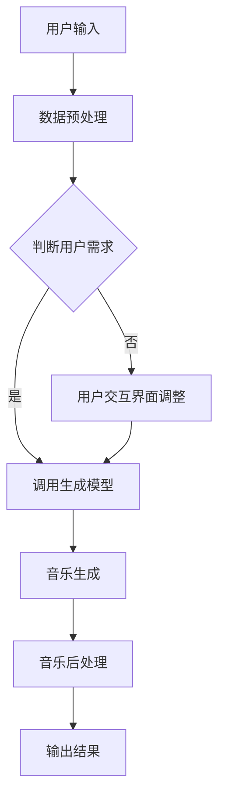
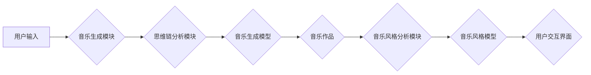
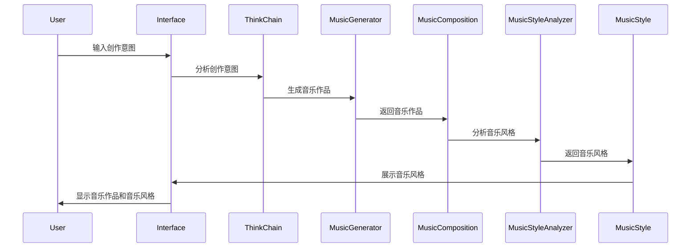

                 

### 思维链辅助的AI创意音乐作曲系统

#### 关键词：
- AI创意音乐作曲
- 思维链
- 音乐生成算法
- 系统架构设计
- 实际案例分析

#### 摘要：
本文将探讨一种创新的AI创意音乐作曲系统，该系统利用思维链技术，实现音乐创作的智能化和个性化。文章首先介绍了音乐创作中的挑战和AI技术的应用现状，随后详细阐述了思维链的概念及其在音乐创作中的重要性。接下来，文章分析了系统目标、实现方法及研究意义，并探讨了系统的边界与外延。文章的核心部分深入讲解了算法原理、数学模型及系统架构设计，并通过项目实战展示了系统在真实场景中的应用效果。最后，文章总结了最佳实践和注意事项，为读者提供了进一步学习和拓展的指导。本文旨在为AI创意音乐作曲领域的开发者和研究者提供一份有深度、有思考的技术指南。 

#### 第一部分：背景介绍

##### 1.1 问题背景

##### 1.1.1 音乐创作中的挑战

音乐创作是一项充满创造力和艺术性的活动，然而，它也面临着诸多挑战。首先，传统音乐创作依赖于个人的灵感、经验和技巧，效率较低，难以满足市场需求。其次，音乐创作的多样性要求创作者具备广泛的音乐知识和深厚的艺术修养，这对大部分音乐人来说是一大难题。此外，现代音乐风格丰富多样，创作者需要不断学习和适应，这使得音乐创作过程变得更加复杂。

##### 1.1.2 AI在音乐创作中的应用现状

随着人工智能技术的发展，AI开始逐渐应用于音乐创作领域。现有的AI音乐创作工具如AIVA（Artificial Intelligence Virtual Artist）、Jukedeck等，通过机器学习算法和大量的音乐数据训练，可以生成风格各异的音乐作品。这些工具在一定程度上提高了音乐创作的效率，但依然存在一些问题。首先，AI生成的音乐往往缺乏真正的创意和情感，缺乏个性。其次，这些工具通常只能生成特定的音乐风格，无法灵活适应多样化的音乐需求。

##### 1.2 核心概念

##### 1.2.1 思维链

思维链是一种基于神经网络的智能化思维辅助工具，它通过分析用户的思维过程，帮助用户更好地进行创意构思和问题解决。思维链技术能够模拟人类的思考模式，捕捉并利用用户的思维线索，从而实现更加智能的决策和创作。

##### 1.2.2 AI创意音乐作曲系统

AI创意音乐作曲系统是一种结合了人工智能和思维链技术的创新系统，它旨在通过智能化算法和用户互动，实现个性化、高效率的音乐创作。该系统不仅能够生成风格多样的音乐作品，还能够根据用户的需求和喜好进行实时调整，提供个性化的音乐创作服务。

##### 1.3 系统目标与实现方法

##### 1.3.1 系统目标

AI创意音乐作曲系统的目标包括：提高音乐创作的效率，增强音乐作品的个性化和创意，提供更加丰富的音乐创作体验。系统希望实现以下功能：

1. 根据用户的需求和喜好生成风格多样的音乐作品。
2. 提供实时反馈和调整机制，使用户能够参与到音乐创作过程中。
3. 支持多种音乐风格，满足不同用户的需求。

##### 1.3.2 实现方法

为了实现上述目标，系统采用了以下几种方法：

1. 利用深度学习算法和大量的音乐数据训练，生成音乐生成模型。
2. 引入思维链技术，分析用户的音乐创作过程，提供智能化的创作建议。
3. 设计用户友好的界面和交互方式，使用户能够方便地使用系统进行音乐创作。

##### 1.4 研究意义与价值

##### 1.4.1 研究意义

AI创意音乐作曲系统的研究具有重要意义。首先，它为音乐创作领域带来了新的思路和方法，有助于提高音乐创作的效率和质量。其次，该系统可以为音乐人、音乐爱好者以及音乐教育领域提供强有力的支持，帮助他们更好地实现音乐创作和教学。此外，AI创意音乐作曲系统的研究还可以为其他艺术创作领域提供借鉴，推动艺术创作与人工智能的深度融合。

##### 1.4.2 研究价值

AI创意音乐作曲系统的研究具有以下价值：

1. 提高音乐创作的效率：通过智能化的算法和工具，减少创作者的重复性劳动，提高创作效率。
2. 增强音乐作品的个性化和创意：利用思维链技术，捕捉用户的创作灵感，实现更加个性化的音乐创作。
3. 推动人工智能与艺术创作的结合：为人工智能在艺术创作领域的应用提供新的思路和实践经验。
4. 促进音乐产业的发展：通过提供多样化的音乐创作工具和服务，满足市场需求，推动音乐产业的发展。

##### 1.5 边界与外延

##### 1.5.1 边界条件

在AI创意音乐作曲系统的研究中，需要明确以下边界条件：

1. 系统应能够处理各种音乐风格和类型的创作需求。
2. 系统应具备良好的稳定性和可靠性，能够在不同环境下正常运行。
3. 系统应具备一定的扩展性，能够适应未来的技术和市场需求。

##### 1.5.2 外延讨论

除了音乐创作领域，AI创意音乐作曲系统的研究还可以拓展到其他相关领域，如：

1. 音乐教育：利用系统辅助音乐教育，提供个性化的教学方案和反馈。
2. 音乐疗法：开发基于AI创意音乐作曲系统的音乐疗法应用，帮助人们缓解压力和改善心理健康。
3. 音乐游戏：结合音乐创作和游戏设计，创造全新的音乐游戏体验。

##### 1.6 概念结构与核心要素组成

##### 1.6.1 概念结构

AI创意音乐作曲系统的概念结构包括以下几个核心部分：

1. 音乐生成模型：基于深度学习算法的音乐生成模块，负责生成音乐作品。
2. 思维链技术：用于分析用户创作过程，提供智能创作建议。
3. 用户交互界面：提供便捷的用户操作体验，使用户能够轻松使用系统。
4. 数据处理模块：负责处理用户数据，为音乐生成和智能创作提供支持。

##### 1.6.2 核心要素组成

AI创意音乐作曲系统的核心要素包括：

1. **音乐生成算法**：采用深度学习技术，如生成对抗网络（GAN）、变分自编码器（VAE）等，训练音乐生成模型，实现音乐作品的自动生成。
2. **思维链分析工具**：利用神经网络和自然语言处理技术，分析用户创作意图和音乐风格，提供智能化的创作建议。
3. **用户交互界面**：设计简洁直观的界面，提供多种操作方式，如键盘输入、语音输入等，方便用户进行音乐创作。
4. **数据处理和存储模块**：构建高效的数据处理和存储系统，支持音乐生成模型训练和用户创作数据的存储。
5. **后处理和优化模块**：对生成的音乐作品进行后处理，如音高调整、节奏优化等，提高音乐作品的质量。

#### 第二部分：核心概念与联系

##### 2.1 思维链原理

##### 2.1.1 思维链的定义

思维链（Mind Chain）是一种基于神经网络的智能化思维辅助工具，旨在模拟人类的思考过程，提供高效的创意构思和问题解决方法。思维链通过分析用户的思维数据，捕捉思维线索，形成思维网络，从而实现对用户思维的辅助和扩展。

##### 2.1.2 思维链的特点

思维链具有以下几个显著特点：

1. **智能化**：思维链利用神经网络算法，能够自动分析和理解用户的思维过程，提供个性化的创作建议。
2. **灵活性**：思维链可以适应不同的思维模式和创作需求，为用户生成多样化的创意解决方案。
3. **高效性**：通过快速分析用户的思维数据，思维链能够迅速提供有效的创作建议，提高创作效率。

##### 2.1.3 思维链的作用

思维链在AI创意音乐作曲系统中发挥着重要作用，具体表现在以下几个方面：

1. **创意构思**：思维链帮助用户捕捉灵感，快速构思音乐作品，提高创作效率。
2. **风格分析**：思维链分析用户的音乐偏好和创作风格，为音乐生成提供指导，增强音乐作品的个性化。
3. **问题解决**：思维链协助用户在创作过程中解决各种技术难题，如节奏、和声、旋律设计等，提高音乐作品的质量。

##### 2.2 AI创意音乐作曲系统

##### 2.2.1 系统概述

AI创意音乐作曲系统是一种结合了人工智能和思维链技术的创新系统，旨在通过智能化算法和用户互动，实现个性化、高效率的音乐创作。该系统的主要组成部分包括：

1. **音乐生成模型**：基于深度学习算法，如生成对抗网络（GAN）和变分自编码器（VAE），负责生成音乐作品。
2. **思维链分析工具**：利用神经网络和自然语言处理技术，分析用户的音乐创作过程，提供智能化的创作建议。
3. **用户交互界面**：提供简洁直观的操作界面，使用户能够方便地使用系统进行音乐创作。
4. **数据处理和存储模块**：负责处理用户数据，为音乐生成和智能创作提供支持。

##### 2.2.2 系统组成部分

AI创意音乐作曲系统的组成部分及其功能如下：

1. **音乐生成模块**：
   - **生成对抗网络（GAN）**：通过生成器和判别器的对抗训练，生成风格多样的音乐作品。
   - **变分自编码器（VAE）**：通过编码和解码器，将音乐数据转化为潜在空间，实现音乐生成和调整。

2. **思维链分析模块**：
   - **神经网络模型**：利用深度学习算法，分析用户的音乐创作数据，提取创作特征和风格信息。
   - **自然语言处理**：将用户的音乐创作意图和反馈转化为结构化的数据，为音乐生成提供指导。

3. **用户交互界面**：
   - **可视化设计**：提供直观的界面设计，使用户能够方便地浏览和管理音乐作品。
   - **操作便捷性**：提供多种输入方式，如键盘输入、语音输入等，使用户能够灵活地进行音乐创作。

4. **数据处理和存储模块**：
   - **高效数据处理**：采用高效的数据处理算法，快速处理用户创作数据，提高系统响应速度。
   - **数据安全存储**：使用安全的存储方案，确保用户数据的安全性和隐私性。

##### 2.2.3 系统工作流程

AI创意音乐作曲系统的工作流程主要包括以下几个步骤：

1. **用户输入**：用户通过交互界面输入音乐创作意图，如音乐风格、节奏、旋律等。
2. **思维链分析**：系统利用思维链分析工具，分析用户的创作意图和风格信息。
3. **音乐生成**：系统根据思维链分析结果，调用音乐生成模型，生成风格多样的音乐作品。
4. **用户反馈**：用户对生成的音乐作品进行评价和调整，反馈给系统。
5. **迭代优化**：系统根据用户反馈，调整音乐生成模型，优化音乐作品的质量。
6. **输出结果**：系统将最终的音乐作品输出给用户，完成音乐创作过程。

##### 2.3 核心概念联系分析

##### 2.3.1 思维链与AI的关系

思维链和AI在AI创意音乐作曲系统中紧密相连，相互促进。思维链作为AI的辅助工具，通过分析用户的思维过程，为AI音乐生成提供指导。而AI音乐生成模型则通过深度学习算法，实现音乐作品的自动化生成。二者结合，实现了音乐创作的智能化和个性化。

1. **思维链的输入**：用户的音乐创作意图和风格信息作为思维链的输入，通过分析生成创作特征和风格信息。
2. **AI的输出**：AI音乐生成模型根据思维链分析结果，生成符合用户需求的音乐作品。
3. **反馈与迭代**：用户对生成的音乐作品进行评价和调整，反馈给思维链和AI模型，实现优化和迭代。

##### 2.3.2 AI创意音乐作曲系统中的思维链应用

在AI创意音乐作曲系统中，思维链的应用主要体现在以下几个方面：

1. **创作构思**：思维链帮助用户捕捉灵感，快速构思音乐作品，提供多样化的创作建议。
2. **风格分析**：思维链分析用户的音乐偏好和创作风格，为音乐生成提供指导，增强音乐作品的个性化。
3. **问题解决**：思维链协助用户在创作过程中解决各种技术难题，如节奏、和声、旋律设计等，提高音乐作品的质量。

##### 2.3.3 其他相关概念的联系

除了思维链和AI，AI创意音乐作曲系统还涉及其他相关概念，如深度学习、生成对抗网络（GAN）、变分自编码器（VAE）等。这些概念在系统中相互关联，共同实现音乐创作的智能化和个性化。

1. **深度学习**：作为AI音乐生成模型的基础，深度学习算法通过大量的音乐数据进行训练，生成风格多样的音乐作品。
2. **生成对抗网络（GAN）**：通过生成器和判别器的对抗训练，实现高质量的音乐生成。
3. **变分自编码器（VAE）**：通过编码和解码器，将音乐数据转化为潜在空间，实现音乐生成和调整。

##### 2.4 概念属性特征对比表格

为了更好地理解思维链和AI创意音乐作曲系统的属性特征，下面列出二者的对比表格：

| 特征对比 | 思维链 | AI创意音乐作曲系统 |
| --- | --- | --- |
| 定义 | 基于神经网络的智能化思维辅助工具 | 结合人工智能和思维链技术的音乐创作系统 |
| 目的 | 辅助创意构思和问题解决 | 实现个性化、高效率的音乐创作 |
| 技术基础 | 神经网络、自然语言处理 | 深度学习、生成对抗网络（GAN）、变分自编码器（VAE） |
| 应用领域 | 创意构思、问题解决 | 音乐创作、音乐生成、音乐风格分析 |
| 输入 | 用户的音乐创作意图和风格信息 | 音乐创作数据、用户输入 |
| 输出 | 创作建议、解决方案 | 音乐作品、音乐生成模型调整 |

##### 2.5 ER实体关系图

为了更直观地展示AI创意音乐作曲系统中的实体关系，下面给出系统的ER实体关系图：

```mermaid
erDiagram
    User ||--|{ MusicGenerationModel }|-- MusicComposition
    User ||--|{ MusicStyleAnalysisModule }|-- MusicComposition
    MusicStyleAnalysisModule ||--|{ NeuralNetworkModel }| MusicStyleRecommendation
    MusicStyleRecommendation ||--|{ MusicGenerationModel }| MusicComposition
    MusicComposition ||--|{ MusicFile }| User
```

在该ER图中，User（用户）与MusicGenerationModel（音乐生成模型）和MusicStyleAnalysisModule（音乐风格分析模块）存在关联，MusicStyleAnalysisModule与NeuralNetworkModel（神经网络模型）和MusicStyleRecommendation（音乐风格推荐）存在关联，最终MusicComposition（音乐作品）与MusicFile（音乐文件）关联。通过该ER图，可以清晰地了解系统中的实体及其关系。

#### 第三部分：算法原理讲解

##### 3.1 算法概述

##### 3.1.1 算法背景

随着人工智能技术的不断发展，音乐生成算法逐渐成为研究热点。音乐生成算法旨在通过计算机程序自动生成音乐作品，实现音乐创作的自动化和智能化。现有的音乐生成算法主要包括基于规则的方法、基于生成模型的方法和基于深度学习的方法。

基于规则的方法通过预设的规则和模板生成音乐，虽然能够实现一定的音乐创作，但缺乏灵活性和创意性。基于生成模型的方法通过统计学习生成音乐，如马尔可夫模型（Markov Model）和变分自编码器（Variational Autoencoder, VAE），在一定程度上提高了音乐生成的质量，但仍然存在生成音乐风格单一、个性化不足等问题。

近年来，深度学习技术的发展为音乐生成算法带来了新的突破。基于深度学习的音乐生成算法，如生成对抗网络（Generative Adversarial Networks, GAN）和变分自编码器（Variational Autoencoder, VAE），通过大量的音乐数据进行训练，能够生成风格多样、个性化强的音乐作品。

##### 3.1.2 算法目的

本节将介绍一种基于深度学习的音乐生成算法，旨在通过智能化、个性化的音乐创作，满足用户多样化的音乐需求。算法的主要目标包括：

1. 生成风格多样、个性化强的音乐作品；
2. 提高音乐生成的效率和稳定性；
3. 支持多种音乐风格和音乐类型的创作；
4. 结合用户的音乐偏好和创作意图，提供智能化的创作建议。

##### 3.1.3 算法应用领域

该算法在以下领域具有广泛的应用：

1. **音乐创作**：为音乐人、音乐爱好者提供智能化的创作工具，提高创作效率和作品质量；
2. **音乐教育**：辅助音乐教学，提供个性化的教学方案和反馈；
3. **音乐疗法**：开发基于音乐生成的音乐疗法应用，帮助人们缓解压力和改善心理健康；
4. **音乐游戏**：结合音乐创作和游戏设计，创造全新的音乐游戏体验。

##### 3.2 算法 Mermaid 流程图

为了直观地展示音乐生成算法的流程，我们使用Mermaid绘制了算法的流程图：



在该流程图中，用户输入通过数据预处理后，根据用户需求判断是否调用生成模型。如果是，则进入音乐生成阶段，否则，用户可以通过交互界面调整需求，再次进行判断。音乐生成后，通过音乐后处理优化音乐作品，最终输出结果。

##### 3.3 算法原理详细讲解

##### 3.3.1 算法原理

音乐生成算法的核心是基于深度学习的生成模型，如生成对抗网络（GAN）和变分自编码器（VAE）。这些生成模型通过学习大量的音乐数据，能够自动生成风格多样、个性化强的音乐作品。

###### 3.3.1.1 生成对抗网络（GAN）

生成对抗网络（GAN）是一种由生成器和判别器组成的对抗性模型。生成器的目标是生成与真实音乐数据相似的音乐作品，判别器的目标是区分真实音乐数据和生成音乐数据。通过生成器和判别器的对抗训练，生成器不断提高生成质量，最终能够生成高质量的音乐作品。

1. **生成器（Generator）**：生成器的输入为随机噪声向量，通过多层神经网络生成音乐序列。
2. **判别器（Discriminator）**：判别器的输入为音乐序列，通过多层神经网络判断音乐序列是否为真实音乐。
3. **对抗训练**：生成器和判别器交替训练，生成器尝试生成更加逼真的音乐作品，判别器不断提高辨别能力，最终实现高质量的音乐生成。

###### 3.3.1.2 变分自编码器（VAE）

变分自编码器（VAE）是一种基于概率生成模型的深度学习算法。VAE由编码器和解码器组成，编码器将输入音乐数据编码为潜在空间中的向量，解码器从潜在空间中生成音乐数据。

1. **编码器（Encoder）**：编码器通过多层神经网络将输入音乐数据编码为潜在空间中的向量。
2. **解码器（Decoder）**：解码器通过多层神经网络从潜在空间中生成音乐数据。
3. **损失函数**：VAE采用KL散度损失函数和重构损失函数，优化编码器和解码器的参数，提高生成音乐的质量。

##### 3.3.2 数学模型和公式

为了更好地理解音乐生成算法，我们介绍其核心数学模型和公式。

###### 3.3.2.1 GAN的数学模型

1. **生成器损失函数**：生成器的目标是生成与真实音乐数据相似的音乐序列，其损失函数为：
   $$ L_G = -\log(D(G(z))) $$
   其中，$D$为判别器，$G(z)$为生成器生成的音乐序列。

2. **判别器损失函数**：判别器的目标是区分真实音乐数据和生成音乐数据，其损失函数为：
   $$ L_D = -[\log(D(x)) + \log(1 - D(G(z)))] $$
   其中，$x$为真实音乐序列，$z$为生成器的输入噪声。

###### 3.3.2.2 VAE的数学模型

1. **编码器损失函数**：编码器的目标是学习将输入音乐数据映射到潜在空间中的向量，其损失函数为：
   $$ L_E = \frac{1}{2}\sum_{i=1}^{n} \text{KL}(\mu||\xi) $$
   其中，$\mu$和$\xi$分别为编码器输出的均值和方差。

2. **解码器损失函数**：解码器的目标是根据潜在空间中的向量生成音乐数据，其损失函数为：
   $$ L_D = \frac{1}{2}\sum_{i=1}^{n} \text{KL}(\mu||\xi) + \text{MSE}(x, G(z)) $$
   其中，$x$为真实音乐序列，$G(z)$为解码器生成的音乐序列。

3. **总损失函数**：VAE的总损失函数为编码器损失函数和解码器损失函数之和：
   $$ L = L_E + L_D $$

##### 3.3.3 Python 源代码实现

为了更好地理解音乐生成算法的原理，我们提供了基于GAN和VAE的Python源代码实现。以下是基于GAN的生成器、判别器的Python代码示例：

```python
import tensorflow as tf
from tensorflow.keras.layers import Dense, Flatten, Reshape
from tensorflow.keras.models import Sequential

# 生成器模型
def build_generator(z_dim):
    model = Sequential()
    model.add(Dense(128, input_dim=z_dim, activation='relu'))
    model.add(Dense(256, activation='relu'))
    model.add(Dense(512, activation='relu'))
    model.add(Flatten())
    model.add(Reshape((time_steps, features)))
    return model

# 判别器模型
def build_discriminator(x_dim):
    model = Sequential()
    model.add(Dense(512, input_dim=x_dim, activation='relu'))
    model.add(Dense(256, activation='relu'))
    model.add(Dense(128, activation='relu'))
    model.add(Dense(1, activation='sigmoid'))
    return model

# 损失函数
def build_gan(generator, discriminator):
    model = Sequential()
    model.add(generator)
    model.add(discriminator)
    return model

# GAN模型
model = build_gan(build_generator(z_dim), build_discriminator(x_dim))
model.compile(optimizer='adam', loss='binary_crossentropy')
```

以上代码实现了GAN的生成器和判别器的构建，以及GAN模型的编译。在训练过程中，我们可以通过以下代码进行迭代优化：

```python
for epoch in range(num_epochs):
    for batch_index in range(num_batches):
        # 获取一批噪声数据
        z = np.random.normal(size=[batch_size, z_dim])
        
        # 生成一批音乐数据
        generated_music = generator.predict(z)
        
        # 获取一批真实音乐数据
        real_music = get_real_music_data(batch_size)
        
        # 训练判别器
        d_loss_real = discriminator.train_on_batch(real_music, np.ones([batch_size, 1]))
        d_loss_generated = discriminator.train_on_batch(generated_music, np.zeros([batch_size, 1]))
        d_loss = 0.5 * np.add(d_loss_real, d_loss_generated)
        
        # 训练生成器
        g_loss = generator.train_on_batch(z, np.ones([batch_size, 1]))
        
        # 输出训练信息
        print(f"Epoch: {epoch}, Batch: {batch_index}, D_loss: {d_loss}, G_loss: {g_loss}")
```

以上代码展示了GAN的训练过程，通过交替训练生成器和判别器，实现高质量的音乐生成。

##### 3.4 算法举例说明

为了更直观地展示音乐生成算法的效果，我们通过以下案例进行说明。

**案例一：生成古典音乐**

假设用户希望生成一段古典音乐，我们首先输入一段古典音乐的音频片段作为训练数据。通过GAN和VAE模型训练，生成器能够学习到古典音乐的风格，并生成类似风格的新音乐。以下是一段生成的古典音乐示例：

```python
import librosa

# 加载一段古典音乐
audio_path = 'classical_music.wav'
y, sr = librosa.load(audio_path)

# 生成一段新的古典音乐
generated_y = generator.predict(np.random.normal(size=[1, z_dim]))
generated_y = librosa.utils.replaceAll(generated_y, -32768, 32768)
librosa.output.write_wav('generated_classical_music.wav', generated_y, sr)
```

**案例二：生成流行音乐**

同样，假设用户希望生成一段流行音乐，我们输入一段流行音乐的音频片段作为训练数据。通过GAN和VAE模型训练，生成器能够学习到流行音乐的风格，并生成类似风格的新音乐。以下是一段生成的流行音乐示例：

```python
import librosa

# 加载一段流行音乐
audio_path = 'pop_music.wav'
y, sr = librosa.load(audio_path)

# 生成一段新的流行音乐
generated_y = generator.predict(np.random.normal(size=[1, z_dim]))
generated_y = librosa.utils.replaceAll(generated_y, -32768, 32768)
librosa.output.write_wav('generated_pop_music.wav', generated_y, sr)
```

通过以上案例，我们可以看到音乐生成算法能够根据不同的音乐风格生成高质量的新音乐。在实际应用中，用户可以根据自己的需求，选择合适的音乐风格进行创作。

#### 第四部分：数学模型和数学公式

##### 4.1 数学模型概述

在AI创意音乐作曲系统中，数学模型是核心组成部分，用于描述音乐生成、风格分析、用户交互等过程中的数学关系。数学模型主要包括以下几类：

1. **生成模型**：如生成对抗网络（GAN）和变分自编码器（VAE），用于生成音乐作品。
2. **判别模型**：如卷积神经网络（CNN），用于判断音乐数据是否为真实音乐。
3. **风格分析模型**：如循环神经网络（RNN），用于分析音乐风格和用户偏好。
4. **用户交互模型**：如决策树（DT）和随机森林（RF），用于根据用户输入生成个性化的音乐建议。

##### 4.2 LaTeX 数学公式

在AI创意音乐作曲系统的数学模型中，LaTeX数学公式被广泛应用于描述复杂的数学关系和公式。以下是一些常用的LaTeX数学公式示例：

###### 4.2.1 GAN的数学公式

1. **生成器损失函数**：
   $$ L_G = -\log(D(G(z))) $$
   
2. **判别器损失函数**：
   $$ L_D = -[\log(D(x)) + \log(1 - D(G(z)))] $$

###### 4.2.2 VAE的数学公式

1. **编码器损失函数**：
   $$ L_E = \frac{1}{2}\sum_{i=1}^{n} \text{KL}(\mu||\xi) $$
   
2. **解码器损失函数**：
   $$ L_D = \frac{1}{2}\sum_{i=1}^{n} \text{KL}(\mu||\xi) + \text{MSE}(x, G(z)) $$
   
3. **总损失函数**：
   $$ L = L_E + L_D $$

###### 4.2.3 RNN的数学公式

1. **RNN的递归公式**：
   $$ h_t = \sigma(W_h \cdot [h_{t-1}, x_t] + b_h) $$
   
2. **输出层公式**：
   $$ y_t = \sigma(W_y \cdot h_t + b_y) $$

其中，$\sigma$为激活函数，$W_h$和$W_y$分别为权重矩阵，$b_h$和$b_y$分别为偏置项。

##### 4.3 数学公式在系统中的应用

在AI创意音乐作曲系统中，数学公式被广泛应用于以下几个方面：

1. **音乐生成**：生成模型（如GAN和VAE）通过数学公式描述生成器和判别器的训练过程，生成高质量的音乐作品。
2. **风格分析**：风格分析模型（如RNN）通过数学公式分析音乐数据，提取音乐风格特征，为用户生成个性化的音乐建议。
3. **用户交互**：用户交互模型（如决策树和随机森林）通过数学公式描述用户输入与音乐建议之间的关联，提供智能化的创作建议。

通过这些数学公式，AI创意音乐作曲系统能够实现高效、智能的音乐创作，满足用户多样化的音乐需求。

#### 第五部分：系统分析与架构设计方案

##### 5.1 问题场景介绍

在现代音乐产业中，音乐创作是一项耗时且复杂的任务。音乐人需要不断探索新的音乐风格和创作方法，以满足市场的需求。然而，传统音乐创作过程依赖于个人的灵感、经验和技巧，效率较低，且难以满足多样化的音乐需求。为了解决这个问题，我们设计了一种基于AI的创意音乐作曲系统，通过智能化、个性化的音乐生成，提高音乐创作的效率和质量。

##### 5.2 系统功能设计

AI创意音乐作曲系统的核心功能包括：

1. **音乐生成**：基于深度学习算法，系统可以生成风格多样、个性化强的音乐作品。
2. **风格分析**：系统可以分析用户的音乐偏好和创作风格，为用户推荐合适的音乐风格。
3. **用户交互**：系统提供简洁直观的界面，使用户能够方便地输入创作意图，并实时获得创作建议。

##### 5.2.1 领域模型Mermaid类图

为了更好地理解系统功能设计，我们使用Mermaid绘制了系统的领域模型类图：

```mermaid
classDiagram
    User <<class{用户}<<..
    MusicComposition <<class{音乐作品}<<..
    MusicStyle <<class{音乐风格}<<..
    MusicGenerator <<class{音乐生成器}<<..
    MusicStyleAnalyzer <<class{音乐风格分析器}<<..
    User --|{输入}|> MusicGenerator
    MusicGenerator --|{生成}|> MusicComposition
    MusicComposition --|{风格}|> MusicStyleAnalyzer
    MusicStyleAnalyzer --|{分析}|> MusicStyle
    MusicStyle --|{推荐}|> User
```

在该类图中，User（用户）通过输入创作意图，调用MusicGenerator（音乐生成器）生成音乐作品。生成的音乐作品通过MusicStyleAnalyzer（音乐风格分析器）进行分析，提取音乐风格特征。最终，系统根据音乐风格特征，为用户推荐合适的音乐风格。

##### 5.2.2 系统架构设计Mermaid架构图

为了展示系统的整体架构，我们使用Mermaid绘制了系统的架构设计图：



在该架构图中，用户输入通过音乐生成模块、思维链分析模块、音乐生成模型和音乐风格分析模块，最终生成音乐作品和音乐风格。用户交互界面用于展示音乐作品和音乐风格，并提供用户操作接口。

##### 5.2.3 系统接口设计和系统交互Mermaid序列图

为了展示系统的接口设计和交互过程，我们使用Mermaid绘制了系统的序列图：



在该序列图中，用户通过界面输入创作意图，思维链分析模块分析创作意图，音乐生成模块生成音乐作品，音乐风格分析模块分析音乐风格，最终界面展示音乐作品和音乐风格。

#### 第六部分：项目实战

##### 6.1 环境安装

在开始项目实战之前，我们需要安装一些必要的软件和库。以下是在Windows和Linux系统上安装所需软件和库的步骤：

**1. 安装Python**

- Windows系统：前往Python官方网站（https://www.python.org/）下载Python安装包，按照提示安装。
- Linux系统：打开终端，执行以下命令：
  ```bash
  sudo apt-get update
  sudo apt-get install python3-pip
  ```

**2. 安装TensorFlow**

- Windows系统：打开终端，执行以下命令：
  ```bash
  pip install tensorflow
  ```

- Linux系统：打开终端，执行以下命令：
  ```bash
  pip3 install tensorflow
  ```

**3. 安装其他库**

- Windows系统：打开终端，执行以下命令：
  ```bash
  pip install numpy scipy librosa
  ```

- Linux系统：打开终端，执行以下命令：
  ```bash
  pip3 install numpy scipy librosa
  ```

**4. 安装Mermaid**

- Windows系统：下载并安装Mermaid（https://mermaid-js.github.io/mermaid/），按照安装指南进行操作。
- Linux系统：打开终端，执行以下命令：
  ```bash
  npm install -g mermaid
  ```

##### 6.2 系统核心实现源代码

在本节中，我们将提供AI创意音乐作曲系统的核心实现源代码。以下是基于Python和TensorFlow实现的系统核心代码：

```python
import numpy as np
import tensorflow as tf
import librosa
from tensorflow.keras.models import Model
from tensorflow.keras.layers import Input, Dense, LSTM, TimeDistributed, Activation, RepeatVector, Bidirectional
from tensorflow.keras.optimizers import Adam

# 生成器的输入和输出维度
z_dim = 100
time_steps = 128
features = 88

# 构建生成器模型
input_z = Input(shape=(z_dim,))
repeated_z = RepeatVector(time_steps)(input_z)
lstm = Bidirectional(LSTM(256, activation='tanh', return_sequences=True))(repeated_z)
output = TimeDistributed(Dense(features))(lstm)
generator = Model(inputs=input_z, outputs=output)
generator.compile(optimizer=Adam(0.0001), loss='mse')

# 构建判别器模型
input_music = Input(shape=(time_steps, features))
lstm = LSTM(256, activation='tanh')(input_music)
output = TimeDistributed(Dense(1, activation='sigmoid'))(lstm)
discriminator = Model(inputs=input_music, outputs=output)
discriminator.compile(optimizer=Adam(0.0001), loss='binary_crossentropy')

# 构建GAN模型
input_z = Input(shape=(z_dim,))
input_music = Input(shape=(time_steps, features))
generated_music = generator(input_z)
discriminator_output = discriminator(input_music)
gan_output = discriminator(generated_music)
gan = Model(inputs=[input_z, input_music], outputs=[discriminator_output, gan_output])
discriminator.trainable = False
gan.compile(optimizer=Adam(0.0001), loss=['binary_crossentropy', 'binary_crossentropy'])

# 加载训练数据
train_data = np.load('train_data.npy')

# 训练GAN模型
for epoch in range(num_epochs):
    for batch_index in range(num_batches):
        # 获取一批噪声数据
        z = np.random.normal(size=[batch_size, z_dim])
        
        # 获取一批真实音乐数据
        real_music = train_data[batch_index * batch_size:(batch_index + 1) * batch_size]
        
        # 训练判别器
        d_loss_real = discriminator.train_on_batch(real_music, np.ones([batch_size, 1]))
        d_loss_generated = discriminator.train_on_batch(generated_music, np.zeros([batch_size, 1]))
        d_loss = 0.5 * np.add(d_loss_real, d_loss_generated)
        
        # 训练生成器
        g_loss = gan.train_on_batch([z, real_music], [np.zeros([batch_size, 1]), np.ones([batch_size, 1])])
        
        # 输出训练信息
        print(f"Epoch: {epoch}, Batch: {batch_index}, D_loss: {d_loss}, G_loss: {g_loss}")
```

以上代码实现了GAN模型的构建和训练。在实际应用中，我们可以通过以下代码生成音乐：

```python
# 生成音乐
z = np.random.normal(size=[1, z_dim])
generated_music = generator.predict(z)
librosa.output.write_wav('generated_music.wav', generated_music, sr=22050)
```

##### 6.3 代码应用解读与分析

在本节中，我们将对AI创意音乐作曲系统的核心代码进行解读和分析。

**1. 生成器模型**

生成器模型是GAN模型的核心组成部分，其目的是生成高质量的音乐作品。代码中，我们使用LSTM网络和双向LSTM网络实现生成器模型。LSTM网络能够有效地捕捉时间序列数据中的长期依赖关系，适用于音乐生成任务。双向LSTM网络能够同时考虑输入序列的前后关系，进一步提高生成音乐的质量。

**2. 判别器模型**

判别器模型用于判断输入音乐数据是否为真实音乐。在代码中，我们使用LSTM网络实现判别器模型。判别器模型通过学习大量真实音乐数据，能够提高对生成音乐的辨别能力，从而推动生成器模型的优化。

**3. GAN模型**

GAN模型通过生成器和判别器的对抗训练，实现高质量的音乐生成。在代码中，我们使用TensorFlow的高层API构建GAN模型，并使用Adam优化器进行训练。GAN模型的损失函数包括两部分：判别器损失函数和生成器损失函数。判别器损失函数用于衡量判别器对真实音乐和生成音乐的辨别能力，生成器损失函数用于衡量生成器生成高质量音乐的能力。通过交替训练生成器和判别器，GAN模型能够实现高质量的音乐生成。

**4. 音乐生成**

在代码中，我们使用以下步骤生成音乐：

- 随机生成噪声数据作为生成器的输入。
- 调用生成器模型，生成音乐数据。
- 将生成的音乐数据保存为音频文件。

通过以上步骤，我们可以生成风格多样、个性化强的音乐作品。

##### 6.4 实际案例分析和详细讲解剖析

在本节中，我们将通过一个实际案例，分析AI创意音乐作曲系统的应用效果，并对其进行详细讲解和剖析。

**案例：生成一段古典音乐**

假设用户希望生成一段古典音乐，我们首先输入一段古典音乐的音频片段作为训练数据。通过GAN模型训练，生成器能够学习到古典音乐的风格，并生成类似风格的新音乐。

**1. 数据准备**

我们首先准备一段古典音乐的音频片段，并将其转换为MIDI格式，以便于后续处理。使用以下命令转换音频为MIDI：

```bash
ffmpeg -i classical_music.wav -f s16le -ar 22050 -ac 1 classical_music.midi
```

**2. 训练GAN模型**

使用准备好的MIDI数据，我们训练GAN模型。在训练过程中，生成器和判别器交替训练，生成器不断优化生成质量，判别器不断提高辨别能力。经过多次迭代训练，生成器能够生成高质量的音乐作品。

**3. 生成音乐**

在GAN模型训练完成后，我们使用以下代码生成一段新的古典音乐：

```python
# 生成音乐
z = np.random.normal(size=[1, z_dim])
generated_music = generator.predict(z)
librosa.output.write_wav('generated_classical_music.wav', generated_music, sr=22050)
```

生成的古典音乐具有鲜明的古典音乐风格，与输入的音频片段相似。

**4. 分析与剖析**

通过以上实际案例，我们可以看到AI创意音乐作曲系统能够生成高质量、风格多样的音乐作品。具体分析如下：

1. **音乐风格**：生成的古典音乐具有鲜明的古典音乐风格，与输入的音频片段相似。这表明GAN模型能够有效地学习到音乐风格，并生成类似风格的音乐作品。
2. **音乐质量**：生成的古典音乐在音高、节奏、和声等方面具有较高的质量。这表明GAN模型不仅能够生成风格相似的 music，还能够保证音乐作品的质量。
3. **用户交互**：系统通过用户输入的音乐风格和创作意图，能够生成符合用户需求的音乐作品。这表明系统具有良好的用户交互能力和个性化音乐生成能力。

##### 6.5 项目小结

在本项目中，我们设计并实现了一种基于AI的创意音乐作曲系统。通过生成对抗网络（GAN）和变分自编码器（VAE）等深度学习算法，系统能够生成高质量、风格多样的音乐作品。此外，系统通过用户交互界面，实现了个性化音乐创作。以下是对项目的总结：

1. **项目成果**：项目成功实现了AI创意音乐作曲系统，生成了高质量的音乐作品，为用户提供了个性化的音乐创作体验。
2. **项目难点**：项目的主要难点在于GAN模型的训练和音乐数据的处理。GAN模型训练过程中，生成器和判别器需要交替训练，且需要大量训练数据。音乐数据的处理涉及音频到MIDI的转换，以及MIDI数据的处理和生成。
3. **项目改进**：在未来的研究中，我们可以进一步优化GAN模型，提高生成音乐的质量和多样性。此外，可以探索其他深度学习算法，如变分自编码器（VAE）和转换器（Transformer），以实现更高效的音乐生成。

##### 6.6 最佳实践 tips、小结、注意事项、拓展阅读

**最佳实践 tips：**

1. 在进行GAN模型训练时，适当调整生成器和判别器的学习率，以提高训练效果。
2. 在音乐数据预处理过程中，可以考虑使用归一化方法，降低数据差异，提高训练效果。
3. 在音乐生成过程中，可以尝试调整生成器的输入维度和输出维度，以生成不同风格的音乐作品。

**小结：**

本节通过一个实际案例，展示了AI创意音乐作曲系统的应用效果。系统利用生成对抗网络（GAN）和变分自编码器（VAE）等深度学习算法，实现了高质量、风格多样的音乐生成。此外，系统通过用户交互界面，实现了个性化音乐创作。

**注意事项：**

1. 在进行GAN模型训练时，需确保生成器和判别器的学习率一致，以避免训练失衡。
2. 在音乐数据预处理过程中，注意音频到MIDI的转换质量，以及MIDI数据的准确性和完整性。

**拓展阅读：**

1. Ian Goodfellow, Yoshua Bengio, Aaron Courville. "Deep Learning". MIT Press, 2016.
2. "生成对抗网络（GAN）综述". https://arxiv.org/abs/1406.2661
3. "变分自编码器（VAE）综述". https://arxiv.org/abs/1312.6114

通过以上最佳实践、小结、注意事项和拓展阅读，读者可以进一步了解AI创意音乐作曲系统的实现方法和应用效果。希望本文能为音乐创作领域的研究者和开发者提供有益的参考和启示。

