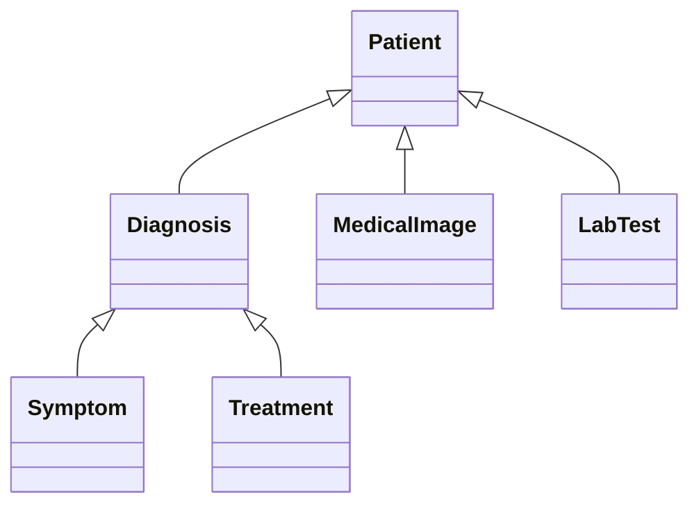
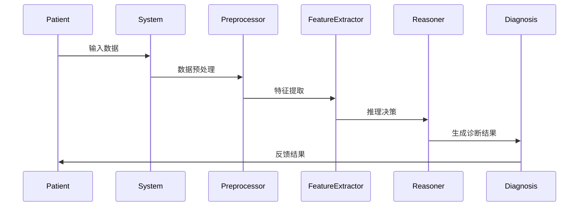

                 


### 思维链辅助的AI医疗诊断系统设计

#### 关键词：

- 思维链
- AI医疗诊断
- 系统设计
- 算法原理
- 医疗数据分析

#### 摘要：

本文将深入探讨思维链辅助的AI医疗诊断系统设计。我们将从背景介绍开始，逐步分析核心概念、算法原理、系统架构和实现细节，最终总结最佳实践并展望未来发展。本文旨在为读者提供全面、系统的了解，以及实际操作指导。

---

## 第一章 背景介绍

### 1.0.1 问题背景

在医疗诊断领域，传统的诊断方法主要依赖于医生的经验和专业知识。然而，随着医疗数据量的爆炸式增长，医生面对的数据复杂性逐渐增加，诊断的准确性和效率受到挑战。同时，医疗资源分布不均，许多偏远地区缺乏专业医生，导致诊断延误和误诊。

### 1.0.2 问题描述

思维链是一种基于人工智能的推理技术，通过模拟人类思维过程，实现复杂问题的自动推理和决策。将思维链应用于医疗诊断，可以大大提高诊断的准确性和效率，同时减少医生的负担。

### 1.0.3 问题解决

为了实现思维链辅助的医疗诊断系统，我们需要设计一个综合系统，包括数据收集、预处理、特征提取、推理决策和结果反馈等模块。该系统应能够处理大量的医疗数据，提取关键特征，利用思维链进行推理决策，最终生成诊断结果。

### 1.0.4 边界与外延

思维链辅助的医疗诊断系统设计应考虑以下边界与外延：

1. **数据来源**：系统的数据来源应包括电子病历、医学影像、实验室检查报告等。
2. **适用范围**：系统应适用于各种常见疾病的诊断，包括但不限于心脏病、癌症、神经系统疾病等。
3. **限制**：系统应明确指出其局限性，如无法诊断未记录在数据库中的疾病，或对某些特定病例的诊断准确性可能较低。

### 1.0.5 概念结构与核心要素组成

1. **思维链**：一种模拟人类思维过程的推理技术。
2. **AI医疗诊断系统**：包括数据收集、预处理、特征提取、推理决策和结果反馈等模块。

## 第二章 核心概念与联系

### 2.0.1 思维链的定义与特性

思维链是一种基于知识的推理系统，通过符号逻辑和概率推理实现问题的求解。其主要特性包括：

- **符号逻辑**：使用逻辑符号和规则表示知识。
- **概率推理**：基于概率统计进行推理。
- **自学习**：通过数据训练不断优化推理能力。

### 2.0.2 AI医疗诊断系统的基本原理

AI医疗诊断系统基于以下原理：

- **数据收集**：收集电子病历、医学影像、实验室检查报告等数据。
- **预处理**：对原始数据进行清洗、去噪和归一化。
- **特征提取**：从预处理后的数据中提取关键特征。
- **推理决策**：利用思维链进行推理决策，生成诊断结果。
- **结果反馈**：将诊断结果反馈给医生，辅助临床决策。

### 2.0.3 ER实体关系图

使用Mermaid绘制ER实体关系图：

```mermaid
erDiagram
  Patient ||--|{ Diagnosis : has }
  Patient ||--|{ MedicalImage : has }
  Patient ||--|{ LabTest : has }
  Diagnosis ||--|{ Symptom : has }
  Diagnosis ||--|{ Treatment : has }
```

## 第三章 算法原理讲解

### 3.0.1 算法mermaid流程图

使用Mermaid绘制算法流程图：


### 3.0.2 算法原理

思维链算法原理包括以下步骤：

1. **知识表示**：使用符号逻辑和概率图模型表示医学知识。
2. **推理引擎**：基于知识表示进行推理，求解诊断问题。
3. **决策支持**：根据推理结果生成诊断建议。

### 3.0.3 举例说明

假设一位患者出现咳嗽、发热等症状，思维链辅助的医疗诊断系统将如何诊断？

1. **数据收集**：收集患者的基本信息、症状描述、医学影像和实验室检查报告等。
2. **预处理**：清洗和归一化数据。
3. **特征提取**：提取与咳嗽、发热相关的特征。
4. **推理决策**：根据知识库和推理规则，推断患者可能患有肺炎。
5. **结果反馈**：生成诊断结果，建议患者进行肺炎相关检查和治疗。

## 第四章 系统分析与架构设计方案

### 4.0.1 问题场景介绍

在一家综合性医院，医生需要处理大量的患者病例。传统方法依赖医生经验，效率低下。引入思维链辅助的AI医疗诊断系统，旨在提高诊断的准确性和效率。

### 4.0.2 系统功能设计

使用Mermaid绘制领域模型类图：



### 4.0.3 系统架构设计

使用Mermaid绘制系统架构图：

```mermaid
sequenceDiagram
  Patient -->|输入数据| System
  System -->|预处理| Preprocessor
  Preprocessor -->|特征提取| FeatureExtractor
  FeatureExtractor -->|推理决策| Reasoner
  Reasoner -->|诊断结果| Diagnosis
  Diagnosis -->|反馈结果| Patient
```

### 4.0.4 系统接口设计

- **数据接口**：接收患者数据，包括电子病历、医学影像和实验室检查报告。
- **诊断接口**：提供诊断结果和诊断建议。
- **反馈接口**：接收医生对诊断结果的反馈，用于系统优化。

### 4.0.5 系统交互

使用Mermaid绘制系统交互序列图：



## 第五章 项目实战

### 5.0.1 环境安装

安装所需的软件和工具，包括Python、Numpy、Scikit-learn等。

### 5.0.2 系统核心实现源代码

提供系统核心实现的源代码，包括数据预处理、特征提取、推理决策等模块。

### 5.0.3 代码应用解读与分析

分析代码的实现细节和关键点，包括数据预处理、特征提取和推理决策的算法实现。

### 5.0.4 实际案例分析和详细讲解

分析具体案例，包括患者数据、诊断结果和系统优化过程。

### 5.0.5 项目小结

总结项目的经验和教训，讨论系统在实际应用中的优势和改进空间。

## 第六章 最佳实践、小结、注意事项、拓展阅读等内容

### 6.0.1 最佳实践 tips

- 确保数据质量和多样性。
- 定期更新知识库和推理规则。
- 监控系统的性能和诊断准确性。

### 6.0.2 小结

本文介绍了思维链辅助的AI医疗诊断系统设计，包括背景介绍、核心概念、算法原理、系统架构和实现细节。通过实际案例分析和项目实战，展示了系统的应用效果和优化方向。

### 6.0.3 注意事项

- 系统设计应充分考虑医疗数据的敏感性和隐私保护。
- 系统应具备可扩展性和灵活性，以适应不同医疗场景的需求。

### 6.0.4 拓展阅读

- 深入了解思维链和AI医疗诊断的相关研究。
- 探索其他人工智能技术在医疗领域的应用。

## 第七章 结论

思维链辅助的AI医疗诊断系统设计具有广阔的应用前景。通过本文的介绍和分析，我们期望为读者提供全面的了解和实际操作指导，推动人工智能在医疗领域的深入发展。

---

**作者**：

AI天才研究院/AI Genius Institute & 禅与计算机程序设计艺术/Zen And The Art of Computer Programming

---

以上是文章的框架和内容，接下来我们将逐步展开每个章节的详细内容。请注意，这里的内容仅为示例，实际的撰写过程需要更深入的研究和数据分析。

