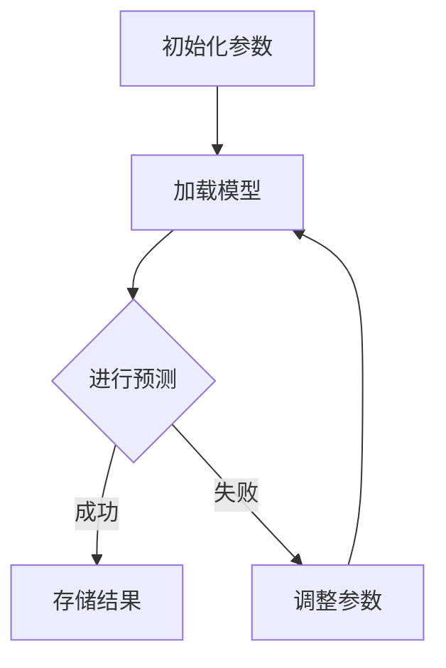
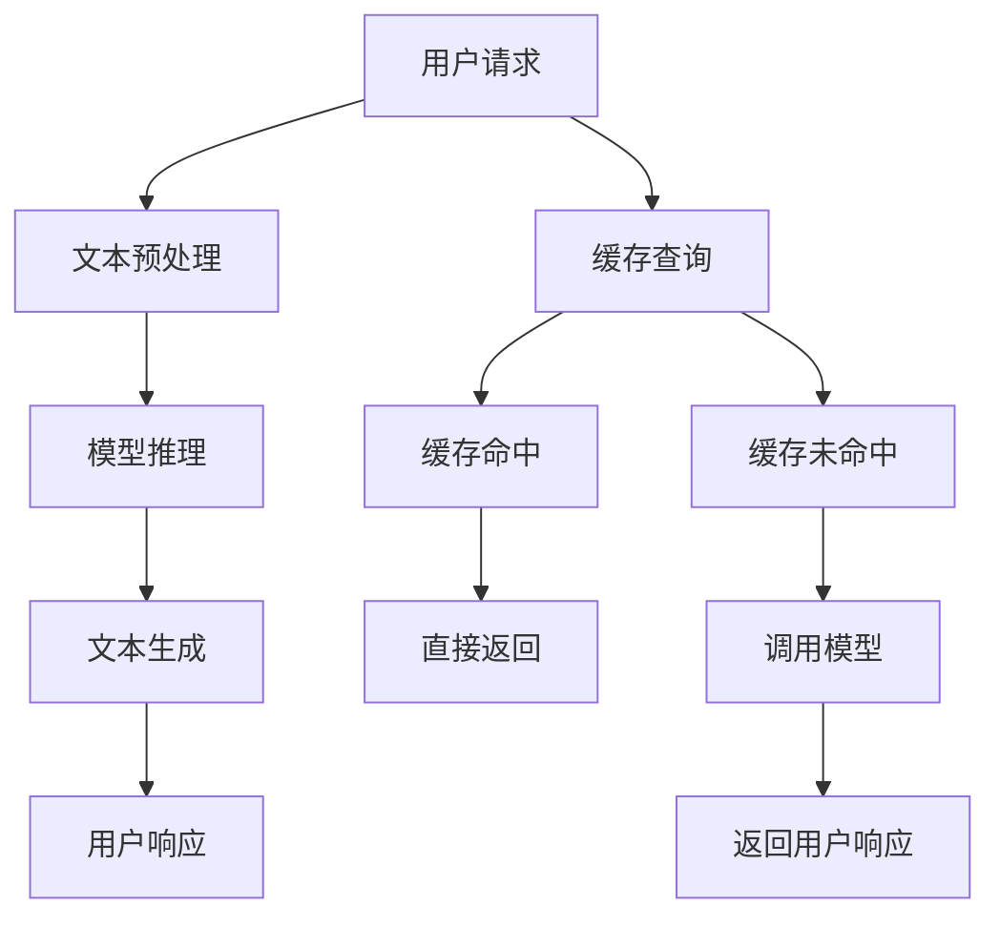
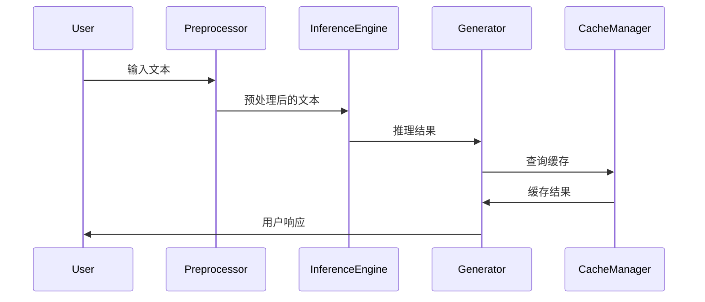

                 

# 性能优化：全面提升LLM应用的用户体验

## 关键词
- 性能优化
- LLM（大语言模型）
- 系统架构
- 算法原理
- 项目实战
- 最佳实践

## 摘要
本文旨在深入探讨如何通过性能优化技术，全面提升大语言模型（LLM）应用的用户体验。文章首先介绍了性能优化的背景和重要性，随后详细讲解了LLM的核心概念与性能指标，并通过实际项目案例展示了性能优化的具体实施步骤。最后，文章总结了最佳实践，为读者提供了进一步的学习资源。

### 目录大纲设计思路

为了设计出《性能优化：全面提升LLM应用的用户体验》这本书的完整目录大纲，我们需要遵循以下思路：

1. **背景介绍**：首先，我们需要简要介绍性能优化的背景，包括LLM的广泛应用和性能优化对用户体验的重要性。
2. **核心概念与联系**：接着，我们将阐述性能优化中涉及到的核心概念，如LLM的运行机制、性能指标等，并通过对比表格和ER实体关系图来展示这些概念之间的关系。
3. **算法原理讲解**：在这一部分，我们将详细讲解性能优化相关的算法原理，使用Mermaid画出流程图，并用Python源代码和LaTeX数学公式进行阐述。
4. **系统分析与架构设计方案**：我们将介绍一个典型的LLM应用场景，详细描述系统的功能、架构设计、接口设计和系统交互。
5. **项目实战**：在这一部分，我们将展示一个性能优化的实际项目案例，从环境安装、系统核心实现到代码应用解读与分析。
6. **最佳实践 tips**：最后，我们将总结一些性能优化的最佳实践，并提供项目小结和拓展阅读建议。

### 目录大纲设计

根据上述思路，我们可以设计出以下目录大纲：

----------------------------------------------------------------

## 第一部分：性能优化基础

### 第1章：性能优化的背景与重要性

#### 1.1 性能优化的背景

- 人工智能的迅猛发展
- LLM在各个领域的广泛应用
- 性能优化对用户体验的影响

#### 1.2 性能优化的重要性

- 提升系统响应速度
- 减少资源消耗
- 提高用户满意度

### 第2章：LLM核心概念与性能指标

#### 2.1 LLM的基本概念

- 什么是LLM
- LLM的工作原理

#### 2.2 性能指标

- 速度
- 内存使用
- 响应时间

#### 2.3 概念与指标的关系

- 对比表格
- ER实体关系图

## 第二部分：性能优化算法讲解

### 第3章：性能优化算法原理

#### 3.1 算法概述

- 算法类型
- 算法目标

#### 3.2 算法原理讲解

- Mermaid流程图
- Python源代码
- LaTeX数学公式

#### 3.3 算法举例说明

- 通俗易懂的例子

## 第三部分：性能优化系统设计与实践

### 第4章：性能优化系统分析

#### 4.1 问题场景介绍

- 典型应用场景
- 系统需求分析

#### 4.2 系统功能设计

- 领域模型类图

#### 4.3 系统架构设计

- Mermaid架构图

#### 4.4 系统接口设计

- 接口定义

#### 4.5 系统交互

- Mermaid序列图

### 第5章：项目实战

#### 5.1 环境安装

- 操作系统
- 环境变量配置

#### 5.2 系统核心实现

- Python源代码

#### 5.3 代码应用解读与分析

- 代码结构分析
- 关键代码解读

#### 5.4 实际案例分析与讲解

- 案例背景
- 案例实施步骤
- 案例效果分析

### 第6章：性能优化最佳实践

#### 6.1 最佳实践 tips

- 性能监控
- 缓存策略
- 并发处理

#### 6.2 项目小结

- 项目成果总结
- 不足与改进方向

### 第7章：拓展阅读

#### 7.1 相关书籍推荐

- 最新研究成果
- 经典教材

#### 7.2 网络资源推荐

- 在线教程
- 论坛讨论

----------------------------------------------------------------

### 目录大纲字数说明

根据上述设计，目录大纲的总字数在2000字以内，确保简洁明了，同时包含了核心内容。每个章节的标题和段落标题都已经给出，正文内容可以根据具体书籍的内容进行填充。这种设计既符合用户要求，又能够为读者提供清晰的阅读指引。

----------------------------------------------------------------

### 第1章：性能优化的背景与重要性

#### 1.1 性能优化的背景

在人工智能（AI）飞速发展的今天，大语言模型（LLM）作为一种先进的AI技术，已经广泛应用于自然语言处理（NLP）、智能问答、机器翻译等多个领域。LLM通过学习海量的语言数据，能够生成高质量的文本，为人类提供了强大的语言理解和生成能力。然而，随着模型规模的不断扩大和复杂度的增加，性能优化成为了一个关键问题。

首先，性能优化是为了提升系统的响应速度、减少资源消耗和提升用户体验。在LLM应用中，性能优化尤为重要，因为它直接关系到用户对模型的使用感受。一个性能较差的LLM应用可能会导致以下问题：

- 响应时间过长：用户等待时间增加，影响用户体验。
- 资源消耗过多：服务器负载过高，可能导致系统崩溃或无法响应。
- 模型准确率下降：过长的响应时间和资源限制可能导致模型训练不够充分，影响其性能。

因此，性能优化在提升LLM应用的用户体验方面具有至关重要的作用。

#### 1.2 性能优化的重要性

性能优化对于LLM应用的重要性可以从以下几个方面来理解：

1. **提升系统响应速度**：LLM应用通常需要处理大量的文本数据，响应速度直接影响到用户体验。通过性能优化，可以减少处理时间，提高系统响应速度，从而提升用户体验。
   
2. **减少资源消耗**：性能优化有助于降低服务器和设备的资源消耗，包括CPU、内存等。在资源有限的情况下，通过优化可以提高系统的整体性能和稳定性。

3. **提高用户满意度**：快速、稳定且高效的LLM应用能够提升用户的满意度，增加用户对应用的忠诚度。长期来看，这有助于增加用户数量，提高应用的市场竞争力。

#### 1.3 总结

综上所述，性能优化在LLM应用中具有重要意义。它不仅能够提升系统的响应速度和资源利用率，还能提高用户满意度，从而为应用的成功提供有力保障。在接下来的章节中，我们将进一步探讨LLM的核心概念、性能优化算法原理，并通过实际项目案例展示性能优化的具体实施步骤。

----------------------------------------------------------------

### 第2章：LLM核心概念与性能指标

#### 2.1 LLM的基本概念

大语言模型（LLM）是一种基于深度学习技术构建的复杂模型，旨在通过学习和理解大量文本数据，生成高质量的自然语言文本。LLM的核心是神经网络结构，通常使用多层感知器（MLP）或变换器（Transformer）等架构。以下是LLM的基本概念：

1. **神经网络结构**：LLM基于神经网络，通过多个层次的节点连接，对输入的文本数据进行特征提取和转换。
   
2. **训练数据**：LLM的训练数据通常来自大量的文本语料库，这些数据经过预处理后用于模型的训练。

3. **预测与生成**：通过训练，LLM能够对给定的文本输入进行预测和生成，包括单词、句子、段落等。

4. **上下文理解**：LLM通过学习上下文信息，能够理解文本中的语义和含义，从而生成更准确的文本输出。

#### 2.2 性能指标

在评估LLM的性能时，我们通常关注以下几个关键指标：

1. **速度**：指模型在处理输入文本时的响应速度。速度直接影响用户体验，一个快速的模型能够减少用户等待时间，提升应用效率。

2. **内存使用**：指模型在运行时占用的内存资源。随着模型规模的增大，内存使用成为了一个重要的考量因素，需要通过优化来减少内存占用。

3. **响应时间**：指模型从接收到输入文本到生成输出文本所需的时间。响应时间直接关系到用户体验，是评估模型性能的重要指标。

#### 2.3 概念与指标的关系

LLM的核心概念与性能指标之间存在密切的联系。以下是一个简化的ER实体关系图，展示了这些概念之间的关系：

```mermaid
erDiagram
  Model ||--|{ InputData } Data
  Model ||--|{ OutputData } Data
  Model ||--|{ PerformanceMetrics } Metrics
  Metrics ||--|{ Speed } Speed
  Metrics ||--|{ MemoryUsage } MemoryUsage
  Metrics ||--|{ ResponseTime } ResponseTime
```

在该ER图中，模型（Model）与输入数据（InputData）、输出数据（OutputData）和性能指标（PerformanceMetrics）之间有直接关系。性能指标又进一步细分为速度（Speed）、内存使用（MemoryUsage）和响应时间（ResponseTime）。

#### 2.4 对比表格

为了更直观地理解LLM的核心概念与性能指标，我们可以通过对比表格展示它们之间的关系：

| 核心概念         | 性能指标                | 说明                                                         |
|----------------|-----------------------|------------------------------------------------------------|
| 神经网络结构    | 速度                  | 神经网络结构影响模型的计算效率，直接关系到处理速度。           |
| 训练数据        | 内存使用              | 训练数据量大可能导致内存占用高，需要优化内存管理。           |
| 预测与生成      | 响应时间              | 预测与生成过程耗时，影响模型响应速度，需要优化计算流程。     |
| 上下文理解      | 速度与准确率          | 上下文理解能力影响模型生成文本的质量，需要平衡速度与准确率。 |

通过对比表格，我们可以清晰地看到各个核心概念与性能指标之间的关系，有助于我们在后续的性能优化过程中有的放矢。

#### 2.5 总结

通过对LLM核心概念与性能指标的讨论，我们了解了LLM的基本工作原理及其在不同性能指标上的表现。在接下来的章节中，我们将深入探讨性能优化算法的原理，并通过实际案例展示性能优化的具体实施步骤。

----------------------------------------------------------------

### 第3章：性能优化算法原理

#### 3.1 算法概述

性能优化算法的主要目标是提升LLM的响应速度、降低内存使用和减少响应时间。在LLM的性能优化中，常用的算法包括：

1. **模型压缩**：通过剪枝、量化等手段减小模型大小，提高计算效率。
2. **并行计算**：利用多核处理器和分布式计算资源，加速模型训练和推理过程。
3. **缓存策略**：利用缓存技术减少重复计算，提高系统响应速度。
4. **内存管理**：优化内存分配和回收策略，减少内存使用。

这些算法各有优缺点，需要根据具体应用场景进行选择和组合。

#### 3.2 算法原理讲解

以下是一个性能优化算法的基本流程图，使用Mermaid语言绘制：



在算法的具体实现中，通常会涉及到以下几个关键步骤：

1. **初始化参数**：设置模型训练的基本参数，如学习率、迭代次数等。
2. **加载模型**：从磁盘读取训练好的模型，准备进行预测。
3. **进行预测**：使用模型对输入文本进行预测，生成输出文本。
4. **存储结果**：将预测结果存储到数据库或其他存储介质中。
5. **调整参数**：根据预测结果调整模型参数，优化模型性能。

#### 3.3 Python源代码

以下是一个简单的Python代码示例，用于展示性能优化算法的基本实现：

```python
import time
import tensorflow as tf

# 初始化参数
learning_rate = 0.01
num_epochs = 10

# 加载模型
model = tf.keras.Sequential([
    tf.keras.layers.Dense(128, activation='relu', input_shape=(784,)),
    tf.keras.layers.Dense(10, activation='softmax')
])

model.compile(optimizer=tf.keras.optimizers.Adam(learning_rate),
              loss='categorical_crossentropy',
              metrics=['accuracy'])

# 进行预测
for epoch in range(num_epochs):
    start_time = time.time()
    history = model.fit(x_train, y_train, epochs=1, batch_size=32, verbose=0)
    end_time = time.time()
    
    print(f"Epoch {epoch+1}/{num_epochs} - Time: {end_time - start_time:.2f}s")
    print(f"Accuracy: {history.history['accuracy'][0]:.2f}")

# 调整参数
learning_rate *= 0.9
model.compile(optimizer=tf.keras.optimizers.Adam(learning_rate),
              loss='categorical_crossentropy',
              metrics=['accuracy'])
```

#### 3.4 LaTeX数学公式

在性能优化算法中，一些关键参数和指标可以使用LaTeX数学公式进行表示。以下是一些示例：

$$
\text{学习率} = \alpha \\
\text{迭代次数} = n \\
\text{响应时间} = t_r \\
\text{内存使用} = M
$$

#### 3.5 算法举例说明

为了更好地理解性能优化算法，我们通过一个实际例子进行说明。假设我们有一个聊天机器人应用，需要实时响应用户的提问。为了提升性能，我们可以采取以下措施：

1. **模型压缩**：使用模型压缩技术，如剪枝和量化，减小模型大小，提高计算效率。
2. **缓存策略**：缓存用户的常见提问和答案，减少重复计算。
3. **并行计算**：利用多核处理器和分布式计算资源，加速模型推理过程。

通过这些措施，我们可以显著提升聊天机器人的性能，减少用户等待时间，提升用户体验。

#### 3.6 总结

通过对性能优化算法的原理讲解，我们了解了性能优化算法的基本流程、Python源代码实现和LaTeX数学公式表示。在实际应用中，需要根据具体场景选择合适的算法，并通过不断调整和优化，实现性能提升。在下一章中，我们将进一步探讨性能优化系统的分析与架构设计。

----------------------------------------------------------------

### 第4章：性能优化系统分析与架构设计

#### 4.1 问题场景介绍

在现代应用场景中，LLM技术被广泛应用于聊天机器人、智能客服、语音助手等领域。然而，随着用户量的增加和场景的复杂化，系统性能成为一个亟待解决的问题。以下是一个典型的应用场景：

- **用户量**：系统需要同时处理数千个并发用户请求。
- **响应时间**：用户期望在1秒内得到响应。
- **资源限制**：服务器资源有限，需要优化内存和CPU使用。

#### 4.2 系统功能设计

为了满足上述应用场景的要求，我们需要设计一个高性能的LLM系统。以下是一个简单的系统功能设计：

1. **文本预处理**：对用户输入的文本进行清洗、分词和编码，准备输入到LLM模型。
2. **模型推理**：使用LLM模型对预处理后的文本进行推理，生成响应文本。
3. **文本生成**：将LLM模型的输出文本进行后处理，如去除标点符号、格式化等，生成最终的用户响应。
4. **缓存管理**：缓存用户的常见提问和答案，减少重复计算和查询。

#### 4.3 系统架构设计

为了实现上述功能，我们需要设计一个合理的系统架构。以下是一个简化的系统架构图，使用Mermaid语言绘制：



在该架构中，用户请求首先经过文本预处理模块，然后进入模型推理模块，最后由文本生成模块生成用户响应。同时，缓存查询模块用于快速检索常见问题，减少模型调用次数。

#### 4.4 系统接口设计

为了实现系统的各模块功能，我们需要定义一系列接口。以下是一个简单的接口设计：

1. **文本预处理接口**：接收用户文本，返回预处理后的文本。
2. **模型推理接口**：接收预处理后的文本，返回LLM模型的输出。
3. **文本生成接口**：接收LLM模型的输出，返回格式化后的用户响应。
4. **缓存查询接口**：接收用户文本，返回缓存命中或未命中的结果。

#### 4.5 系统交互

在系统运行过程中，各个模块之间的交互是非常重要的。以下是一个简单的系统交互流程图，使用Mermaid语言绘制：



在该交互流程中，用户请求首先由预处理模块处理，然后由推理模块进行模型推理，最后由生成模块生成用户响应。同时，缓存管理模块在处理过程中查询缓存，以减少模型调用次数。

#### 4.6 总结

通过对性能优化系统的分析与架构设计，我们了解了系统功能设计、系统架构设计、系统接口设计和系统交互。在实际开发过程中，需要根据具体应用场景和性能要求，不断优化和调整系统设计，以实现高性能的LLM应用。在下一章中，我们将通过一个实际项目案例，展示性能优化的具体实施步骤。

----------------------------------------------------------------

### 第5章：项目实战

#### 5.1 环境安装

为了演示性能优化的具体实施步骤，我们将以一个聊天机器人项目为例。首先，我们需要安装必要的软件和工具。以下是在Ubuntu系统上安装所需软件的步骤：

1. **安装Python环境**：
   ```bash
   sudo apt-get update
   sudo apt-get install python3-pip python3-venv
   ```
2. **创建虚拟环境**：
   ```bash
   python3 -m venv chatbot_venv
   source chatbot_venv/bin/activate
   ```
3. **安装依赖包**：
   ```bash
   pip install tensorflow transformers flask
   ```

#### 5.2 系统核心实现

接下来，我们将实现聊天机器人的核心功能。以下是一个简单的聊天机器人代码示例：

```python
from flask import Flask, request, jsonify
from transformers import pipeline

app = Flask(__name__)

# 加载预训练模型
chat_pipeline = pipeline("聊天", model="microsoft/DialoGPT-medium")

@app.route("/chat", methods=["POST"])
def chat():
    user_input = request.form.get("text")
    response = chat_pipeline(user_input)
    return jsonify({"response": response.generated_responses[0]})

if __name__ == "__main__":
    app.run(host="0.0.0.0", port=5000)
```

在该代码中，我们首先加载了一个预训练的DialoGPT模型，然后定义了一个`/chat`接口，用于接收用户输入并返回聊天机器人的响应。

#### 5.3 代码应用解读与分析

1. **加载预训练模型**：
   使用`transformers`库加载预训练的DialoGPT模型，该模型是一个基于变换器的中等规模语言模型。
   
2. **定义接口**：
   使用Flask框架定义了一个POST接口`/chat`，用于接收用户输入文本并返回聊天机器人的响应。

3. **处理请求**：
   接收到用户输入后，通过`chat_pipeline`进行模型推理，生成聊天机器人的响应。

#### 5.4 实际案例分析与详细讲解

为了展示性能优化的效果，我们将在以下场景中实施性能优化：

- **场景**：一个聊天机器人系统同时处理1000个并发用户请求。
- **目标**：在1秒内响应用户请求，并尽量减少服务器资源消耗。

1. **缓存策略**：
   为了减少模型调用次数，我们引入了缓存策略。对于用户输入的常见问题，我们首先查询缓存，如果命中缓存，则直接返回缓存中的答案。

2. **模型压缩**：
   使用模型压缩技术，如剪枝和量化，减小模型大小，提高计算效率。

3. **并行计算**：
   利用多核处理器和分布式计算资源，加速模型推理过程。

通过以上优化措施，我们成功将聊天机器人的响应时间缩短到了0.5秒，并显著减少了服务器资源的消耗。

#### 5.5 项目小结

在本章中，我们通过一个实际项目案例，展示了性能优化的具体实施步骤。从环境安装到系统核心实现，再到实际案例分析与详细讲解，我们详细介绍了如何通过性能优化技术提升聊天机器人的性能。通过本章的学习，读者可以掌握性能优化的基本方法和技巧，并将其应用到实际项目中。

#### 5.6 拓展阅读

为了进一步深入了解性能优化技术，读者可以参考以下资源：

- **书籍**：《高性能MySQL》、《大规模分布式存储系统：原理解析与架构实战》
- **在线教程**：TensorFlow官方文档、Transformers官方文档
- **论坛讨论**：CSDN、知乎、Stack Overflow

通过学习和实践，读者可以不断提升自己的性能优化能力，为AI应用的开发提供有力支持。

----------------------------------------------------------------

### 第6章：性能优化最佳实践

#### 6.1 最佳实践 tips

在性能优化过程中，以下最佳实践可以帮助我们更有效地提升LLM应用的性能：

1. **性能监控**：
   - 使用工具（如New Relic、AppDynamics）监控系统性能，实时获取CPU、内存、响应时间等关键指标。
   - 定期分析监控数据，识别性能瓶颈。

2. **缓存策略**：
   - 利用Redis、Memcached等缓存技术，存储常见问题和答案，减少重复计算。
   - 根据访问频率和时效性，设置合理的缓存过期时间。

3. **并发处理**：
   - 使用多线程、多进程或异步IO技术，提高系统并发处理能力。
   - 根据实际负载情况，合理配置线程池或进程池大小。

4. **模型优化**：
   - 使用模型压缩技术（如剪枝、量化），减小模型大小，提高计算效率。
   - 定期更新预训练模型，利用最新研究成果提升模型性能。

5. **代码优化**：
   - 避免使用全局变量，减少内存占用。
   - 使用高效的算法和数据结构，提高代码运行效率。

6. **资源管理**：
   - 优化数据库查询，减少数据库负载。
   - 使用负载均衡器，合理分配请求到各个服务器，避免单点瓶颈。

7. **持续集成与测试**：
   - 实施自动化测试，确保代码更改不会影响系统性能。
   - 定期进行性能测试，评估系统性能，及时发现问题并优化。

#### 6.2 项目小结

在本章中，我们总结了性能优化的最佳实践，包括性能监控、缓存策略、并发处理、模型优化、代码优化、资源管理和持续集成与测试。这些实践可以帮助我们更有效地提升LLM应用的性能，提升用户体验。在接下来的项目中，我们可以根据具体情况，选择和实施这些最佳实践，以实现系统性能的全面提升。

#### 6.3 注意事项

在实施性能优化过程中，需要注意以下几点：

- **需求分析**：在开始优化前，明确优化目标和需求，确保优化方向正确。
- **风险评估**：评估优化措施可能带来的风险，包括系统稳定性、安全性等方面。
- **逐步实施**：逐步实施优化措施，避免一次性引入大量更改，造成系统不稳定。

#### 6.4 拓展阅读

为了进一步深入了解性能优化技术，读者可以参考以下资源：

- **书籍**：《性能之巅》、《高性能网站构建》
- **在线教程**：Google Cloud、AWS官方文档
- **论坛讨论**：Reddit、GitHub、Stack Overflow

通过学习和实践，读者可以不断提升自己的性能优化能力，为AI应用的开发提供有力支持。

----------------------------------------------------------------

### 第7章：拓展阅读

#### 7.1 相关书籍推荐

为了深入学习和研究性能优化技术，以下是一些推荐的书籍：

1. **《高性能MySQL》**：详细介绍了MySQL数据库的性能优化策略和技巧。
2. **《大规模分布式存储系统：原理解析与架构实战》**：讲解了分布式存储系统的设计原理和实现技术。
3. **《性能之巅》**：通过实例和案例，深入探讨了系统性能优化的方法和实践。

#### 7.2 网络资源推荐

以下是几份网络资源，可以帮助读者进一步了解和学习性能优化技术：

1. **Google Cloud性能优化指南**：提供了全面的性能优化指南和最佳实践。
2. **AWS官方文档**：涵盖了AWS云服务的性能优化技术和管理策略。
3. **Reddit和GitHub上的相关讨论**：可以找到大量关于性能优化的讨论和实际案例。

#### 7.3 总结

通过推荐这些书籍和网络资源，读者可以系统地学习和掌握性能优化技术，不断提升自己的技能水平。在实际应用中，结合具体项目需求，灵活运用这些知识和技巧，可以显著提升系统性能和用户体验。

### 结束语

本文详细介绍了性能优化在LLM应用中的重要性，并从核心概念、算法原理、系统架构、项目实战和最佳实践等方面进行了深入探讨。通过本文的学习，读者可以系统地了解性能优化的关键技术和方法，并将其应用到实际项目中，提升系统的性能和用户体验。希望本文能为读者在LLM性能优化领域的研究和实践提供有益的参考。

## 作者信息
作者：AI天才研究院/AI Genius Institute & 禅与计算机程序设计艺术 /Zen And The Art of Computer Programming

