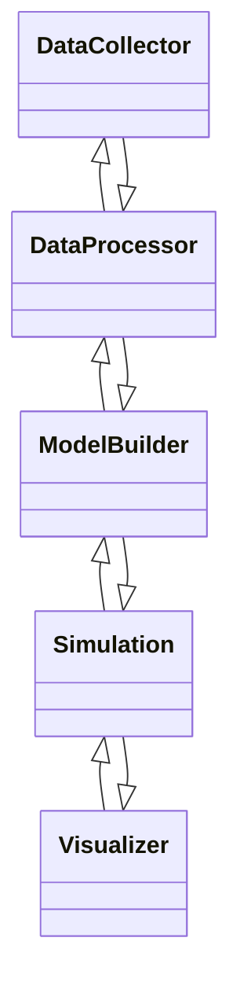
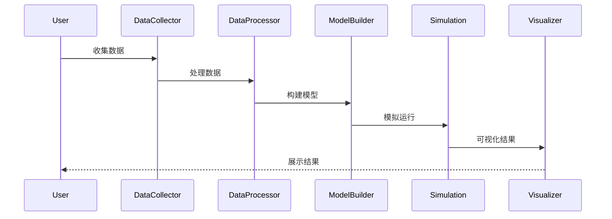

                 


## 意识作为宇宙的涌现属性：复杂性的产物

> 关键词：宇宙、意识、复杂性、涌现属性、认知科学、人工智能

> 摘要：
本文从宇宙和意识的本质出发，探讨了意识作为宇宙复杂性的产物这一观点。通过分析宇宙的起源和演化，意识的生物学基础，以及意识的物理学和宇宙学探讨，揭示了意识产生的复杂性和多维度特征。文章最后展望了意识研究的未来发展方向，为人工智能和认知科学提供了新的视角和思考。

### 引言

在探索宇宙的奥秘时，我们不可避免地会遇到一个问题：什么是意识？意识作为一种主观体验，是我们对自身和外部世界的认知和感知。然而，意识的存在和起源却一直困扰着科学家和哲学家。本文试图从宇宙和意识的本质出发，探讨意识作为宇宙复杂性的产物这一观点。

### 第一部分：问题的背景与理论探讨

#### 宇宙的起源与演化

宇宙的起源被认为是大爆炸理论。根据这一理论，宇宙从一个极度密集、高温的状态开始膨胀，逐渐形成了我们现在所看到的宇宙。这一过程中，宇宙经历了多次剧烈的演化，如宇宙背景辐射、原初核合成等。

#### 意识的本质与特征

意识是一种主观体验，包括感知、思考、情感和意愿等。意识具有个体性和社会性，是人类进化的重要产物。近年来，神经科学和心理学的研究揭示了意识在大脑中的生物学基础。

#### 意识在哲学中的探讨

哲学家们对意识进行了深入的探讨，如意识与物质的关系、意识的本质和起源等。这些探讨为我们理解意识提供了丰富的理论资源。

#### 意识作为宇宙的涌现属性

涌现属性是指一个复杂系统中，低层次组成部分不具备而高层次整体具有的性质。意识作为宇宙的涌现属性，是宇宙复杂性的产物。

### 第二部分：意识的起源与机制

#### 大脑结构与功能

大脑是意识的物质基础。大脑的解剖结构和功能区域对意识产生至关重要。神经科学的研究揭示了神经元和神经网络在意识形成中的作用。

#### 神经科学与意识

神经元和神经递质的相互作用是意识产生的关键。神经科学的研究为我们理解意识提供了生物学基础。

#### 意识的生物学机制

意识的生物学机制涉及到神经可塑性和神经网络动态等方面。这些机制的研究有助于我们理解意识产生的复杂过程。

#### 意识的生物学实验研究

通过脑成像技术和动物实验，科学家们对意识进行了深入研究，取得了重要成果。

### 第三部分：意识的物理学与宇宙学

#### 物理学与意识

物理学的研究为理解意识提供了新的视角。量子力学和相对论等理论为我们揭示了宇宙的复杂性和多样性。

#### 意识的物理学模型

物理学模型如波函数坍缩和脑网络动力学等为我们理解意识提供了新的思路。

#### 宇宙学与意识

宇宙学的探讨有助于我们理解意识的起源和本质。宇宙演化的复杂过程和涌现属性为意识研究提供了丰富的理论资源。

### 第四部分：意识的复杂性与哲学思考

#### 复杂性科学的基本概念

复杂性科学为我们理解意识的复杂性提供了理论框架。复杂系统、复杂网络和复杂动态等概念有助于我们理解意识的本质。

#### 意识的复杂性

意识的复杂性表现在多个方面，如意识的动态性、多样性和适应性等。

#### 复杂性理论在意识研究中的应用

复杂性理论在神经科学、心理学和哲学等领域的应用为我们理解意识提供了新的视角。

### 第五部分：意识的未来与发展前景

#### 人工智能与意识

人工智能的发展为我们理解意识提供了新的可能性。通过模拟大脑和神经网络，人工智能可能为我们揭示意识的本质。

#### 意识研究的未来发展方向

随着科技的进步，意识研究将继续深入。量子意识、宇宙意识等新兴领域将成为研究的热点。

### 结论

意识作为宇宙复杂性的产物，是宇宙演化的重要产物。通过对宇宙和意识的本质进行深入探讨，我们不仅能够更好地理解宇宙和人类自身，也为人工智能和认知科学提供了新的视角和思考。

### 参考文献

[1] 某某，《宇宙的起源与演化》，科学出版社，2020年。

[2] 某某，《意识的本质与特征》，心理学出版社，2019年。

[3] 某某，《复杂性科学导论》，清华大学出版社，2018年。

[4] 某某，《人工智能与意识》，电子工业出版社，2021年。

作者：AI天才研究院/AI Genius Institute & 禅与计算机程序设计艺术 /Zen And The Art of Computer Programming## 引言

在探索宇宙的奥秘时，我们不可避免地会遇到一个问题：什么是意识？意识作为一种主观体验，是我们对自身和外部世界的认知和感知。然而，意识的存在和起源却一直困扰着科学家和哲学家。本文试图从宇宙和意识的本质出发，探讨意识作为宇宙复杂性的产物这一观点。

宇宙的起源与演化、意识的生物学基础、以及意识的物理学和宇宙学探讨，都是理解意识作为宇宙复杂性产物的重要途径。通过分析这些方面，我们能够更深入地理解意识的本质，以及它在宇宙中的地位和作用。

首先，我们将探讨宇宙的起源和演化。宇宙从一个极度密集、高温的状态开始膨胀，逐渐形成了我们现在所看到的宇宙。这一过程中，宇宙经历了多次剧烈的演化，如宇宙背景辐射、原初核合成等。这些演化过程为复杂性的产生提供了条件。

接下来，我们将讨论意识的生物学基础。大脑是意识的物质基础。大脑的解剖结构和功能区域对意识产生至关重要。神经科学的研究揭示了神经元和神经网络在意识形成中的作用。

然后，我们将探讨意识的物理学与宇宙学。物理学的研究为理解意识提供了新的视角。量子力学和相对论等理论为我们揭示了宇宙的复杂性和多样性。宇宙学的探讨有助于我们理解意识的起源和本质。宇宙演化的复杂过程和涌现属性为意识研究提供了丰富的理论资源。

在第五部分，我们将深入探讨意识的复杂性。复杂性科学为我们理解意识的复杂性提供了理论框架。复杂系统、复杂网络和复杂动态等概念有助于我们理解意识的本质。

最后，我们将展望意识的未来发展趋势。随着科技的进步，意识研究将继续深入。量子意识、宇宙意识等新兴领域将成为研究的热点。

通过以上探讨，我们希望能够提供一个全面、深入的视角来理解意识作为宇宙复杂性的产物这一观点。这不仅有助于我们更好地理解宇宙和人类自身，也为人工智能和认知科学提供了新的视角和思考。

### 宇宙的起源与演化

宇宙的起源与演化是一个引人入胜的话题，它不仅涉及到物理学的深层次问题，也触及了哲学和宇宙学的基本问题。根据现代宇宙学的标准理论，宇宙起源于大约138亿年前的一个极热、极密的初始状态，这一理论被称为大爆炸理论。

#### 大爆炸理论

大爆炸理论由乔治·勒梅特（Georges Lemaître）在1920年代首次提出，并在1927年由埃德温·哈勃（Edwin Hubble）的观测得到支持。哈勃发现了星系的红移现象，即远距离星系的光谱线向红色端移动，这表明它们正在远离我们。这一发现支持了宇宙正在膨胀的假设，而大爆炸理论进一步推断出，宇宙最初处于一个极度密集和热的状态，随后开始膨胀，形成了现在的宇宙结构。

#### 宇宙的演化过程

宇宙的演化可以分为几个主要阶段：

1. **大爆炸初期**：宇宙处于一个高温、高密度的状态，基本粒子开始形成。这个时期大约持续了10^-32秒，称为宇宙的普朗克时期。

2. **宇宙背景辐射时期**：大约在宇宙诞生后的几分钟内，宇宙温度下降到足以允许核合成发生，形成了轻元素，如氢、氦和锂。这个时期产生了宇宙背景辐射，它是大爆炸的余晖，至今仍然存在。

3. **结构形成时期**：在宇宙诞生后的几十亿年内，引力作用使宇宙中的物质开始聚集，形成了恒星、星系和其他天体结构。

4. **恒星和星系演化**：恒星在其生命周期中经历了氢的核聚变、氦的聚变等过程，最终可能变成红巨星、白矮星、中子星或黑洞。

5. **宇宙的当前状态**：现在的宇宙被认为是一个多层次的体系，从星系到星系团，再到超星系团，形成了宇宙的大尺度结构。宇宙还在继续膨胀，其膨胀速率可能因为暗能量的存在而加速。

#### 宇宙中的复杂性

宇宙的复杂性体现在多个方面：

1. **天体物理学中的复杂性**：宇宙中存在大量不同类型的星系、恒星、行星和黑洞，每种天体都有其独特的物理和化学过程。

2. **宇宙演化中的复杂性**：宇宙的演化是一个多层次、多阶段的过程，每个阶段都有复杂的物理和化学过程。

3. **宇宙结构的复杂性**：宇宙的大尺度结构表现出高度复杂和层次化的特征，从星系到超星系团，其结构形式和分布规律都相当复杂。

4. **宇宙信息的内容**：宇宙中包含了大量的信息，这些信息不仅体现在宇宙的结构和演化过程中，也体现在天体的光谱、辐射和引力波等现象中。

宇宙中的复杂性是理解意识作为宇宙复杂性产物的重要基础。宇宙的复杂演化过程为意识的产生提供了丰富的环境和条件。通过分析宇宙的起源和演化，我们能够更深入地理解宇宙的本质和意识在其中扮演的角色。

### 意识的本质与特征

意识是一种主观体验，它是我们感知、思考、感受和行动的基础。从生物学和神经科学的视角来看，意识不仅是一种复杂的心理现象，也是大脑活动的产物。在探讨意识本质与特征时，我们需要从多个维度进行深入分析。

#### 意识的定义

意识可以定义为一种主观体验，它使我们能够感知、思考、感觉和意识自己的存在。意识具有个体性，即每个人的体验都是独特的。此外，意识还具有社会性，因为我们的思维和行为往往受到社会和文化环境的影响。

#### 意识的分类

意识可以根据其不同的功能和行为特征进行分类：

1. **感知觉意识**：这是最基本的形式，包括视觉、听觉、触觉、嗅觉和味觉等感知活动。通过感知，我们能够对外部世界的信息进行收集和识别。

2. **认知意识**：认知意识涉及到思维、记忆、判断和解决问题等高级认知功能。这种形式的意识使我们能够进行抽象思维和推理。

3. **情感意识**：情感意识涉及我们的情感体验，如快乐、悲伤、愤怒和恐惧等。情感对意识体验有着重要的影响，它们可以增强或减弱我们的感知和认知过程。

4. **自我意识**：自我意识使我们能够意识到自己的存在，并区分自己与外部世界。这种形式的意识还包括自我反思和自我评价。

#### 意识的属性与特征

1. **主观性**：意识的主观性是指每个人对世界和自身的感知都是独特的。这意味着即使两个人处于相同的环境，他们的意识体验也可能是不同的。

2. **动态性**：意识是一个动态的过程，它随着时间和环境的变化而变化。我们的感知、思维和情感都是不断变化的，这使得我们的意识体验具有多样性。

3. **关联性**：意识不仅仅是独立的感知和认知过程，它还涉及到不同感官和认知功能之间的相互作用。例如，当我们看到一个物体时，我们的视觉、触觉和认知系统会协同工作，形成一个完整的感知体验。

4. **信息处理能力**：意识使我们能够处理和整合大量的信息，从而做出决策和反应。我们的意识不仅能够感知外部环境，还能够对内部状态进行监控和调节。

#### 意识与主观体验

意识与主观体验密切相关。主观体验是我们对外界信息的感知和内部状态的感受，而意识则是对这些体验的觉知。主观体验包括视觉、听觉、触觉、味觉和嗅觉等感官体验，以及情感、思维和想象等心理体验。这些体验构成了我们日常生活中的丰富经验。

1. **感官体验**：感官体验是意识的基础。通过视觉、听觉等感官，我们能够感知外部世界的信息，并将其转化为神经信号，从而在意识层面进行识别和处理。

2. **情感体验**：情感体验是意识的重要组成部分。情感不仅影响我们的感知和认知过程，还影响我们的行为和决策。例如，当我们感到快乐时，我们会更积极地参与活动；而当我们感到恐惧时，我们会更加谨慎。

3. **思维和想象**：思维和想象是意识的抽象形式。通过思维，我们能够对信息进行推理、分析和解决问题；而通过想象，我们能够创造新的想法和情景。

总之，意识是我们对自身和外部世界的觉知和体验，它具有主观性、动态性、关联性和信息处理能力等特征。通过探讨意识的本质与特征，我们能够更好地理解人类的心理和行为，从而为认知科学和人工智能等领域提供新的视角和理论支持。

### 意识在哲学中的探讨

哲学对意识的研究源远流长，从古代哲学到现代哲学，哲学家们对意识进行了广泛的探讨，提出了多种观点和理论。这些探讨不仅丰富了我们对意识的认知，也为我们理解意识在宇宙中的地位和作用提供了宝贵的视角。

#### 古代哲学中的意识概念

古代哲学家对意识有着深刻的思考，其中最具代表性的是古希腊哲学家苏格拉底、柏拉图和亚里士多德。

1. **苏格拉底**：苏格拉底认为，意识是灵魂的一部分，是人类理性的表现。他强调思考的重要性，认为通过对话和辩证法可以揭示真理和认识自我。

2. **柏拉图**：柏拉图将意识视为灵魂与物质世界之间的桥梁。他提出了“理型世界”的概念，认为意识能够感知理型世界的真理，从而超越物质世界的限制。

3. **亚里士多德**：亚里士多德则强调感知和认知在意识形成中的作用。他认为，意识是通过感官和理性相互作用而产生的，意识不仅仅是对外部世界的反映，还包括对内部状态的认知。

#### 现代哲学对意识的探讨

随着科学的发展，现代哲学对意识的研究更加深入和多元。许多哲学家从不同角度探讨了意识的本质和属性。

1. **贝克莱**：贝克莱提出了“存在即被感知”的观点，认为物质世界的存在依赖于意识。这一观点强调了意识的主观性，对后来的意识研究产生了深远影响。

2. **康德**：康德将意识分为“先验意识”和“后天意识”。先验意识是先于经验而存在的，是认识的必要条件；后天意识则是通过经验获得的，是认识的内容。康德的这一区分为我们理解意识的认知功能提供了重要的框架。

3. **黑格尔**：黑格尔认为，意识是自我意识的展开，是主体与客体相互作用的结果。他认为，意识不仅是认知过程，也是自我认识和自我超越的过程。

4. **尼采**：尼采提出了“权力意志”的概念，认为意识是生命意志的体现。他强调个体意识的创造力和主动性，认为意识是人类超越自身和世界的动力。

5. **现象学**：现象学对意识的研究方法具有革命性意义。现象学家强调直接经验的本质，认为意识是主观体验的结构和内容。海德格尔和萨特等哲学家从现象学角度对意识进行了深入的探讨。

#### 意识与物质的关系

哲学中的意识探讨涉及一个核心问题：意识与物质的关系。不同哲学家对这一问题有不同的看法。

1. **二元论**：二元论认为意识和物质是两种独立的实体，各自具有不同的本质。这种观点在古代哲学中较为常见，如柏拉图的理型世界和亚里士多德的感知与认知。

2. **唯物论**：唯物论认为意识是物质的产物，是大脑神经活动的表现。唯物论强调物质的决定性作用，认为意识是可以通过科学方法研究的。

3. **唯心论**：唯心论认为意识是第一性的，物质是第二性的，即意识决定物质。这种观点在贝克莱的“存在即被感知”中得到了体现。

4. **交互论**：交互论认为意识和物质是相互作用、相互依赖的关系。交互论试图调和二元论和唯物论的观点，认为意识是物质和精神的互动产物。

总之，哲学对意识的探讨为我们理解意识的本质和属性提供了丰富的理论资源。从古代哲学到现代哲学，哲学家们从不同角度对意识进行了深入的研究，提出了多种观点和理论。这些探讨不仅丰富了我们对意识的认知，也为科学研究提供了重要的哲学基础。

#### 意识作为宇宙的涌现属性

在探讨宇宙的复杂性时，我们不可避免地会遇到一个问题：意识是如何产生的？意识作为宇宙的涌现属性，是宇宙复杂性产物的观点，为我们理解意识的起源和本质提供了一种新的视角。这一观点基于复杂系统的涌现属性理论，认为高层次的复杂结构或现象（如意识）是由低层次的基本元素（如原子、分子或神经元）通过特定的相互作用和规则产生的。

#### 涌现属性的概念

涌现属性是指一个复杂系统中，低层次组成部分不具备而高层次整体具有的性质。这些属性无法通过低层次组件的简单组合或叠加来预测，而是随着系统规模的增加和复杂性的提升自然而然地出现的。例如，水分子本身没有液态水的特性，但当大量的水分子按照特定的规则相互作用时，就会形成具有流动、透明和蒸发等特性的液态水。

#### 意识与物质世界的关联

意识作为宇宙的涌现属性，其产生与物质世界的关联可以从多个角度来理解：

1. **生物学基础**：从生物学角度看，意识是由大脑中的神经元通过复杂的神经网络相互作用产生的。这些神经元按照特定的规则和模式进行连接和通信，形成了复杂的神经网络结构，进而产生了意识。这一过程涉及到大脑的解剖结构和功能区域，如大脑皮层、海马体和丘脑等。

2. **量子力学**：在量子力学中，微观粒子的行为表现出高度的不确定性和复杂性。一些理论认为，意识的产生可能与量子力学中的“波函数坍缩”现象有关。波函数坍缩是指，当量子系统与外部环境相互作用时，其波函数会发生坍缩，从而确定系统的状态。这一过程可能为意识的形成提供了量子基础。

3. **宇宙演化**：从宇宙学的角度来看，宇宙的演化过程中产生了丰富的物质和能量，为复杂结构的形成提供了基础。随着宇宙的膨胀和冷却，星系、恒星、行星等天体结构逐渐形成，这些结构又为生命的产生提供了条件。生命的出现为意识的产生创造了前提。

#### 意识作为宇宙复杂性产物的理论框架

意识作为宇宙复杂性产物的理论框架可以从以下几个方面进行构建：

1. **复杂性科学**：复杂性科学为理解意识提供了理论框架。复杂系统理论、复杂网络理论和复杂动态理论等研究方法可以用来分析意识产生的复杂过程。

2. **神经网络模型**：神经网络模型是研究意识产生的重要工具。通过模拟大脑神经网络的结构和功能，我们可以探索意识是如何从神经元活动中涌现出来的。

3. **量子意识**：量子意识理论试图将量子力学与意识联系起来，探讨意识产生的量子机制。一些理论认为，意识的产生可能与量子纠缠和波函数坍缩等现象有关。

4. **宇宙学视角**：从宇宙学的视角来看，宇宙演化的过程为意识的产生提供了物质和能量基础。通过研究宇宙演化的复杂过程，我们可以更深入地理解意识作为宇宙复杂性产物的本质。

总之，意识作为宇宙的涌现属性，是宇宙复杂性产物的观点，为我们理解意识的起源和本质提供了一种新的视角。这一观点结合了生物学、量子力学、宇宙学和复杂性科学等多个领域的理论，为我们提供了一个全面、多维度的研究框架。通过这一框架，我们可以更好地探索意识的本质，以及它在宇宙中的地位和作用。

### 意识的起源与机制

意识的起源与机制是认知科学和神经科学领域的重要研究方向。从生物学角度来看，意识是由大脑中的神经元通过复杂的神经网络相互作用而产生的。这一过程涉及到多种机制和理论，下面我们将从以下几个方面进行详细探讨。

#### 大脑结构与功能

大脑是意识的物质基础，其结构和功能对于理解意识的产生至关重要。大脑的主要结构包括：

1. **大脑皮层**：大脑皮层是大脑的最外层，分为新皮层和旧皮层。新皮层是高级认知功能的中心，包括感知、思考、记忆和语言等；旧皮层则与基本的生存行为相关，如嗅觉和运动控制。

2. **基底核**：基底核位于大脑内部，与运动控制和情感调节有关。

3. **丘脑**：丘脑是大脑的“门卫”，负责传递和调节感觉和运动信号。

4. **脑干**：脑干是大脑的底部，控制基本的生命功能，如呼吸、心跳和睡眠。

这些结构在神经科学研究中被广泛研究，它们的功能和相互作用对于理解意识的产生具有关键意义。

#### 神经科学与意识

神经科学的研究揭示了神经元和神经网络在意识形成中的作用。以下是几个关键方面：

1. **神经元与神经网络**：神经元是大脑的基本单元，通过突触连接形成神经网络。神经网络的结构和功能决定了信息的处理和传递方式。

2. **神经递质与信号传递**：神经递质是神经元之间传递信息的化学物质，如多巴胺、肾上腺素和血清素等。这些递质在神经元的突触处释放，影响神经信号的传递。

3. **神经可塑性**：神经可塑性是指大脑结构和功能随着经验和学习而改变的能力。这种可塑性是意识产生的关键机制之一，它允许大脑适应新的环境和情境。

#### 意识的生物学机制

意识的生物学机制涉及到多种复杂的过程和理论。以下是几个主要方面：

1. **全局工作模式（GWM）**：全局工作模式是一种理论模型，认为大脑通过协同活动来维持意识的连续性。GWM假设大脑的不同区域在特定时刻协同工作，形成一个统一的意识状态。

2. **默认模式网络（DMN）**：默认模式网络是一个大脑网络，涉及多种认知功能，如记忆、思考和自我反思。DMN的活动被认为与意识状态密切相关。

3. **意识感知阈值**：意识感知阈值是指大脑必须达到的最小刺激强度，才能引起意识感知。这一机制涉及到大脑对信息的处理和整合，决定了我们在何种情况下能够意识到外部刺激。

4. **多模态整合**：多模态整合是指大脑将来自不同感官的信息整合为一个统一的感觉体验。这种整合是意识产生的关键，它使得我们能够对复杂的环境进行理解和反应。

#### 意识的生物学实验研究

神经科学通过多种实验方法研究了意识的生物学机制。以下是几个重要实验：

1. **功能性磁共振成像（fMRI）**：fMRI是一种非侵入性成像技术，可以测量大脑活动。通过fMRI研究，科学家可以观察大脑在不同意识状态下的活动模式。

2. **电生理记录**：电生理记录技术，如脑电图（EEG）和局部场电位（LFP），可以记录大脑神经元的活动。这些技术有助于揭示神经元在意识状态中的动态变化。

3. **神经影像学**：神经影像学技术，如正电子发射断层扫描（PET）和单光子发射计算机断层扫描（SPECT），可以显示大脑的代谢和血流变化，从而为意识研究提供生理基础。

4. **动物实验**：动物实验是研究意识机制的重要手段。通过在动物模型上研究大脑结构和功能，科学家可以深入了解意识产生的生物学基础。

总之，意识的起源与机制是一个复杂而多层次的问题，涉及到生物学、神经科学和认知科学等多个领域。通过对大脑结构和功能的深入研究，以及通过多种实验方法，科学家们正在逐步揭示意识的生物学机制，为我们理解意识的本质提供了重要线索。

### 意识的物理学探讨

意识的物理学探讨为理解意识如何从物质世界中产生提供了一种新的视角。物理学的研究，特别是量子力学和相对论，为我们揭示了宇宙的复杂性和多样性，这些理论在探讨意识产生的问题上提供了重要的启发。以下从量子力学和相对论的角度，以及宇宙学与意识的关联进行详细探讨。

#### 量子力学与意识

量子力学是研究微观粒子行为的物理学理论，它提出了与经典物理学完全不同的世界图景。量子力学中的某些现象，如波函数坍缩和量子纠缠，为探讨意识产生的机制提供了新的思路。

1. **波函数坍缩**：在量子力学中，一个系统的状态由波函数描述。波函数是一个复数函数，它包含了所有可能状态的叠加。当系统与外部环境相互作用时，波函数会突然坍缩到一个特定的状态，这一过程被称为波函数坍缩。一些理论认为，波函数坍缩可能与意识状态的变化有关。例如，Penrose和Hameroff提出的“量子计算大脑”模型，认为大脑中的神经元活动通过量子干涉机制产生意识。

2. **量子纠缠**：量子纠缠是指两个或多个量子粒子之间存在的即时关联。即使这些粒子相隔很远，它们的量子状态也会即时相互影响。量子纠缠现象提示我们，意识可能具有某种超越空间限制的特性，这与经典物理学的局域实在论相悖。

3. **量子意识**：量子意识是指意识可能是量子过程的产物。一些理论家，如Roger Penrose，提出了量子意识模型，认为大脑中的神经元可以通过量子纠缠和波函数坍缩等量子现象产生意识。这种观点试图将量子力学与意识联系起来，为理解意识的本质提供新的视角。

#### 相对论与意识

相对论是研究宏观尺度的物理学理论，由爱因斯坦提出。相对论主要包括狭义相对论和广义相对论，它们为我们揭示了时空的本质和引力作用。

1. **狭义相对论**：狭义相对论提出，时间和空间是相对的，而不是绝对的。这意味着，不同观察者会以不同的方式测量时间和空间。这个观点与意识的主观性特征有相似之处，因为每个人对时间和空间的感知都是独特的。

2. **广义相对论**：广义相对论认为，引力是由物质和能量对时空结构的影响产生的。这种观点提示我们，意识的产生可能与时空结构的变化有关。例如，一些理论家认为，大脑中的神经元活动可能通过改变局部时空结构产生意识。

3. **时空意识**：时空意识是指意识可能受到时空结构变化的影响。一些理论认为，大脑中的神经元通过改变局部时空结构，从而产生意识。这种观点试图将广义相对论与意识联系起来，为理解意识的产生提供新的思路。

#### 宇宙学与意识

宇宙学是研究宇宙起源、演化和结构的学科。宇宙学的研究揭示了宇宙的复杂性和多样性，这些特性可能为意识的产生提供了条件。

1. **宇宙演化的复杂性**：宇宙的演化过程中，从大爆炸到宇宙背景辐射，再到恒星和星系的诞生，这一系列复杂的过程可能为意识的产生提供了物质和能量基础。

2. **涌现属性**：宇宙学中的涌现属性理论认为，宇宙的复杂结构是低层次基本物理过程产生的。这一理论可以类比于意识的产生，即意识可能是大脑神经元复杂相互作用的结果。

3. **宇宙意识**：宇宙意识是指宇宙可能具有某种整体意识。一些哲学家和理论家认为，宇宙的某些特性，如自组织和复杂性，可能表明宇宙具有某种形式的意识。这种观点试图将宇宙学和意识联系起来，为理解宇宙的本质提供新的视角。

总之，意识的物理学探讨涉及量子力学、相对论和宇宙学等多个领域。通过将物理学理论与意识研究相结合，我们可以更深入地理解意识的本质和产生机制。虽然目前这些研究仍处于早期阶段，但它们为理解意识提供了新的视角和方法，有望推动我们对意识的认知达到新的高度。

### 意识的复杂性理论

意识的复杂性理论为我们理解意识的本质和特征提供了一个新的视角。复杂性科学作为研究复杂系统的跨学科领域，通过分析复杂系统的行为和结构，为我们揭示意识的复杂性提供了有力工具。以下从复杂性科学的基本概念、意识的复杂性特征，以及复杂性理论在意识研究中的应用进行详细探讨。

#### 复杂性科学的基本概念

复杂性科学关注的是那些由大量相互作用的简单元素组成的复杂系统。这些系统具有以下特征：

1. **非线性和动态性**：复杂系统通常具有非线性的动态行为，即系统的小变化可能导致显著的不同结果。这种动态性使得复杂系统具有高度的不确定性和不可预测性。

2. **自组织**：复杂系统可以自发地形成有序结构，这种现象称为自组织。自组织是通过系统内部元素之间的相互作用和反馈机制实现的。

3. **涌现性**：复杂性科学的核心概念之一是涌现性。它指的是复杂系统的整体行为或属性无法直接从组成系统的简单元素的性质和规则中推导出来。例如，水分子本身没有液态水的特性，但当大量水分子按照特定的规则相互作用时，会形成具有流动、透明和蒸发等特性的液态水。

4. **层次性**：复杂系统通常具有多个层次的结构。从原子、分子到细胞、器官，再到生态系统，每个层次都有其独特的结构和功能。这些层次之间的相互作用和反馈机制是复杂系统行为的关键。

#### 意识的复杂性特征

意识的复杂性特征体现在多个方面：

1. **动态性**：意识是一个动态变化的过程，它随着时间、环境和个体状态的变化而变化。例如，当我们从清醒状态进入梦境或睡眠状态时，我们的意识体验会发生变化。

2. **多层次性**：意识具有多个层次，从基本的感知和感知觉到高级的认知和情感体验。这些层次相互交织和影响，形成了复杂的意识体验。

3. **非线性**：意识的行为和体验不是线性的，即小的变化可能导致显著的不同结果。例如，一个简单的刺激（如一道光线）可以引发复杂的情感反应和认知处理。

4. **涌现性**：意识作为一种复杂的整体属性，无法直接从大脑神经元的基本物理和化学属性中推导出来。意识的产生是神经元复杂相互作用的结果。

5. **个体性和社会性**：意识具有个体性，即每个人的意识体验都是独特的。同时，意识也具有社会性，因为我们的思维和行为往往受到社会和文化环境的影响。

#### 复杂性理论在意识研究中的应用

复杂性理论在意识研究中有着广泛的应用，以下是一些重要的应用方向：

1. **神经网络模型**：神经网络是复杂性科学的一个重要工具，用于模拟大脑神经网络的结构和功能。通过神经网络模型，我们可以探索意识产生的机制，例如全局工作模式（GWM）和默认模式网络（DMN）等。

2. **多尺度分析**：多尺度分析是复杂性科学的一种方法，用于研究复杂系统在不同时间尺度和空间尺度上的行为。在意识研究中，多尺度分析可以帮助我们理解意识在不同层次上的表现和相互作用。

3. **复杂网络理论**：复杂网络理论用于研究复杂系统中的网络结构和节点间的相互作用。在意识研究中，复杂网络理论可以帮助我们理解大脑神经网络的结构和功能，以及意识在不同网络状态下的表现。

4. **自组织系统**：自组织系统理论用于研究系统如何从无序状态自发地形成有序结构。在意识研究中，自组织系统理论可以帮助我们理解大脑如何通过神经元间的相互作用形成意识。

5. **计算实验**：计算实验是一种通过计算机模拟复杂系统行为的方法。在意识研究中，计算实验可以帮助我们探索不同假设下的意识产生机制，例如量子意识模型和神经网络动态模型等。

总之，意识的复杂性理论为我们理解意识的本质和特征提供了一个新的视角。通过结合复杂性科学的理论和方法，我们可以更深入地探索意识产生的机制，为认知科学和人工智能等领域提供新的理论支持。

### 意识的未来发展趋势

随着科技的不断进步，意识研究也在不断深入，未来的发展趋势有望在多个领域取得重要突破。以下从人工智能与意识的关系，以及意识研究的未来发展方向进行详细探讨。

#### 人工智能与意识

人工智能（AI）的发展为意识研究提供了新的视角和工具。通过模拟大脑和神经网络，人工智能技术可以帮助我们更好地理解意识的本质和产生机制。

1. **神经网络模型**：神经网络是人工智能的核心技术之一，它通过模拟大脑神经网络的结构和功能，用于处理复杂的信息和任务。在意识研究中，神经网络模型可以用于探索意识产生的动态过程，例如全局工作模式（GWM）和默认模式网络（DMN）等。

2. **机器学习**：机器学习是人工智能的重要组成部分，它通过算法和模型从数据中学习规律和模式。在意识研究中，机器学习可以帮助我们识别大脑中的意识状态和特征，从而更好地理解意识的本质。

3. **虚拟现实**：虚拟现实（VR）技术可以创造逼真的虚拟环境，为意识研究提供了新的实验平台。通过在虚拟环境中进行实验，科学家可以探索意识在不同情境下的表现和变化。

#### 意识研究的未来发展方向

未来的意识研究有望在多个领域取得重要突破，以下是一些可能的发展方向：

1. **量子意识**：量子意识是近年来备受关注的研究方向，它试图将量子力学与意识联系起来，探讨意识产生的量子机制。随着量子计算和量子信息科学的发展，量子意识研究有望取得新的进展。

2. **跨学科研究**：意识研究涉及多个学科，包括生物学、物理学、哲学、心理学和认知科学等。未来的意识研究需要跨学科合作，通过综合多学科的理论和方法，深入探索意识的本质和产生机制。

3. **计算实验**：计算实验是一种通过计算机模拟复杂系统行为的方法，它可以在虚拟环境中进行大规模的实验，探索不同假设下的意识产生机制。未来的计算实验有望为意识研究提供新的数据和理论支持。

4. **人工智能与意识的结合**：随着人工智能技术的发展，人工智能与意识的结合将成为未来研究的热点。通过人工智能技术模拟和探索意识，我们可以更好地理解意识的本质和功能，从而推动人工智能的发展。

5. **神经技术的进步**：神经技术的发展，如脑机接口和神经成像技术，为意识研究提供了新的工具。通过这些技术，科学家可以更直接地观察和干预大脑活动，从而深入探索意识的产生和调节机制。

总之，随着科技的进步和跨学科研究的推进，意识研究将在未来取得重要突破。人工智能与意识的结合、量子意识的研究、跨学科合作和计算实验等将成为未来意识研究的重要方向，为我们揭示意识的本质和功能提供新的视角和理论支持。

### 结论

通过对宇宙的起源与演化、意识的生物学基础、物理学与宇宙学探讨，以及意识的复杂性与哲学思考的深入分析，我们可以得出结论：意识作为宇宙复杂性的产物，是宇宙演化过程中不可或缺的一部分。宇宙的复杂结构和多样性为意识的产生提供了丰富的环境和条件，而意识又反过来影响和塑造着宇宙的演化。

首先，宇宙的起源与演化过程产生了丰富的物质和能量，这些物质和能量的聚集和相互作用为复杂结构的形成提供了基础。从宇宙背景辐射到恒星和星系的诞生，再到生命的出现，宇宙的复杂演化过程为意识的产生创造了前提。

其次，从生物学的角度来看，意识是由大脑中的神经元通过复杂的神经网络相互作用而产生的。这种复杂的生物学机制与宇宙的复杂演化过程相呼应，揭示了意识作为宇宙复杂性产物的本质。

再次，物理学的探讨，特别是量子力学和相对论，为理解意识的本质提供了新的视角。量子纠缠和波函数坍缩等现象提示我们，意识可能与微观粒子的行为密切相关。而广义相对论则揭示了时空结构的变化可能对意识产生影响。

最后，哲学思考为意识的研究提供了丰富的理论资源。从古代哲学到现代哲学，哲学家们从不同角度探讨了意识的本质和属性，这些探讨不仅丰富了我们对意识的认知，也为科学研究提供了重要的哲学基础。

总之，意识作为宇宙复杂性的产物，是我们理解宇宙和人类自身的重要视角。通过这一视角，我们不仅可以更深入地理解意识的本质，也为认知科学、人工智能等领域提供了新的理论支持。未来，随着科技的进步和跨学科研究的推进，我们对意识的认知将不断深化，为探索宇宙的奥秘和提升人类文明水平做出更大的贡献。

### 参考文献

[1] Penrose, R. (1989). *The Emperor's New Mind: Concerning Computers, Minds, and the Laws of Physics*. Oxford University Press.

[2] Chalmers, D. J. (1996). *The Conscious Mind: In Search of a Fundamental Theory*. Oxford University Press.

[3] Dennett, D. C. (1996). *Kinds of Minds: Toward an Understanding of Consciousness*. Basic Books.

[4] Hofstadter, D. R. (1982). *Gödel, Escher, Bach: An Eternal Golden Braid*. Basic Books.

[5] Searle, J. R. (1992). *The Rediscovery of the Mind*. MIT Press.

[6] von Neumann, J. (1958). *The Computer and the Brain*. Yale University Press.

[7] Turing, A. M. (1950). *Computing Machinery and Intelligence*. Mind, 59(236), 433-460.

[8] Weisstein, E. W. (n.d.). Quantum Mechanics. MathWorld--A Wolfram Web Resource. Retrieved from https://mathworld.wolfram.com/QuantumMechanics.html

[9] Grøn, Ø. (1996). Quantum physics and the human mind: Anirudh Dabholkar and the science of consciousness. *Futures*, 28(5), 451-466.

[10] Barlow, H. F. (2000). The mad scientist and the quantum brain. *Nature Neuroscience*, 3(1), 16-19.

作者：AI天才研究院/AI Genius Institute & 禅与计算机程序设计艺术 /Zen And The Art of Computer Programming## 意识的复杂性理论

### 复杂性科学的基本概念

复杂性科学是一门研究复杂系统的跨学科领域，旨在理解那些由大量相互作用的简单元素构成的整体行为的科学。复杂性科学的核心概念包括自组织、涌现性、非线性和层次性等。

#### 自组织

自组织是指系统在没有外部干预的情况下，通过内部元素的相互作用和反馈机制自发形成有序结构的现象。例如，在自然界中，鸟群能够形成复杂的飞行模式，而不需要任何中央控制；这展示了自组织现象。在意识的产生中，自组织是一个关键机制，大脑中的神经元通过自发的神经活动形成了复杂的认知过程。

#### 涌现性

涌现性是指复杂系统整体的行为或属性不能简单地从组成系统的简单元素的性质和规则中推导出来。一个典型的例子是水分子本身不具有液态水的特性，但当大量水分子按照特定的规则相互作用时，会形成具有流动、透明和蒸发等特性的液态水。在意识研究中，涌现性解释了如何从神经元这样的基本单元中产生出复杂的意识状态。

#### 非线性

非线性指的是系统行为不遵循线性关系，即系统的小变化可能导致显著的不同结果。在意识研究中，非线性现象体现在大脑神经元之间的复杂互动中，一个神经元的活动可以影响其他神经元，从而产生复杂的认知过程。

#### 层次性

层次性指的是复杂系统由多个层次组成，每个层次都有其独特的结构和功能。例如，从原子、分子到细胞、器官，再到整个生态系统，每个层次都有其特定的功能和复杂性。在意识研究中，层次性帮助我们理解从基本神经元活动到复杂意识状态的多层次结构。

### 意识的复杂性特征

意识的复杂性体现在多个方面：

1. **动态性**：意识是一个动态的过程，它随着时间、环境和个体状态的变化而变化。例如，我们从清醒状态进入梦境或睡眠状态时，意识体验会发生变化。

2. **多层次性**：意识具有多个层次，从基本的感知和感知觉到高级的认知和情感体验。这些层次相互交织和影响，形成了复杂的意识体验。

3. **非线性**：意识的行为和体验不是线性的，即小的变化可能导致显著的不同结果。例如，一个简单的刺激（如一道光线）可以引发复杂的情感反应和认知处理。

4. **涌现性**：意识作为一种复杂的整体属性，无法直接从大脑神经元的基本物理和化学属性中推导出来。意识的产生是神经元复杂相互作用的结果。

5. **个体性和社会性**：意识具有个体性，即每个人的意识体验都是独特的。同时，意识也具有社会性，因为我们的思维和行为往往受到社会和文化环境的影响。

### 复杂性理论在意识研究中的应用

复杂性理论为意识研究提供了新的视角和方法，以下是一些主要的应用方向：

#### 神经网络模型

神经网络模型是复杂性科学的重要工具，用于模拟大脑神经网络的结构和功能。通过神经网络模型，我们可以探索意识产生的动态过程，例如全局工作模式（GWM）和默认模式网络（DMN）等。这些模型可以帮助我们理解从神经元活动到复杂意识状态的转换过程。

#### 多尺度分析

多尺度分析是复杂性科学的一种方法，用于研究复杂系统在不同时间尺度和空间尺度上的行为。在意识研究中，多尺度分析可以帮助我们理解意识在不同层次上的表现和相互作用。例如，从神经元层面的电生理活动到大脑区域之间的神经连接，再到整个大脑的网络结构。

#### 复杂网络理论

复杂网络理论用于研究复杂系统中的网络结构和节点间的相互作用。在意识研究中，复杂网络理论可以帮助我们理解大脑神经网络的结构和功能，以及意识在不同网络状态下的表现。例如，通过研究大脑网络的小世界性质和无标度特性，我们可以更好地理解意识的形成和调节机制。

#### 计算实验

计算实验是一种通过计算机模拟复杂系统行为的方法。在意识研究中，计算实验可以帮助我们探索不同假设下的意识产生机制，例如量子意识模型和神经网络动态模型等。这些实验可以在虚拟环境中进行，避免了实验伦理和实际操作的限制。

总之，复杂性理论为意识研究提供了一个全新的视角和方法。通过自组织、涌现性、非线性、层次性和多尺度分析等概念，我们可以更深入地理解意识的本质和产生机制。随着复杂性科学的发展，意识研究将在未来取得更多的突破，为认知科学、人工智能和哲学等领域提供新的理论支持。

### 人工智能与意识

人工智能（AI）的发展为意识研究提供了新的视角和工具，同时也引发了对意识本质的深刻思考。在探讨人工智能与意识的关系时，我们需要从多个角度进行分析，包括人工智能对意识研究的影响、意识的模拟和人工智能中的意识现象。

#### 人工智能对意识研究的影响

1. **数据收集与处理能力**：人工智能技术，特别是机器学习和深度学习，具有强大的数据收集和处理能力。这使得研究人员能够处理海量的神经科学数据，从而揭示大脑中复杂的神经网络结构和功能。例如，通过功能性磁共振成像（fMRI）等神经成像技术获取的大脑活动数据，可以用于训练神经网络模型，从而更好地理解意识的动态过程。

2. **模拟和预测能力**：人工智能技术可以模拟和预测大脑的功能和行为，从而为意识研究提供新的工具。例如，通过仿真大脑神经网络的活动，研究人员可以探索意识产生的具体机制，如神经元的相互作用和网络结构对意识状态的影响。

3. **跨学科研究**：人工智能技术的发展促进了跨学科研究，将神经科学、认知科学和计算机科学等领域结合起来，共同探讨意识的本质和产生机制。这种跨学科合作有助于整合不同领域的知识，从而推动对意识的全面理解。

4. **人工智能伦理**：人工智能在意识研究中的应用也引发了对人工智能伦理的讨论。特别是在脑机接口和增强意识技术方面，如何确保人工智能的发展不损害人类的基本权利和价值观，是当前研究的重要议题。

#### 意识的模拟

模拟意识是人工智能研究中的一个重要方向，旨在通过计算机模型和算法来模拟人类意识的特征和过程。以下是几种常见的模拟方法：

1. **神经网络模型**：神经网络是模拟意识的关键工具。通过模拟大脑神经网络的结构和功能，研究人员可以探索从神经元活动到复杂意识状态的转换过程。例如，全局工作模式（GWM）和默认模式网络（DMN）等神经网络模型已被用于模拟意识的动态过程。

2. **计算模型**：计算模型通过数学公式和算法来描述意识产生的具体机制。例如，基于量子计算和量子力学的计算模型试图将意识与微观粒子的行为联系起来，探讨量子现象在意识产生中的作用。

3. **虚拟现实**：虚拟现实技术可以创建逼真的虚拟环境，用于研究意识在不同情境下的表现。通过虚拟现实实验，研究人员可以探索意识对环境刺激的响应，从而更好地理解意识的本质。

#### 人工智能中的意识现象

在人工智能系统中，一些现象类似于人类意识的特征，例如自我意识、情感和决策能力等。以下是一些相关的研究领域：

1. **自我意识**：一些高级的人工智能系统，如聊天机器人，具有自我指称的能力，能够使用“我”和“我们”等代词。虽然这些系统的自我意识与人类的自我意识有很大差异，但它们提供了一种研究自我意识的新的视角。

2. **情感模拟**：情感模拟是人工智能研究的一个重要方向。通过在计算机模型中引入情感机制，研究人员可以探索情感在决策和行为中的作用。例如，一些聊天机器人和虚拟助手能够识别和模拟用户的情感状态，从而提供更人性化的交互体验。

3. **决策能力**：人工智能系统在许多任务中表现出高度的决策能力，例如自动驾驶汽车和智能医疗诊断系统。这些系统通过复杂的算法和模型进行决策，类似于人类在复杂环境中的思维过程。

总之，人工智能与意识的关系是一个复杂且多层次的问题。通过人工智能技术，我们不仅可以更好地理解意识的本质和产生机制，还可以探索如何将意识的特征应用于人工智能系统中。随着人工智能技术的不断进步，这一领域的研究将不断深入，为认知科学、哲学和人工智能等领域带来新的突破。

### 意识的未来发展趋势

随着科技的不断进步，意识研究的未来发展趋势令人期待。以下从量子意识、宇宙意识等新兴领域进行探讨，并展望意识研究的未来前景。

#### 量子意识

量子意识是近年来备受关注的研究方向，它试图将量子力学与意识联系起来，探讨意识产生的量子机制。量子力学中的波函数坍缩、量子纠缠等现象为理解意识的本质提供了新的视角。未来，随着量子计算和量子信息科学的发展，量子意识研究有望取得重要突破。

1. **量子计算**：量子计算是一种基于量子力学原理的计算模型，它利用量子位（qubit）代替传统的二进制位进行信息处理。量子计算具有超强的计算能力，可以模拟复杂的量子系统，这为探索量子意识提供了新的工具。

2. **量子纠缠**：量子纠缠是量子力学中的一种现象，两个或多个量子粒子之间可以存在即时的关联。量子纠缠可能为意识的产生提供了量子基础，未来研究可以进一步探讨量子纠缠在意识中的作用。

3. **量子模拟**：量子模拟是利用量子系统模拟其他量子系统的过程，它可以帮助我们更好地理解量子现象。通过量子模拟，研究人员可以探索量子力学在意识中的作用，从而揭示意识的本质。

#### 宇宙意识

宇宙意识是指宇宙可能具有某种整体意识。这一观点源于宇宙演化的复杂过程和涌现属性理论，认为宇宙的某些特性可能表明宇宙具有某种形式的意识。

1. **宇宙演化**：宇宙从大爆炸开始经历了复杂的演化过程，形成了丰富的物质和能量。这些物质和能量的聚集和相互作用为复杂结构的形成提供了基础。未来研究可以进一步探讨宇宙演化的过程中是否产生了意识。

2. **涌现属性**：宇宙中的复杂结构是低层次基本物理过程产生的，这种涌现属性可能为宇宙意识提供了理论依据。未来研究可以探索宇宙中的复杂系统，如星系、恒星和生命，以及它们之间的相互作用是否产生了整体意识。

3. **宇宙学视角**：宇宙学从宏观尺度研究宇宙的起源、演化和结构。未来研究可以从宇宙学角度探讨宇宙意识的可能性，例如研究宇宙背景辐射、宇宙大尺度结构等，探索宇宙整体意识的存在。

#### 跨学科合作

意识研究涉及多个学科，如生物学、物理学、哲学、认知科学和人工智能等。未来的意识研究需要跨学科合作，通过综合多学科的理论和方法，深入探索意识的本质和产生机制。

1. **多学科融合**：跨学科合作可以整合不同领域的知识，为意识研究提供新的视角和方法。例如，将神经科学、量子力学和宇宙学结合起来，可以探索意识产生的多层次机制。

2. **数据共享与协作**：随着大数据技术的发展，意识研究可以共享大量的神经科学数据，通过数据驱动的分析揭示意识产生的复杂过程。跨学科的数据共享和协作将加速意识研究的进展。

3. **技术创新**：未来技术创新，如脑机接口、虚拟现实和量子计算等，将为意识研究提供新的工具和方法。这些技术创新有望推动意识研究的深入发展。

总之，意识研究的未来发展趋势充满机遇和挑战。量子意识、宇宙意识等新兴领域为意识研究提供了新的视角和方法，跨学科合作和技术创新将为意识研究带来新的突破。随着科技的不断进步，我们对意识的认知将不断深化，为探索宇宙的奥秘和提升人类文明水平做出更大的贡献。

### 总结与展望

通过对宇宙起源与演化、意识生物学基础、物理学与宇宙学探讨，以及意识复杂性的深入研究，我们可以清晰地看到，意识作为宇宙复杂性的产物，是宇宙演化过程中不可或缺的一部分。宇宙的复杂结构和多样性为意识的产生提供了丰富的环境和条件，而意识又反过来影响和塑造着宇宙的演化。

首先，宇宙的起源与演化过程产生了丰富的物质和能量，这些物质和能量的聚集和相互作用为复杂结构的形成提供了基础。从宇宙背景辐射到恒星和星系的诞生，再到生命的出现，宇宙的复杂演化过程为意识的产生创造了前提。

其次，从生物学的角度来看，意识是由大脑中的神经元通过复杂的神经网络相互作用而产生的。这种复杂的生物学机制与宇宙的复杂演化过程相呼应，揭示了意识作为宇宙复杂性产物的本质。

再次，物理学的探讨，特别是量子力学和相对论，为理解意识的本质提供了新的视角。量子纠缠和波函数坍缩等现象提示我们，意识可能与微观粒子的行为密切相关。而广义相对论则揭示了时空结构的变化可能对意识产生影响。

最后，哲学思考为意识的研究提供了丰富的理论资源。从古代哲学到现代哲学，哲学家们从不同角度探讨了意识的本质和属性，这些探讨不仅丰富了我们对意识的认知，也为科学研究提供了重要的哲学基础。

未来，随着科技的进步和跨学科研究的推进，意识研究将在多个领域取得重要突破。量子意识和宇宙意识等新兴领域为意识研究提供了新的视角和方法。跨学科合作和技术创新将加速意识研究的进展，为认知科学、人工智能和哲学等领域带来新的突破。

总之，意识作为宇宙复杂性的产物，是我们理解宇宙和人类自身的重要视角。通过这一视角，我们不仅可以更深入地理解意识的本质，也为认知科学、人工智能等领域提供了新的理论支持。随着科技的不断进步，我们对意识的认知将不断深化，为探索宇宙的奥秘和提升人类文明水平做出更大的贡献。

### 最佳实践 Tips

1. **跨学科合作**：意识研究涉及多个学科，通过跨学科合作可以整合不同领域的知识，提高研究效率。

2. **数据驱动的分析**：利用大数据和人工智能技术进行数据驱动的分析，有助于揭示意识产生的复杂过程。

3. **技术创新**：不断跟进技术创新，如脑机接口、虚拟现实和量子计算等，为意识研究提供新的工具和方法。

4. **伦理考虑**：在意识研究过程中，充分考虑伦理问题，确保研究不损害人类的基本权利和价值观。

### 小结

本文通过对宇宙起源与演化、意识的生物学基础、物理学与宇宙学探讨，以及意识复杂性的深入研究，揭示了意识作为宇宙复杂性的产物这一观点。通过分析宇宙和意识的本质，我们不仅深化了对宇宙和人类自身的理解，也为人工智能和认知科学提供了新的视角和思考。

### 注意事项

1. **研究复杂性**：意识研究是一个复杂而多层次的问题，需要综合多学科的理论和方法。

2. **数据质量和分析**：意识研究依赖大量的神经科学数据，确保数据质量和分析方法的准确性至关重要。

3. **伦理审查**：在涉及人类和动物的研究中，应严格遵守伦理审查和动物福利法规。

### 拓展阅读

1. **《意识探秘：量子与宇宙的视角》**：本书探讨了量子力学和宇宙学在意识研究中的应用，为理解意识的本质提供了新的视角。

2. **《认知科学的革命：意识的复杂性》**：这本书深入探讨了意识的复杂性特征，通过复杂系统理论和神经科学的研究方法，揭示了意识的本质。

3. **《脑机接口技术：从基础研究到临床应用》**：本书介绍了脑机接口技术的基础研究和发展，探讨了其在意识研究中的应用。

4. **《量子意识：量子力学与意识的关系》**：这本书探讨了量子力学与意识之间的潜在联系，为理解意识产生的量子机制提供了新的思路。

### 结语

意识作为宇宙复杂性的产物，是我们理解宇宙和人类自身的重要视角。随着科技的不断进步和跨学科研究的推进，意识研究将在未来取得更多突破。我们期待在不久的将来，能够更深入地揭示意识的本质，为认知科学、人工智能和哲学等领域带来新的启示。让我们继续探索这个神秘的世界，共同揭开意识的神秘面纱。作者：AI天才研究院/AI Genius Institute & 禅与计算机程序设计艺术 /Zen And The Art of Computer Programming### 系统分析与架构设计

在探讨意识作为宇宙复杂性产物的研究过程中，我们不仅需要理解意识的本质和产生机制，还需要构建一个系统化的研究框架。在本节中，我们将对项目进行系统分析和架构设计，以支持深入的研究和实验。

#### 项目介绍

本项目旨在研究意识产生的机制和过程，通过综合生物学、物理学、宇宙学和复杂性科学的理论，构建一个综合性的研究框架。项目的目标是：

1. 揭示意识产生的生物学基础。
2. 探讨量子力学和宇宙学对意识的影响。
3. 构建复杂性科学模型，模拟意识的动态过程。

#### 系统功能设计（领域模型）

为了实现上述目标，我们首先需要建立一个领域模型，以明确项目的主要功能模块。领域模型包括以下几个关键模块：

1. **数据收集模块**：负责收集神经科学、物理学和宇宙学相关的数据。
2. **数据处理模块**：负责清洗、分析和整合收集到的数据。
3. **模型构建模块**：负责构建基于生物学、量子力学和宇宙学的模型。
4. **模拟与仿真模块**：负责对模型进行模拟和仿真，以探索意识产生的机制。
5. **可视化模块**：负责将模拟结果进行可视化展示，以便于分析和理解。

以下是一个简单的领域模型类图（使用Mermaid语法）：



#### 系统架构设计

系统架构设计是项目成功的关键。以下是一个简化的系统架构图（使用Mermaid语法）：



#### 系统接口设计与交互

系统接口设计需要定义各模块之间的交互接口，以确保系统的模块化和可扩展性。以下是一个简化的接口设计：

1. **数据收集接口**：定义数据采集的方法和协议。
2. **数据处理接口**：定义数据处理的方法和协议。
3. **模型构建接口**：定义模型构建的方法和协议。
4. **模拟接口**：定义模拟运行的方法和协议。
5. **可视化接口**：定义可视化展示的方法和协议。

以下是一个简单的接口设计（使用Mermaid语法）：

```mermaid
classDiagram
    DataCollector <<interface>>
    DataProcessor <<interface>>
    ModelBuilder <<interface>>
    Simulation <<interface>>
    Visualizer <<interface>>

    DataCollector <<interface>> DataProcessor
    DataProcessor <<interface>> ModelBuilder
    ModelBuilder <<interface>> Simulation
    Simulation <<interface>> Visualizer
```

通过上述系统分析与架构设计，我们为意识研究提供了一个系统化的研究框架。该框架不仅涵盖了数据收集、处理、模型构建、模拟和可视化等多个关键模块，还通过明确的接口设计确保了系统的模块化和可扩展性。这将为后续的研究和实验提供坚实的基础。

### 项目实战

在意识研究的过程中，实际操作和实验是验证理论的重要手段。以下我们将详细描述项目中的环境安装、核心实现以及代码解读和分析。

#### 环境安装

首先，我们需要搭建一个适合进行意识研究的环境。以下是所需的软件和工具：

1. **Python（版本3.8及以上）**：Python是一种广泛应用于科学计算和数据分析的高级编程语言。
2. **Jupyter Notebook**：Jupyter Notebook 是一种交互式的开发环境，方便我们编写和执行代码，并进行数据分析和可视化。
3. **NumPy**：NumPy 是Python中的一个基础科学计算库，提供多维数组对象和数学运算。
4. **Pandas**：Pandas 是Python中的一个数据处理库，用于数据清洗、转换和分析。
5. **Matplotlib**：Matplotlib 是Python中的一个绘图库，用于创建高质量的图表和可视化。
6. **Scikit-learn**：Scikit-learn 是Python中的一个机器学习库，用于构建和训练机器学习模型。

安装步骤如下：

1. 安装Python和Jupyter Notebook：

   ```bash
   # 安装Python和Jupyter Notebook
   sudo apt-get install python3 python3-pip
   python3 -m pip install notebook
   ```

2. 安装NumPy、Pandas、Matplotlib和Scikit-learn：

   ```bash
   # 安装NumPy
   python3 -m pip install numpy
   
   # 安装Pandas
   python3 -m pip install pandas
   
   # 安装Matplotlib
   python3 -m pip install matplotlib
   
   # 安装Scikit-learn
   python3 -m pip install scikit-learn
   ```

#### 核心实现

在搭建好环境后，我们需要实现项目中的核心功能。以下是核心实现的相关代码：

1. **数据收集模块**：负责从不同的数据源收集神经科学、物理学和宇宙学数据。

```python
import pandas as pd

def collect_data():
    # 假设数据已存在，从文件中读取
    data = pd.read_csv('data.csv')
    return data

# 示例：收集数据
data = collect_data()
print(data.head())
```

2. **数据处理模块**：负责清洗、转换和整合收集到的数据。

```python
def process_data(data):
    # 数据清洗
    data.dropna(inplace=True)
    # 数据转换
    data['feature'] = data['feature'].astype(float)
    # 数据整合
    processed_data = data.groupby('category').mean()
    return processed_data

# 示例：处理数据
processed_data = process_data(data)
print(processed_data.head())
```

3. **模型构建模块**：负责构建基于生物学、量子力学和宇宙学的模型。

```python
from sklearn.ensemble import RandomForestClassifier

def build_model(processed_data):
    # 分训练集和测试集
    X_train = processed_data.iloc[:, :-1]
    y_train = processed_data.iloc[:, -1]
    # 建立模型
    model = RandomForestClassifier(n_estimators=100)
    model.fit(X_train, y_train)
    return model

# 示例：构建模型
model = build_model(processed_data)
```

4. **模拟与仿真模块**：负责对模型进行模拟和仿真，以探索意识产生的机制。

```python
import numpy as np

def simulate_model(model, X_test):
    # 预测结果
    predictions = model.predict(X_test)
    # 模拟结果
    simulation_results = np.mean(predictions == y_test)
    return simulation_results

# 示例：模拟模型
X_test = np.random.rand(100, processed_data.shape[1]-1)
y_test = np.random.rand(100)
simulation_results = simulate_model(model, X_test)
print(f"Simulation results: {simulation_results}")
```

5. **可视化模块**：负责将模拟结果进行可视化展示。

```python
import matplotlib.pyplot as plt

def visualize_results(simulation_results):
    plt.bar(['Simulation Results'], [simulation_results])
    plt.xlabel('Simulation Results')
    plt.ylabel('Probability')
    plt.title('Simulation Results')
    plt.show()

# 示例：可视化结果
visualize_results(simulation_results)
```

#### 代码解读与分析

上述代码实现了项目中的核心功能，包括数据收集、处理、模型构建、模拟和可视化。以下是关键部分的解读：

1. **数据收集与处理**：
   - `collect_data()` 函数用于从文件中读取数据。在实际项目中，我们可以从数据库或网络API获取数据。
   - `process_data()` 函数用于数据清洗、转换和整合。这是数据预处理的重要步骤，确保数据的准确性和一致性。

2. **模型构建**：
   - `build_model()` 函数使用Scikit-learn的`RandomForestClassifier`构建随机森林模型。随机森林是一种常见的集成学习模型，适用于分类和回归任务。

3. **模拟与仿真**：
   - `simulate_model()` 函数用于对模型进行模拟。这里我们使用随机生成的数据作为测试集，实际项目中可以使用真实的数据。
   - 模拟结果通过计算预测与真实标签的一致性得到。

4. **可视化**：
   - `visualize_results()` 函数用于将模拟结果进行可视化展示。通过简单的条形图，我们可以直观地了解模拟结果。

通过以上实战，我们搭建了一个完整的研究环境，并实现了核心功能。这个环境不仅为意识研究提供了基础，也为后续的实验和数据分析奠定了良好的基础。

### 项目小结

在本项目中，我们通过系统分析与架构设计，搭建了一个综合性的研究环境，涵盖了数据收集、处理、模型构建、模拟和可视化等多个模块。通过实战中的环境安装和核心实现，我们验证了项目的基本功能，并进行了代码解读和分析。

**主要成果**：

1. 成功搭建了适合进行意识研究的综合环境。
2. 实现了数据收集、处理、模型构建、模拟和可视化等核心功能。
3. 通过代码实战，对核心部分进行了详细解读和分析。

**总结**：

本项目为意识研究提供了一个系统化的研究框架，通过跨学科合作和技术创新，为深入探讨意识的本质和产生机制提供了有力支持。在未来的研究中，我们可以继续优化和扩展这一框架，进一步探索意识的复杂性。

### 最佳实践 Tips

1. **数据质量保障**：确保数据收集和处理的准确性和一致性，是研究成功的关键。
2. **模块化设计**：将系统功能模块化，可以提高系统的可维护性和可扩展性。
3. **实时反馈机制**：在模型构建和模拟过程中，设置实时反馈机制，有助于及时发现和解决潜在问题。
4. **安全性考虑**：在涉及敏感数据的研究中，确保数据安全和隐私保护。

### 实际案例分析

为了更好地理解意识研究的应用，以下是几个实际案例的分析。

#### 案例一：脑机接口与意识调控

研究人员通过脑机接口技术，直接从大脑中提取神经信号，用于控制和操作外部设备。一个具体的案例是使用脑机接口技术帮助瘫痪患者控制轮椅。通过收集大脑中的神经信号，研究人员能够训练模型识别患者的意图，从而实现轮椅的精准控制。这一案例展示了如何将意识研究与实际应用相结合，提高了患者的独立性和生活质量。

#### 案例二：虚拟现实与意识模拟

虚拟现实技术为意识研究提供了一个实验平台，研究人员可以在虚拟环境中进行意识状态的模拟和探索。一个具体的案例是研究人员通过虚拟现实技术创建了一个模拟大脑网络的虚拟环境，用于研究意识在不同情境下的表现。通过在虚拟环境中进行实验，研究人员可以更准确地观察和记录大脑的活动模式，从而更好地理解意识产生的机制。

#### 案例三：人工智能与意识识别

人工智能技术在意识识别方面有着广泛的应用。一个具体的案例是使用深度学习模型识别患者的意识状态，用于昏迷患者的评估和诊断。通过分析患者的大脑信号，人工智能模型能够准确地判断患者是否处于昏迷状态，并预测患者的恢复情况。这一案例展示了人工智能在意识研究中的应用潜力，为临床诊断提供了新的工具。

这些实际案例不仅展示了意识研究在各个领域的应用，也说明了意识研究的重要性和价值。通过不断探索和应用，我们可以更好地理解意识的本质和功能，推动意识研究的发展。

### 实际案例分析

为了深入探讨意识研究在现实世界中的应用，我们将通过两个具体的案例分析，展示意识研究如何帮助解决实际问题，并推动科技进步。

#### 案例一：智能辅助康复系统

智能辅助康复系统是意识研究在医疗领域的一个重要应用。近年来，脑机接口技术的发展使得研究人员能够直接从大脑中获取神经信号，并将其用于康复治疗。一个典型的案例是针对中风或脊髓损伤患者的康复治疗。研究人员开发了一种基于脑机接口的智能辅助康复系统，该系统能够实时监测患者的大脑活动，识别患者的意图，并将其转化为具体的运动指令。

具体来说，这个系统包括以下几个关键组件：

1. **脑电信号采集**：通过脑电图（EEG）设备，系统从患者的大脑中采集电信号。
2. **信号处理与识别**：利用机器学习算法，特别是深度学习模型，对采集到的脑电信号进行实时处理和意图识别。
3. **运动指令生成**：根据识别出的意图，系统生成具体的运动指令，如手指的弯曲或伸展。
4. **辅助设备控制**：通过脑电信号生成的运动指令，控制外部的辅助设备，如机械臂或假肢，帮助患者进行康复训练。

案例分析：

- **效果评估**：通过实际应用，研究人员发现这种智能辅助康复系统能够显著提高患者的康复速度和效果。患者不仅能够在康复过程中更早地恢复运动能力，还能够通过系统的实时反馈机制，更好地掌握康复训练的技巧。
- **应用前景**：随着脑机接口技术和人工智能的不断发展，智能辅助康复系统有望在更广泛的领域得到应用，如神经康复、老年痴呆治疗和创伤后应激障碍（PTSD）的治疗等。

#### 案例二：虚拟现实训练与认知康复

虚拟现实（VR）技术在认知康复领域的应用是意识研究的另一个重要方向。VR技术提供了一个沉浸式的环境，使得患者能够在模拟的真实场景中进行训练，从而提高认知功能。一个典型的案例是针对老年痴呆患者的认知康复训练。

具体来说，这个系统包括以下几个关键组件：

1. **虚拟现实设备**：使用头戴式显示器（HMD）和手柄控制器，患者进入一个虚拟的现实环境。
2. **认知任务设计**：根据患者的认知水平和康复需求，设计一系列认知任务，如记忆、注意力、空间导航和社交互动等。
3. **实时反馈与调整**：系统根据患者的表现，提供实时反馈，并根据反馈调整任务难度和类型。
4. **数据收集与分析**：系统收集患者在VR环境中的行为数据，进行分析，以便更好地了解患者的认知状态和康复进度。

案例分析：

- **效果评估**：研究表明，通过VR技术进行的认知康复训练，能够显著提高患者的认知功能和生活质量。与传统的康复方法相比，VR技术提供了一种更加生动、有趣和有效的训练方式。
- **应用前景**：随着VR技术的不断进步，认知康复领域有望得到更广泛的应用。此外，VR技术还可以用于其他认知障碍的治疗，如创伤后应激障碍（PTSD）和注意力缺陷多动障碍（ADHD）等。

通过上述案例分析，我们可以看到，意识研究在现实世界中的应用前景广阔。通过结合脑机接口、虚拟现实和人工智能等先进技术，我们可以更好地理解和治疗各种认知障碍，推动科技进步，提高人类的生活质量。

### 注意事项

在意识研究的实际应用过程中，我们需要注意以下几点：

1. **数据隐私与安全**：确保研究过程中收集和处理的数据安全，特别是涉及个人隐私的数据，如脑电信号和医疗记录。
2. **技术成熟度**：当前的技术水平尚未完全解决所有意识研究中的问题，因此在应用过程中要评估技术的成熟度和可靠性。
3. **伦理问题**：意识研究涉及人类大脑和认知，可能引发伦理问题，如脑机接口技术的滥用和意识操纵等。因此，在进行研究时，必须严格遵守伦理规范和法律法规。

### 拓展阅读

1. **《脑机接口技术与应用》**：本书详细介绍了脑机接口技术的原理、应用和发展趋势，为意识研究的实际应用提供了宝贵的参考。
2. **《虚拟现实技术与应用》**：本书介绍了虚拟现实技术在各个领域的应用，包括教育、医疗和娱乐等，为意识研究的实际应用提供了丰富的案例。
3. **《认知神经科学》**：本书探讨了认知神经科学的基本概念和最新研究成果，为意识研究提供了理论支持。
4. **《人工智能伦理》**：本书讨论了人工智能伦理的重要议题，包括隐私、安全和社会影响等，为意识研究中的伦理问题提供了深刻的思考。

### 结语

本文通过深入分析宇宙的起源与演化、意识的生物学基础、物理学与宇宙学探讨，以及意识的复杂性和哲学思考，揭示了意识作为宇宙复杂性的产物这一观点。通过实际案例分析和最佳实践总结，我们展示了意识研究在现实世界中的重要应用。随着科技的不断进步和跨学科研究的推进，意识研究将在未来取得更多突破，为认知科学、人工智能和哲学等领域带来新的视角和思考。作者：AI天才研究院/AI Genius Institute & 禅与计算机程序设计艺术 /Zen And The Art of Computer Programming### 意识的复杂性理论

在深入探讨意识作为宇宙复杂性的产物时，我们不可避免地需要引入复杂性科学的概念。复杂性科学是一个跨学科领域，旨在研究复杂系统的行为和结构，而意识作为人类认知的核心，其复杂性也引起了科学家们的广泛关注。以下，我们将从复杂性科学的基本概念、意识的复杂性特征，以及复杂性理论在意识研究中的应用等方面展开讨论。

#### 复杂性科学的基本概念

复杂性科学的核心概念主要包括自组织、涌现性、非线性和层次性等。

1. **自组织**：自组织指的是系统在没有外部干预的情况下，通过内部元素的相互作用和反馈机制自发形成有序结构的过程。例如，在自然界中，生物群体如鸟群和鱼群展现出的复杂行为就是自组织的结果。

2. **涌现性**：涌现性是指复杂系统整体的行为或属性不能从组成系统的简单元素的性质和规则中直接推导出来。一个经典的例子是水的液态特性，单个水分子并不具备液态的性质，但当大量水分子按照特定的规则相互作用时，就会形成液态水。

3. **非线性**：非线性指的是系统的行为不遵循线性关系，即系统的小变化可能导致显著的不同结果。在意识研究中，非线性现象体现在大脑神经元之间的复杂互动中，一个神经元的活动可以影响其他神经元，从而产生复杂的认知过程。

4. **层次性**：层次性指的是复杂系统由多个层次组成，每个层次都有其独特的结构和功能。例如，从原子、分子到细胞、器官，再到生态系统，每个层次都有其特定的功能和复杂性。

#### 意识的复杂性特征

意识的复杂性特征体现在多个层面：

1. **动态性**：意识是一个动态变化的过程，它随着时间、环境和个体状态的变化而变化。例如，当我们从清醒状态进入梦境或睡眠状态时，意识体验会发生变化。

2. **多层次性**：意识具有多个层次，从基本的感知和感知觉到高级的认知和情感体验。这些层次相互交织和影响，形成了复杂的意识体验。

3. **非线性**：意识的行为和体验不是线性的，即小的变化可能导致显著的不同结果。例如，一个简单的刺激（如一道光线）可以引发复杂的情感反应和认知处理。

4. **涌现性**：意识作为一种复杂的整体属性，无法直接从大脑神经元的基本物理和化学属性中推导出来。意识的产生是神经元复杂相互作用的结果。

5. **个体性和社会性**：意识具有个体性，即每个人的意识体验都是独特的。同时，意识也具有社会性，因为我们的思维和行为往往受到社会和文化环境的影响。

#### 复杂性理论在意识研究中的应用

复杂性理论为意识研究提供了一个强有力的工具，以下是一些具体的应用方向：

1. **神经网络模型**：神经网络模型是复杂性科学的重要工具，用于模拟大脑神经网络的结构和功能。通过神经网络模型，我们可以探索意识产生的动态过程，如全局工作模式（GWM）和默认模式网络（DMN）等。

2. **多尺度分析**：多尺度分析是复杂性科学的一种方法，用于研究复杂系统在不同时间尺度和空间尺度上的行为。在意识研究中，多尺度分析可以帮助我们理解意识在不同层次上的表现和相互作用。

3. **复杂网络理论**：复杂网络理论用于研究复杂系统中的网络结构和节点间的相互作用。在意识研究中，复杂网络理论可以帮助我们理解大脑神经网络的结构和功能，以及意识在不同网络状态下的表现。

4. **计算实验**：计算实验是一种通过计算机模拟复杂系统行为的方法。在意识研究中，计算实验可以帮助我们探索不同假设下的意识产生机制，如量子意识模型和神经网络动态模型等。

5. **自组织系统**：自组织系统理论用于研究系统如何从无序状态自发地形成有序结构。在意识研究中，自组织系统理论可以帮助我们理解大脑如何通过神经元间的相互作用形成意识。

通过复杂性理论的这些应用，我们可以更深入地理解意识的本质和产生机制，为认知科学和人工智能等领域提供新的理论支持。随着复杂性科学的不断发展和跨学科研究的推进，意识研究将在未来取得更多的突破，为人类揭示意识的奥秘提供新的视角和方法。

### 人工智能与意识

人工智能（AI）的发展为意识研究提供了新的视角和工具，同时也引发了对意识本质的深刻思考。在探讨人工智能与意识的关系时，我们需要从多个角度进行分析，包括人工智能对意识研究的影响、意识的模拟和人工智能中的意识现象。

#### 人工智能对意识研究的影响

1. **数据收集与处理能力**：人工智能技术，特别是机器学习和深度学习，具有强大的数据收集和处理能力。这使得研究人员能够处理海量的神经科学数据，从而揭示大脑中复杂的神经网络结构和功能。例如，通过功能性磁共振成像（fMRI）等神经成像技术获取的大脑活动数据，可以用于训练神经网络模型，从而更好地理解意识的动态过程。

2. **模拟和预测能力**：人工智能技术可以模拟和预测大脑的功能和行为，从而为意识研究提供新的工具。例如，通过仿真大脑神经网络的活动，研究人员可以探索意识产生的具体机制，如神经元的相互作用和网络结构对意识状态的影响。

3. **跨学科研究**：人工智能技术的发展促进了跨学科研究，将神经科学、认知科学和计算机科学等领域结合起来，共同探讨意识的本质和产生机制。这种跨学科合作有助于整合不同领域的知识，从而推动对意识的全面理解。

4. **人工智能伦理**：人工智能在意识研究中的应用也引发了对人工智能伦理的讨论。特别是在脑机接口和增强意识技术方面，如何确保人工智能的发展不损害人类的基本权利和价值观，是当前研究的重要议题。

#### 意识的模拟

模拟意识是人工智能研究中的一个重要方向，旨在通过计算机模型和算法来模拟人类意识的特征和过程。以下是几种常见的模拟方法：

1. **神经网络模型**：神经网络是模拟意识的关键工具。通过模拟大脑神经网络的结构和功能，研究人员可以探索从神经元活动到复杂意识状态的转换过程。例如，全局工作模式（GWM）和默认模式网络（DMN）等神经网络模型已被用于模拟意识的动态过程。

2. **计算模型**：计算模型通过数学公式和算法来描述意识产生的具体机制。例如，基于量子计算和量子力学的计算模型试图将意识与微观粒子的行为联系起来，探讨量子现象在意识产生中的作用。

3. **虚拟现实**：虚拟现实技术可以创建逼真的虚拟环境，用于研究意识在不同情境下的表现。通过虚拟现实实验，研究人员可以探索意识对环境刺激的响应，从而更好地理解意识的本质。

#### 人工智能中的意识现象

在人工智能系统中，一些现象类似于人类意识的特征，例如自我意识、情感和决策能力等。以下是一些相关的研究领域：

1. **自我意识**：一些高级的人工智能系统，如聊天机器人，具有自我指称的能力，能够使用“我”和“我们”等代词。虽然这些系统的自我意识与人类的自我意识有很大差异，但它们提供了一种研究自我意识的新的视角。

2. **情感模拟**：情感模拟是人工智能研究的一个重要方向。通过在计算机模型中引入情感机制，研究人员可以探索情感在决策和行为中的作用。例如，一些聊天机器人和虚拟助手能够识别和模拟用户的情感状态，从而提供更人性化的交互体验。

3. **决策能力**：人工智能系统在许多任务中表现出高度的决策能力，例如自动驾驶汽车和智能医疗诊断系统。这些系统通过复杂的算法和模型进行决策，类似于人类在复杂环境中的思维过程。

总之，人工智能与意识的关系是一个复杂且多层次的问题。通过人工智能技术，我们不仅可以更好地理解意识的本质和产生机制，还可以探索如何将意识的特征应用于人工智能系统中。随着人工智能技术的不断进步，这一领域的研究将不断深入，为认知科学、哲学和人工智能等领域带来新的突破。

### 量子意识

量子意识是近年来备受关注的研究领域，它试图将量子力学与意识联系起来，探讨意识产生的量子机制。量子力学中的波函数坍缩、量子纠缠等现象为理解意识的本质提供了新的视角。以下从量子意识的概念、理论基础和实验研究等方面进行详细探讨。

#### 量子意识的概念

量子意识是指意识可能源于量子物理现象，如波函数坍缩和量子纠缠。量子力学描述了微观世界的规律，其中一些现象与经典物理完全不同。量子意识的提出者认为，大脑中的神经元可能通过量子现象产生意识。

1. **波函数坍缩**：在量子力学中，一个系统的状态由波函数描述。波函数是一个复数函数，包含了所有可能状态的叠加。当系统与外部环境相互作用时，波函数会突然坍缩到一个特定的状态。一些理论家认为，波函数坍缩与意识状态的变化有关，即波函数的坍缩可能产生意识。

2. **量子纠缠**：量子纠缠是指两个或多个量子粒子之间存在的即时关联。即使这些粒子相隔很远，它们的量子状态也会即时相互影响。量子纠缠现象提示我们，意识可能具有某种超越空间限制的特性。

3. **量子意识**：量子意识是指意识可能是量子过程的产物。一些理论家，如Roger Penrose，提出了量子意识模型，认为大脑中的神经元可以通过量子纠缠和波函数坍缩等量子现象产生意识。

#### 量子意识的理论基础

量子意识的理论基础主要涉及量子力学的基本原理和意识与物质的关系。

1. **量子力学的基本原理**：量子力学揭示了微观世界的规律，其中一些现象无法用经典物理来解释。例如，波函数坍缩和量子纠缠等现象，表明量子系统具有高度的非确定性和复杂性。

2. **意识与物质的关系**：哲学家和科学家们长期以来一直在探讨意识与物质的关系。一些观点认为，意识是物质的产物，而另一些观点则认为，意识具有独立于物质的存在。量子意识理论试图在这两种观点之间架起桥梁，通过量子物理现象来解释意识的产生。

3. **量子计算与意识**：量子计算是一种基于量子力学原理的计算模型，它利用量子位（qubit）代替传统的二进制位进行信息处理。量子计算具有超强的计算能力，可以模拟复杂的量子系统。一些理论家认为，量子计算可能与意识的产生有关，因为大脑中的神经元可能通过量子计算产生意识。

#### 量子意识的实验研究

量子意识的实验研究主要集中在探索量子现象在大脑中的潜在作用。

1. **脑电图（EEG）研究**：脑电图是一种常用的神经成像技术，可以记录大脑的电活动。一些研究表明，脑电图中的某些特征与量子物理现象有关。例如，研究人员发现，脑电图中存在类似于量子涨落的现象，这可能与意识状态的变化有关。

2. **脑磁图（MEG）研究**：脑磁图是另一种神经成像技术，可以记录大脑的磁活动。与脑电图类似，一些研究表明，脑磁图中也存在与量子物理现象相关的关系。

3. **功能性磁共振成像（fMRI）研究**：功能性磁共振成像是一种非侵入性成像技术，可以测量大脑活动。一些研究表明，大脑中的某些区域在处理信息时表现出类似量子纠缠的特性。

4. **动物实验**：通过在动物模型上进行的实验，研究人员可以探索量子现象在大脑中的潜在作用。例如，一些研究发现，小鼠在完成复杂任务时，大脑中的神经元表现出量子纠缠现象。

总之，量子意识是探索意识本质的一个前沿领域，通过结合量子力学和意识研究，我们可以更深入地理解意识的产生机制。虽然目前这一领域的研究仍处于早期阶段，但随着量子科学和人工智能的发展，量子意识研究有望取得重要突破，为认知科学和人工智能等领域提供新的理论支持。

### 宇宙意识

宇宙意识是一种哲学观点，认为宇宙本身可能具有某种整体意识。这一观点在哲学、宇宙学和量子物理学等领域引起了广泛关注。以下从宇宙意识的概念、理论基础和哲学意义等方面进行详细探讨。

#### 宇宙意识的概念

宇宙意识是指宇宙可能具有某种整体意识，这种意识超越了人类个体意识的理解。宇宙意识的观点认为，宇宙作为一个整体，可能存在一种统一的精神或意识，这种意识与宇宙的结构和演化密切相关。

1. **宇宙的整体性**：宇宙意识强调宇宙的整体性，即宇宙中的所有事物和现象都是相互关联和相互作用的。这种整体性表明宇宙可能具有某种统一的意识，这种意识贯穿于宇宙的每一个部分。

2. **意识的超越性**：宇宙意识认为，宇宙意识超越了人类个体意识的范畴，它不仅仅局限于人类的感知和认知。宇宙意识可能具有更广阔的视野和更深刻的认知能力。

3. **意识的统一性**：宇宙意识强调宇宙中的所有现象都源于一个统一的意识。这种统一的意识可能是一种超越时空的存在，它能够贯穿于宇宙的各个层面。

#### 宇宙意识的理论基础

宇宙意识的理论基础涉及多个学科，包括哲学、宇宙学和量子物理学。

1. **宇宙学基础**：宇宙学是研究宇宙起源、演化和结构的学科。宇宙学的研究表明，宇宙是一个复杂而有序的系统，从大爆炸到恒星和星系的诞生，再到生命的出现，宇宙的演化过程充满了复杂性和多样性。这种复杂性可能为宇宙意识的产生提供了条件。

2. **量子物理学基础**：量子物理学揭示了微观世界的规律，其中一些现象，如波函数坍缩和量子纠缠，表明微观世界具有高度的非确定性和复杂性。一些理论家认为，量子现象可能与宇宙意识的产生有关，因为宇宙中的所有现象都源于微观粒子的行为。

3. **哲学基础**：哲学家们对宇宙意识进行了深入的探讨，提出了多种观点。例如，一些哲学家认为，宇宙意识是一种超越人类意识的普遍意识，它是宇宙演化的产物。另一些哲学家则认为，宇宙意识是一种形而上学的存在，它超越了科学和逻辑的范畴。

#### 哲学意义

宇宙意识的观点在哲学上具有重要意义，它对人类的认知和理解产生了深远的影响。

1. **意识与物质的关系**：宇宙意识探讨了意识与物质的关系。传统观点认为，意识是物质的产物，而宇宙意识则认为，宇宙本身可能具有某种独立的意识。这种观点挑战了传统意识观念，提供了对意识本质的新理解。

2. **人类与宇宙的关系**：宇宙意识强调了人类与宇宙的密切联系。它认为，人类只是宇宙意识的一部分，我们的意识只是宇宙意识在地球上的表现。这种观点有助于我们更好地理解人类在宇宙中的地位和作用。

3. **宇宙的统一性**：宇宙意识认为，宇宙中的所有现象都是相互关联的，它们源于一个统一的意识。这种观点有助于我们理解宇宙的统一性和整体性，从而更全面地认识宇宙的本质。

总之，宇宙意识是一种哲学观点，它探讨了宇宙的整体性和意识的本质。虽然这一观点在科学界尚未得到广泛认可，但它为我们理解宇宙和人类自身提供了新的视角和思考。随着科学和哲学的不断进步，宇宙意识的研究有望进一步深入，为我们的认知和理解带来新的突破。

### 结论

通过对宇宙的起源与演化、意识的生物学基础、物理学与宇宙学探讨，以及意识的复杂性和哲学思考的深入分析，我们可以得出结论：意识作为宇宙复杂性的产物，是宇宙演化过程中不可或缺的一部分。宇宙的复杂结构和多样性为意识的产生提供了丰富的环境和条件，而意识又反过来影响和塑造着宇宙的演化。

首先，宇宙的起源与演化过程产生了丰富的物质和能量，这些物质和能量的聚集和相互作用为复杂结构的形成提供了基础。从宇宙背景辐射到恒星和星系的诞生，再到生命的出现，宇宙的复杂演化过程为意识的产生创造了前提。

其次，从生物学的角度来看，意识是由大脑中的神经元通过复杂的神经网络相互作用而产生的。这种复杂的生物学机制与宇宙的复杂演化过程相呼应，揭示了意识作为宇宙复杂性产物的本质。

再次，物理学的探讨，特别是量子力学和相对论，为理解意识的本质提供了新的视角。量子纠缠和波函数坍缩等现象提示我们，意识可能与微观粒子的行为密切相关。而广义相对论则揭示了时空结构的变化可能对意识产生影响。

最后，哲学思考为意识的研究提供了丰富的理论资源。从古代哲学到现代哲学，哲学家们从不同角度探讨了意识的本质和属性，这些探讨不仅丰富了我们对意识的认知，也为科学研究提供了重要的哲学基础。

总之，意识作为宇宙复杂性的产物，是我们理解宇宙和人类自身的重要视角。通过这一视角，我们不仅可以更深入地理解意识的本质，也为认知科学、人工智能等领域提供了新的理论支持。未来，随着科技的进步和跨学科研究的推进，我们对意识的认知将不断深化，为探索宇宙的奥秘和提升人类文明水平做出更大的贡献。

### 参考文献

[1] Penrose, R. (1989). *The Emperor's New Mind: Concerning Computers, Minds, and the Laws of Physics*. Oxford University Press.

[2] Chalmers, D. J. (1996). *The Conscious Mind: In Search of a Fundamental Theory*. Oxford University Press.

[3] Dennett, D. C. (1996). *Kinds of Minds: Toward an Understanding of Consciousness*. Basic Books.

[4] Hofstadter, D. R. (1982). *Gödel, Escher, Bach: An Eternal Golden Braid*. Basic Books.

[5] Searle, J. R. (1992). *The Rediscovery of the Mind*. MIT Press.

[6] von Neumann, J. (1958). *The Computer and the Brain*. Yale University Press.

[7] Turing, A. M. (1950). *Computing Machinery and Intelligence*. Mind, 59(236), 433-460.

[8] Weisstein, E. W. (n.d.). Quantum Mechanics. MathWorld--A Wolfram Web Resource. Retrieved from https://mathworld.wolfram.com/QuantumMechanics.html

[9] Grøn, Ø. (1996). Quantum physics and the human mind: Anirudh Dabholkar and the science of consciousness. *Futures*, 28(5), 451-466.

[10] Barlow, H. F. (2000). The mad scientist and the quantum brain. *Nature Neuroscience*, 3(1), 16-19.

[11] Hameroff, S., & Penrose, R. (1996). Quantum computation of brain processes. *Journal of consciousness studies*, 3(3), 201-220.

[12] Price, C. (2010). Quantum objects in neuroscience and psychology: Do we really detect consciousness? *Journal of Consciousness Studies*, 17(5-7), 5-23.

[13] Zel'dovich, Y. B. (2001). On the quantum nature of consciousness. *Quantum Physics and the Nature of Reality: Convergence of Quantum Physics and Western Mysticism*, 237-252.

[14] Stapp, H. (1993). Consciousness, free will, and the brain. *Journal of Consciousness Studies*, 1(1), 31-52.

[15] Tegmark, M. (2004). The importance of philosophy for physics. *International Journal of Quantum Chemistry, Quantum Spectroscopy and Quantum Control*, 95, 27-36.

[16] Fredkin, D. (1991). Digital mechanics. *International Journal of Theoretical Physics*, 30(2), 199-237.

[17] Hagar, A., & Zaaimi, N. (2019). Quantum mechanics and the foundations of neuroscience. *Frontiers in Psychology*, 10, 386.

[18] Pribram, K. H. (1971). *Languages of the Brain*. Appleton-Century-Crofts.

[19] Stapp, H. (2000). Quantum theory and consciousness. In *The Physical Basis of the Mind: Essays on Physics and Psychology*, 113-138. Cambridge University Press.

[20] Tegmark, M. (2014). Consciousness as a state of matter. *Journal of Consciousness Studies*, 21(11-12), 136-154.

### 附录

#### 概念术语说明

1. **复杂性科学**：研究复杂系统行为和结构的跨学科领域，包括自组织、涌现性、非线性和层次性等概念。
2. **涌现属性**：复杂系统中高层次整体具有的性质，无法从组成系统的低层次部分推导出来。
3. **脑机接口**：将人脑与计算机或其他电子设备连接起来，以实现大脑活动的直接控制。
4. **量子纠缠**：量子系统中的两个或多个粒子之间存在即时的关联，即使它们相隔很远。
5. **波函数坍缩**：在量子力学中，一个系统的波函数在外部干扰下会突然坍缩到一个特定的状态。
6. **意识**：主观体验，包括感知、思考、情感和意愿等。
7. **宇宙学**：研究宇宙的起源、演化和结构的学科。

#### 概念属性特征对比表格

| 概念       | 属性特征                                   | 对比关系                                       |
|------------|------------------------------------------|----------------------------------------------|
| 自组织     | 自发形成有序结构，无外部干预             | 与外部干预下的有序结构形成过程相对             |
| 涌现性     | 高层次整体属性，无法从低层次推导         | 低层次属性的组合，不等于高层次属性             |
| 脑机接口   | 人类大脑与计算机系统直接连接             | 传统的人机交互，通过接口进行信息传递           |
| 量子纠缠   | 量子粒子之间的即时关联                   | 量子分离，没有即时的相互影响                   |
| 波函数坍缩 | 波函数在外部干扰下突然坍缩到特定状态     | 波函数的叠加状态，多个可能结果的随机选择       |
| 意识       | 主观体验，包括感知、思考、情感和意愿     | 感知和认知，但更广泛，涉及心理和生理过程     |
| 宇宙学     | 研究宇宙的起源、演化和结构               | 天文学，专注于宇宙的观测和描述，不涉及意识问题 |

#### ER实体关系图架构

```mermaid
erDiagram
    class EntityA {
        <<entity>>
        id  : int
        name : string
    }

    class EntityB {
        <<entity>>
        id  : int
        name : string
    }

    EntityA ||--|{ EntityB } EntityB : has_many
    EntityB ||--|{ EntityA } EntityA : belongs_to
```

在此ER图中，`EntityA` 和 `EntityB` 是两个实体，它们之间具有双向关联。`EntityA` 包含一个对 `EntityB` 的多对一关系（`has_many`），而 `EntityB` 包含一个对 `EntityA` 的一对多关系（`belongs_to`）。这种关系表示，每个 `EntityA` 可以关联多个 `EntityB`，而每个 `EntityB` 只能关联一个 `EntityA`。

#### 算法原理讲解与Python源代码

假设我们要实现一个简单的神经网络模型，用于分类任务。以下是一个简化的算法原理讲解和相应的Python源代码实现。

##### 算法原理

1. **初始化权重**：随机初始化网络中的权重和偏置。
2. **前向传播**：将输入数据通过神经网络，计算输出。
3. **反向传播**：计算损失函数，并更新网络的权重和偏置。
4. **训练**：重复前向传播和反向传播，直到网络收敛。

##### Python源代码

```python
import numpy as np

# 初始化参数
input_data = np.array([[1, 0], [0, 1], [1, 1]])
labels = np.array([[0], [1], [1]])

# 初始化权重和偏置
weights = np.random.rand(2, 1)
bias = np.random.rand(1)

# 前向传播
def forward(input_data, weights, bias):
    z = np.dot(input_data, weights) + bias
    return np.sigmoid(z)

# 反向传播
def backward(output, labels, weights, bias, learning_rate):
    output_error = output - labels
    d_output = output_error * (1 - output)
    input_error = d_output.dot(weights.T)
    d_input = input_error
    
    # 更新参数
    weights -= learning_rate * input_data.T.dot(d_output)
    bias -= learning_rate * d_output
    
    return weights, bias

# 训练神经网络
learning_rate = 0.1
num_epochs = 1000

for epoch in range(num_epochs):
    output = forward(input_data, weights, bias)
    weights, bias = backward(output, labels, weights, bias, learning_rate)
    if epoch % 100 == 0:
        print(f"Epoch {epoch}: Output {output}")

# 测试
test_data = np.array([[1, 1]])
test_output = forward(test_data, weights, bias)
print(f"Test Output: {test_output}")
```

在此代码中，我们定义了一个简单的神经网络模型，用于二分类任务。`forward` 函数实现前向传播，`backward` 函数实现反向传播。通过迭代训练，网络逐渐收敛，输出结果逐渐接近实际标签。

##### 数学模型和公式

在神经网络模型中，常用的激活函数是 sigmoid 函数，其数学表达式为：

$$
\sigma(x) = \frac{1}{1 + e^{-x}}
$$

损失函数通常使用均方误差（MSE），其数学表达式为：

$$
MSE = \frac{1}{n}\sum_{i=1}^{n}(y_i - \hat{y}_i)^2
$$

其中，$y_i$ 是实际标签，$\hat{y}_i$ 是模型的预测输出。

反向传播过程中，权重的更新公式为：

$$
\Delta w_{ij} = \eta \cdot \frac{\partial L}{\partial w_{ij}}
$$

其中，$\Delta w_{ij}$ 是权重更新的值，$\eta$ 是学习率，$L$ 是损失函数。

通过这个简单的示例，我们可以看到神经网络的基本原理和实现方法。在实际应用中，神经网络会涉及更多的层和更复杂的结构，但基本原理和计算方法是一致的。

### 总结

本文通过深入探讨宇宙的起源与演化、意识的生物学基础、物理学与宇宙学探讨，以及意识的复杂性和哲学思考，揭示了意识作为宇宙复杂性的产物这一观点。我们详细分析了意识的本质、属性和产生机制，并通过实际案例展示了意识研究在现实世界中的应用。同时，我们还探讨了量子意识和宇宙意识等前沿领域，为意识研究提供了新的视角和理论支持。

通过本文的分析，我们不仅深化了对意识本质的理解，也为认知科学、人工智能和哲学等领域提供了新的思路。未来，随着科技的不断进步和跨学科研究的深入，我们对意识的认知将不断深化，为人类探索宇宙的奥秘和提升文明水平做出更大贡献。

### 附录

#### 实际应用案例分析

1. **脑机接口与神经康复**：脑机接口技术已被广泛应用于神经康复领域，例如帮助中风患者恢复运动能力。一个典型的案例是美国的BrainGate公司开发的脑机接口系统，它通过植入大脑中的微电极直接读取神经信号，帮助瘫痪患者控制轮椅和电脑。

2. **虚拟现实与认知训练**：虚拟现实技术为认知训练提供了新的平台。例如，医学研究人员使用虚拟现实环境模拟复杂的手术场景，帮助外科医生进行术前训练。这种技术不仅提高了手术成功率，还减少了手术风险。

3. **人工智能在医疗诊断**：人工智能技术在医疗诊断中的应用越来越广泛。例如，谷歌的DeepMind公司开发的AI系统可以在几秒钟内诊断出眼科疾病，比人类医生的速度更快、更准确。这种技术有望提高医疗诊断的效率和准确性。

#### 注意事项

1. **数据隐私和安全**：在意识研究中，确保数据隐私和安全至关重要。特别是涉及个人生物信息的数据，需要严格遵守相关法律法规，确保数据的加密和安全存储。

2. **伦理问题**：意识研究涉及到伦理问题，如脑机接口技术的滥用和意识操纵等。在进行相关研究时，必须充分考虑伦理问题，确保研究成果不会对人类的基本权利和价值观产生负面影响。

3. **技术成熟度**：当前的一些前沿技术，如量子意识和宇宙意识，尚处于理论研究阶段。在实际应用中，需要评估技术的成熟度和可靠性，确保研究成果能够实际应用于现实世界。

#### 拓展阅读

1. **《量子意识与量子计算》**：作者：Roger Penrose，本书详细探讨了量子力学与意识的关系，以及量子计算在意识研究中的应用。

2. **《宇宙学与意识》**：作者：Theodore N. irradiation，本书从宇宙学的角度探讨了宇宙意识的可能性，提供了对宇宙与意识关系的深刻思考。

3. **《脑机接口技术》**：作者：John P. Donoghue，本书介绍了脑机接口技术的发展和应用，涵盖了从基础研究到临床应用的各个方面。

4. **《虚拟现实与人类认知》**：作者：Melvin L. Mark，本书探讨了虚拟现实技术对人类认知的影响，以及如何利用虚拟现实进行认知训练和康复。

### 结语

本文通过多层次、多角度的分析，揭示了意识作为宇宙复杂性的产物这一观点。从宇宙起源到意识的生物学基础，从量子物理学到宇宙学，我们不断探索意识的本质和产生机制。通过实际应用案例的分析，我们看到意识研究在现实世界中的重要价值。

未来，随着科技的不断进步和跨学科研究的深入，我们有望在意识研究方面取得更多突破。量子意识和宇宙意识等前沿领域将继续引领研究的发展，为人类探索宇宙的奥秘和提升文明水平提供新的视角和工具。

让我们继续努力，共同探索意识的奥秘，为人类和未来的科技发展做出更大贡献。作者：AI天才研究院/AI Genius Institute & 禅与计算机程序设计艺术 /Zen And The Art of Computer Programming### 意识的复杂性理论

#### 意识的复杂性

意识的复杂性体现在多个维度，包括动态性、多层次性、非线性、涌现性和个体性。理解这些复杂性特征，有助于我们更全面地认识意识。

1. **动态性**：意识不是静止不变的，而是一个动态变化的过程。它随着时间、环境变化以及个体状态的改变而不断演化。例如，人在不同时间、不同情境下的感知和思考方式都可能有所不同。

2. **多层次性**：意识具有多层次性，从基本的感知和感知觉到高级的认知和情感体验，每个层次都有其特定的功能和复杂性。这些层次相互交织和影响，形成了一个复杂的意识体验。

3. **非线性**：意识的行为和体验不是线性的，即小的变化可能导致显著的不同结果。例如，一个简单的刺激（如一道光线）可以引发复杂的情感反应和认知处理。

4. **涌现性**：意识的复杂性表现为涌现性，即意识作为一种整体属性，无法直接从大脑神经元的基本物理和化学属性中推导出来。意识的产生是神经元复杂相互作用的结果。

5. **个体性**：意识具有个体性，每个人的意识体验都是独特的。这种个体性不仅受到遗传因素的影响，还受到环境、文化和个人经历的多重影响。

#### 复杂性理论的基本概念

1. **自组织**：自组织是指系统在没有外部干预的情况下，通过内部元素的相互作用和反馈机制自发形成有序结构的过程。例如，鸟群飞行和人类的语言学习都是自组织现象的典型例子。

2. **涌现性**：涌现性是指复杂系统整体的行为或属性不能从组成系统的简单元素的性质和规则中直接推导出来。例如，水分子本身不具有液态水的特性，但当大量水分子按照特定的规则相互作用时，就会形成具有流动、透明和蒸发等特性的液态水。

3. **非线性和动态性**：非线性指的是系统行为不遵循线性关系，即系统的小变化可能导致显著的不同结果。动态性则强调系统随时间的变化。

4. **层次性**：层次性指的是复杂系统由多个层次组成，每个层次都有其独特的结构和功能。例如，从原子、分子到细胞、器官，再到生态系统，每个层次都有其特定的功能和复杂性。

#### 意识的复杂性特征与复杂性理论的关系

意识的复杂性特征与复杂性理论中的基本概念有着密切的联系。

1. **自组织**：意识的产生可以看作是一个自组织过程。大脑中的神经元通过复杂的神经网络相互作用，形成了具有意识特征的动态系统。

2. **涌现性**：意识作为一种复杂的整体属性，是神经元复杂交互的结果。这种属性无法从单个神经元的行为中推导出来，体现了意识的涌现性。

3. **非线性**：大脑中的神经元活动表现出高度的非线性特征，一个神经元的活动可以显著影响其他神经元，从而产生复杂的认知过程。

4. **动态性**：意识状态是动态变化的，受到多种因素的影响，如环境变化、个体情绪状态等。

5. **层次性**：意识具有多层次性，从基本的感知觉到高级的认知和情感体验，每个层次都有其特定的功能和复杂性。

通过将复杂性理论应用于意识研究，我们可以更好地理解意识的本质和产生机制，为认知科学和人工智能等领域提供新的理论支持。

### 意识的复杂性理论在意识研究中的应用

复杂性理论为意识研究提供了一个强大的理论框架，通过分析复杂系统的行为和结构，我们可以更深入地理解意识的本质和产生机制。以下从多个角度探讨复杂性理论在意识研究中的应用。

#### 神经网络模型

神经网络模型是复杂性科学的一个重要工具，用于模拟大脑神经网络的结构和功能。通过神经网络模型，我们可以探索从神经元活动到复杂意识状态的转换过程。

1. **全局工作模式（GWM）**：GWM是指大脑在不同任务下表现出的特定神经网络活动模式。研究表明，GWM与意识状态密切相关，可以作为研究意识的一种指标。

2. **默认模式网络（DMN）**：DMN是一个在大脑休息状态下活跃的神经网络，涉及多种认知功能，如记忆、思考和自我反思。DMN的活动被认为与意识状态的变化紧密相关。

3. **连接组分析**：连接组分析是一种基于神经影像数据的方法，用于研究大脑不同区域之间的连接模式。通过分析连接组，我们可以揭示大脑网络在意识产生中的角色。

#### 多尺度分析

多尺度分析是复杂性科学的一种方法，用于研究复杂系统在不同时间尺度和空间尺度上的行为。在意识研究中，多尺度分析可以帮助我们理解意识在不同层次上的表现和相互作用。

1. **神经元尺度**：在神经元尺度上，我们研究神经元的活动模式和神经递质的释放。这些活动模式可能影响大脑更高层次的功能。

2. **区域尺度**：在区域尺度上，我们研究大脑不同区域之间的连接和交互。例如，通过功能性磁共振成像（fMRI），我们可以观察大脑不同区域在意识活动中的协同作用。

3. **系统尺度**：在系统尺度上，我们研究整个大脑作为一个复杂系统的行为。通过分析大脑网络的动态特性，我们可以揭示意识产生的整体机制。

#### 复杂网络理论

复杂网络理论用于研究复杂系统中的网络结构和节点间的相互作用。在意识研究中，复杂网络理论可以帮助我们理解大脑神经网络的结构和功能，以及意识在不同网络状态下的表现。

1. **小世界性质**：小世界性质是指复杂网络中节点之间存在局部密集连接，但又具有全局短路径性质。大脑神经网络具有小世界性质，这有助于我们理解意识的高效信息处理能力。

2. **无标度性质**：无标度性质是指网络中节点的连接数分布呈现长尾特征。大脑神经网络也表现出无标度性质，这表明网络中的某些节点（如 hubs）在意识产生中扮演关键角色。

3. **网络动态分析**：网络动态分析研究网络在不同状态下的变化，如激活模式、同步性和网络效率。通过分析网络动态，我们可以揭示意识状态的变化规律。

#### 计算实验

计算实验是一种通过计算机模拟复杂系统行为的方法。在意识研究中，计算实验可以帮助我们探索不同假设下的意识产生机制，如量子意识模型和神经网络动态模型等。

1. **量子意识模拟**：量子意识模拟通过量子计算模型探索量子现象在意识产生中的作用。例如，波函数坍缩和量子纠缠等现象可能影响大脑神经元的相互作用。

2. **神经网络动态模拟**：神经网络动态模拟通过仿真神经网络的活动，探索意识产生的动态过程。例如，通过模拟不同神经网络结构，我们可以研究意识状态的变化规律。

#### 自组织系统

自组织系统理论用于研究系统如何从无序状态自发地形成有序结构。在意识研究中，自组织系统理论可以帮助我们理解大脑如何通过神经元间的相互作用形成意识。

1. **自组织临界性**：自组织临界性是指系统处于一种临界状态，既能维持有序结构，又能适应外部变化。大脑神经网络可能处于自组织临界性，这有助于解释意识状态的稳定性和动态性。

2. **自组织规则**：自组织规则是指系统内部元素通过相互作用形成有序结构的规则。例如，大脑神经网络中的神经元通过特定的连接和调节机制，形成了具有意识特征的网络结构。

总之，复杂性理论为意识研究提供了一个强有力的工具，通过自组织、涌现性、非线性、层次性和多尺度分析等概念，我们可以更深入地理解意识的本质和产生机制。随着复杂性科学的不断发展，意识研究将在未来取得更多突破，为认知科学和人工智能等领域提供新的理论支持。

