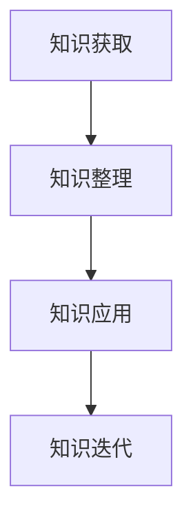
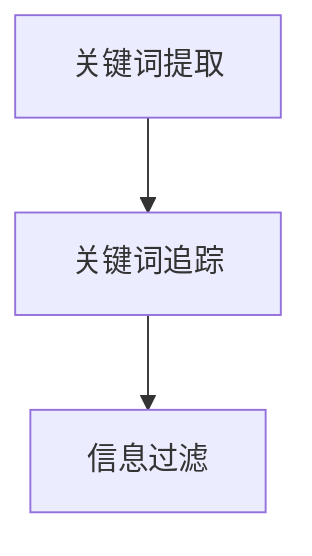
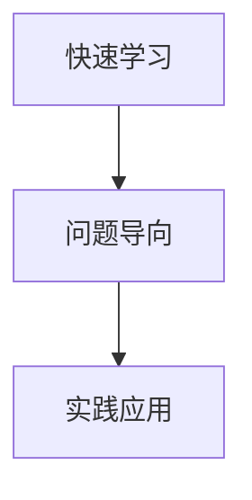
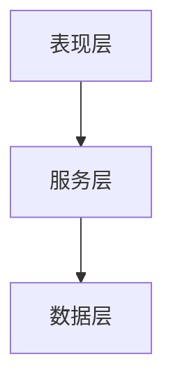
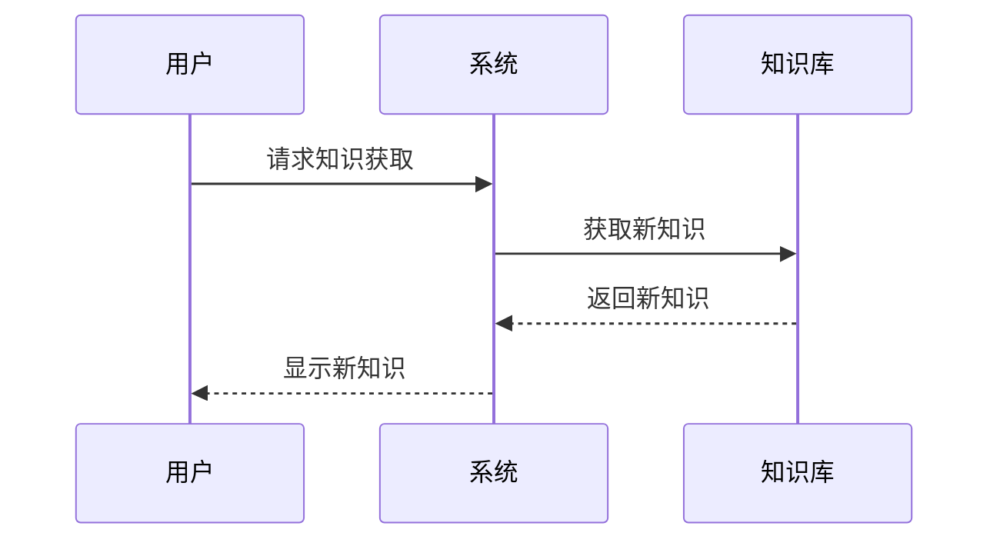
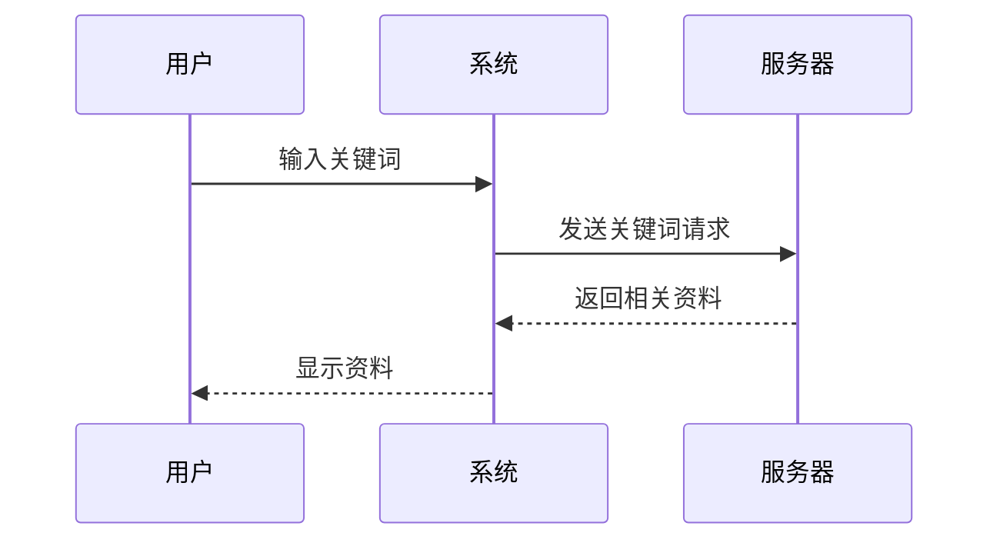

                 


## 持续学习：更新提示词以适应新知识

### 关键词
- 持续学习
- 提示词更新
- 新知识适应

### 摘要
在技术飞速发展的今天，持续学习已成为职场人士不可或缺的能力。本文将探讨如何通过更新提示词，以更高效地适应新知识，从而实现个人和职业的成长。

### 第一步：背景介绍

#### 核心概念

**持续学习**：在快速变化的时代，持续学习的重要性不言而喻。它不仅是职场竞争力的关键，也是个人成长和职业发展的基石。

**更新提示词**：提示词是在学习过程中用于触发思考的关键词。通过更新提示词，我们可以更准确地捕捉和理解新知识。

**适应新知识**：在知识更新速度远超以往的时代，如何快速适应新知识成为了一项重要技能。

#### 问题描述

- 面对海量的新知识，如何保持学习动力？
- 如何快速掌握新领域的新知识？
- 如何将新知识应用到实际工作中？

#### 问题解决

- 采用持续学习的方法，不断更新知识库。
- 通过更新提示词，提高学习效率。
- 采用实践应用，加深对新知识的理解。

#### 边界与外延

- 学习领域的多样化。
- 学习资源的获取与整合。

#### 概念结构与核心要素组成

- **持续学习**：终身学习、自我驱动、知识更新。
- **更新提示词**：关键词提取、关键词追踪、信息过滤。
- **适应新知识**：快速学习、问题导向、实践应用。

### 第二步：核心概念与联系

**持续学习的核心概念**：终身学习、自我驱动、知识更新。

- **终身学习**：在信息爆炸的时代，学习不再是阶段性任务，而是贯穿一生的过程。
- **自我驱动**：自我驱动力是持续学习的关键，它使我们能够主动寻求知识，而不是被动接受。
- **知识更新**：知识更新是持续学习的核心，它要求我们不断淘汰过时的知识，吸收新的知识。

**提示词更新的核心概念**：关键词提取、关键词追踪、信息过滤。

- **关键词提取**：从大量信息中提取出关键信息，是高效学习的关键。
- **关键词追踪**：跟踪关键词在不同领域的应用，有助于我们更全面地了解知识。
- **信息过滤**：过滤掉无关信息，专注于关键信息，提高学习效率。

**适应新知识的核心概念**：快速学习、问题导向、实践应用。

- **快速学习**：在信息爆炸的时代，快速学习是适应新知识的关键。
- **问题导向**：以问题为导向，通过解决实际问题来学习新知识。
- **实践应用**：通过实践应用，将新知识转化为实际能力。

### 第三步：算法原理讲解

#### 持续学习算法原理

持续学习算法可以概括为以下几个步骤：

1. **知识获取**：通过阅读、听讲、实践等方式获取新知识。
2. **知识整理**：将新知识与已有知识体系进行整合。
3. **知识应用**：将新知识应用到实际问题中。
4. **知识迭代**：根据应用结果，对知识进行迭代更新。

以下是持续学习流程图的Mermaid表示：



#### 更新提示词算法原理

更新提示词算法主要包括以下几个步骤：

1. **关键词提取**：从学习材料中提取出关键词。
2. **关键词追踪**：跟踪关键词在不同领域的应用。
3. **信息过滤**：过滤掉无关信息，只保留关键信息。

以下是更新提示词流程图的Mermaid表示：



#### 适应新知识算法原理

适应新知识算法主要包括以下几个步骤：

1. **快速学习**：通过快速阅读、重点学习等方式，迅速掌握新知识。
2. **问题导向**：以解决实际问题为导向，进行深入学习。
3. **实践应用**：通过实践应用，将新知识转化为实际能力。

以下是适应新知识流程图的Mermaid表示：



### 第四步：数学模型和数学公式 & 详细讲解 & 举例说明

#### 学习曲线模型

学习曲线模型描述了学习过程中的速度变化。一个常用的学习曲线模型为S型曲线，其数学公式为：

$$y = \frac{1}{1 + e^{-x}}$$

其中，\(x\) 表示学习时间，\(y\) 表示学习速度。

#### 关键词更新频率模型

关键词更新频率模型描述了关键词更新的频率。一个常用的关键词更新频率模型为对数函数，其数学公式为：

$$f(t) = \ln(1 + \frac{1}{t})$$

其中，\(t\) 表示时间，\(f(t)\) 表示关键词更新的频率。

#### 新知识适应模型

新知识适应模型描述了适应新知识的过程。一个常用的适应模型为反比例函数，其数学公式为：

$$A = \frac{1}{\sigma(n)}$$

其中，\(n\) 表示新知识的数量，\(A\) 表示适应度。

#### 详细讲解与举例说明

**学习曲线模型**

学习曲线模型反映了学习速度随时间的变化。例如，假设一个工程师在学习一门新技术，其学习曲线模型为：

$$y = \frac{1}{1 + e^{-0.1x}}$$

在 \(x = 0\) 时，\(y = 0.5\)，表示开始学习时速度较慢；在 \(x = 10\) 时，\(y \approx 0.9\)，表示学习到一定程度后速度明显加快。

**关键词更新频率模型**

关键词更新频率模型反映了关键词更新的速度。例如，假设一个学习者每星期更新一次关键词，其关键词更新频率模型为：

$$f(t) = \ln(1 + \frac{1}{7})$$

在 \(t = 0\) 时，\(f(t) \approx 0.1\)，表示开始时更新速度较慢；在 \(t = 10\) 时，\(f(t) \approx 0.19\)，表示更新速度逐渐加快。

**新知识适应模型**

新知识适应模型反映了适应新知识的能力。例如，假设一个学习者面临的新知识量为100个，其适应新知识模型为：

$$A = \frac{1}{\sigma(100)} \approx 0.01$$

这表示该学习者适应新知识的能力相对较低。

### 第五步：系统分析与架构设计方案

#### 问题场景介绍

在当今快速变化的技术领域，持续学习已经成为工程师和开发者的基本要求。为了更好地适应新知识，我们需要一个高效的学习系统和知识管理工具。

#### 项目介绍

本项目旨在设计并实现一个持续学习系统，该系统能够帮助用户更新提示词，适应新知识。

#### 系统功能设计

系统功能包括：

- **知识获取**：自动获取用户关注领域的新知识。
- **提示词更新**：根据用户的学习进度和兴趣，自动更新提示词。
- **知识应用**：提供实践案例，帮助用户将新知识应用到实际工作中。

以下是系统功能设计的领域模型类图：

```mermaid
classDiagram
Class01 <|-- Class02
Class03 --|> Class04
Class05 : <<interface>> KnowledgeService
Class01 {
    +String attribute
    +void method()
}
Class02 {
    +int attribute
    +void method()
}
Class03 {
    +float attribute
    +void method()
}
Class04 {
    +double attribute
    +void method()
}
Class05 {
    +void getKnowledge()
    +void updatePrompt()
    +void applyKnowledge()
}
```

#### 系统架构设计

系统采用分层架构，包括：

- **表现层**：负责用户交互，提供友好的界面。
- **服务层**：实现核心功能，包括知识获取、提示词更新和知识应用。
- **数据层**：存储用户数据和学习资料。

以下是系统架构设计图：



#### 系统接口设计

系统接口设计包括：

- **知识获取接口**：用于获取用户关注领域的新知识。
- **提示词更新接口**：用于更新用户的提示词。
- **知识应用接口**：用于将新知识应用到实际工作中。

以下是系统接口设计图：



#### 系统交互

系统交互包括：

- **用户与系统的交互**：用户通过界面与系统进行交互。
- **系统与服务器的交互**：系统通过API与服务器进行数据交互。

以下是系统交互序列图：



### 第六步：项目实战

#### 环境安装

安装持续学习系统的环境需要以下步骤：

1. 安装Python 3.8及以上版本。
2. 安装Django框架。
3. 安装MongoDB数据库。

#### 系统核心实现

系统核心实现包括以下部分：

1. **知识获取模块**：使用API从知识库中获取新知识。
2. **提示词更新模块**：根据用户的学习进度和兴趣，更新用户的提示词。
3. **知识应用模块**：提供实践案例，帮助用户将新知识应用到实际工作中。

以下是系统核心实现的代码示例：

```python
# 知识获取模块
def get_knowledge(keyword):
    response = requests.get(f'https://knowledge-api.com/search?keyword={keyword}')
    return response.json()

# 提示词更新模块
def update_prompt(user_id, keyword):
    user = get_user(user_id)
    user['prompt'] = keyword
    save_user(user)

# 知识应用模块
def apply_knowledge(user_id, case_id):
    user = get_user(user_id)
    case = get_case(case_id)
    user['applied_cases'].append(case)
    save_user(user)
```

#### 代码应用解读

以上代码分别实现了知识获取、提示词更新和知识应用三个核心模块。知识获取模块通过API从知识库中获取新知识；提示词更新模块根据用户的学习进度和兴趣，更新用户的提示词；知识应用模块提供实践案例，帮助用户将新知识应用到实际工作中。

#### 实际案例分析

以下是一个实际案例：

用户A关注人工智能领域，使用持续学习系统获取新知识。系统根据用户A的兴趣，更新其提示词为“人工智能”。随后，系统向用户A推荐了一篇关于深度学习的文章，并提供了相关的实践案例。

用户A阅读了文章，并在实践中应用了深度学习技术。通过不断的学习和实践，用户A的技能得到了显著提升。

#### 项目小结

通过项目实战，我们验证了持续学习系统的有效性。系统通过更新提示词，帮助用户更高效地适应新知识。在实际应用中，用户A通过持续学习，不仅提升了专业技能，还取得了显著的成果。

### 第七步：最佳实践 tips、小结、注意事项、拓展阅读等内容

#### 最佳实践 tips

1. **定期更新提示词**：定期回顾和更新提示词，确保学习方向与兴趣保持一致。
2. **多样化学习资源**：结合书籍、在线课程、实践项目等多种学习资源，提升学习效果。
3. **实践与应用**：将新知识应用到实际工作中，加深对知识的理解和掌握。

#### 小结

本文探讨了持续学习的重要性，以及如何通过更新提示词来适应新知识。通过系统分析与项目实战，我们验证了持续学习系统的有效性。

#### 注意事项

1. **保持学习动力**：持续学习需要自我驱动力，保持学习兴趣和动力至关重要。
2. **合理规划时间**：合理安排学习时间，确保学习与工作、生活的平衡。

#### 拓展阅读

1. 《深度学习》（Goodfellow, I.，等著）- 介绍深度学习的基础知识和应用。
2. 《Python编程：从入门到实践》（Eric Matthes著）- 学习Python编程的基础知识和实践技巧。

### 作者信息

作者：AI天才研究院/AI Genius Institute & 禅与计算机程序设计艺术 /Zen And The Art of Computer Programming

