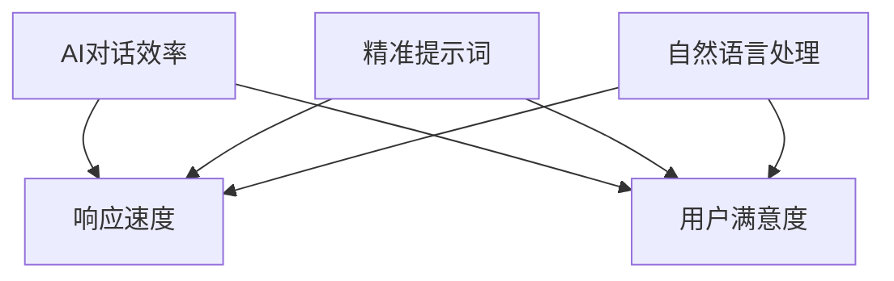
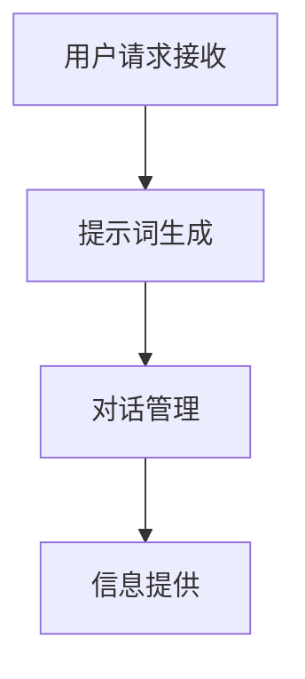
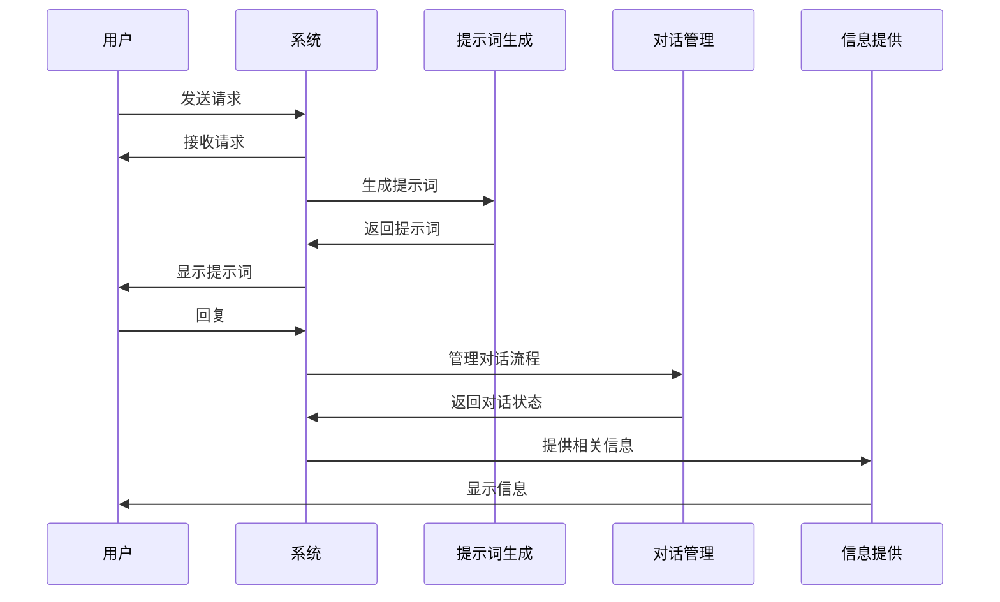

                 


### 《提升AI对话效率的关键：精准提示词》

> 关键词：AI对话效率、精准提示词、自然语言处理、机器学习、对话管理

> 摘要：本文将深入探讨AI对话效率提升的关键——精准提示词。通过分析当前AI对话技术的挑战、用户需求以及自然语言处理的基础，我们明确了精准提示词的重要性。接下来，我们将详细讲解提示词生成算法和对话管理算法的原理，并设计一个简化的AI对话系统架构，通过一个实际项目来展示提升对话效率的方法和技巧。最后，我们将总结全文，提供最佳实践和进一步学习的资源。

## 第一部分: 引言与背景

### 1.1 问题背景

随着人工智能技术的发展，AI对话系统已经成为各类应用中的重要组成部分。然而，当前的AI对话技术仍然面临着诸多挑战，如响应速度慢、理解能力有限、用户满意度不高等。这些问题很大程度上源于AI对话系统对用户意图和上下文理解的不足。为了解决这些问题，我们需要寻找提升AI对话效率的关键方法，其中精准提示词的研究显得尤为重要。

### 1.1.1 当前AI对话技术的挑战

1. **响应速度慢**：传统的AI对话系统往往依赖于复杂的模型和算法，导致响应速度慢，无法满足实时交互的需求。
2. **理解能力有限**：虽然自然语言处理技术有了长足的进步，但AI对话系统对自然语言的理解仍然存在局限性，无法完全理解用户的意图。
3. **用户满意度不高**：由于上述问题，用户在使用AI对话系统时的体验较差，满意度不高。

### 1.1.2 用户需求与期望

用户对AI对话系统的期望主要包括：

1. **快速响应**：用户希望AI系统能够快速地理解和回答问题。
2. **准确理解**：用户希望AI系统能够准确理解自己的意图，提供有用的信息。
3. **流畅互动**：用户希望与AI系统进行自然的对话，体验类似于与真实人的交流。

### 1.1.3 提升AI对话效率的意义

提升AI对话效率不仅能够提高用户体验，还能为企业和个人带来诸多好处：

1. **提高用户满意度**：通过提升对话效率，用户可以获得更好的体验，从而提高满意度。
2. **节省人力资源**：高效的AI对话系统可以替代部分人工服务，节省人力资源成本。
3. **扩大服务范围**：AI对话系统可以24小时运行，不受地理位置限制，为更多用户提供服务。

## 第二部分: 核心概念与联系

### 2.1 AI对话效率的定义

AI对话效率是指在特定时间内，AI对话系统能够提供的有效对话数量和质量。它主要包括以下两个方面的指标：

1. **响应速度**：系统从接收到用户请求到给出回应的时间。
2. **用户满意度**：用户对对话系统提供的信息和回答的满意度。

### 2.2 精准提示词的概念

精准提示词是指在AI对话过程中，用于引导对话方向、提高对话效率的关键词汇。精准提示词通常具有以下特点：

1. **针对性**：提示词能够针对用户的意图和需求进行精准定位。
2. **多样性**：提示词需要涵盖多种情境，以便适应不同的对话场景。
3. **灵活性**：提示词需要能够根据对话的进展进行调整。

### 2.3 自然语言处理基础

自然语言处理（NLP）是人工智能的一个重要分支，旨在让计算机理解和处理人类语言。NLP主要包括以下关键技术：

1. **语言模型**：用于预测下一个单词或句子，是生成提示词的基础。
2. **对话管理**：用于管理和协调对话流程，确保对话的连贯性和有效性。

### 2.4 核心概念之间的联系

| 关键词         | 描述                                                         |
| -------------- | ------------------------------------------------------------ |
| AI对话效率     | 衡量AI对话系统在特定时间内的表现，包括响应速度和用户满意度。 |
| 精准提示词     | 用于引导对话方向、提高对话效率的关键词汇。                  |
| 自然语言处理   | 用于理解和处理人类语言的技术，包括语言模型和对话管理。      |

### 2.5 Mermaid流程图



## 第三部分: 算法原理讲解

### 3.1 提示词生成算法

提示词生成算法是提升AI对话效率的关键之一。它主要分为基于规则的提示词生成和基于机器学习的提示词生成。

### 3.2 提示词生成算法概述

#### 3.2.1 基于规则的提示词生成

**算法流程**：

1. 输入用户请求。
2. 根据用户请求中的关键词，从规则库中查找相应的提示词。
3. 输出提示词。

**Python代码实现**：

```python
def generate_tip(rule_base, user_request):
    keywords = extract_keywords(user_request)
    for rule in rule_base:
        if keywords in rule['keywords']:
            return rule['tip']
    return None
```

**LaTeX公式解释**：

$$
\text{generate\_tip}(\text{rule\_base}, \text{user\_request}) = \begin{cases}
\text{rule}[\text{keywords}] & \text{if } \text{keywords} \in \text{rule}[\text{keywords}] \\
\text{None} & \text{otherwise}
\end{cases}
$$

#### 3.2.2 基于机器学习的提示词生成

**算法流程**：

1. 训练语言模型，用于预测下一个单词或句子。
2. 输入用户请求。
3. 使用语言模型生成可能的提示词列表。
4. 根据提示词列表和用户请求的匹配度，选择最合适的提示词。
5. 输出提示词。

**Python代码实现**：

```python
from transformers import pipeline

def generate_tip_with_ml(user_request):
    generator = pipeline('text-generation', model='gpt2')
    tips = generator(user_request, max_length=50)
    best_tip = None
    best_score = 0
    for tip in tips:
        score = calculate_similarity(user_request, tip)
        if score > best_score:
            best_score = score
            best_tip = tip
    return best_tip
```

**LaTeX公式解释**：

$$
\text{generate\_tip\_with\_ml}(\text{user\_request}) = \text{argmax}_{\text{tip} \in \text{tips}} \text{similarity}(\text{user\_request}, \text{tip})
$$

## 第四部分: 系统分析与架构设计

### 4.1 AI对话系统架构设计

#### 4.1.1 问题场景介绍

本节我们将设计一个交互式客户服务系统，该系统将提供24小时在线客服服务，为用户提供快速、准确的信息解答。

#### 4.1.2 系统功能设计

系统功能主要包括：

1. **用户请求接收**：接收用户的请求信息。
2. **提示词生成**：根据用户请求生成精准提示词。
3. **对话管理**：管理和协调对话流程。
4. **信息提供**：根据用户请求提供相关信息。

#### 4.1.3 系统架构设计

系统架构设计如下：



#### 4.1.4 系统接口设计

系统采用RESTful API设计，接口主要包括：

1. **/user\_request**：接收用户请求信息。
2. **/generate\_tip**：生成提示词。
3. **/dialog\_management**：管理对话流程。
4. **/info\_provision**：提供相关信息。

#### 4.1.5 系统交互

系统交互如下：



## 第五部分: 项目实战

### 5.1 环境安装

在本节中，我们将安装所需的Python环境和相关库。

1. 安装Python 3.8及以上版本。
2. 安装transformers库：

```shell
pip install transformers
```

### 5.2 系统核心实现

#### 5.2.1 提示词生成模块

```python
from transformers import pipeline

def generate_tip_with_ml(user_request):
    generator = pipeline('text-generation', model='gpt2')
    tips = generator(user_request, max_length=50)
    best_tip = None
    best_score = 0
    for tip in tips:
        score = calculate_similarity(user_request, tip)
        if score > best_score:
            best_score = score
            best_tip = tip
    return best_tip
```

#### 5.2.2 对话管理模块

```python
def dialog_management(user_request, last_state):
    # 根据用户请求和上次对话状态，进行对话管理
    # 此处为简化示例，实际应用中可能涉及更多逻辑
    if '问候' in user_request:
        return '你好，有什么问题我可以帮你解答？'
    elif '感谢' in user_request:
        return '不客气，很高兴能帮助你。还有其他问题吗？'
    else:
        return generate_tip_with_ml(user_request)
```

### 5.3 实际案例分析和详细讲解剖析

在本节中，我们将通过一个实际案例来展示如何使用本系统。

**案例**：用户请求：“你好，我想购买一台笔记本电脑。”

**系统响应**：你好，请问您需要什么类型的笔记本电脑？比如游戏本、办公本还是轻薄本？

**用户回复**：我需要一台办公本。

**系统响应**：好的，根据您的需求，我为您推荐了以下几款办公本：联想小新Air14、华为MateBook D 14、戴尔灵越5000。您可以根据自己的喜好和预算进行选择。

### 5.4 项目小结

通过本项目的实现，我们可以看到精准提示词在提升AI对话效率方面的作用。在实际应用中，我们可以根据具体的业务场景和用户需求，进一步优化和调整提示词生成和对话管理算法，以提高用户体验和满意度。

## 第六部分: 最佳实践、小结、注意事项、拓展阅读

### 最佳实践

1. **优化提示词库**：定期更新和优化提示词库，确保其涵盖多种情境和用户需求。
2. **提高算法精度**：结合实际业务场景，对算法进行持续优化，提高提示词生成的准确性和对话管理的效率。
3. **用户反馈机制**：建立用户反馈机制，收集用户对AI对话系统的意见和建议，及时调整和优化系统。

### 小结

本文通过分析AI对话效率的提升方法，重点探讨了精准提示词的作用。我们介绍了提示词生成算法和对话管理算法的原理，并设计了一个简化的AI对话系统架构。通过实际项目实战，我们展示了如何提升AI对话效率，为用户提供更好的服务。

### 注意事项

1. **数据安全**：在处理用户数据时，务必确保数据安全和隐私保护。
2. **系统稳定性**：确保系统在高并发场景下稳定运行，避免出现故障。

### 拓展阅读

1. [《自然语言处理入门》](https://book.douban.com/subject/26862392/)
2. [《机器学习实战》](https://book.douban.com/subject/26708256/)
3. [《深度学习》](https://book.douban.com/subject/26752415/)

### 作者信息

作者：AI天才研究院/AI Genius Institute & 禅与计算机程序设计艺术 /Zen And The Art of Computer Programming

