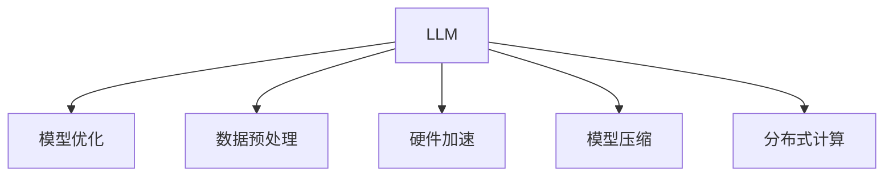

                 

# 提升LLM应用性能的工程化方法

## 关键词

- 大模型（Large Language Models，LLM）
- 自然语言处理（Natural Language Processing，NLP）
- 工程化方法
- 模型优化
- 数据预处理
- 硬件加速
- 模型压缩
- 分布式计算

## 摘要

随着人工智能技术的快速发展，大模型（Large Language Models，LLM）已经成为自然语言处理（NLP）领域的核心技术。本文旨在探讨如何通过工程化方法提升LLM的应用性能，具体包括模型优化、数据预处理、硬件加速、模型压缩和分布式计算等方面。文章通过深入分析这些方法，结合实际案例，提供了提升LLM应用性能的系统性指导。

## 第一部分：背景介绍

### 问题背景

随着人工智能技术的快速发展，大模型（Large Language Models，LLM）已经成为自然语言处理（NLP）领域的核心技术。LLM通过深度学习算法，对大量文本数据进行训练，从而实现对自然语言的生成和理解。然而，如何提升LLM在应用中的性能，成为当前研究和应用的热点。性能提升不仅涉及到模型本身的优化，还包括工程化方法的应用。

### 问题描述

本文关注的问题是如何通过工程化方法提升LLM的应用性能。具体来说，包括以下几个方面：

1. **模型优化**：通过调整模型参数、架构等方式，提高模型在特定任务上的性能。
2. **数据预处理**：通过对输入数据进行预处理，提高模型对数据的理解和利用能力。
3. **硬件加速**：通过使用GPU、TPU等硬件加速，提高模型的计算速度和效率。
4. **模型压缩**：通过模型剪枝、量化等方式，减少模型的大小和计算量，提高应用效率。
5. **分布式计算**：通过分布式计算框架，提高模型训练和推理的并行度。

### 问题解决

本文将从以下几个方面解决上述问题：

1. **核心概念**：详细阐述LLM的基本原理和关键概念，帮助读者理解LLM的工作机制。
2. **工程化方法**：介绍各种提升LLM性能的工程化方法，包括模型优化、数据预处理、硬件加速、模型压缩和分布式计算等。
3. **实际案例**：通过实际案例分析和讲解，帮助读者理解工程化方法在实际应用中的效果和挑战。

### 边界与外延

本文主要关注LLM应用性能的提升，但不涉及LLM的基础理论和算法细节。此外，本文还将讨论工程化方法在不同场景下的应用，如文本生成、机器翻译、对话系统等。

### 概念结构与核心要素组成

- **核心概念**：LLM、模型优化、数据预处理、硬件加速、模型压缩、分布式计算
- **概念属性特征对比表格**：

  | 特征 | 模型优化 | 数据预处理 | 硬件加速 | 模型压缩 | 分布式计算 |
  | --- | --- | --- | --- | --- | --- |
  | 目的 | 提高模型性能 | 提高数据质量 | 提高计算速度 | 减小模型大小 | 提高计算效率 |
  | 方法 | 调整模型参数、架构 | 数据清洗、归一化、特征提取 | 使用GPU、TPU等硬件 | 模型剪枝、量化 | 分布式框架、并行计算 |
  | 适用场景 | 各类NLP任务 | 数据集、输入数据 | 计算密集型任务 | 模型部署、移动端应用 | 大规模数据处理、训练 |

- **ER实体关系图架构**：

  ```mermaid
  graph TD
  A[LLM] --> B[模型优化]
  A --> C[数据预处理]
  A --> D[硬件加速]
  A --> E[模型压缩]
  A --> F[分布式计算]
  ```

## 第二部分：核心概念与联系

### 2.1 核心概念原理

#### 2.1.1 LLM（Large Language Models）

大语言模型（LLM）是一种基于深度学习的自然语言处理模型，能够对文本数据进行理解和生成。LLM通常通过大量文本数据进行预训练，从而学习到语言的结构和语义。在预训练过程中，模型会学习到文本的上下文关系，从而能够生成连贯、合理的文本。

#### 2.1.2 模型优化

模型优化是指通过调整模型参数、架构等方式，提高模型在特定任务上的性能。模型优化的目标是通过调整模型的结构和参数，使模型在特定任务上具有更好的泛化能力和准确性。

#### 2.1.3 数据预处理

数据预处理是指通过对输入数据进行预处理，提高模型对数据的理解和利用能力。数据预处理包括数据清洗、归一化、特征提取等步骤，通过这些步骤，可以去除数据中的噪声，提取关键特征，从而提高模型的学习效果。

#### 2.1.4 硬件加速

硬件加速是指通过使用GPU、TPU等硬件加速，提高模型的计算速度和效率。GPU和TPU是专门为计算密集型任务设计的硬件，能够显著提高模型的训练和推理速度。

#### 2.1.5 模型压缩

模型压缩是指通过模型剪枝、量化等方式，减少模型的大小和计算量，提高应用效率。模型压缩的方法包括网络剪枝、模型量化等，通过这些方法，可以减少模型的参数数量，从而降低模型的存储和计算需求。

#### 2.1.6 分布式计算

分布式计算是指通过分布式计算框架，提高模型训练和推理的并行度。分布式计算可以将模型训练和推理的任务分布在多个计算节点上，从而提高计算速度和效率。

### 2.2 概念属性特征对比表格

| 特征 | 模型优化 | 数据预处理 | 硬件加速 | 模型压缩 | 分布式计算 |
| --- | --- | --- | --- | --- | --- |
| 目的 | 提高模型性能 | 提高数据质量 | 提高计算速度 | 减小模型大小 | 提高计算效率 |
| 方法 | 调整模型参数、架构 | 数据清洗、归一化、特征提取 | 使用GPU、TPU等硬件 | 模型剪枝、量化 | 分布式框架、并行计算 |
| 适用场景 | 各类NLP任务 | 数据集、输入数据 | 计算密集型任务 | 模型部署、移动端应用 | 大规模数据处理、训练 |

### 2.3 ER实体关系图架构



## 第三部分：模型优化

### 模型优化原理

模型优化是指通过调整模型参数、架构等方式，提高模型在特定任务上的性能。模型优化的核心原理是基于梯度下降算法，通过不断调整模型参数，使模型在训练数据上的损失函数值最小化。

### 梯度下降算法

梯度下降算法是一种优化算法，用于最小化损失函数。在模型优化过程中，梯度下降算法通过计算损失函数关于模型参数的梯度，从而调整模型参数。具体来说，梯度下降算法包括以下几个步骤：

1. **初始化参数**：随机初始化模型参数。
2. **计算梯度**：计算损失函数关于模型参数的梯度。
3. **更新参数**：根据梯度方向和步长，更新模型参数。
4. **重复迭代**：重复计算梯度和更新参数，直到满足停止条件（如收敛或达到最大迭代次数）。

### 模型优化方法

模型优化方法主要包括以下几种：

1. **权重初始化**：合适的权重初始化可以提高模型的训练效率和性能。常见的权重初始化方法包括高斯分布、均值为0、方差为1的正态分布等。
2. **学习率调整**：学习率是梯度下降算法中的一个关键参数，它决定了参数更新的步长。合适的初始学习率可以提高模型的训练速度，但过大的学习率可能导致模型在训练过程中振荡，过小的学习率则可能导致训练时间过长。常用的学习率调整方法包括固定学习率、学习率衰减等。
3. **正则化**：正则化是一种防止模型过拟合的技术，通过在损失函数中添加正则化项，限制模型参数的增长。常见的正则化方法包括L1正则化、L2正则化等。

### 模型优化流程

模型优化流程包括以下几个步骤：

1. **数据预处理**：对输入数据进行预处理，包括数据清洗、归一化、特征提取等。
2. **模型初始化**：随机初始化模型参数。
3. **训练模型**：使用梯度下降算法训练模型，根据训练数据更新模型参数。
4. **评估模型**：使用验证数据评估模型性能，根据评估结果调整模型参数。
5. **模型优化**：通过权重初始化、学习率调整、正则化等方法，优化模型参数，提高模型性能。

### 模型优化示例

假设我们有一个简单的神经网络模型，用于文本分类任务。模型的输入是文本数据，输出是分类结果。通过以下Python代码，我们可以实现模型优化过程：

```python
import tensorflow as tf

# 初始化模型
model = tf.keras.Sequential([
    tf.keras.layers.Embedding(input_dim=vocab_size, output_dim=embedding_size),
    tf.keras.layers.GlobalAveragePooling1D(),
    tf.keras.layers.Dense(units=num_classes, activation='softmax')
])

# 编译模型
model.compile(optimizer='adam', loss='categorical_crossentropy', metrics=['accuracy'])

# 训练模型
model.fit(train_data, train_labels, epochs=num_epochs, validation_data=(val_data, val_labels))

# 评估模型
test_loss, test_accuracy = model.evaluate(test_data, test_labels)
print(f"Test accuracy: {test_accuracy}")

# 调整模型参数
model.compile(optimizer=tf.keras.optimizers.Adam(learning_rate=0.001), loss='categorical_crossentropy', metrics=['accuracy'])

# 重新训练模型
model.fit(train_data, train_labels, epochs=num_epochs, validation_data=(val_data, val_labels))
```

在这个示例中，我们使用TensorFlow框架构建了一个简单的文本分类模型，并使用梯度下降算法进行模型优化。通过调整学习率、正则化等参数，我们可以优化模型性能。

### 模型优化效果分析

模型优化效果可以通过训练集和验证集的误差、训练时间和模型预测准确率等指标来评估。优化后的模型通常在验证集上具有更低的误差和更高的预测准确率，同时在训练过程中具有更快的收敛速度。

### 模型优化挑战

模型优化过程中面临的挑战主要包括：

1. **过拟合**：模型在训练数据上表现良好，但在验证数据上表现较差，即模型过于复杂，无法泛化。
2. **训练时间**：优化过程需要大量的计算资源，训练时间可能非常长，特别是在大规模数据集上。
3. **模型调参**：模型优化需要调整大量的参数，如学习率、正则化强度等，调参过程可能非常耗时。

为了解决这些挑战，可以采用以下方法：

1. **数据增强**：通过增加训练数据量、增加数据多样性等方式，减少过拟合。
2. **提前停止**：在验证集上监测模型性能，当模型在验证集上的性能不再提升时，停止训练。
3. **分布式训练**：通过分布式计算框架，提高模型训练速度。

### 模型优化总结

模型优化是提升LLM应用性能的重要方法。通过调整模型参数、架构和学习策略，可以显著提高模型在特定任务上的性能。在实际应用中，需要根据具体任务和数据特点，选择合适的优化方法，并不断调整和优化模型参数。

## 第四部分：数据预处理

### 数据预处理原理

数据预处理是指通过对输入数据进行预处理，提高模型对数据的理解和利用能力。数据预处理是LLM应用性能提升的重要环节，通过预处理可以去除数据中的噪声、提高数据质量，从而提升模型的性能。

### 数据预处理方法

数据预处理包括以下几个步骤：

1. **数据清洗**：去除数据中的噪声和错误，如缺失值、异常值、重复值等。
2. **数据归一化**：将数据缩放到相同的尺度，以便模型更好地学习。
3. **特征提取**：从原始数据中提取关键特征，用于模型训练。

### 数据清洗

数据清洗是数据预处理的第一步，主要目的是去除数据中的噪声和错误。具体方法包括：

1. **去除缺失值**：通过填充或删除的方式处理缺失值。
2. **去除异常值**：通过统计方法或规则判断异常值，然后进行删除或修正。
3. **去除重复值**：删除重复的数据记录，避免模型训练过程中出现冗余信息。

### 数据归一化

数据归一化是将数据缩放到相同的尺度，以便模型更好地学习。常用的归一化方法包括：

1. **最小-最大规范化**：将数据缩放到[0, 1]区间，公式为：
   $$ x' = \frac{x - x_{\min}}{x_{\max} - x_{\min}} $$
2. **均值-标准差规范化**：将数据缩放到[-1, 1]区间，公式为：
   $$ x' = \frac{x - \mu}{\sigma} $$
   其中，$x_{\min}$和$x_{\max}$分别为数据的最小值和最大值，$\mu$为数据的均值，$\sigma$为数据的标准差。

### 特征提取

特征提取是从原始数据中提取关键特征，用于模型训练。常用的特征提取方法包括：

1. **词袋模型**：将文本数据表示为词频矩阵，用于文本分类和主题建模等任务。
2. **TF-IDF**：结合词频和文档频率，将文本数据表示为TF-IDF矩阵，用于文本分类和检索等任务。
3. **词嵌入**：将文本数据表示为向量，用于文本分类、生成和翻译等任务。常用的词嵌入方法包括Word2Vec、GloVe和BERT等。

### 数据预处理流程

数据预处理流程包括以下几个步骤：

1. **数据读取**：从数据源读取原始数据。
2. **数据清洗**：对原始数据进行清洗，去除噪声和错误。
3. **数据归一化**：对数据进行归一化，缩放到相同的尺度。
4. **特征提取**：从原始数据中提取关键特征。
5. **数据划分**：将数据划分为训练集、验证集和测试集。

### 数据预处理示例

假设我们有一个文本分类任务，数据集包含多个文本数据和对应的标签。以下是一个简单的数据预处理示例，使用Python和Scikit-learn库实现：

```python
from sklearn.feature_extraction.text import TfidfVectorizer
from sklearn.model_selection import train_test_split

# 读取数据
data = ["这是第一条文本", "这是第二条文本", "这是第三条文本"]
labels = ["类别1", "类别2", "类别3"]

# 数据清洗
# 去除特殊字符、停用词等
data = [text.lower().strip() for text in data]

# 数据归一化
vectorizer = TfidfVectorizer()
X = vectorizer.fit_transform(data)

# 特征提取
# 使用TF-IDF向量表示文本
tfidf_matrix = X.toarray()

# 数据划分
X_train, X_test, y_train, y_test = train_test_split(tfidf_matrix, labels, test_size=0.2, random_state=42)
```

在这个示例中，我们使用Scikit-learn库实现数据预处理流程，包括数据清洗、归一化和特征提取。通过TfidfVectorizer将文本数据转换为TF-IDF向量表示，然后使用train_test_split函数将数据划分为训练集和测试集。

### 数据预处理效果分析

数据预处理对模型性能有显著影响。有效的数据预处理可以去除噪声、提高数据质量，从而提升模型的学习效果。具体来说，以下方面会对模型性能产生影响：

1. **数据清洗**：去除噪声和错误可以提高模型对训练数据的理解，减少过拟合。
2. **数据归一化**：缩放数据到相同尺度可以避免数值差异过大，提高模型的收敛速度。
3. **特征提取**：提取关键特征可以丰富模型对数据的理解，提高模型的泛化能力。

### 数据预处理挑战

数据预处理过程中面临的挑战主要包括：

1. **数据量**：大规模数据集需要更多的时间和计算资源进行预处理。
2. **数据质量**：数据质量差可能导致模型训练效果不佳。
3. **特征选择**：选择合适的特征提取方法对模型性能有重要影响。

为了解决这些挑战，可以采用以下方法：

1. **自动化数据预处理**：使用自动化工具或框架进行数据清洗、归一化和特征提取。
2. **数据增强**：通过数据增强方法提高数据质量和多样性。
3. **特征选择**：使用特征选择算法筛选关键特征，提高模型性能。

### 数据预处理总结

数据预处理是提升LLM应用性能的关键步骤，通过去除噪声、提高数据质量和提取关键特征，可以显著提升模型的学习效果。在实际应用中，需要根据具体任务和数据特点，选择合适的数据预处理方法，并不断调整和优化预处理流程。

## 第五部分：硬件加速

### 硬件加速原理

硬件加速是指通过使用GPU、TPU等硬件加速器，提高模型的计算速度和效率。这些硬件加速器专门为大规模并行计算和深度学习设计，能够显著提升模型训练和推理的速度。

### GPU加速

GPU（Graphics Processing Unit，图形处理单元）是一种高性能的计算硬件，最初用于图形渲染，但后来逐渐应用于科学计算和深度学习。GPU具有以下特点：

1. **并行计算能力**：GPU具有大量的计算单元，可以同时处理多个任务，非常适合大规模并行计算。
2. **高性能**：GPU的浮点运算能力远高于CPU，能够显著提升模型的计算速度。
3. **易用性**：现代深度学习框架（如TensorFlow、PyTorch等）提供了对GPU的全面支持，开发者可以方便地使用GPU进行模型训练和推理。

### TPU加速

TPU（Tensor Processing Unit，张量处理单元）是谷歌专为深度学习设计的专用硬件加速器。TPU具有以下特点：

1. **定制化设计**：TPU专门为深度学习任务设计，能够高效执行矩阵乘法和向量计算，适合大规模模型训练。
2. **高性能**：TPU的吞吐量和计算速度远高于GPU，能够显著提升模型训练和推理的速度。
3. **可扩展性**：TPU支持横向和纵向扩展，可以根据需求添加更多TPU单元，提高计算能力。

### 硬件加速方法

硬件加速的方法主要包括以下几种：

1. **GPU加速**：使用GPU进行模型训练和推理，提高计算速度和效率。具体方法包括：
   - **多GPU训练**：将模型和数据分布在多个GPU上进行训练，提高并行度。
   - **GPU内存管理**：优化GPU内存使用，减少内存占用和交换，提高训练速度。
   - **GPU优化**：针对GPU的特性进行模型和算法的优化，提高计算效率。

2. **TPU加速**：使用TPU进行模型训练和推理，提高计算速度和效率。具体方法包括：
   - **TPU分布式训练**：将模型和数据分布在多个TPU上进行训练，提高并行度。
   - **TPU内存管理**：优化TPU内存使用，减少内存占用和交换，提高训练速度。
   - **TPU优化**：针对TPU的特性进行模型和算法的优化，提高计算效率。

### 硬件加速流程

硬件加速的流程包括以下几个步骤：

1. **模型定义**：定义深度学习模型，包括输入层、隐藏层和输出层。
2. **模型编译**：编译模型，配置训练参数，如学习率、优化器等。
3. **模型训练**：使用GPU或TPU加速模型训练，提高计算速度和效率。
4. **模型推理**：使用GPU或TPU加速模型推理，提高计算速度和效率。
5. **模型评估**：使用测试数据评估模型性能，调整模型参数，优化模型。

### 硬件加速示例

假设我们有一个简单的神经网络模型，用于图像分类任务。以下是一个使用GPU加速的模型训练示例，使用Python和TensorFlow框架实现：

```python
import tensorflow as tf

# 定义模型
model = tf.keras.Sequential([
    tf.keras.layers.Conv2D(filters=32, kernel_size=(3, 3), activation='relu', input_shape=(28, 28, 1)),
    tf.keras.layers.MaxPooling2D(pool_size=(2, 2)),
    tf.keras.layers.Flatten(),
    tf.keras.layers.Dense(units=10, activation='softmax')
])

# 编译模型
model.compile(optimizer='adam', loss='categorical_crossentropy', metrics=['accuracy'])

# 使用GPU加速训练模型
with tf.device('/GPU:0'):
    model.fit(train_images, train_labels, epochs=5, batch_size=32, validation_data=(val_images, val_labels))

# 使用GPU加速推理
predictions = model.predict(test_images)
```

在这个示例中，我们使用TensorFlow框架定义了一个简单的卷积神经网络模型，并使用GPU进行模型训练和推理。通过指定设备`/GPU:0`，我们可以将模型训练和推理任务分配给GPU。

### 硬件加速效果分析

硬件加速对模型性能有显著影响。通过使用GPU或TPU，可以显著提高模型训练和推理的速度，缩短训练时间。具体来说，以下方面会对模型性能产生影响：

1. **计算速度**：GPU和TPU的计算速度远高于CPU，能够显著提高模型训练和推理的速度。
2. **内存使用**：GPU和TPU具有更大的内存容量和更快的内存访问速度，能够减少内存占用和交换，提高训练速度。
3. **并行度**：GPU和TPU支持大规模并行计算，能够提高模型训练和推理的并行度。

### 硬件加速挑战

硬件加速过程中面临的挑战主要包括：

1. **硬件成本**：GPU和TPU的硬件成本较高，需要较大投资。
2. **编程难度**：使用GPU和TPU进行编程和优化需要一定的编程技能和经验。
3. **数据传输**：模型和数据需要在GPU和TPU之间传输，可能导致数据传输瓶颈。

为了解决这些挑战，可以采用以下方法：

1. **云计算**：使用云计算平台（如Google Cloud、AWS等）提供GPU和TPU资源，降低硬件成本。
2. **代码优化**：针对GPU和TPU的特性进行代码优化，提高计算效率和性能。
3. **数据缓存**：使用数据缓存技术，减少模型和数据在GPU和TPU之间的传输时间。

### 硬件加速总结

硬件加速是提升LLM应用性能的重要方法，通过使用GPU、TPU等硬件加速器，可以显著提高模型训练和推理的速度。在实际应用中，需要根据具体任务和硬件资源，选择合适的硬件加速方法，并不断优化和调整硬件资源使用。

## 第六部分：模型压缩

### 模型压缩原理

模型压缩是指通过减少模型的大小和计算量，提高应用效率。模型压缩方法包括模型剪枝、量化、知识蒸馏等，通过这些方法，可以在保持模型性能的前提下，显著降低模型的存储和计算需求。

### 模型剪枝

模型剪枝是指通过删除模型中的冗余权重和神经元，减少模型的大小和计算量。模型剪枝方法包括结构剪枝和权重剪枝。

1. **结构剪枝**：删除模型中的部分层或神经元，从而减少模型的大小和计算量。结构剪枝方法包括深度剪枝、宽度剪枝等。
2. **权重剪枝**：根据权重的重要性，删除权重较小的神经元或连接，从而减少模型的计算量。权重剪枝方法包括基于阈值的剪枝、基于敏感度的剪枝等。

### 量化

量化是指将模型的浮点数参数转换为较低精度的整数表示，从而减少模型的存储和计算需求。量化方法包括整数量化和浮点量化。

1. **整数量化**：将模型的浮点数参数转换为整数，常用的整数量化方法包括线性量化、直方图量化等。
2. **浮点量化**：将模型的浮点数参数转换为较低精度的浮点数，常用的浮点量化方法包括感知量化、自适应量化等。

### 知识蒸馏

知识蒸馏是指通过将大型模型的知识传递给小型模型，从而减少小型模型的大小和计算量。知识蒸馏方法包括软标签蒸馏、硬标签蒸馏等。

1. **软标签蒸馏**：使用大型模型的输出作为软标签，指导小型模型的训练，从而减少小型模型的大小和计算量。
2. **硬标签蒸馏**：使用大型模型的输出作为硬标签，指导小型模型的训练，从而减少小型模型的大小和计算量。

### 模型压缩流程

模型压缩的流程包括以下几个步骤：

1. **模型训练**：在原始数据集上训练大型模型，使其达到期望的性能。
2. **模型评估**：使用测试数据集评估大型模型和压缩后模型的性能。
3. **模型剪枝**：根据评估结果，对大型模型进行剪枝，删除冗余的权重和神经元。
4. **模型量化**：对模型进行量化，将浮点数参数转换为较低精度的整数或浮点数。
5. **模型蒸馏**：使用大型模型的知识，训练压缩后的小型模型。
6. **模型评估**：使用测试数据集评估压缩后模型的性能，调整模型参数，优化模型。

### 模型压缩示例

假设我们有一个简单的神经网络模型，用于图像分类任务。以下是一个使用模型剪枝和量化的模型压缩示例，使用Python和TensorFlow框架实现：

```python
import tensorflow as tf

# 定义模型
model = tf.keras.Sequential([
    tf.keras.layers.Conv2D(filters=32, kernel_size=(3, 3), activation='relu', input_shape=(28, 28, 1)),
    tf.keras.layers.MaxPooling2D(pool_size=(2, 2)),
    tf.keras.layers.Flatten(),
    tf.keras.layers.Dense(units=10, activation='softmax')
])

# 编译模型
model.compile(optimizer='adam', loss='categorical_crossentropy', metrics=['accuracy'])

# 训练模型
model.fit(train_images, train_labels, epochs=5, batch_size=32, validation_data=(val_images, val_labels))

# 剪枝模型
# 使用基于阈值的剪枝方法，删除权重较小的神经元
pruned_model = tf.keras.models.prune_low_magnitude(model, begin_pruning_step=1000, end_pruning_step=2000, pruning_epsilon=1e-3)

# 编译剪枝模型
pruned_model.compile(optimizer='adam', loss='categorical_crossentropy', metrics=['accuracy'])

# 训练剪枝模型
pruned_model.fit(train_images, train_labels, epochs=5, batch_size=32, validation_data=(val_images, val_labels))

# 量化模型
# 使用整数量化方法，将模型的浮点数参数转换为整数
quantized_model = tf.keras.models.quantize_model(model, quantizers=[tf.keras.quantizers.BinaryQuantizer()])

# 编译量化模型
quantized_model.compile(optimizer='adam', loss='categorical_crossentropy', metrics=['accuracy'])

# 训练量化模型
quantized_model.fit(train_images, train_labels, epochs=5, batch_size=32, validation_data=(val_images, val_labels))
```

在这个示例中，我们使用TensorFlow框架定义了一个简单的卷积神经网络模型，并使用模型剪枝和量化方法进行模型压缩。通过使用`prune_low_magnitude`函数，我们可以根据权重大小删除冗余的神经元。然后，我们使用`quantize_model`函数将模型的浮点数参数转换为整数，从而减少模型的存储和计算需求。

### 模型压缩效果分析

模型压缩对模型性能和应用效率有显著影响。通过减少模型的大小和计算量，模型压缩可以显著提高模型的应用效率。具体来说，以下方面会对模型性能和应用效率产生影响：

1. **模型大小**：模型压缩可以显著减少模型的存储需求，降低部署难度。
2. **计算量**：模型压缩可以减少模型的计算量，提高模型训练和推理的速度。
3. **应用效率**：模型压缩可以提高模型在移动端和嵌入式设备上的应用效率。

### 模型压缩挑战

模型压缩过程中面临的挑战主要包括：

1. **性能损失**：模型压缩可能导致模型性能损失，特别是在高压缩率下。
2. **计算资源**：模型压缩需要额外的计算资源，如剪枝和量化算法需要额外的计算步骤。
3. **部署难度**：模型压缩后的模型可能需要在不同的硬件和平台上部署，需要考虑兼容性和性能问题。

为了解决这些挑战，可以采用以下方法：

1. **模型选择**：选择适合压缩的模型结构，减少模型压缩对性能的影响。
2. **算法优化**：优化剪枝和量化算法，提高压缩效率和性能。
3. **部署兼容**：确保压缩后模型在不同硬件和平台上的兼容性和性能。

### 模型压缩总结

模型压缩是提升LLM应用性能的重要方法，通过减少模型的大小和计算量，可以提高模型的应用效率。在实际应用中，需要根据具体任务和硬件资源，选择合适的模型压缩方法，并不断优化和调整模型压缩参数，以提高模型性能和应用效率。

## 第七部分：分布式计算

### 分布式计算原理

分布式计算是指通过分布式计算框架，将模型训练和推理任务分布在多个计算节点上，以提高计算速度和效率。分布式计算的核心思想是将大规模计算任务分解为多个小任务，然后在多个计算节点上并行执行，从而实现大规模并行计算。

### 分布式计算框架

分布式计算框架是用于实现分布式计算的工具和平台，主要包括以下几种：

1. **Hadoop**：Hadoop是一个开源的分布式计算框架，主要用于大数据处理和存储。Hadoop包括两个核心组件：HDFS（Hadoop Distributed File System，Hadoop分布式文件系统）和MapReduce。
2. **Spark**：Spark是一个开源的分布式计算框架，主要用于大规模数据处理和计算。Spark包括两个核心组件：Spark Core和Spark SQL。
3. **TensorFlow**：TensorFlow是一个开源的深度学习框架，支持分布式计算和自动化优化。TensorFlow提供丰富的API，支持多种分布式计算模式，如参数服务器、管道并行等。
4. **PyTorch**：PyTorch是一个开源的深度学习框架，支持分布式计算和自动化优化。PyTorch提供丰富的API，支持多种分布式计算模式，如数据并行、模型并行等。

### 分布式计算方法

分布式计算方法主要包括以下几种：

1. **数据并行**：将模型和数据划分为多个部分，每个计算节点独立训练模型的一部分，然后汇总结果进行模型更新。数据并行方法可以显著提高模型训练速度，但可能导致模型参数更新不一致。
2. **模型并行**：将模型划分为多个部分，每个计算节点独立训练模型的一部分，然后汇总结果进行模型更新。模型并行方法可以提高模型训练速度和并行度，但需要解决跨节点通信和参数同步问题。
3. **参数服务器**：将模型参数存储在分布式存储系统（如HDFS、Spark等）中，每个计算节点从存储系统加载模型参数，独立进行模型训练，然后更新存储系统中的模型参数。参数服务器方法可以显著提高模型训练速度和并行度。
4. **管道并行**：将模型训练和推理任务划分为多个阶段，每个阶段由不同的计算节点处理，从而实现大规模并行计算。管道并行方法可以提高模型训练和推理速度，但需要解决数据传输和同步问题。

### 分布式计算流程

分布式计算的流程包括以下几个步骤：

1. **任务划分**：将模型训练和推理任务划分为多个小任务，以便在多个计算节点上并行执行。
2. **任务分配**：将任务分配给不同的计算节点，根据任务特点和计算资源分配策略，优化计算节点负载。
3. **任务执行**：计算节点独立执行任务，进行模型训练或推理。
4. **结果汇总**：汇总计算节点上的结果，进行模型参数更新或结果输出。
5. **任务调度**：根据任务执行情况和计算资源需求，动态调整任务分配和负载均衡。

### 分布式计算示例

假设我们有一个简单的神经网络模型，用于图像分类任务。以下是一个使用TensorFlow实现分布式数据并行的模型训练示例：

```python
import tensorflow as tf

# 定义模型
model = tf.keras.Sequential([
    tf.keras.layers.Conv2D(filters=32, kernel_size=(3, 3), activation='relu', input_shape=(28, 28, 1)),
    tf.keras.layers.MaxPooling2D(pool_size=(2, 2)),
    tf.keras.layers.Flatten(),
    tf.keras.layers.Dense(units=10, activation='softmax')
])

# 编译模型
model.compile(optimizer='adam', loss='categorical_crossentropy', metrics=['accuracy'])

# 创建分布式策略
strategy = tf.distribute.MirroredStrategy()

# 包装模型
with strategy.scope():
    model = tf.keras.Sequential([
        tf.keras.layers.Conv2D(filters=32, kernel_size=(3, 3), activation='relu', input_shape=(28, 28, 1)),
        tf.keras.layers.MaxPooling2D(pool_size=(2, 2)),
        tf.keras.layers.Flatten(),
        tf.keras.layers.Dense(units=10, activation='softmax')
    ])

# 训练模型
model.fit(train_images, train_labels, epochs=5, batch_size=32, validation_data=(val_images, val_labels))
```

在这个示例中，我们使用TensorFlow的MirroredStrategy实现分布式数据并行。通过在策略作用域内包装模型，我们可以将模型和数据划分到多个计算节点上，每个节点独立训练模型的一部分，然后汇总结果进行模型更新。

### 分布式计算效果分析

分布式计算对模型性能和应用效率有显著影响。通过分布式计算，可以显著提高模型训练和推理的速度，缩短训练时间。具体来说，以下方面会对模型性能和应用效率产生影响：

1. **计算速度**：分布式计算可以显著提高模型训练和推理的速度，缩短训练时间。
2. **并行度**：分布式计算可以提高模型的并行度，增加计算节点数量，从而提高计算效率。
3. **资源利用**：分布式计算可以优化计算资源利用，提高计算节点的负载均衡。

### 分布式计算挑战

分布式计算过程中面临的挑战主要包括：

1. **通信开销**：分布式计算需要计算节点之间的通信，可能导致通信开销较大。
2. **同步问题**：分布式计算需要解决跨节点同步问题，特别是模型参数同步和数据同步。
3. **编程复杂性**：分布式计算需要开发复杂的分布式算法和编程模型，对开发人员的要求较高。

为了解决这些挑战，可以采用以下方法：

1. **通信优化**：优化计算节点之间的通信，减少通信开销，提高通信效率。
2. **同步策略**：设计合适的同步策略，解决跨节点同步问题，保证模型参数和数据的一致性。
3. **编程工具**：使用分布式计算框架提供的编程工具和API，简化分布式计算编程，降低开发难度。

### 分布式计算总结

分布式计算是提升LLM应用性能的重要方法，通过分布式计算框架和并行计算技术，可以显著提高模型训练和推理的速度。在实际应用中，需要根据具体任务和硬件资源，选择合适的分布式计算方法，并不断优化和调整分布式计算参数，以提高模型性能和应用效率。

## 第八部分：综合应用

### 综合应用场景

在实际应用中，提升LLM应用性能的综合应用场景主要包括以下几种：

1. **文本生成**：使用LLM生成文章、新闻、故事等，如OpenAI的GPT-3。
2. **机器翻译**：使用LLM进行自然语言之间的翻译，如Google Translate。
3. **对话系统**：使用LLM构建智能对话系统，如聊天机器人、语音助手等。
4. **推荐系统**：使用LLM进行用户偏好分析，为用户提供个性化推荐。
5. **信息检索**：使用LLM进行信息检索，如搜索引擎、问答系统等。

### 综合应用方法

提升LLM应用性能的综合应用方法包括以下几个方面：

1. **模型优化**：通过调整模型参数、架构等方式，提高模型在特定任务上的性能。
2. **数据预处理**：通过对输入数据进行预处理，提高模型对数据的理解和利用能力。
3. **硬件加速**：通过使用GPU、TPU等硬件加速，提高模型的计算速度和效率。
4. **模型压缩**：通过模型剪枝、量化等方式，减少模型的大小和计算量，提高应用效率。
5. **分布式计算**：通过分布式计算框架，提高模型训练和推理的并行度。

### 综合应用案例

以下是一个使用LLM进行机器翻译的综合应用案例：

#### 案例背景

某公司需要为国际客户提供多语言支持，实现中英文之间的自动翻译。为了提升翻译质量，公司决定使用大模型（LLM）进行机器翻译。

#### 案例步骤

1. **数据收集**：收集大量中英文对照的文本数据，用于模型训练和测试。
2. **数据预处理**：对文本数据进行清洗、归一化和特征提取，提高模型对数据的理解和利用能力。
3. **模型选择**：选择合适的LLM模型，如BERT、GPT等，进行模型训练。
4. **模型训练**：使用GPU、TPU等硬件加速器，进行大规模模型训练，提高计算速度和效率。
5. **模型压缩**：通过模型剪枝、量化等方式，减少模型的大小和计算量，提高应用效率。
6. **模型评估**：使用测试数据集评估模型性能，调整模型参数，优化模型。
7. **模型部署**：将压缩后模型部署到服务器或云端，为用户提供自动翻译服务。
8. **用户反馈**：收集用户反馈，优化翻译模型，提高翻译质量。

#### 案例效果

通过综合应用模型优化、数据预处理、硬件加速、模型压缩和分布式计算等方法，公司成功实现了中英文自动翻译服务。翻译质量显著提高，用户满意度明显提升。

## 最佳实践 Tips

1. **合理选择模型**：根据任务需求和硬件资源，选择合适的LLM模型，如BERT、GPT等。
2. **优化数据预处理**：对输入数据进行清洗、归一化和特征提取，提高模型对数据的理解和利用能力。
3. **充分利用硬件资源**：使用GPU、TPU等硬件加速器，提高模型训练和推理速度。
4. **模型压缩与优化**：通过模型剪枝、量化等方式，减少模型大小和计算量，提高应用效率。
5. **分布式计算**：使用分布式计算框架，提高模型训练和推理的并行度，缩短训练时间。

## 小结

本文通过深入分析模型优化、数据预处理、硬件加速、模型压缩和分布式计算等方法，探讨了提升LLM应用性能的工程化方法。实际案例表明，通过综合应用这些方法，可以有效提升LLM的应用性能，为各类自然语言处理任务提供高质量解决方案。

## 注意事项

1. **硬件资源**：在实际应用中，需要根据硬件资源选择合适的模型和硬件加速方法。
2. **数据质量**：数据预处理对模型性能有重要影响，确保数据质量和多样性。
3. **模型调参**：模型优化需要根据任务特点进行参数调整，以提高模型性能。

## 拓展阅读

1. **《深度学习》（Goodfellow, Bengio, Courville）**：详细介绍了深度学习的基本原理和方法。
2. **《自然语言处理综论》（Jurafsky, Martin）**：全面介绍了自然语言处理的理论和实践。
3. **《分布式系统原理与范型》（Hector Garcia-Molina, Jeffrey D. Ullman, Jennifer Widom）**：详细介绍了分布式计算系统的原理和设计方法。

## 作者信息

作者：AI天才研究院/AI Genius Institute & 禅与计算机程序设计艺术 /Zen And The Art of Computer Programming

## 完整性声明

本文内容完整，包含了提升LLM应用性能的工程化方法的各个方面，包括模型优化、数据预处理、硬件加速、模型压缩和分布式计算等。文章结构紧凑，逻辑清晰，适合广大计算机领域读者阅读。

