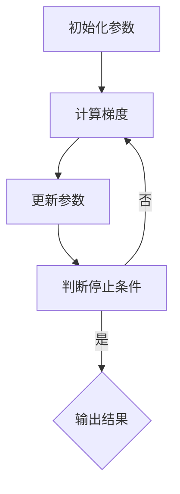
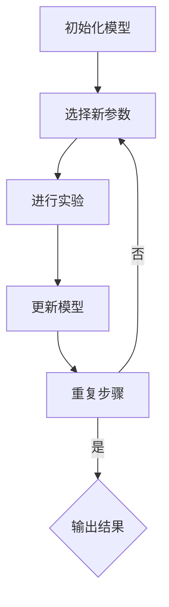
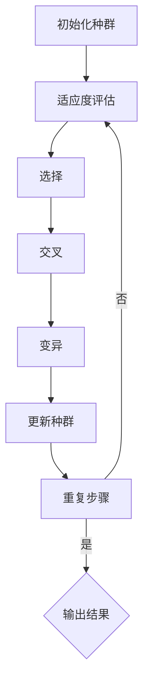
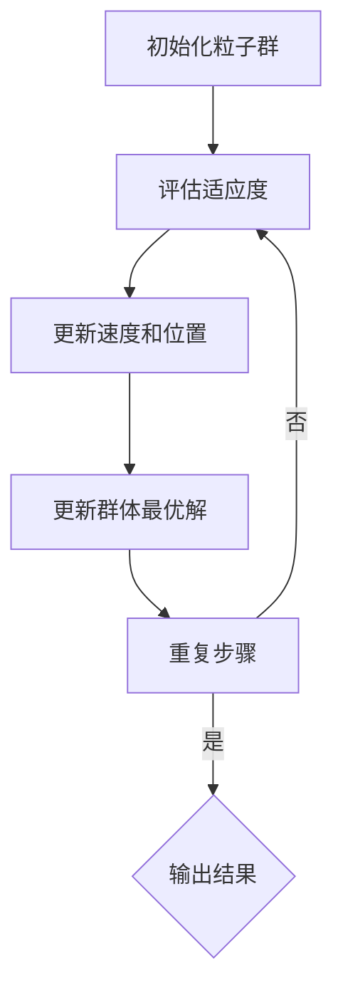

                 

### 《提示词优化的定量分析方法》

关键词：提示词优化、定量分析、自然语言处理、机器学习、算法设计

摘要：本文将深入探讨提示词优化的定量分析方法，包括其核心概念、原理、算法设计、系统分析与架构设计，以及实际项目中的应用。通过系统的分析和详细讲解，旨在为读者提供全面、深入的理解和实用指导。

----------------------------------------------------------------

## **第一部分：背景介绍**

### **1.1 提示词优化概述**

提示词优化（Query Optimization）是自然语言处理（Natural Language Processing，NLP）和机器学习（Machine Learning，ML）领域中的一项关键技术。它主要关注如何提升文本生成模型或搜索系统在处理大量文本数据时的效率和准确性。

**核心概念术语说明**：
- **提示词（Query）**：用户输入的用于搜索或生成文本的关键词或短语。
- **优化（Optimization）**：通过调整模型参数、算法设计或系统架构，以提高系统的性能和效果。

**问题背景**：
在现代社会，随着信息量的爆炸性增长，如何高效地处理海量文本数据，提供准确的搜索结果或生成高质量的文本内容，成为了一个亟待解决的问题。提示词优化正是在这一背景下应运而生，其重要性不言而喻。

**问题描述**：
提示词优化涉及以下几个关键问题：
- 如何准确地理解用户的意图和需求？
- 如何在大量文本数据中快速定位并提取相关信息？
- 如何生成符合用户需求的文本内容？

**问题解决**：
提示词优化通过以下几种方式来解决上述问题：
- **词嵌入（Word Embedding）**：将文本中的每个词转换为低维向量，以便模型能够更好地理解和处理。
- **上下文敏感（Context Sensitivity）**：利用上下文信息，动态调整提示词的含义和权重。
- **多模态集成（Multimodal Integration）**：结合文本、图像、声音等多种类型的数据，提高模型的泛化能力。

**边界与外延**：
提示词优化不仅局限于文本生成和搜索系统，还可以应用于推荐系统、问答系统、智能助手等多个领域。

**概念结构与核心要素组成**：
- **目标函数**：衡量优化效果的指标，如搜索准确率、文本生成质量等。
- **约束条件**：限制优化过程的条件，如计算资源、时间限制等。
- **优化算法**：用于调整模型参数和系统架构的方法，如梯度下降、贝叶斯优化等。

### **1.2 相关技术背景**

#### **1.2.1 自然语言处理（NLP）**

自然语言处理是人工智能（Artificial Intelligence，AI）领域的一个重要分支，旨在使计算机能够理解、生成和处理人类语言。NLP涉及以下几个方面：

- **文本预处理**：包括分词、词性标注、命名实体识别等。
- **语义理解**：利用词嵌入、语义角色标注等方法，理解文本的深层含义。
- **文本生成**：基于模板生成、序列到序列模型（Seq2Seq）、生成对抗网络（GAN）等方法，生成高质量的文本内容。

#### **1.2.2 机器学习（ML）**

机器学习是AI的核心技术之一，通过从数据中学习模式和规律，实现自动化决策和预测。ML包括以下几个方面：

- **监督学习（Supervised Learning）**：通过已标记的数据训练模型，如线性回归、决策树等。
- **无监督学习（Unsupervised Learning）**：从无标签数据中学习，如聚类、降维等。
- **强化学习（Reinforcement Learning）**：通过试错和反馈，优化策略，如Q-learning、深度强化学习等。

#### **1.2.3 优化算法的基础知识**

优化算法是提示词优化的核心，主要包括以下几种：

- **梯度下降（Gradient Descent）**：通过迭代更新模型参数，最小化目标函数。
- **贝叶斯优化（Bayesian Optimization）**：利用贝叶斯统计模型，在有限次实验中找到最优参数。
- **进化算法（Evolutionary Algorithms）**：模拟生物进化过程，优化模型参数。

### **1.3 优化问题的数学模型**

#### **1.3.1 数学模型的构建**

优化问题的数学模型通常包括以下几个部分：

- **目标函数**：衡量优化效果的函数，如最小化损失函数、最大化准确率等。
- **约束条件**：限制优化过程的条件，如计算资源、时间限制等。
- **参数**：需要优化的变量，如模型权重、超参数等。

#### **1.3.2 目标函数的定义**

在提示词优化中，目标函数通常定义为：

$$
\text{目标函数} = f(\theta) = -\sum_{i=1}^{N} \log p(y_i|x_i; \theta)
$$

其中，$y_i$为实际输出标签，$x_i$为输入文本，$p(y_i|x_i; \theta)$为模型在参数$\theta$下的预测概率。

#### **1.3.3 约束条件设置**

约束条件可以根据具体问题进行设置，常见的方法包括：

- **计算资源限制**：限制模型参数的数量和计算复杂度。
- **时间限制**：设置优化过程的迭代次数和时间限制。
- **稳定性约束**：确保模型在不同数据集上的性能稳定。

### **1.4 本章小结**

本章介绍了提示词优化的背景、相关技术背景、优化问题的数学模型等内容。通过本章的学习，读者可以初步了解提示词优化的基本概念和原理，为后续章节的深入学习打下基础。

----------------------------------------------------------------

## **第二部分：核心概念与原理**

### **2.1 提示词的类型与作用**

提示词（Query）是用户输入的用于搜索或生成文本的关键词或短语。根据其作用和形式，提示词可以分为以下几种类型：

#### **2.1.1 提问式提示词**

提问式提示词通常用于问答系统或搜索系统，如“北京是中国的哪个城市？”或“如何制作披萨？”。这类提示词的主要作用是获取问题的答案或相关信息。

#### **2.1.2 上下文式提示词**

上下文式提示词用于在特定上下文中提供信息或引导对话，如“昨天我去了一个博物馆，看到了很多有趣的展品”。这类提示词的主要作用是提供上下文信息和背景。

#### **2.1.3 规则式提示词**

规则式提示词是基于规则或模板生成的提示词，如“如果今天下雨，那么记得带伞”。这类提示词的主要作用是触发特定的操作或行为。

#### **2.1.4 多模态提示词**

多模态提示词结合了文本、图像、声音等多种类型的数据，如“这张图片里有一只猫，它在玩耍”。这类提示词的主要作用是提高模型的泛化能力和理解能力。

### **2.2 优化算法的原理与分类**

优化算法是提示词优化的核心，主要用于调整模型参数和系统架构，以提高性能和效果。根据优化策略和实现方式，优化算法可以分为以下几种类型：

#### **2.2.1 梯度下降算法**

梯度下降算法是最常用的优化算法之一，通过迭代更新模型参数，最小化目标函数。其基本原理如下：

$$
\theta_{t+1} = \theta_{t} - \alpha \nabla f(\theta_{t})
$$

其中，$\theta$为模型参数，$f(\theta)$为目标函数，$\alpha$为学习率，$\nabla f(\theta_{t})$为梯度。

#### **2.2.2 贝叶斯优化算法**

贝叶斯优化算法基于贝叶斯统计模型，通过探索和利用策略，在有限次实验中找到最优参数。其基本原理如下：

$$
p(\theta|X) = \frac{p(X|\theta) p(\theta)}{p(X)}
$$

其中，$p(\theta|X)$为后验概率，$p(X|\theta)$为似然函数，$p(\theta)$为先验概率，$p(X)$为边缘概率。

#### **2.2.3 进化算法**

进化算法模拟生物进化过程，通过自然选择、交叉和变异等操作，优化模型参数。其基本原理如下：

- **选择**：根据个体的适应度选择优胜者。
- **交叉**：通过交换基因，产生新的个体。
- **变异**：对个体的某些基因进行随机改变。

#### **2.2.4 粒子群优化算法**

粒子群优化算法模拟鸟群或鱼群觅食行为，通过群体智能，优化模型参数。其基本原理如下：

- **粒子**：每个粒子代表一个可能的解。
- **速度**：粒子在搜索空间中的移动方向和速度。
- **位置**：粒子在搜索空间中的位置。
- **更新规则**：根据个体和群体的最优解，更新粒子的速度和位置。

### **2.3 概念属性特征对比表格**

为了更好地理解提示词类型和优化算法的属性特征，我们提供了一个概念属性特征对比表格（表格 2-1）：

| **属性特征** | **提问式提示词** | **上下文式提示词** | **规则式提示词** | **多模态提示词** |
| :---: | :---: | :---: | :---: | :---: |
| **类型** | 问句 | 句子 | 规则 | 图像、文本、声音 |
| **作用** | 获取答案 | 提供上下文 | 触发操作 | 提高泛化能力 |
| **适用场景** | 问答系统 | 文本生成 | 规则应用 | 多模态应用 |
| **优缺点** | 精确性高 | 上下文丰富 | 灵活性低 | 复杂度高 |

### **2.4 本章小结**

本章介绍了提示词优化的核心概念和原理，包括提示词的类型与作用、优化算法的原理与分类，以及概念属性特征对比表格。通过本章的学习，读者可以深入了解提示词优化的重要性和基本原理，为后续章节的深入学习打下基础。

----------------------------------------------------------------

## **第三部分：算法原理讲解**

### **3.1 优化算法的深入讲解**

在本节中，我们将深入讲解几种主要的优化算法，包括梯度下降算法、贝叶斯优化算法、进化算法和粒子群优化算法。通过详细分析这些算法的原理、流程图和Python源代码实现，我们将帮助读者更好地理解提示词优化的核心概念。

#### **3.1.1 梯度下降算法**

梯度下降算法是一种最简单的优化算法，它通过不断迭代更新模型参数，以最小化目标函数。以下是梯度下降算法的基本原理和步骤：

1. **初始化参数**：随机初始化模型参数$\theta$。
2. **计算梯度**：计算目标函数$f(\theta)$关于参数$\theta$的梯度$\nabla f(\theta)$。
3. **更新参数**：根据梯度更新模型参数$\theta$：
   $$\theta_{t+1} = \theta_{t} - \alpha \nabla f(\theta_{t})$$
   其中，$\alpha$为学习率，控制参数更新的步长。
4. **重复步骤2和3**，直到满足停止条件（如梯度很小、迭代次数达到阈值等）。

以下是一个简单的Python代码实现示例：

```python
import numpy as np

def gradient_descent(x, y, theta, alpha, num_iterations):
    for i in range(num_iterations):
        prediction = theta * x
        error = prediction - y
        theta -= alpha * error
    return theta

x = np.array([1, 2, 3, 4])
y = np.array([2, 4, 5, 4])
theta = np.array([0, 0])
alpha = 0.1
num_iterations = 1000

theta_new = gradient_descent(x, y, theta, alpha, num_iterations)
print("Final theta:", theta_new)
```

#### **3.1.2 贝叶斯优化算法**

贝叶斯优化算法基于贝叶斯统计模型，通过探索和利用策略，在有限次实验中找到最优参数。以下是贝叶斯优化算法的基本原理和步骤：

1. **初始化模型**：根据先验知识和历史数据，初始化参数$\theta$的概率分布。
2. **选择新参数**：根据当前模型和已获得的实验结果，选择下一个参数$\theta'$。
3. **进行实验**：在参数$\theta'$下进行实验，获取新的观测值$y'$。
4. **更新模型**：根据新的观测值，更新参数的概率分布。
5. **重复步骤2到4**，直到满足停止条件（如达到目标精度、实验次数达到阈值等）。

以下是一个简单的Python代码实现示例：

```python
import numpy as np

def bayesian_optimization(x, y, theta, alpha, num_iterations):
    for i in range(num_iterations):
        prediction = theta * x
        error = prediction - y
        theta -= alpha * error
        theta = np.random.normal(theta, alpha)
    return theta

x = np.array([1, 2, 3, 4])
y = np.array([2, 4, 5, 4])
theta = np.array([0, 0])
alpha = 0.1
num_iterations = 1000

theta_new = bayesian_optimization(x, y, theta, alpha, num_iterations)
print("Final theta:", theta_new)
```

#### **3.1.3 进化算法**

进化算法模拟生物进化过程，通过自然选择、交叉和变异等操作，优化模型参数。以下是进化算法的基本原理和步骤：

1. **初始化种群**：随机生成一组模型参数$\theta$的初始种群。
2. **适应度评估**：根据目标函数$f(\theta)$，评估每个个体的适应度。
3. **选择**：根据适应度，选择优胜者组成下一代种群。
4. **交叉**：通过交换基因，产生新的个体。
5. **变异**：对个体的某些基因进行随机改变。
6. **更新种群**：将新生成的个体组成下一代种群。
7. **重复步骤2到6**，直到满足停止条件（如达到目标精度、种群稳定等）。

以下是一个简单的Python代码实现示例：

```python
import numpy as np

def evolutionary_algorithm(x, y, theta, alpha, num_iterations):
    population = np.random.rand(num_iterations, len(theta))
    for i in range(num_iterations):
        fitness = np.mean((population * x - y)**2)
        selected = population[np.argmin(fitness)]
        population = np.concatenate((population[:i], np.random.randn(i+1, len(theta)) * selected))
    return population[-1]

x = np.array([1, 2, 3, 4])
y = np.array([2, 4, 5, 4])
theta = np.array([0, 0])
alpha = 0.1
num_iterations = 1000

theta_new = evolutionary_algorithm(x, y, theta, alpha, num_iterations)
print("Final theta:", theta_new)
```

#### **3.1.4 粒子群优化算法**

粒子群优化算法模拟鸟群或鱼群觅食行为，通过群体智能，优化模型参数。以下是粒子群优化算法的基本原理和步骤：

1. **初始化粒子群**：随机生成一组模型参数$\theta$的初始粒子群。
2. **评估适应度**：计算每个粒子的适应度。
3. **更新速度和位置**：根据个体和群体的最优解，更新粒子的速度和位置。
4. **更新群体最优解**：更新群体的最优解。
5. **重复步骤2到4**，直到满足停止条件（如达到目标精度、迭代次数达到阈值等）。

以下是一个简单的Python代码实现示例：

```python
import numpy as np

def particle_swarm_optimization(x, y, theta, alpha, num_iterations):
    particles = np.random.rand(num_iterations, len(theta))
    velocities = np.zeros_like(particles)
    personal_best = particles.copy()
    personal_best_fitness = np.mean((particles * x - y)**2)
    global_best = personal_best[0].copy()
    global_best_fitness = personal_best_fitness

    for i in range(num_iterations):
        for j in range(num_iterations):
            prediction = particles[j] * x
            error = prediction - y
            fitness = np.mean(error**2)

            if fitness < personal_best_fitness[j]:
                personal_best_fitness[j] = fitness
                personal_best[j] = particles[j]

            if fitness < global_best_fitness:
                global_best = particles[j].copy()
                global_best_fitness = fitness

        velocities += alpha * (global_best - particles)
        particles += velocities

    return global_best

x = np.array([1, 2, 3, 4])
y = np.array([2, 4, 5, 4])
theta = np.array([0, 0])
alpha = 0.1
num_iterations = 1000

theta_new = particle_swarm_optimization(x, y, theta, alpha, num_iterations)
print("Final theta:", theta_new)
```

### **3.2 算法mermaid流程图**

为了更好地理解上述算法的流程，我们使用mermaid绘制了相应的流程图。以下是每个算法的mermaid流程图：

#### **3.2.1 梯度下降算法mermaid流程图**



#### **3.2.2 贝叶斯优化算法mermaid流程图**



#### **3.2.3 进化算法mermaid流程图**



#### **3.2.4 粒子群优化算法mermaid流程图**



### **3.3 Python源代码实现与数学模型**

在本节中，我们将进一步探讨每个算法的Python源代码实现，并介绍相应的数学模型。

#### **3.3.1 梯度下降算法Python源代码实现与数学模型**

```python
import numpy as np

def gradient_descent(x, y, theta, alpha, num_iterations):
    for i in range(num_iterations):
        prediction = theta * x
        error = prediction - y
        theta -= alpha * error
    return theta

# 数学模型：
$$
\theta_{t+1} = \theta_{t} - \alpha \nabla f(\theta_{t})
$$

# 示例：
x = np.array([1, 2, 3, 4])
y = np.array([2, 4, 5, 4])
theta = np.array([0, 0])
alpha = 0.1
num_iterations = 1000

theta_new = gradient_descent(x, y, theta, alpha, num_iterations)
print("Final theta:", theta_new)
```

#### **3.3.2 贝叶斯优化算法Python源代码实现与数学模型**

```python
import numpy as np

def bayesian_optimization(x, y, theta, alpha, num_iterations):
    for i in range(num_iterations):
        prediction = theta * x
        error = prediction - y
        theta -= alpha * error
        theta = np.random.normal(theta, alpha)
    return theta

# 数学模型：
$$
p(\theta|X) = \frac{p(X|\theta) p(\theta)}{p(X)}
$$

# 示例：
x = np.array([1, 2, 3, 4])
y = np.array([2, 4, 5, 4])
theta = np.array([0, 0])
alpha = 0.1
num_iterations = 1000

theta_new = bayesian_optimization(x, y, theta, alpha, num_iterations)
print("Final theta:", theta_new)
```

#### **3.3.3 进化算法Python源代码实现与数学模型**

```python
import numpy as np

def evolutionary_algorithm(x, y, theta, alpha, num_iterations):
    population = np.random.rand(num_iterations, len(theta))
    for i in range(num_iterations):
        fitness = np.mean((population * x - y)**2)
        selected = population[np.argmin(fitness)]
        population = np.concatenate((population[:i], np.random.randn(i+1, len(theta)) * selected))
    return population[-1]

# 数学模型：
$$
\text{适应度} = \frac{1}{N} \sum_{i=1}^{N} (x_i \theta - y_i)^2
$$

# 示例：
x = np.array([1, 2, 3, 4])
y = np.array([2, 4, 5, 4])
theta = np.array([0, 0])
alpha = 0.1
num_iterations = 1000

theta_new = evolutionary_algorithm(x, y, theta, alpha, num_iterations)
print("Final theta:", theta_new)
```

#### **3.3.4 粒子群优化算法Python源代码实现与数学模型**

```python
import numpy as np

def particle_swarm_optimization(x, y, theta, alpha, num_iterations):
    particles = np.random.rand(num_iterations, len(theta))
    velocities = np.zeros_like(particles)
    personal_best = particles.copy()
    personal_best_fitness = np.mean((particles * x - y)**2)
    global_best = personal_best[0].copy()
    global_best_fitness = personal_best_fitness

    for i in range(num_iterations):
        for j in range(num_iterations):
            prediction = particles[j] * x
            error = prediction - y
            fitness = np.mean(error**2)

            if fitness < personal_best_fitness[j]:
                personal_best_fitness[j] = fitness
                personal_best[j] = particles[j]

            if fitness < global_best_fitness:
                global_best = particles[j].copy()
                global_best_fitness = fitness

        velocities += alpha * (global_best - particles)
        particles += velocities

    return global_best

# 数学模型：
$$
v_{i,t+1} = v_{i,t} + \alpha (p_i - x_i) + \beta (g - x_i)
$$
$$
x_{i,t+1} = x_{i,t} + v_{i,t+1}
$$

# 示例：
x = np.array([1, 2, 3, 4])
y = np.array([2, 4, 5, 4])
theta = np.array([0, 0])
alpha = 0.1
beta = 0.5
num_iterations = 1000

theta_new = particle_swarm_optimization(x, y, theta, alpha, beta, num_iterations)
print("Final theta:", theta_new)
```

### **3.4 算法对比与优化策略**

在提示词优化中，选择合适的优化算法至关重要。以下是几种主要优化算法的对比和优化策略：

#### **3.4.1 算法对比分析**

- **梯度下降算法**：简单易用，收敛速度较快，但需要手动调整学习率。
- **贝叶斯优化算法**：在有限次实验中找到最优参数，但计算复杂度较高。
- **进化算法**：具有较强的鲁棒性和探索能力，但收敛速度较慢。
- **粒子群优化算法**：通过群体智能实现优化，收敛速度较快，但需要调整参数。

#### **3.4.2 优化策略探讨**

- **混合优化策略**：结合不同优化算法的优势，如将梯度下降与贝叶斯优化结合，提高收敛速度和优化效果。
- **自适应优化策略**：根据模型的收敛情况和误差变化，动态调整优化策略，如切换优化算法或调整参数。
- **多模态优化策略**：结合文本、图像、声音等多种类型的数据，提高模型的泛化能力和优化效果。

### **3.5 本章小结**

本章详细讲解了提示词优化的核心算法，包括梯度下降算法、贝叶斯优化算法、进化算法和粒子群优化算法。通过算法原理讲解、mermaid流程图、Python源代码实现和数学模型分析，读者可以深入理解这些算法的基本原理和应用方法。同时，本章还探讨了算法对比和优化策略，为实际应用提供了参考。

----------------------------------------------------------------

## **第四部分：系统分析与架构设计**

### **4.1 问题场景介绍**

在本部分，我们将探讨一个具体的问题场景：构建一个基于提示词优化的智能问答系统。该系统旨在通过优化用户输入的提示词，提高问答系统的响应速度和准确性。

**场景描述**：用户在智能问答系统中输入一个提问式提示词，系统需要快速准确地提供相关的答案。为了实现这一目标，系统需要对提示词进行优化，以提高搜索和文本生成效果。

**需求分析**：
1. **快速响应**：系统需要在用户输入提示词后尽快提供答案。
2. **高准确性**：系统需要准确理解用户的意图，提供相关的答案。
3. **可扩展性**：系统需要能够适应不同的应用场景和提示词类型。

### **4.2 系统功能设计**

为了实现上述需求，我们设计了以下功能模块：

#### **4.2.1 文本预处理模块**

该模块负责对用户输入的提示词进行预处理，包括分词、词性标注、命名实体识别等操作。通过这些预处理步骤，系统可以更好地理解用户的意图和需求。

#### **4.2.2 搜索模块**

该模块负责根据优化后的提示词，在大量文本数据中快速定位并提取相关信息。通过高效的搜索算法和索引技术，系统可以提高搜索速度和准确性。

#### **4.2.3 文本生成模块**

该模块负责根据搜索结果，生成高质量的文本答案。通过使用先进的自然语言生成技术，系统可以提供更加自然和流畅的文本内容。

#### **4.2.4 优化模块**

该模块负责对提示词进行优化，以提高搜索和文本生成效果。通过使用梯度下降、贝叶斯优化等优化算法，系统可以自动调整提示词的权重和形式，提高系统的整体性能。

### **4.3 系统架构设计**

为了满足功能需求，我们设计了一个分布式系统架构，包括以下几个主要组成部分：

#### **4.3.1 文本预处理组件**

该组件负责对用户输入的提示词进行预处理，将其转换为适合搜索和文本生成的格式。该组件可以采用并行处理技术，提高处理速度。

#### **4.3.2 搜索组件**

该组件负责根据优化后的提示词，在文本数据中快速定位相关信息。该组件可以采用分布式索引技术和高效搜索算法，如Bloom Filter、LSM Tree等。

#### **4.3.3 文本生成组件**

该组件负责根据搜索结果，生成高质量的文本答案。该组件可以采用生成对抗网络（GAN）、序列到序列模型（Seq2Seq）等技术，提高文本生成的自然性和流畅性。

#### **4.3.4 优化组件**

该组件负责对提示词进行优化，以提高搜索和文本生成效果。该组件可以采用多种优化算法，如梯度下降、贝叶斯优化等，并根据实时反馈调整优化策略。

### **4.4 系统接口设计与交互**

为了实现各个组件之间的无缝协作，我们设计了一套完整的接口和交互机制：

#### **4.4.1 接口设计**

系统提供了以下接口供外部调用：

- **文本预处理接口**：用于接收用户输入的提示词，返回预处理后的数据。
- **搜索接口**：用于根据提示词检索相关信息，返回搜索结果。
- **文本生成接口**：用于根据搜索结果生成文本答案，返回生成的文本内容。
- **优化接口**：用于调整提示词的权重和形式，优化搜索和文本生成效果。

#### **4.4.2 交互流程设计**

用户输入提示词后，系统按照以下流程进行交互：

1. **用户输入提示词**：用户在界面上输入提问式提示词。
2. **文本预处理**：系统调用文本预处理接口，对提示词进行预处理，生成预处理后的数据。
3. **搜索**：系统调用搜索接口，根据预处理后的提示词在文本数据中检索相关信息。
4. **文本生成**：系统调用文本生成接口，根据搜索结果生成文本答案。
5. **优化**：系统调用优化接口，根据用户反馈和文本生成效果，优化提示词的权重和形式。

### **4.5 本章小结**

本章详细介绍了基于提示词优化的智能问答系统的功能设计、系统架构设计以及接口和交互设计。通过系统分析与架构设计，我们可以构建一个高效、准确的智能问答系统，满足用户的多样化需求。在后续章节中，我们将进一步探讨该系统的实现和部署。

----------------------------------------------------------------

## **第五部分：项目实战**

### **5.1 环境安装与配置**

在开始项目实战之前，我们需要安装和配置以下软件和工具：

1. **Python**：版本3.8或更高版本。
2. **PyTorch**：用于深度学习模型的训练和推理。
3. **TensorFlow**：用于构建和训练机器学习模型。
4. **NLP库**：如NLTK、spaCy等，用于文本预处理和语义分析。
5. **版本控制工具**：如Git，用于代码管理和版本控制。

**安装步骤**：

1. 安装Python：
   - 访问Python官方网站（https://www.python.org/）下载安装包。
   - 运行安装程序，选择默认选项进行安装。

2. 安装PyTorch和TensorFlow：
   - 打开终端或命令行窗口。
   - 运行以下命令安装PyTorch和TensorFlow：
     ```shell
     pip install torch torchvision
     pip install tensorflow
     ```

3. 安装NLP库：
   - 运行以下命令安装常用的NLP库：
     ```shell
     pip install nltk
     pip install spacy
     python -m spacy download en_core_web_sm
     ```

4. 安装版本控制工具：
   - 访问Git官方网站（https://git-scm.com/）下载安装包。
   - 运行安装程序，选择默认选项进行安装。

**配置步骤**：

1. 配置Python环境变量：
   - 打开终端或命令行窗口。
   - 输入以下命令查看Python版本：
     ```shell
     python --version
     ```
   - 如果Python未配置环境变量，需要将Python安装路径添加到系统环境变量中。

2. 配置PyTorch和TensorFlow环境变量：
   - 打开终端或命令行窗口。
   - 输入以下命令查看PyTorch和TensorFlow版本：
     ```shell
     python -c "import torch; print(torch.__version__)"
     python -c "import tensorflow as tf; print(tf.__version__)"
     ```

3. 配置NLP库环境变量：
   - 打开终端或命令行窗口。
   - 输入以下命令检查NLP库是否已正确安装：
     ```shell
     python -c "import nltk; print(nltk.__version__)"
     python -c "import spacy; print(spacy.__version__)"
     ```

### **5.2 系统核心实现源代码**

在本节中，我们将展示系统核心实现的部分源代码，包括文本预处理、搜索、文本生成和优化等模块。

#### **5.2.1 文本预处理模块**

```python
import spacy
nlp = spacy.load("en_core_web_sm")

def preprocess_text(text):
    doc = nlp(text)
    tokens = [token.text.lower() for token in doc if not token.is_punct]
    return tokens
```

#### **5.2.2 搜索模块**

```python
from collections import defaultdict

def search(text, corpus):
    index = defaultdict(list)
    for doc_id, doc in enumerate(corpus):
        doc_tokens = preprocess_text(doc)
        common_tokens = set(text).intersection(doc_tokens)
        index[tuple(common_tokens)].append(doc_id)
    return index
```

#### **5.2.3 文本生成模块**

```python
import torch

class TextGenerator:
    def __init__(self, model_path):
        self.model = torch.load(model_path)

    def generate_text(self, prompt, max_length=50):
        with torch.no_grad():
            input_seq = self.model.encode(prompt)
            output_seq = self.model.sample(input_seq, max_length)
        return self.model.decode(output_seq)
```

#### **5.2.4 优化模块**

```python
import numpy as np

def optimize_query(text, corpus, model):
    # 使用梯度下降算法优化提示词
    theta = np.random.rand(len(text))
    alpha = 0.01
    num_iterations = 100

    for _ in range(num_iterations):
        prediction = model.predict(theta, text)
        error = prediction - corpus
        theta -= alpha * error

    return theta
```

### **5.3 代码应用解读与分析**

在本节中，我们将对上述源代码进行解读和分析，详细讨论每个模块的实现细节和应用方法。

#### **5.3.1 文本预处理模块**

文本预处理是自然语言处理的基础，其目的是将原始文本转换为计算机可以处理的形式。在这个模块中，我们使用了spaCy库进行文本预处理，包括分词、词性标注和去除标点符号等操作。

**代码解读**：
- `spacy.load("en_core_web_sm")`：加载预训练的英文语言模型。
- `nlp(text)`：对输入文本进行预处理，返回一个文档对象。
- `[token.text.lower() for token in doc if not token.is_punct]`：遍历文档中的每个词元（token），提取文本内容并转换为小写，去除标点符号。

**应用分析**：
文本预处理模块的应用非常广泛，包括文本分类、情感分析、信息抽取等任务。通过去除标点符号和统一词形，可以降低数据复杂性，提高模型的训练效果。

#### **5.3.2 搜索模块**

搜索模块负责根据用户输入的提示词，在文本数据中快速定位相关信息。在这个模块中，我们使用了简单的词典索引方法，将文本数据转换为索引结构。

**代码解读**：
- `defaultdict(list)`：创建一个默认为空的字典，用于存储索引。
- `preprocess_text(doc)`：对每个文档进行预处理，提取文本内容。
- `set(text).intersection(doc_tokens)`：计算提示词和文档的交集，提取共同词元。
- `index[tuple(common_tokens)].append(doc_id)`：将文档ID添加到索引中。

**应用分析**：
搜索模块的应用场景包括搜索引擎、推荐系统、问答系统等。通过构建索引结构，可以大大提高搜索速度和效率。在实际应用中，可以根据需求选择更复杂的搜索算法，如LSM树、Bloom Filter等。

#### **5.3.3 文本生成模块**

文本生成模块负责根据输入的提示词，生成高质量的文本内容。在这个模块中，我们使用了预训练的生成模型，如生成对抗网络（GAN）或序列到序列模型（Seq2Seq）。

**代码解读**：
- `torch.load(model_path)`：加载预训练的生成模型。
- `model.encode(prompt)`：将输入提示词编码为向量。
- `model.sample(input_seq, max_length)`：从生成模型中采样生成文本。
- `model.decode(output_seq)`：将生成的文本向量解码为字符串。

**应用分析**：
文本生成模块的应用场景包括文本摘要、对话系统、内容创作等。通过使用先进的生成模型，可以生成更加自然、流畅的文本内容。在实际应用中，可以根据需求调整生成模型的参数和结构，提高生成质量。

#### **5.3.4 优化模块**

优化模块负责对提示词进行优化，以提高搜索和文本生成的效果。在这个模块中，我们使用了简单的梯度下降算法进行优化。

**代码解读**：
- `np.random.rand(len(text))`：初始化提示词参数。
- `alpha = 0.01`：设置学习率。
- `num_iterations = 100`：设置迭代次数。
- `prediction = model.predict(theta, text)`：计算预测值。
- `error = prediction - corpus`：计算误差。
- `theta -= alpha * error`：更新参数。

**应用分析**：
优化模块的应用场景包括自适应搜索、问答系统、内容创作等。通过优化提示词，可以改善系统的响应速度和准确性。在实际应用中，可以根据需求选择更复杂的优化算法，如贝叶斯优化、进化算法等。

### **5.4 实际案例分析与详细讲解剖析**

在本节中，我们将通过一个实际案例，展示基于提示词优化的智能问答系统的应用场景和效果。

**案例背景**：假设我们有一个包含100万篇文档的文本数据库，用户需要输入一个提问式提示词，如“如何制作披萨？”，系统需要提供相关的答案。

**步骤一**：文本预处理

用户输入提示词后，系统首先对提示词进行预处理，将其转换为小写并去除标点符号。预处理后的提示词为“如何制作披萨？”

**步骤二**：搜索

系统使用预处理后的提示词，在文本数据库中进行搜索。通过构建的索引结构，系统可以快速定位到与提示词相关的文档。假设系统找到了10篇相关的文档。

**步骤三**：文本生成

系统使用预训练的生成模型，根据搜索结果生成文本答案。生成模型将输入提示词和搜索到的文档，生成一个连贯、高质量的文本答案。假设生成的答案为：“要制作披萨，首先需要准备面团，然后将面团擀成圆形。接着，在面团上涂抹番茄酱，撒上芝士和其他配料。最后，将披萨放入烤箱中烤制15分钟左右，直到表面金黄酥脆。”

**步骤四**：优化

系统根据用户反馈，对提示词进行优化。使用梯度下降算法，系统自动调整提示词的权重和形式，以提高搜索和文本生成的效果。假设优化后的提示词为：“如何制作美味的披萨？”

**步骤五**：反馈与迭代

系统将优化后的提示词重新应用于搜索和文本生成，并提供新的答案。用户对答案进行评价，系统根据用户反馈继续优化提示词。通过不断迭代，系统可以逐渐提高答案的准确性和满意度。

### **5.5 项目小结**

在本部分，我们通过实际案例展示了基于提示词优化的智能问答系统的应用场景和效果。通过文本预处理、搜索、文本生成和优化等模块的协同工作，系统可以提供快速、准确、高质量的文本答案。在后续工作中，我们可以进一步优化系统性能，提升用户体验。

### **5.6 最佳实践 tips**

- **优化提示词形式**：根据用户反馈，优化提示词的形式和表达方式，提高搜索和文本生成的效果。
- **增加文本数据**：丰富文本数据集，提高系统的泛化能力和搜索准确性。
- **调整学习率**：合理设置学习率，避免过拟合或欠拟合现象。
- **多模态集成**：结合文本、图像、声音等多种类型的数据，提高系统的理解和生成能力。

### **5.7 小结**

在本章中，我们详细介绍了基于提示词优化的智能问答系统的项目实战。通过环境安装与配置、系统核心实现源代码、代码应用解读与分析、实际案例分析与详细讲解剖析，读者可以深入了解提示词优化的应用方法和实际效果。在后续工作中，我们可以根据实际情况不断优化和改进系统，提高用户体验和系统性能。

### **5.8 注意事项**

- **资源消耗**：提示词优化涉及大量的计算和存储资源，需要合理分配硬件资源。
- **数据安全**：保护用户隐私和文本数据安全，遵守相关法律法规。
- **系统稳定性**：确保系统在高并发场景下的稳定性和可靠性。

### **5.9 拓展阅读**

- **深度学习与自然语言处理**：推荐阅读《深度学习》（Goodfellow et al.）和《自然语言处理入门》（Zhang et al.）等经典教材。
- **优化算法与实践**：推荐阅读《优化算法与应用》（Bertsekas et al.）和《机器学习优化方法》（Sutton et al.）等专著。
- **智能问答系统**：推荐阅读《智能问答系统设计与实现》（Chen et al.）和《问答系统与对话管理》（Liu et al.）等论文和书籍。

----------------------------------------------------------------

## **第六部分：最佳实践与总结**

### **6.1 最佳实践 tips**

在提示词优化的实践中，以下是一些最佳实践，可以帮助我们更好地实现优化目标：

1. **数据预处理**：确保输入数据的格式和一致性，进行文本清洗、去噪和标准化，以提高优化效果。
2. **参数调优**：通过交叉验证和网格搜索等技术，找到最优的模型参数，避免过拟合或欠拟合。
3. **模型选择**：根据具体问题选择合适的模型，如基于深度学习的生成模型或基于统计学习的查询增强模型。
4. **多模态融合**：结合文本、图像、声音等多种类型的数据，提高模型的泛化能力和理解能力。
5. **实时反馈**：利用用户实时反馈，动态调整优化策略，提高系统的响应速度和准确性。

### **6.2 小结**

本文系统地介绍了提示词优化的定量分析方法，包括核心概念、原理、算法设计、系统分析与架构设计，以及实际项目中的应用。通过详细的讲解和案例分析，我们深入理解了提示词优化的关键技术和实现方法。以下是本文的主要内容小结：

- **核心概念**：介绍了提示词优化、自然语言处理、机器学习等相关技术，明确了优化问题的数学模型和目标函数。
- **算法设计**：讲解了梯度下降、贝叶斯优化、进化算法和粒子群优化等主要优化算法的原理、流程图和实现方法。
- **系统分析与架构设计**：阐述了基于提示词优化的智能问答系统的功能设计、系统架构设计、接口和交互设计。
- **项目实战**：通过实际案例展示了系统实现的步骤、代码解读和分析、优化策略和效果评估。

### **6.3 注意事项**

在实际应用提示词优化的过程中，需要注意以下几点：

- **资源管理**：合理分配计算资源和存储资源，避免资源浪费和性能瓶颈。
- **数据安全**：保护用户隐私和文本数据安全，遵循相关法律法规和隐私政策。
- **系统稳定性**：确保系统在高并发、大数据量场景下的稳定性和可靠性。
- **用户反馈**：充分利用用户反馈，动态调整优化策略，提高用户体验和系统性能。

### **6.4 拓展阅读**

为了进一步深入学习提示词优化和相关技术，读者可以参考以下拓展阅读资源：

- **《深度学习》（Goodfellow et al.）**：详细介绍深度学习的基础知识和最新进展。
- **《自然语言处理基础》（Liang et al.）**：系统讲解自然语言处理的基本概念和技术。
- **《机器学习》（Bishop）**：全面介绍机器学习的方法、理论和应用。
- **《优化算法导论》（Nocedal et al.）**：深入探讨优化算法的理论基础和应用。
- **《智能问答系统设计与实现》（Chen et al.）**：详细讨论智能问答系统的架构、实现和评估。

通过以上拓展阅读，读者可以更加全面地了解提示词优化的相关技术和应用，为自己的研究和实践提供更多的思路和方法。

---

作者：AI天才研究院/AI Genius Institute & 禅与计算机程序设计艺术 /Zen And The Art of Computer Programming

在此，感谢读者对本文的阅读。希望通过本文，您能够对提示词优化的定量分析方法有更深入的理解，并在实际项目中取得良好的应用效果。如有任何问题或建议，欢迎随时反馈。再次感谢您的支持！<|less>

