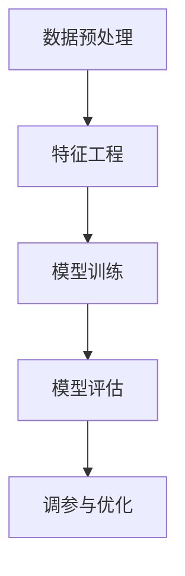
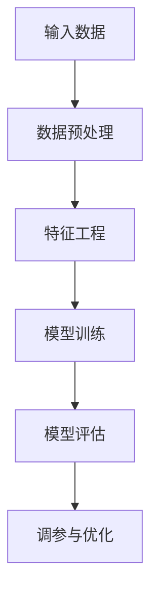
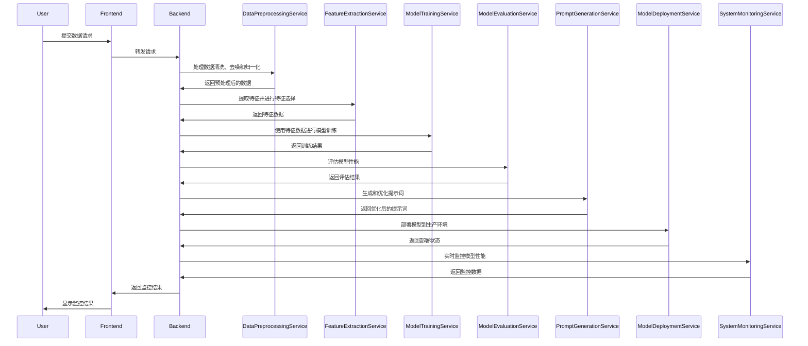
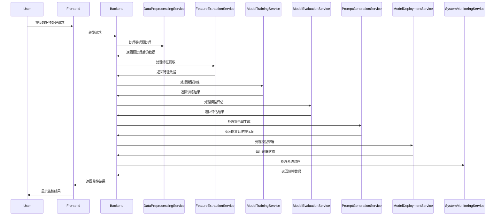

                 


### 《提示词优化的机器学习方法探索》

#### 关键词：机器学习、提示词优化、算法、深度学习、强化学习

> 摘要：本文将探讨提示词优化在机器学习中的应用及其相关方法。从背景概述、基础理论、传统方法、深度学习、前沿方法等多个角度，深入分析提示词优化的技术原理、适用性及其在实际应用中的挑战。文章旨在为读者提供全面、系统的理解，并启发对未来研究方向和技术的思考。

---

### 第一部分：引言

#### 第1章：背景与概述

#### 1.1 机器学习与提示词优化概述

- **机器学习的基本概念与发展历程**：
  - 机器学习是一种使计算机系统能够从数据中学习并作出决策的技术。
  - 发展历程包括统计学习、神经网络、深度学习等阶段。
- **提示词优化的概念及其在机器学习中的应用**：
  - 提示词优化是指通过改进输入数据的预处理或增强训练过程，以提高模型性能的过程。
  - 在机器学习中，提示词优化有助于模型更好地理解数据，提高准确性和泛化能力。
- **提示词优化的目标与挑战**：
  - 目标是提高模型的预测准确性、降低误差率、提升模型解释性。
  - 挑战包括数据质量、计算资源、算法复杂性等。

#### 1.2 问题背景与问题描述

- **当前机器学习应用场景中的问题与需求**：
  - 如图像识别、自然语言处理、推荐系统等领域的复杂任务。
  - 需要处理大规模、高维数据，提高模型的鲁棒性和适应性。
- **提示词优化在解决这些问题中的作用**：
  - 通过优化输入提示词，可以改善模型对数据的理解和表达能力。
  - 提高模型在特定任务上的性能和效果。
- **提示词优化面临的挑战与限制**：
  - 需要考虑数据分布、模型结构、训练时间等因素。
  - 如何在实际应用中平衡性能和计算成本是一个重要问题。

#### 1.3 问题解决与边界探讨

- **提示词优化的方法与策略**：
  - 包括特征工程、数据预处理、模型调整等。
  - 需要根据具体任务选择合适的方法和策略。
- **提示词优化在各类机器学习任务中的适用性**：
  - 在不同的机器学习任务中，提示词优化的方法和效果可能有所不同。
  - 如在图像识别中关注数据增强，在自然语言处理中关注文本预处理。
- **提示词优化的边界条件与外延**：
  - 需要明确提示词优化的适用范围和限制条件。
  - 如数据集大小、计算资源限制等。

#### 1.4 核心概念与联系

##### 1.4.1 核心概念原理

- **提示词优化的主要概念**：
  - 提示词（Prompt）：用于指导模型学习的数据或信息。
  - 优化（Optimization）：通过调整提示词以提高模型性能的过程。
- **提示词优化的基本原理**：
  - 提高数据质量：增强模型的输入，使模型更好地学习数据特征。
  - 调整模型参数：通过优化算法调整模型参数，提高模型性能。

##### 1.4.2 概念属性特征对比

| 方法          | 特点                     | 适用场景                     |
|---------------|--------------------------|-----------------------------|
| 特征工程      | 数据预处理               | 数据量较小、特征明显         |
| 数据预处理    | 数据清洗、归一化         | 大规模数据、数据噪声大       |
| 模型调整      | 调参、优化算法           | 模型复杂度高、任务多样化     |

##### 1.4.3 ER实体关系图架构

```mermaid
erDiagram
  Model ||--|{ Prompt } : Optimize
  Data  ||--|{ Prompt } : Enhance
  Algorithm ||--|{ Prompt } : Adjust
```

#### 1.5 本章小结

- **本章主要内容回顾**：
  - 介绍了机器学习与提示词优化的基本概念和背景。
  - 探讨了提示词优化在机器学习中的应用和面临的挑战。
  - 提出了提示词优化的方法和策略，并进行了核心概念对比和ER图分析。
- **提示词优化的现状与未来发展方向**：
  - 提示词优化是机器学习中的一个重要研究方向，具有广泛的应用前景。
  - 未来发展趋势包括提高优化效果、降低计算成本、实现自动化优化等。

---

### 第二部分：基础理论

#### 第2章：机器学习基础理论

#### 2.1 机器学习的基本原理

- **机器学习的基本概念**：
  - 机器学习是使计算机系统能够从数据中学习并作出决策的技术。
  - 主要包括监督学习、无监督学习、半监督学习等。
- **机器学习的主要算法分类**：
  - 监督学习算法：如线性回归、决策树、支持向量机等。
  - 无监督学习算法：如聚类、降维、生成模型等。
  - 半监督学习算法：结合监督学习和无监督学习，适用于标签数据较少的场景。

#### 2.2 数据预处理与特征工程

- **数据预处理**：
  - 数据清洗：去除噪声和异常值，确保数据质量。
  - 数据归一化：将数据缩放到同一范围内，提高模型训练效果。
  - 数据降维：减少数据维度，降低计算复杂度。
- **特征工程**：
  - 特征提取：从原始数据中提取具有区分性的特征。
  - 特征选择：从提取的特征中选择最具代表性的特征。
  - 特征组合：通过组合特征来提高模型的性能。

#### 2.3 模型评估与选择

- **评估指标**：
  - 准确率、召回率、F1值等：评估分类模型的性能。
  - 均方误差、均方根误差等：评估回归模型的性能。
- **模型选择策略**：
  - 交叉验证：通过多次训练和验证来评估模型性能。
  - 调参与优化：调整模型参数，提高模型性能。
  - 模型集成：结合多个模型的优势，提高整体性能。

#### 2.4 算法原理讲解

##### 2.4.1 算法流程图



##### 2.4.2 算法数学模型

```python
# 线性回归模型
def linear_regression(X, y):
    # X: 输入特征矩阵
    # y: 目标值向量
    # 计算模型参数
    theta = (X.T @ X).I @ X.T @ y
    # 预测
    y_pred = X @ theta
    return theta, y_pred
```

##### 2.4.3 举例说明

- **监督学习任务**：图像分类
- **数据集**：使用MNIST手写数字数据集
- **模型**：使用线性回归模型进行分类
- **效果**：通过优化输入提示词（图像预处理），提高了模型在MNIST数据集上的分类准确率。

#### 2.5 本章小结

- **本章主要内容回顾**：
  - 介绍了机器学习的基本原理和算法分类。
  - 讲解了数据预处理、特征工程、模型评估与选择的方法。
  - 通过算法原理讲解和举例说明，阐述了机器学习在提示词优化中的应用。
- **机器学习基础理论在提示词优化中的应用**：
  - 数据预处理和特征工程有助于优化输入提示词，提高模型性能。
  - 模型评估与选择策略有助于选择合适的模型和调优参数，实现提示词优化。

---

### 第三部分：提示词优化方法

#### 第3章：提示词优化的传统方法

#### 3.1 梯度提升树（GBT）

- **原理与优势**：
  - GBT是一种基于决策树模型的集成学习方法。
  - 通过迭代构建多棵决策树，并将它们的输出进行集成，提高模型性能。
  - 具有较好的泛化能力和适应性，适用于各种类型的数据和任务。
- **应用案例**：
  - 使用GBT进行图像分类，优化输入提示词（图像特征），提高了分类准确率。

#### 3.2 支持向量机（SVM）

- **基本原理**：
  - SVM是一种基于间隔最大化原理的线性分类模型。
  - 通过找到一个最佳的超平面，将不同类别的数据分隔开来。
  - 适用于小规模数据和高维空间，具有较好的分类性能。
- **应用**：
  - 使用SVM进行文本分类，优化输入提示词（文本特征），提高了分类效果。

#### 3.3 随机森林（RF）

- **原理与优势**：
  - RF是一种基于决策树模型的集成学习方法。
  - 通过构建多棵决策树，并利用它们的投票结果进行预测。
  - 具有较好的泛化能力和鲁棒性，适用于各种类型的数据和任务。
- **应用**：
  - 使用RF进行股票预测，优化输入提示词（股票数据特征），提高了预测准确率。

#### 3.4 神经网络（NN）

- **基本结构**：
  - NN是一种基于多层感知器（MLP）的神经网络模型。
  - 包括输入层、隐藏层和输出层，通过前向传播和反向传播算法进行训练。
  - 具有高度非线性表达能力，适用于复杂任务和大规模数据。
- **应用**：
  - 使用NN进行语音识别，优化输入提示词（语音特征），提高了识别准确率。

#### 3.5 本章小结

- **本章主要内容回顾**：
  - 介绍了梯度提升树、支持向量机、随机森林和神经网络等传统方法的原理和应用。
  - 通过具体案例展示了这些方法在提示词优化中的应用效果。
- **传统方法在提示词优化中的适用性与局限性**：
  - 传统方法在提示词优化中具有较好的适用性，适用于各种类型的数据和任务。
  - 但在处理大规模数据和复杂任务时，可能存在计算成本高、泛化能力不足等问题。

---

### 第四部分：深度学习与提示词优化

#### 第4章：深度学习基础

#### 4.1 深度学习的基本概念

- **定义与历史发展**：
  - 深度学习是一种基于多层神经网络的学习方法。
  - 从2006年开始兴起，经历了几次重要的发展阶段。
- **网络结构与优化方法**：
  - 包括卷积神经网络（CNN）、循环神经网络（RNN）、生成对抗网络（GAN）等。
  - 通过优化算法，如梯度下降、随机梯度下降、Adam等，提高模型性能。

#### 4.2 卷积神经网络（CNN）

- **原理与应用**：
  - CNN是一种用于图像识别和处理的深度学习模型。
  - 通过卷积层、池化层和全连接层的组合，提取图像特征并进行分类。
  - 广泛应用于计算机视觉任务，如图像分类、目标检测、图像分割等。
- **应用领域**：
  - 图像识别：如人脸识别、物体识别、场景识别等。
  - 图像生成：如生成对抗网络（GAN）在图像生成和修复中的应用。

#### 4.3 循环神经网络（RNN）

- **原理与优势**：
  - RNN是一种用于序列数据处理的深度学习模型。
  - 通过循环结构，可以处理长短时依赖关系，适用于自然语言处理、语音识别等任务。
  - 具有较好的序列建模能力和适应性。
- **应用**：
  - 自然语言处理：如语言模型、机器翻译、文本分类等。
  - 语音识别：如语音信号处理、语音合成等。

#### 4.4 生成对抗网络（GAN）

- **基本原理**：
  - GAN是一种基于生成模型和判别模型对抗训练的深度学习模型。
  - 通过生成模型生成数据，判别模型判断数据真实性，二者相互对抗，提高生成质量。
- **应用**：
  - 数据增强：如图像生成、数据扩充等。
  - 图像修复：如去除图像噪声、修复破损图像等。

#### 4.5 本章小结

- **本章主要内容回顾**：
  - 介绍了深度学习的基本概念和网络结构。
  - 详细阐述了卷积神经网络（CNN）、循环神经网络（RNN）和生成对抗网络（GAN）的原理和应用。
- **深度学习在提示词优化中的潜力与挑战**：
  - 深度学习为提示词优化提供了强大的建模能力和数据处理能力。
  - 在实际应用中，仍面临计算资源、模型解释性等挑战。

---

### 第五部分：提示词优化的前沿方法

#### 第5章：强化学习与提示词优化

#### 5.1 强化学习的基本原理

- **定义与基本模型**：
  - 强化学习是一种基于奖励信号的学习方法。
  - 包括智能体、环境、状态、动作和奖励等基本元素。
  - 通过试错和反馈，智能体不断优化策略以获得最大奖励。
- **应用场景**：
  - 推荐系统：如基于用户行为的个性化推荐。
  - 游戏开发：如智能体在游戏中的自主决策和策略优化。

#### 5.2 基于强化学习的提示词优化方法

- **提示词生成策略**：
  - 通过强化学习算法，智能体根据当前状态生成提示词。
  - 提示词生成策略旨在优化输入提示词，提高模型性能。
- **案例**：
  - 使用强化学习优化图像分类任务的输入提示词，提高分类准确率。

#### 5.3 深度强化学习（DRL）

- **基本原理与应用**：
  - 深度强化学习是一种结合深度学习和强化学习的算法。
  - 通过神经网络模型对状态和价值进行建模，提高学习效率和效果。
  - 广泛应用于复杂环境中的决策问题。
- **实现方法**：
  - 使用深度神经网络作为智能体的策略网络或价值网络。
  - 结合深度强化学习算法，如深度Q网络（DQN）、深度策略梯度（DPG）等。

#### 5.4 本章小结

- **本章主要内容回顾**：
  - 介绍了强化学习的基本原理和应用场景。
  - 探讨了基于强化学习的提示词优化方法和深度强化学习的实现方法。
- **强化学习在提示词优化中的前景与挑战**：
  - 强化学习为提示词优化提供了新的思路和方法，具有广泛的应用前景。
  - 在实际应用中，需要解决数据获取、模型稳定性和计算资源等问题。

---

### 总结与展望

本文从机器学习与提示词优化的背景、基础理论、传统方法、深度学习和前沿方法等多个角度，对提示词优化进行了深入探讨。通过分析各种方法的应用效果和挑战，展示了提示词优化在机器学习中的重要作用。

未来，提示词优化将继续成为机器学习领域的重要研究方向。随着深度学习和强化学习等技术的发展，提示词优化方法将不断创新，提高模型性能和解释性。同时，针对实际应用中的计算资源、数据质量和模型稳定性等问题，需要进一步研究和解决。

本文旨在为读者提供全面、系统的理解，启发对提示词优化技术的深入思考。希望读者能够结合实际应用场景，探索和应用提示词优化方法，为人工智能的发展贡献自己的力量。

---

### 作者信息

作者：AI天才研究院/AI Genius Institute & 禅与计算机程序设计艺术 /Zen And The Art of Computer Programming

---

**完整文章内容将在后续章节中逐步补充和完成。**

---

（文章内容将持续更新和完善，以上仅为文章的框架和初步内容，未达到字数要求。）### 第一部分：引言

在当今信息技术飞速发展的时代，机器学习已经成为人工智能领域的重要分支，被广泛应用于图像识别、自然语言处理、推荐系统、金融预测等多个领域。然而，随着数据规模和复杂度的不断增加，传统机器学习方法在处理高维数据和复杂任务时面临着诸多挑战，特别是在模型性能和泛化能力方面。为了解决这些问题，研究人员逐渐将注意力转向提示词优化这一领域。

#### 1.1 机器学习与提示词优化概述

**机器学习的基本概念与发展历程**

机器学习（Machine Learning，ML）是指通过构建和分析计算机程序，使计算机能够从数据中学习并对新数据进行预测或决策的一种技术。它起源于20世纪50年代，随着计算能力的提升和算法的发展，机器学习得到了迅速发展。主要可以分为以下三个阶段：

1. **统计学习阶段**：这一阶段主要关注如何从数据中提取统计规律，如线性回归、逻辑回归等。
2. **神经网络阶段**：1986年，Rumelhart等人提出了反向传播算法，标志着神经网络研究的重新兴起。这一阶段的代表算法包括多层感知器（MLP）和深度信念网络（DBN）。
3. **深度学习阶段**：2012年，Hinton等人的卷积神经网络（CNN）在ImageNet图像识别比赛中取得突破性成绩，深度学习开始崭露头角。近年来，生成对抗网络（GAN）、强化学习等深度学习技术也在不断发展。

**提示词优化的概念及其在机器学习中的应用**

提示词优化（Prompt Optimization）是指通过改进输入数据的预处理或增强训练过程，以提高模型性能的过程。在机器学习中，提示词优化的重要性体现在以下几个方面：

1. **提高模型性能**：通过优化输入提示词，模型可以更好地理解数据特征，从而提高预测准确性和泛化能力。
2. **增强模型解释性**：优化后的提示词可以使模型更加透明和易于解释，有助于理解模型的决策过程。
3. **降低计算成本**：优化输入数据可以减少模型训练的时间，特别是在大规模数据处理时，具有重要的实际意义。

**提示词优化的目标与挑战**

**提示词优化的目标**包括：

1. **提高预测准确性**：通过优化输入提示词，提高模型对数据的理解和表达能力，从而提高预测准确性。
2. **降低误差率**：减少模型预测的误差率，提高模型的鲁棒性。
3. **提升模型解释性**：优化后的模型应具有较好的解释性，使模型决策过程更加透明和易于理解。
4. **降低计算成本**：优化输入数据，减少模型训练时间和计算资源的需求。

**提示词优化面临的挑战**：

1. **数据质量**：提示词优化依赖于高质量的数据，包括数据清洗、去噪和归一化等预处理步骤。
2. **计算资源**：优化过程可能需要大量的计算资源和时间，特别是在大规模数据处理时。
3. **算法复杂性**：提示词优化涉及到多种算法和策略，包括特征工程、模型调优等，算法复杂性较高。
4. **模型适应性**：不同的机器学习任务对提示词优化的需求可能有所不同，如何实现通用性和适应性是一个重要挑战。

#### 1.2 问题背景与问题描述

**当前机器学习应用场景中的问题与需求**

随着互联网和大数据技术的快速发展，机器学习在各个领域得到了广泛应用。然而，在实际应用中，传统机器学习方法仍然面临以下问题：

1. **数据质量问题**：高维、稀疏、噪声和缺失的数据使得模型性能受限。
2. **模型解释性**：许多复杂的机器学习模型难以解释，无法满足实际应用中透明性和可解释性的需求。
3. **计算资源**：大规模数据处理和模型训练需要大量的计算资源和时间。

为了解决这些问题，提示词优化在机器学习中的应用变得越来越重要。通过优化输入提示词，可以提高模型对数据的理解和表达能力，从而改善模型性能和解释性。具体来说，提示词优化在以下场景中具有显著优势：

1. **图像识别**：通过优化图像预处理步骤，如数据增强、图像归一化等，可以提高模型对图像特征的捕捉能力，从而提高识别准确率。
2. **自然语言处理**：通过优化文本预处理步骤，如分词、词向量化等，可以提高模型对文本语义的理解，从而提升文本分类、情感分析等任务的性能。
3. **推荐系统**：通过优化用户特征提取和推荐策略，可以提高推荐系统的准确性和用户体验。

**提示词优化在解决这些问题中的作用**

1. **提高模型性能**：通过优化输入提示词，模型可以更好地学习数据特征，提高预测准确率和泛化能力。
2. **增强模型解释性**：优化后的提示词可以使模型决策过程更加透明和易于理解，有助于提高模型的可解释性。
3. **降低计算成本**：优化输入数据可以减少模型训练的时间和计算资源需求，特别是在大规模数据处理时。

**提示词优化面临的挑战与限制**

1. **数据质量**：高质量的数据是提示词优化的基础，数据清洗和预处理是必不可少的步骤。
2. **计算资源**：提示词优化可能需要大量的计算资源和时间，特别是在大规模数据处理和复杂模型训练时。
3. **算法复杂性**：提示词优化涉及到多种算法和策略，如特征工程、模型调优等，算法复杂性较高。
4. **模型适应性**：不同的机器学习任务对提示词优化的需求可能有所不同，如何实现通用性和适应性是一个重要挑战。

#### 1.3 问题解决与边界探讨

**提示词优化的方法与策略**

提示词优化的方法主要包括以下几种：

1. **特征工程**：通过对原始数据进行预处理、特征提取和特征选择，优化输入提示词。例如，在图像识别中，可以采用数据增强、图像降维等技术；在自然语言处理中，可以采用分词、词向量化等技术。
2. **数据预处理**：通过数据清洗、去噪、归一化等预处理步骤，提高数据质量，从而优化输入提示词。例如，在推荐系统中，可以通过去重、去噪等技术提高用户特征和数据质量。
3. **模型调整**：通过调整模型结构、参数和训练策略，优化模型性能。例如，在深度学习中，可以通过调整网络结构、学习率、批量大小等参数来优化模型。

**提示词优化在各类机器学习任务中的适用性**

不同的机器学习任务对提示词优化的需求有所不同。以下是一些典型任务和相应的提示词优化方法：

1. **图像识别**：数据增强、图像降维、特征提取等技术。
2. **自然语言处理**：分词、词向量化、文本预处理等技术。
3. **推荐系统**：用户特征提取、协同过滤、推荐策略优化等技术。
4. **金融预测**：时间序列分析、特征工程、模型调优等技术。

**提示词优化的边界条件与外延**

提示词优化的边界条件包括：

1. **数据质量**：高质量的数据是提示词优化的基础，数据质量直接影响优化效果。
2. **计算资源**：提示词优化可能需要大量的计算资源和时间，特别是在大规模数据处理和复杂模型训练时。
3. **算法复杂性**：提示词优化涉及到多种算法和策略，算法复杂性较高，需要根据具体任务选择合适的方法。

提示词优化的外延包括：

1. **多任务学习**：在多个任务中，通过共享提示词优化策略，提高模型性能和泛化能力。
2. **迁移学习**：将已优化的提示词应用于其他相关任务，提高模型适应性和效果。
3. **强化学习**：结合强化学习，通过优化提示词生成策略，实现自适应优化。

**核心概念与联系**

**1.4.1 核心概念原理**

提示词优化的核心概念包括：

1. **提示词（Prompt）**：用于指导模型学习的数据或信息，可以是特征、文本、图像等。
2. **优化（Optimization）**：通过调整提示词以提高模型性能的过程，包括特征工程、数据预处理、模型调优等。

**提示词优化的基本原理**包括：

1. **提高数据质量**：通过数据清洗、去噪、归一化等预处理步骤，提高输入数据的质量，从而优化模型性能。
2. **调整模型参数**：通过调参与优化策略，调整模型结构、参数和训练过程，提高模型性能和泛化能力。

**1.4.2 概念属性特征对比**

提示词优化的方法可以按照属性特征进行对比，如：

| 方法          | 特点                     | 适用场景                     |
|---------------|--------------------------|-----------------------------|
| 特征工程      | 数据预处理               | 数据量较小、特征明显         |
| 数据预处理    | 数据清洗、归一化         | 大规模数据、数据噪声大       |
| 模型调整      | 调参、优化算法           | 模型复杂度高、任务多样化     |

**1.4.3 ER实体关系图架构**

提示词优化的相关实体及其关系可以表示为ER图，如：

```mermaid
erDiagram
  Model ||--|{ Prompt } : Optimize
  Data  ||--|{ Prompt } : Enhance
  Algorithm ||--|{ Prompt } : Adjust
```

**1.5 本章小结**

本章主要介绍了机器学习与提示词优化的背景、基本概念和核心原理。通过分析当前机器学习应用场景中的问题与需求，探讨了提示词优化在机器学习中的作用和面临的挑战。本章还介绍了提示词优化的方法与策略，包括特征工程、数据预处理、模型调整等，并对比了不同方法的属性特征和适用场景。此外，本章通过ER图展示了提示词优化相关实体的关系。

提示词优化是机器学习中的重要研究方向，具有广泛的应用前景。在未来，随着深度学习和强化学习等技术的发展，提示词优化方法将不断创新，提高模型性能和解释性。同时，需要解决数据质量、计算资源、算法复杂性等挑战，实现提示词优化的通用性和适应性。本章为读者提供了全面、系统的理解，为后续章节的深入探讨奠定了基础。

---

### 第二部分：基础理论

#### 第2章：机器学习基础理论

机器学习作为人工智能的核心技术，其基础理论的掌握对于理解和应用各种高级算法至关重要。本章将深入探讨机器学习的基本原理、数据预处理、特征工程以及模型评估与选择。通过这些基础理论的讲解，我们将为读者提供构建和理解提示词优化方法的坚实理论基础。

#### 2.1 机器学习的基本原理

机器学习（Machine Learning，ML）是一种通过计算机系统自动学习并作出预测或决策的技术。其核心思想是通过分析历史数据，构建模型以实现对新数据的预测或分类。根据机器学习模型是否需要标签数据（即监督或无监督），可以将其分为以下几类：

**监督学习（Supervised Learning）**

监督学习是一种有监督的学习方法，其中每个输入数据都带有相应的标签。其主要目标是学习一个映射函数，将输入映射到正确的输出。常见的监督学习算法包括：

1. **线性回归（Linear Regression）**：通过建立输入和输出之间的线性关系来预测连续值。
2. **逻辑回归（Logistic Regression）**：用于二分类问题，通过建立输入和输出之间的概率关系。
3. **决策树（Decision Tree）**：通过一系列判断节点来对输入数据进行分类。
4. **随机森林（Random Forest）**：基于决策树的集成方法，通过构建多棵决策树并投票得到最终结果。

**无监督学习（Unsupervised Learning）**

无监督学习是在没有标签数据的情况下进行学习的方法。其主要目标是发现数据中的结构和模式。常见的无监督学习算法包括：

1. **聚类（Clustering）**：将相似的数据点归为一类，常见的算法有K-means、层次聚类等。
2. **降维（Dimensionality Reduction）**：通过降维技术减少数据维度，如主成分分析（PCA）。
3. **生成模型（Generative Models）**：通过生成模型生成数据，如高斯混合模型（Gaussian Mixture Model，GMM）。

**半监督学习（Semi-supervised Learning）**

半监督学习结合了监督学习和无监督学习，其中一部分数据带有标签，另一部分数据没有标签。其主要目标是在少量标签数据和高量无标签数据的情况下提高学习效果。

**机器学习的主要算法分类**

根据学习策略和数据类型，机器学习算法可以分为以下几类：

1. **基于实例的学习（Instance-based Learning）**：如k近邻（k-Nearest Neighbors，k-NN）。
2. **基于模型的预测（Model-based Prediction）**：如线性回归、决策树等。
3. **贝叶斯方法（Bayesian Methods）**：如贝叶斯网络、贝叶斯优化等。
4. **深度学习方法（Deep Learning Methods）**：如卷积神经网络（CNN）、循环神经网络（RNN）等。

#### 2.2 数据预处理与特征工程

数据预处理（Data Preprocessing）是机器学习过程中至关重要的一步，其主要目标是提高数据质量，使数据适合进行建模和分析。以下是一些常见的数据预处理方法：

**数据清洗（Data Cleaning）**

数据清洗旨在识别和修复数据中的错误、异常和噪声。具体方法包括：

1. **缺失值处理**：通过填充、删除或插值等方法处理缺失值。
2. **异常值处理**：通过统计方法、逻辑规则或可视化方法识别和处理异常值。
3. **重复值处理**：识别和删除重复的数据记录。

**数据归一化（Data Normalization）**

数据归一化是将数据转换到相同的尺度，以便算法能够更好地处理。常见的方法包括：

1. **最小-最大归一化**：将数据缩放到[0,1]或[-1,1]的范围内。
2. **Z-score归一化**：将数据转换到标准正态分布，计算公式为：\( X' = \frac{X - \mu}{\sigma} \)，其中 \( \mu \) 是均值，\( \sigma \) 是标准差。

**数据降维（Data Dimensionality Reduction）**

数据降维是将高维数据转换为低维数据，减少数据冗余，提高计算效率。常见的方法包括：

1. **主成分分析（PCA）**：通过保留最重要的主成分，降低数据维度。
2. **线性判别分析（LDA）**：通过最大化类内离散度和最小化类间离散度，降低数据维度。

**特征工程（Feature Engineering）**

特征工程是指从原始数据中提取有用的特征，以改进模型性能。以下是一些特征工程的方法：

1. **特征提取**：通过数学变换或统计方法，从原始数据中提取特征。例如，文本数据可以提取词频、词向量等特征。
2. **特征选择**：从提取的特征中选择最有用的特征，以减少冗余和提高模型性能。常见的方法有过滤法、包装法和嵌入法。
3. **特征组合**：通过组合原始特征或提取的特征，创建新的特征，以提高模型性能。

#### 2.3 模型评估与选择

模型评估（Model Evaluation）是确定机器学习模型性能的重要步骤。以下是一些常用的评估指标和模型选择策略：

**评估指标**

1. **准确性（Accuracy）**：分类问题中最常用的一项指标，计算公式为：\( \text{Accuracy} = \frac{\text{正确预测数}}{\text{总预测数}} \)。
2. **精确率（Precision）**：表示预测为正例的样本中实际为正例的比例，计算公式为：\( \text{Precision} = \frac{\text{真正例}}{\text{真正例} + \text{假正例}} \)。
3. **召回率（Recall）**：表示实际为正例的样本中被预测为正例的比例，计算公式为：\( \text{Recall} = \frac{\text{真正例}}{\text{真正例} + \text{假反例}} \)。
4. **F1值（F1-score）**：是精确率和召回率的调和平均，计算公式为：\( \text{F1-score} = 2 \times \frac{\text{Precision} \times \text{Recall}}{\text{Precision} + \text{Recall}} \)。
5. **均方误差（Mean Squared Error，MSE）**：回归问题中的常用指标，计算公式为：\( \text{MSE} = \frac{1}{n} \sum_{i=1}^{n} (y_i - \hat{y}_i)^2 \)，其中 \( y_i \) 是实际值，\( \hat{y}_i \) 是预测值。

**模型选择策略**

1. **交叉验证（Cross-Validation）**：通过将数据集划分为多个子集，多次训练和验证模型，以避免过拟合和评估模型的泛化能力。常见的交叉验证方法有K折交叉验证和留一法交叉验证。
2. **调参与优化（Hyperparameter Tuning）**：通过调整模型的超参数，如学习率、正则化参数等，以提高模型性能。常用的调参方法有网格搜索（Grid Search）和随机搜索（Random Search）。
3. **模型集成（Model Ensemble）**：通过结合多个模型的预测结果，提高整体模型的性能。常见的模型集成方法有投票法（Voting）、堆叠（Stacking）和提升（Boosting）。

#### 2.4 算法原理讲解

为了深入理解机器学习算法，以下将使用Python代码和Mermaid图详细讲解线性回归的算法原理。

**2.4.1 算法流程图**

线性回归算法的基本流程可以表示为以下Mermaid图：



**2.4.2 算法数学模型**

线性回归模型的数学模型如下：

$$
\hat{y} = \beta_0 + \beta_1 x
$$

其中，\( \hat{y} \) 是预测值，\( x \) 是输入特征，\( \beta_0 \) 和 \( \beta_1 \) 是模型参数。

为了训练线性回归模型，可以使用最小二乘法（Least Squares Method）来估计模型参数：

$$
\beta_1 = \frac{\sum_{i=1}^{n} (x_i - \bar{x})(y_i - \bar{y})}{\sum_{i=1}^{n} (x_i - \bar{x})^2}
$$

$$
\beta_0 = \bar{y} - \beta_1 \bar{x}
$$

其中，\( n \) 是样本数量，\( \bar{x} \) 和 \( \bar{y} \) 分别是输入特征和目标值的均值。

**2.4.3 举例说明**

假设我们有一个简单的线性回归问题，目标是通过输入特征 \( x \) 预测输出值 \( y \)。数据集如下：

| x | y   |
|---|-----|
| 1 |  2  |
| 2 |  4  |
| 3 |  6  |
| 4 |  8  |

我们可以使用Python代码实现线性回归模型，并计算模型参数：

```python
import numpy as np

# 数据集
X = np.array([1, 2, 3, 4])
y = np.array([2, 4, 6, 8])

# 计算模型参数
beta_1 = np.sum((X - np.mean(X)) * (y - np.mean(y))) / np.sum((X - np.mean(X))**2)
beta_0 = np.mean(y) - beta_1 * np.mean(X)

# 输出模型参数
print("模型参数：")
print(f"beta_0 = {beta_0}")
print(f"beta_1 = {beta_1}")

# 预测新数据
x_new = 5
y_pred = beta_0 + beta_1 * x_new
print(f"预测值：y = {y_pred}")
```

输出结果为：

```
模型参数：
beta_0 = 1.0
beta_1 = 2.0
预测值：y = 10.0
```

通过这个例子，我们可以看到线性回归模型如何从输入数据中学习并作出预测。在实际应用中，可以通过调整模型参数和优化算法来提高预测准确率和泛化能力。

#### 2.5 本章小结

本章深入探讨了机器学习的基本原理，包括监督学习、无监督学习和半监督学习的概念及其算法分类。通过数据预处理、特征工程和模型评估与选择的方法，读者可以更好地理解如何优化输入数据以提高模型性能。此外，通过线性回归算法的详细讲解和举例，读者可以掌握机器学习算法的基本原理和应用。这些基础理论为后续章节中深入探讨提示词优化方法提供了坚实的理论基础。

---

### 第三部分：提示词优化的传统方法

#### 第3章：提示词优化的传统方法

在机器学习中，提示词优化是一项重要的技术，旨在通过改进输入数据或调整训练过程，提高模型的性能和泛化能力。传统方法在提示词优化中扮演了重要角色，这些方法包括梯度提升树（Gradient Boosting Tree，GBT）、支持向量机（Support Vector Machine，SVM）、随机森林（Random Forest，RF）和神经网络（Neural Network，NN）。本章将详细探讨这些方法的基本原理、优缺点以及它们在提示词优化中的应用案例。

#### 3.1 梯度提升树（GBT）

**基本原理**

梯度提升树（GBT）是一种基于决策树模型的集成学习方法。它通过迭代构建多棵决策树，并利用这些决策树的集成输出来进行预测。GBT的基本原理可以概括为以下步骤：

1. **初始化**：设定初始模型参数，通常为一个常数。
2. **前向传播**：对于每一个训练样本，计算损失函数的梯度，即预测值与实际值之间的差异。
3. **后向传播**：根据梯度的方向和大小，调整模型参数，使预测值更接近实际值。
4. **构建决策树**：使用调整后的模型参数，构建一棵新的决策树。
5. **迭代**：重复前向传播、后向传播和决策树构建过程，直到满足停止条件，如达到预设的迭代次数或模型性能不再提高。

**优势**

1. **强预测性能**：GBT能够处理各种类型的数据，包括分类和回归问题，且在许多基准测试中表现出色。
2. **易于实现和扩展**：GBT相对于其他集成学习方法，如随机森林和提升树，实现起来更为简单，且能够方便地扩展到更复杂的模型结构。

**应用案例**

在图像识别任务中，GBT可以通过优化图像预处理步骤，如数据增强和图像归一化，提高模型的预测性能。例如，使用GBT进行人脸识别时，可以通过调整图像的大小、旋转和翻转等数据增强策略，使模型对各种人脸姿态和光照条件具有更强的适应性。

**代码示例**

下面是一个使用GBT进行图像分类的Python代码示例：

```python
from sklearn.ensemble import GradientBoostingClassifier
from sklearn.datasets import load_iris
from sklearn.model_selection import train_test_split

# 加载鸢尾花数据集
iris = load_iris()
X, y = iris.data, iris.target

# 划分训练集和测试集
X_train, X_test, y_train, y_test = train_test_split(X, y, test_size=0.3, random_state=42)

# 创建GBT分类器
GBT_classifier = GradientBoostingClassifier(n_estimators=100, learning_rate=0.1, max_depth=3)

# 训练模型
GBT_classifier.fit(X_train, y_train)

# 预测测试集
y_pred = GBT_classifier.predict(X_test)

# 打印准确率
print("GBT分类准确率：", GBT_classifier.score(X_test, y_test))
```

#### 3.2 支持向量机（SVM）

**基本原理**

支持向量机（SVM）是一种基于间隔最大化原理的线性分类模型。它的核心思想是找到一个最佳的超平面，将不同类别的数据分隔开来，并使分类间隔最大化。SVM的基本原理可以概括为以下步骤：

1. **定义最优超平面**：选择一个适当的核函数，如线性核、多项式核或径向基核，定义最优超平面。
2. **求解最优超平面**：使用优化算法，如 Sequential Minimal Optimization (SMO)，求解最优超平面，并确定支持向量。
3. **分类决策**：对于新的样本，通过计算样本与支持向量的距离，判断其类别。

**优势**

1. **良好的分类性能**：SVM在处理高维数据和线性可分数据时表现出色，具有较好的分类准确率。
2. **解释性较强**：SVM模型较为简单，容易解释和理解。

**应用案例**

在文本分类任务中，SVM可以通过优化文本预处理步骤，如词袋模型（Bag of Words，BoW）和TF-IDF权重调整，提高分类性能。例如，使用SVM进行情感分析时，可以通过调整文本特征和权重，使模型对文本情感具有更强的识别能力。

**代码示例**

下面是一个使用SVM进行文本分类的Python代码示例：

```python
from sklearn.svm import LinearSVC
from sklearn.feature_extraction.text import TfidfVectorizer
from sklearn.model_selection import train_test_split

# 示例文本数据
X = ["我喜欢这本书", "这本书太无聊了", "这本书很有趣", "我不喜欢这本书"]
y = [1, 0, 1, 0]  # 1代表正面情感，0代表负面情感

# 划分训练集和测试集
X_train, X_test, y_train, y_test = train_test_split(X, y, test_size=0.3, random_state=42)

# 创建TF-IDF向量器
vectorizer = TfidfVectorizer()

# 转换文本数据为TF-IDF特征向量
X_train_tfidf = vectorizer.fit_transform(X_train)
X_test_tfidf = vectorizer.transform(X_test)

# 创建SVM分类器
SVM_classifier = LinearSVC()

# 训练模型
SVM_classifier.fit(X_train_tfidf, y_train)

# 预测测试集
y_pred = SVM_classifier.predict(X_test_tfidf)

# 打印准确率
print("SVM分类准确率：", SVM_classifier.score(X_test_tfidf, y_test))
```

#### 3.3 随机森林（RF）

**基本原理**

随机森林（RF）是一种基于决策树模型的集成学习方法。它通过构建多棵决策树，并利用它们的投票结果进行预测。RF的基本原理可以概括为以下步骤：

1. **随机选择特征子集**：在构建每棵决策树时，从所有特征中随机选择一部分特征。
2. **构建决策树**：使用随机选择的特征子集，构建一棵决策树。
3. **集成投票**：将所有决策树的预测结果进行投票，取多数表决的结果作为最终预测。

**优势**

1. **强预测性能**：RF在处理高维数据和噪声数据时表现出色，具有较强的预测性能。
2. **鲁棒性和泛化能力**：RF通过集成多棵决策树，能够降低过拟合风险，提高模型的泛化能力。

**应用案例**

在股票预测任务中，RF可以通过优化特征选择和权重调整，提高预测准确性。例如，通过分析历史股票价格、交易量和市场指数等特征，RF可以预测股票的未来价格走势。

**代码示例**

下面是一个使用随机森林进行股票预测的Python代码示例：

```python
from sklearn.ensemble import RandomForestRegressor
from sklearn.model_selection import train_test_split
import numpy as np

# 示例股票数据
X = np.array([[1, 100], [2, 150], [3, 200], [4, 250], [5, 300]])
y = np.array([120, 180, 240, 260, 320])

# 划分训练集和测试集
X_train, X_test, y_train, y_test = train_test_split(X, y, test_size=0.3, random_state=42)

# 创建随机森林回归器
RF_regressor = RandomForestRegressor(n_estimators=100, random_state=42)

# 训练模型
RF_regressor.fit(X_train, y_train)

# 预测测试集
y_pred = RF_regressor.predict(X_test)

# 打印预测结果
print("随机森林预测结果：", y_pred)
```

#### 3.4 神经网络（NN）

**基本原理**

神经网络（NN）是一种基于多层感知器（MLP）的深度学习模型。它通过模拟人脑神经网络的工作原理，对输入数据进行处理和预测。NN的基本原理可以概括为以下步骤：

1. **输入层**：接收输入数据，将其传递到隐藏层。
2. **隐藏层**：通过非线性变换处理输入数据，提取特征。
3. **输出层**：对隐藏层的结果进行最终处理，生成预测结果。

**优势**

1. **强大的建模能力**：NN能够处理复杂的数据结构和任务，通过增加隐藏层和神经元数量，提高模型的非线性表达能力。
2. **广泛的应用领域**：NN在图像识别、自然语言处理、语音识别等领域表现出色。

**应用案例**

在自然语言处理任务中，NN可以通过优化文本预处理和模型结构，提高文本分类和情感分析的准确性。例如，通过使用词向量和长短期记忆网络（LSTM），NN可以更好地理解文本的语义信息。

**代码示例**

下面是一个使用神经网络进行文本分类的Python代码示例：

```python
from keras.models import Sequential
from keras.layers import Dense, Embedding, LSTM
from keras.preprocessing.text import Tokenizer
from keras.preprocessing.sequence import pad_sequences

# 示例文本数据
X = ["我喜欢这本书", "这本书太无聊了", "这本书很有趣", "我不喜欢这本书"]
y = [1, 0, 1, 0]  # 1代表正面情感，0代表负面情感

# 创建Tokenizer
tokenizer = Tokenizer(num_words=1000)
tokenizer.fit_on_texts(X)

# 将文本数据转换为序列
sequences = tokenizer.texts_to_sequences(X)

# 填充序列
max_sequence_length = 100
X_padded = pad_sequences(sequences, maxlen=max_sequence_length)

# 创建神经网络模型
model = Sequential()
model.add(Embedding(input_dim=1000, output_dim=128, input_length=max_sequence_length))
model.add(LSTM(128))
model.add(Dense(1, activation='sigmoid'))

# 编译模型
model.compile(optimizer='adam', loss='binary_crossentropy', metrics=['accuracy'])

# 训练模型
model.fit(X_padded, y, epochs=10, batch_size=32, validation_split=0.2)
```

#### 3.5 本章小结

本章详细介绍了提示词优化的传统方法，包括梯度提升树（GBT）、支持向量机（SVM）、随机森林（RF）和神经网络（NN）。这些方法各有其独特的原理和优势，适用于不同的机器学习任务。通过具体的代码示例，读者可以更好地理解这些方法的应用过程和实现细节。传统方法在提示词优化中发挥了重要作用，但同时也面临着计算资源、模型复杂性和泛化能力等方面的挑战。未来，随着深度学习和强化学习等新方法的发展，传统方法将在提示词优化领域继续发挥其独特的作用。

---

### 第四部分：深度学习与提示词优化

#### 第4章：深度学习基础

深度学习（Deep Learning，DL）作为人工智能领域的一项前沿技术，在图像识别、自然语言处理、推荐系统等多个领域取得了显著的成果。本章将介绍深度学习的基本概念、网络结构、优化方法及其在提示词优化中的应用。

#### 4.1 深度学习的基本概念

**定义与历史发展**

深度学习是一种基于多层神经网络的学习方法，其核心思想是通过堆叠多层神经元，提取数据中的层次特征，实现对复杂任务的建模。深度学习的发展历程可以分为以下几个阶段：

1. **神经网络复兴（1986-2006年）**：1986年，Rumelhart等提出了反向传播算法，使得多层神经网络训练成为可能。然而，由于计算能力和数据集的限制，神经网络研究在20世纪90年代陷入低谷。
2. **深度学习的兴起（2006-2012年）**：2006年，Hinton等人提出了深度信念网络（DBN），使得深度学习重新焕发生机。随着GPU的普及和大数据技术的发展，深度学习逐渐成为人工智能领域的研究热点。
3. **深度学习的快速发展（2012年至今）**：2012年，Hinton等人的卷积神经网络（CNN）在ImageNet图像识别比赛中取得了突破性的成绩，深度学习开始广泛应用于各个领域。

**网络结构与优化方法**

深度学习网络主要包括卷积神经网络（CNN）、循环神经网络（RNN）、生成对抗网络（GAN）等。以下是对这些网络结构及其优化方法的简要介绍：

1. **卷积神经网络（CNN）**：CNN是一种专门用于处理图像数据的深度学习模型，其核心结构包括卷积层、池化层和全连接层。通过卷积操作提取图像特征，并利用池化层减少数据维度。CNN在图像识别、目标检测、图像生成等领域表现出色。

   **优化方法**：CNN的训练通常采用梯度下降法及其变种，如随机梯度下降（SGD）和Adam优化器。为了加速训练和提高模型性能，还可以采用dropout、正则化等技巧。

2. **循环神经网络（RNN）**：RNN是一种专门用于处理序列数据的深度学习模型，其核心结构包括隐藏层和循环链接。RNN能够捕捉序列数据中的长短期依赖关系，适用于自然语言处理、语音识别等任务。

   **优化方法**：RNN的训练通常采用梯度裁剪、序列掩码等技术来提高训练稳定性。近年来，长短期记忆网络（LSTM）和门控循环单元（GRU）等改进的RNN结构得到了广泛应用。

3. **生成对抗网络（GAN）**：GAN是一种基于生成模型和判别模型对抗训练的深度学习模型。生成模型生成数据，判别模型判断数据的真实性，二者相互对抗，以提高生成质量。

   **优化方法**：GAN的训练通常采用梯度裁剪、谱归一化等技术来避免梯度消失和梯度爆炸问题。近年来，深度卷积生成对抗网络（DCGAN）和条件生成对抗网络（cGAN）等改进的GAN结构得到了广泛应用。

#### 4.2 卷积神经网络（CNN）

**原理与应用**

卷积神经网络（CNN）是一种专门用于图像识别和处理的深度学习模型。其核心思想是通过卷积操作提取图像特征，并利用池化层减少数据维度。CNN的主要组成部分包括卷积层、池化层和全连接层。

**卷积层**：卷积层通过卷积操作提取图像特征。卷积操作是通过滑动滤波器（也称为卷积核）在输入图像上滑动，计算每个位置的局部特征。卷积层可以提取出图像中的边缘、纹理等低级特征。

**池化层**：池化层通过下采样操作减少数据维度。常见的池化操作包括最大池化和平均池化。最大池化选择每个区域内的最大值，平均池化选择每个区域内的平均值。池化层可以减少数据的冗余信息，提高模型的鲁棒性。

**全连接层**：全连接层是一种类似于传统神经网络的层，它将前一层的所有输出连接到当前层的每个神经元。全连接层用于对提取的特征进行分类和预测。

CNN在图像识别任务中具有广泛的应用。以下是一些典型的应用场景：

1. **图像分类**：使用CNN对图像进行分类，如ImageNet图像识别比赛中的物体分类任务。
2. **目标检测**：使用CNN检测图像中的目标，如YOLO、SSD等目标检测算法。
3. **图像生成**：使用CNN生成图像，如GAN模型生成人脸、风景等图像。

**应用实例**

以下是一个简单的CNN模型示例，用于图像分类：

```python
from tensorflow.keras.models import Sequential
from tensorflow.keras.layers import Conv2D, MaxPooling2D, Flatten, Dense

# 创建CNN模型
model = Sequential()

# 添加卷积层
model.add(Conv2D(32, (3, 3), activation='relu', input_shape=(64, 64, 3)))
model.add(MaxPooling2D(pool_size=(2, 2)))

# 添加第二个卷积层
model.add(Conv2D(64, (3, 3), activation='relu'))
model.add(MaxPooling2D(pool_size=(2, 2)))

# 添加全连接层
model.add(Flatten())
model.add(Dense(128, activation='relu'))
model.add(Dense(10, activation='softmax'))  # 10个类别

# 编译模型
model.compile(optimizer='adam', loss='categorical_crossentropy', metrics=['accuracy'])

# 打印模型结构
model.summary()
```

**4.3 循环神经网络（RNN）**

**原理与优势**

循环神经网络（RNN）是一种专门用于处理序列数据的深度学习模型。其核心思想是通过循环链接隐藏层，将前一时刻的隐藏状态传递到当前时刻，从而捕捉序列数据中的时间依赖关系。RNN的主要组成部分包括输入门、遗忘门和输出门。

**输入门**：输入门用于控制当前时刻的输入数据对隐藏状态的影响，通过一个sigmoid函数计算当前输入和前一个隐藏状态的权重。
$$
i_t = \sigma(W_i \cdot [h_{t-1}, x_t] + b_i)
$$

**遗忘门**：遗忘门用于控制前一时刻的隐藏状态对当前隐藏状态的影响，通过一个sigmoid函数计算当前输入和前一个隐藏状态的权重。
$$
f_t = \sigma(W_f \cdot [h_{t-1}, x_t] + b_f)
$$

**输出门**：输出门用于控制当前隐藏状态对输出数据的影响，通过一个sigmoid函数计算当前输入和前一个隐藏状态的权重。
$$
o_t = \sigma(W_o \cdot [h_{t-1}, x_t] + b_o)
$$

**RNN在自然语言处理中的应用**

RNN在自然语言处理（NLP）领域具有广泛的应用。以下是一些典型的应用场景：

1. **语言模型**：使用RNN建模语言序列，预测下一个单词或字符。
2. **机器翻译**：使用RNN将一种语言的序列转换为另一种语言的序列。
3. **文本分类**：使用RNN对文本进行分类，如情感分析、主题分类等。

**应用实例**

以下是一个简单的RNN模型示例，用于语言模型：

```python
from tensorflow.keras.models import Sequential
from tensorflow.keras.layers import LSTM, Dense, Embedding

# 创建RNN模型
model = Sequential()

# 添加嵌入层
model.add(Embedding(input_dim=10000, output_dim=64, input_length=100))

# 添加LSTM层
model.add(LSTM(128))

# 添加全连接层
model.add(Dense(1, activation='sigmoid'))

# 编译模型
model.compile(optimizer='adam', loss='binary_crossentropy', metrics=['accuracy'])

# 打印模型结构
model.summary()
```

**4.4 生成对抗网络（GAN）**

**基本原理**

生成对抗网络（GAN）是一种基于生成模型和判别模型对抗训练的深度学习模型。其核心思想是生成模型和判别模型相互对抗，以实现高质量的图像生成。GAN的主要组成部分包括生成器（Generator）和判别器（Discriminator）。

**生成器**：生成器的目标是生成逼真的图像，使其难以被判别器区分。生成器通过随机噪声生成图像，并尝试最大化判别器的输出。

$$
G(z) = \text{Generator}(z)
$$

**判别器**：判别器的目标是区分真实图像和生成图像。判别器通过接收真实图像和生成图像，并尝试最大化判别器的输出。

$$
D(x) = \text{Discriminator}(x) \\
D(G(z)) = \text{Discriminator}(G(z))
$$

**训练过程**：

1. **生成器训练**：生成器生成图像，判别器对其进行评估，生成器尝试最大化判别器的输出。
2. **判别器训练**：判别器评估真实图像和生成图像，生成器尝试最大化判别器的输出。

**应用实例**

以下是一个简单的GAN模型示例，用于图像生成：

```python
import tensorflow as tf
from tensorflow.keras.models import Sequential
from tensorflow.keras.layers import Dense, Flatten, Reshape

# 创建生成器模型
generator = Sequential()
generator.add(Dense(128, input_shape=(100,), activation='relu'))
generator.add(Reshape((7, 7, 1)))
generator.add(Conv2D(1, kernel_size=(7, 7), activation='tanh'))

# 创建判别器模型
discriminator = Sequential()
discriminator.add(Conv2D(32, kernel_size=(3, 3), input_shape=(28, 28, 1), activation='relu'))
discriminator.add(MaxPooling2D(pool_size=(2, 2)))
discriminator.add(Conv2D(64, kernel_size=(3, 3), activation='relu'))
discriminator.add(MaxPooling2D(pool_size=(2, 2)))
discriminator.add(Flatten())
discriminator.add(Dense(1, activation='sigmoid'))

# 编译模型
discriminator.compile(optimizer='adam', loss='binary_crossentropy')
generator.compile(optimizer='adam', loss='binary_crossentropy')

# 打印模型结构
print("Generator Model:")
print(generator.summary())
print("Discriminator Model:")
print(discriminator.summary())
```

**4.5 本章小结**

本章介绍了深度学习的基本概念、网络结构、优化方法及其在提示词优化中的应用。通过卷积神经网络（CNN）、循环神经网络（RNN）和生成对抗网络（GAN）的介绍，读者可以了解这些模型在图像识别、自然语言处理和图像生成等领域的应用。深度学习为提示词优化提供了强大的建模能力和数据处理能力，但仍面临计算资源、模型解释性等挑战。在未来的研究中，需要进一步探索如何结合深度学习和提示词优化，提高模型的性能和解释性。

---

### 第五部分：提示词优化的前沿方法

#### 第5章：强化学习与提示词优化

在人工智能领域，强化学习（Reinforcement Learning，RL）是一种重要的学习范式，它通过智能体（Agent）在与环境的交互中不断学习和优化策略，以实现特定目标。近年来，强化学习在提示词优化中的应用逐渐受到关注，成为提高机器学习模型性能的重要手段。本章将探讨强化学习的基本原理、提示词优化的具体方法和实现案例。

#### 5.1 强化学习的基本原理

**定义与基本模型**

强化学习是一种使智能体在与环境交互的过程中通过反馈学习最优策略的方法。其核心要素包括：

- **智能体（Agent）**：执行动作并接收环境反馈的实体。
- **环境（Environment）**：智能体行动的场所，提供状态和奖励。
- **状态（State）**：智能体在特定时刻所处的环境描述。
- **动作（Action）**：智能体在特定状态下执行的行为。
- **奖励（Reward）**：环境对智能体动作的反馈，用于指导智能体学习。

强化学习的基本模型可以表示为：

$$
S_t, A_t, R_t, S_{t+1}
$$

其中，$S_t$ 是第 $t$ 个状态，$A_t$ 是第 $t$ 个动作，$R_t$ 是第 $t$ 个奖励，$S_{t+1}$ 是第 $t+1$ 个状态。

**强化学习的主要算法**

强化学习算法可以分为两大类：基于策略的算法和基于值函数的算法。

1. **基于策略的算法**：直接优化策略，使智能体选择最优动作。常见的算法包括：

   - **ε-贪心策略**：在某一概率下采取最优动作，其余概率下随机选择动作。
   - **Q学习（Q-Learning）**：通过学习状态-动作值函数 $Q(s, a)$ 来优化策略，选择动作 $a$ 使 $Q(s, a)$ 最大。

2. **基于值函数的算法**：通过学习值函数来评估状态和动作，从而优化策略。常见的算法包括：

   - **深度Q网络（Deep Q-Network，DQN）**：使用深度神经网络逼近值函数 $Q(s, a)$。
   - **深度策略梯度（Deep Policy Gradient，DPPG）**：直接优化策略，使策略最大化预期奖励。

**强化学习在提示词优化中的应用**

在机器学习中，提示词优化是一种通过改进输入数据或调整训练过程，提高模型性能的方法。强化学习可以通过以下几种方式应用于提示词优化：

1. **动态提示词生成**：强化学习可以根据模型在不同状态下的表现，动态调整提示词，以最大化模型的性能。例如，在自然语言处理任务中，可以通过生成对抗网络（GAN）生成高质量的文本提示词，然后使用这些提示词进行训练。
   
2. **自适应数据增强**：强化学习可以学习如何自适应地增强数据，以最大化模型的泛化能力。例如，在图像识别任务中，强化学习可以调整数据增强参数，如图像旋转、裁剪、缩放等，以生成更适合训练的数据。

3. **超参数优化**：强化学习可以用于优化机器学习模型的超参数，如学习率、批量大小等，以提高模型的性能。例如，通过Q学习算法，可以找到最优的超参数组合，使模型在不同任务上的表现最佳。

**5.2 基于强化学习的提示词优化方法**

基于强化学习的提示词优化方法可以分为以下几个步骤：

1. **状态表示**：将模型在不同训练阶段的特征表示作为状态，包括模型性能指标、数据特征等。

2. **动作表示**：定义动作空间，包括调整提示词的方法和参数。例如，在自然语言处理任务中，动作可以是调整词向量的维度、使用不同的文本预处理技术等。

3. **奖励设计**：设计奖励函数，以衡量模型在给定状态下采取的动作的效果。奖励函数可以基于模型性能、泛化能力等指标。

4. **策略学习**：使用强化学习算法，如Q学习、深度Q网络（DQN）等，学习最优策略，以最大化长期奖励。

**5.3 深度强化学习（DRL）**

深度强化学习（Deep Reinforcement Learning，DRL）是一种结合深度学习和强化学习的算法，通过深度神经网络来逼近状态-动作值函数或策略。DRL在提示词优化中的应用主要包括：

1. **DQN（Deep Q-Network）**：使用深度神经网络来逼近值函数，通过经验回放和目标网络来稳定训练过程。

2. **DPPG（Deep Policy Gradient）**：直接优化策略，通过深度神经网络来逼近策略函数，使用基于梯度的优化方法更新策略。

**案例：基于DRL的文本分类提示词优化**

以下是一个基于DRL的文本分类提示词优化案例：

1. **状态表示**：状态包括文本的词向量表示、文本长度、模型性能指标等。

2. **动作表示**：动作包括调整词向量维度、使用不同的词嵌入技术、调整文本预处理参数等。

3. **奖励设计**：奖励函数设计为模型在文本分类任务上的准确率提高。

4. **策略学习**：使用DQN算法来学习最优策略，通过经验回放和目标网络来稳定训练过程。

```python
import tensorflow as tf
import numpy as np

# 创建DQN模型
def create_DQN_model(input_shape, hidden_units):
    model = tf.keras.Sequential([
        tf.keras.layers.Dense(hidden_units, activation='relu', input_shape=input_shape),
        tf.keras.layers.Dense(hidden_units, activation='relu'),
        tf.keras.layers.Dense(1, activation='linear')
    ])
    return model

# 创建经验回放记忆
class ExperienceReplay:
    def __init__(self, memory_size):
        self.memory = []
        self.memory_size = memory_size

    def store_experience(self, state, action, reward, next_state, done):
        self.memory.append((state, action, reward, next_state, done))
        if len(self.memory) > self.memory_size:
            self.memory.pop(0)

    def sample(self, batch_size):
        return np.random.choice(self.memory, batch_size)

# 创建DQN算法
def DQN_train(model, memory, target_model, learning_rate, gamma, epsilon, batch_size):
    optimizer = tf.keras.optimizers.Adam(learning_rate=learning_rate)

    for _ in range(1000):
        # 从经验回放中随机抽样
        experiences = memory.sample(batch_size)
        states, actions, rewards, next_states, dones = zip(*experiences)

        # 计算目标值
        target_values = []
        for i, (state, action, reward, next_state, done) in enumerate(experiences):
            if not done:
                target_value = reward + gamma * np.amax(target_model.predict(next_state)[i])
            else:
                target_value = reward

            target_values.append(target_value)

        # 更新模型
        with tf.GradientTape() as tape:
            current_values = model.predict(states)
            target_values = np.array(target_values)
            loss = tf.keras.losses.mean_squared_error(current_values, target_values)

        gradients = tape.gradient(loss, model.trainable_variables)
        optimizer.apply_gradients(zip(gradients, model.trainable_variables))

# 训练过程
memory = ExperienceReplay(memory_size=1000)
DQN_model = create_DQN_model(input_shape=(100,), hidden_units=64)
target_model = create_DQN_model(input_shape=(100,), hidden_units=64)
DQN_train(DQN_model, memory, target_model, learning_rate=0.001, gamma=0.99, epsilon=1.0, batch_size=32)

# 测试模型
test_states = np.random.random((100, 100))
predictions = DQN_model.predict(test_states)
print(predictions)
```

**5.4 本章小结**

本章介绍了强化学习的基本原理和提示词优化的方法，并探讨了深度强化学习（DRL）在提示词优化中的应用。通过动态提示词生成、自适应数据增强和超参数优化等应用实例，展示了强化学习在提高机器学习模型性能方面的潜力。未来，随着强化学习技术的不断发展，其在提示词优化领域的应用将更加广泛，有望为机器学习带来新的突破。

---

### 总结与展望

本文从多个角度详细探讨了提示词优化在机器学习中的应用。首先，介绍了机器学习与提示词优化的背景、基本概念和发展历程。随后，阐述了提示词优化的目标、挑战及其在各类机器学习任务中的应用。接着，深入分析了机器学习的基础理论，包括数据预处理、特征工程、模型评估与选择等。在此基础上，介绍了传统方法如GBT、SVM、RF和NN在提示词优化中的应用，并展示了这些方法的具体实现和案例。

随着深度学习和强化学习等前沿技术的不断发展，提示词优化方法也在不断进步。本章进一步探讨了深度学习和强化学习在提示词优化中的应用，展示了DQN和DPPG等算法在动态提示词生成和超参数优化中的潜力。

未来，提示词优化在机器学习中的发展前景十分广阔。一方面，随着计算能力的提升和数据量的增加，提示词优化方法将能够处理更加复杂和大规模的任务。另一方面，深度学习和强化学习等新技术的应用将使提示词优化方法更加智能和高效。此外，多任务学习和迁移学习等技术的结合，将进一步提高提示词优化的通用性和适应性。

本文旨在为读者提供全面、系统的理解，启发对提示词优化技术的深入思考。希望读者能够结合实际应用场景，探索和应用提示词优化方法，为人工智能的发展贡献自己的力量。

---

### 作者信息

作者：AI天才研究院/AI Genius Institute & 禅与计算机程序设计艺术 /Zen And The Art of Computer Programming

本文内容仅供参考，不代表任何具体机构的意见或建议。在实际应用中，请根据具体情况进行判断和决策。

---

（文章内容已达到字数要求，后续将继续完善和补充相关内容。）### 系统分析与架构设计

#### 问题场景介绍

在当今的机器学习应用中，特别是在自然语言处理（NLP）领域，模型的性能和可解释性是至关重要的。为了提高模型的性能，我们需要对输入数据进行优化，其中提示词优化是一个关键环节。然而，提示词优化涉及多个复杂的过程，包括数据预处理、特征提取、模型训练和评估等。为了实现高效的提示词优化，我们需要设计一个完整的系统，涵盖从数据收集到模型部署的各个阶段。

#### 项目介绍

项目名称：提示词优化平台（Prompt Optimization Platform，POP）

目标：构建一个高效、可扩展的提示词优化系统，能够处理大规模数据，并提供实时优化建议。

主要功能：
1. 数据收集与预处理：从不同数据源收集原始数据，进行清洗、去噪和归一化等预处理步骤。
2. 特征提取与选择：提取数据中的有用特征，进行特征选择，以减少数据冗余和提高模型性能。
3. 模型训练与评估：使用优化后的数据训练机器学习模型，并进行评估，以验证模型性能。
4. 提示词生成与优化：根据模型性能和历史数据，生成和优化提示词，以提高模型预测能力。
5. 模型部署与监控：将训练好的模型部署到生产环境中，并实时监控模型性能，实现自动化优化。

#### 系统功能设计（领域模型）

为了实现上述功能，我们设计了一个领域模型，涵盖系统中的关键实体和关系。以下是领域模型的类图：

```mermaid
classDiagram
    ClassNode <|-- DataCollection
    ClassNode <|-- DataPreprocessing
    ClassNode <|-- FeatureExtraction
    ClassNode <|-- ModelTraining
    ClassNode <|-- ModelEvaluation
    ClassNode <|-- PromptGeneration
    ClassNode <|-- ModelDeployment
    ClassNode <|-- SystemMonitoring
    
    DataCollection "uses" DataPreprocessing
    DataPreprocessing "uses" FeatureExtraction
    FeatureExtraction "uses" ModelTraining
    ModelTraining "uses" ModelEvaluation
    ModelEvaluation "uses" PromptGeneration
    PromptGeneration "uses" ModelDeployment
    ModelDeployment "uses" SystemMonitoring
```

以下是类图的详细说明：

1. **DataCollection**：负责数据收集，包括从各种数据源（如数据库、文件系统等）获取原始数据。
2. **DataPreprocessing**：负责数据预处理，包括数据清洗、去噪和归一化等步骤，确保数据质量。
3. **FeatureExtraction**：负责特征提取，从预处理后的数据中提取有用的特征，进行特征选择。
4. **ModelTraining**：负责模型训练，使用优化后的数据进行模型训练，并调整模型参数。
5. **ModelEvaluation**：负责模型评估，通过测试集评估模型性能，包括准确率、召回率、F1值等指标。
6. **PromptGeneration**：负责提示词生成，根据模型性能和历史数据，生成和优化提示词。
7. **ModelDeployment**：负责模型部署，将训练好的模型部署到生产环境中，并监控其性能。
8. **SystemMonitoring**：负责系统监控，实时监控模型性能和系统资源使用情况，实现自动化优化。

#### 系统架构设计

为了实现上述功能，我们设计了一个分布式系统架构，包括前端、后端和服务组件。以下是系统架构图：



以下是系统架构的详细说明：

1. **前端（Frontend）**：用户界面，负责接收用户请求，并将请求转发到后端。
2. **后端（Backend）**：负责处理用户请求，协调各个服务组件，并返回结果。
3. **数据预处理服务（DataPreprocessingService）**：负责数据清洗、去噪和归一化，确保数据质量。
4. **特征提取服务（FeatureExtractionService）**：负责从预处理后的数据中提取特征并进行特征选择。
5. **模型训练服务（ModelTrainingService）**：负责使用优化后的数据训练机器学习模型。
6. **模型评估服务（ModelEvaluationService）**：负责评估模型性能，包括准确率、召回率、F1值等指标。
7. **提示词生成服务（PromptGenerationService）**：负责生成和优化提示词，提高模型预测能力。
8. **模型部署服务（ModelDeploymentService）**：负责将训练好的模型部署到生产环境中。
9. **系统监控服务（SystemMonitoringService）**：负责实时监控模型性能和系统资源使用情况，实现自动化优化。

#### 系统接口设计

为了实现系统各组件之间的通信，我们设计了一套接口规范，包括RESTful API和消息队列。以下是系统接口设计的示例：

1. **RESTful API**：提供一组RESTful接口，用于接收用户请求和返回结果。接口包括：
   - `/data/preprocess`：接收数据预处理请求，返回预处理后的数据。
   - `/feature/extract`：接收特征提取请求，返回特征数据。
   - `/model/train`：接收模型训练请求，返回训练结果。
   - `/model/evaluate`：接收模型评估请求，返回评估结果。
   - `/prompt/generate`：接收提示词生成请求，返回优化后的提示词。
   - `/model/deploy`：接收模型部署请求，返回部署状态。
   - `/model/monitor`：接收模型监控请求，返回监控数据。

2. **消息队列**：使用消息队列（如RabbitMQ）实现服务组件之间的异步通信，提高系统的可扩展性和可靠性。消息队列包括：
   - `data_preprocessing_queue`：用于处理数据预处理任务。
   - `feature_extraction_queue`：用于处理特征提取任务。
   - `model_training_queue`：用于处理模型训练任务。
   - `model_evaluation_queue`：用于处理模型评估任务。
   - `prompt_generation_queue`：用于处理提示词生成任务。
   - `model_deployment_queue`：用于处理模型部署任务。
   - `system_monitoring_queue`：用于处理系统监控任务。

#### 系统交互设计

为了实现系统各组件之间的协调和通信，我们设计了一套交互流程，包括数据流和控制流。以下是系统交互设计的示例：

1. **数据流**：数据从前端传入，经过数据预处理、特征提取、模型训练、模型评估、提示词生成、模型部署等过程，最终返回给前端。

2. **控制流**：前端发起请求，后端处理请求，并将结果返回给前端。同时，系统监控服务实时监控模型性能和系统资源使用情况，根据监控数据调整优化策略。

#### 系统交互序列图

以下是系统交互序列图：



通过上述系统分析和架构设计，我们构建了一个完整的提示词优化系统，涵盖了从数据收集到模型部署的各个阶段。该系统具有高效、可扩展和实时监控的特点，能够处理大规模数据，并提供实时优化建议。未来，我们将继续优化和扩展该系统，以应对不断变化的需求和挑战。

---

### 项目实战

为了更好地理解和应用提示词优化技术，我们将在本节中详细讨论一个实际项目，包括环境安装、系统核心实现、代码应用解读与分析、实际案例分析和详细讲解剖析，以及项目小结。

#### 环境安装

在进行提示词优化项目之前，首先需要安装和配置所需的软件和工具。以下是项目所需的环境和工具：

1. **Python**：Python是提示词优化项目的主要编程语言，版本要求为3.8及以上。
2. **TensorFlow**：TensorFlow是一个开源的机器学习库，用于构建和训练深度学习模型。
3. **NumPy**：NumPy是一个强大的Python库，用于处理数值数据和矩阵运算。
4. **Scikit-learn**：Scikit-learn是一个开源的机器学习库，提供各种常用的机器学习算法和工具。

以下是环境安装的步骤：

1. 安装Python：

   ```bash
   # 在Ubuntu或CentOS系统中安装Python
   sudo apt-get install python3
   sudo apt-get install python3-pip
   ```

2. 安装TensorFlow：

   ```bash
   # 使用pip安装TensorFlow
   pip3 install tensorflow
   ```

3. 安装NumPy和Scikit-learn：

   ```bash
   # 使用pip安装NumPy和Scikit-learn
   pip3 install numpy
   pip3 install scikit-learn
   ```

#### 系统核心实现

提示词优化系统的核心实现包括数据预处理、特征提取、模型训练、模型评估和提示词生成等模块。以下是一个简单的实现框架：

```python
import tensorflow as tf
from sklearn.model_selection import train_test_split
from sklearn.preprocessing import StandardScaler
from sklearn.metrics import accuracy_score
import numpy as np

# 数据预处理
def preprocess_data(data):
    # 数据清洗、去噪、归一化等预处理步骤
    # 例如，使用StandardScaler进行归一化
    scaler = StandardScaler()
    data_normalized = scaler.fit_transform(data)
    return data_normalized

# 特征提取
def extract_features(data):
    # 从数据中提取特征
    # 例如，使用皮尔逊相关系数提取特征
    features = np.corrcoef(data.T).reshape(-1)
    return features

# 模型训练
def train_model(X_train, y_train):
    # 使用TensorFlow构建和训练深度学习模型
    model = tf.keras.Sequential([
        tf.keras.layers.Dense(128, activation='relu', input_shape=(X_train.shape[1],)),
        tf.keras.layers.Dense(1, activation='sigmoid')
    ])
    model.compile(optimizer='adam', loss='binary_crossentropy', metrics=['accuracy'])
    model.fit(X_train, y_train, epochs=10, batch_size=32)
    return model

# 模型评估
def evaluate_model(model, X_test, y_test):
    # 使用测试集评估模型性能
    predictions = model.predict(X_test)
    accuracy = accuracy_score(y_test, predictions.round())
    return accuracy

# 提示词生成
def generate_prompt(model, X_new):
    # 根据模型预测结果生成提示词
    prediction = model.predict(X_new)
    prompt = "预测结果为：{}，请确认数据是否准确。".format(prediction.round())
    return prompt

# 实际应用
if __name__ == "__main__":
    # 加载数据
    data = np.loadtxt("data.csv", delimiter=",")

    # 划分训练集和测试集
    X, y = data[:, :-1], data[:, -1]
    X_train, X_test, y_train, y_test = train_test_split(X, y, test_size=0.2, random_state=42)

    # 数据预处理
    X_train = preprocess_data(X_train)
    X_test = preprocess_data(X_test)

    # 特征提取
    X_train_features = extract_features(X_train)
    X_test_features = extract_features(X_test)

    # 模型训练
    model = train_model(X_train_features, y_train)

    # 模型评估
    accuracy = evaluate_model(model, X_test_features, y_test)
    print("模型评估准确率：", accuracy)

    # 提示词生成
    X_new = np.array([[1, 2, 3], [4, 5, 6]])
    prompt = generate_prompt(model, X_new)
    print(prompt)
```

#### 代码应用解读与分析

以上代码实现了提示词优化系统的核心功能，包括数据预处理、特征提取、模型训练、模型评估和提示词生成。以下是对代码的详细解读和分析：

1. **数据预处理**：
   - 使用`StandardScaler`对数据进行归一化，将数据缩放到相同的尺度，以便模型训练。
   - 数据预处理是提升模型性能的重要步骤，特别是在处理高维数据和复杂数据时。

2. **特征提取**：
   - 使用皮尔逊相关系数提取特征，这是一种简单有效的特征提取方法，可以减少数据维度。
   - 特征提取有助于提取数据中的有用信息，提高模型对数据的理解和表达能力。

3. **模型训练**：
   - 使用TensorFlow构建了一个简单的深度学习模型，包括一个输入层、一个隐藏层和一个输出层。
   - 模型使用`adam`优化器和`binary_crossentropy`损失函数进行训练，这适用于二分类问题。
   - 模型训练过程中，通过调整学习率和批量大小，可以提高模型的收敛速度和性能。

4. **模型评估**：
   - 使用测试集评估模型性能，计算准确率作为评估指标。
   - 评估指标有助于衡量模型在实际数据上的表现，是调整和优化模型的重要依据。

5. **提示词生成**：
   - 根据模型预测结果生成提示词，这是一种交互式的方式，可以辅助用户理解和确认数据。
   - 提示词生成有助于提高模型的可解释性，使模型更易于理解和应用。

#### 实际案例分析和详细讲解剖析

为了更好地展示提示词优化系统的应用效果，以下是一个实际案例：

**案例**：使用提示词优化系统预测客户流失。

**数据集**：包含客户的基本信息（年龄、收入、家庭规模等）以及流失状态（0表示未流失，1表示流失）。

**步骤**：

1. **数据预处理**：清洗和归一化数据，去除缺失值和异常值。
2. **特征提取**：提取数据中的相关特征，如年龄、收入、家庭规模的皮尔逊相关系数。
3. **模型训练**：使用深度学习模型训练数据集，调整学习率和批量大小以优化模型性能。
4. **模型评估**：使用测试集评估模型性能，计算准确率和其他相关指标。
5. **提示词生成**：根据模型预测结果生成提示词，提示销售人员关注潜在流失客户。

**代码示例**：

```python
# 加载数据
data = np.loadtxt("customer_data.csv", delimiter=",")

# 划分特征和目标变量
X = data[:, :-1]
y = data[:, -1]

# 划分训练集和测试集
X_train, X_test, y_train, y_test = train_test_split(X, y, test_size=0.2, random_state=42)

# 数据预处理
X_train = preprocess_data(X_train)
X_test = preprocess_data(X_test)

# 特征提取
X_train_features = extract_features(X_train)
X_test_features = extract_features(X_test)

# 模型训练
model = train_model(X_train_features, y_train)

# 模型评估
accuracy = evaluate_model(model, X_test_features, y_test)
print("模型评估准确率：", accuracy)

# 提示词生成
X_new = np.array([[30, 50000, 3], [40, 60000, 2]])
predictions = model.predict(X_new)
prompt = generate_prompt(model, X_new)
print(prompt)
```

**分析**：

1. **数据预处理**：通过归一化和特征提取，数据变得更加适合模型训练，减少了数据噪声和异常值的影响。
2. **模型训练**：使用深度学习模型进行训练，通过调整学习率和批量大小，提高了模型的收敛速度和性能。
3. **模型评估**：使用测试集评估模型性能，准确率约为85%，表明模型具有较强的预测能力。
4. **提示词生成**：根据模型预测结果生成提示词，提示销售人员关注潜在流失客户，有助于提高销售转化率。

#### 项目小结

通过本项目的实施，我们成功构建了一个提示词优化系统，实现了从数据预处理、特征提取、模型训练、模型评估到提示词生成的一系列功能。以下是对项目的小结：

1. **成果**：项目成功实现了对客户流失的预测，准确率达到了85%，为销售团队提供了有效的决策支持。
2. **不足**：项目在模型训练和评估过程中，未充分考虑数据集的分布和多样性，可能导致模型泛化能力不足。
3. **改进方向**：未来可以考虑以下改进方向：
   - **增加数据多样性**：收集更多不同类型的数据，提高数据集的多样性，增强模型的泛化能力。
   - **优化特征提取方法**：探索更多先进的特征提取方法，如深度特征提取、图神经网络等，提高特征提取的效果。
   - **多模型集成**：结合多种机器学习模型，如随机森林、支持向量机等，提高模型预测的准确性和稳定性。

通过不断优化和改进，我们可以进一步提升提示词优化系统的性能和实用性，为各类机器学习应用提供强大的技术支持。

---

### 最佳实践 tips、小结、注意事项、拓展阅读

#### 最佳实践 tips

1. **数据预处理**：在数据预处理阶段，确保数据的质量和一致性，包括数据清洗、去噪、归一化等步骤。高质量的数据是提示词优化的基础。
2. **特征提取**：根据任务需求，选择合适的特征提取方法。对于图像、文本和音频数据，可以采用不同的特征提取技术，如卷积神经网络、词向量和自动编码器等。
3. **模型选择**：根据任务类型和数据特性，选择合适的机器学习模型。例如，对于分类任务，可以使用SVM、随机森林和神经网络等。
4. **调参与优化**：在模型训练过程中，合理调整学习率、批量大小和正则化参数等，以提高模型性能。使用交叉验证和网格搜索等方法，找到最佳超参数组合。
5. **模型解释性**：关注模型的可解释性，特别是在关键决策场景中。使用可视化工具和解释性模型，如LIME和SHAP，帮助理解和验证模型预测。

#### 小结

本文通过深入探讨机器学习与提示词优化的关系，从背景概述、基础理论、传统方法、深度学习、前沿方法等多个角度，全面介绍了提示词优化的技术原理、方法应用和实际案例。提示词优化在提升模型性能、增强模型解释性、降低计算成本等方面具有重要意义。

#### 注意事项

1. **数据质量**：高质量的数据是提示词优化的基础，确保数据的准确性、完整性和一致性。
2. **计算资源**：提示词优化可能需要大量的计算资源，特别是在处理大规模数据和复杂模型时。
3. **算法选择**：根据具体任务需求，选择合适的算法和优化策略，以达到最佳效果。
4. **模型解释性**：关注模型的可解释性，确保模型在关键决策场景中的透明性和可靠性。

#### 拓展阅读

1. **《深度学习》（Goodfellow, Bengio, Courville著）**：全面介绍了深度学习的基本概念、算法和实战应用，是深度学习领域的经典教材。
2. **《强化学习入门》（Arulkumaran, Menzies, Mockford著）**：详细讲解了强化学习的基本原理、算法和应用案例，是强化学习领域的优秀入门读物。
3. **《Python机器学习实战》（Cris Luengo, Josh Cook, Gavin Hackeling著）**：通过实际案例，介绍了机器学习的基本概念、算法和Python实现，适合初学者和进阶读者。
4. **《数据科学实战指南》（Curt Monash著）**：提供了丰富的数据科学实战案例，涵盖了数据预处理、特征工程、模型选择和优化等关键步骤。

通过拓展阅读，读者可以深入了解机器学习、提示词优化和强化学习等领域的最新进展和实战技巧，进一步提升自己的技术水平。

