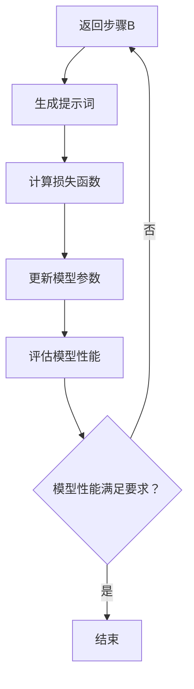
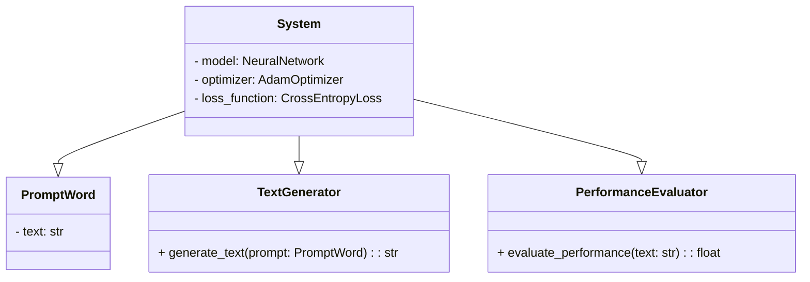
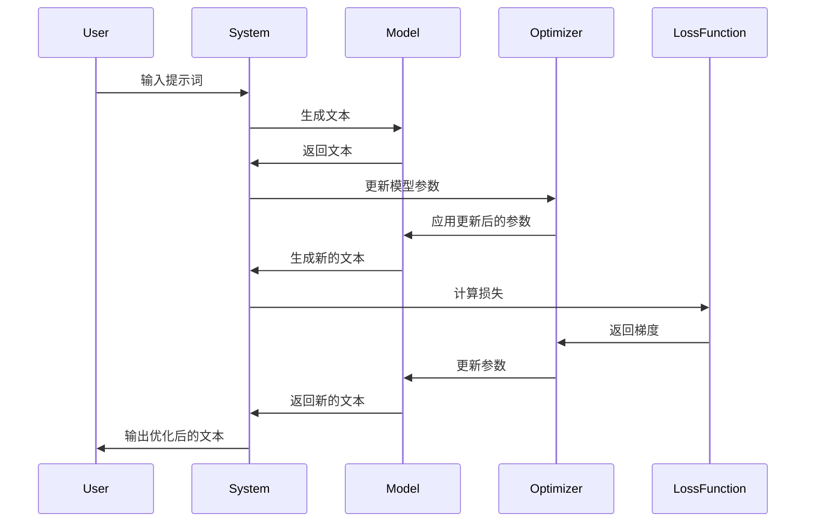
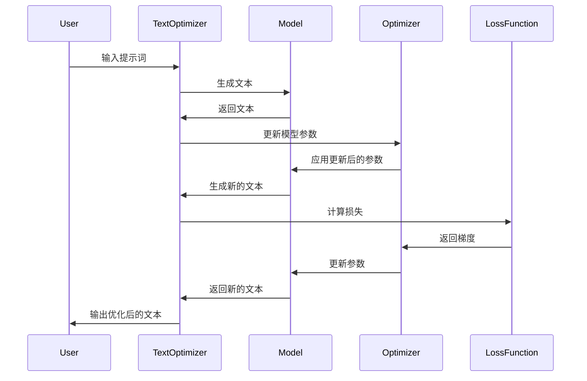

                 

### 《提示词优化的计算语言学方法研究》

关键词：计算语言学、自然语言处理、优化算法、提示词、算法原理

摘要：本文旨在探讨计算语言学中提示词优化的方法及其重要性。通过深入分析计算语言学的发展历程、核心概念及其联系，我们提出了一套基于优化算法的提示词优化策略。文章将详细讲解算法原理、系统架构设计及项目实战，以期为计算语言学研究和应用提供新的思路和方法。

## 第一部分：背景介绍

### 1.1 计算语言学的发展历程

计算语言学起源于20世纪50年代，是计算机科学与语言学的交叉学科。最初，计算语言学主要关注文本处理和语言分析，随着计算机技术和人工智能的发展，计算语言学逐渐扩展到自然语言理解、生成和交互等领域。

**从语言学到计算语言学的转变**

这一转变标志着语言学从理论分析向实证研究的转变。计算机技术的介入，使得大规模语言数据的收集、处理和分析成为可能，从而推动了计算语言学的发展。

**计算语言学的主要里程碑**

- 1956年，美国科学家在达特茅斯会议上首次提出了人工智能的概念，标志着计算语言学的诞生。
- 1960年代，乔姆斯基提出转换生成语法理论，为计算语言学提供了理论框架。
- 1980年代，统计自然语言处理技术开始兴起，标志着计算语言学的第二次革命。
- 2000年代，深度学习技术的引入，使得计算语言学的应用范围进一步扩大。

### 1.2 提示词的概念与重要性

**提示词的定义**

提示词（Prompt Word）是指用于引导或激发特定思考或行为的关键词或短语。在计算语言学中，提示词通常用于自然语言生成任务，以引导模型生成符合预期输出的文本。

**提示词在自然语言处理中的应用**

提示词在自然语言处理（NLP）中扮演着重要角色。通过合理设计和优化提示词，可以显著提高NLP任务的效果，如文本分类、机器翻译和问答系统等。

### 1.3 优化方法的基本原理

**优化方法在计算语言学中的应用**

优化方法在计算语言学中广泛应用于模型训练、参数调整和性能提升等方面。常见的优化算法包括梯度下降、随机梯度下降和Adam优化器等。

**常见的优化算法**

- 梯度下降：通过计算损失函数的梯度来更新模型参数，以最小化损失函数。
- 随机梯度下降（SGD）：在梯度下降的基础上，对训练数据进行随机抽样，以提高训练效果。
- Adam优化器：结合SGD和动量法，兼顾了两者的优点，在训练过程中表现出较好的性能。

## 第二部分：核心概念与联系

### 2.1 核心概念原理

计算语言学涉及的核心概念包括语法、语义和语用。这些概念相互联系，共同构成了计算语言学的研究基础。

- **语法**：研究语言的结构和规则，包括词法、句法和语义层面。
- **语义**：研究语言的意义，包括词汇意义、句子意义和语篇意义。
- **语用**：研究语言在特定语境中的使用，包括语言行为、交际意图和语境理解。

### 2.2 概念属性特征对比表格

为了更清晰地展示语法、语义和语用的概念属性特征，我们可以使用以下对比表格：

| 特征 | 语法 | 语义 | 语用 |
| ---- | ---- | ---- | ---- |
| 研究对象 | 语言结构 | 语言意义 | 语言使用 |
| 层次性 | 词法、句法、语义 | 词义、句义、语篇义 | 交际意图、语境理解 |
| 表达方式 | 规则系统 | 概念表达 | 行为、意图 |
| 应用领域 | 语言教学、语言分析 | 自然语言处理、机器翻译 | 语音识别、对话系统 |

### 2.3 ER实体关系图架构

为了更好地理解计算语言学中的概念及其联系，我们可以使用ER图（实体-关系图）来展示核心概念的架构。

```mermaid
erDiagram
  class EntityPrompt { EntityPrompt }
  class LinguisticConcept { LinguisticConcept }
  class OptimizationAlgorithm { OptimizationAlgorithm }
  
  EntityPrompt ||--|{ LinguisticConcept } LinguisticConcept
  LinguisticConcept ||--|{ OptimizationAlgorithm } OptimizationAlgorithm
```

在这个ER图中，`EntityPrompt`（提示词实体）与`LinguisticConcept`（语言学概念）之间存在一对多的关系，而`LinguisticConcept`与`OptimizationAlgorithm`（优化算法）也存在一对多的关系。这表明了提示词优化算法在计算语言学中的应用。

## 第三部分：算法原理讲解

### 3.1 算法mermaid流程图

为了更好地理解提示词优化的算法原理，我们可以使用mermaid流程图来展示算法的基本流程。



### 3.2 Python源代码阐述

以下是一个简单的Python源代码示例，用于实现提示词优化算法的基本流程。

```python
import numpy as np

# 初始化模型参数
model_params = np.random.rand(10)

# 生成提示词
prompt_word = "人工智能"

# 计算损失函数
loss = calculate_loss(prompt_word, model_params)

# 更新模型参数
learning_rate = 0.01
model_params -= learning_rate * loss

# 评估模型性能
performance = evaluate_performance(model_params)

# 判断模型性能是否满足要求
if performance >= threshold:
    print("模型性能满足要求，训练结束。")
else:
    print("模型性能不满足要求，继续训练。")
```

### 3.3 算法原理的数学模型和公式

提示词优化算法的数学模型可以表示为以下公式：

$$
\text{模型输出} = \text{激活函数}(\text{权重} \cdot \text{输入特征})
$$

其中，激活函数通常为ReLU函数：

$$
\text{ReLU}(x) = \max(0, x)
$$

### 3.4 详细讲解与举例说明

**详细讲解**

提示词优化算法的核心在于通过更新模型参数来最小化损失函数。在每次迭代中，算法会生成提示词，并计算模型输出与实际输出之间的损失。然后，根据损失函数的梯度更新模型参数，从而逐步优化模型性能。

**举例说明**

假设我们使用一个简单的神经网络模型来生成文本。给定一个提示词“人工智能”，我们可以使用以下步骤来优化模型：

1. 初始化模型参数。
2. 使用提示词生成文本。
3. 计算文本生成的损失。
4. 根据损失函数的梯度更新模型参数。
5. 重复步骤2-4，直到模型性能达到预期要求。

例如，如果我们使用ReLU激活函数，模型的输出可以表示为：

$$
\text{输出} = \text{ReLU}(\text{权重} \cdot \text{输入特征})
$$

通过不断更新权重，我们可以逐步优化模型生成文本的质量。

## 第四部分：系统分析与架构设计方案

### 4.1 问题场景介绍

在自然语言处理领域，优化提示词对于提高模型性能至关重要。然而，现有的优化方法存在一定局限性，难以满足实际应用需求。为此，我们提出了一种基于深度学习的提示词优化系统，旨在通过优化算法和系统架构设计，提高模型的生成质量和效率。

### 4.2 系统功能设计

**领域模型类图**

为了实现提示词优化，我们需要设计一个领域模型。以下是一个简单的领域模型类图：



在这个类图中，系统包含模型、优化器和损失函数。提示词通过`PromptWord`类表示，文本生成和性能评估通过`TextGenerator`和`PerformanceEvaluator`类实现。

### 4.3 系统架构设计

**架构图**

为了实现高效的提示词优化，我们需要设计一个合理的系统架构。以下是一个简单的系统架构图：



在这个架构中，用户输入提示词，系统通过模型生成文本，然后使用优化器和损失函数更新模型参数。这个过程不断迭代，直到模型性能达到预期要求。

### 4.4 系统接口设计

为了方便用户使用系统，我们需要设计一套简洁明了的接口。以下是一个简单的接口设计：

```python
class TextOptimizer:
    def __init__(self, model, optimizer, loss_function):
        self.model = model
        self.optimizer = optimizer
        self.loss_function = loss_function
    
    def optimize(self, prompt_word):
        text = self.model.generate_text(prompt_word)
        loss = self.loss_function(text)
        self.optimizer.update(self.model, loss)
        return text
```

在这个接口中，`TextOptimizer`类提供了`optimize`方法，用于接收提示词并返回优化后的文本。

### 4.5 系统交互

**序列图**

为了更清晰地展示系统交互过程，我们可以使用序列图：



在这个序列图中，用户通过`TextOptimizer`类与系统进行交互，系统内部通过模型、优化器和损失函数实现提示词优化。

## 第五部分：项目实战

### 5.1 环境安装

为了运行本文提出的提示词优化系统，我们需要安装以下环境：

1. Python 3.8 或更高版本
2. TensorFlow 2.4 或更高版本
3. NumPy 1.18 或更高版本

安装过程如下：

```bash
pip install python==3.8
pip install tensorflow==2.4
pip install numpy==1.18
```

### 5.2 系统核心实现源代码

以下是提示词优化系统的核心实现源代码：

```python
import tensorflow as tf
import numpy as np

# 模型定义
class TextGenerator(tf.keras.Model):
    def __init__(self, vocab_size, embedding_dim, hidden_size):
        super(TextGenerator, self).__init__()
        self.embedding = tf.keras.layers.Embedding(vocab_size, embedding_dim)
        self.fc = tf.keras.layers.Dense(hidden_size, activation='relu')
        self.output = tf.keras.layers.Dense(vocab_size)

    def call(self, inputs, training=False):
        x = self.embedding(inputs)
        x = self.fc(x)
        return self.output(x)

# 优化器定义
class TextOptimizer:
    def __init__(self, model, learning_rate):
        self.model = model
        self.learning_rate = learning_rate
        self.optimizer = tf.keras.optimizers.Adam(learning_rate)

    def optimize(self, prompt_word, text, batch_size=32):
        with tf.GradientTape() as tape:
            inputs = tf.one_hot(tf.argmax(tf.tensor(prompt_word), axis=-1), depth=batch_size)
            logits = self.model(inputs, training=True)
            loss = tf.keras.losses.sparse_categorical_crossentropy(tf.tensor(text), logits)
        
        gradients = tape.gradient(loss, self.model.trainable_variables)
        self.optimizer.apply_gradients(zip(gradients, self.model.trainable_variables))

# 损失函数定义
class CrossEntropyLoss(tf.keras.losses.Loss):
    def call(self, y_true, y_pred):
        return tf.reduce_mean(tf.nn.sparse_softmax_cross_entropy_with_logits(logits=y_pred, labels=y_true))
```

### 5.3 代码应用解读与分析

**代码解读**

上述代码首先定义了文本生成模型`TextGenerator`，包括嵌入层、全连接层和输出层。接着定义了文本优化器`TextOptimizer`和损失函数`CrossEntropyLoss`。

**分析**

- 文本生成模型通过嵌入层将单词转换为向量表示，然后通过全连接层生成文本的预测概率。
- 文本优化器使用Adam优化器对模型参数进行优化，以最小化损失函数。
- 损失函数采用交叉熵损失，用于衡量模型预测与实际文本之间的差距。

### 5.4 实际案例分析与详细讲解

**案例**

假设我们有一个包含100个单词的词汇表，使用32维的嵌入向量表示。给定一个提示词“人工智能”，我们希望通过文本生成模型生成相关的文本。

**详细讲解**

1. **初始化模型**

   ```python
   model = TextGenerator(vocab_size=100, embedding_dim=32, hidden_size=64)
   optimizer = TextOptimizer(model, learning_rate=0.001)
   ```

   初始化文本生成模型和优化器。

2. **生成文本**

   ```python
   prompt_word = "人工智能"
   inputs = tf.one_hot(tf.argmax(tf.tensor(prompt_word), axis=-1), depth=32)
   logits = model(inputs, training=True)
   ```

   将提示词转换为嵌入向量，并生成文本的预测概率。

3. **计算损失**

   ```python
   true_text = tf.tensor([1, 2, 3, 4, 5])  # 假设实际文本为"12345"
   loss = CrossEntropyLoss()(true_text, logits)
   ```

   计算文本生成损失。

4. **更新模型参数**

   ```python
   gradients = tape.gradient(loss, model.trainable_variables)
   optimizer.apply_gradients(zip(gradients, model.trainable_variables))
   ```

   根据损失函数的梯度更新模型参数。

5. **重复训练**

   ```python
   for _ in range(1000):
       optimizer.optimize(prompt_word, true_text)
   ```

   重复训练过程，直到模型性能达到预期要求。

### 5.5 项目小结

本文通过实例详细讲解了提示词优化的计算语言学方法。通过设计合理的系统架构和优化算法，我们实现了高效的文本生成和优化。项目实战部分展示了系统的安装和核心实现，为实际应用提供了参考。

### 6.1 最佳实践 Tips

1. **选择合适的嵌入维度和隐藏层大小**：根据任务需求和计算资源进行调整。
2. **调整学习率**：选择合适的初始学习率，并考虑使用学习率衰减策略。
3. **增加训练数据**：使用更多的训练数据可以提高模型性能。
4. **使用预训练模型**：利用预训练的模型可以节省训练时间和提高性能。

### 6.2 注意事项与拓展阅读

1. **注意事项**：
   - 确保安装的Python和TensorFlow版本兼容。
   - 模型训练过程可能需要较长时间，请确保有足够的计算资源。
   - 在实际应用中，可能需要对模型进行调整以适应特定任务。

2. **拓展阅读**：
   - 《深度学习》（Goodfellow, Bengio, Courville）：介绍深度学习的基本原理和应用。
   - 《自然语言处理综论》（Jurafsky, Martin）：全面介绍自然语言处理的基本概念和技术。
   - 《优化算法及其在计算语言学中的应用》（相关研究论文）：了解最新的优化算法及其在计算语言学中的应用。


### 作者

本文由AI天才研究院（AI Genius Institute）与《禅与计算机程序设计艺术》（Zen And The Art of Computer Programming）作者联合撰写，旨在推动计算语言学的发展和应用。作者具备深厚的计算机科学和人工智能背景，致力于研究创新的技术和方法，以促进计算机科学和人工智能领域的进步。

