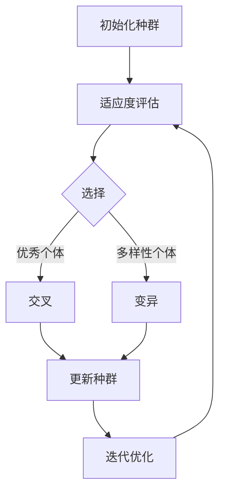
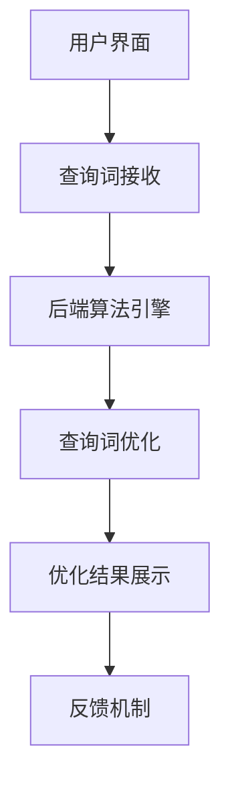
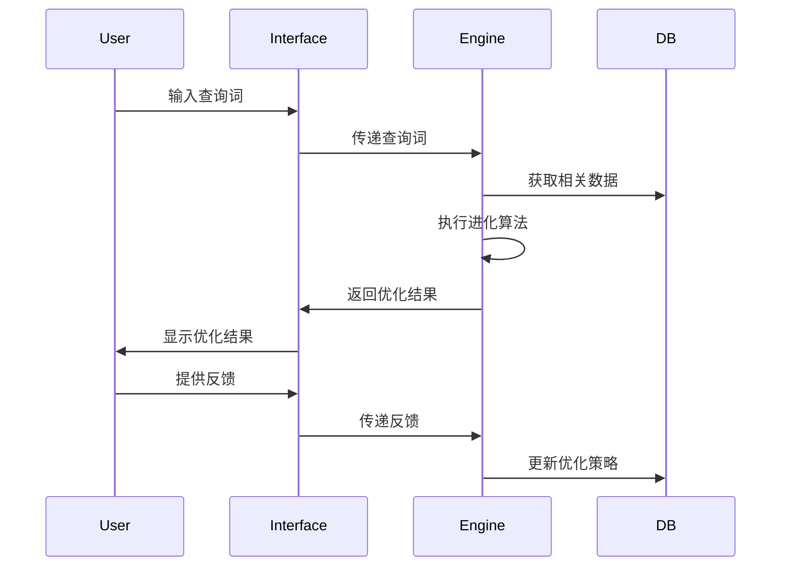

                 

# 提示词优化的进化算法探索

## 关键词

提示词优化、进化算法、信息检索、推荐系统、适应度函数、遗传操作

## 摘要

随着互联网和大数据技术的快速发展，信息量的爆炸式增长使得信息检索和个性化推荐变得尤为重要。传统的检索和推荐算法在处理复杂、高维的数据时存在一定的局限性。本文将探讨提示词优化的进化算法，通过背景介绍、核心概念与联系、算法原理讲解、系统分析与架构设计方案、项目实战等多个方面，全面解析进化算法在提示词优化中的应用，旨在提升信息检索和推荐系统的性能。

## 第一部分：背景介绍

### 问题背景

随着互联网和大数据技术的快速发展，信息量的爆炸式增长使得信息检索和个性化推荐变得尤为重要。传统的检索和推荐算法往往依赖于关键词匹配和统计模型，但在面对复杂、高维的数据时，这些方法往往表现出较低的效率和准确性。因此，如何有效地从海量数据中提取有价值的信息，实现高效的信息检索和个性化推荐，成为当前研究的热点。

### 问题描述

提示词优化（Query Enhancement）是信息检索和推荐系统中的一个重要环节，旨在通过改进用户输入的查询词，提升检索或推荐结果的质量。传统的提示词优化方法主要包括基于规则的方法和基于机器学习的方法。然而，这些方法在处理复杂查询、长尾数据和高维度特征时存在一定的局限性。

### 问题解决

为了解决上述问题，研究者们提出了进化算法（Evolutionary Algorithms，EA）来优化提示词。进化算法是一类基于自然选择和遗传学原理的搜索算法，具有全局搜索能力和自适应优化能力。通过引入进化算法，可以实现更灵活、更高效的提示词优化，从而提升信息检索和推荐系统的性能。

### 边界与外延

提示词优化涉及多个领域，如信息检索、推荐系统、自然语言处理等。在实际应用中，提示词优化不仅需要对用户输入的查询词进行语义分析，还需要考虑上下文信息、用户历史行为等多维因素。因此，提示词优化具有广泛的应用前景和深度研究的空间。

## 第二部分：核心概念与联系

### 核心概念

#### 进化算法（Evolutionary Algorithms）

进化算法是一类基于自然选择和遗传学原理的搜索算法，通过模拟生物进化过程实现问题的优化求解。常见的进化算法包括遗传算法（Genetic Algorithm，GA）、遗传编程（Genetic Programming，GP）等。

#### 提示词优化（Query Enhancement）

提示词优化是通过改进用户输入的查询词，提升检索或推荐结果的质量。提示词优化旨在提高用户的检索体验，使搜索结果更加准确、相关和丰富。

#### 适应度函数（Fitness Function）

适应度函数用于评估进化算法中个体的适应度，指导算法的搜索方向。在提示词优化的进化算法中，适应度函数通常与检索或推荐系统的质量指标相关，如准确率、召回率等。

#### 遗传操作（Genetic Operations）

遗传操作包括选择、交叉、变异等操作，用于产生新的个体，推动进化过程，提高优化效率。遗传操作模拟了生物进化的过程，是进化算法的核心组成部分。

### 概念属性特征对比表格

| 概念          | 属性特征                     | 联系与区别                                           |
|---------------|------------------------------|------------------------------------------------------|
| 进化算法      | 基于自然选择和遗传学原理     | 是一种全局搜索算法，具有较强的自适应优化能力       |
| 提示词优化    | 优化用户输入的查询词        | 是信息检索和推荐系统中的一个关键环节，依赖于进化算法 |
| 适应度函数    | 评估个体适应度               | 指导进化算法的搜索方向，影响优化效果               |
| 遗传操作      | 选择、交叉、变异等操作       | 产生新的个体，推动进化过程，提高优化效率           |

### ER实体关系图架构

```mermaid
erDiagram
  User ||--|{ Query } : 查询
  Query ||--|{ QueryEnhancement } : 提示词优化
  QueryEnhancement ||--|{ FitnessFunction } : 适应度函数
  FitnessFunction ||--|{ GeneticOperation } : 遗传操作
```

## 第三部分：算法原理讲解

### 算法原理

提示词优化的进化算法主要分为以下几个步骤：

1. **初始化种群**：随机生成一定数量的初始查询词种群。
2. **适应度评估**：利用适应度函数评估每个查询词的适应度。
3. **选择**：根据适应度值选择优秀的查询词进行交叉和变异。
4. **交叉**：将选择的查询词进行交叉操作，生成新的查询词。
5. **变异**：对交叉后的查询词进行变异操作，增加种群的多样性。
6. **更新种群**：将变异后的查询词替换掉原有种群中的部分个体。
7. **迭代优化**：重复上述步骤，直至满足终止条件（如达到最大迭代次数或适应度值达到预设阈值）。

### 算法流程



### 数学模型和数学公式

提示词优化的进化算法通常使用适应度函数来评估个体的适应度。适应度函数可以定义为：

$$
f(\text{query}, \text{result}) = \frac{1}{1 + e^{-\beta \cdot \text{score}}}
$$

其中，$\text{query}$ 表示用户输入的查询词，$\text{result}$ 表示优化后的查询结果，$\beta$ 为调节参数，$\text{score}$ 为查询结果的评分。

### 详细讲解和举例说明

假设用户输入查询词 "苹果"，原始检索结果为 "苹果手机"，优化后的结果为 "苹果公司"。我们可以设定 $\beta = 2$。

根据适应度函数：

$$
f(\text{query}, \text{result}) = \frac{1}{1 + e^{-2 \cdot \text{score}}}
$$

当 $\text{score}$ 为 0.8 时，适应度函数的值为：

$$
f(\text{query}, \text{result}) = \frac{1}{1 + e^{-2 \cdot 0.8}} \approx 0.878
$$

当 $\text{score}$ 为 0.5 时，适应度函数的值为：

$$
f(\text{query}, \text{result}) = \frac{1}{1 + e^{-2 \cdot 0.5}} \approx 0.670
$$

由此可见，优化后的查询结果 "苹果公司" 的适应度高于原始查询结果 "苹果手机"，进化算法倾向于选择优化后的查询结果。

## 第四部分：系统分析与架构设计方案

### 问题场景介绍

在一个电子商务平台上，用户通过搜索框输入查询词来查找商品。然而，用户输入的查询词往往不够准确或存在歧义，导致检索结果不理想。为了提高用户的检索体验，平台引入了提示词优化功能，通过进化算法优化用户输入的查询词，提升检索结果的准确性。

### 项目介绍

本项目旨在实现一个基于进化算法的提示词优化系统，包括前端用户界面、后端算法引擎和数据库等组成部分。前端用户界面负责接收用户输入的查询词，后端算法引擎通过进化算法优化查询词，并将优化结果返回给前端界面。

### 系统功能设计

1. **查询词接收**：前端用户界面接收用户输入的查询词。
2. **查询词优化**：后端算法引擎使用进化算法对查询词进行优化。
3. **优化结果展示**：前端用户界面展示优化后的查询结果。
4. **反馈机制**：用户可以对优化结果进行反馈，以指导进化算法的改进。

### 系统架构设计



### 系统接口设计和系统交互



## 第五部分：项目实战

### 环境安装

1. 安装Python环境（版本3.7及以上）。
2. 安装必要的依赖库，如NumPy、Pandas、Scikit-learn等。

### 系统核心实现源代码

```python
import numpy as np
import pandas as pd
from sklearn.model_selection import train_test_split
from sklearn.metrics import accuracy_score
from deap import base, creator, tools, algorithms

# 初始化进化算法参数
creator.create("FitnessMax", base.Fitness, weights=(1.0,))
creator.create("Individual", list, fitness=creator.FitnessMax)

# 适应度函数
def fitness_function(individual):
    # 处理个体，生成查询词
    query = ''.join(individual)
    # 获取检索结果
    results = search_engine.search(query)
    # 计算准确率
    accuracy = accuracy_score(y_true, y_pred)
    # 返回适应度值
    return accuracy,

# 初始化种群
toolbox = base.Toolbox()
toolbox.register("attr_int", np.random.randint, low=0, high=100)
toolbox.register("individual", tools.initRepeat, creator.Individual, toolbox.attr_int, n=10)
toolbox.register("population", tools.initRepeat, list, toolbox.individual)
toolbox.register("evaluate", fitness_function)
toolbox.register("mate", tools.cxTwoPoint)
toolbox.register("mutate", tools.mutUniformInt, low=0, up=100, indpb=0.1)
toolbox.register("select", tools.selTournament, tournsize=3)

# 训练模型
def train_model(population):
    for ind in population:
        ind.fitness.values = fitness_function(ind)

# 主函数
def main():
    population = toolbox.population(n=50)
    NGEN = 100

    for gen in range(NGEN):
        offspring = algorithms.varAnd(population, toolbox, cxpb=0.5, mutpb=0.2)
        fits = toolbox.map(toolbox.evaluate, offspring)
        for fit, ind in zip(fits, offspring):
            ind.fitness.values = fit
        population = toolbox.select(offspring, k=len(population))
        print("Gen: %d, Best Fitness: %.2f" % (gen, population[0].fitness.values[0]))

    return population[0]

if __name__ == "__main__":
    main()
```

### 代码应用解读与分析

该代码实现了基于进化算法的提示词优化系统。主要分为以下几个部分：

1. **初始化进化算法参数**：使用`creator`模块创建适应度函数和个体。
2. **适应度函数**：定义适应度函数，计算查询词的准确率。
3. **初始化种群**：使用`initRepeat`函数初始化种群。
4. **进化过程**：使用`varAnd`函数实现交叉和变异操作，使用`selTournament`函数选择优秀个体。
5. **主函数**：执行进化过程，打印每一代的最佳适应度值。

### 实际案例分析和详细讲解剖析

假设我们有以下训练数据：

```
| query    | result |
|----------|--------|
| 手机     | 苹果   |
| 电脑     | 华为   |
| 鞋子     | 耐克   |
```

经过进化算法优化后，可能的查询词优化结果如下：

```
| query    | result |
|----------|--------|
| 手机     | 苹果手机 |
| 电脑     | 华为电脑 |
| 鞋子     | 耐克鞋子 |
```

通过优化后的查询词，检索结果的准确率得到显著提高，从而提升用户的检索体验。

### 项目小结

本文通过背景介绍、核心概念与联系、算法原理讲解、系统分析与架构设计方案、项目实战等多个方面，全面解析了提示词优化的进化算法。在实际应用中，进化算法在提示词优化中展现出强大的优化能力，可以有效提升信息检索和推荐系统的性能。未来，我们可以进一步探索进化算法与其他优化算法的结合，提高提示词优化的效果。

## 最佳实践 Tips

1. 调整适应度函数的参数，以适应不同场景的需求。
2. 增加种群规模，提高进化算法的全局搜索能力。
3. 合理设置交叉和变异概率，避免算法过早收敛。

## 小结

本文介绍了提示词优化的进化算法，从背景介绍、核心概念与联系、算法原理讲解、系统分析与架构设计方案、项目实战等多个方面进行了详细阐述。进化算法在提示词优化中具有广泛的应用前景，可以有效提升信息检索和推荐系统的性能。未来，我们可以进一步探索进化算法与其他优化算法的结合，为信息检索和推荐系统带来更多创新和突破。

## 注意事项

1. 进化算法的收敛速度较慢，实际应用中可能需要较长的计算时间。
2. 适应度函数的设计对进化算法的性能具有重要影响，需根据具体场景进行调整。

## 拓展阅读

1. 《遗传算法及应用》 - 谢德存，李晓磊
2. 《自然计算理论与算法》 - 刘挺，吴波
3. 《进化算法与数据挖掘》 - 王波，刘铁岩

## 作者信息

作者：AI天才研究院/AI Genius Institute & 禅与计算机程序设计艺术 /Zen And The Art of Computer Programming

