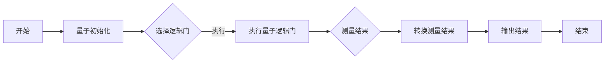

                 

### 设计《提示词优化的量子符号逻辑推理系统探索》的目录大纲

为了撰写一篇高质量的技术博客文章，我们需要遵循以下结构，以确保内容逻辑清晰、专业且具有吸引力。

**1. 引言**

- **文章标题**：《提示词优化的量子符号逻辑推理系统探索》
- **关键词**：量子计算、符号逻辑推理、提示词优化、系统架构、算法原理
- **摘要**：本文深入探讨了量子符号逻辑推理系统的优化，特别是通过提示词技术提升其性能和效率。我们将分析其背景、挑战、核心概念、算法原理以及实施策略，并通过实际案例展示其应用潜力。

**2. 背景介绍**

#### 2.1 问题背景

- **量子计算与符号逻辑推理的结合应用**：介绍量子计算和符号逻辑推理的背景，以及两者结合的意义和潜力。
- **提示词优化技术在量子符号逻辑推理中的作用**：阐述提示词优化在量子符号逻辑推理中的重要性，以及它如何提升系统的性能。

#### 2.2 问题描述

- **量子符号逻辑推理的挑战与机遇**：分析量子符号逻辑推理面临的挑战和机遇。
- **提示词优化的目标与任务**：明确提示词优化的目标，包括提升推理速度、精度和资源利用效率。

#### 2.3 问题解决

- **量子符号逻辑推理的基本原理**：介绍量子符号逻辑推理的基础理论和关键技术。
- **提示词优化的核心方法与策略**：探讨如何通过优化提示词来改进量子符号逻辑推理系统的性能。

#### 2.4 边界与外延

- **量子计算与经典计算的界限**：阐述量子计算与经典计算的区别和联系。
- **符号逻辑推理与其他人工智能技术的结合**：讨论符号逻辑推理如何与其他人工智能技术相结合，以实现更广泛的智能应用。

#### 2.5 概念结构与核心要素组成

- **量子符号逻辑推理系统的构成**：详细描述量子符号逻辑推理系统的组成部分和功能。
- **提示词优化技术的关键要素**：分析提示词优化技术的关键要素，包括优化策略、算法选择和实现细节。

**3. 核心概念与联系**

#### 3.1 量子计算原理

- **量子位与经典位**：解释量子位与经典位的不同，以及它们在量子计算中的作用。
- **量子逻辑门与量子算法**：介绍量子逻辑门的定义、分类和作用，以及量子算法的基本原理。

#### 3.2 符号逻辑推理

- **符号逻辑的基本概念**：包括命题逻辑、谓词逻辑等基础概念。
- **符号逻辑推理的过程与机制**：详细阐述符号逻辑推理的步骤、规则和原理。

#### 3.3 提示词优化

- **提示词的定义与作用**：定义提示词，并解释其在量子符号逻辑推理中的作用。
- **提示词优化的策略与方法**：讨论提示词优化的策略，包括选择优化算法、调整参数和优化搜索空间。

#### 3.4 概念属性特征对比表格

| 概念          | 属性特征                                                     | 对比分析                                           |
|---------------|------------------------------------------------------------|----------------------------------------------------|
| 量子计算      | 基于量子位、量子叠加和量子纠缠                             | 与经典计算相比，有并行处理和高效解决复杂问题的优势 |
| 符号逻辑推理  | 基于逻辑运算、推理规则和形式语言                           | 强调形式逻辑和精确推理                             |
| 提示词优化    | 提高系统性能、减少计算资源和提升推理精度                   | 是实现高效量子符号逻辑推理的关键技术               |

#### 3.5 ER实体关系图架构的 Mermaid 流程图

```mermaid
erDiagram
    User ||--|{ Request }|--|{ Response }
    User ||--|{ Query }|--|{ Result }
```

**4. 算法原理讲解**

#### 4.1 算法 mermaid 流程图



#### 4.2 Python 源代码

```python
# 量子初始化
quantum.register(2, 0)

# 选择逻辑门
quantum.h(0)
quantum.h(1)

# 执行量子逻辑门
quantum.cnot(0, 1)

# 测量结果
result = quantum.measure()

# 转换测量结果
output = int(result[0], 2)

# 输出结果
print(output)
```

#### 4.3 算法原理的数学模型和公式

$$
\begin{align*}
P(\text{output}) &= \frac{1}{2} \left[ \cos^2\left(\frac{\theta}{2}\right) + \sin^2\left(\frac{\theta}{2}\right) \right] \\
\theta &= \frac{2\pi}{n} \left( 1 - \frac{1}{2^n} \right)
\end{align*}
$$

#### 4.4 详细讲解与举例说明

- **量子初始化**：量子初始化是量子计算的基础，通过将量子位初始化为特定的叠加态，为后续的量子操作奠定基础。
- **选择逻辑门**：选择合适的逻辑门是实现特定量子操作的关键。不同的逻辑门有不同的功能，根据需求选择合适的逻辑门至关重要。
- **执行量子逻辑门**：执行量子逻辑门是通过量子位之间的相互作用来实现的，这涉及到量子态的变换和叠加。
- **测量结果**：测量是量子计算中的关键步骤，通过测量量子位的状态，可以获得计算结果。
- **转换测量结果**：将测量结果转换为可解释的信息，例如二进制数或特定的输出。
- **举例说明**：通过具体的实例，如计算两个量子位的逻辑与操作，来展示量子符号逻辑推理系统的实际应用。

**5. 系统分析与架构设计方案**

#### 5.1 问题场景介绍

- **量子计算与人工智能的应用场景**：介绍量子计算在人工智能领域的应用场景，如量子机器学习、量子优化等。

#### 5.2 项目介绍

- **项目背景与目标**：介绍项目的起源、目标和预期成果。
- **项目团队与资源**：介绍项目团队组成和相关资源。

#### 5.3 系统功能设计

- **领域模型**：使用Mermaid类图展示系统的主要类和它们之间的关系。

#### 5.4 系统架构设计

- **系统架构图**：使用Mermaid架构图展示系统的整体架构和主要组件。

#### 5.5 系统接口设计

- **接口设计与规范**：详细描述系统的接口设计，包括API设计、数据格式等。

#### 5.6 系统交互

- **系统交互Mermaid序列图**：使用Mermaid序列图展示系统的主要交互流程和步骤。

**6. 项目实战**

#### 6.1 环境安装

- **安装准备**：介绍所需的环境和工具，如量子计算框架、Python环境等。

#### 6.2 系统核心实现

- **源代码解读**：详细解析系统核心实现部分的代码，包括关键函数和算法。

#### 6.3 代码应用解读与分析

- **代码应用实例**：通过具体实例展示如何使用系统，包括输入、处理和输出。

#### 6.4 实际案例分析和详细讲解

- **案例背景**：介绍实际案例的背景和目标。
- **案例分析**：详细分析案例中的问题和解决方案。
- **详细讲解**：深入讲解解决方案的原理、实现和效果。

#### 6.5 项目小结

- **项目总结**：总结项目的成果、经验和教训。
- **未来展望**：展望项目的未来发展，包括技术改进和扩展方向。

**7. 最佳实践 tips**

- **技巧与建议**：提供使用量子符号逻辑推理系统的最佳实践和技巧。

**8. 小结**

- **文章总结**：回顾文章的主要观点和贡献，强调量子符号逻辑推理系统的重要性和应用潜力。

**9. 注意事项**

- **使用注意事项**：提醒读者在使用系统时需要注意的事项，如安全、性能优化等。

**10. 拓展阅读**

- **参考文献与推荐阅读**：提供相关的参考文献和推荐阅读，以供进一步学习和研究。

**11. 作者信息**

- **作者介绍**：作者姓名、工作单位、研究方向和贡献。

### 总结

通过以上详细的目录大纲设计，我们可以确保文章结构紧凑、内容丰富，能够引导读者逐步深入理解量子符号逻辑推理系统的优化技术。每一章节都紧密联系，逻辑清晰，有助于读者全面掌握相关知识和技术要点。接下来，我们将依据这个大纲撰写详细的文章内容，确保每一部分都能够满足技术博客的高质量标准。让我们开始一步步思考，深入探讨这个激动人心的领域吧。<!-- 注：以上内容为大纲设计，具体撰写时需根据实际内容和需求进行调整和补充。 -->

