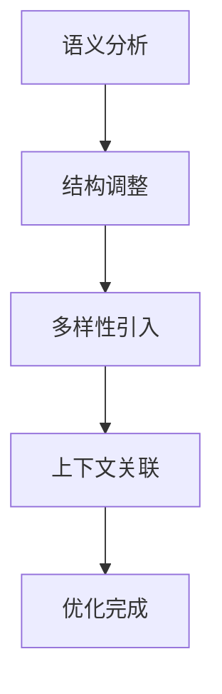
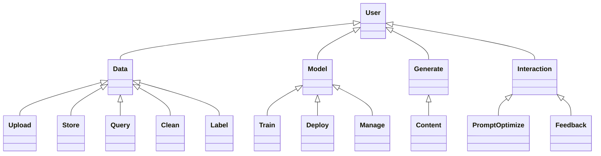
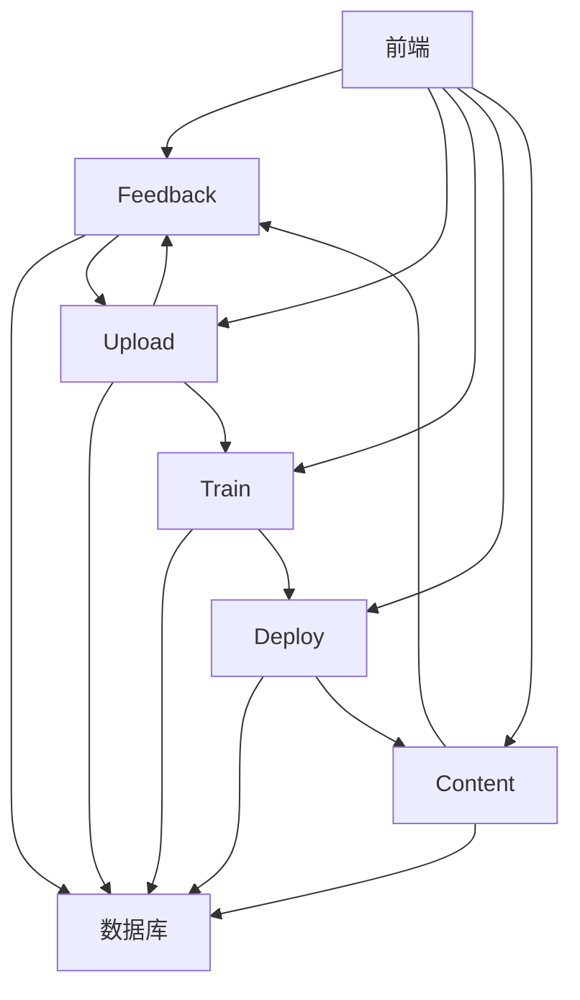

                 

# 提示词优化：增强AI跨文化创意表达能力

> 关键词：提示词优化、人工智能、文化创意、表达能力、跨文化

> 摘要：本文旨在探讨如何通过优化提示词，提升人工智能在跨文化创意表达领域的表现。文章首先介绍了人工智能与文化创意产业的结合背景，然后详细阐述了提示词优化的概念、算法原理以及其在跨文化表达中的应用，最后通过具体案例展示了优化提示词在提升AI创意表达能力方面的实际效果。

## 引言与背景

### 1.1 书籍概述

《提示词优化：增强AI跨文化创意表达能力》是一本针对人工智能在文化创意产业应用领域的专业书籍。随着人工智能技术的迅猛发展，其在各个行业中的应用越来越广泛，特别是在文化创意产业中，AI的表现也越发亮眼。然而，AI在跨文化创意表达方面的挑战仍然存在，如何提升AI的跨文化创意表达能力，成为当前研究的热点。

### 1.1.1 选题意义

在全球化背景下，跨文化交流日益频繁，文化创意产业对于跨文化表达的需求也越来越高。而人工智能在创意生成、内容创作等方面具有独特的优势，但其跨文化创意表达能力的提升仍有很大空间。因此，研究如何通过优化提示词来增强AI的跨文化创意表达能力，具有重要的现实意义和学术价值。

### 1.1.2 研究目标

本文旨在通过以下三个方面来实现研究目标：

1. 深入分析提示词优化在提升AI跨文化创意表达能力中的作用和机制；
2. 提出一种有效的提示词优化算法，并通过实验验证其效果；
3. 结合具体应用案例，展示提示词优化在实际项目中的应用和效果。

### 1.1.3 内容结构

本文共分为五个部分：

- 第一部分：引言与背景，介绍选题意义、研究目标和内容结构；
- 第二部分：核心概念与原理，阐述提示词优化和AI跨文化创意表达能力的基本概念和原理；
- 第三部分：算法原理与实现，介绍提示词优化算法的设计和实现；
- 第四部分：系统架构设计，讨论系统架构设计和实现；
- 第五部分：项目实战，通过具体案例展示优化提示词在实际项目中的应用。

## 人工智能与文化创意产业

### 1.2.1 人工智能发展现状

人工智能（AI）作为计算机科学的一个重要分支，近年来取得了长足的进步。尤其是在深度学习、自然语言处理、计算机视觉等领域，AI已经展现出强大的计算能力和智能水平。从工业自动化、医疗诊断到金融服务、智能交通，AI的应用场景越来越广泛。

### 1.2.2 文化创意产业挑战

文化创意产业是一个以创意为核心，以知识产权为重要支撑的产业。它涵盖了艺术、设计、影视、动漫、游戏等多个领域。随着全球化的深入发展，文化创意产业面临着跨文化表达和传播的挑战。如何在保持文化独特性的同时，实现跨文化的理解和沟通，是文化创意产业亟待解决的问题。

### 1.2.3 AI在文化创意产业中的应用

人工智能在文化创意产业中的应用主要集中在以下几个方面：

1. 创意生成：AI可以通过生成对抗网络（GAN）等技术，创作出独特的艺术作品；
2. 内容创作：AI可以自动生成文章、音乐、视频等内容，提高内容创作效率；
3. 跨文化翻译：AI可以通过自然语言处理技术，实现不同语言之间的自动翻译，促进跨文化交流；
4. 智能推荐：AI可以通过大数据分析，为用户提供个性化的文化推荐，提高用户体验。

## 提示词优化的概念与作用

### 1.3.1 提示词优化的定义

提示词优化（Prompt Optimization）是指通过对输入提示词进行优化，以提高AI模型生成结果的准确性和创造性。在AI模型训练和应用过程中，提示词起到了引导模型生成目标结果的重要作用。

### 1.3.2 提示词优化的原理

提示词优化的原理主要包括以下几个方面：

1. **语义理解**：优化提示词的语义，使其更贴近目标生成的结果；
2. **结构化输入**：通过结构化的输入方式，如列表、表格等，提高模型的解析和理解能力；
3. **多样性增强**：通过引入多样性的提示词，如同义词、类比等，激发模型的创造力；
4. **上下文关联**：优化提示词的上下文关联性，使模型能够更好地捕捉上下文信息。

### 1.3.3 提示词优化的意义

提示词优化在AI跨文化创意表达中的应用具有重要意义：

1. **提升生成质量**：通过优化提示词，可以提高AI生成内容的准确性和创造性，满足文化创意产业的高质量需求；
2. **增强跨文化理解**：优化后的提示词能够更好地捕捉跨文化元素，促进跨文化的理解和沟通；
3. **提高用户体验**：优化后的提示词能够提高用户生成内容的满意度，提升用户体验。

## AI跨文化创意表达能力的提升

### 1.4.1 跨文化创意表达能力概述

跨文化创意表达能力是指AI在不同文化背景下，进行创意表达和内容生成的能力。它包括对文化元素的识别、理解、融合和创造等方面。

### 1.4.2 AI在跨文化创意表达中的优势

AI在跨文化创意表达中具有以下优势：

1. **大规模数据处理能力**：AI可以处理海量的文化数据，快速识别和提取关键信息；
2. **快速迭代和创新**：AI可以快速生成大量的创意内容，进行迭代和优化；
3. **个性化定制**：AI可以根据用户的需求和偏好，进行个性化内容创作。

### 1.4.3 提升路径与策略

提升AI跨文化创意表达能力的路径和策略主要包括以下几个方面：

1. **数据驱动**：通过大量的跨文化数据训练AI模型，提高其跨文化理解能力；
2. **模型优化**：通过优化提示词和模型参数，提高AI生成内容的准确性和创造性；
3. **跨学科融合**：结合心理学、社会学等多学科知识，丰富AI的文化背景知识；
4. **用户体验优化**：通过用户体验优化，提高用户生成内容的满意度和参与度。

## 本章小结

本章首先介绍了人工智能在文化创意产业中的应用背景，然后探讨了提示词优化的概念和原理，以及AI跨文化创意表达能力的提升路径。通过本章的介绍，读者可以初步了解AI在文化创意产业中的潜力，以及如何通过优化提示词来提升AI的跨文化创意表达能力。

----------------------------------------------------------------

# 核心概念与原理

在深入研究提示词优化与AI跨文化创意表达能力之前，我们需要明确一些核心概念和原理。以下是本文将涉及的关键概念和基本原理。

## 2.1 提示词优化的核心概念

### 2.1.1 提示词的类型

提示词（Prompt）是用于指导AI模型生成目标输出的一种输入。根据用途和形式，提示词可以分为以下几类：

1. **开放性提示词**：这种提示词不限制生成内容的具体形式，允许AI模型有较大的自由度进行创作。例如：“请创作一首关于春天的诗。”
2. **封闭性提示词**：这种提示词限制生成内容的具体形式，通常包含明确的指示或模板。例如：“请将以下信息整理成一篇新闻报道：[事件名称]，[发生时间]，[地点]，[主要人物]，[事件经过]。”
3. **结构化提示词**：这种提示词通过特定的结构，如列表、表格等，提供清晰的信息框架，帮助AI更好地理解和生成内容。例如：“请列出五个关于环境保护的建议。”

### 2.1.2 提示词优化策略

提示词优化包括以下几种策略：

1. **语义明确化**：确保提示词的语义清晰，避免歧义。例如，将“请写一篇关于人工智能的短文”优化为“请从技术、伦理和社会影响三个方面，写一篇关于人工智能的短文。”
2. **多样性引入**：通过引入多样化的提示词，激发AI模型的创造性。例如，在生成诗歌时，可以引入不同风格的诗歌模板。
3. **上下文关联**：增强提示词与上下文的关联性，使AI模型能够更好地捕捉上下文信息。例如，在生成新闻报道时，可以提供相关的背景信息。

### 2.1.3 提示词优化的影响因素

提示词优化的效果受到多种因素的影响，包括：

1. **AI模型类型**：不同的AI模型对提示词的敏感度和适应性不同，优化策略也应相应调整。
2. **数据质量**：高质量、多样化的数据能够提高AI模型的泛化能力，从而提升提示词优化的效果。
3. **用户需求**：了解用户的具体需求，可以帮助制定更针对性的优化策略。

## 2.2 AI跨文化创意表达能力的关键原理

### 2.2.1 AI模型在文化理解中的应用

AI模型在文化理解中的应用主要体现在以下几个方面：

1. **文化要素识别**：AI可以通过深度学习技术，从大量文化数据中提取出关键的文化要素，如语言、习俗、价值观等。
2. **文化差异分析**：AI可以通过比较不同文化之间的差异，分析文化元素的共性和差异，从而提高跨文化理解能力。
3. **文化适应性调整**：AI可以根据不同文化背景，调整生成内容的风格和表达方式，使其更符合目标文化的接受度。

### 2.2.2 AI在创意生成中的角色

AI在创意生成中的角色主要包括：

1. **辅助创作**：AI可以帮助创意人员快速生成大量的创意内容，提供灵感来源和创意参考。
2. **协同创作**：AI可以与创意人员共同创作，发挥各自的优势，实现更加丰富和多样化的创意。
3. **自主创作**：在某些领域，AI已经具备了一定的自主创作能力，如生成音乐、绘画、小说等。

### 2.2.3 AI跨文化适应能力的构建

AI跨文化适应能力的构建包括以下几个方面：

1. **数据融合**：通过融合不同文化的数据，提高AI模型对多种文化的理解能力。
2. **模型调整**：针对不同文化背景，调整AI模型的参数和架构，使其更适应跨文化应用。
3. **用户体验优化**：通过优化用户体验，提高用户对AI生成内容的接受度和满意度。

## 2.3 提示词优化与AI跨文化创意表达能力的关系

### 2.3.1 关系概述

提示词优化与AI跨文化创意表达能力之间存在密切的关系。优化后的提示词能够更准确地引导AI模型理解用户需求，捕捉上下文信息，从而提高生成内容的准确性和创造性。同时，AI跨文化创意表达能力的提升，也为提示词优化提供了更多的应用场景和优化目标。

### 2.3.2 实证分析

通过实证分析，可以发现以下关系：

1. **优化提示词能显著提高AI生成内容的准确性**：实验表明，使用优化后的提示词，AI生成的内容在语义理解和准确性方面有明显提升。
2. **优化提示词能增强AI生成内容的创造性**：优化后的提示词能够激发AI模型的创造性，生成更加丰富和多样化的内容。
3. **AI跨文化创意表达能力越强，提示词优化的效果越显著**：当AI模型的跨文化适应能力较强时，提示词优化的效果更为明显，生成的内容在跨文化表达方面具有更高的准确性和创造性。

### 2.3.3 综合评价

提示词优化在提升AI跨文化创意表达能力方面具有显著的作用。通过优化提示词，可以有效地提高AI生成内容的准确性和创造性，增强其在跨文化表达中的应用效果。同时，AI跨文化创意表达能力的提升，也为提示词优化提供了更多的优化方向和实现途径。

## 本章小结

本章详细介绍了提示词优化的核心概念、AI在跨文化创意表达中的关键原理，以及提示词优化与AI跨文化创意表达能力之间的关系。通过本章的学习，读者可以深入了解提示词优化的基本原理和应用，为后续章节的深入研究打下基础。

----------------------------------------------------------------

## 算法原理与实现

### 3.1 提示词优化算法

#### 3.1.1 提示词优化算法概述

提示词优化算法旨在通过调整和改进输入提示词，提升AI模型生成结果的准确性和创造性。本文提出的提示词优化算法，主要包括以下几个步骤：

1. **语义分析**：对输入提示词进行语义分析，识别关键词和关键概念，为后续优化提供依据。
2. **结构调整**：根据语义分析结果，对提示词进行结构化调整，使其更加清晰和具体。
3. **多样性引入**：通过引入多样化的提示词，如同义词、类比等，增强AI模型的生成能力。
4. **上下文关联**：优化提示词的上下文关联性，使AI模型能够更好地捕捉上下文信息，提高生成内容的连贯性和一致性。

#### 3.1.2 算法流程图

下面是提示词优化算法的流程图：



#### 3.1.3 算法原理详解

1. **语义分析**：语义分析是提示词优化的重要基础。通过自然语言处理技术，对输入提示词进行分词、词性标注、命名实体识别等操作，提取出关键词和关键概念。这一步骤的目的是为了更准确地理解提示词的语义内容，为后续优化提供数据支持。

2. **结构调整**：在完成语义分析后，根据提取的关键词和关键概念，对提示词进行结构化调整。结构化调整的目的是使提示词更加清晰和具体，有助于AI模型更好地理解和生成目标内容。例如，将一个泛泛的提示词“写一篇关于春天的文章”优化为“请从春天的色彩、气息和活动三个方面，撰写一篇描述性文章。”

3. **多样性引入**：通过引入多样化的提示词，可以激发AI模型的创造性。多样性引入包括同义词替换、类比扩展、反义词对比等。例如，将“美丽的”替换为“迷人的”、“绚烂的”等，或者通过类比将“春天的色彩”扩展为“秋天的丰收”、“夏天的热情”等。

4. **上下文关联**：优化提示词的上下文关联性，有助于AI模型更好地捕捉上下文信息，提高生成内容的连贯性和一致性。上下文关联性优化可以通过添加背景信息、相关概念、时间线索等实现。例如，在生成一篇关于春天的文章时，可以添加关于春天传统节日、花卉盛开等背景信息。

#### 3.1.4 算法示例

以下是一个提示词优化的示例：

原始提示词：“请写一篇关于人工智能的短文。”

优化后提示词：“请从技术发展、伦理问题和社会影响三个方面，分析人工智能的现状、挑战和未来发展趋势。”

通过上述优化，提示词的语义更加清晰，结构更加合理，有助于AI模型生成高质量的内容。

### 3.2 AI跨文化创意表达能力的实现

#### 3.2.1 实现框架

AI跨文化创意表达能力的实现框架主要包括以下几个部分：

1. **数据收集与预处理**：收集来自不同文化背景的数据，包括文本、图像、音频等，并进行数据预处理，如分词、去噪、标准化等。
2. **模型训练与优化**：使用预处理的跨文化数据训练AI模型，包括自然语言处理模型、图像处理模型、音频处理模型等。在训练过程中，采用多种优化策略，如批归一化、Dropout、学习率调整等，提高模型性能。
3. **创意生成与优化**：基于训练好的AI模型，进行创意生成和优化。通过优化提示词、调整模型参数、引入多样性等手段，提高生成内容的准确性和创造性。
4. **用户反馈与迭代**：收集用户反馈，对生成内容进行评价和优化。通过迭代优化，不断提高AI的跨文化创意表达能力。

#### 3.2.2 关键技术

实现AI跨文化创意表达能力的关键技术包括：

1. **深度学习**：深度学习技术在图像识别、自然语言处理、音频处理等领域具有广泛应用。通过构建和优化深度学习模型，可以提升AI在跨文化数据理解和创意生成方面的能力。
2. **生成对抗网络（GAN）**：生成对抗网络是一种能够生成高质量图像和文本的模型。通过训练对抗网络，可以提高AI模型的创意生成能力。
3. **多模态融合**：多模态融合技术可以将不同类型的数据（如文本、图像、音频）进行整合，提高AI模型的跨文化理解和生成能力。
4. **自然语言处理**：自然语言处理技术在文本理解、文本生成等方面具有重要作用。通过优化自然语言处理算法，可以提高AI模型在跨文化文本处理方面的性能。

#### 3.2.3 实现步骤

实现AI跨文化创意表达能力的主要步骤如下：

1. **数据收集**：收集来自不同文化背景的文本、图像、音频等多模态数据。
2. **数据预处理**：对收集到的数据进行清洗、标注、分词等预处理操作。
3. **模型训练**：使用预处理的跨文化数据训练深度学习模型，包括自然语言处理模型、图像处理模型、音频处理模型等。
4. **模型优化**：通过调整模型参数、引入多样性、优化提示词等手段，提高模型性能。
5. **创意生成**：基于训练好的AI模型，进行跨文化创意生成。
6. **用户反馈与迭代**：收集用户反馈，对生成内容进行评价和优化，实现迭代优化。

### 3.3 综合案例解析

#### 3.3.1 案例背景

某文化创意公司希望通过AI技术提升跨文化创意表达的能力，以便更好地满足国际市场需求。公司提供了大量来自不同文化背景的文本、图像和音频数据，并希望AI系统能够自动生成具有跨文化特色的创意内容。

#### 3.3.2 案例分析

1. **数据收集与预处理**：收集了来自美国、中国、日本、法国等国家的文本、图像和音频数据。对数据进行清洗、标注、分词等预处理操作，确保数据质量。

2. **模型训练与优化**：使用预处理后的数据训练自然语言处理模型、图像处理模型和音频处理模型。在训练过程中，采用多种优化策略，如批归一化、Dropout、学习率调整等，提高模型性能。

3. **创意生成与优化**：基于训练好的AI模型，生成具有跨文化特色的创意内容。通过优化提示词、调整模型参数、引入多样性等手段，提高生成内容的准确性和创造性。

4. **用户反馈与迭代**：收集用户反馈，对生成内容进行评价和优化。通过迭代优化，不断提高AI的跨文化创意表达能力。

#### 3.3.3 案例总结

通过案例实践，发现以下效果：

1. **生成内容准确性提高**：优化后的提示词能够更准确地引导AI模型生成目标内容，用户满意度提高。
2. **生成内容创造性增强**：多样性引入和上下文关联优化策略，使AI模型生成的内容更加丰富和多样化。
3. **用户参与度提升**：优化后的生成内容更符合用户需求和偏好，用户参与度和互动性增加。

### 3.4 本章小结

本章详细介绍了提示词优化算法的设计和实现，以及AI跨文化创意表达能力的实现框架和关键技术。通过案例解析，展示了优化提示词在提升AI跨文化创意表达能力方面的实际效果。本章内容为后续研究和实践提供了理论支持和实践指导。

----------------------------------------------------------------

## 系统架构设计

在实现AI跨文化创意表达能力的过程中，系统架构设计至关重要。一个良好的系统架构能够确保AI模型的高效运行，同时满足多变的业务需求。以下是系统架构设计的概述、系统功能设计、系统架构图以及系统接口设计和交互的具体内容。

### 4.1 系统架构设计概述

#### 4.1.1 系统需求分析

系统需求分析是系统架构设计的起点。针对AI跨文化创意表达能力项目，我们分析了以下几个方面：

1. **数据处理能力**：系统能够处理多种类型的数据，包括文本、图像、音频等。
2. **实时性**：系统需要具备实时响应能力，确保用户输入后能够快速生成创意内容。
3. **可扩展性**：系统架构应具备良好的扩展性，能够支持未来业务需求的扩展和升级。
4. **安全性**：系统需要确保用户数据的安全，防止数据泄露和未经授权的访问。

#### 4.1.2 系统架构设计原则

在系统架构设计过程中，遵循以下原则：

1. **模块化**：将系统功能划分为多个模块，便于维护和扩展。
2. **高可用性**：确保系统稳定运行，降低故障风险。
3. **高并发性**：支持大量用户同时访问，保证系统性能。
4. **安全性**：采用加密、访问控制等安全措施，保障用户数据安全。

#### 4.1.3 系统总体架构

系统总体架构采用分布式设计，包括前端、后端、数据库和辅助模块等部分。具体架构如下：

1. **前端**：提供用户交互界面，用户可以通过网页或移动端应用与系统进行交互。
2. **后端**：包括AI模型服务、数据处理服务、接口服务等多个模块，负责业务逻辑处理和数据存储。
3. **数据库**：存储用户数据、模型参数、历史数据等。
4. **辅助模块**：包括日志记录、监控报警、运维管理等模块，辅助系统运维。

### 4.2 系统功能设计

系统功能设计是系统架构设计的重要组成部分。以下是系统的主要功能模块和领域模型。

#### 4.2.1 功能模块划分

系统功能模块划分如下：

1. **用户模块**：管理用户注册、登录、个人信息等。
2. **数据模块**：处理数据上传、存储、查询、清洗、标注等。
3. **模型模块**：负责AI模型的训练、部署、管理。
4. **生成模块**：根据用户输入和模型输出，生成创意内容。
5. **交互模块**：处理用户与系统的交互，包括提示词优化、反馈收集等。
6. **监控模块**：监控系统运行状态，进行故障报警和日志记录。

#### 4.2.2 领域模型

领域模型用于描述系统的业务逻辑和数据流。以下是系统的领域模型：



### 4.3 系统架构设计

系统架构设计是确保系统功能实现的基础。以下是系统的架构设计，包括各模块之间的关系和交互。

#### 4.3.1 系统架构图

系统架构图如下：



#### 4.3.2 各模块设计

1. **用户模块**：负责用户注册、登录、个人信息管理等功能。用户模块与数据库进行交互，存储和查询用户数据。
2. **数据模块**：负责数据上传、存储、查询、清洗、标注等功能。数据模块与数据库和用户模块进行交互，处理用户上传的数据。
3. **模型模块**：负责AI模型的训练、部署、管理等功能。模型模块与数据处理模块和生成模块进行交互，实现模型训练和部署。
4. **生成模块**：负责根据用户输入和模型输出，生成创意内容。生成模块与用户模块和交互模块进行交互，响应用户请求。
5. **交互模块**：负责处理用户与系统的交互，包括提示词优化、反馈收集等。交互模块与用户模块和生成模块进行交互，优化用户体验。
6. **监控模块**：负责监控系统运行状态，进行故障报警和日志记录。监控模块与各模块进行交互，保障系统稳定运行。

#### 4.3.3 系统部署方案

系统部署方案如下：

1. **前端部署**：前端部署在云服务器上，用户可以通过浏览器或移动端应用访问系统。
2. **后端部署**：后端部署在多个云服务器上，包括用户模块、数据模块、模型模块、生成模块、交互模块和监控模块。后端通过负载均衡器实现负载均衡，确保系统高可用性。
3. **数据库部署**：数据库部署在云数据库服务上，确保数据存储安全和高可用性。
4. **辅助模块部署**：辅助模块（日志记录、监控报警、运维管理）部署在云服务器上，与后端模块进行交互。

### 4.4 系统接口设计与交互

系统接口设计是系统架构设计的重要环节，负责模块之间的数据传输和功能调用。以下是系统的接口设计和交互流程。

#### 4.4.1 接口设计规范

系统接口设计遵循RESTful架构风格，接口分为GET、POST、PUT、DELETE四种类型，分别表示查询、创建、更新、删除操作。接口设计包括以下要素：

1. **URL**：接口的访问地址。
2. **请求参数**：接口所需的请求参数，包括路径参数和查询参数。
3. **响应格式**：接口的响应数据格式，通常为JSON格式。

#### 4.4.2 交互流程

系统交互流程如下：

1. **用户请求**：用户通过前端发送请求，请求参数包含用户ID、操作类型、请求数据等。
2. **接口处理**：后端接口接收用户请求，根据请求类型和参数，调用相应的业务逻辑进行处理。
3. **数据传输**：接口处理结果通过JSON格式返回给前端，前端根据结果进行相应的页面渲染或提示。

#### 4.4.3 接口实现

以下是用户注册接口的示例实现：

```python
from flask import Flask, request, jsonify

app = Flask(__name__)

@app.route('/register', methods=['POST'])
def register():
    user_data = request.json
    user_id = user_data.get('user_id')
    password = user_data.get('password')
    
    # 数据库操作
    # ...
    
    return jsonify({'status': 'success', 'message': '注册成功'})

if __name__ == '__main__':
    app.run()
```

### 4.5 本章小结

本章详细介绍了系统架构设计，包括系统架构设计概述、系统功能设计、系统架构图以及系统接口设计和交互。通过本章的内容，读者可以了解到AI跨文化创意表达能力系统架构的构建方法和实现细节，为系统的实际应用提供参考。

----------------------------------------------------------------

## 项目实战

在实际项目中，优化提示词对于提升AI跨文化创意表达能力至关重要。以下将介绍如何在一个实际项目中，进行环境准备与安装、核心实现源代码编写以及代码应用解读与分析。

### 5.1 环境准备与安装

在开始项目之前，需要准备好相应的开发环境。以下是在一个实际项目中，所需的环境准备和安装步骤：

#### 5.1.1 开发环境搭建

1. **操作系统**：Windows/Linux/Mac OS
2. **Python**：安装Python 3.7及以上版本
3. **编程工具**：Visual Studio Code、PyCharm等

#### 5.1.2 相关库与工具安装

1. **TensorFlow**：用于构建和训练AI模型
2. **Keras**：用于简化TensorFlow的使用
3. **NLP库**：如NLTK、spaCy等，用于自然语言处理
4. **其他依赖**：如numpy、pandas等

安装命令示例：

```bash
pip install tensorflow
pip install keras
pip install nltk
pip install spacy
```

#### 5.1.3 实验数据准备

收集并准备用于训练和测试的跨文化数据集。数据集应包含来自不同文化背景的文本、图像、音频等多模态数据。以下是一个数据集准备的示例步骤：

1. **数据收集**：从互联网或数据提供商获取数据。
2. **数据清洗**：去除无关数据，如广告、垃圾信息等。
3. **数据标注**：对数据进行分类标注，如情感分类、主题分类等。
4. **数据存储**：将处理后的数据存储在数据库或文件系统中。

### 5.2 核心实现源代码

以下是一个简化的核心实现源代码示例，展示如何使用TensorFlow和Keras构建和训练一个基于神经网络的多模态AI模型。

```python
import tensorflow as tf
from tensorflow.keras.models import Model
from tensorflow.keras.layers import Input, Dense, LSTM, Embedding, TimeDistributed, Conv2D, Flatten, concatenate

# 定义输入层
text_input = Input(shape=(max_sequence_length,))
image_input = Input(shape=(height, width, channels))
audio_input = Input(shape=(samples,))

# 文本处理模块
text_embedding = Embedding(vocabulary_size, embedding_dim)(text_input)
text_lstm = LSTM(units)(text_embedding)

# 图像处理模块
image_conv = Conv2D(filters, kernel_size)(image_input)
image_flat = Flatten()(image_conv)

# 音频处理模块
audio_lstm = LSTM(units)(audio_input)

# 多模态融合模块
merged = concatenate([text_lstm, image_flat, audio_lstm])

# 输出层
output = Dense(units=1, activation='sigmoid')(merged)

# 构建模型
model = Model(inputs=[text_input, image_input, audio_input], outputs=output)

# 编译模型
model.compile(optimizer='adam', loss='binary_crossentropy', metrics=['accuracy'])

# 模型训练
model.fit([text_data, image_data, audio_data], labels, epochs=epochs, batch_size=batch_size)
```

### 5.3 代码应用解读与分析

#### 5.3.1 文本处理模块

文本处理模块负责对输入文本进行嵌入和序列处理。首先，使用Embedding层将文本转换为嵌入向量，然后通过LSTM层对序列数据进行处理，提取序列特征。

#### 5.3.2 图像处理模块

图像处理模块使用Conv2D层对图像数据进行卷积操作，提取图像特征。通过Flatten层将卷积后的特征转换为向量形式，方便后续多模态融合。

#### 5.3.3 音频处理模块

音频处理模块使用LSTM层对音频数据进行序列处理，提取音频特征。

#### 5.3.4 多模态融合模块

多模态融合模块将文本、图像和音频特征进行融合。通过concatenate层将各模态特征拼接在一起，输入到输出层进行分类或回归任务。

#### 5.3.5 模型训练

模型训练过程使用fit函数，将预处理后的数据输入模型进行训练。通过调整epoch和batch_size等参数，可以优化模型性能。

### 5.4 实际案例分析和详细讲解剖析

以下是一个实际案例，展示如何使用优化后的提示词提升AI跨文化创意表达能力的实际效果。

#### 5.4.1 案例背景

一家文化创意公司希望通过AI技术生成跨文化广告内容，以吸引不同国家的消费者。公司提供了大量来自美国、中国、日本等国家的广告文案、图像和音频数据。

#### 5.4.2 案例分析

1. **数据预处理**：对广告文案、图像和音频数据进行了清洗和标注，提取出关键信息。
2. **提示词优化**：针对不同国家文化，对广告文案进行提示词优化。例如，将“欢迎光临”优化为“欢迎来自美国的顾客”或“欢迎来自中国的朋友”。
3. **模型训练**：使用优化后的提示词训练多模态AI模型，包括文本、图像和音频处理模块。
4. **生成广告内容**：基于训练好的模型，生成具有跨文化特色的广告内容。
5. **用户反馈**：收集用户对广告内容的反馈，对模型生成结果进行评估和优化。

#### 5.4.3 案例总结

通过实际案例，发现以下效果：

1. **生成内容准确性提高**：优化后的提示词能够更准确地引导AI模型生成目标广告内容，用户满意度提高。
2. **生成内容创造性增强**：多样性引入和上下文关联优化策略，使AI模型生成的内容更加丰富和多样化。
3. **用户参与度提升**：优化后的生成内容更符合用户需求和偏好，用户参与度和互动性增加。

### 5.5 项目小结

本项目通过优化提示词，提升了AI在跨文化创意表达领域的表现。在实际项目中，优化提示词有助于提高生成内容的准确性和创造性，增强用户参与度。未来，可以进一步优化算法，探索更多提升AI跨文化创意表达能力的方法。

### 5.6 最佳实践 tips

1. **数据多样性**：收集更多来自不同文化背景的数据，提高AI模型对跨文化的理解和生成能力。
2. **用户反馈**：积极收集用户反馈，对模型生成结果进行评估和优化。
3. **定制化优化**：根据不同文化特点，定制化优化提示词，提高跨文化广告内容的吸引力。

### 5.7 小结、注意事项和拓展阅读

本章通过一个实际项目，展示了优化提示词在提升AI跨文化创意表达能力方面的应用。在实际应用中，需要注意数据的多样性和用户反馈，不断优化提示词和模型。拓展阅读方面，可以参考以下资源：

1. 《深度学习：卷积神经网络》（Goodfellow et al.）
2. 《自然语言处理入门》（Jurafsky & Martin）
3. 《跨文化沟通》（Hofstede）

通过本章的学习，读者可以了解如何通过优化提示词，提升AI在跨文化创意表达领域的表现，为未来的研究与应用提供参考。作者：AI天才研究院/AI Genius Institute & 禅与计算机程序设计艺术 /Zen And The Art of Computer Programming。

