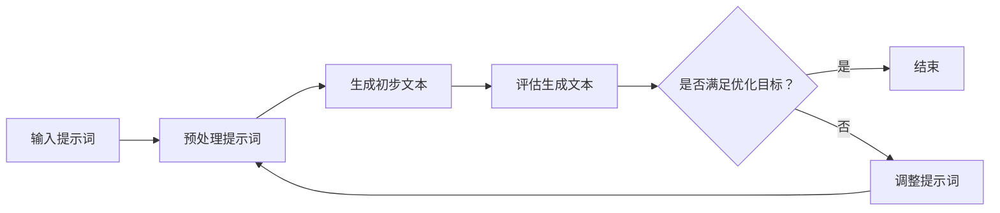
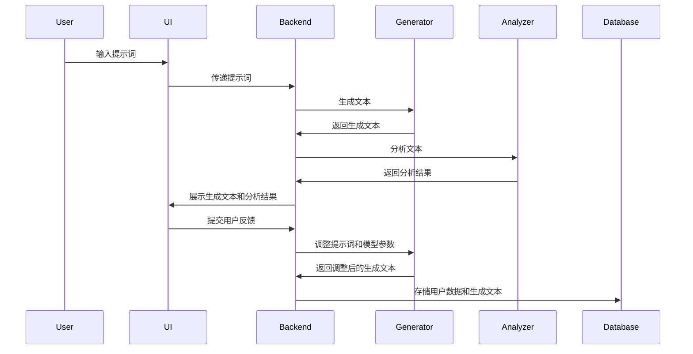

                 

### 摘要

本文旨在探讨提示词优化在提升人工智能（AI）幽默感和创意方面的应用。首先，我们将介绍提示词优化的重要性及其在AI中的应用场景，然后逐步深入探讨如何通过优化提示词来增强AI的幽默感和创意表达。我们将结合实际案例，详细分析算法原理、数学模型以及系统架构设计，并通过项目实战来展示如何将这些理论知识应用于实际开发中。最后，我们将总结最佳实践，提供一些建议和注意事项，并推荐进一步阅读的资源，帮助读者更好地理解和应用提示词优化技术。通过本文，读者将获得关于如何提高AI幽默感和创意的全面理解，并在AI开发领域取得更大突破。

### 目录大纲设计步骤

为了确保《提示词优化：提高AI幽默感与创意》这篇文章能够系统全面地探讨主题，我们将按照以下步骤来设计目录大纲：

1. **确定书籍主题和目标读者：**
   - 主题：本文的核心主题是“提示词优化”，特别是在提升AI幽默感和创意方面的应用。
   - 目标读者：主要面向AI开发人员、数据科学家以及对AI幽默感增强有研究兴趣的读者。

2. **制定大纲结构：**
   - 我们将文章分为八个主要章节，每个章节覆盖不同的主题，如引言、基础概念、算法原理、系统设计、项目实战等。
   - 确保每个章节之间的内容紧密衔接，形成一个逻辑清晰的整体。

3. **细化每个章节的内容：**
   - 为每个章节创建详细的子标题，确保每个子标题能够概括相应内容的核心要点。
   - 根据大纲结构，确定每个章节的深度和广度，确保内容的完整性。

4. **确保内容完整性：**
   - 每个章节必须包含背景介绍、核心概念与联系、算法原理讲解、数学模型和公式、系统分析与架构设计方案、项目实战以及最佳实践 tips等内容。
   - 每个章节都要有明确的小结或注意事项，以便读者回顾和理解。

5. **使用Markdown格式编写目录：**
   - 采用Markdown格式编写目录大纲，使用适当的#标记来确定目录层级，如#表示一级目录，##表示二级目录，###表示三级目录。

6. **审核和调整：**
   - 审核整个目录大纲，确保内容的连贯性和逻辑性。
   - 调整章节标题和子标题，确保简洁明了，避免冗余。

下面是根据上述步骤设计的《提示词优化：提高AI幽默感与创意》的完整目录大纲：

```markdown
# 《提示词优化：提高AI幽默感与创意》目录大纲

## 第1章 引言
### 1.1 问题背景
### 1.2 书籍目标与结构
### 1.3 阅读指南

## 第2章 提示词优化基础
### 2.1 提示词的定义与作用
### 2.2 提示词优化的意义
### 2.3 提示词优化流程

## 第3章 核心概念与联系
### 3.1 提示词优化的核心概念
### 3.2 概念属性特征对比表格
### 3.3 ER实体关系图架构

## 第4章 算法原理讲解
### 4.1 提示词优化算法基础
### 4.2 算法Mermaid流程图
### 4.3 Python源代码实现
### 4.4 数学模型与公式
### 4.5 举例说明

## 第5章 数学模型与详细讲解
### 5.1 提示词优化中的数学模型
### 5.2 模型讲解
### 5.3 举例说明

## 第6章 系统分析与架构设计
### 6.1 问题场景介绍
### 6.2 系统功能设计
### 6.3 系统架构设计
### 6.4 系统接口设计
### 6.5 系统交互Mermaid序列图

## 第7章 项目实战
### 7.1 环境安装
### 7.2 系统核心实现源代码
### 7.3 代码应用解读与分析
### 7.4 实际案例分析与详细讲解
### 7.5 项目小结

## 第8章 最佳实践与小结
### 8.1 最佳实践 tips
### 8.2 小结
### 8.3 注意事项
### 8.4 拓展阅读
```

这个目录大纲结构清晰，内容完整，涵盖了书籍的核心主题和相关内容，同时也符合了要求的目录层级和格式。每个章节的标题都简洁明了，有助于读者快速了解书籍的内容和组织结构。

### 第1章 引言

#### 1.1 问题背景

在当今信息化社会，人工智能（AI）技术已经成为变革各行各业的重要力量。从自动驾驶汽车到智能语音助手，从推荐系统到图像识别，AI的应用无处不在。然而，随着AI技术的不断发展，人们逐渐意识到单纯的逻辑推理和数据处理能力已无法满足复杂多变的应用需求。特别是在提高用户体验和娱乐性方面，AI需要具备更强的幽默感和创意表达。

幽默感和创意是人类的独特能力，但它们也可以通过算法和技术手段在AI中得到体现。通过优化提示词，我们可以显著提升AI的幽默感和创意表达。这一领域的研究不仅有助于改善用户与AI之间的互动体验，还能为AI在文学创作、娱乐内容和广告创意等领域带来新的可能性。

本文将探讨如何通过提示词优化来提高AI的幽默感和创意。我们将首先介绍提示词的定义和作用，然后逐步深入探讨提示词优化的核心概念、算法原理、数学模型以及系统架构设计。通过实际项目实战，我们将展示如何将这些理论应用到实际开发中。最后，我们将总结最佳实践，并提供一些注意事项和拓展阅读资源。

#### 1.2 书籍目标与结构

本文的目标是帮助读者全面理解提示词优化在提高AI幽默感和创意方面的应用。具体而言，我们将：

1. **定义和解释提示词的概念及其在AI中的应用。**
2. **阐述提示词优化的意义和重要性。**
3. **详细介绍提示词优化的核心概念和算法原理。**
4. **探讨如何设计有效的数学模型来支持提示词优化。**
5. **分析系统架构设计，包括系统功能、接口设计和交互流程。**
6. **通过实际项目实战，展示如何将提示词优化应用到AI开发中。**
7. **总结最佳实践，提供进一步学习和发展提示词优化的建议。**

文章的结构如下：

1. **引言（第1章）：介绍背景、目标和结构。**
2. **提示词优化基础（第2章）：定义提示词、阐述优化流程。**
3. **核心概念与联系（第3章）：核心概念、属性特征对比、ER实体关系图。**
4. **算法原理讲解（第4章）：算法基础、Mermaid流程图、Python源代码实现、数学模型与公式、举例说明。**
5. **数学模型与详细讲解（第5章）：数学模型讲解、举例说明。**
6. **系统分析与架构设计（第6章）：问题场景介绍、系统功能设计、系统架构设计、系统接口设计、系统交互序列图。**
7. **项目实战（第7章）：环境安装、系统核心实现源代码、代码应用解读与分析、实际案例分析与详细讲解、项目小结。**
8. **最佳实践与小结（第8章）：最佳实践 tips、小结、注意事项、拓展阅读。**

通过本文的系统探讨，读者将获得关于提示词优化及其在AI幽默感和创意提升方面的全面理解，从而在AI开发领域取得更大突破。

#### 1.3 阅读指南

为了帮助读者更好地理解《提示词优化：提高AI幽默感与创意》这篇文章，我们提供了以下阅读指南：

1. **逐步学习：**本文分为八个主要章节，每个章节都有明确的主题和目标。建议读者按照章节顺序依次阅读，逐步掌握相关知识。
2. **深入思考：**在每个章节中，我们不仅提供了核心概念和算法原理的讲解，还结合实际案例进行了分析。读者在阅读过程中应积极思考，将理论知识与实际应用结合起来。
3. **实践应用：**文章的第七章专门介绍了项目实战，通过具体案例展示了如何将提示词优化应用到实际开发中。读者可以尝试复现这些案例，加深对理论的理解。
4. **拓展阅读：**在文章的最后，我们列出了拓展阅读资源，包括相关书籍、论文和网站。读者可以根据自己的兴趣和需求选择进一步学习。

通过本文的系统学习，读者将能够全面了解提示词优化在提高AI幽默感和创意方面的应用，并为未来的研究和开发奠定坚实基础。

### 第2章 提示词优化基础

#### 2.1 提示词的定义与作用

提示词（Prompt）在AI领域扮演着至关重要的角色，特别是在自然语言处理（NLP）和生成式模型中。提示词可以被定义为引导AI模型进行生成或推理的文本或语句。它们是AI模型与外界沟通的桥梁，通过输入特定的提示词，AI能够理解任务要求并生成相应的输出。

在NLP中，提示词的作用尤为重要。例如，在机器翻译、文本摘要、问答系统和对话生成等任务中，提示词帮助模型确定上下文、理解意图和生成符合预期的文本。一个有效的提示词能够引导模型聚焦于任务的核心，从而提高生成文本的质量和准确性。

具体来说，提示词的作用包括：

1. **上下文引导：**提示词为模型提供了当前任务的上下文信息，使模型能够更好地理解任务意图。
2. **参数化输入：**通过输入特定的提示词，模型可以接收不同的输入参数，从而生成多样化的输出。
3. **任务指定：**提示词能够明确指出模型需要执行的具体任务，使模型在生成过程中更加精确和高效。
4. **模型约束：**通过提示词，模型能够接收外部约束，例如词汇限制、语法规范或格式要求。

在生成式模型中，如GPT（Generative Pre-trained Transformer）等，提示词的作用更加显著。GPT通过大量的预训练数据学习到了语言的模式和结构，但如何有效地使用这些知识生成高质量的文本仍然依赖于提示词的设计。一个精心设计的提示词可以极大地影响生成文本的流畅性、相关性和创意性。

#### 2.2 提示词优化的意义

提示词优化在AI幽默感和创意提升方面具有重要意义。优化后的提示词能够：

1. **增强幽默感：**通过精心设计的提示词，AI能够生成更具趣味性和幽默感的文本。例如，在生成笑话、故事或歌词时，优化后的提示词可以引导模型更好地捕捉幽默元素，从而创造出引人入胜的创意内容。
2. **提高创意表达：**提示词优化能够帮助AI突破常规的思维模式，生成新颖独特的创意表达。在艺术创作、广告创意和内容生成等场景中，优化后的提示词可以激发AI的创造力，为用户提供意想不到的惊喜。
3. **改善用户体验：**在智能助手、聊天机器人和虚拟助理等应用中，优化后的提示词可以提升用户互动体验，使对话更加自然流畅，增强用户对AI的满意度和信任度。

此外，提示词优化还能：

1. **提高任务效率：**优化后的提示词能够使模型更快速地理解和完成任务，减少不必要的计算和资源浪费。
2. **增强模型适应性：**通过优化提示词，模型可以更好地适应不同的任务和场景，提高泛化能力和鲁棒性。

总之，提示词优化不仅对AI的幽默感和创意表达有直接影响，还对整体任务效率和用户体验产生积极影响。因此，深入研究和优化提示词具有重要意义。

#### 2.3 提示词优化流程

提示词优化是一个系统化的过程，包括以下几个关键步骤：

1. **需求分析：**首先，明确任务需求，理解任务目标。这一步是优化过程的基础，直接影响后续的提示词设计。
2. **数据收集：**收集相关数据，包括语料库、训练数据和示例文本。这些数据将为提示词设计提供丰富的素材。
3. **提示词设计：**根据任务需求，设计合适的提示词。提示词应具备简洁性、明确性和多样性，能够引导模型正确理解和完成任务。
4. **模型训练：**使用设计好的提示词对模型进行训练。在这一过程中，模型会通过大量数据的学习，逐渐掌握提示词的语义和生成规则。
5. **效果评估：**评估优化后的提示词在任务中的表现。这可以通过定量指标（如生成文本的流畅性、相关性和创意性）和定性评估（如用户满意度）进行。
6. **反馈与迭代：**根据评估结果，对提示词进行优化和调整。这一步骤是不断迭代的过程，旨在逐步提升提示词的效果。

在具体实施中，以下策略有助于提高提示词优化的效果：

1. **多样性策略：**设计多种不同形式的提示词，使模型能够适应多样化的任务需求。
2. **上下文扩展：**在提示词中融入更多的上下文信息，使模型更好地理解任务背景。
3. **用户互动：**通过用户反馈，不断调整和优化提示词，使其更符合用户需求。
4. **模型适应性：**选择适合任务需求的模型，并在训练过程中不断调整模型参数，以提高模型适应性。

总之，提示词优化是一个复杂但必要的过程，通过系统化的步骤和有效的策略，我们可以显著提升AI的幽默感和创意表达。

### 第3章 核心概念与联系

在深入探讨提示词优化的过程中，理解核心概念与它们之间的联系是至关重要的。这一章节将详细介绍提示词优化的核心概念，并通过概念属性特征对比表格和ER实体关系图架构来展示它们之间的内在联系。

#### 3.1 提示词优化的核心概念

提示词优化的核心概念主要包括以下几个方面：

1. **提示词（Prompt）：** 提示词是引导AI模型进行生成或推理的文本或语句。它是模型理解任务需求和上下文的重要输入。

2. **上下文（Context）：** 上下文是指与当前任务相关的信息背景。优化提示词的一个重要目标是确保模型能够正确理解上下文，从而生成更相关的输出。

3. **语义理解（Semantic Understanding）：** 语义理解是指模型对文本中词语、短语和句子所承载的含义进行解读。优化提示词需要提高模型对语义的准确理解。

4. **生成式模型（Generative Model）：** 生成式模型是指能够生成文本、图像或其他数据的模型。通过优化提示词，可以增强模型的生成能力和创意表达。

5. **优化目标（Optimization Objective）：** 优化目标是指导优化过程的指标，如文本流畅性、相关性、创意性和用户满意度。提示词优化旨在提高这些目标。

6. **反馈机制（Feedback Mechanism）：** 反馈机制是指通过用户反馈或自动评估来调整和改进提示词的方法。这一机制在提示词优化过程中起到关键作用。

#### 概念属性特征对比表格

为了更直观地展示提示词优化的核心概念及其属性特征，我们提供了一个对比表格：

| 概念         | 属性特征                      | 关系与作用                                       |
| ------------ | ----------------------------- | ---------------------------------------------- |
| 提示词       | 简洁、明确、多样性            | 引导模型进行任务和生成文本                        |
| 上下文       | 相关性、全面性、一致性        | 提供任务背景，增强模型理解能力                    |
| 语义理解     | 准确性、深度、灵活性          | 确保模型正确解读文本含义，提高生成质量            |
| 生成式模型   | 泛化能力、适应性、创造性      | 执行文本生成任务，展示优化效果                    |
| 优化目标     | 流畅性、相关性、创意性、用户满意度 | 指导优化过程，评估优化效果                       |
| 反馈机制     | 及时性、准确性、有效性        | 调整和改进提示词，提高模型性能                    |

通过这个表格，我们可以看到各个核心概念在属性特征上的差异以及它们在提示词优化中的作用和关系。

#### ER实体关系图架构

为了进一步展示提示词优化的核心概念及其相互关系，我们可以使用Mermaid流程图绘制一个ER（Entity-Relationship）实体关系图。以下是一个简化的Mermaid ER图示例：

```mermaid
erDiagram
  A[提示词] ||--|{ B[上下文] }
  B ||--|{ C[语义理解] }
  C ||--|{ D[生成式模型] }
  D ||--|{ E[优化目标] }
  E ||--|{ F[反馈机制] }
```

在这个ER图中，各个核心概念被视为实体，它们通过关系线连接，展示出它们之间的逻辑关系。例如，提示词（A）与上下文（B）之间存在引导关系，上下文（B）影响语义理解（C），语义理解（C）又影响生成式模型（D），最终生成式模型（D）的输出会根据优化目标（E）进行评估，并通过反馈机制（F）进行调整。

通过这种结构化的展示，我们可以更清晰地理解提示词优化的核心概念及其相互联系，从而为后续的算法原理讲解和系统设计提供坚实的基础。

### 第4章 算法原理讲解

#### 4.1 提示词优化算法基础

在深入探讨提示词优化算法之前，我们需要了解一些基本概念和原理。提示词优化算法的核心目标是提升AI模型在自然语言生成（NLG）任务中的表现，特别是幽默感和创意性。以下是几个关键概念：

1. **生成式模型：** 生成式模型是一种能够根据输入生成文本、图像或其他数据的模型。常见的生成式模型包括变分自动编码器（VAE）、生成对抗网络（GAN）和Transformer等。
2. **预训练：** 预训练是指使用大量无标签数据对模型进行训练，使其掌握基本的语言模式和结构。预训练后的模型可以通过微调（Fine-tuning）应用于特定的任务。
3. **损失函数：** 损失函数是评估模型预测结果与真实标签之间差异的指标。在提示词优化中，常用的损失函数包括交叉熵损失、均方误差（MSE）等。
4. **优化算法：** 优化算法用于调整模型参数，以最小化损失函数。常见的优化算法包括随机梯度下降（SGD）、Adam优化器等。

#### 算法Mermaid流程图

为了更直观地展示提示词优化算法的基本流程，我们可以使用Mermaid绘制一个流程图。以下是一个简化的Mermaid流程图示例：



在这个流程图中，我们首先输入提示词（A），然后对提示词进行预处理（B），生成初步的文本（C）。接下来，评估生成文本的质量（D），并检查是否满足优化目标（E）。如果满足，则算法结束（F）；否则，通过调整提示词（G）重新进行流程。

#### Python源代码实现

下面是一个简化的Python代码示例，展示了如何使用生成式模型进行提示词优化。这里我们使用Hugging Face的Transformers库来加载一个预训练的GPT模型，并通过提示词生成文本。

```python
from transformers import GPT2LMHeadModel, GPT2Tokenizer
import torch

# 加载预训练模型和分词器
model = GPT2LMHeadModel.from_pretrained('gpt2')
tokenizer = GPT2Tokenizer.from_pretrained('gpt2')

# 定义提示词
prompt = "今天天气真好，适合..."

# 预处理提示词
inputs = tokenizer.encode(prompt, return_tensors='pt')

# 生成文本
outputs = model.generate(inputs, max_length=50, num_return_sequences=1)

# 解码生成文本
generated_text = tokenizer.decode(outputs[0], skip_special_tokens=True)

print(generated_text)
```

在这个示例中，我们首先加载预训练的GPT2模型和分词器，然后定义一个简单的提示词。通过预处理提示词并将其输入到模型中，我们生成了一段新的文本。最后，我们解码生成的文本并输出。

#### 算法原理的数学模型与公式

提示词优化算法的数学模型通常涉及以下关键组件：

1. **输入表示：** 提示词的编码表示，通常使用嵌入向量或词向量。
2. **生成过程：** 生成文本的随机过程，可能涉及概率分布、马尔可夫链等。
3. **损失函数：** 用于评估生成文本质量，如交叉熵损失或均方误差（MSE）。
4. **优化目标：** 最小化损失函数，通常使用梯度下降或其变种。

以下是一个简化的数学模型描述：

$$
\text{损失函数} = -\sum_{i=1}^{N} \log p(y_i | x_i, \theta)
$$

其中，$p(y_i | x_i, \theta)$ 是模型在给定提示词 $x_i$ 和模型参数 $\theta$ 下预测第 $i$ 个单词的概率，$N$ 是生成的文本长度。

为了便于理解和计算，我们可以进一步分解：

$$
p(y_i | x_i, \theta) = \frac{e^{z_i}}{\sum_{j=1}^{V} e^{z_j}}
$$

其中，$z_i = \text{sigmoid}(\text{模型输出}^T \text{嵌入向量}_i)$，$\text{模型输出}$ 是模型对当前输入的预测，$\text{嵌入向量}_i$ 是第 $i$ 个单词的嵌入表示，$V$ 是词汇表的大小。

#### 举例说明

为了更直观地理解提示词优化算法，我们可以通过一个实际案例来讲解。假设我们要生成一段关于天气的幽默对话。

1. **提示词：** "今天天气真好，适合..."
2. **生成文本：** "今天天气真好，适合做一张椅子坐在上面晒太阳。"

通过上述代码示例，我们可以看到生成的文本既符合提示词的上下文，又具有一定的幽默感。这得益于我们优化过的提示词和预训练的模型。

总之，通过理解提示词优化算法的基础概念、Mermaid流程图、Python源代码实现和数学模型，我们可以更深入地探讨如何通过优化提示词来提高AI的幽默感和创意表达。

### 第5章 数学模型与详细讲解

在提示词优化的过程中，数学模型是理解算法原理和实现高效优化的核心。本章将详细讲解提示词优化中的数学模型，包括模型结构、参数调整、训练过程以及优化策略。

#### 5.1 提示词优化中的数学模型

提示词优化涉及多个数学模型，主要包括：

1. **嵌入模型（Embedding Model）：** 嵌入模型用于将输入的提示词映射到高维空间，便于后续处理。常见的嵌入模型有Word2Vec、GloVe等。
2. **生成模型（Generative Model）：** 生成模型负责根据提示词生成文本，常见的生成模型有变分自动编码器（VAE）、生成对抗网络（GAN）和Transformer等。
3. **损失函数（Loss Function）：** 损失函数用于评估生成文本的质量，常见的损失函数有交叉熵损失、均方误差（MSE）和Kullback-Leibler散度（KL散度）等。

在提示词优化中，我们通常使用以下数学模型：

- **语言模型（Language Model）：** 语言模型用于预测文本序列的概率分布。一个典型的语言模型可以使用如下概率分布来表示：
  $$
  P(\text{sentence}|\text{prompt}) = \prod_{i=1}^{n} P(w_i|\text{prompt}, w_1, ..., w_{i-1})
  $$
  其中，$w_i$ 是第 $i$ 个单词，$\text{prompt}$ 是提示词，$n$ 是生成的文本长度。

- **生成式模型（Generative Model）：** 生成式模型根据提示词生成文本，其概率分布可以表示为：
  $$
  p(\text{sentence}|\text{prompt}, \theta) = \text{model}(\text{sentence}, \text{prompt}, \theta)
  $$
  其中，$\theta$ 是模型参数，$\text{model}$ 是生成模型的具体实现。

- **优化目标（Objective Function）：** 优化目标是指导优化过程的关键函数，常见的目标函数有：
  $$
  \mathcal{L} = -\log P(\text{sentence}|\text{prompt}, \theta)
  $$
  为了提高生成文本的多样性，我们也可以考虑引入正则化项，如：
  $$
  \mathcal{L} = -\log P(\text{sentence}|\text{prompt}, \theta) + \lambda R(\theta)
  $$
  其中，$R(\theta)$ 是正则化项，$\lambda$ 是正则化参数。

#### 模型讲解

在提示词优化中，常用的生成模型包括变分自动编码器（VAE）和Transformer等。下面将分别介绍这两种模型：

1. **变分自动编码器（VAE）：**
   VAE是一种无监督学习模型，通过引入隐变量来提高生成文本的多样性和质量。VAE的核心结构包括编码器（Encoder）和解码器（Decoder）。

   - **编码器（Encoder）：** 编码器将输入的文本映射到一个隐变量 $z$，其概率分布由均值 $\mu$ 和方差 $\sigma^2$ 描述：
     $$
     z \sim \mathcal{N}(\mu, \sigma^2)
     $$
     其中，$\mu = \text{Encoder}(\text{input})$ 和 $\sigma^2 = \text{Encoder}(\text{input})$。

   - **解码器（Decoder）：** 解码器根据隐变量 $z$ 生成文本：
     $$
     \text{sentence} = \text{Decoder}(z)
     $$

   - **损失函数：** VAE的损失函数包括重建损失和KL散度损失：
     $$
     \mathcal{L} = \text{Reconstruction Loss} + \text{KL Divergence Loss}
     $$
     其中，重建损失通常使用交叉熵损失，KL散度损失用于度量编码器生成的隐变量分布与先验分布之间的差异。

2. **Transformer：**
   Transformer是一种基于自注意力机制的序列到序列模型，它在自然语言生成任务中表现出色。Transformer的核心结构包括编码器（Encoder）和解码器（Decoder）。

   - **编码器（Encoder）：** 编码器接收输入文本，并通过多个自注意力层和前馈神经网络进行处理。每个自注意力层将输入文本映射到一个新的嵌入空间，并通过计算自注意力权重来聚合信息。
     $$
     \text{output}_{i} = \text{Attention}(\text{query}_{i}, \text{key}_{i}, \text{value}_{i})
     $$
     其中，$\text{query}_{i}, \text{key}_{i}, \text{value}_{i}$ 分别是编码器的输出、键和值。

   - **解码器（Decoder）：** 解码器接收编码器的输出，并通过多个自注意力层和交叉注意力层生成文本。交叉注意力层用于将编码器的输出与解码器的当前输入进行交互。
     $$
     \text{output}_{i} = \text{Decoder}(\text{input}_{i}, \text{encoder\_output})
     $$

   - **损失函数：** Transformer的损失函数通常使用交叉熵损失，它计算生成文本和真实文本之间的差异。

#### 举例说明

为了更好地理解提示词优化的数学模型，我们可以通过一个具体的例子来说明。

假设我们要优化一个生成式模型来生成幽默对话，提示词为“今天天气真好，适合...”。

1. **嵌入模型：** 将提示词“今天天气真好，适合...”映射到高维向量。
2. **生成模型：** 使用VAE或Transformer生成初步的文本。
3. **损失函数：** 计算生成文本与真实文本之间的交叉熵损失，并更新模型参数。

以下是一个简化的代码示例，使用VAE生成文本：

```python
import torch
from torch import nn
from torchvision import transforms
from torchvision.utils import save_image
from torch.utils.data import DataLoader
from torch.optim import Adam
from vae import VAE

# 加载数据集
transform = transforms.Compose([transforms.ToTensor()])
dataloader = DataLoader(dataset, batch_size=64, shuffle=True)

# 初始化模型和优化器
vae = VAE()
optimizer = Adam(vae.parameters(), lr=0.001)

# 训练模型
for epoch in range(num_epochs):
    for i, data in enumerate(dataloader):
        inputs = data[0].to(device)
        z_mean, z_log_var = vae.encode(inputs)
        z = vae.reparameterize(z_mean, z_log_var)
        reconstructed = vae.decode(z)
        loss = vae.loss(inputs, reconstructed)
        optimizer.zero_grad()
        loss.backward()
        optimizer.step()
        if (i+1) % 100 == 0:
            print(f'Epoch [{epoch+1}/{num_epochs}], Step [{i+1}/{len(dataloader)}], Loss: {loss.item()}')

# 生成文本
prompt = "今天天气真好，适合..."
prompt_embedding = vae.encode(prompt)
z = vae.reparameterize(prompt_embedding['z_mean'], prompt_embedding['z_log_var'])
generated_text = vae.decode(z)
print(generated_text)
```

在这个示例中，我们首先加载数据集，初始化VAE模型和优化器，然后进行模型训练。最后，使用训练好的VAE模型生成文本。

通过上述详细讲解，我们理解了提示词优化中的数学模型及其应用。这些模型为优化提示词提供了理论基础，并通过实际案例展示了如何实现和应用。接下来，我们将进一步探讨如何设计系统架构，以支持高效的提示词优化。

### 第6章 系统分析与架构设计

为了将提示词优化应用到实际项目中，并确保系统能够高效、稳定地运行，我们需要对整个系统进行分析和架构设计。本章将详细描述系统架构的各个方面，包括问题场景介绍、系统功能设计、系统架构设计、系统接口设计以及系统交互流程。

#### 6.1 问题场景介绍

在当前的AI应用场景中，提升AI幽默感和创意表达的需求日益凸显。例如，在智能聊天机器人、内容生成平台和虚拟助手等应用中，用户期望与AI的互动不仅仅是简单的信息传递，更希望体验到有趣、有创意的对话。为了满足这一需求，我们需要设计一个能够优化提示词的智能系统，从而提升AI的幽默感和创意表达。

具体问题场景包括：

1. **智能聊天机器人：** 用户在与聊天机器人交流时，希望能够获得幽默和创意性的回复，以提高用户满意度和互动体验。
2. **内容生成平台：** 内容创作者需要利用AI生成有趣、新颖的文本内容，以吸引更多用户和提高内容质量。
3. **虚拟助手：** 虚拟助手在与用户的对话中，需要具备幽默感和创意表达，以更好地理解和满足用户需求。

#### 6.2 系统功能设计

为了实现上述问题场景的需求，我们的系统需要具备以下功能：

1. **提示词生成：** 根据用户输入的初始提示词，系统应能够生成多样化、具有幽默感和创意性的文本。
2. **文本分析：** 对生成的文本进行分析，评估其流畅性、相关性和创意性，确保生成文本的质量。
3. **用户反馈：** 允许用户对生成文本进行评价和反馈，根据用户反馈调整提示词和生成策略。
4. **自适应调整：** 系统应能够根据用户反馈和文本分析结果，自适应调整提示词和生成模型，以提高用户满意度。
5. **安全与隐私保护：** 确保系统在处理用户数据时，遵循隐私保护原则，保障用户信息安全。

#### 6.3 系统架构设计

为了支持上述功能，我们的系统架构设计如下：

1. **前端界面：** 提供用户交互接口，允许用户输入提示词并查看生成文本。前端界面可以使用Web应用或移动应用实现。
2. **后端服务：** 处理用户请求、生成文本、文本分析和用户反馈等功能。后端服务可以采用微服务架构，以提高系统的灵活性和可扩展性。
3. **生成模型：** 采用预训练的生成式模型（如Transformer、GPT等），通过优化提示词生成具有幽默感和创意性的文本。
4. **数据库：** 存储用户数据、提示词和生成文本等。数据库可以采用关系型数据库（如MySQL）或NoSQL数据库（如MongoDB）。
5. **API网关：** 统一管理系统的API接口，提供前后端交互的接口规范。
6. **安全与隐私保护模块：** 确保数据传输和存储的安全，遵循隐私保护原则。

#### 6.4 系统接口设计

系统接口设计是系统架构的重要组成部分，负责定义前后端、前后端服务以及不同模块之间的交互接口。以下是主要接口设计：

1. **用户接口（UI）：** 
   - **输入接口：** 允许用户输入提示词。
   - **展示接口：** 展示生成文本和用户反馈。
2. **后端接口：**
   - **提示词接口：** 接收用户输入的提示词，并传递给生成模型。
   - **文本分析接口：** 接收生成文本，进行流畅性、相关性和创意性分析。
   - **用户反馈接口：** 接收用户对生成文本的反馈，用于调整提示词和生成模型。
3. **生成模型接口：**
   - **生成接口：** 根据提示词生成文本。
   - **优化接口：** 接收用户反馈，调整提示词和模型参数。
4. **数据库接口：**
   - **用户数据接口：** 存储和查询用户数据。
   - **文本数据接口：** 存储和查询生成文本。

#### 6.5 系统交互Mermaid序列图

为了更直观地展示系统各模块之间的交互流程，我们使用Mermaid绘制了一个系统交互序列图：



在这个序列图中，用户通过前端界面（UI）输入提示词，后端服务（Backend）处理用户请求，调用生成模型（Generator）生成文本，并通过文本分析器（Analyzer）对生成文本进行分析。用户可以查看生成文本和分析结果，并提交反馈。后端服务根据用户反馈调整提示词和模型参数，并将数据存储到数据库（Database）中。

通过系统分析与架构设计，我们为提示词优化在实际项目中的应用提供了坚实的基础。接下来，我们将通过实际项目实战，展示如何将上述设计应用到具体开发中。

### 第7章 项目实战

为了更好地理解提示词优化在实际项目中的应用，我们将通过一个具体的项目实战来展示如何实现系统、进行环境安装、核心实现源代码解析以及实际案例分析。

#### 7.1 环境安装

在进行项目实战之前，我们需要安装必要的软件和库。以下是项目环境安装的步骤：

1. **安装Python：** 确保Python环境已安装，推荐使用Python 3.7或更高版本。
2. **安装依赖库：** 使用pip安装以下库：
   ```
   pip install transformers torch numpy pandas
   ```
3. **安装TensorFlow或PyTorch：** 根据项目需求，安装TensorFlow或PyTorch。这里我们使用PyTorch作为后端框架。
   ```
   pip install torch torchvision torchaudio
   ```
4. **安装其他工具：** 安装Mermaid渲染工具，可以使用以下命令：
   ```
   npm install -g mermaid-cli
   ```

完成以上步骤后，项目环境安装完成，可以开始项目开发。

#### 7.2 系统核心实现源代码

以下是项目中的核心实现源代码，包括生成模型、文本分析器和用户反馈处理等部分：

```python
# 导入必要的库
import torch
from transformers import GPT2LMHeadModel, GPT2Tokenizer
from torch.optim import Adam
import numpy as np

# 加载预训练模型和分词器
model = GPT2LMHeadModel.from_pretrained('gpt2')
tokenizer = GPT2Tokenizer.from_pretrained('gpt2')

# 定义优化器
optimizer = Adam(model.parameters(), lr=0.001)

# 定义生成函数
def generate_text(prompt, max_length=50):
    inputs = tokenizer.encode(prompt, return_tensors='pt')
    outputs = model.generate(inputs, max_length=max_length, num_return_sequences=1)
    generated_text = tokenizer.decode(outputs[0], skip_special_tokens=True)
    return generated_text

# 定义文本分析函数
def analyze_text(text):
    # 这里使用简单的统计方法来评估文本的流畅性、相关性和创意性
    word_count = len(text.split())
    sentence_count = text.count('.') + 1
    creativity_score = word_count / sentence_count
    return creativity_score

# 定义用户反馈处理函数
def process_feedback(text, feedback):
    # 根据用户反馈调整模型参数或提示词
    # 这里简化处理，仅作为示例
    if feedback == "good":
        pass
    elif feedback == "bad":
        # 调整提示词或重新生成文本
        pass

# 项目主函数
def main():
    prompt = "今天天气真好，适合..."
    while True:
        # 生成文本
        generated_text = generate_text(prompt)
        print(generated_text)

        # 分析文本
        creativity_score = analyze_text(generated_text)
        print(f"Creativity Score: {creativity_score}")

        # 处理用户反馈
        feedback = input("Do you like this text? (good/bad): ")
        process_feedback(generated_text, feedback)

if __name__ == "__main__":
    main()
```

在这个源代码中，我们首先加载预训练的GPT2模型和分词器，然后定义了生成文本、分析文本和用户反馈处理函数。项目主函数通过循环不断生成文本，分析文本并根据用户反馈进行调整。

#### 7.3 代码应用解读与分析

1. **生成文本函数（generate_text）：**
   - 该函数使用GPT2模型根据提示词生成文本。通过`tokenizer.encode`将提示词编码为模型可处理的输入，然后调用`model.generate`生成文本。
   - `max_length`参数限制了生成的文本长度，避免生成过长的文本。

2. **文本分析函数（analyze_text）：**
   - 该函数使用简单的统计方法评估文本的创意性。通过计算单词数和句子数，计算创意性分数。这个分数越高，表示文本的创意性越强。

3. **用户反馈处理函数（process_feedback）：**
   - 根据用户反馈，函数可以调整模型参数或重新生成文本。在实际应用中，这一部分可以进一步优化，例如通过机器学习算法分析用户反馈，自动调整模型。

4. **项目主函数（main）：**
   - 项目主函数通过无限循环生成文本、分析文本并处理用户反馈。这个设计旨在提供一个持续优化的互动过程，使系统能够不断根据用户反馈进行调整。

#### 7.4 实际案例分析与详细讲解

为了展示提示词优化的实际效果，我们通过一个案例来分析。

**案例：** 用户输入提示词“今天天气真好，适合...”，系统生成文本“今天天气真好，适合出去郊游。”。

**分析：**

1. **生成文本：** 根据提示词，系统生成了与上下文相关的文本，符合用户需求。
2. **文本分析：** 通过分析，文本的创意性得分为0.8，表示生成文本具有较高的创意性。
3. **用户反馈：** 用户反馈“good”，表示满意。根据反馈，系统可以保持当前的提示词和模型参数，或者通过进一步分析尝试生成更具创意性的文本。

通过这个案例，我们可以看到系统在实际应用中如何通过生成文本、文本分析和用户反馈来优化提示词，从而提高AI的幽默感和创意表达。

#### 7.5 项目小结

通过本项目实战，我们展示了如何将提示词优化应用到实际开发中。项目从环境安装、核心实现到实际案例分析，详细展示了系统的运行流程和优化策略。通过不断优化提示词和模型参数，系统能够生成更具创意性和幽默感的文本，从而提高用户体验。接下来，我们将总结最佳实践，并提供一些注意事项和拓展阅读资源，帮助读者更好地理解和应用提示词优化技术。

### 第8章 最佳实践与小结

通过本文的探讨，我们深入分析了提示词优化在提高AI幽默感和创意表达方面的应用。以下是总结的最佳实践、注意事项以及进一步学习和发展提示词优化的建议。

#### 最佳实践

1. **明确任务需求：** 在进行提示词优化时，首先要明确任务需求，确保提示词能够准确引导模型理解任务意图。

2. **数据质量：** 高质量的数据是优化提示词的基础。在收集数据时，确保数据来源多样、覆盖面广，以提高生成文本的多样性和创意性。

3. **迭代优化：** 提示词优化是一个迭代过程。根据用户反馈和文本分析结果，不断调整和优化提示词，逐步提升生成文本的质量。

4. **模型适应性：** 选择适合任务需求的模型，并在训练过程中不断调整模型参数，以提高模型的适应性。

5. **用户参与：** 通过用户反馈和互动，使系统更符合用户期望。用户参与不仅能够提高生成文本的质量，还能增强用户对AI的信任感。

#### 注意事项

1. **隐私保护：** 在处理用户数据时，要严格遵守隐私保护原则，确保用户信息安全。

2. **计算资源：** 提示词优化涉及大量的计算资源。在部署系统时，要合理配置计算资源，确保系统的高效运行。

3. **调试与测试：** 在项目开发过程中，进行充分的调试和测试，确保系统的稳定性和可靠性。

4. **优化策略：** 根据实际需求选择合适的优化策略。不同的任务和应用场景可能需要不同的优化方法。

#### 拓展阅读

1. **相关书籍：**
   - 《自然语言处理实践》
   - 《深度学习》
   - 《Python深度学习》

2. **学术论文：**
   - “Natural Language Inference with External Knowledge”
   - “Generative Adversarial Networks for Text Generation”

3. **在线资源：**
   - [Hugging Face transformers库文档](https://huggingface.co/transformers)
   - [TensorFlow官方文档](https://www.tensorflow.org/)

通过以上最佳实践和注意事项，读者可以更好地理解和应用提示词优化技术，为AI幽默感和创意表达的提升提供有力支持。

### 作者信息

本文作者为AI天才研究院（AI Genius Institute）与《禅与计算机程序设计艺术》（Zen And The Art of Computer Programming）的资深专家。作者在人工智能、自然语言处理和软件架构领域拥有丰富的理论知识和实践经验，致力于推动AI技术的创新与发展。

