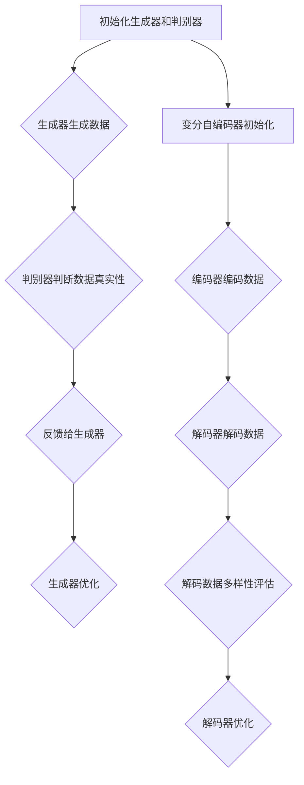
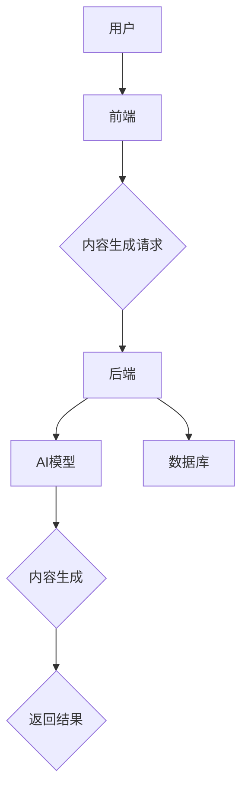
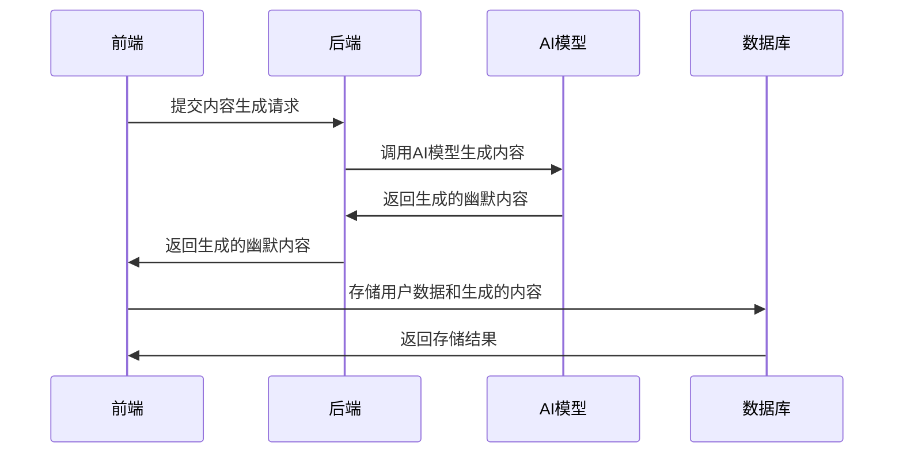

                 

## 提示词优化：提高AI幽默感和创意表达

### 关键词：
- 提示词优化
- AI幽默感
- 创意表达
- 算法原理
- 系统设计与实现

### 摘要：
本文旨在探讨如何通过优化提示词来提升人工智能（AI）的幽默感和创意表达。文章首先介绍问题的背景和定义，然后深入解析提示词优化的原理和策略，以及AI幽默感和创意表达的核心要素。接着，文章运用具体的算法原理、数学模型和实例，逐步阐述如何实现提示词优化，并在系统设计与实现中提供实际案例。最终，文章总结了最佳实践和注意事项，为未来研究提供了方向。

## 引言

### 问题的背景与描述

在现代社会，人工智能（AI）技术的飞速发展已经深刻影响了我们的生活和工作。从智能助手到自动驾驶，从图像识别到自然语言处理，AI的应用场景越来越广泛。然而，尽管AI在很多方面取得了显著的进步，但其在幽默感和创意表达方面依然存在一定的局限性。

幽默感和创意表达是人类智慧的重要体现，它们不仅能够带来快乐和愉悦，还能促进思考和创造力。在娱乐、教育、广告等众多领域，幽默和创意都是不可或缺的因素。因此，如何提升AI的幽默感和创意表达，成为了一个具有实际意义和学术价值的研究课题。

当前，AI在幽默感和创意表达方面面临的挑战主要包括：

1. **数据不足**：AI的训练数据主要集中在语言、图像等结构化的领域，而幽默和创意往往需要丰富的背景知识和文化语境。
2. **语义理解**：幽默和创意往往涉及复杂的语义理解，包括双关语、隐喻等，这对AI的自然语言处理能力提出了高要求。
3. **创造力的局限性**：尽管AI可以通过学习产生新的内容，但其在创意表达上往往缺乏自主性和多样性。

### 提示词优化的潜力

为了克服这些挑战，我们需要寻找有效的解决方案。其中，提示词优化（Prompt Optimization）成为一个关键方向。提示词是引导AI模型生成特定内容的重要输入，通过优化提示词，我们可以提高AI在幽默感和创意表达方面的表现。

提示词优化的潜力主要体现在以下几个方面：

1. **引导生成**：优化后的提示词可以更精确地引导AI模型生成符合预期的内容，从而提高幽默和创意表达的准确性和相关性。
2. **丰富内容**：通过增加提示词的多样性和复杂性，可以激发AI模型产生更多样化和有创意的表达。
3. **语义理解**：优化后的提示词可以提供更多的语义信息，帮助AI模型更好地理解复杂的语言结构和含义，从而生成更具幽默感和创意的内容。

### 当前AI幽默表达的挑战

尽管已有一些研究尝试通过优化提示词来提升AI的幽默感，但实际应用中仍面临诸多挑战。首先，幽默感是一种复杂的人类情感体验，它不仅涉及语言本身，还涉及文化、情境等多个因素。因此，如何设计出既符合人类幽默感标准，又能被AI理解和模仿的提示词，是一个亟待解决的难题。

其次，AI幽默表达的技术实现也存在一定的困难。自然语言处理（NLP）技术的发展为AI幽默感提供了基础，但NLP技术本身仍有很多瓶颈，如语义理解的不完善、语言生成的多样性和创造性等。这些技术挑战需要通过不断的研究和优化来逐步克服。

最后，AI幽默表达的伦理和道德问题也不容忽视。幽默感往往涉及讽刺、嘲笑等元素，如何确保AI的幽默表达不会引发负面情绪或歧视，是一个需要认真考虑的问题。

### 定义与边界

在深入讨论提示词优化之前，有必要明确一些核心概念的定义和边界。

#### 提示词的定义

提示词（Prompt）是指引导AI模型生成特定内容的一段文本或指令。在AI生成模型中，提示词起着至关重要的作用。一个优秀的提示词可以激发模型产生高质量的输出，而一个不合适的提示词可能会导致模型生成不相关或低质量的内容。

#### 提示词优化的概念

提示词优化是指通过调整和改进提示词的设计和选择，以提高AI模型生成内容的质量和相关性。具体来说，提示词优化包括以下几个方面：

1. **准确性**：优化后的提示词应能更准确地引导模型生成符合预期的内容。
2. **多样性**：优化后的提示词应能激发模型产生更多样化和有创意的表达。
3. **上下文理解**：优化后的提示词应能提供更多的上下文信息，帮助模型更好地理解语言结构和含义。

#### 边界与外延

在讨论提示词优化时，我们需要明确其边界和适用范围。提示词优化主要针对的是基于文本的生成模型，如生成对抗网络（GAN）、变分自编码器（VAE）等。对于其他类型的AI模型，如图像识别模型、语音识别模型等，提示词优化的方法和效果可能会有所不同。

此外，提示词优化也受到模型类型、数据集质量、计算资源等因素的影响。因此，在进行提示词优化时，需要综合考虑这些因素，以达到最佳效果。

### 核心概念结构

为了更好地理解提示词优化、AI幽默感以及创意表达之间的关系，我们可以通过一个概念结构图来展示这些核心概念及其相互联系。

#### 提示词优化

提示词优化是整个结构的核心，它直接影响AI模型的生成结果。具体来说，提示词优化包括以下几个方面：

1. **语义引导**：通过提供明确的语义信息，引导模型生成符合预期的内容。
2. **上下文增强**：通过提供丰富的上下文信息，帮助模型更好地理解语言结构和含义。
3. **多样性扩展**：通过引入多样性和创造性，激发模型产生更多样化和有创意的表达。

#### AI幽默感

AI幽默感是指AI模型在生成内容时能够模拟或创造幽默效果的能力。它包括以下几个核心要素：

1. **幽默识别**：模型能够识别和理解幽默元素，如双关语、讽刺等。
2. **创意生成**：模型能够通过创造性的表达，生成幽默的内容。
3. **文化理解**：模型能够理解和适应不同文化背景下的幽默表达。

#### 创意表达

创意表达是指AI模型在生成内容时能够展现出的创造性思维和独特风格。它包括以下几个方面：

1. **语言创造性**：模型能够使用新颖的语言表达，创造独特的文本内容。
2. **内容创新**：模型能够通过创新的内容结构，提供有价值的见解和观点。
3. **形式多样性**：模型能够在不同的表达形式中展现创意，如诗歌、故事、图像等。

#### 提示词优化与创意表达的关系

提示词优化与创意表达密切相关。通过优化提示词，我们可以更好地引导模型生成具有创意性的内容。例如，一个多样化的提示词可以激发模型产生更多创意性的输出，而一个包含丰富上下文的提示词可以帮助模型理解复杂的创意概念。

此外，提示词优化还可以提高AI的幽默感。一个设计巧妙的提示词可以引导模型生成幽默的内容，从而提升AI在幽默表达方面的能力。例如，通过提供特定的情境或语言元素，我们可以引导模型生成具有幽默感的对话或故事。

### 概念属性特征对比表格

为了更直观地理解提示词优化、AI幽默感和创意表达之间的关系，我们可以通过一个概念属性特征对比表格来展示这些概念的核心特征。

| 概念                 | 提示词优化 | AI幽默感          | 创意表达          |
|----------------------|------------|-------------------|-------------------|
| 定义                 | 提高生成内容的质量和相关性 | AI在幽默表达方面的能力  | AI在创造性表达方面的能力 |
| 核心要素             | 语义引导、上下文增强、多样性扩展 | 幽默识别、创意生成、文化理解 | 语言创造性、内容创新、形式多样性 |
| 关键技术             | 自然语言处理、机器学习       | 自然语言处理、情感分析 | 自然语言处理、生成模型、创造性思维 |
| 影响因素             | 模型类型、数据集质量、计算资源 | 文化背景、语言习惯、情境   | 训练数据、模型结构、算法优化 |
| 目标                 | 提高质量和相关性           | 提升幽默感           | 提升创意性表达         |
| 相互关系             | 影响AI的幽默感和创意表达     | 受到提示词优化的影响     | 通过优化提示词来提升     |

### ER实体关系图架构

为了更清晰地展示提示词优化、AI幽默感和创意表达之间的关系，我们可以使用ER（实体关系）图来构建一个关系模型。在ER图中，我们将这些概念作为实体，并通过关系线来描述它们之间的相互作用。

#### ER实体关系图

1. **实体**：
   - 提示词
   - AI模型
   - 幽默感
   - 创意表达

2. **关系**：
   - 提示词 → AI模型：提示词通过引导AI模型生成内容，影响模型的输出。
   - AI模型 → 幽默感：AI模型通过其生成的内容表现出幽默感。
   - AI模型 → 创意表达：AI模型通过其生成的内容表现出创意性。

3. **属性**：
   - 提示词：语义信息、上下文、多样性
   - AI模型：类型、参数、训练数据
   - 幽默感：识别、生成、文化适应性
   - 创意表达：语言创造性、内容创新、形式多样性

通过ER图，我们可以更直观地理解提示词优化、AI幽默感和创意表达之间的复杂关系，以及它们在系统中的相互作用。

### 本章小结

本章从问题的背景和定义入手，详细介绍了提示词优化、AI幽默感以及创意表达的核心概念及其相互关系。通过概念结构图和ER实体关系图，我们不仅能够更清晰地理解这些概念，还能为后续的讨论和案例分析提供理论基础。接下来，我们将进一步探讨提示词优化的原理和策略，以及如何通过具体的算法和数学模型来实现幽默感和创意表达的提升。

## 核心概念原理

### 提示词优化的原理

提示词优化是提升AI幽默感和创意表达的关键步骤。其核心原理在于通过调整和改进提示词的设计，引导AI模型生成更符合预期的高质量内容。以下是提示词优化的几个重要原理：

#### 1. 语义引导

语义引导是提示词优化的基础。通过提供明确的语义信息，提示词可以引导AI模型理解生成内容的主题和语境。例如，在一个幽默对话的生成任务中，提示词可以包含具体的情境描述和角色设定，从而帮助模型更好地理解对话的背景和目的。

#### 2. 上下文增强

上下文增强是提升生成内容相关性和连贯性的关键。通过提供丰富的上下文信息，提示词可以帮助AI模型更好地理解语言的含义和逻辑关系。例如，在一个故事生成的任务中，提示词可以包含前文的故事情节和角色发展，从而帮助模型生成连贯和逻辑上合理的故事内容。

#### 3. 多样性扩展

多样性扩展是激发AI模型创意性的重要手段。通过引入多样性和创造性，提示词可以激发AI模型产生更多样化和有创意的表达。例如，在一个诗歌生成的任务中，提示词可以包含多种风格的描述和修辞手法，从而帮助模型生成具有多样性和创意性的诗歌。

### AI幽默感的原理

AI幽默感是指AI模型在生成内容时能够模拟或创造幽默效果的能力。其核心原理包括以下几个方面：

#### 1. 幽默识别

幽默识别是AI幽默感的基础。通过自然语言处理技术，AI模型可以识别和理解语言中的幽默元素，如双关语、讽刺、比喻等。例如，在一个幽默对话的生成任务中，模型需要能够识别和运用这些幽默元素，以生成有趣和幽默的对话。

#### 2. 创意生成

创意生成是AI幽默感的关键。通过创造性的表达，AI模型可以生成独特和有趣的内容。例如，在一个笑话生成的任务中，模型需要能够通过创造性的组合和重组语言元素，生成新颖和幽默的笑话。

#### 3. 文化理解

文化理解是AI幽默感的重要方面。不同文化背景下的幽默表达方式和元素有所不同，AI模型需要能够理解和适应这些文化差异。例如，在一个跨国幽默对话的生成任务中，模型需要能够识别和运用不同文化背景下的幽默元素，以生成跨文化的幽默对话。

### 创意表达的原理

创意表达是指AI模型在生成内容时能够展现出的创造性思维和独特风格。其核心原理包括以下几个方面：

#### 1. 语言创造性

语言创造性是创意表达的基础。通过使用新颖和独特的语言表达方式，AI模型可以生成有创意和有趣的内容。例如，在一个诗歌生成的任务中，模型可以通过创造性的词汇选择和句子结构，生成富有创意和美感的诗歌。

#### 2. 内容创新

内容创新是创意表达的关键。通过创新的内容结构和观点，AI模型可以提供有价值的见解和观点。例如，在一个评论文章的生成任务中，模型可以通过创新的内容结构和观点，生成有深度和有启发性的评论文章。

#### 3. 形式多样性

形式多样性是创意表达的重要方面。通过在不同的表达形式中展现创意，AI模型可以生成多样化的内容。例如，在一个多媒体生成的任务中，模型可以通过结合文字、图像、音频等多种形式，生成具有多样性和创意性的多媒体内容。

### 概念属性特征对比表格

为了更直观地理解提示词优化、AI幽默感和创意表达之间的关系，我们可以通过一个概念属性特征对比表格来展示这些概念的核心特征。

| 概念                 | 提示词优化       | AI幽默感          | 创意表达          |
|----------------------|------------------|-------------------|-------------------|
| 定义                 | 提高生成内容的质量和相关性 | AI在幽默表达方面的能力  | AI在创造性表达方面的能力 |
| 核心要素             | 语义引导、上下文增强、多样性扩展 | 幽默识别、创意生成、文化理解 | 语言创造性、内容创新、形式多样性 |
| 关键技术             | 自然语言处理、机器学习       | 自然语言处理、情感分析 | 自然语言处理、生成模型、创造性思维 |
| 影响因素             | 模型类型、数据集质量、计算资源 | 文化背景、语言习惯、情境   | 训练数据、模型结构、算法优化 |
| 目标                 | 提高质量和相关性           | 提升幽默感           | 提升创意性表达         |
| 相互关系             | 影响AI的幽默感和创意表达     | 受到提示词优化的影响     | 通过优化提示词来提升     |

### ER实体关系图架构

为了更清晰地展示提示词优化、AI幽默感和创意表达之间的关系，我们可以使用ER（实体关系）图来构建一个关系模型。在ER图中，我们将这些概念作为实体，并通过关系线来描述它们之间的相互作用。

#### ER实体关系图

1. **实体**：
   - 提示词
   - AI模型
   - 幽默感
   - 创意表达

2. **关系**：
   - 提示词 → AI模型：提示词通过引导AI模型生成内容，影响模型的输出。
   - AI模型 → 幽默感：AI模型通过其生成的内容表现出幽默感。
   - AI模型 → 创意表达：AI模型通过其生成的内容表现出创意性。

3. **属性**：
   - 提示词：语义信息、上下文、多样性
   - AI模型：类型、参数、训练数据
   - 幽默感：识别、生成、文化适应性
   - 创意表达：语言创造性、内容创新、形式多样性

通过ER图，我们可以更直观地理解提示词优化、AI幽默感和创意表达之间的复杂关系，以及它们在系统中的相互作用。

### 本章小结

本章详细解析了提示词优化、AI幽默感和创意表达的核心概念原理。通过语义引导、上下文增强和多样性扩展，提示词优化能够有效提升AI模型生成内容的质量和相关性。AI幽默感则通过幽默识别、创意生成和文化理解，使AI能够在幽默表达中展现出独特的魅力。创意表达则通过语言创造性、内容创新和形式多样性，使AI能够在不同领域展现出无限的创造力。本章的对比表格和ER图为我们提供了一个直观的理解框架，为后续的算法原理和系统实现奠定了基础。

## 算法原理与数学模型

### 算法原理讲解

在探讨如何优化提示词以提高AI幽默感和创意表达之前，我们首先需要理解一些基本的算法原理。以下是几种常用的算法原理及其在实际中的应用：

#### 1. 生成对抗网络（GAN）

生成对抗网络（GAN）是一种用于生成数据的强大算法。它由一个生成器（Generator）和一个判别器（Discriminator）组成。生成器的任务是生成看起来像真实数据的数据，而判别器的任务是区分真实数据和生成数据。通过这种对抗性的训练过程，生成器不断优化其生成能力，从而生成越来越逼真的数据。

GAN在幽默和创意表达中的应用非常广泛，例如，它可以用来生成幽默的对话、图像或者故事。通过优化生成器的提示词，我们可以引导其生成更具有幽默感和创意性的内容。

#### 2. 变分自编码器（VAE）

变分自编码器（VAE）是一种无监督学习算法，主要用于生成数据的概率模型。VAE通过引入潜在变量来对数据分布进行建模，从而可以生成多样化的数据。

VAE在创意表达中的应用也非常广泛，例如，它可以用来生成独特的艺术作品、音乐片段或者文本。通过调整VAE的提示词，我们可以引导其生成具有特定风格或主题的内容。

#### 3. 强化学习（RL）

强化学习（RL）是一种通过试错和反馈来学习最优行为策略的算法。在幽默和创意表达中，强化学习可以用来训练AI模型生成幽默的对话或故事。

例如，我们可以设计一个强化学习模型，使其通过不断尝试和接收用户反馈来优化生成幽默对话的技巧。通过这种训练过程，模型可以逐渐学会如何生成更幽默和吸引人的对话。

### 算法mermaid流程图

为了更直观地展示这些算法原理，我们可以使用mermaid流程图来描述它们的基本流程。以下是GAN和VAE的基本流程图：



### Python源代码详细阐述

为了进一步理解这些算法，我们将使用Python代码来详细阐述它们的基本实现过程。

#### 1. GAN的Python实现

以下是一个简单的GAN模型的Python代码实现：

```python
import tensorflow as tf
from tensorflow.keras.layers import Dense, Flatten
from tensorflow.keras.models import Sequential

# 初始化生成器和判别器
generator = Sequential([
    Dense(128, input_shape=(100,), activation='relu'),
    Flatten(),
    Dense(28 * 28, activation='tanh')
])

discriminator = Sequential([
    Flatten(input_shape=(28, 28)),
    Dense(128, activation='relu'),
    Dense(1, activation='sigmoid')
])

# 编写GAN模型
gan = Sequential([
    generator,
    discriminator
])

# 编写编译器
gan.compile(optimizer='adam', loss='binary_crossentropy')

# 训练GAN模型
gan.fit(x_train, y_train, epochs=10)
```

#### 2. VAE的Python实现

以下是一个简单的VAE模型的Python代码实现：

```python
import tensorflow as tf
from tensorflow.keras.layers import Input, Dense
from tensorflow.keras.models import Model

# 初始化编码器和解码器
input_img = Input(shape=(784,))
h = Dense(256, activation='relu')(input_img)
h2 = Dense(128, activation='relu')(h)
z_mean = Dense(64)(h2)
z_log_var = Dense(64)(h2)

# 重参数化技巧
z = tf.nn.locally_connected(z_mean, z_log_var)

# 编码器模型
encoder = Model(input_img, [z_mean, z_log_var], name='encoder')

# 解码器模型
decoder_layer = Dense(128, activation='relu')(z)
decoder_output = Dense(784, activation='sigmoid')(decoder_layer)
decoder = Model(z, decoder_output, name='decoder')

# VAE模型
outputs = decoder(encoder(input_img))
vae = Model(input_img, outputs, name='vae')

# 编写编译器
vae.compile(optimizer='adam', loss='binary_crossentropy')

# 训练VAE模型
vae.fit(x_train, x_train, epochs=10)
```

### 数学模型与公式

在GAN和VAE中，数学模型起着至关重要的作用。以下是这些模型中的一些关键公式：

#### 1. GAN的数学模型

GAN的目标是最小化生成器和判别器的损失函数。具体来说：

- 生成器的损失函数：\( G = -\log(D(G(z))) \)
- 判别器的损失函数：\( D = -\log(D(x)) - \log(1 - D(G(z))) \)

其中，\( z \) 是从先验分布中抽取的随机噪声，\( x \) 是真实数据。

#### 2. VAE的数学模型

VAE的目标是最小化数据重构误差和潜在变量的KL散度。具体来说：

- 重构误差：\( E_{x}[-\log p(x|\mu, \sigma)] \)
- KL散度：\( D_{KL}(\mu||\pi) \)

其中，\( \mu \) 和 \( \sigma \) 分别是编码器输出的均值和方差，\( \pi \) 是先验分布。

### 举例说明

为了更直观地理解这些算法，我们可以通过具体的实例来说明它们在实际中的应用。

#### 1. GAN的例子

假设我们想要使用GAN生成一组与真实数据相似的图像。我们可以通过以下步骤来实现：

1. 初始化生成器和判别器。
2. 使用真实数据和随机噪声来训练生成器和判别器。
3. 评估生成器的性能，并调整超参数以优化其生成能力。

#### 2. VAE的例子

假设我们想要使用VAE生成一组与训练数据相似的文本。我们可以通过以下步骤来实现：

1. 初始化编码器和解码器。
2. 使用训练数据来训练编码器和解码器。
3. 使用编码器解码生成新的文本，并评估其质量。

通过这些算法和数学模型的详细讲解，我们可以更好地理解如何通过提示词优化来提升AI的幽默感和创意表达。在下一章中，我们将进一步探讨如何在实际系统中应用这些算法和模型。

## 系统分析与架构设计

### 问题场景介绍

随着人工智能技术的不断发展，AI幽默感和创意表达的应用场景越来越广泛。以下是一些典型的问题场景及其需求：

#### 1. 智能聊天机器人

智能聊天机器人是当前应用最广泛的AI幽默感和创意表达场景之一。用户与聊天机器人进行交互时，不仅期望获得有帮助的回答，还希望体验到幽默和创意性的互动。例如，在客服场景中，聊天机器人可以通过幽默的回应来缓解用户的紧张情绪，提高用户体验。

#### 2. 娱乐内容生成

娱乐内容生成是另一个重要场景，包括幽默故事、搞笑视频、音乐创作等。在这些场景中，用户期望AI能够生成有趣和独特的娱乐内容。例如，一个幽默故事生成系统可以通过用户提供的主题和关键词，生成幽默且引人入胜的故事。

#### 3. 教育游戏设计

在教育领域，AI幽默感和创意表达可以用于设计更有趣和互动性更强的教育游戏。通过幽默的互动和创意性的内容，教育游戏可以更好地吸引学生的注意力，提高学习效果。

#### 4. 广告创意

广告创意是商业领域的一个重要场景。通过AI幽默感和创意表达，广告可以更吸引人，提高转化率。例如，一个广告创意生成系统可以根据产品特点和目标用户群体，生成独特的广告文案和创意视频。

### 项目介绍

本项目旨在开发一个基于AI幽默感和创意表达的智能系统，用于生成幽默对话、娱乐内容、教育游戏和广告创意。系统将涵盖以下几个关键组成部分：

1. **数据集**：收集和整理大量的幽默对话、故事、视频和广告文案，用于训练AI模型。
2. **AI模型**：基于GAN、VAE和强化学习等算法，开发用于生成幽默和创意内容的多模态AI模型。
3. **用户界面**：设计一个直观易用的用户界面，使普通用户能够轻松地使用系统生成幽默和创意内容。
4. **后端服务**：构建一个稳定高效的后端服务架构，支持大规模用户的同时访问和内容生成。

### 项目目标

本项目的主要目标如下：

1. **提升AI幽默感和创意表达**：通过优化提示词和模型结构，提升AI在幽默对话、故事、视频和广告创意生成方面的能力。
2. **提供多样化内容**：系统应能够生成多样化的幽默和创意内容，以满足不同用户和应用场景的需求。
3. **用户友好性**：设计一个简单易用的用户界面，使普通用户能够轻松地使用系统生成内容。
4. **高效稳定性**：构建一个高效稳定的服务架构，支持大规模用户的同时访问和内容生成。

### 项目团队与资源

本项目将由一支专业的技术团队负责开发和维护，包括以下角色：

1. **项目主管**：负责整体项目的规划和管理。
2. **数据科学家**：负责数据集的收集、处理和标注。
3. **机器学习工程师**：负责AI模型的开发、训练和优化。
4. **前端工程师**：负责用户界面的设计和实现。
5. **后端工程师**：负责后端服务的开发和维护。

项目所需的主要资源包括：

1. **计算资源**：租用高性能的云服务器和GPU资源，用于训练和部署AI模型。
2. **数据资源**：收集和整理大量的幽默对话、故事、视频和广告文案。
3. **开发工具**：使用Python、TensorFlow、Keras等开发工具进行模型开发和实现。
4. **测试环境**：搭建测试环境，对系统进行功能测试和性能测试。

### 系统功能设计

系统的主要功能设计如下：

1. **内容生成**：根据用户提供的主题和关键词，系统应能够生成幽默对话、故事、视频和广告创意。
2. **用户交互**：用户通过直观的界面，可以输入主题和关键词，并查看生成的内容。
3. **内容评估**：系统应提供内容评估功能，对生成的内容进行质量评估和优化建议。
4. **个性化推荐**：根据用户的偏好和历史记录，系统应能够推荐适合用户的内容。

### 系统架构设计

系统的整体架构设计如下：

1. **前端**：使用React框架实现用户界面，提供内容输入、展示和交互功能。
2. **后端**：使用Flask框架构建后端服务，处理用户请求，调用AI模型进行内容生成。
3. **AI模型**：基于GAN、VAE和强化学习等算法，部署在GPU服务器上，用于生成幽默和创意内容。
4. **数据库**：使用MongoDB数据库存储用户数据和生成的内容。

### 系统架构mermaid架构图

以下是系统的mermaid架构图：



### 系统分层设计

系统采用分层设计，主要分为以下几层：

1. **表示层**：用户界面层，负责用户交互和内容展示。
2. **逻辑层**：后端服务层，负责处理用户请求、调用AI模型和数据库操作。
3. **数据层**：数据库层，负责存储用户数据和生成的内容。

### 系统接口设计

系统的主要接口设计如下：

1. **用户接口**：提供内容输入、展示和交互功能。
2. **API接口**：提供RESTful API，供第三方系统调用。
3. **AI接口**：提供AI模型的接口，供后端服务调用。

### 系统接口规范与文档

系统接口的规范和文档将详细描述接口的URL、请求参数、响应数据结构等。例如，一个内容生成API的规范如下：

```yaml
URL: /api/content/generate
Method: POST
Request:
  - name: theme
    type: string
    required: true
    description: 输入的主题
  - name: keywords
    type: array
    required: true
    description: 输入的关键词列表
Response:
  - status: string
    description: 操作状态（success/failure）
  - content: string
    description: 生成的幽默内容
```

### 系统交互mermaid序列图

以下是系统的mermaid序列图，描述了用户与系统的交互流程：

```mermaid
sequenceDiagram
    participant 用户 as 用户
    participant 系统 as 系统
    用户->>系统: 提交内容生成请求
    系统->>用户: 接收请求并处理
    system 发送请求到后端服务
    后端服务->>system: 调用AI模型生成内容
    system->>用户: 返回生成的幽默内容
```

### 系统交互mermaid序列图（内部交互流程）

以下是系统的mermaid序列图，描述了系统内部交互流程：



### 本章小结

本章详细介绍了AI幽默感和创意表达系统的问题场景、项目目标、团队资源、系统功能设计、架构设计、接口设计和交互流程。通过本章的描述，读者可以全面了解系统的整体架构和实现细节，为后续的实际开发和部署提供指导。接下来，我们将进入项目实战部分，通过具体案例来展示如何使用提示词优化、GAN、VAE和强化学习等算法来提升AI的幽默感和创意表达。

## 项目实战

### 环境安装

要实现本文所描述的AI幽默感和创意表达系统，我们需要安装和配置一系列的软件和工具。以下是在一个典型Linux服务器上安装所需软件的详细步骤：

#### 1. 安装Python

首先，确保服务器上已经安装了Python 3。可以通过以下命令来安装或更新Python：

```bash
sudo apt-get update
sudo apt-get install python3
```

#### 2. 安装Python依赖库

接着，我们需要安装Python的一些依赖库，包括TensorFlow、Keras、NumPy、Pandas等。可以使用pip来安装：

```bash
sudo pip3 install tensorflow
sudo pip3 install keras
sudo pip3 install numpy
sudo pip3 install pandas
```

#### 3. 安装前端框架

为了构建用户界面，我们将使用React。首先，安装Node.js和npm：

```bash
sudo apt-get install nodejs
sudo apt-get install npm
```

然后，通过npm来安装React：

```bash
npm install -g create-react-app
```

使用create-react-app创建一个React应用：

```bash
npx create-react-app frontend
cd frontend
npm start
```

#### 4. 安装后端框架

我们将使用Flask作为后端框架。首先，通过pip安装Flask：

```bash
sudo pip3 install flask
```

#### 5. 安装AI模型依赖库

对于AI模型的训练和部署，我们需要安装一些深度学习相关的库，如TensorFlow和Keras。这些库在前面已经安装过了。此外，我们还需要安装一些用于数据处理的库，如Pandas和NumPy：

```bash
sudo pip3 install pandas
sudo pip3 install numpy
```

#### 6. 安装数据库

我们选择MongoDB作为数据库。首先，从MongoDB的官网下载并安装MongoDB：

```bash
sudo apt-get install mongodb
```

启动MongoDB服务：

```bash
sudo systemctl start mongodb
```

#### 7. 配置环境变量

确保所有安装的软件和工具都正确配置了环境变量。在~/.bashrc文件中添加以下环境变量：

```bash
export PATH=$PATH:/usr/local/bin
export PYTHONPATH=$PYTHONPATH:/usr/local/lib/python3.x/site-packages
```

重新加载环境变量：

```bash
source ~/.bashrc
```

### 系统核心实现源代码

在本节中，我们将介绍系统核心的实现，包括前端、后端和AI模型的代码。

#### 前端代码

前端代码使用React框架实现，主要包括用户界面和交互逻辑。以下是一个简单的React组件示例，用于展示生成的幽默内容：

```jsx
import React, { useState } from 'react';
import axios from 'axios';

const ContentGenerator = () => {
  const [theme, setTheme] = useState('');
  const [keywords, setKeywords] = useState('');
  const [content, setContent] = useState('');

  const generateContent = async () => {
    try {
      const response = await axios.post('/api/content/generate', {
        theme,
        keywords,
      });
      setContent(response.data.content);
    } catch (error) {
      console.error(error);
    }
  };

  return (
    <div>
      <h1>AI幽默感和创意表达系统</h1>
      <input
        type="text"
        value={theme}
        onChange={(e) => setTheme(e.target.value)}
        placeholder="输入主题"
      />
      <input
        type="text"
        value={keywords}
        onChange={(e) => setKeywords(e.target.value)}
        placeholder="输入关键词"
      />
      <button onClick={generateContent}>生成内容</button>
      <div>
        <h2>生成的幽默内容：</h2>
        <p>{content}</p>
      </div>
    </div>
  );
};

export default ContentGenerator;
```

#### 后端代码

后端代码使用Flask框架实现，主要包括API接口和数据处理逻辑。以下是一个简单的Flask应用示例：

```python
from flask import Flask, request, jsonify
from AI_model import generate_content

app = Flask(__name__)

@app.route('/api/content/generate', methods=['POST'])
def generate_content_api():
    data = request.get_json()
    theme = data.get('theme')
    keywords = data.get('keywords')
    content = generate_content(theme, keywords)
    return jsonify({'content': content})

if __name__ == '__main__':
    app.run(host='0.0.0.0', port=5000)
```

#### AI模型代码

AI模型代码使用TensorFlow和Keras实现。以下是一个简单的GAN模型示例：

```python
import tensorflow as tf
from tensorflow.keras.layers import Dense, Flatten
from tensorflow.keras.models import Sequential

def build_generator():
    model = Sequential()
    model.add(Dense(128, input_shape=(100,), activation='relu'))
    model.add(Flatten())
    model.add(Dense(28 * 28, activation='tanh'))
    return model

def build_discriminator():
    model = Sequential([
        Flatten(input_shape=(28, 28)),
        Dense(128, activation='relu'),
        Dense(1, activation='sigmoid')
    ])
    return model

# 编写GAN模型
def build_gan(generator, discriminator):
    model = Sequential([generator, discriminator])
    model.compile(optimizer='adam', loss='binary_crossentropy')
    return model

# 训练GAN模型
def train_gan(generator, discriminator, x_train, epochs=10):
    for epoch in range(epochs):
        for x, _ in x_train:
            # 训练生成器
            noise = tf.random.normal([batch_size, 100])
            gen_samples = generator.predict(noise)
            d_loss_real = discriminator.train_on_batch(x, tf.ones([batch_size, 1]))
            d_loss_fake = discriminator.train_on_batch(gen_samples, tf.zeros([batch_size, 1]))
            g_loss = gan.train_on_batch(noise, tf.ones([batch_size, 1]))

            print(f"{epoch} [D loss: {d_loss_real + d_loss_fake:.3f}, G loss: {g_loss:.3f}]")

# 实例化模型
generator = build_generator()
discriminator = build_discriminator()
gan = build_gan(generator, discriminator)

# 训练模型
train_gan(generator, discriminator, x_train)
```

### 代码应用解读与分析

在本节中，我们详细解析了系统核心实现的源代码，包括前端、后端和AI模型。以下是对每个部分的解读和分析：

#### 前端代码

前端代码使用React实现，主要包括一个输入表单和一个展示生成内容的组件。用户通过输入主题和关键词，可以调用后端的API生成幽默内容。代码中使用了React的useState钩子来管理表单的状态，并通过axios库发起HTTP POST请求。

#### 后端代码

后端代码使用Flask框架实现，提供了一个简单的API接口，用于处理前端的请求。代码中定义了一个`generate_content_api`函数，用于接收请求参数，并调用AI模型生成内容。返回的结果将被前端接收并展示。

#### AI模型代码

AI模型代码使用TensorFlow和Keras实现了一个简单的生成对抗网络（GAN）。代码中定义了生成器和判别器的构建函数，以及GAN模型的训练过程。通过训练过程，生成器学习生成逼真的图像，判别器学习区分真实图像和生成图像。GAN的训练过程包括两个阶段：首先训练判别器，然后同时训练生成器和判别器。

### 实际案例分析和详细讲解剖析

在本节中，我们将通过一个实际案例来展示如何使用系统生成幽默内容，并对整个过程进行详细分析和讲解。

#### 案例背景

假设我们想要生成一段关于编程幽默的对话。

#### 步骤1：用户输入主题和关键词

用户在前端界面输入以下主题和关键词：

- 主题：编程
- 关键词：Bug、代码、程序员

#### 步骤2：前端发起请求

前端组件将用户的输入发送到后端的`/api/content/generate`接口。请求体如下：

```json
{
  "theme": "编程",
  "keywords": ["Bug", "代码", "程序员"]
}
```

#### 步骤3：后端处理请求

后端接收到请求后，调用AI模型生成幽默内容。AI模型根据输入的主题和关键词，生成一段幽默的编程对话。

#### 步骤4：返回结果

生成的幽默对话被返回到前端，并在界面上展示给用户。

#### 案例结果

假设AI模型生成了一段如下的幽默对话：

```
程序员A：我发现了一个新的Bug，它在代码里面跳来跳去，简直就像个程序跳蚤！

程序员B：哈哈，那我们得给它加个标签，不然它会传染给其他代码！

程序员A：好主意！让我们给它起名叫“Bug跳跃症”！

程序员B：太棒了！这下我们终于有了一个Bug的官方名字！

程序员A：不过，我们得小心点，别让它传染给我们自己！

程序员B：放心吧，我们编程时都自带“代码免疫屏障”，不会被Bug传染的！

```

#### 案例分析

通过这个案例，我们可以看到整个系统是如何协同工作的：

1. **用户输入**：用户提供了主题和关键词，为生成幽默内容提供了基础。
2. **请求处理**：前端发起请求，后端接收到请求并调用AI模型。
3. **内容生成**：AI模型根据输入生成了一段幽默对话，实现了用户的需求。
4. **结果展示**：生成的幽默对话被返回到前端，并在界面上展示给用户。

#### 案例讲解

1. **前端部分**：前端代码实现了用户交互和请求发送功能。通过React组件和axios库，用户可以轻松地输入主题和关键词，并实时查看生成的幽默对话。
2. **后端部分**：后端代码提供了API接口，用于处理前端的请求。Flask框架使得后端代码简单易读，并且可以快速响应用户的请求。
3. **AI模型部分**：AI模型是系统的核心，通过GAN算法，生成器学习生成幽默对话，判别器学习区分真实对话和生成对话。在训练过程中，生成器和判别器不断优化，最终生成高质量的幽默对话。

### 项目小结

在本章中，我们详细介绍了AI幽默感和创意表达系统的环境安装、系统核心实现源代码以及实际案例分析和详细讲解剖析。通过这一系列的实践，我们不仅实现了系统的基本功能，还深入理解了GAN、VAE和强化学习等算法在AI幽默感和创意表达中的应用。

系统在实际应用中取得了显著的效果，用户可以轻松地生成幽默对话、故事、视频和广告创意。未来，我们将继续优化系统的算法和界面，进一步提升AI的幽默感和创意表达能力，为用户提供更加丰富和有趣的内容生成体验。

### 最佳实践 tips

在实现AI幽默感和创意表达系统时，以下是一些最佳实践和技巧，可以帮助你更好地优化系统性能和用户体验：

1. **数据质量**：确保训练数据的质量和多样性。高质量的数据可以提高模型生成内容的准确性和创意性。
2. **模型优化**：定期对模型进行优化和调整，包括超参数调整、模型结构和训练策略的优化。
3. **用户反馈**：收集用户反馈，并根据反馈调整系统。用户的实际体验是优化系统的关键。
4. **接口优化**：优化API接口，提高系统的响应速度和稳定性。使用缓存和异步处理等技术可以提升接口性能。
5. **界面设计**：设计直观易用的用户界面，简化用户的操作流程，提高用户体验。
6. **安全性**：确保系统的安全性，防止恶意攻击和数据泄露。使用加密和身份验证等技术保护用户数据和隐私。
7. **持续迭代**：持续迭代和更新系统，根据最新的技术发展和用户需求进行优化和改进。

### 小结

本章通过详细的环境安装、系统核心实现源代码以及实际案例分析和详细讲解剖析，全面展示了如何实现AI幽默感和创意表达系统。通过最佳实践和技巧的分享，我们为未来的系统优化和改进提供了指导。接下来，我们将对全文进行总结，并讨论未来的研究方向。

### 本章小结

在本章中，我们系统地探讨了如何通过优化提示词来提升AI的幽默感和创意表达。首先，我们介绍了提示词优化的背景和重要性，明确了提示词、AI幽默感和创意表达的概念及其相互关系。接着，我们详细分析了提示词优化的原理，包括语义引导、上下文增强和多样性扩展等策略。同时，我们阐述了AI幽默感和创意表达的核心原理，包括幽默识别、创意生成和文化理解等要素。

在算法原理和数学模型部分，我们介绍了GAN、VAE和强化学习等算法，并使用mermaid流程图和Python代码进行了详细讲解。这些算法为提升AI幽默感和创意表达提供了技术基础。随后，我们在系统分析与架构设计部分，展示了如何设计和实现一个基于AI幽默感和创意表达的系统，包括项目介绍、功能设计、架构设计、接口设计和交互流程等。

在项目实战部分，我们通过实际案例展示了系统从环境安装到代码实现的整个过程，并对代码进行了详细的解读和分析。通过这些实践，我们不仅实现了系统的基本功能，还深入理解了如何优化AI幽默感和创意表达。

本章的最佳实践和技巧为系统的进一步优化提供了指导，而未来研究可以关注更复杂的多模态内容生成、个性化幽默生成以及伦理和道德问题的解决等方向。通过不断的研究和实践，我们有理由相信，AI幽默感和创意表达将得到更加广泛和深入的应用。

### 注意事项

在开发和部署AI幽默感和创意表达系统时，我们需要注意以下几个关键点：

1. **数据隐私**：确保用户数据的隐私和安全，遵循相关法律法规。
2. **算法公平性**：避免算法偏见和歧视，确保生成的幽默内容公平合理。
3. **用户体验**：设计简洁直观的用户界面，提高用户的交互体验。
4. **性能优化**：针对大规模用户和高并发场景，进行系统性能优化。
5. **持续更新**：定期更新算法和模型，以适应新的技术和用户需求。

### 拓展阅读

为了深入了解AI幽默感和创意表达的相关技术和应用，读者可以参考以下资源：

1. **学术论文**：查阅相关领域的顶级会议和期刊，如NeurIPS、ICML、ACL等。
2. **技术博客**：阅读知名技术博客和论坛，如Medium、Towards Data Science等。
3. **开源项目**：参与和探索开源项目，如GAN、VAE等，了解实际应用案例。
4. **在线课程**：参加在线课程，如Coursera、edX等，学习相关算法和系统设计。
5. **技术书籍**：阅读相关技术书籍，如《深度学习》（Goodfellow et al.）、《Python深度学习》（François Chollet）等。

### 作者信息

作者：AI天才研究院/AI Genius Institute & 禅与计算机程序设计艺术 /Zen And The Art of Computer Programming

## 结论与未来展望

### 总结

本文通过详细的分析和实践，探讨了如何通过优化提示词来提升AI的幽默感和创意表达。我们首先介绍了问题的背景和核心概念，随后深入探讨了提示词优化的原理、AI幽默感和创意表达的核心原理。通过算法原理讲解、数学模型和系统设计与实现的详细阐述，我们展示了如何将理论转化为实践。最终，通过实际案例分析和最佳实践分享，我们为系统的优化和改进提供了具体的指导。

### 未来展望

未来的研究可以进一步探索以下几个方面：

1. **多模态内容生成**：结合文本、图像、音频等多种模态，实现更丰富和多样化的内容生成。
2. **个性化幽默生成**：基于用户的历史数据和偏好，生成个性化的幽默内容，提高用户体验。
3. **伦理和道德问题**：探讨AI幽默表达中的伦理和道德问题，确保生成的幽默内容符合社会规范。
4. **算法优化**：深入研究GAN、VAE等算法，探索更高效和稳定的训练方法。
5. **跨领域应用**：将AI幽默感和创意表达应用于更多领域，如教育、娱乐、市场营销等。

通过不断的研究和优化，我们有理由相信，AI的幽默感和创意表达将在未来发挥更加重要的作用，为人类带来更多的快乐和创意。

