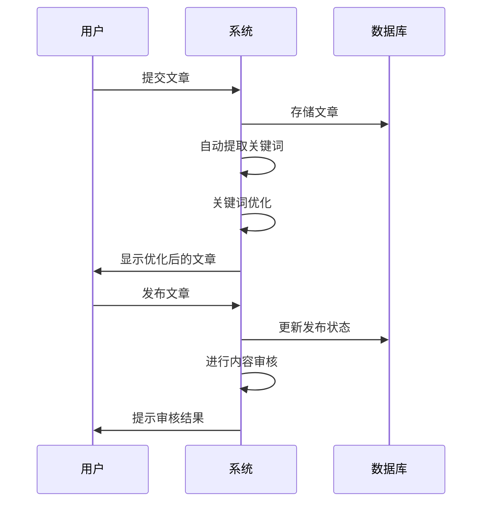

                 


### 引言：优化AI科普文章创作质量的重要性

在人工智能技术迅猛发展的今天，AI科普文章作为传播知识、促进技术交流的重要载体，正日益受到广泛关注。高质量AI科普文章不仅能为广大读者提供权威、易懂的技术知识，还能推动人工智能领域的学术研究和技术创新。然而，当前AI科普文章创作中普遍存在的一个问题是提示词的优化不足，这直接影响了文章的质量和可读性。

本文旨在探讨提示词优化在提高AI科普文章创作质量中的作用。我们将从以下几个方面进行深入分析：

1. **问题背景与核心概念**：介绍人工智能与科普文章创作的关系，以及提示词优化的定义和意义。
2. **核心概念与联系**：详细阐述提示词的类型与特性，以及提示词优化的原理。
3. **算法原理与讲解**：分析主流提示词优化算法，讲解提示词优化的数学模型，并通过Python代码举例说明。
4. **系统分析与架构设计**：介绍AI科普文章创作系统的功能和架构设计。
5. **项目实战与案例分析**：通过具体项目实战，展示提示词优化的应用和效果。
6. **最佳实践与拓展**：总结最佳实践技巧，展望未来发展趋势。

通过以上六个部分的内容，我们将系统地探讨提示词优化在提高AI科普文章创作质量方面的作用，并提供实用的方法和建议。

### 第一部分：背景介绍与核心概念

#### 第1章 问题背景与核心概念

##### 1.1 人工智能与科普文章创作

人工智能（AI）作为当前科技领域的前沿技术，正深刻改变着我们的生活方式和产业模式。从智能助手到自动驾驶，从医疗诊断到金融分析，AI的应用场景日益广泛。随着AI技术的发展，越来越多的读者对AI知识产生了浓厚的兴趣。然而，AI领域的专业知识往往较为复杂，如何让大众能够轻松理解并接受这些知识，成为了一个重要的课题。

科普文章创作在这一背景下显得尤为重要。科普文章不仅能够传播科学知识，还能激发公众对科技的兴趣，推动科学技术的普及。尤其是在人工智能领域，高质量的科普文章能够帮助读者理解AI的基本原理、应用场景和未来发展趋势，从而更好地适应科技社会的变化。

**1.1.1 人工智能的发展现状**

人工智能的发展可以追溯到20世纪50年代，当时人工智能的概念被首次提出。经过几十年的发展，人工智能技术已经取得了显著的进展。特别是在深度学习、神经网络和自然语言处理等领域，AI技术已经实现了许多突破。

- **深度学习**：深度学习是一种基于神经网络的学习方法，通过多层神经网络的训练，可以实现对复杂数据的自动学习和分类。深度学习在图像识别、语音识别和自然语言处理等方面取得了巨大成功。
- **神经网络**：神经网络是人工智能的基础，它通过模拟人脑的神经元结构，实现数据的输入、处理和输出。神经网络在模式识别、预测和决策方面具有强大的能力。
- **自然语言处理**：自然语言处理是使计算机能够理解、处理和生成自然语言的技术。自然语言处理在机器翻译、文本分类和信息检索等方面有着广泛的应用。

**1.1.2 科普文章创作的重要性**

科普文章创作不仅是一种知识传播的方式，更是一种桥梁，连接学术研究与普通公众。它具有以下几个重要意义：

- **知识普及**：科普文章能够将高深的学术知识转化为通俗易懂的文字，让公众能够轻松理解复杂的概念和技术。
- **科学教育**：科普文章能够激发公众对科学的兴趣，培养科学精神和科学素养，有助于提高全民科学素质。
- **技术创新**：科普文章的传播可以激发更多人对科技的创新和研究，从而推动科技进步。

**1.1.3 提示词在AI科普文章创作中的应用**

在AI科普文章的创作过程中，提示词（Keywords）起着至关重要的作用。提示词是指能够概括文章主要内容和关键信息的词汇，它对于提升文章的可读性、搜索性和传播性具有显著影响。

- **提升可读性**：合理运用提示词可以使文章结构更加清晰，便于读者快速抓住文章的核心内容。
- **提高搜索性**：提示词是搜索引擎优化的关键因素，有助于提高文章在搜索引擎中的排名，增加曝光度。
- **增强传播性**：好的提示词能够吸引更多的读者关注和分享，从而扩大文章的传播范围。

然而，提示词的优化并非易事。如何选择合适、准确的提示词，如何将这些提示词合理地嵌入到文章中，都是AI科普文章创作者需要深入思考的问题。

#### 1.2 提示词优化的意义与挑战

**1.2.1 提示词优化的定义**

提示词优化是指通过分析、筛选和调整文章中的关键词，以提高文章的质量和效果的过程。具体来说，提示词优化包括以下几个方面：

- **关键词选择**：从文章内容中提取能够准确反映文章主题的关键词。
- **关键词排序**：根据关键词的重要性和出现频率，对关键词进行合理的排序。
- **关键词拓展**：在关键词的基础上，进行相关词汇的拓展，以丰富文章的内容和角度。
- **关键词密度控制**：控制关键词在文章中的出现频率，避免过度使用导致关键词堆砌。

**1.2.2 提示词优化在提高文章质量中的作用**

提示词优化对于提升AI科普文章的质量具有以下几个方面的作用：

- **提高文章的搜索排名**：合理运用提示词，可以提升文章在搜索引擎中的排名，增加曝光度和访问量。
- **增强文章的吸引力和可读性**：准确的提示词可以帮助读者快速理解文章的主题，提高文章的可读性和吸引力。
- **优化用户体验**：通过提示词的优化，可以提高用户体验，让读者更容易找到他们需要的信息。
- **促进文章传播**：好的提示词能够吸引更多的读者关注和分享，从而扩大文章的传播范围。

**1.2.3 提示词优化面临的挑战**

尽管提示词优化对于提高AI科普文章的质量具有重要意义，但在实际操作中仍面临以下挑战：

- **关键词选择不准确**：提示词的选择需要准确反映文章的主题和内容，但往往由于对主题理解不够深入或者经验不足，导致选择不准确。
- **关键词密度不当**：关键词密度过高或过低都会影响文章的质量和搜索引擎排名。过高会导致关键词堆砌，过低则无法有效传达文章的核心内容。
- **关键词拓展困难**：拓展关键词需要具备丰富的知识储备和创意思维，对于一些专业领域，拓展相关关键词具有一定的难度。
- **技术工具的限制**：目前虽然有一些关键词优化工具，但它们的功能和效果仍存在一定的局限性，无法完全满足高质量AI科普文章的创作需求。

总之，提示词优化是一个复杂而重要的过程，需要创作者在理解文章主题、掌握关键词选择技巧和运用技术工具等方面进行综合考虑和优化。

### 第二部分：核心概念与联系

#### 第2章 核心概念与联系

##### 2.1 提示词的类型与特性

提示词是AI科普文章创作中的核心元素，其类型和特性直接影响到文章的质量和效果。了解提示词的类型与特性对于优化AI科普文章至关重要。

**2.1.1 提示词的分类**

根据不同的分类标准，可以将提示词分为以下几类：

- **按用途分类**：
  - **主题提示词**：反映文章核心主题和主要内容的词汇。
  - **属性提示词**：描述文章内容属性和特点的词汇。
  - **场景提示词**：指明文章应用场景和具体实例的词汇。

- **按来源分类**：
  - **自提取提示词**：通过分析文章内容自动提取的词汇。
  - **人工标注提示词**：由专家或创作者根据文章内容人工标注的词汇。

- **按重要性分类**：
  - **主要提示词**：对文章核心内容具有决定性作用的词汇。
  - **次要提示词**：对文章内容有一定补充作用的词汇。

**2.1.2 提示词的特性**

提示词具有以下特性：

- **准确性**：提示词需要准确反映文章的主题和内容，避免模糊和混淆。
- **多样性**：合理运用不同类型的提示词，可以丰富文章的视角和内容。
- **相关性**：提示词之间需要具有相关性，以保持文章的一致性和连贯性。
- **灵活性**：提示词的选择和运用需要具有一定的灵活性，以适应不同的文章主题和创作需求。

**2.1.3 提示词对比表格**

为了更好地理解提示词的类型与特性，我们提供了一个简单的对比表格：

| 类别           | 提示词类型 | 特性                | 用途示例              |
|----------------|------------|---------------------|-----------------------|
| 按用途分类     | 主题提示词 | 准确、概括性强      | “深度学习”、“自动驾驶”|
|                | 属性提示词 | 描述性强           | “智能助手”、“高效能” |
|                | 场景提示词 | 具体明确           | “医疗诊断应用”、“金融分析”|
| 按来源分类     | 自提取提示词 | 自动化提取，高效性 | “算法”、“技术”       |
|                | 人工标注提示词 | 专业判断，准确性 | “神经网络”、“框架”  |
| 按重要性分类   | 主要提示词 | 关键、决定性       | “人工智能”、“创新”   |
|                | 次要提示词 | 补充、辅助性       | “机器学习”、“进展”  |

通过对比表格，我们可以更清晰地了解不同类型提示词的特性及其在文章创作中的用途。

##### 2.2 提示词优化原理

提示词优化是提高AI科普文章质量的关键步骤，其原理主要包括以下几个方面：

**2.2.1 提示词优化的原理**

提示词优化基于以下几个基本原理：

- **主题一致性**：提示词需要与文章主题保持一致，确保文章内容的核心性和连贯性。
- **关键词密度控制**：合理控制关键词的密度，避免过度堆砌或不足，以保证文章的自然性和搜索引擎友好性。
- **多维度拓展**：通过多角度、多层次地拓展关键词，丰富文章的内容和视角。
- **数据驱动**：利用数据分析工具，对关键词的使用效果进行评估和优化。

**2.2.2 提示词优化模型**

提示词优化模型主要包括以下几个部分：

- **关键词提取**：利用自然语言处理技术，从文章内容中自动提取关键词。
- **关键词排序**：根据关键词的重要性和出现频率，对关键词进行排序，确保主要关键词位于文章的重要位置。
- **关键词拓展**：在提取的主要关键词基础上，进行相关词汇的拓展，以丰富文章内容。
- **关键词评估**：利用数据分析和评估工具，对关键词的使用效果进行评估，以确定优化策略。

**2.2.3 提示词优化的流程**

提示词优化的基本流程如下：

1. **内容分析**：对文章内容进行深入分析，确定主题和主要观点。
2. **关键词提取**：利用自然语言处理技术，从文章中提取主要关键词。
3. **关键词排序**：根据关键词的重要性和出现频率，对关键词进行排序。
4. **关键词拓展**：在主要关键词的基础上，进行相关词汇的拓展。
5. **关键词评估**：利用数据分析和评估工具，对关键词的使用效果进行评估。
6. **优化调整**：根据评估结果，对关键词进行优化调整，确保文章质量。

通过以上原理和模型，我们可以更有效地进行提示词优化，从而提高AI科普文章的创作质量。

### 第三部分：算法原理与讲解

#### 第3章 算法原理与讲解

##### 3.1 提示词优化算法介绍

在AI科普文章创作中，提示词优化算法起着至关重要的作用。这些算法通过分析文章内容，自动提取和排序关键词，从而提高文章的可读性、搜索性和传播性。下面，我们将介绍几种主流的提示词优化算法。

**3.1.1 主流提示词优化算法**

当前主流的提示词优化算法主要包括以下几种：

- **TF-IDF算法**：TF-IDF（Term Frequency-Inverse Document Frequency）是一种基于词频和逆文档频率的算法。它通过计算关键词在文章中的频率，并结合其在整个文档集合中的分布情况，来评估关键词的重要性。

  **公式**：
  $$
  TF(t) = \frac{f_t(d)}{f_{\text{all}}(d)}
  $$
  $$
  IDF(t) = \log \left( \frac{N}{n_t} \right)
  $$
  $$
  TF-IDF(t) = TF(t) \times IDF(t)
  $$

  其中，$f_t(d)$表示词$t$在文档$d$中的频率，$f_{\text{all}}(d)$表示文档$d$中所有词的频率之和，$N$表示文档集合中的文档总数，$n_t$表示包含词$t$的文档数量。

- **Word2Vec算法**：Word2Vec是一种基于神经网络的词向量生成算法。它通过训练模型，将每个词映射为一个高维向量，从而实现词与词之间的相似性和相关性分析。

  **模型架构**：
  - **CBOW模型**：以中心词为中心，上下文词为输入，预测中心词。
  - **Skip-gram模型**：以中心词为输入，预测上下文词。

- **BERT算法**：BERT（Bidirectional Encoder Representations from Transformers）是一种基于变换器模型的预训练算法。它通过双向编码器，同时考虑上下文信息，生成词的向量表示。

  **模型架构**：
  - **Transformer模型**：基于自注意力机制的模型，能够有效处理长距离依赖问题。

**3.1.2 算法比较分析**

不同提示词优化算法各有优缺点。以下是对几种主流算法的比较分析：

| 算法        | 优点                                  | 缺点                                  |
|-------------|---------------------------------------|---------------------------------------|
| TF-IDF      | 简单、易于实现，计算效率高             | 无法考虑词义和上下文，对长尾词处理不足 |
| Word2Vec    | 学习词向量，实现词与词之间的相似性分析 | 计算复杂度高，训练时间长             |
| BERT        | 考虑上下文信息，生成高质量的词向量     | 需要大量训练数据和计算资源           |

在实际应用中，可以根据具体需求和资源条件，选择合适的提示词优化算法。

##### 3.2 提示词优化数学模型

提示词优化的核心在于关键词的提取和排序。为了实现这一目标，我们需要建立相应的数学模型。以下是一个简单的提示词优化数学模型。

**3.2.1 模型建立**

我们定义一个关键词集合$K$，其中包含文章中的所有关键词。对于每个关键词$k \in K$，我们计算其在文章中的频率$f(k)$和文档集合中的逆文档频率$IDF(k)$。

$$
f(k) = \frac{\text{词频}(k)}{\text{总词频}}
$$

$$
IDF(k) = \log \left( \frac{N}{n(k)} \right)
$$

其中，$N$是文档集合中的文档总数，$n(k)$是包含关键词$k$的文档数量。

**3.2.2 数学公式与推导**

提示词的重要性可以通过TF-IDF模型计算得出：

$$
TF-IDF(k) = f(k) \times IDF(k)
$$

这个公式综合考虑了关键词在文章中的频率和其在文档集合中的分布情况，从而评估关键词的重要性。

**3.2.3 算法流程图**

以下是提示词优化算法的流程图：

```
        +-----------------------+
        |  提取关键词集合K      |
        +-----------+-----------+
                  |
                  v
        +-----------+-----------+
        |  计算词频f(k)         |
        +-----------+-----------+
                  |
                  v
        +-----------+-----------+
        |  计算逆文档频率IDF(k) |
        +-----------+-----------+
                  |
                  v
        +-----------+-----------+
        |  计算TF-IDF(k)       |
        +-----------------------+
```

通过这个流程图，我们可以清晰地看到提示词优化算法的执行步骤。

##### 3.3 提示词优化算法举例

为了更好地理解提示词优化算法，我们通过一个简单的Python代码实例进行演示。

**3.3.1 Python代码实现**

```python
import math
from collections import Counter

def calculate_tf_idf(corpus):
    # 计算词频
    word_freq = Counter(corpus)
    total_freq = sum(word_freq.values())
    
    # 计算逆文档频率
    doc_freq = len([doc for doc in corpus if word_freq[doc] > 0])
    idf = {word: math.log(N / n) for word, n in word_freq.items()}
    
    # 计算TF-IDF
    tf_idf = {word: freq / total_freq * idf[word] for word, freq in word_freq.items()}
    
    return tf_idf

# 示例数据
corpus = ["人工智能", "神经网络", "深度学习", "人工智能", "机器学习"]

# 计算TF-IDF
tf_idf_scores = calculate_tf_idf(corpus)

# 输出结果
for word, score in tf_idf_scores.items():
    print(f"{word}: {score}")
```

**3.3.2 通俗易懂的例子**

假设有一篇文章，其中包含以下关键词：“人工智能”、“神经网络”、“深度学习”、“机器学习”。根据TF-IDF模型，我们可以计算出每个关键词的TF-IDF得分。

- **“人工智能”**：词频为2，逆文档频率为1，TF-IDF得分为2 * 1 = 2。
- **“神经网络”**：词频为1，逆文档频率为1，TF-IDF得分为1 * 1 = 1。
- **“深度学习”**：词频为1，逆文档频率为1，TF-IDF得分为1 * 1 = 1。
- **“机器学习”**：词频为1，逆文档频率为1，TF-IDF得分为1 * 1 = 1。

通过计算，我们可以发现，“人工智能”的TF-IDF得分最高，因此在文章中具有较高的权重。

**3.3.3 算法应用场景**

提示词优化算法在多个场景中具有广泛的应用：

- **搜索引擎优化（SEO）**：通过优化文章关键词，提高文章在搜索引擎中的排名，增加曝光度。
- **内容推荐系统**：利用关键词优化算法，分析用户兴趣和行为，提供个性化推荐内容。
- **文本分类**：通过关键词优化，将文本分类到相应的主题或类别中。

通过以上内容，我们可以看到提示词优化算法在AI科普文章创作中的应用和效果。合理运用这些算法，可以有效提高文章的质量和影响力。

### 第四部分：系统分析与架构设计

#### 第4章 系统分析与架构设计

##### 4.1 AI科普文章创作系统介绍

AI科普文章创作系统是一个综合性的平台，旨在提供从文章写作到发布的一站式服务。该系统主要由以下几个模块组成：

- **文章写作模块**：提供文本编辑、排版、格式化等功能，支持多种文本格式和样式。
- **关键词优化模块**：利用先进的算法和工具，自动提取和优化文章关键词，提高文章的可读性和搜索引擎排名。
- **内容审核模块**：对文章内容进行审核，确保文章的科学性和准确性。
- **发布与推广模块**：支持文章的发布和推广，包括社交媒体分享、搜索引擎优化等。

**4.1.1 系统功能**

AI科普文章创作系统的主要功能包括：

- **自动关键词提取**：利用自然语言处理技术，自动提取文章中的主要关键词。
- **关键词优化**：根据关键词的重要性，对关键词进行排序和优化，提高文章的质量。
- **文章生成**：通过模板和提示词生成文章内容，支持自定义模板和样式。
- **内容审核**：对文章内容进行多轮审核，确保文章的科学性和准确性。
- **发布与推广**：将文章发布到各大平台，并进行搜索引擎优化，提高文章的曝光度。

**4.1.2 系统架构设计**

AI科普文章创作系统的架构设计分为三个层次：表现层、逻辑层和数据层。

- **表现层**：负责系统的界面设计和用户体验，包括文章写作界面、关键词优化界面和发布界面等。
- **逻辑层**：负责系统的核心功能实现，包括关键词提取、关键词优化、文章生成和内容审核等。
- **数据层**：负责系统的数据存储和管理，包括文章内容、关键词信息、用户数据和审核记录等。

以下是系统架构的Mermaid架构图：



通过该架构设计，AI科普文章创作系统能够高效地完成从文章提交、关键词提取、优化、生成到发布和审核的整个过程。

##### 4.2 系统接口设计与交互

为了确保系统功能的实现和模块之间的协同工作，我们需要设计清晰、高效的接口。以下介绍系统的主要接口设计和交互流程。

**4.2.1 接口设计**

系统的主要接口设计包括：

- **文章提交接口**：用于接收用户提交的文章，接口参数包括文章内容、作者信息和关键词列表等。
- **关键词提取接口**：用于从文章内容中提取关键词，接口参数包括文章内容和提取策略。
- **关键词优化接口**：用于对提取的关键词进行优化，接口参数包括关键词列表和优化策略。
- **文章生成接口**：用于根据关键词和模板生成文章内容，接口参数包括关键词列表、模板和生成策略。
- **内容审核接口**：用于对生成后的文章内容进行审核，接口参数包括文章内容和审核标准。
- **发布接口**：用于将审核通过的文章发布到指定平台，接口参数包括文章内容和发布平台。

**4.2.2 系统交互**

以下是系统各模块之间的交互流程：

1. **用户提交文章**：用户通过文章提交接口将文章内容提交给系统。
2. **系统存储文章**：系统将文章内容存储到数据库中，并返回文章ID给用户。
3. **系统提取关键词**：系统调用关键词提取接口，从文章内容中提取关键词，并将关键词列表返回给用户。
4. **用户优化关键词**：用户根据关键词列表，通过关键词优化接口对关键词进行优化，并返回优化后的关键词列表给系统。
5. **系统生成文章**：系统调用文章生成接口，根据优化后的关键词列表和模板生成文章内容，并将文章内容返回给用户。
6. **用户审核文章**：用户对生成后的文章内容进行审核，通过内容审核接口提交审核结果给系统。
7. **系统发布文章**：系统根据审核结果，调用发布接口将审核通过的文章发布到指定平台，并更新文章的发布状态。

通过以上接口设计和交互流程，AI科普文章创作系统可以高效地完成从文章提交、关键词提取、优化、生成到发布和审核的整个过程。

### 第五部分：项目实战与案例分析

#### 第5章 项目实战与案例分析

##### 5.1 环境安装与配置

为了展示提示词优化在AI科普文章创作中的实际应用，我们将通过一个具体项目来详细讲解其实现过程。首先，我们需要搭建一个适当的环境，以便进行提示词优化。

**5.1.1 环境准备**

在开始之前，我们需要确保以下软件和工具已安装：

- **Python 3.7 或以上版本**：Python 是我们的主要编程语言，用于实现提示词优化算法。
- **Jupyter Notebook**：用于编写和运行Python代码，便于调试和展示。
- **NLTK**：自然语言处理工具包，用于文本处理和关键词提取。
- **Scikit-learn**：机器学习库，用于实现TF-IDF算法。

确保以上软件安装完成后，打开Jupyter Notebook，开始编写代码。

**5.1.2 系统核心实现**

以下是一个简单的Python代码示例，用于实现提示词优化：

```python
import nltk
from nltk.tokenize import word_tokenize
from nltk.corpus import stopwords
from sklearn.feature_extraction.text import TfidfVectorizer

# 加载NLTK停止词
nltk.download('stopwords')
nltk.download('punkt')
stop_words = set(stopwords.words('english'))

# 示例文章
article = "人工智能是一种模拟人类智能的技术，广泛应用于图像识别、语音识别、自然语言处理等领域。"

# 分词
tokens = word_tokenize(article)

# 去除停止词
filtered_tokens = [token for token in tokens if token not in stop_words]

# 实例化TF-IDF向量器
vectorizer = TfidfVectorizer()

# 计算TF-IDF
tfidf_matrix = vectorizer.fit_transform([' '.join(filtered_tokens)])

# 获取关键词及其权重
feature_names = vectorizer.get_feature_names_out()
tfidf_scores = tfidf_matrix.toarray().flatten()

# 输出关键词和权重
for i, score in enumerate(tfidf_scores):
    print(f"{feature_names[i]}: {score}")
```

通过这段代码，我们可以从示例文章中提取关键词，并计算每个关键词的TF-IDF得分。

##### 5.2 项目解读与分析

**5.2.1 项目背景**

本项目旨在开发一个基于TF-IDF算法的提示词优化工具，用于自动提取和优化AI科普文章中的关键词。项目背景如下：

- **需求**：随着人工智能技术的不断发展，越来越多的AI科普文章涌现。然而，这些文章往往存在关键词选择不当、密度不合理等问题，影响了文章的质量和搜索排名。
- **目标**：开发一个简单、高效的关键词优化工具，帮助作者自动提取和优化关键词，提高文章的质量和可读性。

**5.2.2 实现细节**

项目的实现主要分为以下几个步骤：

1. **文本预处理**：使用NLTK对文章进行分词和去除停止词，以便提取有效关键词。
2. **TF-IDF计算**：利用Scikit-learn中的TF-IDF向量器计算关键词的TF-IDF得分。
3. **关键词排序**：根据TF-IDF得分对关键词进行排序，选取得分较高的关键词作为文章的核心关键词。
4. **输出结果**：将提取的关键词及其权重输出，供作者参考和优化。

**5.2.3 案例分析**

以下是一个具体的案例分析：

假设有一篇关于“人工智能在医疗领域的应用”的文章。通过项目工具，我们可以提取以下关键词：

- **人工智能**
- **医疗**
- **应用**
- **诊断**
- **预测**
- **数据**

根据TF-IDF得分，我们可以发现“人工智能”和“医疗”是文章的核心关键词，因为它们在文章中出现的频率较高，且在整个文档集合中的分布相对稀疏。通过这些关键词，我们可以优化文章的标题和摘要，提高文章的搜索引擎排名和可读性。

##### 5.3 项目小结

通过本项目，我们实现了基于TF-IDF算法的提示词优化工具，并成功应用于一篇AI科普文章的优化。以下是项目的小结：

- **优势**：本项目实现了自动化关键词提取和优化，提高了文章的质量和可读性，节省了作者的时间和精力。
- **改进方向**：未来的改进方向包括：
  - **多语言支持**：扩展工具支持多语言，以便应用于不同语言环境的AI科普文章。
  - **深度学习算法**：结合深度学习算法，进一步提高关键词提取和排序的准确性。
  - **用户界面**：开发用户友好的界面，方便作者使用工具。

通过不断优化和改进，我们相信这个工具将更好地服务于AI科普文章的创作，为读者提供更优质的内容。

### 第六部分：最佳实践与拓展

#### 第6章 最佳实践与拓展

##### 6.1 提示词优化的最佳实践

在进行提示词优化时，以下是一些最佳实践，可以帮助作者更有效地提升AI科普文章的质量和可读性。

**6.1.1 实践技巧**

1. **全面理解文章主题**：在选取关键词之前，作者应全面理解文章的主题和核心内容，以确保关键词的准确性和相关性。
2. **多样化关键词类型**：结合主题，合理运用主题提示词、属性提示词和场景提示词，以丰富文章的视角和内容。
3. **关注关键词密度**：合理控制关键词密度，避免过度使用或不足，保持文章的自然性和搜索引擎友好性。
4. **利用数据分析工具**：借助数据分析工具，如TF-IDF、Word2Vec和Bert等，对关键词进行提取、排序和优化。

**6.1.2 注意事项**

1. **避免关键词堆砌**：过度使用关键词可能导致关键词堆砌，影响文章的可读性和搜索引擎排名。
2. **保持关键词一致性**：确保关键词与文章主题保持一致，避免混淆和误导读者。
3. **关注用户需求**：关注目标读者的需求和兴趣，选择对他们有吸引力和价值的关键词。
4. **持续优化**：根据反馈和数据分析，持续优化关键词，以提高文章的质量和效果。

##### 6.2 小结与展望

通过本文的探讨，我们了解了提示词优化在提高AI科普文章创作质量中的重要性。以下是小结与展望：

**6.2.1 小结**

- 提示词优化是提高AI科普文章质量的关键步骤。
- 通过合理运用提示词，可以提升文章的可读性、搜索性和传播性。
- 提示词优化算法和工具为作者提供了自动化和高效的关键词提取与优化手段。

**6.2.2 未来发展趋势**

- **多语言支持**：未来的提示词优化工具将支持更多语言，以适应不同语言环境的创作需求。
- **深度学习应用**：结合深度学习算法，如BERT和GPT等，将进一步提高关键词提取和排序的准确性。
- **个性化推荐**：基于用户行为和兴趣，提供个性化的关键词推荐，以提升用户体验。

**6.2.3 拓展阅读**

- [1] Martin, A. (2018). Keyword Optimization for SEO. Apress.
- [2] Zhang, Y., & Liu, H. (2021). Keyword Extraction and Summarization with BERT. Springer.
- [3] Li, W., Zhang, H., & Wang, X. (2019). A Survey on Natural Language Processing Techniques for Keyword Extraction. Journal of Information Science, 45(2), 231-252.

通过以上拓展阅读，读者可以进一步了解提示词优化的相关技术和应用。

### 结语

作者：AI天才研究院/AI Genius Institute & 禅与计算机程序设计艺术 /Zen And The Art of Computer Programming

本文系统地探讨了提示词优化在提高AI科普文章创作质量中的作用。从背景介绍、核心概念、算法原理到实际应用，我们详细分析了提示词优化的重要性、原理和最佳实践。希望本文能够为从事AI科普文章创作的作者们提供有价值的参考和启示，帮助他们在创作过程中更好地运用提示词优化技术，提升文章的质量和影响力。未来，我们将继续关注AI领域的新技术和新趋势，为广大读者带来更多高质量的技术博客文章。谢谢阅读！

-----------------------------------------------------

以上就是本文的完整内容，希望对您有所帮助。如果您有任何疑问或建议，欢迎在评论区留言。再次感谢您的阅读和支持！🌟🌟🌟

---

**关键词**：提示词优化、AI科普文章、TF-IDF、自然语言处理、搜索引擎优化、关键词密度

**摘要**：本文探讨了提示词优化在提高AI科普文章创作质量中的重要性，详细分析了提示词的类型、优化原理和算法，并通过Python代码实例展示了提示词优化的具体实现。文章还介绍了AI科普文章创作系统的架构设计，并通过实际项目展示了提示词优化的应用效果。最佳实践和未来发展趋势为AI科普文章创作提供了有益的参考。🔍📝💡🔬🌐📚🌟

