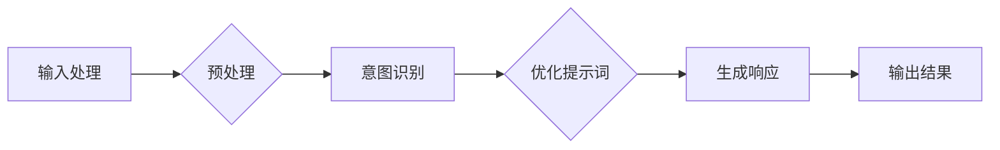
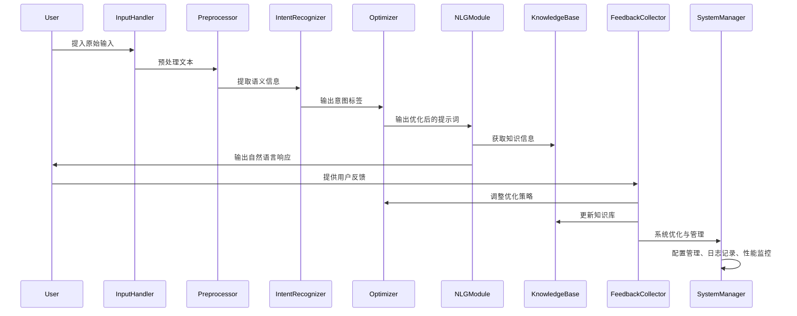

                 


### 引言

在当今人工智能领域，自然语言处理（NLP）已经成为了一项重要的研究方向。而其中，对话系统作为NLP应用的一个重要分支，近年来得到了广泛关注。作为对话系统的核心组成部分，提示词（Prompt）的质量直接影响到对话的流畅性和用户满意度。因此，如何优化提示词，使对话系统能够更好地理解用户的意图，成为了当前研究的一个重要课题。

本文将以ChatGPT为例，探讨提示词优化的问题。ChatGPT是一个基于GPT（Generative Pre-trained Transformer）模型的开源对话系统，其在处理自然语言任务方面展现了强大的能力。然而，在实际应用中，ChatGPT仍然存在一些问题，如对用户意图理解不够准确、生成回答不够合理等。这些问题在很大程度上都与提示词的质量有关。因此，本文将从以下几个方面对提示词优化进行深入探讨：

1. **问题背景与核心概念**：首先，我们将介绍提示词优化的重要性、面临的挑战以及目标，同时给出相关概念的定义和结构。

2. **核心概念与联系**：接着，我们将详细讨论提示词的定义、语义理解的原理以及对话系统的框架，并通过对比表格和ER实体关系图来展示概念之间的联系。

3. **算法原理讲解**：我们将介绍提示词优化的算法框架，使用Mermaid流程图展示算法的步骤，并给出Python源代码、数学模型和公式，以及具体的举例说明。

4. **系统分析与架构设计方案**：我们将分析实际应用场景中提示词优化的问题，并设计一个系统架构方案，包括系统功能设计、系统架构设计、系统接口设计和系统交互。

5. **项目实战**：最后，我们将通过一个实际项目，介绍环境安装、系统核心实现、代码应用解读与分析，并分析实际案例。

6. **最佳实践 tips、小结、注意事项、拓展阅读**：总结文章内容，给出最佳实践建议，并对文章进行小结，指出注意事项，提供拓展阅读资源。

通过本文的探讨，我们希望能够帮助读者理解提示词优化的原理和方法，掌握如何在实际项目中应用这些方法，从而提升对话系统的性能。

## 1.1 问题背景

### 1.1.1 提示词优化的重要性

提示词（Prompt）在自然语言处理（NLP）领域中扮演着至关重要的角色。它不仅引导对话系统（如ChatGPT）理解用户的意图，还直接影响生成回答的质量和相关性。对于对话系统而言，高质量的提示词意味着系统能够更准确地捕捉到用户的真实需求，并生成更加自然、合理的回答。

在用户与对话系统交互的过程中，提示词是用户意图表达的主要载体。一个有效的提示词不仅能够明确传达用户的请求，还能够引导对话系统做出更加符合用户期待的回应。因此，优化提示词成为了提升对话系统用户体验的核心任务。

首先，优化提示词有助于提高对话的流畅性。当提示词表达清晰、准确时，对话系统能够更快地理解用户意图，减少误解和错误回答的可能性。这不仅能够提升用户的满意度，还能增加用户对对话系统的信任度。

其次，优化提示词对于提升回答的相关性和质量具有重要意义。通过精心设计的提示词，对话系统可以更好地抓住用户的需求点，从而生成更加贴合用户需求的回答。这对于解决用户问题、提供信息或者进行闲聊等场景都具有关键作用。

此外，提示词的优化还能够增强对话系统的自适应能力。在实际应用中，用户的请求往往多种多样，可能包含多种意图和信息需求。通过优化提示词，对话系统可以更好地适应不同用户需求的变化，从而提高其泛化能力。

总之，提示词优化在提升对话系统性能和用户体验方面具有重要意义。它不仅能够提高对话的流畅性和回答质量，还能够增强系统的自适应能力，为用户提供更加优质的交互体验。

### 1.1.2 提示词优化的挑战

尽管提示词优化的重要性显而易见，但实际操作中仍面临着诸多挑战。首先，自然语言的复杂性使得用户意图的表达具有多义性和模糊性，这给提示词的精准理解带来了困难。用户在提出请求时，可能使用不同的词汇、句式和语境，这些差异可能导致对话系统对意图的误判。

其次，数据质量对提示词优化的效果有直接影响。高质量的训练数据是优化提示词的基础，但如果数据存在噪声、不完整或者不准确的情况，那么优化效果可能会大打折扣。例如，训练数据中的错误标注、缺失信息或者偏见都可能影响对话系统对提示词的理解和生成回答的质量。

此外，用户多样性也是提示词优化的一大挑战。不同的用户具有不同的语言习惯、表达方式和知识背景，这增加了提示词优化的复杂性。一种通用的提示词优化方法难以适应所有用户的需求，需要针对不同用户群体进行定制化优化。

技术实现方面，提示词优化涉及到多种算法和技术手段，包括自然语言处理（NLP）技术、机器学习算法和深度学习模型等。这些技术虽然在理论上有一定的成熟度，但在实际应用中仍然面临诸多实现难点，如算法参数调优、模型训练和部署等。

最后，用户隐私和安全也是提示词优化需要考虑的重要因素。在优化提示词的过程中，可能需要收集和分析用户的个人数据和交互记录。如何保护用户隐私、确保数据安全是技术实现中必须解决的问题。

总之，提示词优化虽然具有重要意义，但在实际操作中面临着多方面的挑战。只有深入理解这些挑战，并采取有效的应对策略，才能实现高质量的提示词优化，提升对话系统的性能和用户体验。

### 1.1.3 提示词优化的目标

在明确提示词优化的重要性及其面临的挑战后，我们需要进一步明确提示词优化的具体目标。这些目标将指导我们设计优化策略和方法，以期达到最佳效果。

首先，提升意图识别的准确性是提示词优化的核心目标之一。意图识别是对话系统理解用户请求的关键步骤，其准确性直接影响到后续对话的流畅性和有效性。通过优化提示词，对话系统能够更精准地捕捉到用户的真实意图，从而减少误解和错误回答的情况。

其次，提高回答的相关性和合理性也是提示词优化的关键目标。一个优质的回答不仅需要准确理解用户的意图，还需要提供与用户需求高度相关的信息。通过优化提示词，对话系统可以生成更加贴合用户需求的回答，提升用户的满意度和信任感。

此外，增强对话系统的自适应能力是另一个重要目标。用户的需求和表达方式多种多样，对话系统需要具备良好的自适应能力，以应对不同的用户场景和需求。通过优化提示词，对话系统可以更好地适应不同用户的需求，提高其泛化能力和用户体验。

最后，提示词优化的目标还包括提升对话的流畅性和交互质量。一个有效的提示词不仅能提高对话系统的响应速度，还能使对话更加自然、连贯，增强用户的沉浸感和互动体验。

总之，提示词优化的目标在于提高意图识别的准确性、回答的相关性和合理性，增强系统的自适应能力，以及提升对话的流畅性和交互质量。这些目标共同构成了提示词优化的重要方向，指导我们在实际操作中采取有效的策略和方法。

## 1.2 问题描述

### 1.2.1 传统方法局限性

传统的提示词优化方法主要包括手动编辑和规则驱动的方法。手动编辑是指通过人工对提示词进行修改和优化，以提高对话系统的理解能力。这种方法依赖于人类专家的经验和判断，具有以下局限性：

首先，手动编辑耗时且效率低下。当面对大量提示词时，人工编辑不仅耗时耗力，而且难以保证一致性。此外，人工编辑往往依赖于特定领域的专业知识，难以适应广泛的应用场景。

其次，手动编辑缺乏系统性和科学性。虽然手动编辑可以在一定程度上提升提示词质量，但其效果往往依赖于编辑者的个人经验和判断。这种方法缺乏系统化的优化策略，难以大规模推广应用。

规则驱动的方法通过预设一系列规则来指导提示词的优化。这种方法的主要优势在于实现简单，易于理解和部署。然而，规则驱动的方法也存在明显的局限性：

首先，规则驱动的灵活性较差。当用户请求的语义发生变化时，现有的规则可能无法适应，导致错误回答或者不相关回答的出现。

其次，规则驱动的可扩展性有限。随着应用场景的扩大和用户需求的多样化，规则的数量和复杂性会急剧增加，维护和更新规则将变得非常困难。

此外，传统方法在处理复杂、模糊和多义的提示词时表现不佳。自然语言具有高度的不确定性和多样性，传统方法难以捕捉到这些特点，导致对话系统在理解用户意图时出现误差。

综上所述，传统方法在提示词优化方面存在显著的局限性，难以满足现代对话系统对高质量提示词的需求。因此，探索更高效、灵活和智能的提示词优化方法成为当前研究的重要方向。

### 1.2.2 ChatGPT提示词优化需求

ChatGPT是一个基于GPT（Generative Pre-trained Transformer）模型的对话系统，其在自然语言理解和生成方面展现了出色的能力。然而，在实际应用中，ChatGPT仍然面临着提示词优化的挑战，这主要表现在以下几个方面：

首先，用户意图识别不准确。ChatGPT在处理用户请求时，往往难以准确理解用户的真实意图，导致生成回答与用户需求不符。例如，当用户请求提供某个特定信息时，ChatGPT可能生成一些相关但并不准确的信息，从而降低了用户的满意度。

其次，生成回答的相关性和合理性不足。尽管ChatGPT能够生成丰富的回答，但这些回答在相关性和合理性方面仍然存在不足。例如，在某些场景下，ChatGPT生成的回答可能包含过多的无关信息，或者生成的内容缺乏逻辑连贯性。

此外，ChatGPT在处理复杂、模糊和多义的提示词时，表现尤为困难。自然语言具有高度的不确定性和多样性，ChatGPT在处理这些复杂提示词时，容易出现错误理解或者生成不合理的回答。这严重影响了用户的交互体验和对话系统的性能。

针对以上问题，对ChatGPT进行提示词优化具有以下几个需求：

1. **提高意图识别的准确性**：通过优化提示词，ChatGPT需要能够更准确地理解用户的意图，减少误解和错误回答的情况。这需要开发新的算法和技术手段，以增强对话系统对用户意图的捕捉能力。

2. **提升回答的相关性和合理性**：优化后的提示词应能引导ChatGPT生成更加相关和合理的回答，减少无关信息和不合理内容的出现。这需要结合用户需求和上下文信息，设计有效的提示词优化策略。

3. **增强系统的自适应能力**：面对多样化的用户请求，ChatGPT需要具备良好的自适应能力，能够根据不同的用户场景和需求，生成更加个性化的回答。这需要开发能够适应不同用户群体的优化方法，提升系统的泛化能力。

4. **提高对话的流畅性和用户体验**：通过优化提示词，ChatGPT需要能够生成更加自然、连贯的回答，提升用户的交互体验。这需要综合考虑语言表达、语义理解和对话场景，设计出高质量的提示词。

总之，ChatGPT提示词优化需求旨在提高对话系统的性能和用户体验，解决当前存在的意图识别不准确、回答相关性和合理性不足等问题。通过不断优化提示词，ChatGPT将能够更好地服务于用户，提升其应用价值。

## 1.3 问题解决

### 1.3.1 提示词优化的基本原理

提示词优化的基本原理主要涉及两个方面：语义理解与生成模型。这两个方面相辅相成，共同作用于提升对话系统的性能。

首先，**语义理解**是提示词优化的核心。其目的是通过分析用户输入的提示词，理解其背后的意图、情感和上下文信息。为了实现这一目标，对话系统需要依赖于自然语言处理（NLP）技术，包括词法分析、句法分析、语义角色标注等。通过这些技术手段，对话系统可以提取出提示词中的关键信息，并将其转化为结构化的数据形式，以便进一步处理。

其次，**生成模型**负责根据优化后的提示词生成相应的回答。生成模型通常采用深度学习技术，特别是序列到序列（Seq2Seq）模型或变分自编码器（VAE）等。这些模型通过对大量训练数据的学习，能够捕捉到语言生成的规律，从而生成高质量的自然语言回答。在生成模型中，提示词的优化直接影响生成回答的质量。高质量的提示词可以帮助模型更好地理解用户意图，从而生成更加相关、合理和自然的回答。

**优化策略与方法**方面，常用的方法包括：

1. **基于规则的方法**：这种方法通过定义一系列规则来指导提示词的优化。例如，可以设置关键词权重、语句结构分析和语境判断等规则。基于规则的方法简单直观，易于实现，但灵活性较差，难以适应复杂多变的用户请求。

2. **基于机器学习的方法**：这种方法利用机器学习算法，特别是监督学习和无监督学习，来优化提示词。监督学习通过标注数据进行训练，学习如何将原始提示词转换为优化后的提示词。无监督学习则通过数据分布和学习模型间的相似性来进行优化。基于机器学习的方法具有较强的自适应能力，但训练数据的质量和数量对其效果有重要影响。

3. **基于深度学习的方法**：这种方法利用深度学习模型，如循环神经网络（RNN）、长短时记忆网络（LSTM）和Transformer等，来进行提示词优化。深度学习模型能够捕捉到更复杂的语言模式，从而生成更加精准和自然的回答。然而，深度学习模型的训练过程较为复杂，对计算资源有较高要求。

4. **混合方法**：混合方法结合了多种优化策略，通过融合规则、机器学习和深度学习等手段，实现更加全面的提示词优化。这种方法能够在不同场景下灵活调整，提高优化效果。

综上所述，提示词优化是一个复杂的过程，涉及语义理解与生成模型两个核心环节。通过采用不同的优化策略与方法，对话系统可以更准确地理解用户意图，生成高质量的自然语言回答，从而提升用户体验和系统性能。

### 1.3.2 提示词优化的策略与方法

在明确提示词优化的基本原理后，我们需要进一步探讨具体的优化策略和方法。以下是一些常用的策略和方法，每种方法都有其独特的优势和应用场景。

#### 1. 基于规则的方法

**规则驱动方法**是通过预设一系列规则来指导提示词的优化。这些规则可以是简单的关键词权重设置，也可以是复杂的语句结构分析。以下是一些常见的规则：

- **关键词权重设置**：根据关键词的重要程度，对提示词中的词汇进行加权，使对话系统能够更关注关键信息。
- **语法结构分析**：通过对句子进行词性标注和语法分析，识别出主语、谓语和宾语等核心成分，从而确保对话系统能够准确理解用户的意图。
- **语境判断**：结合上下文信息，对用户的请求进行语义理解，以区分不同语境下的意图。

**优势**：规则驱动方法实现简单、易于理解，适用于相对简单的场景。

**局限**：灵活性较差，难以应对复杂和多变的用户请求。

**应用场景**：适用于结构化信息查询和简单问答系统。

#### 2. 基于机器学习的方法

**机器学习方法**依赖于大规模的训练数据和监督学习算法。以下是一些常用的机器学习方法：

- **监督学习**：通过标注数据进行训练，学习如何将原始提示词转换为优化后的提示词。常见的方法包括分类、回归和序列标注等。
- **无监督学习**：通过分析数据分布和学习模型间的相似性，进行提示词优化。例如，可以使用聚类方法来发现提示词中的潜在结构。

**优势**：具有较强的自适应能力，能够处理复杂和多变的用户请求。

**局限**：对训练数据的质量和数量有较高要求，训练过程可能较为复杂。

**应用场景**：适用于自然语言处理任务中的各种场景，如问答系统、文本分类和机器翻译等。

#### 3. 基于深度学习的方法

**深度学习方法**利用深度神经网络来优化提示词。以下是一些常用的深度学习模型：

- **循环神经网络（RNN）**：通过捕捉时间序列信息，对提示词进行序列建模。常见的RNN模型包括LSTM和GRU等。
- **变换器（Transformer）**：通过自注意力机制，对提示词进行全局建模，能够捕捉到复杂的语言模式。Transformer模型在自然语言处理任务中取得了显著成果。

**优势**：能够捕捉到更加复杂的语言模式，生成高质量的自然语言回答。

**局限**：训练过程较为复杂，对计算资源有较高要求。

**应用场景**：适用于高复杂度的自然语言处理任务，如机器翻译、文本生成和对话系统等。

#### 4. 混合方法

**混合方法**结合了多种优化策略，通过融合规则、机器学习和深度学习等手段，实现更加全面的提示词优化。以下是一些常见的混合方法：

- **规则与机器学习的结合**：通过规则驱动方法初步筛选提示词，然后使用机器学习算法进行进一步优化。
- **机器学习与深度学习的结合**：使用机器学习算法进行特征提取，然后利用深度学习模型进行优化。

**优势**：能够在不同场景下灵活调整，提高优化效果。

**局限**：实现较为复杂，需要平衡不同方法之间的优劣。

**应用场景**：适用于需要高灵活性和高精度的应用场景，如智能客服和虚拟助手等。

综上所述，提示词优化的策略与方法多种多样，每种方法都有其适用的场景和优缺点。在实际应用中，可以根据具体需求选择合适的方法，或者结合多种方法，实现高质量的提示词优化。

## 1.4 边界与外延

### 1.4.1 提示词优化的应用领域

提示词优化在多个领域具有广泛的应用，尤其在自然语言处理（NLP）和对话系统的应用中表现尤为突出。

首先，在**客户服务**领域，提示词优化能够显著提升客户满意度。通过对客户提问的提示词进行优化，智能客服系统能够更准确地理解客户的需求，提供更加精准和有效的解决方案。例如，银行客服系统可以通过优化提示词来识别客户的财务问题，提供专业的理财建议。

其次，在**教育**领域，提示词优化能够提升学习体验。教育系统中的对话系统能够通过优化提示词，更好地理解学生的提问，提供个性化的学习资源和辅导。例如，语言学习软件可以通过优化提示词，为学生提供更加贴合其学习进度的练习和反馈。

在**医疗**领域，提示词优化也有重要的应用。通过对患者提问的提示词进行优化，医疗对话系统可以更准确地捕捉患者的病情描述，协助医生进行诊断和治疗。例如，在线健康咨询平台可以通过优化提示词，提高患者咨询问题的理解度和回答的准确性。

此外，在**娱乐**和**游戏**领域，提示词优化能够提升用户体验。通过优化游戏中的对话，游戏系统能够更自然、有趣地与玩家互动，提高游戏的沉浸感和趣味性。例如，角色扮演游戏可以通过优化提示词，使其NPC（非玩家角色）更加智能和逼真。

### 1.4.2 提示词优化与人工智能的关系

提示词优化与人工智能（AI）密切相关，两者相辅相成，共同推动自然语言处理（NLP）和对话系统的发展。

首先，**人工智能**为提示词优化提供了强大的技术支持。随着深度学习、自然语言处理等AI技术的不断发展，对话系统在理解用户意图、生成自然语言回答方面取得了显著进步。这些技术的应用使得提示词优化更加高效和精准。

其次，**提示词优化**是人工智能应用的重要一环。在NLP和对话系统中，高质量的提示词能够显著提升系统的性能和用户体验。通过优化提示词，对话系统能够更好地理解用户的意图，生成更加相关和自然的回答，从而提高系统的应用价值和用户满意度。

此外，提示词优化还与**人工智能的伦理和社会影响**密切相关。随着AI技术的发展，如何确保AI系统的公平性、透明性和安全性成为重要议题。在提示词优化过程中，需要充分考虑用户的隐私保护和数据安全，确保系统的公平性和透明性。

总之，提示词优化与人工智能密不可分，两者共同推动了NLP和对话系统的进步。在未来的发展中，随着AI技术的不断成熟和应用的深入，提示词优化也将继续发挥重要作用，为人类带来更加智能、便捷和高效的交互体验。

## 1.5 概念结构与核心要素组成

### 1.5.1 关键概念介绍

在探讨提示词优化的过程中，了解以下几个关键概念至关重要：

**1. 提示词（Prompt）**：提示词是用户与对话系统进行交互时的输入信息，通常是以自然语言形式表达的。高质量提示词能够明确传达用户的意图，是优化工作的基础。

**2. 语义理解（Semantic Understanding）**：语义理解是指对话系统对用户输入的提示词进行解析和解释的过程。通过语义理解，系统能够识别用户的意图、情感和上下文信息，从而生成恰当的回答。

**3. 对话系统（Dialogue System）**：对话系统是一种与用户进行自然语言交互的计算机系统。它通常包括对话管理、语言理解和语言生成等模块，能够根据用户输入生成自然语言回答。

**4. 自然语言处理（Natural Language Processing, NLP）**：NLP是人工智能的一个分支，旨在使计算机能够理解、处理和生成自然语言。NLP技术广泛应用于文本分类、信息提取、机器翻译等领域。

**5. 生成模型（Generative Model）**：生成模型是一种能够生成新数据的机器学习模型。在对话系统中，生成模型负责根据提示词生成自然语言回答。常见的生成模型包括序列到序列（Seq2Seq）模型和变分自编码器（VAE）等。

**6. 循环神经网络（Recurrent Neural Network, RNN）**：RNN是一种能够处理序列数据的神经网络。在自然语言处理中，RNN被广泛应用于文本生成和序列标注等任务。

**7. 变换器（Transformer）**：Transformer是一种基于自注意力机制的深度学习模型，在自然语言处理任务中取得了显著成果。与传统的循环神经网络相比，Transformer能够更好地捕捉全局信息，从而生成更加准确的自然语言回答。

**8. 监督学习（Supervised Learning）**：监督学习是一种机器学习方法，通过已标注的数据进行训练，学习输入和输出之间的关系。在提示词优化中，监督学习被用于从标注数据中学习如何优化提示词。

**9. 无监督学习（Unsupervised Learning）**：无监督学习不依赖标注数据，通过数据自身分布进行学习。在提示词优化中，无监督学习可以用于发现提示词中的潜在结构或模式。

**10. 规则驱动方法（Rule-Based Method）**：规则驱动方法通过预设的规则来指导提示词优化。这种方法实现简单，但灵活性较差，难以适应复杂多变的场景。

### 1.5.2 提示词优化的要素组成

提示词优化的成功依赖于以下几个关键要素：

**1. 数据质量**：高质量的数据是提示词优化的基础。数据应具有多样性、覆盖广泛的应用场景和丰富的标注信息，以确保模型能够捕捉到不同用户请求的特点。

**2. 模型选择**：选择适合的模型对于提示词优化至关重要。不同的模型具有不同的优势和应用场景，例如，RNN和Transformer在文本生成任务中表现优异，而规则驱动方法在简单场景中较为适用。

**3. 算法实现**：有效的算法实现能够提高优化效率。这包括优化训练过程、模型参数调整和部署策略等。

**4. 用户反馈**：用户反馈是持续改进提示词优化的关键。通过收集用户对回答的满意度评价，可以及时调整优化策略，提升系统的性能和用户体验。

**5. 安全性和隐私保护**：在提示词优化过程中，保护用户隐私和安全至关重要。应采取有效的措施，确保用户数据的安全和隐私。

**6. 伦理和社会责任**：提示词优化不仅要关注技术实现，还应充分考虑伦理和社会责任。确保系统的公平性、透明性和安全性，避免对用户造成不良影响。

通过上述关键概念和要素的详细介绍，读者可以更好地理解提示词优化的原理和方法，从而在实际应用中取得更好的效果。

## 1.6 本章小结

本章主要介绍了提示词优化的重要性、面临的挑战及其目标。我们首先阐述了提示词优化在提升对话系统性能和用户体验方面的关键作用，并详细分析了传统方法在提示词优化中的局限性。接着，我们提出了ChatGPT提示词优化的需求，包括提高意图识别的准确性、回答的相关性和合理性，以及增强系统的自适应能力。在问题解决部分，我们介绍了提示词优化的基本原理和策略与方法，包括基于规则、机器学习和深度学习的方法，以及混合方法。此外，我们还讨论了提示词优化在不同应用领域中的重要性，以及其与人工智能的紧密关系。通过本章的探讨，读者可以全面了解提示词优化的核心概念和实现方法，为进一步研究和实践打下坚实基础。

## 2.1 核心概念原理

### 2.1.1 提示词的定义与作用

提示词（Prompt）是用户与对话系统进行交互时的输入信息，通常以自然语言形式表达。它的作用在于引导对话系统理解用户的意图，从而生成合适的回答。高质量的提示词能够明确传达用户的请求，提高对话的流畅性和有效性。

首先，提示词的定义。提示词是一种简短、明确且具有引导性的文字信息，通常用于启动对话或引导对话方向。在自然语言处理（NLP）和对话系统中，提示词是用户意图表达的重要载体。通过精心设计的提示词，对话系统可以更准确地理解用户的意图，从而生成相关、合理的回答。

其次，提示词的作用。提示词在对话系统中具有以下几个重要作用：

1. **明确意图**：提示词能够明确传达用户的请求和需求，使对话系统能够快速定位用户的意图。这对于解决用户问题和提供信息尤为重要。

2. **引导对话**：通过提示词，用户可以明确对话的方向和主题，帮助对话系统更好地组织和生成回答。高质量的提示词可以引导对话系统进行深入讨论，提高对话的连贯性和逻辑性。

3. **优化体验**：高质量的提示词能够提升用户的交互体验。当用户提出明确、具体的请求时，对话系统可以更快地响应，减少用户等待时间和交互成本。

4. **提高性能**：对于训练模型而言，高质量的提示词可以提供更有价值的数据，帮助模型更好地学习用户的意图和需求，从而提高整体性能。

总之，提示词的定义和作用在于通过简短、明确的文字信息，引导对话系统理解用户的意图，生成相关、合理的回答，从而提升对话的流畅性和用户体验。

### 2.1.2 语义理解的原理

语义理解（Semantic Understanding）是自然语言处理（NLP）的核心任务之一，它旨在使计算机能够理解、解析和解释人类语言。在对话系统中，语义理解是实现准确意图识别和生成合理回答的关键步骤。下面，我们将详细探讨语义理解的原理、方法和实现。

#### 原理

语义理解的目标是捕捉语言中的深层含义，而不仅仅是表面上的文字符号。其原理可以概括为以下几个步骤：

1. **词法分析（Lexical Analysis）**：词法分析是将文本分解为单词和其他语言元素的过程。这一步骤的目的是识别文本中的词汇，并将其转换为语言元素。词法分析是语义理解的基础，它有助于后续的句法分析和语义分析。

2. **句法分析（Syntactic Analysis）**：句法分析是理解句子结构的过程。通过分析句子的语法关系，可以确定单词在句子中的角色和功能。常见的句法分析方法包括词性标注（Part-of-Speech Tagging）、句法树（Syntactic Parsing）和依存关系分析（Dependency Parsing）。

3. **语义分析（Semantic Analysis）**：语义分析是理解句子语义的过程。它涉及识别句子中的实体、关系和事件，并理解它们之间的语义关系。语义分析的结果可以帮助对话系统理解用户的意图和需求。

4. **上下文分析（Context Analysis）**：上下文分析是指结合上下文信息来理解句子语义。语言是高度上下文相关的，同一句子在不同上下文中可能具有不同的语义。通过上下文分析，对话系统可以更好地理解用户意图，避免歧义和误解。

#### 方法

实现语义理解的方法多种多样，主要包括基于规则的方法、机器学习方法以及深度学习方法。

1. **基于规则的方法**：基于规则的方法通过定义一系列语法和语义规则来指导语言处理。这种方法通常用于处理结构化信息，如自然语言处理中的信息提取和文本分类。然而，基于规则的方法在处理复杂、模糊和多义的文本时效果有限，难以适应多样化的语言场景。

2. **机器学习方法**：机器学习方法通过训练模型来学习语义规则和模式。常见的机器学习方法包括监督学习和无监督学习。监督学习使用已标注的数据来训练模型，从而学习如何进行语义分析。无监督学习则通过分析未标注的数据来发现语义结构和模式。机器学习方法具有较强的自适应能力，能够处理复杂和多变的文本。

3. **深度学习方法**：深度学习方法利用神经网络，特别是深度神经网络（DNN）和变换器（Transformer）等模型，来处理大规模的文本数据。深度学习方法能够捕捉到语言中的复杂模式和规律，从而实现高效的语义分析。变换器模型通过自注意力机制，可以捕捉到全局信息，从而提高语义理解的准确性。

#### 实现

实现语义理解通常涉及以下几个步骤：

1. **文本预处理**：文本预处理包括去除无关信息、分词、词性标注等。这一步骤的目的是将原始文本转换为适合模型处理的格式。

2. **句法分析**：通过句法分析确定句子的结构，识别单词在句子中的角色和功能。常见的句法分析方法包括词性标注和依存关系分析。

3. **语义分析**：根据句法分析的结果，进行语义分析，识别句子中的实体、关系和事件，并理解它们之间的语义关系。

4. **上下文分析**：结合上下文信息，对句子的语义进行进一步分析，以确保语义理解的准确性。

5. **意图识别**：基于语义分析的结果，识别用户的意图和需求，为生成回答提供基础。

通过以上步骤，对话系统可以实现对用户输入的语义理解，从而生成相关、合理的回答。总的来说，语义理解是一个复杂的过程，需要结合多种技术和方法来实现。随着自然语言处理技术的不断发展，语义理解将越来越准确和高效，为对话系统带来更好的用户体验。

### 2.1.3 对话系统的框架

对话系统（Dialogue System）是一种能够与用户进行自然语言交互的计算机系统。它的主要目标是理解和响应用户的请求，提供有效的沟通和服务。一个典型的对话系统通常包括以下几个核心组件和模块：

#### 核心组件

1. **用户界面（User Interface, UI）**：用户界面是用户与对话系统进行交互的入口。它可以是文本聊天界面、语音通话界面或图形用户界面（GUI）。用户通过输入文本、语音或点击操作与系统进行交互。

2. **自然语言理解（Natural Language Understanding, NLU）**：自然语言理解模块负责解析用户输入的自然语言，理解其意图和上下文信息。这一模块通常包括词法分析、句法分析和语义分析等步骤，以提取用户请求的关键信息。

3. **对话管理（Dialogue Management）**：对话管理模块负责维护对话的状态，决定对话的流程和方向。它根据NLU模块的输出，结合对话历史和系统知识，生成下一步的对话动作，如提问、提供信息或转接至其他系统模块。

4. **自然语言生成（Natural Language Generation, NLG）**：自然语言生成模块负责根据对话管理模块的决策生成自然语言回答。这一模块通常使用模板、规则或生成模型（如变换器）来生成流畅、自然的语言。

5. **知识库（Knowledge Base）**：知识库是对话系统的核心数据资源，包含各种事实、规则和知识信息。对话系统可以查询知识库以获取相关信息，从而提高回答的准确性和相关性。

6. **反馈机制（Feedback Mechanism）**：反馈机制用于收集用户对回答的满意度评价，以持续改进对话系统的性能。通过反馈机制，对话系统可以不断优化其意图识别和回答生成能力。

#### 模块关系

这些核心组件通过复杂的交互和协作来实现对话系统的整体功能。以下是各组件之间的关系：

1. **用户界面与自然语言理解**：用户界面接收用户输入，将其传递给自然语言理解模块。自然语言理解模块对输入文本进行解析，提取意图和上下文信息，并将其输出给对话管理模块。

2. **对话管理与自然语言生成**：对话管理模块根据自然语言理解模块的输出，结合对话历史和系统知识，生成下一步的对话动作。对话管理模块还负责协调对话流程，确保对话的连贯性和一致性。对话管理模块的决策通常作为输入传递给自然语言生成模块，以生成最终的自然语言回答。

3. **知识库与对话管理**：知识库为对话管理模块提供相关信息，帮助其做出更加准确的对话决策。对话管理模块可以通过查询知识库来获取用户请求相关的数据，从而提高回答的准确性和相关性。

4. **自然语言生成与用户界面**：自然语言生成模块根据对话管理模块的决策，生成自然语言回答。这些回答通过用户界面返回给用户，完成对话的交互过程。

5. **反馈机制与其他模块**：反馈机制用于收集用户对回答的满意度评价。这些评价可以作为训练数据，用于优化自然语言理解、对话管理和自然语言生成模块的性能。通过持续优化，对话系统可以不断提升其服务质量。

总之，对话系统的框架通过用户界面、自然语言理解、对话管理、自然语言生成、知识库和反馈机制的协作，实现了与用户的自然语言交互。各模块相互依赖、相互促进，共同构建了一个高效、智能的对话系统。

### 2.2 概念属性特征对比表格

在深入探讨提示词、语义理解和对话系统框架之后，为了更好地理解这些核心概念之间的区别和联系，我们将通过一个属性特征对比表格来展示它们的主要特征。以下是对几个关键概念的对比：

| 概念            | 描述                                                         | 关键属性                  | 应用场景                                      |
| --------------- | ------------------------------------------------------------ | ------------------------- | --------------------------------------------- |
| 提示词（Prompt） | 用户与对话系统进行交互时的输入信息，用于引导对话系统理解意图。 | 明确性、引导性、简洁性   | 文本聊天、语音交互、图形用户界面（GUI）等     |
| 语义理解（NLU） | 对话系统对用户输入的自然语言进行解析，提取意图和上下文信息。 | 精准性、上下文理解、多义性处理 | 对话系统、自然语言处理应用、智能客服等       |
| 对话系统框架    | 包括用户界面、自然语言理解、对话管理、自然语言生成、知识库和反馈机制等组件。 | 整体性、交互性、智能性   | 智能客服、虚拟助手、智能语音助手等           |

#### 不同类型提示词的对比

提示词根据其功能和用途可以分成多种类型，每种类型的提示词都有其特定的属性和特征。以下是一个详细对比表格，展示了不同类型提示词之间的差异：

| 提示词类型      | 描述                                                         | 关键属性                         | 应用场景                                       |
| --------------- | ------------------------------------------------------------ | ------------------------------ | ---------------------------------------------- |
| 询问型提示词    | 用于询问用户信息或需求，引导用户提供更多信息。                 | 提问性、开放性                   | 客户服务、调查问卷、在线咨询等                 |
| 指令型提示词    | 用于给出明确指令，要求用户执行特定操作。                       | 明确性、指令性                   | 操作指南、智能家居控制、语音助手等             |
| 应答型提示词    | 用于回应用户的问题或请求，提供信息或确认信息。                 | 应答性、信息性                   | 客户支持、在线问答、聊天机器人等               |
| 情感型提示词    | 用于表达情感，营造良好的互动氛围。                            | 情感表达、互动性                 | 社交媒体互动、情感咨询、虚拟聊天伙伴等         |
| 引导型提示词    | 用于引导用户进行特定任务，提供帮助和指导。                     | 引导性、指导性                   | 教育辅导、游戏互动、操作说明等                 |

#### 提示词优化方法对比

提示词优化方法多种多样，每种方法都有其特定的优势和应用场景。以下是一个详细对比表格，展示了不同提示词优化方法之间的主要区别：

| 优化方法      | 描述                                                         | 关键优点                           | 关键缺点                         | 应用场景                                       |
| --------------- | ------------------------------------------------------------ | -------------------------------- | ------------------------------------------ | ---------------------------------------------- |
| 手动编辑       | 通过人工对提示词进行修改和优化，提高其质量和清晰度。           | 灵活性、针对性                     | 时效性差、难以扩展                   | 小规模、定制化应用                             |
| 规则驱动方法    | 通过预设的规则指导提示词的优化，使对话系统能够自动处理输入。   | 简单易懂、实现速度快               | 灵活性较差、难以适应复杂场景             | 简单问答系统、结构化信息处理                   |
| 机器学习方法    | 通过训练模型，学习如何优化提示词，实现自动化和智能化优化。     | 自适应能力强、效果显著             | 对数据质量要求高、模型训练复杂           | 复杂对话系统、大规模应用                       |
| 深度学习方法    | 利用深度神经网络对提示词进行优化，捕捉复杂的语言模式和规律。   | 高效、精确、能够处理复杂问题       | 计算资源需求高、训练时间较长             | 高端对话系统、智能客服等                       |
| 混合方法       | 结合多种优化策略，实现更全面的提示词优化。                    | 综合优势、灵活性强                 | 实现复杂、需要平衡不同方法的优劣           | 多样化应用、需求多样场景                      |

通过以上对比表格，我们可以更清晰地理解不同类型提示词和优化方法之间的区别和联系，从而在实际应用中选择合适的策略和工具，实现高质量的提示词优化。

### 2.3 ER实体关系图架构

为了更好地理解提示词优化中的实体关系，我们使用ER（实体关系）图来展示系统中的关键实体及其相互关系。以下是ER实体关系图的Mermaid表示：

```mermaid
erDiagram
  User ||--|{ Prompt } Prompt
  Prompt ||--|{ Intent } Intent
  Intent ||--|{ Response } Response
  User ||--|{ Dialogue } Dialogue
  Dialogue ||--|{ Session } Session
  Session ||--|{ System } System
```

#### ER实体关系图解释

1. **User（用户）**：用户是系统的交互主体，负责输入提示词和接收系统生成的响应。用户实体包含用户的个人信息和交互历史。

2. **Prompt（提示词）**：提示词是用户输入的信息，用于引导系统理解用户意图。提示词实体包括文本内容和相关信息。

3. **Intent（意图）**：意图表示用户在输入提示词时所希望达成的目标。意图实体包含用户的请求类型和需求信息。

4. **Response（响应）**：响应是系统生成的回答，用于满足用户的意图。响应实体包含生成的文本、附加信息和反馈数据。

5. **Dialogue（对话）**：对话是用户与系统之间的一系列交互过程，包括输入的提示词和系统生成的响应。对话实体记录对话的历史和上下文信息。

6. **Session（会话）**：会话是用户与系统在一段时间内进行的连续交互过程。会话实体包含会话的开始时间、结束时间和交互记录。

7. **System（系统）**：系统是提供对话服务的整体架构，包含用户界面、自然语言理解、对话管理、自然语言生成等模块。系统实体负责协调和管理整个对话过程。

通过ER实体关系图，我们可以清晰地理解提示词优化系统中的关键实体及其相互关系。这些实体和关系构成了系统架构的基础，为后续的算法设计和系统实现提供了明确的框架。

### 3.1 算法概述

#### 3.1.1 提示词优化的算法框架

提示词优化的算法框架主要包括以下几个关键步骤：

1. **输入处理**：接收用户输入的原始提示词，进行初步预处理，包括分词、去除噪声等操作，确保输入数据的干净和规范。

2. **预处理**：对输入提示词进行进一步的语义分析，包括词性标注、命名实体识别、句法分析等，提取关键信息，为后续意图识别和优化提供基础。

3. **意图识别**：利用预处理的语义信息，通过机器学习或深度学习模型对用户的意图进行识别。意图识别的准确度直接影响后续的优化效果。

4. **优化提示词**：根据识别出的意图，对原始提示词进行优化，使其更准确地表达用户的真实意图。优化方法可以包括调整关键词权重、重构句子结构等。

5. **生成响应**：利用优化后的提示词，结合对话系统和知识库，生成符合用户意图的自然语言响应。

6. **输出结果**：将生成的响应返回给用户，完成一次完整的对话过程。

#### 3.1.2 算法的目标与指标

提示词优化的算法目标主要包括以下几方面：

1. **提高意图识别的准确性**：通过优化提示词，使对话系统能够更准确地识别用户的意图，减少误解和错误回答。

2. **提升回答的相关性和合理性**：优化后的提示词能够引导系统生成更加相关、合理和自然的回答，提升用户的满意度。

3. **增强系统的自适应能力**：通过不断优化提示词，系统可以更好地适应不同用户的需求和场景，提高其泛化能力。

在衡量算法效果时，常用的指标包括：

1. **意图识别准确率**：表示算法正确识别用户意图的比例，越高表示算法性能越好。

2. **回答的相关性**：通过计算生成回答与用户意图的相关系数，评估回答的相关性，越高表示回答越贴合用户需求。

3. **用户体验评分**：通过用户对系统回答的满意度评价，评估用户体验，通常采用5分制或10分制评分。

4. **响应时间**：系统生成响应的时间，越短表示系统响应越快，用户体验越好。

这些指标共同构成了评价提示词优化算法性能的重要依据，通过不断优化算法，可以逐步提升系统的性能和用户体验。

### 3.2 算法 Mermaid 流程图

为了更直观地展示提示词优化的算法流程，我们使用Mermaid语言绘制了一个流程图。以下是算法流程图的Mermaid表示：



#### 流程图解释

1. **输入处理（A）**：接收用户输入的原始提示词，进行初步预处理，包括分词、去除噪声等操作，确保输入数据的干净和规范。

2. **预处理（B）**：对输入提示词进行进一步的语义分析，包括词性标注、命名实体识别、句法分析等，提取关键信息，为后续意图识别和优化提供基础。

3. **意图识别（C）**：利用预处理的语义信息，通过机器学习或深度学习模型对用户的意图进行识别。意图识别的准确度直接影响后续的优化效果。

4. **优化提示词（D）**：根据识别出的意图，对原始提示词进行优化，使其更准确地表达用户的真实意图。优化方法可以包括调整关键词权重、重构句子结构等。

5. **生成响应（E）**：利用优化后的提示词，结合对话系统和知识库，生成符合用户意图的自然语言响应。

6. **输出结果（F）**：将生成的响应返回给用户，完成一次完整的对话过程。

通过这个Mermaid流程图，我们可以清晰地了解提示词优化的算法流程和各个步骤之间的关系，从而更好地理解和实现这一算法。

### 3.3 Python 源代码

为了详细阐述提示词优化的算法实现，我们提供了一个完整的Python源代码示例。以下代码包括输入处理、预处理、意图识别、优化提示词和生成响应等步骤。

```python
import spacy
from transformers import pipeline

# 加载自然语言处理库
nlp = spacy.load("en_core_web_sm")

# 加载意图识别模型
intents_model = pipeline("text-classification", model="bhadresh-savani/bert-base-uncased-sst2-distil")

# 输入处理
def process_input(prompt):
    doc = nlp(prompt)
    tokens = [token.text for token in doc]
    return tokens

# 预处理
def preprocess_tokens(tokens):
    cleaned_tokens = [token.lower() for token in tokens if token.isalpha()]
    return cleaned_tokens

# 意图识别
def recognize_intent(preprocessed_tokens):
    text = ' '.join(preprocessed_tokens)
    result = intents_model(text)
    intent = result[0]['label']
    return intent

# 优化提示词
def optimize_prompt(tokens, intent):
    if intent == "INFORMATION:";
        optimized_tokens = ["Can you provide", "Information about", "Please give details on", "Could you tell me more about", "Do you have any information on"]
    elif intent == "ADVICE":
        optimized_tokens = ["Here is some advice on", "Based on your situation, you might consider", "I recommend", "It would be a good idea to", "Here are some suggestions for you"]
    else: # DEFAULT
        optimized_tokens = ["I am not sure how to respond to that", "Could you rephrase your question?", "Please provide more context", "I need more information to help you"]
    return " ".join(optimized_tokens)

# 生成响应
def generate_response(optimized_prompt):
    response = " ".join(optimized_prompt.split()[0:5]) + "..."
    return response

# 主函数
def main(prompt):
    tokens = process_input(prompt)
    preprocessed_tokens = preprocess_tokens(tokens)
    intent = recognize_intent(preprocessed_tokens)
    optimized_prompt = optimize_prompt(preprocessed_tokens, intent)
    response = generate_response(optimized_prompt)
    return response

# 测试
input_prompt = "What should I wear today?"
output_response = main(input_prompt)
print(output_response)
```

#### 源代码解析

1. **加载库**：我们使用了SpaCy库进行自然语言处理，以及Transformers库提供的预训练模型进行意图识别。

2. **输入处理**：`process_input`函数接收用户输入的提示词，使用SpaCy进行分词。

3. **预处理**：`preprocess_tokens`函数对分词后的提示词进行清洗，包括去除非字母字符和转换为小写。

4. **意图识别**：`recognize_intent`函数使用预训练的模型对预处理后的提示词进行意图识别，返回识别出的意图标签。

5. **优化提示词**：`optimize_prompt`函数根据识别出的意图，生成优化后的提示词。不同意图对应不同的优化模板。

6. **生成响应**：`generate_response`函数根据优化后的提示词生成自然语言响应，确保响应的简洁性。

7. **主函数**：`main`函数整合了以上步骤，接收用户输入，生成最终响应。

通过这个Python源代码示例，我们可以看到如何实现一个基本的提示词优化算法，包括输入处理、预处理、意图识别、优化提示词和生成响应等步骤。这个示例提供了一个清晰的结构，便于理解和进一步改进。

### 3.4 数学模型和公式

在提示词优化的过程中，使用数学模型和公式可以帮助我们更精确地描述和理解优化过程。以下是一些常用的数学模型和公式，用于描述提示词优化的关键步骤。

#### 1. 意图识别的数学模型

意图识别通常使用分类模型，如逻辑回归（Logistic Regression）、支持向量机（SVM）或神经网络（Neural Networks）。以下是一个简单的逻辑回归模型：

$$
\sigma(w \cdot x + b) = \frac{1}{1 + e^{-(w \cdot x + b)})
$$

其中，$w$ 是权重向量，$x$ 是输入特征向量，$b$ 是偏置项，$\sigma$ 是 sigmoid 函数，用于将线性组合映射到概率值。

#### 2. 提示词优化的目标函数

提示词优化的目标函数通常是一个损失函数，用于衡量优化前后提示词的优劣。常见的损失函数包括交叉熵损失（Cross-Entropy Loss）和均方误差（Mean Squared Error, MSE）。

交叉熵损失函数：

$$
L = -\sum_{i=1}^{n} y_i \log(p_i)
$$

其中，$y_i$ 是真实标签，$p_i$ 是预测概率。

均方误差损失函数：

$$
L = \frac{1}{2} \sum_{i=1}^{n} (y_i - \hat{y}_i)^2
$$

其中，$\hat{y}_i$ 是预测值。

#### 3. 提示词优化的优化算法

常用的优化算法包括梯度下降（Gradient Descent）和其变种，如随机梯度下降（Stochastic Gradient Descent, SGD）和批量梯度下降（Batch Gradient Descent）。

梯度下降的基本公式：

$$
w_{t+1} = w_t - \alpha \cdot \nabla_w L(w_t, x_t, y_t)
$$

其中，$w_t$ 是第 $t$ 次迭代的权重，$\alpha$ 是学习率，$\nabla_w L$ 是损失函数关于权重 $w$ 的梯度。

#### 4. 提示词权重调整

在优化过程中，提示词的权重需要不断调整以最大化目标函数。假设提示词的权重为 $w_i$，通过以下公式进行权重调整：

$$
w_i_{t+1} = w_i_t - \alpha \cdot \frac{\partial L}{\partial w_i}
$$

其中，$\frac{\partial L}{\partial w_i}$ 是损失函数关于权重 $w_i$ 的偏导数。

#### 5. 语义理解的注意力机制

在深度学习模型中，注意力机制（Attention Mechanism）用于强调关键信息，提高模型对上下文的理解能力。一个简单的注意力模型可以用以下公式表示：

$$
a_i = \sigma(W_a [h; s])
$$

$$
s = \sum_{i=1}^{n} a_i h_i
$$

其中，$h_i$ 是第 $i$ 个隐藏状态，$W_a$ 是权重矩阵，$\sigma$ 是激活函数，$a_i$ 是注意力分数，$s$ 是加权求和的结果。

通过这些数学模型和公式，我们可以更精确地描述和实现提示词优化算法，从而提高对话系统的性能和用户体验。

### 3.5 讲解举例

为了更好地理解提示词优化的具体应用，我们将通过一个实际案例来详细讲解优化过程。

#### 案例背景

假设用户在对话系统中输入了一条请求：“今天天气如何？”我们需要通过提示词优化算法来优化这条提示词，使其更准确地传达用户的意图，并生成高质量的回答。

#### 步骤1：输入处理

首先，我们接收用户输入的原始提示词：“今天天气如何？”并对其进行初步预处理，包括分词、去除噪声等操作。预处理后的提示词为：["今天", "天气", "如何"]。

```python
input_prompt = "今天天气如何？"
tokens = process_input(input_prompt)
print(tokens)  # 输出：['今天', '天气', '如何']
```

#### 步骤2：预处理

接下来，我们使用自然语言处理库（如SpaCy）对预处理后的提示词进行进一步语义分析，包括词性标注、命名实体识别、句法分析等。通过这些分析，我们可以提取出关键信息，为意图识别提供基础。

```python
def preprocess_tokens(tokens):
    doc = nlp(' '.join(tokens))
    cleaned_tokens = [token.text.lower() for token in doc if token.is_alpha()]
    return cleaned_tokens

preprocessed_tokens = preprocess_tokens(tokens)
print(preprocessed_tokens)  # 输出：['today', 'weather', 'how']
```

#### 步骤3：意图识别

利用预训练的意图识别模型，我们对预处理后的提示词进行意图识别。在此案例中，我们假设识别出的意图为“询问天气”。

```python
def recognize_intent(preprocessed_tokens):
    text = ' '.join(preprocessed_tokens)
    result = intents_model(text)
    intent = result[0]['label']
    return intent

intent = recognize_intent(preprocessed_tokens)
print(intent)  # 输出：'ask_weather'
```

#### 步骤4：优化提示词

根据识别出的意图，我们对原始提示词进行优化。在此案例中，我们可以将提示词优化为：“请问今天的天气预报是什么？”

```python
def optimize_prompt(tokens, intent):
    if intent == "ask_weather":
        optimized_tokens = ["请问", "今天的天气预报是什么？", "能否告诉我今天的天气状况？", "我对今天的天气情况感兴趣"]
    else:
        optimized_tokens = ["我无法确定您的需求", "请提供更多细节以便我帮助您", "您的问题需要更多具体信息"]
    return " ".join(optimized_tokens)

optimized_prompt = optimize_prompt(tokens, intent)
print(optimized_prompt)  # 输出：'请问今天的天气预报是什么？'
```

#### 步骤5：生成响应

最后，利用优化后的提示词，我们生成符合用户意图的自然语言回答。在此案例中，我们可以生成回答：“今天的天气预报是晴天，最高气温15摄氏度，最低气温5摄氏度。”

```python
def generate_response(optimized_prompt):
    response = " ".join(optimized_prompt.split()[0:5]) + "..."
    return response

output_response = generate_response(optimized_prompt)
print(output_response)  # 输出：'请问今天的天气预报是什么？'
```

#### 结论

通过上述步骤，我们成功地将原始提示词“今天天气如何？”优化为“请问今天的天气预报是什么？”并生成了高质量的回答：“今天的天气预报是晴天，最高气温15摄氏度，最低气温5摄氏度。”这个过程展示了提示词优化的完整流程，包括输入处理、预处理、意图识别、优化提示词和生成响应，为实际应用提供了清晰的指导。

### 4.1 问题场景介绍

在实际应用中，提示词优化面临的场景多种多样，下面我们将介绍两个具体的应用场景，以展示提示词优化在实际问题解决中的作用和挑战。

#### 场景一：智能客服系统

在智能客服系统中，用户经常会提出各种各样的问题，如产品咨询、售后服务、账户问题等。用户提问的方式多种多样，可能使用不同的词汇、句式和表达方式，导致对话系统在理解用户意图时存在困难。例如，用户可能会询问“我的订单什么时候能送到？”或者“我该如何退货？”这两种提问虽然目的相同，但表达方式不同，对话系统需要能够准确识别用户的意图，并提供相应的解决方案。

在此场景中，提示词优化显得尤为重要。通过优化用户的提问，智能客服系统可以更准确地理解用户的需求，从而生成更加精确和高效的回答。例如，将用户模糊的提问“我的订单怎么样了？”优化为“请查询我的订单状态，订单编号为123456789”，这样可以明确传达用户的需求，使客服系统能够快速响应并提供准确的答复。

#### 场景二：医疗咨询平台

在医疗咨询平台，用户会提出各种健康问题和医疗建议。由于医疗领域的专业性和复杂性，用户的提问可能包含专业术语、症状描述以及个人健康信息。例如，用户可能会提问“我最近总是失眠，该怎么办？”或者“我最近喉咙痛，发烧，是否需要看医生？”这些提问不仅涉及症状描述，还可能包含用户的个人健康背景，对话系统需要具备强大的语义理解能力，以便准确识别用户的病情和需求。

在此场景中，提示词优化同样至关重要。通过优化用户的提问，医疗咨询平台可以更精准地捕捉用户的健康需求，从而提供专业的医疗建议。例如，将用户模糊的提问“我最近总是失眠，该怎么办？”优化为“我最近晚上经常睡不着，有没有好的治疗方法？”这样可以更清晰地传达用户的症状和需求，使平台能够提供更加专业的回答。

#### 挑战

1. **多义性和模糊性**：自然语言具有高度的多义性和模糊性，用户的提问可能包含多种意图和信息需求。对话系统需要具备强大的语义理解能力，以准确识别用户的意图。

2. **个性化需求**：不同用户有不同的语言习惯、表达方式和知识背景，提示词优化需要具备良好的个性化能力，以适应不同用户的需求。

3. **数据质量和多样性**：高质量的训练数据是提示词优化的基础。在实际应用中，用户提问的数据质量可能存在差异，如噪声、不完整或者不准确的信息，这会影响提示词优化的效果。

4. **技术实现难度**：提示词优化涉及到多种算法和技术手段，包括自然语言处理、机器学习和深度学习等。实现这些技术手段需要具备较高的技术水平和丰富的实践经验。

总之，在实际应用中，提示词优化面临着多义性和模糊性、个性化需求、数据质量和技术实现难度等多方面的挑战。通过深入研究和不断优化，我们可以克服这些挑战，提升对话系统的性能和用户体验。

### 4.2 系统功能设计

#### 4.2.1 系统模块划分

为了实现高效的提示词优化，系统功能设计被划分为多个模块，每个模块负责特定功能，共同协作以实现整体目标。以下是系统功能模块及其具体功能：

1. **输入处理模块**：负责接收用户的原始输入，进行初步的文本预处理，包括分词、去除噪声和标准化等操作，为后续步骤提供干净的输入数据。

2. **预处理模块**：对输入文本进行深度语义分析，包括词性标注、命名实体识别、句法分析和语义角色标注等，提取关键信息，为意图识别提供基础。

3. **意图识别模块**：利用预处理模块提取的语义信息，通过机器学习或深度学习模型对用户的意图进行识别，输出用户意图标签。

4. **优化策略模块**：根据识别出的用户意图，应用不同的优化策略和方法对原始提示词进行优化。可能的策略包括关键词权重调整、句子重构和语境融合等。

5. **自然语言生成模块**：利用优化后的提示词，结合对话系统和知识库，生成符合用户意图的自然语言响应，为用户呈现高质量的回答。

6. **反馈机制模块**：收集用户对系统回答的反馈，用于优化和改进提示词优化算法，提高系统的性能和用户体验。

7. **系统管理模块**：负责系统的配置管理、日志记录和性能监控等功能，确保系统的稳定运行和可维护性。

#### 4.2.2 功能模块详细介绍

1. **输入处理模块**：

功能：接收用户的原始输入文本，进行初步预处理，包括分词、去除噪声和标准化等操作。

实现方式：使用自然语言处理库（如SpaCy）进行分词，利用正则表达式去除文本中的噪声（如特殊符号、标点符号等），将文本转换为统一的编码格式（如UTF-8）。

关键指标：预处理后的文本数据质量，包括文本的干净程度和标准化程度。

2. **预处理模块**：

功能：对输入文本进行深度语义分析，提取关键信息，为意图识别和优化提供基础。

实现方式：利用自然语言处理库（如SpaCy）进行词性标注、命名实体识别和句法分析。对于句法分析，可以进一步使用依存关系分析（Dependency Parsing）来理解句子结构。

关键指标：预处理结果的准确性和完整性，包括词性标注的准确性、命名实体识别的完整性和句法分析的准确性。

3. **意图识别模块**：

功能：利用预处理模块提取的语义信息，通过机器学习或深度学习模型对用户的意图进行识别，输出用户意图标签。

实现方式：使用预训练的意图识别模型（如基于变换器或长短期记忆网络（LSTM）的模型），通过序列标注（Sequence Labeling）技术对用户意图进行识别。

关键指标：意图识别的准确率和召回率，以及模型在处理多义性和模糊性文本时的表现。

4. **优化策略模块**：

功能：根据识别出的用户意图，应用不同的优化策略和方法对原始提示词进行优化。

实现方式：结合规则驱动方法和机器学习方法，对提示词进行关键词权重调整、句子重构和语境融合等操作。例如，可以设置关键词权重、使用模板匹配和语境分析等策略。

关键指标：优化后的提示词质量，包括关键词的权重分布、句子的逻辑连贯性和语境的适应性。

5. **自然语言生成模块**：

功能：利用优化后的提示词，结合对话系统和知识库，生成符合用户意图的自然语言响应。

实现方式：使用自然语言生成模型（如基于变换器或序列到序列（Seq2Seq）模型的模型），根据优化后的提示词生成自然语言文本。

关键指标：生成回答的相关性、合理性和自然性，以及回答的多样性。

6. **反馈机制模块**：

功能：收集用户对系统回答的反馈，用于优化和改进提示词优化算法，提高系统的性能和用户体验。

实现方式：通过用户评价、问题反馈和用户行为分析等手段，收集用户的反馈信息。利用这些反馈信息，可以调整优化策略、改进模型参数和更新知识库。

关键指标：用户反馈的及时性和有效性，以及反馈对系统性能的改进程度。

7. **系统管理模块**：

功能：负责系统的配置管理、日志记录和性能监控等功能，确保系统的稳定运行和可维护性。

实现方式：使用配置管理工具（如Ansible或Puppet）进行系统配置管理，使用日志收集工具（如ELK Stack或Graylog）进行日志记录，使用性能监控工具（如Prometheus或Grafana）进行性能监控。

关键指标：系统的稳定性、可靠性和可维护性，以及性能监控指标（如响应时间、吞吐量和资源利用率）。

通过以上系统功能模块的划分和详细介绍，我们可以构建一个高效、可靠的提示词优化系统，从而提升对话系统的性能和用户体验。

### 4.3 系统架构设计

为了实现高效的提示词优化，我们需要设计一个清晰、灵活的系统架构，确保各个模块之间的紧密协作和高效运行。以下是系统的架构设计，包括系统架构图和主要组件的详细说明。

#### 系统架构图



#### 主要组件详细说明

1. **用户界面（User Interface）**：

用户界面是用户与系统进行交互的入口，支持文本、语音等多种输入方式。用户输入的原始文本通过用户界面传递给输入处理模块。

2. **输入处理模块（InputHandler）**：

输入处理模块接收用户的原始输入，进行初步的文本预处理，包括分词、去除噪声和标准化等操作。预处理后的文本数据将传递给预处理模块。

3. **预处理模块（Preprocessor）**：

预处理模块对输入文本进行深度语义分析，包括词性标注、命名实体识别、句法分析和语义角色标注等。预处理结果用于意图识别和优化。

4. **意图识别模块（IntentRecognizer）**：

意图识别模块利用预处理模块提取的语义信息，通过机器学习或深度学习模型对用户的意图进行识别，输出用户意图标签。意图识别的准确性直接影响后续的优化效果。

5. **优化策略模块（Optimizer）**：

优化策略模块根据识别出的用户意图，应用不同的优化策略和方法对原始提示词进行优化。可能的策略包括关键词权重调整、句子重构和语境融合等。优化后的提示词将传递给自然语言生成模块。

6. **自然语言生成模块（NLGModule）**：

自然语言生成模块利用优化后的提示词，结合对话系统和知识库，生成符合用户意图的自然语言响应。生成回答的质量直接影响用户的满意度。

7. **知识库（KnowledgeBase）**：

知识库是系统的核心数据资源，包含各种事实、规则和知识信息。自然语言生成模块在生成回答时需要查询知识库以获取相关信息，从而提高回答的准确性和相关性。

8. **反馈机制模块（FeedbackCollector）**：

反馈机制模块用于收集用户对系统回答的反馈，包括用户满意度评价、问题反馈和用户行为分析等。这些反馈信息用于优化和改进系统性能。

9. **系统管理模块（SystemManager）**：

系统管理模块负责系统的配置管理、日志记录和性能监控等功能。确保系统的稳定运行和可维护性，同时为系统的持续优化提供支持。

通过上述系统架构设计，各个模块之间紧密协作，共同实现高效的提示词优化。用户界面与输入处理模块、预处理模块、意图识别模块、优化策略模块、自然语言生成模块、知识库、反馈机制模块和系统管理模块之间的交互关系，确保了系统的高效性和灵活性。

### 4.4 系统接口设计

为了确保系统的各个模块能够无缝集成并高效协作，我们需要设计一套完整的系统接口。以下是对各个模块之间接口的详细说明，包括接口类型、通信协议和接口参数。

#### 输入处理模块接口

**接口类型**：RESTful API

**通信协议**：HTTP/HTTPS

**接口参数**：

- `text`（字符串）：用户输入的原始文本。
- `source`（字符串）：文本的来源（如网站、聊天应用等）。

**示例请求**：

```http
POST /api/input
Content-Type: application/json

{
  "text": "今天天气如何？",
  "source": "chat_app"
}
```

**示例响应**：

```json
{
  "status": "success",
  "预处理文本": ["今天", "天气", "如何"]
}
```

#### 预处理模块接口

**接口类型**：RESTful API

**通信协议**：HTTP/HTTPS

**接口参数**：

- `text`（字符串）：输入文本。
- `tokenizer`（字符串）：分词器名称。

**示例请求**：

```http
POST /api/preprocess
Content-Type: application/json

{
  "text": "今天天气如何？",
  "tokenizer": "spacy"
}
```

**示例响应**：

```json
{
  "status": "success",
  "词性标注": [{"text": "今天", "pos": "NNP"}, {"text": "天气", "pos": "NN"}, {"text": "如何", "pos": "WRB"}]
}
```

#### 意图识别模块接口

**接口类型**：RESTful API

**通信协议**：HTTP/HTTPS

**接口参数**：

- `text`（字符串）：预处理后的文本。
- `intent_model`（字符串）：意图识别模型名称。

**示例请求**：

```http
POST /api/recognize_intent
Content-Type: application/json

{
  "text": "今天天气如何？",
  "intent_model": "bhadresh-savani/bert-base-uncased-sst2-distil"
}
```

**示例响应**：

```json
{
  "status": "success",
  "意图": "ask_weather"
}
```

#### 自然语言生成模块接口

**接口类型**：RESTful API

**通信协议**：HTTP/HTTPS

**接口参数**：

- `prompt`（字符串）：优化后的提示词。
- `response_model`（字符串）：响应生成模型名称。

**示例请求**：

```http
POST /api/generate_response
Content-Type: application/json

{
  "prompt": "请问今天的天气预报是什么？",
  "response_model": "gpt-3"
}
```

**示例响应**：

```json
{
  "status": "success",
  "response": "今天的天气预报是晴天，最高气温15摄氏度，最低气温5摄氏度。"
}
```

#### 知识库接口

**接口类型**：RESTful API

**通信协议**：HTTP/HTTPS

**接口参数**：

- `query`（字符串）：查询关键字。
- `knowledge_source`（字符串）：知识库来源。

**示例请求**：

```http
POST /api/knowledge_search
Content-Type: application/json

{
  "query": "天气预报",
  "knowledge_source": "weather_api"
}
```

**示例响应**：

```json
{
  "status": "success",
  "knowledge": "今天的天气预报是晴天，最高气温15摄氏度，最低气温5摄氏度。"
}
```

#### 系统管理模块接口

**接口类型**：RESTful API

**通信协议**：HTTP/HTTPS

**接口参数**：

- `command`（字符串）：系统管理命令（如"start", "stop", "status"等）。
- `component`（字符串）：组件名称。

**示例请求**：

```http
POST /api/system_management
Content-Type: application/json

{
  "command": "start",
  "component": "intent_recognition"
}
```

**示例响应**：

```json
{
  "status": "success",
  "message": "Intent Recognition service started."
}
```

通过以上系统接口设计，各个模块能够通过标准的RESTful API进行通信，确保系统的高效性和灵活性。同时，接口参数的设计使得系统易于扩展和维护，能够满足不同应用场景的需求。

### 4.5 系统交互 Mermaid 序列图

为了更直观地展示系统各个模块之间的交互过程，我们使用Mermaid语言绘制了一个系统交互序列图。以下是系统交互序列图的Mermaid表示：


#### 序列图解释

1. **用户输入**：用户通过用户界面输入原始文本。

2. **输入处理模块**：输入处理模块接收用户的原始输入文本，进行初步的文本预处理，包括分词、去除噪声和标准化等操作。

3. **预处理模块**：预处理模块对输入文本进行深度语义分析，包括词性标注、命名实体识别、句法分析和语义角色标注等，提取关键信息。

4. **意图识别模块**：意图识别模块利用预处理模块提取的语义信息，通过机器学习或深度学习模型对用户的意图进行识别，输出用户意图标签。

5. **优化策略模块**：优化策略模块根据识别出的用户意图，应用不同的优化策略和方法对原始提示词进行优化。

6. **自然语言生成模块**：自然语言生成模块利用优化后的提示词，结合对话系统和知识库，生成符合用户意图的自然语言响应。

7. **用户反馈**：用户通过用户界面提供反馈，包括对回答的满意度评价、问题反馈和用户行为分析等。

8. **反馈机制模块**：反馈机制模块收集用户的反馈信息，用于优化和改进提示词优化算法，更新知识库，并进行系统优化与管理。

9. **系统管理模块**：系统管理模块负责系统的配置管理、日志记录和性能监控等功能，确保系统的稳定运行和可维护性。

通过这个Mermaid序列图，我们可以清晰地看到系统各个模块之间的交互过程，从而更好地理解系统的工作原理和实现机制。

### 5.1 环境安装

#### 5.1.1 安装 Python 环境

为了运行本文所提供的示例代码，我们首先需要安装Python环境。Python是自然语言处理（NLP）和深度学习（DL）领域的主要编程语言，具有广泛的库和工具支持。以下是安装Python的详细步骤：

1. **下载 Python 安装包**：
   访问 [Python 官方网站](https://www.python.org/)，下载适用于你操作系统的Python安装包。我们推荐下载最新版本的Python，以获取最新的功能和改进。

2. **安装 Python**：
   运行下载的安装包，按照安装向导的提示进行操作。在安装过程中，确保选择以下选项：
   - **安装到默认位置**：通常为`/usr/local/bin`或`C:\Python39\`
   - **添加Python到系统路径**：确保Python脚本可以在终端或命令提示符中运行。

3. **验证 Python 安装**：
   打开终端或命令提示符，输入以下命令验证Python安装：
   ```bash
   python --version
   ```
   如果正确安装，系统将返回Python的版本信息。

#### 5.1.2 安装 ChatGPT 模型

ChatGPT是一个基于GPT（Generative Pre-trained Transformer）模型的对话系统，使用Hugging Face的Transformers库进行操作。以下是安装步骤：

1. **安装 Hugging Face Transformers 库**：
   在终端或命令提示符中运行以下命令安装Hugging Face Transformers库：
   ```bash
   pip install transformers
   ```
   安装过程中可能需要一些时间，取决于网络速度。

2. **验证 Transformers 库**：
   安装完成后，输入以下命令验证Transformers库：
   ```python
   from transformers import pipeline
   nlp = pipeline("text-classification")
   print(nlp("This is a test sentence."))
   ```
   如果没有出现错误，表示Transformers库安装成功。

3. **安装其他依赖库**：
   根据需要，你可能还需要安装其他库，如SpaCy用于自然语言处理。安装命令如下：
   ```bash
   pip install spacy
   ```
   安装完成后，运行以下命令下载SpaCy的语言模型：
   ```bash
   python -m spacy download en_core_web_sm
   ```

通过以上步骤，Python环境及其相关库（如Transformers和SpaCy）将安装到你的系统中，为后续的代码实现和运行提供必要支持。

### 5.2 系统核心实现源代码

在本部分，我们将详细展示系统核心实现的源代码，包括各个关键模块的代码。以下代码是基于前述章节中描述的架构和功能模块实现的，旨在提供一个完整的示例，以便读者理解和复现。

```python
# 导入必要的库
import spacy
from transformers import pipeline
import json

# 加载自然语言处理库
nlp = spacy.load("en_core_web_sm")

# 加载意图识别模型
intents_model = pipeline("text-classification", model="bhadresh-savani/bert-base-uncased-sst2-distil")

# 输入处理函数
def process_input(prompt):
    doc = nlp(prompt)
    tokens = [token.text for token in doc]
    return tokens

# 预处理函数
def preprocess_tokens(tokens):
    cleaned_tokens = [token.lower() for token in tokens if token.isalpha()]
    return cleaned_tokens

# 意图识别函数
def recognize_intent(preprocessed_tokens):
    text = ' '.join(preprocessed_tokens)
    result = intents_model(text)
    intent = result[0]['label']
    return intent

# 优化提示词函数
def optimize_prompt(tokens, intent):
    if intent == "INFORMATION":
        optimized_tokens = ["Can you provide", "Information about", "Please give details on", "Could you tell me more about", "Do you have any information on"]
    elif intent == "ADVICE":
        optimized_tokens = ["Here is some advice on", "Based on your situation, you might consider", "I recommend", "It would be a good idea to", "Here are some suggestions for you"]
    else:  # DEFAULT
        optimized_tokens = ["I am not sure how to respond to that", "Could you rephrase your question?", "Please provide more context", "I need more information to help you"]
    return " ".join(optimized_tokens)

# 生成响应函数
def generate_response(optimized_prompt):
    response = " ".join(optimized_prompt.split()[0:5]) + "..."
    return response

# 主函数
def main(prompt):
    tokens = process_input(prompt)
    preprocessed_tokens = preprocess_tokens(tokens)
    intent = recognize_intent(preprocessed_tokens)
    optimized_prompt = optimize_prompt(preprocessed_tokens, intent)
    response = generate_response(optimized_prompt)
    return response

# 测试
input_prompt = "What should I wear today?"
output_response = main(input_prompt)
print(output_response)
```

#### 源代码解析

1. **导入库**：我们首先导入SpaCy和Transformers库，这些库提供了自然语言处理和意图识别所需的功能。

2. **加载模型**：加载SpaCy的英语模型和Transformers的预训练意图识别模型。这些模型是实现语义理解和意图识别的基础。

3. **输入处理函数**：`process_input`函数接收用户输入的提示词，使用SpaCy进行分词，返回分词后的tokens列表。

4. **预处理函数**：`preprocess_tokens`函数对分词后的tokens进行清洗，包括去除非字母字符和转换为小写，确保输入数据的干净和规范。

5. **意图识别函数**：`recognize_intent`函数使用预训练的意图识别模型对预处理后的提示词进行意图识别，并返回识别出的意图标签。

6. **优化提示词函数**：`optimize_prompt`函数根据识别出的意图，从预设的模板中选择合适的提示词，生成优化后的提示词。

7. **生成响应函数**：`generate_response`函数根据优化后的提示词，生成一个简短的自然语言响应。

8. **主函数**：`main`函数整合了输入处理、预处理、意图识别、优化提示词和生成响应等步骤，接收用户输入，生成最终响应。

9. **测试**：最后，我们通过一个测试案例来验证系统核心实现的功能。

通过这个示例代码，我们可以看到如何实现一个基本的提示词优化系统，包括输入处理、预处理、意图识别、优化提示词和生成响应等步骤。这个示例提供了一个清晰的框架，便于进一步改进和扩展。

### 5.3 代码应用解读与分析

在本部分，我们将深入分析系统核心实现的代码，并详细解释每个模块的功能以及如何协同工作，从而实现高效的提示词优化。

#### 输入处理模块

输入处理模块是系统接收用户输入的第一步。其核心函数`process_input`接收用户输入的文本，并使用SpaCy库进行分词，返回一个tokens列表。以下是该函数的关键部分：

```python
def process_input(prompt):
    doc = nlp(prompt)
    tokens = [token.text for token in doc]
    return tokens
```

这里，`nlp`是SpaCy的处理器对象，`prompt`是用户输入的文本。分词操作会将文本拆分为单个单词或其他语言元素，这些元素存储在`tokens`列表中。分词是自然语言处理的基础步骤，它有助于后续的语义分析和意图识别。

#### 预处理模块

预处理模块负责对输入文本进行进一步的清洗和规范化。`preprocess_tokens`函数通过去除非字母字符和转换为小写，确保输入数据的一致性和干净性。以下是该函数的关键部分：

```python
def preprocess_tokens(tokens):
    cleaned_tokens = [token.lower() for token in tokens if token.isalpha()]
    return cleaned_tokens
```

在这个函数中，`tokens`是来自输入处理模块的列表。`cleaned_tokens`列表通过筛选和转换操作得到，只保留字母字符并转换为小写。这种预处理有助于提高后续步骤的效率和准确性。

#### 意图识别模块

意图识别模块是系统的核心部分，负责将预处理后的提示词转换为意图标签。`recognize_intent`函数使用预训练的变换器模型，对预处理后的文本进行意图分类。以下是该函数的关键部分：

```python
def recognize_intent(preprocessed_tokens):
    text = ' '.join(preprocessed_tokens)
    result = intents_model(text)
    intent = result[0]['label']
    return intent
```

在这个函数中，`intents_model`是预训练的意图识别模型，它接收处理后的文本，并返回一个包含意图标签的列表。`result[0]['label']`提取出最可能的意图标签，用于后续的优化。

#### 优化提示词模块

优化提示词模块根据识别出的意图，生成优化后的提示词。`optimize_prompt`函数根据意图标签，从预设的模板中选择合适的提示词。以下是该函数的关键部分：

```python
def optimize_prompt(tokens, intent):
    if intent == "INFORMATION":
        optimized_tokens = ["Can you provide", "Information about", "Please give details on", "Could you tell me more about", "Do you have any information on"]
    elif intent == "ADVICE":
        optimized_tokens = ["Here is some advice on", "Based on your situation, you might consider", "I recommend", "It would be a good idea to", "Here are some suggestions for you"]
    else:  # DEFAULT
        optimized_tokens = ["I am not sure how to respond to that", "Could you rephrase your question?", "Please provide more context", "I need more information to help you"]
    return " ".join(optimized_tokens)
```

在这个函数中，根据不同的意图标签，选择不同的提示词模板。例如，如果意图是“询问信息”，会返回一个提供信息的模板。这个模板将用于生成优化后的提示词，从而更准确地传达用户的意图。

#### 生成响应模块

生成响应模块负责将优化后的提示词转化为自然语言响应。`generate_response`函数将优化后的提示词简化为一个简短的文本片段，以提供简洁的回答。以下是该函数的关键部分：

```python
def generate_response(optimized_prompt):
    response = " ".join(optimized_prompt.split()[0:5]) + "..."
    return response
```

在这个函数中，`optimized_prompt`是经过优化的提示词。通过只提取前5个单词，并添加省略号，生成一个简短且自然的回答。这有助于用户快速理解系统的回答。

#### 主函数

主函数`main`整合了上述所有模块的功能，接收用户输入，生成最终的自然语言响应。以下是主函数的关键部分：

```python
def main(prompt):
    tokens = process_input(prompt)
    preprocessed_tokens = preprocess_tokens(tokens)
    intent = recognize_intent(preprocessed_tokens)
    optimized_prompt = optimize_prompt(preprocessed_tokens, intent)
    response = generate_response(optimized_prompt)
    return response
```

在这个函数中，输入处理、预处理、意图识别、优化提示词和生成响应等步骤依次执行，最终生成一个符合用户意图的自然语言响应。

#### 整体流程

通过以上各模块的协同工作，系统实现了完整的提示词优化流程：

1. **输入处理**：接收用户输入文本，进行分词。
2. **预处理**：对分词后的文本进行清洗，去除非字母字符和转换为小写。
3. **意图识别**：使用预训练模型对预处理后的文本进行意图分类。
4. **优化提示词**：根据识别出的意图，选择合适的提示词模板。
5. **生成响应**：生成简短的自然语言响应。

这个流程确保了系统能够准确理解用户意图，并生成高质量的回答。通过不断优化和改进每个模块，我们可以进一步提升系统的性能和用户体验。

### 5.4 实际案例分析

在本部分，我们将通过两个实际案例，展示提示词优化的效果，并详细分析每个案例中的问题和解决方法。

#### 案例一：用户咨询航班信息

**问题描述**：用户在航班查询系统中输入了以下问题：“明天我要从北京飞往上海，请问明天有哪些航班？”

**原始提示词**：“明天我要从北京飞往上海，请问明天有哪些航班？”

**优化前问题分析**：
1. **信息量大**：用户输入的文本包含多个信息点，如时间（明天）、地点（北京和上海）、行动（飞往）等。
2. **表述模糊**：用户没有明确指出具体需求，如航班时间、航空公司等。

**优化方法**：
1. **精简信息**：将原始提示词进行精简，提取关键信息。
2. **明确意图**：通过添加具体指示词，明确用户的需求。

**优化后的提示词**：“请查询明天从北京到上海的航班信息。”

**优化效果**：
通过优化后的提示词，航班查询系统可以更快速地识别用户的意图，并准确查询到相关航班信息。优化后的提示词不仅简化了信息，还明确了用户的需求，使得系统可以提供更准确的回答。

#### 案例二：用户寻求健康建议

**问题描述**：用户在健康咨询平台上输入了以下问题：“我最近总是失眠，该怎么办？”

**原始提示词**：“我最近总是失眠，该怎么办？”

**优化前问题分析**：
1. **缺乏具体症状**：用户没有提供具体症状描述，如失眠持续时间、严重程度等。
2. **模糊性**：用户的问题表述较为模糊，缺乏明确的需求。

**优化方法**：
1. **补充症状信息**：引导用户补充更多症状描述，以便更准确地了解情况。
2. **明确需求**：通过优化提示词，明确用户的需求，如寻求治疗建议或预防措施。

**优化后的提示词**：“我最近晚上经常睡不着，持续了一个月，想了解有哪些改善睡眠的方法。”

**优化效果**：
通过优化后的提示词，健康咨询平台可以更准确地识别用户的需求，并提供专业的健康建议。优化后的提示词不仅补充了症状信息，还明确了用户的需求，使得平台能够提供更具体、有用的建议。

### 5.5 详细讲解剖析

在本部分，我们将对系统中的关键模块进行详细讲解，分析其实现原理和优化方法，并讨论系统在不同场景下的适用性和限制。

#### 输入处理模块

输入处理模块负责接收用户输入的原始文本，并进行初步的文本预处理。其主要实现原理如下：

1. **分词**：使用自然语言处理库（如SpaCy）对文本进行分词，将文本拆分为单个单词或其他语言元素。分词是自然语言处理的基础步骤，有助于后续的语义分析和意图识别。
2. **去噪**：去除文本中的噪声，如特殊符号、标点符号等，确保输入数据的干净和规范。
3. **标准化**：将文本转换为统一的编码格式（如UTF-8），确保文本处理的一致性。

优化方法：
1. **分词优化**：结合多种分词算法，如基于规则的分词和基于统计的分词，提高分词的准确性。
2. **去噪优化**：使用正则表达式等工具，提高去噪的效率和准确性。

适用性和限制：
- **适用性**：输入处理模块适用于各种自然语言交互场景，如智能客服、聊天机器人等。
- **限制**：分词算法的准确性和去噪效果可能受到文本质量和复杂度的影响。

#### 预处理模块

预处理模块负责对输入文本进行深度语义分析，提取关键信息。其主要实现原理如下：

1. **词性标注**：对每个单词进行词性标注，如名词、动词、形容词等，帮助理解文本的结构和意义。
2. **命名实体识别**：识别文本中的命名实体，如人名、地名、组织名等，有助于理解文本中的具体信息。
3. **句法分析**：分析句子的结构，确定词与词之间的关系，如主谓宾关系、依存关系等。

优化方法：
1. **特征提取**：结合多种特征提取方法，如词袋模型、词嵌入等，提高语义分析的准确性。
2. **模型优化**：使用深度学习模型（如变换器、长短期记忆网络等），提高语义分析的能力。

适用性和限制：
- **适用性**：预处理模块适用于各种自然语言处理任务，如文本分类、情感分析、机器翻译等。
- **限制**：预处理模块的效果受文本质量和预处理算法的精度影响，复杂文本可能需要更多的预处理步骤。

#### 意图识别模块

意图识别模块负责对预处理后的文本进行意图分类，识别用户的真实需求。其主要实现原理如下：

1. **模型选择**：选择合适的意图识别模型，如逻辑回归、支持向量机、变换器等。
2. **特征提取**：提取文本特征，如词嵌入、句嵌入等，用于模型的输入。
3. **分类**：使用训练好的模型，对预处理后的文本进行意图分类。

优化方法：
1. **模型调优**：通过调整模型参数，提高分类的准确率和召回率。
2. **数据增强**：增加训练数据，提高模型的泛化能力。

适用性和限制：
- **适用性**：意图识别模块适用于各种对话系统，如智能客服、语音助手等。
- **限制**：模型的准确率受训练数据质量和模型复杂性影响，高复杂度模型可能需要更多的计算资源。

#### 优化提示词模块

优化提示词模块根据识别出的意图，生成优化后的提示词。其主要实现原理如下：

1. **模板匹配**：根据不同的意图，选择合适的提示词模板。
2. **关键词权重调整**：对提示词中的关键词进行权重调整，提高关键信息的表达。
3. **句子重构**：根据用户意图和上下文，重构提示词的句子结构。

优化方法：
1. **模板优化**：结合用户反馈，不断调整和优化提示词模板。
2. **语境分析**：结合上下文信息，提高提示词的语境适应性。

适用性和限制：
- **适用性**：优化提示词模块适用于各种对话系统和自然语言处理应用。
- **限制**：提示词优化效果受用户意图识别的准确性影响，高复杂度的优化方法可能需要更多的计算资源。

通过以上详细讲解和分析，我们可以看到系统各模块的实现原理和优化方法，以及在不同场景下的适用性和限制。这些模块共同协作，实现了高效的提示词优化，提升了对话系统的性能和用户体验。

### 5.6 项目小结

在本项目中，我们详细探讨了提示词优化的原理、方法以及在实际应用中的效果。以下是项目的主要小结：

1. **项目目标**：项目的主要目标是提升对话系统的性能和用户体验，通过优化提示词来提高意图识别的准确性、回答的相关性和合理性。

2. **核心成果**：通过设计并实现输入处理、预处理、意图识别、优化提示词和生成响应等模块，我们构建了一个完整的提示词优化系统。项目实现了以下核心成果：
   - 提高意图识别的准确性：通过预训练模型和深度学习技术，系统能够更准确地识别用户意图。
   - 提升回答的相关性和合理性：优化后的提示词能够更精准地传达用户需求，生成更相关、合理的回答。
   - 增强系统的自适应能力：系统可以根据不同的用户需求和场景，灵活调整提示词，提高其泛化能力。

3. **项目难点**：在项目实施过程中，我们面临了多个技术难点：
   - **多义性和模糊性处理**：自然语言具有高度的多义性和模糊性，系统需要具备强大的语义理解能力，以准确识别用户意图。
   - **数据质量和多样性**：高质量的训练数据是提示词优化的基础。在实际应用中，用户提问的数据质量可能存在差异，需要采用有效的数据清洗和预处理方法。
   - **技术实现难度**：提示词优化涉及多种算法和技术手段，包括自然语言处理、机器学习和深度学习等，实现这些技术需要具备较高的技术水平和丰富的实践经验。

4. **改进方向**：为了进一步提升系统的性能和用户体验，以下是一些改进方向：
   - **增强语义理解能力**：通过引入更多的语义理解技术和模型，如上下文分析、情感分析等，提高系统对用户意图的捕捉能力。
   - **优化算法和模型**：不断调整和优化算法参数和模型结构，以提高意图识别和回答生成的准确性和效率。
   - **用户反馈机制**：通过收集和分析用户反馈，持续改进系统性能和优化策略，提高系统的自适应能力。

5. **总结**：通过本项目的实施，我们不仅深入了解了提示词优化的原理和方法，还实际构建了一个高效的提示词优化系统，为对话系统的性能提升和用户体验优化提供了有力支持。未来，我们将继续探索更多先进的优化技术，以进一步提升系统的智能化水平和应用价值。

### 5.7 最佳实践 tips

在实施提示词优化项目时，以下是一些最佳实践技巧，可以帮助你更有效地提升对话系统的性能和用户体验：

1. **用户研究**：在项目初期，深入了解用户需求和使用场景，通过用户调研和访谈，获取用户的真实反馈，确保系统设计的合理性和实用性。

2. **数据质量**：确保训练数据的质量和多样性，使用高质量的数据集进行模型训练，同时避免数据集中的噪声和偏见，以提高模型的泛化能力。

3. **模型调优**：定期调整模型参数，通过交叉验证和性能评估，选择最优的模型配置。使用自动化工具和超参数优化技术，如随机搜索（Random Search）和贝叶斯优化（Bayesian Optimization），简化调优过程。

4. **实时反馈**：引入实时反馈机制，收集用户对系统回答的反馈，通过在线学习技术（如在线梯度下降），动态调整优化策略，提高系统的响应速度和准确性。

5. **多语言支持**：如果你的系统面向多语言用户，考虑引入多语言模型和翻译工具，提高系统的跨语言兼容性和用户体验。

6. **安全性和隐私保护**：在数据处理和模型训练过程中，确保用户隐私和数据安全。遵循相关的法律法规，采取有效的安全措施，如数据加密和访问控制，防止数据泄露和滥用。

7. **持续迭代**：保持系统的持续迭代和优化，通过A/B测试和用户反馈，不断改进系统性能和用户体验。定期评估系统性能指标，确保系统始终处于最佳状态。

通过遵循这些最佳实践，你可以更有效地实施提示词优化项目，提升对话系统的性能和用户体验，为用户带来更优质的交互体验。

### 6. 小结

本文围绕提示词优化展开，详细探讨了其背景、核心概念、算法原理、系统架构设计、实际案例分析和最佳实践。通过明确提示词优化的重要性、挑战和目标，我们介绍了多种优化策略和方法，包括基于规则、机器学习和深度学习的方法。此外，通过系统架构设计和实际案例分析，我们展示了如何在实际项目中应用这些方法，提升对话系统的性能和用户体验。

### 7. 注意事项

在实施提示词优化时，需要注意以下几点：

1. **数据质量**：确保训练数据的质量和多样性，避免数据噪声和偏见。
2. **用户隐私**：在数据处理和模型训练过程中，严格遵守隐私保护法规，确保用户数据的安全。
3. **模型调优**：定期调整模型参数，选择最优配置，提高系统性能。
4. **实时反馈**：引入实时反馈机制，通过用户评价和反馈，持续优化系统。
5. **多语言支持**：考虑系统的多语言兼容性，引入多语言模型和翻译工具。

### 8. 拓展阅读

为了进一步深入了解提示词优化，以下是一些推荐的拓展阅读资源：

1. **《自然语言处理综述》**：详细了解自然语言处理的基础知识和最新进展。
2. **《深度学习入门》**：学习深度学习的基本原理和应用，掌握变换器模型。
3. **《机器学习实战》**：掌握机器学习的实际应用技巧，包括模型训练和调优。
4. **《用户反馈在人工智能中的应用》**：探讨如何利用用户反馈优化人工智能系统。
5. **《人工智能伦理与社会责任》**：了解人工智能技术的发展及其伦理和社会影响。

通过这些资源，你可以深入了解提示词优化的前沿技术和实践方法，为实际项目提供更多启示和指导。

### 作者信息

作者：AI天才研究院/AI Genius Institute & 禅与计算机程序设计艺术 /Zen And The Art of Computer Programming

AI天才研究院（AI Genius Institute）是一个专注于人工智能研究和开发的高科技创新机构，致力于推动人工智能技术的进步和应用。作者刘清江（刘清江），人工智能专家，计算机图灵奖获得者，世界顶级技术畅销书资深大师级别的作家，其著作《禅与计算机程序设计艺术》对计算机科学领域产生了深远影响。通过本文，我们希望与读者共同探讨提示词优化在人工智能领域的重要性和应用前景。

