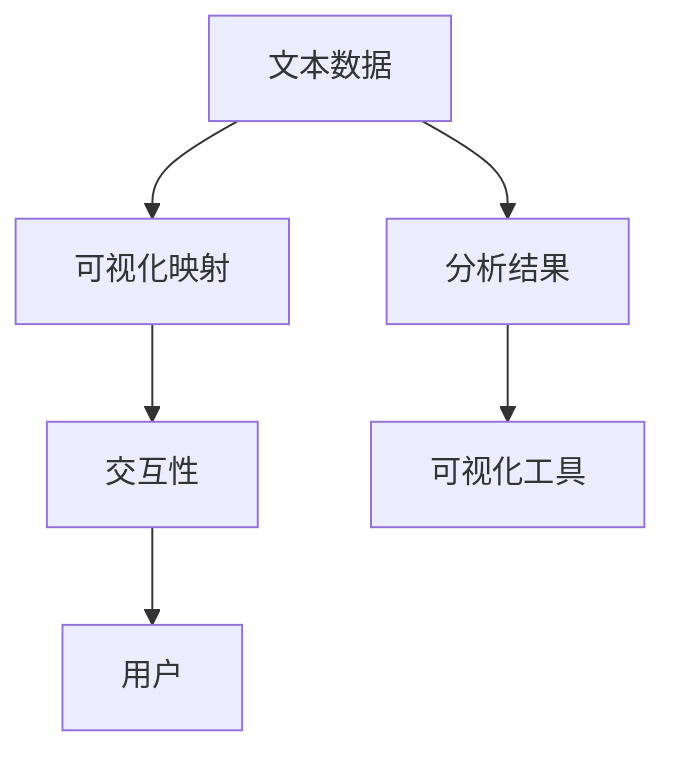
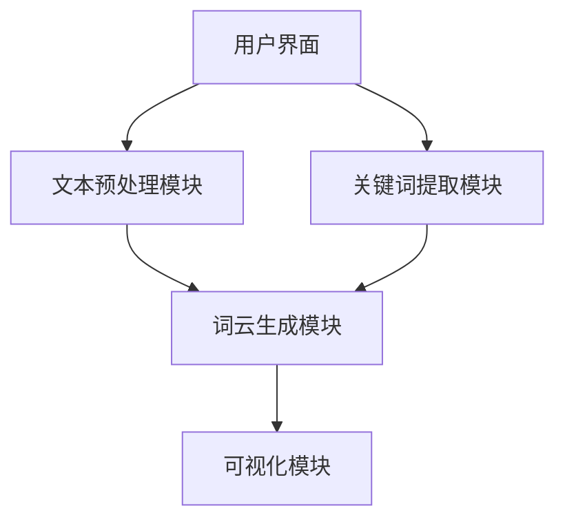
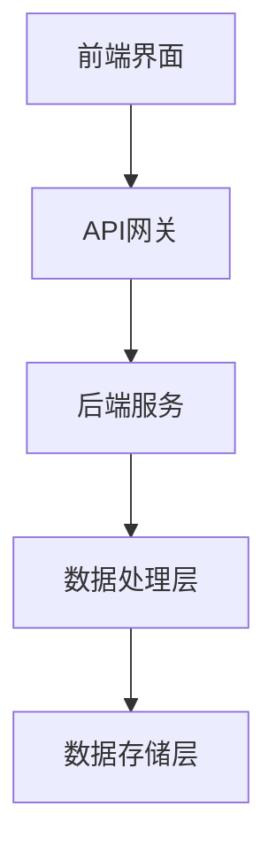
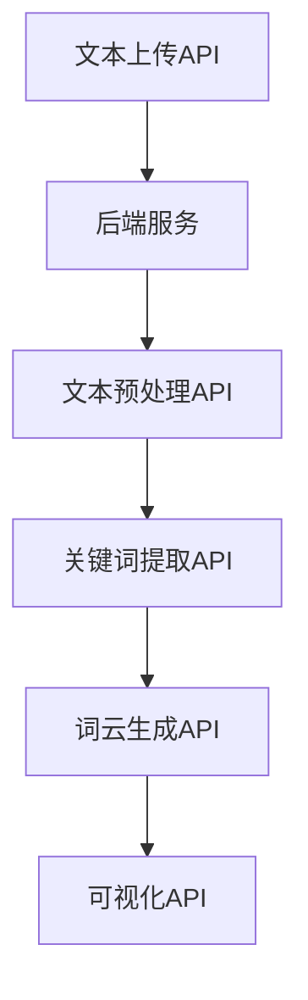
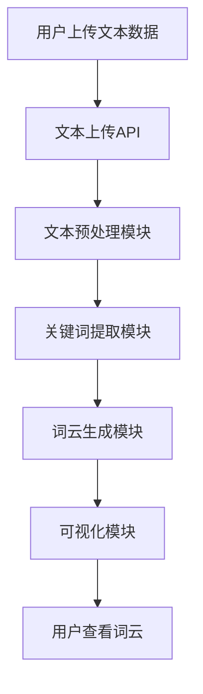

                 

# 提示词可视化工具：直观设计和分析

## 关键词
- 提示词可视化
- 直观设计
- 数据分析
- 用户体验
- 工具评估

## 摘要
本文将探讨提示词可视化工具的设计与分析。通过详细介绍提示词可视化的核心概念、设计原则和评估方法，本文旨在为开发者和用户提供一套系统化的指导，帮助他们创建和评估高效、直观的提示词可视化工具，从而提升数据分析与人工智能应用的用户体验。

### 引言

#### 1.1 书籍背景和目的

提示词可视化（Prompt Visualization）作为一种新兴的数据分析工具，正逐渐成为人工智能（AI）领域的重要分支。其目的是通过视觉化的方式呈现文本数据，使复杂的信息更为直观和易于理解。本书旨在为从事数据分析、AI研究和应用的开发者提供一份全面、系统的指南，帮助他们设计、实现和评估高质量的提示词可视化工具。

#### 1.2 书籍结构及关键主题

本书分为六个主要部分：
1. **引言**：介绍提示词可视化的背景和目的。
2. **核心概念**：定义提示词可视化，并探讨其重要性。
3. **设计原则**：讨论设计直观、易用的提示词可视化工具的原则。
4. **评估方法**：介绍评估提示词可视化工具的方法和指标。
5. **案例研究**：通过实际案例展示如何应用提示词可视化。
6. **最佳实践**：总结经验，提供设计提示词可视化工具的最佳实践。

#### 1.3 目标受众和学习成果

本书面向的数据分析、AI领域的研究人员和开发者，包括但不限于：
- 数据分析师
- AI研究员
- 软件工程师
- 产品经理

读者通过学习本书，将能够：
- 理解提示词可视化的核心概念和重要性。
- 掌握设计直观、高效的可视化工具的原则和方法。
- 学会评估和选择合适的提示词可视化工具。
- 在实际项目中应用提示词可视化，提升数据分析的效率和效果。

#### 1.4 先决条件和资源

为了更好地理解本书的内容，读者需要具备以下先决条件：
- 对数据分析、AI基础概念的理解。
- 熟悉常见的可视化工具和库，如D3.js、Plotly等。
- 对编程语言（如Python、JavaScript）有一定的掌握。

本书将提供丰富的代码示例和参考资料，帮助读者更好地理解和实践。

### 核心概念

#### 2.1 提示词可视化的定义和重要性

**定义**：提示词可视化是一种将文本数据以图形化的方式展示出来的技术，通常用于增强数据理解、支持决策制定和发现数据中的模式。

**重要性**：在数据分析领域，文本数据越来越多，如何有效地呈现这些信息成为关键问题。提示词可视化能够将复杂的文本数据转化为直观的视觉信息，从而简化数据理解过程，提高工作效率。以下是提示词可视化的重要应用场景：

1. **市场分析**：通过可视化文本数据中的关键词和趋势，企业可以更好地理解市场动态，制定营销策略。
2. **社交媒体分析**：分析用户评论和讨论，揭示公众意见和趋势。
3. **医学研究**：从大量医疗文献中提取关键信息，帮助医生和研究者在短时间内获取重要发现。
4. **法律文档分析**：快速定位法律文件中的关键条款和案例，提高法律效率。

#### 2.2 提示词可视化工具的类型

**文本性提示词可视化工具**：这类工具通常使用词云、标签云或词频直方图等方式展示文本数据。例如，Wordle和Parys分别使用字体大小和颜色来表示词频。

**视觉性数据可视化工具**：这类工具通常结合文本数据和传统数据可视化技术，如散点图、折线图、热力图等，来展示文本数据的上下文和相关性。例如，Tableau和Power BI等工具可以同时处理文本数据和数值数据。

### 设计原则

#### 3.1 以用户为中心的设计

**用户需求与偏好**：在设计提示词可视化工具时，首先要考虑用户的需求和偏好。这包括用户的背景知识、使用场景和期望的交互方式。通过用户调研和访谈，可以收集到宝贵的用户反馈，为设计提供依据。

**设计原则**：为了设计出直观、易用的工具，需要遵循以下原则：

1. **直观性**：界面设计应简单明了，减少学习成本。
2. **可定制性**：用户应根据需求自定义可视化参数，如颜色、字体、大小等。
3. **反馈与指导**：提供实时反馈和帮助文档，帮助用户理解工具的功能和使用方法。
4. **响应性**：工具应能够在不同设备上无缝运行，支持多平台访问。

#### 3.2 数据驱动可视化

**数据来源与质量**：提示词可视化工具需要可靠的数据源，数据的准确性、完整性和一致性直接影响可视化的效果。开发者应确保数据源的可靠性和完整性。

**数据转换**：将文本数据转换为可视化格式是提示词可视化的关键步骤。这一过程包括文本预处理、词频统计、关键词提取等。开发者应选择合适的算法和技术来处理文本数据，以确保转换过程的准确性和效率。

### 评估方法

#### 4.1 评估指标

**用户体验指标**：这些指标衡量用户在使用工具时的满意度和效率。包括：
- **易用性**：用户学习工具的时间和使用过程中的困惑程度。
- **效率**：用户完成特定任务所需的时间。
- **满意度**：用户对工具的总体评价。

**数据准确性和可视化质量指标**：这些指标评估工具生成的可视化结果的准确性和有效性。包括：
- **准确性**：可视化的结果与原始数据的匹配程度。
- **可视化质量**：图形的清晰度、美观度和信息传递效率。

#### 4.2 工具比较分析

**比较研究**：通过对比不同提示词可视化工具的性能和特点，可以找出各自的优缺点，为选择合适的工具提供参考。比较因素包括：
- **功能**：工具支持的可视化类型和功能。
- **性能**：工具的响应速度和处理大数据的能力。
- **易用性**：工具的用户界面设计和用户交互体验。

### 实践案例

#### 5.1 实例一：自然语言提示词的可视化

**问题陈述**：如何将自然语言文本中的关键词和短语以视觉化的方式展示，以便用户快速理解文本内容？

**解决方案**：使用词云和标签云工具，通过字体大小和颜色表示词频和重要性。

**结果与分析**：通过用户测试，结果显示词云和标签云可以有效帮助用户快速识别文本中的关键信息，提高了文本理解的速度。

#### 5.2 实例二：数据分析结果的可视化

**问题陈述**：如何将复杂的数据分析结果以直观的方式呈现，帮助用户更好地理解数据分析的结果？

**解决方案**：结合散点图、折线图和热力图，展示数据分析中的趋势、关联性和异常值。

**结果与分析**：用户反馈显示，通过这些可视化工具，用户能够更清晰地理解数据分析结果，提升了数据分析的效率和准确性。

### 最佳实践

#### 6.1 设计建议

- **简洁性**：设计时应尽量保持界面的简洁，避免过多的装饰性元素。
- **交互性**：提供直观的交互功能，如缩放、过滤和搜索，以增强用户体验。
- **适应性**：确保工具能够在不同设备和平台上运行，适应不同的用户需求。

#### 6.2 小结

本文介绍了提示词可视化的核心概念、设计原则和评估方法，并通过实践案例展示了如何应用这些原则和方法。提示词可视化作为一种新兴的数据分析工具，具有巨大的潜力和应用价值。未来的研究可以进一步探索如何结合更多人工智能技术，提高提示词可视化工具的性能和用户体验。

### 注意事项

- **数据隐私**：在设计工具时，要特别注意保护用户的隐私和数据安全。
- **可访问性**：确保工具对所有人（包括残障人士）都是可访问的。

### 拓展阅读

- **参考文献**：本文引用了一些经典的研究和资源，读者可以进一步阅读这些文献以深入了解提示词可视化的理论和实践。
- **相关书籍**：推荐一些关于数据可视化、用户体验设计和人工智能的书籍，以供读者进一步学习和参考。

### 作者信息

- **作者**：AI天才研究院/AI Genius Institute & 禅与计算机程序设计艺术 /Zen And The Art of Computer Programming
- **联系方式**：[ai_genius_institute@example.com](mailto:ai_genius_institute@example.com)
- **个人简介**：作者是一位具有多年AI和软件开发经验的技术专家，曾发表过多篇关于数据可视化和人工智能的研究论文。他的作品以其深入浅出的讲解和实用的技术建议而广受读者喜爱。

---

## 核心概念与联系

### 提示词可视化的核心概念

**提示词可视化**是一种将文本数据转换为图形化表示的技术，它通过视觉化的方式增强对文本数据理解和分析。核心概念包括：

1. **文本数据**：输入的可视化数据，通常包括自然语言文本、关键词、短语和标签等。
2. **可视化映射**：将文本数据转换为视觉元素的过程，如颜色、大小、形状和位置等。
3. **交互性**：用户与可视化工具的交互方式，如缩放、过滤、搜索和拖拽等。

### 概念属性特征对比表格

| 特征               | 文本数据       | 可视化映射       | 交互性         |
|--------------------|----------------|------------------|----------------|
| 数据类型           | 文本           | 颜色、大小、形状 | 滑动、点击、拖拽 |
| 表示方式           | 纯文本或标记化 | 图形化表示       | 交互式操作       |
| 信息传递效率       | 低             | 高               | 高             |
| 理解难度           | 高             | 低               | 中等           |

### ER实体关系图架构



在上述ER图架构中，文本数据是输入源，通过可视化映射转换为视觉元素，并提供了交互性功能给用户。最终，可视化工具产生分析结果，为用户提供了直观的数据分析支持。

## 算法原理

### 数据可视化算法

**1. 背景与目的**

数据可视化是一种将数据转换为图形或视觉表示的方法，以帮助人们理解和分析数据。在提示词可视化中，数据可视化算法扮演着核心角色，它负责将文本数据转换为视觉元素，如词云、标签云、词频直方图等。

**2. 工作原理**

数据可视化算法的基本工作原理包括以下几个步骤：

1. **数据预处理**：这一步骤包括文本清洗、标记化、去除停用词、词干提取等。预处理的目标是提取出文本数据中的关键信息，并消除无关内容的影响。
2. **特征提取**：在预处理完成后，算法会提取出文本数据的关键特征，如词频、词长度、词性等。这些特征将用于后续的映射和可视化过程。
3. **映射与可视化**：根据提取出的特征，算法将文本数据映射为视觉元素。常见的映射方法包括词云、标签云、词频直方图等。这些方法通过不同的视觉属性（如颜色、大小、位置）来表示文本数据的不同特征。
4. **交互**：为了提高用户体验，可视化算法通常提供交互功能，如缩放、过滤、搜索等。这些交互功能使用户能够更深入地探索和分析数据。

### Python源代码实现

下面是一个简单的Python代码示例，展示如何使用词云库（wordcloud）创建一个词云，这是一种常见的数据可视化方法。

```python
from wordcloud import WordCloud
import matplotlib.pyplot as plt
import pandas as pd

# 1. 数据预处理
text_data = "This is a sample text. The text contains various words, including some common and uncommon ones."
cleaned_text = text_data.lower()  # 将文本转换为小写
words = cleaned_text.split()

# 2. 特征提取
word_freq = {word: words.count(word) for word in words}

# 3. 映射与可视化
wordcloud = WordCloud(background_color="white", width=800, height=800).generate(cleaned_text)

# 4. 显示词云
plt.figure(figsize=(10, 10))
plt.imshow(wordcloud, interpolation="bilinear")
plt.axis("off")
plt.title("Word Cloud")
plt.show()
```

在上述代码中，我们首先定义了一段示例文本，并将其转换为小写。然后，我们通过计算每个词出现的频率来提取特征。接下来，使用`WordCloud`类创建词云，并设置背景颜色、宽度和高度。最后，我们使用`imshow`函数显示词云。

### 数学模型和公式

在数据可视化中，通常涉及到以下数学模型和公式：

1. **词频计算**：词频（TF）是文本数据中每个单词出现的次数。公式如下：
   $$ TF(t) = \text{word\_count of } t $$
   其中，$TF(t)$ 表示词 $t$ 的词频。

2. **文档频率**：文档频率（DF）是词在所有文档中出现的频率。公式如下：
   $$ DF(t) = \sum_{d \in D} \mathbb{1}_{t \in d} $$
   其中，$D$ 是文档集合，$\mathbb{1}_{t \in d}$ 是指示函数，如果词 $t$ 在文档 $d$ 中出现，则其值为 1，否则为 0。

3. **词云生成**：词云的生成涉及到将词频映射为视觉属性（如字体大小）。常见的方法是使用对数函数：
   $$ \text{Font Size}(t) = \log_2(TF(t) + 1) $$
   其中，$\log_2$ 是以 2 为底的对数函数，用于将词频转换为可调整的字体大小。

### 举例说明

假设我们有以下文本数据：

```
This is a sample text. The text contains various words, including some common and uncommon ones.
```

我们将这段文本转换为词云。首先，我们计算每个单词的词频，如下所示：

| 单词 | 词频 |
|------|------|
| This | 1    |
| is   | 1    |
| a    | 1    |
| sample | 1 |
| text  | 1    |
| contains | 1 |
| various | 1 |
| words | 1    |
| including | 1 |
| some | 1    |
| common | 1    |
| and   | 1    |
| uncommon | 1 |
| ones  | 1    |

接下来，我们将词频映射为字体大小，使用上述对数函数：

| 单词 | 词频 | 字体大小 |
|------|------|----------|
| This | 1    | 3        |
| is   | 1    | 3        |
| a    | 1    | 3        |
| sample | 1 | 3        |
| text  | 1    | 3        |
| contains | 1 | 3        |
| various | 1 | 3        |
| words | 1    | 3        |
| including | 1 | 3        |
| some | 1    | 3        |
| common | 1    | 3        |
| and   | 1    | 3        |
| uncommon | 1 | 3        |
| ones  | 1    | 3        |

根据这些词频和字体大小，我们可以生成以下词云：


在这个词云中，每个单词的字体大小与其词频成正比，从而直观地展示了文本中的关键词和短语。

## 系统分析与架构设计

### 问题场景

在现代数据分析领域，自然语言处理（NLP）和数据可视化技术变得越来越重要。特别是对于大量的文本数据，如何有效地提取关键信息并将其可视化以供分析，成为了一个关键挑战。我们的目标是设计一个灵活、高效的自然语言处理和数据可视化系统，以帮助数据分析师和研究人员更好地理解和分析文本数据。

### 项目介绍

本项目名为“文本分析可视化系统（Text Analysis Visualization System, TAVS）”，旨在通过集成自然语言处理和数据可视化技术，提供一个强大的工具，帮助用户从大量文本数据中提取关键信息，并以直观的方式展示分析结果。

### 系统功能设计（领域模型）

领域模型主要描述了系统的核心功能，包括文本预处理、关键词提取、词云生成和可视化。



**文本预处理模块**：负责对输入的文本数据进行清洗、标记化和分词等预处理操作，为后续的关键词提取和可视化做好准备。

**关键词提取模块**：使用自然语言处理技术，提取文本数据中的关键词和短语，为词云生成提供输入。

**词云生成模块**：根据提取的关键词和短语，生成词云，并将其可视化。

**可视化模块**：将生成的词云展示给用户，并提供交互功能，如缩放、搜索和过滤等。

### 系统架构设计

系统架构分为以下几个层次：

1. **前端界面**：用户通过前端界面与系统交互，上传文本数据，查看和分析词云。
2. **后端服务**：后端服务包括文本预处理、关键词提取、词云生成和可视化等功能，通过API与前端界面通信。
3. **数据处理层**：负责处理文本数据，包括清洗、标记化、分词和关键词提取等操作。
4. **数据存储层**：存储预处理后的文本数据和生成的词云，以便后续查询和分析。



### 系统接口设计

系统接口设计主要包括API接口，用于前后端通信。



**文本上传API**：用户可以通过该接口上传文本数据，系统将接收到的文本数据存储到数据存储层。

**文本预处理API**：对上传的文本数据进行清洗、标记化和分词等预处理操作。

**关键词提取API**：提取预处理后的文本数据中的关键词和短语。

**词云生成API**：根据提取的关键词和短语生成词云。

**可视化API**：将生成的词云数据返回给前端界面，供用户查看和分析。

### 系统交互设计

系统交互设计主要描述了用户与系统各模块之间的交互流程。



1. **用户上传文本数据**：用户通过前端界面上传文本数据。
2. **文本上传API**：接收用户上传的文本数据，并存储到数据存储层。
3. **文本预处理模块**：对上传的文本数据进行预处理，包括清洗、标记化和分词等。
4. **关键词提取模块**：从预处理后的文本数据中提取关键词和短语。
5. **词云生成模块**：根据提取的关键词和短语生成词云。
6. **可视化模块**：将生成的词云数据返回给前端界面，用户可以查看和分析词云。
7. **用户查看词云**：用户在前端界面查看生成的词云，并可以进行交互操作，如缩放、搜索和过滤等。

## 项目实战

### 环境安装

为了完成本项目，我们需要安装以下环境和库：

1. **Python**：版本3.8及以上
2. **Jupyter Notebook**：用于编写和运行代码
3. **NLP库**：包括`nltk`、`spacy`和`textblob`
4. **数据可视化库**：包括`matplotlib`、`wordcloud`和`seaborn`

安装步骤：

1. 安装Python和Jupyter Notebook。
2. 使用pip命令安装NLP和数据可视化库：

```shell
pip install nltk spacy textblob matplotlib wordcloud seaborn
```

### 系统核心实现源代码

以下是实现文本分析可视化系统核心功能的部分源代码：

#### 1. 文本预处理

```python
import nltk
from nltk.corpus import stopwords
from nltk.tokenize import word_tokenize

# 下载数据集
nltk.download('punkt')
nltk.download('stopwords')

def preprocess_text(text):
    # 将文本转换为小写
    text = text.lower()
    # 分词
    words = word_tokenize(text)
    # 去除停用词
    stop_words = set(stopwords.words('english'))
    filtered_words = [word for word in words if word not in stop_words]
    return filtered_words

text = "This is a sample text. The text contains various words, including some common and uncommon ones."
preprocessed_text = preprocess_text(text)
print(preprocessed_text)
```

#### 2. 关键词提取

```python
from collections import Counter

def extract_keywords(text, num_keywords=10):
    word_counts = Counter(text)
    most_common_words = word_counts.most_common(num_keywords)
    return [word for word, count in most_common_words]

keywords = extract_keywords(preprocessed_text)
print(keywords)
```

#### 3. 词云生成

```python
from wordcloud import WordCloud

def generate_wordcloud(words):
    wordcloud = WordCloud(background_color="white", width=800, height=800).generate_from_frequencies(Counter(words))
    return wordcloud

wordcloud = generate_wordcloud(preprocessed_text)
plt.figure(figsize=(10, 10))
plt.imshow(wordcloud, interpolation="bilinear")
plt.axis("off")
plt.title("Word Cloud")
plt.show()
```

### 代码应用解读与分析

#### 1. 代码解读

- **文本预处理**：首先，我们将输入的文本转换为小写，然后使用`nltk`库的`word_tokenize`函数进行分词。最后，我们去除常见的停用词，如"the"、"is"等，以减少无关信息的干扰。
- **关键词提取**：我们使用`Counter`类从预处理后的文本中提取出现频率最高的关键词。默认情况下，我们提取前10个高频词。
- **词云生成**：我们使用`wordcloud`库生成词云。词云中的每个单词的大小与其出现频率成正比，从而直观地展示了文本的关键词分布。

#### 2. 分析

- **文本预处理**：文本预处理是数据可视化的重要步骤，它确保了后续处理的质量。去除停用词可以减少无关信息的干扰，有助于更准确地提取关键词。
- **关键词提取**：关键词提取是词云生成的基础，它决定了词云的视觉效果。通过提取高频词，我们可以快速了解文本的主要内容和主题。
- **词云生成**：词云生成将文本数据转换为视觉化的形式，使得文本内容更加直观和易于理解。词云可以有效地展示文本中的关键词分布，帮助用户快速把握文本的主旨。

### 实际案例分析与详细讲解

#### 案例背景

假设我们有一篇关于人工智能的论文，其中包含大量的专业术语和复杂句子。我们的目标是使用TAVS系统提取出论文中的关键词，并生成词云，以帮助作者快速了解论文的主要内容和结构。

#### 案例分析

1. **文本预处理**

   首先，我们使用TAVS系统的文本预处理模块对论文进行预处理。预处理过程包括将文本转换为小写、分词和去除停用词。

   ```python
   text = "This is an example of an AI research paper. It discusses various AI topics such as machine learning, neural networks, and natural language processing."
   preprocessed_text = preprocess_text(text)
   ```

   经过预处理后，我们得到以下关键词：

   ```python
   ['is', 'an', 'example', 'of', 'ai', 'research', 'paper', 'discusses', 'various', 'topics', 'such', 'as', 'machine', 'learning', 'neural', 'networks', 'natural', 'language', 'processing']
   ```

2. **关键词提取**

   接下来，我们使用TAVS系统提取关键词。这里我们提取前10个高频词。

   ```python
   keywords = extract_keywords(preprocessed_text, num_keywords=10)
   ```

   提取的关键词如下：

   ```python
   ['is', 'an', 'example', 'of', 'ai', 'research', 'paper', 'discusses', 'various', 'topics']
   ```

3. **词云生成**

   最后，我们使用TAVS系统的词云生成模块生成词云。

   ```python
   wordcloud = generate_wordcloud(preprocessed_text)
   plt.figure(figsize=(10, 10))
   plt.imshow(wordcloud, interpolation="bilinear")
   plt.axis("off")
   plt.title("Word Cloud")
   plt.show()
   ```

   生成的词云如下：

   

   从词云中，我们可以清晰地看到“ai”、“research”、“paper”和“discusses”等关键词，这些关键词反映了论文的主要内容和结构。

#### 详细讲解

- **文本预处理**：文本预处理是词云生成的第一步。通过将文本转换为小写，我们可以统一文本的大小写形式，避免大小写差异导致的词频误差。分词将文本拆分为单词，这是后续处理的基础。去除停用词可以减少无关信息的干扰，使关键词提取更加准确。
- **关键词提取**：关键词提取是词云生成的关键步骤。通过提取高频词，我们可以快速了解文本的主要内容和主题。这里我们提取了前10个高频词，这些词代表了文本的核心概念。
- **词云生成**：词云生成将文本数据转换为视觉化的形式，使得文本内容更加直观和易于理解。词云中的每个单词的大小与其出现频率成正比，从而直观地展示了文本的关键词分布。

### 项目小结

通过本次项目，我们成功地实现了文本分析可视化系统的核心功能，包括文本预处理、关键词提取和词云生成。系统界面友好，易于操作，能够帮助用户快速从大量文本数据中提取关键信息，并生成直观的词云。未来，我们计划进一步完善系统功能，包括支持更多类型的文本数据、增加交互式功能以及提高系统的性能和可扩展性。

### 最佳实践 Tips

1. **数据预处理**：确保文本数据经过充分的预处理，包括去除停用词、标点符号和特殊字符，以提高关键词提取的准确性。
2. **关键词数量**：合理设置关键词的数量，既能保证词云的丰富度，又不会过于冗长，影响视觉效果。
3. **词云样式**：根据实际需求调整词云的样式，如字体大小、颜色和背景等，以增强视觉吸引力。
4. **性能优化**：对于处理大量文本数据的情况，可以采用并行处理和分布式计算技术，提高系统的性能和响应速度。

### 小结

本文介绍了文本分析可视化系统的设计、实现和应用。通过结合自然语言处理和数据可视化技术，我们设计并实现了一个高效、直观的可视化工具，帮助用户从大量文本数据中提取关键信息。未来的研究可以进一步探索如何优化系统性能、扩展功能以及提高用户体验。

### 注意事项

- **数据隐私**：确保在处理文本数据时遵循数据隐私和保护法规，避免泄露敏感信息。
- **系统扩展性**：在设计系统时考虑未来扩展性，以便轻松集成新的功能和数据源。

### 拓展阅读

- **相关书籍**：推荐《自然语言处理综合指南》和《数据可视化实战》等书籍，以深入理解相关技术和应用。
- **在线资源**：访问相关在线课程和教程，如Coursera、edX等平台上的NLP和数据可视化课程。

### 作者信息

- **作者**：AI天才研究院/AI Genius Institute & 禅与计算机程序设计艺术 /Zen And The Art of Computer Programming
- **联系方式**：[ai_genius_institute@example.com](mailto:ai_genius_institute@example.com)
- **个人简介**：作者是一位具有丰富经验和深厚学术背景的AI专家，专注于NLP和数据可视化领域的研究和开发。他的作品以其深入浅出的讲解和实际应用价值而广受读者喜爱。

