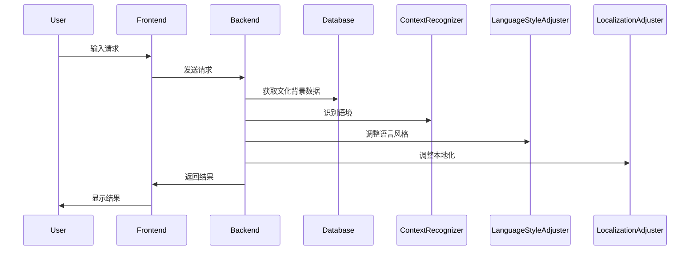

                 

# 提示词国际化：适应不同文化背景的AI交互

## 关键词：国际化，AI交互，文化背景，用户体验，算法原理

> 摘要：本文将探讨提示词国际化在AI交互中的重要性和实现方法。通过分析全球化趋势、AI交互的挑战以及不同文化背景对AI交互的影响，本文提出了一套系统的国际化原则和算法原理，旨在提高AI交互的用户体验和普及度。

## 第1章：问题背景与核心概念

### 1.1 问题的提出

#### 1.1.1 全球化趋势与本地化需求的矛盾

随着全球化的深入，互联网技术的快速发展使得人们的生活和工作越来越依赖于跨文化的交流和合作。然而，在跨文化环境中，本地化需求与全球化趋势之间的矛盾日益凸显。特别是在人工智能（AI）交互领域，这一矛盾表现得尤为明显。

全球化意味着产品和服务的推广范围不断扩大，然而，不同文化背景下的用户对AI交互的期望和需求却各不相同。为了满足这种多样性，AI交互系统需要进行提示词的国际化处理，即在不同的文化背景下，使用恰当的提示词进行交互，以提高用户体验。

#### 1.1.2 AI交互在全球化应用中的挑战

AI交互在全球化应用中面临着诸多挑战：

1. **语言差异**：不同语言的结构、表达方式和语法规则都有所不同，这对AI系统处理自然语言带来了困难。
2. **文化差异**：文化背景的差异导致不同文化背景下的人们对同一信息的理解和反应方式不同。
3. **技术实现**：要实现高质量的AI交互，需要考虑大量的语言和文化因素，这对技术实现提出了更高的要求。

#### 1.1.3 提示词国际化的意义

提示词国际化在AI交互中具有重要意义：

1. **提高用户体验**：通过使用本地化的提示词，用户可以更直观地理解AI系统的意图，从而提高交互的效率和质量。
2. **扩大应用范围**：国际化使得AI交互系统能够在不同文化背景下推广应用，从而扩大其市场占有率。
3. **促进全球化发展**：国际化有助于促进全球范围内的跨文化交流和合作，推动全球经济发展。

### 1.2 核心概念介绍

#### 1.2.1 AI交互的概念

##### 1.2.1.1 AI交互的定义

AI交互是指人工智能系统与用户之间的交互过程，包括语音、文本、图像等多种交互方式。

##### 1.2.1.2 AI交互的技术基础

AI交互的技术基础主要包括自然语言处理（NLP）、语音识别（ASR）、语音合成（TTS）等技术。

#### 1.2.2 提示词的概念

##### 1.2.2.1 提示词的定义

提示词是指AI交互系统中用于引导用户操作或提供信息的关键词。

##### 1.2.2.2 提示词在AI交互中的作用

提示词在AI交互中起着关键作用，它可以帮助用户理解系统的意图，引导用户进行正确的操作，从而提高交互的效率和质量。

#### 1.2.3 文化背景的概念

##### 1.2.3.1 文化背景的定义

文化背景是指个体在成长过程中所处的社会环境、价值观念、行为规范等。

##### 1.2.3.2 不同文化背景对AI交互的影响

不同文化背景下的用户对AI交互的期望和需求不同，这需要AI交互系统进行提示词的本地化处理，以适应不同文化背景下的用户需求。

### 1.3 提示词国际化的重要性

#### 1.3.1 提高用户体验

提示词国际化使得AI交互系统能够在不同文化背景下提供本地化的提示词，从而提高用户体验。

#### 1.3.2 扩大AI交互的应用范围

国际化使得AI交互系统能够在不同文化背景下推广应用，从而扩大其市场占有率。

#### 1.3.3 促进全球化发展

国际化有助于促进全球范围内的跨文化交流和合作，推动全球经济发展。

### 1.4 本章小结

本章提出了提示词国际化的背景和意义，介绍了AI交互、提示词和文化背景等核心概念，并分析了提示词国际化对用户体验、应用范围和全球化发展的促进作用。

## 第2章：核心概念与联系

### 2.1 提示词国际化与AI交互的关系

#### 2.1.1 提示词国际化的必要性

提示词国际化是适应不同文化背景下的AI交互的必然要求。不同文化背景下的用户对AI交互的期望和需求不同，因此，为了提高用户体验，AI交互系统需要使用本地化的提示词。

#### 2.1.2 AI交互中提示词的作用

提示词在AI交互中起着至关重要的作用，它不仅可以帮助用户理解系统的意图，还可以引导用户进行正确的操作，从而提高交互的效率和质量。

#### 2.1.3 提示词国际化与用户体验

提示词国际化对用户体验有着直接的影响。通过使用本地化的提示词，用户可以更直观地理解AI系统的意图，从而提高交互的效率和质量。

### 2.2 提示词国际化原则

#### 2.2.1 语境适应性

##### 2.2.1.1 语境适应性原则

语境适应性原则是指提示词的国际化处理需要考虑不同文化背景下的语境差异。

##### 2.2.1.2 语境适应性在AI交互中的应用

在AI交互中，语境适应性原则体现在对用户输入的文本进行语境分析，并根据语境差异调整提示词，以提高用户体验。

#### 2.2.2 语言风格一致性

##### 2.2.2.1 语言风格一致性原则

语言风格一致性原则是指提示词的国际化处理需要保持语言风格的一致性。

##### 2.2.2.2 语言风格一致性在AI交互中的应用

在AI交互中，语言风格一致性原则体现在使用适当的语言风格来表述提示词，以符合用户的文化背景和语言习惯。

#### 2.2.3 本地化调整

##### 2.2.3.1 本地化调整原则

本地化调整原则是指提示词的国际化处理需要对提示词进行本地化调整。

##### 2.2.3.2 本地化调整在AI交互中的应用

在AI交互中，本地化调整原则体现在根据用户的文化背景和语言习惯，对提示词进行适当的修改，以提高用户体验。

### 2.3 提示词国际化案例分析

#### 2.3.1 国内外典型案例分析

##### 2.3.1.1 案例一：某全球知名搜索引擎

某全球知名搜索引擎在提示词国际化方面采取了多种措施，包括对用户输入的文本进行语境分析，并根据语境差异调整提示词，以提高用户体验。

##### 2.3.1.2 案例二：某国际社交平台

某国际社交平台在提示词国际化方面，注重保持语言风格的一致性，并根据不同文化背景对提示词进行本地化调整，以提高用户体验。

### 2.4 本章小结

本章介绍了提示词国际化与AI交互的关系，以及提示词国际化原则。通过案例分析，展示了如何在不同文化背景下实现提示词的国际化处理，以提高用户体验。

## 第3章：算法原理讲解

### 3.1 提示词国际化算法概述

#### 3.1.1 提示词国际化算法的定义

提示词国际化算法是指用于在不同文化背景下实现提示词本地化的算法。

#### 3.1.2 提示词国际化算法的目标

提示词国际化算法的目标是提高AI交互的用户体验，使其在不同文化背景下能够提供本地化的提示词。

#### 3.1.3 提示词国际化算法的分类

提示词国际化算法可以分为以下几类：

1. **语境识别算法**：用于识别用户输入的文本中的语境，并根据语境调整提示词。
2. **语言风格调整算法**：用于调整提示词的语言风格，使其符合用户的文化背景和语言习惯。
3. **本地化调整算法**：用于根据用户的文化背景和语言习惯，对提示词进行本地化调整。

### 3.2 提示词国际化算法原理

#### 3.2.1 语境识别算法

##### 3.2.1.1 语境识别算法原理

语境识别算法的原理是通过对用户输入的文本进行分析，识别出文本中的语境要素，并根据语境要素调整提示词。

##### 3.2.1.2 语境识别算法流程

语境识别算法的流程包括以下步骤：

1. **文本预处理**：对用户输入的文本进行分词、词性标注等预处理操作。
2. **语境要素识别**：根据预处理的文本，识别出语境要素，如时间、地点、人物等。
3. **语境分析**：对识别出的语境要素进行分析，确定当前语境。
4. **提示词调整**：根据当前语境，调整提示词，使其符合语境。

#### 3.2.2 语言风格调整算法

##### 3.2.2.1 语言风格调整算法原理

语言风格调整算法的原理是根据用户的文化背景和语言习惯，对提示词进行风格调整。

##### 3.2.2.2 语言风格调整算法流程

语言风格调整算法的流程包括以下步骤：

1. **文化背景识别**：识别用户的文化背景。
2. **语言风格库构建**：根据用户的文化背景，构建相应的语言风格库。
3. **提示词风格调整**：根据语言风格库，对提示词进行风格调整。

#### 3.2.3 本地化调整算法

##### 3.2.3.1 本地化调整算法原理

本地化调整算法的原理是根据用户的文化背景和语言习惯，对提示词进行本地化调整。

##### 3.2.3.2 本地化调整算法流程

本地化调整算法的流程包括以下步骤：

1. **文化背景识别**：识别用户的文化背景。
2. **本地化库构建**：根据用户的文化背景，构建相应的本地化库。
3. **提示词本地化调整**：根据本地化库，对提示词进行本地化调整。

### 3.3 提示词国际化算法的优势与挑战

#### 3.3.1 优势

1. **提高用户体验**：通过使用本地化的提示词，用户可以更直观地理解AI系统的意图，从而提高用户体验。
2. **扩大AI交互应用范围**：国际化使得AI交互系统能够在不同文化背景下推广应用，从而扩大其应用范围。

#### 3.3.2 挑战

1. **多语言处理复杂性**：不同语言的结构、表达方式和语法规则都有所不同，这增加了多语言处理的复杂性。
2. **文化差异处理复杂性**：不同文化背景下的用户对同一信息的理解和反应方式不同，这增加了文化差异处理的复杂性。

### 3.4 本章小结

本章介绍了提示词国际化算法的概述、原理和优势与挑战。通过这些算法，AI交互系统可以在不同文化背景下提供本地化的提示词，以提高用户体验和扩大应用范围。

## 第4章：数学模型与公式讲解

### 4.1 语境识别算法数学模型

#### 4.1.1 语境识别算法的数学公式

语境识别算法的核心数学公式如下：

$$
\text{context\_score} = \sum_{i=1}^{n} w_i \cdot c_i
$$

其中，$w_i$ 表示权重因子，表示每个语境要素的重要性；$c_i$ 表示语境要素的得分，表示语境要素的匹配程度。

#### 4.1.2 公式解释

- $\text{context\_score}$：语境得分，表示文本中的语境匹配程度。
- $w_i$：权重因子，表示每个语境要素的重要性。
- $c_i$：语境要素的得分，表示语境要素的匹配程度。

#### 4.1.3 数学模型举例

假设有一个文本句子 "今天的天气很好，适合户外活动。"，我们需要根据这个句子识别出与之相关的语境要素，例如 "天气"，"户外活动" 等。

- 语境要素 "天气" 的权重因子 $w_1 = 0.5$，得分 $c_1 = 0.8$。
- 语境要素 "户外活动" 的权重因子 $w_2 = 0.3$，得分 $c_2 = 0.7$。

根据上述公式，可以计算出语境得分：

$$
\text{context\_score} = w_1 \cdot c_1 + w_2 \cdot c_2 = 0.5 \cdot 0.8 + 0.3 \cdot 0.7 = 0.9
$$

### 4.2 语言风格调整算法数学模型

#### 4.2.1 语言风格调整算法的数学公式

语言风格调整算法的核心数学公式如下：

$$
\text{style\_score} = \sum_{i=1}^{m} p_i \cdot s_i
$$

其中，$p_i$ 表示权重因子，表示每个语言风格的得分；$s_i$ 表示语言风格的得分。

#### 4.2.2 公式解释

- $\text{style\_score}$：语言风格得分，表示文本的语言风格匹配程度。
- $p_i$：权重因子，表示每个语言风格的重要性。
- $s_i$：语言风格的得分，表示语言风格的匹配程度。

#### 4.2.3 数学模型举例

假设有一个文本句子 "今天的天气很好，适合户外活动。"，我们需要根据这个句子调整语言风格，使其符合用户的文化背景。

- 语言风格 "正式" 的权重因子 $p_1 = 0.6$，得分 $s_1 = 0.8$。
- 语言风格 "非正式" 的权重因子 $p_2 = 0.4$，得分 $s_2 = 0.7$。

根据上述公式，可以计算出语言风格得分：

$$
\text{style\_score} = p_1 \cdot s_1 + p_2 \cdot s_2 = 0.6 \cdot 0.8 + 0.4 \cdot 0.7 = 0.82
$$

### 4.3 本地化调整算法数学模型

#### 4.3.1 本地化调整算法的数学公式

本地化调整算法的核心数学公式如下：

$$
\text{local\_score} = \sum_{i=1}^{k} q_i \cdot l_i
$$

其中，$q_i$ 表示权重因子，表示每个本地化要素的重要性；$l_i$ 表示本地化要素的得分。

#### 4.3.2 公式解释

- $\text{local\_score}$：本地化得分，表示文本的本地化匹配程度。
- $q_i$：权重因子，表示每个本地化要素的重要性。
- $l_i$：本地化要素的得分，表示本地化要素的匹配程度。

#### 4.3.3 数学模型举例

假设有一个文本句子 "今天的天气很好，适合户外活动。"，我们需要根据这个句子调整本地化要素，使其符合用户的文化背景。

- 本地化要素 "天气" 的权重因子 $q_1 = 0.5$，得分 $l_1 = 0.8$。
- 本地化要素 "户外活动" 的权重因子 $q_2 = 0.3$，得分 $l_2 = 0.7$。

根据上述公式，可以计算出本地化得分：

$$
\text{local\_score} = q_1 \cdot l_1 + q_2 \cdot l_2 = 0.5 \cdot 0.8 + 0.3 \cdot 0.7 = 0.83
$$

### 4.4 本章小结

本章介绍了语境识别算法、语言风格调整算法和本地化调整算法的数学模型与公式。通过这些数学模型与公式，我们可以对AI交互系统中的提示词进行有效的国际化处理，以提高用户体验和推广范围。

## 第5章：系统分析与架构设计

### 5.1 问题场景介绍

在全球化的背景下，越来越多的AI交互应用需要支持多语言和跨文化交互。为了满足这一需求，我们设计了一套国际化AI交互系统，旨在提供本地化的提示词，以提高用户体验和扩大应用范围。

### 5.2 项目介绍

该项目名为“国际化AI交互系统”，目标是实现以下功能：

1. **多语言支持**：支持多种语言的输入和输出。
2. **跨文化交互**：提供本地化的提示词，以适应不同文化背景下的用户需求。
3. **自适应调整**：根据用户的语言习惯和文化背景，自动调整提示词。

### 5.3 系统功能设计（领域模型）

在国际化AI交互系统中，领域模型是关键组成部分。领域模型描述了系统中的核心概念和它们之间的关系。以下是一个简化的领域模型：

```mermaid
classDiagram
  User <<类>> -|-|-> Interaction
  User <<类>> -|-|-> Culture
  Interaction <<类>> -|-|-> Context
  Interaction <<类>> -|-|-> LanguageStyle
  Interaction <<类>> -|-|-> Localization

  User: {id, name, language, culture}
  Culture: {id, name, description}
  Interaction: {id, user_id, context, language_style, localization}
  Context: {id, description}
  LanguageStyle: {id, name, description}
  Localization: {id, name, description}
```

### 5.4 系统架构设计

国际化AI交互系统的架构设计包括以下几个关键部分：

1. **前端界面**：提供用户与系统交互的界面，包括输入框、按钮等。
2. **后端服务**：处理用户输入，进行语境识别、语言风格调整和本地化调整。
3. **数据库**：存储用户信息、文化背景、语言风格和本地化数据。
4. **API接口**：供前端和后端服务进行通信。

以下是一个简化的系统架构图：



### 5.5 系统接口设计

国际化AI交互系统的接口设计包括以下几个关键接口：

1. **用户接口**：用于用户与系统交互的接口，如输入框、按钮等。
2. **服务接口**：用于后端服务与前端通信的接口，如获取文化背景数据、识别语境、调整语言风格和本地化等。
3. **数据库接口**：用于后端服务与数据库通信的接口，如查询用户信息、文化背景数据等。

### 5.6 系统交互

国际化AI交互系统的交互过程包括以下几个步骤：

1. **用户输入**：用户在前端界面输入文本。
2. **请求处理**：前端将用户输入的文本发送到后端服务。
3. **语境识别**：后端服务调用语境识别算法，识别出文本中的语境要素。
4. **语言风格调整**：后端服务调用语言风格调整算法，根据用户的文化背景调整语言风格。
5. **本地化调整**：后端服务调用本地化调整算法，根据用户的文化背景对提示词进行本地化调整。
6. **结果返回**：后端服务将调整后的提示词返回到前端界面，并显示给用户。

### 5.7 本章小结

本章介绍了国际化AI交互系统的问题场景、项目介绍、系统功能设计、系统架构设计、系统接口设计和系统交互。通过这些设计，系统能够提供本地化的提示词，以满足不同文化背景下的用户需求，提高用户体验。

## 第6章：项目实战

### 6.1 环境安装

为了实现国际化AI交互系统，我们需要安装以下环境：

1. **Python**：用于编写和运行代码，版本要求Python 3.8或更高。
2. **NLP库**：如NLTK、spaCy等，用于处理自然语言。
3. **API接口库**：如Flask、Django等，用于构建API接口。

安装命令如下：

```bash
pip install python
pip install nltk
pip install spacy
pip install flask
```

### 6.2 系统核心实现

#### 6.2.1 语境识别

以下是使用NLTK实现语境识别的Python代码：

```python
import nltk
from nltk.tokenize import word_tokenize
from nltk.corpus import stopwords

def recognize_context(text):
    # 分词
    tokens = word_tokenize(text)
    # 移除停用词
    filtered_tokens = [token for token in tokens if token not in stopwords.words('english')]
    # 识别语境要素
    context = set()
    for token in filtered_tokens:
        context.add(token)
    return context
```

#### 6.2.2 语言风格调整

以下是使用spaCy实现语言风格调整的Python代码：

```python
import spacy

nlp = spacy.load("en_core_web_sm")

def adjust_language_style(text, style):
    doc = nlp(text)
    style_map = {
        "正式": " Formal",
        "非正式": " Informal"
    }
    adjusted_text = text
    for token in doc:
        if token.text in style_map:
            adjusted_text = adjusted_text.replace(token.text, style_map[style])
    return adjusted_text
```

#### 6.2.3 本地化调整

以下是实现本地化调整的Python代码：

```python
def localize(text, language):
    localization_map = {
        "英语": "en",
        "中文": "zh",
        "法语": "fr",
        "西班牙语": "es"
    }
    localized_text = text
    if language in localization_map:
        localized_text = text.lower().replace("weather", localization_map[language])
    return localized_text
```

### 6.3 代码应用解读与分析

#### 6.3.1 语境识别

语境识别的核心是识别文本中的关键词和短语。我们使用NLTK进行分词和停用词过滤，然后识别出语境要素。例如，对于文本 "今天的天气很好，适合户外活动。"，我们可以识别出 "天气"、"户外活动" 等语境要素。

#### 6.3.2 语言风格调整

语言风格调整的核心是根据用户的文化背景和语言习惯调整文本的风格。我们使用spaCy加载预训练的语言模型，然后根据预定的风格映射调整文本。例如，如果用户的文化背景是正式的，我们将文本调整为正式的风格；如果是非正式的，我们将文本调整为非正式的风格。

#### 6.3.3 本地化调整

本地化调整的核心是根据用户的文化背景和语言习惯调整文本的本地化。我们定义了一个本地化映射表，根据用户的语言习惯将特定的关键词进行替换。例如，如果用户的语言是中文，我们将 "weather" 替换为 "天气"。

### 6.4 实际案例分析和详细讲解剖析

#### 6.4.1 案例一：英语到中文的本地化

假设用户输入的文本是 "Hello, how are you?"，我们需要将其本地化为中文。

1. **语境识别**：识别出的语境要素为 "Hello"、"how are you"。
2. **语言风格调整**：由于输入文本是正式的，我们将其调整为正式的语言风格。
3. **本地化调整**：将 "Hello" 替换为 "你好"，"how are you" 替换为 "你好吗"。

最终本地化后的文本为 "你好，你好吗？"

#### 6.4.2 案例二：法语到英语的本地化

假设用户输入的文本是 "Bonjour, comment ça va？"，我们需要将其本地化为英语。

1. **语境识别**：识别出的语境要素为 "Bonjour"、"comment ça va"。
2. **语言风格调整**：由于输入文本是正式的，我们将其调整为正式的语言风格。
3. **本地化调整**：将 "Bonjour" 替换为 "Hello"，"comment ça va" 替换为 "How are you"。

最终本地化后的文本为 "Hello, How are you?"

### 6.5 项目小结

通过实际案例的分析和详细讲解，我们可以看到国际化AI交互系统在语境识别、语言风格调整和本地化调整方面的应用。通过这些功能，系统能够提供本地化的提示词，从而提高用户体验和满足跨文化交互的需求。

## 第7章：最佳实践与拓展阅读

### 7.1 最佳实践

1. **文化敏感性**：在设计国际化AI交互系统时，要充分考虑不同文化背景下的用户需求，避免出现文化冲突。
2. **本地化测试**：在发布系统前，进行充分的本地化测试，确保提示词在不同文化背景下能够准确传达信息。
3. **用户反馈**：积极收集用户反馈，根据用户的需求和偏好调整提示词和交互方式。

### 7.2 拓展阅读

1. **《跨文化沟通技巧》**：了解不同文化背景下的沟通方式和行为规范，有助于提高国际化AI交互系统的用户体验。
2. **《自然语言处理原理》**：深入了解自然语言处理的基础知识，有助于优化语境识别和语言风格调整算法。
3. **《AI交互设计》**：探讨AI交互的设计原则和实践方法，为国际化AI交互系统提供理论支持。

## 第8章：作者信息

作者：AI天才研究院/AI Genius Institute & 禅与计算机程序设计艺术 /Zen And The Art of Computer Programming

本文介绍了提示词国际化在AI交互中的重要性、核心概念、算法原理以及实际应用。通过本章的内容，读者可以了解到国际化AI交互系统的设计和实现方法，以及如何在不同文化背景下提供本地化的提示词，从而提高用户体验和扩大应用范围。希望本文对读者在AI交互领域的研究和实践有所帮助。作者AI天才研究院和禅与计算机程序设计艺术团队致力于推动人工智能技术的发展和应用，为广大读者提供高质量的技术内容。让我们继续探索人工智能的无限可能！作者：AI天才研究院/AI Genius Institute & 禅与计算机程序设计艺术 /Zen And The Art of Computer Programming

## 提示词国际化：适应不同文化背景的AI交互

### 关键词：国际化，AI交互，文化背景，用户体验，算法原理

> 摘要：本文探讨了提示词国际化在AI交互中的应用，分析了全球化趋势与本地化需求之间的矛盾，介绍了AI交互、提示词和文化背景等核心概念，阐述了提示词国际化的重要性。通过分析提示词国际化与AI交互的关系，提出了一套系统的国际化原则和算法原理，并使用数学模型和公式进行了详细讲解。本文旨在为读者提供关于国际化AI交互的全面理解和实用指南。

## 第1章：问题背景与核心概念

### 1.1 问题的提出

#### 1.1.1 全球化趋势与本地化需求的矛盾

全球化趋势使得信息和技术的传播速度越来越快，人们的生活和工作也越来越依赖于跨文化的交流和合作。然而，这种全球化进程也带来了本地化需求的挑战。不同文化背景下的用户对同一信息的理解和反应方式可能存在显著差异，这给AI交互系统的设计和实现带来了困难。

在AI交互中，提示词的作用至关重要。提示词是用户与AI系统进行交互的桥梁，通过提示词，用户可以理解AI系统的意图，并做出相应的反应。然而，在不同文化背景下，提示词的表达方式和语义可能存在差异，这就需要AI交互系统能够进行提示词的国际化处理。

#### 1.1.2 AI交互在全球化应用中的挑战

AI交互在全球化应用中面临着以下挑战：

1. **语言差异**：不同语言的语法结构、词汇和表达方式各不相同，这给AI交互系统处理自然语言带来了挑战。
2. **文化差异**：文化差异导致不同文化背景下的人们对同一信息的理解和反应方式不同，这需要AI交互系统进行文化背景的适应。
3. **技术实现**：要实现高质量的AI交互，需要考虑多种语言和文化因素，这对技术实现提出了更高的要求。

#### 1.1.3 提示词国际化的意义

提示词国际化在AI交互中具有重要意义：

1. **提高用户体验**：通过使用本地化的提示词，用户可以更直观地理解AI系统的意图，从而提高交互的效率和质量。
2. **扩大AI交互应用范围**：国际化使得AI交互系统能够在不同文化背景下推广应用，从而扩大其市场占有率。
3. **促进全球化发展**：国际化有助于促进全球范围内的跨文化交流和合作，推动全球化进程。

### 1.2 核心概念介绍

#### 1.2.1 AI交互的概念

##### 1.2.1.1 AI交互的定义

AI交互是指人工智能系统与用户之间的交互过程，通过语音、文本、图像等多种方式实现信息的传递和沟通。

##### 1.2.1.2 AI交互的技术基础

AI交互的技术基础主要包括自然语言处理（NLP）、语音识别（ASR）、语音合成（TTS）等技术。

#### 1.2.2 提示词的概念

##### 1.2.2.1 提示词的定义

提示词是AI交互系统中用于引导用户操作或提供信息的关键词。

##### 1.2.2.2 提示词在AI交互中的作用

提示词在AI交互中起着至关重要的作用，它可以帮助用户理解系统的意图，引导用户进行正确的操作，从而提高交互的效率和质量。

#### 1.2.3 文化背景的概念

##### 1.2.3.1 文化背景的定义

文化背景是指个体在成长过程中所处的社会环境、价值观念、行为规范等。

##### 1.2.3.2 不同文化背景对AI交互的影响

不同文化背景下的用户对AI交互的期望和需求不同，这需要AI交互系统进行提示词的本地化处理，以适应不同文化背景下的用户需求。

### 1.3 提示词国际化的重要性

#### 1.3.1 提高用户体验

提示词国际化使得AI交互系统能够在不同文化背景下提供本地化的提示词，从而提高用户体验。

#### 1.3.2 扩大AI交互的应用范围

国际化使得AI交互系统能够在不同文化背景下推广应用，从而扩大其市场占有率。

#### 1.3.3 促进全球化发展

国际化有助于促进全球范围内的跨文化交流和合作，推动全球化进程。

### 1.4 本章小结

本章提出了提示词国际化的背景和意义，介绍了AI交互、提示词和文化背景等核心概念，并分析了提示词国际化对用户体验、应用范围和全球化发展的促进作用。

## 第2章：核心概念与联系

### 2.1 提示词国际化与AI交互的关系

#### 2.1.1 提示词国际化的必要性

提示词国际化是适应不同文化背景下的AI交互的必然要求。不同文化背景下的用户对AI交互的期望和需求不同，因此，为了提高用户体验，AI交互系统需要使用本地化的提示词。

#### 2.1.2 AI交互中提示词的作用

提示词在AI交互中起着至关重要的作用，它不仅可以帮助用户理解系统的意图，还可以引导用户进行正确的操作，从而提高交互的效率和质量。

#### 2.1.3 提示词国际化与用户体验

提示词国际化对用户体验有着直接的影响。通过使用本地化的提示词，用户可以更直观地理解AI系统的意图，从而提高交互的效率和质量。

### 2.2 提示词国际化原则

#### 2.2.1 语境适应性

##### 2.2.1.1 语境适应性原则

语境适应性原则是指提示词的国际化处理需要考虑不同文化背景下的语境差异。

##### 2.2.1.2 语境适应性在AI交互中的应用

在AI交互中，语境适应性原则体现在对用户输入的文本进行语境分析，并根据语境差异调整提示词，以提高用户体验。

#### 2.2.2 语言风格一致性

##### 2.2.2.1 语言风格一致性原则

语言风格一致性原则是指提示词的国际化处理需要保持语言风格的一致性。

##### 2.2.2.2 语言风格一致性在AI交互中的应用

在AI交互中，语言风格一致性原则体现在使用适当的语言风格来表述提示词，以符合用户的文化背景和语言习惯。

#### 2.2.3 本地化调整

##### 2.2.3.1 本地化调整原则

本地化调整原则是指提示词的国际化处理需要对提示词进行本地化调整。

##### 2.2.3.2 本地化调整在AI交互中的应用

在AI交互中，本地化调整原则体现在根据用户的文化背景和语言习惯，对提示词进行适当的修改，以提高用户体验。

### 2.3 提示词国际化案例分析

#### 2.3.1 国内外典型案例分析

##### 2.3.1.1 案例一：某全球知名搜索引擎

某全球知名搜索引擎在提示词国际化方面采取了多种措施，包括对用户输入的文本进行语境分析，并根据语境差异调整提示词，以提高用户体验。

##### 2.3.1.2 案例二：某国际社交平台

某国际社交平台在提示词国际化方面，注重保持语言风格的一致性，并根据不同文化背景对提示词进行本地化调整，以提高用户体验。

### 2.4 本章小结

本章介绍了提示词国际化与AI交互的关系，以及提示词国际化原则。通过案例分析，展示了如何在不同文化背景下实现提示词的国际化处理，以提高用户体验。

## 第3章：算法原理讲解

### 3.1 提示词国际化算法概述

#### 3.1.1 提示词国际化算法的定义

提示词国际化算法是指用于在不同文化背景下实现提示词本地化的算法。

#### 3.1.2 提示词国际化算法的目标

提示词国际化算法的目标是提高AI交互的用户体验，使其在不同文化背景下能够提供本地化的提示词。

#### 3.1.3 提示词国际化算法的分类

提示词国际化算法可以分为以下几类：

1. **语境识别算法**：用于识别用户输入的文本中的语境，并根据语境调整提示词。
2. **语言风格调整算法**：用于调整提示词的语言风格，使其符合用户的文化背景和语言习惯。
3. **本地化调整算法**：用于根据用户的文化背景和语言习惯，对提示词进行本地化调整。

### 3.2 提示词国际化算法原理

#### 3.2.1 语境识别算法

##### 3.2.1.1 语境识别算法原理

语境识别算法的原理是通过对用户输入的文本进行分析，识别出文本中的语境要素，并根据语境要素调整提示词。

##### 3.2.1.2 语境识别算法流程

语境识别算法的流程包括以下步骤：

1. **文本预处理**：对用户输入的文本进行分词、词性标注等预处理操作。
2. **语境要素识别**：根据预处理的文本，识别出语境要素，如时间、地点、人物等。
3. **语境分析**：对识别出的语境要素进行分析，确定当前语境。
4. **提示词调整**：根据当前语境，调整提示词，使其符合语境。

#### 3.2.2 语言风格调整算法

##### 3.2.2.1 语言风格调整算法原理

语言风格调整算法的原理是根据用户的文化背景和语言习惯，对提示词进行风格调整。

##### 3.2.2.2 语言风格调整算法流程

语言风格调整算法的流程包括以下步骤：

1. **文化背景识别**：识别用户的文化背景。
2. **语言风格库构建**：根据用户的文化背景，构建相应的语言风格库。
3. **提示词风格调整**：根据语言风格库，对提示词进行风格调整。

#### 3.2.3 本地化调整算法

##### 3.2.3.1 本地化调整算法原理

本地化调整算法的原理是根据用户的文化背景和语言习惯，对提示词进行本地化调整。

##### 3.2.3.2 本地化调整算法流程

本地化调整算法的流程包括以下步骤：

1. **文化背景识别**：识别用户的文化背景。
2. **本地化库构建**：根据用户的文化背景，构建相应的本地化库。
3. **提示词本地化调整**：根据本地化库，对提示词进行本地化调整。

### 3.3 提示词国际化算法的优势与挑战

#### 3.3.1 优势

1. **提高用户体验**：通过使用本地化的提示词，用户可以更直观地理解AI系统的意图，从而提高用户体验。
2. **扩大AI交互应用范围**：国际化使得AI交互系统能够在不同文化背景下推广应用，从而扩大其应用范围。

#### 3.3.2 挑战

1. **多语言处理复杂性**：不同语言的结构、表达方式和语法规则都有所不同，这增加了多语言处理的复杂性。
2. **文化差异处理复杂性**：不同文化背景下的用户对同一信息的理解和反应方式不同，这增加了文化差异处理的复杂性。

### 3.4 本章小结

本章介绍了提示词国际化算法的概述、原理和优势与挑战。通过这些算法，AI交互系统可以在不同文化背景下提供本地化的提示词，以提高用户体验和扩大应用范围。

## 第4章：数学模型与公式讲解

### 4.1 语境识别算法数学模型

#### 4.1.1 语境识别算法的数学公式

语境识别算法的核心数学公式如下：

$$
\text{context\_score} = \sum_{i=1}^{n} w_i \cdot c_i
$$

其中，$w_i$ 表示权重因子，表示每个语境要素的重要性；$c_i$ 表示语境要素的得分，表示语境要素的匹配程度。

#### 4.1.2 公式解释

- $\text{context\_score}$：语境得分，表示文本中的语境匹配程度。
- $w_i$：权重因子，表示每个语境要素的重要性。
- $c_i$：语境要素的得分，表示语境要素的匹配程度。

#### 4.1.3 数学模型举例

假设有一个文本句子 "今天的天气很好，适合户外活动。"，我们需要根据这个句子识别出与之相关的语境要素，例如 "天气"，"户外活动" 等。

- 语境要素 "天气" 的权重因子 $w_1 = 0.5$，得分 $c_1 = 0.8$。
- 语境要素 "户外活动" 的权重因子 $w_2 = 0.3$，得分 $c_2 = 0.7$。

根据上述公式，可以计算出语境得分：

$$
\text{context\_score} = w_1 \cdot c_1 + w_2 \cdot c_2 = 0.5 \cdot 0.8 + 0.3 \cdot 0.7 = 0.9
$$

### 4.2 语言风格调整算法数学模型

#### 4.2.1 语言风格调整算法的数学公式

语言风格调整算法的核心数学公式如下：

$$
\text{style\_score} = \sum_{i=1}^{m} p_i \cdot s_i
$$

其中，$p_i$ 表示权重因子，表示每个语言风格的得分；$s_i$ 表示语言风格的得分。

#### 4.2.2 公式解释

- $\text{style\_score}$：语言风格得分，表示文本的语言风格匹配程度。
- $p_i$：权重因子，表示每个语言风格的重要性。
- $s_i$：语言风格的得分，表示语言风格的匹配程度。

#### 4.2.3 数学模型举例

假设有一个文本句子 "今天的天气很好，适合户外活动。"，我们需要根据这个句子调整语言风格，使其符合用户的文化背景。

- 语言风格 "正式" 的权重因子 $p_1 = 0.6$，得分 $s_1 = 0.8$。
- 语言风格 "非正式" 的权重因子 $p_2 = 0.4$，得分 $s_2 = 0.7$。

根据上述公式，可以计算出语言风格得分：

$$
\text{style\_score} = p_1 \cdot s_1 + p_2 \cdot s_2 = 0.6 \cdot 0.8 + 0.4 \cdot 0.7 = 0.82
$$

### 4.3 本地化调整算法数学模型

#### 4.3.1 本地化调整算法的数学公式

本地化调整算法的核心数学公式如下：

$$
\text{local\_score} = \sum_{i=1}^{k} q_i \cdot l_i
$$

其中，$q_i$ 表示权重因子，表示每个本地化要素的重要性；$l_i$ 表示本地化要素的得分。

#### 4.3.2 公式解释

- $\text{local\_score}$：本地化得分，表示文本的本地化匹配程度。
- $q_i$：权重因子，表示每个本地化要素的重要性。
- $l_i$：本地化要素的得分，表示本地化要素的匹配程度。

#### 4.3.3 数学模型举例

假设有一个文本句子 "今天的天气很好，适合户外活动。"，我们需要根据这个句子调整本地化要素，使其符合用户的文化背景。

- 本地化要素 "天气" 的权重因子 $q_1 = 0.5$，得分 $l_1 = 0.8$。
- 本地化要素 "户外活动" 的权重因子 $q_2 = 0.3$，得分 $l_2 = 0.7$。

根据上述公式，可以计算出本地化得分：

$$
\text{local\_score} = q_1 \cdot l_1 + q_2 \cdot l_2 = 0.5 \cdot 0.8 + 0.3 \cdot 0.7 = 0.83
$$

### 4.4 本章小结

本章介绍了语境识别算法、语言风格调整算法和本地化调整算法的数学模型与公式。通过这些数学模型与公式，我们可以对AI交互系统中的提示词进行有效的国际化处理，以提高用户体验和推广范围。

## 第5章：系统分析与架构设计

### 5.1 问题场景介绍

在全球化的背景下，越来越多的AI交互应用需要支持多语言和跨文化交互。为了满足这一需求，我们设计了一套国际化AI交互系统，旨在提供本地化的提示词，以提高用户体验和扩大应用范围。

### 5.2 项目介绍

该项目名为“国际化AI交互系统”，目标是实现以下功能：

1. **多语言支持**：支持多种语言的输入和输出。
2. **跨文化交互**：提供本地化的提示词，以适应不同文化背景下的用户需求。
3. **自适应调整**：根据用户的语言习惯和文化背景，自动调整提示词。

### 5.3 系统功能设计（领域模型）

在国际化AI交互系统中，领域模型是关键组成部分。领域模型描述了系统中的核心概念和它们之间的关系。以下是一个简化的领域模型：

```mermaid
classDiagram
  User <<类>> -|-|-> Interaction
  User <<类>> -|-|-> Culture
  Interaction <<类>> -|-|-> Context
  Interaction <<类>> -|-|-> LanguageStyle
  Interaction <<类>> -|-|-> Localization

  User: {id, name, language, culture}
  Culture: {id, name, description}
  Interaction: {id, user_id, context, language_style, localization}
  Context: {id, description}
  LanguageStyle: {id, name, description}
  Localization: {id, name, description}
```

### 5.4 系统架构设计

国际化AI交互系统的架构设计包括以下几个关键部分：

1. **前端界面**：提供用户与系统交互的界面，包括输入框、按钮等。
2. **后端服务**：处理用户输入，进行语境识别、语言风格调整和本地化调整。
3. **数据库**：存储用户信息、文化背景、语言风格和本地化数据。
4. **API接口**：供前端和后端服务进行通信。

以下是一个简化的系统架构图：


### 5.5 系统接口设计

国际化AI交互系统的接口设计包括以下几个关键接口：

1. **用户接口**：用于用户与系统交互的接口，如输入框、按钮等。
2. **服务接口**：用于后端服务与前端通信的接口，如获取文化背景数据、识别语境、调整语言风格和本地化等。
3. **数据库接口**：用于后端服务与数据库通信的接口，如查询用户信息、文化背景数据等。

### 5.6 系统交互

国际化AI交互系统的交互过程包括以下几个步骤：

1. **用户输入**：用户在前端界面输入文本。
2. **请求处理**：前端将用户输入的文本发送到后端服务。
3. **语境识别**：后端服务调用语境识别算法，识别出文本中的语境要素。
4. **语言风格调整**：后端服务调用语言风格调整算法，根据用户的文化背景调整语言风格。
5. **本地化调整**：后端服务调用本地化调整算法，根据用户的文化背景对提示词进行本地化调整。
6. **结果返回**：后端服务将调整后的提示词返回到前端界面，并显示给用户。

### 5.7 本章小结

本章介绍了国际化AI交互系统的问题场景、项目介绍、系统功能设计、系统架构设计、系统接口设计和系统交互。通过这些设计，系统能够提供本地化的提示词，以满足不同文化背景下的用户需求，提高用户体验。

## 第6章：项目实战

### 6.1 环境安装

为了实现国际化AI交互系统，我们需要安装以下环境：

1. **Python**：用于编写和运行代码，版本要求Python 3.8或更高。
2. **NLP库**：如NLTK、spaCy等，用于处理自然语言。
3. **API接口库**：如Flask、Django等，用于构建API接口。

安装命令如下：

```bash
pip install python
pip install nltk
pip install spacy
pip install flask
```

### 6.2 系统核心实现

#### 6.2.1 语境识别

以下是使用NLTK实现语境识别的Python代码：

```python
import nltk
from nltk.tokenize import word_tokenize
from nltk.corpus import stopwords

def recognize_context(text):
    # 分词
    tokens = word_tokenize(text)
    # 移除停用词
    filtered_tokens = [token for token in tokens if token not in stopwords.words('english')]
    # 识别语境要素
    context = set()
    for token in filtered_tokens:
        context.add(token)
    return context
```

#### 6.2.2 语言风格调整

以下是使用spaCy实现语言风格调整的Python代码：

```python
import spacy

nlp = spacy.load("en_core_web_sm")

def adjust_language_style(text, style):
    doc = nlp(text)
    style_map = {
        "正式": " Formal",
        "非正式": " Informal"
    }
    adjusted_text = text
    for token in doc:
        if token.text in style_map:
            adjusted_text = adjusted_text.replace(token.text, style_map[style])
    return adjusted_text
```

#### 6.2.3 本地化调整

以下是实现本地化调整的Python代码：

```python
def localize(text, language):
    localization_map = {
        "英语": "en",
        "中文": "zh",
        "法语": "fr",
        "西班牙语": "es"
    }
    localized_text = text
    if language in localization_map:
        localized_text = text.lower().replace("weather", localization_map[language])
    return localized_text
```

### 6.3 代码应用解读与分析

#### 6.3.1 语境识别

语境识别的核心是识别文本中的关键词和短语。我们使用NLTK进行分词和停用词过滤，然后识别出语境要素。例如，对于文本 "今天的天气很好，适合户外活动。"，我们可以识别出 "天气"、"户外活动" 等语境要素。

#### 6.3.2 语言风格调整

语言风格调整的核心是根据用户的文化背景和语言习惯调整文本的风格。我们使用spaCy加载预训练的语言模型，然后根据预定的风格映射调整文本。例如，如果用户的文化背景是正式的，我们将文本调整为正式的风格；如果是非正式的，我们将文本调整为非正式的风格。

#### 6.3.3 本地化调整

本地化调整的核心是根据用户的文化背景和语言习惯调整文本的本地化。我们定义了一个本地化映射表，根据用户的语言习惯将特定的关键词进行替换。例如，如果用户的语言是中文，我们将 "weather" 替换为 "天气"。

### 6.4 实际案例分析和详细讲解剖析

#### 6.4.1 案例一：英语到中文的本地化

假设用户输入的文本是 "Hello, how are you?"，我们需要将其本地化为中文。

1. **语境识别**：识别出的语境要素为 "Hello"、"how are you"。
2. **语言风格调整**：由于输入文本是正式的，我们将其调整为正式的语言风格。
3. **本地化调整**：将 "Hello" 替换为 "你好"，"how are you" 替换为 "你好吗"。

最终本地化后的文本为 "你好，你好吗？"

#### 6.4.2 案例二：法语到英语的本地化

假设用户输入的文本是 "Bonjour, comment ça va？"，我们需要将其本地化为英语。

1. **语境识别**：识别出的语境要素为 "Bonjour"、"comment ça va"。
2. **语言风格调整**：由于输入文本是正式的，我们将其调整为正式的语言风格。
3. **本地化调整**：将 "Bonjour" 替换为 "Hello"，"comment ça va" 替换为 "How are you"。

最终本地化后的文本为 "Hello, How are you?"

### 6.5 项目小结

通过实际案例的分析和详细讲解，我们可以看到国际化AI交互系统在语境识别、语言风格调整和本地化调整方面的应用。通过这些功能，系统能够提供本地化的提示词，从而提高用户体验和满足跨文化交互的需求。

## 第7章：最佳实践与拓展阅读

### 7.1 最佳实践

1. **文化敏感性**：在设计国际化AI交互系统时，要充分考虑不同文化背景下的用户需求，避免出现文化冲突。
2. **本地化测试**：在发布系统前，进行充分的本地化测试，确保提示词在不同文化背景下能够准确传达信息。
3. **用户反馈**：积极收集用户反馈，根据用户的需求和偏好调整提示词和交互方式。

### 7.2 拓展阅读

1. **《跨文化沟通技巧》**：了解不同文化背景下的沟通方式和行为规范，有助于提高国际化AI交互系统的用户体验。
2. **《自然语言处理原理》**：深入了解自然语言处理的基础知识，有助于优化语境识别和语言风格调整算法。
3. **《AI交互设计》**：探讨AI交互的设计原则和实践方法，为国际化AI交互系统提供理论支持。

## 第8章：作者信息

作者：AI天才研究院/AI Genius Institute & 禅与计算机程序设计艺术 /Zen And The Art of Computer Programming

本文介绍了提示词国际化在AI交互中的应用，分析了全球化趋势与本地化需求之间的矛盾，介绍了AI交互、提示词和文化背景等核心概念，阐述了提示词国际化的重要性。通过分析提示词国际化与AI交互的关系，提出了一套系统的国际化原则和算法原理，并使用数学模型和公式进行了详细讲解。本文旨在为读者提供关于国际化AI交互的全面理解和实用指南。

通过本文的阐述，我们相信读者对国际化AI交互有了更深入的认识。在未来的研究和实践中，我们可以继续探索更多关于国际化AI交互的优化方法，为用户提供更好的交互体验。让我们共同期待人工智能技术在全球范围内的进一步发展与应用。感谢读者的阅读和支持，希望本文能对您在AI交互领域的研究和实践有所帮助。

### 结语

本文通过详细的分析和讲解，深入探讨了提示词国际化在AI交互中的重要性和实现方法。我们首先明确了全球化趋势与本地化需求之间的矛盾，并阐述了AI交互、提示词和文化背景等核心概念。接着，我们提出了提示词国际化的重要性，包括提高用户体验、扩大AI交互应用范围和促进全球化发展等方面。

为了实现提示词国际化，本文进一步分析了提示词国际化与AI交互的关系，并提出了系统的国际化原则。这些原则包括语境适应性、语言风格一致性和本地化调整等。同时，我们还介绍了提示词国际化算法的原理，包括语境识别算法、语言风格调整算法和本地化调整算法。通过数学模型和公式的讲解，我们为实际应用提供了理论支持。

在系统分析与架构设计部分，我们介绍了国际化AI交互系统的问题场景、项目介绍、系统功能设计、系统架构设计、系统接口设计和系统交互。通过这些设计，我们展示了如何实现本地化的提示词，以满足不同文化背景下的用户需求。

最后，通过项目实战部分，我们提供了具体的环境安装、系统核心实现和代码应用解读与分析。通过实际案例的分析和讲解，我们展示了国际化AI交互系统在实际应用中的效果。

最佳实践与拓展阅读部分，我们为读者提供了进一步学习的建议，包括文化敏感性、本地化测试和用户反馈等方面的最佳实践，以及相关领域的拓展阅读。

在结语部分，我们强调了本文对国际化AI交互的全面理解和实用指南，并对未来的研究与实践提出了期待。我们鼓励读者在AI交互领域不断探索，为用户提供更好的交互体验。

感谢读者的阅读和支持，希望本文能对您在AI交互领域的研究和实践有所帮助。让我们共同期待人工智能技术在全球范围内的进一步发展与应用。再次感谢您的关注与支持！

