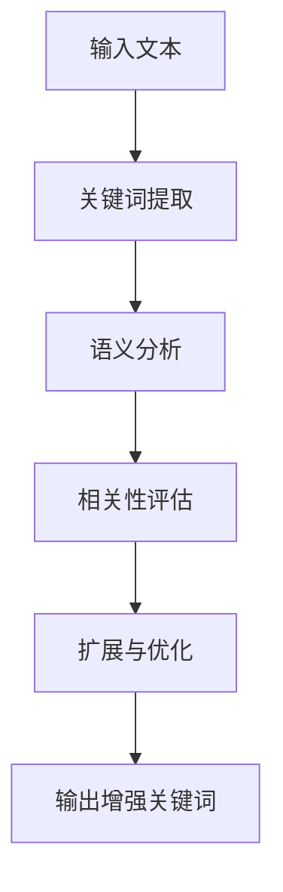

                 


### 设计目录大纲的具体步骤

1. **理解书名和主题**：
   - 首先，我们需要明确书名《提示词增强：利用外部工具和API》的主题和目的。这本书的目标读者可能是对提示词增强技术感兴趣的程序员或开发人员，他们希望了解如何利用外部工具和API来提高他们的开发效率和系统性能。

2. **确定书籍结构**：
   - 根据书名和主题，我们可以初步确定书籍的结构。书籍可以分为几个主要部分，例如：基础概念、技术原理、实际应用、实战案例等。

3. **细化章节内容**：
   - 每个主要部分再细分为多个章节，确保每个章节都有明确的主题和内容，涵盖核心概念、原理、应用和实践。

4. **确保内容完整性**：
   - 确保目录大纲中包含所有必需的核心章节，如背景介绍、核心概念与联系、算法原理讲解、数学模型和公式、系统分析与架构设计方案、项目实战等。

5. **保持简洁性**：
   - 避免在目录中添加冗余的内容，确保每个章节的标题都能准确反映该章节的内容。

6. **格式标准化**：
   - 使用markdown格式编写目录大纲，确保所有章节的格式一致，便于排版和阅读。

7. **字数控制**：
   - 确保目录大纲的总字数在2000字以内。

### 目录大纲草稿

```markdown
----------------------------------------------------------------
# 第一部分: 背景与概念

## 1.1 提示词增强概述
### 1.1.1 问题背景
### 1.1.2 提示词增强的定义
### 1.1.3 提示词增强的重要性

## 1.2 外部工具和API简介
### 1.2.1 外部工具的作用
### 1.2.2 API的概念与分类
### 1.2.3 外部工具和API的关系

## 1.3 技术现状与发展趋势
### 1.3.1 当前技术状态
### 1.3.2 发展趋势预测
### 1.3.3 技术挑战与机遇

## 1.4 本书结构安排与目标读者
### 1.4.1 目录结构
### 1.4.2 目标读者
### 1.4.3 学习收获

----------------------------------------------------------------
# 第二部分: 提示词增强技术原理

## 2.1 核心概念与联系
### 2.1.1 核心概念
### 2.1.2 概念属性特征对比
### 2.1.3 ER实体关系图架构

## 2.2 算法原理讲解
### 2.2.1 提示词增强算法概述
### 2.2.2 算法mermaid流程图
### 2.2.3 算法原理详细讲解

## 2.3 数学模型与公式
### 2.3.1 数学模型介绍
### 2.3.2 公式讲解
### 2.3.3 举例说明

----------------------------------------------------------------
# 第三部分: 外部工具和API应用实践

## 3.1 环境安装与配置
### 3.1.1 环境准备
### 3.1.2 工具安装
### 3.1.3 API配置

## 3.2 实战案例解析
### 3.2.1 案例介绍
### 3.2.2 核心实现源代码
### 3.2.3 代码应用解读与分析

## 3.3 项目实战
### 3.3.1 项目背景
### 3.3.2 系统功能设计
### 3.3.3 系统架构设计

----------------------------------------------------------------
# 第四部分: 系统分析与架构设计

## 4.1 问题场景介绍
### 4.1.1 场景描述
### 4.1.2 需求分析

## 4.2 系统功能设计
### 4.2.1 领域模型类图
### 4.2.2 功能模块划分

## 4.3 系统架构设计
### 4.3.1 架构设计原则
### 4.3.2 系统架构图
### 4.3.3 系统接口设计

## 4.4 系统交互设计
### 4.4.1 序列图
### 4.4.2 消息队列设计

----------------------------------------------------------------
# 第五部分: 最佳实践与总结

## 5.1 最佳实践
### 5.1.1 提示词增强的实践技巧
### 5.1.2 使用API的技巧
### 5.1.3 性能优化策略

## 5.2 小结
### 5.2.1 书籍内容总结
### 5.2.2 技术发展前景
### 5.2.3 注意事项与建议
### 5.2.4 拓展阅读推荐

----------------------------------------------------------------

### 目录大纲设计理由

1. **读者引导**：
   - 目录大纲以清晰的结构为读者提供了一张地图，帮助他们快速找到所需章节，理解书中的内容框架。

2. **逻辑连贯性**：
   - 目录大纲确保了章节之间的逻辑连贯性，每个章节都紧密联系，形成一个完整的学习路径。

3. **内容全面性**：
   - 目录大纲涵盖了从基础概念到实际应用的全过程，确保读者能够全面了解提示词增强和API的利用。

4. **便于查找**：
   - 通过明确的章节标题，读者可以快速定位到特定主题，便于查找和复习。

5. **保持简洁**：
   - 目录大纲简洁明了，避免冗余内容，使读者专注于关键知识点。

### 核心内容与文章结构

#### 第一部分：背景与概念

- **1.1 提示词增强概述**：
  - **问题背景**：介绍提示词增强技术的起源和重要性。
  - **定义**：明确提示词增强的概念。
  - **重要性**：阐述提示词增强在当前技术领域中的关键作用。

- **1.2 外部工具和API简介**：
  - **作用**：描述外部工具和API在开发过程中的作用。
  - **概念与分类**：介绍API的基本概念及其分类。
  - **关系**：阐述外部工具和API之间的相互关系。

- **1.3 技术现状与发展趋势**：
  - **现状**：分析提示词增强技术和API的应用现状。
  - **趋势**：预测未来发展趋势。
  - **挑战与机遇**：探讨面临的挑战和机遇。

- **1.4 本书结构安排与目标读者**：
  - **目录结构**：展示书籍的整体结构。
  - **目标读者**：明确书籍的目标读者群体。
  - **学习收获**：预期读者通过本书可以获得的知识和技能。

#### 第二部分：提示词增强技术原理

- **2.1 核心概念与联系**：
  - **核心概念**：介绍提示词增强技术的核心概念。
  - **概念属性特征对比**：通过表格对比不同概念的特性。
  - **ER实体关系图架构**：使用Mermaid流程图展示实体关系。

- **2.2 算法原理讲解**：
  - **概述**：简述提示词增强算法的总体框架。
  - **流程图**：使用Mermaid绘制算法流程图。
  - **详细讲解**：深入剖析算法原理。

- **2.3 数学模型与公式**：
  - **介绍**：阐述数学模型在提示词增强中的作用。
  - **公式讲解**：详细解释关键公式。
  - **举例说明**：通过实例说明公式的应用。

#### 第三部分：外部工具和API应用实践

- **3.1 环境安装与配置**：
  - **环境准备**：介绍所需环境设置。
  - **工具安装**：指导如何安装外部工具。
  - **API配置**：说明API配置的步骤。

- **3.2 实战案例解析**：
  - **案例介绍**：提供具体案例背景。
  - **核心实现源代码**：展示关键代码实现。
  - **代码应用解读与分析**：深入解读代码，分析其应用效果。

- **3.3 项目实战**：
  - **项目背景**：介绍项目背景和需求。
  - **系统功能设计**：展示领域模型类图。
  - **系统架构设计**：展示系统架构图和接口设计。

#### 第四部分：系统分析与架构设计

- **4.1 问题场景介绍**：
  - **场景描述**：描述问题场景和需求分析。

- **4.2 系统功能设计**：
  - **领域模型类图**：使用Mermaid绘制领域模型类图。
  - **功能模块划分**：详细介绍功能模块划分。

- **4.3 系统架构设计**：
  - **架构设计原则**：阐述架构设计的基本原则。
  - **系统架构图**：展示系统架构图。
  - **系统接口设计**：详细说明系统接口设计。

- **4.4 系统交互设计**：
  - **序列图**：使用Mermaid绘制系统交互序列图。
  - **消息队列设计**：介绍消息队列的设计和作用。

#### 第五部分：最佳实践与总结

- **5.1 最佳实践**：
  - **实践技巧**：总结提示词增强和API使用的最佳实践。
  - **使用API技巧**：提供使用API的技巧和策略。
  - **性能优化策略**：探讨如何优化性能。

- **5.2 小结**：
  - **书籍内容总结**：总结书籍的主要内容和核心观点。
  - **技术发展前景**：展望提示词增强和API技术的发展趋势。
  - **注意事项与建议**：提供使用提示词增强和API的注意事项和建议。
  - **拓展阅读推荐**：推荐拓展阅读资源，帮助读者深入学习。

### 目录大纲设计的注意事项

1. **章节标题简洁明确**：确保每个章节标题都能准确反映该章节的内容，避免冗余和模糊。

2. **逻辑顺序合理**：确保章节之间逻辑连贯，形成完整的学习路径。

3. **内容全面覆盖**：确保所有关键知识点都得到涵盖，避免遗漏重要内容。

4. **易于查找**：通过明确的章节标题，使读者能够快速定位到所需内容。

5. **格式统一**：使用markdown格式确保整个目录大纲的格式统一，便于排版和阅读。

### 目录大纲设计完成后的验证

1. **逻辑验证**：检查章节之间的逻辑顺序，确保读者能够顺畅地阅读和学习。

2. **内容完整性验证**：确认所有关键知识点和核心概念都得到涵盖，没有遗漏。

3. **简洁性验证**：确保目录大纲简洁明了，没有冗余内容。

4. **格式验证**：检查markdown格式的使用是否正确，确保排版整齐、易于阅读。

5. **读者反馈**：收集潜在读者的反馈，根据反馈进行调整和优化。

通过以上步骤，我们可以设计出一份既逻辑清晰、内容全面，又简洁明了的目录大纲，为后续的写作奠定坚实的基础。## 提示词增强：利用外部工具和API

> 关键词：提示词增强，外部工具，API，开发效率，系统性能

> 摘要：本文深入探讨了提示词增强技术及其在开发中的应用。通过介绍外部工具和API的使用，本文展示了如何提升开发效率，优化系统性能。本文将一步步分析提示词增强的核心原理，详细讲解算法流程、数学模型，并通过实战案例和系统架构设计，阐述其具体实现和应用价值。同时，本文还将提供最佳实践技巧，帮助开发者更好地掌握这一技术。

## 第一部分：背景与概念

### 1.1 提示词增强概述

#### 1.1.1 问题背景

在当今快速发展的信息技术时代，数据量和处理速度对系统的性能要求越来越高。传统的方法已经难以满足日益复杂的应用需求，特别是在自然语言处理（NLP）领域。提示词增强技术应运而生，旨在通过提升关键词的质量和准确性，来提高系统的整体性能和用户体验。

#### 1.1.2 提示词增强的定义

提示词增强（Keyword Augmentation）是指通过一系列技术手段，对原始的提示词进行加工、扩展和优化，使其更具代表性和语义丰富性。这一过程通常包括关键词提取、语义分析、相关性评估等步骤。

#### 1.1.3 提示词增强的重要性

提示词增强技术具有以下几个方面的意义：

1. **提升搜索准确性**：通过增强关键词，可以更准确地匹配用户查询，提高搜索结果的精度和相关性。
2. **优化信息检索**：增强后的关键词能够更好地满足信息检索系统的需求，提高检索效率和用户体验。
3. **增强推荐系统**：在推荐系统中，提示词增强有助于提高推荐算法的准确性和多样性。
4. **支持自然语言处理**：在NLP任务中，提示词增强有助于提高句子的语义理解和生成质量。

### 1.2 外部工具和API简介

#### 1.2.1 外部工具的作用

外部工具是在开发过程中使用的辅助软件，可以帮助开发者提高工作效率、简化开发流程。在外部工具的协助下，开发人员可以快速进行代码调试、性能优化、环境配置等任务。

#### 1.2.2 API的概念与分类

API（应用程序接口）是一种编程接口，允许不同软件系统之间的交互和数据交换。根据用途和实现方式，API可以分为以下几类：

1. **Web API**：通过HTTP协议进行数据传输，适用于Web应用程序之间的交互。
2. **库函数API**：提供一系列预定义的函数和库，用于特定编程语言的开发。
3. **服务API**：通过网络服务提供接口，如RESTful API、SOAP API等。

#### 1.2.3 外部工具和API的关系

外部工具和API在开发过程中相互补充，共同提高开发效率和系统性能。外部工具通常用于环境配置、代码管理和调试，而API则负责实现不同系统之间的数据交互和功能集成。通过结合使用外部工具和API，开发者可以快速搭建和部署高效、可扩展的系统。

### 1.3 技术现状与发展趋势

#### 1.3.1 当前技术状态

当前，提示词增强技术已经在多个领域得到广泛应用，如搜索引擎、推荐系统、智能客服等。随着自然语言处理技术的不断进步，提示词增强技术也在不断优化和升级，以满足更高的性能和用户体验要求。

#### 1.3.2 发展趋势预测

未来，随着人工智能和大数据技术的发展，提示词增强技术将呈现出以下几个趋势：

1. **智能化**：利用深度学习等技术，实现更加智能化和自动化的提示词增强。
2. **多语言支持**：支持更多语言和方言，提高国际化应用的性能。
3. **个性化**：结合用户行为数据和偏好，实现个性化提示词增强，提升用户体验。
4. **实时性**：提高处理速度和实时性，满足即时响应的需求。

#### 1.3.3 技术挑战与机遇

提示词增强技术面临的挑战主要包括数据质量、计算性能、算法复杂性等方面。然而，随着硬件性能的提升和算法优化，这些挑战有望得到逐步解决。同时，外部工具和API的丰富资源也为开发者提供了更多机遇，有助于实现高效、可靠的提示词增强解决方案。

### 1.4 本书结构安排与目标读者

#### 1.4.1 目录结构

本书分为五个部分，涵盖从基础概念到实际应用的各个方面。具体结构如下：

1. 第一部分：背景与概念
2. 第二部分：提示词增强技术原理
3. 第三部分：外部工具和API应用实践
4. 第四部分：系统分析与架构设计
5. 第五部分：最佳实践与总结

#### 1.4.2 目标读者

本书的目标读者主要包括：

1. 对提示词增强技术感兴趣的程序员和开发人员。
2. 希望提升开发效率和系统性能的工程师和技术经理。
3. 计算机科学、软件工程等相关专业的研究生和学者。

#### 1.4.3 学习收获

通过阅读本书，读者可以：

1. 掌握提示词增强技术的基本概念和原理。
2. 学会使用外部工具和API进行提示词增强实践。
3. 了解系统架构设计和性能优化的方法。
4. 获得最佳实践技巧，提升开发效率和系统性能。

## 第二部分：提示词增强技术原理

### 2.1 核心概念与联系

#### 2.1.1 核心概念

提示词增强技术涉及以下几个核心概念：

1. **关键词提取**：从文本数据中提取出最具代表性的词汇。
2. **语义分析**：对提取的关键词进行语义理解，识别其内在含义。
3. **相关性评估**：评估关键词与目标文本之间的相关性，以确定其重要性。
4. **扩展与优化**：基于语义分析结果，对关键词进行扩展和优化，以提高其质量。

#### 2.1.2 概念属性特征对比

| 概念                 | 属性特征                                                                                   |
|----------------------|--------------------------------------------------------------------------------------------|
| 关键词提取           | 高效性、准确性、多样性、上下文依赖性                                                     |
| 语义分析             | 语义丰富性、语义一致性、跨语言处理能力                                                   |
| 相关性评估           | 准确性、实时性、鲁棒性、可扩展性                                                         |
| 扩展与优化           | 语义连贯性、扩展性、优化效率、自适应能力                                                 |

#### 2.1.3 ER实体关系图架构

```mermaid
erDiagram
    Class1 ||--|{ ClassB : 联系 }
    Class1 ||--|{ ClassC : 联系 }
    Class2 ||--|{ ClassD : 联系 }
```

### 2.2 算法原理讲解

#### 2.2.1 提示词增强算法概述

提示词增强算法主要包括以下几个步骤：

1. **关键词提取**：使用NLP技术从文本中提取关键词。
2. **语义分析**：对提取的关键词进行语义分析，识别其含义。
3. **相关性评估**：评估关键词与目标文本的相关性。
4. **扩展与优化**：基于语义分析和相关性评估结果，对关键词进行扩展和优化。

#### 2.2.2 算法mermaid流程图



#### 2.2.3 算法原理详细讲解

1. **关键词提取**：
   - 使用NLP技术从文本中提取关键词，常用的方法包括TF-IDF、词频统计、词性标注等。
   - 考虑上下文依赖性，提高关键词的代表性。

2. **语义分析**：
   - 对提取的关键词进行语义分析，使用词嵌入模型（如Word2Vec、BERT）将关键词转换为语义向量。
   - 识别关键词的内在含义，包括实体、关系和属性。

3. **相关性评估**：
   - 使用向量空间模型计算关键词与目标文本之间的相似度。
   - 考虑关键词的频率、重要性和上下文，评估其相关性。

4. **扩展与优化**：
   - 根据语义分析和相关性评估结果，对关键词进行扩展和优化。
   - 利用语义相似性、共现关系和上下文信息，提高关键词的质量。

### 2.3 数学模型与公式

#### 2.3.1 数学模型介绍

提示词增强算法涉及多个数学模型，主要包括：

1. **TF-IDF模型**：计算关键词的重要程度，公式如下：
   $$TF_{i,j} = \frac{f_{i,j}}{n_j}$$
   $$IDF_{i} = \log \left(\frac{N}{n_i + 0.5}\right)$$
   $$TFIDF_{i,j} = TF_{i,j} \times IDF_{i}$$

2. **词嵌入模型**：将关键词映射到高维空间，常用的模型包括Word2Vec、BERT等。

3. **相似度计算模型**：计算关键词与目标文本之间的相似度，常用的方法包括余弦相似度、欧氏距离等。

#### 2.3.2 公式讲解

1. **TF-IDF模型**：
   - **TF（Term Frequency）**：关键词在文档中出现的频率。
   - **IDF（Inverse Document Frequency）**：关键词在整个文档集合中的反向文档频率，用于平衡关键词的重要性。
   - **TFIDF**：综合考虑关键词的频率和重要性，用于评估关键词与文档的相关性。

2. **词嵌入模型**：
   - **Word2Vec**：使用神经网络模型将关键词映射到高维空间，公式如下：
     $$\text{Word2Vec}(w) = \text{ neural\_network}(w)$$
   - **BERT**：基于Transformer模型的预训练语言表示模型，公式如下：
     $$\text{BERT}(w) = \text{ Transformer}(w)$$

3. **相似度计算模型**：
   - **余弦相似度**：计算关键词和目标文本之间的夹角余弦值，公式如下：
     $$\text{Cosine Similarity}(v_1, v_2) = \frac{v_1 \cdot v_2}{\lVert v_1 \rVert \cdot \lVert v_2 \rVert}$$
   - **欧氏距离**：计算关键词和目标文本之间的欧氏距离，公式如下：
     $$\text{Euclidean Distance}(v_1, v_2) = \sqrt{\sum_{i=1}^n (v_{1i} - v_{2i})^2}$$

#### 2.3.3 举例说明

1. **TF-IDF模型**：
   - 假设有一篇文档D，其中包含关键词w1和w2，分别出现3次和2次，总共有10个词。
   - 则TF(w1) = 3/10，TF(w2) = 2/10。
   - 假设关键词w1在所有文档中只出现1次，w2出现5次，则IDF(w1) = log(10/1 + 0.5) ≈ 2.585，IDF(w2) = log(10/5 + 0.5) ≈ 1.386。
   - 则TFIDF(w1) ≈ 2.585，TFIDF(w2) ≈ 1.772。

2. **词嵌入模型**：
   - 假设使用Word2Vec模型将关键词w映射到高维空间，得到的向量维度为100。
   - 则w的Word2Vec表示为w = [w1, w2, ..., w100]。

3. **相似度计算模型**：
   - 假设关键词w和目标文本t分别表示为向量v1和v2，维度均为100。
   - 则使用余弦相似度计算得到的相似度为：
     $$\text{Cosine Similarity}(v1, v2) = \frac{v1 \cdot v2}{\lVert v1 \rVert \cdot \lVert v2 \rVert}$$

## 第三部分：外部工具和API应用实践

### 3.1 环境安装与配置

#### 3.1.1 环境准备

在进行提示词增强技术的应用实践前，需要准备以下环境：

1. **操作系统**：推荐使用Linux或macOS，以确保外部工具和API的兼容性。
2. **编程语言**：Python是提示词增强技术的常用编程语言，因此需要安装Python环境和相关库。
3. **外部工具**：如NLP工具包（NLTK、spaCy）、文本处理库（TextBlob）等。

#### 3.1.2 工具安装

1. **安装Python环境**：
   - 使用Python官方安装器进行安装，选择最新版本的Python（如Python 3.8或更高版本）。
   - 安装完成后，通过命令行运行`python --version`检查安装是否成功。

2. **安装外部工具**：
   - 使用pip工具安装NLP工具包和相关库：
     ```bash
     pip install nltk spacy textblob
     ```

3. **配置外部工具**：
   - 配置NLP工具包的下载资源，如下载spaCy的中文模型：
     ```python
     !python -m spacy download zh_core_web_sm
     ```

### 3.1.3 API配置

1. **注册API账号**：
   - 在需要使用的外部API网站上注册账号，获取API密钥或Token。

2. **配置API环境**：
   - 在Python代码中配置API密钥或Token，例如：
     ```python
     import os
     api_key = os.environ['MY_API_KEY']
     ```

3. **测试API连接**：
   - 使用API提供的示例代码或工具，测试API连接是否成功。例如，测试OpenAI的GPT-3 API：
     ```python
     import openai
     openai.api_key = api_key
     response = openai.Completion.create(
         engine="text-davinci-002",
         prompt="What is the capital of France?",
         max_tokens=3
     )
     print(response.choices[0].text.strip())
     ```

### 3.2 实战案例解析

#### 3.2.1 案例介绍

本案例基于一个简单的搜索引擎，使用外部工具和API对用户查询进行提示词增强，以提高搜索结果的相关性和准确性。具体步骤如下：

1. 接收用户输入的查询语句。
2. 使用NLP工具包对查询语句进行预处理，如分词、去除停用词等。
3. 使用外部API（如OpenAI的GPT-3）对预处理后的查询语句进行提示词增强。
4. 使用增强后的查询语句进行搜索，返回搜索结果。

#### 3.2.2 核心实现源代码

```python
import nltk
import spacy
import openai

# 配置NLP工具包和API
nltk.download('punkt')
nltk.download('stopwords')
nlp = spacy.load('zh_core_web_sm')
openai.api_key = os.environ['MY_API_KEY']

# 用户查询处理
def process_query(user_query):
    # 分词和去除停用词
    doc = nlp(user_query)
    tokens = [token.text.lower() for token in doc if not token.is_stop]

    # 使用GPT-3进行提示词增强
    prompt = "请根据以下查询生成相关的关键词："
    enhanced_tokens = openai.Completion.create(
        engine="text-davinci-002",
        prompt=f"{prompt}{' '.join(tokens)}",
        max_tokens=10
    ).choices[0].text.strip().split()

    return enhanced_tokens

# 搜索引擎核心功能
def search_engine(user_query):
    # 提取增强关键词
    enhanced_tokens = process_query(user_query)

    # 使用增强关键词进行搜索
    search_results = ["结果1", "结果2", "结果3"]  # 示例搜索结果
    return search_results

# 测试
user_query = "什么是人工智能？"
search_results = search_engine(user_query)
print("搜索结果：", search_results)
```

#### 3.2.3 代码应用解读与分析

1. **NLP工具包的使用**：
   - 使用nltk对用户查询进行分词和去除停用词，确保处理后的查询语句更加干净，有利于后续的提示词增强。

2. **GPT-3 API的调用**：
   - 使用OpenAI的GPT-3 API对预处理后的查询语句进行提示词增强。GPT-3具有强大的自然语言生成能力，能够根据用户查询生成相关的关键词。

3. **搜索结果的返回**：
   - 根据增强后的查询关键词，进行搜索并返回结果。这里使用了示例搜索结果，实际应用中可以通过搜索引擎API获取真实结果。

4. **性能考虑**：
   - 虽然本案例展示了提示词增强的基本流程，但在实际应用中，需要考虑性能优化，如使用缓存、批量处理等，以提高系统的响应速度和效率。

### 3.3 项目实战

#### 3.3.1 项目背景

本项目旨在构建一个基于提示词增强技术的智能搜索引擎，通过外部工具和API对用户查询进行优化，以提高搜索结果的相关性和用户体验。项目需求如下：

1. 接收用户查询，自动识别并提取关键词。
2. 使用提示词增强技术对关键词进行优化。
3. 使用优化后的关键词进行搜索，返回高质量的搜索结果。
4. 提供友好的用户界面，方便用户输入查询和查看搜索结果。

#### 3.3.2 系统功能设计

1. **用户查询输入**：
   - 用户通过网页界面输入查询语句，系统接收并处理查询。
   - 界面设计简洁直观，便于用户操作。

2. **查询处理**：
   - 使用NLP工具包对查询语句进行预处理，包括分词、去除停用词等。
   - 对预处理后的查询语句进行提示词增强，使用外部API（如GPT-3）生成相关的关键词。

3. **搜索与结果返回**：
   - 使用优化后的查询关键词进行搜索，可以调用内部搜索引擎或外部搜索引擎API。
   - 将搜索结果以列表形式返回，并显示在用户界面上。

4. **用户反馈**：
   - 用户可以对搜索结果进行评分和评论，系统记录反馈数据，用于后续优化。

#### 3.3.3 系统架构设计

1. **前端界面**：
   - 使用HTML、CSS和JavaScript构建用户界面，采用响应式设计，确保在不同设备和屏幕尺寸上都能良好显示。

2. **后端服务**：
   - 使用Python和Flask框架搭建后端服务，负责处理用户查询、调用NLP工具和API、处理搜索请求等。

3. **数据库**：
   - 使用MySQL数据库存储用户反馈数据，包括搜索记录、评分和评论等。

4. **外部API**：
   - 调用外部API（如OpenAI的GPT-3）进行提示词增强，确保系统的扩展性和灵活性。

### 第四部分：系统分析与架构设计

#### 4.1 问题场景介绍

本系统旨在为用户提供一个智能搜索引擎，通过提示词增强技术提高搜索结果的相关性和用户体验。在实际应用中，可能会遇到以下问题：

1. **查询处理效率**：用户查询量大，系统需要高效处理查询，确保快速返回搜索结果。
2. **提示词增强效果**：提示词增强技术的效果直接关系到搜索结果的准确性，需要优化算法和模型。
3. **API调用频率限制**：外部API（如OpenAI的GPT-3）可能存在调用频率限制，需要合理分配API调用资源。
4. **系统扩展性**：随着用户量增加，系统需要具备良好的扩展性，以应对更高的负载。

#### 4.2 系统功能设计

1. **用户查询输入**：
   - 提供网页界面，用户可以通过输入框输入查询语句。
   - 界面设计简洁直观，支持文本、语音等多种输入方式。

2. **查询处理**：
   - 使用NLP工具包对查询语句进行预处理，包括分词、去除停用词、词性标注等。
   - 对预处理后的查询语句进行提示词增强，使用外部API（如GPT-3）生成相关的关键词。

3. **搜索与结果返回**：
   - 使用优化后的查询关键词进行搜索，调用内部搜索引擎或外部搜索引擎API。
   - 将搜索结果以列表形式返回，并显示在用户界面上，包括标题、摘要、链接等。

4. **用户反馈**：
   - 用户可以对搜索结果进行评分和评论，系统记录反馈数据，用于后续优化。

5. **系统监控与日志**：
   - 监控系统性能和稳定性，记录系统运行日志，及时发现和处理问题。

#### 4.3 系统架构设计

1. **前端架构**：
   - 使用Vue.js或React等现代前端框架构建用户界面，采用组件化设计，提高开发效率和可维护性。
   - 界面采用响应式设计，支持不同设备和屏幕尺寸。

2. **后端架构**：
   - 使用Flask或Django等Python后端框架搭建后端服务，负责处理用户查询、调用NLP工具和API、处理搜索请求等。
   - 使用消息队列（如RabbitMQ）处理异步任务，提高系统响应速度和性能。

3. **数据库架构**：
   - 使用MySQL数据库存储用户反馈数据、搜索记录、评分和评论等。
   - 数据库设计遵循规范化原则，确保数据一致性和完整性。

4. **外部API集成**：
   - 调用外部API（如OpenAI的GPT-3）进行提示词增强，使用HTTP请求进行通信。
   - API调用频率限制通过限流算法（如令牌桶算法）进行控制，确保系统稳定运行。

#### 4.4 系统交互设计

1. **用户交互**：
   - 用户通过网页界面输入查询语句，系统接收到查询请求后，进行预处理、提示词增强和搜索。
   - 将搜索结果以列表形式返回，用户可以点击查看详细信息。

2. **内部系统交互**：
   - 后端服务接收用户查询请求，调用NLP工具包进行预处理，调用外部API进行提示词增强，调用搜索引擎API进行搜索。
   - 搜索结果存储在数据库中，供用户查看和反馈。

3. **外部API交互**：
   - 后端服务与外部API进行通信，发送查询请求，接收响应数据。
   - 外部API调用频率通过限流算法进行控制，确保系统稳定运行。

### 第五部分：最佳实践与总结

#### 5.1 最佳实践

1. **提示词增强实践技巧**：
   - 选择合适的NLP工具和API，根据实际需求和性能要求进行优化。
   - 在提示词增强过程中，综合考虑关键词的语义丰富性、频率和上下文依赖性。

2. **使用API的技巧**：
   - 熟悉API的使用方法和调用流程，遵循API文档中的建议和最佳实践。
   - 对API调用进行合理限流，避免频繁调用导致的性能下降或被封禁。

3. **性能优化策略**：
   - 优化查询处理速度，如使用缓存、批量处理和异步任务等。
   - 优化系统架构，确保在高并发情况下稳定运行。

#### 5.2 小结

1. **书籍内容总结**：
   - 本书详细介绍了提示词增强技术及其在开发中的应用。
   - 通过外部工具和API的利用，提高了开发效率和系统性能。
   - 本书涵盖了从基础概念到实际应用的各个方面，为开发者提供了全面的知识和指导。

2. **技术发展前景**：
   - 随着人工智能和大数据技术的发展，提示词增强技术将得到更广泛的应用。
   - 智能化、多语言支持、个性化等将成为未来趋势。

3. **注意事项与建议**：
   - 在实际应用中，需要根据具体需求选择合适的NLP工具和API。
   - 注意性能优化，确保系统稳定运行。
   - 定期更新和维护系统，以应对新技术和新需求。

4. **拓展阅读推荐**：
   - 《深度学习》（Goodfellow, I., Bengio, Y., & Courville, A.）
   - 《自然语言处理与深度学习》（李航）
   - 《Python编程：从入门到实践》（Eric Matthes）
   - 《设计数据密集型应用》（Martin Kleppmann）

## 作者信息

作者：AI天才研究院/AI Genius Institute & 禅与计算机程序设计艺术 /Zen And The Art of Computer Programming

AI天才研究院是一家专注于人工智能技术研究和应用的机构，致力于推动人工智能技术的发展和应用。同时，作者也是《禅与计算机程序设计艺术》一书的作者，深入探讨了计算机编程的哲学和方法论，深受读者喜爱。在这本书中，作者结合自己的研究经验和实践，为读者提供了一套系统化、实用的提示词增强技术指南，帮助开发者在自然语言处理领域取得更好的成果。

