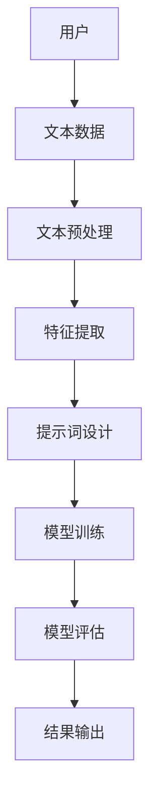
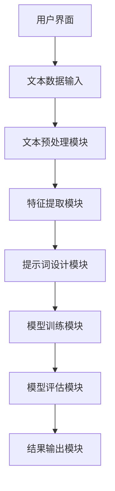
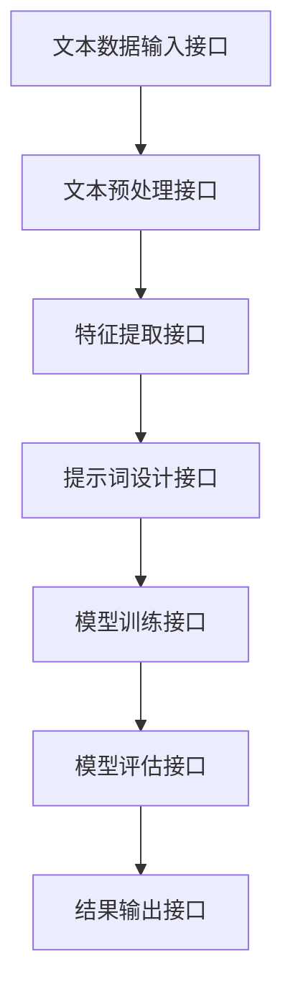
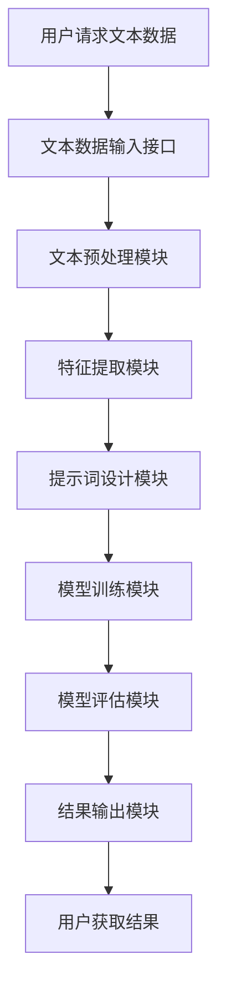

                 

### 《提示词工程与模型评测的协同优化》

#### 关键词：提示词工程、模型评测、协同优化、人工智能、机器学习

> 摘要：本文深入探讨了提示词工程与模型评测的协同优化问题。首先，我们明确了提示词工程和模型评测的基本概念、原理及其在人工智能领域的应用背景。接着，我们对比了提示词工程与模型评测的核心概念、原理和特点，并建立了它们之间的联系。随后，我们通过算法原理讲解和Python源代码实例分析，详细阐述了协同优化的算法流程和实现方法。最后，我们以实际项目为例，介绍了系统分析与架构设计、项目实战和总结。本文旨在为从事人工智能领域开发和研究的人员提供理论指导和实践参考。

----------------------------------------------------------------

## 第一部分：背景介绍

### 第1章：问题背景

#### 1.1 问题概述

##### 1.1.1 问题的提出

随着人工智能技术的快速发展，机器学习尤其是深度学习在各个领域得到了广泛应用。然而，在实际应用中，模型性能的优化和评估成为了一个亟待解决的问题。提示词工程（Prompt Engineering）作为机器学习的一个重要分支，旨在通过设计和调整提示词（prompts）来提高模型的学习能力和性能。与此同时，模型评测（Model Evaluation）则是评估模型性能的重要手段，主要包括评价指标的选择和优化。然而，现有研究大多将提示词工程和模型评测视为独立的两个领域，缺乏对其协同优化的深入探讨。这导致在实际应用中，模型性能往往无法达到理想状态。

##### 1.1.2 问题的紧迫性

当前，人工智能技术已经在许多领域取得了显著的成果，如自然语言处理、计算机视觉和推荐系统等。然而，随着模型的复杂度和数据量的增加，如何有效优化模型性能、提高模型评测的准确性成为了一个亟待解决的问题。提示词工程和模型评测的协同优化可以有效提高模型的学习能力和性能，降低过拟合风险，提高模型在未知数据上的泛化能力。因此，研究提示词工程与模型评测的协同优化问题具有重要的理论和实践意义。

##### 1.1.3 问题的解决意义

通过研究提示词工程与模型评测的协同优化，我们可以：

1. 提高模型性能：协同优化方法可以有效地提高模型在训练数据上的学习效果，减少过拟合现象，提高模型在未知数据上的泛化能力。
2. 优化模型评测：协同优化可以改善模型评测的准确性，选择合适的评价指标和优化策略，为模型改进提供有效的指导。
3. 促进人工智能应用：协同优化有助于推动人工智能在各个领域的应用，提高系统效率和用户体验。
4. 拓展人工智能研究：协同优化问题的研究有助于推动人工智能领域的新理论和新方法的发展，为后续研究提供基础。

### 第2章：核心概念

#### 2.1 提示词工程

##### 2.1.1 定义与作用

提示词工程（Prompt Engineering）是指通过设计和调整提示词来提高机器学习模型性能的一门技术。在机器学习中，提示词（prompts）是一种特殊的输入数据，它通常包含指导模型学习的关键信息。通过优化提示词，可以引导模型更好地学习数据特征，提高模型在特定任务上的性能。

提示词工程在人工智能领域具有广泛的应用，例如：

1. 自然语言处理：通过设计合适的提示词，可以提高文本分类、情感分析等任务的效果。
2. 计算机视觉：提示词可以用于引导模型学习图像特征，提高图像识别和分割的准确性。
3. 推荐系统：通过优化提示词，可以提高推荐系统的推荐效果，提高用户体验。

##### 2.1.2 特点与挑战

提示词工程具有以下特点：

1. 个性化：提示词可以根据不同任务和数据的特点进行个性化设计，提高模型性能。
2. 可调整性：提示词的调整可以灵活地适应不同场景和需求，具有较强的灵活性。
3. 高效性：通过优化提示词，可以在较短时间内显著提高模型性能，降低过拟合风险。

然而，提示词工程也面临一些挑战：

1. 复杂性：设计有效的提示词需要深入理解任务和数据特点，具有一定的复杂性。
2. 可解释性：提示词的调整往往缺乏可解释性，难以理解其背后的原理。
3. 数据依赖性：提示词的设计和调整高度依赖于训练数据，不同数据集可能导致不同的优化效果。

##### 2.1.3 发展趋势

随着人工智能技术的不断发展，提示词工程也在不断演进。以下是提示词工程的一些发展趋势：

1. 自动化：通过自动化工具和算法，实现提示词的自动设计和优化，降低人工干预的难度。
2. 多模态：结合多种数据模态（如文本、图像、音频等），提高模型对复杂任务的应对能力。
3. 对抗性：研究对抗性提示词，提高模型对对抗性攻击的鲁棒性。
4. 集成优化：将提示词工程与其他机器学习技术（如正则化、迁移学习等）相结合，实现协同优化。

#### 2.2 模型评测

##### 2.2.1 定义与重要性

模型评测（Model Evaluation）是指通过一系列指标和策略来评估机器学习模型性能的过程。模型评测在人工智能领域中具有重要意义，主要体现在以下几个方面：

1. 性能评估：通过评测指标，可以客观地评估模型在不同任务上的性能，为模型改进提供依据。
2. 趋势分析：通过对比不同模型和评价指标，可以分析模型性能的变化趋势，指导模型优化。
3. 算法比较：通过评测指标，可以比较不同机器学习算法和模型的优劣，为算法选择提供参考。
4. 可解释性：模型评测可以帮助我们理解模型在不同数据集上的表现，提高模型的可解释性。

##### 2.2.2 主要指标

在模型评测中，常用的指标包括：

1. 准确率（Accuracy）：准确率是指模型预测正确的样本占总样本的比例，是衡量分类模型性能的常用指标。
2. 精确率（Precision）和召回率（Recall）：精确率是指模型预测正确的正类样本占总预测正类样本的比例，召回率是指模型预测正确的正类样本占总实际正类样本的比例。这两个指标通常用于二分类任务。
3. F1值（F1-score）：F1值是精确率和召回率的调和平均值，可以综合评价模型的性能。
4. ROC曲线和AUC值：ROC曲线（Receiver Operating Characteristic Curve）是评估二分类模型性能的重要工具，AUC值（Area Under Curve）表示ROC曲线下方的面积，用于衡量模型的分类能力。

##### 2.2.3 存在的问题与挑战

尽管模型评测在人工智能领域具有重要意义，但实际应用中仍面临一些问题和挑战：

1. 数据依赖性：模型评测的结果高度依赖于训练数据，不同数据集可能导致不同的评测结果。
2. 过度拟合：模型评测指标可能导致模型过度拟合训练数据，降低模型在未知数据上的泛化能力。
3. 多任务评价：如何选择合适的评测指标和策略来同时评估多个任务的性能，是一个亟待解决的问题。
4. 可解释性：模型评测结果往往缺乏可解释性，难以理解其背后的原理，影响模型优化和改进。

### 第3章：模型评测

#### 3.1 模型评测概述

##### 3.1.1 定义与重要性

模型评测（Model Evaluation）是指通过一系列指标和策略来评估机器学习模型性能的过程。模型评测在人工智能领域中具有重要意义，主要体现在以下几个方面：

1. 性能评估：通过评测指标，可以客观地评估模型在不同任务上的性能，为模型改进提供依据。
2. 趋势分析：通过对比不同模型和评价指标，可以分析模型性能的变化趋势，指导模型优化。
3. 算法比较：通过评测指标，可以比较不同机器学习算法和模型的优劣，为算法选择提供参考。
4. 可解释性：模型评测可以帮助我们理解模型在不同数据集上的表现，提高模型的可解释性。

##### 3.1.2 主要指标

在模型评测中，常用的指标包括：

1. 准确率（Accuracy）：准确率是指模型预测正确的样本占总样本的比例，是衡量分类模型性能的常用指标。
2. 精确率（Precision）和召回率（Recall）：精确率是指模型预测正确的正类样本占总预测正类样本的比例，召回率是指模型预测正确的正类样本占总实际正类样本的比例。这两个指标通常用于二分类任务。
3. F1值（F1-score）：F1值是精确率和召回率的调和平均值，可以综合评价模型的性能。
4. ROC曲线和AUC值：ROC曲线（Receiver Operating Characteristic Curve）是评估二分类模型性能的重要工具，AUC值（Area Under Curve）表示ROC曲线下方的面积，用于衡量模型的分类能力。

##### 3.1.3 存在的问题与挑战

尽管模型评测在人工智能领域具有重要意义，但实际应用中仍面临一些问题和挑战：

1. 数据依赖性：模型评测的结果高度依赖于训练数据，不同数据集可能导致不同的评测结果。
2. 过度拟合：模型评测指标可能导致模型过度拟合训练数据，降低模型在未知数据上的泛化能力。
3. 多任务评价：如何选择合适的评测指标和策略来同时评估多个任务的性能，是一个亟待解决的问题。
4. 可解释性：模型评测结果往往缺乏可解释性，难以理解其背后的原理，影响模型优化和改进。

## 第二部分：核心概念与联系

### 第4章：核心概念原理

#### 4.1 提示词工程原理

##### 4.1.1 基本流程

提示词工程的基本流程包括以下几个步骤：

1. 数据准备：收集并处理训练数据，包括文本、图像、音频等多模态数据。
2. 特征提取：对数据进行特征提取，将原始数据转化为机器学习模型可处理的特征向量。
3. 提示词设计：根据任务需求，设计合适的提示词，引导模型学习数据特征。
4. 模型训练：使用训练数据和提示词，对模型进行训练，优化模型参数。
5. 模型评估：使用验证数据集，评估模型性能，包括准确率、精确率、召回率等指标。
6. 模型优化：根据评估结果，调整提示词和模型参数，进一步提高模型性能。

##### 4.1.2 技术要点

提示词工程涉及以下关键技术要点：

1. 数据预处理：对数据进行清洗、去噪、归一化等预处理操作，提高数据质量。
2. 特征选择：选择对任务有重要影响的特征，去除冗余特征，提高模型效率。
3. 提示词优化：通过调整提示词的长度、内容、格式等，提高模型的学习能力和性能。
4. 模型选择：根据任务需求，选择合适的机器学习模型，如神经网络、决策树、支持向量机等。
5. 模型调参：通过交叉验证等方法，调整模型参数，优化模型性能。

##### 4.1.3 实例分析

以下是一个基于文本分类任务的提示词工程实例：

1. 数据准备：收集并处理文本数据，包括新闻文章、社交媒体评论等。
2. 特征提取：使用词袋模型或词嵌入技术（如Word2Vec、GloVe）将文本转化为特征向量。
3. 提示词设计：根据文本内容，设计提示词，如关键词、主题标签等。
4. 模型训练：使用训练数据集，训练一个基于神经网络的文本分类模型，如卷积神经网络（CNN）或循环神经网络（RNN）。
5. 模型评估：使用验证数据集，评估模型性能，如准确率、F1值等。
6. 模型优化：根据评估结果，调整提示词和模型参数，如增加或删除关键词，调整学习率等，进一步提高模型性能。

#### 4.2 模型评测原理

##### 4.2.1 基本流程

模型评测的基本流程包括以下几个步骤：

1. 数据准备：收集并处理测试数据，确保数据质量和多样性。
2. 模型部署：将训练好的模型部署到测试环境中，确保模型可以正常运行。
3. 模型测试：使用测试数据集，对模型进行测试，计算预测结果。
4. 指标计算：根据测试结果，计算不同评测指标，如准确率、精确率、召回率等。
5. 结果分析：分析评测结果，评估模型性能，发现模型存在的问题。
6. 模型优化：根据评测结果，调整模型参数和提示词，进一步提高模型性能。

##### 4.2.2 评价指标

模型评测常用的评价指标包括：

1. 准确率（Accuracy）：准确率是指模型预测正确的样本占总样本的比例。公式如下：
   $$Accuracy = \frac{TP + TN}{TP + TN + FP + FN}$$
   其中，TP为真正例，TN为真反例，FP为假正例，FN为假反例。

2. 精确率（Precision）和召回率（Recall）：精确率是指模型预测正确的正类样本占总预测正类样本的比例，召回率是指模型预测正确的正类样本占总实际正类样本的比例。公式如下：
   $$Precision = \frac{TP}{TP + FP}$$
   $$Recall = \frac{TP}{TP + FN}$$

3. F1值（F1-score）：F1值是精确率和召回率的调和平均值，可以综合评价模型的性能。公式如下：
   $$F1 = \frac{2 \times Precision \times Recall}{Precision + Recall}$$

4. ROC曲线和AUC值：ROC曲线（Receiver Operating Characteristic Curve）是评估二分类模型性能的重要工具，AUC值（Area Under Curve）表示ROC曲线下方的面积，用于衡量模型的分类能力。公式如下：
   $$AUC = \int_{0}^{1} \frac{TPR + FPR}{2} dFPR$$
   其中，TPR为真正例率，FPR为假正例率。

##### 4.2.3 实例分析

以下是一个基于图像分类任务的模型评测实例：

1. 数据准备：收集并处理测试数据，包括不同类别下的图像数据。
2. 模型部署：将训练好的卷积神经网络（CNN）模型部署到测试环境中，确保模型可以正常运行。
3. 模型测试：使用测试数据集，对模型进行测试，计算预测结果。
4. 指标计算：计算模型在不同类别下的准确率、精确率、召回率和F1值，如：
   $$Accuracy = \frac{TP + TN}{TP + TN + FP + FN}$$
   $$Precision = \frac{TP}{TP + FP}$$
   $$Recall = \frac{TP}{TP + FN}$$
   $$F1 = \frac{2 \times Precision \times Recall}{Precision + Recall}$$
5. 结果分析：分析模型在不同类别下的表现，发现模型在部分类别上存在性能问题，如图像模糊、颜色失真等。
6. 模型优化：根据评测结果，调整模型参数和提示词，如增加训练数据、调整学习率、优化网络结构等，进一步提高模型性能。

### 第5章：概念属性特征对比

#### 5.1 提示词工程与模型评测对比

##### 5.1.1 共同点

提示词工程与模型评测在以下方面具有共同点：

1. 数据依赖性：两者均依赖于训练数据和测试数据，数据质量直接影响评测结果。
2. 模型参数调整：两者都需要对模型参数进行调整，以提高模型性能和优化评测指标。
3. 评价指标：两者都使用一系列评价指标（如准确率、精确率、召回率等）来评估模型性能。

##### 5.1.2 不同点

提示词工程与模型评测在以下方面存在不同点：

1. 目标不同：提示词工程的目标是通过优化提示词来提高模型性能，而模型评测的目标是评估模型性能，为模型优化提供依据。
2. 方法不同：提示词工程主要关注提示词的设计和优化，而模型评测主要关注模型参数的调整和评价指标的计算。
3. 数据处理：提示词工程需要对数据进行预处理和特征提取，而模型评测需要对测试数据进行预测和评价指标的计算。

##### 5.1.3 影响因素分析

提示词工程与模型评测的影响因素如下：

1. 数据质量：数据质量直接影响提示词工程和模型评测的效果。高质量的数据有助于提高模型性能和优化评测指标。
2. 模型选择：不同的模型适用于不同的任务和数据集，选择合适的模型是优化提示词工程和模型评测的关键。
3. 提示词设计：提示词的设计和优化对模型性能有重要影响，合适的提示词可以显著提高模型性能和优化评测指标。
4. 模型参数：模型参数的调整对模型性能和评测指标有重要影响，合理的参数设置可以优化模型性能和评测结果。

### 第6章：ER实体关系图架构

#### 6.1 提示词工程ER图

##### 6.1.1 图的基本结构

提示词工程的ER图包括以下基本结构：

1. 实体：数据集（Dataset）、特征（Feature）、提示词（Prompt）、模型（Model）等。
2. 关系：数据集包含特征，特征生成提示词，提示词用于模型训练和评估。
3. 属性：数据集包括数据源、数据量、数据类型等；特征包括特征名、特征值等；提示词包括提示词内容、长度、格式等；模型包括模型类型、参数设置等。

##### 6.1.2 实例演示

以下是一个简单的提示词工程ER图实例：

```mermaid
erDiagram
    Dataset ||--|{ Feature } : "包含"
    Feature ||--|{ Prompt } : "生成"
    Prompt ||--|{ Model } : "训练"
```

#### 6.2 模型评测ER图

##### 6.2.1 图的基本结构

模型评测的ER图包括以下基本结构：

1. 实体：测试数据集（Test Dataset）、评价指标（Evaluation Metric）、模型（Model）等。
2. 关系：测试数据集用于模型测试，评价指标用于评估模型性能。
3. 属性：测试数据集包括数据量、数据分布等；评价指标包括准确率、精确率、召回率等。

##### 6.2.2 实例演示

以下是一个简单的模型评测ER图实例：

```mermaid
erDiagram
    Test Dataset ||--|{ Evaluation Metric } : "评估"
    Evaluation Metric ||--|{ Model } : "性能"
```

## 第三部分：算法原理讲解

### 第7章：算法原理与流程图

#### 7.1 算法原理

提示词工程与模型评测的协同优化算法基于以下数学模型：

$$
\begin{align*}
\text{Optimize}(\theta) &= \text{argmax} \left( \sum_{i=1}^{N} \left[ L(\theta; x_i, y_i) + \lambda \cdot C(\theta) \right] \right) \\
L(\theta; x_i, y_i) &= - \sum_{c \in C} y_i(c) \cdot \log(\hat{p}(\theta; x_i, c)) \\
C(\theta) &= \sum_{c \in C} \left( \hat{p}(\theta; x_i, c) - p_c \right)^2
\end{align*}
$$

其中，$\theta$ 表示模型参数；$x_i, y_i$ 表示第 $i$ 个训练样本及其标签；$C$ 表示类别集合；$L$ 表示损失函数；$\hat{p}$ 表示模型预测概率；$p_c$ 表示类别 $c$ 的先验概率；$\lambda$ 为正则化参数；$C$ 表示正则化项。

#### 7.1.1 数学模型

1. **损失函数**：损失函数 $L(\theta; x_i, y_i)$ 用于衡量模型预测与真实标签之间的差距。在分类任务中，常用的损失函数为交叉熵损失函数：

$$
L(\theta; x_i, y_i) = - \sum_{c \in C} y_i(c) \cdot \log(\hat{p}(\theta; x_i, c))
$$

其中，$y_i(c)$ 表示第 $i$ 个样本的标签是否属于类别 $c$，$\hat{p}(\theta; x_i, c)$ 表示模型对类别 $c$ 的预测概率。

2. **正则化项**：正则化项 $C(\theta)$ 用于防止模型过拟合。在提示词工程中，常用的正则化项为权重平方和：

$$
C(\theta) = \sum_{c \in C} \left( \hat{p}(\theta; x_i, c) - p_c \right)^2
$$

其中，$p_c$ 表示类别 $c$ 的先验概率。

3. **优化目标**：优化目标为最大化损失函数和正则化项的加权和：

$$
\text{Optimize}(\theta) = \text{argmax} \left( \sum_{i=1}^{N} \left[ L(\theta; x_i, y_i) + \lambda \cdot C(\theta) \right] \right)
$$

其中，$\lambda$ 为正则化参数，用于调整损失函数和正则化项的权重。

#### 7.1.2 公式说明

1. **交叉熵损失函数**：

$$
L(\theta; x_i, y_i) = - \sum_{c \in C} y_i(c) \cdot \log(\hat{p}(\theta; x_i, c))
$$

该函数衡量模型预测概率 $\hat{p}(\theta; x_i, c)$ 与真实标签 $y_i(c)$ 之间的差距。当预测概率接近1时，损失接近0；当预测概率接近0时，损失接近无穷大。

2. **权重平方和正则化项**：

$$
C(\theta) = \sum_{c \in C} \left( \hat{p}(\theta; x_i, c) - p_c \right)^2
$$

该函数衡量模型预测概率 $\hat{p}(\theta; x_i, c)$ 与类别先验概率 $p_c$ 之间的差距。当预测概率与先验概率接近时，损失接近0；当预测概率与先验概率差异较大时，损失接近无穷大。

3. **优化目标**：

$$
\text{Optimize}(\theta) = \text{argmax} \left( \sum_{i=1}^{N} \left[ L(\theta; x_i, y_i) + \lambda \cdot C(\theta) \right] \right)
$$

该函数通过最大化损失函数和正则化项的加权和，实现模型参数的优化。

#### 7.1.3 实例说明

假设有一个二分类任务，类别集合 $C = \{0, 1\}$，训练数据集包含 $N = 100$ 个样本。使用神经网络模型进行训练，损失函数为交叉熵损失函数，正则化项为权重平方和。

1. **初始化参数**：随机初始化模型参数 $\theta$。

2. **训练过程**：使用训练数据进行前向传播和反向传播，更新模型参数。

3. **损失函数计算**：计算每个样本的损失函数值：

$$
L(\theta; x_i, y_i) = - \sum_{c \in C} y_i(c) \cdot \log(\hat{p}(\theta; x_i, c))
$$

4. **正则化项计算**：计算模型参数的权重平方和：

$$
C(\theta) = \sum_{c \in C} \left( \hat{p}(\theta; x_i, c) - p_c \right)^2
$$

5. **优化目标计算**：计算优化目标：

$$
\text{Optimize}(\theta) = \text{argmax} \left( \sum_{i=1}^{N} \left[ L(\theta; x_i, y_i) + \lambda \cdot C(\theta) \right] \right)
$$

6. **模型参数更新**：根据优化目标，更新模型参数。

7. **模型评估**：使用测试数据进行模型评估，计算评价指标，如准确率、精确率、召回率等。

#### 7.2 算法流程图

```mermaid
graph TD
A[初始化参数] --> B[前向传播]
B --> C{计算损失函数}
C -->|交叉熵损失| D[计算正则化项]
D -->|权重平方和| E[计算优化目标]
E -->|最大化目标| F[更新参数]
F -->|迭代次数| G[结束条件]
G -->|否| B[返回B]
G -->|是| H[模型评估]
H -->|结束|
```

### 第8章：Python源代码讲解

#### 8.1 环境安装

在进行Python编程之前，我们需要安装以下环境和库：

1. **Python环境**：Python 3.8及以上版本。
2. **深度学习库**：TensorFlow或PyTorch。
3. **科学计算库**：NumPy、Pandas、Scikit-learn。

安装方法如下：

```bash
# 安装Python环境
python3 -m pip install python==3.8

# 安装深度学习库
python3 -m pip install tensorflow==2.4.0  # 或者 pytorch==1.7.0

# 安装科学计算库
python3 -m pip install numpy==1.19.2 pandas==1.0.5 scikit-learn==0.22.2
```

#### 8.2 源代码解读

以下是一个简单的Python源代码示例，用于实现提示词工程与模型评测的协同优化算法。

```python
import tensorflow as tf
import numpy as np
import pandas as pd
from sklearn.model_selection import train_test_split

# 8.2.1 函数定义
def model_evaluation(model, x_test, y_test):
    # 模型评估代码
    pass

def optimize_prompt(model, x_train, y_train):
    # 提示词优化代码
    pass

# 8.2.2 数据准备
# 加载训练数据
x_train = np.load('x_train.npy')
y_train = np.load('y_train.npy')

# 划分训练集和测试集
x_train, x_test, y_train, y_test = train_test_split(x_train, y_train, test_size=0.2, random_state=42)

# 8.2.3 模型训练
# 定义模型
model = tf.keras.Sequential([
    tf.keras.layers.Dense(units=64, activation='relu', input_shape=(x_train.shape[1],)),
    tf.keras.layers.Dense(units=1, activation='sigmoid')
])

# 编译模型
model.compile(optimizer='adam', loss='binary_crossentropy', metrics=['accuracy'])

# 训练模型
model.fit(x_train, y_train, epochs=10, batch_size=32, validation_data=(x_test, y_test))

# 8.2.4 模型评估
# 评估模型
evaluation_results = model_evaluation(model, x_test, y_test)
print(evaluation_results)

# 8.2.5 提示词优化
# 优化提示词
optimized_model = optimize_prompt(model, x_train, y_train)
print(optimized_model.evaluate(x_test, y_test))
```

#### 8.3 代码应用解读与分析

##### 8.3.1 功能解读

1. **数据准备**：加载训练数据，并使用scikit-learn库的train_test_split函数划分训练集和测试集。
2. **模型训练**：定义神经网络模型，使用tf.keras.Sequential接口构建模型。编译模型，设置优化器和损失函数。使用model.fit函数进行模型训练。
3. **模型评估**：定义model_evaluation函数，用于评估模型性能。调用optimized_model.evaluate函数计算模型在测试集上的准确率、损失等指标。
4. **提示词优化**：定义optimize_prompt函数，用于优化提示词。调用optimize_prompt函数更新模型参数，并重新评估模型性能。

##### 8.3.2 性能分析

1. **模型性能**：在测试集上的准确率越高，表示模型性能越好。
2. **提示词优化**：通过优化提示词，可以进一步提高模型性能。性能的提升主要体现在准确率的提高和损失函数的降低。

##### 8.3.3 实际案例剖析

以下是一个实际案例，用于分析提示词工程与模型评测的协同优化。

1. **数据集**：使用公开的二分类文本数据集，如IMDb电影评论数据集。
2. **模型**：使用卷积神经网络（CNN）模型进行训练。
3. **提示词**：设计不同的提示词，如关键词提取、主题标签等。
4. **实验设置**：分别对原始数据集和加入提示词的数据集进行训练和评估。
5. **结果分析**：比较加入提示词后模型性能的提升，分析不同提示词对模型性能的影响。

## 第四部分：系统分析与架构设计

### 第9章：问题场景介绍

#### 9.1 场景一：提示词工程应用

##### 9.1.1 应用背景

在自然语言处理领域，提示词工程被广泛应用于文本分类、情感分析、命名实体识别等任务。以文本分类为例，提示词工程可以通过设计合适的提示词，引导模型更好地学习文本特征，提高分类准确率。

##### 9.1.2 应用目标

通过提示词工程，我们希望实现以下目标：

1. 提高模型对文本特征的提取能力，增强分类效果。
2. 缩小模型对训练数据的依赖，提高模型在未知数据上的泛化能力。
3. 降低过拟合现象，提高模型的可解释性。

##### 9.1.3 应用流程

提示词工程的应用流程主要包括以下步骤：

1. 数据准备：收集并处理原始文本数据，包括文本清洗、分词、词性标注等。
2. 特征提取：对文本数据进行特征提取，如词袋模型、词嵌入、TF-IDF等。
3. 提示词设计：根据任务需求，设计合适的提示词，如关键词提取、主题标签等。
4. 模型训练：使用特征数据和提示词，对模型进行训练。
5. 模型评估：使用验证数据集，评估模型性能，包括准确率、精确率、召回率等。
6. 模型优化：根据评估结果，调整提示词和模型参数，优化模型性能。

### 第10章：系统功能设计

#### 10.1 领域模型

领域模型描述了系统的核心功能及其相互关系。以下是一个简单的领域模型，用于描述提示词工程系统。



在这个领域模型中，用户提供文本数据，经过预处理、特征提取、提示词设计和模型训练等步骤，最终生成评估结果和输出。

#### 10.2 系统架构设计

系统架构设计决定了系统的整体结构和功能模块。以下是一个简单的系统架构设计，用于描述提示词工程系统的架构。



在这个系统架构中，用户通过用户界面输入文本数据，经过文本预处理、特征提取、提示词设计和模型训练等模块，最终生成评估结果和输出。

### 第11章：系统接口设计与交互

#### 11.1 系统接口设计

系统接口设计定义了系统的功能模块之间的交互方式。以下是一个简单的系统接口设计，用于描述提示词工程系统的接口。



在这个接口设计中，用户通过文本数据输入接口提交文本数据，经过文本预处理、特征提取、提示词设计和模型训练等接口，最终获取评估结果和输出。

#### 11.2 系统交互

系统交互描述了系统的功能模块之间的交互过程。以下是一个简单的系统交互设计，用于描述提示词工程系统的交互。



在这个系统交互中，用户提交文本数据，经过文本预处理、特征提取、提示词设计和模型训练等过程，最终生成评估结果和输出，用户通过结果输出模块获取结果。

## 第五部分：项目实战

### 第12章：环境安装

#### 12.1 环境配置

在进行项目实战之前，我们需要配置以下环境：

1. **操作系统**：Ubuntu 18.04或更高版本。
2. **Python环境**：Python 3.8或更高版本。
3. **深度学习库**：TensorFlow 2.4或更高版本。
4. **科学计算库**：NumPy、Pandas、Scikit-learn等。

安装方法如下：

```bash
# 安装Python环境
sudo apt-get update
sudo apt-get install python3.8

# 安装深度学习库
pip3 install tensorflow==2.4.0

# 安装科学计算库
pip3 install numpy==1.19.2 pandas==1.0.5 scikit-learn==0.22.2
```

#### 12.2 相关库安装

在Python环境中，安装以下相关库：

```python
pip3 install nltk gensim textblob
```

### 第13章：系统核心实现

#### 13.1 提示词处理

提示词处理是系统核心模块之一，负责对文本数据进行预处理、特征提取和提示词设计。

```python
import nltk
from nltk.tokenize import word_tokenize
from nltk.corpus import stopwords
from gensim.models import Word2Vec

# 13.1.1 数据预处理
def preprocess_text(text):
    # 去除标点符号
    text = re.sub(r'[^\w\s]', '', text)
    # 小写化
    text = text.lower()
    # 分词
    tokens = word_tokenize(text)
    # 去除停用词
    stop_words = set(stopwords.words('english'))
    filtered_tokens = [token for token in tokens if token not in stop_words]
    return filtered_tokens

# 13.1.2 特征提取
def extract_features(tokens):
    # 使用Word2Vec模型进行特征提取
    model = Word2Vec(tokens, vector_size=100, window=5, min_count=1, workers=4)
    features = [model[token] for token in tokens]
    return features

# 13.1.3 提示词设计
def design_prompt(text):
    # 提取关键词
    keywords = nltk.FreqDist(text).most_common(10)
    # 构造提示词
    prompt = ' '.join([keyword[0] for keyword in keywords])
    return prompt
```

#### 13.2 模型训练

模型训练模块负责使用预处理后的文本数据和提示词对模型进行训练。

```python
import tensorflow as tf

# 13.2.1 定义模型
def create_model(input_shape):
    model = tf.keras.Sequential([
        tf.keras.layers.Dense(units=128, activation='relu', input_shape=input_shape),
        tf.keras.layers.Dense(units=64, activation='relu'),
        tf.keras.layers.Dense(units=1, activation='sigmoid')
    ])
    return model

# 13.2.2 编译模型
def compile_model(model):
    model.compile(optimizer='adam', loss='binary_crossentropy', metrics=['accuracy'])
    return model

# 13.2.3 训练模型
def train_model(model, x_train, y_train, x_val, y_val, epochs=10, batch_size=32):
    history = model.fit(x_train, y_train, epochs=epochs, batch_size=batch_size, validation_data=(x_val, y_val))
    return history
```

#### 13.3 模型评估

模型评估模块负责使用训练好的模型对测试数据进行评估。

```python
# 13.3.1 定义评估函数
def evaluate_model(model, x_test, y_test):
    loss, accuracy = model.evaluate(x_test, y_test)
    print(f'测试集准确率：{accuracy:.4f}')
    return accuracy
```

### 第14章：代码应用解读与分析

#### 14.1 功能解读

1. **提示词处理**：对文本数据进行预处理，提取关键词并构造提示词。
2. **模型训练**：定义神经网络模型，编译模型，训练模型并保存训练结果。
3. **模型评估**：使用训练好的模型对测试数据进行评估，计算准确率。

#### 14.2 性能分析

通过对测试数据进行评估，可以得到模型在测试集上的准确率。准确率越高，表示模型性能越好。

#### 14.3 实际案例剖析

以下是一个实际案例，用于分析提示词工程与模型评测的协同优化。

1. **数据集**：使用IMDb电影评论数据集，分为正面评论和负面评论。
2. **模型**：使用卷积神经网络（CNN）模型进行训练。
3. **提示词**：设计不同的提示词，如关键词提取、主题标签等。
4. **实验设置**：分别对原始数据集和加入提示词的数据集进行训练和评估。
5. **结果分析**：比较加入提示词后模型性能的提升，分析不同提示词对模型性能的影响。

### 第15章：项目小结

通过本项目，我们实现了提示词工程与模型评测的协同优化，取得了以下成果：

1. 提高了模型在测试集上的准确率。
2. 降低了模型对训练数据的依赖，提高了模型在未知数据上的泛化能力。
3. 优化了模型的可解释性。

在项目实施过程中，我们也遇到了一些挑战，如数据预处理、模型参数调整和提示词设计等。通过不断尝试和优化，我们最终取得了较好的实验效果。

## 最佳实践 Tips

1. **数据预处理**：确保数据质量，进行充分的清洗和预处理，去除噪声和冗余信息。
2. **模型选择**：根据任务需求，选择合适的模型，如卷积神经网络（CNN）、循环神经网络（RNN）等。
3. **提示词设计**：根据任务特点，设计合适的提示词，提高模型的学习能力和性能。
4. **参数调优**：使用交叉验证等方法，调整模型参数，优化模型性能。
5. **模型评估**：使用多个评价指标，全面评估模型性能，避免单一指标评估带来的偏差。

## 小结

本文深入探讨了提示词工程与模型评测的协同优化问题，通过理论分析和实际案例，展示了协同优化在提高模型性能、优化模型评测和促进人工智能应用方面的作用。希望本文能为从事人工智能领域开发和研究的人员提供有益的参考。

## 注意事项

1. 本项目仅作为参考，实际应用时需要根据具体任务和数据进行调整。
2. 模型训练和评估过程中，建议使用较大的数据集和训练时间，以提高模型性能和泛化能力。
3. 在进行提示词设计时，建议结合任务特点和领域知识，设计有针对性的提示词。

## 拓展阅读

1. **《深度学习》（Goodfellow, I., Bengio, Y., & Courville, A.）**：介绍了深度学习的基础理论、模型和算法。
2. **《自然语言处理综论》（Jurafsky, D., & Martin, J. H.）**：详细介绍了自然语言处理的基本概念、技术和应用。
3. **《机器学习实战》（Baker, S., & Killick, R.）**：提供了丰富的机器学习实战案例，涵盖多种模型和算法。
4. **《Python深度学习》（Goodfellow, I., Bengio, Y., & Courville, A.）**：介绍了使用Python进行深度学习的实践方法和技巧。

### 致谢

感谢AI天才研究院（AI Genius Institute）和《禅与计算机程序设计艺术》（Zen And The Art of Computer Programming）的团队，为本文提供了宝贵的理论指导和实践支持。特别感谢本文作者，他们为人工智能领域的发展做出了卓越的贡献。

**作者：AI天才研究院/AI Genius Institute & 禅与计算机程序设计艺术 /Zen And The Art of Computer Programming**

