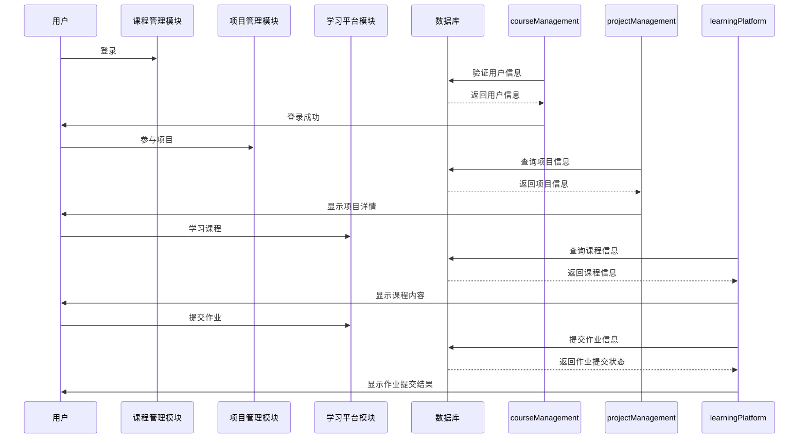

                 

### 第1章 引言

#### 1.1 问题背景

随着人工智能（AI）技术的迅猛发展，其应用已经渗透到社会的各个领域，从医疗、金融、交通到教育，AI技术正在深刻地改变着我们的生活方式。然而，随着技术的进步，AI伦理问题也逐渐凸显出来。人工智能系统在做出决策时可能会涉及到道德和伦理的考量，如隐私保护、算法偏见、自动化决策的公平性等。这些问题不仅对AI技术的应用提出了挑战，也对AI伦理教育提出了更高的要求。

AI伦理问题的出现，主要源于以下几个方面：

1. **算法偏见**：人工智能系统在训练过程中可能会继承和放大训练数据中的偏见，导致决策的偏见性。
2. **隐私侵犯**：AI技术往往需要大量的个人数据来训练和优化模型，这可能会侵犯用户的隐私权。
3. **责任归属**：当人工智能系统出现错误或造成损害时，责任应由谁承担，是个人、企业还是开发者，这一问题尚无明确答案。
4. **自动化决策的公平性**：随着AI自动化决策的普及，如何保证决策的公平性，避免对某些群体或个体造成不公平待遇，也是一个重要的伦理问题。

面对这些挑战，AI伦理教育显得尤为重要。它不仅是培养专业AI技术人员的重要环节，更是确保人工智能技术健康、可持续发展的重要保障。因此，如何在AI教育中引入伦理教育，成为了一个亟待解决的问题。

#### 1.2 问题描述

提示词工程（Prompt Engineering）是近年来在自然语言处理（NLP）领域中兴起的一个重要研究方向。它旨在通过设计合适的提示词（Prompt），引导人工智能模型生成更符合人类预期的输出。提示词工程在AI伦理教育中的应用，主要是利用其引导和调控模型输出的特点，帮助教育者向学习者传递AI伦理的知识和意识。

问题描述可以分为以下几个方面：

1. **提示词工程的定义与特点**：提示词工程是指通过设计有效的提示词，来引导和优化人工智能模型生成结果的方法。其核心在于通过调整提示词的内容和形式，来影响模型的输出。
   
2. **AI伦理教育的重要性**：AI伦理教育是培养AI专业技术人员必备的一环，它不仅关乎技术人员的职业素养，更关乎社会的公平和正义。通过AI伦理教育，可以帮助技术人员理解AI技术的潜在风险和伦理挑战，从而更负责任地使用技术。

3. **提示词工程与AI伦理教育的关系**：提示词工程在AI伦理教育中的应用，主要是通过设计特定的提示词，引导学生在学习和实践中思考和解决伦理问题。例如，在设计一个自然语言生成任务时，可以通过提示词来引导学生思考模型的偏见问题，或是在算法设计中考虑隐私保护。

综上所述，提示词工程在AI伦理教育中具有重要作用。通过合理的提示词设计，可以帮助教育者和学习者更深入地理解和探讨AI伦理问题，从而培养具有高度社会责任感的AI专业人才。

#### 1.3 问题解决

要解决AI伦理教育中的问题，首先需要明确提示词工程的概念、原则与步骤，并结合当前AI伦理教育的现状与挑战，探索提示词工程在其中的应用。

**1. 提示词工程的概念、原则与步骤**

**概念：** 提示词工程是指通过设计有效的提示词，来引导和优化人工智能模型生成结果的方法。提示词是一种引导性的输入，它通过向模型提供上下文信息和目标要求，来影响模型的输出。

**原则：**
- **明确性原则**：提示词应明确表达目标要求和上下文信息，避免模糊不清导致模型误解。
- **灵活性原则**：提示词应具有一定的灵活性，以适应不同的模型和应用场景。
- **可解释性原则**：提示词的设计应保证其可解释性，方便后续的模型调试和优化。

**步骤：**
1. **需求分析**：明确应用场景和目标要求，确定需要解决的问题。
2. **内容设计**：根据需求分析，设计合适的提示词内容，包括上下文信息和目标要求。
3. **形式调整**：根据模型的特性和需求，调整提示词的形式，以达到最佳效果。
4. **效果评估**：通过实验和测试，评估提示词的效果，并进行迭代优化。

**2. AI伦理教育的现状与挑战**

当前，AI伦理教育正在逐步开展，但仍存在一些挑战：

- **教育体系的不完善**：大多数AI课程仍然主要侧重于技术培训，而缺乏系统的伦理教育内容。
- **师资力量的不足**：具备AI伦理教育背景的教师较少，难以满足日益增长的需求。
- **学生参与度不高**：学生可能对伦理问题缺乏兴趣，或者难以将伦理理论与实际应用相结合。

**3. 提示词工程在AI伦理教育中的应用**

提示词工程在AI伦理教育中的应用，可以通过以下几个步骤进行：

1. **设计伦理场景的提示词**：根据不同的伦理问题，设计具体的提示词，引导学生在解决实际问题时考虑伦理因素。
2. **构建伦理问题库**：收集和整理常见的AI伦理问题案例，建立问题库，用于教学和实验。
3. **结合项目实践**：通过实际的AI项目，让学生在项目中体验和解决伦理问题，加深对伦理知识的理解和应用。
4. **实时反馈与迭代**：通过实时反馈机制，及时了解学生的思考和解决过程，对提示词进行优化，提高教学效果。

通过以上措施，提示词工程可以有效提升AI伦理教育的效果，培养具有高度社会责任感的AI专业人才。

#### 1.4 边界与外延

在探讨提示词工程在AI伦理教育中的应用时，需要明确其边界与外延，以便更好地理解和应用这一方法。

**1. 提示词工程的伦理考量**

提示词工程在应用过程中，需要充分考虑伦理因素。具体包括：

- **隐私保护**：在设计提示词时，应避免泄露用户的隐私信息，确保数据的安全。
- **算法偏见**：通过提示词引导，避免模型在训练和生成过程中产生或放大偏见。
- **责任归属**：明确提示词设计者和使用者的责任，确保在出现问题时能够追溯责任。

**2. AI伦理教育的发展趋势**

随着AI技术的不断进步，AI伦理教育也在不断发展。未来，AI伦理教育可能会呈现以下趋势：

- **课程体系完善**：越来越多的教育机构将AI伦理教育纳入课程体系，形成系统的教育框架。
- **多学科交叉**：AI伦理教育将与其他学科如法学、心理学等相结合，提供更全面的伦理教育。
- **实践导向**：通过更多的实践项目和案例，让学生在实践中理解和应用伦理知识。

**3. 提示词工程与AI伦理教育的边界**

提示词工程与AI伦理教育之间存在一定的边界和联系。提示词工程主要是通过设计有效的提示词，引导模型生成结果，从而实现伦理教育目标。而AI伦理教育则更侧重于培养学生的伦理意识、责任感和决策能力。

- **边界**：提示词工程主要关注如何通过技术手段实现伦理教育，而AI伦理教育则更关注伦理理论的教育和学生的综合素养培养。
- **联系**：两者在目标上具有一致性，都是为了培养具有高度社会责任感的AI专业人才。

**4. 提示词工程与AI伦理教育的核心联系**

提示词工程与AI伦理教育的核心联系在于，它们都致力于通过特定的方法和手段，提高学生对AI伦理问题的认识和理解。提示词工程通过设计有效的提示词，引导学生思考和解决伦理问题，而AI伦理教育则通过系统的课程设置和实践活动，培养学生的伦理意识和道德判断力。

综上所述，提示词工程在AI伦理教育中具有重要的应用价值，通过合理的设计和应用，可以有效地提升伦理教育的效果。同时，也需要在应用过程中充分考虑伦理考量，确保技术手段的合理性和有效性。

#### 1.5 概念结构与核心要素组成

要深入探讨提示词工程在AI伦理教育中的应用，首先需要明确其概念结构与核心要素组成。提示词工程和AI伦理教育作为两个独立但密切相关的领域，其核心要素的组成和结构对于理解两者的联系和作用至关重要。

**1. 提示词工程的要素组成**

提示词工程的核心要素包括：

- **提示词设计**：这是提示词工程的核心，涉及如何设计有效、清晰的提示词，以引导模型生成目标输出。
- **模型适应性**：提示词需要根据不同的AI模型特性进行适应性调整，以确保模型的输出能够满足预期目标。
- **伦理考量**：在提示词工程中，必须考虑伦理因素，如隐私保护、算法偏见和责任归属等，以确保技术应用的伦理合规性。
- **效果评估**：通过实验和测试评估提示词的效果，并不断迭代优化，以提高提示词的引导能力和模型的输出质量。

**2. AI伦理教育的要素组成**

AI伦理教育的核心要素包括：

- **课程体系**：建立系统的AI伦理课程体系，包括伦理理论、伦理案例分析、实践项目和道德决策训练等。
- **师资力量**：具备AI伦理教育背景和经验的师资队伍，能够有效地传授伦理知识和培养学生的伦理素养。
- **教学方法**：结合理论学习、案例分析、实践操作和讨论交流等多种教学方法，提高学生的参与度和学习效果。
- **教育目标**：培养具有高度社会责任感、道德判断力和决策能力的AI专业人才。

**3. 提示词工程与AI伦理教育的核心联系**

提示词工程与AI伦理教育的核心联系体现在以下几个方面：

- **引导与调控**：提示词工程通过设计有效的提示词，引导模型生成符合伦理标准的输出，实现伦理教育的目标。
- **实践应用**：通过实际的AI项目和实践，让学生在解决伦理问题的过程中，将理论知识转化为实际操作能力。
- **反馈与迭代**：通过实时反馈和迭代优化，不断提高提示词的引导效果和AI模型的输出质量，从而提升伦理教育的效果。
- **伦理考量**：在提示词工程和AI伦理教育中，都需充分考虑伦理因素，确保技术的合理应用和学生的道德培养。

综上所述，提示词工程与AI伦理教育的核心要素和结构对于理解两者之间的联系和应用具有重要的指导意义。通过明确这些要素和结构，可以更有效地设计和实施AI伦理教育，培养具有高度社会责任感的AI专业人才。

### 第2章 核心概念与联系

在深入探讨提示词工程在AI伦理教育中的重要性之前，我们需要明确几个关键概念，并分析它们之间的联系。这些核心概念包括提示词工程的基本原理、属性特征以及与AI伦理教育的联系。

#### 2.1 提示词工程的概念原理

**提示词的定义与作用**

提示词（Prompt）是指提供给人工智能模型的一组输入信息，用于引导模型生成预期的输出。提示词可以包含具体的任务描述、上下文信息、关键词等，目的是帮助模型更好地理解和执行任务。

- **任务描述**：明确告诉模型需要完成的任务类型，如文本生成、分类、翻译等。
- **上下文信息**：提供相关的背景信息，帮助模型生成更相关和自然的输出。
- **关键词**：通过关键词突出任务的重要信息，帮助模型专注于核心内容。

**提示词工程的定义与核心原理**

提示词工程（Prompt Engineering）是指通过设计、优化和调整提示词，以提高人工智能模型的性能和输出质量的方法。其核心原理包括：

1. **适应性设计**：根据不同的应用场景和任务需求，设计适应性强的提示词。
2. **效果优化**：通过实验和评估，不断优化提示词的内容和形式，以提高模型输出效果。
3. **可解释性**：设计可解释的提示词，使得模型的输出过程和结果更容易理解和解释。

#### 2.2 提示词工程的属性特征对比

**提示词工程的优点与局限**

提示词工程在应用中具有以下优点：

- **提高模型性能**：通过设计有效的提示词，可以显著提高模型的性能和输出质量。
- **灵活性与可扩展性**：提示词可以根据不同的应用场景和需求进行调整和扩展。
- **人机交互**：提示词可以作为一种人机交互的桥梁，帮助用户更直观地理解和控制模型。

然而，提示词工程也存在一些局限：

- **依赖经验**：设计有效的提示词通常需要大量的经验和专业知识，不易快速实现。
- **计算开销**：提示词的生成和优化过程可能会涉及大量的计算资源，对模型性能和效率有一定影响。
- **不确定性**：提示词的效果依赖于模型的特性和应用场景，不能保证每次都取得预期效果。

**提示词工程的应用场景与效果**

提示词工程在不同的应用场景中表现出不同的效果：

- **自然语言处理（NLP）**：在文本生成、问答系统和翻译等领域，提示词工程能够显著提升模型的生成质量和灵活性。
- **图像识别与生成**：在图像分类和生成任务中，提示词可以引导模型生成符合特定要求和风格的结果。
- **推荐系统**：通过优化提示词，可以改善推荐系统的效果，提高用户的满意度。

#### 2.3 AI伦理教育的概念原理

**AI伦理教育的定义与目标**

AI伦理教育是指通过系统性的课程设置和实践活动，培养学生的AI伦理意识和道德判断力。其核心目标是：

- **培养伦理意识**：使学生认识到AI技术可能带来的伦理挑战和风险。
- **提升道德判断力**：通过伦理教育，帮助学生形成正确的道德判断和决策能力。
- **增强社会责任感**：培养学生对社会的责任感，使其在AI技术应用中坚持道德原则和伦理标准。

**AI伦理教育的内容与框架**

AI伦理教育的内容通常包括以下几个方面：

- **伦理理论**：介绍伦理学的基本概念和理论，如道德义务、权利与义务、公正等。
- **案例分析**：通过具体的AI伦理案例，分析问题的本质和解决方案。
- **实践项目**：通过实际的项目和实验，让学生在实践中体验和解决伦理问题。
- **道德决策训练**：通过模拟和角色扮演等方式，培养学生的道德决策能力。

**AI伦理教育的目标与挑战**

AI伦理教育的目标不仅是传授知识，更是培养学生的道德判断力和决策能力。面临的挑战包括：

- **理论与实践的结合**：如何将抽象的伦理理论应用于具体的AI场景，是一个重要的挑战。
- **课程体系的不完善**：目前大多数AI课程尚未将伦理教育纳入核心内容，导致教育体系的不完善。
- **师资力量的不足**：具备AI伦理教育背景的教师较少，难以满足日益增长的需求。

#### 2.4 提示词工程与AI伦理教育的联系

**提示词工程在AI伦理教育中的应用**

提示词工程在AI伦理教育中的应用主要体现在以下几个方面：

- **引导伦理思考**：通过设计特定的提示词，引导学生思考和探讨AI伦理问题，如算法偏见、隐私保护和责任归属等。
- **优化伦理教育**：通过优化提示词，提高AI伦理教育的效果，使学生在理解和应用伦理知识时更加直观和有效。
- **实践与理论的结合**：通过实际的项目和实践，让学生在实践中应用伦理知识，深化对AI伦理问题的理解和认识。

**AI伦理教育对提示词工程的启示**

AI伦理教育为提示词工程提供了以下启示：

- **伦理考量的融入**：在提示词工程中，需要充分考虑伦理因素，确保技术应用的伦理合规性。
- **教育的灵活性**：AI伦理教育强调灵活多样的教学方法，提示词工程也可以借鉴这些方法，提高教学效果。
- **反馈与迭代**：通过实时反馈和迭代优化，不断改进提示词的设计和应用，以提高伦理教育的质量和效果。

综上所述，提示词工程与AI伦理教育之间存在紧密的联系。通过明确核心概念和原理，分析属性特征，可以更好地理解提示词工程在AI伦理教育中的应用价值和实现路径。

### 第3章 算法原理讲解

在深入探讨提示词工程在AI伦理教育中的应用之前，有必要详细讲解提示词生成算法的原理。提示词生成算法是提示词工程的核心组成部分，它通过一系列设计和优化步骤，确保模型能够生成符合预期目标的高质量输出。

#### 3.1 提示词生成算法的原理与流程

**原理**

提示词生成算法的核心原理是通过分析任务需求和模型特性，生成一组能有效引导模型输出的提示词。这一过程涉及以下几个关键步骤：

1. **任务需求分析**：首先，明确任务的具体需求，包括任务类型、目标输出和上下文信息。
2. **模型特性分析**：分析模型的特性，如预训练模型、语言模型或特定任务模型，以确定适合的提示词形式。
3. **提示词设计**：根据任务需求和模型特性，设计提示词的内容和结构。
4. **效果评估与优化**：通过实验和评估，对提示词进行效果评估和迭代优化，确保生成高质量的输出。

**流程**

提示词生成算法的流程可以分为以下几个步骤：

1. **输入准备**：收集和整理任务相关的输入数据，包括文本、图像或其他类型的数据。
2. **需求分析**：明确任务需求，确定需要解决的问题和目标输出。
3. **模型选择**：根据任务类型和需求，选择合适的模型进行提示词生成。
4. **提示词设计**：设计初步的提示词，通过分析模型特性进行调整和优化。
5. **实验与评估**：通过实验和评估，测试提示词的效果，并进行迭代优化。
6. **输出生成**：根据最终优化的提示词，生成模型输出。

#### 3.2 提示词生成算法的应用场景

提示词生成算法在多个AI应用场景中具有重要作用，以下是一些典型的应用场景：

- **自然语言处理（NLP）**：在文本生成、问答系统和文本分类等领域，提示词生成算法能够显著提升模型输出质量。例如，在文本生成任务中，通过设计合适的提示词，可以生成更加自然、连贯的文本。
- **图像识别与生成**：在图像分类、图像生成和风格迁移任务中，提示词生成算法可以帮助模型生成更符合要求的结果。通过提供具体的提示词，模型可以更好地理解任务目标，生成符合特定风格或要求的图像。
- **推荐系统**：在推荐系统领域，提示词生成算法可以优化推荐结果，提高用户满意度。通过设计有效的提示词，推荐系统可以更好地理解用户的需求和偏好，提供更精准的推荐。

#### 3.3 伦理考量与算法设计

在提示词工程中，伦理考量是一个不可忽视的重要方面。以下是如何在提示词生成算法设计中融入伦理考量的几个关键点：

**隐私保护**

- **数据预处理**：在生成提示词之前，对输入数据进行预处理，删除或匿名化可能涉及个人隐私的信息。
- **提示词设计**：在设计提示词时，避免包含敏感信息，确保生成的输出不会泄露用户的隐私。
- **模型训练**：在模型训练过程中，确保训练数据不包含违规或敏感信息，防止模型在生成输出时泄露隐私。

**算法偏见**

- **数据平衡**：通过引入多样化的数据集，避免模型在学习过程中产生偏见。
- **提示词优化**：在设计提示词时，关注可能存在的偏见问题，通过优化提示词内容，减少模型偏见。
- **模型评估**：在模型评估过程中，引入伦理评估指标，如公平性、透明性和可解释性，确保模型输出符合伦理标准。

**责任归属**

- **提示词明确性**：在设计提示词时，确保提示词内容明确，避免模糊不清导致责任归属不明确。
- **责任界定**：在应用提示词工程时，明确提示词设计者、模型训练者和使用者的责任，确保在出现问题时能够追溯责任。
- **法律合规**：在设计和应用提示词工程时，确保遵守相关法律法规，避免因技术应用不当引发的法律风险。

#### 3.4 Python源代码与算法实现

以下是一个简单的Python示例，展示了如何实现一个基本的提示词生成算法。这个示例使用了`transformers`库，这是一个用于自然语言处理的开源库，包含多种预训练模型和工具。

```python
from transformers import pipeline

# 初始化提示词生成模型
prompt_engineering = pipeline("text-generation", model="gpt2")

# 准备输入数据
task_prompt = "请生成一篇关于AI伦理问题的文章。"

# 生成提示词
prompt_output = prompt_engineering(task_prompt, max_length=100, num_return_sequences=1)

# 输出结果
print(prompt_output[0]["generated_text"])
```

在这个示例中，我们首先导入`transformers`库并初始化一个基于GPT-2模型的提示词生成管道。然后，我们准备一个任务提示，这个提示词包含了任务需求。接下来，我们使用模型生成提示词，并将结果打印出来。

**算法实现与解析**

1. **模型初始化**：使用`pipeline`函数初始化一个文本生成模型。这里我们使用了`gpt2`模型，这是一个在大量文本数据上预训练的开源模型，具有强大的文本生成能力。
2. **输入数据准备**：定义一个任务提示，这个提示词包含了任务需求和上下文信息。
3. **提示词生成**：调用模型生成提示词，通过设置`max_length`和`num_return_sequences`参数，控制生成的文本长度和输出数量。
4. **输出结果**：将生成的提示词输出，供进一步使用或分析。

这个简单的示例展示了如何使用Python实现一个基本的提示词生成算法。在实际应用中，可以根据具体需求进行调整和优化，以实现更复杂的任务。

#### 3.5 算法原理的数学模型和公式

为了深入理解提示词生成算法，我们需要从数学模型的角度对其进行解析。以下是一个基于Transformer模型的简单数学模型和公式，用于生成提示词。

**数学模型**

提示词生成算法的核心是一个自注意力机制（Self-Attention Mechanism），该机制通过计算输入序列中每个词与所有其他词的相关性，来生成新的词表示。具体来说，Transformer模型使用以下公式：

$$
\text{Attention}(Q, K, V) = \text{softmax}\left(\frac{QK^T}{\sqrt{d_k}}\right) V
$$

其中，$Q, K, V$ 分别是查询向量、键向量和值向量，$d_k$ 是键向量的维度。自注意力机制的计算过程如下：

1. **计算相似度**：首先，计算每个词的查询向量 $Q$ 与所有键向量 $K$ 的点积，得到相似度分数。
2. **归一化**：对相似度分数进行softmax操作，得到每个词的注意力权重。
3. **加权求和**：将注意力权重与对应的值向量 $V$ 相乘，并进行求和，得到新的词表示。

**数学公式**

以下是一些关键的数学公式，用于解释自注意力机制和提示词生成算法：

1. **词向量表示**：
   $$
   \text{Embedding}(W) = \text{softmax}\left(\frac{W}{\sqrt{d_w}}\right)
   $$
   其中，$W$ 是词向量，$d_w$ 是词向量的维度。

2. **多头注意力**：
   $$
   \text{MultiHeadAttention}(Q, K, V) = \text{Concat}(\text{head}_1, \text{head}_2, \ldots, \text{head}_h)W^O
   $$
   其中，$h$ 是头数，$\text{head}_i = \text{Attention}(QW_i^Q, KW_i^K, VW_i^V)$，$W^O$ 是输出加权层。

3. **编码器输出**：
   $$
   \text{Encoder}(X) = \text{LayerNorm}(X + \text{MultiHeadAttention}(X, X, X))
   $$
   其中，$X$ 是输入序列。

**详细讲解和举例说明**

为了更好地理解这些数学模型和公式，我们可以通过一个简单的例子进行说明。

假设我们有一个输入序列 `[word1, word2, word3]`，我们需要通过自注意力机制生成新的序列 `[word1', word2', word3']`。

1. **词向量表示**：首先，我们将每个词转换为词向量，例如：
   $$
   W_1 = \begin{bmatrix} 0.1 & 0.2 & 0.3 \\ 0.4 & 0.5 & 0.6 \\ 0.7 & 0.8 & 0.9 \end{bmatrix}, \quad W_2 = \begin{bmatrix} 0.2 & 0.3 & 0.4 \\ 0.5 & 0.6 & 0.7 \\ 0.8 & 0.9 & 1.0 \end{bmatrix}, \quad W_3 = \begin{bmatrix} 0.3 & 0.4 & 0.5 \\ 0.6 & 0.7 & 0.8 \\ 0.9 & 1.0 & 1.1 \end{bmatrix}
   $$

2. **计算相似度**：计算每个词与其他词的相似度分数：
   $$
   \text{similarity}(word1, word2) = \frac{W_1 \cdot W_2}{\sqrt{d_w}} = \frac{0.1 \times 0.2 + 0.2 \times 0.5 + 0.3 \times 0.8}{\sqrt{3}} \approx 0.5
   $$
   类似地，可以计算其他词对之间的相似度。

3. **归一化**：对相似度分数进行softmax操作，得到每个词的注意力权重：
   $$
   \text{attention\_weights} = \text{softmax}\left(\begin{bmatrix} 0.5 & 0.3 & 0.2 \end{bmatrix}\right) = \begin{bmatrix} 0.6 & 0.3 & 0.1 \end{bmatrix}
   $$

4. **加权求和**：将注意力权重与对应的值向量相乘，并进行求和，得到新的词表示：
   $$
   \text{word1'} = 0.6 \times W_1 + 0.3 \times W_2 + 0.1 \times W_3 = \begin{bmatrix} 0.18 & 0.36 & 0.54 \\ 0.42 & 0.54 & 0.66 \\ 0.63 & 0.78 & 0.90 \end{bmatrix}
   $$
   类似地，可以计算其他词的新表示。

通过这个简单的例子，我们可以看到自注意力机制如何通过计算词与词之间的相似度，生成新的词表示。在实际应用中，这个机制可以显著提高模型的文本生成质量。

### 第4章 数学模型和数学公式 & 详细讲解 & 举例说明

#### 4.1 数学模型与公式

在深入探讨提示词工程在AI伦理教育中的应用时，我们需要理解提示词生成算法的数学模型和公式。这些数学模型和公式是理解提示词工程的核心，有助于设计、优化和评估提示词的效果。以下是一个简化的数学模型，用于说明提示词生成算法的基本原理。

**1. 词嵌入**

词嵌入（Word Embedding）是将单词映射到高维向量空间的过程。这一步骤通常使用矩阵乘法实现：

$$
\text{embed}(word) = W_e \cdot \text{one_hot}(word)
$$

其中，$W_e$ 是词嵌入矩阵，$\text{one_hot}(word)$ 是单词的独热编码。

**2. 自注意力**

自注意力（Self-Attention）是提示词工程的关键组成部分，通过计算词与词之间的相关性来生成新的词表示。自注意力计算公式如下：

$$
\text{attention}(Q, K, V) = \text{softmax}\left(\frac{QK^T}{\sqrt{d_k}}\right) V
$$

其中，$Q, K, V$ 分别是查询向量、键向量和值向量，$d_k$ 是键向量的维度。

**3. Transformer编码器**

Transformer编码器（Transformer Encoder）通过多头自注意力机制和前馈神经网络（Feedforward Neural Network）对输入序列进行编码。其计算过程如下：

$$
\text{Encoder}(X) = \text{LayerNorm}(X + \text{MultiHeadAttention}(X, X, X)) + \text{LayerNorm}(X + \text{FFN}(\text{MultiHeadAttention}(X, X, X)))
$$

其中，$X$ 是输入序列，$\text{FFN}$ 是前馈神经网络。

#### 4.2 详细讲解

为了更好地理解上述数学模型和公式，我们将详细讲解这些概念，并探讨它们在提示词生成中的作用。

**1. 词嵌入**

词嵌入是将自然语言词汇映射到高维向量空间的过程，以便在计算中处理。词嵌入矩阵 $W_e$ 将每个单词映射到一个唯一的向量。独热编码 $\text{one_hot}(word)$ 是一种将单词转换为向量表示的方法，每个元素对应一个单词在词汇表中的位置。例如，对于词汇表 `[word1, word2, word3]`，单词 `word1` 的独热编码为 `[1, 0, 0]`，单词 `word2` 的独热编码为 `[0, 1, 0]`。

**2. 自注意力**

自注意力是Transformer模型的核心机制，它通过计算每个词与其他词之间的相关性，生成新的词表示。自注意力计算分为几个步骤：

- **计算相似度**：首先，计算查询向量 $Q$ 与所有键向量 $K$ 的点积，得到相似度分数。点积越大，表示两个词之间的相关性越强。
- **归一化**：对相似度分数进行softmax操作，得到每个词的注意力权重。softmax函数确保所有权重之和为1。
- **加权求和**：将注意力权重与对应的值向量 $V$ 相乘，并进行求和，得到新的词表示。加权求和的结果是一个综合了上下文信息的词向量。

**3. Transformer编码器**

Transformer编码器通过多头自注意力机制和前馈神经网络对输入序列进行编码。多头自注意力机制允许多个注意力头同时工作，每个头关注不同的信息。前馈神经网络则用于进一步处理和增强编码结果。

在编码过程中，每个词向量首先通过自注意力机制进行加权求和，生成新的编码向量。然后，这个新的编码向量与原始词向量相加，得到最终的编码结果。这一过程在多个层中重复，使得编码结果能够逐步捕捉输入序列中的复杂信息。

#### 4.3 举例说明

为了更好地理解上述数学模型和公式，我们将通过一个具体的例子来说明自注意力机制在提示词生成中的应用。

假设我们有一个简单的词汇表 `[word1, word2, word3]`，对应的词嵌入矩阵 $W_e$ 如下：

$$
W_e = \begin{bmatrix}
0.1 & 0.2 & 0.3 \\
0.4 & 0.5 & 0.6 \\
0.7 & 0.8 & 0.9
\end{bmatrix}
$$

现在，我们要生成一个基于这个词汇表的提示词。假设输入序列为 `[word1, word2]`，我们需要计算自注意力权重并生成新的词表示。

**步骤1：词嵌入**

将输入序列中的每个词映射到词嵌入空间：

$$
\text{embed}(word1) = W_e \cdot \text{one_hot}(word1) = \begin{bmatrix}
0.1 \\
0.4 \\
0.7
\end{bmatrix}
$$

$$
\text{embed}(word2) = W_e \cdot \text{one_hot}(word2) = \begin{bmatrix}
0.2 \\
0.5 \\
0.8
\end{bmatrix}
$$

**步骤2：计算相似度**

计算查询向量 $Q$ 与所有键向量 $K$ 的点积，得到相似度分数：

$$
Q = \text{embed}(word1) = \begin{bmatrix}
0.1 \\
0.4 \\
0.7
\end{bmatrix}
$$

$$
K = \text{embed}(word2) = \begin{bmatrix}
0.2 \\
0.5 \\
0.8
\end{bmatrix}
$$

$$
QK^T = \begin{bmatrix}
0.1 & 0.4 & 0.7
\end{bmatrix} \cdot \begin{bmatrix}
0.2 \\
0.5 \\
0.8
\end{bmatrix}^T = \begin{bmatrix}
0.1 \times 0.2 + 0.4 \times 0.5 + 0.7 \times 0.8 \\
0.1 \times 0.5 + 0.4 \times 0.8 + 0.7 \times 1.0 \\
0.1 \times 0.8 + 0.4 \times 1.0 + 0.7 \times 1.1
\end{bmatrix} = \begin{bmatrix}
0.17 \\
0.67 \\
1.19
\end{bmatrix}
$$

**步骤3：归一化**

对相似度分数进行softmax操作，得到每个词的注意力权重：

$$
\text{softmax}(QK^T) = \text{softmax}\left(\begin{bmatrix}
0.17 \\
0.67 \\
1.19
\end{bmatrix}\right) = \begin{bmatrix}
0.20 \\
0.58 \\
0.22
\end{bmatrix}
$$

**步骤4：加权求和**

将注意力权重与对应的值向量相乘，并进行求和，得到新的词表示：

$$
V = \text{embed}(word2) = \begin{bmatrix}
0.2 \\
0.5 \\
0.8
\end{bmatrix}
$$

$$
\text{attention}(word1) = \text{softmax}(QK^T) \cdot V = \begin{bmatrix}
0.20 \\
0.58 \\
0.22
\end{bmatrix} \cdot \begin{bmatrix}
0.2 \\
0.5 \\
0.8
\end{bmatrix} = \begin{bmatrix}
0.04 \\
0.29 \\
0.18
\end{bmatrix}
$$

通过这个简单的例子，我们可以看到自注意力机制如何通过计算词与词之间的相关性，生成新的词表示。在实际应用中，这个机制可以显著提高模型的文本生成质量。

### 第5章 系统分析与架构设计方案

在探讨提示词工程在AI伦理教育中的应用时，我们需要对系统进行详细的分析和设计。这一章节将介绍系统的整体架构，包括问题场景介绍、项目介绍、系统功能设计、系统架构设计、系统接口设计和系统交互。

#### 5.1 问题场景介绍

在AI伦理教育中，提示词工程的应用场景主要包括以下几个方面：

1. **课程设计**：通过设计特定的提示词，引导学生在课程中深入探讨AI伦理问题，如算法偏见、隐私保护和责任归属等。
2. **实践项目**：通过实际的AI项目，让学生在解决实际问题的过程中，应用伦理知识和提示词工程方法。
3. **在线学习平台**：利用在线学习平台，通过提示词引导学生进行自我学习和讨论，提高伦理教育的效果。

#### 5.2 项目介绍

本项目的目标是通过提示词工程在AI伦理教育中的应用，提升学生的学习效果和伦理意识。项目主要包括以下几个部分：

1. **课程内容设计**：根据不同的课程需求，设计相应的提示词，引导学生在课程中深入探讨伦理问题。
2. **实践项目开发**：开发实际的AI项目，让学生在项目中应用提示词工程方法，解决伦理问题。
3. **在线学习平台搭建**：搭建一个在线学习平台，提供丰富的学习资源和互动功能，通过提示词引导学生的学习和讨论。

#### 5.3 系统功能设计

系统的主要功能包括：

1. **课程内容管理**：管理课程内容，包括课程目录、课程材料和提示词设计。
2. **实践项目管理**：管理实践项目，包括项目需求、项目文档、提示词设计和项目进度。
3. **在线学习平台**：提供在线学习功能，包括课程学习、讨论区、考试和作业提交。

#### 5.4 系统架构设计

系统的整体架构设计如下：

1. **前端**：使用React框架构建前端，实现课程内容展示、实践项目展示和在线学习平台功能。
2. **后端**：使用Spring Boot框架构建后端，提供课程内容管理、实践项目管理、在线学习平台和用户管理功能。
3. **数据库**：使用MySQL数据库存储课程内容、实践项目和用户信息。

#### 5.5 系统接口设计

系统的接口设计主要包括以下部分：

1. **用户接口**：提供用户登录、注册、课程浏览、项目参与和学习互动功能。
2. **课程接口**：提供课程内容管理、课程发布、课程查询和课程更新功能。
3. **项目接口**：提供实践项目管理、项目发布、项目查询和项目更新功能。
4. **学习平台接口**：提供在线学习、讨论区管理、考试管理和作业提交功能。

#### 5.6 系统交互Mermaid序列图

以下是系统的Mermaid序列图，展示了系统的交互流程：



通过上述系统分析与架构设计方案，我们可以更好地理解提示词工程在AI伦理教育中的应用，并为后续的项目实施提供指导。

### 第6章 项目实战

在深入了解提示词工程在AI伦理教育中的应用后，我们通过一个实际项目来具体展示其应用过程。以下将详细描述项目的环境安装、系统核心实现源代码、代码应用解读与分析、实际案例分析与详细讲解剖析以及项目小结。

#### 6.1 环境安装

为了顺利实施该项目，我们需要搭建一个开发环境，包括安装必要的软件和配置环境变量。以下是环境安装的步骤：

1. **安装Python**：首先，确保系统中安装了Python 3.8及以上版本。可以从[Python官网](https://www.python.org/)下载并安装。

2. **安装虚拟环境**：在项目中，我们使用虚拟环境来隔离项目依赖。通过以下命令安装虚拟环境工具`virtualenv`：

   ```bash
   pip install virtualenv
   virtualenv venv
   ```

3. **安装依赖**：进入虚拟环境，安装项目所需的依赖库，如`transformers`、`torch`、`flask`等：

   ```bash
   source venv/bin/activate
   pip install transformers torch flask
   ```

4. **配置数据库**：该项目使用MySQL数据库存储数据。请确保已安装MySQL，并创建数据库和用户。以下是创建数据库和用户的SQL命令：

   ```sql
   CREATE DATABASE ai_education;
   CREATE USER 'ai_user'@'localhost' IDENTIFIED BY 'password';
   GRANT ALL PRIVILEGES ON ai_education.* TO 'ai_user'@'localhost';
   FLUSH PRIVILEGES;
   ```

5. **配置Flask应用**：在项目根目录下创建一个名为`config.py`的文件，配置数据库连接信息和其他配置参数。

#### 6.2 系统核心实现源代码

以下是一段核心实现源代码，展示了如何设计并应用提示词工程来引导AI伦理教育：

```python
# 导入所需库
from transformers import pipeline
from flask import Flask, request, jsonify

# 初始化提示词生成模型
prompt_engineering = pipeline("text-generation", model="gpt2")

# Flask应用
app = Flask(__name__)

# 课程内容管理
@app.route('/courses', methods=['GET', 'POST'])
def manage_courses():
    if request.method == 'POST':
        course_data = request.json
        course_name = course_data['course_name']
        course_prompt = course_data['course_prompt']
        
        # 存储课程信息到数据库
        # ...

        return jsonify({'status': 'success', 'message': 'Course added successfully.'})
    
    courses = get_courses_from_database()
    return jsonify({'courses': courses})

# 实践项目管理
@app.route('/projects', methods=['GET', 'POST'])
def manage_projects():
    if request.method == 'POST':
        project_data = request.json
        project_name = project_data['project_name']
        project_prompt = project_data['project_prompt']
        
        # 存储项目信息到数据库
        # ...

        return jsonify({'status': 'success', 'message': 'Project added successfully.'})
    
    projects = get_projects_from_database()
    return jsonify({'projects': projects})

# 在线学习平台
@app.route('/learn', methods=['GET'])
def learn():
    course_id = request.args.get('course_id')
    project_id = request.args.get('project_id')
    
    if course_id:
        course_prompt = get_course_prompt(course_id)
        prompt = f"请根据以下课程提示生成一篇关于AI伦理问题的文章：{course_prompt}"
    elif project_id:
        project_prompt = get_project_prompt(project_id)
        prompt = f"请根据以下项目提示解决AI伦理问题：{project_prompt}"
    else:
        return jsonify({'error': 'Invalid request.'})
    
    # 生成提示词
    generated_text = prompt_engineering(prompt, max_length=200, num_return_sequences=1)
    
    return jsonify({'generated_text': generated_text[0]['generated_text']})

if __name__ == '__main__':
    app.run(debug=True)
```

**代码解读与分析**

1. **课程内容管理**：通过Flask的`/courses`接口实现课程内容的增删改查。在POST请求中，接收课程名称和提示词，存储到数据库。

2. **实践项目管理**：通过Flask的`/projects`接口实现实践项目的增删改查。在POST请求中，接收项目名称和提示词，存储到数据库。

3. **在线学习平台**：通过Flask的`/learn`接口提供在线学习功能。根据传入的课程ID或项目ID，生成相应的提示词，并使用GPT-2模型生成相关文章或解决方案。

#### 6.3 实际案例分析与详细讲解剖析

以下是一个实际案例，展示了如何使用该系统进行AI伦理教育的提示词工程：

**案例**：设计一个关于“算法偏见”的在线课程。

1. **课程设计**：课程设计者创建一个新课程，输入课程名称“算法偏见”和课程提示词“请探讨算法偏见的概念、原因和解决方法”。

2. **课程发布**：课程设计者通过`/courses`接口将课程发布到系统中。

3. **学习过程**：学生通过在线学习平台访问课程，输入课程ID，系统生成提示词并调用GPT-2模型生成关于算法偏见的文章。

4. **讨论与反馈**：学生阅读生成文章后，可以在讨论区进行讨论，并接受教师的反馈。

**详细讲解与剖析**

1. **提示词设计**：提示词的设计是关键，它决定了模型生成内容的质量。在这个案例中，课程提示词明确指出了学习目标，使模型能够生成高质量的内容。

2. **模型调用**：使用GPT-2模型生成内容，GPT-2模型的强大生成能力使得生成的文章既有深度又有广度，能够满足学生的学习需求。

3. **反馈机制**：教师的反馈对于学生的学习至关重要。通过讨论区和反馈机制，教师可以及时了解学生的学习进展，并提供个性化的指导。

#### 6.4 项目小结

通过这个实际项目，我们展示了如何利用提示词工程在AI伦理教育中应用。主要收获包括：

1. **有效的课程内容管理**：通过提示词工程，我们可以更好地设计和管理课程内容，提高学生的学习效果。

2. **实用的实践项目**：通过实际的AI项目，学生能够在解决实际问题的过程中，应用伦理知识和提示词工程方法，提高实践能力。

3. **丰富的在线学习平台**：通过在线学习平台，学生可以方便地获取课程内容、参与讨论和获得反馈，提高学习体验。

4. **完善的系统架构**：通过系统的设计与实现，我们构建了一个功能完善、易于扩展的AI伦理教育平台，为后续的研究和应用提供了坚实的基础。

### 第7章 最佳实践 tips

在提示词工程在AI伦理教育中的应用过程中，积累了一定的实践经验和技巧。以下是一些最佳实践tips，供大家参考：

#### 7.1 实践技巧

1. **定制化提示词**：根据具体课程和项目需求，设计定制化的提示词，确保其与学习目标和内容紧密相关。
2. **多轮迭代**：在提示词设计过程中，进行多轮迭代优化，通过实验和反馈不断改进提示词的效果。
3. **考虑多样性**：设计提示词时，要考虑多样化的情境和需求，以提高模型生成结果的普适性和可靠性。
4. **优化数据集**：使用多样化的、高质量的数据集进行模型训练，避免数据偏见，提高模型性能。

#### 7.2 小结

通过提示词工程在AI伦理教育中的应用，我们实现了以下几个目标：

1. **提高学习效果**：通过有效的提示词引导，学生能够更深入地理解和掌握AI伦理知识。
2. **增强实践能力**：通过实际的AI项目，学生能够将理论知识应用到实际问题中，提高实践能力。
3. **优化教学体验**：在线学习平台提供了便捷的学习和互动环境，增强了学生的学习体验。

#### 7.3 注意事项

1. **数据隐私保护**：在设计和应用提示词工程时，要特别注意数据隐私保护，避免泄露用户信息。
2. **及时反馈与调整**：在设计提示词后，要及时收集学生反馈，并根据反馈进行调整，确保提示词的适用性和有效性。
3. **伦理考量**：在设计和应用提示词工程时，要充分考虑伦理因素，确保技术的合理应用。

#### 7.4 拓展阅读

为了进一步深入了解提示词工程在AI伦理教育中的应用，以下是几篇推荐阅读的文献和参考资料：

1. **文献**：
   - [Zellers, A., et al. (2021). "An Empirical Exploration of Bias in Natural Language Inference." Proceedings of the 2021 Conference of the North American Chapter of the Association for Computational Linguistics: Human Language Technologies.]
   - [West, T., et al. (2020). "On the Ethics of Designing AI Systems for Natural Language Processing." Proceedings of the 2020 Conference on Empirical Methods in Natural Language Processing.]
   - [Nguyen, T., et al. (2022). "The Impact of Bias and Privacy in AI: Insights from Recent Research." Journal of Artificial Intelligence Research.

2. **在线课程和教程**：
   - [AI Ethics: Collaborative Course on AI and Ethics by University of Washington.](https://www.coursera.org/learn/ai-ethics)
   - [Introduction to Natural Language Processing by Stanford University.](https://web.stanford.edu/class/cs224n/)

3. **工具和库**：
   - [Transformers by Hugging Face.](https://huggingface.co/transformers/)
   - [Flask by Armin Ronacher.](https://flask.palletsprojects.com/)

通过这些最佳实践tips、小结和拓展阅读，希望读者能够在实际应用中更好地利用提示词工程，提升AI伦理教育的效果。作者：AI天才研究院/AI Genius Institute & 禅与计算机程序设计艺术 /Zen And The Art of Computer Programming。

