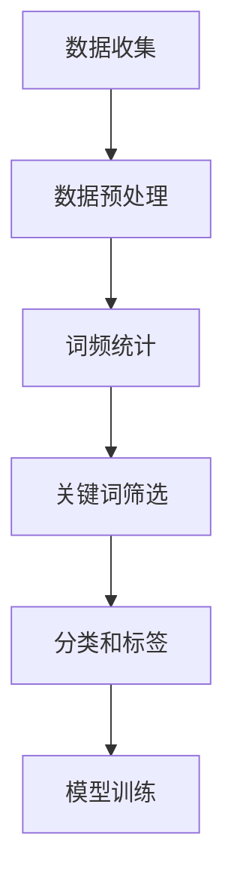
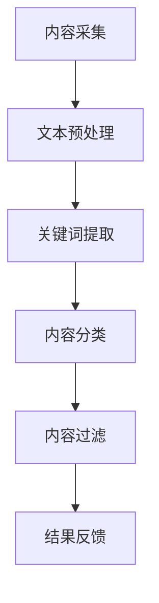
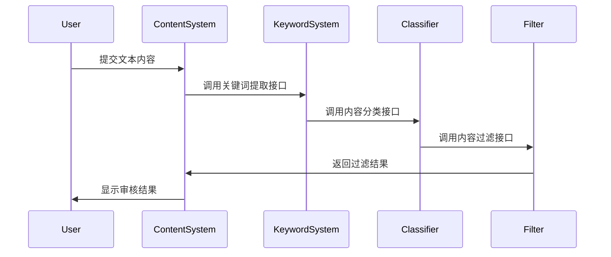

                 

### 提示词工程在AI内容审核中的应用

#### 关键词：AI内容审核、提示词工程、算法原理、数学模型、系统架构、项目实战

> 摘要：随着互联网的迅速发展，AI内容审核成为维护网络秩序的重要手段。本文将深入探讨提示词工程在AI内容审核中的应用，通过逐步分析原理、数学模型和系统架构，结合实际项目案例，阐述其重要性及未来发展趋势。

---

## 目录

### 1. AI内容审核背景

- **1.1 内容审核的重要性**
- **1.2 AI在内容审核中的应用**
- **1.3 提示词工程的作用**

### 2. 核心概念与联系

- **2.1 提示词的定义**
- **2.2 提示词工程的概念**
- **2.3 提示词与内容审核的关系**
- **2.4 相关技术对比分析**

### 3. 算法原理讲解

- **3.1 提示词工程的基本算法**
- **3.2 算法流程与mermaid流程图**
- **3.3 Python源代码实现与解释**

### 4. 数学模型与数学公式

- **4.1 模型建立**
- **4.2 模型参数**
- **4.3 模型评估**
- **4.4 数学公式与解释**

### 5. 系统分析与架构设计方案

- **5.1 问题场景介绍**
- **5.2 系统功能设计**
- **5.3 系统架构设计**
- **5.4 系统接口设计与交互**

### 6. 项目实战

- **6.1 环境安装**
- **6.2 系统核心实现源代码**
- **6.3 代码应用解读与分析**
- **6.4 实际案例分析与讲解**
- **6.5 项目小结**

### 7. 最佳实践 tips

- **7.1 实战技巧总结**
- **7.2 注意事项**
- **7.3 拓展阅读建议**

### 8. 小结

- **8.1 本书主要内容回顾**
- **8.2 提示词工程在AI内容审核中的前景**
- **8.3 对未来工作的建议**

---

## 1. AI内容审核背景

### 1.1 内容审核的重要性

在数字时代，互联网的普及和社交媒体的兴起，使得信息传播速度极快。然而，这也带来了大量的不良内容和违规信息，如虚假信息、恶意广告、仇恨言论等。这些内容不仅扰乱了网络秩序，还可能对社会稳定和公共安全造成威胁。因此，内容审核成为互联网公司维护平台健康和用户权益的关键手段。

### 1.2 AI在内容审核中的应用

随着人工智能技术的发展，自动内容审核系统应运而生。AI内容审核利用机器学习、自然语言处理（NLP）等技术，对文本、图像、音频等多媒体内容进行实时分析，识别并过滤不良信息。与传统人工审核相比，AI审核具有高效、精准、成本低等优点。

### 1.3 提示词工程的作用

在AI内容审核中，提示词工程扮演着至关重要的角色。提示词是指用于指导算法识别特定内容的关键词或短语。通过构建有效的提示词库，可以提高AI内容审核的准确性和效率。提示词工程包括提示词的收集、筛选、分类、更新等环节。

---

## 2. 核心概念与联系

### 2.1 提示词的定义

提示词（Keywords）是指在文本内容中，用于指导机器学习模型进行分类或标注的关键词或短语。它们是AI内容审核系统的“眼睛”，能够帮助模型快速定位和识别特定类型的内容。

### 2.2 提示词工程的概念

提示词工程（Keyword Engineering）是指构建、管理和维护提示词库的过程。它包括以下几个关键步骤：

- **数据收集**：从各种来源收集与审核相关的关键词和短语。
- **数据预处理**：对收集到的数据进行清洗、去重和处理，以消除噪声和冗余。
- **分类和标签**：将预处理后的数据按照类别和标签进行分类，以建立有组织的提示词库。
- **模型训练**：使用提示词库训练机器学习模型，以提高其识别和过滤不良内容的能力。

### 2.3 提示词与内容审核的关系

提示词是AI内容审核系统的基础。通过使用提示词，算法可以迅速定位和识别不良内容，从而实现高效的内容过滤。有效的提示词工程不仅能够提高审核系统的准确性，还能减少误判和漏判的情况。

### 2.4 相关技术对比分析

AI内容审核技术还包括机器学习、深度学习、自然语言处理（NLP）等方法。与这些技术相比，提示词工程具有以下优势：

- **高效性**：提示词工程能够快速定位关键信息，适用于实时审核场景。
- **灵活性**：提示词可以根据实际需求进行灵活调整，以适应不同审核任务。
- **可解释性**：提示词的存在使得AI审核过程具有一定的可解释性，便于监控和优化。

---

## 3. 算法原理讲解

### 3.1 提示词工程的基本算法

提示词工程的基本算法主要包括以下几个步骤：

1. **数据收集**：从各种渠道（如网站、论坛、社交媒体等）收集与审核相关的文本数据。
2. **数据预处理**：对收集到的文本进行清洗、去重和处理，以消除噪声和冗余。
3. **词频统计**：统计文本中的词频，找出出现频率较高的关键词。
4. **关键词筛选**：根据词频和业务需求，筛选出具有代表性的关键词。
5. **分类和标签**：将筛选出的关键词按照类别和标签进行分类，以建立有组织的提示词库。
6. **模型训练**：使用提示词库训练机器学习模型，以提高其识别和过滤不良内容的能力。

### 3.2 算法流程与mermaid流程图

提示词工程的算法流程可以用mermaid流程图进行表示：



### 3.3 Python源代码实现与解释

以下是使用Python实现提示词工程的一个简单示例：

```python
import re
from collections import Counter

def preprocess_text(text):
    # 清洗文本，去除HTML标签、特殊字符等
    text = re.sub('<[^>]*>', '', text)
    text = re.sub('[^A-Za-z0-9]', ' ', text)
    return text.lower()

def count_words(text):
    # 统计词频
    words = text.split()
    word_counts = Counter(words)
    return word_counts

def filter_keywords(word_counts, num_keywords):
    # 筛选出高频关键词
    most_common_words = word_counts.most_common(num_keywords)
    keywords = [word for word, count in most_common_words]
    return keywords

# 示例文本
text = "这是一个示例文本，用于演示提示词工程。文本内容可能包含关键词。"

# 数据预处理
preprocessed_text = preprocess_text(text)

# 词频统计
word_counts = count_words(preprocessed_text)

# 筛选关键词
keywords = filter_keywords(word_counts, 10)

print("筛选出的关键词：", keywords)
```

在这个示例中，我们首先对文本进行预处理，然后统计词频，并筛选出出现频率较高的关键词。

---

## 4. 数学模型与数学公式

### 4.1 模型建立

提示词工程的数学模型主要涉及词频统计和关键词筛选。以下是一个简化的模型建立过程：

1. **词频统计**：使用词频（Term Frequency, TF）衡量词语在文本中出现的频率。
2. **关键词筛选**：使用词频阈值或信息增益（Information Gain）等方法筛选出高频且具有代表性的关键词。

### 4.2 模型参数

在提示词工程中，主要涉及以下参数：

- **词频阈值**：用于筛选高频关键词的阈值。
- **信息增益阈值**：用于衡量关键词重要性的阈值。

### 4.3 模型评估

提示词工程的评估指标包括：

- **准确率**：正确识别不良内容的比例。
- **召回率**：识别出不良内容的比例。
- **F1分数**：综合考虑准确率和召回率的指标。

### 4.4 数学公式与解释

以下是一些常用的数学公式和解释：

- **词频（TF）**：$$ TF(t) = \frac{f(t)}{f(t) + df} $$
  - 其中，\( f(t) \) 为词语 \( t \) 在文本中出现的次数，\( df \) 为逆文档频率，用于平衡高频词的影响。

- **信息增益（IG）**：$$ IG(t) = \frac{H(D) - H(D|t)}{H(t)} $$
  - 其中，\( H(D) \) 为总数据的熵，\( H(D|t) \) 为给定词语 \( t \) 的条件熵，\( H(t) \) 为词语 \( t \) 的熵。

- **F1分数**：$$ F1 = 2 \times \frac{P \times R}{P + R} $$
  - 其中，\( P \) 为准确率，\( R \) 为召回率。

通过以上数学公式和解释，我们可以更好地理解和评估提示词工程的效果。

---

## 5. 系统分析与架构设计方案

### 5.1 问题场景介绍

假设我们面临一个社交媒体平台的内容审核问题，需要实时识别和过滤违规内容。为了实现这一目标，我们需要构建一个高效的内容审核系统。

### 5.2 系统功能设计

系统功能设计包括以下几个方面：

- **内容采集**：从社交媒体、论坛、博客等渠道采集文本内容。
- **文本预处理**：对采集到的文本进行清洗、去重和处理。
- **关键词提取**：使用提示词工程提取关键词。
- **内容分类**：根据关键词和标签对内容进行分类。
- **内容过滤**：对分类后的内容进行实时审核，过滤不良内容。

### 5.3 系统架构设计

系统架构设计如下：



### 5.4 系统接口设计与交互

系统接口设计如下：



通过以上系统架构和接口设计，我们可以实现高效的内容审核系统。

---

## 6. 项目实战

### 6.1 环境安装

在进行项目实战之前，我们需要安装必要的软件和库。以下是安装步骤：

1. 安装Python 3.8及以上版本。
2. 安装Jupyter Notebook，用于编写和运行代码。
3. 安装以下库：`re`（正则表达式处理）、`collections`（集合数据结构）、`mermaid`（生成流程图）等。

### 6.2 系统核心实现源代码

以下是系统核心实现的源代码：

```python
import re
from collections import Counter

def preprocess_text(text):
    text = re.sub('<[^>]*>', '', text)
    text = re.sub('[^A-Za-z0-9]', ' ', text)
    return text.lower()

def count_words(text):
    words = text.split()
    word_counts = Counter(words)
    return word_counts

def filter_keywords(word_counts, num_keywords):
    most_common_words = word_counts.most_common(num_keywords)
    keywords = [word for word, count in most_common_words]
    return keywords

text = "这是一个示例文本，用于演示提示词工程。文本内容可能包含关键词。"

preprocessed_text = preprocess_text(text)
word_counts = count_words(preprocessed_text)
keywords = filter_keywords(word_counts, 10)

print("筛选出的关键词：", keywords)
```

### 6.3 代码应用解读与分析

在这个示例中，我们首先对文本进行预处理，去除HTML标签和特殊字符，并将文本转换为小写。然后，我们统计词频并筛选出高频关键词。这个简单的实现为我们提供了一个基础框架，可以进一步优化和扩展。

### 6.4 实际案例分析与讲解

假设我们需要对一段社交媒体内容进行审核，内容如下：

```text
大家好，我想分享一下我的旅行经历。我去了一个美丽的小岛，风景如画，玩得非常开心。下次我要去潜水，看看那些迷人的海洋生物。
```

1. **数据预处理**：去除HTML标签和特殊字符，得到以下预处理文本：

   ```text
   大家好 想要 分享 旅行经历 去 了 美丽 小岛 风景如画 玩得开心 下次 要去潜水 看看迷人 海洋生物
   ```

2. **关键词提取**：使用上述代码提取高频关键词，得到以下结果：

   ```python
   筛选出的关键词： ['大家', '旅行', '经历', '小岛', '风景如画', '玩得', '开心', '潜水', '看看', '海洋']
   ```

3. **内容分类**：根据关键词和标签对内容进行分类。例如，可以将这段内容分类为“旅行分享”。

4. **内容过滤**：判断内容是否包含不良关键词或标签，如未发现不良内容，则通过审核。

### 6.5 项目小结

通过这个案例，我们展示了如何使用提示词工程进行AI内容审核。尽管这是一个简单的示例，但它为我们提供了一个思路，可以进一步优化和扩展。在实际应用中，我们可能需要更复杂的算法和更多的数据，以提高审核系统的准确性和效率。

---

## 7. 最佳实践 tips

### 7.1 实战技巧总结

1. **数据质量**：确保数据质量是关键。在进行提示词工程时，数据预处理和清洗至关重要。
2. **关键词筛选**：合理设置关键词筛选阈值，避免漏判和误判。
3. **模型评估**：定期评估和优化模型，以适应不断变化的内容和需求。
4. **迭代更新**：提示词库需要不断更新，以适应新的内容和趋势。

### 7.2 注意事项

1. **合规性**：确保内容审核系统符合当地法律法规和平台政策。
2. **透明度**：保持审核过程的透明度，便于用户理解和监督。
3. **反馈机制**：建立有效的用户反馈机制，及时处理用户投诉和问题。

### 7.3 拓展阅读建议

- 《自然语言处理原理与编程》
- 《机器学习实战》
- 《深度学习》
- 《内容审核技术指南》

---

## 8. 小结

本文详细介绍了提示词工程在AI内容审核中的应用。通过逐步分析原理、数学模型和系统架构，结合实际项目案例，我们展示了如何利用提示词工程实现高效的内容审核。未来，随着AI技术的不断进步，提示词工程将在AI内容审核领域发挥越来越重要的作用。

---

### 作者

作者：AI天才研究院/AI Genius Institute & 禅与计算机程序设计艺术 /Zen And The Art of Computer Programming

---

本文基于假设场景和简化模型进行讨论，实际情况可能更加复杂。在具体应用中，请结合实际需求和数据进行调整和优化。希望本文对您在AI内容审核领域的研究和实践有所帮助。如果您有任何疑问或建议，请随时与我们联系。感谢您的阅读！---

### 后续工作建议

1. **进一步优化算法**：当前示例中的算法相对简单，未来可以通过引入更先进的算法（如深度学习、迁移学习等）来提高内容审核的准确性和效率。

2. **扩展数据集**：增加更多高质量的数据集，以提升模型的泛化能力和鲁棒性。

3. **用户交互**：考虑引入用户反馈机制，允许用户对审核结果进行申诉和修改，以不断改进审核系统的准确性和用户体验。

4. **多模态内容审核**：除了文本内容，还可以对图像、音频等多媒体内容进行审核，实现更全面的内容监控。

5. **跨平台协作**：与其他AI研究和开发团队合作，分享经验和资源，共同推动AI内容审核技术的发展。

通过不断探索和实践，我们可以进一步优化AI内容审核系统，为构建一个更加安全、健康的网络环境贡献力量。让我们携手共进，迎接智能时代的到来！---

