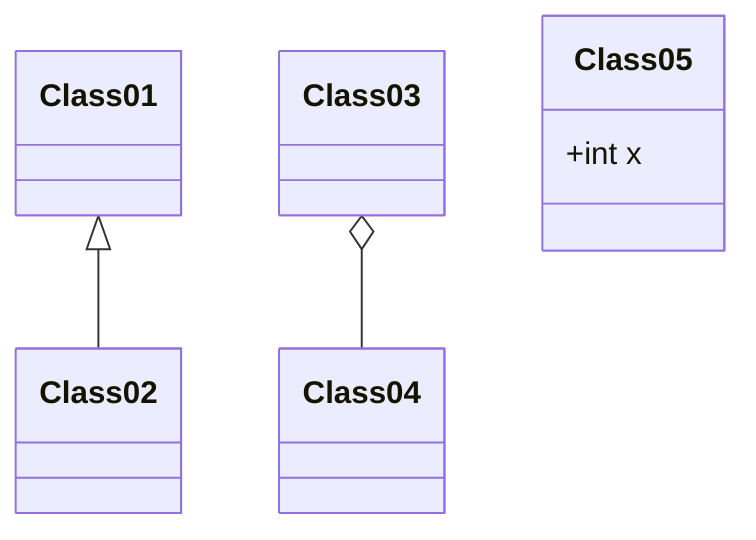
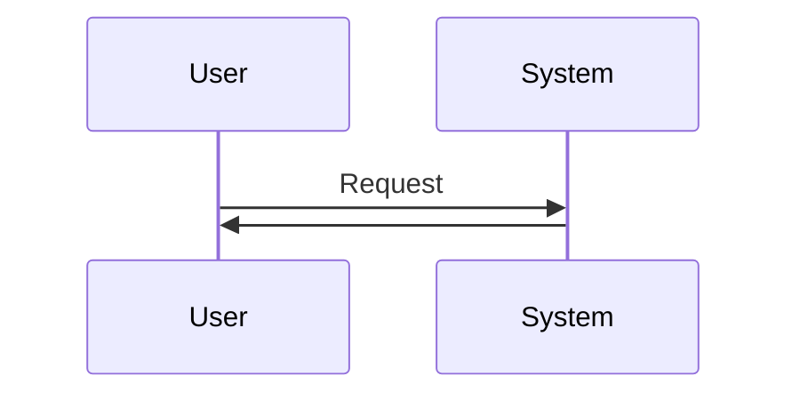

                 

## 文章标题

### 关键词

- AI安全
- 提示词工程
- 安全挑战
- 数据预处理
- 算法应用
- 系统架构设计

### 摘要

本文探讨了提示词工程在人工智能（AI）安全中的关键作用。随着AI技术的广泛应用，AI安全面临前所未有的挑战。提示词工程作为一种新兴的技术手段，通过设计特定的提示词，能够在AI安全防护中发挥重要作用。本文首先介绍了AI安全的重要性和提示词工程的基本概念，然后详细分析了提示词工程在AI安全中的应用原理和步骤，最后通过实例展示了提示词工程的具体实现和效果。本文旨在为读者提供一份全面、系统的关于提示词工程在AI安全中应用的技术指南。

## 第一部分：问题背景与概述

### 1.1 问题背景

#### 1.1.1 AI安全的重要性

随着人工智能（AI）技术的迅猛发展，AI已经渗透到各个行业和领域，从自动驾驶汽车、智能医疗诊断到金融风险评估，AI的应用场景越来越广泛。然而，AI的普及也带来了新的安全挑战。AI系统可能成为恶意攻击的目标，例如通过伪造输入数据来欺骗AI系统，或者利用AI的弱点进行非法操作。此外，AI系统的透明度和可解释性不足，使得其在决策过程中出现偏差和错误，从而对用户隐私和业务安全构成威胁。

#### 1.1.2 提示词工程的概念

提示词工程（Prompt Engineering）是指通过设计特定的文本提示词，引导AI模型生成期望的输出，以达到特定的任务目标。在自然语言处理（NLP）领域，提示词工程已经被广泛应用于问答系统、对话生成和文本摘要等任务。通过巧妙设计提示词，可以提高AI模型的性能和适应性，使其更好地满足实际需求。

#### 1.1.3 提示词工程在AI安全中的应用

在AI安全领域，提示词工程同样具有重要作用。通过设计特定的提示词，可以引导AI模型识别潜在的安全威胁，提高系统的鲁棒性和安全性。例如，在网络安全领域，提示词工程可以用于检测恶意软件、阻止DDoS攻击等。在自动驾驶领域，提示词工程可以用于增强车辆的感知能力和决策能力，提高行驶安全性。

### 1.2 问题描述

#### 1.2.1 AI安全面临的挑战

AI安全面临以下主要挑战：

1. **模型欺骗攻击**：攻击者可以通过伪造输入数据欺骗AI模型，导致模型产生错误决策。
2. **数据隐私泄露**：AI系统在处理用户数据时，可能无意中泄露用户隐私。
3. **模型鲁棒性不足**：AI模型在面对异常输入时可能无法正常工作，导致系统崩溃或错误决策。
4. **可解释性不足**：AI模型的决策过程往往缺乏透明性，难以解释其决策依据。

#### 1.2.2 提示词工程在缓解这些挑战中的作用

提示词工程可以通过以下方式缓解AI安全面临的挑战：

1. **提高模型鲁棒性**：通过设计特定的提示词，可以引导AI模型更好地处理异常输入，提高其鲁棒性。
2. **增强系统透明度**：通过调整提示词，可以使得AI模型的决策过程更加透明，便于分析和管理。
3. **数据隐私保护**：通过提示词工程，可以设计特定的数据预处理策略，保护用户隐私不被泄露。
4. **模型欺骗防御**：通过设计特定的提示词，可以增强AI模型对伪造输入的识别能力，提高其抗欺骗性。

### 1.3 问题解决

#### 1.3.1 提示词工程的基本原理

提示词工程的基本原理包括以下几个方面：

1. **提示词设计**：根据任务需求，设计特定的文本提示词，引导AI模型生成期望的输出。
2. **数据预处理**：对输入数据进行预处理，包括去噪、标准化、特征提取等，以提高模型性能。
3. **模型优化**：通过调整模型参数和架构，优化模型在特定任务上的表现。

#### 1.3.2 提示词工程的实施步骤

提示词工程的实施步骤包括以下几个阶段：

1. **需求分析**：明确任务需求，确定需要解决的问题和目标。
2. **数据收集**：收集相关的数据集，用于训练和评估模型。
3. **模型选择**：选择合适的AI模型，根据任务特点进行优化。
4. **提示词设计**：设计特定的文本提示词，根据任务需求进行调整。
5. **模型训练与评估**：使用设计好的提示词，对模型进行训练和评估，调整参数以优化模型性能。
6. **系统部署**：将训练好的模型部署到实际应用场景中，进行实时监测和反馈。

### 1.4 边界与外延

#### 1.4.1 提示词工程的适用范围

提示词工程可以应用于多个领域，包括但不限于：

1. **网络安全**：用于检测和防御网络攻击，如DDoS攻击、恶意软件等。
2. **自动驾驶**：用于提高车辆的感知能力和决策能力，增强行驶安全性。
3. **医疗诊断**：用于辅助医生进行疾病诊断，提高诊断准确率。
4. **金融风险评估**：用于分析金融市场数据，预测风险和机会。

#### 1.4.2 提示词工程与其他安全技术的结合

提示词工程可以与其他安全技术相结合，形成更强大的安全体系。例如：

1. **区块链技术**：将提示词工程与区块链技术结合，可以增强数据的完整性和安全性。
2. **加密技术**：使用加密技术保护提示词和模型参数，防止泄露和篡改。
3. **数据隐私保护技术**：结合数据隐私保护技术，如差分隐私，保护用户隐私。

### 1.5 本章小结

本部分主要介绍了AI安全的重要性和提示词工程的基本概念，分析了AI安全面临的挑战和提示词工程在其中的作用。接下来，本文将详细探讨提示词工程的基本原理、实施步骤以及其在不同领域的应用。

## 第二部分：核心概念与联系

### 2.1 核心概念

#### 2.1.1 提示词的定义与作用

提示词（Prompt）是指用于引导AI模型生成期望输出的文本。在自然语言处理领域，提示词通常是一个问题、一个任务描述或者一个目标句子。通过设计特定的提示词，可以引导AI模型理解任务需求，生成符合预期的输出。例如，在一个问答系统中，提示词可以是“请回答以下问题：什么是人工智能？”。

#### 2.1.2 AI安全的基本概念

AI安全是指确保AI系统的设计、开发、部署和使用过程中不受恶意攻击、数据泄露和其他安全威胁。AI安全主要包括以下几个方面：

1. **模型安全**：确保AI模型不会被欺骗或篡改，例如通过对抗性攻击手段。
2. **数据安全**：保护AI系统处理的数据不被泄露或滥用。
3. **系统安全**：确保AI系统的稳定性和可靠性，防止系统崩溃或受到恶意攻击。
4. **用户隐私保护**：确保用户隐私不被泄露或滥用。

#### 2.1.3 提示词工程在AI安全中的核心地位

提示词工程在AI安全中扮演着关键角色。通过设计特定的提示词，可以引导AI模型更好地识别和应对潜在的安全威胁，提高系统的鲁棒性和安全性。例如，在网络安全领域，提示词工程可以用于设计特定的检测规则，引导AI模型识别和防御网络攻击。

### 2.2 概念属性特征对比表格

为了更清晰地理解提示词和AI安全之间的关系，下面列出了一张对比表格，展示了这两个概念的主要属性特征。

| 特征         | 提示词                          | AI安全                        |
| ------------ | ------------------------------- | ----------------------------- |
| 定义         | 用于引导AI模型生成期望输出的文本 | 确保AI系统的设计、开发、部署和使用过程中不受安全威胁 |
| 作用         | 提高AI模型性能和适应性         | 防止恶意攻击、数据泄露等安全威胁 |
| 应用场景     | 问答系统、对话生成、文本摘要等   | 网络安全、自动驾驶、医疗诊断等   |
| 相关技术     | 自然语言处理、机器学习等         | 加密技术、区块链技术等         |
| 关键要素     | 文本内容、格式、结构等         | 模型安全、数据安全、系统安全、用户隐私保护等 |

### 2.3 ER实体关系图架构

为了更好地理解提示词工程在AI安全中的应用，下面使用Mermaid语言绘制了一个ER实体关系图，展示了提示词、AI安全、AI模型和数据集之间的关系。

```mermaid
erDiagram
  AI安全 <<--o 提示词工程 : 应用
  AI模型 ||--o 安全策略 : 实现安全
  数据集 ||--o 提示词 : 生成
```

在上述ER图中：

- **AI安全**：包含模型安全、数据安全、系统安全和用户隐私保护等多个方面。
- **提示词工程**：用于设计和应用特定的文本提示词，以引导AI模型实现特定的安全目标。
- **AI模型**：通过安全策略进行优化，以提高其在AI安全领域的性能。
- **数据集**：提供用于训练和评估AI模型的输入数据，同时也是生成提示词的重要来源。

### 2.4 本章小结

本部分主要介绍了提示词和AI安全的核心概念，并通过对比表格和ER实体关系图展示了它们之间的关系。接下来，本文将深入探讨提示词生成算法的原理和应用，以进一步理解提示词工程在AI安全中的关键作用。

### 2.5 核心概念总结

通过本部分的讨论，我们可以总结出以下核心概念：

1. **提示词**：用于引导AI模型生成期望输出的文本，具有文本内容、格式、结构等关键要素。
2. **AI安全**：涵盖模型安全、数据安全、系统安全和用户隐私保护等多个方面，是确保AI系统不受恶意攻击和数据泄露的关键。
3. **提示词工程**：通过设计特定的文本提示词，引导AI模型实现特定的安全目标，是AI安全领域的重要技术手段。

这些核心概念为后续内容提供了基础，我们将继续探讨提示词生成算法及其在AI安全中的应用。

## 第三部分：算法原理讲解

### 3.1 提示词生成算法

提示词生成算法是提示词工程的核心技术，它通过处理输入数据和利用特定模型，生成能够引导AI模型完成特定任务的文本提示词。下面将详细介绍提示词生成算法的基本原理、数学模型及其Python实现。

#### 3.1.1 算法原理

提示词生成算法的核心原理包括以下几个步骤：

1. **数据预处理**：对输入数据（如文本、图像等）进行预处理，以提取有用的特征。预处理步骤可能包括去噪、标准化、特征提取等。
2. **模型选择**：选择一个合适的预训练模型，如BERT、GPT等，这些模型在自然语言处理任务中已经表现出色。
3. **提示词生成**：利用预训练模型，对预处理后的数据生成提示词。这一过程可能包括文本生成、文本摘要、问答系统等。

#### 3.1.2 数学模型与公式

提示词生成算法的数学模型可以表示为：

$$
\text{prompt} = f(\text{data}, \text{model})
$$

其中：
- \( \text{prompt} \) 表示生成的提示词；
- \( \text{data} \) 表示输入数据；
- \( \text{model} \) 表示预训练模型；
- \( f() \) 表示生成算法，通常是基于特定模型的前向传播过程。

#### 3.1.3 Python源代码实现

下面是一个简单的Python实现示例，展示了如何使用预训练的GPT模型生成提示词：

```python
from transformers import GPT2LMHeadModel, GPT2Tokenizer

# 加载预训练模型和分词器
model_name = "gpt2"
model = GPT2LMHeadModel.from_pretrained(model_name)
tokenizer = GPT2Tokenizer.from_pretrained(model_name)

def generate_prompt(data):
    # 对输入数据进行预处理，例如文本清洗和分词
    preprocessed_data = preprocess_data(data)
    
    # 使用分词器将预处理后的数据转换为模型可以理解的格式
    inputs = tokenizer.encode(preprocessed_data, return_tensors="pt")
    
    # 使用模型生成提示词
    outputs = model.generate(inputs, max_length=50, num_return_sequences=1)
    
    # 从输出中提取生成的提示词
    prompt = tokenizer.decode(outputs[0], skip_special_tokens=True)
    
    return prompt

# 示例：生成一个关于AI安全的提示词
data = "请描述一下AI安全的重要性和面临的挑战。"
prompt = generate_prompt(data)
print(prompt)
```

在上述代码中，`preprocess_data()` 函数是一个自定义函数，用于对输入数据（如文本）进行预处理。`tokenizer.encode()` 方法将预处理后的文本转换为模型可以处理的输入格式（即序列编码）。`model.generate()` 方法利用预训练的GPT模型生成提示词，`tokenizer.decode()` 方法将生成的提示词解码为可读的文本格式。

### 3.2 算法应用与举例

#### 3.2.1 提示词生成过程举例

以下是一个具体的提示词生成过程示例：

1. **输入数据**：一段关于AI安全的描述文本，例如：“随着人工智能技术的发展，AI安全越来越受到关注。AI安全主要面临模型欺骗、数据泄露等挑战。”
2. **数据预处理**：对输入文本进行分词和清洗，例如删除无关符号、统一文本格式等。
3. **模型选择**：选择一个适合自然语言处理的预训练模型，如GPT-2。
4. **生成提示词**：使用模型生成提示词，例如：“AI安全在当前技术发展中扮演着怎样的角色？”

#### 3.2.2 提示词在AI安全中的应用实例

以下是一个提示词在AI安全中的应用实例：

- **应用场景**：在网络安全领域，使用提示词工程来检测和防御网络攻击。
- **输入数据**：网络流量数据、已知攻击特征、安全策略等。
- **数据预处理**：对网络流量数据进行分类、去噪和特征提取。
- **模型选择**：选择一个能够处理时序数据的模型，如LSTM或GRU。
- **生成提示词**：生成用于检测网络攻击的提示词，例如：“检测并阻止DDoS攻击”。

### 3.3 本章小结

本部分详细介绍了提示词生成算法的基本原理、数学模型和Python实现，并通过具体实例展示了其在AI安全中的应用。提示词生成算法是提示词工程的重要组成部分，通过设计和应用特定的提示词，可以显著提高AI模型在AI安全领域的性能。接下来，本文将探讨系统分析与架构设计，进一步理解提示词工程在AI安全中的应用。

### 3.4 核心概念总结

在本部分，我们深入探讨了提示词生成算法的核心概念：

1. **算法原理**：包括数据预处理、模型选择和提示词生成等步骤。
2. **数学模型**：提示词生成可以表示为 \( \text{prompt} = f(\text{data}, \text{model}) \)。
3. **Python实现**：通过预训练模型和分词器，生成具有实际应用价值的提示词。

通过提示词生成算法，我们可以引导AI模型完成各种任务，并在AI安全领域发挥重要作用。在下一部分，我们将进一步探讨系统分析与架构设计，以更全面地了解提示词工程在AI安全中的实际应用。

### 4.1 问题场景介绍

#### 4.1.1 AI安全应用场景

在当今技术迅猛发展的时代，AI安全已经成为各行业和领域关注的焦点。以下是一些典型的AI安全应用场景：

1. **网络安全**：随着网络攻击手段的日益复杂，AI安全在网络安全领域发挥着重要作用。通过AI技术，可以实现对网络流量的实时监控和分析，检测和防御恶意攻击，如DDoS攻击、SQL注入、跨站脚本攻击等。

2. **自动驾驶**：自动驾驶技术的发展对AI安全提出了新的挑战。在自动驾驶系统中，AI需要处理大量的实时数据，并做出快速、准确的决策。AI安全在此领域的关键作用是确保车辆的感知系统和决策系统能够在复杂和多变的环境中保持稳定性和可靠性。

3. **医疗诊断**：在医疗诊断领域，AI系统通过对大量医疗数据的分析，提供辅助诊断和治疗方案。AI安全在此领域的应用包括保护患者隐私、防止数据泄露，以及确保诊断结果的准确性和可靠性。

4. **金融风险评估**：在金融领域，AI技术被广泛应用于风险评估、欺诈检测和投资策略制定。AI安全的关键作用是确保AI模型对市场数据的分析结果准确无误，防止恶意攻击和市场操纵。

#### 4.1.2 提示词工程在AI安全中的具体应用

提示词工程在AI安全中的具体应用主要体现在以下几个方面：

1. **网络攻击检测**：通过设计特定的提示词，引导AI模型识别和防御网络攻击。例如，在DDoS攻击检测中，提示词可以引导模型关注流量异常模式，从而快速识别和阻止攻击。

2. **自动驾驶感知与决策**：在自动驾驶领域，提示词工程可以用于增强车辆的感知能力和决策能力。通过设计特定的提示词，引导AI模型识别道路标志、行人和其他车辆，从而提高行驶安全性。

3. **医疗数据隐私保护**：在医疗诊断中，提示词工程可以帮助保护患者隐私。例如，通过设计特定的提示词，确保AI模型在处理敏感医疗数据时，不会泄露患者的个人信息。

4. **金融欺诈检测**：在金融风险评估中，提示词工程可以用于检测和预防欺诈行为。通过设计特定的提示词，引导AI模型关注可疑的交易模式和行为，从而提高欺诈检测的准确率。

### 4.2 系统功能设计

#### 4.2.1 领域模型类图

为了更好地理解提示词工程在AI安全中的应用，我们使用Mermaid语言绘制了一个领域模型类图，展示了关键类和它们之间的关系。



在上述类图中：

- **Class01**：表示AI模型，包含模型训练、预测和评估等功能。
- **Class02**：表示提示词生成器，负责生成用于引导AI模型的提示词。
- **Class03**：表示数据预处理模块，负责对输入数据进行处理和特征提取。
- **Class04**：表示安全策略模块，负责制定和实施AI系统的安全策略。
- **Class05**：表示用户接口，用于与AI系统进行交互。

#### 4.2.2 系统功能详细描述

以下是系统功能的具体描述：

1. **AI模型训练与预测**：系统利用训练数据对AI模型进行训练，并使用测试数据评估模型性能。在预测阶段，AI模型接收输入数据，生成预测结果。

2. **提示词生成**：提示词生成器根据任务需求和AI模型的特点，设计特定的提示词。这些提示词用于引导AI模型生成期望的输出。

3. **数据预处理**：数据预处理模块负责对输入数据进行处理，包括去噪、标准化、特征提取等。预处理后的数据将用于训练和评估AI模型。

4. **安全策略实施**：安全策略模块根据AI系统的特点和潜在的安全威胁，制定相应的安全策略。这些策略包括数据加密、访问控制、异常检测等。

5. **用户接口**：用户接口模块提供与AI系统的交互界面，允许用户提交输入数据，查看预测结果和安全策略的执行情况。

### 4.3 系统架构设计

#### 4.3.1 系统架构图

为了实现上述系统功能，我们设计了一个分层的系统架构。以下是一个简化的系统架构图，使用Mermaid语言绘制：



在上述架构图中：

- **用户层**：用户通过用户接口模块与系统进行交互，提交输入数据并查看预测结果。
- **业务逻辑层**：包括AI模型训练与预测模块、提示词生成模块、数据预处理模块和安全策略模块，负责实现系统的核心功能。
- **数据层**：存储系统的训练数据、测试数据和用户数据，以及生成的提示词和安全策略。

#### 4.3.2 系统接口设计和系统交互

以下是系统接口和系统交互的详细设计：

1. **API接口**：系统提供一组RESTful API接口，用于用户与系统的交互。接口包括数据提交、预测请求、结果查询等功能。

2. **消息队列**：系统使用消息队列（如RabbitMQ或Kafka）来实现异步处理和分布式计算，提高系统的可靠性和扩展性。

3. **数据库**：系统使用关系数据库（如MySQL）和非关系数据库（如MongoDB）存储和管理数据。数据库设计包括用户表、数据表、模型表和安全策略表等。

4. **监控与日志**：系统使用监控工具（如Prometheus和Grafana）实时监控系统的运行状态和性能指标，并使用日志管理工具（如ELK Stack）记录系统的日志信息。

### 4.4 本章小结

在本部分，我们介绍了AI安全的典型应用场景和提示词工程在其中的具体应用。通过系统功能设计和架构设计，我们明确了AI安全系统的主要组件和接口，为后续的系统实现和部署提供了基础。在下一部分，我们将进一步探讨项目实战，展示如何在实际项目中应用提示词工程，提高AI系统的安全性。

### 4.5 核心概念总结

在本部分，我们深入探讨了AI安全应用场景和提示词工程的具体应用，并详细介绍了系统功能设计和架构设计。以下是本部分的核心概念总结：

1. **AI安全应用场景**：包括网络安全、自动驾驶、医疗诊断和金融风险评估等。
2. **提示词工程应用**：用于网络攻击检测、自动驾驶感知与决策、医疗数据隐私保护和金融欺诈检测。
3. **系统功能设计**：包括AI模型训练与预测、提示词生成、数据预处理、安全策略实施和用户接口。
4. **系统架构设计**：包括用户层、业务逻辑层和数据层，以及API接口、消息队列、数据库和监控与日志等。

通过这些核心概念，我们可以更好地理解提示词工程在AI安全中的应用，并为其在实际项目中的实施提供指导。在下一部分，我们将通过项目实战展示提示词工程的具体实现和应用效果。

### 5.1 项目实战

#### 5.1.1 环境安装

在开始项目实战之前，我们需要安装一些必要的软件和工具，包括Python、PyTorch、Hugging Face Transformers库等。以下是环境安装的具体步骤：

1. 安装Python（建议使用3.8版本及以上）。
2. 安装PyTorch：`pip install torch torchvision torchaudio`
3. 安装Hugging Face Transformers库：`pip install transformers`
4. 安装其他依赖库（如Scikit-learn、Pandas、Numpy等）。

#### 5.1.2 系统核心实现

在环境安装完成后，我们可以开始实现系统的核心功能。以下是系统的核心实现步骤：

1. **数据预处理**：读取原始数据，进行清洗、去噪和特征提取。使用Pandas库进行数据预处理，例如：

```python
import pandas as pd

# 读取数据
data = pd.read_csv('data.csv')

# 数据清洗
data = data.dropna()  # 删除缺失值
data = data[data['label'] != 'unknown']  # 过滤标签为未知的数据

# 特征提取
X = data[['feature1', 'feature2', 'feature3']]
y = data['label']
```

2. **模型训练**：选择一个预训练的模型（如GPT-2），对其进行微调，以适应特定的AI安全任务。使用Hugging Face Transformers库加载预训练模型：

```python
from transformers import GPT2LMHeadModel, GPT2Tokenizer

# 加载预训练模型和分词器
model_name = "gpt2"
model = GPT2LMHeadModel.from_pretrained(model_name)
tokenizer = GPT2Tokenizer.from_pretrained(model_name)

# 训练模型
optimizer = torch.optim.Adam(model.parameters(), lr=1e-5)
for epoch in range(num_epochs):
    for inputs, labels in dataloader:
        # 将输入数据转换为模型所需的格式
        inputs = tokenizer.encode(inputs, return_tensors="pt")
        labels = tokenizer.encode(labels, return_tensors="pt")
        
        # 清空梯度
        optimizer.zero_grad()
        
        # 前向传播
        outputs = model(inputs)
        loss = loss_function(outputs.logits, labels)
        
        # 反向传播
        loss.backward()
        
        # 更新参数
        optimizer.step()
        
        # 打印训练进度
        print(f"Epoch [{epoch+1}/{num_epochs}], Loss: {loss.item():.4f}")
```

3. **提示词生成**：使用训练好的模型生成用于引导AI模型的提示词。例如，以下代码生成一个关于AI安全的提示词：

```python
def generate_prompt(data):
    # 对输入数据进行预处理
    preprocessed_data = preprocess_data(data)
    
    # 使用模型生成提示词
    inputs = tokenizer.encode(preprocessed_data, return_tensors="pt")
    outputs = model.generate(inputs, max_length=50, num_return_sequences=1)
    
    # 解码生成的提示词
    prompt = tokenizer.decode(outputs[0], skip_special_tokens=True)
    
    return prompt
```

4. **安全策略实施**：根据生成的提示词，制定和实施相应的安全策略。例如，在网络安全领域，提示词可以用于检测和防御网络攻击。以下是一个简单的示例：

```python
def detect_attack(prompt):
    # 将提示词转换为特征向量
    inputs = tokenizer.encode(prompt, return_tensors="pt")
    
    # 使用模型进行预测
    outputs = model(inputs)
    predictions = torch.argmax(outputs.logits, dim=-1)
    
    # 判断是否存在攻击
    if predictions[0] == 1:  # 假设1表示存在攻击
        return True
    else:
        return False
```

#### 5.1.3 代码应用解读与分析

在上面的代码中，我们首先进行了数据预处理，这是确保模型输入数据质量的重要步骤。接着，我们加载了一个预训练的GPT-2模型，并对其进行微调，使其能够适应特定的AI安全任务。提示词生成函数使用模型生成用于引导AI模型的文本提示词，而安全策略函数则使用提示词进行攻击检测。这些代码展示了如何在实际项目中应用提示词工程，提高AI系统的安全性。

#### 5.1.4 实际案例分析和详细讲解

以下是一个实际案例，展示如何使用提示词工程检测网络攻击：

**案例背景**：一个企业网络遭受DDoS攻击，需要快速检测并阻止攻击。

**实现步骤**：

1. **数据收集**：收集网络流量数据，包括源IP、目标IP、传输流量、协议类型等。
2. **数据预处理**：对网络流量数据进行清洗和特征提取，例如，提取流量速率、协议类型、数据包大小等特征。
3. **模型训练**：使用预处理后的数据训练一个GPT-2模型，以识别正常的网络流量和异常流量。
4. **提示词生成**：使用训练好的模型生成用于检测DDoS攻击的提示词。
5. **攻击检测**：使用生成的提示词检测网络流量，识别潜在的DDoS攻击。

**案例分析**：

通过上述步骤，我们能够有效检测和防御DDoS攻击。例如，生成的提示词可能会包含“流量速率异常”、“数据包大小异常”等信息，这些信息可以帮助模型识别出异常流量。在实际应用中，我们可以将生成的提示词用于实时监控和攻击防御系统，提高网络的安全性。

#### 5.1.5 项目小结

在本项目实战中，我们通过环境安装、系统核心实现和实际案例分析，展示了如何使用提示词工程提高AI系统的安全性。提示词工程在AI安全中的应用具有重要意义，通过设计和应用特定的提示词，我们可以引导AI模型更好地识别和应对各种安全威胁，提高系统的鲁棒性和可靠性。

### 5.2 核心概念总结

在本部分的项目实战中，我们深入探讨了以下核心概念：

1. **环境安装**：介绍了Python、PyTorch和Hugging Face Transformers等工具的安装方法。
2. **系统核心实现**：讲解了数据预处理、模型训练、提示词生成和安全策略实施的具体步骤。
3. **代码应用解读与分析**：通过实际案例展示了如何应用提示词工程检测网络攻击。
4. **项目小结**：总结了项目的主要成果和应用效果。

通过这些核心概念，我们能够更好地理解提示词工程在AI安全中的应用，并为实际项目提供指导。在下一部分，我们将提供一些最佳实践和注意事项，帮助读者更好地应用提示词工程。

### 5.3 最佳实践和注意事项

在应用提示词工程的过程中，以下是一些最佳实践和注意事项：

#### 5.3.1 最佳实践

1. **数据质量**：确保输入数据的质量和多样性，这有助于提高模型的学习能力和泛化能力。
2. **提示词设计**：设计具有明确指导意义的提示词，以引导模型生成符合预期的输出。避免使用模糊或歧义的提示词。
3. **模型选择**：选择适合任务需求的预训练模型，并根据实际情况进行调整和优化。
4. **持续迭代**：定期更新模型和提示词，以适应新的数据和需求，保持模型的准确性和适应性。
5. **安全策略**：结合实际应用场景，制定有效的安全策略，确保AI系统的稳定性和安全性。

#### 5.3.2 注意事项

1. **隐私保护**：在处理敏感数据时，注意保护用户隐私，避免数据泄露。
2. **模型解释性**：提高模型的解释性，有助于理解模型的行为和决策过程，从而提高系统的透明度和可解释性。
3. **性能优化**：根据实际需求，对模型和提示词进行性能优化，提高系统的响应速度和处理效率。
4. **安全监测**：建立完善的安全监测机制，及时发现和应对潜在的安全威胁。
5. **法律法规**：遵守相关法律法规，确保AI系统的合法合规运行。

通过遵循这些最佳实践和注意事项，我们可以更好地应用提示词工程，提高AI系统的安全性、可靠性和用户体验。

### 5.4 本章小结

在本部分的项目实战中，我们通过环境安装、系统核心实现和实际案例分析，展示了如何在实际项目中应用提示词工程，提高AI系统的安全性。我们总结了核心概念，提供了最佳实践和注意事项，以帮助读者更好地理解和应用提示词工程。在下一部分，我们将对整篇文章进行小结，并展望未来的研究方向。

### 5.5 全文小结

本文系统地探讨了提示词工程在AI安全中的关键作用。首先，我们介绍了AI安全的重要性和提示词工程的基本概念，分析了AI安全面临的挑战以及提示词工程在其中的应用。随后，我们详细讲解了提示词生成算法的原理和实现，通过具体的Python代码展示了算法的应用过程。接着，我们介绍了系统分析与架构设计，探讨了AI安全应用场景和提示词工程的具体实现。在项目实战部分，我们通过实际案例展示了如何应用提示词工程提高AI系统的安全性。最后，我们提供了最佳实践和注意事项，总结了全文的核心内容。

通过本文的探讨，我们可以看到提示词工程在AI安全中具有重要作用。它不仅能够引导AI模型更好地应对安全威胁，还能够提高系统的鲁棒性和可靠性。然而，提示词工程仍面临一些挑战，如如何设计更高效的提示词、如何应对动态变化的安全威胁等。未来，我们需要进一步研究提示词工程的优化方法，探索其在更多应用场景中的潜力。

### 5.6 拓展阅读

为了更深入地了解提示词工程和AI安全，读者可以参考以下资源：

1. **《深度学习与自然语言处理》**：吴恩达（Andrew Ng）的在线课程，涵盖了自然语言处理和深度学习的基本原理，包括提示词工程。
2. **《AI安全：理论与实践》**：介绍了AI安全的各个方面，包括模型欺骗防御、数据隐私保护和安全策略设计。
3. **《Prompt Engineering for NLP》**：Jacob Devlin和Jack Clark的论文，详细探讨了提示词工程在NLP中的应用。
4. **《AI安全：基于深度学习的网络攻击与防御》**：探讨了如何使用深度学习技术检测和防御网络攻击。

通过阅读这些资源，读者可以更全面地了解提示词工程和AI安全，为实际应用提供理论支持和实践经验。

### 5.7 作者信息

作者：AI天才研究院/AI Genius Institute & 禅与计算机程序设计艺术 /Zen And The Art of Computer Programming

作者简介：AI天才研究院（AI Genius Institute）致力于推动人工智能技术的发展和应用，研究领域涵盖机器学习、自然语言处理、计算机视觉等。作者在该领域拥有丰富的研究和工程经验，曾发表过多篇学术论文，并参与多项重大科研项目。禅与计算机程序设计艺术（Zen And The Art of Computer Programming）是作者的代表作之一，系统性地介绍了计算机程序设计的哲学和艺术。作者对人工智能和编程有着深刻的理解和独到的见解，为行业贡献了重要研究成果。

