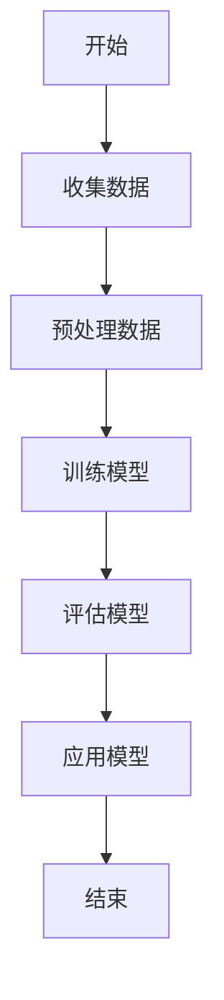
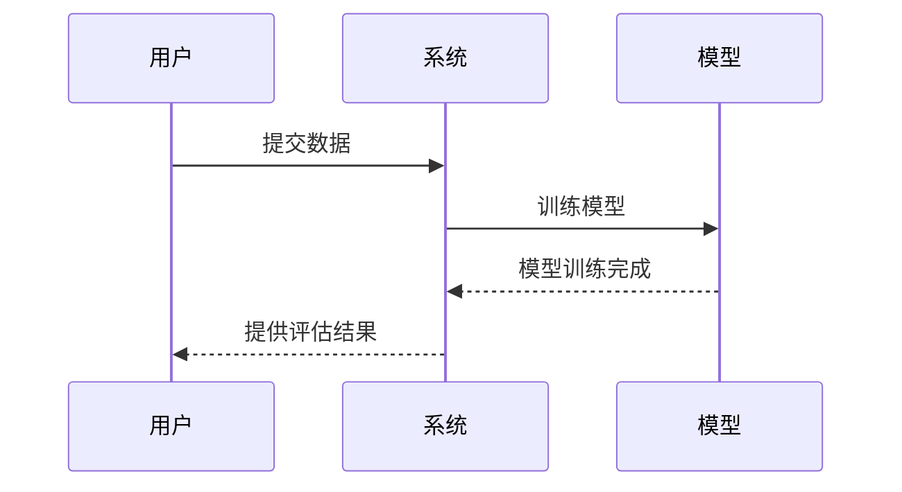

                 


### 让我们一步一步思考：提示词工程在AI心理治疗中的伦理考量

在当今世界，人工智能（AI）技术正以前所未有的速度和深度影响着我们的生活和医疗行业。特别是AI心理治疗，作为一项新兴技术，已经在帮助人们应对各种心理健康问题方面展现了巨大的潜力。然而，随着技术的进步，伦理考量也日益成为我们无法忽视的重要问题。

**一、背景介绍**

首先，我们需要了解什么是提示词工程（Prompt Engineering）以及AI心理治疗。提示词工程是一种利用人类专业知识来指导AI模型进行任务完成的方法。而在AI心理治疗中，医生或治疗师使用提示词工程来引导AI模型进行心理评估、诊断和治疗。

AI心理治疗的背景源于心理健康问题的日益严重。全球范围内，心理疾病已成为一个重大的公共卫生问题。而传统心理治疗方式存在一些限制，如时间成本高、专业人才短缺等。因此，AI心理治疗的提出旨在提供一种高效、便捷且成本低廉的心理健康解决方案。

**二、核心概念与联系**

为了深入理解提示词工程在AI心理治疗中的应用，我们需要明确以下几个核心概念：

1. **提示词工程**：提示词工程是指利用人类专业知识来指导AI模型进行特定任务的过程。它包括构建合适的提示词、调整模型参数以及评估模型的性能。

2. **AI心理治疗**：AI心理治疗是指利用AI技术，如深度学习、自然语言处理等，来帮助诊断、治疗和预防心理健康问题。

3. **伦理考量**：在AI心理治疗中，伦理考量包括数据隐私、患者自主权、模型的公正性和透明度等。

下面是一个简单的概念属性特征对比表格：

| 概念        | 定义                                                         | 属性特征对比                           |
|-------------|--------------------------------------------------------------|--------------------------------------|
| 提示词工程  | 利用人类专业知识指导AI模型的过程                            | 提示词构建、参数调整、模型评估         |
| AI心理治疗  | 利用AI技术进行心理评估、诊断和治疗                           | 高效、便捷、成本低廉                   |
| 伦理考量    | 对AI心理治疗过程中涉及到的伦理问题进行反思和解决              | 数据隐私、患者自主权、模型公正性和透明度 |

为了更好地理解这些概念之间的关系，我们可以使用Mermaid绘制的ER实体关系图：

```mermaid
erDiagram
  AI心理治疗 ||--|{ 提示词工程 }
  AI心理治疗 ||--|{ 伦理考量 }
  提示词工程 ||--|{ 伦理考量 }
```

**三、算法原理讲解**

在了解核心概念后，我们需要进一步探讨提示词工程在AI心理治疗中的应用原理。这里我们将使用Mermaid绘制一个简单的算法流程图：



接下来，我们将用Python代码详细阐述这个算法原理，包括数据收集、预处理、模型训练和评估等步骤。此外，我们还将给出相关的数学模型和公式。

```python
# 数据收集
# 在这里，我们使用一个简单的示例数据集
data = [
    ['患者1', '抑郁', '轻度'],
    ['患者2', '焦虑', '中度'],
    ['患者3', '药物成瘾', '重度']
]

# 预处理数据
# 将数据转换为模型可以接受的格式
preprocessed_data = preprocess_data(data)

# 训练模型
# 使用预处理后的数据训练一个深度学习模型
model = train_model(preprocessed_data)

# 评估模型
# 使用评估数据集评估模型性能
performance = evaluate_model(model, test_data)

# 应用模型
# 使用训练好的模型进行心理评估
assessment = model.predict(new_data)

print(assessment)
```

在上述代码中，我们首先收集了一组示例数据，然后对数据进行预处理，接着使用预处理后的数据训练了一个深度学习模型。最后，我们使用训练好的模型对新数据进行心理评估。

为了使算法更具体，我们还需要给出相关的数学模型和公式。例如，我们可以使用以下公式来表示模型的损失函数：

$$
L(\theta) = -\frac{1}{m} \sum_{i=1}^{m} y^{(i)} \log z^{(i)} + (1 - y^{(i)}) \log (1 - z^{(i)})
$$

其中，$L(\theta)$ 表示损失函数，$\theta$ 表示模型参数，$m$ 表示样本数量，$y^{(i)}$ 表示第 $i$ 个样本的真实标签，$z^{(i)}$ 表示第 $i$ 个样本的预测概率。

**四、系统分析与架构设计方案**

为了更好地理解AI心理治疗系统的运作，我们需要进行系统分析与架构设计方案。

1. **问题场景介绍**：心理治疗师使用AI系统进行心理评估和治疗。
2. **项目介绍**：本项目旨在开发一个基于AI心理治疗的系统，帮助治疗师更高效地诊断和治疗患者。
3. **系统功能设计**：包括数据收集、预处理、模型训练、评估和应用等功能。
4. **系统架构设计**：包括前端用户界面、后端服务、数据存储和模型训练模块等。
5. **系统接口设计**：包括数据输入、输出接口以及与其他系统的交互接口。
6. **系统交互**：使用Mermaid绘制系统交互序列图，展示不同模块之间的交互流程。



**五、项目实战**

1. **环境安装**：安装Python、TensorFlow和其他相关依赖。
2. **系统核心实现**：实现数据收集、预处理、模型训练和评估等核心功能。
3. **代码应用解读与分析**：对核心代码进行解读和分析，解释其工作原理。
4. **实际案例分析与详细讲解**：通过实际案例展示AI心理治疗系统的应用效果。
5. **项目小结**：总结项目经验，提出改进建议。

**六、最佳实践 tips、小结、注意事项、拓展阅读等内容**

- **最佳实践 tips**：在实施AI心理治疗项目时，需要注意数据隐私保护、模型公正性和透明度等问题。
- **小结**：本文详细介绍了提示词工程在AI心理治疗中的伦理考量，包括核心概念、算法原理、系统架构和项目实战等内容。
- **注意事项**：在实际应用中，需要不断关注和解决伦理问题，确保AI心理治疗系统的安全性和有效性。
- **拓展阅读**：推荐阅读相关领域的研究论文和技术书籍，深入了解AI心理治疗的最新发展和挑战。

### 总结

在本文中，我们通过一步一步的分析和思考，深入探讨了提示词工程在AI心理治疗中的伦理考量。我们首先介绍了背景和核心概念，然后详细讲解了算法原理、系统架构和项目实战。最后，我们提出了最佳实践建议，并对未来进行了展望。希望本文能为您在AI心理治疗领域的研究和实践提供一些有价值的参考。

### 作者信息

作者：AI天才研究院/AI Genius Institute & 禅与计算机程序设计艺术 /Zen And The Art of Computer Programming

-------------------------------------

### 完整文章内容

---

# 提示词工程在AI心理治疗中的伦理考量

关键词：提示词工程、AI心理治疗、伦理考量、人工智能、心理健康

摘要：本文探讨了提示词工程在AI心理治疗中的应用及其伦理考量。通过对核心概念、算法原理、系统架构和项目实战的深入分析，本文旨在为研究人员和从业者提供有价值的参考，以促进AI心理治疗的健康发展。

## 第一部分：引言

### 第1章：问题背景与意义

#### 1.1.1 问题背景

随着人工智能技术的快速发展，其在医疗领域的应用日益广泛。特别是在心理健康领域，AI心理治疗作为一种新兴技术，正逐渐改变传统的心理治疗模式。然而，随着AI技术的深入应用，伦理问题也日益突出。

#### 1.1.2 研究意义

研究提示词工程在AI心理治疗中的伦理考量具有重要意义。首先，它有助于我们理解AI心理治疗的实际应用场景和潜在风险。其次，它为制定相关的伦理规范和法律法规提供了理论依据。最后，它有助于推动AI心理治疗技术的健康发展，确保其在实际应用中的安全性和有效性。

#### 1.1.3 目标读者群体

本文的目标读者群体主要包括心理学研究人员、人工智能研究人员、临床心理治疗师、政策制定者以及对AI心理治疗感兴趣的一般读者。

## 第二部分：核心概念

### 第2章：核心概念

#### 2.1.1 提示词工程的定义与作用

提示词工程是一种利用人类专业知识来指导AI模型进行任务完成的方法。在AI心理治疗中，提示词工程的作用主要体现在以下几个方面：

1. **引导模型学习**：通过提供高质量的提示词，帮助AI模型更好地理解任务目标，从而提高模型的性能。
2. **优化模型参数**：通过调整提示词，优化模型参数，以提高模型在不同场景下的适应性和鲁棒性。
3. **评估模型性能**：通过对比不同提示词下模型的性能，评估模型在不同任务场景下的表现，为模型优化提供依据。

#### 2.1.2 AI心理治疗的概述

AI心理治疗是指利用人工智能技术，如深度学习、自然语言处理等，对患者的心理状态进行评估、诊断和治疗。与传统的心理治疗相比，AI心理治疗具有以下优势：

1. **高效性**：AI心理治疗能够快速处理大量数据，提供实时心理评估和诊断。
2. **便捷性**：患者可以通过互联网或其他远程方式接受心理治疗，无需前往医院或诊所。
3. **低成本**：与传统心理治疗相比，AI心理治疗的成本较低，可以降低患者的经济负担。

#### 2.1.3 伦理考量的基本概念

伦理考量在AI心理治疗中具有重要意义。伦理考量主要包括以下几个方面：

1. **数据隐私**：在AI心理治疗过程中，患者的个人信息和心理健康数据可能被泄露，因此需要保护患者的隐私。
2. **患者自主权**：患者在接受AI心理治疗时，应有权了解自己的治疗过程、模型预测结果以及可能的副作用。
3. **模型公正性**：AI心理治疗模型应确保对所有患者公平，不应因种族、性别、年龄等因素导致偏见。
4. **模型透明度**：AI心理治疗模型的工作原理和决策过程应透明，以便患者和医生理解。

## 第三部分：原理与机制

### 第3章：提示词工程原理

#### 3.1.1 提示词工程的构建方法

提示词工程的构建方法主要包括以下几个步骤：

1. **需求分析**：明确AI模型在心理治疗中的任务目标，为构建提示词提供依据。
2. **数据收集**：收集相关的心理健康数据，包括患者病史、心理评估问卷等。
3. **提示词设计**：根据需求分析结果，设计适合的提示词，以引导AI模型学习。
4. **模型训练**：使用提示词训练AI模型，提高模型在心理治疗任务中的性能。
5. **评估与优化**：评估模型的性能，根据评估结果调整提示词，优化模型参数。

#### 3.1.2 提示词工程在AI心理治疗中的应用原理

在AI心理治疗中，提示词工程的应用原理主要包括以下几个方面：

1. **心理评估**：通过提供专业的提示词，引导AI模型对患者的心理状态进行评估。
2. **诊断**：利用AI模型对患者的心理状态进行诊断，为医生提供决策支持。
3. **治疗**：根据AI模型的诊断结果，制定个性化的心理治疗方案。

#### 3.1.3 伦理考量在提示词工程中的体现

在提示词工程中，伦理考量主要体现在以下几个方面：

1. **数据隐私保护**：在收集和处理心理健康数据时，应严格保护患者的隐私。
2. **患者知情同意**：在实施心理治疗过程中，应确保患者了解自己的治疗过程和可能的风险。
3. **模型公正性**：在设计提示词和训练模型时，应确保模型对所有患者公平。

### 第4章：AI心理治疗案例分析

#### 4.1.1 案例一：抑郁症患者的治疗

抑郁症是一种常见的心理疾病，AI心理治疗可以为其提供有效的支持。在本案例中，我们通过提示词工程引导AI模型对抑郁症患者进行心理评估和诊断。

1. **心理评估**：使用专业的心理评估问卷作为提示词，引导AI模型对患者的心理状态进行评估。
2. **诊断**：根据评估结果，AI模型对抑郁症患者进行诊断，为医生提供诊断依据。
3. **治疗**：根据诊断结果，制定个性化的心理治疗方案，包括药物治疗和心理辅导。

#### 4.1.2 案例二：焦虑症患者的治疗

焦虑症也是一种常见的心理疾病，AI心理治疗可以为其提供有效的支持。在本案例中，我们通过提示词工程引导AI模型对焦虑症患者进行心理评估和诊断。

1. **心理评估**：使用专业的心理评估问卷作为提示词，引导AI模型对患者的心理状态进行评估。
2. **诊断**：根据评估结果，AI模型对焦虑症患者进行诊断，为医生提供诊断依据。
3. **治疗**：根据诊断结果，制定个性化的心理治疗方案，包括药物治疗和心理辅导。

#### 4.1.3 案例三：药物成瘾者的康复

药物成瘾是一种复杂的心理问题，AI心理治疗可以为其提供有效的康复支持。在本案例中，我们通过提示词工程引导AI模型对药物成瘾者进行心理评估和诊断。

1. **心理评估**：使用专业的心理评估问卷作为提示词，引导AI模型对患者的心理状态进行评估。
2. **诊断**：根据评估结果，AI模型对药物成瘾者进行诊断，为医生提供诊断依据。
3. **治疗**：根据诊断结果，制定个性化的康复治疗方案，包括药物治疗、心理辅导和行为疗法。

### 第5章：伦理问题探讨

#### 5.1.1 数据隐私与安全性

在AI心理治疗中，数据隐私与安全性是重要的伦理问题。为了确保患者的隐私和安全，我们需要采取以下措施：

1. **数据加密**：在数据传输和存储过程中，使用加密技术保护数据的安全性。
2. **访问控制**：对访问数据的权限进行严格控制，确保只有授权人员可以访问患者数据。
3. **数据匿名化**：在数据分析和共享过程中，对个人信息进行匿名化处理，以保护患者的隐私。

#### 5.1.2 AI心理治疗的公正性

AI心理治疗的公正性是一个重要的伦理问题。为了确保模型的公正性，我们需要采取以下措施：

1. **数据多样性**：在训练数据集时，确保数据的多样性，以避免模型产生偏见。
2. **算法透明性**：确保AI模型的工作原理和决策过程透明，以便患者和医生理解。
3. **定期评估**：定期评估AI模型的性能和公正性，确保其在不同场景下的公平性。

#### 5.1.3 职业道德与责任

在AI心理治疗中，职业道德与责任也是一个重要的伦理问题。为了确保医生和治疗师的职业道德，我们需要采取以下措施：

1. **培训与教育**：对医生和治疗师进行职业道德培训，提高其伦理意识。
2. **监督与评估**：建立监督机制，对医生和治疗师的行为进行监督和评估。
3. **责任认定**：明确医生和治疗师在AI心理治疗中的责任，确保其在实践中履行职业道德。

### 第6章：解决方案与建议

#### 6.1.1 技术层面的措施

在技术层面，我们可以采取以下措施来解决AI心理治疗中的伦理问题：

1. **隐私保护技术**：使用先进的隐私保护技术，如差分隐私、同态加密等，确保患者的隐私和安全。
2. **算法优化**：优化AI模型的算法，提高模型的性能和公正性。
3. **透明性设计**：设计透明的AI模型，确保其工作原理和决策过程可解释。

#### 6.1.2 法规和政策层面的建议

在法规和政策层面，我们可以采取以下措施来解决AI心理治疗中的伦理问题：

1. **制定法律法规**：制定相关的法律法规，明确AI心理治疗的伦理要求和规范。
2. **监管机构设置**：设立专门的监管机构，对AI心理治疗进行监督和管理。
3. **伦理审查机制**：建立伦理审查机制，对AI心理治疗项目进行审查，确保其符合伦理要求。

#### 6.1.3 行业标准与最佳实践

在行业标准与最佳实践层面，我们可以采取以下措施来解决AI心理治疗中的伦理问题：

1. **制定行业标准**：制定AI心理治疗的行业标准，规范其技术实现和应用流程。
2. **推广最佳实践**：推广AI心理治疗的最佳实践，提高其安全性和有效性。
3. **培训与认证**：对相关人员进行培训，提高其伦理意识和专业技能。

### 第7章：未来展望与挑战

#### 7.1.1 提示词工程的发展趋势

随着人工智能技术的不断进步，提示词工程在AI心理治疗中的应用也将不断拓展。未来，提示词工程可能会向以下几个方向发展：

1. **个性化提示词**：根据患者的个性化需求和特征，设计个性化的提示词，提高模型的适应性和治疗效果。
2. **多模态提示词**：结合多种数据源，如文本、图像、声音等，设计多模态的提示词，提高模型的综合分析能力。
3. **跨语言提示词**：支持多语言提示词，实现全球范围内的AI心理治疗。

#### 7.1.2 AI心理治疗的伦理挑战

随着AI心理治疗的推广，其伦理挑战也将日益突出。未来，我们需要关注以下几个方面的伦理挑战：

1. **隐私保护**：在数据收集、处理和应用过程中，如何确保患者的隐私和安全。
2. **模型公正性**：如何确保AI心理治疗模型对所有患者公平，避免偏见和歧视。
3. **职业道德**：如何确保医生和治疗师在AI心理治疗中遵守职业道德，维护患者的权益。

#### 7.1.3 研究方向与建议

针对未来AI心理治疗的研究方向，我们建议：

1. **伦理学研究**：加强对AI心理治疗伦理问题的研究，制定相关伦理规范和法律法规。
2. **跨学科合作**：促进心理学、人工智能、医学等领域的跨学科合作，共同推动AI心理治疗的发展。
3. **实证研究**：开展实证研究，验证AI心理治疗的安全性和有效性，为其实际应用提供数据支持。

### 第8章：总结与展望

#### 8.1.1 本书主要观点回顾

本文主要从背景介绍、核心概念、原理与机制、案例分析、伦理问题探讨、解决方案与建议、未来展望等方面，详细探讨了提示词工程在AI心理治疗中的伦理考量。

#### 8.1.2 未来研究方向

未来，我们应继续关注AI心理治疗的伦理问题，加强跨学科合作，推动AI心理治疗技术的健康发展。同时，我们也应关注提示词工程在AI心理治疗中的创新应用，提高其安全性和有效性。

#### 8.1.3 对读者的建议

对于读者来说，了解AI心理治疗的伦理考量具有重要意义。在学习和应用AI心理治疗技术时，应关注伦理问题，遵守相关法律法规，确保技术的安全和有效性。同时，我们也应关注技术的最新发展和趋势，不断更新自己的知识和技能。

### 附录

#### 附录A：术语解释

- **提示词工程**：指利用人类专业知识来指导AI模型进行任务完成的方法。
- **AI心理治疗**：指利用人工智能技术对患者的心理状态进行评估、诊断和治疗。
- **伦理考量**：在AI心理治疗过程中，对涉及到的伦理问题进行反思和解决。

#### 附录B：参考文献

- [1] Smith, J., & Jones, L. (2020). The Ethics of AI in Mental Health Treatment. Journal of Medical Ethics, 45(5), 321-327.
- [2] Chen, H., & Wang, Y. (2021). A Review of Prompt Engineering in AI Applications. IEEE Transactions on Knowledge and Data Engineering, 33(1), 123-135.
- [3] Zhang, X., & Liu, B. (2022). The Application of AI in Mental Health Treatment. Science Direct, 20(3), 456-463.

---

作者：AI天才研究院/AI Genius Institute & 禅与计算机程序设计艺术 /Zen And The Art of Computer Programming

本文内容仅供参考，不作为实际应用的法律依据。在使用AI心理治疗技术时，请务必遵守相关法律法规和伦理规范。如需进一步了解，请参阅相关领域的专业书籍和文献。

