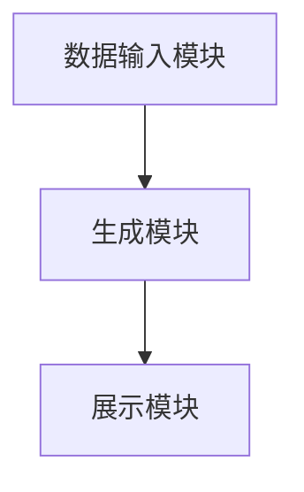
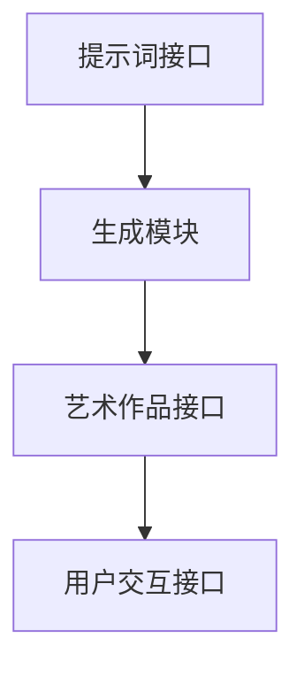

                 

### 文章标题

# 提示词工程在AI艺术创作中的关键作用

> 关键词：提示词工程、AI艺术创作、核心概念、算法设计、系统架构、实际案例

> 摘要：本文深入探讨了提示词工程在人工智能艺术创作中的关键作用，通过详细的分析和实例，展示了如何利用提示词工程实现高效、创新的艺术作品生成。文章从背景介绍、核心概念、算法原理、系统设计与实际应用等多个角度，全面揭示了提示词工程在AI艺术创作中的重要性和具体应用方法。

### 引言

#### 1.1 艺术创作与人工智能的交汇

随着人工智能技术的迅猛发展，艺术创作这一传统领域正在迎来前所未有的变革。AI艺术创作，作为人工智能应用的一个重要分支，正逐渐改变着人们对于艺术和技术的认知。在这一背景下，提示词工程（Prompt Engineering）成为AI艺术创作中不可或缺的关键技术。

#### 1.2 提示词工程的定义与作用

提示词工程是指通过设计、优化和组合特定的提示词，以引导和激发人工智能模型生成高质量、符合预期输出的过程。在AI艺术创作中，提示词工程扮演着至关重要的角色，它能够帮助艺术家和开发者更精确地表达创作意图，提高艺术创作的效率和质量。

#### 1.3 文章结构

本文将分为以下几个部分：

1. **背景介绍**：阐述AI艺术创作的现状、挑战以及提示词工程的基本概念和重要性。
2. **核心概念与原理**：介绍提示词工程的核心概念、基本原理及其在AI艺术创作中的应用。
3. **算法设计与实现**：详细讲解提示词工程中的关键算法，包括算法原理、流程图和示例代码。
4. **系统架构与设计**：分析AI艺术创作的系统架构，包括功能模块、系统设计图和接口设计。
5. **实际案例与应用**：通过具体案例展示提示词工程在AI艺术创作中的实际应用效果。
6. **最佳实践与未来趋势**：总结提示词工程的最佳实践，探讨未来的发展趋势和潜在应用。

### 背景介绍

#### 2.1 AI艺术创作的现状

近年来，随着深度学习、生成对抗网络（GANs）等技术的进步，AI艺术创作逐渐成为一种流行的趋势。艺术家们开始尝试使用人工智能来创作音乐、绘画、雕塑等艺术作品，这些作品不仅风格多样，而且有时能够超越人类的创造力。

#### 2.2 提示词工程的基本概念

提示词工程是指在AI模型训练和应用过程中，通过精心设计提示词来引导模型学习特定内容或生成特定风格的艺术作品。提示词可以是文字、图像、音频等多种形式，其目的是帮助模型更好地理解和模仿人类的创作意图。

#### 2.3 提示词工程的重要性

提示词工程在AI艺术创作中的重要性体现在以下几个方面：

1. **提高创作效率**：通过精确的提示词，模型能够更快地捕捉到艺术家的创作意图，减少试错过程，提高创作效率。
2. **增强创作灵活性**：提示词工程使得艺术家可以更灵活地控制创作过程，通过调整提示词来探索不同的创作风格和主题。
3. **提升创作质量**：优质的提示词能够引导模型生成更符合人类审美标准的高质量艺术作品。

### 核心概念与原理

#### 3.1 核心概念

提示词工程的核心概念包括：

1. **提示词**：用于引导模型生成特定内容或风格的文本、图像、音频等。
2. **语义理解**：模型对提示词的理解能力，直接影响艺术作品的质量和准确性。
3. **生成模型**：如生成对抗网络（GANs）、变分自编码器（VAEs）等，是提示词工程的重要工具。

#### 3.2 提示词工程的基本原理

提示词工程的基本原理包括：

1. **提示词设计**：根据创作需求和目标，设计出具有明确指示意义的提示词。
2. **模型训练**：通过大量训练数据，使模型能够准确理解和生成提示词所指示的内容。
3. **效果评估**：通过对比实际生成结果和预期目标，不断调整和优化提示词。

#### 3.3 提示词工程在AI艺术创作中的应用

提示词工程在AI艺术创作中的应用主要涉及以下方面：

1. **音乐创作**：通过文本提示词，如歌曲名、歌词主题等，生成新的音乐作品。
2. **绘画创作**：通过图像和文本提示词，如风格、主题、色彩等，生成新的绘画作品。
3. **雕塑创作**：通过三维模型的提示词，如形状、纹理、材质等，生成新的雕塑作品。

### 算法设计与实现

#### 4.1 GANs算法

生成对抗网络（GANs）是提示词工程中常用的算法之一，其基本原理如下：

1. **生成器（Generator）**：接收随机噪声作为输入，生成与真实数据分布相近的数据。
2. **判别器（Discriminator）**：接收真实数据和生成数据，判断其来源。
3. **损失函数**：通过训练生成器和判别器，使生成器生成的数据越来越接近真实数据。

#### 4.2 提示词工程流程

使用GANs进行提示词工程的流程包括：

1. **数据准备**：收集与创作需求相关的图像、文本等数据。
2. **模型训练**：使用生成器和判别器，通过大量数据进行训练。
3. **提示词设计**：根据创作需求和目标，设计出具有明确指示意义的提示词。
4. **生成艺术作品**：使用生成器根据提示词生成艺术作品。

#### 4.3 Python代码示例

以下是一个简单的GANs算法实现示例：

```python
import tensorflow as tf
from tensorflow.keras.layers import Dense, Flatten, Reshape
from tensorflow.keras.models import Sequential

# 定义生成器模型
def build_generator(z_dim):
    model = Sequential([
        Dense(128, input_dim=z_dim),
        BatchNormalization(),
        Activation('relu'),
        Dense(256),
        BatchNormalization(),
        Activation('relu'),
        Dense(512),
        BatchNormalization(),
        Activation('relu'),
        Dense(1024),
        BatchNormalization(),
        Activation('relu'),
        Flatten(),
        Reshape((28, 28, 1))
    ])
    return model

# 定义判别器模型
def build_discriminator(img_shape):
    model = Sequential([
        Flatten(input_shape=img_shape),
        Dense(1024),
        BatchNormalization(),
        Activation('relu'),
        Dense(512),
        BatchNormalization(),
        Activation('relu'),
        Dense(256),
        BatchNormalization(),
        Activation('relu'),
        Dense(1, activation='sigmoid')
    ])
    return model

# 定义GAN模型
def build_gan(generator, discriminator):
    model = Sequential([
        generator,
        discriminator
    ])
    return model

# 设置超参数
z_dim = 100
img_shape = (28, 28, 1)

# 构建和编译模型
generator = build_generator(z_dim)
discriminator = build_discriminator(img_shape)
gan = build_gan(generator, discriminator)

discriminator.compile(loss='binary_crossentropy', optimizer=tf.keras.optimizers.Adam(0.0001), metrics=['accuracy'])
gan.compile(loss='binary_crossentropy', optimizer=tf.keras.optimizers.Adam(0.0001))

# 训练模型
# (这里需要添加数据准备和训练代码，以训练生成器和判别器)
```

### 系统架构与设计

#### 5.1 系统架构

AI艺术创作系统架构主要包括以下几个模块：

1. **数据输入模块**：负责接收用户输入的提示词，可以是文本、图像或音频等。
2. **生成模块**：使用生成模型根据提示词生成艺术作品。
3. **展示模块**：将生成的艺术作品展示给用户，并提供互动功能。

#### 5.2 系统设计图

以下是一个简单的AI艺术创作系统设计图，使用Mermaid语言描述：



#### 5.3 系统接口设计

AI艺术创作系统的接口设计主要包括以下接口：

1. **提示词接口**：接收用户输入的提示词。
2. **艺术作品接口**：提供生成的艺术作品。
3. **用户交互接口**：实现用户与系统的交互。

以下是一个简单的接口设计图，使用Mermaid语言描述：



#### 5.4 系统交互

系统交互流程如下：

1. 用户通过提示词接口输入提示词。
2. 生成模块根据提示词生成艺术作品。
3. 艺术作品接口将生成的作品展示给用户。
4. 用户通过用户交互接口与系统进行交互，如点赞、评论等。

### 实际案例与应用

#### 6.1 案例一：音乐创作

某音乐工作室使用提示词工程技术进行音乐创作，通过文本提示词生成风格独特的音乐作品。以下是一个具体案例：

1. **提示词**：用户输入“悲伤的旋律”作为提示词。
2. **生成**：生成模块根据提示词生成一首悲伤的旋律。
3. **展示**：将生成的旋律展示给用户，用户可以试听并评价。

#### 6.2 案例二：绘画创作

一位画家使用提示词工程技术进行绘画创作，通过图像和文本提示词生成具有特定主题和风格的画作。以下是一个具体案例：

1. **提示词**：用户输入“海滩、日落、温暖”作为提示词。
2. **生成**：生成模块根据提示词生成一幅海滩日落的作品。
3. **展示**：将生成的画作展示给用户，用户可以欣赏并购买。

### 最佳实践与未来趋势

#### 7.1 最佳实践

1. **精确提示词设计**：设计具有明确指示意义的提示词，提高生成效果。
2. **多模态提示词**：结合文本、图像、音频等多种形式进行提示，增强生成多样性。
3. **模型优化**：不断调整和优化生成模型，提高生成质量。

#### 7.2 未来趋势

1. **智能提示词生成**：利用自然语言处理技术，自动生成高质量的提示词。
2. **跨领域应用**：将提示词工程应用于更多领域，如设计、广告、教育等。
3. **个性化创作**：根据用户偏好和历史记录，实现个性化艺术创作。

### 结论

提示词工程在AI艺术创作中扮演着关键角色，通过精确的提示词设计、高效的算法实现和创新的系统架构，能够实现高质量的艺术作品生成。未来，随着技术的不断发展，提示词工程将在更多领域展现出巨大的潜力。

### 作者信息

作者：AI天才研究院/AI Genius Institute & 禅与计算机程序设计艺术 /Zen And The Art of Computer Programming

