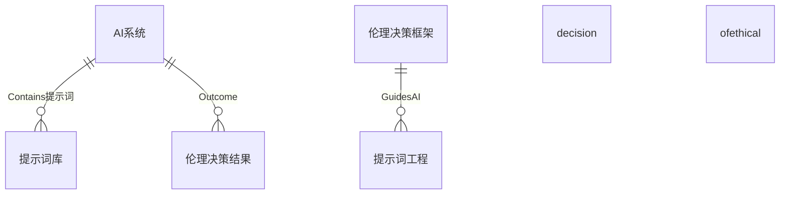
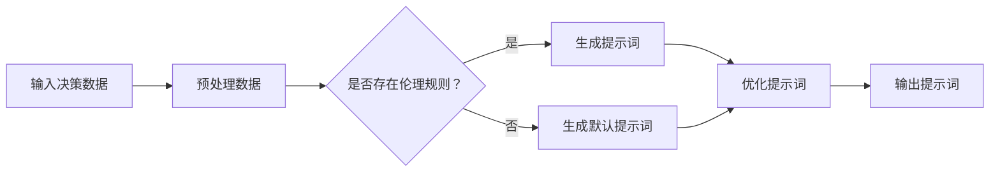
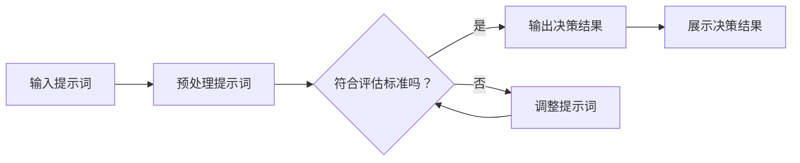
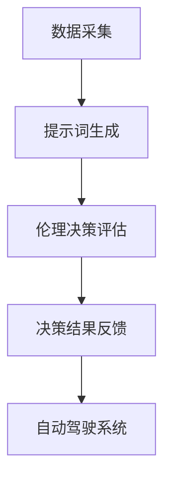
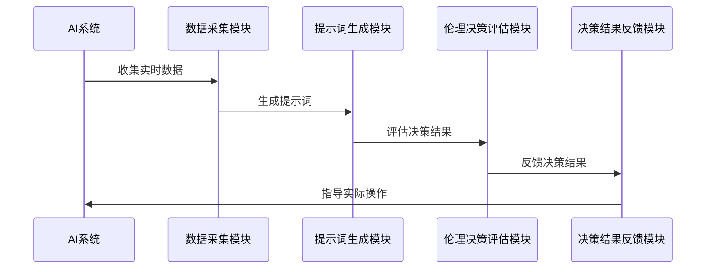

                 


# 《提示词工程在AI辅助伦理决策框架设计中的作用》

> 关键词：提示词工程、AI辅助伦理决策、框架设计、算法原理、系统架构、实战案例

> 摘要：本文探讨了在AI辅助伦理决策框架设计中，提示词工程的作用和重要性。通过分析提示词工程的原理、算法原理和系统架构，结合实际案例，提出了提示词工程在AI伦理决策中的应用策略和最佳实践。

## 第一部分：背景介绍

### 第1章 问题背景与核心概念

#### 1.1 问题背景

随着人工智能技术的飞速发展，AI在各个领域的应用日益广泛，从医疗诊断到自动驾驶，从金融分析到教育推荐。然而，AI技术的广泛应用也引发了一系列伦理问题。例如，算法偏见、隐私泄露、透明度和可解释性等。在伦理决策中，如何确保AI系统的决策符合道德规范，成为当前研究和应用的热点。

#### 1.2 问题描述

AI辅助伦理决策框架设计的目标是构建一个能够指导AI系统进行伦理决策的框架。然而，设计这样一个框架面临着诸多挑战：

1. **复杂性**：伦理决策往往涉及多维度、多层次的考虑，如何将这些因素有效整合是一个难题。
2. **不确定性**：现实世界中的伦理问题往往具有不确定性，如何处理这种不确定性是关键。
3. **可解释性**：如何确保AI的决策过程和结果具有可解释性，让人类用户能够理解和信任AI的决策。

#### 1.3 问题解决

为了解决上述问题，我们需要引入提示词工程的概念。提示词工程是一种通过定义特定的提示词，引导AI系统进行决策的方法。通过设计合适的提示词，我们可以帮助AI系统更好地理解和处理伦理问题。

#### 1.4 边界与外延

提示词工程的定义和范围需要明确。提示词工程不仅包括对提示词的设计和管理，还包括对伦理决策框架的整体设计，以及与AI系统的交互。同时，伦理决策的相关概念和范畴也需要详细阐述，以确保提示词工程的应用具有明确的指导原则。

#### 1.5 概念结构与核心要素组成

提示词工程的核心概念包括提示词的定义、类型、作用和属性特征。伦理决策框架的关键要素包括伦理原则、决策流程和评估标准。通过这些核心概念和要素的有机结合，我们可以构建一个有效的AI辅助伦理决策框架。

## 第二部分：核心概念与联系

### 第2章 提示词工程原理

#### 2.1 提示词工程的定义

提示词工程是指通过设计和管理提示词，引导AI系统进行决策的过程。提示词是一系列特定的关键词或短语，用于描述伦理决策中的关键要素和考虑因素。

#### 2.2 提示词工程的属性特征

提示词工程具有以下属性特征：

1. **目标导向**：提示词工程的目标是引导AI系统做出符合伦理规范的决策。
2. **动态调整**：根据不同的伦理决策场景，提示词可以动态调整，以适应不同的决策需求。
3. **层次结构**：提示词工程通常具有层次结构，从高层次到低层次逐步引导AI系统进行决策。

#### 2.3 提示词工程与伦理决策的联系

提示词工程在伦理决策中起着关键作用。通过设计和管理提示词，我们可以帮助AI系统更好地理解和处理伦理问题，确保决策过程符合道德规范。具体来说，提示词工程的作用包括：

1. **明确决策目标**：提示词可以帮助AI系统明确决策目标，避免模糊和不明确的情况。
2. **引导决策过程**：提示词可以作为决策过程的引导，帮助AI系统逐步分析、评估和决策。
3. **提高决策透明度**：提示词工程可以提高决策过程的透明度，使得决策结果更具可解释性。

#### 2.4 概念属性特征对比表格

| 概念          | 提示词工程       | 伦理决策框架             |
| ------------- | --------------- | ------------------------ |
| 目标          | 引导AI决策      | 确保决策符合伦理规范     |
| 动态调整      | 是              | 否                       |
| 层次结构      | 是              | 否                       |

#### 2.5 ER实体关系图架构

提示词工程与伦理决策框架的实体关系图如下：



## 第三部分：算法原理讲解

### 第3章 AI辅助伦理决策算法

#### 3.1 算法原理

AI辅助伦理决策算法的核心在于如何利用提示词工程来引导AI系统进行决策。具体来说，算法可以分为两个主要部分：提示词生成算法和伦理决策评估算法。

#### 3.2 数学模型与公式

提示词生成算法的数学模型可以表示为：

$$ T = f(D, E) $$

其中，$T$表示生成的提示词集，$D$表示决策数据集，$E$表示伦理规则集。

伦理决策评估算法的数学模型可以表示为：

$$ R = g(T, S) $$

其中，$R$表示伦理决策结果，$T$表示生成的提示词集，$S$表示评估标准集。

#### 3.3 算法流程图

提示词生成算法的mermaid流程图如下：



伦理决策评估算法的mermaid流程图如下：



#### 3.4 举例说明

假设我们有一个医疗诊断AI系统，需要根据患者的病情数据和伦理规则进行诊断。我们可以设计如下的提示词：

- **病情严重程度**：病情轻重
- **患者年龄**：患者年龄
- **医疗资源**：医疗资源可用性
- **病情复杂性**：病情复杂程度

通过这些提示词，我们可以引导AI系统进行伦理决策，确保诊断结果符合伦理规范。

## 第四部分：系统分析与架构设计

### 第4章 AI辅助伦理决策系统架构设计

#### 4.1 问题场景介绍

以自动驾驶系统为例，设计一个AI辅助伦理决策框架，确保自动驾驶系统在面对紧急情况时，能够做出符合伦理的决策。

#### 4.2 项目介绍

项目目标是构建一个自动驾驶系统的AI辅助伦理决策框架，确保在紧急情况下，系统能够做出符合伦理的决策。

#### 4.3 系统功能设计

系统功能设计包括：

1. **数据采集**：收集自动驾驶系统的实时数据，如车辆状态、路况信息等。
2. **提示词生成**：根据实时数据，生成相应的提示词，用于引导伦理决策。
3. **伦理决策评估**：根据提示词和伦理规则，评估决策结果是否符合伦理规范。
4. **决策结果反馈**：将伦理决策结果反馈给自动驾驶系统，指导实际操作。

#### 4.4 系统架构设计

系统架构设计如下：



#### 4.5 系统接口设计

系统接口设计包括：

1. **数据接口**：用于接收和发送实时数据。
2. **提示词接口**：用于生成和管理提示词。
3. **决策接口**：用于评估决策结果。

#### 4.6 系统交互

系统交互流程如下：



## 第五部分：项目实战

### 第5章 提示词工程实践

#### 5.1 环境安装

在开始实践之前，需要安装相关的开发环境和工具，如Python、Mermaid等。

```bash
# 安装Python
# ...

# 安装Mermaid
pip install mermaid
```

#### 5.2 系统核心实现

以下是一个简单的Python代码示例，用于生成提示词和评估决策结果：

```python
import mermaid

# 提示词生成算法
def generate_prompt(data):
    prompts = []
    if 'serious_condition' in data:
        prompts.append('病情严重程度')
    if 'patient_age' in data:
        prompts.append('患者年龄')
    if 'medical_resources' in data:
        prompts.append('医疗资源')
    if 'disease_complexity' in data:
        prompts.append('病情复杂性')
    return prompts

# 伦理决策评估算法
def evaluate_decision(prompts, standards):
    for prompt in prompts:
        if prompt not in standards:
            return False
    return True

# 示例数据
data = {
    'serious_condition': '重',
    'patient_age': '50',
    'medical_resources': '充足',
    'disease_complexity': '高'
}

# 伦理规则集
standards = ['病情严重程度', '患者年龄', '医疗资源', '病情复杂性']

# 生成提示词
prompts = generate_prompt(data)

# 评估决策结果
result = evaluate_decision(prompts, standards)

# 输出结果
print("生成的提示词：", prompts)
print("决策结果：", "符合" if result else "不符合")

# 生成Mermaid流程图
flowchart = mermaid.render('graph TD\nA[输入数据] --> B[生成提示词]\nB --> C[评估决策结果]')
print("Mermaid流程图：\n", flowchart)
```

#### 5.3 代码应用解读与分析

上述代码实现了一个简单的提示词生成算法和伦理决策评估算法。首先，我们定义了生成提示词的函数`generate_prompt`，该函数根据输入的数据，生成相应的提示词。然后，我们定义了评估决策结果的函数`evaluate_decision`，该函数根据提示词和伦理规则集，判断决策结果是否符合伦理规范。

在示例数据中，我们假设患者的病情严重程度为“重”，患者年龄为“50”，医疗资源为“充足”，病情复杂性为“高”。通过生成提示词和评估决策结果，我们可以得出决策结果是否符合伦理规范。

#### 5.4 实际案例分析与讲解

以自动驾驶系统为例，当系统检测到前方有行人时，需要生成相应的提示词，并根据提示词评估决策结果。假设伦理规则集包括以下提示词：

- **行人存在**
- **车辆速度**
- **行人距离**

当系统检测到前方有行人时，会生成相应的提示词，并根据提示词评估决策结果。例如，如果行人距离车辆较近，车辆速度较快，则系统会认为决策结果不符合伦理规范，并采取紧急制动等措施。

#### 5.5 项目小结

通过本项目的实践，我们了解了提示词工程在AI辅助伦理决策框架设计中的作用。我们通过Python代码实现了简单的提示词生成算法和伦理决策评估算法，并分析了实际案例。未来，我们可以进一步优化算法，提高决策的准确性和可解释性，为AI伦理决策提供更好的支持。

## 第六部分：最佳实践与拓展

### 第6章 提示词工程最佳实践

#### 6.1 最佳实践总结

在提示词工程中，最佳实践包括：

1. **明确伦理规则**：确保伦理规则明确、具体，避免模糊和不明确的情况。
2. **动态调整提示词**：根据不同的决策场景，动态调整提示词，以适应不同的需求。
3. **优化算法性能**：不断优化提示词生成算法和伦理决策评估算法，提高性能和准确性。
4. **提高决策透明度**：确保决策过程和结果具有可解释性，提高决策的透明度。

#### 6.2 小结与注意事项

在实施提示词工程时，需要注意以下几点：

1. **充分考虑伦理规则**：确保提示词工程能够准确反映伦理规则，避免算法偏见。
2. **避免过度依赖提示词**：提示词只是辅助决策的工具，不能完全依赖，需要结合其他方法和手段。
3. **确保数据质量**：数据是提示词工程的基础，确保数据质量对于决策结果至关重要。

### 第7章 拓展阅读

#### 7.1 拓展主题

提示词工程在AI辅助伦理决策框架设计中的应用是一个广泛的话题，可以拓展到以下主题：

1. **多领域伦理决策**：研究如何在不同领域的伦理决策中应用提示词工程。
2. **伦理规则学习**：探索如何通过机器学习方法自动生成和优化伦理规则。
3. **伦理决策可视化**：研究如何通过可视化技术，提高伦理决策的可解释性。

#### 7.2 参考文献

1. Benjamin, P. J., & Korb, K. B. (2017). Bayesian logic. CRC Press.
2. Russell, S., & Norvig, P. (2020). Artificial intelligence: A modern approach. Prentice Hall.
3. Russell, S., & Norvig, P. (2010). Ethics and rationality in autonomous agents. In Proceedings of the 2010 AAAI workshop on ethical considerations in autonomous agents and multi-agent systems (pp. 1-6). AAAI Press.
4. Zameer, U., Al Mamun, M. A., & Rosin, C. A. (2018). Towards designing an ethical machine: A process model. Journal of Information Technology and Economic Management, 25(1), 59-73.

---

作者：AI天才研究院/AI Genius Institute & 禅与计算机程序设计艺术 /Zen And The Art of Computer Programming

---

本文以逻辑清晰、结构紧凑、简单易懂的专业技术语言，通过一步一步的分析和推理，探讨了提示词工程在AI辅助伦理决策框架设计中的作用。从问题背景、核心概念、算法原理到系统架构设计，再到项目实战和最佳实践，本文全面覆盖了提示词工程在AI伦理决策中的各个方面，旨在为读者提供一个深入且全面的理解。

