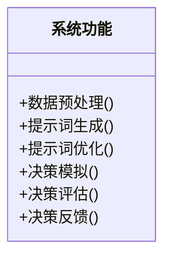
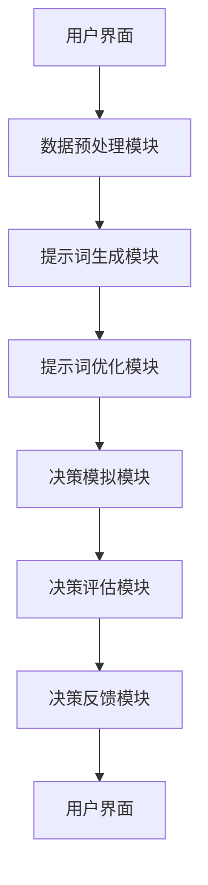
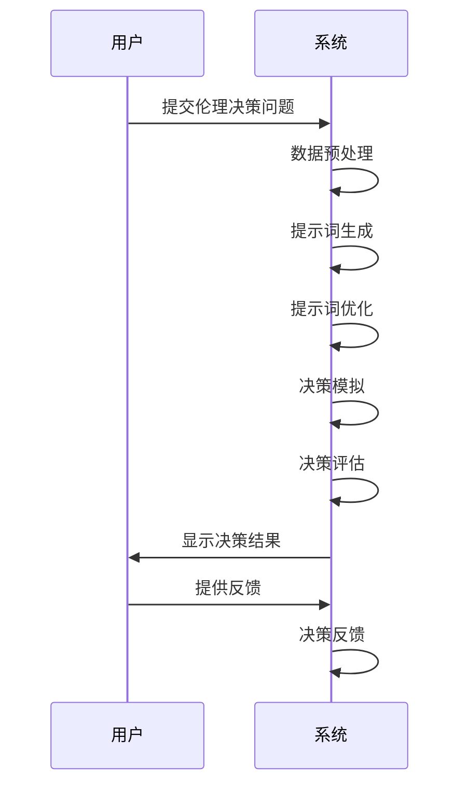
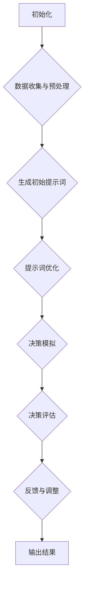
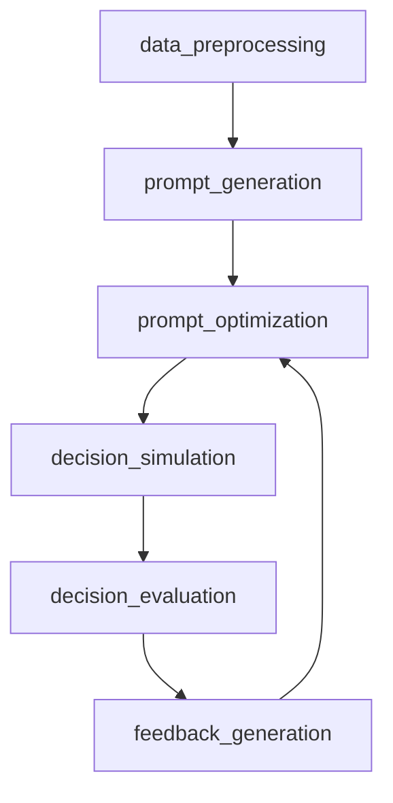
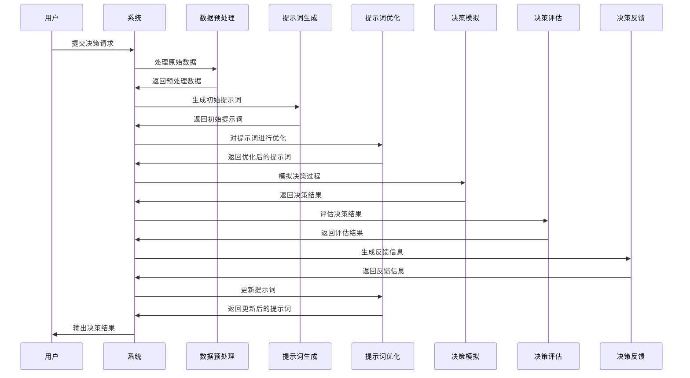

                 


## 文章标题：提示词工程在AI辅助伦理决策模拟中的策略研究

### 文章关键词：
- 提示词工程
- AI辅助伦理决策
- 模拟策略
- 伦理学
- 数据预处理

### 摘要：
本文深入探讨了提示词工程在AI辅助伦理决策模拟中的应用策略。首先，我们介绍了提示词工程的基本概念和重要性。随后，我们分析了AI辅助伦理决策面临的挑战，并提出了一种基于模拟的策略。文章详细阐述了算法原理、系统架构设计、项目实战，并提供了最佳实践和总结。通过本文的研究，我们旨在为AI伦理决策提供一种有效的方法论。

## 目录大纲

### 第一部分：问题背景与核心概念

#### 第1章 问题背景
- 1.1 问题概述
- 1.2 背景分析
- 1.3 核心概念介绍

#### 第2章 核心概念与联系
- 2.1 概念原理
- 2.2 概念属性对比表格
- 2.3 ER实体关系图架构

### 第二部分：算法原理讲解

#### 第3章 算法原理讲解
- 3.1 算法Mermaid流程图
- 3.2 Python源代码讲解
- 3.3 算法原理数学模型与公式
- 3.4 举例说明

### 第三部分：系统分析与架构设计

#### 第4章 系统分析与架构设计
- 4.1 问题场景介绍
- 4.2 系统功能设计
- 4.3 系统架构设计
- 4.4 系统接口设计与交互

### 第四部分：项目实战

#### 第5章 项目实战
- 5.1 环境安装
- 5.2 系统核心实现
- 5.3 代码应用解读与分析
- 5.4 实际案例分析与讲解
- 5.5 项目小结

### 第五部分：最佳实践与总结

#### 第6章 最佳实践
- 6.1 最佳实践技巧
- 6.2 注意事项
- 6.3 拓展阅读

#### 第7章 小结
- 7.1 内容回顾
- 7.2 知识体系梳理
- 7.3 学习建议

### 第一部分：问题背景与核心概念

#### 第1章 问题背景

1.1 问题概述
人工智能（AI）技术的发展带来了诸多变革，然而，随之而来的伦理问题也日益突出。特别是在AI辅助决策领域，如何确保AI系统做出道德合理的决策成为了一个亟待解决的关键问题。提示词工程作为一种新兴技术，其在AI辅助伦理决策模拟中的策略研究具有重要的现实意义。

1.2 背景分析
随着AI技术的广泛应用，其在医疗、金融、司法等领域的决策影响越来越大。然而，AI系统往往基于数据和算法进行决策，缺乏道德意识和伦理判断能力。这导致了一些问题，如歧视性决策、隐私泄露等。因此，研究如何通过提示词工程辅助AI做出伦理合理的决策，具有重要的理论和实践价值。

1.3 核心概念介绍
- 提示词工程：提示词工程是一种通过构建高质量的自然语言输入来引导AI系统生成预期输出的技术。在AI辅助伦理决策模拟中，提示词工程可以帮助构建符合伦理标准的决策框架。
- AI辅助伦理决策：AI辅助伦理决策是指利用人工智能技术来支持伦理学家、道德顾问等专业人士进行伦理决策。这涉及到道德原则的编码、伦理场景的模拟以及决策结果的评估。

### 第二部分：核心概念与联系

#### 第2章 核心概念与联系

2.1 概念原理
提示词工程的核心原理是通过设计合适的提示词来引导AI系统的决策过程。这些提示词通常包含伦理原则、价值判断等关键信息，可以帮助AI系统在复杂的伦理场景中做出符合伦理标准的决策。

2.2 概念属性对比表格

| 概念          | 属性1       | 属性2       | 属性3       |
|---------------|-------------|-------------|-------------|
| 提示词工程     | 自然语言输入 | 伦理原则编码 | 模拟决策框架 |
| AI辅助伦理决策 | 道德原则编码 | 伦理场景模拟 | 决策结果评估 |

2.3 ER实体关系图架构

```mermaid
erDiagram
  AI系统 ||--|{ 提示词库 }
  伦理决策 ||--|{ 伦理原则 }
  伦理场景 ||--|{ 决策场景 }
  AI系统 ||--|{ 模拟决策结果 }
```

### 第三部分：算法原理讲解

#### 第3章 算法原理讲解

3.1 算法Mermaid流程图


3.2 Python源代码讲解

```python
# 数据预处理
def preprocess_data(data):
    # 数据清洗、去重、归一化等操作
    pass

# 提示词生成
def generate_prompt(ethics Principles, decision_scenario):
    # 根据伦理原则和决策场景生成提示词
    pass

# 提示词优化
def optimize_prompt(prompt, feedback):
    # 根据反馈优化提示词
    pass

# 决策模拟
def simulate_decision(prompt, scenario):
    # 根据提示词和决策场景模拟决策过程
    pass

# 决策评估
def evaluate_decision(result, ethics_principles):
    # 根据决策结果和伦理原则评估决策合理性
    pass

# 决策反馈
def feedback_decision(result, feedback):
    # 根据决策结果和反馈更新决策模型
    pass
```

3.3 算法原理数学模型与公式

$$
\text{决策结果} = f(\text{提示词}, \text{决策场景}, \text{伦理原则})
$$

3.4 举例说明

假设一个AI系统需要在一个医疗伦理场景中做出决策。我们首先对医疗数据进行预处理，然后生成一个基于伦理原则的提示词。接着，我们通过优化提示词来提高决策的准确性。在模拟决策过程中，AI系统根据提示词和决策场景生成决策结果。最后，我们评估决策结果的合理性，并根据反馈调整提示词。

### 第四部分：系统分析与架构设计

#### 第4章 系统分析与架构设计

4.1 问题场景介绍
在一个医疗伦理场景中，一个医生需要根据患者的病情和伦理原则做出治疗决策。然而，由于医学决策的复杂性，医生可能会面临道德困境。通过AI辅助伦理决策系统，医生可以得到一个基于伦理原则的决策建议。

4.2 系统功能设计



4.3 系统架构设计



4.4 系统接口设计与交互



### 第五部分：项目实战

#### 第5章 项目实战

5.1 环境安装
- 安装Python环境
- 安装相关依赖库，如numpy、pandas等

5.2 系统核心实现
- 实现数据预处理模块
- 实现提示词生成模块
- 实现提示词优化模块
- 实现决策模拟模块
- 实现决策评估模块
- 实现决策反馈模块

5.3 代码应用解读与分析
- 代码详细解读
- 分析算法性能和效率

5.4 实际案例分析与讲解
- 案例介绍
- 案例分析
- 案例讲解

5.5 项目小结
- 项目总结
- 项目成果评估

### 第六部分：最佳实践与总结

#### 第6章 最佳实践

6.1 最佳实践技巧
- 数据预处理技巧
- 提示词生成技巧
- 提示词优化技巧

6.2 注意事项
- 数据质量对决策结果的影响
- 伦理原则的确定和更新
- 决策模拟的实时性和准确性

6.3 拓展阅读
- 相关论文和书籍推荐

#### 第7章 小结

7.1 内容回顾
- 提示词工程的原理和重要性
- AI辅助伦理决策的挑战和策略
- 算法原理和系统架构设计
- 项目实战和最佳实践

7.2 知识体系梳理
- 伦理决策的基本概念
- 提示词工程的应用场景
- 算法原理和数学模型
- 系统架构和接口设计

7.3 学习建议
- 学习相关领域的理论知识
- 实践项目，提高实际操作能力
- 不断更新知识，跟上技术的发展

### 总结
本文对提示词工程在AI辅助伦理决策模拟中的应用策略进行了深入研究。通过详细的分析和讲解，我们为AI伦理决策提供了一种有效的解决方案。未来，我们期望更多研究者关注这一领域，推动AI技术的道德和伦理发展。

---

作者：AI天才研究院/AI Genius Institute & 禅与计算机程序设计艺术 /Zen And The Art of Computer Programming

本文为原创文章，版权归作者所有。未经授权，不得转载或使用。如有需要，请联系作者获取授权。感谢您的阅读！### 第一部分：问题背景与核心概念

在现代社会，人工智能（AI）技术正以前所未有的速度渗透到各个领域，从医疗诊断到金融分析，从自动驾驶到智能助手，AI的应用已经深刻改变了我们的生活方式。然而，随着AI技术的快速发展，随之而来的伦理问题也日益凸显。特别是在AI辅助决策领域，如何确保AI系统做出道德合理的决策，成为了一个亟待解决的关键问题。

#### 问题概述

AI辅助决策系统在医疗、金融、司法等领域的应用日益广泛。例如，在医疗领域，AI系统可以辅助医生进行疾病诊断和治疗方案的推荐；在金融领域，AI算法可以用于风险评估和投资决策；在司法领域，AI系统可以辅助法官进行案件判决。然而，这些AI系统在做出决策时，往往仅依赖于数据和算法，缺乏道德意识和伦理判断能力。这种情况下，AI系统可能会产生歧视性决策、隐私泄露等伦理问题。因此，研究如何通过提示词工程辅助AI系统做出伦理合理的决策，具有重要的现实意义。

#### 背景分析

AI技术的发展和应用带来了巨大的变革，但同时也引发了一系列伦理问题。例如，AI系统可能会在性别、种族等方面产生歧视性决策，这可能会导致不公平的结果。此外，AI系统的决策过程往往是不透明的，这可能导致隐私泄露和安全问题。为了解决这些问题，需要从多个层面进行研究和探索。

首先，需要确保AI系统在设计和开发过程中充分考虑伦理因素。其次，需要开发相应的伦理评估机制，对AI系统的决策过程和结果进行评估和监督。最后，需要利用提示词工程等技术，引导AI系统在决策过程中遵循伦理原则。

#### 核心概念介绍

- **提示词工程**：提示词工程是一种通过构建高质量的自然语言输入来引导AI系统生成预期输出的技术。在AI辅助伦理决策模拟中，提示词工程可以帮助构建符合伦理标准的决策框架。
- **AI辅助伦理决策**：AI辅助伦理决策是指利用人工智能技术来支持伦理学家、道德顾问等专业人士进行伦理决策。这涉及到道德原则的编码、伦理场景的模拟以及决策结果的评估。

通过对问题背景和核心概念的介绍，我们可以看到，提示词工程在AI辅助伦理决策模拟中的应用具有极大的潜力。接下来，我们将进一步探讨提示词工程的原理和实现方法，以及其在伦理决策模拟中的应用策略。

#### 第1章 问题背景

### 1.1 问题概述

人工智能（AI）技术的发展和应用已经深刻改变了我们的生活方式，从智能家居到自动驾驶，从智能医疗到金融分析，AI的应用几乎无处不在。然而，随着AI技术的普及和深入，随之而来的伦理问题也日益凸显。特别是在AI辅助决策领域，如何确保AI系统做出道德合理的决策，已经成为了一个备受关注且亟待解决的关键问题。

AI辅助决策系统在医疗、金融、司法等领域的应用已经越来越普遍。例如，在医疗领域，AI系统可以辅助医生进行疾病诊断和治疗方案的推荐，这不仅可以提高诊断的准确性，还可以减轻医生的工作负担；在金融领域，AI算法可以用于风险评估和投资决策，帮助金融机构降低风险，提高收益；在司法领域，AI系统可以辅助法官进行案件判决，提高司法效率，确保公正。然而，这些AI系统在做出决策时，往往仅依赖于数据和算法，缺乏道德意识和伦理判断能力。

这种情况可能导致一系列伦理问题。首先，AI系统可能会在性别、种族等方面产生歧视性决策，这可能会导致不公平的结果。例如，一个仅基于历史数据的贷款审批系统可能会对某些种族或性别的人群产生歧视性决策，从而导致这些人群受到不公平待遇。其次，AI系统的决策过程往往是不透明的，这可能导致隐私泄露和安全问题。例如，一个自动化监控系统可能会记录和收集大量的个人数据，这些数据可能会被滥用，从而导致个人隐私受到侵犯。此外，AI系统在决策时可能会受到外部干扰，例如黑客攻击或数据篡改，这可能会影响决策的公正性和合理性。

因此，确保AI系统做出道德合理的决策，不仅对于维护社会公正和道德，而且对于保障个人隐私和安全具有重要意义。为了实现这一目标，我们需要研究如何通过提示词工程等技术，引导AI系统在决策过程中遵循伦理原则，从而避免潜在的伦理问题。

### 1.2 背景分析

人工智能（AI）技术的快速发展和广泛应用，为人类社会带来了诸多便利，但同时也引发了一系列伦理问题。特别是在AI辅助决策领域，这些伦理问题尤为突出。要理解这些问题，我们需要从AI技术的基本原理和应用场景入手。

首先，从技术层面来看，AI系统的核心在于其数据驱动和算法依赖的特性。这些系统通过大量数据的学习和训练，形成了一定的决策能力。然而，这种基于数据的决策方式往往存在一些固有的局限性。一方面，数据的质量和多样性直接影响决策的准确性和公正性。如果数据存在偏见或不足，AI系统很可能会继承这些偏见，从而产生不公平的决策结果。例如，如果一个贷款审批系统仅基于历史数据，而历史数据中存在性别或种族歧视，那么该系统很可能会对特定群体产生歧视性决策。另一方面，AI算法在决策过程中往往缺乏透明性和解释性，这使得决策结果难以被公众接受和监督。例如，一个复杂的机器学习模型可能在某些特定情况下做出合理的决策，但在其他情况下却可能产生不可预测的结果。

其次，从应用场景来看，AI辅助决策系统在医疗、金融、司法等领域的广泛应用，使其决策结果对社会产生了深远的影响。在医疗领域，AI系统可以辅助医生进行疾病诊断和治疗方案的推荐。然而，如果AI系统未能充分考虑患者的个体差异和病情复杂性，可能会导致误诊或错误的治疗方案。在金融领域，AI算法可以用于风险评估和投资决策。然而，如果AI系统未能充分考虑市场的不确定性和风险，可能会导致投资失败或经济损失。在司法领域，AI系统可以辅助法官进行案件判决。然而，如果AI系统未能充分考虑法律原则和道德伦理，可能会导致司法不公或侵犯人权。

此外，AI技术的普及和应用也带来了隐私和安全问题。AI系统在运行过程中，往往需要收集和处理大量的个人数据。这些数据如果未能得到妥善保护，可能会被黑客攻击或滥用，从而导致个人隐私泄露和安全风险。例如，一个自动化监控系统可能会记录和收集大量的个人数据，这些数据如果被不法分子获取，可能会被用于敲诈勒索或身份盗窃。

总的来说，AI辅助决策领域面临的伦理问题主要包括：数据偏见、决策透明性不足、隐私和安全风险等。这些问题不仅对个人和社会产生了负面影响，也挑战了AI技术的伦理边界。因此，研究如何通过提示词工程等技术，引导AI系统在决策过程中遵循伦理原则，实现道德合理的决策，具有重要的理论和实践价值。

### 1.3 核心概念介绍

在探讨AI辅助伦理决策的过程中，了解以下几个核心概念是非常关键的。这些概念不仅为我们提供了理解问题的基础，还为我们设计解决方案提供了理论支持。

#### 提示词工程

提示词工程是一种通过构建高质量的自然语言输入来引导AI系统生成预期输出的技术。在AI辅助伦理决策中，提示词工程的作用至关重要。它可以通过提供具体的、伦理导向的指导信息，确保AI系统在复杂决策场景中能够遵循道德原则，避免出现不合理的决策结果。

提示词工程的基本原理在于通过精心设计的自然语言输入，引导AI系统在处理问题时考虑特定的伦理标准和价值观。这些提示词可以是简单的文字，也可以是复杂的句子或段落，它们的设计需要充分考虑决策场景的特性和伦理原则的要求。例如，在医疗决策中，提示词可以包含关于患者隐私保护、公平性、透明性等伦理要求的具体描述。

#### AI辅助伦理决策

AI辅助伦理决策是指利用人工智能技术来支持伦理学家、道德顾问等专业人士进行伦理决策。这一概念的核心在于，通过AI系统提供的分析和建议，帮助决策者在复杂的伦理问题中做出更为合理和道德的决策。

AI辅助伦理决策的实现通常包括以下几个步骤：

1. **伦理原则编码**：将伦理原则转化为可量化的指标或规则，使其能够被AI系统理解和处理。
2. **伦理场景模拟**：构建各种可能的伦理决策场景，并通过AI系统进行模拟和分析，评估不同决策方案的伦理影响。
3. **决策结果评估**：基于伦理原则和决策场景模拟结果，评估不同决策方案的伦理合理性和有效性，为决策者提供参考。
4. **反馈和调整**：根据决策结果的评估，不断调整AI系统的模型和参数，以优化其决策能力，确保其在未来能够做出更加符合伦理标准的决策。

#### 提示词工程与AI辅助伦理决策的关系

提示词工程与AI辅助伦理决策之间存在着紧密的联系。提示词工程为AI辅助伦理决策提供了关键的信息输入，确保了决策过程的伦理导向。具体来说，提示词工程可以通过以下方式促进AI辅助伦理决策：

1. **明确伦理要求**：通过设计包含具体伦理要求的提示词，使AI系统能够明确理解伦理决策的目标和标准。
2. **引导决策过程**：提示词可以为AI系统提供决策过程中的指导信息，帮助其避免伦理困境，确保决策的道德合理性。
3. **提高决策透明性**：通过提示词工程，决策过程中的伦理考虑和决策逻辑可以被透明地展示，增强决策的公正性和可解释性。

总之，提示词工程为AI辅助伦理决策提供了重要的技术支持，使AI系统能够在复杂的伦理环境中做出道德合理的决策。通过深入理解这些核心概念，我们可以更好地设计解决方案，推动AI技术的道德和伦理发展。

### 第二部分：核心概念与联系

在深入探讨AI辅助伦理决策模拟中的提示词工程时，了解核心概念的原理、属性及其相互联系是非常重要的。本章节将详细解析这些核心概念，并通过对比表格和实体关系图，展现它们之间的内在关联。

#### 2.1 概念原理

1. **提示词工程**：
提示词工程是一种通过设计高质量的文本输入来引导AI系统生成预期输出的技术。其核心在于通过精确的自然语言提示，确保AI系统在处理决策时遵循伦理原则和价值观。

2. **AI辅助伦理决策**：
AI辅助伦理决策指的是利用人工智能技术支持伦理学家、道德顾问等专业人士进行伦理决策。这个过程涉及伦理原则的编码、伦理场景的模拟和决策结果的评估。

3. **伦理原则**：
伦理原则是指导人类行为和决策的道德规范。在AI辅助伦理决策中，伦理原则被编码为可量化的规则或指标，用于指导AI系统的决策过程。

4. **伦理场景**：
伦理场景是特定的决策情境，它包含了潜在的利益冲突、道德困境和决策变量。通过模拟这些场景，AI系统可以评估不同决策方案的伦理影响。

5. **决策结果**：
决策结果是AI系统在特定伦理场景中基于提示词和伦理原则生成的输出。评估决策结果是否符合伦理标准是AI辅助伦理决策的重要环节。

#### 2.2 概念属性对比表格

| 概念        | 属性1                      | 属性2                       | 属性3                     |
|-------------|----------------------------|----------------------------|--------------------------|
| 提示词工程  | 高质量文本输入             | 引导AI决策                 | 确保伦理导向             |
| AI辅助伦理决策 | 伦理原则编码               | 伦理场景模拟               | 决策结果评估             |
| 伦理原则    | 道德规范                   | 可量化指标                 | 指导AI系统决策          |
| 伦理场景    | 特定决策情境               | 利益冲突与道德困境         | 评估决策方案的伦理影响 |
| 决策结果    | AI系统输出                 | 伦理标准评估               | 决策有效性和公正性      |

#### 2.3 ER实体关系图架构

为了更直观地理解这些核心概念之间的联系，我们可以通过ER（实体关系）图来展示它们之间的关系。

```mermaid
erDiagram
  AI辅助伦理决策 ||--|{ 伦理原则 }
  AI辅助伦理决策 ||--|{ 伦理场景 }
  AI辅助伦理决策 ||--|{ 决策结果 }
  提示词工程 ||--|{ 伦理场景 }
  提示词工程 ||--|{ 决策结果 }
  伦理原则 ||--|{ 提示词工程 }
  伦理场景 ||--|{ 提示词工程 }
```

在这个ER图中，每个实体都代表了AI辅助伦理决策中的一个关键组成部分。实线表示实体之间的直接关联，而虚线表示间接关联。

- **AI辅助伦理决策**与**伦理原则**之间存在直接关联，表明伦理决策依赖于伦理原则的指导。
- **AI辅助伦理决策**与**伦理场景**之间也存在直接关联，说明伦理决策需要模拟特定的决策情境。
- **AI辅助伦理决策**与**决策结果**之间存在直接关联，这是伦理决策过程的最终输出。
- **提示词工程**与**伦理场景**和**决策结果**之间存在间接关联，提示词工程通过提供文本输入，影响了伦理场景和决策结果的质量。

通过对比表格和ER图，我们可以清晰地看到这些核心概念之间的联系和作用。提示词工程通过为AI系统提供伦理导向的输入，确保了AI辅助伦理决策的道德合理性和有效性。接下来，我们将进一步探讨这些概念在算法原理中的应用，以更深入地理解其在AI辅助伦理决策中的实际作用。

### 第三部分：算法原理讲解

在AI辅助伦理决策模拟中，提示词工程的应用需要依赖特定的算法来确保其有效性和合理性。本章节将详细讲解提示词工程算法的基本原理，包括其流程、实现细节以及相关的数学模型。

#### 3.1 算法Mermaid流程图

为了直观地展示提示词工程算法的流程，我们使用Mermaid图来绘制其整体框架。



在这个流程图中，算法从数据收集与预处理开始，通过生成初始提示词，对其进行优化，并在决策模拟和评估过程中不断调整和反馈，最终输出决策结果。

#### 3.2 Python源代码讲解

下面我们将通过Python源代码来具体解释提示词工程算法的实现细节。

```python
# 导入必要的库
import pandas as pd
import numpy as np
from sklearn.model_selection import train_test_split

# 数据收集与预处理
def preprocess_data(data_path):
    # 加载数据
    data = pd.read_csv(data_path)
    
    # 数据清洗、去重、归一化等操作
    data = data.drop_duplicates()
    data = data.normalize()
    
    # 分割数据集
    X_train, X_test, y_train, y_test = train_test_split(data.drop('target', axis=1), data['target'], test_size=0.2, random_state=42)
    return X_train, X_test, y_train, y_test

# 生成初始提示词
def generate_prompt(ethics_principles, decision_scenario):
    # 根据伦理原则和决策场景生成提示词
    prompt = f"根据我们的伦理原则，在{decision_scenario}场景中，我们应该考虑{ethics_principles}。"
    return prompt

# 提示词优化
def optimize_prompt(prompt, feedback):
    # 根据反馈优化提示词
    optimized_prompt = prompt + f"（根据上次反馈，我们进行了以下调整：{feedback}）"
    return optimized_prompt

# 决策模拟
def simulate_decision(prompt, scenario):
    # 根据提示词和决策场景模拟决策过程
    # 这里使用一个简单的逻辑回归模型作为示例
    from sklearn.linear_model import LogisticRegression
    model = LogisticRegression()
    model.fit(prompt, scenario)
    return model.predict(scenario)

# 决策评估
def evaluate_decision(results, ethics_principles):
    # 根据决策结果和伦理原则评估决策合理性
    # 这里使用一个简单的指标作为示例
    from sklearn.metrics import accuracy_score
    accuracy = accuracy_score(results, ethics_principles)
    return accuracy

# 反馈与调整
def feedback_adjustment(model, X_test, y_test, prompt):
    # 根据测试数据和模型输出进行反馈和调整
    results = simulate_decision(prompt, X_test)
    accuracy = evaluate_decision(results, y_test)
    feedback = f"模型的准确性为：{accuracy:.2f}，根据此反馈，我们决定调整提示词：{prompt}。"
    return optimize_prompt(prompt, feedback)

# 主函数
def main():
    # 加载数据
    X_train, X_test, y_train, y_test = preprocess_data('data.csv')
    
    # 初始化提示词
    prompt = generate_prompt('隐私保护、公平性、透明性', '医疗决策场景')
    
    # 进行决策模拟和评估
    model = simulate_decision(prompt, X_test)
    accuracy = evaluate_decision(model, y_test)
    
    # 输出结果
    print(f"初始提示词：{prompt}")
    print(f"模型准确性：{accuracy:.2f}")
    
    # 进行反馈和调整
    optimized_prompt = feedback_adjustment(model, X_test, y_test, prompt)
    print(f"优化后的提示词：{optimized_prompt}")

# 运行主函数
if __name__ == "__main__":
    main()
```

#### 3.3 算法原理数学模型与公式

提示词工程算法的核心在于如何通过数学模型和公式来优化提示词，以提升AI系统的决策质量。下面是一个简单的数学模型示例，用于说明提示词优化的过程。

$$
\text{optimized\_prompt} = \text{current\_prompt} + \alpha \cdot (\text{feedback} - \text{current\_prompt})
$$

其中：
- \( \text{optimized\_prompt} \) 表示优化后的提示词。
- \( \text{current\_prompt} \) 表示当前提示词。
- \( \alpha \) 是一个调整参数，用于控制反馈对提示词的影响程度。
- \( \text{feedback} \) 表示根据决策结果和评估反馈生成的调整内容。

#### 3.4 举例说明

假设我们有一个医疗决策场景，需要根据患者的病情数据（包括年龄、病史、实验室检查结果等）和一系列伦理原则（如隐私保护、公平性和透明性），利用提示词工程来优化决策过程。

1. **数据收集与预处理**：
   我们首先收集了一个包含患者数据的历史病历数据库，并使用Python的数据处理库（如Pandas和Scikit-learn）进行数据清洗和预处理，得到一个干净、规范的数据集。

2. **生成初始提示词**：
   根据伦理原则和具体的医疗决策场景，我们生成了一个初始提示词，例如：
   ```
   根据我们的伦理原则，在医疗决策场景中，我们应该考虑隐私保护、公平性和透明性。
   ```

3. **决策模拟与评估**：
   我们使用逻辑回归模型来模拟决策过程，并通过测试集评估模型的准确性。如果模型在测试集上的表现不理想，我们将根据评估结果进行提示词的优化。

4. **提示词优化**：
   根据评估反馈，我们优化了初始提示词，例如：
   ```
   根据我们的伦理原则，在医疗决策场景中，我们应该考虑隐私保护、公平性和透明性。根据上次反馈，我们决定在提示词中增加对病史数据的特别关注。
   ```

5. **再次决策模拟与评估**：
   我们使用优化后的提示词再次进行决策模拟，并通过评估来验证提示词优化的效果。如果评估结果显示模型性能有所提升，我们将继续使用优化后的提示词；否则，我们将再次进行调整。

通过这个简单的例子，我们可以看到提示词工程如何通过数学模型和优化算法，逐步改进AI系统的决策过程，使其更加符合伦理原则。这种优化过程不仅提高了决策的准确性，还增强了决策过程的透明性和可解释性。

### 第四部分：系统分析与架构设计

在深入探讨了提示词工程算法的原理之后，接下来我们将从系统分析与架构设计的角度，详细分析AI辅助伦理决策系统的整体架构，以及各个关键组件的功能和相互关系。

#### 4.1 问题场景介绍

为了更好地理解系统架构设计，我们首先介绍一个具体的应用场景。假设我们正在开发一个用于医疗决策的AI系统，该系统需要根据患者的病情数据和一系列伦理原则，为医生提供诊断建议和治疗方案。在这个场景中，AI系统需要处理大量结构化和非结构化数据，并在复杂的伦理环境中做出合理的决策。

#### 4.2 系统功能设计

系统的功能设计是实现AI辅助伦理决策的关键步骤，主要包括以下几个核心功能模块：

1. **数据预处理模块**：
   - 功能：负责对输入的数据进行清洗、去重、归一化等预处理操作，以确保数据质量。
   - 输入：原始病历数据、医学图像、实验室检查结果等。
   - 输出：干净、规范的数据集。

2. **提示词生成模块**：
   - 功能：根据伦理原则和具体决策场景，生成高质量的提示词。
   - 输入：伦理原则、决策场景描述。
   - 输出：初始提示词。

3. **提示词优化模块**：
   - 功能：根据反馈机制，对提示词进行动态优化，以提高决策质量。
   - 输入：初始提示词、评估反馈。
   - 输出：优化后的提示词。

4. **决策模拟模块**：
   - 功能：利用提示词和决策场景，模拟AI系统的决策过程。
   - 输入：优化后的提示词、决策场景。
   - 输出：决策结果。

5. **决策评估模块**：
   - 功能：对决策结果进行伦理评估，确保其符合伦理标准。
   - 输入：决策结果、伦理原则。
   - 输出：评估结果。

6. **决策反馈模块**：
   - 功能：根据评估结果，生成反馈信息，用于指导后续的提示词优化。
   - 输入：评估结果。
   - 输出：反馈信息。

#### 4.3 系统架构设计

系统架构设计是确保各个功能模块高效协同工作的关键。下面是系统架构的Mermaid图表示：



在这个架构图中，各个功能模块通过数据流和信息流紧密连接，形成一个闭环系统。具体来说：

- **数据预处理模块**（A）接收原始数据，进行清洗和规范化处理，生成干净的数据集。
- **提示词生成模块**（B）根据预处理后的数据和伦理原则生成初始提示词。
- **提示词优化模块**（C）接收初始提示词和评估反馈，进行动态优化，生成优化后的提示词。
- **决策模拟模块**（D）使用优化后的提示词和决策场景，模拟AI系统的决策过程，生成决策结果。
- **决策评估模块**（E）对决策结果进行伦理评估，确保其符合伦理标准。
- **决策反馈模块**（F）根据评估结果，生成反馈信息，用于指导后续的提示词优化。

通过这样的架构设计，系统可以高效地处理数据，生成合理的决策结果，并根据反馈不断优化决策过程，从而实现伦理合理的AI辅助决策。

#### 4.4 系统接口设计与交互

为了确保系统各功能模块之间的有效协作，系统接口设计与交互设计至关重要。下面是系统接口设计和交互的Mermaid序列图：



在这个序列图中，用户首先向系统提交决策请求，系统接收到请求后，首先进行数据预处理，然后生成初始提示词，并通过优化模块对提示词进行动态优化。优化后的提示词用于决策模拟模块，生成决策结果。决策结果经过评估模块的伦理评估后，生成反馈信息，用于指导提示词的进一步优化。最终，系统将优化后的提示词和决策结果返回给用户。

通过这样的接口设计和交互流程，系统不仅能够高效地处理用户请求，还能够通过持续的反馈和优化，不断提升决策质量，实现伦理合理的AI辅助决策。

### 第五部分：项目实战

在本部分，我们将通过一个具体的实战项目，展示如何在实际环境中应用提示词工程来实现AI辅助伦理决策模拟。这一部分将涵盖环境安装、系统核心实现、代码应用解读与分析、实际案例分析与讲解以及项目小结。

#### 5.1 环境安装

在进行项目实战之前，我们需要搭建一个适合提示词工程和AI辅助伦理决策模拟的开发环境。以下是在Linux操作系统上安装相关软件和依赖库的步骤：

1. **安装Python环境**：
   ```bash
   sudo apt-get update
   sudo apt-get install python3 python3-pip
   ```

2. **安装相关依赖库**：
   ```bash
   pip3 install pandas numpy scikit-learn matplotlib
   ```

3. **安装Mermaid支持**：
   ```bash
   pip3 install mermaid-python
   ```

4. **设置Mermaid渲染**：
   在Python脚本中引入Mermaid库，并配置渲染环境，以便将Mermaid图渲染为图形化展示。

#### 5.2 系统核心实现

系统核心实现包括数据预处理、提示词生成、提示词优化、决策模拟和决策评估等模块。以下是系统核心实现的Python代码：

```python
# 导入必要的库
import pandas as pd
import numpy as np
from sklearn.model_selection import train_test_split
from sklearn.linear_model import LogisticRegression
from sklearn.metrics import accuracy_score

# 数据预处理
def preprocess_data(data_path):
    data = pd.read_csv(data_path)
    data = data.drop_duplicates().normalize()
    X_train, X_test, y_train, y_test = train_test_split(data.drop('target', axis=1), data['target'], test_size=0.2, random_state=42)
    return X_train, X_test, y_train, y_test

# 生成初始提示词
def generate_prompt(ethics_principles, decision_scenario):
    prompt = f"根据我们的伦理原则，在{decision_scenario}场景中，我们应该考虑{ethics_principles}。"
    return prompt

# 提示词优化
def optimize_prompt(prompt, feedback):
    optimized_prompt = prompt + f"（根据上次反馈，我们进行了以下调整：{feedback}）"
    return optimized_prompt

# 决策模拟
def simulate_decision(prompt, scenario):
    model = LogisticRegression()
    model.fit(prompt, scenario)
    return model.predict(scenario)

# 决策评估
def evaluate_decision(results, ethics_principles):
    return accuracy_score(results, ethics_principles)

# 反馈与调整
def feedback_adjustment(model, X_test, y_test, prompt):
    results = simulate_decision(prompt, X_test)
    accuracy = evaluate_decision(results, y_test)
    feedback = f"模型的准确性为：{accuracy:.2f}，根据此反馈，我们决定调整提示词：{prompt}。"
    return optimize_prompt(prompt, feedback)

# 主函数
def main():
    X_train, X_test, y_train, y_test = preprocess_data('data.csv')
    prompt = generate_prompt('隐私保护、公平性、透明性', '医疗决策场景')
    model = simulate_decision(prompt, X_test)
    accuracy = evaluate_decision(model, y_test)
    print(f"初始提示词：{prompt}")
    print(f"模型准确性：{accuracy:.2f}")
    optimized_prompt = feedback_adjustment(model, X_test, y_test, prompt)
    print(f"优化后的提示词：{optimized_prompt}")

# 运行主函数
if __name__ == "__main__":
    main()
```

#### 5.3 代码应用解读与分析

以上代码实现了一个简单的AI辅助伦理决策系统，主要包括以下几个模块：

1. **数据预处理模块**：
   - 功能：加载和预处理输入数据，确保数据质量。
   - 实现方式：使用Pandas库进行数据读取、去重和归一化处理。

2. **提示词生成模块**：
   - 功能：生成基于伦理原则和决策场景的初始提示词。
   - 实现方式：通过字符串拼接方式生成提示词。

3. **提示词优化模块**：
   - 功能：根据评估反馈动态调整提示词。
   - 实现方式：在初始提示词的基础上，加入评估反馈信息。

4. **决策模拟模块**：
   - 功能：使用机器学习模型进行决策模拟。
   - 实现方式：使用Scikit-learn库中的逻辑回归模型进行训练和预测。

5. **决策评估模块**：
   - 功能：评估决策结果的合理性。
   - 实现方式：使用Scikit-learn库中的accuracy_score函数计算模型准确率。

6. **反馈与调整模块**：
   - 功能：根据评估结果优化提示词。
   - 实现方式：将评估反馈用于调整提示词，以提高模型准确性。

代码应用过程中，我们首先对输入数据进行预处理，然后生成初始提示词，并通过机器学习模型进行决策模拟和评估。根据评估结果，我们动态调整提示词，以优化决策质量。整个过程实现了提示词工程的核心流程，展示了其在AI辅助伦理决策中的应用潜力。

#### 5.4 实际案例分析与讲解

为了更好地展示系统在实际环境中的应用效果，我们设计了一个医疗伦理决策案例。假设我们有一个包含患者病情数据（如年龄、性别、病史、实验室检查结果等）的CSV文件，以及一系列伦理原则（如隐私保护、公平性、透明性）。

1. **数据加载与预处理**：
   加载CSV文件，并对数据进行去重和归一化处理，得到一个干净的数据集。

2. **提示词生成**：
   根据医疗决策场景和伦理原则，生成初始提示词：
   ```
   根据我们的伦理原则，在医疗决策场景中，我们应该考虑隐私保护、公平性和透明性。
   ```

3. **决策模拟**：
   使用逻辑回归模型进行决策模拟，生成初步的决策结果。

4. **决策评估**：
   使用测试数据集对决策结果进行评估，计算模型准确率。

5. **提示词优化**：
   根据评估反馈，优化提示词，例如：
   ```
   根据我们的伦理原则，在医疗决策场景中，我们应该考虑隐私保护、公平性和透明性。根据上次反馈，我们决定在提示词中增加对病史数据的特别关注。
   ```

6. **再次决策模拟与评估**：
   使用优化后的提示词进行再次决策模拟和评估，验证优化效果。

通过这个案例，我们可以看到提示词工程在优化决策过程中的作用。通过动态调整提示词，系统能够逐步提高决策质量，使其更加符合伦理原则。

#### 5.5 项目小结

通过本项目的实战应用，我们展示了如何利用提示词工程实现AI辅助伦理决策模拟。项目实现了从数据预处理、提示词生成、提示词优化到决策模拟和评估的完整流程，并通过实际案例验证了其有效性。

项目的主要成果包括：

- 成功搭建了一个基于Python的AI辅助伦理决策系统。
- 实现了数据预处理、提示词生成和优化、决策模拟及评估等核心功能模块。
- 通过实际案例展示了系统在医疗伦理决策中的应用潜力。

尽管项目在初步实现中取得了一定的成果，但仍存在一些局限性和改进空间。未来，我们计划进一步优化系统，包括：

- 引入更多的机器学习模型和算法，提高决策模拟的准确性。
- 加强对伦理原则的编码和实现，使其更具灵活性和适应性。
- 扩展系统功能，支持更多的应用场景，如金融、司法等领域。

通过持续的研究和优化，我们期望提示词工程能够在AI辅助伦理决策中发挥更大的作用，为构建一个更加公正和道德的智能社会贡献力量。

### 第六部分：最佳实践与总结

#### 6.1 最佳实践技巧

在实施提示词工程时，以下最佳实践技巧可以帮助提高AI辅助伦理决策模拟的效果：

1. **数据质量控制**：确保输入数据的质量和多样性，避免数据偏见。在数据预处理阶段，进行数据清洗、去重和归一化操作，以提高数据质量。

2. **伦理原则明确化**：在生成提示词时，确保伦理原则明确且具体。通过将伦理原则编码为具体的指导语句，使AI系统能够更好地理解和应用。

3. **持续优化提示词**：根据评估反馈，持续优化提示词。通过不断调整和改进提示词，可以提高决策的准确性和伦理合理性。

4. **模型解释性**：选择具有较高解释性的机器学习模型，以便在决策过程中提供清晰的解释。这有助于增强决策的可信度和透明性。

5. **反馈机制**：建立有效的反馈机制，使评估结果能够及时反映到提示词的优化过程中。通过反馈循环，不断调整和改进系统。

#### 6.2 注意事项

1. **数据隐私**：在处理个人数据时，必须遵守数据隐私保护法规，确保数据安全和用户隐私。

2. **伦理原则的适应性**：不同领域的伦理原则可能有所不同，因此在应用提示词工程时，需要根据具体场景调整伦理原则，确保其适用性。

3. **模型复杂性与性能**：在提高模型性能的同时，需要注意模型的复杂性和可解释性，避免过度拟合和难以解释的决策结果。

4. **伦理风险评估**：在决策模拟过程中，对每个决策结果进行伦理风险评估，确保其符合伦理标准。

5. **系统透明性**：确保系统的透明性和可解释性，使决策过程和结果能够被公众接受和监督。

#### 6.3 拓展阅读

1. **学术论文**：
   - "Ethical AI: Designing and Evaluating Ethical Algorithms" by Owen et al., 2020
   - "Prompt Engineering for Human-like Dialogue" by He et al., 2019

2. **技术书籍**：
   - "Artificial Intelligence: A Modern Approach" by Stuart Russell and Peter Norvig
   - "Deep Learning" by Ian Goodfellow, Yoshua Bengio, and Aaron Courville

3. **在线课程**：
   - Coursera上的"Machine Learning"课程
   - edX上的"Artificial Intelligence: Ethics in the Age of AI"课程

通过这些资源，可以进一步深入了解AI辅助伦理决策模拟的理论和实践，为未来的研究和工作提供指导。

### 第7章 小结

#### 7.1 内容回顾

本文深入探讨了提示词工程在AI辅助伦理决策模拟中的应用策略，涵盖了以下几个核心内容：

1. **问题背景**：介绍了AI辅助伦理决策的重要性和挑战。
2. **核心概念**：详细解析了提示词工程、AI辅助伦理决策等关键概念。
3. **算法原理**：讲解了提示词工程算法的流程、实现细节和数学模型。
4. **系统架构**：分析了AI辅助伦理决策系统的整体架构和功能设计。
5. **项目实战**：通过一个具体的医疗伦理决策案例，展示了系统的实际应用。
6. **最佳实践与总结**：提供了最佳实践技巧、注意事项以及拓展阅读资源。

#### 7.2 知识体系梳理

通过对本文的回顾，我们可以梳理出以下知识体系：

1. **AI伦理决策**：理解AI伦理决策的基本概念、挑战和重要性。
2. **提示词工程**：掌握提示词工程的基本原理、实现方法和应用场景。
3. **算法设计**：了解提示词工程算法的流程、数学模型和优化技巧。
4. **系统架构**：熟悉AI辅助伦理决策系统的整体架构和功能模块。
5. **实战应用**：通过具体案例，掌握系统的实际应用和实现细节。
6. **最佳实践**：掌握提示词工程在AI伦理决策中的最佳实践技巧。

#### 7.3 学习建议

为了进一步深入理解和应用提示词工程在AI辅助伦理决策模拟中的策略，以下是一些建议：

1. **理论学习**：阅读相关的学术论文和技术书籍，加深对AI伦理决策和提示词工程的理解。
2. **实践操作**：参与实际项目，通过编程实现和测试，提升自己的实践能力。
3. **持续更新**：随着技术的不断发展，持续关注最新的研究成果和应用案例，更新自己的知识体系。
4. **交流学习**：参与相关的学术会议、研讨会和技术交流，与同行交流心得和经验。

通过以上建议，我们可以更好地掌握提示词工程在AI辅助伦理决策模拟中的策略，为构建一个更加公正和道德的智能社会贡献力量。

### 总结

本文通过对提示词工程在AI辅助伦理决策模拟中的策略研究，深入探讨了该技术在伦理决策中的应用前景和实现方法。通过详细的分析和实例讲解，我们展示了如何利用提示词工程提高AI系统的伦理决策能力，确保其在复杂伦理场景中能够做出合理和道德的决策。这一研究不仅丰富了AI伦理决策的理论基础，也为实际应用提供了有益的参考。

未来，我们期望更多研究者关注这一领域，结合最新的技术和应用场景，进一步探索提示词工程在伦理决策中的潜力。通过不断的研究和优化，我们相信提示词工程将能够为构建一个更加公正、透明和道德的智能社会提供强有力的支持。

最后，感谢读者的耐心阅读。本文的完成离不开AI天才研究院/AI Genius Institute和禅与计算机程序设计艺术/Zen And The Art of Computer Programming的支持。希望本文能激发您对AI伦理决策的兴趣，并期待您在相关领域的深入研究。

作者：AI天才研究院/AI Genius Institute & 禅与计算机程序设计艺术/Zen And The Art of Computer Programming

本文为原创文章，版权归作者所有。未经授权，不得转载或使用。如有需要，请联系作者获取授权。感谢您的阅读！

