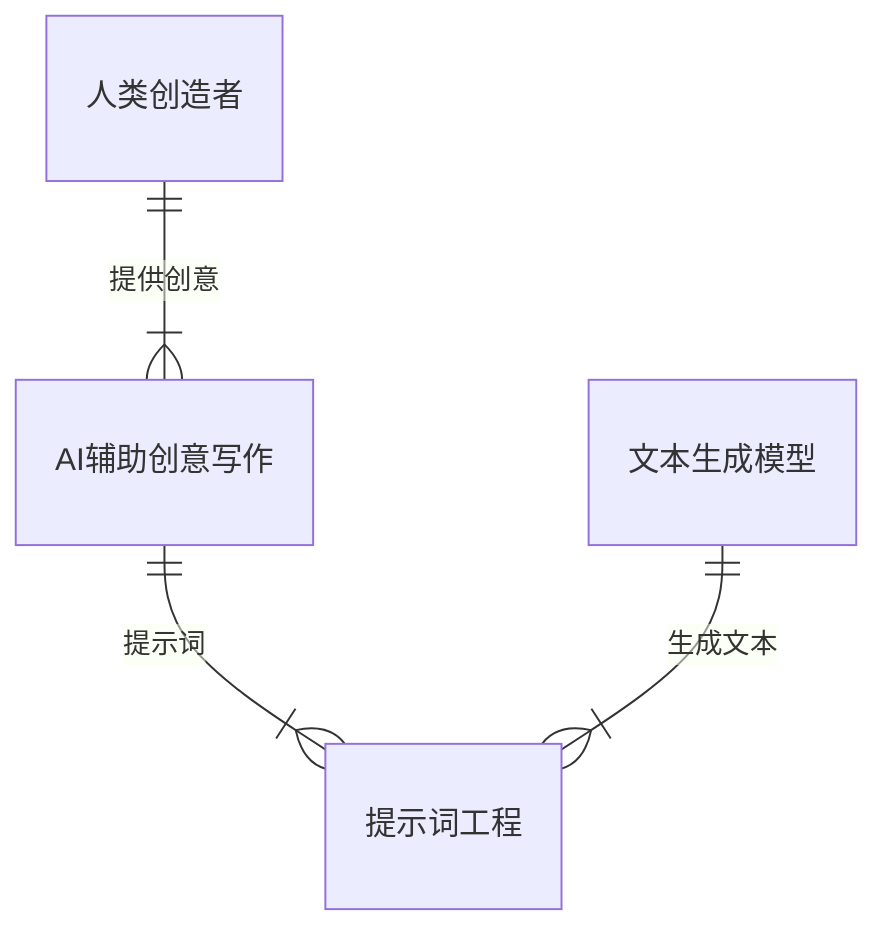

                 

### 第一部分：背景介绍

#### 第1章：问题背景

**问题背景：**  
在人工智能飞速发展的今天，创意写作作为人机协作的新领域，面临着巨大的变革机遇。随着自然语言处理（NLP）、机器学习（ML）和深度学习（DL）技术的不断进步，AI辅助创意写作逐渐成为可能。特别是在文本生成领域，如生成对抗网络（GAN）、递归神经网络（RNN）、变分自编码器（VAE）等模型的应用，使得AI能够生成高质量的文本。

然而，AI辅助创意写作还面临着一些挑战。首先，如何准确地理解人类创意的本质，并将其转化为机器可执行的任务，是一个亟待解决的问题。其次，AI生成的文本质量仍需提升，以确保其能够满足人类的审美和情感需求。此外，如何在AI辅助创意写作中保护用户的隐私和数据安全，也是一个重要的考虑因素。

**问题描述：**  
提示词工程作为AI辅助创意写作的关键技术，其应用现状如何？当前提示词工程在AI辅助创意写作中面临哪些挑战？如何通过理论研究和实际应用，实现提示词工程的突破？

**问题解决：**  
从理论研究和实际应用出发，本文将探讨提示词工程在AI辅助创意写作中的突破路径。首先，将介绍提示词工程和AI辅助创意写作的核心概念。接着，通过对比不同文本生成模型的属性特点，分析提示词工程的优势和应用场景。然后，详细讲解文本生成模型和提示词工程的原理，使用mermaid绘制流程图和Python源代码进行阐述。此外，还将介绍系统分析与架构设计的方法，包括系统功能设计、接口设计和交互设计。最后，通过项目实战，展示如何实现AI辅助创意写作系统，并提供最佳实践和项目小结。

#### 第2章：核心概念

**概念介绍：**  
- **提示词工程（Prompt Engineering）：** 提示词工程是一种基于人类创造性的技术，旨在提高AI生成文本的质量和创意性。通过设计有效的提示词，引导AI生成符合人类需求和预期的文本。
- **AI辅助创意写作（AI-Assisted Creative Writing）：** AI辅助创意写作是指利用人工智能技术，辅助人类进行创意写作的过程。包括文本生成、文本编辑、文本润色等环节。
- **文本生成模型（Text Generation Model）：** 文本生成模型是一种能够生成文本的机器学习模型，包括生成式模型和判别式模型。常见的文本生成模型有生成对抗网络（GAN）、递归神经网络（RNN）、变分自编码器（VAE）等。

**概念属性对比：**  
以下是几种常见文本生成模型的属性特点对比表格：

| 文本生成模型 | 特点 |  
| --- | --- |  
| 生成对抗网络（GAN） | 对抗训练，生成质量高 |  
| 递归神经网络（RNN） | 时序处理能力强，文本生成连贯性高 |  
| 变分自编码器（VAE） | 引入概率模型，生成多样性好 |  
| 自回归语言模型（ARLM） | 基于自回归模型，生成速度快 |

**ER实体关系图：**  
以下是提示词工程与AI辅助创意写作的ER实体关系图：

通过以上核心概念的介绍和属性对比，读者可以初步了解提示词工程在AI辅助创意写作中的作用和地位。接下来，本文将深入探讨文本生成模型和提示词工程的原理，为后续内容的展开奠定基础。

