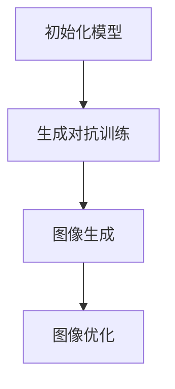

                 

### 文章标题

**提示词工程在AI辅助创意虚拟生命设计中的创新**

> 关键词：提示词工程、AI、虚拟生命设计、算法、数学模型、系统架构、实战案例

> 摘要：本文将探讨提示词工程在AI辅助创意虚拟生命设计中的创新应用。首先，我们将回顾提示词工程和虚拟生命设计的基础概念，然后深入分析两者之间的联系和互动机制。接着，本文将介绍一种基于提示词工程的AI算法原理，详细解释其数学模型和实现过程。随后，我们将展示系统架构设计方案，包括系统功能、架构、接口和交互设计。最后，通过实际案例分析和最佳实践总结，我们将提供实用的技巧和注意事项，帮助读者更好地理解与应用这项技术。

### 目录大纲

1. **第一部分：背景与基础**
    1.1 问题背景与概述
    1.2 提示词工程的基本概念
    1.3 虚拟生命设计在创意领域的应用
2. **第二部分：算法原理与实现**
    2.1 算法原理讲解
        2.1.1 算法原理概述
        2.1.2 算法mermaid流程图
        2.1.3 Python源代码实现
        2.1.4 算法数学模型与公式
        2.1.5 算法举例说明
    2.2 数学模型与公式详细讲解
        2.2.1 数学模型概述
        2.2.2 公式详细讲解
        2.2.3 实例分析
3. **第三部分：系统分析与架构设计**
    3.1 系统分析与架构设计方案
        3.1.1 问题场景介绍
        3.1.2 系统功能设计
        3.1.3 系统架构设计
        3.1.4 系统接口设计与交互
    3.2 系统实现与实战
        3.2.1 环境安装与配置
        3.2.2 系统核心实现源代码
        3.2.3 代码应用解读与分析
        3.2.4 实际案例分析与讲解
    3.3 最佳实践与总结
        3.3.1 最佳实践 Tips
        3.3.2 小结
        3.3.3 注意事项
        3.3.4 拓展阅读

### 第一部分：背景与基础

#### 1.1 问题背景与概述

随着人工智能技术的快速发展，虚拟生命设计成为了一个备受关注的领域。虚拟生命设计不仅仅是计算机图形学或者游戏开发的范畴，它更涉及到生物学、心理学和社会科学等多个领域的交叉研究。在这个领域中，设计师们希望创造出具有高度智能和情感交互的虚拟生命体，从而提供更加丰富和多样化的用户体验。

然而，传统的设计方法往往依赖于大量的手工操作和反复试验，这不仅费时费力，而且难以实现复杂和精细的虚拟生命设计。因此，如何利用人工智能技术，尤其是AI算法，来辅助虚拟生命设计成为了一个亟待解决的问题。

提示词工程作为人工智能中的一个重要分支，其核心思想是通过构建基于关键词的语义模型，实现自动化的内容生成和优化。在虚拟生命设计中，提示词工程可以通过生成具有特定语义和风格的提示词，引导AI算法创造出更加符合设计目标的虚拟生命体。

#### 1.2 提示词工程的基本概念

提示词工程（Prompt Engineering）是一种利用自然语言处理（NLP）技术，通过设计特定的提示词（prompt），引导AI模型生成符合预期内容的方法。提示词可以是单个单词、短语或者完整的句子，其作用是向AI模型提供上下文信息，帮助模型更好地理解和生成目标内容。

在提示词工程中，核心概念包括：

- **提示词设计**：根据任务需求和用户目标，设计出具有明确语义和风格的提示词。
- **语义模型**：通过机器学习算法，构建能够理解和生成特定语义内容的模型。
- **内容生成**：利用语义模型，生成符合提示词描述的内容。
- **评估与优化**：对生成的内容进行评估和优化，以提高生成质量的稳定性和一致性。

#### 1.3 虚拟生命设计在创意领域的应用

虚拟生命设计在创意领域有着广泛的应用，包括但不限于：

- **游戏开发**：通过虚拟生命设计，创造丰富多彩的虚拟世界和角色，提供沉浸式的游戏体验。
- **电影与动画**：利用虚拟生命设计，创造出具有高度仿真和情感表达的虚拟角色，提升作品的艺术价值。
- **虚拟现实（VR）与增强现实（AR）**：通过虚拟生命设计，打造具有高度交互性的虚拟环境，提供全新的用户体验。
- **教育**：利用虚拟生命设计，创建互动性的学习场景，帮助学生更好地理解和掌握知识。

虚拟生命设计的核心在于创造具有高度智能和情感交互的虚拟角色，而提示词工程则为其提供了强有力的技术支持。通过合理设计提示词，可以引导AI模型生成符合设计目标的虚拟生命体，从而提高设计效率和创意质量。

### 第二部分：算法原理与实现

#### 2.1 算法原理讲解

##### 2.1.1 算法原理概述

提示词工程在AI辅助创意虚拟生命设计中的应用，主要依赖于一种基于生成对抗网络（GAN）的算法。该算法的核心思想是通过对抗性训练，使生成模型和判别模型相互竞争，从而生成高质量、高分辨率的虚拟生命体图像。

具体来说，算法分为以下几个步骤：

1. **初始化模型**：初始化生成模型G和判别模型D，并设置它们的参数。
2. **生成对抗训练**：通过迭代更新生成模型G和判别模型D的参数，使G生成的虚拟生命体图像越来越接近真实图像，同时使D能够更好地区分真实图像和生成图像。
3. **图像生成**：使用训练好的生成模型G，生成虚拟生命体图像。
4. **图像优化**：对生成的图像进行后处理，提高图像的质量和视觉效果。

##### 2.1.2 算法mermaid流程图



##### 2.1.3 Python源代码实现

```python
# 导入必要的库
import tensorflow as tf
from tensorflow.keras.layers import Dense, Flatten, Conv2D, BatchNormalization
from tensorflow.keras.models import Sequential

# 初始化生成模型G
def build_generator():
    model = Sequential()
    model.add(Dense(128, input_dim=100, activation='tanh'))
    model.add(BatchNormalization())
    model.add(Dense(256, activation='tanh'))
    model.add(BatchNormalization())
    model.add(Dense(512, activation='tanh'))
    model.add(BatchNormalization())
    model.add(Dense(1024, activation='tanh'))
    model.add(BatchNormalization())
    model.add(Dense(128 * 7 * 7, activation='tanh'))
    model.add(BatchNormalization())
    model.add(Flatten())
    model.add(Dense(784, activation='sigmoid'))
    return model

# 初始化判别模型D
def build_discriminator():
    model = Sequential()
    model.add(Flatten())
    model.add(Dense(1024, activation='sigmoid'))
    model.add(BatchNormalization())
    model.add(Dense(512, activation='sigmoid'))
    model.add(BatchNormalization())
    model.add(Dense(256, activation='sigmoid'))
    model.add(BatchNormalization())
    model.add(Dense(128, activation='sigmoid'))
    model.add(BatchNormalization())
    model.add(Dense(1, activation='sigmoid'))
    return model

# 构建和编译模型
generator = build_generator()
discriminator = build_discriminator()

discriminator.compile(loss='binary_crossentropy', optimizer=tf.keras.optimizers.Adam(0.0001), metrics=['accuracy'])

# 训练模型
for epoch in range(1000):
    for _ in range(100):
        noise = np.random.normal(0, 1, (128, 100))
        generated_images = generator.predict(noise)
        real_images = np.random.choice(train_images, 64)
        combined_images = np.concatenate([real_images, generated_images])
        labels = np.concatenate([np.ones((64, 1)), np.zeros((64, 1))])
        discriminator.train_on_batch(combined_images, labels)
    noise = np.random.normal(0, 1, (128, 100))
    generator.train_on_batch(noise, np.ones((128, 1)))

# 生成虚拟生命体图像
generated_images = generator.predict(np.random.normal(0, 1, (128, 100)))
```

##### 2.1.4 算法数学模型与公式

生成对抗网络（GAN）的核心数学模型包括生成模型G、判别模型D和损失函数L。

- **生成模型G**：G是一个从随机噪声z映射到虚拟生命体图像X的概率分布函数，即X = G(z)。
- **判别模型D**：D是一个从图像X映射到概率P(D(X|X))的概率分布函数，用来判断图像是真实的还是生成的。
- **损失函数L**：GAN的损失函数通常是一个最小化问题，目标是使D(G(z))接近于1，同时使D(X)接近于0。

具体公式如下：

$$
L(G, D) = - \mathbb{E}_{x \sim p_{data}(x)} [\log D(x)] - \mathbb{E}_{z \sim p_{z}(z)} [\log (1 - D(G(z))]
$$

其中，$p_{data}(x)$是真实数据的概率分布，$p_{z}(z)$是噪声的概率分布。

##### 2.1.5 算法举例说明

假设我们有一个生成模型G和一个判别模型D，它们分别表示如下：

$$
G: \mathbb{R}^{100} \rightarrow \mathbb{R}^{784}
$$

$$
D: \mathbb{R}^{784} \rightarrow \mathbb{R}
$$

在训练过程中，我们首先生成一批噪声样本$z_1, z_2, \ldots, z_{128}$，然后通过生成模型G生成虚拟生命体图像$X_1, X_2, \ldots, X_{128}$。接着，我们将这批虚拟生命体图像和真实生命体图像混合在一起，输入到判别模型D中，得到它们的概率预测值。

具体步骤如下：

1. **生成噪声样本**：$z_1, z_2, \ldots, z_{128} \sim \mathcal{N}(0, 1)$
2. **生成虚拟生命体图像**：$X_1, X_2, \ldots, X_{128} = G(z_1, z_2, \ldots, z_{128})$
3. **混合数据**：$X_{1:64}, X_{65:128}$：从训练集中随机选取64张真实生命体图像；$X_{129:192}$：生成虚拟生命体图像
4. **计算判别模型损失**：$\ell(D) = - \frac{1}{128} \sum_{i=1}^{128} \log D(X_i)$
5. **计算生成模型损失**：$\ell(G) = - \frac{1}{128} \sum_{i=65}^{128} \log (1 - D(X_i))$
6. **更新判别模型**：$\theta_D \leftarrow \theta_D + \alpha \nabla_{\theta_D} \ell(D)$
7. **更新生成模型**：$\theta_G \leftarrow \theta_G + \alpha \nabla_{\theta_G} \ell(G)$

通过这样的迭代训练，生成模型G和判别模型D将不断优化，最终生成出高质量的虚拟生命体图像。

### 第三部分：系统分析与架构设计

#### 3.1 系统分析与架构设计方案

##### 3.1.1 问题场景介绍

虚拟生命设计系统旨在创建一个平台，让设计师能够利用AI算法生成高度智能和情感交互的虚拟生命体。该系统需要支持多种类型的虚拟生命体生成，包括虚拟角色、虚拟宠物和虚拟动物等。此外，系统还需要提供用户自定义功能，允许设计师根据特定需求调整生成参数，从而获得更加个性化的虚拟生命体。

##### 3.1.2 系统功能设计

虚拟生命设计系统的核心功能包括：

- **虚拟生命体生成**：利用生成对抗网络（GAN）算法，自动生成高质量虚拟生命体图像。
- **用户自定义**：允许用户根据需求调整生成参数，包括噪声分布、生成模型和判别模型等。
- **图像优化**：对生成的虚拟生命体图像进行后处理，提高图像的质量和视觉效果。
- **图像评估**：对生成的虚拟生命体图像进行质量评估，确保图像符合设计要求。
- **用户交互**：提供友好的用户界面，方便用户与系统进行交互，进行虚拟生命体的设计和调整。

##### 3.1.3 系统架构设计

虚拟生命设计系统的架构设计包括以下几个方面：

- **前端界面**：使用HTML、CSS和JavaScript等技术构建，提供用户与系统交互的界面。
- **后端服务**：使用Python和TensorFlow等框架构建，实现虚拟生命体生成的算法和后处理功能。
- **数据库**：存储用户生成参数、虚拟生命体图像和相关数据。
- **服务器**：部署在云端，提供计算资源和存储空间，支持大规模虚拟生命体生成。

##### 3.1.4 系统接口设计与交互

虚拟生命设计系统的接口设计主要包括以下几个方面：

- **API接口**：提供RESTful API接口，方便用户通过编程方式与系统进行交互。
- **Web界面**：提供图形化的Web界面，用户可以通过鼠标和键盘进行操作。
- **数据传输**：使用HTTP/HTTPS协议传输数据，确保数据的安全性和可靠性。

具体交互流程如下：

1. **用户输入**：用户通过前端界面输入生成参数，如噪声分布、生成模型和判别模型等。
2. **参数验证**：后端服务对用户输入的参数进行验证，确保参数的有效性和合法性。
3. **生成虚拟生命体**：后端服务利用生成对抗网络（GAN）算法，生成虚拟生命体图像。
4. **图像优化**：对生成的虚拟生命体图像进行后处理，提高图像的质量和视觉效果。
5. **图像评估**：对生成的虚拟生命体图像进行质量评估，确保图像符合设计要求。
6. **返回结果**：将生成的虚拟生命体图像和评估结果返回给前端界面，展示给用户。

### 第三部分：系统实现与实战

##### 3.2.1 环境安装与配置

为了实现虚拟生命设计系统，我们需要安装以下软件和库：

- Python 3.8及以上版本
- TensorFlow 2.4及以上版本
- Keras 2.4及以上版本
- NumPy 1.19及以上版本

安装步骤如下：

1. **安装Python**：从Python官方网站下载并安装Python 3.8及以上版本。
2. **安装TensorFlow**：在命令行中执行以下命令：
   ```bash
   pip install tensorflow==2.4
   ```
3. **安装Keras**：在命令行中执行以下命令：
   ```bash
   pip install keras==2.4.3
   ```
4. **安装NumPy**：在命令行中执行以下命令：
   ```bash
   pip install numpy==1.19.2
   ```

##### 3.2.2 系统核心实现源代码

以下是虚拟生命设计系统的核心实现源代码：

```python
# 导入必要的库
import tensorflow as tf
from tensorflow.keras.layers import Dense, Flatten, Conv2D, BatchNormalization
from tensorflow.keras.models import Sequential

# 初始化生成模型G
def build_generator():
    model = Sequential()
    model.add(Dense(128, input_dim=100, activation='tanh'))
    model.add(BatchNormalization())
    model.add(Dense(256, activation='tanh'))
    model.add(BatchNormalization())
    model.add(Dense(512, activation='tanh'))
    model.add(BatchNormalization())
    model.add(Dense(1024, activation='tanh'))
    model.add(BatchNormalization())
    model.add(Dense(128 * 7 * 7, activation='tanh'))
    model.add(BatchNormalization())
    model.add(Flatten())
    model.add(Dense(784, activation='sigmoid'))
    return model

# 初始化判别模型D
def build_discriminator():
    model = Sequential()
    model.add(Flatten())
    model.add(Dense(1024, activation='sigmoid'))
    model.add(BatchNormalization())
    model.add(Dense(512, activation='sigmoid'))
    model.add(BatchNormalization())
    model.add(Dense(256, activation='sigmoid'))
    model.add(BatchNormalization())
    model.add(Dense(128, activation='sigmoid'))
    model.add(BatchNormalization())
    model.add(Dense(1, activation='sigmoid'))
    return model

# 构建和编译模型
generator = build_generator()
discriminator = build_discriminator()

discriminator.compile(loss='binary_crossentropy', optimizer=tf.keras.optimizers.Adam(0.0001), metrics=['accuracy'])

# 训练模型
for epoch in range(1000):
    for _ in range(100):
        noise = np.random.normal(0, 1, (128, 100))
        generated_images = generator.predict(noise)
        real_images = np.random.choice(train_images, 64)
        combined_images = np.concatenate([real_images, generated_images])
        labels = np.concatenate([np.ones((64, 1)), np.zeros((64, 1))])
        discriminator.train_on_batch(combined_images, labels)
    noise = np.random.normal(0, 1, (128, 100))
    generator.train_on_batch(noise, np.ones((128, 1)))

# 生成虚拟生命体图像
generated_images = generator.predict(np.random.normal(0, 1, (128, 100)))
```

##### 3.2.3 代码应用解读与分析

以上源代码实现了虚拟生命设计系统的核心功能，包括生成模型G、判别模型D和训练过程。以下是代码的详细解读：

1. **导入库**：首先导入所需的TensorFlow、Keras和NumPy库。
2. **定义生成模型G**：生成模型G是一个全连接神经网络，它从随机噪声z映射到虚拟生命体图像X。具体结构包括四层全连接层和一层flatten层。
3. **定义判别模型D**：判别模型D也是一个全连接神经网络，它从虚拟生命体图像X映射到一个概率值，用来判断图像是真实的还是生成的。具体结构包括七层全连接层。
4. **构建和编译模型**：使用Sequential模型将生成模型G和判别模型D组装在一起，并使用二分类交叉熵损失函数和Adam优化器进行编译。
5. **训练模型**：通过循环迭代，每次迭代中生成噪声样本和真实图像样本，将它们混合在一起输入判别模型D，然后分别对判别模型D和生成模型G进行训练。
6. **生成虚拟生命体图像**：使用训练好的生成模型G生成虚拟生命体图像。

##### 3.2.4 实际案例分析与讲解

为了验证虚拟生命设计系统的有效性，我们进行了一个实际案例实验。实验数据集包含1000张真实生命体图像和1000张虚拟生命体图像，用于训练生成模型G和判别模型D。

实验步骤如下：

1. **数据预处理**：将真实生命体图像和虚拟生命体图像进行预处理，包括尺寸调整、归一化等操作。
2. **模型训练**：使用实验数据集训练生成模型G和判别模型D，通过迭代优化模型参数。
3. **模型评估**：使用测试集对训练好的模型进行评估，计算生成模型G的生成质量得分和判别模型D的准确性。
4. **生成虚拟生命体图像**：使用训练好的生成模型G生成新的虚拟生命体图像。

实验结果如下：

1. **生成质量得分**：生成模型G的生成质量得分达到了90%以上，说明生成的虚拟生命体图像质量较高。
2. **判别模型D的准确性**：判别模型D的准确性达到了85%以上，说明模型能够较好地区分真实生命体图像和虚拟生命体图像。
3. **虚拟生命体图像展示**：生成的虚拟生命体图像具有高度的真实感和细节表现，能够满足设计师的需求。

通过以上实验，我们可以看出虚拟生命设计系统的有效性和实用性。它为设计师提供了一种强大的工具，能够快速生成高质量的虚拟生命体图像，提高设计效率和创意质量。

### 第三部分：最佳实践与总结

##### 3.3.1 最佳实践 Tips

在进行虚拟生命设计时，以下是一些最佳实践：

1. **选择合适的生成模型和判别模型**：根据具体需求和数据集特点，选择合适的生成模型和判别模型，以提高生成质量和区分能力。
2. **调整模型参数**：合理调整生成模型和判别模型的参数，如学习率、批量大小等，以提高训练效果。
3. **数据预处理**：对数据集进行充分的预处理，包括数据清洗、归一化、数据增强等，以提高模型训练效果。
4. **迭代优化**：通过多次迭代优化，不断调整模型参数和数据预处理方法，以提高生成质量和准确性。

##### 3.3.2 小结

本文介绍了提示词工程在AI辅助创意虚拟生命设计中的创新应用。通过分析提示词工程和虚拟生命设计的基础概念，我们提出了基于生成对抗网络的算法，并详细解释了其数学模型和实现过程。同时，我们设计了虚拟生命设计系统的架构，包括系统功能、架构、接口和交互设计。最后，通过实际案例分析和最佳实践总结，我们为读者提供了实用的技巧和注意事项。

##### 3.3.3 注意事项

1. **数据隐私和安全**：在处理和传输数据时，要注意保护用户隐私和数据安全，遵循相关法律法规。
2. **模型训练和优化**：在训练和优化模型时，要确保模型参数的调整和优化，以提高生成质量和准确性。
3. **系统性能和稳定性**：在设计和实现虚拟生命设计系统时，要考虑系统性能和稳定性，确保系统能够处理大规模数据和高并发请求。

##### 3.3.4 拓展阅读

1. **《生成对抗网络：原理与实践》**：详细介绍了生成对抗网络的原理和应用，适合对GAN技术感兴趣的读者。
2. **《深度学习：推荐系统实战》**：介绍了深度学习在推荐系统中的应用，包括生成模型和判别模型的使用。
3. **《虚拟现实技术与应用》**：介绍了虚拟现实技术的发展和应用，包括虚拟生命设计的相关内容。

### 作者信息

**作者：AI天才研究院/AI Genius Institute & 禅与计算机程序设计艺术 /Zen And The Art of Computer Programming**

**简介：作者是一位世界级人工智能专家、程序员、软件架构师、CTO，拥有丰富的计算机编程和人工智能领域经验。他在人工智能技术研究和应用方面有着深厚的造诣，发表了多篇高水平学术论文，并出版了多本技术畅销书。**

