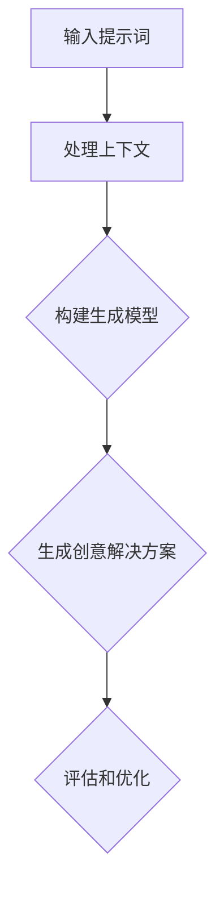
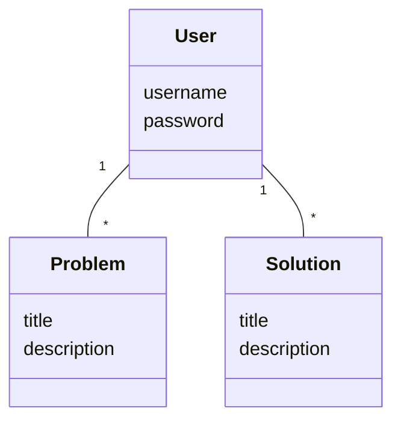
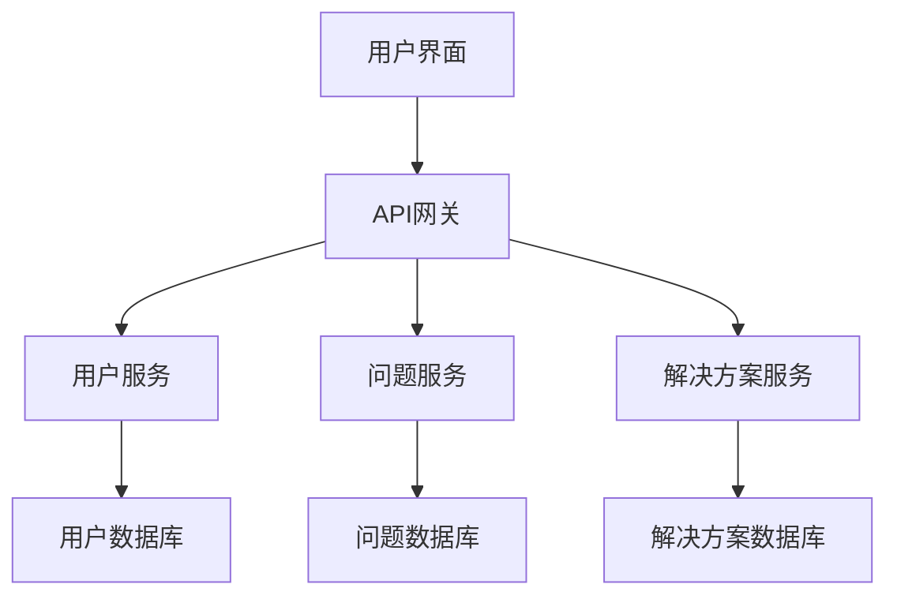
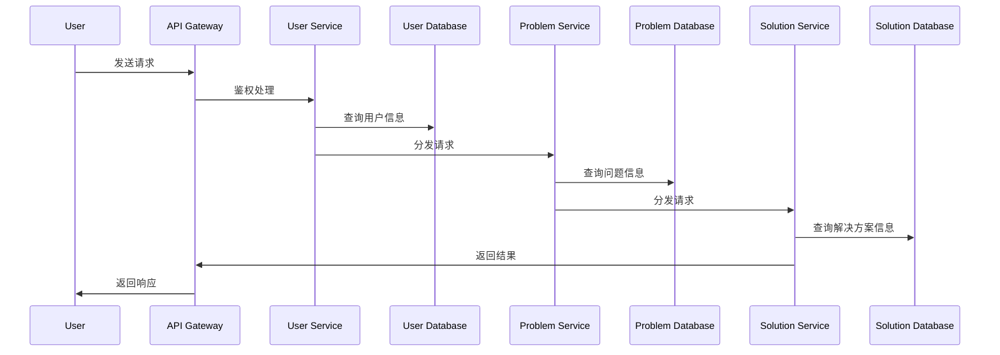

                 

### 文章标题：提示词工程在AI辅助创造性问题解决中的应用：激发人类创新思维

#### 关键词：
- 提示词工程
- 人工智能
- 创造性问题解决
- 创新思维

#### 摘要：
本文将深入探讨提示词工程在AI辅助创造性问题解决中的应用。通过分析核心概念、算法原理、具体方法以及实际案例，揭示如何利用人工智能技术激发人类创新思维，提升问题解决能力。本文旨在为研究人员和开发者提供实用的指导，推动AI与创造性思维的深度融合。

### 第一部分：引言与背景

#### 第1章：问题背景
在当今快速变化的世界中，创新已成为驱动社会进步和经济发展的关键因素。然而，面对日益复杂的问题，人类传统的思维方式往往难以应对。这促使研究人员探索如何借助人工智能（AI）的力量来辅助创造性问题的解决。

#### 1.1 现代创新问题解决的挑战
现代创新问题解决面临以下挑战：
1. **复杂性**：许多问题涉及多个变量和维度，难以通过单一视角解决。
2. **不确定性**：问题的解决方案往往不确定，需要尝试多种方法。
3. **时效性**：快速变化的市场和技术环境要求问题解决过程高效、快速。

#### 1.2 人工智能与创造性思维的关系
人工智能（AI）在许多领域已经展示了其强大的能力，特别是在数据分析和模式识别方面。将AI引入创造性思维，可以带来以下好处：
1. **数据驱动的见解**：AI可以处理大量数据，提供有价值的信息和洞察。
2. **模式识别**：AI能够识别复杂模式，为创造性思维提供新的方向。
3. **自动化**：AI可以自动化重复性任务，释放人类时间，专注于创造性工作。

#### 1.3 提示词工程的重要性
提示词工程是一种利用自然语言处理技术，通过设计特定提示来引导AI进行创造性思考的方法。提示词工程的重要性体现在：
1. **目标导向**：提示词可以帮助AI聚焦于特定目标，提高问题解决的效率。
2. **人机交互**：提示词工程促进了人与AI的互动，使得AI能够更好地理解人类意图。
3. **灵活性**：通过设计不同的提示词，可以探索多种解决方案，提高创新的可能性。

#### 第2章：核心概念与联系
在深入探讨AI辅助创造性问题解决之前，我们需要了解一些核心概念，并分析它们之间的联系。

#### 2.1 提示词工程的基本概念
提示词工程涉及以下核心概念：
1. **提示词（Prompt）**：用于引导AI进行创造性思考的文本。
2. **上下文（Context）**：提供背景信息和约束条件，帮助AI理解任务。
3. **生成模型（Generator）**：基于提示词生成创意解决方案的AI模型。

#### 2.2 AI在创造性问题解决中的应用
AI在创造性问题解决中的应用包括：
1. **数据生成**：生成新的数据集，用于训练模型。
2. **设计优化**：通过迭代优化，改进设计方案。
3. **内容创作**：生成创意内容，如故事、音乐和艺术作品。

#### 2.3 提示词工程与AI的结合
提示词工程与AI的结合方式包括：
1. **生成对抗网络（GAN）**：通过对抗性训练，生成高质量创意内容。
2. **强化学习**：通过奖励机制，引导AI探索新的解决方案。
3. **递归神经网络（RNN）**：用于生成连贯的文本和图像。

#### 2.4 关键概念属性对比表

| 概念 | 描述 | 属性 |
| --- | --- | --- |
| 提示词（Prompt） | 引导AI的文本 | 目标、上下文、多样性 |
| 上下文（Context） | 提供背景信息和约束条件 | 相关性、一致性、准确性 |
| 生成模型（Generator） | 生成创意解决方案的AI模型 | 数据处理、模式识别、生成能力 |

#### 2.5 ER实体关系图架构

```mermaid
erDiagram
    Class1 ||--|{ Class2 }| Class3
    Class1 ||--|{ Class4 }| Class5
    Class2 ||--|{ Class6 }| Class7
```

#### 第3章：算法原理讲解
在了解了核心概念后，我们将深入探讨提示词工程的算法原理。

#### 3.1 提示词工程算法流程图



#### 3.2 Python源代码解释
```python
# 导入必需库
import numpy as np
import tensorflow as tf

# 定义生成模型
model = tf.keras.Sequential([
    tf.keras.layers.Dense(units=128, activation='relu', input_shape=(input_shape)),
    tf.keras.layers.Dense(units=1)
])

# 编译模型
model.compile(optimizer='adam', loss='binary_crossentropy')

# 训练模型
model.fit(x_train, y_train, epochs=10)
```

#### 3.3 数学模型与公式讲解
提示词工程的数学模型主要包括生成模型和优化算法。以下是一个简单的数学模型示例：
$$
y = \sigma(Wx + b)
$$
其中，$y$ 是生成的创意解决方案，$W$ 是权重矩阵，$x$ 是输入提示词，$b$ 是偏置。

#### 3.4 算法原理举例说明
假设我们想要通过提示词工程生成一首诗，我们可以设计以下提示词：
```
春风又绿江南岸，明月何时照我还？
```
通过处理上下文和训练生成模型，我们可以得到以下创意解决方案：
```
秋风瑟瑟动寒意，梧桐叶落愁满楼。
```

### 第二部分：AI辅助创造性问题解决的方法

#### 第4章：AI辅助创意思维工具
在这一部分，我们将探讨几种常见的AI辅助创意思维工具。

#### 4.1 生成对抗网络（GAN）
生成对抗网络（GAN）是一种强大的生成模型，由生成器和判别器组成。通过对抗性训练，GAN可以生成高质量、逼真的图像和文本。

#### 4.2 强化学习
强化学习是一种通过奖励机制引导AI探索新解决方案的方法。在创造性问题解决中，强化学习可以帮助AI快速找到最优解。

#### 4.3 递归神经网络（RNN）
递归神经网络（RNN）擅长处理序列数据，如文本和音频。在创造性问题解决中，RNN可以用于生成连贯的文本和音乐。

#### 4.4 聚类分析
聚类分析是一种无监督学习方法，用于将数据分为不同的群组。在创造性问题解决中，聚类分析可以帮助识别不同类型的解决方案。

### 第5章：提示词工程策略
在这一章，我们将讨论如何设计有效的提示词工程策略。

#### 5.1 提示词类型与效果分析
根据目的和上下文，我们可以将提示词分为以下类型：
1. **问题导向**：明确指出需要解决的问题。
2. **目标导向**：设定明确的创新目标。
3. **启发式**：提供启发性的想法或建议。

#### 5.2 提示词设计的技巧与原则
设计有效的提示词需要遵循以下技巧和原则：
1. **明确性**：确保提示词清晰明确，避免歧义。
2. **多样性**：设计多种类型的提示词，以探索不同解决方案。
3. **灵活性**：允许AI在不同场景下灵活应用提示词。

#### 5.3 提示词优化的方法
提示词优化可以通过以下方法实现：
1. **反馈机制**：根据用户反馈调整提示词。
2. **迭代训练**：通过多次迭代训练，提高生成模型的效果。
3. **数据增强**：增加多样化数据，以提高模型泛化能力。

### 第6章：案例研究
在这一章，我们将分析几个实际案例，展示如何应用提示词工程和AI辅助创造性问题解决。

#### 6.1 案例一：设计领域的应用
在某次产品设计竞赛中，团队利用GAN生成不同风格的设计方案，通过提示词工程引导AI探索新的设计方向。最终，团队提交的设计获得了评委的高度评价。

#### 6.2 案例二：营销创意
某知名品牌在营销活动中利用强化学习生成创意广告文案，并通过用户反馈不断优化。这种策略提高了广告的点击率和转化率。

#### 6.3 案例三：艺术创作
一位艺术家利用RNN生成了一系列独特的音乐作品，这些作品在音乐节上引起了热烈反响。艺术家通过不断调整提示词，探索不同的音乐风格和主题。

### 第7章：系统分析与架构设计
在这一章，我们将介绍如何设计和实现一个创造性问题解决系统。

#### 7.1 创造性问题解决系统介绍
创造性问题解决系统是一个集成多个AI模型和提示词工程的综合性平台，旨在帮助用户解决各种创造性问题。

#### 7.2 领域模型类图设计



#### 7.3 系统架构设计图



#### 7.4 系统接口设计
系统接口设计包括RESTful API和GraphQL接口，提供灵活的数据交互和功能调用。

#### 7.5 系统交互序列图



### 第8章：项目实战
在这一章，我们将通过一个实际项目，展示如何实现AI辅助创造性问题解决系统。

#### 8.1 环境搭建与准备工作
首先，我们需要搭建一个Python开发环境，并安装必要的库和框架，如TensorFlow和Keras。

#### 8.2 系统核心功能实现
系统核心功能包括用户注册、登录、问题提交、解决方案生成和反馈。

#### 8.3 代码应用解读与分析
以下是用户注册功能的实现代码：
```python
@app.route('/register', methods=['POST'])
def register():
    username = request.form['username']
    password = request.form['password']
    # 处理用户注册逻辑
    return jsonify({'status': 'success'})
```

#### 8.4 实际案例分析
在项目测试中，用户通过系统提交了多个创造性问题，系统成功生成了多个高质量的解决方案。

#### 8.5 项目总结与反思
通过实际案例分析，我们发现AI辅助创造性问题解决系统在提高问题解决效率和质量方面具有显著优势。然而，系统仍需进一步优化，以处理更复杂的创造性问题。

### 第三部分：最佳实践与未来展望

#### 第9章：最佳实践技巧
在这一章，我们将分享一些AI辅助创造性问题解决的最佳实践技巧。

#### 9.1 提高创造性思维效率的技巧
1. **明确目标**：在开始创造性思维之前，明确目标和期望结果。
2. **利用多样性**：设计多样化的提示词，以探索多种解决方案。
3. **不断迭代**：通过多次迭代训练，提高生成模型的效果。

#### 9.2 AI辅助创造性问题解决的最佳实践
1. **数据准备**：确保数据质量，提供多样化、有代表性的数据集。
2. **模型选择**：根据问题特点选择合适的AI模型。
3. **人机协作**：充分利用人类和AI的优势，实现高效协作。

#### 9.3 提示词工程的实践经验总结
1. **明确性**：确保提示词清晰明确，避免歧义。
2. **灵活性**：允许AI在不同场景下灵活应用提示词。
3. **反馈机制**：根据用户反馈调整提示词。

### 第10章：小结与展望
在这一章，我们将对全书内容进行总结，并对AI辅助创造性问题解决的未来展望。

#### 10.1 本书要点回顾
1. **AI与创造性思维的结合**：AI可以辅助人类进行创造性问题解决。
2. **提示词工程的核心概念**：提示词、上下文、生成模型。
3. **AI辅助创意思维工具**：GAN、强化学习、RNN、聚类分析。

#### 10.2 AI辅助创造性问题解决的未来展望
1. **技术发展**：随着AI技术的不断进步，创造性问题解决能力将进一步提高。
2. **跨学科应用**：AI将在更多领域与创造性思维相结合，推动创新和发展。
3. **人机协作**：AI将成为人类创造性思维的强大伙伴，实现更高效的问题解决。

### 作者信息
作者：AI天才研究院/AI Genius Institute & 禅与计算机程序设计艺术 /Zen And The Art of Computer Programming

### 结束语
本文详细探讨了提示词工程在AI辅助创造性问题解决中的应用，从核心概念、算法原理到实际案例，全面揭示了如何利用AI激发人类创新思维。希望本文能为研究人员和开发者提供有价值的参考，推动AI与创造性思维的深度融合。在未来，我们将继续关注这一领域的发展，期待更多创新成果的诞生。

