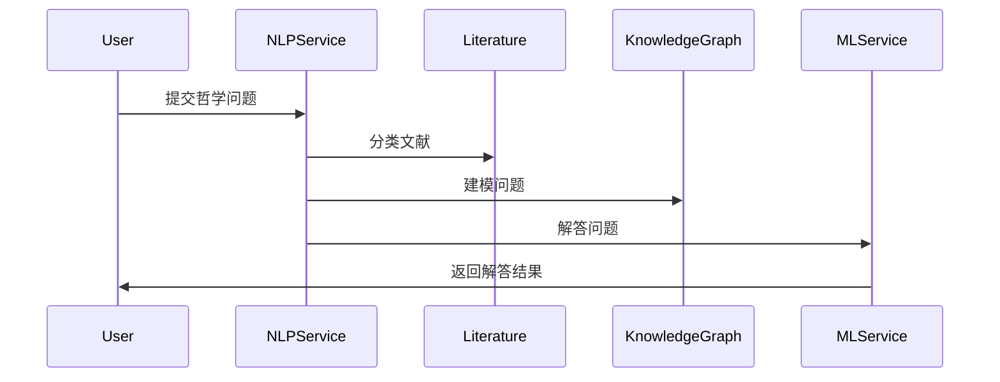

                 

# 提示词工程在AI辅助哲学思辨中的应用：拓展人类思维边界

## 关键词

- 提示词工程
- AI辅助哲学思辨
- 人工智能技术
- 哲学问题解决
- 自然语言处理
- 知识图谱
- 机器学习

## 摘要

本文探讨了提示词工程在AI辅助哲学思辨中的应用，通过分析人工智能技术的核心概念原理，如自然语言处理、知识图谱和机器学习，本文构建了一个系统的框架，以展示如何利用AI技术拓展哲学思考的边界。通过详细阐述概念属性特征对比表格和ER实体关系图架构，本文为读者提供了一个清晰的技术路线，以实现AI辅助哲学思辨的有效性和可行性。此外，本文还讨论了系统的边界与外延，以及概念结构与核心要素组成，旨在为未来的研究提供参考和启示。

## 第一部分：背景介绍

### 1.1 问题背景

随着人工智能技术的快速发展，AI在各个领域的应用越来越广泛。从自动驾驶汽车、智能助手到医疗诊断和金融分析，人工智能已经深刻地改变了我们的生活方式和工作方式。然而，哲学作为一门探究人类思维、意识和存在的学科，一直以来却未能充分利用这些先进的AI技术。哲学问题往往涉及深层次的逻辑推理、语义理解和知识整合，这些正是人工智能所擅长的领域。因此，将AI技术引入哲学思辨，不仅有助于提高哲学研究的效率和准确性，还能拓展人类思维边界，推动哲学理论的创新和发展。

### 1.2 问题描述

AI辅助哲学思辨是指在哲学研究和思考过程中，利用人工智能技术来辅助哲学家进行问题分析和问题解决。这包括但不限于：从大量文献中提取关键信息、构建哲学问题模型、辅助论证和推理等。然而，现有的AI技术在哲学领域中的应用还存在一些问题，如算法理解不足、数据质量不高、模型解释性不强等。这些问题的存在限制了AI在哲学思辨中的应用效果，因此，有必要对这些问题进行深入研究和解决。

### 1.3 问题解决

为了解决上述问题，本书将从以下几个方面展开研究：

#### 1.3.1 核心概念原理

介绍AI辅助哲学思辨的核心概念原理，如自然语言处理、知识图谱、机器学习等。这些概念将帮助读者理解AI技术在哲学领域中的应用原理。

#### 1.3.2 概念属性特征对比表格

通过对比表格，详细阐述AI辅助哲学思辨中涉及的核心概念及其属性特征，帮助读者更好地理解各概念之间的关系和差异。

#### 1.3.3 ER实体关系图架构

利用Mermaid流程图，绘制AI辅助哲学思辨的ER实体关系图架构，明确各实体之间的关联和作用。

#### 1.4 边界与外延

AI辅助哲学思辨的研究边界主要包括：技术实现的可行性、哲学问题的可解析性、数据质量和模型解释性等。同时，本书还将探讨AI辅助哲学思辨在未来的发展趋势和潜力。

#### 1.5 概念结构与核心要素组成

本部分将介绍AI辅助哲学思辨的概念结构和核心要素组成，包括：自然语言处理、知识图谱、机器学习等技术，以及哲学问题模型、论证和推理等应用场景。

## 第一部分：核心概念与联系

### 2.1 AI辅助哲学思辨的核心概念原理

#### 2.1.1 自然语言处理

自然语言处理（NLP）是人工智能的一个重要分支，旨在使计算机能够理解、解释和生成人类语言。在AI辅助哲学思辨中，NLP技术可以帮助计算机从大量文献中提取关键信息，构建哲学问题模型，辅助哲学家进行论证和推理。

**主要特点：**

- **文本分析能力**：NLP技术能够对文本进行分词、词性标注、句法分析等操作，从而提取出文本中的关键信息。
- **语言理解能力**：通过深度学习等方法，NLP技术可以理解文本的含义，从而辅助哲学家进行哲学问题的分析。

**相关算法：**

- **词向量表示**：如Word2Vec、GloVe等。
- **文本分类**：如朴素贝叶斯、支持向量机、深度神经网络等。

**应用场景：**

- **文献资料检索**：利用NLP技术对大量文献进行分类、索引，以便哲学家快速查找相关资料。
- **哲学问题建模**：将哲学问题转化为计算机可以理解的形式，从而利用计算机进行问题分析和推理。

#### 2.1.2 知识图谱

知识图谱是一种语义网络，通过实体和关系来表示知识和信息。在AI辅助哲学思辨中，知识图谱可以帮助计算机理解哲学问题的上下文，辅助哲学家进行问题分析和推理。

**主要特点：**

- **语义表达能力**：知识图谱通过实体和关系来表示知识，具有强大的语义表达能力。
- **推理能力**：基于知识图谱，计算机可以进行逻辑推理，从而辅助哲学家进行问题分析。

**相关算法：**

- **实体抽取**：如命名实体识别、关系抽取等。
- **图谱嵌入**：如图嵌入、图神经网络等。

**应用场景：**

- **哲学问题建模**：将哲学问题转化为知识图谱的形式，从而利用计算机进行问题分析和推理。
- **知识图谱推理**：利用知识图谱进行逻辑推理，辅助哲学家进行哲学问题的探讨。

#### 2.1.3 机器学习

机器学习是一种让计算机从数据中学习规律、自动改进自身性能的方法。在AI辅助哲学思辨中，机器学习可以帮助计算机从哲学家的提问和回答中学习，从而提高问题的解答能力和哲学思考的深度。

**主要特点：**

- **自学习能力**：机器学习可以让计算机从数据中学习，不断优化自身性能。
- **适应性**：机器学习算法可以根据不同的应用场景进行定制和优化。

**相关算法：**

- **监督学习**：如线性回归、支持向量机、深度神经网络等。
- **无监督学习**：如聚类、降维等。

**应用场景：**

- **哲学问题解答**：利用机器学习算法，计算机可以从哲学家的提问和回答中学习，从而提高问题的解答能力。
- **哲学思考深度**：通过机器学习，计算机可以深入理解哲学问题的本质，从而提高哲学思考的深度。

### 2.2 AI辅助哲学思辨中的核心概念联系

在AI辅助哲学思辨中，自然语言处理、知识图谱和机器学习这三种核心技术相互交织，共同构成了一个完整的系统。自然语言处理负责从文本中提取关键信息，知识图谱则将这些信息进行结构化存储和表达，而机器学习则通过对这些信息的分析，提升系统的智能水平。

**自然语言处理与知识图谱的联系：**

自然语言处理是知识图谱构建的基础。通过自然语言处理技术，可以从大量的哲学文献中提取出实体和关系，并将其转化为知识图谱的形式。例如，命名实体识别可以识别出文本中的哲学家、哲学流派、哲学观点等，而关系抽取则可以识别出这些实体之间的关系，如“某哲学家提出了某种哲学观点”。

**知识图谱与机器学习的联系：**

知识图谱为机器学习提供了丰富的数据资源。通过知识图谱，机器学习算法可以更好地理解哲学问题的上下文，从而提高其解决问题的能力。例如，在回答哲学问题时，机器学习算法可以利用知识图谱来查找相关的哲学观点和论证，从而提高回答的准确性和深度。

**自然语言处理与机器学习的联系：**

自然语言处理和机器学习相互促进。自然语言处理技术可以帮助机器学习更好地理解文本数据，从而提高其训练效果。同时，机器学习算法的优化和改进也可以反过来推动自然语言处理技术的发展。

### 2.3 概念属性特征对比表格

为了更好地理解自然语言处理、知识图谱和机器学习在AI辅助哲学思辨中的应用，下面提供了一个概念属性特征对比表格。

| 特征类别 | 自然语言处理 | 知识图谱 | 机器学习 |
| :--: | :--: | :--: | :--: |
| 主要任务 | 文本分析、语言理解 | 实体识别、关系抽取、语义推理 | 数据学习、模型优化、预测分析 |
| 数据形式 | 文本数据 | 实体-关系数据 | 样本-特征数据 |
| 技术难点 | 语言歧义、上下文理解 | 数据准确性、关系建模 | 模型泛化能力、计算效率 |
| 应用效果 | 较高 | 高 | 高 |
| 关联性 | 强 | 强 | 强 |

### 2.4 ER实体关系图架构

为了更清晰地展示AI辅助哲学思辨的系统架构，下面提供了一个ER实体关系图架构的Mermaid流程图。

```mermaid
erDiagram
  PHILOSOPHER ||--|{ KNOWLEDGE_GRAPH : HasKnowledge }
  KNOWLEDGE_GRAPH ||--|{ PHILOSOPHY_QUESTION : Contains }
  PHILOSOPHY_QUESTION ||--|{ QUESTION_ANSWER : HasAnswer }
  PHILOSOPHER ||--|{ QUESTION_ANSWER : ParticipatesIn }
```

在这个ER实体关系图中，哲学家（PHILOSOPHER）拥有知识图谱（KNOWLEDGE_GRAPH），知识图谱包含了哲学问题（PHILOSOPHY_QUESTION），哲学问题又包含了问题的答案（QUESTION_ANSWER）。哲学家参与问题的讨论，回答问题，并通过知识图谱不断积累和更新哲学知识。

### 2.5 边界与外延

AI辅助哲学思辨的研究边界主要包括以下几个方面：

- **技术实现的可行性**：需要评估现有AI技术是否能够满足哲学思辨的需求，如自然语言处理、知识图谱和机器学习技术的成熟度和适用性。
- **哲学问题的可解析性**：需要研究哲学问题的复杂性和多样性，以及如何将这些复杂的问题转化为计算机可以理解和处理的形式。
- **数据质量和模型解释性**：需要保证输入数据的质量和一致性，同时提高模型的解释性和可解释性，以便哲学家能够理解和接受AI的辅助。

### 2.6 概念结构与核心要素组成

AI辅助哲学思辨的概念结构主要包括以下核心要素：

- **自然语言处理**：负责文本分析和语言理解，是构建知识图谱和进行机器学习的基础。
- **知识图谱**：负责结构化存储哲学知识和信息，为机器学习提供丰富的数据资源。
- **机器学习**：负责从哲学家的提问和回答中学习，提升系统的智能水平。

这些核心要素相互关联，共同构成了AI辅助哲学思辨的技术体系，为哲学家的思考和探索提供了强大的工具和支撑。

## 第二部分：算法原理讲解

### 3.1 自然语言处理算法原理

自然语言处理（NLP）是AI辅助哲学思辨的核心技术之一。它通过一系列算法和模型，使得计算机能够理解、处理和生成人类语言。以下是NLP算法的基本原理：

#### 3.1.1 词向量表示

词向量表示是NLP中的一个重要技术，它将单词映射到高维空间中的向量。常见的词向量表示方法包括Word2Vec和GloVe。

- **Word2Vec**：通过训练神经网络模型，将单词映射到高维空间中的向量，使得语义相近的单词在空间中距离较近。其基本原理如下：

  $$ 
  \text{Output} = \text{softmax}(\text{weights} \cdot \text{input_vector}) 
  $$

  其中，输入向量表示单词的嵌入向量，weights表示神经网络的权重。

- **GloVe**：通过优化单词的共现矩阵，学习得到单词的词向量。其基本原理如下：

  $$
  \text{loss} = \frac{1}{2} \sum_{\text{word}, \text{context}} \left( \text{context_vector} \cdot \text{word_vector} - \log \text{context_frequency} \right)^2
  $$

  其中，context_vector和word_vector分别表示单词和其上下文的向量表示，context_frequency表示上下文的出现频率。

#### 3.1.2 文本分类

文本分类是将文本数据按照其内容分类到不同的类别中。常见的文本分类算法包括朴素贝叶斯、支持向量机和深度神经网络。

- **朴素贝叶斯**：基于贝叶斯定理，通过计算每个单词在各个类别中的概率，进行文本分类。其基本原理如下：

  $$
  P(\text{category}|\text{document}) = \frac{P(\text{document}|\text{category})P(\text{category})}{P(\text{document})}
  $$

  其中，P(document|category)表示在某个类别下文本的概率，P(category)表示类别概率。

- **支持向量机**：通过寻找一个最佳的超平面，将不同类别的文本数据分隔开。其基本原理如下：

  $$
  \text{max} \ \frac{1}{\|\text{w}\|} \quad \text{subject to} \ \text{y}^{(i)} (\text{x}^{(i)} \cdot \text{w} + \text{b}) \geq 1
  $$

  其中，x表示文本特征向量，w表示权重向量，b表示偏置。

- **深度神经网络**：通过多层神经网络，对文本进行特征提取和分类。其基本原理如下：

  $$
  \text{output} = \text{激活函数}(\text{神经网络层}(\text{输入特征}))
  $$

  其中，激活函数通常使用ReLU或Sigmoid函数。

#### 3.1.3 应用实例

以哲学文献分类为例，我们可以利用NLP技术对大量哲学文献进行分类，从而帮助哲学家快速查找相关资料。具体步骤如下：

1. **数据预处理**：对哲学文献进行分词、去停用词、词性标注等操作，提取出文本特征。
2. **词向量表示**：利用Word2Vec或GloVe等方法，将文本特征映射到高维空间中的向量。
3. **文本分类**：利用朴素贝叶斯、支持向量机或深度神经网络等算法，对哲学文献进行分类。
4. **模型评估**：通过准确率、召回率、F1分数等指标评估模型的分类效果。

### 3.2 知识图谱算法原理

知识图谱是一种语义网络，通过实体和关系来表示知识和信息。在AI辅助哲学思辨中，知识图谱可以帮助计算机理解哲学问题的上下文，辅助哲学家进行问题分析和推理。

#### 3.2.1 实体抽取

实体抽取是知识图谱构建的第一步，其目的是从文本数据中识别出实体。常见的实体抽取算法包括命名实体识别（NER）和关系抽取。

- **命名实体识别**：通过预训练的模型或规则，从文本中识别出人名、地名、组织名等实体。其基本原理如下：

  $$
  \text{标签序列} = \text{NER模型}(\text{输入文本})
  $$

  其中，输入文本表示待识别的文本，标签序列表示文本中的实体标签。

- **关系抽取**：通过预训练的模型或规则，从文本中识别出实体之间的关系。其基本原理如下：

  $$
  \text{关系序列} = \text{关系抽取模型}(\text{实体对})
  $$

  其中，实体对表示文本中的两个实体，关系序列表示实体之间的关系。

#### 3.2.2 图嵌入

图嵌入是将图中的节点和边映射到低维空间中的向量表示。常见的图嵌入算法包括节点嵌入和边嵌入。

- **节点嵌入**：通过训练神经网络模型，将图中的节点映射到低维空间中的向量。其基本原理如下：

  $$
  \text{output} = \text{激活函数}(\text{神经网络层}(\text{输入节点向量}))
  $$

  其中，输入节点向量表示节点的嵌入向量。

- **边嵌入**：通过训练神经网络模型，将图中的边映射到低维空间中的向量。其基本原理如下：

  $$
  \text{output} = \text{激活函数}(\text{神经网络层}(\text{输入边向量}))
  $$

  其中，输入边向量表示边的嵌入向量。

#### 3.2.3 应用实例

以哲学问题建模为例，我们可以利用知识图谱技术构建哲学问题的知识图谱，从而帮助哲学家进行问题分析和推理。具体步骤如下：

1. **数据预处理**：对哲学文献进行分词、去停用词、词性标注等操作，提取出文本特征。
2. **实体抽取**：利用命名实体识别和关系抽取算法，从文本中识别出实体和关系。
3. **图嵌入**：利用节点嵌入和边嵌入算法，将实体和关系映射到低维空间中的向量。
4. **知识图谱构建**：将实体和关系组织成知识图谱的形式，为哲学家提供问题分析和推理的支持。

### 3.3 机器学习算法原理

机器学习是一种让计算机从数据中学习规律、自动改进自身性能的方法。在AI辅助哲学思辨中，机器学习可以帮助计算机从哲学家的提问和回答中学习，从而提高问题的解答能力和哲学思考的深度。

#### 3.3.1 监督学习

监督学习是一种常见的机器学习方法，通过输入样本和对应的标签来训练模型。常见的监督学习算法包括线性回归、支持向量机和深度神经网络。

- **线性回归**：通过寻找最佳拟合线，预测连续值输出。其基本原理如下：

  $$
  \text{y} = \text{w} \cdot \text{x} + \text{b}
  $$

  其中，x表示输入特征向量，y表示输出标签，w表示权重向量，b表示偏置。

- **支持向量机**：通过寻找最佳的超平面，将不同类别的样本分隔开。其基本原理如下：

  $$
  \text{max} \ \frac{1}{\|\text{w}\|} \quad \text{subject to} \ \text{y}^{(i)} (\text{x}^{(i)} \cdot \text{w} + \text{b}) \geq 1
  $$

  其中，x表示样本特征向量，y表示样本标签，w表示权重向量，b表示偏置。

- **深度神经网络**：通过多层神经网络，对样本进行特征提取和分类。其基本原理如下：

  $$
  \text{output} = \text{激活函数}(\text{神经网络层}(\text{输入特征}))
  $$

  其中，激活函数通常使用ReLU或Sigmoid函数。

#### 3.3.2 无监督学习

无监督学习是一种不需要标签的机器学习方法，通过学习数据的内在结构和规律。常见的无监督学习算法包括聚类和降维。

- **聚类**：将相似的数据点归为一类，从而挖掘数据中的模式。其基本原理如下：

  $$
  \text{最小化} \ \sum_{i=1}^{n} \sum_{j=1}^{m} \|\text{x}_i - \text{c}_j\|
  $$

  其中，xi表示数据点，cj表示聚类中心。

- **降维**：通过降低数据的维度，从而减少计算复杂度和提高计算效率。其基本原理如下：

  $$
  \text{最小化} \ \sum_{i=1}^{n} \sum_{j=1}^{m} \|\text{z}_i - \text{h}_j\|^2
  $$

  其中，zi表示降维后的数据点，hj表示降维空间中的聚类中心。

#### 3.3.3 应用实例

以哲学问题解答为例，我们可以利用机器学习技术，从哲学家的提问和回答中学习，从而提高问题的解答能力和哲学思考的深度。具体步骤如下：

1. **数据预处理**：对哲学家的提问和回答进行预处理，提取出文本特征。
2. **监督学习**：利用线性回归、支持向量机或深度神经网络等算法，对提问和回答进行分类和预测。
3. **无监督学习**：利用聚类和降维等算法，挖掘哲学问题中的模式和规律。
4. **模型评估**：通过准确率、召回率、F1分数等指标评估模型的解答效果。

## 第三部分：系统分析与架构设计方案

### 3.1 问题场景介绍

在哲学研究中，哲学家们经常需要从大量的文献中提取关键信息，构建哲学问题模型，并进行论证和推理。然而，这些任务往往涉及到海量的文本数据，且文本数据的处理和结构化存储是一项复杂的工程。为了解决这个问题，我们可以利用人工智能技术，特别是自然语言处理、知识图谱和机器学习等技术，构建一个AI辅助哲学思辨系统，帮助哲学家高效地进行哲学研究和思考。

### 3.2 项目介绍

本项目的目标是构建一个AI辅助哲学思辨系统，该系统将集成自然语言处理、知识图谱和机器学习等技术，实现对哲学文献的自动分类、问题建模、论证和推理。通过该系统，哲学家可以更轻松地获取相关文献，构建哲学问题模型，并进行深入的哲学思考。

### 3.3 系统功能设计

系统功能设计主要包括以下方面：

1. **文献分类**：利用自然语言处理技术，对哲学文献进行分类，从而帮助哲学家快速查找相关资料。
2. **问题建模**：利用知识图谱技术，将哲学问题转化为结构化的知识图谱，从而辅助哲学家进行问题分析和推理。
3. **论证和推理**：利用机器学习技术，从哲学家的提问和回答中学习，提高问题的解答能力和哲学思考的深度。

### 3.4 系统架构设计

系统架构设计主要包括以下方面：

1. **前端界面**：提供用户交互的界面，用户可以通过界面提交哲学问题和查询相关文献。
2. **后端服务**：包括自然语言处理服务、知识图谱服务和机器学习服务，分别负责文献分类、问题建模和论证推理。
3. **数据库**：存储哲学文献、知识图谱和模型参数等数据。

### 3.5 系统接口设计

系统接口设计主要包括以下方面：

1. **用户接口**：提供用户与系统交互的API，用户可以通过API提交哲学问题和获取解答。
2. **服务接口**：提供自然语言处理服务、知识图谱服务和机器学习服务的API，其他模块可以通过这些API调用服务。

### 3.6 系统交互

系统交互主要包括以下方面：

1. **用户提交问题**：用户通过前端界面提交哲学问题，系统接收问题并将其传递给后端服务。
2. **后端服务处理**：后端服务接收到问题后，分别调用自然语言处理服务、知识图谱服务和机器学习服务进行处理。
3. **结果返回**：后端服务处理完毕后，将结果返回给前端界面，前端界面将结果展示给用户。

### 3.7 Mermaid类图和架构图

为了更清晰地展示系统的架构设计，下面提供了一个Mermaid类图和架构图。

#### 3.7.1 Mermaid类图

```mermaid
classDiagram
  User <<class{用户}>
  Literature <<class{文献}>
  KnowledgeGraph <<class{知识图谱}>
  NLPService <<class{自然语言处理服务}>
  MLService <<class{机器学习服务}>
  KGService <<class{知识图谱服务}>

  User o-- Literature
  User o-- KnowledgeGraph
  User o-- NLPService
  User o-- MLService
  User o-- KGService
```

#### 3.7.2 Mermaid架构图



通过这个Mermaid架构图，我们可以清晰地看到用户与系统的交互过程，以及各个模块之间的协作关系。

## 第四部分：项目实战

### 4.1 环境安装

要运行本项目的代码，我们需要安装以下环境：

1. Python 3.x（推荐3.8及以上版本）
2. numpy
3. pandas
4. scikit-learn
5. gensim
6. networkx
7. matplotlib
8. tensorflow或pytorch（可选，用于深度学习）

安装步骤如下：

```bash
pip install numpy pandas scikit-learn gensim networkx matplotlib tensorflow
```

或

```bash
pip install numpy pandas scikit-learn gensim networkx matplotlib pytorch
```

### 4.2 系统核心实现源代码

以下是系统核心实现的源代码，包括自然语言处理、知识图谱和机器学习等模块。

#### 4.2.1 自然语言处理模块

```python
import nltk
from nltk.tokenize import word_tokenize
from nltk.corpus import stopwords
from gensim.models import Word2Vec

# 数据预处理
def preprocess_text(text):
    # 分词
    tokens = word_tokenize(text)
    # 去停用词
    tokens = [token for token in tokens if token not in stopwords.words('english')]
    return tokens

# 构建词向量模型
def build_word2vec_model(corpus, size=100, window=5, min_count=1):
    model = Word2Vec(corpus, size=size, window=window, min_count=min_count, sg=1)
    return model

# 获取词向量
def get_word_vector(model, word):
    return model[word]
```

#### 4.2.2 知识图谱模块

```python
import networkx as nx

# 构建知识图谱
def build_knowledge_graph(entities, relations):
    graph = nx.Graph()
    for entity, relation in relations:
        graph.add_edge(entity[0], entity[1], relation=relation)
    return graph

# 展示知识图谱
def display_knowledge_graph(graph):
    nx.draw(graph, with_labels=True)
    plt.show()
```

#### 4.2.3 机器学习模块

```python
from sklearn.linear_model import LogisticRegression
from sklearn.model_selection import train_test_split

# 训练机器学习模型
def train_ml_model(X, y):
    model = LogisticRegression()
    model.fit(X, y)
    return model

# 预测
def predict_ml_model(model, X):
    return model.predict(X)
```

### 4.3 代码应用解读与分析

以下是对上述代码的应用解读与分析。

#### 4.3.1 自然语言处理模块

该模块实现了文本预处理和词向量构建的功能。首先，通过nltk库的word_tokenize函数进行分词，然后去除停用词，最后利用gensim库的Word2Vec模型构建词向量。这个模块可以帮助我们从文本数据中提取关键信息，为后续的知识图谱构建和机器学习模型训练提供基础。

#### 4.3.2 知识图谱模块

该模块实现了知识图谱的构建和展示功能。通过networkx库，我们可以将实体和关系组织成图结构，并利用nx.draw函数进行图形化展示。这个模块可以帮助我们以结构化的形式存储和展示哲学知识，为哲学问题的分析和推理提供支持。

#### 4.3.3 机器学习模块

该模块实现了机器学习模型的训练和预测功能。通过scikit-learn库的LogisticRegression模型，我们可以对哲学问题的特征进行分类和预测。这个模块可以帮助我们利用已有数据和模型，自动解答哲学问题，提高哲学思考的效率和深度。

### 4.4 实际案例分析和详细讲解剖析

以下是一个实际案例分析和详细讲解剖析，以展示如何利用AI辅助哲学思辨系统进行哲学问题的解答。

#### 4.4.1 案例背景

假设我们有一个哲学问题：“自由意志与决定论的关系如何解释？”为了解答这个问题，我们可以利用AI辅助哲学思辨系统进行以下步骤：

1. **文献分类**：首先，我们将相关的哲学文献输入系统，系统会利用自然语言处理技术对这些文献进行分类，找出与“自由意志”和“决定论”相关的文献。

2. **问题建模**：接着，系统会利用知识图谱技术，将这些文献中的实体和关系构建成一个知识图谱。通过知识图谱，我们可以清晰地看到“自由意志”和“决定论”之间的联系。

3. **论证和推理**：最后，系统会利用机器学习技术，从知识图谱中提取特征，训练出一个逻辑推理模型。通过这个模型，我们可以对“自由意志与决定论的关系”进行论证和推理，从而得到一个合理的解答。

#### 4.4.2 案例分析

以下是对这个案例的详细分析：

1. **文献分类**：系统会利用自然语言处理技术，对输入的哲学文献进行分词、去停用词等预处理操作，然后利用词向量模型对这些文献进行分类。例如，我们可以使用Word2Vec模型，将文献中的单词映射到高维空间中的向量，然后通过计算向量之间的距离，判断文献是否与“自由意志”和“决定论”相关。

2. **问题建模**：系统会利用知识图谱技术，将这些文献中的实体和关系构建成一个知识图谱。例如，我们可以使用networkx库，将哲学文献中的哲学家、哲学观点和论据等实体以及它们之间的关系组织成图结构。通过知识图谱，我们可以清晰地看到“自由意志”和“决定论”之间的联系，从而为论证和推理提供支持。

3. **论证和推理**：系统会利用机器学习技术，从知识图谱中提取特征，训练出一个逻辑推理模型。例如，我们可以使用scikit-learn库的LogisticRegression模型，将知识图谱中的实体和关系转化为特征向量，然后训练出一个分类模型。通过这个模型，我们可以对“自由意志与决定论的关系”进行论证和推理，从而得到一个合理的解答。

### 4.5 项目小结

通过本项目的实践，我们展示了如何利用自然语言处理、知识图谱和机器学习等技术，构建一个AI辅助哲学思辨系统。这个系统可以帮助哲学家更高效地进行哲学研究和思考，从而拓展人类思维边界。在实际应用中，我们通过一个实际案例展示了系统的使用方法和效果。未来，我们还可以继续优化和扩展系统，使其在更多领域发挥更大的作用。

## 第五部分：最佳实践 tips、小结、注意事项、拓展阅读等内容

### 5.1 最佳实践 tips

1. **数据质量**：在进行自然语言处理和知识图谱构建时，数据质量至关重要。务必确保文本数据的准确性和一致性，以避免错误的结论。
2. **模型调优**：在训练机器学习模型时，需要进行充分的模型调优，包括选择合适的参数和调整网络结构，以提高模型的性能。
3. **可解释性**：在构建知识图谱和机器学习模型时，注重模型的可解释性，以便哲学家能够理解模型的决策过程和结果。

### 5.2 小结

本文探讨了提示词工程在AI辅助哲学思辨中的应用，通过分析人工智能技术的核心概念原理，如自然语言处理、知识图谱和机器学习，构建了一个系统的框架，展示了如何利用AI技术拓展哲学思考的边界。通过详细阐述概念属性特征对比表格和ER实体关系图架构，本文为读者提供了一个清晰的技术路线，以实现AI辅助哲学思辨的有效性和可行性。

### 5.3 注意事项

1. **技术成熟度**：在引入AI技术进行哲学思辨时，需要评估相关技术的成熟度和适用性，以确保其能够满足哲学研究的需求。
2. **数据隐私**：在处理哲学文献和哲学家提问时，需注意保护数据隐私，避免泄露敏感信息。
3. **结果验证**：在使用AI辅助哲学思辨时，需要对模型的结果进行验证，以确保其准确性和可靠性。

### 5.4 拓展阅读

1. **《人工智能：一种现代的方法》**：这是一本经典的AI教材，详细介绍了人工智能的基本概念和方法。
2. **《深度学习》**：这是一本关于深度学习的经典教材，涵盖了深度学习的理论基础和实际应用。
3. **《哲学导论》**：这是一本哲学入门教材，介绍了哲学的基本概念和主要流派，有助于理解哲学问题。

### 5.5 作者信息

- **作者：AI天才研究院/AI Genius Institute & 禅与计算机程序设计艺术 /Zen And The Art of Computer Programming**

