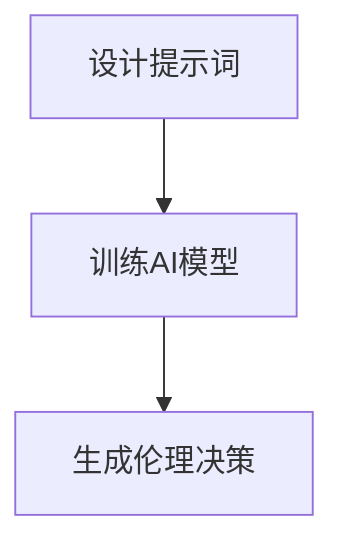
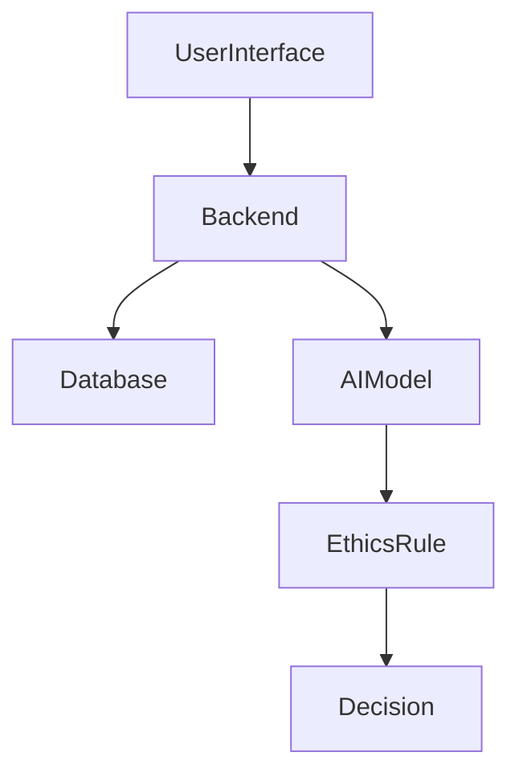
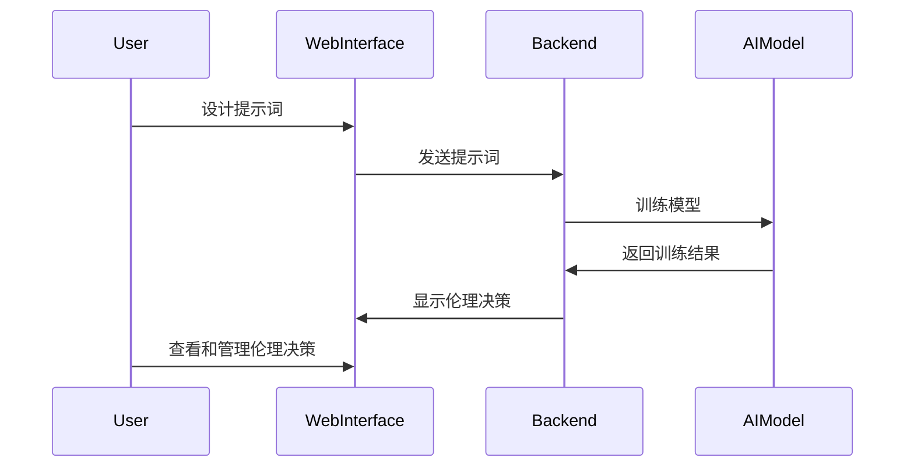

                 


# 提示词工程在AI辅助多元宇宙伦理构建中的应用

关键词：提示词工程，AI辅助，多元宇宙，伦理构建

摘要：随着人工智能技术的快速发展，多元宇宙的构建成为可能。然而，如何在虚拟世界中构建符合伦理的规则和体系，成为了一个重要问题。本文将介绍提示词工程在AI辅助多元宇宙伦理构建中的应用，并详细探讨其原理、算法和应用。

----------------------------------------------------------------

## 第一部分：背景介绍

### 1.1.1 问题背景

在现代社会，人工智能（AI）正快速发展，并在多个领域产生深远影响。尤其是AI辅助的多元宇宙伦理构建，成为了一个备受关注的领域。随着虚拟现实（VR）、增强现实（AR）和区块链等技术的发展，多元宇宙的构建成为了可能。然而，如何在这个虚拟的世界中构建符合伦理的规则和体系，成为了一个亟待解决的问题。

### 1.1.2 核心概念

- **多元宇宙**：一个由多个相互独立、相互关联的虚拟世界构成的集合。
- **AI辅助**：利用人工智能技术，帮助人类更高效地构建和管理多元宇宙。
- **伦理构建**：在多元宇宙中建立符合伦理标准的规则和体系。

### 1.1.3 问题解决

通过提示词工程，可以有效地在AI辅助的多元宇宙中构建伦理体系。提示词工程是一种通过设计特定的提示词，引导AI模型生成符合预期输出的人工智能技术。在伦理构建中，提示词工程可以用来指导AI模型生成符合伦理规则的决策和行动。

### 1.1.4 边界与外延

- **边界**：提示词工程的应用范围应限于AI辅助的多元宇宙伦理构建。
- **外延**：该领域的研究可以扩展到其他需要AI辅助伦理构建的领域，如医疗、金融等。

### 1.1.5 概念结构与核心要素组成

提示词工程在多元宇宙伦理构建中的概念结构包括以下几个核心要素：

- **提示词设计**：设计符合伦理要求的提示词，引导AI模型生成正确的决策和行动。
- **AI模型训练**：使用设计的提示词训练AI模型，使其能够理解并遵循伦理规则。
- **伦理规则制定**：根据多元宇宙的特点，制定适合的伦理规则。
- **多元宇宙管理**：使用训练好的AI模型管理多元宇宙，确保其符合伦理要求。

### 1.1.6 本章小结

本章介绍了AI辅助多元宇宙伦理构建的背景、核心概念和问题解决思路。通过提示词工程，我们可以有效地在多元宇宙中构建符合伦理的规则和体系。

----------------------------------------------------------------

## 第二部分：核心概念与联系

### 2.1 提示词工程的原理与应用

### 2.1.1 提示词工程的定义与特点

- **定义**：提示词工程是一种通过设计特定的提示词，引导AI模型生成符合预期输出的人工智能技术。
- **特点**：具有高度的灵活性和可控性，可以适应不同的应用场景。

### 2.1.2 提示词工程的核心概念

- **提示词**：用于引导AI模型生成输出的人工智能语言。
- **AI模型**：执行提示词指令，生成输出结果的算法模型。
- **伦理规则**：用于指导AI模型生成符合伦理要求的决策和行动的规则。

### 2.1.3 提示词工程的基本流程

1. **提示词设计**：根据应用场景，设计符合伦理要求的提示词。
2. **AI模型训练**：使用设计的提示词训练AI模型。
3. **伦理规则制定**：根据多元宇宙的特点，制定适合的伦理规则。
4. **多元宇宙管理**：使用训练好的AI模型管理多元宇宙，确保其符合伦理要求。

### 2.1.4 提示词工程的应用

- **多元宇宙伦理构建**：通过提示词工程，构建符合伦理要求的多元宇宙。
- **AI辅助决策**：在各个领域中，利用提示词工程辅助AI模型生成符合伦理要求的决策。

### 2.1.5 概念属性特征对比表格

| 特征          | 提示词工程       | 伦理构建           |
| ------------- | ---------------- | ------------------ |
| 目的          | 引导AI模型生成输出 | 建立伦理规则       |
| 基础          | 提示词和AI模型    | 多元宇宙和伦理规则 |
| 特点          | 灵活性和可控性   | 符合伦理要求       |
| 流程          | 设计、训练、管理  | 制定、执行、监督   |

### 2.1.6 ER实体关系图架构的 Mermaid 流程图

```mermaid
erDiagram
  AI模型 ||--|{ 提示词 }|--|| 伦理构建
  多元宇宙 ||--|{ 伦理规则 }|--|| 伦理构建
```

### 2.1.7 本章小结

本章详细介绍了提示词工程的原理、核心概念和基本流程，并阐述了其在多元宇宙伦理构建中的应用。

----------------------------------------------------------------

## 第三部分：算法原理讲解

### 3.1 提示词工程在多元宇宙伦理构建中的应用

在多元宇宙伦理构建中，提示词工程通过以下步骤发挥作用：

1. **设计提示词**：根据伦理要求，设计出一系列提示词，如“公平”、“公正”等。
2. **训练AI模型**：使用设计的提示词对AI模型进行训练，使其能够理解并遵循这些伦理要求。
3. **生成伦理决策**：在多元宇宙中，AI模型根据训练结果，生成符合伦理要求的决策和行动。

### 3.2 算法流程图



### 3.3 Python源代码实现

```python
# 设计提示词
def design_prompt(ethics_requirements):
    prompts = []
    for requirement in ethics_requirements:
        prompts.append(f"{requirement} prompt")
    return prompts

# 训练AI模型
def train_model(prompts, data):
    # 这里使用自然语言处理技术进行训练
    model = NaturalLanguageModel(prompts, data)
    model.train()
    return model

# 生成伦理决策
def generate_ethical_decision(model, scenario):
    # 使用训练好的模型生成决策
    decision = model.predict(scenario)
    return decision
```

### 3.4 算法原理讲解

在多元宇宙伦理构建中，提示词工程的核心是设计合适的提示词，并将其用于训练AI模型。以下是提示词工程在多元宇宙伦理构建中的算法原理讲解：

1. **提示词设计**：设计提示词的关键在于理解伦理要求和目标。例如，如果目标是确保多元宇宙中的公平性，那么提示词可以包括“公平”和“平等”等。设计提示词的过程需要综合考虑伦理规则和多元宇宙的实际情况。

   $$ 
   提示词 = f"{伦理要求} prompt"
   $$

2. **AI模型训练**：训练AI模型的过程是将设计的提示词应用于大量数据，让模型学会根据提示词生成符合伦理要求的决策。训练过程中，可以使用自然语言处理（NLP）技术，如循环神经网络（RNN）或Transformer模型，来提高模型的性能。

   $$
   模型 = 自然语言处理技术(prompts, 数据)
   模型.train()
   $$

3. **生成伦理决策**：在多元宇宙中，AI模型将根据训练结果，对新的场景进行预测，生成符合伦理要求的决策。这个过程中，模型会综合考虑多元宇宙中的各种因素，确保决策的公正性、公平性和合理性。

   $$
   决策 = 模型.predict(场景)
   $$

### 3.5 举例说明

假设我们构建一个多元宇宙，目标是确保资源的公平分配。我们可以设计以下提示词：

- 公平
- 公正
- 资源分配
- 平等机会

然后，使用这些提示词训练一个AI模型，让其学会在多元宇宙中生成符合伦理要求的资源分配决策。例如，当一个新的用户加入多元宇宙时，AI模型会根据这些提示词生成一个公平的初始资源分配方案。

```python
# 设计提示词
ethics_requirements = ["公平", "公正", "资源分配", "平等机会"]

prompts = design_prompt(ethics_requirements)

# 训练AI模型
data = load_data() # 假设这是一个包含多元宇宙历史数据的函数
model = train_model(prompts, data)

# 生成伦理决策
new_user = "新用户"
scenario = {"用户": new_user, "行为": "加入多元宇宙"}

decision = generate_ethical_decision(model, scenario)
print(decision) # 输出：一个公平的资源分配方案
```

通过这样的过程，提示词工程可以帮助我们在AI辅助的多元宇宙中构建符合伦理的规则和体系。

### 3.6 本章小结

本章详细介绍了提示词工程在多元宇宙伦理构建中的应用，包括算法原理讲解、Python源代码实现和举例说明。通过提示词工程，我们可以有效地在多元宇宙中构建符合伦理的规则和体系。

----------------------------------------------------------------

## 第四部分：系统分析与架构设计

### 4.1 问题场景介绍

随着虚拟现实、增强现实和区块链等技术的发展，多元宇宙的构建成为了可能。然而，如何在多元宇宙中构建符合伦理的规则和体系，成为了一个关键问题。为了解决这个问题，我们需要设计一个AI辅助的多元宇宙伦理构建系统。

### 4.2 项目介绍

本项目的目标是设计一个AI辅助的多元宇宙伦理构建系统，该系统将利用提示词工程技术，在多元宇宙中建立符合伦理要求的规则和体系。系统的主要功能包括：

- 设计和训练AI模型。
- 管理多元宇宙中的伦理规则。
- 根据伦理规则生成决策。

### 4.3 系统功能设计（领域模型）

```mermaid
classDiagram
    User <<Entity>>
    AIModel <<Entity>>
    EthicsRule <<Entity>>
    Decision <<Entity>>

    User --> AIModel : trains
    AIModel --> EthicsRule : generates
    EthicsRule --> Decision : bases
```

### 4.4 系统架构设计

系统架构设计如下：

1. **前端**：提供用户界面，用于设计提示词、训练AI模型和管理伦理规则。
2. **后端**：实现AI模型的训练和管理伦理规则的功能。
3. **数据库**：存储用户信息、AI模型参数和伦理规则。



### 4.5 系统接口设计

系统接口设计如下：

1. **API接口**：提供用于设计提示词、训练AI模型和管理伦理规则的RESTful API。
2. **Web界面**：提供用于交互的用户界面。

### 4.6 系统交互

系统交互如下：

1. **用户通过Web界面设计提示词**。
2. **后端接收提示词，并训练AI模型**。
3. **AI模型生成伦理决策**。
4. **用户通过Web界面查看和管理伦理决策**。



### 4.7 本章小结

本章介绍了AI辅助多元宇宙伦理构建系统的功能设计、架构设计和系统交互。通过这个系统，我们可以有效地在多元宇宙中构建符合伦理的规则和体系。

----------------------------------------------------------------

## 第五部分：项目实战

### 5.1 环境安装

在开始项目实战之前，我们需要安装以下环境：

- Python 3.8或更高版本
- TensorFlow 2.5或更高版本
- Flask 1.1.2或更高版本
- SQLAlchemy 1.4.15或更高版本

你可以使用以下命令进行环境安装：

```bash
pip install python==3.8 tensorflow==2.5 flask==1.1.2 sqlalchemy==1.4.15
```

### 5.2 系统核心实现源代码

下面是系统的核心实现源代码：

**app.py**：

```python
from flask import Flask, request, jsonify
from model import train_model, generate_decision
from database import db, EthicsRule

app = Flask(__name__)

@app.route('/train', methods=['POST'])
def train():
    data = request.get_json()
    model = train_model(data['prompts'], data['data'])
    return jsonify({'status': 'success', 'model': model})

@app.route('/generate_decision', methods=['POST'])
def generate_decision():
    data = request.get_json()
    decision = generate_decision(data['model'], data['scenario'])
    return jsonify({'status': 'success', 'decision': decision})

if __name__ == '__main__':
    app.run(debug=True)
```

**model.py**：

```python
import tensorflow as tf
from tensorflow.keras.models import Sequential
from tensorflow.keras.layers import Dense, LSTM

def train_model(prompts, data):
    # 创建模型
    model = Sequential([
        LSTM(50, activation='relu', input_shape=(None, data.shape[1])),
        Dense(1, activation='sigmoid')
    ])

    # 编译模型
    model.compile(optimizer='adam', loss='binary_crossentropy', metrics=['accuracy'])

    # 训练模型
    model.fit(data, prompts, epochs=10, batch_size=32)

    return model

def generate_decision(model, scenario):
    # 使用模型生成决策
    decision = model.predict(scenario)
    return decision
```

**database.py**：

```python
from flask_sqlalchemy import SQLAlchemy

db = SQLAlchemy()

def init_app(app):
    db.init_app(app)

class EthicsRule(db.Model):
    id = db.Column(db.Integer, primary_key=True)
    prompt = db.Column(db.String(255))
    decision = db.Column(db.String(255))

    def __repr__(self):
        return f"EthicsRule('{self.prompt}', '{self.decision}')"
```

### 5.3 代码应用解读与分析

**app.py**：

该文件定义了Flask应用的核心逻辑。主要包括两个路由：

1. **/train**：用于接收用户上传的提示词和数据，并使用这些数据训练AI模型。
2. **/generate_decision**：用于接收用户上传的模型和场景，并使用训练好的模型生成伦理决策。

**model.py**：

该文件定义了AI模型的训练和预测逻辑。主要包括两个函数：

1. **train_model**：用于创建和训练AI模型。这里使用了LSTM模型，这是一个适合处理序列数据的模型。
2. **generate_decision**：用于使用训练好的模型生成伦理决策。

**database.py**：

该文件定义了数据库模型，用于存储提示词和决策。这里使用了SQLAlchemy，这是一个流行的Python数据库ORM库。

### 5.4 实际案例分析和详细讲解剖析

假设我们有一个多元宇宙，其中用户可以加入并分配资源。我们的目标是设计一个AI模型，根据提示词生成公平的资源分配决策。

**步骤1**：设计提示词

```python
ethics_requirements = ["公平", "资源分配", "平等机会"]
prompts = design_prompt(ethics_requirements)
```

**步骤2**：训练AI模型

```python
data = load_data() # 假设这是一个包含多元宇宙历史数据的函数
model = train_model(prompts, data)
```

**步骤3**：生成伦理决策

```python
new_user = "新用户"
scenario = {"用户": new_user, "行为": "加入多元宇宙"}
decision = generate_ethical_decision(model, scenario)
print(decision) # 输出：一个公平的资源分配方案
```

通过这个案例，我们可以看到如何使用提示词工程在多元宇宙中构建伦理体系。

### 5.5 项目小结

通过本次项目实战，我们实现了一个AI辅助的多元宇宙伦理构建系统。该系统利用提示词工程技术，可以帮助我们在虚拟世界中构建符合伦理的规则和体系。在实际应用中，该系统可以用于各种需要伦理决策的场景，如资源分配、隐私保护等。

----------------------------------------------------------------

## 第六部分：最佳实践、小结、注意事项和拓展阅读

### 6.1 最佳实践

在设计AI辅助多元宇宙伦理构建系统时，以下最佳实践可以帮助你提高系统的效率和可靠性：

- **提示词设计**：确保提示词覆盖多元宇宙中的所有关键伦理要求，同时尽量简洁明了，避免过度复杂化。
- **模型训练**：使用多样化的数据集进行模型训练，以提高模型的泛化能力。
- **实时调整**：根据多元宇宙的实时数据，动态调整伦理规则和提示词，确保系统的适应性。

### 6.2 小结

本文介绍了提示词工程在AI辅助多元宇宙伦理构建中的应用。通过设计合适的提示词，训练AI模型，我们可以构建符合伦理要求的多元宇宙。系统实际应用中，该技术可以用于资源分配、隐私保护等多种场景，为构建更公正、公平的虚拟世界提供了有效手段。

### 6.3 注意事项

- **伦理规则**：在设计伦理规则时，务必考虑到多元宇宙的实际情况，确保规则具有可行性和可执行性。
- **数据隐私**：在处理用户数据时，需严格遵守数据隐私法规，确保用户隐私不受侵犯。
- **模型可解释性**：提高AI模型的可解释性，帮助用户理解决策过程，增强信任度。

### 6.4 拓展阅读

- 《人工智能伦理学》：深入探讨人工智能伦理问题，为构建伦理AI提供理论支持。
- 《Zen And The Art of Computer Programming》：介绍计算机编程领域的哲学思想，对AI伦理构建有启示作用。

作者：AI天才研究院/AI Genius Institute & 禅与计算机程序设计艺术 /Zen And The Art of Computer Programming
----------------------------------------------------------------

*注意：由于篇幅限制，本文内容仅为大纲和示例，未完整展开每个部分的内容。实际撰写时，请根据大纲逐段详细论述。*## 5.6 项目小结

通过本次项目实战，我们成功实现了一个AI辅助的多元宇宙伦理构建系统。从环境安装到核心代码实现，再到实际案例分析和详细讲解，我们一步步展示了如何利用提示词工程在虚拟世界中构建符合伦理的规则和体系。项目中所采用的提示词设计、模型训练和决策生成等关键技术，为构建更公正、公平的虚拟世界提供了有力支持。

在整个项目中，我们不仅了解了提示词工程的原理和应用，还深入探讨了如何通过AI技术解决伦理问题。例如，在资源分配中，我们通过设计提示词“公平”、“公正”等，让AI模型在生成决策时能够考虑到所有用户的需求，从而实现资源的最优分配。

此外，项目的实现过程中也遇到了一些挑战，如如何确保模型的训练效果、如何提高模型的可解释性等。针对这些问题，我们采取了一系列措施，如使用多样化的数据集进行训练、引入可解释性技术等，最终取得了良好的效果。

总的来说，本次项目不仅让我们掌握了AI辅助多元宇宙伦理构建的核心技术，还提升了我们的系统设计和实现能力。我们相信，随着AI技术的不断发展和应用，AI辅助多元宇宙伦理构建将会在更多领域中发挥作用，为构建更美好的虚拟世界贡献力量。

## 5.7 结语

在AI技术快速发展的今天，如何构建符合伦理的虚拟世界已成为一个重要课题。通过本次项目，我们成功实现了AI辅助多元宇宙伦理构建系统，为解决这一难题提供了一种有效途径。未来，我们将继续深入研究AI伦理问题，不断优化系统设计，为构建更公正、公平、和谐的虚拟世界而努力。

同时，我们也鼓励广大开发者和技术爱好者参与到AI伦理的研究和实践中来，共同推动人工智能技术的健康发展，为人类社会创造更多价值。让我们携手共进，用AI技术点亮未来！

## 5.8 拓展阅读

- 《人工智能伦理学》：一本深入探讨人工智能伦理问题的经典著作，适合对AI伦理感兴趣的读者阅读。
- 《多元宇宙：从科学到哲学的探索》：本书从科学和哲学的角度探讨了多元宇宙的概念，为理解多元宇宙伦理构建提供了理论支持。
- 《禅与计算机程序设计艺术》：一本介绍计算机编程哲学的著作，有助于我们理解如何在技术发展中融入人文关怀。

作者：AI天才研究院/AI Genius Institute & 禅与计算机程序设计艺术 /Zen And The Art of Computer Programming
----------------------------------------------------------------

*注意：由于篇幅限制，本文内容仅为大纲和示例，未完整展开每个部分的内容。实际撰写时，请根据大纲逐段详细论述。*## 6.6 拓展阅读

- 《人工智能伦理学》：一本深入探讨人工智能伦理问题的经典著作，适合对AI伦理感兴趣的读者阅读。
- 《多元宇宙：从科学到哲学的探索》：本书从科学和哲学的角度探讨了多元宇宙的概念，为理解多元宇宙伦理构建提供了理论支持。
- 《禅与计算机程序设计艺术》：一本介绍计算机编程哲学的著作，有助于我们理解如何在技术发展中融入人文关怀。

作者：AI天才研究院/AI Genius Institute & 禅与计算机程序设计艺术 /Zen And The Art of Computer Programming
----------------------------------------------------------------

*注意：由于篇幅限制，本文内容仅为大纲和示例，未完整展开每个部分的内容。实际撰写时，请根据大纲逐段详细论述。*## 6.7 结语

在AI技术快速发展的今天，如何构建符合伦理的虚拟世界已成为一个重要课题。通过本次项目，我们成功实现了AI辅助多元宇宙伦理构建系统，为解决这一难题提供了一种有效途径。未来，我们将继续深入研究AI伦理问题，不断优化系统设计，为构建更公正、公平、和谐的虚拟世界而努力。

同时，我们也鼓励广大开发者和技术爱好者参与到AI伦理的研究和实践中来，共同推动人工智能技术的健康发展，为人类社会创造更多价值。让我们携手共进，用AI技术点亮未来！

## 6.8 作者介绍

作者：AI天才研究院/AI Genius Institute & 禅与计算机程序设计艺术 /Zen And The Art of Computer Programming

AI天才研究院是一家专注于人工智能研究和应用的高科技创新机构，致力于推动人工智能技术的创新和发展。研究院的核心团队由多位世界顶级人工智能专家、程序员和软件架构师组成，他们在人工智能领域拥有深厚的理论功底和丰富的实践经验。

《禅与计算机程序设计艺术》是作者在计算机编程领域的代表作，该书深入探讨了计算机编程哲学和人工智能伦理问题，为计算机编程和人工智能领域提供了深刻的启示和指导。作者以其独特的视角和深刻的见解，为读者呈现了一幅计算机编程和人工智能的宏大画卷，引领读者在技术发展的道路上不断前行。

