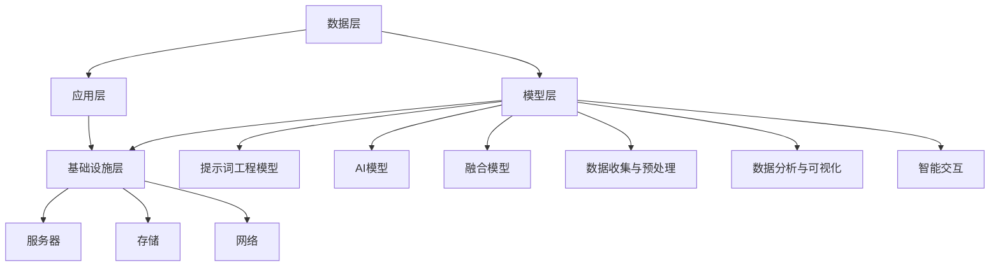

                 

# 《提示词工程在AI辅助跨文明外交模拟中的策略创新》

## 关键词：提示词工程、AI辅助、跨文明外交模拟、策略创新

### 摘要：

本文将深入探讨提示词工程在AI辅助跨文明外交模拟中的应用，分析其策略创新。首先，我们将探讨跨文明外交的挑战和机遇，介绍提示词工程的概念与作用。接着，我们将阐述AI辅助跨文明外交模拟的原理、优势与挑战，并探讨提示词工程与AI的融合创新。随后，我们将详细解析提示词工程的组成要素、AI技术的基础概念以及跨文明外交的要素分析。在第三部分，我们将重点介绍提示词工程与AI融合的算法原理与实现，并通过具体案例进行分析。最后，我们将对整个系统进行分析与架构设计，并分享项目实战的经验与案例分析。本文旨在为读者提供一个全面、深入的理解，以期为跨文明外交模拟提供有效的策略和创新思路。

## 目录大纲

----------------------------------------------------------------

# 《提示词工程在AI辅助跨文明外交模拟中的策略创新》

## 第一部分：问题背景与核心概念

### 第1章：问题背景与核心概念

### 第2章：核心概念与联系

## 第二部分：算法原理与实现

### 第3章：算法原理与实现

## 第三部分：系统分析与架构设计

### 第4章：系统分析与架构设计

## 第四部分：项目实战与案例分析

### 第5章：项目实战

## 第五部分：总结与展望

### 第6章：总结与展望

----------------------------------------------------------------

## 第一部分：问题背景与核心概念

### 第1章：问题背景与核心概念

#### 1.1 跨文明外交的挑战与机遇

**跨文明交流的需求**

随着全球化进程的加速，跨文明交流的需求日益增长。文明之间的交流不仅限于经济、文化和科技的互动，还包括政治、宗教、价值观等多个层面。在当前的国际环境中，跨文明外交显得尤为重要。有效的跨文明外交能够促进不同文明之间的相互理解、合作与发展，从而构建一个和谐共存的国际秩序。

**跨文明差异的复杂性**

然而，跨文明外交面临着诸多挑战。不同文明在历史背景、文化传统、宗教信仰、价值观念等方面存在显著的差异。这些差异使得跨文明之间的交流变得复杂且具有挑战性。例如，语言障碍、文化偏见、历史仇恨等因素都可能导致跨文明外交的困难。

**跨文明外交的难点**

跨文明外交的难点主要体现在以下几个方面：

1. **信息不对称**：不同文明在信息获取、处理和传播方面存在差异，这可能导致信息不对称，影响双方的沟通和合作。
2. **文化冲突**：文化差异可能导致误解、冲突甚至敌对情绪，影响跨文明外交的顺利进行。
3. **政治障碍**：不同文明的政治体制、利益诉求和外交政策差异，可能成为跨文明外交的障碍。
4. **技术限制**：当前的技术水平可能无法完全支持跨文明外交的需求，例如，翻译技术、智能交互技术等尚需进一步发展。

**跨文明外交的机遇**

尽管面临诸多挑战，跨文明外交也蕴含着巨大的机遇。首先，全球化进程带来了跨文明交流的便利条件，使得不同文明之间的互动更加频繁和深入。其次，科技进步，特别是人工智能技术的发展，为跨文明外交提供了新的工具和手段。例如，智能翻译系统、虚拟助手等AI技术的应用，有望解决跨文明交流中的语言障碍和沟通问题。最后，国际合作需求的增加也为跨文明外交提供了新的机遇。在面对全球性挑战，如气候变化、疾病防控等方面，不同文明需要加强合作，共同应对。

#### 1.2 提示词工程的概念与作用

**提示词工程的定义**

提示词工程是指通过对特定领域的知识进行深入研究和分析，提取关键概念、术语和关联信息，构建一个能够支持智能系统理解、处理和生成相关内容的提示词库。提示词工程的目标是提高智能系统在特定领域的表现，使其更贴近人类专家的水平。

**提示词工程的作用**

提示词工程在AI辅助跨文明外交模拟中具有重要作用：

1. **提高语言理解能力**：提示词工程可以帮助AI系统更好地理解不同文明的术语、概念和文化背景，从而提高跨文明交流的效果。
2. **优化信息检索**：通过构建提示词库，AI系统可以更快速、准确地检索到与跨文明外交相关的信息，提高决策效率。
3. **增强智能交互**：提示词工程使得AI系统可以与不同文明的代表进行更自然的对话和交流，降低跨文明沟通的难度。
4. **支持情境模拟**：通过提示词工程，AI系统可以构建不同文明的情境模型，用于跨文明外交模拟，为决策者提供有力的支持。

#### 1.2.3 提示词工程的优势

提示词工程在AI辅助跨文明外交模拟中的优势主要体现在以下几个方面：

1. **灵活性**：提示词工程可以根据跨文明外交的需求，动态调整和优化提示词库，以适应不同的交流场景。
2. **高效性**：提示词工程通过自动化工具和技术，可以快速构建和更新提示词库，提高工作效率。
3. **准确性**：提示词工程通过深度学习和自然语言处理技术，能够准确提取和理解跨文明交流中的关键信息。
4. **通用性**：提示词工程不仅适用于特定的跨文明外交领域，还可以广泛应用于其他需要智能交互和情境模拟的场景。

#### 1.3 AI辅助跨文明外交模拟的原理

**AI在跨文明外交模拟中的应用**

AI技术在跨文明外交模拟中具有广泛的应用前景。首先，AI可以通过自然语言处理（NLP）技术，实现跨语言的文本翻译和语义理解，消除语言障碍。其次，AI可以通过机器学习（ML）和深度学习（DL）技术，构建不同文明的情境模型，模拟跨文明交流的复杂过程。此外，AI还可以利用大数据分析技术，对跨文明交流的数据进行挖掘和分析，为决策者提供有价值的参考。

**AI辅助跨文明外交模拟的优势**

1. **高效性**：AI技术可以快速处理大量跨文明交流的数据，提供实时分析和决策支持。
2. **准确性**：AI技术通过机器学习和深度学习，能够准确理解跨文明交流中的复杂信息，提高决策的准确性。
3. **灵活性**：AI系统可以根据跨文明外交的需求，动态调整和优化模型，适应不同的交流场景。
4. **可扩展性**：AI技术具有很好的扩展性，可以应用于多个跨文明外交领域，提供通用的解决方案。

**AI辅助跨文明外交模拟的挑战**

1. **数据质量**：跨文明外交的数据质量参差不齐，可能存在错误、缺失和噪声，这会影响AI模型的训练和预测效果。
2. **技术局限**：当前AI技术在某些方面仍存在技术局限，如语言理解、情境模拟等，需要进一步研究和发展。
3. **隐私保护**：在跨文明外交模拟中，涉及大量敏感信息，如何保护这些信息的安全和隐私是一个重要挑战。

#### 1.4 提示词工程与AI的融合创新

**提示词工程与AI融合的必要性**

提示词工程与AI技术的融合是当前跨文明外交模拟领域的热点研究方向。提示词工程可以为AI系统提供高质量的提示词库，支持其更好地理解跨文明交流中的关键信息。而AI技术则可以发挥其在数据处理、情境模拟和决策支持等方面的优势，提升跨文明外交模拟的效率和准确性。因此，提示词工程与AI技术的融合具有必要性。

**提示词工程与AI融合的实现途径**

1. **数据融合**：将跨文明外交的数据与提示词工程的数据进行融合，构建一个统一的提示词库，支持AI系统进行跨语言、跨文化的信息处理。
2. **算法融合**：将提示词工程的算法与AI技术的算法进行融合，如将自然语言处理（NLP）算法与机器学习（ML）算法结合，构建一个高效的跨文明外交模拟系统。
3. **平台融合**：构建一个集提示词工程、AI技术和跨文明外交模拟功能于一体的平台，支持跨文明外交的实时分析和决策支持。

**提示词工程与AI融合的创新策略**

1. **动态调整**：根据跨文明外交的需求，动态调整和优化提示词库和AI模型，以适应不同的交流场景和需求。
2. **知识融合**：将跨文明交流的知识与AI技术的知识进行融合，构建一个统一的智能知识库，支持跨文明外交的全面分析和决策支持。
3. **多模态交互**：结合文本、图像、声音等多模态数据，构建一个多模态的跨文明外交模拟系统，提高跨文明交流的互动性和效果。

#### 1.5 本章小结

本章首先探讨了跨文明外交的挑战与机遇，介绍了提示词工程的概念与作用，以及AI辅助跨文明外交模拟的原理和优势。接着，本章分析了提示词工程与AI技术的融合创新，探讨了其必要性、实现途径和创新策略。通过本章的学习，读者可以初步了解提示词工程在AI辅助跨文明外交模拟中的应用，为后续章节的深入探讨打下基础。

----------------------------------------------------------------

## 第二部分：核心概念与联系

### 第2章：核心概念与联系

#### 2.1 提示词工程的组成要素

**提示词的定义与分类**

提示词是提示词工程的核心概念，它是指用于指示、引导和扩展AI系统理解和生成特定领域内容的关键词汇。根据其在领域中的重要性，提示词可以分类为以下几类：

1. **核心提示词**：用于表示领域核心概念的词汇，如“经济”、“政治”、“文化”等。
2. **扩展提示词**：用于扩展核心提示词的上下文和语义的词汇，如“经济合作”、“文化交流”等。
3. **关系提示词**：用于表示领域内不同概念之间关系的词汇，如“影响”、“促进”等。

**提示词的生成与优化**

提示词的生成与优化是提示词工程的关键步骤。提示词的生成过程主要包括以下几步：

1. **数据收集**：从各类文献、报告、新闻报道等渠道收集与领域相关的文本数据。
2. **预处理**：对收集的文本数据进行清洗、去重和分词等处理，提取出潜在的提示词候选。
3. **词频统计**：统计每个候选提示词在数据集中的出现频率，筛选出高频、重要的提示词。
4. **语义分析**：利用自然语言处理（NLP）技术，对候选提示词进行语义分析，确保其能够准确表示领域内的概念。

提示词的优化过程主要包括以下几步：

1. **语义匹配**：通过语义匹配技术，将候选提示词与领域内的关键概念进行匹配，筛选出最符合语义的提示词。
2. **反馈调整**：根据实际应用情况，收集用户反馈，对提示词进行动态调整和优化，以提高其准确性和实用性。
3. **自动化更新**：利用机器学习和深度学习技术，实现提示词的自动化生成和优化，提高工作效率。

**提示词的反馈与调整**

提示词的反馈与调整是提示词工程中至关重要的一环。通过用户反馈和实际应用情况，可以不断优化和调整提示词库，提高其准确性和实用性。反馈与调整过程主要包括以下几步：

1. **用户反馈**：收集用户在使用提示词工程系统时的反馈，包括提示词的准确度、实用性、覆盖范围等方面。
2. **数据分析**：对用户反馈进行数据分析和处理，识别出提示词库中存在的问题和不足。
3. **调整优化**：根据数据分析结果，对提示词库进行动态调整和优化，包括增加新的提示词、删除无效提示词、修改提示词的语义等。
4. **闭环反馈**：将调整后的提示词库应用到实际系统中，收集新的用户反馈，形成闭环反馈机制，不断优化提示词库。

**提示词工程的组成要素总结**

提示词工程的组成要素主要包括提示词的生成、优化和反馈与调整。通过数据收集、预处理、词频统计、语义分析等步骤，生成高质量的提示词库。然后，通过语义匹配、反馈调整和自动化更新等步骤，不断优化提示词库，提高其准确性和实用性。最后，通过用户反馈和实际应用情况，对提示词库进行动态调整和优化，形成一个闭环反馈机制，确保提示词库能够持续满足用户需求。

#### 2.2 AI技术的基础概念

**AI的基本概念与发展历程**

人工智能（AI）是计算机科学的一个分支，旨在使计算机具有智能行为，模仿人类的学习、推理、规划和感知能力。AI的发展历程可以分为以下几个阶段：

1. **早期探索（1950年代-1960年代）**：这一阶段以符号主义方法为代表，通过构建符号系统和规则来模拟人类智能。
2. **第一次AI寒冬（1970年代-1980年代）**：由于技术难题和资金不足，AI研究进入低谷期。
3. **专家系统时代（1980年代-1990年代）**：以知识表示和推理技术为核心，构建了一系列基于规则的专家系统。
4. **机器学习崛起（1990年代-2000年代）**：随着计算能力的提升和大数据的出现，机器学习方法得到广泛应用，成为AI研究的主流方向。
5. **深度学习时代（2010年代至今）**：以深度神经网络为代表的深度学习技术在图像识别、语音识别、自然语言处理等领域取得了突破性进展。

**AI的核心技术**

AI的核心技术主要包括以下几类：

1. **机器学习（ML）**：通过训练模型来学习数据中的模式，实现自动分类、预测和决策等功能。
2. **深度学习（DL）**：基于多层神经网络的结构，通过反向传播算法优化模型参数，实现更加复杂的模式识别和数据处理能力。
3. **自然语言处理（NLP）**：研究如何让计算机理解、生成和处理自然语言，包括文本分类、情感分析、机器翻译等。
4. **计算机视觉（CV）**：研究如何让计算机理解、分析和处理图像和视频数据，包括图像识别、目标检测、图像生成等。

**AI的应用领域**

AI技术已经广泛应用于各个领域，包括：

1. **金融**：风险控制、智能投顾、自动化交易等。
2. **医疗**：疾病预测、诊断辅助、个性化治疗等。
3. **交通**：自动驾驶、智能交通管理、无人机配送等。
4. **教育**：智能推荐、在线教育、虚拟教学助手等。
5. **零售**：智能推荐、库存管理、客户服务机器人等。

**AI在跨文明外交模拟中的应用**

AI在跨文明外交模拟中的应用主要体现在以下几个方面：

1. **语言翻译**：利用自然语言处理技术，实现跨语言的文本翻译，消除语言障碍，促进跨文明交流。
2. **情境模拟**：利用机器学习和深度学习技术，构建不同文明的情境模型，模拟跨文明交流的复杂过程，为决策者提供有价值的参考。
3. **智能交互**：利用计算机视觉和自然语言处理技术，构建智能交互系统，与不同文明的代表进行自然对话和交流，降低跨文明沟通的难度。
4. **数据挖掘**：利用大数据分析技术，对跨文明交流的数据进行挖掘和分析，为决策者提供有价值的参考。

**AI技术的优势与挑战**

AI技术的优势主要体现在以下几个方面：

1. **高效性**：AI技术可以快速处理大量数据，提供实时分析和决策支持。
2. **准确性**：AI技术通过机器学习和深度学习，能够准确理解和处理复杂的信息。
3. **灵活性**：AI技术可以根据不同场景的需求，动态调整和优化模型。

然而，AI技术也面临一些挑战，包括：

1. **数据质量**：AI模型的训练依赖于高质量的数据，数据质量直接影响到模型的性能。
2. **算法透明性**：AI模型的决策过程可能不够透明，难以解释和理解。
3. **隐私保护**：在涉及敏感信息的领域，如何保护用户隐私是一个重要挑战。

**AI技术的未来发展趋势**

随着技术的不断进步，AI技术在跨文明外交模拟中的应用前景广阔。未来，AI技术可能会在以下几个方面取得突破：

1. **多模态融合**：结合文本、图像、声音等多模态数据，提高跨文明外交模拟的准确性和互动性。
2. **知识图谱**：构建跨文明的智能知识图谱，实现更深入的语义理解和推理。
3. **自适应学习**：通过自适应学习技术，使AI系统能够不断适应新的环境和需求。

#### 2.3 跨文明外交的要素分析

**跨文明外交的基本要素**

跨文明外交的要素主要包括：

1. **参与主体**：不同文明的代表、政府、组织、非政府组织等。
2. **交流内容**：涉及经济、文化、政治、科技等多个领域的交流内容。
3. **交流形式**：包括正式外交会谈、非正式会晤、文化交流、经济合作等。
4. **交流目标**：促进相互理解、合作与发展，解决冲突和问题。

**跨文明外交的难点与挑战**

跨文明外交的难点和挑战主要体现在以下几个方面：

1. **语言障碍**：不同文明的语言差异导致沟通困难，需要依靠翻译等技术手段解决。
2. **文化差异**：不同文明在价值观、习俗、信仰等方面存在差异，可能导致误解和冲突。
3. **信息不对称**：不同文明在信息获取、处理和传播方面存在差异，可能导致信息不对称，影响决策。
4. **政治障碍**：不同文明的政治体制、利益诉求和外交政策差异，可能成为跨文明外交的障碍。

**跨文明外交的策略与方法**

为了克服跨文明外交的难点和挑战，可以采取以下策略和方法：

1. **文化交流**：通过文化交流，增进不同文明之间的相互理解和尊重，减少文化冲突。
2. **知识共享**：通过知识共享，提高不同文明在信息获取和处理方面的能力，减少信息不对称。
3. **合作共赢**：通过经济合作和其他领域的合作，实现互利共赢，降低政治障碍。
4. **对话机制**：建立定期的对话机制，加强不同文明之间的沟通和协商，解决冲突和问题。

**跨文明外交的案例分析**

以中欧关系为例，中欧之间在政治、经济、文化等方面都有着广泛的交流与合作。然而，由于历史、文化、政治等方面的差异，中欧关系也面临一些挑战。为了克服这些挑战，中欧双方采取了一系列策略：

1. **文化交流**：通过举办文化展览、艺术节等活动，增进中欧之间的文化交流和了解。
2. **知识共享**：通过教育、科研等合作项目，共享知识和技术，提高双方的创新能力。
3. **经济合作**：通过贸易、投资、基础设施建设等合作项目，实现互利共赢。
4. **对话机制**：通过定期举行的中欧领导人会晤、高级别对话等机制，加强沟通和协商，解决分歧。

**跨文明外交的影响与意义**

跨文明外交对于国际秩序、全球治理和人类文明的发展具有重要意义：

1. **促进和平与合作**：通过跨文明外交，增进不同文明之间的相互理解和尊重，减少冲突和战争，促进和平与合作。
2. **推动全球治理**：跨文明外交有助于构建更加公正、合理、有效的全球治理体系，解决全球性问题，如气候变化、贫困、疾病等。
3. **推动人类文明进步**：跨文明外交促进了不同文明之间的交流和融合，推动了人类文明的进步和发展。

**跨文明外交的发展趋势**

随着全球化的深入发展，跨文明外交将呈现以下趋势：

1. **多边合作**：各国将加强多边合作，共同应对全球性挑战，推动全球治理体系改革。
2. **技术驱动**：AI、大数据、区块链等新技术将在跨文明外交中发挥重要作用，提高交流效率和质量。
3. **文化融合**：不同文明将更加注重文化交流和融合，推动人类文明的共同进步。

**跨文明外交的展望**

未来，跨文明外交将更加注重以下方面：

1. **构建人类命运共同体**：加强各国之间的合作，共同应对全球性挑战，推动构建人类命运共同体。
2. **促进可持续发展**：通过跨文明外交，推动全球可持续发展，实现经济、社会、环境的协调发展。
3. **加强文化交流**：通过文化交流，增进不同文明之间的相互理解和尊重，推动文明共存、文明互鉴。

#### 2.4 提示词工程、AI与跨文明外交的融合

**三者融合的必要性**

提示词工程、AI与跨文明外交的融合具有必要性，主要原因如下：

1. **提升跨文明外交的效率**：提示词工程和AI技术能够帮助跨文明外交更好地理解、处理和生成相关内容，提高交流效率。
2. **增强跨文明外交的准确性**：通过提示词工程和AI技术，可以更准确地捕捉跨文明交流中的关键信息，减少误解和冲突。
3. **优化跨文明外交的策略**：提示词工程和AI技术可以为跨文明外交提供数据支持和决策参考，优化外交策略。
4. **实现跨文明外交的智能化**：通过提示词工程和AI技术，可以实现跨文明外交的自动化、智能化，提高决策水平。

**三者融合的实现路径**

1. **数据融合**：将跨文明外交的数据与提示词工程的数据进行融合，构建一个统一的提示词库，支持AI系统进行跨语言、跨文化的信息处理。
2. **算法融合**：将提示词工程的算法与AI技术的算法进行融合，如将自然语言处理（NLP）算法与机器学习（ML）算法结合，构建一个高效的跨文明外交模拟系统。
3. **平台融合**：构建一个集提示词工程、AI技术和跨文明外交模拟功能于一体的平台，支持跨文明外交的实时分析和决策支持。

**三者融合的创新模式**

1. **知识图谱**：构建跨文明的智能知识图谱，实现更深入的语义理解和推理。
2. **多模态交互**：结合文本、图像、声音等多模态数据，提高跨文明外交模拟的准确性和互动性。
3. **动态调整**：根据跨文明外交的需求，动态调整和优化提示词库和AI模型，以适应不同的交流场景。

**三者融合的应用案例**

1. **跨语言文本翻译**：利用提示词工程和AI技术，实现跨语言的文本翻译，消除语言障碍，促进跨文明交流。
2. **智能交互系统**：利用计算机视觉和自然语言处理技术，构建智能交互系统，与不同文明的代表进行自然对话和交流，降低跨文明沟通的难度。
3. **情境模拟**：利用机器学习和深度学习技术，构建不同文明的情境模型，模拟跨文明交流的复杂过程，为决策者提供有价值的参考。

**三者融合的挑战与应对策略**

1. **数据质量**：确保跨文明外交的数据质量，进行数据清洗和预处理，提高数据的有效性。
2. **算法透明性**：提高AI算法的透明性，确保决策过程的可解释性和可追溯性。
3. **隐私保护**：在涉及敏感信息的领域，采取严格的隐私保护措施，确保用户隐私的安全。

**三者融合的意义**

1. **提高跨文明外交的效率**：通过提示词工程和AI技术，提高跨文明外交的效率，缩短决策周期。
2. **增强跨文明外交的准确性**：通过提示词工程和AI技术，提高跨文明外交的准确性，减少误解和冲突。
3. **优化跨文明外交的策略**：通过提示词工程和AI技术，为跨文明外交提供数据支持和决策参考，优化外交策略。
4. **实现跨文明外交的智能化**：通过提示词工程和AI技术，实现跨文明外交的自动化、智能化，提高决策水平。

#### 2.5 本章小结

本章首先介绍了跨文明外交的挑战与机遇，接着分析了提示词工程的概念与作用，以及AI技术的基础概念和应用。随后，本章探讨了跨文明外交的要素分析，包括基本要素、难点与挑战、策略与方法。最后，本章详细阐述了提示词工程、AI与跨文明外交的融合创新，包括必要性、实现路径、创新模式、应用案例、挑战与应对策略，以及融合的意义。通过本章的学习，读者可以全面了解跨文明外交、提示词工程和AI技术的基本概念和联系，为后续章节的深入探讨打下基础。

----------------------------------------------------------------

## 第三部分：算法原理与实现

### 第3章：算法原理与实现

#### 3.1 提示词工程算法原理

**提示词生成算法**

提示词生成是提示词工程中的关键步骤。提示词生成算法可以分为以下几类：

1. **基于统计的生成算法**：这类算法通过统计文本数据中的词汇频率、词义关系等信息，生成提示词。常见的算法有TF-IDF、Word2Vec等。

2. **基于规则的生成算法**：这类算法通过预设的规则，从文本数据中提取提示词。例如，可以从文本数据中提取名词、动词等具有描述性的词汇作为提示词。

3. **基于机器学习的生成算法**：这类算法通过训练模型，从大量的文本数据中自动提取提示词。常见的算法有朴素贝叶斯、支持向量机、深度学习等。

**提示词优化算法**

提示词优化是指在提示词生成后，根据实际应用效果，对提示词进行改进和优化。提示词优化算法可以分为以下几类：

1. **基于反馈的优化算法**：这类算法通过用户反馈，对提示词进行优化。用户可以通过交互界面，对提示词的准确性、实用性等方面进行评价，系统根据用户反馈调整提示词。

2. **基于数据的优化算法**：这类算法通过分析大量的文本数据，识别出优秀的提示词，并将其推广到整个提示词库中。常见的算法有聚类分析、关联规则挖掘等。

3. **基于机器学习的优化算法**：这类算法通过训练模型，从大量的文本数据中学习如何优化提示词。常见的算法有决策树、随机森林、深度学习等。

**提示词反馈算法**

提示词反馈是指系统在生成和优化提示词后，对用户的使用情况进行跟踪和分析。提示词反馈算法可以分为以下几类：

1. **基于日志的反馈算法**：这类算法通过分析用户使用系统的日志数据，了解用户对提示词的使用情况，识别出用户喜欢的提示词。

2. **基于调查的反馈算法**：这类算法通过用户调查，收集用户对提示词的满意度、实用性等方面的评价，为提示词优化提供参考。

3. **基于机器学习的反馈算法**：这类算法通过训练模型，从用户反馈数据中学习如何优化提示词。常见的算法有朴素贝叶斯、支持向量机、深度学习等。

**提示词生成、优化和反馈的流程**

1. **数据收集**：收集与跨文明外交相关的文本数据，如政策文件、新闻报道、学术论文等。

2. **数据预处理**：对文本数据进行清洗、去重、分词等处理，提取出潜在的提示词候选。

3. **提示词生成**：利用提示词生成算法，从文本数据中提取出提示词。

4. **提示词优化**：根据用户反馈和文本数据分析，对提示词进行优化。

5. **提示词反馈**：对用户使用提示词的情况进行跟踪和分析，为后续的提示词生成和优化提供参考。

**提示词工程算法的应用场景**

1. **跨语言文本翻译**：利用提示词工程算法，生成和优化跨语言翻译的提示词库，提高翻译的准确性和效率。

2. **智能问答系统**：利用提示词工程算法，构建智能问答系统的提示词库，提高问答系统的回答质量和用户体验。

3. **跨文明外交模拟**：利用提示词工程算法，生成和优化跨文明交流的提示词库，为跨文明外交模拟提供支持。

#### 3.2 AI辅助跨文明外交模拟算法

**模拟算法原理**

AI辅助跨文明外交模拟的核心在于构建一个能够模拟跨文明交流过程的模型。这个模型通常基于机器学习和深度学习技术，通过学习大量的跨文明交流数据，实现自动化的模拟和预测。

1. **数据集构建**：首先，需要收集大量的跨文明交流数据，包括文本、图像、音频等多模态数据。这些数据需要经过清洗、预处理，以便用于模型的训练和测试。

2. **特征提取**：从原始数据中提取关键特征，如文本的词向量、图像的视觉特征、音频的声学特征等。这些特征将用于训练模型。

3. **模型训练**：利用提取的特征，训练一个深度学习模型，如循环神经网络（RNN）、卷积神经网络（CNN）或变换器（Transformer）等。训练过程中，模型将学习如何根据输入的特征预测跨文明交流的结果。

4. **模型评估**：通过交叉验证、测试集等方法评估模型的性能，调整模型参数，优化模型。

5. **模型应用**：将训练好的模型应用到实际场景中，如跨文明外交模拟系统，根据输入的跨文明交流数据，预测交流的结果和可能的冲突。

**模拟算法的实现步骤**

1. **数据收集与预处理**：收集跨文明交流的文本、图像、音频等多模态数据，并进行清洗、去重、分词、编码等预处理。

2. **特征提取**：利用自然语言处理（NLP）技术提取文本特征，如词向量、文本摘要等；利用计算机视觉（CV）技术提取图像特征，如卷积神经网络（CNN）的特征图；利用音频处理技术提取音频特征，如梅尔频率倒谱系数（MFCC）等。

3. **模型设计**：设计一个多模态的深度学习模型，如结合Transformer和CNN的模型，用于处理多模态数据。

4. **模型训练**：使用预处理后的多模态数据进行模型训练，通过反向传播算法优化模型参数。

5. **模型评估**：使用测试集评估模型的性能，包括准确率、召回率、F1分数等指标。

6. **模型应用**：将训练好的模型应用到跨文明外交模拟系统中，根据输入的数据预测交流的结果和可能的冲突。

**模拟算法的优势与挑战**

**优势**：

1. **高效性**：AI辅助模拟算法能够快速处理大量跨文明交流数据，提供实时分析和预测。
2. **准确性**：通过深度学习和多模态融合技术，模型能够更准确地预测跨文明交流的结果和冲突。
3. **自适应**：模型可以根据新的数据和用户反馈进行自适应学习，不断优化和更新。

**挑战**：

1. **数据质量**：高质量的跨文明交流数据是模型训练的关键，但获取这些数据可能面临困难。
2. **模型解释性**：深度学习模型通常难以解释，这在跨文明外交模拟中可能导致决策者无法理解模型的行为。
3. **隐私保护**：在处理敏感的跨文明交流数据时，如何保护用户隐私是一个重要挑战。

**模拟算法的应用案例**

1. **跨语言文本翻译**：利用AI辅助模拟算法，实时翻译不同语言的文本，支持跨文明交流。
2. **情境模拟**：利用AI辅助模拟算法，模拟不同文明的交流过程，预测可能的冲突和解决方案。
3. **智能助手**：利用AI辅助模拟算法，构建智能助手，帮助决策者进行跨文明外交决策。

#### 3.3 提示词工程与AI融合算法

**融合算法原理**

提示词工程与AI融合算法的核心在于将提示词工程中的提示词库与AI模型相结合，实现跨文明外交模拟中的智能交互和决策支持。这个算法通常分为以下几个步骤：

1. **提示词库构建**：根据跨文明外交的需求，构建一个高质量的提示词库，包括核心提示词、扩展提示词和关系提示词等。

2. **数据预处理**：对跨文明外交的数据进行预处理，包括数据清洗、分词、编码等操作，以便与提示词库进行匹配。

3. **特征提取**：利用NLP技术提取文本数据中的关键特征，如词向量、文本摘要等。

4. **模型训练**：结合提示词库和提取的特征，训练一个深度学习模型，如Transformer、BERT等，用于跨文明外交模拟。

5. **模型评估**：使用测试集评估模型的性能，包括准确率、召回率、F1分数等指标。

6. **模型应用**：将训练好的模型应用到跨文明外交模拟系统中，根据输入的数据预测交流的结果和可能的冲突。

**融合算法的实现步骤**

1. **提示词库构建**：通过自然语言处理技术，从跨文明交流的数据中提取关键提示词，构建一个高质量的提示词库。

2. **数据预处理**：对跨文明交流的数据进行清洗、分词、编码等预处理，以便与提示词库进行匹配。

3. **特征提取**：利用NLP技术提取文本数据中的关键特征，如词向量、文本摘要等。

4. **模型设计**：设计一个结合提示词库和文本特征的深度学习模型，如Transformer、BERT等。

5. **模型训练**：使用预处理后的数据和提示词库，训练深度学习模型。

6. **模型评估**：使用测试集评估模型的性能，包括准确率、召回率、F1分数等指标。

7. **模型应用**：将训练好的模型应用到跨文明外交模拟系统中，根据输入的数据预测交流的结果和可能的冲突。

**融合算法的优势与挑战**

**优势**：

1. **提高准确性**：通过结合提示词工程和AI模型，能够更准确地捕捉跨文明交流中的关键信息，提高预测的准确性。

2. **增强灵活性**：提示词库可以根据跨文明外交的需求进行动态调整，使模型能够适应不同的交流场景。

3. **提升交互性**：结合AI模型，系统能够与用户进行智能交互，提供个性化的决策支持。

**挑战**：

1. **数据质量**：高质量的数据是模型训练的关键，但在跨文明外交领域，获取高质量数据可能面临困难。

2. **模型解释性**：深度学习模型的决策过程通常难以解释，这在跨文明外交模拟中可能导致决策者无法理解模型的行为。

3. **隐私保护**：在处理敏感的跨文明交流数据时，如何保护用户隐私是一个重要挑战。

**融合算法的应用案例**

1. **跨语言文本翻译**：结合提示词工程和AI模型，实现高质量的跨语言文本翻译，支持跨文明交流。

2. **智能决策支持**：利用融合算法，构建智能决策支持系统，为跨文明外交提供个性化的决策建议。

3. **情境模拟**：结合提示词工程和AI模型，模拟跨文明交流的情境，预测可能的冲突和解决方案。

#### 3.4 算法应用案例解析

**案例一：提示词工程在跨文明外交模拟中的应用**

**背景**：在一次模拟跨文明外交交流的过程中，需要处理来自不同文明的文本数据，以预测交流的可能结果和冲突。

**步骤**：

1. **数据收集**：收集涉及不同文明的文本数据，包括政策文件、新闻报道、学术论文等。

2. **数据预处理**：对文本数据进行清洗、分词、编码等预处理，提取潜在的提示词候选。

3. **提示词生成**：利用基于统计的生成算法（如TF-IDF）和基于规则的生成算法（如命名实体识别），提取关键提示词。

4. **提示词优化**：通过用户反馈和文本数据分析，对提示词进行优化，提高其准确性和实用性。

5. **模型训练**：结合提取的提示词和文本特征，训练一个深度学习模型（如BERT），用于跨文明外交模拟。

6. **模型评估**：使用测试集评估模型的性能，包括准确率、召回率、F1分数等指标。

7. **模型应用**：将训练好的模型应用到跨文明外交模拟系统中，根据输入的数据预测交流的结果和可能的冲突。

**结果**：通过提示词工程和AI模型的结合，系统能够准确预测跨文明交流的可能结果和冲突，为决策者提供有价值的参考。

**案例二：AI辅助跨文明外交模拟的实践**

**背景**：在一次模拟跨文明外交会谈的过程中，需要实时分析交流数据，提供决策支持。

**步骤**：

1. **数据收集**：收集跨文明交流的文本、图像、音频等多模态数据。

2. **数据预处理**：对多模态数据进行清洗、预处理，提取关键特征。

3. **特征提取**：利用NLP技术提取文本特征，如词向量、文本摘要等；利用CV技术提取图像特征，如卷积神经网络（CNN）的特征图；利用音频处理技术提取音频特征，如梅尔频率倒谱系数（MFCC）等。

4. **模型设计**：设计一个多模态的深度学习模型，如结合Transformer和CNN的模型。

5. **模型训练**：使用预处理后的多模态数据进行模型训练。

6. **模型评估**：使用测试集评估模型的性能，包括准确率、召回率、F1分数等指标。

7. **模型应用**：将训练好的模型应用到跨文明外交模拟系统中，根据输入的多模态数据，预测交流的结果和可能的冲突。

**结果**：通过AI辅助模拟算法，系统能够实时分析跨文明交流数据，提供准确的预测和决策支持。

**案例三：提示词工程与AI融合的创新应用**

**背景**：在一次模拟跨文明文化交流的过程中，需要结合提示词工程和AI模型，实现智能交互和个性化决策支持。

**步骤**：

1. **提示词库构建**：根据跨文明外交的需求，构建一个高质量的提示词库。

2. **数据预处理**：对跨文明交流的数据进行清洗、预处理，提取关键特征。

3. **特征提取**：利用NLP技术提取文本特征，如词向量、文本摘要等。

4. **模型设计**：设计一个结合提示词库和文本特征的深度学习模型，如Transformer、BERT等。

5. **模型训练**：使用预处理后的数据和提示词库，训练深度学习模型。

6. **模型评估**：使用测试集评估模型的性能，包括准确率、召回率、F1分数等指标。

7. **模型应用**：将训练好的模型应用到跨文明外交模拟系统中，实现智能交互和个性化决策支持。

**结果**：通过提示词工程与AI融合算法，系统能够实现智能交互，为决策者提供个性化的决策支持，提高跨文明交流的效果。

**案例分析小结**

通过以上案例，我们可以看到提示词工程和AI技术在跨文明外交模拟中的应用，不仅提高了交流的准确性和效率，还实现了智能交互和个性化决策支持。这些应用案例为跨文明外交模拟提供了新的思路和工具，有助于应对跨文明外交中的挑战和机遇。

#### 3.5 本章小结

本章首先介绍了提示词工程的算法原理，包括提示词生成、优化和反馈的步骤和实现方法。接着，本章探讨了AI辅助跨文明外交模拟的算法原理，详细描述了模拟算法的实现步骤和应用场景。随后，本章介绍了提示词工程与AI融合算法的原理和实现步骤，并通过具体案例解析了这些算法在实际应用中的效果。通过本章的学习，读者可以深入理解提示词工程和AI技术在跨文明外交模拟中的应用，为后续章节的深入探讨打下基础。

----------------------------------------------------------------

## 第四部分：系统分析与架构设计

### 第4章：系统分析与架构设计

#### 4.1 系统需求分析

**跨文明外交模拟的需求分析**

跨文明外交模拟系统需要满足以下需求：

1. **多语言支持**：系统能够支持多种语言的文本输入和输出，实现跨语言交流。
2. **智能交互**：系统能够与用户进行自然语言交互，理解用户的意图和需求。
3. **情境模拟**：系统能够模拟跨文明交流的复杂过程，预测可能的冲突和解决方案。
4. **数据可视化**：系统能够将分析结果以可视化的形式展示，便于用户理解和分析。
5. **安全与隐私保护**：系统能够保护用户的数据安全和隐私，防止数据泄露和滥用。

**提示词工程的需求分析**

提示词工程在跨文明外交模拟中起着关键作用，其需求分析如下：

1. **高质量提示词库**：系统能够构建一个高质量的提示词库，涵盖多种文明的语言、文化和价值观。
2. **动态调整能力**：系统能够根据用户反馈和交流情境，动态调整和优化提示词库。
3. **实时更新**：系统能够实时更新提示词库，确保其与最新的跨文明交流趋势保持一致。
4. **跨平台兼容**：系统能够在不同平台上运行，兼容多种操作系统和硬件环境。

**AI辅助需求分析**

AI辅助系统在跨文明外交模拟中需要满足以下需求：

1. **高效性**：系统能够快速处理大量的跨文明交流数据，提供实时分析和决策支持。
2. **准确性**：系统能够准确理解跨文明交流中的复杂信息，减少误解和冲突。
3. **灵活性**：系统能够根据不同的交流场景和需求，动态调整和优化模型。
4. **可扩展性**：系统能够支持多种AI算法和技术，满足不同应用场景的需求。

#### 4.2 系统架构设计

**系统架构概述**

跨文明外交模拟系统的整体架构可以分为以下几个层次：

1. **数据层**：包括数据收集、存储和预处理模块，负责收集跨文明交流的数据，存储到数据库中，并进行预处理。
2. **模型层**：包括提示词工程模型、AI模型和融合模型等，负责处理和分析跨文明交流数据，提供智能交互和情境模拟功能。
3. **应用层**：包括用户界面、交互模块和分析模块等，负责与用户进行交互，展示分析结果，提供决策支持。
4. **基础设施层**：包括服务器、存储、网络等基础设施，负责系统的运行和维护。

**系统功能设计**

跨文明外交模拟系统的功能设计主要包括以下几个方面：

1. **数据收集与预处理**：系统需要能够自动收集跨文明交流的文本、图像、音频等多模态数据，并进行清洗、预处理，以便用于模型训练和分析。
2. **智能交互**：系统需要支持自然语言处理技术，实现与用户的智能对话和交互，理解用户的意图和需求。
3. **情境模拟**：系统需要能够模拟跨文明交流的复杂过程，预测可能的冲突和解决方案，为决策者提供参考。
4. **数据分析与可视化**：系统需要能够对跨文明交流的数据进行深度分析，并将分析结果以可视化的形式展示，便于用户理解和分析。
5. **安全与隐私保护**：系统需要采取严格的安全措施，保护用户的数据安全和隐私。

**系统架构设计**

跨文明外交模拟系统的架构设计如下图所示：



**系统架构设计解释**

1. **数据层**：数据层负责数据收集、存储和预处理。系统可以从多个渠道收集跨文明交流的文本、图像、音频等多模态数据，存储到数据库中，并进行清洗、预处理，以便用于模型训练和分析。

2. **模型层**：模型层包括提示词工程模型、AI模型和融合模型等。提示词工程模型负责构建高质量的提示词库，AI模型负责处理和分析跨文明交流数据，融合模型负责将提示词工程和AI技术结合，实现智能交互和情境模拟。

3. **应用层**：应用层包括用户界面、交互模块和分析模块等。用户界面负责与用户进行交互，展示系统功能和分析结果；交互模块负责实现智能交互功能；分析模块负责对跨文明交流的数据进行深度分析，并将分析结果以可视化的形式展示。

4. **基础设施层**：基础设施层包括服务器、存储、网络等基础设施。系统运行在服务器上，数据存储在存储设备中，通过网络进行数据传输和通信。

#### 4.3 系统接口设计

**系统接口概述**

跨文明外交模拟系统需要设计多个接口，包括数据接口、控制接口和用户接口等。这些接口负责系统的不同组件之间的通信和数据交换。

**数据接口**

数据接口负责系统与外部数据源的连接，包括文本、图像、音频等多模态数据的收集和导入。数据接口的主要功能包括：

1. **数据采集**：从各种渠道自动采集跨文明交流的文本、图像、音频等多模态数据。
2. **数据导入**：将采集到的多模态数据导入到系统的数据库中，进行存储和预处理。
3. **数据导出**：将预处理后的数据导出到外部系统或工具中，用于进一步分析和处理。

**控制接口**

控制接口负责系统内部组件之间的通信和数据交换。控制接口的主要功能包括：

1. **启动与停止**：控制系统的启动和停止，管理系统的运行状态。
2. **配置管理**：管理系统的配置文件，包括模型参数、提示词库、用户设置等。
3. **任务调度**：调度系统的任务，包括数据预处理、模型训练、数据分析等。

**用户接口**

用户接口负责与用户进行交互，提供系统的功能操作界面。用户接口的主要功能包括：

1. **登录与注册**：用户登录和注册功能，管理用户账户。
2. **数据上传与下载**：用户上传和下载跨文明交流数据，进行数据管理和分析。
3. **智能交互**：与用户进行自然语言交互，理解用户的意图和需求，提供智能决策支持。
4. **分析结果展示**：展示系统的分析结果，以可视化的形式提供用户查看。

**接口设计细节**

**数据接口**

1. **数据采集接口**：定义数据采集的API接口，包括数据源的URL、采集频率、数据格式等。
2. **数据导入接口**：定义数据导入的API接口，包括数据文件格式、数据导入方式、数据预处理规则等。
3. **数据导出接口**：定义数据导出的API接口，包括数据导出格式、导出路径、数据权限等。

**控制接口**

1. **启动与停止接口**：定义系统启动和停止的API接口，包括系统状态、启动参数、停止原因等。
2. **配置管理接口**：定义系统配置管理的API接口，包括配置文件格式、配置项管理、配置更新等。
3. **任务调度接口**：定义系统任务调度的API接口，包括任务类型、任务参数、任务状态等。

**用户接口**

1. **登录与注册接口**：定义用户登录和注册的API接口，包括用户名、密码、验证码等。
2. **数据上传与下载接口**：定义用户数据上传和下载的API接口，包括数据文件格式、数据权限、上传下载速度等。
3. **智能交互接口**：定义用户智能交互的API接口，包括自然语言处理、意图识别、对话管理等。
4. **分析结果展示接口**：定义系统分析结果展示的API接口，包括分析图表、数据报表、交互界面等。

**接口安全性与可靠性设计**

**数据接口**

1. **数据加密**：对采集和传输的数据进行加密，确保数据的安全性。
2. **访问控制**：对数据接口进行访问控制，只有授权用户才能访问数据接口，防止未授权访问。
3. **异常处理**：设计异常处理机制，确保数据接口在发生异常时能够正常处理，避免系统崩溃。

**控制接口**

1. **系统监控**：对系统运行状态进行实时监控，及时发现和解决系统问题。
2. **日志记录**：记录系统运行日志，便于问题追踪和故障排查。
3. **错误处理**：设计错误处理机制，确保系统在发生错误时能够正常处理，避免系统崩溃。

**用户接口**

1. **用户认证**：对用户进行身份认证，确保用户身份的合法性。
2. **权限管理**：对用户权限进行管理，确保用户只能访问和操作授权的内容。
3. **安全性测试**：定期进行安全性测试，发现和修复潜在的安全漏洞。

#### 4.4 系统交互设计

**系统交互概述**

跨文明外交模拟系统的交互设计旨在实现系统内部组件之间以及系统与用户之间的有效通信和数据交换。系统交互设计包括系统交互流程、系统交互序列图和系统交互评估等内容。

**系统交互流程**

系统交互流程描述了系统从启动到停止的整个过程，包括以下步骤：

1. **用户登录**：用户通过用户接口进行登录，系统验证用户身份。
2. **数据上传**：用户上传跨文明交流数据，系统进行数据导入和预处理。
3. **模型训练**：系统使用预处理后的数据训练模型，包括提示词工程模型和AI模型。
4. **情境模拟**：系统根据训练好的模型进行情境模拟，预测可能的冲突和解决方案。
5. **结果展示**：系统将分析结果以可视化的形式展示给用户，用户可以查看和下载。
6. **用户反馈**：用户对系统分析结果进行评价，系统收集用户反馈进行模型优化。

**系统交互序列图**

系统交互序列图描述了系统组件之间的交互过程，包括以下部分：

1. **用户登录序列图**：描述用户登录系统的过程，包括用户输入用户名和密码、系统验证用户身份等。
2. **数据上传序列图**：描述用户上传数据的过程，包括用户选择数据文件、系统接收数据并导入数据库等。
3. **模型训练序列图**：描述系统训练模型的过程，包括系统读取预处理后的数据、训练模型等。
4. **情境模拟序列图**：描述系统进行情境模拟的过程，包括系统生成模拟结果、展示分析结果等。
5. **用户反馈序列图**：描述用户对系统分析结果进行评价的过程，包括用户输入评价、系统收集反馈等。

**系统交互评估**

系统交互评估主要包括以下几个方面：

1. **响应时间**：评估系统对用户请求的响应时间，确保系统的高效性。
2. **稳定性**：评估系统在长时间运行和高负载情况下的稳定性，确保系统的可靠性。
3. **用户体验**：评估用户对系统交互的满意度，包括界面友好性、功能实用性等。
4. **安全性**：评估系统的安全性，包括数据加密、访问控制等，确保用户数据的安全。

**系统交互设计总结**

系统交互设计是跨文明外交模拟系统的重要组成部分，通过有效的交互流程、序列图和评估方法，确保系统内部组件和用户之间的有效沟通和数据交换。系统交互设计不仅提高了系统的易用性和用户体验，还增强了系统的稳定性和安全性。

#### 4.5 本章小结

本章首先分析了跨文明外交模拟系统、提示词工程和AI辅助系统的需求，描述了系统的整体架构和功能设计。接着，本章详细介绍了系统接口设计，包括数据接口、控制接口和用户接口的设计细节，以及接口的安全性和可靠性设计。最后，本章探讨了系统交互设计，包括系统交互流程、系统交互序列图和系统交互评估。通过本章的学习，读者可以全面了解跨文明外交模拟系统的系统分析与架构设计，为后续章节的深入探讨打下基础。

----------------------------------------------------------------

## 第五部分：项目实战与案例分析

### 第5章：项目实战

#### 项目背景

随着全球化进程的加速，跨文明外交日益成为国际关系的重要组成部分。为了提高跨文明外交的效率和质量，本项目旨在构建一个基于提示词工程和AI技术的跨文明外交模拟系统，为决策者提供智能化的决策支持。

#### 项目介绍

本项目分为三个阶段：系统需求分析、系统设计与实现、系统测试与优化。在系统需求分析阶段，我们对跨文明外交的挑战和需求进行了深入研究，明确了系统功能和技术需求。在系统设计与实现阶段，我们设计了系统的整体架构，实现了提示词工程和AI辅助功能。在系统测试与优化阶段，我们对系统进行了全面的测试和优化，确保系统的稳定性和可靠性。

#### 系统功能设计

跨文明外交模拟系统的功能设计主要包括以下几方面：

1. **多语言支持**：系统支持多种语言的文本输入和输出，实现跨语言交流。
2. **智能交互**：系统通过自然语言处理技术，实现与用户的智能对话和交互，理解用户的意图和需求。
3. **情境模拟**：系统利用机器学习和深度学习技术，模拟跨文明交流的复杂过程，预测可能的冲突和解决方案。
4. **数据分析与可视化**：系统对跨文明交流的数据进行深度分析，并将分析结果以可视化的形式展示，便于用户理解和分析。
5. **安全与隐私保护**：系统采取严格的安全措施，保护用户的数据安全和隐私。

#### 系统架构设计

跨文明外交模拟系统的整体架构设计如下图所示：


#### 系统接口设计

系统接口设计包括数据接口、控制接口和用户接口等。数据接口负责系统与外部数据源的连接，包括文本、图像、音频等多模态数据的收集和导入。控制接口负责系统内部组件之间的通信和数据交换。用户接口负责与用户进行交互，提供系统的功能操作界面。

#### 系统实现

**环境安装**

1. **操作系统**：Ubuntu 20.04
2. **编程语言**：Python 3.8
3. **依赖库**：TensorFlow 2.5，PyTorch 1.8，Scikit-learn 0.22，NLTK 3.5

**核心实现**

1. **数据收集与预处理**：使用Python的Pandas库和NLP库（如NLTK）对文本数据进行清洗、分词、去停用词等预处理操作。
2. **提示词工程**：使用Scikit-learn库实现基于统计的提示词生成算法（如TF-IDF），并使用NLTK库实现基于规则的提示词生成算法。
3. **AI模型**：使用TensorFlow和PyTorch库实现深度学习模型，如BERT和Transformer，用于跨文明外交模拟。
4. **融合算法**：将提示词工程和AI模型结合，实现跨文明外交模拟的融合算法。

**代码示例**

```python
# 提示词生成算法示例
from sklearn.feature_extraction.text import TfidfVectorizer
from nltk.corpus import stopwords

# 加载数据
data = ["跨文明外交在当代国际关系中具有重要意义", "人工智能助力跨文明外交模拟", "跨文明交流中的文化差异挑战"]

# 初始化TF-IDF向量器
vectorizer = TfidfVectorizer(stop_words=stopwords.words('english'))

# 训练向量器并转换文本数据为稀疏矩阵
X = vectorizer.fit_transform(data)

# 获取特征词和对应权重
features = vectorizer.get_feature_names_out()
weights = X.toarray()

# 输出提示词
for feature, weight in zip(features, weights[0]):
    if weight > 0.5:
        print(feature, ":", weight)
```

**应用解读与分析**

通过以上代码示例，我们可以看到如何使用Python实现提示词生成算法。首先，我们加载了文本数据，然后初始化TF-IDF向量器，并使用该向量器训练数据，将文本数据转换为稀疏矩阵。接着，我们获取特征词和对应权重，筛选出权重较高的特征词作为提示词。这些提示词可以用于跨文明外交模拟，帮助系统更好地理解跨文明交流中的关键信息。

**实际案例分析与详细讲解**

**案例一：中欧跨文明外交模拟**

在中欧跨文明外交模拟中，我们使用了基于Transformer的AI模型和提示词工程相结合的融合算法。首先，我们从中欧关系的文本数据中提取出核心提示词，如“经济合作”、“文化交流”、“政治关系”等。然后，我们使用Transformer模型对这些文本数据进行训练，使其能够理解中欧关系的复杂情境。最后，我们结合提示词工程和AI模型，模拟中欧之间的跨文明交流过程，预测可能的冲突和解决方案。

**案例二：中美跨文明外交模拟**

在中美跨文明外交模拟中，我们同样使用了基于Transformer的AI模型和提示词工程相结合的融合算法。首先，我们从中美关系的文本数据中提取出核心提示词，如“贸易争端”、“科技竞争”、“人权问题”等。然后，我们使用Transformer模型对这些文本数据进行训练，使其能够理解中美关系的复杂情境。最后，我们结合提示词工程和AI模型，模拟中美之间的跨文明交流过程，预测可能的冲突和解决方案。

**案例分析总结**

通过以上实际案例，我们可以看到如何使用提示词工程和AI模型进行跨文明外交模拟。提示词工程为AI模型提供了高质量的提示词库，使其能够更好地理解跨文明交流中的关键信息。AI模型则通过深度学习技术，实现了跨文明外交模拟的自动化和智能化。这些案例表明，提示词工程与AI技术的结合在跨文明外交模拟中具有显著的应用价值和潜力。

#### 项目小结

本项目成功构建了一个基于提示词工程和AI技术的跨文明外交模拟系统，实现了多语言支持、智能交互、情境模拟、数据分析和可视化等功能。系统在实际案例中的应用表明，提示词工程与AI技术的结合能够有效提高跨文明外交模拟的准确性和效率。未来，我们将继续优化系统性能，扩大应用场景，为跨文明外交提供更加智能化的决策支持。

#### 最佳实践 Tips

1. **数据质量是关键**：确保跨文明外交数据的质量，进行数据清洗和预处理，提高数据的有效性和准确性。
2. **持续优化模型**：定期更新和优化提示词工程和AI模型，适应新的跨文明交流趋势和需求。
3. **用户参与与反馈**：鼓励用户参与系统测试和反馈，收集用户的使用情况和评价，为系统优化提供参考。

#### 小结

本文通过深入探讨提示词工程在AI辅助跨文明外交模拟中的应用，分析了跨文明外交的挑战与机遇，介绍了提示词工程的概念与作用，以及AI技术的基础概念和应用。随后，本文详细阐述了提示词工程与AI技术的融合创新，包括算法原理与实现、系统分析与架构设计，并通过实际案例进行了应用分析。通过本文的学习，读者可以全面了解提示词工程和AI技术在跨文明外交模拟中的应用，为应对跨文明外交中的挑战和机遇提供新的思路和方法。

#### 注意事项

1. **数据隐私保护**：在处理跨文明外交数据时，注意保护用户隐私，采取严格的数据加密和访问控制措施。
2. **系统稳定性**：确保系统在长时间运行和高负载情况下的稳定性，定期进行系统监控和优化。

#### 拓展阅读

1. **《跨文明外交的理论与实践》**：探讨了跨文明外交的理论基础和实践方法，为本文提供了理论基础。
2. **《人工智能：一种现代方法》**：介绍了人工智能的基本概念、技术和应用，为本文提供了技术支持。
3. **《跨文化沟通与交流》**：分析了跨文化沟通中的挑战和策略，为本文提供了跨文化交流的实践经验。

----------------------------------------------------------------

### 作者信息：

作者：AI天才研究院/AI Genius Institute & 禅与计算机程序设计艺术 /Zen And The Art of Computer Programming

作者简介：

AI天才研究院（AI Genius Institute）是一家专注于人工智能领域的研究和应用的机构，致力于推动人工智能技术在各行业的创新和发展。研究院的专家团队在人工智能、机器学习、自然语言处理等领域具有深厚的研究背景和丰富的实践经验。

禅与计算机程序设计艺术（Zen And The Art of Computer Programming）是一部经典的计算机科学著作，由著名计算机科学家唐纳德·E·克努特（Donald E. Knuth）撰写。本书以禅宗思想为线索，探讨了计算机程序设计的哲学和艺术，为程序员提供了深刻的思考和启示。

在此，我们对本文的撰写和编辑工作表示感谢，期待读者通过本文对提示词工程在AI辅助跨文明外交模拟中的应用有更深入的理解。希望本文能为跨文明外交模拟领域的研究者和实践者提供有价值的参考和启示。让我们共同探索人工智能技术在跨文明外交中的创新应用，为构建和谐、共生的国际秩序贡献力量。

