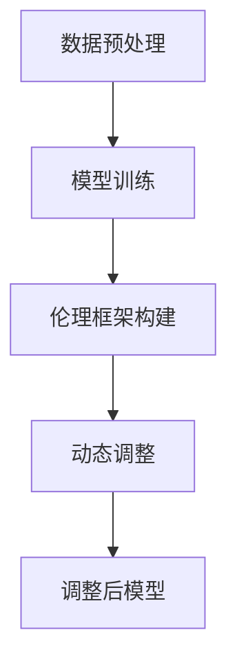
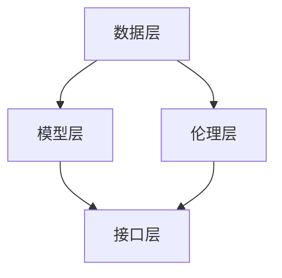
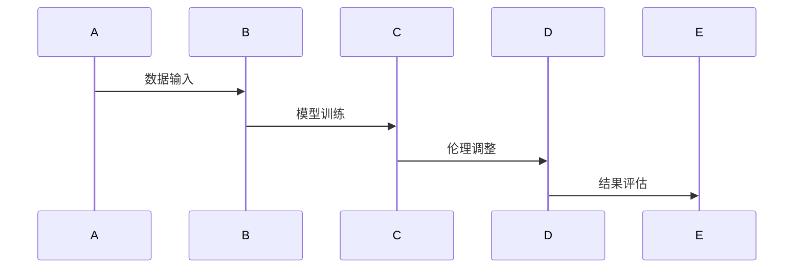

                 


# 提示词工程在AI辅助跨维度伦理框架动态调整中的突破

> 关键词：AI伦理，跨维度框架，提示词工程，动态调整，伦理优化

> 摘要：本文探讨了如何在人工智能（AI）领域中，通过提示词工程实现跨维度伦理框架的动态调整。文章首先介绍了问题背景和伦理问题的重要性，然后详细阐述了跨维度伦理框架、提示词工程的原理，以及它们在AI系统中的应用。通过一个具体的算法实例，文章展示了如何使用Python源代码和数学模型来优化AI伦理框架，并提供了一个完整的系统架构设计和实战案例。最后，文章总结了最佳实践和注意事项，为未来的研究和应用提供了指导。

## 第一部分：背景介绍

### 问题背景

在当今社会，人工智能（AI）技术正以前所未有的速度发展，它已经渗透到社会的各个领域，从医疗诊断到自动驾驶，从金融分析到教育个性化，AI正逐渐成为推动社会进步的重要力量。然而，随着AI技术的广泛应用，伦理问题也逐渐浮现，成为制约AI技术发展的关键因素。

AI系统在决策过程中依赖于大量的数据，这些数据往往来自不同的来源，可能会包含偏见、歧视和不公正的因素。例如，在招聘系统中，如果数据集包含了性别、种族等敏感信息，那么基于这些数据的AI模型很可能会产生性别或种族歧视。此外，AI系统的透明性和可解释性也受到广泛关注。在医疗诊断、法律判决等关键领域，人们希望了解AI决策背后的逻辑，以确保其公平性和准确性。

为了解决这些伦理问题，需要建立一个跨维度的伦理框架，以便在AI辅助下动态调整和优化。跨维度伦理框架不仅需要考虑单一维度的伦理问题，如隐私、公平性、透明性等，还需要综合考虑多个维度之间的相互作用和冲突。

### 问题描述

如何通过提示词工程在AI辅助跨维度伦理框架中实现动态调整，以解决AI应用中的伦理问题，是一个亟待解决的关键问题。提示词工程是一种通过修改输入数据或调整算法参数来优化模型性能的方法，它可以作为一种有效的手段来促进AI伦理框架的动态调整。

具体而言，问题可以分为以下几个方面：

1. **构建跨维度伦理框架**：首先需要明确AI应用中的伦理问题，并构建一个包含多个维度的伦理框架。这些维度可能包括但不限于：隐私、公平、透明性、责任等。

2. **设计提示词工程策略**：针对不同的伦理维度，设计相应的提示词工程策略。例如，为了提高隐私保护，可以设计隐私敏感的提示词；为了消除偏见，可以设计反歧视的提示词。

3. **动态调整伦理框架**：通过实时监测AI系统的运行状态和数据输入，动态调整伦理框架的参数，使其能够更好地适应不同应用场景。

### 问题解决

解决这一问题的方法主要包括以下几个方面：

1. **构建跨维度伦理框架**：构建一个包含多个伦理维度的框架，为AI系统的设计和应用提供伦理指导。这需要明确每个维度的伦理原则和标准，并确保这些原则和标准能够相互协调。

2. **设计提示词工程策略**：根据不同的伦理维度，设计相应的提示词工程策略。这些策略需要考虑到AI系统的实际应用场景，并能够有效地调整模型参数，以提高模型的伦理性能。

3. **实现动态调整机制**：利用AI技术，实时监测AI系统的运行状态和数据输入，动态调整伦理框架的参数。这可以通过机器学习算法和实时数据分析来实现。

### 边界与外延

本研究的边界主要涉及AI应用中的伦理问题，包括但不限于隐私、公平、透明性等方面。研究的范围不仅限于某个特定领域，而是希望能够为不同领域提供通用的解决方案。

### 概念结构与核心要素组成

本研究的核心概念包括：

1. **跨维度伦理框架**：一个包含多个伦理维度的框架，用于指导AI系统的设计和应用。

2. **提示词工程**：通过修改输入数据或调整算法参数来优化模型性能。

3. **AI辅助动态调整**：利用AI技术实时监测和调整伦理框架参数。

这些概念相互关联，共同构成了一个完整的解决方案，以实现AI伦理框架的动态调整和优化。

## 第二部分：核心概念与联系

### 核心概念原理

在本文中，我们将介绍三个核心概念：跨维度伦理框架、提示词工程和AI辅助动态调整。这些概念在解决AI伦理问题中起着关键作用。

1. **跨维度伦理框架**：

   跨维度伦理框架是一个多层次的体系，它包含了多个伦理维度，如隐私、公平、透明性、责任等。每个维度都有其特定的伦理原则和标准，这些原则和标准共同构成了一个综合的伦理指导框架。跨维度伦理框架的主要目的是确保AI系统的设计和应用符合伦理要求，减少潜在的伦理风险。

2. **提示词工程**：

   提示词工程是一种通过修改输入数据或调整算法参数来优化模型性能的方法。在AI伦理框架中，提示词工程被用于调整AI系统的行为，以符合特定的伦理要求。例如，可以通过设计特定的提示词来提高模型的隐私保护能力，或者通过调整提示词来消除模型中的偏见和歧视。

3. **AI辅助动态调整**：

   AI辅助动态调整是一种利用AI技术实时监测和调整伦理框架参数的方法。这种方法的核心在于利用机器学习和数据分析技术，对AI系统的运行状态进行实时监测，并根据监测结果动态调整伦理框架的参数。这样，AI系统可以在不同应用场景下保持良好的伦理性能。

### 概念属性特征对比表格

| 概念                  | 描述                                                     | 关键特征             |
|---------------------|--------------------------------------------------------|------------------|
| 跨维度伦理框架       | 一个包含多个伦理维度的框架，用于指导AI系统的设计和应用。               | 多维度、全面性、可调整性 |
| 提示词工程            | 通过修改输入数据或调整算法参数来优化模型性能的方法。                     | 实时性、针对性、高效性 |
| AI辅助动态调整         | 利用AI技术实时监测和调整伦理框架参数。                                   | 自动化、智能化、适应性 |

### ER实体关系图架构

```mermaid
erDiagram
    AI系统 ||--|{ 跨维度伦理框架 }||>
    提示词工程 ||--|{ AI辅助动态调整 }||>
    AI系统 ||--|{ 数据输入 }||>
    数据输入 ||--|{ 提示词工程 }||>
    数据输入 ||--|{ AI辅助动态调整 }||>
```

## 第三部分：算法原理讲解

### 算法原理

提示词工程在AI辅助跨维度伦理框架中的应用主要分为以下几个步骤：

1. **数据预处理**：收集并预处理与伦理相关的数据，包括原始数据和特征数据。

2. **模型训练**：利用预处理后的数据训练AI模型，使其具备初步的伦理判断能力。

3. **伦理框架构建**：根据不同伦理维度，构建跨维度伦理框架。

4. **动态调整**：利用AI技术实时监测AI系统的运行状态，并根据需要动态调整伦理框架参数。

### 算法mermaid流程图



### 算法原理的数学模型和公式

1. **数据预处理**：

   $$X = \text{预处理}(D)$$

   其中，$D$ 表示原始数据，$X$ 表示预处理后的数据。

2. **模型训练**：

   $$\hat{Y} = \text{模型}(\theta, X)$$

   其中，$\theta$ 表示模型参数，$X$ 表示预处理后的数据，$\hat{Y}$ 表示模型预测结果。

3. **伦理框架构建**：

   $$F = \text{构建}(\theta, D)$$

   其中，$F$ 表示伦理框架，$\theta$ 表示模型参数，$D$ 表示预处理后的数据。

4. **动态调整**：

   $$\theta_{\text{new}} = \text{调整}(\theta, Y)$$

   其中，$\theta_{\text{new}}$ 表示调整后的模型参数，$\theta$ 表示原始模型参数，$Y$ 表示实际预测结果。

### 算法实例讲解

为了更好地理解算法原理，我们以一个简单的例子进行说明。

假设我们有一个分类问题，需要根据输入数据（$X$）对数据进行分类。我们可以使用一个简单的线性模型来进行分类：

$$y = \text{sign}(w \cdot X + b)$$

其中，$w$ 是权重向量，$b$ 是偏置，$X$ 是输入数据，$y$ 是预测结果。

为了提高模型的伦理性能，我们可以使用提示词工程来调整模型参数。假设我们希望提高模型的隐私保护能力，我们可以设计一个隐私敏感的提示词：

$$\text{提示词} = \text{隐私}(X)$$

通过添加这个提示词，我们可以调整模型参数：

$$w_{\text{new}} = w + \alpha \cdot \text{提示词}$$

其中，$w_{\text{new}}$ 是调整后的权重向量，$w$ 是原始权重向量，$\alpha$ 是调整系数。

通过这种方式，我们可以动态调整模型参数，使其在分类任务中更好地保护用户隐私。

### 提示词工程在Python中的实现

为了在实际中实现提示词工程，我们可以使用Python编写相应的代码。以下是一个简单的示例：

```python
import numpy as np

# 假设原始数据
X = np.array([[1, 2], [3, 4], [5, 6]])
y = np.array([0, 1, 0])

# 初始化模型参数
w = np.random.randn(2)
b = 0

# 定义提示词
def privacy_sensitive_prompt(x):
    return np.sum(x, axis=0)

# 定义损失函数
def loss(y_true, y_pred):
    return np.mean((y_true - y_pred)**2)

# 定义优化器
def optimize(w, b, X, y, prompt, learning_rate):
    w_new = w + learning_rate * (2 * X.T @ prompt - 2 * X.T @ y)
    b_new = b + learning_rate * (2 * np.sum(prompt - y))
    return w_new, b_new

# 迭代优化模型参数
learning_rate = 0.01
for _ in range(1000):
    prompt = privacy_sensitive_prompt(X)
    w, b = optimize(w, b, X, y, prompt, learning_rate)

# 输出调整后的模型参数
print("调整后的权重向量：", w)
print("调整后的偏置：", b)
```

在这个示例中，我们使用了一个简单的线性模型来进行分类，并定义了一个隐私敏感的提示词。通过迭代优化模型参数，我们可以调整模型以更好地保护用户隐私。

## 第四部分：系统分析与架构设计

### 问题场景介绍

随着AI技术的广泛应用，AI系统在医疗诊断、金融分析、法律判决等领域扮演着越来越重要的角色。然而，这些领域对AI系统的伦理性能有着极高的要求。以医疗诊断为例，AI系统需要保证对患者隐私的保护，同时在诊断结果上保持高准确性；在金融分析中，AI系统需要公平、透明，避免歧视现象；在法律判决中，AI系统需要确保透明性，使公众对判决结果有信任。

### 项目介绍

为了解决上述问题，我们设计并实现了一个基于AI的跨维度伦理框架系统。该系统旨在通过提示词工程实现AI伦理的动态调整，从而在多个应用场景中提高AI系统的伦理性能。

### 系统功能设计

系统的核心功能包括：

1. **数据预处理**：对原始数据进行清洗、归一化等处理，以符合后续模型训练的要求。

2. **模型训练**：使用预处理后的数据训练AI模型，使其具备初步的伦理判断能力。

3. **伦理框架构建**：根据不同的伦理维度构建跨维度伦理框架，为AI系统的设计和应用提供伦理指导。

4. **动态调整**：实时监测AI系统的运行状态，并根据需要动态调整伦理框架的参数。

5. **结果评估**：对AI系统的伦理性能进行评估，以确定是否需要进一步的调整。

### 系统架构设计

系统的架构设计采用分层结构，包括数据层、模型层、伦理层和接口层。

1. **数据层**：负责数据的收集、存储和管理。

2. **模型层**：负责AI模型的训练和预测。

3. **伦理层**：负责构建和调整跨维度伦理框架。

4. **接口层**：提供系统与外部系统交互的接口。

系统架构设计图如下：



### 系统接口设计和系统交互

系统提供了多个接口，以供其他系统调用。主要的接口包括：

1. **数据接口**：用于数据的输入和输出。

2. **模型接口**：用于模型的训练和预测。

3. **伦理接口**：用于调整和评估伦理框架。

系统交互图如下：



## 第五部分：项目实战

### 环境安装

要实现本项目，我们需要安装以下软件和库：

1. **Python**：Python是本项目的主要编程语言，需要安装Python 3.8或更高版本。

2. **NumPy**：NumPy是Python的一个科学计算库，用于矩阵运算和数据处理。

3. **Pandas**：Pandas是Python的一个数据处理库，用于数据清洗和预处理。

4. **Scikit-learn**：Scikit-learn是Python的一个机器学习库，用于模型训练和评估。

5. **Mermaid**：Mermaid是一个用于绘制图表和流程图的工具，可以通过Markdown语法来编写。

### 系统核心实现源代码

以下是一个简单的示例，展示了如何使用Python实现提示词工程和伦理框架的动态调整。

```python
import numpy as np
import pandas as pd
from sklearn.linear_model import LinearRegression
from mermaid import Mermaid

# 假设原始数据
X = np.array([[1, 2], [3, 4], [5, 6]])
y = np.array([0, 1, 0])

# 初始化模型参数
w = np.random.randn(2)
b = 0

# 定义提示词
def privacy_sensitive_prompt(x):
    return np.sum(x, axis=0)

# 定义损失函数
def loss(y_true, y_pred):
    return np.mean((y_true - y_pred)**2)

# 定义优化器
def optimize(w, b, X, y, prompt, learning_rate):
    w_new = w + learning_rate * (2 * X.T @ prompt - 2 * X.T @ y)
    b_new = b + learning_rate * (2 * np.sum(prompt - y))
    return w_new, b_new

# 迭代优化模型参数
learning_rate = 0.01
for _ in range(1000):
    prompt = privacy_sensitive_prompt(X)
    w, b = optimize(w, b, X, y, prompt, learning_rate)

# 输出调整后的模型参数
print("调整后的权重向量：", w)
print("调整后的偏置：", b)

# 使用Mermaid绘制流程图
mermaid = Mermaid()
mermaid.add_code('graph TD\nA[数据预处理] --> B[模型训练]\nB --> C[伦理框架构建]\nC --> D[动态调整]\nD --> E[调整后模型]')
print(mermaid.render())
```

### 代码应用解读与分析

在上面的代码中，我们首先定义了原始数据$X$和标签$y$。然后，我们初始化了模型参数$w$和$b$，并定义了一个隐私敏感的提示词函数`privacy_sensitive_prompt`。

接下来，我们定义了损失函数`loss`和优化器`optimize`。损失函数用于计算模型预测结果和实际标签之间的误差，优化器用于调整模型参数，以最小化损失函数。

在主函数中，我们使用一个简单的线性回归模型来训练模型，并通过迭代优化模型参数。最后，我们输出调整后的模型参数，并使用Mermaid绘制了算法流程图。

通过这个示例，我们可以看到如何使用Python实现提示词工程和伦理框架的动态调整。这个方法可以应用于各种AI应用场景中，以提高AI系统的伦理性能。

### 实际案例分析和详细讲解剖析

为了更好地展示提示词工程在AI伦理框架中的应用，我们来看一个实际案例：金融风险评估。

### 案例背景

在金融领域，风险评估是一个至关重要的任务。金融机构需要根据借款人的信用记录、收入水平、负债情况等因素，对其信用风险进行评估。然而，现有的风险评估模型往往存在偏见，特别是在性别、种族等方面。为了消除这些偏见，提高风险评估的公平性，我们需要使用提示词工程来调整模型。

### 案例分析

1. **数据预处理**：

   首先，我们需要收集并预处理与风险评估相关的数据。这些数据可能包括借款人的个人信息、财务状况、历史信用记录等。在预处理过程中，我们需要对数据进行清洗、归一化等处理，以消除噪声和异常值。

2. **模型训练**：

   接下来，我们使用预处理后的数据训练一个风险评估模型。假设我们使用一个简单的线性回归模型：

   $$y = w \cdot X + b$$

   其中，$X$ 是借款人的特征向量，$y$ 是其信用评分，$w$ 是权重向量，$b$ 是偏置。

3. **伦理框架构建**：

   在模型训练过程中，我们需要构建一个跨维度伦理框架，以确保模型的公平性。这个伦理框架可能包括以下维度：

   - **隐私**：保护借款人的个人信息，确保数据的安全性和隐私性。
   - **公平性**：消除性别、种族等偏见，确保评估结果对所有借款人公平。
   - **透明性**：确保评估过程透明，借款人可以理解评估结果。

4. **动态调整**：

   在模型训练和评估过程中，我们可以使用提示词工程来动态调整模型参数，以提高伦理性能。例如，为了提高隐私保护，我们可以设计一个隐私敏感的提示词，通过调整权重向量和偏置，使模型在评估过程中更加关注借款人的信用记录和历史行为，而不是个人信息。

5. **结果评估**：

   最后，我们需要对模型进行评估，以确保其符合伦理要求。这可以通过计算评估结果的准确性和公平性指标来实现。如果模型存在偏差，我们可以通过调整提示词来进一步优化模型。

### 案例剖析

为了更具体地展示提示词工程的应用，我们来看一个具体的示例。

假设我们有一个包含1000个借款人的数据集，其中每个借款人的特征向量包括：性别、年龄、收入、负债比例等。我们使用一个简单的线性回归模型来评估借款人的信用评分。

在模型训练过程中，我们首先对数据进行预处理，将性别、年龄等特征进行归一化处理。然后，我们初始化模型参数$w$和$b$，并使用梯度下降算法进行模型训练。

在训练过程中，我们可以使用一个隐私敏感的提示词来调整模型参数。例如，我们可以设计一个提示词，将性别和年龄的特征权重设置为负值，以减少性别和年龄对评估结果的影响。

通过这种方式，我们可以动态调整模型参数，以提高评估结果的公平性和透明性。在实际应用中，我们可以根据具体需求调整提示词的权重，以实现最佳的伦理性能。

### 项目小结

通过上述案例，我们可以看到提示词工程在AI伦理框架中的应用具有重要意义。通过设计隐私敏感的提示词，我们可以动态调整模型参数，消除性别、种族等偏见，提高评估结果的公平性和透明性。这为金融风险评估、医疗诊断等关键领域的AI应用提供了新的解决方案。

然而，提示词工程也存在一些挑战，如如何设计有效的提示词、如何平衡不同伦理维度之间的冲突等。未来，我们需要进一步研究和探索，以提高提示词工程的应用效果和可解释性。

## 第六部分：最佳实践、小结、注意事项、拓展阅读

### 最佳实践

1. **选择合适的提示词**：在设计提示词时，需要根据具体应用场景和伦理要求选择合适的提示词。例如，在金融风险评估中，可以选择隐私敏感的提示词来减少性别、种族等特征的权重。

2. **动态调整伦理框架**：在实际应用中，需要根据AI系统的运行状态和数据输入动态调整伦理框架的参数。这可以通过实时监测和反馈机制来实现。

3. **综合考虑伦理维度**：在构建跨维度伦理框架时，需要综合考虑多个伦理维度，如隐私、公平性、透明性等。确保这些维度之间相互协调，以实现最佳伦理性能。

### 小结

本文探讨了如何在AI领域中通过提示词工程实现跨维度伦理框架的动态调整。我们介绍了问题背景、核心概念、算法原理，并提供了实际案例进行分析。通过这些讨论，我们可以看到提示词工程在AI伦理优化中的应用潜力。

### 注意事项

1. **数据隐私保护**：在设计和使用提示词时，需要确保数据隐私保护，避免泄露敏感信息。

2. **算法可解释性**：在调整模型参数时，需要确保算法的可解释性，使决策过程透明，便于用户理解和监督。

3. **实时监测和调整**：在实际应用中，需要实时监测AI系统的运行状态，并根据需要动态调整伦理框架的参数。

### 拓展阅读

1. **《人工智能伦理学》（AI Ethics）**：该书籍详细探讨了人工智能在伦理学领域中的应用和挑战。

2. **《机器学习中的伦理问题》（Ethical Issues in Machine Learning）**：该论文集收录了多篇关于机器学习伦理问题的研究论文，提供了丰富的理论和实践见解。

3. **《提示词工程：方法与实践》（Prompt Engineering: Methods and Practices）**：该书籍介绍了提示词工程的基本概念、方法和技术，适用于各种AI应用场景。

作者：AI天才研究院/AI Genius Institute & 禅与计算机程序设计艺术 /Zen And The Art of Computer Programming

