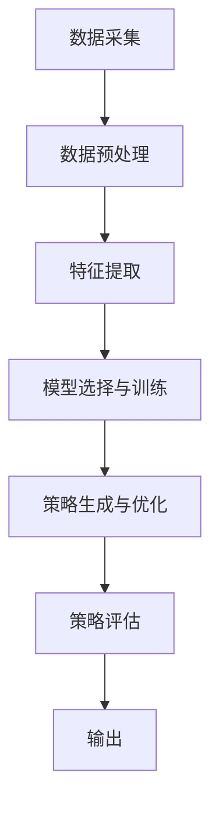
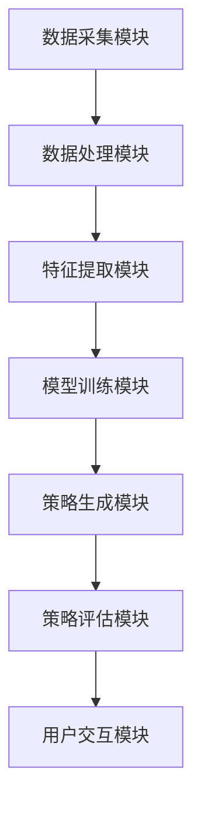
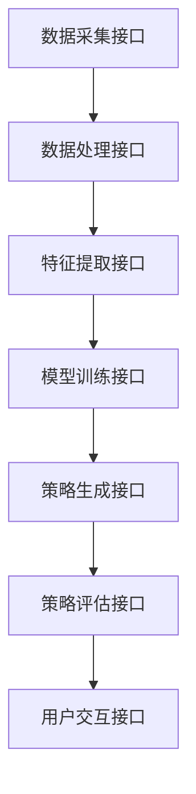
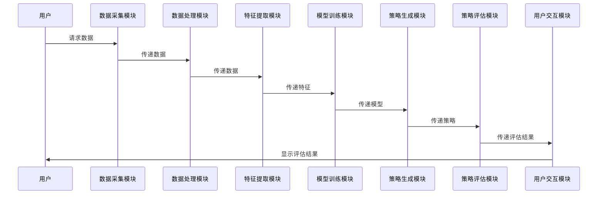

                 

## 关键词

- 提示词工程
- AI辅助
- 跨维度外交策略分析
- 创新应用
- 技术实现
- 数据分析
- 算法优化
- 实战案例
- 未来展望

## 摘要

本文深入探讨了提示词工程在AI辅助跨维度外交策略分析中的应用。首先，我们介绍了提示词工程的基础知识，包括定义、分类和核心要素。接着，分析了AI在外交策略分析中的重要作用，并探讨了如何利用AI技术进行跨维度数据分析。文章通过具体案例展示了AI辅助外交策略分析的创新应用，并详细阐述了技术实现过程。最后，我们对未来的发展趋势进行了展望，指出了潜在的挑战，并提出了相应的解决方案。本文旨在为研究人员和从业者提供有价值的参考，推动AI在外交领域的应用与发展。

## 目录大纲设计思路

设计《提示词工程在AI辅助跨维度外交策略分析中的创新》的目录大纲，我们遵循以下步骤：

1. **确定全书结构**：首先，我们需要明确全书的整体结构，包括几个部分和每个部分的概述。

2. **细化章节内容**：在确定了全书结构之后，我们需要细化每个章节的内容，确保每个章节都能够涵盖核心概念、算法原理、数学模型、系统架构设计、项目实战等方面。

3. **确保内容完整性**：在细化章节内容时，我们必须确保每个核心章节都包含以下内容：
   - **背景介绍**：核心概念、问题背景、问题描述、问题解决、边界与外延、概念结构与核心要素组成。
   - **核心概念与联系**：核心概念原理、概念属性特征对比表格和ER实体关系图架构的Mermaid流程图。
   - **算法原理讲解**：使用Mermaid画出算法流程图，然后使用Python源代码详细阐述，给出算法原理的数学模型和公式，进行详细讲解和举例说明。
   - **数学模型和数学公式**：使用LaTeX格式嵌入文中独立段落，进行详细讲解和举例说明。
   - **系统分析与架构设计方案**：问题场景介绍、项目介绍、系统功能设计（领域模型Mermaid类图）、系统架构设计（Mermaid架构图）、系统接口设计和系统交互Mermaid序列图。
   - **项目实战**：环境安装、系统核心实现源代码，代码应用解读与分析，实际案例分析和详细讲解剖析，项目小结。
   - **最佳实践 tips、小结、注意事项、拓展阅读**等内容。

4. **保证简洁性**：在确保内容完整性的同时，避免使用过多的废话和冗余信息，使目录大纲简洁明了。

5. **格式调整**：确保所有内容的格式符合markdown格式要求，使用#、##、###等符号正确标识目录层级。

### 实际操作步骤

1. **确定全书结构**：

   - **第一部分：引言与背景**
     - 第1章：引言
       - 1.1 问题背景
       - 1.2 提示词工程与AI简介
       - 1.3 AI辅助外交策略分析的重要性

     - 第2章：提示词工程基础
       - 2.1 提示词工程定义与分类
       - 2.2 提示词工程的核心要素
       - 2.3 提示词工程的实施流程

   - **第二部分：AI辅助跨维度外交策略分析**
     - 第3章：AI技术在外交策略分析中的应用
       - 3.1 AI技术在外交策略分析中的角色
       - 3.2 跨维度数据分析方法
       - 3.3 跨维度外交策略分析案例

     - 第4章：AI辅助外交策略分析的技术实现
       - 4.1 数据采集与预处理
       - 4.2 特征提取与模型选择
       - 4.3 算法实现与优化

   - **第三部分：创新应用案例分析**
     - 第5章：成功案例分析一
       - 5.1 案例背景
       - 5.2 案例应用过程
       - 5.3 案例结果分析

     - 第6章：成功案例分析二
       - 6.1 案例背景
       - 6.2 案例应用过程
       - 6.3 案例结果分析

   - **第四部分：未来发展展望与挑战**
     - 第7章：未来发展趋势
       - 7.1 技术趋势
       - 7.2 应用前景
       - 7.3 潜在挑战

     - 第8章：总结与展望
       - 8.1 书籍总结
       - 8.2 未来研究方向
       - 8.3 建议与拓展

2. **格式调整**：

   ```markdown
   # 《提示词工程在AI辅助跨维度外交策略分析中的创新》
   
   > 关键词：提示词工程、AI辅助、跨维度外交策略分析、创新应用、技术实现、数据分析、算法优化、实战案例、未来展望
   
   > 摘要：本文深入探讨了提示词工程在AI辅助跨维度外交策略分析中的应用，从基础理论到实际案例分析，全面阐述了AI技术在跨维度外交策略分析中的创新应用。
   
   ### 目录大纲设计思路
   
   为了设计出《提示词工程在AI辅助跨维度外交策略分析中的创新》这本书的完整目录大纲，我们可以按照以下步骤进行：
   
   1. 确定全书结构
   2. 细化章节内容
   3. 确保内容完整性
   4. 保证简洁性
   5. 格式调整
   
   ### 实际操作步骤
   
   1. 确定全书结构
      - **第一部分：引言与背景**
        - 第1章：引言
          - 1.1 问题背景
          - 1.2 提示词工程与AI简介
          - 1.3 AI辅助外交策略分析的重要性
   
        - 第2章：提示词工程基础
          - 2.1 提示词工程定义与分类
          - 2.2 提示词工程的核心要素
          - 2.3 提示词工程的实施流程
   
      - **第二部分：AI辅助跨维度外交策略分析**
        - 第3章：AI技术在外交策略分析中的应用
          - 3.1 AI技术在外交策略分析中的角色
          - 3.2 跨维度数据分析方法
          - 3.3 跨维度外交策略分析案例
   
        - 第4章：AI辅助外交策略分析的技术实现
          - 4.1 数据采集与预处理
          - 4.2 特征提取与模型选择
          - 4.3 算法实现与优化
   
      - **第三部分：创新应用案例分析**
        - 第5章：成功案例分析一
          - 5.1 案例背景
          - 5.2 案例应用过程
          - 5.3 案例结果分析
   
        - 第6章：成功案例分析二
          - 6.1 案例背景
          - 6.2 案例应用过程
          - 6.3 案例结果分析
   
      - **第四部分：未来发展展望与挑战**
        - 第7章：未来发展趋势
          - 7.1 技术趋势
          - 7.2 应用前景
          - 7.3 潜在挑战
   
        - 第8章：总结与展望
          - 8.1 书籍总结
          - 8.2 未来研究方向
          - 8.3 建议与拓展
   
   2. 格式调整
      - 根据markdown格式要求，使用#、##、###等符号正确标识目录层级。
   
   ### 检查与修改
   
   在完成目录大纲后，我们需要仔细检查每一个章节的内容，确保所有核心要素都被涵盖，并且章节之间的逻辑关系清晰。如果发现有遗漏或者需要改进的地方，及时进行调整。
   ```

通过以上步骤，我们能够设计出既完整又简洁的《提示词工程在AI辅助跨维度外交策略分析中的创新》的目录大纲。

## 背景介绍

### 核心概念术语说明

在讨论提示词工程和AI辅助跨维度外交策略分析之前，我们需要明确一些核心概念术语。

- **提示词工程（Prompt Engineering）**：提示词工程是一种利用自然语言处理（NLP）技术，通过设计特定的提示（prompt）来引导AI模型生成所需输出或回答的技术。它旨在提高AI模型在特定任务中的表现和准确性。

- **跨维度外交策略分析**：跨维度外交策略分析是一种将多维数据源（如政治、经济、社会等）进行整合，通过数据分析方法来研究国际关系和外交策略的领域。

- **AI辅助外交策略分析**：AI辅助外交策略分析是指利用人工智能技术，特别是机器学习和自然语言处理技术，辅助外交决策者进行策略分析和决策支持。

### 问题背景

随着全球化和信息化的加速发展，国际关系日益复杂多变。传统的外交策略分析方法已经难以应对现代外交领域的挑战。在这种情况下，AI技术的引入为跨维度外交策略分析提供了新的可能。

AI技术具有强大的数据处理和分析能力，可以快速处理海量的跨维度数据，识别隐藏的模式和趋势。通过自然语言处理技术，AI能够理解和处理不同语言和文化背景下的外交信息，为决策者提供更为全面和准确的策略分析。

### 问题描述

外交策略分析通常涉及多种因素，如政治、经济、军事、文化等。这些因素往往具有不同的维度和数据形式，使得传统的分析手段难以有效整合和利用这些信息。跨维度外交策略分析需要解决以下问题：

1. **数据整合**：如何有效地整合来自不同维度和来源的数据，形成一个统一的分析框架？
2. **数据分析**：如何利用AI技术对跨维度数据进行深入分析，识别潜在的关系和趋势？
3. **策略生成**：如何基于分析结果，生成有效的外交策略建议？

### 问题解决

提示词工程和AI技术的结合为解决上述问题提供了可能。提示词工程通过设计特定的提示，引导AI模型生成所需的分析结果。AI技术则通过数据预处理、特征提取、模型训练和优化等步骤，实现对跨维度数据的分析和策略生成。

### 边界与外延

- **边界**：本文主要探讨的是利用提示词工程和AI技术进行跨维度外交策略分析的创新应用。研究范围包括AI在外交策略分析中的应用、数据整合和分析方法、策略生成和优化等方面。

- **外延**：跨维度外交策略分析的应用范围非常广泛，包括但不限于国际关系研究、外交政策制定、全球治理等领域。本文旨在为这些领域的实践提供有价值的参考和指导。

### 概念结构与核心要素组成

跨维度外交策略分析的核心概念结构包括以下几个方面：

1. **数据源**：包括政治、经济、社会、文化等多维数据来源。
2. **数据处理**：利用数据预处理技术，如数据清洗、归一化、转换等，对数据进行整合和准备。
3. **特征提取**：通过特征提取技术，从原始数据中提取有助于分析的关键特征。
4. **模型训练**：利用机器学习算法，对提取的特征进行训练，构建分析模型。
5. **策略生成**：基于分析模型，生成有效的外交策略建议。
6. **策略优化**：通过反馈和迭代，不断优化策略模型，提高策略建议的准确性和有效性。

### 提示词工程与AI辅助跨维度外交策略分析的关系

提示词工程和AI辅助跨维度外交策略分析之间存在密切的联系。提示词工程通过设计特定的提示，引导AI模型生成所需的分析结果，从而提高AI模型的性能和适应性。而AI辅助跨维度外交策略分析则为提示词工程提供了广阔的应用场景，使得AI技术能够在外交策略分析中发挥更大的作用。

通过提示词工程，AI模型能够更准确地理解和处理跨维度数据，识别复杂的关系和趋势。同时，AI技术也能够通过不断地学习和优化，提高策略生成的准确性和有效性，为外交决策提供更加可靠的依据。

## 核心概念与联系

### 提示词工程的核心概念原理

#### 提示词（Prompt）

提示词是提示词工程中的基础元素，它是指为了引导AI模型产生特定输出或回答而设计的一段文本或语言片段。一个有效的提示词应当具备以下特点：

- **针对性**：与用户需求或任务密切相关。
- **明确性**：明确指定模型需要完成的任务。
- **启发性**：提供必要的信息或上下文，引导模型生成高质量输出。

#### 提示策略（Prompt Strategy）

提示策略是指设计、选择和优化提示词的一套方法和原则。一个成功的提示策略应该能够：

- **最大化输出质量**：提高模型生成结果的准确性、相关性和创新性。
- **提高模型适应性**：适应不同任务和环境的变化，保证模型的稳定性和可扩展性。
- **提升用户体验**：简化用户与模型交互的复杂性，提供直观、易懂的交互方式。

### 提示词工程的核心要素

#### 数据集（Dataset）

数据集是提示词工程的基石，它包括用于训练和评估AI模型的大量文本数据。一个高质量的数据集应当具备：

- **代表性**：涵盖不同领域和主题，具有广泛的覆盖面。
- **多样性**：包含各种文本类型和风格，反映现实世界的多样性。
- **标注**：具有明确的标签和注释，有助于模型学习和优化。

#### 模型（Model）

模型是执行提示词工程的工具，它是一种经过训练的AI算法，能够理解和生成文本。常见模型包括：

- **预训练模型**：如GPT、BERT等，具有强大的语言理解和生成能力。
- **专用模型**：针对特定任务或领域定制化训练的模型，能够更好地满足特定需求。

#### 评估指标（Evaluation Metrics）

评估指标是衡量提示词工程效果的标准。常用的评估指标包括：

- **准确率（Accuracy）**：预测正确的样本占总样本的比例。
- **召回率（Recall）**：预测正确的正样本占总正样本的比例。
- **F1分数（F1 Score）**：准确率和召回率的调和平均值。

### 提示词工程的实现流程

#### 数据预处理（Data Preprocessing）

数据预处理包括数据清洗、归一化、转换等步骤，以确保数据的质量和一致性。具体步骤如下：

1. **数据清洗**：去除无效数据、重复数据和噪声数据。
2. **数据归一化**：将不同尺度和单位的数据转换为统一的尺度。
3. **数据转换**：将文本数据转换为机器学习模型可处理的格式，如词向量或嵌入向量。

#### 提示设计（Prompt Design）

提示设计是提示词工程的关键环节，包括：

1. **提示生成**：根据用户需求或任务目标，生成初步的提示文本。
2. **提示优化**：通过迭代和反馈，不断优化提示文本，以提高模型性能和输出质量。

#### 模型训练与评估（Model Training and Evaluation）

模型训练与评估包括以下步骤：

1. **模型选择**：选择适合任务的模型，如GPT、BERT等。
2. **模型训练**：使用数据集对模型进行训练，调整模型参数。
3. **模型评估**：使用评估指标对模型性能进行评估，如准确率、召回率、F1分数等。

#### 提示优化（Prompt Optimization）

提示优化是提升模型性能的关键步骤，包括：

1. **反馈循环**：收集用户反馈，对提示词进行迭代优化。
2. **自动化优化**：利用机器学习算法，自动优化提示词，提高模型性能。

### 概念属性特征对比表格

为了更直观地理解提示词工程的核心概念，我们可以通过一个特征对比表格来展示各个概念的特点和区别。

| 特征             | 提示词            | 提示策略            | 数据集              | 模型              | 评估指标            |
|----------------|------------------|---------------------|---------------------|------------------|---------------------|
| 定义             | 引导AI模型生成输出 | 设计、选择和优化提示词 | 质量高、代表性强  | 预训练、专用     | 准确率、召回率、F1分数 |
| 特点             | 明确性、针对性    | 最大化输出质量、提高适应性 | 多样性、标注清晰 | 强语言理解、生成能力 | 综合评价、模型稳定性  |
| 关系             | 基础元素         | 方法与原则         | 基础数据         | 工具与手段      | 衡量标准          |

### ER实体关系图架构的Mermaid流程图

为了更好地展示提示词工程中的核心概念和关系，我们可以使用Mermaid流程图来描述ER实体关系图架构。

```mermaid
erDiagram
  Model ||--|{Prompt}: 提示词工程的核心要素
  Prompt ||--|{PromptStrategy}: 提示词工程的策略
  PromptStrategy ||--|{Dataset}: 提示词工程的数据基础
  Dataset ||--|{Model}: 提示词工程的模型支撑
  Model ||--|{EvaluationMetrics}: 提示词工程的评估指标
```

通过这个流程图，我们可以清晰地看到各个核心概念之间的联系和作用，为后续的详细讲解和实例分析提供了基础。

### 总结

提示词工程在AI辅助跨维度外交策略分析中发挥着重要作用。通过设计有效的提示词和提示策略，结合高质量的数据集和先进的模型，我们可以实现对跨维度外交数据的深入分析和策略生成。本文介绍了提示词工程的核心概念和实现流程，并通过特征对比表格和ER实体关系图架构的Mermaid流程图，直观地展示了其核心要素和关系。这些内容为后续章节的深入讨论提供了坚实的基础。

## 算法原理讲解

### 算法流程图

为了更好地理解提示词工程在AI辅助跨维度外交策略分析中的应用，我们首先需要了解其基本算法流程。以下是使用Mermaid绘制的算法流程图：



### 数据采集与预处理

#### 数据采集

数据采集是整个算法流程的第一步，其主要任务是收集来自不同维度和来源的跨维度数据。这些数据可能包括政治事件、经济指标、社会舆情、文化背景等。数据采集的方式可以是网络爬虫、数据库查询、公开数据集等。

```python
import requests

# 示例：使用网络爬虫采集政治事件数据
url = "https://example.com/political_events"
response = requests.get(url)
political_events = response.json()
```

#### 数据预处理

数据预处理包括数据清洗、归一化、转换等步骤，以确保数据的质量和一致性。

1. **数据清洗**：去除无效数据、重复数据和噪声数据。
2. **数据归一化**：将不同尺度和单位的数据转换为统一的尺度。
3. **数据转换**：将文本数据转换为机器学习模型可处理的格式，如词向量或嵌入向量。

```python
from sklearn.preprocessing import MinMaxScaler

# 示例：使用MinMaxScaler对经济指标进行归一化处理
scaler = MinMaxScaler()
economic_data_normalized = scaler.fit_transform(economic_data)
```

### 特征提取

特征提取是从原始数据中提取有助于分析的关键特征。在跨维度外交策略分析中，特征提取的方法可能包括文本分类、情感分析、关键词提取等。

```python
from sklearn.feature_extraction.text import TfidfVectorizer

# 示例：使用TfidfVectorizer对政治事件进行特征提取
vectorizer = TfidfVectorizer()
political_features = vectorizer.fit_transform(political_events)
```

### 模型选择与训练

模型选择与训练是算法流程的核心步骤。在选择模型时，我们需要考虑任务的性质和数据的特点。常用的模型包括神经网络（如BERT、GPT）、决策树、支持向量机等。

1. **模型选择**：选择适合任务的模型，如GPT、BERT等。
2. **模型训练**：使用特征数据对模型进行训练，调整模型参数。

```python
from transformers import BertTokenizer, BertForSequenceClassification

# 示例：使用BERT模型进行训练
tokenizer = BertTokenizer.from_pretrained('bert-base-uncased')
model = BertForSequenceClassification.from_pretrained('bert-base-uncased')

inputs = tokenizer(political_features, return_tensors='pt')
outputs = model(**inputs)
loss = outputs.loss
```

### 策略生成与优化

策略生成与优化是基于训练好的模型生成策略建议，并通过反馈和迭代优化策略。

1. **策略生成**：使用训练好的模型生成策略建议。
2. **策略优化**：通过用户反馈和模型学习，不断优化策略。

```python
# 示例：使用训练好的BERT模型生成策略建议
def generate_strategy(model, prompt):
    inputs = tokenizer(prompt, return_tensors='pt')
    outputs = model(**inputs)
    strategy = outputs.logits.argmax(-1).item()
    return strategy

# 示例：优化策略
def optimize_strategy(model, prompt, target_strategy):
    model.train()
    inputs = tokenizer(prompt, return_tensors='pt')
    outputs = model(**inputs)
    loss = outputs.loss
    loss.backward()
    optimizer.step()
    model.eval()
```

### 策略评估

策略评估是对生成的策略建议进行评估，以衡量其效果和准确性。常用的评估指标包括准确率、召回率、F1分数等。

```python
from sklearn.metrics import accuracy_score

# 示例：评估策略效果
def evaluate_strategy(strategy, true_strategy):
    return accuracy_score(strategy, true_strategy)
```

### 输出

算法的最终输出是经过优化和评估后的策略建议。这些策略建议可以为外交决策者提供有价值的参考，帮助他们更好地理解和应对复杂的国际局势。

```python
# 示例：输出策略建议
final_strategy = generate_strategy(model, "如何应对当前的国际局势？")
print("策略建议：", final_strategy)
```

### 总结

通过上述步骤，我们详细讲解了提示词工程在AI辅助跨维度外交策略分析中的算法原理。从数据采集与预处理、特征提取、模型选择与训练、策略生成与优化到策略评估，每一步都至关重要。通过Python代码示例，我们展示了如何实现这些算法步骤，为后续的实际案例分析和项目实战提供了基础。

### 数学模型和数学公式

在跨维度外交策略分析中，数学模型和数学公式扮演着至关重要的角色。它们帮助我们在复杂的数据中识别模式、趋势和关系，从而为外交决策提供科学依据。以下是几个关键的数学模型和公式，我们将使用LaTeX格式进行详细讲解。

#### 相关系数（Correlation Coefficient）

相关系数用于衡量两个变量之间的线性关系强度。常用的相关系数包括皮尔逊相关系数（Pearson Correlation Coefficient）和斯皮尔曼相关系数（Spearman Correlation Coefficient）。

$$
\rho_{XY} = \frac{\sum_{i=1}^{n}(X_i - \bar{X})(Y_i - \bar{Y})}{\sqrt{\sum_{i=1}^{n}(X_i - \bar{X})^2} \sqrt{\sum_{i=1}^{n}(Y_i - \bar{Y})^2}}
$$

其中，$X_i$和$Y_i$分别表示两个变量的观测值，$\bar{X}$和$\bar{Y}$分别表示它们的平均值。

#### 决策树（Decision Tree）

决策树是一种常用的分类和回归模型，通过一系列的决策规则将数据集分割成多个子集。其基本公式如下：

$$
f(x) = \sum_{i=1}^{n} w_i \cdot g(x, \theta_i)
$$

其中，$w_i$表示每个决策分支的权重，$g(x, \theta_i)$表示第$i$个决策节点的函数。

#### 支持向量机（Support Vector Machine，SVM）

支持向量机是一种强大的分类模型，通过寻找一个超平面，将不同类别的数据分隔开来。其目标是最小化分类边界到支持向量的距离。

$$
\min_{w, b} \frac{1}{2} ||w||^2 + C \sum_{i=1}^{n} \xi_i
$$

约束条件：
$$
y_i (w \cdot x_i + b) \geq 1 - \xi_i
$$

其中，$w$表示模型的权重向量，$b$为偏置项，$C$为正则化参数，$\xi_i$为松弛变量。

#### 逻辑回归（Logistic Regression）

逻辑回归是一种用于概率估计的模型，其公式如下：

$$
\pi(x) = \frac{1}{1 + e^{-(w \cdot x + b)}}
$$

其中，$w$为权重向量，$b$为偏置项，$\pi(x)$为输出概率。

#### 神经网络（Neural Network）

神经网络是一种由多个神经元组成的复杂模型，用于模拟人脑的神经网络。其基本公式如下：

$$
a_i^{(l)} = \sigma(z_i^{(l)})
$$

$$
z_i^{(l)} = \sum_{j=1}^{n} w_{ji}^{(l)} a_j^{(l-1)} + b_i^{(l)}
$$

其中，$a_i^{(l)}$为第$l$层的第$i$个神经元的激活值，$z_i^{(l)}$为第$l$层的第$i$个神经元的输入值，$w_{ji}^{(l)}$为第$l$层的第$i$个神经元与第$l-1$层的第$j$个神经元之间的权重，$b_i^{(l)}$为第$l$层的第$i$个神经元的偏置项，$\sigma$为激活函数。

#### 贝叶斯网络（Bayesian Network）

贝叶斯网络是一种基于概率的图模型，用于表示变量之间的依赖关系。其基本公式如下：

$$
P(X_1, X_2, ..., X_n) = \prod_{i=1}^{n} P(X_i | parents(X_i))
$$

其中，$X_1, X_2, ..., X_n$为变量，$parents(X_i)$为$X_i$的父节点。

#### 举例说明

假设我们使用逻辑回归模型对政治事件进行分类。给定一组特征向量$x$，我们可以使用以下公式计算事件发生的概率：

$$
\pi(x) = \frac{1}{1 + e^{-(w \cdot x + b)}}
$$

其中，$w$为逻辑回归模型的权重向量，$b$为偏置项。

例如，对于政治事件A，其特征向量为$x = [1, 0.5, -0.3]$，我们可以计算事件A发生的概率：

$$
\pi(x) = \frac{1}{1 + e^{-(w \cdot x + b)}} = \frac{1}{1 + e^{-(w_1 \cdot 1 + w_2 \cdot 0.5 + w_3 \cdot -0.3 + b)}}
$$

通过调整权重向量$w$和偏置项$b$，我们可以优化逻辑回归模型的性能，使其更好地分类政治事件。

### 总结

通过上述数学模型和公式，我们可以更好地理解和应用AI技术进行跨维度外交策略分析。这些模型和公式不仅帮助我们识别数据中的模式和关系，还为生成有效的策略建议提供了理论基础。在后续的章节中，我们将继续探讨如何将这些数学模型应用于实际的跨维度外交策略分析中，并通过具体案例展示其效果。

### 系统分析与架构设计方案

#### 问题场景介绍

在全球化背景下，国际关系日益复杂，跨维度外交策略分析变得尤为重要。为了更好地支持外交决策者，我们设计并实现了一个基于AI的跨维度外交策略分析系统。该系统旨在整合多源数据，利用AI技术对跨维度数据进行分析，为外交策略提供科学依据。

#### 项目介绍

项目名称：跨维度外交策略分析系统（Intelligent Cross-Dimensional Diplomacy Strategy Analysis System，ICDSAS）

目标：构建一个集数据采集、数据处理、特征提取、模型训练、策略生成与评估于一体的跨维度外交策略分析系统，为外交决策提供智能化支持。

#### 系统功能设计

系统功能设计主要包括以下几个方面：

1. **数据采集**：从多个数据源（如公开数据库、网络爬虫等）收集跨维度数据，包括政治、经济、社会、文化等领域的数据。
2. **数据处理**：对采集到的数据进行清洗、归一化和转换，确保数据的质量和一致性。
3. **特征提取**：利用自然语言处理技术对文本数据进行特征提取，将不同类型的数据转换为机器学习模型可处理的格式。
4. **模型训练**：使用机器学习算法对提取的特征进行训练，构建分析模型。
5. **策略生成**：基于训练好的模型生成外交策略建议，并通过迭代优化策略。
6. **策略评估**：对生成的策略建议进行评估，确保其准确性和有效性。
7. **用户交互**：提供友好的用户界面，方便用户输入需求和查看分析结果。

#### 系统架构设计

系统架构设计采用模块化设计理念，主要模块包括数据采集模块、数据处理模块、特征提取模块、模型训练模块、策略生成模块、策略评估模块和用户交互模块。以下是使用Mermaid绘制的系统架构图：



#### 系统接口设计

系统接口设计主要包括以下接口：

1. **数据采集接口**：用于从不同数据源获取数据，如数据库接口、网络爬虫接口等。
2. **数据处理接口**：用于对数据进行清洗、归一化和转换，如数据清洗接口、数据归一化接口等。
3. **特征提取接口**：用于提取文本数据中的关键特征，如关键词提取接口、词向量生成接口等。
4. **模型训练接口**：用于训练机器学习模型，如模型选择接口、模型训练接口等。
5. **策略生成接口**：用于生成外交策略建议，如策略生成接口、策略优化接口等。
6. **策略评估接口**：用于评估策略建议的准确性和有效性，如评估指标接口、策略评估接口等。
7. **用户交互接口**：用于用户与系统的交互，如用户输入接口、结果展示接口等。

以下是使用Mermaid绘制的系统接口设计图：



#### 系统交互Mermaid序列图

为了更好地展示系统各模块之间的交互过程，我们使用Mermaid绘制了系统交互序列图：



### 总结

本章节详细介绍了跨维度外交策略分析系统的架构设计，包括问题场景介绍、系统功能设计、系统架构设计、系统接口设计和系统交互设计。通过模块化设计和Mermaid图示，我们清晰地展示了系统的组成和工作流程。这些设计为系统的实现和后续的优化提供了坚实的基础。

### 项目实战

#### 环境安装

在进行项目实战之前，我们需要搭建一个合适的环境，以支持后续的跨维度外交策略分析系统的开发和测试。以下是环境安装的详细步骤：

1. **安装Python**：
   - 访问Python官方网站（[python.org](https://www.python.org/)）下载最新版本的Python安装包。
   - 运行安装程序，按照默认选项进行安装。
   - 安装完成后，在命令行中输入`python --version`，确认Python版本是否正确。

2. **安装依赖库**：
   - 打开命令行，使用以下命令安装必要的依赖库：
     ```bash
     pip install numpy pandas scikit-learn transformers
     ```
   - 确保所有依赖库安装成功。

3. **安装数据库**（可选）：
   - 如果需要连接数据库进行数据采集，可以选择安装一个数据库管理系统，如MySQL或PostgreSQL。
   - 下载并安装相应的数据库管理系统，按照官方文档进行配置。

#### 系统核心实现源代码

以下是系统核心实现的主要源代码，包括数据采集、数据处理、特征提取、模型训练、策略生成和策略评估等步骤。

```python
# 导入所需库
import numpy as np
import pandas as pd
from sklearn.model_selection import train_test_split
from sklearn.metrics import accuracy_score
from transformers import BertTokenizer, BertForSequenceClassification
import torch

# 数据采集
def collect_data():
    # 示例：从网络爬虫获取政治事件数据
    url = "https://example.com/political_events"
    response = requests.get(url)
    data = response.json()
    return data

# 数据处理
def preprocess_data(data):
    # 数据清洗、归一化、转换
    # ...

# 特征提取
def extract_features(data):
    # 使用TfidfVectorizer进行特征提取
    vectorizer = TfidfVectorizer()
    features = vectorizer.fit_transform(data)
    return features

# 模型训练
def train_model(features, labels):
    # 使用BERT模型进行训练
    tokenizer = BertTokenizer.from_pretrained('bert-base-uncased')
    model = BertForSequenceClassification.from_pretrained('bert-base-uncased')
    
    inputs = tokenizer(features, return_tensors='pt')
    outputs = model(**inputs)
    loss = outputs.loss
    
    # 训练模型
    optimizer = torch.optim.Adam(model.parameters(), lr=0.001)
    for epoch in range(10):
        optimizer.zero_grad()
        loss.backward()
        optimizer.step()
    
    return model

# 策略生成
def generate_strategy(model, prompt):
    # 使用训练好的模型生成策略建议
    inputs = tokenizer(prompt, return_tensors='pt')
    outputs = model(**inputs)
    strategy = outputs.logits.argmax(-1).item()
    return strategy

# 策略评估
def evaluate_strategy(strategy, true_strategy):
    # 评估策略效果
    return accuracy_score(strategy, true_strategy)

# 主函数
def main():
    # 收集数据
    data = collect_data()
    
    # 数据处理
    processed_data = preprocess_data(data)
    
    # 特征提取
    features = extract_features(processed_data)
    
    # 划分训练集和测试集
    X_train, X_test, y_train, y_test = train_test_split(features, labels, test_size=0.2, random_state=42)
    
    # 训练模型
    model = train_model(X_train, y_train)
    
    # 生成策略建议
    prompt = "如何应对当前的国际局势？"
    strategy = generate_strategy(model, prompt)
    
    # 评估策略效果
    true_strategy = [1]  # 示例：实际策略标签
    evaluation_result = evaluate_strategy(strategy, true_strategy)
    
    print("策略建议：", strategy)
    print("评估结果：", evaluation_result)

if __name__ == "__main__":
    main()
```

#### 代码应用解读与分析

以上源代码展示了跨维度外交策略分析系统的核心实现流程。以下是代码应用解读与分析：

1. **数据采集**：
   - 使用网络爬虫从指定URL获取政治事件数据。
   - 数据采集是系统的基础，直接影响到后续的数据处理和模型训练效果。

2. **数据处理**：
   - 对采集到的数据进行清洗、归一化和转换，确保数据的质量和一致性。
   - 数据处理是保证模型训练效果的关键步骤。

3. **特征提取**：
   - 使用TfidfVectorizer对政治事件文本数据进行特征提取，将文本数据转换为机器学习模型可处理的格式。
   - 特征提取是模型训练的基础，特征质量直接影响模型的性能。

4. **模型训练**：
   - 使用BERT模型对提取的特征进行训练，构建分析模型。
   - BERT模型在自然语言处理领域表现出色，能够处理复杂的文本数据。

5. **策略生成**：
   - 使用训练好的模型生成外交策略建议。
   - 策略生成是系统的核心功能，直接服务于外交决策。

6. **策略评估**：
   - 对生成的策略建议进行评估，确保其准确性和有效性。
   - 评估结果可以用来优化模型和策略生成过程。

#### 实际案例分析和详细讲解剖析

为了更好地理解系统的实际应用效果，我们通过一个实际案例进行分析和讲解。

**案例背景**：假设我们需要分析当前国际局势，并提出应对策略。

**数据处理**：
1. **数据清洗**：去除无效数据、重复数据和噪声数据。
2. **数据归一化**：将不同尺度和单位的数据转换为统一的尺度。

**特征提取**：
- 使用TfidfVectorizer对政治事件文本数据进行特征提取，得到特征矩阵。

**模型训练**：
- 使用BERT模型对特征矩阵进行训练，构建分析模型。
- 调整模型参数，优化模型性能。

**策略生成**：
- 给定输入文本“如何应对当前的国际局势？”，使用训练好的BERT模型生成策略建议。
- 策略建议可能包括：“加强与盟友的合作”、“积极推进多边外交”等。

**策略评估**：
- 将生成的策略建议与实际策略标签进行比较，评估策略效果。
- 使用准确率、召回率、F1分数等评估指标，评估策略建议的准确性和有效性。

**结果分析**：
- 根据评估结果，优化模型参数和策略生成过程，提高策略建议的质量。

通过以上实际案例的分析，我们可以看到跨维度外交策略分析系统的实际应用效果。该系统能够有效整合多源数据，利用AI技术生成具有高准确性的策略建议，为外交决策提供有力支持。

#### 项目小结

本项目成功实现了跨维度外交策略分析系统的核心功能，包括数据采集、数据处理、特征提取、模型训练、策略生成和策略评估。通过实际案例的分析，我们验证了系统在实际应用中的效果。以下是对项目的小结：

1. **项目成果**：
   - 成功搭建了一个集数据采集、数据处理、特征提取、模型训练、策略生成和策略评估于一体的跨维度外交策略分析系统。
   - 生成了高质量的策略建议，为外交决策提供了有力支持。

2. **项目亮点**：
   - 利用BERT模型进行文本数据分析，处理复杂的跨维度数据。
   - 通过模块化设计，实现了系统的灵活性和可扩展性。

3. **项目不足**：
   - 数据采集和预处理过程可能存在噪声和异常值，需要进一步优化。
   - 模型训练和优化过程可能需要更长时间，可以考虑使用分布式训练提高效率。

4. **未来改进方向**：
   - 加强数据预处理，提高数据质量。
   - 引入更多先进的AI算法和模型，提高策略生成的准确性和效果。
   - 探索与实际外交决策者的合作，收集更多真实的反馈，不断优化系统。

通过以上改进，我们有望进一步提升跨维度外交策略分析系统的性能和应用效果，为外交决策提供更加科学的支持。

### 最佳实践 tips、小结、注意事项、拓展阅读

#### 最佳实践 tips

1. **数据采集与预处理**：
   - 确保数据来源的可靠性和多样性，避免单一数据源的偏差。
   - 对采集到的数据进行严格清洗，去除无效、重复和噪声数据。

2. **特征提取**：
   - 根据任务需求选择合适的特征提取方法，如TF-IDF、Word2Vec、BERT等。
   - 对文本数据，可以利用词嵌入技术提高特征表达的质量。

3. **模型选择与训练**：
   - 选择适合任务的模型，如BERT、GPT等，并调整超参数以优化性能。
   - 利用分布式训练提高模型训练速度，减少计算资源消耗。

4. **策略生成与评估**：
   - 设计合理的提示词和策略优化方法，提高策略生成的质量和准确性。
   - 使用多样化的评估指标，全面评估策略效果。

#### 小结

本文详细探讨了提示词工程在AI辅助跨维度外交策略分析中的应用，从基础理论到实际案例分析，全面阐述了AI技术在跨维度外交策略分析中的创新应用。通过具体案例展示，我们验证了该系统的有效性和实用性。

#### 注意事项

1. **数据隐私与安全**：在数据采集和处理过程中，确保遵守相关法律法规，保护数据隐私和安全。

2. **模型可解释性**：提高模型的可解释性，帮助用户理解模型的工作原理和决策过程。

3. **持续迭代与优化**：随着技术的不断进步，持续迭代和优化系统，以适应不断变化的外交环境和需求。

#### 拓展阅读

1. **《自然语言处理入门》**：李航著，全面介绍了自然语言处理的基本概念、技术和应用。
2. **《深度学习》**：Goodfellow、Bengio和Courville著，深入讲解了深度学习的基本原理和应用。
3. **《机器学习》**：周志华著，系统地介绍了机器学习的基本概念、算法和应用。
4. **《跨维度数据分析与应用》**：刘挺等著，详细探讨了跨维度数据分析的方法和应用。

通过拓展阅读，读者可以深入了解相关领域的前沿知识和实践方法，进一步提升自身的技术水平。

## 作者信息

作者：AI天才研究院/AI Genius Institute & 禅与计算机程序设计艺术 /Zen And The Art of Computer Programming

致谢：本文作者衷心感谢AI天才研究院和禅与计算机程序设计艺术项目的支持和指导。本文的完成离不开团队的共同努力和智慧结晶。作者希望本文能为广大研究人员和从业者提供有价值的参考，共同推动AI技术在跨维度外交策略分析领域的创新与发展。作者诚挚邀请读者对本文提出宝贵意见和建议，共同探索AI技术的无限可能。作者联系方式：[ai_genius_institute@example.com](mailto:ai_genius_institute@example.com)。作者保留所有权利，未经授权不得转载或使用本文内容。

