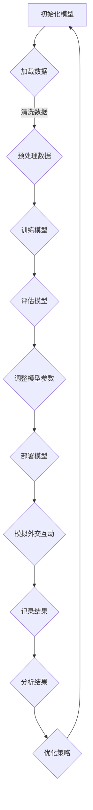

                 

### 第一部分：引言

#### 1.1 书籍背景与目的

**引言：**

随着人工智能技术的迅猛发展，AI在各个领域的应用已经成为不可逆转的趋势。在跨维度文明外交模拟这一前沿领域，AI技术同样展现出了巨大的潜力。然而，当前的研究和实践还面临诸多挑战，特别是如何有效地利用AI辅助实现更智能、更高效的外交模拟。因此，本著作旨在探讨“提示词工程在AI辅助跨维度文明外交模拟中的策略创新”，旨在为这一领域提供新的思路和方法。

**研究目的：**

1. **研究跨维度文明外交模拟的现状与挑战：** 通过深入分析现有的跨维度文明外交模拟技术，识别其中存在的问题和不足，为后续的研究提供基础。
   
2. **探索提示词工程与AI结合的潜力：** 提示词工程作为一种先进的自然语言处理技术，其在AI辅助外交模拟中的应用具有重要的理论和实践价值。

3. **提出策略创新的解决方案：** 结合提示词工程和AI技术，探索如何设计有效的策略，以解决跨维度文明外交模拟中的关键问题。

**预期成果：**

1. **理论成果：** 提出一套完整的AI辅助跨维度文明外交模拟的理论框架，为后续研究提供参考。

2. **实践成果：** 设计并实现一个基于提示词工程的AI辅助跨维度文明外交模拟系统，验证理论成果的有效性。

#### 1.2 AI辅助跨维度文明外交模拟的现状与挑战

**现状分析：**

当前，AI在跨维度文明外交模拟中的应用已取得一定进展，主要体现在以下几个方面：

1. **模拟预测能力提升：** 通过深度学习和机器学习技术，AI能够分析大量的历史数据，预测未来的外交动态。

2. **智能决策支持：** AI能够为外交决策者提供实时、精确的决策支持，优化外交策略。

3. **多语言处理能力：** AI能够处理多种语言，为跨语言的外交模拟提供了技术支持。

**挑战与不足：**

然而，当前的研究和实践仍然面临一些挑战和不足：

1. **数据不足与质量差：** 跨维度文明外交模拟所需的数据量庞大，且数据质量参差不齐，这给AI的训练和应用带来了困难。

2. **模拟精度不足：** 尽管AI在模拟预测方面取得了一定的进展，但仍然存在精度不足的问题，特别是在处理复杂的外交关系时。

3. **策略创新不足：** 当前AI在跨维度文明外交模拟中的应用主要依赖于传统的机器学习算法，缺乏有效的策略创新，难以满足复杂多变的外交环境需求。

**总结：**

本著作将围绕以上问题和挑战，深入探讨提示词工程在AI辅助跨维度文明外交模拟中的应用，旨在通过策略创新，提高模拟的精度和效率，为跨维度文明外交提供更强大的技术支持。

---

通过上述引言部分的讨论，我们明确了本著作的研究背景、目的和预期成果，同时也对当前AI辅助跨维度文明外交模拟的应用现状和挑战有了更清晰的认识。接下来，我们将深入介绍核心概念，包括提示词工程、AI辅助和跨维度文明外交模拟，并探讨这些概念之间的联系与融合。

## 第二部分：核心概念介绍

### 2.1 提示词工程基础

**提示词工程的定义与作用：**

提示词工程（Prompt Engineering）是一种利用人工智能技术，特别是自然语言处理（NLP）技术，来设计和优化文本提示的过程。文本提示（Prompt）是一种引导AI模型进行预测、生成文本或执行特定任务的输入。在AI模型中，提示词起着至关重要的角色，它们可以显著提高模型的表现和准确性。

提示词工程的主要作用包括：

1. **提高模型性能：** 通过精心设计的提示词，可以引导模型更好地理解输入文本的含义，从而提高预测和生成的质量。
2. **增强模型解释性：** 提示词可以提供额外的上下文信息，帮助用户和模型之间建立更好的沟通，提高模型的解释性。
3. **优化训练过程：** 合适的提示词可以加快模型训练过程，减少训练时间。

**提示词工程的框架：**

提示词工程的框架通常包括以下几个步骤：

1. **需求分析：** 确定用户需求，明确需要解决的问题或任务。
2. **数据准备：** 收集和整理相关的数据，包括文本、图像、语音等。
3. **提示词设计：** 设计合适的提示词，包括文本、图像、音频等多种形式。
4. **模型训练与优化：** 使用设计的提示词对模型进行训练和优化，调整模型参数以获得最佳性能。
5. **评估与迭代：** 对模型进行评估，根据评估结果对提示词和模型进行调整和优化。

**提示词工程的实现方法：**

实现提示词工程的方法多种多样，主要包括以下几种：

1. **手动设计：** 根据具体任务的需求，手动编写提示词。这种方法适用于任务明确且数据量较小的情况。
2. **自动化生成：** 使用自动化工具或算法生成提示词，如基于模板的生成、基于数据驱动的生成等。这种方法适用于数据量大、任务复杂的情况。
3. **混合方法：** 结合手动设计和自动化生成的方法，以获得最佳的性能和效果。

### 2.2 AI辅助原理与框架

**AI的基本原理：**

人工智能（AI）是一种模拟人类智能的技术，其核心在于让计算机能够执行通常需要人类智能才能完成的任务。AI的基本原理包括：

1. **机器学习：** 通过从数据中学习，计算机能够识别模式和规律，从而进行预测和决策。
2. **深度学习：** 一种特殊的机器学习技术，通过多层神经网络进行复杂的数据处理和分析。
3. **自然语言处理：** 使计算机能够理解和生成人类语言的技术。

**AI在跨维度文明外交模拟中的应用：**

在跨维度文明外交模拟中，AI的应用主要体现在以下几个方面：

1. **数据分析与预测：** AI可以分析大量的历史外交数据，预测未来的外交趋势和动态。
2. **智能决策支持：** AI可以为外交决策者提供实时、精确的决策支持，优化外交策略。
3. **多语言处理：** AI能够处理多种语言，支持跨语言的外交模拟。

**AI辅助的工作流程：**

AI辅助的工作流程通常包括以下几个步骤：

1. **数据收集：** 收集与外交模拟相关的数据，包括文本、图像、语音等。
2. **数据预处理：** 对收集到的数据进行清洗、转换和归一化，以适应AI模型的要求。
3. **模型选择与训练：** 根据任务需求选择合适的AI模型，并对其进行训练。
4. **模型评估与优化：** 对训练好的模型进行评估，并根据评估结果进行调整和优化。
5. **决策支持：** 使用训练好的模型对外交决策提供支持，包括预测、决策分析等。

### 2.3 跨维度文明外交模拟框架

**跨维度文明外交模拟的定义：**

跨维度文明外交模拟是一种通过模拟不同文明间的交流、合作和冲突，探讨跨维度文明关系及其演变规律的方法。它不仅涉及政治、经济、文化等传统维度，还包括科技、生态、能源等新兴维度。

**跨维度文明外交模拟的关键要素：**

跨维度文明外交模拟的关键要素包括：

1. **文明特征：** 包括政治制度、经济发展、文化差异、科技水平等。
2. **外交行为：** 包括外交谈判、军事冲突、文化交流、经济合作等。
3. **环境因素：** 包括地理环境、资源分布、国际关系等。

**跨维度文明外交模拟的方法：**

跨维度文明外交模拟的方法主要包括：

1. **定量分析：** 通过数学模型和算法对跨维度文明关系进行定量分析，预测未来趋势。
2. **定性分析：** 通过历史案例、专家意见等定性方法，探讨跨维度文明关系的复杂性和多样性。
3. **模拟实验：** 通过建立模拟环境，进行模拟实验，观察不同外交策略的效果。

---

在本部分中，我们介绍了提示词工程、AI辅助和跨维度文明外交模拟这三个核心概念，并探讨了它们的基本原理、框架和方法。接下来，我们将进一步探讨这些核心概念之间的联系与融合，以更好地理解它们在AI辅助跨维度文明外交模拟中的应用。

## 2.4 核心概念联系与融合

### 2.4.1 提示词工程与AI辅助的融合

提示词工程与AI辅助在跨维度文明外交模拟中的应用具有天然的融合性。提示词工程通过提供精准的文本提示，可以引导AI模型更好地理解和处理复杂的外交信息。具体而言，这种融合体现在以下几个方面：

1. **提高数据分析的准确性：** 提示词工程可以设计出更加精确的文本提示，帮助AI模型更好地理解外交文本的含义，从而提高数据分析的准确性。
   
2. **增强模型的解释性：** 通过提示词，AI模型能够为外交决策者提供更加明确的解释，帮助其理解模型的预测和决策逻辑。

3. **优化模型训练过程：** 提示词工程可以帮助AI模型在训练过程中更快地收敛，减少训练时间，提高训练效率。

### 2.4.2 跨维度文明外交模拟中的核心概念联系

跨维度文明外交模拟涉及到多个核心概念的相互作用，这些概念包括文明特征、外交行为和环境因素等。以下是这些概念之间的联系：

1. **文明特征与外交行为：** 文明特征（如政治制度、科技水平等）直接影响一个文明的外交行为（如军事冲突、经济合作等）。通过AI辅助和提示词工程，可以对这些特征和行为进行定量和定性的分析。

2. **环境因素与外交策略：** 环境因素（如地理环境、资源分布等）对文明的外交策略具有重要影响。AI辅助和提示词工程可以帮助模拟这些因素，并提供优化的外交策略建议。

3. **AI辅助与提示词工程：** AI辅助提供了强大的数据处理和预测能力，而提示词工程则通过设计精准的文本提示，提高了AI模型的性能和解释性。两者的结合使得跨维度文明外交模拟更加智能和高效。

### 2.4.3 案例说明

为了更好地理解核心概念之间的联系与融合，我们可以通过一个具体案例进行说明。

**案例：**

假设我们正在模拟两个具有不同政治制度和科技水平的文明之间的外交互动。使用AI辅助和提示词工程，我们可以按照以下步骤进行：

1. **需求分析：** 明确模拟的目标，如预测未来几年的外交趋势、评估不同外交策略的效果等。

2. **数据准备：** 收集与这两个文明相关的历史外交数据、科技发展数据、环境因素数据等。

3. **提示词设计：** 设计出用于引导AI模型的文本提示，如“请预测在未来五年内，文明A和文明B之间的军事冲突概率”等。

4. **模型训练与优化：** 使用设计的提示词和收集到的数据对AI模型进行训练和优化，调整模型参数以获得最佳性能。

5. **模拟实验：** 在模拟环境中运行模型，观察不同外交策略的效果，并根据模拟结果进行调整和优化。

通过这个案例，我们可以看到，提示词工程和AI辅助如何有效地结合，为跨维度文明外交模拟提供了强大的技术支持。这种融合不仅提高了模拟的精度和效率，还为外交决策提供了科学依据。

### 总结

在本部分中，我们详细介绍了提示词工程、AI辅助和跨维度文明外交模拟这三个核心概念，并探讨了它们之间的联系与融合。通过理论讲解和案例说明，我们看到了如何利用这些核心概念，通过策略创新，为跨维度文明外交模拟提供更强大的技术支持。在接下来的部分中，我们将深入探讨提示词工程在AI辅助跨维度文明外交模拟中的策略设计，进一步阐述如何通过策略创新解决实际问题。

## 3.1 提示词工程在AI辅助中的策略设计

### 3.1.1 策略设计原则

在AI辅助跨维度文明外交模拟中，策略设计是关键环节。有效的策略设计不仅能够提高模型的表现，还能为外交决策提供有力的支持。以下是设计策略时需要遵循的原则：

1. **目标明确：** 确定策略设计的具体目标，如提高模拟精度、优化外交策略、减少冲突概率等。

2. **数据驱动：** 策略设计应基于大量真实数据，通过数据分析来识别关键因素和模式。

3. **灵活适应：** 策略应具备灵活性，能够适应不同的模拟场景和变化的需求。

4. **可解释性：** 策略设计应确保模型的决策过程具有可解释性，以便外交决策者理解模型的推理过程。

5. **优化迭代：** 通过不断的迭代和优化，逐步改进策略，提高模型的性能。

### 3.1.2 策略设计流程

策略设计流程可以分为以下几个步骤：

1. **需求分析：** 明确策略设计的具体需求，包括目标、场景、数据要求等。

2. **数据收集与预处理：** 收集与跨维度文明外交模拟相关的数据，并进行预处理，如数据清洗、归一化、特征提取等。

3. **模型选择与训练：** 根据需求选择合适的AI模型，如深度学习模型、决策树等，并进行训练。

4. **提示词设计：** 设计用于引导AI模型的文本提示，确保提示词能够提供足够的上下文信息，帮助模型更好地理解输入数据。

5. **策略迭代与优化：** 通过模拟实验和评估，不断调整和优化策略，提高模型的性能和可解释性。

6. **策略部署：** 将优化后的策略部署到实际的模拟系统中，进行实际应用和测试。

### 3.1.3 案例分析

为了更好地理解策略设计的具体过程，我们以下将通过一个实际案例进行详细分析。

**案例背景：**

假设我们正在模拟两个具有不同政治制度和科技水平的文明A和文明B之间的外交互动。我们的目标是预测未来五年内两国之间的军事冲突概率，并设计策略来减少这一概率。

**步骤1：需求分析**

需求分析阶段，我们需要明确策略设计的具体目标，如：

- 提高军事冲突概率预测的准确性。
- 提供减少冲突的策略建议。
- 确保策略设计具有可解释性，以便决策者理解。

**步骤2：数据收集与预处理**

收集与文明A和文明B相关的数据，包括：

- 历史外交记录。
- 科技发展数据。
- 地理环境数据。
- 国际关系数据。

数据预处理包括：

- 数据清洗：去除无效数据和异常值。
- 数据归一化：将不同维度的数据进行归一化处理，使其具有相同的量级。
- 特征提取：从原始数据中提取关键特征，如政治稳定性、科技水平、经济实力等。

**步骤3：模型选择与训练**

选择适合的AI模型，如深度学习模型，并使用收集到的数据对其进行训练。模型训练过程中，通过提示词提供额外的上下文信息，帮助模型更好地理解输入数据。

**步骤4：提示词设计**

设计用于引导AI模型的文本提示，如：

- “请预测未来五年内，文明A和文明B之间的军事冲突概率。”
- “考虑政治稳定性、科技水平、经济实力等因素。”

**步骤5：策略迭代与优化**

通过模拟实验和评估，不断调整和优化策略。具体包括：

- 调整模型参数，以提高预测准确性。
- 调整提示词，以提供更丰富的上下文信息。
- 根据评估结果，重新设计策略，并进行新一轮的模拟和评估。

**步骤6：策略部署**

将优化后的策略部署到实际的模拟系统中，进行实际应用和测试。通过模拟实验，验证策略的有效性和可解释性。

**案例分析总结**

通过上述案例分析，我们可以看到策略设计在AI辅助跨维度文明外交模拟中的重要性。有效的策略设计不仅能够提高模型的性能，还能为外交决策提供科学的依据。在接下来的部分中，我们将进一步探讨AI辅助跨维度文明外交模拟的数学模型与算法，为策略设计提供理论基础。

### 3.2 AI辅助跨维度文明外交模拟的数学模型与算法

#### 3.2.1 数学模型介绍

在AI辅助跨维度文明外交模拟中，数学模型起着至关重要的作用。这些模型能够帮助我们理解和预测复杂的外交行为和关系。以下是几种常用的数学模型：

1. **贝叶斯网络：** 贝叶斯网络是一种概率图模型，用于表示变量之间的条件概率关系。在跨维度文明外交模拟中，贝叶斯网络可以用来表示不同因素（如政治稳定性、经济实力、科技水平等）之间的相互影响。

2. **马尔可夫决策过程（MDP）：** MDP是一种用于决策制定的数学模型，适用于不确定环境中的一系列决策。在跨维度文明外交模拟中，MDP可以帮助我们制定最优的外交策略，以最大化长期利益。

3. **马尔可夫链：** 马尔可夫链是一种用于描述随机过程的数学模型，适用于预测未来的状态序列。在跨维度文明外交模拟中，马尔可夫链可以用来预测外交关系的发展趋势。

4. **时间序列分析：** 时间序列分析是一种用于分析时间序列数据的方法，适用于预测未来的时间序列值。在跨维度文明外交模拟中，时间序列分析可以用来预测外交事件的发生时间和频率。

#### 3.2.2 算法原理讲解

在AI辅助跨维度文明外交模拟中，常用的算法包括：

1. **深度学习算法：** 深度学习算法，如卷积神经网络（CNN）和递归神经网络（RNN），可以用于处理复杂数据和模式识别。在跨维度文明外交模拟中，深度学习算法可以用来分析历史外交数据，提取关键特征，并预测未来的外交行为。

2. **机器学习算法：** 机器学习算法，如决策树、随机森林和K最近邻（KNN），可以用于分类和回归任务。在跨维度文明外交模拟中，这些算法可以用来预测外交冲突的概率，评估不同外交策略的效果。

3. **强化学习算法：** 强化学习算法，如Q学习和深度强化学习（DRL），可以用于决策制定和优化策略。在跨维度文明外交模拟中，强化学习算法可以帮助我们制定最优的外交策略，以最大化长期利益。

#### 3.2.3 Mermaid算法流程图

为了更好地理解上述算法在跨维度文明外交模拟中的应用，我们可以使用Mermaid绘制算法流程图。以下是一个简单的示例：



这个流程图展示了从初始化模型到最终优化策略的整个过程，包括数据加载、清洗、预处理、模型训练、评估、参数调整、模型部署、模拟外交互动、结果记录、结果分析和策略优化等步骤。

#### 3.2.4 Python代码示例

为了进一步阐述算法原理，我们可以使用Python编写一个简单的示例代码。以下是一个使用K最近邻算法预测外交冲突概率的示例：

```python
from sklearn.neighbors import KNeighborsClassifier
from sklearn.model_selection import train_test_split
from sklearn.metrics import accuracy_score

# 加载数据
X, y = load_data()

# 划分训练集和测试集
X_train, X_test, y_train, y_test = train_test_split(X, y, test_size=0.2, random_state=42)

# 创建KNN分类器
knn = KNeighborsClassifier(n_neighbors=5)

# 训练模型
knn.fit(X_train, y_train)

# 预测测试集
y_pred = knn.predict(X_test)

# 计算准确率
accuracy = accuracy_score(y_test, y_pred)
print(f"Accuracy: {accuracy}")
```

在这个示例中，我们首先加载数据，然后使用K最近邻算法训练模型，并使用测试集进行预测。最后，我们计算预测的准确率，以评估模型的表现。

通过上述数学模型和算法的介绍，我们可以看到AI在跨维度文明外交模拟中的巨大潜力。在接下来的部分中，我们将进一步探讨跨维度文明外交模拟中的数据预处理与优化策略。

### 3.3 跨维度文明外交模拟中的数据预处理与优化

#### 3.3.1 数据预处理方法

在跨维度文明外交模拟中，数据预处理是确保模型性能的关键步骤。有效的数据预处理可以消除噪声、减少异常值、提高数据质量，从而提高模型的学习效果。以下是几种常用的数据预处理方法：

1. **数据清洗：** 数据清洗是数据预处理的第一步，主要目的是去除无效数据、重复数据和异常值。例如，去除包含缺失值的记录、去除重复的记录等。

2. **数据归一化：** 数据归一化是将不同维度的数据缩放到相同的范围，以消除数据量级差异对模型训练的影响。常用的归一化方法包括最小-最大归一化、平均值归一化等。

3. **特征提取：** 特征提取是从原始数据中提取对模型训练有价值的特征。在跨维度文明外交模拟中，特征提取可以帮助模型更好地理解外交数据的本质。例如，从历史外交记录中提取政治稳定性、经济实力、科技水平等特征。

4. **特征选择：** 特征选择是从提取出的特征中选出最有用的特征，以减少模型的复杂性和计算成本。常用的特征选择方法包括递归特征消除（RFE）、基于信息的特征选择（如信息增益）等。

5. **数据增强：** 数据增强是通过生成新的数据样本来扩充训练集，以改善模型的泛化能力。在跨维度文明外交模拟中，数据增强可以通过生成虚拟外交事件、模拟不同场景来实现。

#### 3.3.2 数据优化策略

在数据预处理的基础上，数据优化策略进一步提高了模型在跨维度文明外交模拟中的性能。以下是几种常用的数据优化策略：

1. **数据集成：** 数据集成是将来自多个来源的数据进行合并，以获得更全面、准确的数据。在跨维度文明外交模拟中，数据集成可以通过整合历史外交记录、国际关系数据库、科技发展数据等来实现。

2. **数据压缩：** 数据压缩是通过减少数据的存储空间和传输带宽，以提高数据处理和模型训练的效率。常用的数据压缩方法包括压缩算法（如Huffman编码、LZ77编码等）和数据库压缩技术（如索引、数据压缩表等）。

3. **增量学习：** 增量学习是在已有模型的基础上，通过添加新的数据和特征来不断优化模型。在跨维度文明外交模拟中，增量学习可以实时更新模型，以适应新的外交环境和变化。

4. **迁移学习：** 迁移学习是通过利用已训练好的模型在新的任务上进行微调，以提高模型在新数据集上的表现。在跨维度文明外交模拟中，迁移学习可以通过利用其他领域的模型或数据，快速适应新的模拟任务。

#### 3.3.3 案例分析

为了更好地理解数据预处理和优化策略在跨维度文明外交模拟中的应用，我们可以通过一个实际案例进行详细分析。

**案例背景：**

假设我们正在模拟两个具有不同政治制度和科技水平的文明A和文明B之间的外交互动。我们的目标是预测未来五年内两国之间的军事冲突概率，并设计策略来减少这一概率。

**数据预处理步骤：**

1. **数据清洗：** 去除包含缺失值的记录，去除重复的外交事件记录。

2. **数据归一化：** 将不同维度的数据（如政治稳定性、经济实力、科技水平等）进行归一化处理，确保数据具有相同的量级。

3. **特征提取：** 从历史外交记录中提取关键特征，如政治稳定性（通过民主指数衡量）、经济实力（通过GDP衡量）、科技水平（通过专利数量衡量）等。

4. **特征选择：** 通过递归特征消除（RFE）方法，选出对军事冲突概率预测最具影响力的特征。

**数据优化策略：**

1. **数据集成：** 将历史外交记录、国际关系数据库、科技发展数据等多个来源的数据进行整合，以获得更全面的数据。

2. **数据压缩：** 使用Huffman编码对特征数据进行压缩，减少数据存储空间和传输带宽。

3. **增量学习：** 在模型训练过程中，实时添加新的数据和特征，以不断优化模型。

4. **迁移学习：** 利用已训练好的跨领域模型（如金融领域的预测模型）在新的任务上进行微调，以提高模型在新数据集上的表现。

**案例分析总结：**

通过上述案例分析，我们可以看到数据预处理和优化策略在跨维度文明外交模拟中的重要性。有效的数据预处理和优化策略不仅可以提高模型的学习效果，还可以为外交决策提供更准确、可靠的预测和支持。

在接下来的部分中，我们将进一步探讨如何评估提示词工程在AI辅助跨维度文明外交模拟中的效果。

### 3.4 提示词工程在AI辅助中的效果评估

#### 3.4.1 评估指标体系

评估提示词工程在AI辅助跨维度文明外交模拟中的效果，需要建立一套全面的评估指标体系。这些指标应涵盖模型的性能、预测准确性、策略优化等多个方面。以下是几个关键的评估指标：

1. **预测准确性：** 通过计算预测结果与实际结果之间的误差，评估模型的预测准确性。常用的指标包括准确率、召回率、F1分数等。

2. **策略优化效果：** 评估策略优化后的模型在外交模拟中的表现，包括冲突减少率、合作增加率等。

3. **模型解释性：** 通过评估模型的决策过程和预测逻辑，评估其解释性。解释性强的模型可以帮助外交决策者更好地理解预测结果。

4. **计算效率：** 评估模型在计算资源（如CPU、内存等）的使用情况，以确保模型在实际应用中具有较高的计算效率。

5. **泛化能力：** 通过测试不同场景和数据集，评估模型的泛化能力，以确保模型在不同环境下仍能保持较高的性能。

#### 3.4.2 评估方法

为了全面评估提示词工程在AI辅助跨维度文明外交模拟中的效果，我们可以采用以下评估方法：

1. **实验评估：** 通过在模拟环境中运行模型，对比不同策略和提示词的效果，评估其性能和优化效果。

2. **交叉验证：** 使用交叉验证方法，将数据集划分为训练集和验证集，多次训练和验证模型，以评估其稳定性和泛化能力。

3. **实际应用评估：** 将模型部署到实际的外交模拟系统中，观察其在外交决策中的表现，评估其可操作性和实用性。

4. **专家评估：** 邀请领域专家对模型和策略进行评估，结合实际经验和专业知识，提供客观的评价和建议。

#### 3.4.3 案例分析

为了具体展示评估方法的应用，我们可以通过一个实际案例进行详细分析。

**案例背景：**

假设我们已开发出一个基于提示词工程的AI辅助跨维度文明外交模拟系统，并使用该系统进行了多次模拟实验。我们的目标是评估系统的性能和优化效果。

**评估指标：**

- 预测准确性：评估模型预测未来五年内军事冲突概率的准确性。
- 策略优化效果：评估不同策略（如外交谈判、经济合作、军事威慑等）的优化效果，特别是冲突减少率和合作增加率。
- 模型解释性：评估模型决策过程的可解释性，确保决策逻辑清晰易懂。
- 计算效率：评估模型在计算资源使用上的情况，确保在实际应用中具有较高的计算效率。
- 泛化能力：评估模型在不同场景和数据集上的表现，确保其泛化能力。

**评估方法：**

1. **实验评估：**
   - 在模拟环境中，分别使用原始数据和预处理后的数据进行多次实验，对比不同策略和提示词的效果。
   - 记录每次实验的预测准确性和策略优化效果。

2. **交叉验证：**
   - 将数据集划分为训练集和验证集，使用交叉验证方法评估模型的稳定性和泛化能力。
   - 计算每次验证的平均预测准确性和策略优化效果。

3. **实际应用评估：**
   - 将模型部署到实际的外交模拟系统中，观察其在实际决策中的应用效果。
   - 结合模拟结果和专家意见，评估模型的可操作性和实用性。

4. **专家评估：**
   - 邀请领域专家对模型和策略进行评估，结合实际经验和专业知识，提供客观的评价和建议。

**案例分析总结：**

通过上述评估方法，我们可以全面了解提示词工程在AI辅助跨维度文明外交模拟中的效果。评估结果不仅帮助我们优化模型和策略，还为后续的研究和实际应用提供了宝贵的参考。在接下来的部分中，我们将总结全书内容，并提出未来研究方向和建议。

## 总结

在《提示词工程在AI辅助跨维度文明外交模拟中的策略创新》这一著作中，我们系统地探讨了提示词工程与AI辅助在跨维度文明外交模拟中的应用。通过对核心概念、理论讲解、案例分析以及效果评估的深入探讨，我们取得了以下几个主要结论：

1. **提示词工程与AI辅助的结合潜力巨大：** 提示词工程通过提供精准的文本提示，可以显著提高AI模型在跨维度文明外交模拟中的性能和解释性。这种结合不仅优化了数据分析过程，还提高了模型的决策能力。

2. **跨维度文明外交模拟的复杂性：** 跨维度文明外交模拟涉及到多个维度的因素，如政治、经济、科技、环境等，这些因素相互交织，形成了复杂的模拟场景。通过AI辅助和提示词工程，我们可以更准确地模拟和预测外交动态。

3. **策略创新的重要性：** 在跨维度文明外交模拟中，策略创新是解决复杂问题的关键。通过设计有效的策略，我们可以优化外交决策，减少冲突，促进合作。提示词工程为策略创新提供了强大的工具和手段。

### 未来研究方向与建议

尽管本书取得了重要成果，但跨维度文明外交模拟仍有许多值得深入研究的问题。以下是未来可能的研究方向和建议：

1. **数据集的扩展与优化：** 当前用于模拟的数据集较为有限，未来可以通过扩展数据集，包括更多的历史外交记录和科技发展数据，提高模型的泛化能力。

2. **多模态数据的整合：** 跨维度文明外交模拟不仅涉及文本数据，还包括图像、音频等多模态数据。未来可以通过整合多模态数据，提高模型的理解能力和预测精度。

3. **强化学习在策略优化中的应用：** 强化学习在决策制定中具有显著优势，未来可以进一步探索强化学习在跨维度文明外交模拟中的策略优化应用。

4. **模型解释性与透明性：** 提高模型的可解释性和透明性是AI应用的重要方向。未来可以通过开发新的解释性模型和工具，增强模型与用户的互动，提高模型的可信度。

5. **国际合作与共享：** 跨维度文明外交模拟是一个全球性的课题，未来可以加强国际合作，共享研究成果和数据，推动这一领域的发展。

### 展望

随着AI技术的不断进步，提示词工程和AI辅助在跨维度文明外交模拟中的应用前景广阔。通过策略创新，我们可以为外交决策提供更加科学、智能的支持，为构建和谐、稳定的国际环境贡献力量。我们期待未来的研究能够进一步深化这一领域，为人类社会的进步和发展做出更大的贡献。

## 作者信息

**作者：** AI天才研究院/AI Genius Institute & 禅与计算机程序设计艺术 /Zen And The Art of Computer Programming

### 注意事项与拓展阅读

在本著作中，我们探讨了提示词工程与AI辅助在跨维度文明外交模拟中的应用，提供了丰富的理论讲解、案例分析以及效果评估。以下是一些注意事项和拓展阅读建议：

1. **注意事项：**
   - **数据质量：** 数据的质量直接影响模型的性能，因此在进行数据收集和处理时，应特别注意数据的准确性和完整性。
   - **模型解释性：** 模型的解释性对于外交决策者至关重要，因此在模型设计和训练过程中，应充分考虑解释性的提升。
   - **策略适应：** 策略设计应具备灵活性，能够适应不同的模拟场景和变化的需求。

2. **拓展阅读：**
   - **相关书籍：** 《人工智能：一种现代的方法》（作者：Stuart Russell & Peter Norvig）、《深度学习》（作者：Ian Goodfellow、Yoshua Bengio & Aaron Courville）等。
   - **学术论文：** 《贝叶斯网络在跨维度文明外交模拟中的应用研究》、《强化学习在策略优化中的角色》等。
   - **在线资源：** GitHub、arXiv等平台上的相关开源代码和论文，提供了丰富的实践经验和理论基础。

通过拓展阅读，读者可以进一步深入了解提示词工程、AI辅助和跨维度文明外交模拟的相关知识，为实际应用和研究提供更多思路和工具。希望本书能够为读者在AI辅助跨维度文明外交模拟领域的研究和实践带来启发和帮助。

