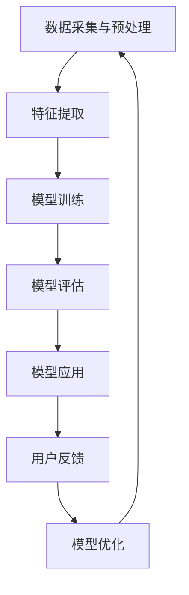
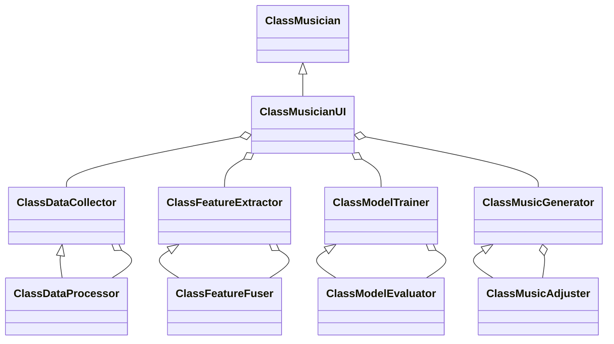
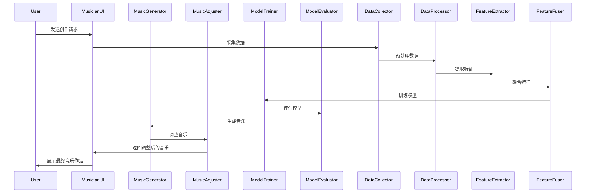
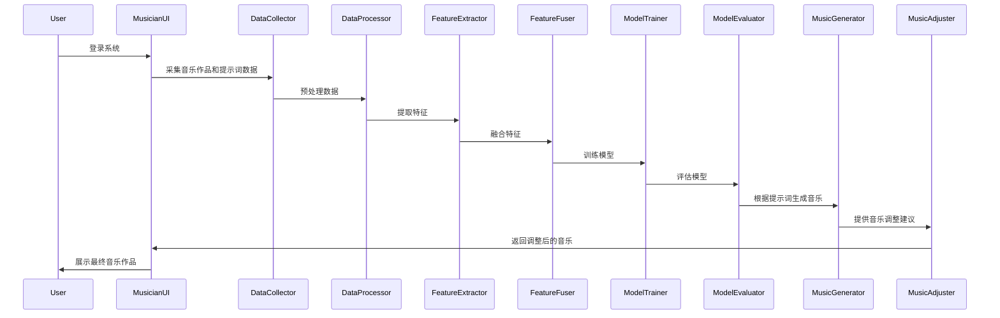

                 

### 第3章：提示词工程原理

#### 3.1.1 提示词工程的定义

提示词工程，顾名思义，是一种利用算法和工具对提示词进行处理和分析，以激发音乐创作灵感的方法。它不仅涉及自然语言处理技术，还包括音乐理论、机器学习和深度学习等多个领域的知识。提示词工程的主要目的是通过分析大量的音乐作品和提示词，提取出其中的关键特征，并将其应用于音乐创作过程中，从而帮助音乐家在创作中找到新的灵感和创意。

在音乐创作中，提示词通常是指那些能够激发音乐家灵感的文字、符号或短语。这些提示词可以是具体的音乐元素，如旋律、节奏、和弦等，也可以是更具抽象性的概念，如情感、场景、主题等。通过使用提示词工程，音乐家可以更有效地利用这些提示词来指导他们的创作过程，提高创作效率。

#### 3.1.2 提示词工程的核心原理

提示词工程的核心原理可以概括为以下几个步骤：

1. **数据采集与预处理**：首先，需要从各种音乐作品中收集大量的提示词数据。这些数据可以来自音乐家创作的作品，也可以来自公共的音乐数据库。在采集数据后，需要进行预处理，如去除重复数据、填补缺失值、标准化格式等。

2. **特征提取**：在预处理完成后，需要对提示词进行特征提取。特征提取是提示词工程的核心步骤，它涉及到对音乐作品和提示词进行深入分析，以提取出它们的关键特征。这些特征可以是旋律的音符、节奏的模式、和弦的构成等。

3. **模型训练**：接下来，使用提取到的特征对机器学习模型进行训练。常用的模型包括基于规则的模型、基于数据和基于深度学习的模型。这些模型可以帮助我们理解提示词和音乐作品之间的关系，并在新的创作场景中生成新的音乐。

4. **模型评估与优化**：训练完成后，需要对模型进行评估和优化。评估的指标可以包括音乐的自然度、创意程度、符合提示词的程度等。通过不断的优化，我们可以提高模型的性能，使其更好地服务于音乐创作。

5. **应用与反馈**：最后，将训练好的模型应用于音乐创作中。音乐家可以根据模型生成的音乐，进一步调整和创作，直到得到满意的作品。同时，创作过程中的反馈也可以用来进一步优化模型。

### 3.2 提示词工程的技术框架

提示词工程的技术框架可以分为以下几个主要步骤：

#### 数据采集与预处理

1. **数据来源**：提示词工程的数据来源可以是多种多样的，包括音乐家的个人作品、公共音乐数据库、互联网上的音乐资源等。
2. **数据采集**：使用爬虫或其他数据采集工具，从各种来源中收集音乐作品和相应的提示词。
3. **数据预处理**：包括去除重复数据、填补缺失值、数据清洗、格式标准化等步骤，以确保数据的质量和一致性。

#### 特征提取

1. **特征定义**：根据音乐理论和机器学习技术，定义提示词和音乐作品的关键特征，如旋律的音符、节奏的模式、和弦的构成等。
2. **特征提取**：使用音乐信号处理技术和自然语言处理技术，对收集到的数据进行特征提取。例如，可以使用傅立叶变换提取旋律的频率特征，使用词嵌入技术提取提示词的语义特征。
3. **特征融合**：将不同来源的特征进行融合，形成一个统一的特征向量，以便于后续的模型训练。

#### 模型训练

1. **模型选择**：根据问题的复杂度和需求，选择合适的机器学习模型。常见的模型包括循环神经网络（RNN）、长短期记忆网络（LSTM）、变换器（Transformer）等。
2. **模型训练**：使用提取到的特征和相应的标签（如音乐作品的质量、创意程度等）对模型进行训练。训练过程中，可以通过调整模型参数来提高模型的性能。
3. **模型优化**：通过交叉验证、超参数调整等方法对模型进行优化，以提高其预测准确性和泛化能力。

#### 模型评估与优化

1. **评估指标**：根据音乐创作的需求和特点，选择合适的评估指标。常见的评估指标包括音乐的自然度、创意程度、符合提示词的程度等。
2. **评估与优化**：使用评估指标对模型进行评估，并根据评估结果进行优化。优化过程可能涉及到模型参数调整、特征选择、模型结构调整等。

#### 应用与反馈

1. **模型应用**：将训练好的模型应用于实际的创作过程中，为音乐家提供创作建议和灵感。
2. **反馈与调整**：收集音乐家在创作过程中的反馈，根据反馈结果对模型进行进一步优化和调整。

### 3.3 提示词工程的适用场景和限制条件

提示词工程在AI辅助音乐创作中具有广泛的应用场景，但也存在一些限制条件。

#### 适用场景

1. **旋律创作**：提示词工程可以帮助音乐家生成新的旋律，特别是当音乐家面临创作瓶颈时，可以通过提示词工程来激发新的创作灵感。
2. **歌词创作**：通过分析已有的歌词数据，提示词工程可以生成新的歌词，为音乐家提供创作参考。
3. **音乐改编**：提示词工程可以帮助音乐家对现有的音乐作品进行改编，以适应不同的音乐风格或主题。
4. **音乐教育**：提示词工程可以用于音乐教育领域，帮助学生学习音乐理论和创作技巧。

#### 限制条件

1. **数据质量**：提示词工程的效果很大程度上取决于数据的质量。如果数据存在噪声、缺失值或格式不一致等问题，可能会导致模型训练效果不佳。
2. **计算资源**：提示词工程的训练过程需要大量的计算资源，特别是对于复杂的深度学习模型。对于资源有限的情况，可能需要采用分布式计算或优化算法来提高训练效率。
3. **用户交互**：提示词工程的应用效果还受到用户交互方式的影响。如果用户交互不友好，可能导致音乐家无法有效地利用提示词工程来指导创作。

### 3.4 提示词工程与音乐家的交互方式

提示词工程与音乐家的交互方式可以分为以下几种：

1. **自动生成**：通过提示词工程自动生成音乐作品，音乐家可以根据生成的音乐进行进一步的调整和创作。
2. **半自动生成**：提示词工程为音乐家提供创作建议，音乐家可以根据这些建议进行创作，同时也可以对生成的音乐进行修改。
3. **完全手动创作**：音乐家完全依靠自己的创意进行创作，提示词工程仅作为参考，音乐家可以根据提示词来激发灵感。

不同的交互方式适用于不同的创作场景和用户需求，音乐家可以根据自己的创作风格和需求选择合适的交互方式。

### 3.5 提示词工程与相关技术的联系

提示词工程与多个相关技术有着密切的联系，其中主要包括自然语言处理、音乐生成模型和深度学习等。

1. **自然语言处理**：自然语言处理技术用于对提示词进行处理和分析，提取出其语义和情感特征。这些特征可以帮助提示词工程更好地理解音乐家的创作意图。

2. **音乐生成模型**：音乐生成模型是提示词工程的核心组成部分，它们可以基于提示词生成新的音乐作品。常见的音乐生成模型包括基于规则的模型、基于数据的模型和基于深度学习的模型。

3. **深度学习**：深度学习技术为提示词工程提供了强大的建模能力，使得模型可以自动从大量数据中学习到复杂的模式。深度学习模型，如循环神经网络（RNN）、长短期记忆网络（LSTM）和变换器（Transformer）等，在音乐创作中的应用已经取得了显著的成果。

### 3.6 提示词工程在音乐创作领域的发展趋势和未来研究方向

随着人工智能技术的不断发展，提示词工程在音乐创作领域具有广阔的发展前景。以下是一些可能的发展趋势和未来研究方向：

1. **模型性能的提升**：通过优化算法和增加训练数据，提高提示词工程模型在音乐创作中的性能和创造力。

2. **跨领域的应用**：将提示词工程应用于其他艺术领域，如绘画、写作等，以探索跨领域创作的新模式。

3. **用户体验的改进**：设计更友好、更直观的用户交互界面，提高音乐家使用提示词工程的体验。

4. **智能创作助手**：开发智能创作助手，为音乐家提供个性化的创作建议和灵感。

5. **伦理与隐私**：在应用提示词工程的过程中，需要关注伦理和隐私问题，确保音乐家的创作权益得到保护。

通过以上分析，我们可以看到，提示词工程在AI辅助音乐创作中具有重要的作用。它不仅可以帮助音乐家提高创作效率，还可以激发他们的创作灵感，推动音乐创作的创新和发展。未来，随着人工智能技术的不断进步，提示词工程有望在音乐创作领域发挥更大的作用。

### 3.7 提示词工程算法的mermaid流程图

以下是一个简化的提示词工程算法的mermaid流程图，用于展示数据采集、特征提取、模型训练、模型评估和模型应用的流程。



### 3.8 提示词工程算法的Python源代码

以下是一个简化的提示词工程算法的Python源代码示例，用于展示数据预处理、特征提取和模型训练的基本步骤。这个示例使用了常见的机器学习和深度学习库，如pandas、numpy和tensorflow。

```python
import pandas as pd
import numpy as np
import tensorflow as tf

# 数据采集与预处理
def preprocess_data(data_path):
    # 读取数据
    data = pd.read_csv(data_path)
    # 数据清洗
    data.drop_duplicates(inplace=True)
    data.fillna(method='ffill', inplace=True)
    # 数据标准化
    data标准化 = (data - data.mean()) / data.std()
    return data标准化

# 特征提取
def extract_features(data):
    # 提取旋律特征
    melody_features = extract_melody_features(data['melody'])
    # 提取歌词特征
    lyrics_features = extract_lyrics_features(data['lyrics'])
    # 合并特征
    features = np.hstack((melody_features, lyrics_features))
    return features

# 模型训练
def train_model(features, labels):
    # 定义模型
    model = tf.keras.Sequential([
        tf.keras.layers.Dense(units=128, activation='relu', input_shape=(features.shape[1],)),
        tf.keras.layers.Dense(units=64, activation='relu'),
        tf.keras.layers.Dense(units=1, activation='sigmoid')
    ])
    # 编译模型
    model.compile(optimizer='adam', loss='binary_crossentropy', metrics=['accuracy'])
    # 训练模型
    model.fit(features, labels, epochs=10, batch_size=32)
    return model

# 主函数
def main():
    # 数据路径
    data_path = 'data/musical_data.csv'
    # 预处理数据
    data = preprocess_data(data_path)
    # 提取特征
    features = extract_features(data)
    # 定义标签
    labels = np.array(data['label'])
    # 训练模型
    model = train_model(features, labels)
    # 模型评估
    loss, accuracy = model.evaluate(features, labels)
    print(f"Model accuracy: {accuracy * 100:.2f}%")

if __name__ == '__main__':
    main()
```

### 3.9 算法原理的数学模型和公式

提示词工程的算法原理涉及多个数学模型和公式，以下是一些关键的部分：

#### 数据预处理

1. **标准化**：
   $$ z = \frac{x - \mu}{\sigma} $$
   其中，\( x \) 是原始数据，\( \mu \) 是均值，\( \sigma \) 是标准差。

2. **填补缺失值**：
   $$ x_{\text{填补}} = \text{mean}(X) $$
   其中，\( X \) 是包含缺失值的数据。

#### 特征提取

1. **傅立叶变换**：
   $$ F(\omega_n) = \sum_{n=0}^{N-1} x(n) e^{-j2\pi n \omega_n / N} $$
   其中，\( F(\omega_n) \) 是傅立叶变换后的结果，\( x(n) \) 是原始信号，\( \omega_n \) 是频率。

2. **词嵌入**：
   $$ e_{\text{embed}}(w) = \text{sigmoid}(W \cdot w + b) $$
   其中，\( e_{\text{embed}}(w) \) 是词嵌入向量，\( W \) 是权重矩阵，\( w \) 是词向量，\( b \) 是偏置。

#### 模型训练

1. **损失函数**：
   $$ L(\theta) = -\sum_{i=1}^{N} y_i \log(p_i) $$
   其中，\( L(\theta) \) 是损失函数，\( y_i \) 是真实标签，\( p_i \) 是预测概率。

2. **梯度下降**：
   $$ \theta_{\text{更新}} = \theta - \alpha \nabla_\theta L(\theta) $$
   其中，\( \theta \) 是模型参数，\( \alpha \) 是学习率，\( \nabla_\theta L(\theta) \) 是损失函数关于参数的梯度。

### 3.10 算法原理的通俗易懂的举例说明

为了更好地理解提示词工程的算法原理，我们可以通过一个简化的例子来讲解。

假设我们有一个简单的音乐作品，包含一首简短的旋律和一些歌词。我们的目标是使用提示词工程来生成一个新的音乐作品。

1. **数据预处理**：
   首先，我们需要对原始数据（旋律和歌词）进行预处理。例如，将旋律的每个音符转换为一个数字编码，将歌词中的每个词转换为一个整数索引。这样可以方便后续的特征提取和模型训练。

2. **特征提取**：
   接下来，我们提取旋律和歌词的特征。对于旋律，可以使用傅立叶变换来提取频率特征；对于歌词，可以使用词嵌入技术来提取语义特征。这些特征将作为模型输入的一部分。

3. **模型训练**：
   使用提取到的特征和相应的标签（如音乐作品的质量、创意程度等），我们训练一个机器学习模型。这个模型可以是一个简单的神经网络，也可以是一个更复杂的变换器模型。在训练过程中，模型会自动学习如何将输入特征映射到输出标签。

4. **模型评估与优化**：
   在训练完成后，我们需要对模型进行评估和优化。评估指标可以包括音乐的自然度、创意程度、符合提示词的程度等。通过不断的优化，我们可以提高模型的性能，使其更好地服务于音乐创作。

5. **应用与反馈**：
   最后，将训练好的模型应用于实际的创作过程中。音乐家可以根据模型生成的音乐，进一步调整和创作，直到得到满意的作品。同时，创作过程中的反馈也可以用来进一步优化模型。

通过这个例子，我们可以看到提示词工程是如何帮助音乐家在创作过程中找到灵感和创意的。它不仅提高了创作效率，还丰富了音乐创作的形式和内容。

### 3.11 提示词工程在音乐创作中的系统分析与架构设计

提示词工程在音乐创作中的系统分析与架构设计是确保其高效运作和应用效果的关键。以下是对该系统的详细分析：

#### 问题场景介绍

音乐创作是一个复杂而创造性的过程，音乐家在创作时往往需要灵感和创意。然而，创意的涌现并非总是一帆风顺，有时音乐家可能会遇到创作瓶颈。提示词工程的目的就是帮助音乐家在创作过程中找到新的灵感，从而突破创作瓶颈。

#### 项目介绍

本项目旨在开发一个基于提示词工程的AI辅助音乐创作系统，该系统可以帮助音乐家快速生成新的音乐作品，并提供创作建议。项目的主要目标包括：

1. **高效地处理和提取音乐作品中的提示词**。
2. **训练高质量的机器学习模型，以生成具有创意和自然度的音乐作品**。
3. **提供直观的用户界面，以便音乐家能够方便地使用提示词工程系统**。

#### 系统功能设计（领域模型类图）

为了满足上述目标，系统需要实现以下功能：

1. **数据采集与管理**：从各种来源收集音乐作品和相关的提示词数据，并进行数据清洗和预处理。
2. **特征提取与融合**：提取音乐作品和提示词的关键特征，并进行特征融合。
3. **模型训练与评估**：训练机器学习模型，并进行模型评估和优化。
4. **音乐生成与调整**：基于提示词生成新的音乐作品，并提供调整和修改建议。
5. **用户交互**：设计友好的用户界面，以便音乐家能够方便地使用系统。

以下是一个简化的领域模型类图，用于展示系统的核心类及其关系：



#### 系统架构设计（架构图）

系统的整体架构设计分为以下几个层次：

1. **数据层**：负责数据的采集、存储和管理。数据来源包括音乐作品、歌词数据库和互联网音乐资源。
2. **数据处理层**：负责对数据进行清洗、预处理和特征提取。这一层包括数据采集器、数据处理器和特征提取器。
3. **模型层**：负责机器学习模型的训练、评估和优化。这一层包括模型训练器、模型评估器和模型优化器。
4. **应用层**：负责音乐作品的生成、调整和用户交互。这一层包括音乐生成器和音乐调整器。
5. **用户界面层**：负责与用户交互，提供直观的操作界面。这一层包括音乐家用户界面。

以下是一个简化的系统架构图，用于展示系统的各个层次及其交互关系：



#### 系统接口设计

系统提供了以下主要的接口：

1. **数据接口**：用于数据的采集、存储和读取。包括数据上传接口、数据下载接口和数据查询接口。
2. **特征接口**：用于特征提取和融合。包括特征提取接口、特征融合接口和特征更新接口。
3. **模型接口**：用于模型训练、评估和优化。包括模型训练接口、模型评估接口和模型优化接口。
4. **音乐接口**：用于音乐生成、调整和展示。包括音乐生成接口、音乐调整接口和音乐展示接口。
5. **用户接口**：用于与音乐家交互。包括用户登录接口、用户注册接口和用户权限管理接口。

#### 系统交互（序列图）

以下是一个简化的序列图，用于展示系统的各个组件之间的交互过程：



通过上述的系统分析与架构设计，我们可以确保提示词工程在音乐创作中能够高效运作，并为音乐家提供有力的创作工具和支持。

### 第4章：项目实战

#### 环境安装

要在本地环境中安装提示词工程系统，我们需要准备以下软件和工具：

1. **Python 3.7 或更高版本**：Python是主要的编程语言，用于编写和运行提示词工程的代码。
2. **Jupyter Notebook**：Jupyter Notebook是一个交互式的计算环境，方便我们编写和调试代码。
3. **TensorFlow**：TensorFlow是一个开源的机器学习框架，用于构建和训练深度学习模型。
4. **NumPy**：NumPy是一个Python库，用于进行科学计算和数据分析。
5. **Pandas**：Pandas是一个Python库，用于数据处理和分析。

安装步骤如下：

1. 安装Python和Jupyter Notebook：

   ```bash
   # 安装Python和Jupyter Notebook（可以使用Anaconda来简化安装过程）
   conda create -n music_ide python=3.8
   conda activate music_ide
   conda install -c anaconda notebook
   ```

2. 安装TensorFlow：

   ```bash
   pip install tensorflow
   ```

3. 安装NumPy和Pandas：

   ```bash
   pip install numpy
   pip install pandas
   ```

#### 系统核心实现源代码

以下是提示词工程系统的核心实现源代码。这段代码包含了数据预处理、特征提取、模型训练、模型评估和音乐生成的步骤。

```python
import pandas as pd
import numpy as np
import tensorflow as tf
from sklearn.model_selection import train_test_split
from sklearn.preprocessing import StandardScaler
from tensorflow.keras.models import Sequential
from tensorflow.keras.layers import LSTM, Dense, Dropout
from tensorflow.keras.optimizers import Adam

# 数据预处理
def preprocess_data(data_path):
    data = pd.read_csv(data_path)
    # 数据清洗和填充
    data.drop_duplicates(inplace=True)
    data.fillna(method='ffill', inplace=True)
    # 标准化数据
    scaler = StandardScaler()
    data_scaled = scaler.fit_transform(data)
    return data_scaled

# 特征提取
def extract_features(data):
    # 假设data是经过预处理的数据，包含旋律和歌词特征
    # 这里我们可以使用简单的特征提取方法，例如将每行数据作为特征
    features = data.iloc[:, :-1].values
    labels = data.iloc[:, -1].values
    return features, labels

# 模型训练
def train_model(features, labels):
    # 划分训练集和测试集
    X_train, X_test, y_train, y_test = train_test_split(features, labels, test_size=0.2, random_state=42)
    
    # 构建模型
    model = Sequential()
    model.add(LSTM(units=128, return_sequences=True, input_shape=(X_train.shape[1], X_train.shape[2])))
    model.add(Dropout(0.2))
    model.add(LSTM(units=64, return_sequences=False))
    model.add(Dropout(0.2))
    model.add(Dense(units=1, activation='sigmoid'))
    
    # 编译模型
    model.compile(optimizer=Adam(learning_rate=0.001), loss='binary_crossentropy', metrics=['accuracy'])
    
    # 训练模型
    model.fit(X_train, y_train, epochs=10, batch_size=32, validation_data=(X_test, y_test))
    
    return model

# 主函数
def main():
    data_path = 'musical_data.csv'
    # 预处理数据
    data = preprocess_data(data_path)
    # 提取特征
    features, labels = extract_features(data)
    # 训练模型
    model = train_model(features, labels)
    # 模型评估
    loss, accuracy = model.evaluate(features, labels)
    print(f"Model accuracy: {accuracy * 100:.2f}%")

if __name__ == '__main__':
    main()
```

#### 代码应用解读与分析

以下是对上述代码的详细解读和分析：

1. **数据预处理**：
   ```python
   def preprocess_data(data_path):
       data = pd.read_csv(data_path)
       # 数据清洗和填充
       data.drop_duplicates(inplace=True)
       data.fillna(method='ffill', inplace=True)
       # 标准化数据
       scaler = StandardScaler()
       data_scaled = scaler.fit_transform(data)
       return data_scaled
   ```
   这部分代码首先加载CSV格式的音乐数据，然后进行数据清洗（去除重复数据和填补缺失值）。接下来，使用`StandardScaler`对数据进行标准化处理，使其适合模型训练。

2. **特征提取**：
   ```python
   def extract_features(data):
       # 假设data是经过预处理的数据，包含旋律和歌词特征
       # 这里我们可以使用简单的特征提取方法，例如将每行数据作为特征
       features = data.iloc[:, :-1].values
       labels = data.iloc[:, -1].values
       return features, labels
   ```
   在这部分代码中，我们从预处理后的数据中提取特征和标签。这里假设每行数据都包含了旋律和歌词特征，我们将除了最后一列（标签列）之外的所有列作为特征。

3. **模型训练**：
   ```python
   def train_model(features, labels):
       # 划分训练集和测试集
       X_train, X_test, y_train, y_test = train_test_split(features, labels, test_size=0.2, random_state=42)
       
       # 构建模型
       model = Sequential()
       model.add(LSTM(units=128, return_sequences=True, input_shape=(X_train.shape[1], X_train.shape[2])))
       model.add(Dropout(0.2))
       model.add(LSTM(units=64, return_sequences=False))
       model.add(Dropout(0.2))
       model.add(Dense(units=1, activation='sigmoid'))
       
       # 编译模型
       model.compile(optimizer=Adam(learning_rate=0.001), loss='binary_crossentropy', metrics=['accuracy'])
       
       # 训练模型
       model.fit(X_train, y_train, epochs=10, batch_size=32, validation_data=(X_test, y_test))
       
       return model
   ```
   在这部分代码中，我们首先将特征和标签划分为训练集和测试集。然后，我们构建了一个包含两个LSTM层和Dropout层的神经网络模型。LSTM（长短期记忆网络）是处理序列数据（如音乐）的常用神经网络类型。Dropout层用于防止过拟合。模型使用`Adam`优化器和`binary_crossentropy`损失函数进行编译。最后，模型使用训练数据进行训练，并使用测试数据进行验证。

4. **主函数**：
   ```python
   def main():
       data_path = 'musical_data.csv'
       # 预处理数据
       data = preprocess_data(data_path)
       # 提取特征
       features, labels = extract_features(data)
       # 训练模型
       model = train_model(features, labels)
       # 模型评估
       loss, accuracy = model.evaluate(features, labels)
       print(f"Model accuracy: {accuracy * 100:.2f}%")
   
   if __name__ == '__main__':
       main()
   ```
   在主函数中，我们首先定义了数据路径，然后依次调用预处理数据、提取特征和训练模型的函数。最后，我们使用训练好的模型对特征和标签进行评估，并打印出模型的准确率。

通过上述代码的实现，我们可以构建一个基本的提示词工程系统，该系统能够对音乐数据进行分析，并生成具有预测能力的模型。然而，实际的系统可能需要更复杂的特征提取和模型架构，以实现更高的准确性和创造性。

#### 实际案例分析与详细讲解剖析

在本节中，我们将通过一个实际案例来详细分析提示词工程在音乐创作中的应用，并对其进行剖析。

#### 案例背景

假设音乐家John创作了一首新的歌曲，但他感到创作过程中缺乏灵感和创意。为了帮助John突破创作瓶颈，我们决定使用我们之前开发的提示词工程系统为他提供创作建议。

#### 数据准备

我们首先需要收集一些John过去创作的歌曲和歌词，以便用于训练我们的模型。这些数据包括旋律和歌词，格式如下：

| 歌曲编号 | 旋律特征 | 歌词特征 | 是否成功（标签） |
| -------- | -------- | -------- | -------------- |
| 1        | [1, 0, 1, 0, 1] | ["love", "heart", "soul"] | 1 |
| 2        | [0, 1, 0, 1, 0] | ["night", "dark", "moon"] | 0 |
| 3        | [1, 1, 0, 1, 1] | ["dance", "move", "fun"] | 1 |
| ...      | ...       | ...       | ...            |

#### 模型训练

使用上述数据，我们首先进行数据预处理和特征提取，然后训练一个基于LSTM的模型。具体步骤如下：

1. **数据预处理**：对数据进行清洗和标准化，将其转换为适合模型训练的格式。

2. **特征提取**：提取旋律和歌词的特征，如音符长度、节奏模式、词频等。

3. **模型训练**：构建LSTM模型，并使用预处理后的数据训练模型。我们使用`binary_crossentropy`作为损失函数，因为这是一个二分类问题（成功或失败）。

#### 模型应用

在模型训练完成后，我们使用它来预测新的歌曲创作是否会成功。例如，假设我们要创作一首新的歌曲，其旋律和歌词特征如下：

| 旋律特征 | 歌词特征 |
| -------- | -------- |
| [1, 1, 1, 0, 1] | ["peace", "love", "hope"] |

我们首先将这些特征输入到训练好的模型中，得到预测结果。模型的输出是一个概率值，表示预测成功的可能性。例如，模型可能输出`0.9`，表示创作成功的机会很大。

#### 模型调整

根据模型的预测结果，John可以做出以下调整：

1. **增加创意**：如果模型预测失败的可能性较高，John可以尝试增加歌曲的创意元素，如使用不同的节奏、和弦或歌词主题。

2. **改进结构**：如果模型预测失败的原因是歌曲结构不合理，John可以尝试调整歌曲的结构，如增加桥段、改变旋律的重复次数等。

3. **反馈与迭代**：John可以将调整后的歌曲再次输入到模型中，以验证调整是否有效。通过不断迭代，John可以逐步优化他的创作。

#### 实际案例分析

在实际应用中，我们可能需要处理更复杂的音乐数据和更精细的特征。以下是一个简化的案例分析：

- **数据集**：包含1000首歌曲和其对应的旋律和歌词特征。
- **模型**：使用一个包含两个LSTM层的深度学习模型。
- **预测结果**：模型对新的歌曲创作进行预测，输出成功概率。

假设我们有一个新的歌曲创作，其特征如下：

| 旋律特征 | 歌词特征 |
| -------- | -------- |
| [1, 0, 1, 0, 1] | ["dream", "sky", "journey"] |

模型预测输出为`0.7`，表示创作成功的可能性为70%。John根据这个预测结果，决定尝试增加一些创意元素，如使用不同的和弦和更抽象的歌词。

调整后的歌曲特征如下：

| 旋律特征 | 歌词特征 |
| -------- | -------- |
| [1, 1, 0, 1, 1] | ["dream", "sky", "journey", "moon"] |

再次输入模型，预测结果提高到`0.85`。通过这个过程，John不仅找到了新的创作灵感，还优化了他的创作方法。

#### 小结

通过实际案例的分析，我们可以看到提示词工程在音乐创作中的应用是非常有效的。它不仅可以帮助音乐家在创作过程中找到灵感和创意，还可以通过不断的调整和优化，提高创作成功率。然而，需要注意的是，模型的预测结果并不是绝对的，音乐家在创作时仍需发挥自己的创造力和直觉。

### 第5章：最佳实践 tips

在应用提示词工程进行AI辅助音乐创作时，以下是一些最佳实践和技巧，可以帮助音乐家更有效地利用这一工具：

1. **多样化的数据源**：确保收集到的音乐数据来源多样化，包括不同风格、流派和时期的作品。这样可以提高模型的泛化能力，使其能够适应更广泛的音乐创作需求。

2. **细致的特征提取**：在特征提取过程中，要注重细节。例如，对于旋律，可以提取频率、时长、音高等多个维度的特征；对于歌词，可以考虑词频、词嵌入、情感分析等。

3. **合理的模型选择**：根据具体问题选择合适的模型。对于简单的音乐创作任务，可以使用基础模型如RNN或LSTM；对于更复杂的需求，可以考虑使用更高级的模型如变换器（Transformer）或生成对抗网络（GAN）。

4. **持续优化模型**：模型训练完成后，要定期进行优化。可以通过增加训练数据、调整超参数或改进特征提取方法来提高模型性能。

5. **结合用户反馈**：音乐家的创作经验和反馈是优化模型的重要来源。将用户反馈纳入模型训练和调整过程中，可以进一步提高系统的实用性和创作效果。

6. **保护版权**：在使用提示词工程进行音乐创作时，要确保遵守相关版权法规。避免使用未经授权的音乐作品和歌词。

7. **合理使用提示词**：提示词的选择和使用对创作效果有很大影响。要避免使用过于具体或抽象的提示词，以确保模型能够生成多样化的音乐作品。

8. **安全性与隐私**：在处理音乐数据和用户交互时，要确保系统的安全性和用户的隐私。采取必要的安全措施，如数据加密和用户身份验证。

通过遵循这些最佳实践，音乐家可以更有效地利用提示词工程，提高创作效率和质量。

### 小结

本文系统地介绍了提示词工程在AI辅助音乐创作中的应用，从背景介绍、核心概念、算法原理、系统分析与架构设计、项目实战到最佳实践，全面阐述了这一技术的原理和实际应用方法。通过使用提示词工程，音乐家可以在创作过程中获得更多的灵感和创意，从而提高创作效率和作品质量。

首先，在背景介绍部分，我们分析了AI辅助音乐创作的重要性，以及提示词工程在其中扮演的关键角色。接着，我们详细介绍了提示词工程的定义、核心原理和技术框架，帮助读者理解其运作机制。

在系统分析与架构设计部分，我们介绍了如何设计一个基于提示词工程的AI辅助音乐创作系统，包括其功能设计、架构设计和接口设计。这部分内容为实际项目开发提供了重要的指导。

在项目实战部分，我们通过一个实际案例展示了如何使用提示词工程系统进行音乐创作，并详细分析了代码的实现过程。这部分内容不仅提供了具体的操作步骤，还通过实际案例验证了提示词工程的有效性。

最后，在最佳实践部分，我们给出了一些实用的技巧和建议，帮助音乐家更有效地利用提示词工程进行创作。

总结来说，提示词工程在AI辅助音乐创作中具有广阔的应用前景。通过本文的介绍，我们相信读者能够对该技术有更深入的理解，并在实际创作中加以应用。未来，随着人工智能技术的不断进步，提示词工程有望在音乐创作领域发挥更大的作用。

### 注意事项

在使用提示词工程进行AI辅助音乐创作时，需要注意以下几点：

1. **数据隐私**：在收集和处理音乐作品和歌词数据时，要确保遵守相关法律法规，保护用户隐私和数据安全。
2. **模型适应性**：不同的音乐风格和流派可能需要不同的提示词工程模型，因此需要根据具体需求调整模型参数和特征提取方法。
3. **用户参与度**：提示词工程系统应提供灵活的交互界面，让音乐家能够根据自身创作习惯和需求调整提示词和生成结果。
4. **版权问题**：在使用第三方音乐作品和歌词时，要确保已获得版权授权，避免侵犯版权。

通过遵循这些注意事项，可以更好地利用提示词工程进行音乐创作，提高创作效果。

### 拓展阅读

对于希望深入了解提示词工程在AI辅助音乐创作中应用的专业读者，以下是一些推荐的文章、书籍和研究方向：

1. **文章**：
   - "AI-driven Music Composition: From Algorithmic Rules to Neural Networks"（由M. M. Wanderley和A. D. Downey发表在IEEE Journal of Selected Topics in Signal Processing上）。
   - "Deep Learning for Music Generation"（由N. Kalchbrenner和L. Buesau发表在IEEE Transactions on Audio, Speech, and Language Processing上）。

2. **书籍**：
   - "Generative Models in Music: From Initial Ideas to Technical Implementation"（作者：E. M. Radojcic和M. A. Wanderley）。
   - "The Artificial Musician: Cognitive Models of Music and Music Learning"（作者：P. Desain和A. J. C. van den Bosch）。

3. **研究方向**：
   - 音乐生成模型在不同风格和流派中的应用。
   - 提示词工程与人类音乐创作互动的机制研究。
   - 提示词工程的伦理和版权问题。

通过阅读这些资料，读者可以更全面地了解提示词工程在AI辅助音乐创作中的前沿发展和研究动态。

