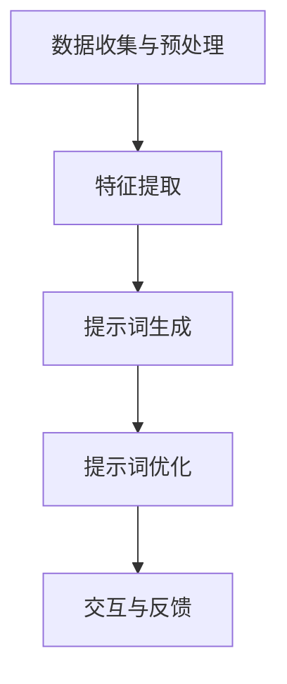

                 

# 《提示词工程在增强现实教育中的应用：创造沉浸式学习体验》

## 关键词

- 提示词工程
- 增强现实教育
- 沉浸式学习体验
- 算法原理
- 数学模型
- 系统架构设计

## 摘要

随着科技的不断发展，增强现实（AR）技术在教育领域的应用越来越广泛。提示词工程作为增强现实技术的重要一环，通过创造沉浸式的学习体验，大大提升了学生的学习效果。本文旨在探讨提示词工程在增强现实教育中的应用，从背景介绍、核心概念解析、算法原理讲解、数学模型与公式应用、系统架构设计、项目实战等多个角度，全面分析提示词工程在增强现实教育中的重要作用和实现方法。

## 引言

### 1.1 问题背景

#### 1.1.1 增强现实技术的兴起

增强现实（Augmented Reality，简称AR）技术通过将虚拟信息与真实世界相结合，为用户提供了丰富的交互体验。AR技术最早起源于20世纪60年代的“虚拟现实”概念，但真正引起广泛关注则是在21世纪初。随着智能手机和移动设备的普及，以及计算机图形学和传感器技术的飞速发展，AR技术逐渐成为现实，并开始被应用到多个领域，尤其是教育领域。

在过去的几十年里，教育领域一直在探索如何更好地提升教学效果。传统的教育模式以教师为中心，学生被动接受知识，这种模式在一定程度上限制了学生的创造力和自主学习能力。而增强现实技术的出现，为教育提供了新的可能性。通过将虚拟信息叠加到现实世界中，学生可以更加直观地理解抽象的概念，从而提高学习效果。

#### 1.1.2 AR在教育领域的潜在价值

增强现实技术在教育领域的潜在价值主要体现在以下几个方面：

1. **提高学习兴趣**：传统的教科书和教学视频往往难以吸引学生的注意力。而AR技术通过创造丰富的互动体验，可以激发学生的学习兴趣，提高他们的学习积极性。

2. **增强学习体验**：通过增强现实技术，学生可以在虚拟环境中进行实验和操作，这种沉浸式的学习方式可以大大增强他们的学习体验，提高学习效果。

3. **个性化教学**：AR技术可以记录学生的学习行为和进度，从而为教师提供个性化的教学建议，帮助学生更好地掌握知识。

4. **拓宽教学资源**：AR技术可以将海量的教育资源通过虚拟信息的形式呈现出来，使学生能够随时随地获取所需的知识，从而拓宽了教学资源的范围。

### 1.2 问题描述

尽管增强现实技术在教育领域具有巨大的潜力，但实际应用中仍面临许多挑战。首先，AR设备的成本较高，限制了其在普通学校中的普及。其次，现有的AR教育应用往往缺乏深度和互动性，难以满足学生的学习需求。此外，教师在应用AR技术时，缺乏相关的培训和支持，导致AR技术在实际教学中的应用效果不尽如人意。

为了解决这些问题，我们需要对增强现实教育进行深入的研究和探索，特别是对提示词工程的应用。提示词工程通过为增强现实教育提供有效的互动和反馈机制，有助于提升学生的学习体验和学习效果。

### 1.3 问题解决

#### 1.3.1 提示词工程的概念

提示词工程（Prompt Engineering）是一种结合自然语言处理（NLP）和人工智能技术，用于生成和优化提示词（prompt）的技术。提示词是在对话或交互过程中，引导用户或系统进行下一步操作的信息。在增强现实教育中，提示词可以用于引导学生的学习过程，提供个性化的学习建议，以及增强互动性和沉浸感。

#### 1.3.2 提示词工程在增强现实教育中的应用

1. **学习引导**：提示词可以引导学生在学习过程中进行思考和探索，帮助学生更好地理解抽象的概念。

2. **个性化教学**：通过分析学生的学习行为和进度，提示词工程可以提供个性化的学习建议，帮助学生更好地掌握知识。

3. **互动增强**：提示词可以与AR技术结合，提供实时的互动反馈，增强学生的学习体验。

4. **教学辅助**：提示词可以帮助教师更有效地进行教学，提高教学效果。

### 1.4 边界与外延

#### 1.4.1 提示词工程的适用范围

提示词工程主要适用于需要交互和反馈的场景，如教育、客服、游戏等。在增强现实教育中，提示词工程可以通过以下方式发挥作用：

1. **课堂互动**：提示词可以用于课堂互动，引导学生参与讨论和思考。

2. **实验操作**：提示词可以指导学生在虚拟环境中进行实验和操作。

3. **学习评估**：提示词可以用于评估学生的学习效果，提供反馈和建议。

4. **个性化学习**：提示词可以根据学生的学习进度和需求，提供个性化的学习内容。

#### 1.4.2 提示词工程的限制因素

虽然提示词工程在增强现实教育中具有巨大的潜力，但实际应用中仍面临一些限制因素，如：

1. **数据隐私**：提示词工程需要收集和分析大量的学生数据，这涉及到数据隐私和安全问题。

2. **技术门槛**：提示词工程需要较高的技术门槛，包括NLP和机器学习等技术。

3. **教师培训**：教师需要接受相关的培训，才能更好地应用提示词工程。

### 1.5 概念结构与核心要素组成

#### 1.5.1 提示词工程的核心概念

1. **提示词**：提示词是引导用户或系统进行下一步操作的信息。
2. **自然语言处理**：自然语言处理（NLP）是用于处理和生成自然语言的技术。
3. **机器学习**：机器学习（ML）是用于从数据中学习模式和规律的技术。
4. **增强现实**：增强现实（AR）是一种将虚拟信息叠加到现实世界中的技术。

#### 1.5.2 提示词工程的核心要素组成

1. **数据收集与处理**：收集和分析学生数据，用于生成和优化提示词。
2. **自然语言生成**：使用NLP技术生成和优化提示词。
3. **机器学习模型**：使用机器学习模型分析学生数据，为提示词生成提供支持。
4. **增强现实技术**：将提示词与增强现实技术结合，提供沉浸式的学习体验。

## 第2章：核心概念与联系

### 2.1 增强现实教育

#### 2.1.1 增强现实教育的定义

增强现实教育（Augmented Reality Education，简称ARE）是指利用增强现实技术，将虚拟信息叠加到现实世界中，为学习者提供沉浸式的学习体验。与传统教育模式相比，增强现实教育具有以下几个特点：

1. **交互性**：增强现实教育通过虚拟信息的互动，提高学生的学习积极性。
2. **沉浸感**：虚拟信息与现实世界的结合，使学习者仿佛置身于一个全新的环境中，提高学习效果。
3. **个性化**：增强现实教育可以根据学习者的需求和进度，提供个性化的学习内容。
4. **实践性**：通过虚拟实验和操作，增强现实教育可以帮助学习者更好地理解和掌握知识。

#### 2.1.2 增强现实教育与传统教育的区别

1. **教学方式**：传统教育主要依赖于教科书和教学视频，而增强现实教育则通过虚拟信息与现实世界的结合，提供更为直观和互动的学习方式。
2. **学习体验**：传统教育往往较为枯燥，而增强现实教育通过丰富的互动和沉浸感，使学习过程更加有趣和有效。
3. **个性化程度**：传统教育难以满足不同学习者的需求，而增强现实教育可以根据学习者的进度和需求，提供个性化的学习内容。

### 2.2 提示词工程

#### 2.2.1 提示词工程的定义

提示词工程（Prompt Engineering）是一种利用自然语言处理（NLP）和机器学习（ML）技术，生成和优化提示词的方法。在增强现实教育中，提示词工程通过生成有效的提示词，引导学生的学习过程，提供个性化的学习建议，以及增强互动性和沉浸感。

#### 2.2.2 提示词工程在教育中的应用

1. **学习引导**：提示词工程可以生成引导学生思考和探索的提示词，提高学生的学习积极性。
2. **个性化教学**：通过分析学习者的数据，提示词工程可以生成个性化的学习建议，帮助学习者更好地掌握知识。
3. **互动增强**：提示词工程可以与增强现实技术结合，提供实时的互动反馈，增强学习者的学习体验。
4. **教学辅助**：提示词工程可以帮助教师更有效地进行教学，提高教学效果。

### 2.3 沉浸式学习体验

#### 2.3.1 沉浸式学习体验的概念

沉浸式学习体验（Immersive Learning Experience）是指通过模拟现实场景或创造全新的虚拟环境，使学习者完全投入学习过程，从而提高学习效果。在增强现实教育中，沉浸式学习体验通过将虚拟信息叠加到现实世界中，为学习者提供一种全新的学习方式。

#### 2.3.2 沉浸式学习体验的优势

1. **提高学习兴趣**：通过丰富的互动和沉浸感，沉浸式学习体验可以激发学习者的学习兴趣，提高他们的学习积极性。
2. **增强学习效果**：沉浸式学习体验可以使学习者更加投入学习，从而提高学习效果。
3. **个性化学习**：沉浸式学习体验可以根据学习者的需求，提供个性化的学习内容，帮助学习者更好地掌握知识。
4. **实践性**：通过沉浸式学习体验，学习者可以更加直观地理解和掌握抽象的概念。

### 2.4 关键概念之间的关系

为了更好地理解提示词工程在增强现实教育中的应用，我们需要分析各个关键概念之间的关系。以下是各个关键概念之间的联系：

1. **增强现实教育与提示词工程**：增强现实教育通过虚拟信息与现实世界的结合，为学习者提供沉浸式的学习体验。提示词工程则通过生成和优化提示词，引导学习者的学习过程，提高学习效果。

2. **提示词工程与沉浸式学习体验**：提示词工程通过生成有效的提示词，与增强现实技术结合，提供沉浸式的学习体验。这种体验可以激发学习者的学习兴趣，提高学习效果。

3. **增强现实教育与沉浸式学习体验**：增强现实教育通过将虚拟信息叠加到现实世界中，为学习者提供沉浸式的学习体验。这种体验可以增强学习者的学习效果，提高他们的学习兴趣。

## 第3章：算法原理讲解

### 3.1 算法原理概述

#### 3.1.1 提示词工程的基本算法

提示词工程是一种结合自然语言处理（NLP）和机器学习（ML）技术的方法，用于生成和优化提示词。在增强现实教育中，提示词工程的基本算法主要包括以下几个步骤：

1. **数据收集与预处理**：收集和分析学习者的数据，包括学习行为、学习进度和学习效果等。对数据进行清洗和预处理，以便后续分析。

2. **特征提取**：从数据中提取关键特征，如关键词、短语、句子等。这些特征将用于生成和优化提示词。

3. **提示词生成**：使用NLP和ML技术，根据提取的特征生成提示词。提示词应具有引导学习者思考和探索的作用。

4. **提示词优化**：通过分析学习者的反馈和学习效果，对提示词进行优化，以提高其有效性。

5. **交互与反馈**：将优化后的提示词与增强现实技术结合，提供实时的互动和反馈，增强学习者的学习体验。

#### 3.1.2 提示词工程的应用场景

提示词工程在增强现实教育中的应用场景主要包括以下几个方面：

1. **学习引导**：通过生成有效的提示词，引导学生在学习过程中进行思考和探索，提高学习效果。

2. **个性化教学**：根据学生的需求和进度，生成个性化的学习建议，帮助学生在不同阶段掌握知识。

3. **互动增强**：通过提示词与增强现实技术的结合，提供实时的互动和反馈，增强学生的学习体验。

4. **教学辅助**：提示词工程可以帮助教师更有效地进行教学，提高教学效果。

### 3.2 算法mermaid流程图

为了更好地理解提示词工程的算法原理，我们可以使用mermaid语法绘制一个流程图。以下是提示词工程的基本流程：



### 3.3 Python代码示例

下面是一个简单的Python代码示例，用于演示提示词工程的实现：

```python
import nltk
from nltk.tokenize import word_tokenize
from nltk.corpus import stopwords

# 数据预处理
def preprocess_data(data):
    # 清洗数据，去除停用词和标点符号
    tokens = word_tokenize(data)
    tokens = [token.lower() for token in tokens if token.isalnum()]
    tokens = [token for token in tokens if token not in stopwords.words('english')]
    return tokens

# 特征提取
def extract_features(tokens):
    # 提取关键词
    return [' '.join(tokens)]

# 提示词生成
def generate_prompt(features):
    # 生成提示词
    return "请思考关于{}的问题：".format(features)

# 提示词优化
def optimize_prompt(prompt, feedback):
    # 优化提示词
    return prompt + "（根据您的反馈进行优化）"

# 交互与反馈
def interactive_learning(prompt):
    # 提供交互和反馈
    print(prompt)
    user_input = input("您的回答：")
    return user_input

# 实例化
data = "增强现实技术在教育中的应用有哪些？"
features = extract_features(preprocess_data(data))
prompt = generate_prompt(features)
optimized_prompt = optimize_prompt(prompt, "非常好，谢谢您的反馈！")
user_input = interactive_learning(optimized_prompt)

print("您的回答是：", user_input)
```

### 3.4 算法原理详细讲解

#### 3.4.1 数学模型和公式

提示词工程的实现涉及多个数学模型和公式，以下是其中几个常用的模型和公式：

1. **词袋模型**：词袋模型（Bag-of-Words，BoW）是一种常用的文本表示方法，将文本表示为一个单词的集合。词袋模型的基本公式如下：

   $$ \text{BoW} = \{ w_1, w_2, ..., w_n \} $$

   其中，$w_1, w_2, ..., w_n$ 表示文本中的单词。

2. **TF-IDF模型**：TF-IDF（Term Frequency-Inverse Document Frequency）是一种常用的文本权重计算方法，用于评估一个词在文档中的重要性。TF-IDF的基本公式如下：

   $$ \text{TF-IDF}(w) = \text{TF}(w) \times \text{IDF}(w) $$

   其中，$\text{TF}(w)$ 表示词 $w$ 在文档中的词频，$\text{IDF}(w)$ 表示词 $w$ 在文档集合中的逆文档频率。

3. **朴素贝叶斯模型**：朴素贝叶斯模型（Naive Bayes）是一种基于贝叶斯定理的文本分类模型。朴素贝叶斯模型的基本公式如下：

   $$ P(\text{C} | \text{F}) = \frac{P(\text{F} | \text{C}) \times P(\text{C})}{P(\text{F})} $$

   其中，$P(\text{C} | \text{F})$ 表示在给定特征 $\text{F}$ 的情况下，类别 $\text{C}$ 的概率，$P(\text{F} | \text{C})$ 表示在类别 $\text{C}$ 下的特征 $\text{F}$ 的概率，$P(\text{C})$ 表示类别 $\text{C}$ 的概率，$P(\text{F})$ 表示特征 $\text{F}$ 的概率。

#### 3.4.2 举例说明

假设我们有一个包含三个类别的文档集合，类别分别为“科技”、“教育”和“生活”。现有以下三个文档：

1. 科技文档：
   - “人工智能是一种计算机科学分支，涉及机器学习、自然语言处理等领域。”
2. 教育文档：
   - “教育是培养人才的重要途径，包括小学、中学和大学等阶段。”
3. 生活文档：
   - “生活总是充满了挑战，我们需要学会面对和解决问题。”

使用词袋模型和TF-IDF模型对文档进行表示，然后使用朴素贝叶斯模型进行分类。

1. **词袋模型表示**：

   科技文档：
   - $\text{BoW} = \{ 人工智能、计算机科学、机器学习、自然语言处理 \}$

   教育文档：
   - $\text{BoW} = \{ 教育、培养、人才、小学、中学、大学 \}$

   生活文档：
   - $\text{BoW} = \{ 生活、挑战、学会、面对、解决问题 \}$

2. **TF-IDF表示**：

   科技文档：
   - $\text{TF-IDF} = \{ 人工智能: 1.0, 计算机科学: 1.0, 机器学习: 1.0, 自然语言处理: 1.0 \}$

   教育文档：
   - $\text{TF-IDF} = \{ 教育: 1.0, 培养

