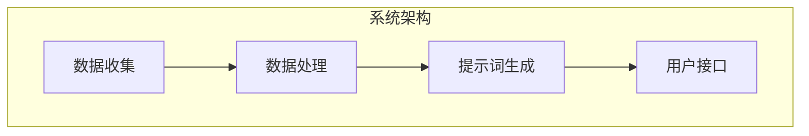
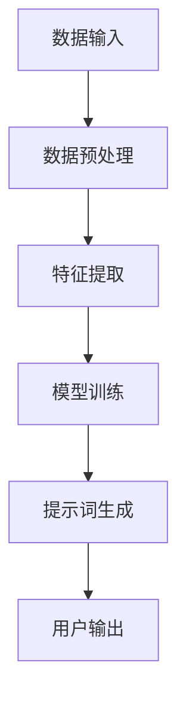
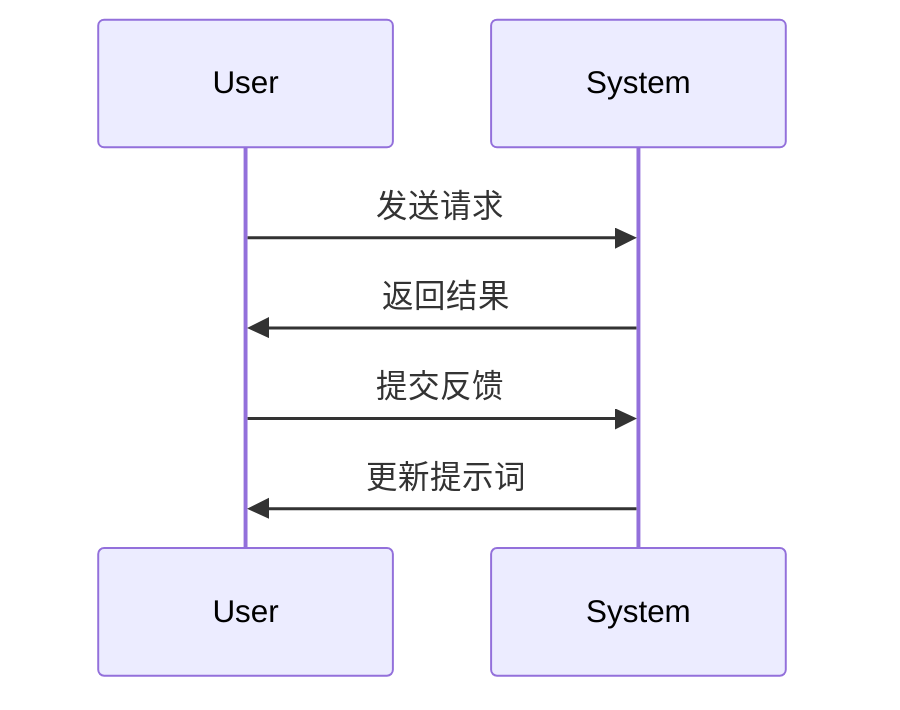

                 

### 文章标题：提示词工程在政府服务中的应用：提升公共服务效率

#### 关键词：提示词工程、政府服务、公共服务效率、自然语言处理、系统架构设计

#### 摘要：
本文旨在探讨提示词工程在提升政府公共服务效率方面的应用。首先，我们将介绍提示词工程的核心概念和其在政府服务中的重要性。接着，文章将详细分析提示词工程的基本概念、工作原理以及关键属性特征，并通过实体关系（ER）模型来阐述其架构。随后，我们将深入探讨提示词工程在公共安全、城市管理等政府服务领域的具体应用，并介绍相关的自然语言处理和数据分析技术。文章还涉及系统架构设计、项目实战以及案例分析，最后提出最佳实践和未来展望。

---

### 目录大纲

**第一部分：引言**

**第1章：问题背景与核心概念**
1.1 提示词工程概述
1.2 政府服务面临的挑战
1.3 提示词工程在政府服务中的应用意义

**第2章：核心概念与联系**
2.1 提示词工程的定义
2.1.1 提示词与自然语言处理
2.1.2 提示词工程的工作原理
2.1.3 提示词工程的关键属性特征对比
2.2 提示词工程的ER模型
2.2.1 ER模型的基本概念
2.2.2 提示词工程的ER图

**第二部分：提示词工程在政府服务中的应用**

**第3章：应用场景**
3.1 公共安全
3.1.1 事件预警与应急响应
3.1.2 犯罪趋势预测与防范
3.2 城市管理
3.2.1 交通流量分析
3.2.2 垃圾分类与处理

**第4章：技术应用**
4.1 自然语言处理技术
4.1.1 词向量模型
4.1.2 情感分析技术
4.2 数据分析技术
4.2.1 数据挖掘与机器学习
4.2.2 数据可视化

**第5章：系统架构与设计**
5.1 系统架构设计
5.1.1 功能模块划分
5.1.2 数据流程分析
5.2 系统接口设计
5.2.1 接口规范
5.2.2 接口实现

**第6章：项目实战**
6.1 环境安装与配置
6.1.1 环境搭建
6.1.2 配置与优化
6.2 系统核心实现
6.2.1 提示词生成模块
6.2.2 优化策略模块

**第7章：案例分析与总结**
7.1 案例分析
7.1.1 案例一：智慧城市建设中的提示词应用
7.1.2 案例二：政府服务热线中的提示词应用
7.2 项目小结
7.2.1 成功经验
7.2.2 遇到的挑战与解决方法

**第8章：最佳实践与未来展望**
8.1 最佳实践
8.1.1 实践技巧与建议
8.1.2 技术趋势分析
8.2 未来展望
8.2.1 技术发展前景
8.2.2 政府服务创新方向

---

### 第一部分：引言

#### 第1章：问题背景与核心概念

**1.1 提示词工程概述**

提示词工程（Prompt Engineering）是一门专注于设计和开发能够自动生成提示词或问题的技术。在自然语言处理（NLP）领域，提示词工程的核心目标是通过自动化的方式生成能够有效引导对话或解决问题的提示。这些提示词不仅能够提高用户的交互体验，还能在数据分析和决策支持中发挥关键作用。

**1.2 政府服务面临的挑战**

随着社会的发展和科技的进步，政府服务在提供公共服务时面临着日益复杂的挑战。传统的服务模式往往存在效率低下、响应缓慢、资源浪费等问题。为了提升公共服务的效率和用户体验，政府迫切需要引入先进的科技手段，如提示词工程，来实现智能化、自动化和个性化的服务。

**1.3 提示词工程在政府服务中的应用意义**

提示词工程在政府服务中的应用具有重大意义。首先，它能够大幅提升公共服务效率，通过自动化生成问题和回答，减少人工干预和错误。其次，提示词工程能够实现个性化服务，根据用户需求和偏好提供定制化的解决方案。此外，提示词工程还能够提高数据的利用效率，通过智能分析生成有价值的报告和决策建议，从而为政府决策提供有力支持。

---

### 第2章：核心概念与联系

**2.1 提示词工程的定义**

提示词工程可以定义为一门利用自然语言处理、机器学习等技术，设计和开发自动生成提示词或问题的技术。其核心目标是通过自动化方式，提高对话效率和质量，优化用户体验。

**2.1.1 提示词与自然语言处理**

提示词是自然语言处理中的一个重要概念。在NLP中，提示词通常指的是用于引导对话或解决问题的一段文本。这些文本可以是问题、任务指令或描述性语句，其目的是引导用户进行下一步操作或提供所需的信息。

**2.1.2 提示词工程的工作原理**

提示词工程的工作原理主要基于以下几个步骤：

1. 数据收集：从各种来源收集大量的文本数据，包括对话记录、用户评论、政策文件等。
2. 数据预处理：对收集到的数据进行清洗、去噪和处理，使其适合用于训练模型。
3. 模型训练：使用机器学习算法对预处理后的数据进行分析和训练，生成一个能够自动生成提示词的模型。
4. 提示词生成：通过训练好的模型，根据用户输入或特定场景生成相应的提示词。

**2.1.3 提示词工程的关键属性特征对比**

提示词工程的关键属性特征包括准确性、响应速度、适应性等。以下是一个简化的对比表格：

| 属性特征 | 描述 | 对比 |
| --- | --- | --- |
| 准确性 | 提示词是否能够准确反映用户需求和问题 | 高准确性提示词能够更好地引导用户，提高交互效果 |
| 响应速度 | 提示词生成的速度 | 快速响应能够提升用户体验，降低等待时间 |
| 适应性 | 提示词工程系统对用户需求的适应能力 | 高适应性系统能够根据用户行为和场景动态调整提示词 |

**2.2 提示词工程的ER模型**

ER模型（Entity-Relationship Model）是用于描述实体及其关系的数据库模型。在提示词工程中，ER模型用于定义提示词工程系统的核心实体和关系。

**2.2.1 ER模型的基本概念**

ER模型的基本概念包括：

- **实体（Entity）**：表示系统中的核心对象，如用户、问题、提示词等。
- **属性（Attribute）**：描述实体的特征或属性，如用户ID、问题描述、提示词内容等。
- **关系（Relationship）**：描述实体之间的关系，如用户提出问题、提示词引导问题解决等。

**2.2.2 提示词工程的ER图**

以下是一个简化的提示词工程ER图，用于描述核心实体和关系：

```mermaid
erDiagram
  User ||--|{ Prompt } : raises
  Prompt ||--| User : answers
  Question ||--| Prompt : contains
  Solution ||--| Prompt : suggests
```

这个ER图展示了用户、提示词、问题和解决方案之间的关系。用户提出问题，问题被包含在提示词中，提示词提供解决方案，从而形成了一个闭环的系统。

---

### 第二部分：提示词工程在政府服务中的应用

#### 第3章：应用场景

**3.1 公共安全**

**3.1.1 事件预警与应急响应**

在公共安全领域，提示词工程可以用于事件预警和应急响应。例如，当发生自然灾害或突发事件时，系统可以自动生成相应的提示词，如“请注意洪水预警，请尽快采取防护措施”。这些提示词可以通过短信、社交媒体、广播等多种渠道实时推送，从而快速响应事件，减少灾害损失。

**3.1.2 犯罪趋势预测与防范**

提示词工程还可以用于犯罪趋势预测和防范。通过对历史犯罪数据进行分析，系统可以生成预测提示词，如“近期某地区盗窃案件增多，请居民加强防范”。这些提示词可以帮助警方和居民提前预防犯罪，提高公共安全水平。

**3.2 城市管理**

**3.2.1 交通流量分析**

在城市管理中，提示词工程可以用于交通流量分析。通过对交通数据的实时监控和分析，系统可以生成交通状况提示词，如“当前某路段交通拥堵，请绕行”。这些提示词可以帮助司机提前规划路线，减少拥堵时间。

**3.2.2 垃圾分类与处理**

提示词工程还可以用于垃圾分类与处理。通过智能传感器和图像识别技术，系统可以自动识别垃圾种类，并生成相应的提示词，如“请将废纸放入蓝色垃圾桶”。这些提示词可以帮助居民正确分类垃圾，提高垃圾分类效率。

---

### 第4章：技术应用

**4.1 自然语言处理技术**

**4.1.1 词向量模型**

词向量模型（Word Vector Model）是自然语言处理中常用的技术，用于将单词映射到高维向量空间。通过词向量模型，提示词工程可以生成语义丰富的提示词。例如，对于用户输入的问题“如何预防洪水？”系统可以生成提示词“洪水、预防、措施”。

**4.1.2 情感分析技术**

情感分析技术（Sentiment Analysis）用于分析文本的情感倾向。在政府服务中，情感分析技术可以帮助评估公众对政策的反馈。例如，系统可以分析社交媒体上的用户评论，生成提示词“公众对政策的满意度较低，请相关部门关注”。

**4.2 数据分析技术**

**4.2.1 数据挖掘与机器学习**

数据挖掘与机器学习技术（Data Mining and Machine Learning）是提示词工程的重要工具。通过这些技术，系统可以从大量数据中提取有价值的信息和模式，生成具有预测性和洞察力的提示词。例如，系统可以分析历史数据，生成提示词“未来一段时间内，某地区的犯罪率可能上升”。

**4.2.2 数据可视化**

数据可视化技术（Data Visualization）用于将数据分析结果以图形化方式呈现，使决策者更容易理解和利用数据。例如，系统可以生成可视化图表，展示交通流量、垃圾分类等数据，从而为政策制定提供直观的依据。

---

### 第5章：系统架构与设计

**5.1 系统架构设计**

提示词工程系统通常由多个功能模块组成，包括数据收集模块、数据处理模块、提示词生成模块和用户接口模块。以下是一个简化的系统架构图：



**5.1.1 功能模块划分**

1. **数据收集模块**：负责收集各种来源的数据，如文本、图像、传感器数据等。
2. **数据处理模块**：对收集到的数据进行分析、清洗和预处理，为后续处理做准备。
3. **提示词生成模块**：使用自然语言处理和机器学习技术，生成有针对性的提示词。
4. **用户接口模块**：提供用户与系统交互的界面，如Web界面、API接口等。

**5.1.2 数据流程分析**

数据流程分析是系统设计的关键环节。以下是一个简化的数据流程图：



这个流程图展示了数据从输入到提示词生成的整个过程。

**5.2 系统接口设计**

系统接口设计是确保系统与其他系统或组件交互的关键。以下是一个简化的系统接口设计图：



这个序列图展示了用户与系统的交互过程。

---

### 第6章：项目实战

**6.1 环境安装与配置**

在项目实战中，环境安装与配置是第一步。以下是一个简化的环境安装与配置步骤：

1. 安装必要的编程语言和开发工具，如Python、Jupyter Notebook等。
2. 安装自然语言处理和机器学习库，如NLTK、TensorFlow等。
3. 配置数据库和服务器，如MySQL、PostgreSQL等。
4. 安装用户接口工具，如Flask、Django等。

**6.1.1 环境搭建**

环境搭建的具体步骤包括：

1. 安装Python和pip。
2. 使用pip安装必要的库，如NLTK、TensorFlow等。
3. 配置数据库和服务器，如使用Django的ORM功能。

**6.1.2 配置与优化**

配置与优化包括：

1. 优化数据库查询性能，如使用索引、分库分表等。
2. 优化系统资源使用，如调整内存、CPU等设置。
3. 优化代码，如使用异步处理、多线程等。

**6.2 系统核心实现**

系统核心实现包括提示词生成模块和优化策略模块。

**6.2.1 提示词生成模块**

提示词生成模块的核心实现包括：

1. 数据预处理：对输入数据进行清洗、去噪和处理。
2. 特征提取：使用词向量模型提取文本特征。
3. 模型训练：使用机器学习算法训练提示词生成模型。
4. 提示词生成：根据用户输入生成相应的提示词。

**6.2.2 优化策略模块**

优化策略模块的核心实现包括：

1. 响应速度优化：使用缓存、异步处理等技术提高系统响应速度。
2. 准确性优化：使用深度学习、强化学习等技术提高提示词生成模型的准确性。
3. 适应性优化：根据用户行为和场景动态调整提示词生成策略。

---

### 第7章：案例分析与总结

**7.1 案例分析**

**7.1.1 案例一：智慧城市建设中的提示词应用**

在智慧城市建设中，提示词工程发挥了重要作用。例如，在交通管理方面，系统可以实时监控交通流量，并根据数据生成提示词，如“当前某路段交通拥堵，请考虑绕行”。这种提示词不仅提高了交通管理的效率，还减少了交通事故的发生。

**7.1.2 案例二：政府服务热线中的提示词应用**

在政府服务热线中，提示词工程可以帮助提高客服效率。例如，当用户拨打服务热线时，系统可以根据用户输入的问题生成相应的提示词，如“您需要办理的XX业务，请按1继续”。这种提示词不仅缩短了用户等待时间，还提高了客服人员的效率。

**7.2 项目小结**

项目小结包括以下几个方面：

1. **成功经验**：项目成功的关键在于准确的需求分析和有效的技术实现。
2. **遇到的挑战与解决方法**：项目过程中可能遇到的挑战包括数据质量、算法优化、系统性能等，解决方法包括数据清洗、模型调优、分布式计算等。

---

### 第8章：最佳实践与未来展望

**8.1 最佳实践**

最佳实践包括以下几个方面：

1. **需求分析**：深入了解用户需求，确保系统功能满足实际需求。
2. **技术选型**：选择适合项目需求的技术栈，确保系统性能和可扩展性。
3. **数据管理**：确保数据的质量和一致性，为后续分析提供可靠的数据基础。
4. **迭代优化**：持续迭代和优化系统，提高用户体验和系统性能。

**8.1.1 实践技巧与建议**

以下是一些实践技巧和建议：

1. **数据预处理**：对数据进行充分的预处理，包括数据清洗、去噪和特征提取。
2. **模型调优**：使用交叉验证、网格搜索等技术优化模型参数。
3. **性能监控**：定期监控系统性能，及时发现和解决问题。

**8.1.2 技术趋势分析**

技术趋势分析包括以下几个方面：

1. **人工智能**：人工智能技术的发展将进一步提高提示词工程的准确性和智能化水平。
2. **大数据**：大数据技术的进步将使数据分析和挖掘更加高效和准确。
3. **云计算**：云计算技术的发展将提高系统的可扩展性和灵活性。

**8.2 未来展望**

未来展望包括以下几个方面：

1. **智能化**：提示词工程将更加智能化，能够根据用户行为和场景动态生成提示词。
2. **个性化**：提示词工程将更加个性化，能够根据用户需求和偏好提供定制化的服务。
3. **跨界融合**：提示词工程将与其他领域（如物联网、区块链等）融合，为政府服务带来更多创新。

---

### 文章结语

本文探讨了提示词工程在政府服务中的应用，从核心概念到实际案例，详细分析了其在提升公共服务效率方面的作用。通过本文的阅读，读者可以了解到提示词工程的原理、应用场景以及技术实现方法。希望本文能为相关领域的研究者提供有价值的参考和启示。

### 作者信息

作者：AI天才研究院/AI Genius Institute & 禅与计算机程序设计艺术 /Zen And The Art of Computer Programming

