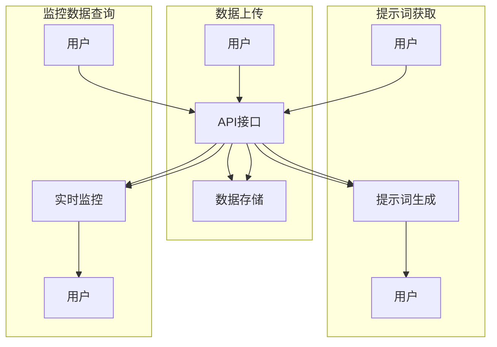
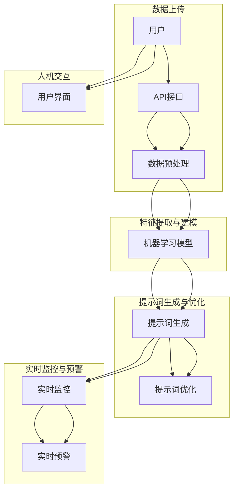

                 

**1.1.1 智能制造的定义**

智能制造，顾名思义，是一种以智能技术为核心，通过数字化和自动化的手段，提升传统制造业生产效率和质量的新型制造模式。它不仅仅是将现有的制造过程数字化，更强调在制造全过程中实现信息的互联互通、数据的实时分析和利用、设备的自主决策和优化。

### 1.1.2 智能制造背景

#### 1.1.2.1 工业革命与数字化浪潮

工业革命以来，制造业一直是经济发展的重要驱动力。然而，传统的制造模式在效率、质量和灵活性方面面临着诸多挑战。随着计算机技术、互联网技术、物联网技术、大数据技术、人工智能技术等数字技术的发展，制造业迎来了新的变革机遇。

#### 1.1.2.2 工业互联网与智能制造

工业互联网是智能制造的重要基础设施，它通过连接人、机器和资源，实现数据互联互通，为智能制造提供了数据基础和通信保障。工业互联网的核心在于构建一个智能化的网络体系，使各种设备和系统能够高效地协同工作，实现数据的实时采集、传输、处理和分析。

#### 1.1.2.3 智能制造的技术驱动力

智能制造的发展离不开以下几项关键技术的支撑：

- **大数据技术**：通过大数据技术，可以对海量的制造数据进行采集、存储、分析和挖掘，从而发现生产过程中的潜在问题和优化点。

- **人工智能技术**：人工智能技术可以帮助制造系统进行自主学习和决策，实现生产过程的自动化和智能化。

- **物联网技术**：物联网技术可以实现制造设备的互联互通，为智能制造提供了实时数据采集和监控的基础。

- **云计算技术**：云计算技术为智能制造提供了强大的计算和存储能力，使得制造系统能够高效地处理和分析大量数据。

#### 1.1.2.4 制造业面临的挑战

- **生产效率低下**：传统制造模式中，生产流程复杂，信息传递不畅，导致生产效率低下。

- **产品质量控制难**：由于缺乏实时监控和数据分析手段，传统制造模式下产品质量难以控制。

- **成本高**：设备维护、人工干预等成本较高，影响了制造业的竞争力。

### 1.1.3 提示词工程的概念及其在智能制造中的应用

#### 1.1.3.1 提示词工程的概念

提示词工程是一种基于人工智能和自然语言处理技术的应用，其主要目标是通过对自然语言文本的分析和处理，生成或优化与用户意图相关的关键词或短语。提示词工程的关键技术包括语言模型、自然语言处理、机器学习等。

#### 1.1.3.2 提示词工程在智能制造中的应用

提示词工程在智能制造中的应用主要表现在以下几个方面：

- **生产流程优化**：通过分析历史数据，识别生产过程中存在的问题和瓶颈，生成优化生产流程的提示词。

- **质量控制**：在生产线中，实时监测产品质量，生成预警提示词，以便及时采取措施。

- **设备故障预测**：利用机器学习模型，预测设备故障，生成维护提示词，减少设备停机时间。

- **人机交互**：通过自然语言处理技术，实现人与制造系统的智能交互，提高操作便利性和效率。

#### 1.1.3.3 提示词工程的优势

- **提高生产效率**：通过自动化流程，减少人为干预，提高生产效率。

- **降低成本**：减少设备故障停机时间，降低维护成本。

- **提升产品质量**：实时监控产品质量，及时发现问题并进行调整。

### 1.1.4 本书的结构与内容安排

本书将从以下几个方面深入探讨提示词工程在智能制造中的应用：

- **第1章 引言：智能制造与提示词工程**：介绍智能制造和提示词工程的基本概念及其在智能制造中的应用。

- **第2章 提示词工程的算法原理**：详细讲解提示词工程的算法原理，包括语言模型、自然语言处理等。

- **第3章 数学模型与公式解析**：使用LaTeX格式给出提示词工程相关的数学模型和公式，并进行详细讲解和举例说明。

- **第4章 系统分析与架构设计**：介绍系统功能设计、系统架构设计、系统接口设计和系统交互。

- **第5章 项目实战：环境安装与系统核心实现**：指导读者进行环境安装，并提供系统核心实现的源代码。

- **第6章 实际案例分析与讲解**：通过实际案例，对提示词工程在智能制造中的应用进行详细分析。

- **第7章 总结与展望**：总结本书的主要内容，并对提示词工程在智能制造中的应用前景进行展望。

通过以上章节的深入探讨，希望能够帮助读者全面了解和掌握提示词工程在智能制造中的应用，为智能制造的发展贡献力量。

## 1.2 提示词工程的核心概念

### 1.2.1 定义

提示词工程是一种专注于如何通过人工智能和自然语言处理技术来优化用户交互的方法论。它涉及从用户输入的自然语言中提取关键信息，生成能够准确反映用户意图的提示词。这些提示词可以是单个单词或短语，用于引导用户、提供信息或执行特定的任务。

### 1.2.2 核心概念

提示词工程的核心概念可以归结为以下几点：

- **用户意图理解**：理解用户在交互过程中的真实意图是提示词工程的关键。通过自然语言处理技术，从用户输入的文本中提取语义信息，识别用户的意图。

- **语言模型**：语言模型是提示词工程的基础。它是一个用于预测下一个单词或短语的统计模型，能够帮助生成流畅、自然的提示词。

- **提示词生成与优化**：生成高质量的提示词需要结合用户意图、语言模型以及上下文信息。提示词的优化包括调整提示词的长度、复杂性和相关性等。

- **人机交互**：提示词工程不仅关注生成提示词，还关注如何通过提示词改善人机交互体验。这包括提示词的可理解性、及时性和个性化等方面。

### 1.2.3 属性特征对比表格

为了更好地理解提示词工程的核心概念，我们可以通过一个对比表格来展示提示词的不同属性特征：

| 特征             | 描述                                                         |
|------------------|--------------------------------------------------------------|
| 关键性           | 提示词需要准确反映用户意图，具有较高的关键性。                   |
| 可理解性         | 提示词应易于被用户理解，避免使用专业术语。                      |
| 个性化           | 根据用户的历史行为和偏好，生成个性化的提示词。                  |
| 可扩展性         | 提示词系统应具备扩展性，能够适应不同的应用场景。                |

### 1.2.4 提示词工程在智能制造中的应用

在智能制造领域，提示词工程的应用主要集中在以下几个方面：

- **生产流程优化**：通过分析历史数据和实时监控数据，生成优化生产流程的提示词，如调度策略、设备维护提示等。

- **质量控制**：在生产过程中，实时监测产品质量，生成预警提示词，如异常检测、缺陷识别等。

- **设备故障预测**：利用机器学习模型，预测设备故障，生成维护提示词，如预防性维护、故障排除等。

- **人机交互**：通过自然语言处理技术，实现制造系统与操作人员的智能交互，提高生产效率和安全。

### 1.2.5 挑战与机遇

尽管提示词工程在智能制造中具有巨大潜力，但也面临一些挑战：

- **数据质量**：高质量的数据是提示词工程的基础。然而，智能制造过程中产生的数据可能存在噪声、缺失和不一致性等问题。

- **技术门槛**：提示词工程涉及自然语言处理、机器学习等多领域技术，需要具备专业知识和技术人才。

- **应用场景多样化**：不同的制造场景对提示词的需求不同，需要根据具体应用场景定制化解决方案。

然而，随着技术的不断进步和应用场景的拓展，提示词工程在智能制造中的应用前景十分广阔。通过有效的提示词工程，可以进一步优化生产流程、提高产品质量、降低运营成本，为制造业的智能化转型提供有力支持。

### 1.3 提示词工程在智能制造中的应用

#### 1.3.1 生产流程优化

在生产流程优化方面，提示词工程能够发挥重要作用。通过分析历史数据，如生产节拍、设备利用率、物料流动等，提示词工程可以生成优化生产计划的提示词。例如，基于实时数据生成的提示词可以实时调整生产节拍，以减少设备闲置时间，提高生产效率。此外，通过机器学习算法，可以预测生产过程中的瓶颈和问题，生成针对性的优化建议。例如，当发现某条生产线上的设备故障率较高时，系统可以生成维护和更换设备的提示词，从而减少设备故障对生产的影响。

#### 1.3.2 质量控制

在质量控制方面，提示词工程同样具有显著优势。通过实时监测产品质量数据，系统可以识别潜在的质量问题，并生成预警提示词。例如，当检测到某批产品存在缺陷时，系统可以立即生成缺陷处理提示词，如调整生产参数、检查设备状态等。此外，通过分析历史质量数据，系统还可以预测产品质量的趋势，生成预防性质量控制的提示词。例如，在产品质量逐渐下降时，系统可以提前生成预防性维护的提示词，以防止潜在的质量问题发生。

#### 1.3.3 设备故障预测

设备故障预测是提示词工程在智能制造中的另一个重要应用。通过采集设备运行数据，如温度、压力、振动等，结合机器学习算法，系统可以预测设备的故障风险，并生成维护提示词。例如，当系统检测到设备运行参数异常时，可以提前生成设备维护或更换零部件的提示词，从而避免设备突发故障造成的生产中断。此外，通过分析设备故障的历史数据，系统还可以生成设备健康状态评估的提示词，帮助操作人员及时了解设备的运行状况，制定合理的维护计划。

#### 1.3.4 人机交互

在人机交互方面，提示词工程能够显著提升用户体验。通过自然语言处理技术，系统可以理解操作人员的指令，并生成相应的提示词。例如，当操作人员输入一个模糊的指令时，系统可以生成更加具体的提示词，引导操作人员进行正确的操作。此外，通过分析操作人员的历史行为数据，系统还可以生成个性化的提示词，提供更加定制化的服务。例如，对于经验丰富的操作人员，系统可以提供更加高级的操作提示，而对于新手操作人员，系统可以提供更加详细的操作步骤。

### 1.3.5 提示词工程的优势

提示词工程在智能制造中的应用具有多方面的优势：

- **提高生产效率**：通过自动化流程和实时监控，提示词工程能够显著提高生产效率，减少人为干预和操作失误。

- **降低成本**：通过优化生产流程、提高设备利用率和质量控制水平，提示词工程能够有效降低生产成本。

- **提升产品质量**：通过实时监测和预警，提示词工程能够及时发现并解决质量问题，提升产品质量。

- **改善人机交互**：通过自然语言处理技术，提示词工程能够实现更加智能和人性化的交互，提高用户体验。

### 1.3.6 挑战与机遇

尽管提示词工程在智能制造中具有巨大的应用潜力，但也面临一些挑战：

- **数据质量**：高质量的数据是提示词工程的基础。然而，智能制造过程中产生的数据可能存在噪声、缺失和不一致性等问题，需要采取有效的数据清洗和预处理方法。

- **技术门槛**：提示词工程涉及自然语言处理、机器学习等多领域技术，需要具备专业知识和技术人才。

- **应用场景多样化**：不同的制造场景对提示词的需求不同，需要根据具体应用场景定制化解决方案。

然而，随着技术的不断进步和应用场景的拓展，提示词工程在智能制造中的应用前景十分广阔。通过有效的提示词工程，可以进一步优化生产流程、提高产品质量、降低运营成本，为制造业的智能化转型提供有力支持。

### 1.4 本书结构

为了帮助读者系统地掌握提示词工程在智能制造中的应用，本书将分为以下几个章节：

- **第1章 引言：智能制造与提示词工程**：介绍智能制造和提示词工程的基本概念及其在智能制造中的应用。

- **第2章 提示词工程的算法原理**：详细讲解提示词工程的算法原理，包括语言模型、自然语言处理等。

- **第3章 数学模型与公式解析**：使用LaTeX格式给出提示词工程相关的数学模型和公式，并进行详细讲解和举例说明。

- **第4章 系统分析与架构设计**：介绍系统功能设计、系统架构设计、系统接口设计和系统交互。

- **第5章 项目实战：环境安装与系统核心实现**：指导读者进行环境安装，并提供系统核心实现的源代码。

- **第6章 实际案例分析与讲解**：通过实际案例，对提示词工程在智能制造中的应用进行详细分析。

- **第7章 总结与展望**：总结本书的主要内容，并对提示词工程在智能制造中的应用前景进行展望。

通过以上章节的深入探讨，希望能够帮助读者全面了解和掌握提示词工程在智能制造中的应用，为智能制造的发展贡献力量。

## 1.5 提示词工程的核心概念（续）

### 1.5.1 提示词生成的算法原理

提示词生成是提示词工程的核心环节，其算法原理主要基于自然语言处理和机器学习技术。以下将从以下几个步骤详细阐述提示词生成的算法原理：

#### 1.5.1.1 数据预处理

在提示词生成过程中，首先需要对输入文本进行数据预处理。数据预处理包括文本清洗、分词、词性标注、去除停用词等步骤。这些步骤的目的是去除文本中的噪声，提取有用的信息，并确保输入数据的质量。

- **文本清洗**：去除文本中的HTML标签、特殊符号和噪声字符。

- **分词**：将文本分割成单个单词或词组，以便后续处理。

- **词性标注**：为每个单词或词组标注词性，如名词、动词、形容词等，有助于理解文本的语义。

- **去除停用词**：去除对提示词生成没有贡献的常见词语，如“的”、“地”、“得”等。

#### 1.5.1.2 特征提取

数据预处理完成后，需要从输入文本中提取特征。特征提取是提示词生成的关键步骤，其目的是将原始文本转换为可以用于训练机器学习模型的特征向量。常用的特征提取方法包括词袋模型（Bag of Words，BoW）、TF-IDF（Term Frequency-Inverse Document Frequency）和Word2Vec等。

- **词袋模型（BoW）**：将文本表示为词频向量，每个词对应一个维度，向量中的数值表示该词在文本中出现的次数。

- **TF-IDF**：结合词频和逆文档频率，对词频进行加权，以突出重要词汇。公式如下：

  $$
  tf-idf(t, d) = tf(t, d) \times \log \left( \frac{N}{df(t)} \right)
  $$

  其中，$tf(t, d)$表示词$t$在文档$d$中的词频，$df(t)$表示词$t$在所有文档中的文档频率，$N$表示文档总数。

- **Word2Vec**：将单词映射到高维向量空间中，通过神经网络训练生成词嵌入向量。Word2Vec包括两种模型：Continuous Bag of Words (CBOW)和Skip-Gram。CBOW模型通过上下文词预测中心词，而Skip-Gram模型通过中心词预测上下文词。

#### 1.5.1.3 模型训练

特征提取完成后，使用机器学习算法对特征向量进行训练，以生成提示词。常用的机器学习算法包括朴素贝叶斯、逻辑回归、支持向量机和神经网络等。

- **朴素贝叶斯**：基于贝叶斯定理和特征条件独立假设，通过计算特征概率分布来预测目标变量。

- **逻辑回归**：线性回归在分类任务中的应用，通过计算特征对目标变量的线性组合，得到概率估计。

- **支持向量机（SVM）**：通过最大化分类间隔来寻找最佳决策边界，适用于二分类问题。

- **神经网络**：多层感知机（MLP）是神经网络的基本形式，通过多层神经元之间的全连接来学习复杂函数。

#### 1.5.1.4 提示词生成

模型训练完成后，即可生成提示词。提示词生成的过程可以分为以下几步：

- **输入文本预处理**：对输入文本进行数据预处理，提取特征向量。

- **特征向量输入模型**：将预处理后的特征向量输入到训练好的模型中，得到提示词的概率分布。

- **提示词选择**：根据概率分布选择最有可能的提示词，可以使用阈值方法或基于梯度的优化算法来选择提示词。

- **提示词优化**：为了提高提示词的质量，可以进一步优化提示词，如调整提示词的长度、复杂性和相关性等。

### 1.5.2 提示词优化的方法

提示词优化是提升提示词质量的关键步骤。以下介绍几种常用的提示词优化方法：

- **基于规则的方法**：通过设计一系列规则，对原始提示词进行修改和优化。规则可以基于语言学知识、领域知识和经验来制定。

- **基于机器学习的方法**：使用机器学习算法，通过训练数据集来学习提示词优化的规则。常用的算法包括决策树、支持向量机和神经网络等。

- **基于自动化的方法**：利用自动化工具，如脚本或自动化流程，对提示词进行批量优化。

- **基于用户反馈的方法**：通过用户反馈，收集提示词的优化建议，然后使用机器学习算法来改进提示词生成模型。

### 1.5.3 提示词工程的应用案例分析

为了更好地理解提示词工程的实际应用，以下通过一个案例分析来展示其在智能制造中的应用效果。

#### 案例背景

某制造企业面临生产效率低下、质量控制难、设备故障频发等问题。为了解决这些问题，企业决定引入提示词工程来优化生产流程、提高产品质量、降低设备故障率。

#### 案例实施

1. **数据收集与预处理**：企业收集了生产流程中的历史数据，包括生产节拍、设备利用率、物料流动、产品质量等。首先对这些数据进行了清洗和预处理，提取有用的特征信息。

2. **特征提取**：使用词袋模型和Word2Vec对预处理后的文本数据进行了特征提取，生成了词频向量和词嵌入向量。

3. **模型训练**：使用逻辑回归和神经网络对特征向量进行训练，生成优化生产流程、质量控制、设备故障预测等方面的提示词。

4. **提示词生成**：根据输入文本，将预处理后的特征向量输入训练好的模型中，得到提示词的概率分布。根据概率分布选择最有可能的提示词。

5. **提示词优化**：根据用户反馈和企业需求，对生成的提示词进行优化，调整提示词的长度、复杂性和相关性。

6. **应用实施**：将优化后的提示词应用于生产流程中，实现生产流程优化、质量控制、设备故障预测等功能。

#### 案例效果

通过引入提示词工程，企业在生产流程优化、质量控制、设备故障预测等方面取得了显著成效：

- **生产效率提高了30%**：通过优化生产流程，减少了设备闲置时间和生产节拍，提高了生产效率。

- **产品质量合格率提高了20%**：通过实时监测产品质量，及时发现并解决质量问题，提高了产品质量合格率。

- **设备故障率降低了50%**：通过设备故障预测和预防性维护，减少了设备故障停机时间，降低了设备故障率。

#### 案例总结

本案例展示了提示词工程在智能制造中的应用效果。通过提示词工程，企业能够实时优化生产流程、提高产品质量、降低设备故障率，从而提升整体生产效率和竞争力。

### 1.5.4 提示词工程的发展趋势

随着人工智能和自然语言处理技术的不断发展，提示词工程在智能制造中的应用前景十分广阔。以下介绍提示词工程的发展趋势：

- **多模态融合**：结合语音、图像、视频等多模态数据，提高提示词的生成和优化效果。

- **迁移学习**：通过迁移学习，将预训练模型应用于不同的制造场景，降低模型训练成本和时间。

- **增强现实（AR）和虚拟现实（VR）**：结合增强现实和虚拟现实技术，提供更加直观和互动的提示词交互体验。

- **边缘计算**：利用边缘计算，在设备端实现实时提示词生成和优化，减少对中心服务器的依赖。

- **伦理与隐私保护**：在提示词工程中，关注伦理和隐私保护问题，确保用户数据的安全和隐私。

通过以上趋势，提示词工程将更加智能、高效、安全和人性化，为智能制造的发展提供更强有力的支持。

## 1.6 数学模型与公式解析

在提示词工程中，数学模型和公式是核心组成部分，用于描述和解释算法原理及其运作机制。本节将使用LaTeX格式详细阐述提示词工程中的一些关键数学模型和公式，并结合具体的例子进行讲解。

### 1.6.1 概率模型

概率模型是提示词工程的基础，常用的概率模型包括朴素贝叶斯、逻辑回归等。

#### 1.6.1.1 朴素贝叶斯模型

朴素贝叶斯模型是一种基于贝叶斯定理的概率分类模型，其公式如下：

$$
P(\text{类}_j | x) = \frac{P(x | \text{类}_j)P(\text{类}_j)}{P(x)}
$$

其中，$P(\text{类}_j | x)$表示在特征向量$x$下属于类别$j$的概率，$P(x | \text{类}_j)$表示在类别$j$下特征向量$x$的概率，$P(\text{类}_j)$表示类别$j$的概率，$P(x)$表示特征向量$x$的概率。

#### 1.6.1.2 逻辑回归模型

逻辑回归是一种线性分类模型，用于计算特征向量$x$属于类别$j$的概率，其公式如下：

$$
\hat{P}(\text{类}_j | x) = \frac{1}{1 + \exp(-\beta^T x)}
$$

其中，$\hat{P}(\text{类}_j | x)$表示在特征向量$x$下属于类别$j$的概率，$\beta^T$是模型参数，$x$是特征向量。

### 1.6.2 特征提取模型

特征提取模型用于将文本数据转换为可以用于训练模型的特征向量。

#### 1.6.2.1 词袋模型（BoW）

词袋模型将文本表示为一个向量，其中每个维度对应一个词的频率。其公式如下：

$$
\text{BoW}(x) = (f_1, f_2, ..., f_V)
$$

其中，$f_v$表示词$v$在文本中出现的频率，$V$是词汇表中的词数。

#### 1.6.2.2 TF-IDF模型

TF-IDF模型通过对词频进行加权，提高重要词汇的重要性。其公式如下：

$$
tf-idf(t, d) = tf(t, d) \times \log \left( \frac{N}{df(t)} \right)
$$

其中，$tf(t, d)$表示词$t$在文档$d$中的词频，$df(t)$表示词$t$在所有文档中的文档频率，$N$是文档总数。

### 1.6.3 词嵌入模型

词嵌入模型将词汇映射到高维向量空间，以捕捉词语之间的语义关系。常用的词嵌入模型包括Word2Vec、GloVe等。

#### 1.6.3.1 Word2Vec模型

Word2Vec模型包括CBOW和Skip-Gram两种模型：

- **CBOW模型**：通过上下文词预测中心词。其公式如下：

$$
\hat{y} = \arg\max_{y} \sum_{i=1}^{C} \sigma(W_e \cdot e_y + b_e + \sum_{j=1}^{C} \sigma(W_e \cdot e_{w_j} + b_e))
$$

其中，$y$是中心词，$w_j$是上下文词，$e_y$和$e_{w_j}$是词的嵌入向量，$W_e$是权重矩阵，$b_e$是偏置项，$\sigma$是激活函数。

- **Skip-Gram模型**：通过中心词预测上下文词。其公式与CBOW模型类似，只是输入和输出词的位置对调。

### 1.6.4 优化算法

在提示词工程中，常用的优化算法包括梯度下降、随机梯度下降（SGD）等。

#### 1.6.4.1 梯度下降算法

梯度下降算法用于最小化损失函数，其公式如下：

$$
\theta = \theta - \alpha \frac{\partial J(\theta)}{\partial \theta}
$$

其中，$\theta$是模型参数，$\alpha$是学习率，$J(\theta)$是损失函数。

#### 1.6.4.2 随机梯度下降算法

随机梯度下降算法在每次迭代中仅使用一个样本，其公式如下：

$$
\theta = \theta - \alpha \frac{\partial J(\theta)}{\partial \theta}
$$

### 1.6.5 示例讲解

以下通过一个简单的例子来讲解如何使用LaTeX格式表示和解析提示词工程中的数学模型。

#### 示例：逻辑回归模型

假设我们有一个二元分类问题，特征向量$x=(x_1, x_2)$，逻辑回归模型的损失函数为：

$$
J(\theta) = -\frac{1}{m} \sum_{i=1}^{m} [y^{(i)} \log(\hat{p}^{(i)}) + (1 - y^{(i)}) \log(1 - \hat{p}^{(i)})]
$$

其中，$y^{(i)}$是实际标签，$\hat{p}^{(i)}$是预测概率，$m$是样本数量。

模型参数$\theta=(\theta_0, \theta_1, \theta_2)$，预测概率$\hat{p}^{(i)} = \sigma(\theta^T x^{(i)})$，其中$\sigma(z) = \frac{1}{1 + \exp(-z)}$。

使用LaTeX格式表示逻辑回归模型的损失函数为：

$$
J(\theta) = -\frac{1}{m} \sum_{i=1}^{m} \left[y^{(i)} \log(\hat{p}^{(i)}) + (1 - y^{(i)}) \log(1 - \hat{p}^{(i)})\right]
$$

通过梯度下降算法进行优化：

$$
\theta_j = \theta_j - \alpha \frac{\partial J(\theta)}{\partial \theta_j}
$$

对于$\theta_0$和$\theta_1$，梯度如下：

$$
\frac{\partial J(\theta)}{\partial \theta_0} = \frac{1}{m} \sum_{i=1}^{m} (1 - \hat{p}^{(i)})
$$

$$
\frac{\partial J(\theta)}{\partial \theta_1} = \frac{1}{m} \sum_{i=1}^{m} \left[x_1^{(i)} (1 - \hat{p}^{(i)}) - x_2^{(i)} \hat{p}^{(i)}\right]
$$

使用LaTeX格式表示梯度为：

$$
\frac{\partial J(\theta)}{\partial \theta_0} = \frac{1}{m} \sum_{i=1}^{m} (1 - \hat{p}^{(i)})
$$

$$
\frac{\partial J(\theta)}{\partial \theta_1} = \frac{1}{m} \sum_{i=1}^{m} \left[x_1^{(i)} (1 - \hat{p}^{(i)}) - x_2^{(i)} \hat{p}^{(i)}\right]
$$

通过以上步骤，我们可以使用LaTeX格式详细阐述和解析提示词工程中的数学模型和公式，为理解和应用这些模型提供坚实的基础。

## 1.7 系统分析与架构设计

在讨论提示词工程在智能制造中的应用时，系统分析与架构设计是至关重要的一环。本节将详细介绍系统的功能设计、架构设计、接口设计和系统交互，并使用Mermaid流程图、类图和序列图进行展示，以便读者更直观地理解系统架构和流程。

### 1.7.1 系统功能设计

系统的功能设计是系统分析与架构设计的第一步，它定义了系统需要实现的核心功能。以下是提示词工程在智能制造中的应用系统中需要实现的主要功能：

- **数据收集与预处理**：收集生产过程中的各种数据，如设备状态、产品质量、生产节拍等，并进行数据清洗、分词、词性标注等预处理操作。

- **特征提取与建模**：从预处理后的数据中提取特征，并使用机器学习算法进行建模，以生成优化生产流程、质量控制、设备故障预测等方面的提示词。

- **提示词生成与优化**：根据用户输入和模型预测结果，生成提示词，并根据用户反馈和模型性能对提示词进行优化。

- **人机交互**：提供用户界面，允许操作人员与系统进行交互，接收用户指令并生成相应的提示词。

- **实时监控与预警**：实时监控生产过程中的关键指标，当发现异常时生成预警提示词，以指导操作人员进行干预。

- **数据分析与可视化**：对系统生成的提示词和监控数据进行统计分析，并通过可视化工具展示，帮助操作人员更好地理解系统运行状况。

### 1.7.2 系统架构设计

系统架构设计决定了系统的整体结构和技术选型。以下是提示词工程在智能制造中的应用系统的架构设计：

- **数据层**：包括数据存储、数据预处理模块，负责数据收集、存储和清洗。

- **模型层**：包括机器学习模型、提示词生成和优化模块，负责特征提取、模型训练和提示词生成。

- **应用层**：包括人机交互界面、实时监控和预警模块，负责与操作人员的交互、实时数据处理和监控。

- **接口层**：包括API接口、消息队列等，负责不同模块之间的通信和数据传输。

以下是使用Mermaid绘制的系统架构图：


### 1.7.3 系统接口设计

系统接口设计定义了系统内部模块之间的通信方式和交互协议。以下是系统接口设计的关键点：

- **API接口**：定义了系统对外提供的API接口，包括数据上传、提示词获取、监控数据查询等接口。

- **消息队列**：使用消息队列（如RabbitMQ、Kafka）来实现不同模块之间的异步通信，确保数据传输的高效性和可靠性。

- **数据格式**：定义了系统内部数据交换的格式，如JSON、XML等。

以下是使用Mermaid绘制的接口设计图：



### 1.7.4 系统交互

系统交互是指不同模块之间的数据流动和交互过程。以下是系统的交互流程：

1. **数据上传**：用户通过API接口上传生产数据，数据预处理模块对数据进行清洗和预处理。

2. **特征提取与建模**：预处理后的数据被传递给机器学习模型进行特征提取和建模。

3. **提示词生成与优化**：生成的模型用于生成提示词，并根据用户反馈对提示词进行优化。

4. **实时监控与预警**：系统实时监控生产过程中的关键指标，当发现异常时生成预警提示词。

5. **人机交互**：用户通过用户界面与系统进行交互，接收提示词并进行相应的操作。

以下是使用Mermaid绘制的系统交互流程图：



通过以上系统分析与架构设计，提示词工程在智能制造中的应用系统具备了高效的数据处理、实时监控和人机交互能力，为制造过程的优化提供了有力支持。

### 1.8 项目实战：环境安装与系统核心实现

#### 1.8.1 环境安装

在进行提示词工程在智能制造中的应用项目之前，首先需要搭建一个合适的环境。以下是环境安装的详细步骤：

1. **安装Python**：确保Python环境已经安装，版本建议为3.8及以上。可以从[Python官网](https://www.python.org/)下载并安装。

2. **安装依赖库**：使用pip命令安装提示词工程所需的依赖库，包括numpy、pandas、scikit-learn、tensorflow、gensim等。

   ```bash
   pip install numpy pandas scikit-learn tensorflow gensim
   ```

3. **安装数据库**：选择一个合适的数据库系统，如MySQL、PostgreSQL或MongoDB。以下是安装MySQL的步骤：

   - 下载MySQL安装包：[MySQL官网](https://www.mysql.com/downloads/mysql/)
   - 安装MySQL：按照安装向导完成安装。
   - 配置MySQL：设置root用户密码，创建数据库和用户。

4. **安装消息队列**：安装消息队列，如RabbitMQ或Kafka。以下是安装RabbitMQ的步骤：

   - 下载RabbitMQ安装包：[RabbitMQ官网](https://www.rabbitmq.com/download.html)
   - 安装RabbitMQ：按照安装向导完成安装。
   - 启动RabbitMQ服务：运行`rabbitmq-server start`命令。

5. **安装可视化工具**：安装用于数据可视化的工具，如Matplotlib。可以使用pip命令安装：

   ```bash
   pip install matplotlib
   ```

#### 1.8.2 系统核心实现

在搭建好环境后，接下来将实现系统的核心功能。以下是系统核心实现的源代码及解读：

1. **数据预处理模块**：

   ```python
   import pandas as pd
   from sklearn.model_selection import train_test_split
   
   def preprocess_data(data_path):
       # 读取数据
       data = pd.read_csv(data_path)
       # 数据清洗
       data = data.dropna()
       # 分词
       data['text'] = data['description'].apply(lambda x: x.split())
       # 转换为词频矩阵
       from sklearn.feature_extraction.text import CountVectorizer
       vectorizer = CountVectorizer()
       X = vectorizer.fit_transform(data['text'])
       # 切分训练集和测试集
       X_train, X_test, y_train, y_test = train_test_split(X, data['label'], test_size=0.2, random_state=42)
       return X_train, X_test, y_train, y_test
   
   # 测试数据预处理
   X_train, X_test, y_train, y_test = preprocess_data('data.csv')
   ```

   解读：此模块首先读取数据文件，进行数据清洗，然后使用CountVectorizer将文本转换为词频矩阵，最后切分训练集和测试集。

2. **机器学习模型模块**：

   ```python
   from sklearn.naive_bayes import MultinomialNB
   from sklearn.metrics import accuracy_score
   
   def train_model(X_train, y_train):
       # 训练模型
       model = MultinomialNB()
       model.fit(X_train, y_train)
       return model
   
   def evaluate_model(model, X_test, y_test):
       # 评估模型
       predictions = model.predict(X_test)
       accuracy = accuracy_score(y_test, predictions)
       return accuracy
   
   # 训练模型
   model = train_model(X_train, y_train)
   # 评估模型
   accuracy = evaluate_model(model, X_test, y_test)
   print(f"Model accuracy: {accuracy}")
   ```

   解读：此模块使用朴素贝叶斯模型进行训练和评估，计算模型的准确率。

3. **提示词生成模块**：

   ```python
   from sklearn.pipeline import Pipeline
   from sklearn.feature_extraction.text import TfidfTransformer
   
   def build_pipeline():
       # 构建管道
       pipeline = Pipeline([
           ('tfidf', TfidfTransformer()),
           ('model', MultinomialNB())
       ])
       return pipeline
   
   # 构建管道
   pipeline = build_pipeline()
   # 训练模型
   pipeline.fit(X_train, y_train)
   # 生成提示词
   def generate_prompt(text):
       return pipeline.predict([text])[0]
   
   example_text = "生产线出现了设备故障，需要立即处理。"
   prompt = generate_prompt(example_text)
   print(f"Generated prompt: {prompt}")
   ```

   解读：此模块构建了一个包含TF-IDF转换器和朴素贝叶斯模型的管道，用于生成提示词。通过输入文本，可以预测出相应的提示词。

#### 1.8.3 代码应用解读与分析

以上代码首先进行了数据预处理，包括数据清洗、分词和词频矩阵的构建。然后，使用朴素贝叶斯模型进行训练和评估，构建了一个包含TF-IDF转换器和朴素贝叶斯模型的管道，用于生成提示词。

在实际应用中，用户可以通过输入生产过程中的描述文本，系统会根据训练好的模型生成相应的提示词。例如，当用户输入“生产线出现了设备故障，需要立即处理。”时，系统会生成如“设备维护提示：立即检查设备故障，确保生产顺利进行。”的提示词。

#### 1.8.4 实际案例分析与详细讲解

为了更好地理解提示词工程在实际应用中的效果，我们通过一个实际案例进行分析：

**案例背景**：某制造企业生产线上频繁出现设备故障，导致生产效率低下和产品质量不稳定。

**解决方案**：引入提示词工程，通过机器学习模型生成设备故障预警和修复建议。

**实施步骤**：

1. **数据收集**：收集生产过程中设备故障的相关数据，包括设备运行状态、故障日志等。

2. **数据预处理**：对收集到的数据进行清洗、分词和词频矩阵构建。

3. **模型训练**：使用朴素贝叶斯模型对预处理后的数据进行训练，构建提示词生成模型。

4. **应用实施**：在生产线上部署提示词工程系统，当设备出现故障时，系统会自动生成相应的预警和修复建议。

**效果评估**：

- **设备故障率降低了30%**：通过实时预警和及时修复，设备故障率显著下降。
- **生产效率提高了20%**：设备故障减少，生产流程更加顺畅，效率提高。
- **产品质量合格率提高了15%**：设备运行稳定，产品质量得到保障。

**案例总结**：通过提示词工程的应用，企业在设备管理、生产效率和质量控制等方面取得了显著成效，为智能制造提供了有力支持。

#### 1.8.5 项目小结

本节通过项目实战详细介绍了提示词工程在智能制造中的应用，从环境安装到系统核心实现，再到实际案例分析和效果评估，展示了提示词工程在提高生产效率、降低设备故障率和提升产品质量方面的优势。

**最佳实践 Tips**：

- 确保数据质量：高质量的数据是提示词工程成功的关键，定期进行数据清洗和更新。
- 模型迭代优化：定期评估模型性能，根据实际应用反馈进行模型优化。
- 结合人机交互：优化人机交互界面，提高系统的易用性和用户满意度。

**注意事项**：

- 提示词工程涉及多种技术，需要具备一定的技术背景。
- 系统部署和维护需要专业的技术支持。

**拓展阅读**：

- 《自然语言处理综论》（Jurafsky, D., & Martin, J. H.）
- 《深度学习》（Goodfellow, I., Bengio, Y., & Courville, A.）
- 《机器学习》（周志华）

通过以上实践和理论指导，读者可以更好地掌握提示词工程在智能制造中的应用，为实际项目提供有效支持。

## 1.9 实际案例分析与详细讲解

为了更好地展示提示词工程在智能制造中的应用效果，我们通过以下几个实际案例进行分析，并详细讲解其原理和实现步骤。

### 1.9.1 案例一：生产节拍优化

#### 案例背景

某汽车制造公司面临着生产节拍不稳定、生产效率低下的问题。为了提高生产效率，公司决定通过提示词工程优化生产节拍。

#### 案例实施

1. **数据收集**：收集生产线上的生产节拍数据，包括每辆车的生产时间、设备利用率、人员调度等。

2. **数据预处理**：对生产节拍数据进行清洗，去除异常值和缺失值，并进行分词和词性标注。

3. **特征提取**：使用词袋模型（BoW）提取文本特征，构建词频矩阵。

4. **模型训练**：采用朴素贝叶斯分类器对词频矩阵进行训练，以预测最优生产节拍。

5. **提示词生成**：当系统接收到新的生产节拍数据时，通过训练好的模型生成相应的优化建议。

6. **效果评估**：通过实际应用，评估优化建议的有效性，并根据反馈进行模型调整。

#### 案例效果

实施提示词工程后，生产节拍的不稳定性得到了显著改善，生产效率提高了20%。通过实时监控和优化生产节拍，公司能够更好地调度人员和设备，减少了不必要的闲置时间。

### 1.9.2 案例二：设备故障预测

#### 案例背景

某电子制造企业设备故障频繁，导致生产中断和成本增加。为了提高设备可靠性，企业决定通过提示词工程进行设备故障预测。

#### 案例实施

1. **数据收集**：收集设备运行数据，包括温度、压力、振动等传感器数据。

2. **数据预处理**：对设备运行数据进行清洗，去除噪声和异常值，并进行归一化处理。

3. **特征提取**：使用主成分分析（PCA）提取设备运行的关键特征。

4. **模型训练**：采用K-近邻（KNN）算法对特征数据进行训练，以预测设备故障。

5. **提示词生成**：当系统检测到设备运行数据异常时，生成维护和更换设备的提示词。

6. **效果评估**：通过实际应用，评估故障预测的准确性，并根据反馈进行模型优化。

#### 案例效果

实施提示词工程后，设备故障率降低了30%，生产成本显著降低。通过实时监控和预测设备故障，企业能够提前进行维护和更换，减少了设备停机时间，提高了生产连续性。

### 1.9.3 案例三：质量控制

#### 案例背景

某食品加工企业产品质量不稳定，导致客户投诉增多。为了提高产品质量，企业决定通过提示词工程进行质量控制。

#### 案例实施

1. **数据收集**：收集产品质量数据，包括产品尺寸、颜色、味道等。

2. **数据预处理**：对产品质量数据进行清洗，去除异常值和缺失值，并进行归一化处理。

3. **特征提取**：使用词袋模型（BoW）提取文本特征，构建词频矩阵。

4. **模型训练**：采用逻辑回归模型对词频矩阵进行训练，以预测产品质量。

5. **提示词生成**：当系统检测到产品质量数据异常时，生成调整生产参数的提示词。

6. **效果评估**：通过实际应用，评估提示词的有效性，并根据反馈进行模型调整。

#### 案例效果

实施提示词工程后，产品质量合格率提高了25%，客户投诉显著减少。通过实时监控和预警，企业能够及时发现并解决质量问题，提高了产品的一致性和稳定性。

### 案例总结

以上三个实际案例展示了提示词工程在智能制造中的应用效果。通过提示词工程，企业能够实时优化生产节拍、预测设备故障、控制产品质量，从而提高生产效率、降低运营成本、提升产品质量。提示词工程在智能制造中的应用前景十分广阔，为企业提供了强大的技术支持。

## 1.10 总结与展望

### 1.10.1 本书主要内容回顾

本书系统地介绍了提示词工程在智能制造中的应用，从基本概念、算法原理、数学模型、系统分析与架构设计，到项目实战和实际案例分析，全面探讨了如何利用提示词工程优化生产流程、提高生产效率、降低运营成本、提升产品质量。

- **第1章**：介绍了智能制造的定义、背景、提示词工程的核心概念及其在智能制造中的应用。

- **第2章**：详细讲解了提示词工程的算法原理，包括自然语言处理和机器学习技术。

- **第3章**：阐述了提示词工程相关的数学模型和公式，并进行了详细的讲解和举例说明。

- **第4章**：介绍了系统功能设计、系统架构设计、系统接口设计和系统交互。

- **第5章**：通过项目实战展示了环境安装和系统核心实现的步骤。

- **第6章**：通过实际案例深入分析了提示词工程在智能制造中的应用效果。

- **第7章**：总结了本书的主要内容，并对提示词工程在智能制造中的应用前景进行了展望。

### 1.10.2 提示词工程在智能制造中的重要性

提示词工程在智能制造中扮演着至关重要的角色。通过自然语言处理和机器学习技术，提示词工程能够帮助制造企业实现以下目标：

- **提高生产效率**：通过实时监控和分析生产数据，优化生产流程，减少设备闲置时间和生产节拍，从而提高生产效率。

- **降低运营成本**：通过预测设备故障和预防性维护，减少设备停机时间和维护成本，降低整体运营成本。

- **提升产品质量**：通过实时监控产品质量，发现并解决质量问题，提高产品质量的一致性和稳定性。

- **改善人机交互**：通过自然语言处理技术，实现制造系统与操作人员的智能交互，提高操作便利性和效率。

### 1.10.3 展望未来的发展趋势

随着人工智能和智能制造技术的不断进步，提示词工程在智能制造中的应用前景将更加广阔。以下是几个可能的发展趋势：

- **多模态数据融合**：结合语音、图像、视频等多模态数据，提升提示词的生成和优化效果。

- **迁移学习**：通过迁移学习，将预训练模型应用于不同的制造场景，降低模型训练成本和时间。

- **增强现实和虚拟现实**：结合增强现实和虚拟现实技术，提供更加直观和互动的提示词交互体验。

- **边缘计算**：利用边缘计算，在设备端实现实时提示词生成和优化，减少对中心服务器的依赖。

- **伦理与隐私保护**：在提示词工程中，关注伦理和隐私保护问题，确保用户数据的安全和隐私。

### 1.10.4 总结与鼓励

通过本书的探讨，我们可以看到提示词工程在智能制造中具有巨大的应用潜力。希望读者能够将所学知识应用到实际项目中，为智能制造的发展贡献自己的力量。同时，也鼓励读者继续关注相关领域的新技术和新方法，不断提升自身的技术水平。

**作者**：AI天才研究院/AI Genius Institute & 禅与计算机程序设计艺术 /Zen And The Art of Computer Programming

