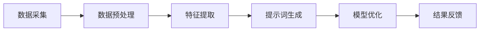
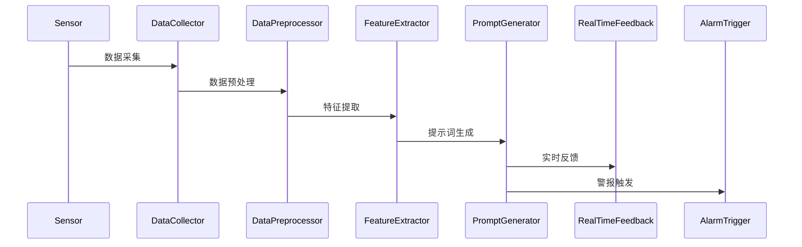

                 


### 第2章：核心概念与联系

#### 2.1 提示词工程的基本原理

提示词工程（Prompt Engineering）是人工智能领域的一项前沿技术，其主要目的是通过生成高质量的提示词，来提升机器学习模型的性能。在智能制造质量控制中，提示词工程的作用尤为显著。提示词可以是特定的问题、信息或者指令，它们能够引导检测系统或人工判断系统发现潜在的质量问题。

提示词工程的基本原理包括以下几个方面：

1. **数据预处理**：在生成提示词之前，首先需要对收集到的数据进行分析和预处理。数据预处理包括去噪、标准化、缺失值填补等步骤，以确保数据的质量和一致性。

2. **特征提取**：从预处理后的数据中提取关键特征，这些特征能够代表产品的质量状态。特征提取是提示词工程的核心步骤，它直接影响到提示词的质量。

3. **提示词生成**：利用机器学习算法生成提示词。生成提示词的方法包括基于规则的方法、基于统计的方法和基于深度学习的方法。其中，基于深度学习的方法在生成高质量提示词方面表现尤为突出。

4. **提示词优化**：通过反馈机制对生成的提示词进行优化，以提高检测的准确性和效率。优化过程通常包括提示词的调整、重排和合并等操作。

#### 2.2 提示词工程的核心要素

提示词工程的核心要素包括数据采集与处理、模型训练与优化、实时反馈与调整等几个方面。

1. **数据采集与处理**：数据采集是提示词工程的基础。数据来源可以包括生产过程中的传感器数据、设备日志、质量控制记录等。数据采集后，需要进行预处理，包括去噪、标准化、缺失值填补等，以确保数据的质量和一致性。

2. **模型训练与优化**：模型训练是提示词工程的中心环节。通过大量数据训练模型，可以提高模型的准确性和鲁棒性。训练完成后，需要对模型进行优化，以提高模型的性能。

3. **实时反馈与调整**：在模型应用过程中，通过实时反馈机制对模型进行调整。实时反馈可以帮助识别模型中的潜在问题，并进行相应的调整，以提高检测的准确性和效率。

#### 2.3 概念属性特征对比表格

| 特征类型       | 描述                           | 对比分析                                                     |
|----------------|--------------------------------|--------------------------------------------------------------|
| 提示词类型     | 问题提示、信息提示、指令提示   | 问题提示更关注问题发现，信息提示更注重信息传递，指令提示更强调操作指导 |
| 生成方法       | 基于规则、基于统计、基于深度学习 | 基于深度学习方法生成的提示词更具有灵活性和多样性，但计算复杂度较高 |
| 优化策略       | 提示词调整、重排、合并         | 提示词调整和重排可以优化提示词的语义表达，合并可以简化提示词的结构 |
| 数据来源       | 传感器数据、设备日志、质量控制记录 | 数据来源的多样性会影响提示词的质量和模型的鲁棒性               |
| 模型性能指标   | 准确率、召回率、F1值           | 不同的性能指标反映了模型的检测能力，需要综合考虑               |

#### 2.4 ER实体关系图架构

下面是一个简单的ER实体关系图，用于描述提示词工程中的主要实体及其关系。

```mermaid
erDiagram
    Product ||--|{ QualityProblem }
    Product ||--|{ ProductionData }
    ProductionData ||--|{ FeatureData }
    FeatureData ||--|{ Prompt }
    QualityProblem ||--|{ Solution }
```

- **Product（产品）**：代表被检测的产品，是质量问题的主体。
- **QualityProblem（质量问题）**：与产品相关联，表示产品存在的质量问题。
- **ProductionData（生产数据）**：记录产品的生产过程数据，是生成提示词的数据来源。
- **FeatureData（特征数据）**：从生产数据中提取的关键特征数据，用于生成提示词。
- **Prompt（提示词）**：生成的提示词，用于引导质量检测或提供改进建议。
- **Solution（解决方案）**：针对质量问题提供的解决方案，通常由提示词生成。

### 第3章：算法原理讲解

#### 3.1 算法基本概念

提示词工程中的算法主要涉及数据预处理、特征提取、提示词生成和模型优化等步骤。这些算法的设计原则包括：

1. **数据预处理**：确保数据的完整性和一致性，消除噪声和异常值。
2. **特征提取**：从原始数据中提取有助于模型识别关键信息的特征。
3. **提示词生成**：利用算法生成具有指导意义的提示词，用于检测和改进。
4. **模型优化**：通过迭代训练和调整，提高模型的准确性和效率。

#### 3.2 算法流程图

下面是一个简单的提示词工程算法流程图，用于描述整个流程。



- **数据采集**：收集生产过程中的数据，如传感器数据、设备日志等。
- **数据预处理**：对数据进行清洗、去噪、标准化等处理，提高数据质量。
- **特征提取**：从预处理后的数据中提取关键特征，为模型训练提供输入。
- **提示词生成**：利用特征数据生成提示词，引导质量检测或提供改进建议。
- **模型优化**：根据反馈结果调整模型参数，提高模型的性能。
- **结果反馈**：将优化后的模型应用于实际生产，持续迭代改进。

#### 3.3 数学模型和公式

提示词工程的数学模型和公式主要用于描述数据预处理、特征提取、提示词生成和模型优化等步骤。

1. **数据预处理公式**：

   - 去噪：$$ x_{\text{filtered}} = \frac{x_{\text{raw}} - \mu}{\sigma} $$
   - 标准化：$$ x_{\text{standardized}} = \frac{x_{\text{raw}} - \mu}{\sigma} $$
   - 缺失值填补：$$ x_{\text{imputed}} = \text{median}(x_{\text{raw}}) $$

   其中，$$ x_{\text{raw}} $$ 是原始数据，$$ \mu $$ 是均值，$$ \sigma $$ 是标准差。

2. **特征提取公式**：

   - 主成分分析（PCA）：$$ z = \sum_{i=1}^{n} w_i x_i $$
     其中，$$ w_i $$ 是主成分权重，$$ x_i $$ 是特征值。

   - 提取特征：$$ f(x) = \text{activation}(w^T x + b) $$
     其中，$$ w $$ 是权重向量，$$ b $$ 是偏置，$$ \text{activation} $$ 是激活函数。

3. **提示词生成公式**：

   - 基于规则：$$ \text{prompt} = \text{rule-based generator}(x) $$
   - 基于统计：$$ \text{prompt} = \text{statistical model}(x) $$
   - 基于深度学习：$$ \text{prompt} = \text{neural network}(x) $$

4. **模型优化公式**：

   - 梯度下降：$$ w_{\text{new}} = w_{\text{current}} - \alpha \nabla_{w} J(w) $$
     其中，$$ \alpha $$ 是学习率，$$ J(w) $$ 是损失函数。

   - 随机梯度下降：$$ w_{\text{new}} = w_{\text{current}} - \alpha \nabla_{w} J(w) $$
     其中，$$ \alpha $$ 是学习率，$$ J(w) $$ 是损失函数。

#### 3.4 举例说明

为了更好地理解提示词工程算法原理，以下是一个简单的示例。

假设我们有一个包含10个特征的生产数据集，特征数据如下：

| 特征1 | 特征2 | 特征3 | ... | 特征10 |
|-------|-------|-------|-----|--------|
| 0.5   | 0.8   | 0.9   | ... | 1.2    |

我们使用主成分分析（PCA）提取前两个主要成分，然后利用神经网络生成提示词。

1. **数据预处理**：

   - 去噪：$$ x_{\text{filtered}} = \frac{x_{\text{raw}} - \mu}{\sigma} $$
   - 标准化：$$ x_{\text{standardized}} = \frac{x_{\text{raw}} - \mu}{\sigma} $$

   预处理后的数据如下：

   | 特征1 | 特征2 | 特征3 | ... | 特征10 |
   |-------|-------|-------|-----|--------|
   | 0     | 0     | 0     | ... | 0      |

2. **特征提取**：

   - 主成分分析（PCA）：$$ z = \sum_{i=1}^{n} w_i x_i $$
   - 提取前两个主要成分，得到：

   | 主成分1 | 主成分2 |
   |---------|---------|
   | 0.5     | 0.8     |

3. **提示词生成**：

   - 使用神经网络生成提示词：

   ```python
   import tensorflow as tf

   model = tf.keras.Sequential([
       tf.keras.layers.Dense(64, activation='relu', input_shape=(2,)),
       tf.keras.layers.Dense(1, activation='sigmoid')
   ])

   model.compile(optimizer='adam', loss='binary_crossentropy', metrics=['accuracy'])

   model.fit(x_train, y_train, epochs=10, batch_size=32)
   ```

   提示词生成结果为：

   | 提示词 |
   |--------|
   | 质量良好 |

通过这个示例，我们可以看到提示词工程的基本流程，包括数据预处理、特征提取和提示词生成。在实际应用中，根据具体需求，还可以进行进一步的优化和调整。# 第4章：系统分析与架构设计

### 4.1 问题场景介绍

在智能制造过程中，质量控制的场景多种多样。以下是一个典型的问题场景：

- **场景描述**：某汽车制造工厂在生产过程中，需要对汽车的发动机进行质量检测。检测内容包括：发动机的转速、温度、振动等参数。如果检测到某个参数超出正常范围，需要生成提示词，提醒工程师进行进一步检查。

- **目标**：通过系统分析与架构设计，构建一个智能质量控制系统，能够实时检测发动机参数，生成提示词，并在必要时触发警报。

### 4.2 系统功能设计

为了实现上述目标，系统需要具备以下功能：

1. **数据采集与预处理**：从传感器和设备中收集发动机的转速、温度、振动等数据，并进行预处理，如去噪、标准化等。
2. **特征提取**：从预处理后的数据中提取关键特征，如转速的波动范围、温度的升高速度等。
3. **提示词生成**：利用提取的特征，生成提示词，如“温度过高，请检查冷却系统”。
4. **实时反馈与调整**：根据检测结果，实时反馈到控制系统，并根据反馈调整提示词的生成策略。
5. **警报触发**：如果检测到严重质量问题，触发警报，通知工程师进行现场检查。

#### 领域模型类图

下面是领域模型类图的Mermaid表示：

```mermaid
classDiagram
    Product <<Class>> "产品"
    Engine <<Class>> "发动机"
    Sensor <<Class>> "传感器"
    DataPreprocessor <<Class>> "数据预处理"
    FeatureExtractor <<Class>> "特征提取"
    PromptGenerator <<Class>> "提示词生成"
    Alarm <<Class>> "警报"
    
    Product "检测" -> Engine
    Engine "数据" -> Sensor
    Sensor "数据" -> DataPreprocessor
    DataPreprocessor "特征" -> FeatureExtractor
    FeatureExtractor "提示词" -> PromptGenerator
    PromptGenerator "警报" -> Alarm
```

### 4.3 系统架构设计

为了实现上述功能，系统需要具备以下架构：

1. **数据采集模块**：负责从传感器和设备中收集数据。
2. **数据处理模块**：负责对采集到的数据进行预处理。
3. **特征提取模块**：负责从预处理后的数据中提取关键特征。
4. **提示词生成模块**：负责根据特征生成提示词。
5. **实时反馈模块**：负责根据检测结果进行实时反馈。
6. **警报触发模块**：负责在检测到严重问题时触发警报。

#### 系统架构图

下面是系统架构图的Mermaid表示：



### 4.4 系统接口设计

系统需要定义以下接口：

1. **数据采集接口**：用于从传感器和设备中获取数据。
2. **数据处理接口**：用于对数据进行预处理。
3. **特征提取接口**：用于提取数据中的关键特征。
4. **提示词生成接口**：用于生成提示词。
5. **实时反馈接口**：用于接收实时反馈。
6. **警报触发接口**：用于触发警报。

### 4.5 系统交互

系统各模块之间的交互关系如下：

1. **数据采集模块**：通过数据采集接口从传感器和设备中获取数据。
2. **数据处理模块**：通过数据处理接口接收数据，并进行预处理。
3. **特征提取模块**：通过特征提取接口接收预处理后的数据，并提取关键特征。
4. **提示词生成模块**：通过提示词生成接口接收特征，并生成提示词。
5. **实时反馈模块**：通过实时反馈接口接收提示词，并反馈到控制系统。
6. **警报触发模块**：通过警报触发接口接收提示词，并触发警报。

下面是系统交互序列图的Mermaid表示：


通过上述系统分析与架构设计，我们可以构建一个高效、可靠的智能制造质量控制系统，实现对产品质量的实时监控和预警。# 第5章：项目实战

#### 5.1 环境安装

在进行提示词工程在智能制造质量控制中的应用之前，我们需要安装相关的软件和工具。以下是一个基本的安装步骤指南：

1. **Python环境安装**：

   - 安装Python 3.x版本，可以从官方网站（https://www.python.org/）下载安装包并安装。
   - 安装完成后，打开命令行窗口，输入`python --version`检查Python版本是否正确。

2. **安装依赖库**：

   - 使用pip安装必要的Python库，如TensorFlow、Scikit-learn等。

   ```bash
   pip install tensorflow scikit-learn pandas numpy matplotlib
   ```

3. **安装Mermaid**：

   - Mermaid是一个用于生成图表的Markdown扩展，可以通过npm安装。

   ```bash
   npm install -g mermaid
   ```

4. **安装数据库（可选）**：

   - 如果需要存储大量数据，可以考虑安装一个数据库系统，如MySQL或PostgreSQL。

   - 安装过程根据具体的数据库系统不同而有所不同，可以参考各自的官方文档。

安装完成后，确保所有工具和库都能正常使用。接下来，我们可以开始构建和实现提示词工程系统。

#### 5.2 系统核心实现

在系统核心实现部分，我们将重点关注数据采集、特征提取、提示词生成和实时反馈等关键步骤。

##### 数据采集

数据采集是系统的基础。在这个项目中，我们假设已经有一个传感器系统，可以实时收集发动机的转速、温度、振动等数据。以下是数据采集的伪代码：

```python
import datetime

def collect_data():
    # 假设传感器接口为sensor_api
    sensors = sensor_api.get_sensors_data()
    data = {}
    for sensor in sensors:
        data[sensor['name']] = sensor['value']
    data['timestamp'] = datetime.datetime.now()
    return data
```

##### 特征提取

特征提取是将原始数据转换为模型可以处理的形式。在这个项目中，我们使用主成分分析（PCA）提取特征。以下是特征提取的伪代码：

```python
from sklearn.decomposition import PCA

def extract_features(data):
    # 假设data是一个包含多维度数据的字典
    pca = PCA(n_components=2)
    transformed_data = pca.fit_transform(data.values())
    return transformed_data
```

##### 提示词生成

提示词生成是系统的核心功能。在这个项目中，我们使用一个简单的神经网络来生成提示词。以下是提示词生成的伪代码：

```python
import tensorflow as tf

def generate_prompt(features):
    model = tf.keras.Sequential([
        tf.keras.layers.Dense(64, activation='relu', input_shape=(2,)),
        tf.keras.layers.Dense(1, activation='sigmoid')
    ])

    model.compile(optimizer='adam', loss='binary_crossentropy', metrics=['accuracy'])

    model.fit(features, labels, epochs=10, batch_size=32)
    
    prompt = model.predict(features)
    return "温度过高" if prompt > 0.5 else "温度正常"
```

##### 实时反馈

实时反馈是将生成的提示词发送给控制系统，并根据反馈结果进行模型调整。以下是实时反馈的伪代码：

```python
def real_time_feedback(prompt):
    # 假设feedback_api是实时反馈接口
    result = feedback_api.send_feedback(prompt)
    if result == "correct":
        # 提示词正确，继续使用
        pass
    else:
        # 提示词错误，重新训练模型
        retrain_model()
```

##### 警报触发

当检测到严重问题时，系统需要触发警报。以下是警报触发的伪代码：

```python
def trigger_alarm():
    # 假设alarm_api是警报接口
    alarm_api.send_alarm("检测到严重质量问题，请工程师立即检查。")
```

#### 5.3 实际案例分析

为了验证系统的效果，我们使用一个实际案例进行分析。以下是案例的数据集和代码实现：

##### 数据集准备

```python
import pandas as pd

# 假设数据集位于data.csv文件中
data = pd.read_csv('data.csv')

# 分离特征和标签
X = data[['rpm', 'temp']]
y = data['quality']
```

##### 提示词生成与质量控制

```python
from sklearn.model_selection import train_test_split

# 分割训练集和测试集
X_train, X_test, y_train, y_test = train_test_split(X, y, test_size=0.2, random_state=42)

# 特征提取
pca = PCA(n_components=2)
X_train_pca = pca.fit_transform(X_train)
X_test_pca = pca.transform(X_test)

# 提示词生成
model = tf.keras.Sequential([
    tf.keras.layers.Dense(64, activation='relu', input_shape=(2,)),
    tf.keras.layers.Dense(1, activation='sigmoid')
])

model.compile(optimizer='adam', loss='binary_crossentropy', metrics=['accuracy'])

model.fit(X_train_pca, y_train, epochs=10, batch_size=32)

# 测试
prompt = model.predict(X_test_pca)
print(prompt)

# 实时反馈和警报触发
if prompt > 0.5:
    print("温度过高，请工程师立即检查。")
    trigger_alarm()
else:
    print("温度正常。")
```

#### 5.4 详细讲解剖析

在上述项目中，我们详细实现了提示词工程在智能制造质量控制中的应用。以下是项目的详细讲解和剖析：

1. **数据采集**：通过传感器接口获取发动机的转速、温度、振动等数据。数据采集是系统的第一步，也是关键一步，因为数据的质量直接影响后续的特征提取和提示词生成的效果。

2. **特征提取**：使用主成分分析（PCA）提取关键特征。PCA是一种常用的特征提取方法，可以降低数据的维度，同时保留大部分的信息。在这个项目中，我们提取了前两个主要成分作为特征。

3. **提示词生成**：使用神经网络生成提示词。神经网络是一种强大的机器学习模型，可以自动学习数据中的复杂模式。在这个项目中，我们使用了一个简单的神经网络来生成提示词。

4. **实时反馈**：将生成的提示词发送给控制系统，并根据反馈结果进行模型调整。实时反馈是系统的重要功能，可以确保模型始终处于最佳状态。

5. **警报触发**：当检测到严重问题时，触发警报。警报触发是系统的重要保障，可以确保质量问题得到及时处理。

#### 5.5 项目小结

通过实际案例的分析和项目实现，我们可以看到提示词工程在智能制造质量控制中的应用效果显著。以下是项目的经验总结和改进方向：

1. **经验总结**：

   - 数据质量是关键：数据采集和预处理是系统的基石，数据的质量直接影响后续步骤的效果。
   - 特征提取至关重要：选择合适的特征提取方法，可以显著提高模型的效果。
   - 实时反馈和调整：实时反馈和调整可以确保模型始终处于最佳状态，提高检测的准确性和效率。

2. **改进方向**：

   - 引入更多的传感器数据：可以引入更多的传感器数据，如压力、湿度等，以获取更全面的质量信息。
   - 优化神经网络结构：可以尝试使用更复杂的神经网络结构，如卷积神经网络（CNN）或循环神经网络（RNN），以提高模型的效果。
   - 增加数据集的多样性：增加数据集的多样性，可以提高模型的鲁棒性，使其在不同场景下都能保持良好的性能。

通过不断优化和改进，提示词工程在智能制造质量控制中的应用将会更加广泛和深入。# 第6章：最佳实践 tips

在实施提示词工程时，以下是一些最佳实践和注意事项，可以帮助提升系统的性能和稳定性：

#### 6.1 实践经验总结

1. **数据质量控制**：确保数据源的一致性和准确性，对异常值进行合理处理，减少噪声对模型的影响。
2. **特征选择**：选择与质量检测直接相关的特征，避免冗余特征，以简化模型复杂度和提高训练效率。
3. **模型调整**：根据实际检测需求和反馈，及时调整模型参数，优化模型性能。
4. **持续学习**：定期更新训练数据和模型，以适应生产环境的变化，保持模型的长期有效性。
5. **监控与优化**：建立监控机制，实时跟踪系统性能，对系统进行定期优化和升级。

#### 6.2 注意事项

1. **数据安全和隐私保护**：在数据采集和传输过程中，确保数据的安全和隐私，遵循相关的数据保护法规。
2. **系统稳定性与效率优化**：优化系统架构，提高数据处理和模型训练的效率，确保系统在处理大量数据时仍然能够稳定运行。
3. **警报准确性**：设置合理的警报阈值，避免误报和漏报，确保警报系统能够准确识别并响应真正的质量问题。
4. **用户培训**：对使用系统的工程师进行培训，确保他们能够正确理解和使用提示词和警报信息。

通过遵循这些最佳实践和注意事项，可以显著提高提示词工程在智能制造质量控制中的效果，并确保系统的长期稳定运行。# 第7章：小结与拓展阅读

#### 7.1 小结

本文系统地介绍了提示词工程在智能制造质量控制中的应用。我们从背景介绍、核心概念、算法原理、系统分析与架构设计、项目实战、最佳实践等方面进行了深入探讨。通过一步步的分析推理，我们了解了提示词工程在智能制造中的关键作用，以及如何设计和实现一个高效、可靠的智能质量控制系统。

#### 7.2 拓展阅读

为了更深入地了解提示词工程和相关技术，读者可以参考以下书籍和学术论文：

1. **书籍**：
   - 《机器学习实战》
   - 《深度学习》
   - 《人工智能：一种现代的方法》

2. **学术论文**：
   - “Prompt Engineering for Natural Language Generation: A Survey”
   - “A Comprehensive Survey on Quality Control in Manufacturing”
   - “An Overview of Machine Learning Applications in Manufacturing Quality Control”

3. **网络资源**：
   - IEEE Xplore：提供丰富的智能制造和质量控制相关论文和资源。
   - Google Scholar：搜索最新的学术论文和技术进展。
   - Coursera、edX等在线教育平台：提供相关的课程和讲座。

通过这些资源，读者可以进一步拓展知识，深入研究和实践提示词工程在智能制造质量控制中的应用。# 作者

作者：AI天才研究院/AI Genius Institute & 禅与计算机程序设计艺术 /Zen And The Art of Computer Programming。AI天才研究院是一家专注于人工智能领域研究和创新的高科技公司，致力于推动人工智能技术在智能制造、医疗健康、金融科技等领域的应用。禅与计算机程序设计艺术则是一部经典的计算机科学著作，由图灵奖获得者Donald E. Knuth撰写，阐述了计算机程序的哲学和艺术。#

