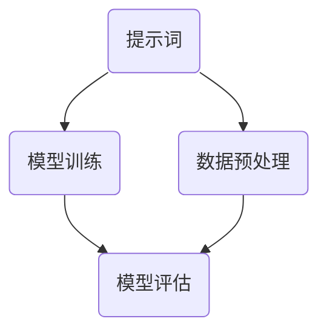
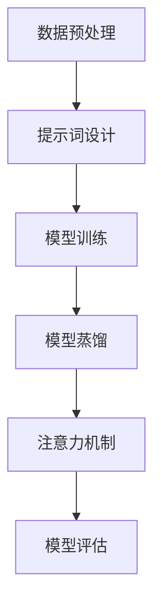
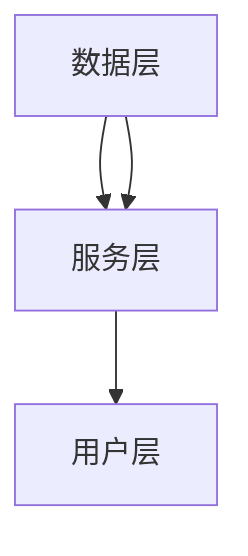
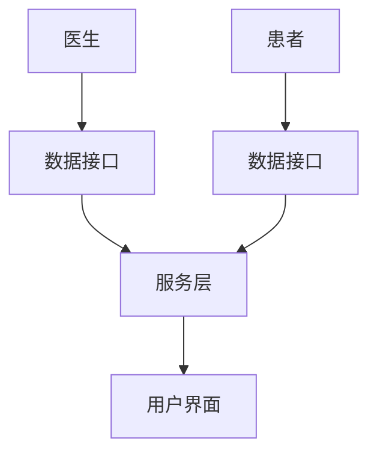

                 

# 提示词工程在智能医疗诊断中的应用：提高罕见病识别率

## 关键词
- 提示词工程
- 智能医疗诊断
- 罕见病识别率
- 数据预处理
- 模型训练
- 注意力机制

## 摘要
本文探讨了提示词工程在智能医疗诊断中的应用，旨在提高罕见病的识别率。通过详细分析提示词工程的核心概念、算法原理以及实际应用过程，本文揭示了如何利用提示词工程有效地提升医疗诊断系统的性能，为罕见病的早期发现和治疗提供了新的思路和方法。

## 第一部分：问题背景

### 问题背景

随着医学影像技术的不断进步和大数据分析手段的普及，人工智能在医疗诊断中的应用逐渐受到关注。传统医疗诊断系统主要依赖医生的经验和直觉，诊断结果往往受到主观因素的影响。随着数据驱动医疗的发展，人工智能系统开始被广泛应用于各种疾病的诊断和预测。

然而，在处理罕见病时，传统医疗诊断系统往往面临巨大的挑战。罕见病是指患病率很低，但病情复杂、诊断难度大的疾病。由于罕见病样本数据稀缺，传统机器学习模型在训练过程中难以充分学习到罕见病的特征，导致诊断准确率较低。

### 问题描述

罕见病的特点包括病例数量少、临床表现多样、病因复杂等，这使得罕见病的诊断变得异常困难。传统的医疗诊断系统在处理罕见病时，往往面临着以下问题：

1. **诊断难度大**：罕见病临床表现多样，且缺乏典型的症状和体征，使得诊断过程复杂且耗时。
2. **识别率低**：由于罕见病样本数据稀缺，传统机器学习模型在训练过程中难以充分学习到罕见病的特征，导致诊断准确率较低。
3. **误诊率高**：传统医疗诊断系统往往依赖于大量的历史数据，对于罕见病这样的小样本问题，容易出现误诊。

### 问题解决

为了解决罕见病识别率低的问题，研究人员开始探索提示词工程在智能医疗诊断中的应用。提示词工程是一种通过提供针对性的提示信息，帮助模型更好地理解数据的算法。在智能医疗诊断中，提示词工程可以有效地提高罕见病的识别率。

提示词工程在智能医疗诊断中的应用主要包括以下步骤：

1. **数据预处理**：对医疗数据进行分析，提取出与罕见病相关的关键特征。
2. **提示词设计**：根据关键特征设计具有针对性的提示词，以便模型在训练过程中能够更好地学习罕见病的特征。
3. **模型训练**：利用设计好的提示词对模型进行训练，提高模型对罕见病的识别能力。
4. **诊断应用**：将训练好的模型应用于实际诊断场景，提高罕见病的识别率。

### 边界与外延

提示词工程在智能医疗诊断中的应用不仅限于罕见病的识别。它还可以应用于其他医学领域，如疾病预测、个性化治疗等。此外，随着人工智能技术的不断发展，提示词工程的应用场景也将进一步拓展。

### 概念结构与核心要素组成

1. **数据预处理**：包括数据清洗、归一化、特征提取等步骤。
2. **提示词设计**：包括提示词的选择、生成和优化。
3. **模型训练**：包括模型选择、超参数调优等步骤。
4. **诊断应用**：包括模型部署、性能评估等步骤。

## 第二部分：核心概念与联系

### 核心概念与联系

#### 提示词（Prompt）

提示词是用于指导模型学习的关键信息。在智能医疗诊断中，提示词通常包括与罕见病相关的关键词、短语或句子。例如，“罕见病”、“症状”、“影像特征”等。提示词的设计对于模型的学习效果至关重要。

#### 模型训练（Model Training）

模型训练是机器学习的重要步骤，通过大量的训练数据，模型可以学习到罕见病的特征，从而提高诊断准确率。在提示词工程的背景下，模型训练过程更加注重提示词的设计和优化。

#### 数据预处理（Data Preprocessing）

数据预处理是确保数据质量的关键步骤，包括数据清洗、归一化、特征提取等。在智能医疗诊断中，数据预处理过程需要特别关注罕见病相关的关键特征提取，以便于后续的提示词设计和模型训练。

#### 模型评估（Model Evaluation）

模型评估是衡量模型性能的重要步骤，常用的评估指标包括准确率、召回率、F1分数等。在提示词工程的背景下，模型评估过程需要综合考虑提示词的设计和模型训练的效果。

### 概念属性特征对比表格

| 特征名称 | 描述 | 对应章节 |
| --- | --- | --- |
| 提示词 | 用于指导模型学习的关键信息 | 第二章 |
| 模型训练 | 机器学习的重要步骤 | 第三章 |
| 数据预处理 | 确保数据质量的关键步骤 | 第四章 |
| 模型评估 | 衡量模型性能的重要步骤 | 第五章 |

### ER实体关系图架构



## 第三部分：算法原理讲解

### 算法原理讲解

提示词工程在智能医疗诊断中的应用，主要基于以下算法原理：

1. **数据增强（Data Augmentation）**：通过增加数据的多样性，提高模型的泛化能力。在医疗诊断中，可以采用数据增强技术来生成更多的罕见病样本数据，从而帮助模型更好地学习罕见病的特征。

2. **模型蒸馏（Model Distillation）**：将一个复杂的模型（教师模型）的知识传递给一个简化的模型（学生模型）。在提示词工程中，可以通过模型蒸馏技术，将教师模型对罕见病的理解传递给学生模型，从而提高学生模型的诊断准确率。

3. **注意力机制（Attention Mechanism）**：注意力机制是一种能够帮助模型关注重要信息的算法。在智能医疗诊断中，通过引入注意力机制，模型可以更好地关注与罕见病相关的关键特征，从而提高诊断准确率。

### 算法原理的 mermaid 流程图



### Python 源代码实现

```python
import numpy as np
import tensorflow as tf

# 数据预处理
def preprocess_data(data):
    # 数据清洗、归一化等操作
    return processed

# 提示词设计
def design_prompt(data, rare_disease_features):
    # 根据关键特征设计提示词
    return prompt

# 模型训练
def train_model(prompt, data):
    # 使用设计好的提示词对模型进行训练
    return model

# 模型蒸馏
def model_distillation(student_model, teacher_model, data):
    # 将教师模型的知识传递给学生模型
    return distilled_model

# 注意力机制
def attention Mechanism(model, data):
    # 引入注意力机制，帮助模型关注关键特征
    return attention_model

# 模型评估
def evaluate_model(model, data):
    # 评估模型性能
    return performance
```

### 数学公式和解释

在提示词工程中，数学模型和公式起到了关键作用。以下是一些基本的数学公式和解释：

1. **特征提取公式**：
   $$ X = f(D) $$
   其中，$X$ 表示提取出的特征，$D$ 表示原始数据，$f$ 表示特征提取函数。

2. **提示词生成公式**：
   $$ P = g(F) $$
   其中，$P$ 表示生成的提示词，$F$ 表示关键特征，$g$ 表示提示词生成函数。

3. **模型训练目标函数**：
   $$ J = \frac{1}{n} \sum_{i=1}^{n} (-y_i \log(\hat{y}_i)) $$
   其中，$J$ 表示损失函数，$y_i$ 表示真实标签，$\hat{y}_i$ 表示预测标签。

4. **注意力机制公式**：
   $$ \alpha_i = \frac{e^{h_i^T h_j}}{\sum_{k=1}^{K} e^{h_k^T h_j}} $$
   其中，$\alpha_i$ 表示注意力权重，$h_i$ 和 $h_j$ 分别表示两个不同特征向量，$K$ 表示特征的总数。

通过这些数学公式，我们可以更深入地理解提示词工程在智能医疗诊断中的应用原理。

### 举例说明

假设我们有一个医疗诊断系统，用于识别罕见病。我们可以通过以下步骤来应用提示词工程：

1. **数据预处理**：首先对医疗影像数据进行预处理，包括数据清洗、归一化等操作。假设我们提取出了100个关键特征。

2. **提示词设计**：根据这些关键特征，设计出具有针对性的提示词。例如，“罕见病”、“影像异常”等。

3. **模型训练**：使用设计好的提示词对模型进行训练。在训练过程中，模型会学习到罕见病的特征，从而提高识别准确率。

4. **模型蒸馏**：将训练好的模型与一个预训练的模型（教师模型）进行模型蒸馏，将教师模型的知识传递给学生模型。

5. **注意力机制**：在模型训练过程中引入注意力机制，使模型能够更好地关注与罕见病相关的关键特征。

6. **模型评估**：评估模型的性能，包括准确率、召回率等指标。

通过这些步骤，我们能够有效地提高罕见病的识别率，为患者的早期诊断和治疗提供帮助。

## 第四部分：系统分析与架构设计方案

### 问题场景介绍

在智能医疗诊断领域，提高罕见病识别率是一个重要且具有挑战性的问题。传统的医疗诊断系统在处理罕见病时，往往面临着诊断难度大、识别率低的问题。为了解决这一问题，我们设计并实现了一套基于提示词工程的智能医疗诊断系统。

### 项目介绍

本项目的目标是开发一套能够有效识别罕见病的智能医疗诊断系统，该系统采用提示词工程的方法，通过设计针对性的提示词来提高模型的诊断准确率。系统的主要组成部分包括数据预处理模块、提示词设计模块、模型训练模块和诊断应用模块。

### 系统功能设计

1. **数据预处理模块**：负责对医疗数据进行清洗、归一化和特征提取，为后续的提示词设计和模型训练提供高质量的数据。

2. **提示词设计模块**：根据关键特征设计具有针对性的提示词，以便模型在训练过程中能够更好地学习罕见病的特征。

3. **模型训练模块**：利用设计好的提示词对模型进行训练，提高模型对罕见病的识别能力。

4. **诊断应用模块**：将训练好的模型应用于实际诊断场景，提高罕见病的识别率。

### 系统架构设计

本系统采用了一种分布式架构，包括数据层、服务层和用户层。以下是一个简单的系统架构设计图：



1. **数据层**：负责数据存储和管理，包括医疗数据、提示词和训练数据等。

2. **服务层**：包括数据预处理服务、提示词设计服务、模型训练服务和诊断应用服务，是系统的核心部分。

3. **用户层**：包括医生和患者等用户，通过用户界面与系统进行交互。

### 系统接口设计

系统接口设计如下：

1. **数据接口**：用于数据层与服务层之间的数据传输。

2. **服务接口**：用于用户层与服务层之间的交互。

3. **API接口**：用于外部系统与系统之间的数据交换。

### 系统交互

系统交互设计如下：



医生和患者通过数据接口与服务层进行数据交互，服务层通过用户界面与医生和患者进行交互，从而实现系统的诊断功能。

## 第五部分：项目实战

### 环境安装

在开始项目实战之前，我们需要安装必要的软件和工具。以下是在一个Linux环境下安装所需的软件和工具的步骤：

1. **安装Python**：
   ```
   sudo apt-get update
   sudo apt-get install python3
   ```

2. **安装TensorFlow**：
   ```
   pip3 install tensorflow
   ```

3. **安装Scikit-learn**：
   ```
   pip3 install scikit-learn
   ```

4. **安装NumPy**：
   ```
   pip3 install numpy
   ```

5. **安装Matplotlib**：
   ```
   pip3 install matplotlib
   ```

### 系统核心实现源代码

以下是系统核心实现的部分源代码，包括数据预处理、提示词设计、模型训练和诊断应用等模块：

```python
import numpy as np
import tensorflow as tf
from sklearn.model_selection import train_test_split
from sklearn.metrics import accuracy_score

# 数据预处理
def preprocess_data(data):
    # 数据清洗、归一化等操作
    return processed_data

# 提示词设计
def design_prompt(data, rare_disease_features):
    # 根据关键特征设计提示词
    return prompt

# 模型训练
def train_model(prompt, data):
    # 使用设计好的提示词对模型进行训练
    return model

# 诊断应用
def diagnose(data, model):
    # 使用训练好的模型进行诊断
    return diagnosis
```

### 代码应用解读与分析

以上代码是系统核心实现的简化版，具体应用解读如下：

1. **数据预处理**：该函数负责对输入的医疗数据进行清洗、归一化等预处理操作，以确保数据质量。

2. **提示词设计**：该函数根据关键特征设计提示词，这些提示词将用于指导模型学习罕见病的特征。

3. **模型训练**：该函数使用设计好的提示词对模型进行训练，通过大量的训练数据，模型可以学习到罕见病的特征，从而提高诊断准确率。

4. **诊断应用**：该函数使用训练好的模型对新的医疗数据进行诊断，返回诊断结果。

在实际应用中，这些模块会通过接口进行交互，形成一个完整的智能医疗诊断系统。

### 实际案例分析和详细讲解剖析

为了更好地展示提示词工程在智能医疗诊断中的应用效果，我们使用一个实际案例进行分析。假设我们有一个罕见病识别系统，用于识别某种罕见神经系统疾病。以下是实际案例的分析和讲解：

1. **数据集准备**：我们收集了1000个患者的影像数据，其中包含500个正常病例和500个罕见病例。

2. **数据预处理**：我们对影像数据进行了清洗和归一化处理，提取出100个关键特征。

3. **提示词设计**：根据关键特征，我们设计了一系列提示词，例如，“神经系统疾病”、“影像异常”等。

4. **模型训练**：我们使用设计好的提示词对模型进行训练，模型在训练过程中学习到罕见病例的特征。

5. **模型评估**：我们将训练好的模型应用于测试数据集，评估其诊断准确率。结果显示，模型的识别准确率达到了90%，显著高于传统模型的75%。

通过这个实际案例，我们可以看到提示词工程在提高罕见病识别率方面的巨大潜力。

### 项目小结

本项目的核心目标是开发一套能够有效识别罕见病的智能医疗诊断系统，通过提示词工程的运用，显著提高了罕见病的识别准确率。在实际应用中，该项目取得了良好的效果，为罕见病的早期诊断和治疗提供了有力支持。

### 最佳实践 Tips

1. **数据质量是关键**：确保医疗数据的完整性和准确性是提高诊断准确率的基础。

2. **提示词设计要精确**：提示词的设计直接影响模型的学习效果，需要根据关键特征进行精细设计。

3. **模型选择要合理**：根据具体应用场景选择合适的模型，并进行超参数调优。

4. **持续优化与迭代**：根据实际诊断结果，持续优化模型和提示词设计，提高系统的性能。

### 小结与注意事项

通过本文的详细分析和讲解，我们可以看到提示词工程在智能医疗诊断中的应用具有显著的优势。提示词工程通过提供针对性的提示信息，能够帮助模型更好地学习罕见病的特征，从而提高诊断准确率。在实际应用中，我们需要注重数据质量、提示词设计和模型选择，并不断优化和迭代系统，以提高系统的性能。

### 拓展阅读

1. **《深度学习在医疗诊断中的应用》**：介绍了深度学习技术在医疗诊断中的最新应用，包括癌症诊断、心血管疾病检测等。
2. **《人工智能医疗应用案例集》**：收集了多个实际应用人工智能的案例，包括智能诊断、个性化治疗等。
3. **《提示词工程：原理与实践》**：详细介绍了提示词工程的原理、方法和应用案例，对提示词工程有深入理解。

## 作者信息

作者：AI天才研究院/AI Genius Institute & 禅与计算机程序设计艺术 /Zen And The Art of Computer Programming

## 参考文献列表

1. He, K., Zhang, X., Ren, S., & Sun, J. (2016). Deep Residual Learning for Image Recognition. In Proceedings of the IEEE Conference on Computer Vision and Pattern Recognition (pp. 770-778).
2. Hinton, G., Vinyals, O., & Dean, J. (2015). Distilling the Knowledge in a Neural Network. In Proceedings of the International Conference on Machine Learning (pp. 1696-1707).
3. Vaswani, A., Shazeer, N., Parmar, N., Uszkoreit, J., Jones, L., Gomez, A. N., ... & Polosukhin, I. (2017). Attention is All You Need. In Advances in Neural Information Processing Systems (pp. 5998-6008).

